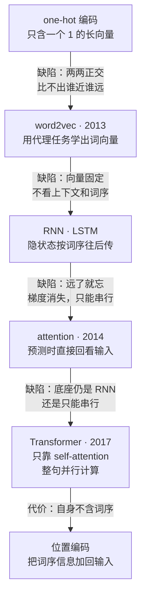
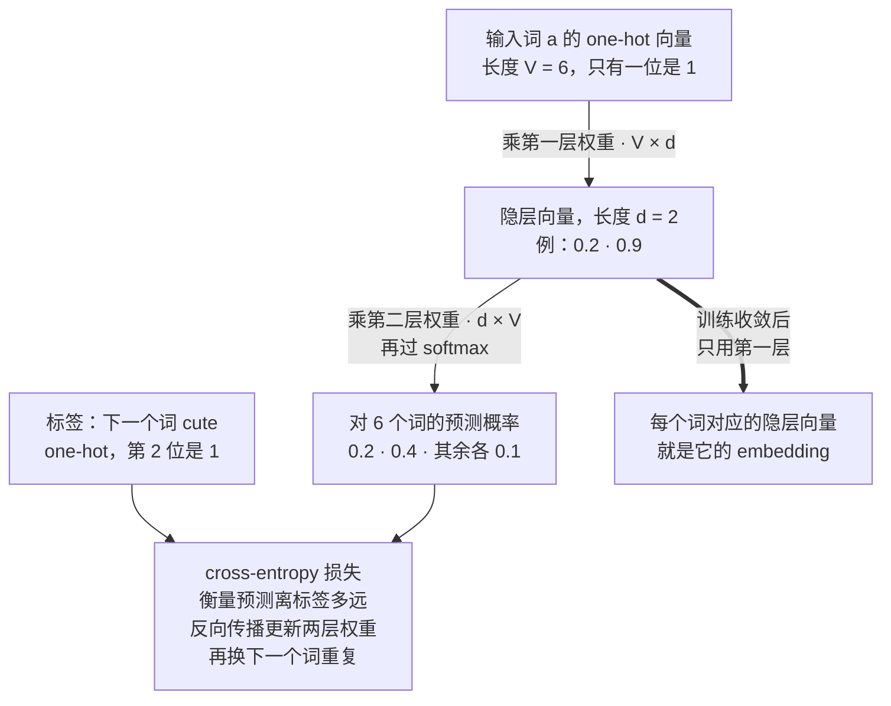
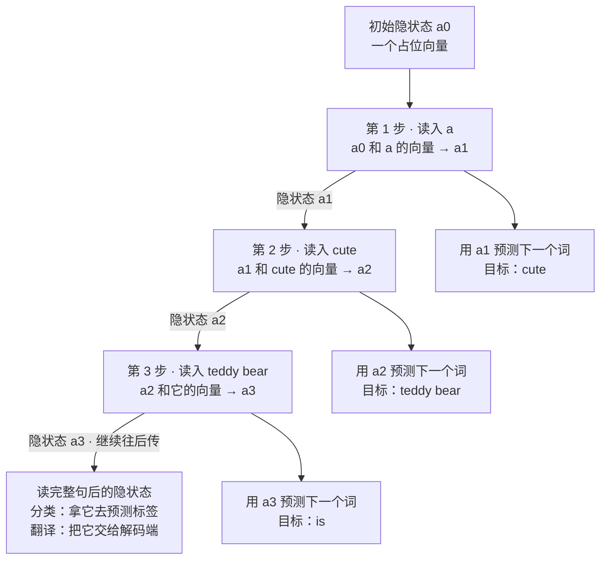
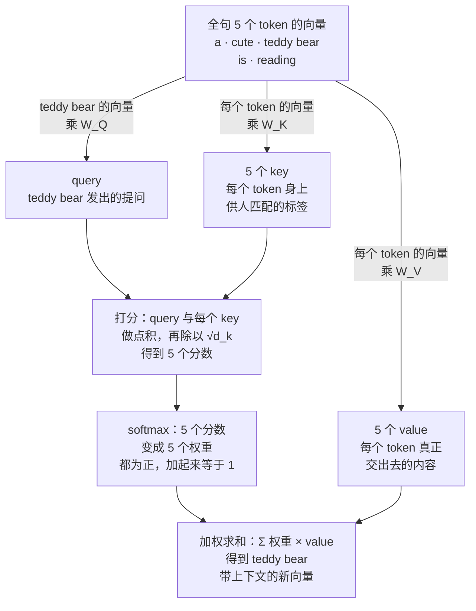
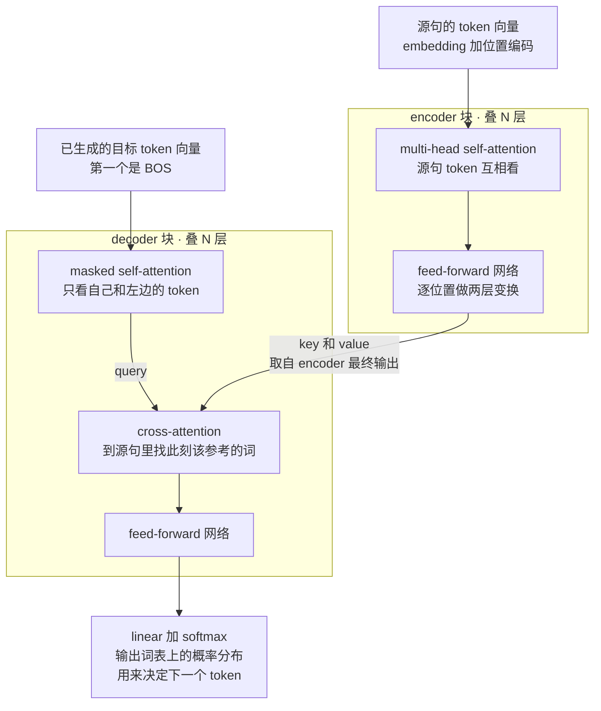
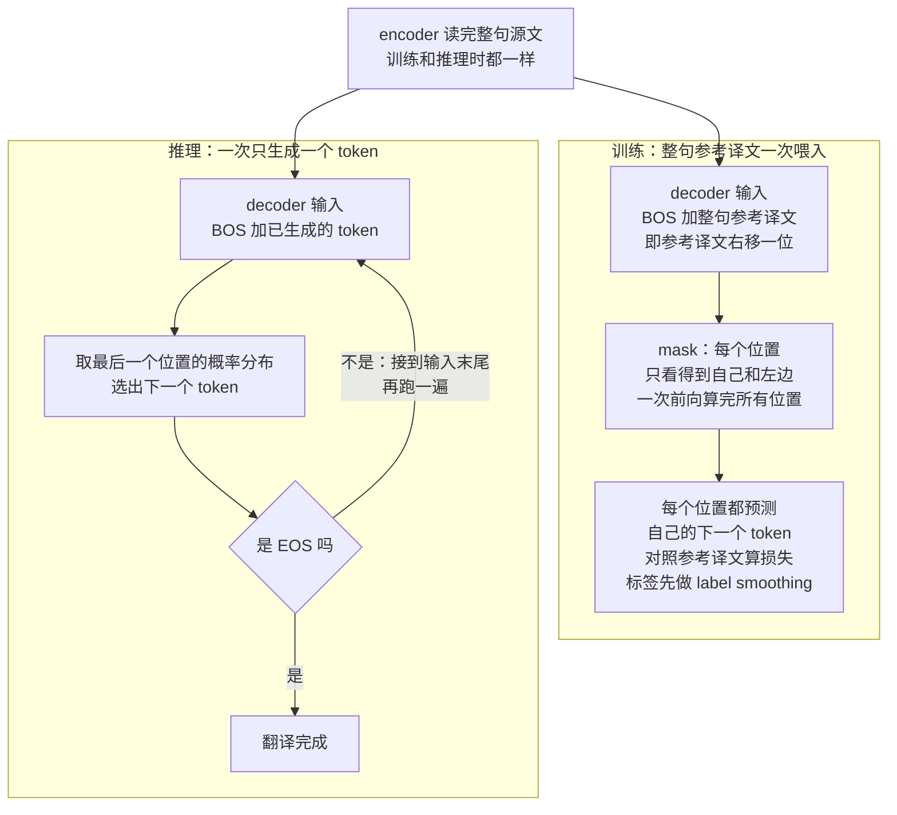

# CME295 第 1 讲｜Transformer

> Stanford CME295: Transformers & Large Language Models（2025 秋）· 第 1 讲，2025 年 9 月 26 日
> 视频：<https://www.youtube.com/watch?v=Ub3GoFaUcds>（1:41:59，自带英文 CC，质量不错，个别词仍有误）
> 讲者：Afshine Amidi（主讲）· Shervine Amidi（1:29:30 起的详细例子）。两人是双胞胎，都毕业于 Centrale Paris，之后一个去 MIT、一个读 Stanford ICME 硕士，又先后在 Uber、Google 任职，现在都在 Netflix 做 LLM
> 课程大纲：<https://cme295.stanford.edu/syllabus/> · 教材是两位讲者自己写的 Super Study Guide: Transformers & Large Language Models，GitHub 上另有浓缩版 VIP cheatsheet（已译成多种语言）

> 小注：大纲页现在挂的是 2026 秋季版课表，讲次和主题已经重排，和这套 2025 秋录像的九讲不一一对应。本笔记里说的“第 N 讲”都指 2025 秋录像的编号。

**一句话**：模型只认数字，所以处理文本的第一步是把它切成 token、再把 token 变成向量；这一讲沿着 one-hot → word2vec → RNN / LSTM → attention 的路线，说明每一步补了上一步的什么缺陷，最后落到 2017 年的 Transformer——丢掉循环结构，让每个 token 通过 query / key / value 直接“看”全句——并用一个英译法的例子，把 encoder–decoder 从输入到输出完整走了一遍。

## 时间轴

| 时间 | 内容 |
|---|---|
| [0:05](https://www.youtube.com/watch?v=Ub3GoFaUcds&t=5s) | 开场：两位讲者的背景；课程由来（workshop → 正式课程）、两个目标、先修要求 |
| [3:54](https://www.youtube.com/watch?v=Ub3GoFaUcds&t=234s) | 课程安排：上课时间、录像、考核方式、教材；问答（不考编程、没有作业） |
| [9:40](https://www.youtube.com/watch?v=Ub3GoFaUcds&t=580s) | 两个提示（幻灯片标出处、缩写多）；NLP 的三类任务 |
| [14:12](https://www.youtube.com/watch?v=Ub3GoFaUcds&t=852s) | 分类：情感分析；accuracy / precision / recall / F1 与类别不平衡 |
| [16:48](https://www.youtube.com/watch?v=Ub3GoFaUcds&t=1008s) | token 级分类：NER，指标按 token 或实体类别统计 |
| [17:50](https://www.youtube.com/watch?v=Ub3GoFaUcds&t=1070s) | 生成：机器翻译与 WMT；BLEU / ROUGE 依赖参考答案；perplexity |
| [21:03](https://www.youtube.com/watch?v=Ub3GoFaUcds&t=1263s) | NLP 简史：RNN → LSTM → word2vec → Transformer → LLM |
| [22:57](https://www.youtube.com/watch?v=Ub3GoFaUcds&t=1377s) | Tokenization：任意切、词级、子词级、字符级各自的得失 |
| [28:27](https://www.youtube.com/watch?v=Ub3GoFaUcds&t=1707s) | 三种切法小结；OOV |
| [30:28](https://www.youtube.com/watch?v=Ub3GoFaUcds&t=1828s) | 词表示：one-hot 编码、cosine similarity，one-hot 为什么不行 |
| [33:13](https://www.youtube.com/watch?v=Ub3GoFaUcds&t=1993s) | 问答：比相似度为什么不看向量长度 |
| [35:39](https://www.youtube.com/watch?v=Ub3GoFaUcds&t=2139s) | 问答：词表该多大，多语言怎么办 |
| [37:49](https://www.youtube.com/watch?v=Ub3GoFaUcds&t=2269s) | word2vec：CBOW、skip-gram 与代理任务的思想 |
| [40:28](https://www.youtube.com/watch?v=Ub3GoFaUcds&t=2428s) | 玩具网络走查：V = 6、d = 2，预测下一个词 |
| [46:34](https://www.youtube.com/watch?v=Ub3GoFaUcds&t=2794s) | 问答：V 是什么、unknown token；何时停训、EOS、隐层维度怎么定；同形异义词 |
| [53:23](https://www.youtube.com/watch?v=Ub3GoFaUcds&t=3203s) | RNN：隐状态逐词传递；三类任务各怎么用 |
| [59:09](https://www.youtube.com/watch?v=Ub3GoFaUcds&t=3549s) | RNN 的毛病：长距离依赖、LSTM 的 cell state、梯度消失 |
| [1:03:17](https://www.youtube.com/watch?v=Ub3GoFaUcds&t=3797s) | 小结：word2vec 与 RNN 各缺什么；RNN 还很慢 |
| [1:04:52](https://www.youtube.com/watch?v=Ub3GoFaUcds&t=3892s) | attention（2014）：预测时直接回看输入 |
| [1:06:47](https://www.youtube.com/watch?v=Ub3GoFaUcds&t=4007s) | Transformer（2017）与 self-attention：每个 token 直连全句 |
| [1:09:02](https://www.youtube.com/watch?v=Ub3GoFaUcds&t=4142s) | query / key / value；写成矩阵，对 GPU 友好 |
| [1:12:12](https://www.youtube.com/watch?v=Ub3GoFaUcds&t=4332s) | 问答：key 和 value 到底是什么 |
| [1:13:53](https://www.youtube.com/watch?v=Ub3GoFaUcds&t=4433s) | 架构：encoder 与 decoder；cross-attention 小测验；masked self-attention |
| [1:20:11](https://www.youtube.com/watch?v=Ub3GoFaUcds&t=4811s) | 位置编码；从输入到输出的高层走查 |
| [1:22:46](https://www.youtube.com/watch?v=Ub3GoFaUcds&t=4966s) | 问答：head 是什么；multi-head 与卷积核的类比 |
| [1:25:23](https://www.youtube.com/watch?v=Ub3GoFaUcds&t=5123s) | label smoothing 及问答 |
| [1:29:53](https://www.youtube.com/watch?v=Ub3GoFaUcds&t=5393s) | 详细例子（Shervine）：切分、BOS / EOS、embedding 加位置编码 |
| [1:31:42](https://www.youtube.com/watch?v=Ub3GoFaUcds&t=5502s) | encoder 的 self-attention：三个投影矩阵、公式逐步解读、为什么除以 √d_k |
| [1:34:56](https://www.youtube.com/watch?v=Ub3GoFaUcds&t=5696s) | multi-head 拼接与 W_O；问答：各 head 为什么不会学成一样 |
| [1:37:31](https://www.youtube.com/watch?v=Ub3GoFaUcds&t=5851s) | FFN 的隐层更宽；encoder、decoder 各叠 N 层 |
| [1:38:36](https://www.youtube.com/watch?v=Ub3GoFaUcds&t=5916s) | 解码：BOS → masked self-attention → cross-attention → FFN → softmax → 回填，直到 EOS |

## 核心内容

### 1. 课程定位与这一讲的主线

*图 1-1｜本讲的主线：每一步都在补上一步的缺陷（自绘示意）· [▶ 看原幻灯片 21:03](https://www.youtube.com/watch?v=Ub3GoFaUcds&t=1263s)*

- **课程由来与目标**：两位讲者 2020 年起专做 NLP（自然语言处理），这门课原本是每年一次的 workshop；ChatGPT 之后需求大涨，2025 年春季第一次作为 Stanford 正式课程开设，这学期是第二次。目标有两个：弄懂让 LLM（large language model，大语言模型）运转起来的底层机制，也就是 Transformer；弄懂 LLM 是怎么训练的、用在哪里。
- **面向谁、要什么基础**：想当 research scientist 或 ML scientist 的人、想在自己的项目里用 LLM 并了解其坑的人、想把 LLM 搬到本领域的外行，都适合。先修只要 ML 基础（知道模型怎么训练、神经网络是什么）和一点线性代数（会矩阵乘法）。考核是期中、期末各 50%，没有作业，不考编程，只考课上的概念。
- **两个阅读提示**：每张幻灯片底部都标了出处，方便顺藤摸瓜；这个领域缩写极多，讲者希望学完后你脑子里有一张“缩写 → 含义”的对照表（本笔记末尾的术语表就是干这个的）。
- **这一讲的主线**（图 1-1）：先把文本切开（tokenization），再把每一块变成向量（embedding）；此后所有的演进，都是为了让这些向量“知道自己的上下文”，同时还要算得快。

### 2. NLP 的三类任务，以及各自怎么评测

NLP 就是对文本做计算。讲者按“输出长什么样”把任务分成三个桶：

| 类别 | 输入 → 输出 | 课上的例子 | 数据 | 指标 |
|---|---|---|---|---|
| classification（分类） | 一段文本 → 一个标签 | 情感分析；意图识别（“帮我定个明天的闹钟”→ 创建闹钟）；语种识别；主题分类 | IMDb 影评、Amazon 商品评论、推文 | accuracy、precision、recall、F1 |
| multi-classification（讲者的叫法） | 一段文本 → 每个 token 一个标签 | NER（命名实体识别，标出哪些词是地点、时间等）；词性标注；依存 / 成分句法分析 | 课上没提 | 同上，但按 token 或按实体类别统计 |
| generation（生成） | 文本 → 长度事先不知道的文本 | 机器翻译；问答（ChatGPT、Gemini 这类助手）；摘要；写代码、写诗 | WMT：成对的双语句子，如欧洲议会的英法、英德语料 | BLEU、ROUGE、perplexity |

- **分类为什么要好几个指标**：accuracy 是预测对的比例；precision 是“预测为正的里面有多少真是正”；recall 是“真正的正例里找回了多少”；F1 是这两者的调和平均。类别极不平衡时（比如 99% 都是正例），一个永远猜多数类的模型 accuracy 也有 99%，却毫无用处，这时就得看 precision 和 recall。
- **生成任务为什么难评**：同一句话有很多种正确译法，成对的数据也更难拿到。BLEU、ROUGE 这类基于规则的指标，都是拿模型输出去和人工写的参考译文（reference）比对，分数越高越好；代价是必须先有参考答案，而标注又贵又慢。讲者预告：借助 LLM，后面可以摆脱参考答案，走向 reference-free 的评测（应在第 8 讲 LLM evaluation）。perplexity 只看模型自己输出的概率，衡量模型对这段文本有多“意外”，越低越好。
  > 小注：讲者说的 multi-classification，更通行的名字是 sequence labeling 或 token classification（序列标注）。BLEU 全称 Bilingual Evaluation Understudy（Papineni et al., 2002），ROUGE 全称 Recall-Oriented Understudy for Gisting Evaluation（Lin, 2004）；讲者顺带调侃这两个名字正好凑成法语的“蓝”和“红”。perplexity 的定义是“每个 token 平均负对数似然”取指数。
- **一段简史**：RNN 的想法 1980 年代就有，LSTM 出现在 1990 年代，但那时既没有互联网规模的数据，也没有足够的算力；2013 年 word2vec 让“有意义的词向量”流行起来；2017 年的 Transformer 论文是今天所有主流模型的地基；此后在算力和数据两头不断放大，就成了 2020 年代的 LLM。

### 3. Tokenization：先决定把文本切成多大的块

- **为什么需要**：模型只能处理数字，所以第一个问题是——一句话该怎么切，才能一块块送进模型？切出来的最小单位叫 token，切的过程叫 tokenization。最随意的做法是按任意单位切；课上的例句 a cute teddy bear is reading 就一直把 teddy bear 整个当成一个 token。更系统的切法有三种：

| 切法 | 好处 | 代价 |
|---|---|---|
| 词级（word-level） | 最简单直观 | bear 和 bears、run 和 runs 被当成毫不相干的两个 token，要各学一个向量，还得想办法让它们相近；词形变化多，词表很大；没见过的词只能标成未知，OOV 风险高 |
| 子词级（subword-level） | 利用词根：bear 和 bears 共用 bear 这个片段；OOV 风险低（仍可能发生） | 序列变长 |
| 字符级（character-level） | 不怕拼写和大小写错误；基本不存在 OOV | 序列长得多，计算慢得多；单个字母的向量很难说代表了什么含义 |

- **序列长度为什么是成本**：模型的计算量随序列长度增长，token 越多，处理越慢。所以切得细并不免费。
- **OOV**（out of vocabulary）：推理时遇到训练时没见过的 token。通常的处理是在词表里留一个 unknown token 的位置，凡是认不出的都映射到它、共用同一个向量——信息就这样丢了。子词切法是“利用词根”和“少撞 OOV”之间的折中，因此成了默认选择。
- **问答：词表该多大**：看任务。只做一种语言（如英语）时，通常是几万的量级；现在的模型要同时覆盖多语言和代码，词表常到几十万。中文等非拉丁文字道理相同，只是基本字符换成了该语言自己的字符。
  > 小注：常见的子词算法有 BPE、WordPiece、Unigram（这一讲没有点名）。Transformer 原论文的英德翻译用的是 BPE，源语言和目标语言共用约 37,000 个 token 的词表，正好落在“几万”这个量级。

### 4. 词表示：从 one-hot 到 word2vec

*图 1-2｜用代理任务学词向量：课上的玩具网络（自绘示意）· [▶ 看原幻灯片 42:13](https://www.youtube.com/watch?v=Ub3GoFaUcds&t=2533s) · 出处：[Mikolov et al., 2013](https://arxiv.org/abs/1301.3781)*

- **one-hot 为什么不行**：最朴素的表示法，是给词表里每个 token 一个长度为 V（词表大小）的向量，只有自己那一位是 1。比如词表只有 soft、teddy bear、book 三个词，它们就是 (1,0,0)、(0,1,0)、(0,0,1)。可我们想要的是“意思相近的 token，向量也相近”，好让模型能比较它们；而 one-hot 向量两两正交，任何两个词的相似度都是 0。理想情况应该是 teddy bear 和 soft 的相似度高，和 book 接近 0。常用的相似度度量是 cosine similarity：

$$
\cos(u,v)=\frac{u\cdot v}{\lVert u\rVert\,\lVert v\rVert}
$$

u、v 是两个 token 的向量，分子是点积，分母是两个向量长度的乘积；结果只反映夹角：同向接近 1（相似），正交为 0（无关），反向为 −1（相反）。

- **问答：为什么不看向量长度**：有学生注意到幻灯片上用的是点积，而不是完整的 cosine。讲者坦言没有特别好的答案：这些都只是度量方式，没有哪个完美；通常关心的是方向（夹角），长度里有没有信息，要看向量是怎么训出来的；直接用点积的也有。
- **word2vec（2013）的思路：用代理任务学向量**。不再人为指定向量，而是从大量文本里学。办法是设一个 proxy task（代理任务）：CBOW（continuous bag of words）用周围的词预测中间的目标词，skip-gram 反过来，用目标词预测周围的词。预测得准不准并不是目的；关键在于，一个能根据上下文猜词的模型，必然已经掌握了语言的某些规律，而这些规律就沉淀在它学到的向量里。它当年出名，是因为学出的向量可以直观解读：king 之于 queen，Paris 之于 France 正如 Berlin 之于 Germany。
- **玩具例子**（图 1-2，代理任务简化成“预测下一个词”）：词表 6 个词，隐层维度 d = 2。输入 a 的 one-hot，乘第一层权重得到隐层向量 (0.2, 0.9)，再乘第二层权重、过 softmax，得到 6 个词的概率。真实的下一个词是词表里的第 2 个词 cute，于是拿预测和它的 one-hot 标签算 cross-entropy 损失（衡量预测离标签多远），再用反向传播（backpropagation：算出损失对每个权重的梯度，顺着它逐层修正权重）让预测向标签靠拢。接着输入 cute、目标 teddy bear，如此遍历全部文本。训练完，一个词的 embedding 就是它的 one-hot 乘第一层权重得到的隐层向量，相当于从权重矩阵里取出属于它的那一行。
    - softmax：把一组任意实数变成一组都为正、总和为 1 的数（先取指数，再各自除以总和），可以当概率用。后面 attention 里还会用到。
    - d 远小于 V：V 是几万到几十万，d 通常只有几百（讲者举的例子是 768）。
- **问答**
    - 何时停止训练：盯着代理任务的损失随 epoch（完整过一遍训练集算一个 epoch）的变化，收敛了就可以停；但代理任务不是最终目的，最后还得看下游任务的效果。
    - 隐层维度怎么定：是权衡。下游任务越复杂，需要的向量越大；向量越大，计算量、延迟和成本越高。实践中靠经验和前人的结果，量级在几百到几千。
    - 生成什么时候停：词表里有特殊 token，模型生成出 EOS（end of sequence）就停。
- **留下的缺陷**：每个 token 只有一个固定向量，和它出现在哪句话里无关，也不含词序。学生举的例子是 bank——“河岸”和“银行”拼写相同、意思不同，word2vec 分不开。讲者说，这正是后面要解决的问题：让表示带上上下文。
  > 小注：真实的 word2vec 训练的是 CBOW 或 skip-gram，并不是预测下一个词；后者是讲者为了举例做的简化（他自己也说明了）。真正以“预测下一个 token”为训练目标的是后面的 LLM 预训练（应在第 4 讲 LLM training 展开）。

### 5. RNN 与 LSTM：有了词序，却记不远、跑不快

*图 1-3｜RNN 按词序展开：第一个词的信息要穿过每一步的隐状态，才能影响到后面（自绘示意）· [▶ 看原幻灯片 54:56](https://www.youtube.com/watch?v=Ub3GoFaUcds&t=3296s)*

- **为什么需要**：有了词向量，怎么表示一整句话？最简单是把词向量取平均，可这样词序就丢了，每个词的向量也仍然和上下文无关。RNN（recurrent neural network，循环神经网络）就是为“按顺序读”而设计的。
- **怎么工作**（图 1-3）：维护一个隐状态（hidden state，记作 a 或 h，也叫 activation 或 context vector），可以理解成“到目前为止读过的内容的摘要”。每一步，RNN 单元接收上一步的隐状态和当前 token 的向量，做几次矩阵乘法，输出新的隐状态，并可以用它预测下一个词。一句话就这样从左到右、一个 token 一个 token 地读完。
- **三类任务怎么用**：分类——取读完最后一个 token 后的隐状态，投影到标签空间；token 级分类——取每个 token 位置上的表示，分别投影；生成——先把源文本整个读完，把最后的隐状态（此时叫 context vector）交给解码端，由它逐词生成输出。
- **三个毛病**（这也是今天很少再听到 RNN 的原因）
    1. 长距离依赖（long-range dependency）：整句话的意思只能挤在一个隐状态向量里，读得越远，早先的信息越容易被冲掉。LSTM（long short-term memory）在隐状态之外多维护一个 cell state（记作 c），专门留住值得记住的东西；有改善，但仍不完美。
    2. 梯度消失（vanishing gradient）：梯度是损失对参数的导数，决定每个参数该往哪边改、改多少。训练时，最后一步的误差要沿时间一路传回第一步，见下式。
    3. 慢：要算第 t 步，必须先算完前面所有步的隐状态，无法并行；序列一长，训练就非常久。

$$
\frac{\partial \mathcal{L}_T}{\partial a_1}=\frac{\partial \mathcal{L}_T}{\partial a_T}\,\prod_{t=2}^{T}\frac{\partial a_t}{\partial a_{t-1}}
$$

L_T 是最后一步预测的损失，a_t 是第 t 步的隐状态；误差从第 T 步传回第 1 步，要连乘 T−1 个“相邻两步隐状态之间的导数”。这些因子普遍小于 1，乘积就趋于 0，靠前的部分几乎得不到更新（梯度消失）；普遍大于 1，则越乘越大（梯度爆炸）。课上只讲了这个直觉，没有写推导，这里用的是标准的链式法则形式。

> 小注：RNN 每一步用的是同一组权重（recurrent 指的就是同一个单元被反复套用），所以连乘的是一串性质相近的因子，才会一边倒地趋于 0 或发散——这一点课上没有明说。LSTM 应为 Hochreiter & Schmidhuber（1997）。

### 6. 从 attention 到 self-attention：query、key、value

*图 1-4｜self-attention 怎样算出一个 token 的新表示（自绘示意）· [▶ 看原幻灯片 1:09:37](https://www.youtube.com/watch?v=Ub3GoFaUcds&t=4177s) · 出处：[Vaswani et al., 2017](https://arxiv.org/abs/1706.03762)*

- **attention（2014）要解决什么**：用 RNN 做翻译时，解码端生成每个词，都只能依赖那一个 context vector。直觉上，要写出译文的下一个词，最好能直接“瞄一眼”原文里对应的那部分。attention 就是在“当前要预测的东西”和“输入的每个位置”之间建立直连，信息不必再穿过长长的隐状态链，长距离依赖的问题因此缓解。
- **Transformer（2017）更进一步**：论文标题 Attention Is All You Need 已经表明态度——干脆不要循环结构，让每个 token 同时、直接地连到句中所有 token，这就是 self-attention（自注意力，“自”指一句话内部自己对自己做 attention）。作者在机器翻译上做实验，效果很好。
  > 小注：2014 年的那篇应为 [Bahdanau et al., 2014](https://arxiv.org/abs/1409.0473)，它把定长向量称为 encoder–decoder 翻译模型的瓶颈，让模型在生成每个目标词时自动去源句里搜索相关部分。Transformer 论文摘要里的成绩：WMT 2014 英德 28.4 BLEU、英法 41.8 BLEU，后者只在 8 块 GPU 上训练了 3.5 天。
- **query / key / value 各是什么**（图 1-4）：想用句中其他 token 来表达某个 token（比如 teddy bear），就让它发出一个 query（提问）；句中每个 token 各有一个 key（供人匹配的标签）和一个 value（真正交出去的内容）。拿 query 和每个 key 比相似度，得到一组权重，再按权重对所有 value 求加权平均，结果就是 teddy bear 的新表示。
    - 可以想成一次“软”查字典：普通字典只返回完全匹配的那一条；attention 则按匹配程度，把所有条目的内容混合后返回。（这个类比是笔记加的。）
    - 三者都不是人为设定的：把 token 的向量分别乘上三个投影矩阵 W_Q、W_K、W_V 就得到它们，而这三个矩阵是模型学出来的。
    - 这样算出的表示因句而异：bank 在“河岸”和“抢银行”两句话里会得到不同的向量，第 4 节留下的问题就此解决。
- **写成矩阵，一次算完整句**：把所有 token 的 query、key、value 分别堆成矩阵 Q、K、V，整句的 self-attention 就是几次矩阵乘法。讲者强调这正合硬件的胃口——GPU 最擅长的就是矩阵运算。

$$
\mathrm{Attention}(Q,K,V)=\mathrm{softmax}\!\left(\frac{QK^{\top}}{\sqrt{d_k}}\right)V
$$

Q、K、V 分别是 query、key、value 组成的矩阵，每行对应一个 token；d_k 是 key 向量的维度；softmax 按行做。

- **逐步读这个式子**（Shervine 在详细例子里的讲法）
    1. 输入是 n × d_model 的矩阵 X：n 个 token，每个是 d_model 维的向量。Q = XW_Q，K = XW_K，V = XW_V。
    2. QK^T 是 n × n 的矩阵：第 i 行是第 i 个 query 和所有 key 的点积，也就是 token i 给每个 token 打的原始分。
    3. 除以 √d_k，再按行做 softmax：每一行变成一个概率分布，即 token i 分给各个 token 的注意力权重。
    4. 乘 V：每一行得到 value 的加权和，就是 token i 的新表示。
- **为什么要除以 √d_k**：点积的数值会随向量维度变大而变大，需要拉回来。顺带一提，query 要和 key 做点积，所以两者维度必须相等（d_q = d_k）。
  > 小注：原论文的解释更具体——假设 q、k 的各个分量相互独立、均值 0、方差 1，那么点积的方差就是 d_k；数值过大时 softmax 会落进梯度极小的区域，所以用 1/√d_k 把它缩回去。

### 7. Transformer 架构：encoder、decoder 与三处 attention

*图 1-5｜encoder 块与 decoder 块的接线，以及两者之间唯一的通道 cross-attention（自绘示意）· [▶ 看原幻灯片 1:13:53](https://www.youtube.com/watch?v=Ub3GoFaUcds&t=4433s) · 出处：[Vaswani et al., 2017](https://arxiv.org/abs/1706.03762)*

- **两半各管什么**：原论文做的是翻译。encoder（编码器，原论文架构图的左半）读源语言句子，输出每个源 token 带上下文的表示；decoder（解码器，右半）一个 token 一个 token 地写出目标语言。
- **encoder 块**：一层 multi-head self-attention（源句所有 token 互相看），再接一层 feed-forward 网络（FFN）。
- **decoder 块**：三个子层。
    1. masked self-attention：在已经译出的 token 之间做 self-attention，弄清“已译出的哪些词对预测下一个词有用”。叫 masked（带掩码），是因为只许看自己和左边——右边的词还没生成，无从看起。这种只看过去的 attention 也叫 causal（因果）。
    2. cross-attention：query 来自 decoder（上一子层的输出），key 和 value 来自 encoder 的输出。讲者在课上让大家猜 decoder 那根箭头是 Q、K、V 里的哪一个——是 query，因为此刻在提问的是 decoder：原文里哪些词和我现在要写的词有关？
    3. FFN。
- **输出**：最后一层 decoder 的输出经过 linear 投影加 softmax，变成一个长度等于词表大小的概率向量，用来决定下一个 token。

| attention 的位置 | query 来自 | key、value 来自 | 能看到什么 |
|---|---|---|---|
| encoder 的 self-attention | 源句 | 源句 | 源句的全部 token |
| decoder 的 masked self-attention | 已生成的译文 | 已生成的译文 | 自己和左边的 token |
| decoder 的 cross-attention | decoder | encoder 的最终输出 | 源句的全部 token |

- **multi-head**（多头）：同一套 attention 计算并行做 h 次，每次用一组各自学出来的投影矩阵（一组 W_Q、W_K、W_V 就叫一个 head）；把 h 个结果按列拼起来，再乘一个输出矩阵 W_O，投影回原来的维度 d_model。目的是多给模型一些自由度，让不同的 head 学到 token 之间不同类型的关联。讲者的类比：像 CNN 里同一层放多个卷积核。

$$
\mathrm{MultiHead}(X)=\mathrm{Concat}(\mathrm{head}_1,\dots,\mathrm{head}_h)\,W_O,\qquad \mathrm{head}_i=\mathrm{Attention}\big(XW_Q^{(i)},\,XW_K^{(i)},\,XW_V^{(i)}\big)
$$

X 是输入的 token 矩阵，h 是 head 的个数，上标 (i) 表示第 i 个 head 自己的那组投影矩阵，W_O 把拼接后的结果投影回 d_model 维。

- **问答：各个 head 会不会学成一样**：没有任何约束强制它们不同，靠的是梯度下降——训练目标是把下一个词预测好，重复学同一种关联没有收益，实践中各 head 会收敛到不同的表示。也有论文专门研究给 head 加约束会怎样。
- **FFN 在干什么**：对每个位置的向量单独做一次两层的全连接变换。和 word2vec 的小隐层相反，这里的隐层比输入输出更宽，为的是给模型更多自由度，学出更丰富的特征。
- **叠 N 层**：encoder 块和 decoder 块各重复 N 次；最后一层 encoder 的输出，送进每一层 decoder 的 cross-attention。
- **位置编码**（position encoding）：self-attention 是直连，不像 RNN 那样按顺序读，模型本身并不知道谁在前谁在后。所以要在 token 的 embedding 上再加一个表示位置的向量；原论文用一组正弦、余弦函数生成它，和 embedding 逐元素相加。讲者说今天不展开（推断：留给第 2 讲）。
  > 小注：原论文 base 模型的配置是 N = 6、d_model = 512、h = 8（每个 head 的 d_k = d_v = 64）、FFN 隐层 d_ff = 2048；课上随口举的 768 是后来 BERT-base 的维度。另外，原架构里每个子层外面都包着 residual connection 加 layer normalization，即 LayerNorm(x + Sublayer(x))，这一讲没有讲到。

### 8. 端到端走一遍：训练和推理时数据怎么流

*图 1-6｜同一个 encoder–decoder，训练时并行、推理时逐词循环；推理一侧是课上讲的，训练一侧按原论文补充（自绘示意）· [▶ 看原幻灯片 1:38:36](https://www.youtube.com/watch?v=Ub3GoFaUcds&t=5916s) · 出处：[Vaswani et al., 2017](https://arxiv.org/abs/1706.03762)*

- **输入侧**（例句 a cute teddy bear is reading）：先切成 token，首尾加上 BOS（begin of sequence）和 EOS（end of sequence）两个特殊 token；每个 token 查到自己学出来的 embedding，加上位置编码，整句就成了一个 n × d_model 的矩阵。
- **encoder**：矩阵依次穿过 N 个 encoder 块（self-attention → FFN），出来的是每个源 token 带上下文的表示，形状不变。
- **decoder 的推理循环**（图 1-6 的推理一侧）：从只含 BOS 的序列开始。BOS 先过 masked self-attention（此时只有它自己可看），其输出作为 query 进 cross-attention 去查 encoder 的输出，再过 FFN；这样走完 N 层，经 linear 加 softmax 得到词表上的概率分布，选出第一个词。把它接到 decoder 输入的末尾，再跑一遍，得到下一个词……直到生成 EOS。课上的例句最后译成 un ours en peluche mignon lit。
  > 小注：课上只讲了推理时的逐词循环。训练时并不循环（图 1-6 的训练一侧，按原论文补充）：把“BOS 加参考译文”整句一次喂给 decoder，相当于参考译文右移一位；mask 保证每个位置只看得到左边，于是所有位置的“下一个词”可以在一次前向里并行预测、一起算损失。这才是 mask 不可或缺的地方，也是 Transformer 训练比 RNN 快的原因。至于怎样从概率分布里选词，课上没有展开（推断：采样策略留给后面的课）。
- **label smoothing**（标签平滑）：原论文用的一个训练技巧。动机是，语言里“下一个词”往往不止一个正确答案（what a great 后面接 day、lecture、book 都说得通），而 one-hot 标签却要求模型把 100% 的概率押在一个词上。做法是把标签改软：

$$
y_k=\begin{cases}1-\varepsilon, & k=c\\[4pt] \dfrac{\varepsilon}{V-1}, & k\neq c\end{cases}
$$

y_k 是训练标签在词表第 k 个 token 上的取值，c 是真实的下一个 token 的编号，ε 是一个小常数，V 是词表大小。

- **效果与问答**：模型被训练得不那么笃定，而作者观察到 BLEU 反而更好。问答里有学生联想到 explore / exploit，还有一问听不清，从回答推断是：softmax 的输出本来就不是 0 和 1，这不是已经“免费”做到了吗？讲者澄清：softmax 管的是模型的输出，label smoothing 改的是拿来和输出比较的标签，也就是训练目标本身，两者不是一回事。
  > 小注：label smoothing 应出自 [Szegedy et al., 2015](https://arxiv.org/abs/1512.00567)，原式是 (1−ε)·δ + ε·u(k)，其中 δ 是 one-hot，u(k) 是标签上的一个先验分布，通常取均匀分布——学生问到的幻灯片上的 u 应该就是它（推断）；和讲者口述的版本只差在真实类别是否也分到一份 ε。Transformer 论文取 ε = 0.1，并说明这会让 perplexity 变差，但 accuracy 和 BLEU 变好。

## 关键图表速查（点时间戳跳到原幻灯片）

| 图 | 看什么 | 跳转 | 出处 |
|---|---|---|---|
| NLP 简史时间线 | 80 年代 RNN → 90 年代 LSTM → 2013 word2vec → 2017 Transformer → 2020 年代 LLM；早年的瓶颈是数据和算力 | [21:03](https://www.youtube.com/watch?v=Ub3GoFaUcds&t=1263s) | 课程自制 |
| 三种 tokenizer 的优缺点小结 | 词级、子词级、字符级各自的 pro 和 con；OOV 风险和序列长度此消彼长 | [28:27](https://www.youtube.com/watch?v=Ub3GoFaUcds&t=1707s) | 课程自制 |
| one-hot 的相似度对比理想的相似度 | 一边全是 0（两两正交），另一边 teddy bear 与 soft 高、与 book 低 | [32:42](https://www.youtube.com/watch?v=Ub3GoFaUcds&t=1962s) | 课程自制 |
| word2vec 玩具网络 | V = 6、d = 2 的两层网络逐词走查；讲者说的“绿色单元”就是最后留下来的 embedding | [42:13](https://www.youtube.com/watch?v=Ub3GoFaUcds&t=2533s) | [word2vec](https://arxiv.org/abs/1301.3781) |
| RNN 展开图 | 隐状态沿时间步往后传；每步的蓝色模块吃进“上一个隐状态加当前词” | [54:56](https://www.youtube.com/watch?v=Ub3GoFaUcds&t=3296s) | 课程自制 |
| RNN 用于三类任务 | 分类取最后的隐状态；token 级分类取各位置；生成把最后的隐状态交给解码端 | [58:02](https://www.youtube.com/watch?v=Ub3GoFaUcds&t=3482s) | 课程自制 |
| attention 的直连 | 译文每生成一个词，都有连线直接指回原文的相关位置，不再只靠一个 context vector | [1:05:24](https://www.youtube.com/watch?v=Ub3GoFaUcds&t=3924s) | 应出自 [Bahdanau et al., 2014](https://arxiv.org/abs/1409.0473) |
| self-attention：teddy bear 连向全句 | 一个 token 同时和句中所有 token 直接相连，中间不经过任何隐状态 | [1:08:01](https://www.youtube.com/watch?v=Ub3GoFaUcds&t=4081s) | [Vaswani et al., 2017](https://arxiv.org/abs/1706.03762) |
| query / key / value 与矩阵公式 | query 去和每个 key 比，按相似度加权取 value；整句写成 softmax(QK^T)V | [1:09:37](https://www.youtube.com/watch?v=Ub3GoFaUcds&t=4177s) | 同上 |
| Transformer 架构全图 | 左 encoder 右 decoder；找出三处 attention，以及从 encoder 指向 decoder 的两根箭头（key 和 value） | [1:16:33](https://www.youtube.com/watch?v=Ub3GoFaUcds&t=4593s) | 同上 |
| label smoothing | one-hot 标签被改成 1−ε 与 ε/(V−1) | [1:26:26](https://www.youtube.com/watch?v=Ub3GoFaUcds&t=5186s) | 应出自 [Szegedy et al., 2015](https://arxiv.org/abs/1512.00567) |
| QK^T 矩阵逐行解读 | Q 的每行是一个 query，K^T 的每列是一个 key；乘积第 i 行就是 token i 对所有 token 的打分 | [1:32:46](https://www.youtube.com/watch?v=Ub3GoFaUcds&t=5566s) | [Vaswani et al., 2017](https://arxiv.org/abs/1706.03762) |
| h 个 head 拼接再乘 W_O | h 份输出按列拼起来，W_O 把它投影回 d_model 维 | [1:34:56](https://www.youtube.com/watch?v=Ub3GoFaUcds&t=5696s) | 同上 |
| 解码循环 | BOS 进 decoder → 概率分布 → 选词 → 回填到输入 → 直到 EOS | [1:39:06](https://www.youtube.com/watch?v=Ub3GoFaUcds&t=5946s) | 同上 |

## 提到的工作

| 名称 | 在本讲里的作用 |
|---|---|
| Transformer：[Attention Is All You Need](https://arxiv.org/abs/1706.03762)（Vaswani et al., 2017） | 本讲主角：self-attention、encoder–decoder 架构、multi-head、位置编码、label smoothing |
| [word2vec](https://arxiv.org/abs/1301.3781)（Mikolov et al., 2013）：CBOW 与 skip-gram | 用代理任务学词向量的代表作；king–queen 类比 |
| RNN（1980 年代） | 按词序逐个处理、靠隐状态记忆的序列模型；Transformer 要取代的对象 |
| LSTM（应为 Hochreiter & Schmidhuber, 1997） | 给 RNN 加 cell state，缓解遗忘 |
| attention（2014；应为 [Bahdanau et al.](https://arxiv.org/abs/1409.0473)） | 在 RNN 翻译模型上让解码端直接回看输入；self-attention 的前身 |
| label smoothing（应出自 [Szegedy et al., 2015](https://arxiv.org/abs/1512.00567)） | Transformer 论文用的训练技巧 |
| accuracy / precision / recall / F1 | 分类任务的指标 |
| BLEU / ROUGE / perplexity | 生成任务的传统指标；前两者依赖参考答案 |
| WMT（Workshop on Machine Translation）、欧洲议会语料 | 机器翻译的标准平行语料；Transformer 的实验数据 |
| IMDb、Amazon reviews、推文（X posts） | 情感分类常用数据 |
| ChatGPT、Gemini | 问答 / 助手类生成任务的例子；ChatGPT（2022）带火了这门课 |
| CNN 的多个卷积核 | 理解 multi-head 的类比 |
| Super Study Guide、VIP cheatsheet | 课程教材与速查表（讲者自著） |

## 术语对照

| English | 中文 |
|---|---|
| NLP (natural language processing) | 自然语言处理 |
| NER (named entity recognition) | 命名实体识别：标出文本里的地点、时间、人名等 |
| part-of-speech tagging | 词性标注 |
| dependency / constituency parsing | 依存 / 成分句法分析 |
| precision / recall / F1 | 精确率 / 召回率 / 两者的调和平均 |
| reference-based / reference-free metric | 需要 / 不需要参考答案的指标 |
| perplexity | 困惑度：模型对文本有多“意外”，越低越好 |
| token / tokenization / tokenizer | 词元（文本切分后的最小单位）/ 切分 / 切分器 |
| subword | 子词：比词小、比字符大的片段 |
| vocabulary | 词表：模型认识的全部 token |
| OOV (out of vocabulary) | 未登录词：训练时没见过的 token |
| one-hot encoding (OHE) | 独热编码 |
| embedding | 嵌入：token 对应的稠密向量 |
| cosine similarity | 余弦相似度 |
| proxy task | 代理任务：目的不在任务本身，而在顺带学到的表示 |
| CBOW / skip-gram | 用上下文预测中心词 / 用中心词预测上下文 |
| softmax | 把一组实数变成概率分布的函数 |
| cross-entropy | 交叉熵：衡量预测分布离标签多远的损失 |
| backpropagation | 反向传播 |
| epoch | 完整过一遍训练集 |
| downstream task | 下游任务：学到的表示最终要服务的任务 |
| RNN (recurrent neural network) | 循环神经网络 |
| hidden state / context vector | 隐状态 / 上下文向量 |
| LSTM (long short-term memory) / cell state | 长短期记忆网络 / 细胞状态 |
| long-range dependency | 长距离依赖 |
| vanishing / exploding gradient | 梯度消失 / 梯度爆炸 |
| backpropagation through time | 沿时间反向传播 |
| attention / self-attention | 注意力 / 自注意力 |
| query / key / value | 查询 / 键 / 值 |
| projection matrix | 投影矩阵 |
| encoder / decoder | 编码器 / 解码器 |
| multi-head attention / head | 多头注意力 / 头 |
| masked (causal) self-attention | 带掩码的（因果）自注意力：只看自己和左边 |
| cross-attention | 交叉注意力：decoder 去查 encoder 的输出 |
| feed-forward network (FFN) | 前馈网络 |
| position encoding | 位置编码 |
| BOS / EOS | 序列开始 / 序列结束的特殊 token |
| label smoothing | 标签平滑 |

## 字幕勘误

这一讲的 CC 整体可靠，值得留意的只有几处：“Under Study” → Understudy（BLEU 全称的最后一个词）；1:08:58 主讲人问时间时喊的名字被写成 “Afshine”，应为 Shervine（发问的正是 Afshine 本人）；1:34 前后的 “has the dimension” → as the dimension（意思是“随着维度变大”）；1:35 前后的 “each times” → h times（做 h 次，h 是 head 数）；1:38 前后的 “setups encoded” → set of encoded（推断）；51:55 前后的 “a pool of” → 应为 a couple of（推断）。另外 multi-classification 确实是讲者的原话，不是识别错误（通行叫法见第 2 节小注）。

## 带走的问题

1. QK^T 是 n × n 的矩阵。序列长度翻倍，self-attention 的计算量和显存怎么变？回头看第 3 节，这对“子词还是字符级”的取舍意味着什么？
2. 假如去掉位置编码，再把输入句子的 token 顺序打乱，encoder 的输出会怎样变化？由此说明位置编码补上的到底是什么。
3. 今天的 LLM 大多只有 decoder，没有 encoder，也没有 cross-attention。那“原文”（提示词）放在哪里，由哪一种 attention 负责读它？（推断：第 2、3 讲讲到各类 Transformer 模型时会回答）
4. 训练时 decoder 看到的是参考译文，推理时看到的是自己生成的 token。这种不一致会带来什么问题？mask 在训练和推理中各起什么作用？
5. label smoothing 让 BLEU 变好，却让 perplexity 变差，两个指标为什么会朝相反方向动？讲者对“各 head 不会学成一样”的解释是梯度下降没有动力去重复——这个论证充分吗，如果很多 head 其实是冗余的，意味着什么？
