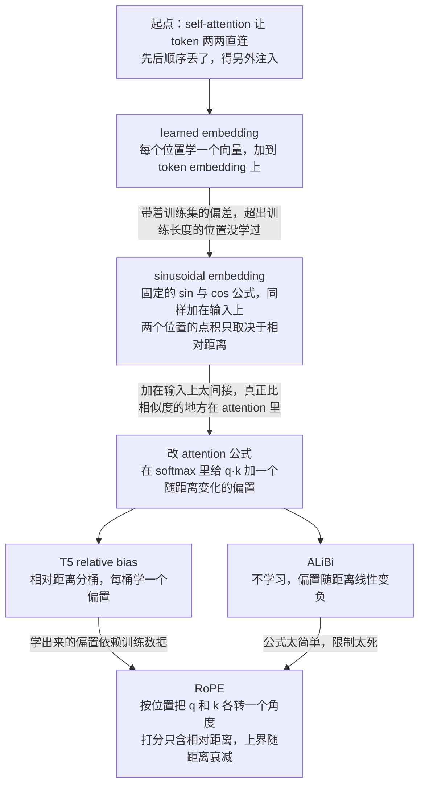
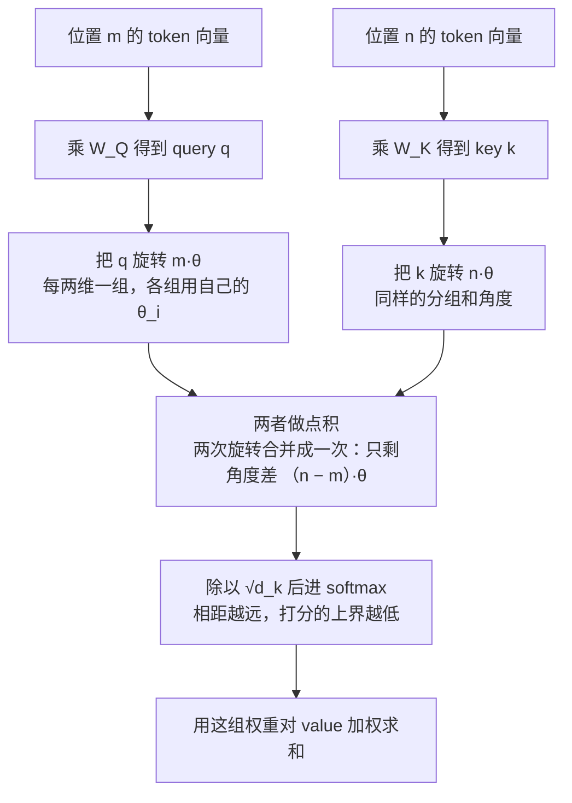
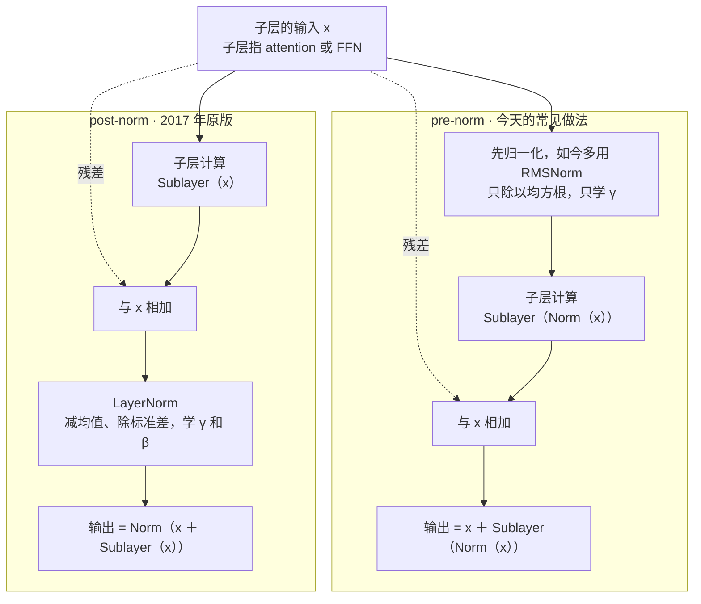
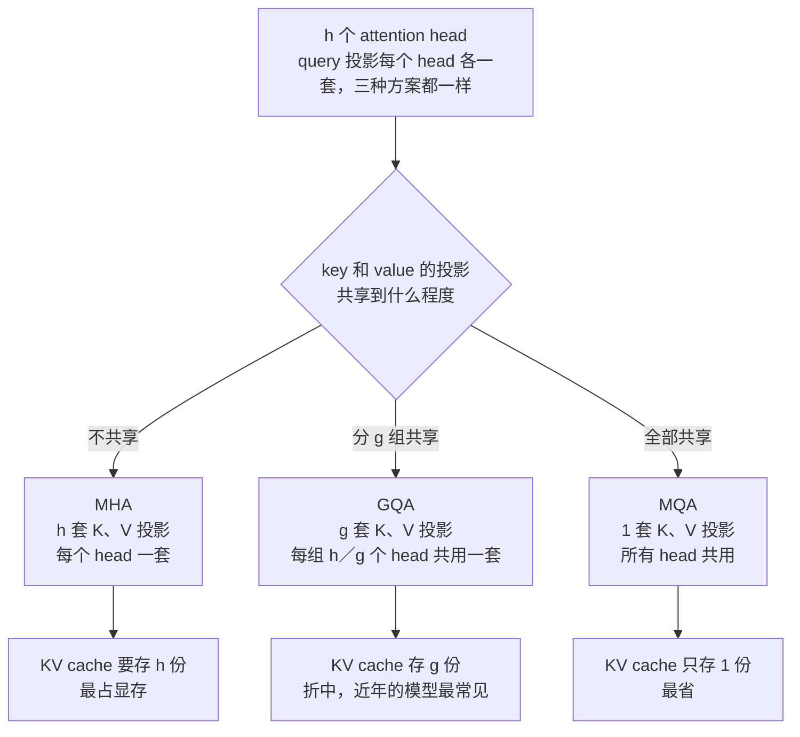
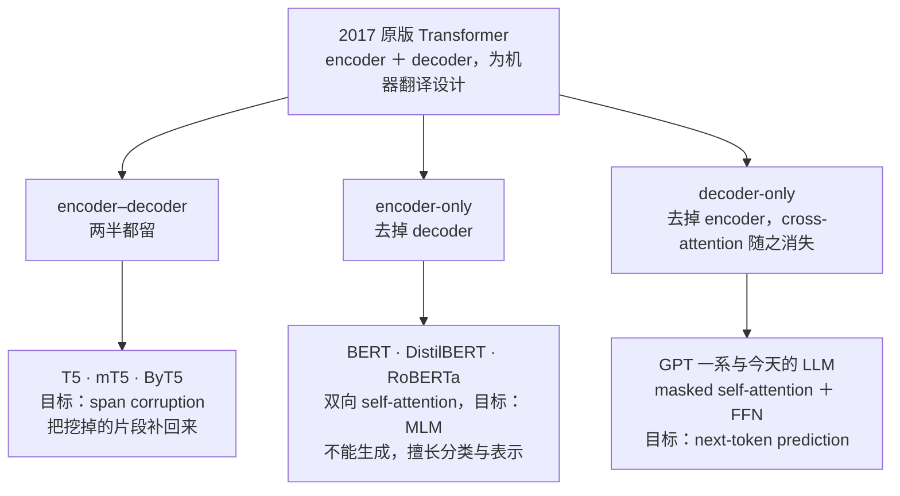
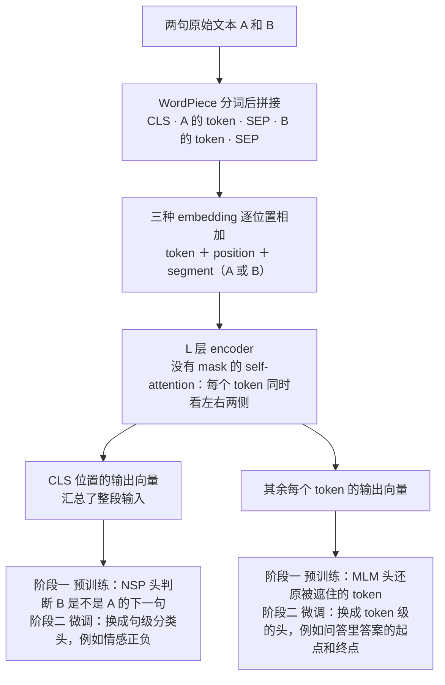

# CME295 第 2 讲｜Transformer 系模型与技巧（Transformer-Based Models & Tricks）

> Stanford CME295: Transformers & Large Language Models（2025 秋）· 第 2 讲，2025 年 10 月 3 日
> 视频：<https://www.youtube.com/watch?v=yT84Y5zCnaA>（1:47:19，自带英文字幕，质量不错，仍有少量专名和近音词识别错误）
> 讲者：Afshine Amidi（前一小时：位置嵌入、归一化、attention 变体）· Shervine Amidi（后 45 分钟：模型谱系与 BERT）
> 课程大纲：<https://cme295.stanford.edu/syllabus/>

**一句话**：2017 年的 Transformer 骨架至今没变，换过的是三个部件和一种"只留一半"的用法——位置信息从"加在输入上的向量"搬进了 attention 内部（T5 bias、ALiBi，直到今天几乎通用的 RoPE）；归一化从 post-norm LayerNorm 变成 pre-norm RMSNorm；attention 用 sliding window 压 O(n²)，用 GQA / MQA 共享 K、V 投影来压 KV cache。模型则分成 encoder–decoder（T5）、encoder-only（BERT）和 decoder-only（今天的 LLM）三支；后半场把 BERT 的输入构造、MLM + NSP 预训练、微调，以及 DistilBERT、RoBERTa 两个改进讲透。

## 时间轴

| 时间 | 内容 |
|---|---|
| [0:06](https://www.youtube.com/watch?v=yT84Y5zCnaA&t=6s) | 开场：换了录音设置；期末考试日期待定 |
| [1:30](https://www.youtube.com/watch?v=yT84Y5zCnaA&t=90s) | 回顾第 1 讲：self-attention 公式、encoder–decoder 架构 |
| [3:44](https://www.youtube.com/watch?v=yT84Y5zCnaA&t=224s) | multi-head 再解释：每个 head 一套投影；attention map 的例子；问答 |
| [9:32](https://www.youtube.com/watch?v=yT84Y5zCnaA&t=572s) | 本讲结构：前半讲变过的部件，后半讲模型谱系 |
| [10:37](https://www.youtube.com/watch?v=yT84Y5zCnaA&t=637s) | 位置嵌入总览：为什么需要；learned embedding 及其两个局限 |
| [15:36](https://www.youtube.com/watch?v=yT84Y5zCnaA&t=936s) | sinusoidal embedding：公式；点积只取决于相对距离 |
| [22:50](https://www.youtube.com/watch?v=yT84Y5zCnaA&t=1370s) | 位置向量热力图：低维高频、高维低频；和 learned 效果相当但能外推 |
| [25:56](https://www.youtube.com/watch?v=yT84Y5zCnaA&t=1556s) | 为什么把位置信息搬进 attention 公式；T5 bias、ALiBi |
| [31:02](https://www.youtube.com/watch?v=yT84Y5zCnaA&t=1862s) | RoPE：把 query 和 key 各转一个角度 |
| [32:59](https://www.youtube.com/watch?v=yT84Y5zCnaA&t=1979s) | 黑板推导：旋转矩阵确实把向量转了 θ 角 |
| [37:13](https://www.youtube.com/watch?v=yT84Y5zCnaA&t=2233s) | RoPE 的两个好处：打分只含相对距离、长程衰减 |
| [40:39](https://www.youtube.com/watch?v=yT84Y5zCnaA&t=2439s) | 问答：θ 是什么、怎么推广到 d 维、衰减曲线的来历 |
| [43:42](https://www.youtube.com/watch?v=yT84Y5zCnaA&t=2622s) | Layer normalization：Add & Norm、LayerNorm 的公式 |
| [46:00](https://www.youtube.com/watch?v=yT84Y5zCnaA&t=2760s) | post-norm → pre-norm；LayerNorm → RMSNorm |
| [48:13](https://www.youtube.com/watch?v=yT84Y5zCnaA&t=2893s) | 问答：归一化的直觉；和 BatchNorm 的区别 |
| [50:39](https://www.youtube.com/watch?v=yT84Y5zCnaA&t=3039s) | 稀疏注意力：O(n²)、Longformer、问答（实现上怎么省） |
| [53:07](https://www.youtube.com/watch?v=yT84Y5zCnaA&t=3187s) | sliding window；局部层与全局层交替；Mistral 与感受野类比 |
| [55:38](https://www.youtube.com/watch?v=yT84Y5zCnaA&t=3338s) | 共享注意力头：为什么共享的是 K、V；和 KV cache 的关系 |
| [58:29](https://www.youtube.com/watch?v=yT84Y5zCnaA&t=3509s) | MQA、GQA、MHA 三档 |
| [1:00:00](https://www.youtube.com/watch?v=yT84Y5zCnaA&t=3600s) | 问答：用在哪些 attention 层；怎么选 |
| [1:02:42](https://www.youtube.com/watch?v=yT84Y5zCnaA&t=3762s) | 换 Shervine：encoder–decoder 一支与 T5 家族 |
| [1:04:45](https://www.youtube.com/watch?v=yT84Y5zCnaA&t=3885s) | T5 的训练目标：span corruption 与 sentinel token |
| [1:07:58](https://www.youtube.com/watch?v=yT84Y5zCnaA&t=4078s) | encoder-only：不能生成，但表示可用于分类 |
| [1:09:33](https://www.youtube.com/watch?v=yT84Y5zCnaA&t=4173s) | decoder-only：cross-attention 消失；为什么它成了主流 |
| [1:11:38](https://www.youtube.com/watch?v=yT84Y5zCnaA&t=4298s) | BERT 深入：名字的含义、双向性 |
| [1:13:50](https://www.youtube.com/watch?v=yT84Y5zCnaA&t=4430s) | 同年的 ELMo；芝麻街式的命名 |
| [1:15:54](https://www.youtube.com/watch?v=yT84Y5zCnaA&t=4554s) | [CLS] 与 [SEP]；两阶段训练：预训练（MLM + NSP）与微调 |
| [1:20:17](https://www.youtube.com/watch?v=yT84Y5zCnaA&t=4817s) | 这套方法的优缺点 |
| [1:22:19](https://www.youtube.com/watch?v=yT84Y5zCnaA&t=4939s) | 从 Transformer 到 BERT：WordPiece、特殊 token |
| [1:25:30](https://www.youtube.com/watch?v=yT84Y5zCnaA&t=5130s) | 输入 embedding：token + position + segment；问答 |
| [1:29:02](https://www.youtube.com/watch?v=yT84Y5zCnaA&t=5342s) | MLM 的 80 / 10 / 10；NSP |
| [1:31:06](https://www.youtube.com/watch?v=yT84Y5zCnaA&t=5466s) | 论文记号 L / H / A；cased 与 uncased；参数量级 |
| [1:33:24](https://www.youtube.com/watch?v=yT84Y5zCnaA&t=5604s) | 微调：分类头、冻结还是全量；情感分类与问答两个例子 |
| [1:34:56](https://www.youtube.com/watch?v=yT84Y5zCnaA&t=5696s) | 例子走查：一句话的情感分类从头到尾 |
| [1:38:21](https://www.youtube.com/watch?v=yT84Y5zCnaA&t=5901s) | 问答：分类头是什么；为什么只用 [CLS]；[CLS] 的 Q、K、V |
| [1:41:26](https://www.youtube.com/watch?v=yT84Y5zCnaA&t=6086s) | BERT 的价值与三个局限 |
| [1:43:30](https://www.youtube.com/watch?v=yT84Y5zCnaA&t=6210s) | 蒸馏与 DistilBERT |
| [1:46:18](https://www.youtube.com/watch?v=yT84Y5zCnaA&t=6378s) | RoBERTa；下课 |

## 核心内容

### 1. 回顾与本讲地图：骨架没变，换过的是部件

- **回顾 self-attention**：每个 token 拿自己的 query 去和所有 token 的 key 比相似度，再按相似度对 value 加权求和（公式见第 1 讲）。整件事就是几次大矩阵乘法，正好是硬件最擅长的运算。
- **multi-head 到底是什么**（上节课被问得最多）：每个 head 是一套独立的 Q、K、V 投影矩阵，相当于多给模型一次机会，去学"按什么标准找相关的词"。讲者用原论文附录里的 attention map 举例：看 its 这个词的 query 和哪些 key 的点积大，被点亮的是 law 和 application——正是 its 指代和修饰的对象；不同 head 点亮的侧重不一样。
- **问答**：各个 head 走的是不同的 MLP 吗？不是 MLP，是各自的投影矩阵。所有 head 并行计算，各出一个结果，拼接起来再过一次输出投影。整个过程只有投影、矩阵乘法和 softmax，高度并行。
- **本讲地图**：讲者的判断是，2017 年的架构出人意料地耐用，今天的模型大体上都还建在它上面，只有少数部件变了。前一小时逐个讲变过的三个部件，后 45 分钟讲模型谱系并深入 BERT。下表是全讲的索引：

| 部件 | 2017 原版 | 今天常见的做法 | 课上给的理由 |
|---|---|---|---|
| 位置信息 | sinusoidal 或 learned 向量，加在输入上 | RoPE，作用在 attention 的 q、k 上 | 让相对距离直接进入打分 |
| 归一化 | post-norm + LayerNorm | pre-norm + RMSNorm | RMSNorm 效果相当、参数更少、更快；挪位置的原因课上没展开 |
| attention | 全局；每个 head 一套 K、V 投影 | 局部层与全局层交替；GQA 共享 K、V | 压 O(n²) 的计算；压 KV cache |
| 整体结构 | encoder–decoder | decoder-only | 算力投在 decoder 上最划算；next-token 目标最容易放大 |

### 2. 位置嵌入（上）：从"加在输入上"到"写进 attention 公式"

*图 2-1｜位置信息注入方式的演进：每一步在补上一步的什么短板（自绘示意）· [▶ 看原幻灯片 10:37](https://www.youtube.com/watch?v=yT84Y5zCnaA&t=637s)*

- **为什么需要**：RNN 一个一个地处理 token，先后顺序天然就在计算过程里；self-attention 让所有 token 两两直连，"谁在前谁在后"这条信息丢了。所以得把"第几个位置"变成某种数值信号，再注入模型。
- **做法一：learned position embedding**。给每个位置配一个可训练的向量，和 token embedding 相加，用梯度下降学出来。好处是交给数据自己学。两个局限：一是学到什么取决于训练集——如果训练文本里第 2 个位置总出现某类内容，这种偏差会被学进去；二是只能学到训练时见过的最大长度（比如 512），推理时超出的位置没有向量可用。
- **做法二：sinusoidal embedding**。同样是每个位置一个 d_model 维的向量（要和 token embedding 相加，维度必须一致），但不学，直接按公式算：

$$
PE_{(m,\,2i)}=\sin(\omega_i m),\qquad PE_{(m,\,2i+1)}=\cos(\omega_i m),\qquad \omega_i=10000^{-2i/d_{\mathrm{model}}}
$$

m 是位置，i 是"第几对维度"，ω_i 是这对维度的频率：i 小则频率高，i 大则频率低。

- **为什么偏偏是 sin 和 cos**：我们想要的性质是"离得近的位置更相似"，而在 embedding 的世界里衡量相似靠点积（cosine similarity 就是点积除以两个模长）。把两个位置的向量做点积，逐对维度套用 cos(a − b) = cos a · cos b + sin a · sin b：

$$
PE_m\cdot PE_n=\sum_{i}\big[\sin(\omega_i m)\sin(\omega_i n)+\cos(\omega_i m)\cos(\omega_i n)\big]=\sum_{i}\cos\big(\omega_i(m-n)\big)
$$

PE_m、PE_n 是位置 m、n 的向量；右边说明两者的相似度只取决于相对距离 m − n，并且在 m = n 时最大（每一项都是 cos 0 = 1）。

- 讲者自己补了一句：cos 是周期函数，"越远越不相似"并不严格单调，只是大趋势。
- **热力图怎么读**：纵轴是位置（约 50 个），横轴是向量的各个维度。低维的值随位置快速上下摆动（高频），高维变化很慢（低频），对应 ω_i 随 i 增大而减小。
- 原论文两种做法都试过，效果相当；sinusoidal 的优势是任意长度的位置向量都算得出来，不受训练长度限制。
- **到 2025 年还在用吗**：讲者的回答是"算是"。"远的 token 应该不如近的相似"这个想法留下了，注入方式变了。理由：真正比较 token 相似度的地方是 attention 层里的 q·k，把位置向量加在最底层的输入上，对那里的影响是间接的。更直接的做法是改 attention 公式本身，在 softmax 里面加一个与相对位置有关的偏置：

$$
\mathrm{Attention}(Q,K,V)=\mathrm{softmax}\!\left(\frac{QK^{\top}}{\sqrt{d_k}}+B\right)V,\qquad B_{mn}=b(m-n)
$$

B 是一个偏置矩阵，第 m 行第 n 列的值只由相对距离 m − n 决定；其余符号同第 1 讲。

- **两种偏置**
    - *T5 relative position bias*：把 m − n 分桶，每个桶学一个标量偏置。
    - *ALiBi*（出自 Train Short, Test Long 一文）：不学习，用一个关于相对距离的确定公式，离得越远偏置越负。
    > 小注：ALiBi 的具体形式是"负的斜率 × 相对距离"，每个 head 一个固定斜率（按等比数列取，不训练）；BLOOM、MPT 用的就是它。
- **问答**：往 softmax 里加偏置，会不会破坏"概率加起来等于 1"？不会。softmax 里面放什么都行，它最后都会归一化；把偏置理解成"离得越远就越负"的一项即可。
- **两者的不足，引出 RoPE**：学出来的偏置仍然依赖训练数据的分布（训练时和推理时，"近的 token 怎么个相似法"可能不同）；ALiBi 没有可学的部分，但只是距离的一个简单函数，限制太死。

### 3. 位置嵌入（下）：RoPE——把 query 和 key 各转一个角度

*图 2-2｜RoPE 的数据流：位置不再加在输入上，而是在 attention 里转 q 和 k（自绘示意）· [▶ 看原幻灯片 31:19](https://www.youtube.com/watch?v=yT84Y5zCnaA&t=1879s) · 出处：[Su et al., 2021](https://arxiv.org/abs/2104.09864)*

- **做法**：先看二维的情形。位置 m 的 query 旋转一个与 m 成正比的角度，位置 n 的 key 旋转一个与 n 成正比的角度，然后照常做点积。旋转就是左乘一个 2 × 2 的旋转矩阵。
- **黑板上的小证明**：把二维向量写成"模长 r 乘以 (cos φ, sin φ)"，左乘旋转矩阵后用和角公式整理，得到"r 乘以 (cos(θ+φ), sin(θ+φ))"——模长不变，角度多了 θ，所以这个矩阵确实是"转 θ 角"。中间的乘法讲者留作练习。

$$
R_{\theta}=\begin{pmatrix}\cos\theta & -\sin\theta\\ \sin\theta & \cos\theta\end{pmatrix},\qquad (R_{m\theta}\,q)^{\top}(R_{n\theta}\,k)=q^{\top}R_{(n-m)\theta}\,k
$$

R_θ 是旋转 θ 角的矩阵，q、k 是位置 m、n 上的 query 和 key；等式说的是：两边各转各的，点积里只剩下角度差 (n − m)θ。

- **好处一：打分只含相对距离**。这正是 sinusoidal 那一节想要的性质，但这次它直接出现在 attention 的打分里，不用再隔着好几层间接起作用。对照上一节末尾的两个不足：它没有要学的位置参数，谈不上过拟合训练集；形式上又不像 ALiBi 那样只是距离的一条直线。
- **好处二：长程衰减**。RoFormer 论文的附录证明：q·k 打分的上界随相对距离增大而下降。曲线带着小幅振荡，并不完美，但趋势是"越远、上界越低"，和"近的更相关"的直觉一致。
- **问答**
    - θ 是学出来的吗？不是，是固定的。d 维向量被切成 d/2 个二维小块，第 i 块用自己的 θ_i；θ_i 是 i 和 d 的函数，和前面 sinusoidal 的 ω_i 大致是同一个东西。
    - 维度对得上吗？整体的旋转矩阵是 d × d 的，和 q、k 的维度一致，矩阵乘法才成立。
    - 衰减曲线怎么来的？是数学上推出来的上界，不是实验曲线；推导在论文附录，课上不展开。
- 讲者在这部分花的时间最多，理由是：今天大多数模型都用 RoPE，而它的直觉并不显然；前面 sinusoidal 那段三角恒等式就是在为它铺路。
    > 小注：RoFormer 里 θ_i = 10000^(−2(i−1)/d)，i 从 1 到 d/2，和 sinusoidal 的频率是同一组；整体旋转矩阵是按二维小块排成的块对角阵。RoPE 在每一层 attention 里作用于 q 和 k，value 不旋转，输入上也不再加位置向量。LLaMA、Qwen、Mistral、DeepSeek 等模型都用它；因为位置藏在角度里，后来的长上下文扩展方法（position interpolation、YaRN 等）都是在缩放这些角度上做文章。

### 4. 归一化：post-norm LayerNorm → pre-norm RMSNorm

*图 2-3｜归一化放在哪：post-norm 与 pre-norm 的数据流对比（自绘示意）· [▶ 看原幻灯片 46:00](https://www.youtube.com/watch?v=yT84Y5zCnaA&t=2760s)*

- **原版的 Add & Norm**：每个子层（attention 或 FFN）后面，把子层的输入和输出相加，再做 LayerNorm。作用是让训练更稳、收敛更快。
- **LayerNorm 做什么**：对单个向量，减去它各分量的均值、除以标准差，把分量拉回一个规范的范围；再乘一个可学的缩放 γ、加一个可学的平移 β。

$$
\mathrm{LayerNorm}(x)=\gamma\odot\frac{x-\mu}{\sigma}+\beta,\qquad \mathrm{RMSNorm}(x)=\gamma\odot\frac{x}{\sqrt{\tfrac{1}{d}\sum_{j=1}^{d}x_j^{2}}}
$$

x 是一个 d 维的激活向量，μ 和 σ 是它 d 个分量的均值与标准差，γ、β 是可学的逐维缩放和平移，⊙ 表示逐元素相乘。

- **变化一：位置从 post-norm 挪到 pre-norm**。原版是 Norm(x + Sublayer(x))；现在是 x + Sublayer(Norm(x))，归一化放在向量进入子层之前。
    > 小注：为什么要挪，课上没展开。通常的解释是：pre-norm 下残差支路从输入到输出是一条不被归一化打断的通路，深层网络的梯度更稳；[Xiong et al., 2020](https://arxiv.org/abs/2002.04745) 分析过 post-norm 离不开学习率 warmup，而 pre-norm 可以不用。GPT-2 起就已经是 pre-norm。
- **变化二：LayerNorm 换成 RMSNorm**。不减均值，只除以各分量的均方根，也只学 γ。收敛性质相当，但要学的参数更少、算得更快。
- **问答：归一化的直觉**。层与层之间流动的向量叫 activation。它在不同层、不同分量上可能忽大忽小，变化太剧烈时各层的权重就很难学；归一化把它拉回一个不太离谱的范围。讲者给了一个可以去查的关键词：internal covariate shift。
    > 小注：这个词出自 BatchNorm 原论文（Ioffe & Szegedy, 2015）。后来 [Santurkar et al., 2018](https://arxiv.org/abs/1805.11604) 认为归一化起作用主要是因为让优化曲面更平滑，原来的解释至今有争议——把它当成查资料的入口就好。
- **问答：和 BatchNorm 的区别**。BatchNorm 沿另一个维度归一化：对同一个分量，跨 batch 里的其他样本来算均值和方差。Transformer 系模型普遍用 LayerNorm，一是经验上更好，二是 BatchNorm 依赖 batch，会造成训练和推理时的不一致。

### 5. 稀疏注意力：用局部窗口压 O(n²)

- **问题**：self-attention 让 n 个 token 两两交互，交互矩阵是 n × n，计算量 O(n²)，序列一长就吃不消。目标是在不掉效果的前提下，把它近似成更便宜的形式。
- **Longformer（2020）**：限制 attention 的作用范围——每个 token 只和自己邻域里的 token 交互。今天这种局部 attention 一般叫 sliding window attention。
- **问答**：是不是先算完整个 attention 矩阵，再把窗口外的部分遮掉？那样就什么也没省。实际的实现会用分块（tiling）之类的技巧，压根不去算那个巨大的 n × n 矩阵，只算需要的部分。
    > 小注：tiling 这个词最出名的出处是 [FlashAttention](https://arxiv.org/abs/2205.14135)（Dao et al., 2022）：把 Q、K、V 切块、逐块计算，不把 n × n 矩阵整个放进显存。它算的是精确的 attention，和"只看窗口"是两件可以叠加的事。
- **今天的用法**：有些层用 local attention，有些层用 global attention，交替堆叠；比例因模型而异，没有固定配方。幻灯片上的窗口画得很小，真实模型里的窗口在几千 token 的量级。
- **感受野的类比**（学生问这像不像卷积）：以 Mistral 为例，它每一层都是 sliding window。单看一层，token 只能看到窗口内的邻居；但邻居在上一层又看过自己的邻居，信息就这样逐层向远处传。问"这个 token 实际上和哪些 token 发生过交互"，和 CV 里问"这个输出值看到了哪些输入像素"是同一个问题，也就是 receptive field。
    > 小注：[Mistral 7B](https://arxiv.org/abs/2310.06825) 论文里窗口 W = 4096、共 32 层，信息每层最多前进 W 个 token，理论上的注意力跨度约 131K。层间交替的例子：Gemma 2 是 local 与 global 隔层交替，Gemma 3 提高到 5 层 local 配 1 层 global，以压 KV cache。

### 6. 共享注意力头：MHA、GQA、MQA

*图 2-4｜MHA、GQA、MQA 的区别只在 K、V 投影共享到什么程度（自绘示意）· [▶ 看原幻灯片 58:29](https://www.youtube.com/watch?v=yT84Y5zCnaA&t=3509s) · 出处：[Ainslie et al., 2023](https://arxiv.org/abs/2305.13245)*

- **做什么**：和上一节正交的另一种省法——不再让每个 head 都有自己的 K、V 投影矩阵，而是让若干个 head 共用一套；query 的投影仍然每个 head 一套。
- **为什么共享的是 K、V 而不是 Q**：直觉上，query 是在"发问"，保留多种问法有好处。更核心的原因在解码：每生成一个新 token，都要让它去 attend 此前的所有 token，于是前面那些 token 的 key 和 value 会被一遍遍用到。第 3 讲要讲的 KV cache 就是把这些 key、value 存起来免得重算，而我们不希望这个缓存太大。head 之间共享 K、V 投影，要存的份数就少了，省的是显存。
- **三档**：MHA（每个 head 各一套，即原版）、GQA（h 个 head 分成 g 组，每组 h/g 个 head 共用一套）、MQA（所有 head 共用一套，最极端）。
    > 小注：KV cache 的大小约等于 2 × 层数 × KV head 数 × 每个 head 的维度 × 序列长度 × 每个数的字节数，所以 KV head 数砍到几分之一，缓存就小到几分之一。例：Llama 2 70B 是 64 个 query head 配 8 个 KV head，Mistral 7B 是 32 配 8。MQA 出自 [Shazeer, 2019](https://arxiv.org/abs/1911.02150)。
- **问答**
    - self-attention 和 cross-attention 都能用吗？技术上任何 attention 层都能用；但它主要在 decoder 的 masked self-attention 上起作用，而今天的 LLM 本来就是 decoder-only。
    - 该选哪个？看效果、看对延迟和成本有多敏感、看模型多大、输入多长，没有标准答案。不过近年的模型多数在共享，GQA 最常见，但也不是全部。

### 7. 模型谱系：encoder–decoder、encoder-only、decoder-only

*图 2-5｜从原版 Transformer 分出的三支：留下哪一半、用什么目标训练（自绘示意）· [▶ 看原幻灯片 1:02:42](https://www.youtube.com/watch?v=yT84Y5zCnaA&t=3762s)*

- **encoder–decoder**：原版之后，这一支的代表是 T5 家族。T5 的名字来自一串 T：Text-to-Text Transfer Transformer。mT5 是多语言版（训练数据和词表都为多语言重做）；ByT5 干脆不要 tokenizer，直接在字节上操作，词表从约 3 万缩到 2^8 = 256。
- **T5 的训练目标：span corruption**。原版 Transformer 的 decoder 做的是 next-token prediction；T5 换了目标：把输入句子里的若干片段（每段一个或多个 token）挖掉，各用一个 sentinel token 占位，交给 encoder；decoder 依次输出"第一个 sentinel、它对应的原文、第二个 sentinel、它对应的原文……"，以多出来的最后一个 sentinel 收尾。比如输入 `my teddy bear [X] reading`，目标就是 `[X] is cute and [Y]`。训练时用 teacher forcing：整个目标序列一次喂给 decoder，所有位置并行预测。
    > 小注：T5 论文的默认设置是挖掉 15% 的 token、片段平均长 3 个 token；词表是 32k 的 SentencePiece。mT5 覆盖 101 种语言。
- **encoder-only**：把 decoder 整个去掉。代价是不能生成文本——讲者说这恰恰是重点：encoder 输出的表示拿来做分类类任务（情感分类、token 级分类），这些事过去要靠各自专门的模型。代表是 BERT，以及它的两个改进 DistilBERT、RoBERTa。
- **decoder-only**：把 encoder 去掉。没有 encoder 的输出可供 cross-attention，这个模块也就一并消失，每个 block 只剩 masked self-attention 和 FFN。
- **为什么最后是 decoder-only 胜出**：早期的假设是 encoder 对得到好的表示很重要，所以完整的 encoder–decoder 更流行；后来大家发现，同样的算力预算投在 decoder-only 上最划算。它的训练目标 next-token prediction 也最简单、最容易放大和泛化——span corruption 还得专门去挖空，更"定制"；而且"接着往下写"和今天的主要应用（聊天助手）天然对齐。这一支留到后面几讲。

### 8. BERT（上）：输入怎么拼，预训练学什么

*图 2-6｜BERT 的输入构造，以及两个阶段各在输出上接什么头（自绘示意）· [▶ 看原幻灯片 1:22:19](https://www.youtube.com/watch?v=yT84Y5zCnaA&t=4939s) · 出处：[Devlin et al., 2018](https://arxiv.org/abs/1810.04805)*

- **名字**：Bidirectional Encoder Representations from Transformers。Encoder 好理解，就是 Transformer 去掉 decoder 的那一半。Bidirectional 指的是：encoder 的 self-attention 没有 mask，每个 token 的输出表示同时看过左右两侧的全部 token；GPT 那一支用 causal mask，每个 token 只能看自己和之前的 token。BERT 论文花了不少篇幅强调这个区别。
- **同年的 ELMo**：用多层双向 LSTM 同样得到了双向的、带上下文的词表示，想法很新，但带着 RNN 的老问题——循环结构难以放大，于是被同年出现的 Transformer 系工作盖过了风头。（ELMo 和 BERT 都是《芝麻街》里的角色，讲者顺便调侃了研究者凑缩写的爱好。）
- **三个特殊 token**：[CLS] 放在序列最前面，是个占位符，它的输出向量会汇总整段输入的信息，专门拿去做分类；[SEP] 用来分隔两句话；[PAD] 把序列补到固定长度，因为训练按 batch 进行，batch 是定长的矩阵。
- **tokenizer**：WordPiece——在训练语料上学一套合并规则，朝着使语料似然最大的方向把小单元逐步合并成词表项，词表约 3 万。讲者顺带给了量级感：这类模型的词表一般在 10^4 到 10^5 之间，ByT5 的 256 是特例。
- **输入是三种 embedding 相加**：token embedding（查表）、position embedding（前面讲过的）、新引入的 segment embedding。后者只有两个可学向量：第一句的 token 都加 A，第二句的都加 B。作者的假设是它有助于判断句子的先后关系；讲者预告，这个假设后来受到了挑战。
    > 小注：讲者说他"不太确定"BERT 的 position embedding 是不是写死的公式——实际是 learned 的绝对位置向量，位置表只有 512 个，上下文也就封顶在 512。
- **预训练目标一：MLM（masked language model）**。随机选出一部分 token 作为预测对象：其中 80% 换成 [MASK]，10% 保持原样，10% 换成一个随机的词；模型要在这些位置还原出原来的 token。要猜一个被遮住的词就得看它左右两边的上下文，双向 attention 正是为此服务的。
    > 小注：BERT 论文里被选作预测对象的 token 占 15%。之所以不全换成 [MASK]，是因为微调和使用时输入里根本没有 [MASK]，全换会让预训练和下游对不上。
- **预训练目标二：NSP（next sentence prediction）**。从语料里取两句话拼在一起，一半情况下它们确实前后相连，另一半不是；在 [CLS] 的输出上接一个分类头，判断 B 是不是 A 的下一句。学生问：预测下一句，不是 decoder 的活吗？——这里不生成任何东西，只是二分类。
- 两个目标的标签都能从无标注文本里自动构造出来（哪两句相邻、哪个词被遮住，自己都知道），所以是自监督。
- **论文记号与规模**：BERT 论文把层数记作 L（原版的 N）、embedding 维度记作 H（即 d_model）、head 数记作 A（即 h）。Hugging Face 上的 BERT 常见 cased 和 uncased 两种版本，区别在预处理时是否统一转成小写。参数量在 1 亿上下。讲者推荐把这篇论文和 Attention Is All You Need 一起读，他印象中它的引用数在 17 万左右。
    > 小注：BERT-base 是 L=12、H=768、A=12，约 1.1 亿参数；BERT-large 是 L=24、H=1024、A=16，约 3.4 亿。讲者回忆说"原版 Transformer 是 12 层"，这一点记岔了：原版 base 的 encoder 和 decoder 各 6 层；BERT-base 的尺寸是照着 GPT-1 定的，方便对比。

### 9. BERT（下）：微调、例子走查与问答

- **微调**：保留预训练好的 encoder，在上面接一个很小的任务头（线性层或一个小 FFN），用少量标注数据训练。可以冻结预训练权重、只训练新加的头，也可以全部一起训——取决于愿意花多少算力，以及目标任务和预训练任务差多远。
    > 小注：BERT 论文里默认的微调方式是所有参数一起更新；冻结 encoder、只把输出当特征用的做法，论文在 NER 上试过，效果略低但接近。"预训练 → 微调"这条流水线也是第 4、5 讲 LLM 训练与调优的原型。
- **两类下游任务**：句级分类（如情感），只用 [CLS] 的输出；token 级任务（如抽取式问答），给每个 token 的输出都接上头，预测它是不是答案的起点、是不是终点。
- **例子走查**：给 "this teddy bear is so cute" 做情感分类（uncased 版本）。转小写 → WordPiece 切分 → 前面加 [CLS]、后面加 [SEP]，再用 [PAD] 补齐 → 每个位置的 token、position、segment 三个向量相加 → 过 encoder → 只取 [CLS] 的输出向量 → 接分类头，输出正面或负面。
- **问答**
    - 分类头具体是什么？从输出 embedding 的维度映射到任务类别（如正、负）的小网络；带一个隐藏层的话就是两个矩阵。
    - 为什么把其他 token 的输出都扔掉？句级分类里只是约定用 [CLS]：经过多层 self-attention，其他 token 的信息已经混进了它的表示。换成 token 级任务，每个输出都要用。
    - [CLS] 的 Q、K、V 怎么来？和其他 token 完全一样：它有自己的 embedding，同样被投影成 q、k、v 参与 attention。把它当成一个普通 token 就行。
- **优点**：预训练只要无标注文本；得到的是带上下文的 embedding（ELMo 也是）；微调只需要很少的标注数据和很少的新参数，当年就超过了各任务的 SOTA；换个头就能做任意分类任务。讲者说，业界今天做情感检测这类分类任务，用 BERT 类模型仍然很常见。
- **缺点**：不能做生成；"预训练 + 微调"的两段式流程，相比一次训练到位的传统方法是额外的负担。
- **三个局限**：上下文只有 512（可以借前半场的局部 attention 等技巧去扩）；BERT-base 有 1.1 亿参数，延迟偏高，能不能更小更快？MLM 和 NSP 两个目标真的都有用吗，能不能简化？后两个问题分别引出 DistilBERT 和 RoBERTa。

### 10. 两个改进：DistilBERT 与 RoBERTa

- **蒸馏（distillation）的想法**：讲者引了 Hinton、Vinyals、Dean 的一个观点——模型输出的整个概率分布（soft targets）几乎装着它学到的全部知识，比只有对错的硬标签信息量大得多。于是有了 teacher–student 的做法：让小模型（student）去拟合大模型（teacher）的输出分布，而不是直接拟合硬标签。损失函数用 KL 散度：

$$
\mathrm{KL}\big(y_T\,\|\,y_S\big)=\sum_{c} y_{T,c}\,\log\frac{y_{T,c}}{y_{S,c}}
$$

y_T、y_S 是 teacher 和 student 在各类别 c 上的输出概率；讲者的解读是：在一个由 teacher 描述的世界里，用 student 来建模有多糟。

- 一个有意思的特例：如果 y_T 退化成 one-hot 的硬标签，KL 就变回普通的交叉熵 −log y_S。
    > 小注：Hinton 等人的蒸馏论文还引入了 temperature：把 logits 除以大于 1 的 T 再做 softmax，让分布更"软"，小概率类别里的信息才不会被淹没；DistilBERT 沿用了这一点。
- **DistilBERT**：把层数减半，再用蒸馏把效果保住，结果性能几乎不掉。讲者评价这篇论文只有几页，影响却很大。
    > 小注：DistilBERT 摘要里的数字是体积小 40%、快 60%、保留 97% 的语言理解能力。训练时除了蒸馏损失，还保留了 MLM 损失，并加了一个对齐隐藏向量方向的 cosine 损失；student 用 teacher 每隔一层的权重来初始化。
- **RoBERTa**：实验发现去掉 NSP 几乎不掉点，于是直接去掉；把遮盖改成动态的，同一段文本每个 epoch 换一种遮法；并指出 BERT 其实训练得远远不够，于是加大数据的规模和多样性，同样的 benchmark 上成绩明显提高。
    > 小注：RoBERTa 摘要的结论是 BERT 训练得严重不足，调好之后能追平或超过此后发表的各个模型；论文里数据从 16GB 加到 160GB，同时用了更大的 batch 和更长的训练。

## 关键图表速查（点时间戳跳到原幻灯片）

| 图 | 看什么 | 跳转 | 出处 |
|---|---|---|---|
| attention map：its 在看谁 | its 这一行被点亮的是 law 和 application；两个 head 点亮的侧重不同 | [4:51](https://www.youtube.com/watch?v=yT84Y5zCnaA&t=291s) | [Vaswani et al., 2017](https://arxiv.org/abs/1706.03762) 附录 |
| sinusoidal 点积的推导 | 逐对维度套 cos(a − b) 恒等式，最后只剩 m − n | [18:29](https://www.youtube.com/watch?v=yT84Y5zCnaA&t=1109s) | 同上 |
| 位置向量热力图 | 纵轴约 50 个位置、横轴是维度：低维一侧随位置快速摆动，高维一侧变化很慢 | [22:50](https://www.youtube.com/watch?v=yT84Y5zCnaA&t=1370s) | 同上 |
| 带偏置的 attention 公式 | softmax 里多出来的那一项；T5 是学出来的桶，ALiBi 是确定的线性式 | [28:14](https://www.youtube.com/watch?v=yT84Y5zCnaA&t=1694s) | [T5](https://arxiv.org/abs/1910.10683)、[ALiBi](https://arxiv.org/abs/2108.12409) |
| RoPE 的二维示意 | q 按位置 m 转、k 按位置 n 转；旋转矩阵的四个元素 | [31:19](https://www.youtube.com/watch?v=yT84Y5zCnaA&t=1879s) | [RoFormer](https://arxiv.org/abs/2104.09864) |
| RoPE 长程衰减曲线 | 上界随相对距离下降，带小幅振荡；是推导出的上界，不是实验点 | [39:24](https://www.youtube.com/watch?v=yT84Y5zCnaA&t=2364s) | 同上（附录） |
| post-norm 与 pre-norm、RMSNorm | Norm 方块相对子层和加法的位置变了；47:04 起对比 RMSNorm：不减均值、没有 β | [46:00](https://www.youtube.com/watch?v=yT84Y5zCnaA&t=2760s) | RMSNorm 应为 [Zhang & Sennrich, 2019](https://arxiv.org/abs/1910.07467) |
| 局部窗口的交互矩阵 | 每个 token 只和邻域交互，n × n 的交互矩阵里只有一小部分需要算 | [51:30](https://www.youtube.com/watch?v=yT84Y5zCnaA&t=3090s) | [Longformer](https://arxiv.org/abs/2004.05150) |
| Mistral 的感受野示意 | 逐层往上，一个 token 间接够得着的范围一层层变宽 | [54:10](https://www.youtube.com/watch?v=yT84Y5zCnaA&t=3250s) | [Mistral 7B](https://arxiv.org/abs/2310.06825) |
| MHA、GQA、MQA 三档 | query 的头数不变，K、V 的套数从 h 到 g 再到 1 | [58:29](https://www.youtube.com/watch?v=yT84Y5zCnaA&t=3509s) | 应为 [Ainslie et al., 2023](https://arxiv.org/abs/2305.13245) |
| span corruption 例子 | encoder 输入里的 sentinel 占位；decoder 输出"sentinel、被挖内容"交替的序列 | [1:05:16](https://www.youtube.com/watch?v=yT84Y5zCnaA&t=3916s) | [T5](https://arxiv.org/abs/1910.10683) |
| BERT 输入的三种 embedding | token、position、segment 逐位置相加；segment 只有 A、B 两种 | [1:25:30](https://www.youtube.com/watch?v=yT84Y5zCnaA&t=5130s) | [BERT](https://arxiv.org/abs/1810.04805) |
| 情感分类走查 | 从小写化、WordPiece、加特殊 token，到只取 [CLS] 输出接分类头 | [1:34:56](https://www.youtube.com/watch?v=yT84Y5zCnaA&t=5696s) | 同上 |
| 蒸馏与 KL 散度 | teacher 和 student 的输出分布；标签为 one-hot 时退化成交叉熵 | [1:44:41](https://www.youtube.com/watch?v=yT84Y5zCnaA&t=6281s) | [Hinton et al., 2015](https://arxiv.org/abs/1503.02531) |

## 提到的工作

| 名称 | 在本讲里的作用 |
|---|---|
| [Attention Is All You Need](https://arxiv.org/abs/1706.03762)（Vaswani et al., 2017） | 全讲的基准：sinusoidal 与 learned 位置向量、post-norm、MHA、encoder–decoder；attention map 的例子出自它的附录 |
| [T5](https://arxiv.org/abs/1910.10683)（Raffel et al., 2019） | 两次出场：relative position bias；encoder–decoder 一支的代表与 span corruption |
| [ALiBi](https://arxiv.org/abs/2108.12409)（Press et al., 2021，即 Train Short, Test Long） | 不学习的线性距离偏置 |
| [RoFormer](https://arxiv.org/abs/2104.09864)（Su et al., 2021） | 提出 RoPE；附录里有长程衰减上界的推导 |
| LayerNorm（应为 [Ba et al., 2016](https://arxiv.org/abs/1607.06450)） | 原版 Add & Norm 用的归一化 |
| RMSNorm（应为 [Zhang & Sennrich, 2019](https://arxiv.org/abs/1910.07467)） | 今天常用的归一化：只除以均方根、只学 γ |
| BatchNorm 与 internal covariate shift（[Ioffe & Szegedy, 2015](https://arxiv.org/abs/1502.03167)） | 问答里的对照和关键词 |
| [Longformer](https://arxiv.org/abs/2004.05150)（Beltagy et al., 2020） | 用局部窗口近似全局 attention |
| [Mistral 7B](https://arxiv.org/abs/2310.06825)（Jiang et al., 2023） | 每层都用 sliding window 的例子，引出感受野类比 |
| MQA（应为 [Shazeer, 2019](https://arxiv.org/abs/1911.02150)）、GQA（应为 [Ainslie et al., 2023](https://arxiv.org/abs/2305.13245)） | 共享 K、V 投影的两档方案 |
| KV cache | 共享 K、V 的动机；第 3 讲展开 |
| [mT5](https://arxiv.org/abs/2010.11934)、[ByT5](https://arxiv.org/abs/2105.13626) | T5 的多语言版与字节级版 |
| [BERT](https://arxiv.org/abs/1810.04805)（Devlin et al., 2018） | 后半场的主角：encoder-only、MLM + NSP、预训练加微调 |
| GPT（OpenAI, 2018） | 对照：causal mask，只看左侧 |
| [ELMo](https://arxiv.org/abs/1802.05365)（Peters et al., 2018） | 同年的双向 LSTM 上下文词向量 |
| WordPiece | BERT 的 tokenizer |
| Hugging Face | 模型库里 BERT 的 cased 与 uncased 版本 |
| [Distilling the Knowledge in a Neural Network](https://arxiv.org/abs/1503.02531)（Hinton, Vinyals, Dean, 2015） | 蒸馏与 soft targets 的来源；讲者说那句话出自他们的一次讲座 |
| [DistilBERT](https://arxiv.org/abs/1910.01108)（Sanh et al., 2019） | 层数减半 + 蒸馏 |
| [RoBERTa](https://arxiv.org/abs/1907.11692)（Liu et al., 2019） | 去掉 NSP、动态掩码、更多数据 |
| RNN、LSTM（第 1 讲） | 对照：顺序处理自带位置信息，但难以放大 |
| CNN 的 receptive field | 理解多层 sliding window 的类比 |

## 术语对照

| English | 中文 |
|---|---|
| position embedding / positional encoding | 位置嵌入 / 位置编码 |
| learned position embedding | 可学习的位置嵌入（每个位置一个训练出来的向量） |
| sinusoidal embedding | 正弦位置编码（按 sin、cos 公式算，不训练） |
| absolute / relative position | 绝对位置 / 相对位置（两个 token 相隔多远） |
| relative position bias | 相对位置偏置（加在 softmax 里的一项） |
| bucketize | 分桶（把相近的距离归到同一档） |
| ALiBi (Attention with Linear Biases) | 线性偏置注意力 |
| RoPE (Rotary Position Embedding) | 旋转位置编码 |
| rotation matrix | 旋转矩阵 |
| long-term decay | 长程衰减（相距越远，打分上界越低） |
| extrapolation | 长度外推（推理时用到比训练更长的序列） |
| layer normalization (LayerNorm) | 层归一化（对单个向量的各分量做） |
| post-norm / pre-norm | 后置 / 前置归一化（Norm 在子层之后还是之前） |
| RMSNorm | 均方根归一化 |
| activation | 激活（层与层之间流动的向量） |
| internal covariate shift | 内部协变量偏移 |
| batch normalization | 批归一化（跨 batch 里的样本做） |
| sparse attention | 稀疏注意力（只算一部分 token 对） |
| sliding window / local attention | 滑动窗口 / 局部注意力 |
| global attention | 全局注意力（所有 token 两两交互） |
| receptive field | 感受野（一个输出实际"看到"的输入范围） |
| tiling | 分块计算 |
| projection matrix | 投影矩阵（W_Q、W_K、W_V） |
| MHA / GQA / MQA | 多头 / 分组查询 / 多查询注意力 |
| KV cache | 键值缓存（解码时存下已算过的 key、value） |
| cross-attention | 交叉注意力（decoder 去看 encoder 的输出） |
| masked (causal) self-attention | 带掩码的（因果）自注意力，只能看自己和左侧 |
| bidirectional | 双向（左右两侧的上下文都看） |
| span corruption | 片段破坏（挖掉若干片段让模型补回） |
| sentinel token | 哨兵 token（给被挖掉的片段占位） |
| teacher forcing | 教师强制（训练时把正确的目标序列直接喂给 decoder） |
| tokenizer-free / byte-level | 不用分词器 / 字节级 |
| segment embedding | 段嵌入（标记 token 属于第一句还是第二句） |
| MLM (masked language model) | 掩码语言模型 |
| NSP (next sentence prediction) | 下一句预测 |
| pre-training / fine-tuning | 预训练 / 微调 |
| self-supervised | 自监督（标签由数据自身构造） |
| contextual embedding | 带上下文的词向量（同一个词在不同句子里向量不同） |
| classification head | 分类头（接在 encoder 输出上的小网络） |
| cased / uncased | 区分大小写 / 统一转小写 |
| distillation | 蒸馏 |
| teacher / student | 教师模型 / 学生模型 |
| soft targets / hard labels | 软目标（完整概率分布）/ 硬标签 |
| KL divergence | KL 散度 |
| dynamic masking | 动态掩码（每个 epoch 重新选遮盖位置） |
| undertrained | 训练不足 |

## 字幕勘误

"two days LLMs""two days' applications" → today's LLMs、today's applications；"a mistral" → Mistral（模型名）；"another message" → another method（指 ALiBi）；"sign of this" → sine；"o of several, thousands" → 窗口大小在几千 token 的量级；"Group Query Attention" → 论文写法是 Grouped-Query Attention；"three-key encoder only models" → three key encoder-only models；"over hurdled" → 应为 overhead 或 a hurdle（推断）；"like case, uncased" → cased、uncased；"data lot" → the data a lot；"LongFormer" 即 Longformer。另有一处是讲者口误而非字幕错误："further together" 应为 farther apart。

## 带走的问题

1. sinusoidal 向量的点积只取决于相对距离，可它被加到 token embedding 上之后，还要过 W_Q、W_K 两个投影才轮到算 q·k——这个性质到了 attention 打分里还剩多少？对照 RoPE 把旋转放在投影之后，这个先后次序为什么关键？
2. RoPE 的 θ_i 是固定的，模型在训练长度之外的角度组合上从没见过数据。要把上下文从 8K 扩到 128K，为什么"缩放角度"这类办法行得通？长程衰减对超长上下文是帮助还是妨碍？
3. 每层都用 sliding window，理论感受野有"层数 × W"；但信息每过一层都要被转述一次。对"十万个 token 之前的一句原话"这种需要精确取回的内容，靠逐层传递够吗？这和交替插入 global 层的设计有什么关系？
4. GQA 把 KV cache 缩到 g/h，代价是什么？为什么共享 K、V 投影几乎不掉效果，而 Q 要保持每个 head 一套——head 的多样性主要住在哪里？
5. decoder-only 赢在目标简单、容易放大。但检索、分类、打分这些"只要表示、不要生成"的环节，双向的 encoder 仍有优势。你手上的 agent 系统里，哪些环节其实更适合一个 BERT 类的小模型？
