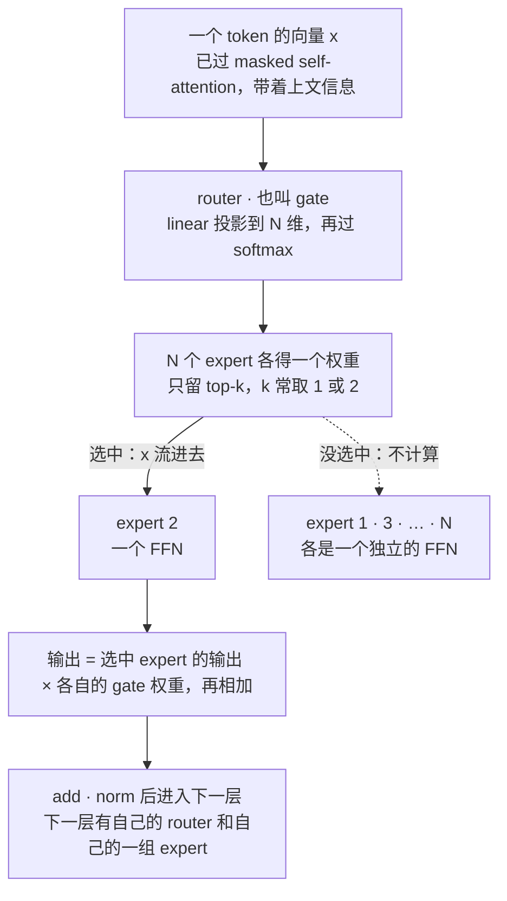
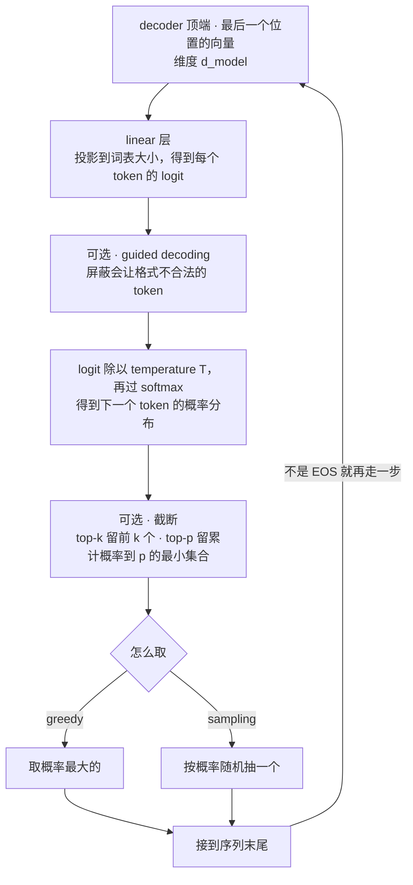
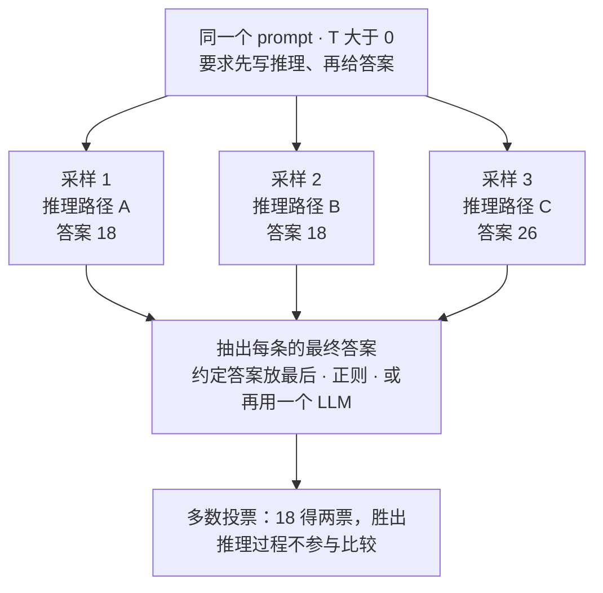
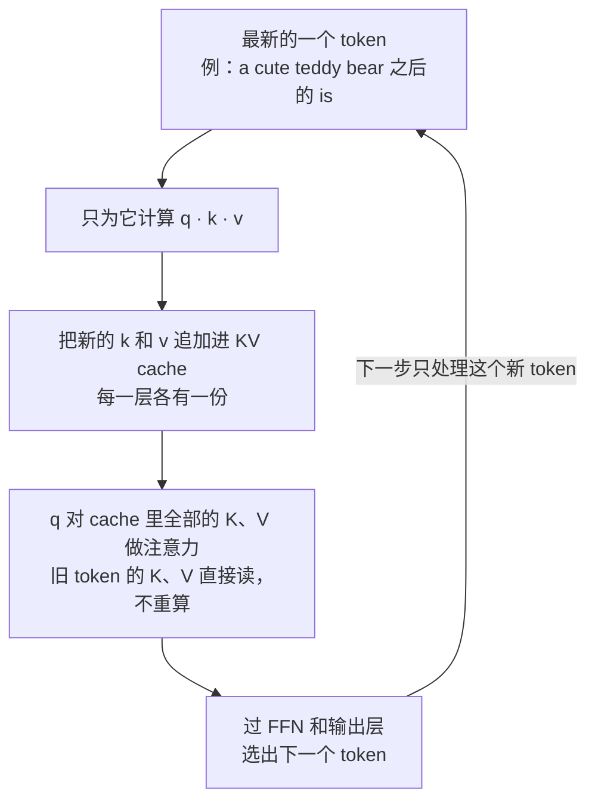
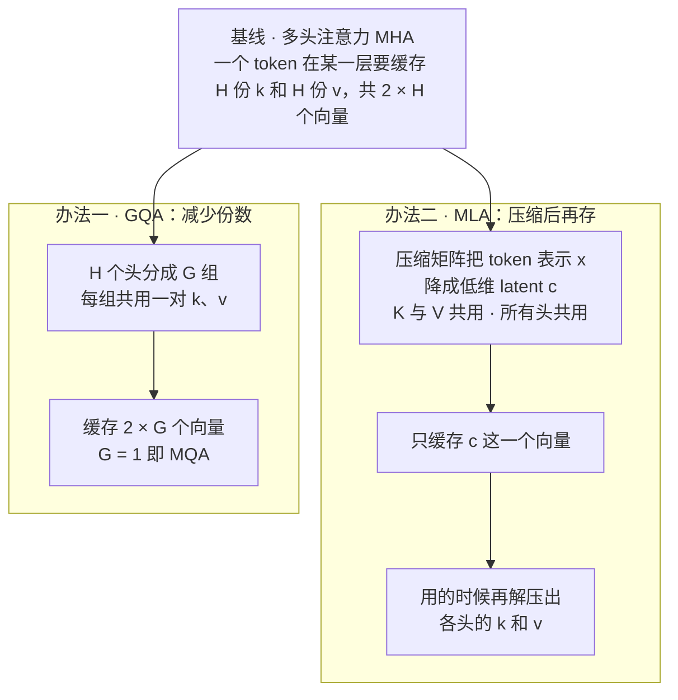
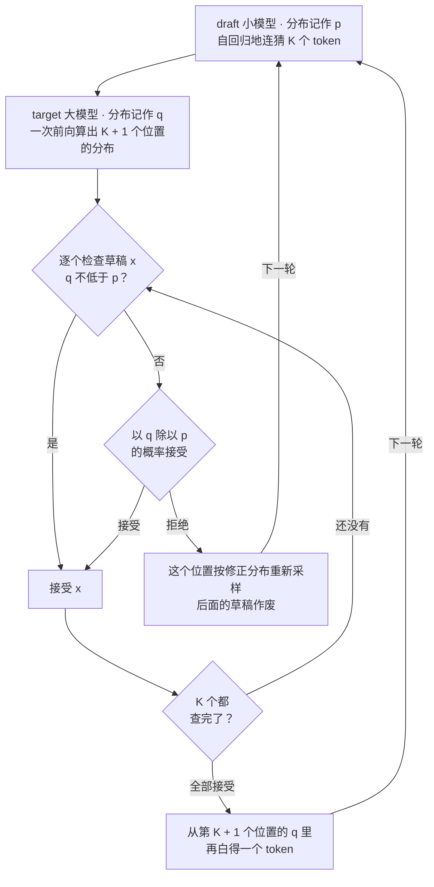

# CME295 第 3 讲｜大语言模型（Transformers & Large Language Models）

> Stanford CME295: Transformers & Large Language Models（2025 秋）· 第 3 讲（2025 年 10 月 10 日）
> 视频：<https://www.youtube.com/watch?v=Q5baLehv5So>（1:48:45，英文字幕是自动生成的，人名和术语有识别错误）
> 讲者：Afshine Amidi（前半：LLM 定义、MoE、解码）· Shervine Amidi（1:07:07 起：提示与推理优化）
> 课程大纲：<https://cme295.stanford.edu/syllabus/>

**一句话**：LLM 就是在参数、数据、算力三个维度上一起放大的 decoder-only Transformer。这一讲沿着"模型长什么样 → 怎么吐出回答 → 怎么问它 → 怎么跑得快"走了一遍：MoE 让参数变多而每个 token 的计算量不变；解码策略和 temperature 决定怎样从"下一个 token 的概率分布"里取词；in-context learning、chain of thought、self-consistency 不改权重就能改善回答；KV cache、GQA、PagedAttention、MLA 和 speculative decoding 让生成更快、更省显存。

## 时间轴

| 时间 | 内容 |
|---|---|
| [0:00](https://www.youtube.com/watch?v=Q5baLehv5So&t=0s) | 开场与公告：幻灯片会在每周四晚提前放到课程网站 |
| [1:02](https://www.youtube.com/watch?v=Q5baLehv5So&t=62s) | 回顾前两讲：encoder-decoder（T5）、encoder-only（BERT）、decoder-only（GPT）三类模型 |
| [3:43](https://www.youtube.com/watch?v=Q5baLehv5So&t=223s) | LLM 的定义：language model 加三个"大"；BERT 为什么不算；decoder-only 骨架与代表模型 |
| [7:37](https://www.youtube.com/watch?v=Q5baLehv5So&t=457s) | MoE 的动机（四位专家的比喻）；expert、gate / router 与加权求和公式 |
| [12:43](https://www.youtube.com/watch?v=Q5baLehv5So&t=763s) | dense MoE 与 sparse MoE（top-k）；FLOPs 是什么 |
| [15:47](https://www.youtube.com/watch?v=Q5baLehv5So&t=947s) | MoE 放在 LLM 的哪里：FFN 参数最多，换成一组 FFN expert，按 token 路由 |
| [20:46](https://www.youtube.com/watch?v=Q5baLehv5So&t=1246s) | routing collapse 与负载均衡的辅助损失；noisy gating（24:21 起） |
| [25:21](https://www.youtube.com/watch?v=Q5baLehv5So&t=1521s) | 问答：辅助损失里哪一项可导；gate 的输出怎么来 |
| [27:31](https://www.youtube.com/watch?v=Q5baLehv5So&t=1651s) | 问答：expert 越多总参数越大，active parameters 不变；Switch Transformer；sample efficiency |
| [29:41](https://www.youtube.com/watch?v=Q5baLehv5So&t=1781s) | 问答：expert 与注意力头无关；每层各有一套 expert 和 router；推理时一个 token 怎么走（31:15 起） |
| [34:48](https://www.youtube.com/watch?v=Q5baLehv5So&t=2088s) | Mixtral 论文里的路由上色图；MoE 小结 |
| [36:35](https://www.youtube.com/watch?v=Q5baLehv5So&t=2195s) | 回答是怎么生成的：next-token prediction 与输出概率分布 |
| [38:34](https://www.youtube.com/watch?v=Q5baLehv5So&t=2314s) | greedy decoding 和它的两个问题 |
| [41:36](https://www.youtube.com/watch?v=Q5baLehv5So&t=2496s) | beam search：保留 K 条路径；序列 log 概率、偏好短序列与长度归一化（43:39 起） |
| [46:36](https://www.youtube.com/watch?v=Q5baLehv5So&t=2796s) | sampling；top-k 与 top-p（49:19 起） |
| [50:53](https://www.youtube.com/watch?v=Q5baLehv5So&t=3053s) | 概率从哪来：linear 层加 softmax |
| [52:24](https://www.youtube.com/watch?v=Q5baLehv5So&t=3144s) | temperature：公式与直觉；板书推导 T → 0 和 T → ∞（55:40 起） |
| [1:02:23](https://www.youtube.com/watch?v=Q5baLehv5So&t=3743s) | 确定性：随机性只来自采样；T = 0 在实践中仍可能不一致 |
| [1:04:53](https://www.youtube.com/watch?v=Q5baLehv5So&t=3893s) | guided decoding：以生成 JSON 为例 |
| [1:07:07](https://www.youtube.com/watch?v=Q5baLehv5So&t=4027s) | 后半场（Shervine）：context length 的几个叫法与量级；context rot（1:09:03 起） |
| [1:11:37](https://www.youtube.com/watch?v=Q5baLehv5So&t=4297s) | prompt 的四个组成部分 |
| [1:14:09](https://www.youtube.com/watch?v=Q5baLehv5So&t=4449s) | in-context learning：zero-shot 与 few-shot；给示例不一定更好（1:16:50 起） |
| [1:18:35](https://www.youtube.com/watch?v=Q5baLehv5So&t=4715s) | chain of thought；拿推理文本来调试（1:20:27 起） |
| [1:21:59](https://www.youtube.com/watch?v=Q5baLehv5So&t=4919s) | self-consistency；问答：怎么抽答案、并行采样的延迟 |
| [1:25:00](https://www.youtube.com/watch?v=Q5baLehv5So&t=5100s) | 推理优化总览：exact 与 approximate 两类 |
| [1:27:32](https://www.youtube.com/watch?v=Q5baLehv5So&t=5252s) | KV cache；问答：训练时用不用；用 GQA 减少 K/V 的份数（1:31:09 起） |
| [1:33:09](https://www.youtube.com/watch?v=Q5baLehv5So&t=5589s) | PagedAttention：整段预留显存的浪费、三种浪费、按 block 管理 |
| [1:36:30](https://www.youtube.com/watch?v=Q5baLehv5So&t=5790s) | MLA：把 K、V 压成一个低维 latent 再缓存 |
| [1:41:20](https://www.youtube.com/watch?v=Q5baLehv5So&t=6080s) | speculative decoding：draft 模型起草，target 模型一次验证 |
| [1:46:28](https://www.youtube.com/watch?v=Q5baLehv5So&t=6388s) | multi-token prediction；收尾 |

## 核心内容

### 1. 什么叫 LLM：decoder-only，外加三个"大"

- **先回顾**（第 2 讲）：Transformer 衍生出三类模型——encoder-decoder（T5，文本进、文本出）；encoder-only（BERT，不生成文本，但产出的向量很有用，取 CLS token 的向量就能做分类，实际里常拿来给句子和文档编码，讲者说后面的课还会用到）；decoder-only（GPT，去掉 encoder，也就不再需要 cross-attention，文本进、文本出）。
- **language model** 的定义：给 token 序列分配概率的模型。落到实现上，就是给定前文，输出"下一个 token 是词表里每个词"的概率。
- **large** 指三件事一起放大：
    - 参数：几千亿已经不稀奇；一般至少十亿（1B）量级才叫 LLM。
    - 数据：按预训练用的 token 数算，从几千亿到几万亿，最大的已经到几十万亿。
    - 算力：训练和运行都要一批 GPU；不过现在有不少优化能让模型在消费级 GPU 上跑（讲者说后面会讲）。这三个"大"具体怎么训出来，是第 4 讲（LLM training）的内容。
- **这个名字很新**：2018–19 年还没有公认的定义，早期有人把 BERT 也算作 LLM。按现在已经稳定下来的用法，LLM 专指规模很大、能生成文本的模型；BERT 是 encoder-only，不生成文本，所以不算。
- **骨架**：decoder-only 的每个 block 只剩 masked self-attention、FFN（前馈网络）和 add & norm。GPT、Llama（Meta）、Gemma（Google）、DeepSeek、Mistral、Qwen 都是这个结构；讲者估计现在九成以上的 LLM 是 decoder-only。

### 2. Mixture of Experts：参数变多，每个 token 的计算量不变

*图 3-1｜一个 token 穿过 sparse MoE 层的路径（自绘示意）· [▶ 看原幻灯片 18:45](https://www.youtube.com/watch?v=Q5baLehv5So&t=1125s) · 出处：[Fedus et al., 2021](https://arxiv.org/abs/2101.03961)*

- **为什么要有它**：模型有几千亿参数，按原来的做法，每预测一个 token，全部参数都要参与一次前向计算，训练和推理都很贵。讲者的比喻：屋里坐着数学家、物理学家、化学家和历史学家，你有一道数学题，并不需要四个人都答一遍。MoE 的想法就是：给定输入，只让模型的一部分参与计算。
- **两个部件**：N 个 expert（各是一个子网络）和一个 gate（也叫 router，本身是个小网络）。gate 看输入 x，给每个 expert 打一个权重；这一层的输出是各 expert 输出的加权和。gate 和 expert 一起训练，照常前向、算 loss、反向传播。

$$
\hat{y}=\sum_{i=1}^{N} G(x)_i\,E_i(x)
\qquad\text{sparse:}\quad
\hat{y}=\sum_{i\in\mathrm{TopK}(G(x))} G(x)_i\,E_i(x)
$$

ŷ 是这一层的输出，E_i(x) 是第 i 个 expert 对输入 x 的输出，G(x)_i 是 gate 给它的权重；sparse 版只对权重最高的 k 个 expert 求和，其余的根本不计算。

- **dense 与 sparse**：dense MoE 不限制参与的 expert 数，权重是一组 0 到 1 之间、像概率分布一样的数——所有 expert 都得算，只是数学家的话分量更重，计算一点没省。sparse MoE 只取权重最高的 k 个（k 是超参数，常取 1 或 2），这才省下计算。计算量用 FLOPs（floating-point operations，一次前向里加法、乘法这类浮点运算的总次数）衡量：sparse MoE 的 FLOPs 比 dense 低。
- **放在 LLM 的哪里**：decoder block 里有 masked self-attention、FFN、add & norm 三处，参数最多的是 FFN：它把 d_model 维的向量升到 d_ff 维再降回来，参数量约 2 × d_model × d_ff（外加 bias），而 d_ff 通常比 d_model 大得多（第 1 讲）。所以现在的 LLM 把每层的 FFN 换成"一个 router 加一组 FFN expert"，用 sparse 的方式，每次只激活其中一两个。
    > 小注：讲者对比时用的是单个注意力头的投影矩阵（d_model × d_k）。把所有头加起来，注意力的四个投影矩阵约 4 × d_model²；按常见的 d_ff = 4 × d_model，FFN 约 8 × d_model²，大致占一个 block 参数的三分之二——结论不变。
- **路由是逐 token、逐层的**（图 3-1）：token 过完 masked self-attention、带上了上文信息之后，向量先进 router（投影到 N 维再 softmax，得到对 N 个 expert 的概率），取 top-k，只有被选中的 expert 真的做计算。同一句话里相邻的两个 token 可以去不同的 expert；同一个 token 在第 1 层去了 expert 3，到第 2 层可能去 expert 1。每层有自己的 router 和自己的一组 expert，权重不共享。
- **总参数与 active parameters**：expert 加得越多，总参数越大，模型容量也越大；但每个 token 只经过 k 个 expert，一次前向真正用到的参数（active parameters）基本不变。这就是 MoE 模型能做到万亿参数的原因——讲者推荐阅读的 Switch Transformer 做到了一万多亿。论文还显示这类模型更 sample efficient：达到同样效果所需的训练时间更短。
    > 小注：Switch Transformer 最大的 Switch-C 是 1.6 万亿参数、2,048 个 expert；摘要里说同等算力下预训练最多快 7 倍。代价在课上只带了一句"都是 trade-off"：所有 expert 都得放进显存，显存占用跟着总参数走，速度才跟着 active parameters 走。
- **Mixtral 的路由上色图**：Mistral 团队在论文里把一段文本的每个 token 按"在这一层被分到哪个 expert"涂上颜色。讲者让大家看的是颜色混得很匀，说明各 expert 的使用大致均衡；如果整段一个颜色，就是下一节说的 routing collapse。
    > 小注：Mixtral 8x7B 每层 8 个 expert，每个 token 选 2 个，总参数 47B，active 13B。论文的路由分析没有发现 expert 按主题（数学、生物、哲学……）分工，规律更偏句法：代码里的缩进 token 总去同一个 expert，相邻 token 也常被分到同一个 expert。"数学家、历史学家"只是帮助理解动机的比喻，别按字面理解。
- **问答**：expert 和注意力头没有关系。多头注意力的结果在注意力层末尾已经拼接并投影回 d_model 维，之后才进 MoE；router 是每层一个，不是每个头一个。

### 3. 训练 MoE 的麻烦：routing collapse 与负载均衡

$$
\mathcal{L}_{\mathrm{aux}}=\alpha\cdot N\cdot\sum_{i=1}^{N} f_i\,P_i
$$

N 是 expert 的个数，α 是控制这一项分量的超参数，f_i 是这一批 token 里被分到 expert i 的比例，P_i 是 router 给 expert i 的平均概率。

- **问题**：训练时很可能出现 router 总是选那一两个 expert、其余的从不被激活的情况，叫 routing collapse。没被选中的 expert 白占参数，MoE 的容量优势就没了。
- **办法**：在原来的 loss 上加一个辅助项（上式）。讲者说不必抠公式细节，记住它的作用是把 f_i 和 P_i 都推向均匀分布，让各 expert 的使用量差不多。它和主 loss 一样按 mini-batch 计算：一批 token 过完模型，统计这两个量，再一起反向传播。
    > 小注：这个式子应出自 Switch Transformer，论文里 α = 0.01。均匀路由时 f_i = P_i = 1/N，求和得 1/N，再乘 N 恰好是 1——乘 N 是为了让这一项的大小不随 expert 个数变化。课上有学生追问 f_i 怎么求导，讲者当场没有答案；论文的回答是 f_i（来自 argmax 的计数）不可导，梯度只通过 P_i 传回 router。
- **其他手段**：noisy gating——给 gate 的打分加一点噪声，让别的 expert 也有机会被选中。有学生问能不能用 dropout，讲者说当然可以叠加，noisy gating 的思路和它相近。
    > 小注：noisy top-k gating 出自 [Shazeer et al., 2017](https://arxiv.org/abs/1701.06538)。那篇论文也描述了 collapse 的成因：早期碰巧被多选的 expert 得到更多训练、变得更好，于是更常被选，是一个自我强化的过程。

### 4. 回答是怎么生成的：greedy、beam search 与采样

*图 3-2｜生成一个 token 的完整一步：从隐向量到选出下一个 token（自绘示意，把第 4、5 两节的部件串在一起）· [▶ 看原幻灯片 50:53](https://www.youtube.com/watch?v=Q5baLehv5So&t=3053s)*

- **生成是一个循环**：LLM 每次只做一件事——给定目前的序列，输出"下一个 token"在整个词表上的概率分布。选一个 token 接到末尾，再喂回去，直到出现 EOS（结束符）。"怎么选"就是解码策略。
- **概率从哪来**：decoder 顶端，最后一个位置的向量（d_model 维）先过一个 linear 层投影到词表大小，得到每个 token 的打分（logit），再过 softmax 变成和为 1 的概率。
- **greedy decoding**：每步取概率最大的 token。两个问题：
    1. 整个前向计算是确定的，于是同样的输入永远得到同样的输出，没有多样性——而 ChatGPT、Gemini 每次的回答都不太一样。
    2. 每步最优不等于整句最优。我们要的是概率高的*整条序列*；第一步选了 0.8 的 token，后面可能一路都是低概率，反倒是从 0.2 那个 token 出发的路径后面步步都高，整条序列的概率更大。
- **beam search**：同时保留 K 条概率最高的路径（K 叫 beam size 或 beam width）。每一步把这 K 条都往前扩展一个 token，在所有候选里再留下最好的 K 条，最后取总分最高的那条。序列的分数是各步 log 概率之和。
    - 偏好短句：每个概率都小于 1，越乘越小，序列越长分数越低。所以实际会做长度归一化：把分数除以 token 数的某次幂。
    - 局限：要维护 K 条路径，计算和存储都更多；而且它找的仍是"模型认为最可能"的那一句，没有多样性。它适合机器翻译这类答案比较确定的任务，LLM 对话一般不用。
- **sampling**：按概率分布随机抽下一个 token。概率高的常被抽中，概率低的偶尔也会被抽中，多样性就来了。麻烦在尾部：词表里大量概率极低的 token 理论上也可能被抽到。所以先截断再抽：
    - top-k：只在概率最高的 k 个 token 里抽。
    - top-p：按概率从高到低累加，取累计概率刚超过阈值 p 的最小集合，在里面抽。
    > 小注：top-p 又叫 nucleus sampling，应出自 [Holtzman et al., 2019](https://arxiv.org/abs/1904.09751)；top-k sampling 应出自 [Fan et al., 2018](https://arxiv.org/abs/1805.04833)。两者的差别：top-p 的候选个数随分布变化，模型很有把握时只剩两三个候选，拿不准时候选自动变多。
- **问答**：这些都只是推理时的事。训练时不采样，而是拿输出分布和真实的下一个 token（hard label）比较，算 loss。

### 5. temperature、确定性与 guided decoding

$$
P(i)=\frac{\exp(x_i/T)}{\sum_{j}\exp(x_j/T)}
$$

x_i 是 linear 层给第 i 个 token 的 logit，T 是 temperature，分母对词表里所有 token 求和；T = 1 就是普通的 softmax。

- **它做什么**：T 是 softmax 里除在 logit 下面的一个数。T 小，分布变尖，概率集中到最高的几个 token 上；T 大，分布变平，原本排不上号的 token 也有了机会。写创意文案用高 T；想要稳定、接近"模型认为最好"的回答用低 T。
- **板书的推导**：设 k 是 logit 最大的 token，分子分母同除以 exp(x_k / T)，每一项就成了 exp((x_j − x_k) / T)，指数都不大于 0。T → 0 时，j ≠ k 的指数趋向负无穷，这些项全部消失，P(k) → 1，等价于 greedy；T → ∞ 时，所有指数趋向 0，每项趋向 1，P 变成"1 除以词表大小"的均匀分布。
- **随机性只有一个来源**：Transformer 的前向计算里没有任何随机的东西，唯一的随机是"按分布抽 token"这一步。所以只要 T > 0，同一输入每次的输出都可能不同；理论上 T = 0 就完全确定。但实践中 T = 0 也可能得到不同结果：浮点加法的结果和相加顺序有关，GPU 上数量级相差很大的数以不同顺序归约，结果会有细微差别。讲者推荐了一篇选读文章 [Defeating Nondeterminism in LLM Inference](https://thinkingmachines.ai/blog/defeating-nondeterminism-in-llm-inference/)。
    > 小注：这篇文章（Horace He 与 Thinking Machines Lab，2025 年 9 月）比课上的转述更进一步："并发加浮点"只解释了一半，主因是推理 kernel 不具备 batch invariance——同一条请求的数值结果随 batch 大小变化，而 batch 大小取决于服务器当时同时在处理多少别人的请求。文中给出了 batch-invariant 的 RMSNorm、矩阵乘法和 attention 实现。做 agent 评测想要可复现的话，只设 T = 0 是不够的。
- **guided decoding**：想让输出严格符合某种格式（比如 JSON）。朴素做法是在 prompt 里提要求，拿到后校验，不合法就重来。guided decoding 则在生成的每一步把"会让输出不合法"的 token 直接屏蔽：JSON 的第一个 token 只能是左花括号，接着只能是属性名……；同时有多个合法 token 时，再按平常的策略（采样等）在里面选。哪些 token 合法怎么判定，讲者只给了关键词：finite-state machine 和 context-free grammar。
    > 小注：代表工作如 Outlines（[Willard 与 Louf, 2023](https://arxiv.org/abs/2307.09702)），把正则表达式或 JSON schema 编译成词表上的状态机。各家 API 的 structured output、agent 调工具时的参数格式（第 7 讲）背后通常就是这类机制。

### 6. 提示：context length、prompt 的结构与 in-context learning

- **context length**（也叫 context size、window size）：模型一次前向能接收的 token 数，也就是 self-attention 实际看到的序列长度。现在的模型在几万、几十万到上百万 token 的量级（Gemini 等已到百万级）。长度一上去，self-attention 的 n² 开销就成了问题，第 2 讲那些降低注意力复杂度的技巧就是为此准备的（问答）。
- **长不等于好——context rot**：在 needle in a haystack 测试里（把答案埋进越来越长的文本，再提问），上下文越长，模型把埋着的信息找出来的能力越差；文本里混进干扰项（distractor，和答案相似但不对的内容）时掉得更厉害。上下文里放什么同样重要。实践含义：检索类问题里，尽量只把相关的那一段喂给模型，而不是全塞进去。
    > 小注：出处是向量数据库公司 Chroma 2025 年 7 月的[技术报告](https://www.trychroma.com/research/context-rot)（Hong、Troynikov、Huber），测了 18 个模型，不是同行评审论文。报告还发现：问题和答案的语义相似度越低，性能随长度掉得越快。
- **prompt 的四个部分**（没有正式理论，是一个好用的心智模型）：context（设定场景、角色、日期）、instructions（要做什么任务）、input（任务作用的对象）、constraints（格式、长度、安全等限制）。以 ChatGPT 为例：系统写入的"你是 ChatGPT、现在是几月几号几点"是 context；用户的提问是 instructions 加 input；用户看不见的安全规则属于 constraints。
- **in-context learning**：不改任何权重，只靠上下文里的内容让模型完成任务。learning 这个词在这里名不副实，模型的权重什么都没学。分两类：
    - zero-shot：只给任务本身。
    - few-shot：在真正的输入前放几组"输入 → 输出"的示例。
- **示例通常有用，但不总是更好**：示例能把模型引到你要的任务上，代价是要花功夫收集，上下文变长、计算更多。讲者特意强调"通常"二字：模型的推理能力变强之后，把 instructions 写好——用自然语言讲清楚任务该怎么做——效果可以追平甚至超过给示例。原因是示例是一个有限集合，模型会往示例上靠，遇到和示例分布不同的输入反而不好泛化。这方面的文献还在发展，讲者举了 Plan-and-Solve：让模型先自己列计划再解题。
    > 小注：[Plan-and-Solve](https://arxiv.org/abs/2305.04091)（Wang et al.）是 ACL 2023 的论文，不算新。它是一种 zero-shot 提示，摘要里说在数学推理上全面超过 zero-shot CoT，与 8-shot CoT 相当。

### 7. Chain of thought 与 self-consistency

*图 3-3｜self-consistency：并行采样多条推理，只对最终答案投票（自绘示意，答案数字为自拟）· [▶ 看原幻灯片 1:21:59](https://www.youtube.com/watch?v=Q5baLehv5So&t=4919s) · 出处：[Wang et al., 2022](https://arxiv.org/abs/2203.11171)*

- **chain of thought（CoT）**：要求模型在给答案前先写出推理过程（rationale），准确率会提高。讲者的解释：逼模型直接吐一个数字，它未必能把题目里的条件和答案联系起来；写出完整的推理链，答案是怎么来的就清楚了。它可以和 few-shot 结合：示例里写上"推理加答案"，模型就会照这个格式先推理再作答。
    > 小注：一个常见的补充解释——模型生成每个 token 的计算量是固定的，把中间步骤写出来，等于给难题分配了更多计算，后面的 token 还能直接引用前面的中间结果。出处是 [Wei et al., 2022](https://arxiv.org/abs/2201.11903)；第 6 讲（LLM reasoning）从这里接着往下讲。
- **顺带的好处是能调试**：LLM 出错时没法像传统模型那样去翻权重，能看的只有它吐出的 token。推理文本能帮你追到根因：问"这只熊明年几岁"，如果推理里写着"现在是 2019 年"，就知道是上下文里的日期给错了。
- **代价**：要多生成 token，更慢、更贵；一般可以接受。
- **self-consistency**（图 3-3）：在 CoT 的基础上，同一个 prompt 采样多次（T > 0，每次的推理路径不同），从每条回答里抽出最终答案，多数投票。不比较推理过程，只数答案。
    > 小注：论文摘要里的幅度：GSM8K +17.9%、SVAMP +11.0%、AQuA +12.2%。
- **问答**
    - 怎么知道它真的更好：需要带标准答案的 benchmark 来验证；原论文用的是算术和数学推理类数据集。
    - 怎么从一大段文字里抽出答案：在 prompt 里要求"最终答案放在最后"然后取末尾；用正则；或者再用一个 LLM 来抽。
    - 多次采样是串行的吗：并行。各条采样互不进入对方的上下文，总延迟约等于最慢的那条（算力当然是 N 份）。

### 8. 推理优化（上）：KV cache，以及怎么让它少占显存

*图 3-4｜带 KV cache 的一步解码：只算新 token，旧的 K、V 从 cache 里读（自绘示意）· [▶ 看原幻灯片 1:27:32](https://www.youtube.com/watch?v=Q5baLehv5So&t=5252s)*

- **两类思路**：Shervine 把推理优化分成 exact（计算结果完全不变，只是去掉冗余、把显存管好、或者把式子换个等价写法）和 approximate（允许结果略有不同，换更低的成本：改架构、压缩表示、在预测 token 上做文章）。讲的时候按位置走：先 attention 层，再输出层。
- **KV cache 为什么成立**：生成第 t 个 token 时，当前 token 的 query 要和前面所有 token 的 key、value 做注意力。前面那些 token 的 K 和 V 在之前的步骤里已经算过，之后也不会再变（causal mask 下每个位置只看得到自己和前面的 token，后来新增的 token 影响不到它），再算一遍纯属浪费。于是把每层的 K、V 存起来，每步只为最新的 token 算 q、k、v，把新的 k、v 追加进 cache，q 直接对 cache 里的全部 K、V 做注意力（图 3-4）。旧 token 的 query 以后用不到，所以没有"Q cache"。
- **训练时用不用**（学生问）：不用。训练是 teacher forcing：整条序列一次喂进去，所有位置并行计算，不存在一步一步生成，也就没有可复用的东西。
- **cache 本身成了负担**：每层、每个 token 要存 H 份 key 和 H 份 value（H 是头数）。第一个办法来自第 2 讲：grouped-query attention（GQA）让若干个 query 头共用一组 K/V；组数 G = H 就是原始的多头注意力，G = 1 就是 multi-query attention。现在的 LLM 大多取一个折中的 G。
- **PagedAttention**（推理框架 vLLM 背后的技术）：推理服务器同时服务很多请求。朴素做法是每来一个请求，就按最大 context length 预留一整段连续显存，因为不知道什么时候才生成到 EOS。这样浪费很大，显存很快就装不下新请求。论文把浪费分成三种：reserved（给将来的 token 预留、眼下空着的位置）、internal fragmentation（按最大长度多留、到结束也用不上的位置）、external fragmentation（内存分配器在各段之间留下的空隙）。PagedAttention 借用操作系统分页的思路：把 KV cache 切成固定大小的 block（论文里一个 block 放 16 个 token），用多少分配多少，block 在物理显存里不必连续，另有一张表记录"第几个 token 的 K、V 在哪个 block"。碎片大幅减少，同一张卡能同时服务更多请求。
    > 小注：[论文](https://arxiv.org/abs/2309.06180)里的数字——当时的推理系统中，KV cache 显存只有 20.4%–38.2% 真正存着 token 状态；vLLM 在相同延迟下把吞吐提高 2–4 倍。讲者口头对 reserved 和 internal fragmentation 的解释有些含糊，这里按论文的定义写。

### 9. MLA：把 K 和 V 压成一个低维向量再缓存

*图 3-5｜每层、每个 token 要缓存什么：MHA、GQA 与 MLA 的对比（自绘示意）· [▶ 看原幻灯片 1:37:16](https://www.youtube.com/watch?v=Q5baLehv5So&t=5836s) · 出处：[DeepSeek-AI, 2024](https://arxiv.org/abs/2405.04434)*

$$
c_t = W^{\mathrm{down}} x_t,\qquad k_t = W_K^{\mathrm{up}}\,c_t,\qquad v_t = W_V^{\mathrm{up}}\,c_t
$$

x_t 是某层第 t 个 token 的表示，c_t 是压缩后的 latent 向量（维度远小于所有头的 key 拼起来的维度），W^down 是 K、V 和所有头共用的压缩矩阵，W_K^up 和 W_V^up 是各自的解压矩阵；cache 里只存 c_t。

- **动机**：GQA 减少的是 K/V 的份数，每一份的维度没变。DeepSeek 的 Multi-head Latent Attention（MLA）换了一个角度：让要缓存的表示本身更紧凑。
- **三步**：
    1. 低秩分解：把"token 表示 → key"的投影矩阵拆成两段，先降到一个低维的中间空间，再升回来。
    2. K 和 V 共用压缩矩阵：同一个 token 的 key 和 value 由同一个 latent 解压出来；解压矩阵各用各的，所以 K 和 V 仍然可以不同。
    3. 所有头共用：不再是 H 个头各存一份，每个 token 在每层只缓存一个 latent 向量。
- **效果**：要存的东西少了很多。DeepSeek-V2 论文还报告效果比标准多头注意力更好，讲者的解读是共享的低秩表示起了类似正则化的作用——收益不只在硬件上。
- **问答**：latent 的维度是设计时定下的超参数，对所有 token 都一样；理论上可以不同，实践中一般统一。
    > 小注：讲者把名字说成了 multi-latent attention，全称是 Multi-head Latent Attention。DeepSeek-V2（总参数 236B，每个 token 激活 21B，本身也是 MoE）摘要里的数字：KV cache 比 DeepSeek 67B 少 93.3%，最大生成吞吐是它的 5.76 倍。课上略去了一个细节：RoPE 位置编码和这种低秩压缩不兼容，论文另外缓存了一小段带位置信息的 key（decoupled RoPE）。

### 10. 推理优化（下）：speculative decoding 与 multi-token prediction

*图 3-6｜speculative decoding 的一轮：起草、一次验证、逐个接受或拒绝（自绘示意）· [▶ 看原幻灯片 1:42:22](https://www.youtube.com/watch?v=Q5baLehv5So&t=6142s) · 出处：[Chen et al., 2023](https://arxiv.org/abs/2302.01318)*

$$
P_{\mathrm{accept}}(x)=\min\!\left(1,\frac{q(x)}{p(x)}\right),
\qquad
p_{\mathrm{resample}}(x)=\frac{\max\bigl(0,\,q(x)-p(x)\bigr)}{\sum_{y}\max\bigl(0,\,q(y)-p(y)\bigr)}
$$

p 是 draft 模型在这个位置给出的分布，q 是 target 模型的分布，x 是 draft 猜的 token；草稿被拒绝时，从右边这个"q 比 p 多出来的部分"归一化后的分布里重新抽一个。

- **前提：推理是 memory-bound**。生成时每一步的耗时主要花在搬运权重和 cache 上，算术本身不是瓶颈。所以大模型一次前向同时处理 K + 1 个 token，和只处理 1 个 token 的耗时差不多。只要有人能便宜地猜出后面 K 个 token，大模型就能一次验完。
- **流程**（图 3-6）：
    1. 小的 draft 模型自回归地连猜 K 个 token（它小，所以快）。
    2. 把"前文加 K 个草稿 token"一次喂给大的 target 模型，得到每个位置上 target 的分布 q，外加第 K + 1 个位置的分布——这是白得的。
    3. 按顺序检查每个草稿 token x：target 给它的概率不低于 draft 给的，直接接受；否则以 q(x) / p(x) 的概率接受。第一次被拒绝时，这个位置按上式右边的修正分布重新采样，后面的草稿作废。
    4. 如果 K 个全部被接受，再从第 K + 1 个位置的 q 里抽一个 token。于是大模型每做一次前向，产出 1 到 K + 1 个 token。
- **为什么输出分布和只用大模型完全一样**：这不是拍脑袋的配方。用全概率公式把"接受"和"拒绝后重采样"两个分支写开：接受分支贡献 min(p, q)，重采样分支恰好补上 q − min(p, q)，加起来就是 q。讲者把它留作练习，说论文里的证明只有几行。有学生指出这很像 rejection sampling，讲者确认了。
    > 小注：幻灯片用的记号（draft、K、第 K + 1 个位置的 q）应出自 Chen et al., 2023（DeepMind，Chinchilla 70B 上解码加速 2–2.5 倍）；同期独立提出的还有 [Leviathan et al., 2022](https://arxiv.org/abs/2211.17192)（T5-XXL 上 2–3 倍）。接受规则的具体式子按论文写出，课上只口头描述。
- **multi-token prediction（MTP）**：把 draft 模型并进主模型。在最后一层 decoder 的表示上接多个输出头，第 1 个头预测下一个 token，第 2 个头预测再下一个……训练目标从 next-token prediction 改成一次预测多个 token。推理时，后面的头充当 draft，第 1 个头就是主模型，拿草稿回来做接受或拒绝。论文里的验证是 greedy 式的；因为架构和训练目标都变了，上面那个"分布严格一致"的性质不再直接成立。讲者让大家记住两点：训练目标变了；draft 和 target 合在一个模型里，不用另外维护一个小模型。
    > 小注：应为 [Gloeckle et al., 2024](https://arxiv.org/abs/2404.19737)（Meta）：共享主干上接 n 个独立输出头，摘要里说用 4-token 预测训练的模型推理最多快 3 倍。[DeepSeek-V3](https://arxiv.org/abs/2412.19437) 也用了 MTP 训练目标，不过它的预测模块是顺序串联的，不是并列的头。

### 11. 本讲的推理优化放在一起看

| 技术 | 作用位置 | 省的是什么 | 模型或输出变不变 |
|---|---|---|---|
| KV cache | attention | 旧 token 的 K、V 不再重算（用显存换计算） | 不变 |
| GQA | attention 结构 | K/V 的份数 | 改架构，训练时就得这样设计 |
| PagedAttention | 显存管理 | 预留和碎片造成的显存浪费 | 不变 |
| MLA | attention 结构 | 每个 token 缓存的向量个数与维度 | 改架构 |
| speculative decoding | 输出层 | 大模型前向的次数 | 输出分布不变 |
| multi-token prediction | 训练目标与输出头 | 同上，且不需要单独的 draft 模型 | 改训练目标；greedy 验证，没有分布一致的保证 |

> 小注：最后一列是按讲者给的 exact / approximate 标准做的归类，属于笔者推断；幻灯片上的分组以原片为准。

## 关键图表速查（点时间戳跳到原幻灯片）

| 图 | 看什么 | 跳转 | 出处 |
|---|---|---|---|
| MoE 的基本结构 | gate 指向被选中的 expert，输入只流进那一个；紧接着是 dense 与 sparse 两种写法的公式 | [9:23](https://www.youtube.com/watch?v=Q5baLehv5So&t=563s) | 应出自 [Shazeer et al., 2017](https://arxiv.org/abs/1701.06538) |
| FFN 换成 MoE | decoder block 里 FFN 的位置被"router 加一组 expert"取代；路由以 token 为单位 | [18:45](https://www.youtube.com/watch?v=Q5baLehv5So&t=1125s) | [Switch Transformer](https://arxiv.org/abs/2101.03961) |
| 负载均衡辅助损失 | α、N、f_i、P_i 各是什么；目标是两个量都趋向均匀 | [21:16](https://www.youtube.com/watch?v=Q5baLehv5So&t=1276s) | 应出自 [Switch Transformer](https://arxiv.org/abs/2101.03961) |
| Mixtral 路由上色图 | 某一层里每个 token 按所去的 expert 上色；颜色混得匀，说明没有 routing collapse | [34:48](https://www.youtube.com/watch?v=Q5baLehv5So&t=2088s) | [Mixtral of Experts](https://arxiv.org/abs/2401.04088) |
| beam search 示例 | K = 2 时每一步保留哪两条路径；最后按序列 log 概率取最高的 | [41:36](https://www.youtube.com/watch?v=Q5baLehv5So&t=2496s) | — |
| top-k 与 top-p | 同一个分布上，两种截断方式各留下哪些 token | [49:19](https://www.youtube.com/watch?v=Q5baLehv5So&t=2959s) | — |
| 带 temperature 的 softmax | T 出现在公式的哪里；55:40 起是板书推导 T → 0 和 T → ∞ 两个极限 | [52:24](https://www.youtube.com/watch?v=Q5baLehv5So&t=3144s) | — |
| guided decoding 生成 JSON | 每一步只有哪些 token 合法；有多个合法 token 时回到普通采样 | [1:04:53](https://www.youtube.com/watch?v=Q5baLehv5So&t=3893s) | — |
| context rot | 上下文越长、干扰项越多，needle in a haystack 的检索表现越差 | [1:09:03](https://www.youtube.com/watch?v=Q5baLehv5So&t=4143s) | [Chroma 技术报告](https://www.trychroma.com/research/context-rot) |
| self-consistency | 多条推理路径、各自的最终答案、多数投票 | [1:21:59](https://www.youtube.com/watch?v=Q5baLehv5So&t=4919s) | [Wang et al., 2022](https://arxiv.org/abs/2203.11171) |
| KV cache 示意 | 生成到 is 这个 token 时，哪些 K、V 直接从 cache 读，哪些要新算 | [1:27:32](https://www.youtube.com/watch?v=Q5baLehv5So&t=5252s) | — |
| PagedAttention 显存布局 | 先看朴素做法里三种浪费各在哪，再看按 block 分配之后的样子（1:35:14 起） | [1:34:13](https://www.youtube.com/watch?v=Q5baLehv5So&t=5653s) | [Kwon et al., 2023](https://arxiv.org/abs/2309.06180) |
| MLA 的压缩与解压 | 压缩矩阵先在 K 和 V 之间共用，再在所有头之间共用，最后每层每个 token 只剩一个缓存向量 | [1:37:16](https://www.youtube.com/watch?v=Q5baLehv5So&t=5836s) | [DeepSeek-V2](https://arxiv.org/abs/2405.04434) |
| speculative decoding 流程 | draft 逐个生成的草稿怎样一次送进 target；接受与拒绝的规则；多出来的第 K + 1 个 token | [1:42:22](https://www.youtube.com/watch?v=Q5baLehv5So&t=6142s) | 应为 [Chen et al., 2023](https://arxiv.org/abs/2302.01318) |

## 提到的工作

| 名称 | 在本讲里的作用 |
|---|---|
| [T5](https://arxiv.org/abs/1910.10683) · [BERT](https://arxiv.org/abs/1810.04805) · GPT | 回顾：三类 Transformer 模型的代表 |
| Llama、Gemma、DeepSeek、Mistral、Qwen | decoder-only LLM 的例子 |
| sparse MoE 与 noisy top-k gating（[Shazeer et al., 2017](https://arxiv.org/abs/1701.06538)） | MoE 基本形式与 noisy gating 的出处（课上未点名，应出自） |
| [Switch Transformer](https://arxiv.org/abs/2101.03961)（Fedus et al., 2021） | 推荐阅读：万亿参数的 sparse MoE、sample efficiency；负载均衡损失应出自这里 |
| [Mixtral of Experts](https://arxiv.org/abs/2401.04088)（Jiang et al., 2024） | 路由上色图的来源 |
| beam search | 保留 K 条路径的搜索式解码，机器翻译常用 |
| top-k sampling（[Fan et al., 2018](https://arxiv.org/abs/1805.04833)）· top-p / nucleus sampling（[Holtzman et al., 2019](https://arxiv.org/abs/1904.09751)） | 两种截断采样（课上未点名，应出自） |
| [Defeating Nondeterminism in LLM Inference](https://thinkingmachines.ai/blog/defeating-nondeterminism-in-llm-inference/)（Thinking Machines Lab, 2025） | 选读：T = 0 为什么仍然不确定 |
| finite-state machine / context-free grammar；[Outlines](https://arxiv.org/abs/2307.09702) | guided decoding 的实现思路；Outlines 是笔者补充的代表工作 |
| Gemini | 百万级 context length 的例子 |
| Cursor | 讲者提到代码助手里多用 context length 这个叫法 |
| [Context Rot](https://www.trychroma.com/research/context-rot)（Chroma, 2025）· needle in a haystack | 上下文越长检索越差的证据，以及所用的测试方法 |
| ChatGPT | prompt 四部分的例子；"每次回答都不同"的例子 |
| [GPT-3](https://arxiv.org/abs/2005.14165)（Brown et al., 2020） | zero-shot / few-shot 这套说法的出处（课上未点名） |
| [Plan-and-Solve Prompting](https://arxiv.org/abs/2305.04091)（Wang et al., 2023） | "写好 instructions 可以不输示例"的例子 |
| [Chain-of-Thought Prompting](https://arxiv.org/abs/2201.11903)（Wei et al., 2022） | 先写推理再作答 |
| [Self-Consistency](https://arxiv.org/abs/2203.11171)（Wang et al., 2022） | 多次采样加多数投票 |
| MQA（[Shazeer, 2019](https://arxiv.org/abs/1911.02150)）· GQA（[Ainslie et al., 2023](https://arxiv.org/abs/2305.13245)） | 第 2 讲的内容，这里用来减小 KV cache |
| [PagedAttention / vLLM](https://arxiv.org/abs/2309.06180)（Kwon et al., 2023） | 按 block 管理 KV cache 显存 |
| MLA / [DeepSeek-V2](https://arxiv.org/abs/2405.04434)（2024） | 低秩压缩 K、V |
| speculative decoding（[Leviathan et al., 2022](https://arxiv.org/abs/2211.17192)；[Chen et al., 2023](https://arxiv.org/abs/2302.01318)） | 小模型起草，大模型验证，输出分布不变 |
| multi-token prediction（[Gloeckle et al., 2024](https://arxiv.org/abs/2404.19737)；[DeepSeek-V3](https://arxiv.org/abs/2412.19437)） | draft 内置于主模型（课上所指论文为推断） |

## 术语对照

| English | 中文 |
|---|---|
| language model | 语言模型：给 token 序列分配概率的模型 |
| large language model (LLM) | 大语言模型 |
| decoder-only | 只保留 decoder 的 Transformer |
| FLOPs (floating-point operations) | 浮点运算次数，衡量一次前向的计算量（不是每秒次数） |
| mixture of experts (MoE) | 混合专家 |
| expert | 专家：MoE 层里的一个子网络，在 LLM 里就是一个 FFN |
| gate / router | 门控 / 路由器：决定 token 去哪个 expert 的小网络 |
| dense MoE / sparse MoE | 稠密 MoE（所有 expert 都算）/ 稀疏 MoE（只算 top-k 个） |
| active parameters | 激活参数：一次前向真正用到的参数 |
| routing collapse | 路由坍缩：router 总选少数几个 expert |
| load balancing loss / auxiliary loss | 负载均衡损失 / 辅助损失 |
| noisy gating | 带噪声的门控 |
| sample efficiency | 样本效率：达到同样效果所需的训练量更少 |
| next-token prediction | 预测下一个 token |
| decoding | 解码：从概率分布里选出 token 的过程 |
| greedy decoding | 贪心解码 |
| beam search / beam width | 束搜索 / 束宽（保留的路径数 K） |
| length normalization | 长度归一化 |
| top-k sampling / top-p (nucleus) sampling | 在前 k 个里采样 / 在累计概率到 p 的最小集合里采样 |
| logit | softmax 之前的原始打分 |
| temperature | 温度：softmax 里除在 logit 下面的系数 |
| guided (constrained) decoding | 引导解码 / 约束解码 |
| finite-state machine / context-free grammar | 有限状态机 / 上下文无关文法 |
| context length / context window | 上下文长度 / 上下文窗口 |
| context rot | 上下文腐化：输入越长表现越差 |
| needle in a haystack | 大海捞针测试 |
| distractor | 干扰项 |
| in-context learning | 上下文学习（不改权重） |
| zero-shot / few-shot | 零样本 / 少样本 |
| chain of thought (CoT) | 思维链 |
| rationale | 推理依据 |
| self-consistency | 自洽性：多次采样后对答案做多数投票 |
| KV cache | 键值缓存 |
| teacher forcing | 训练时把真实序列整条喂入，各位置并行预测 |
| multi-query / grouped-query attention (MQA / GQA) | 多查询 / 分组查询注意力 |
| PagedAttention | 分页注意力：按固定大小的 block 管理 KV cache |
| internal / external fragmentation | 内部碎片 / 外部碎片 |
| Multi-head Latent Attention (MLA) | 多头潜在注意力 |
| low-rank | 低秩：用两个小矩阵的乘积代替一个大矩阵 |
| latent | 潜向量：压缩后的中间表示 |
| speculative decoding | 投机解码 |
| draft model / target model | 草稿模型 / 目标模型 |
| rejection sampling | 拒绝采样 |
| memory-bound | 瓶颈在访存而不在计算 |
| multi-token prediction (MTP) | 多 token 预测 |

## 字幕勘误

"Shervin / Sherwin" → Shervine；"Aashish" → Afshine；"Guan" → Qwen；"Deep Seek" → DeepSeek；"mass self-attention" → masked self-attention；"writer router" → router；"flops" → FLOPs；"upper probabilities" → output probabilities；"LM inference" → LLM inference；"context rots" → context rot；"cursor" → Cursor；"your plan and solve" → Plan-and-Solve；"rational" → rationale；"key vacation caching" → KV caching；"external values H and 1" → extreme values（G = H 和 G = 1 两个极端）；"page detention" → PagedAttention；"vllm" → vLLM；"eight copies"、"eight projection matrices" → H copies、H projection matrices（H 是头数，不是 8）；"H search embeddings" → H such embeddings；"Q K + 1" → q 的第 K + 1 个位置。另有两处是讲者口误，不是识别错误：MLA 被说成 multi-latent attention；讲接受规则时把 target 说成了 draft（应为 target 给的概率不低于 draft 给的就接受）。

## 带走的问题

1. MoE 的比喻是"按学科分工的专家"，但路由发生在每一层、每个 token 上，Mixtral 的分析也没看到按主题分工。那 expert 学到的到底是什么？总参数涨、active 参数不变，部署时的瓶颈会转移到哪里（显存、跨卡通信）？
2. 你的 agent 评测想要"同一输入得到同一输出"。只设 T = 0 为什么不够？随机性是从哪里溜进来的，其中哪些你能控制？（第 8 讲 LLM evaluation 会再碰到可复现性。）
3. 什么时候 few-shot 示例会帮倒忙？如果要在自己的任务上比较"加示例"和"把 instructions 写细"，你会怎么设计对照，又怎么把 context rot 的代价算进去？
4. 自己推一遍：speculative decoding 的输出分布为什么和只用 target 模型完全一样？加速比取决于哪些量（草稿接受率、K、draft 模型自身的耗时）？T = 0 时接受规则退化成什么？
5. KV cache 的大小约等于"层数 × token 数 × 每个 token 的缓存量"。GQA、MLA、PagedAttention 各动的是哪一项？上下文到了百万 token，哪一项先撑不住？
