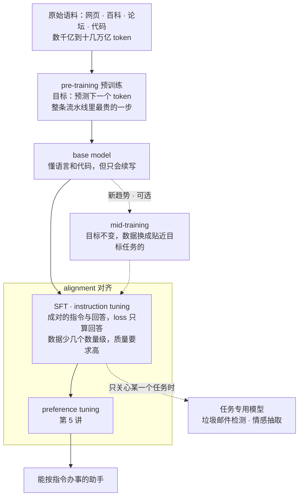
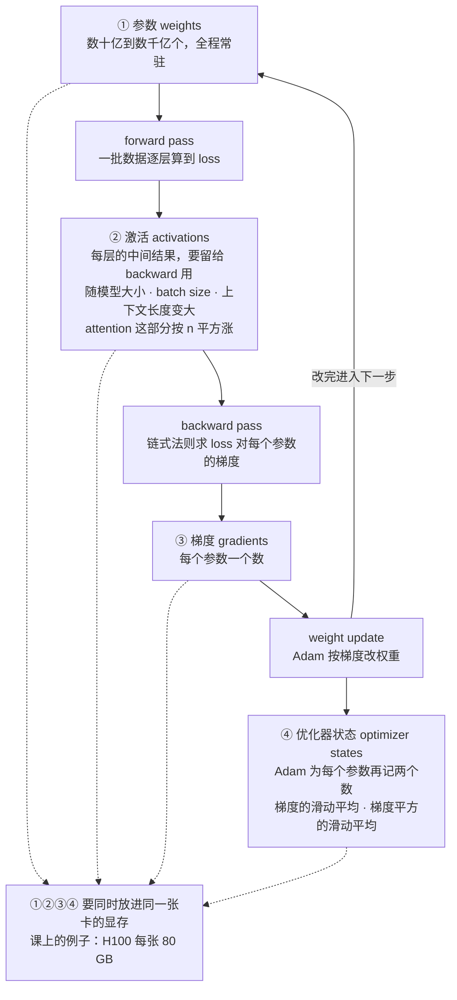
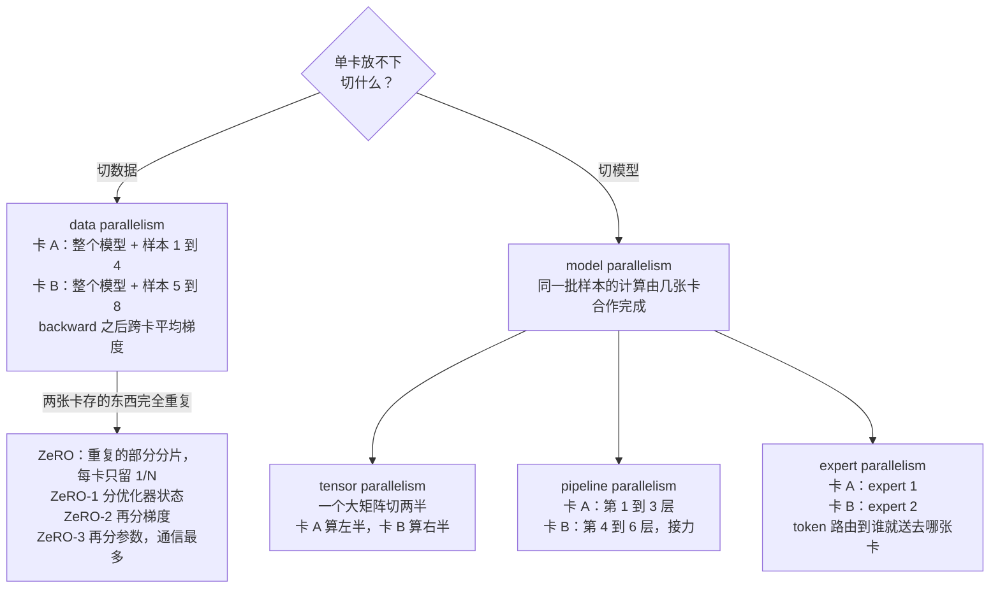
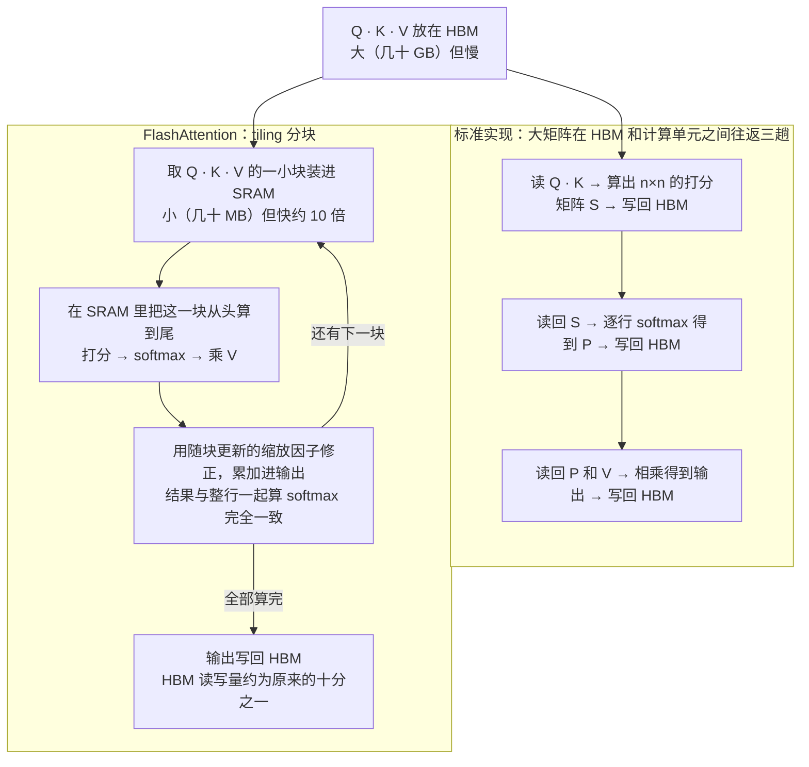
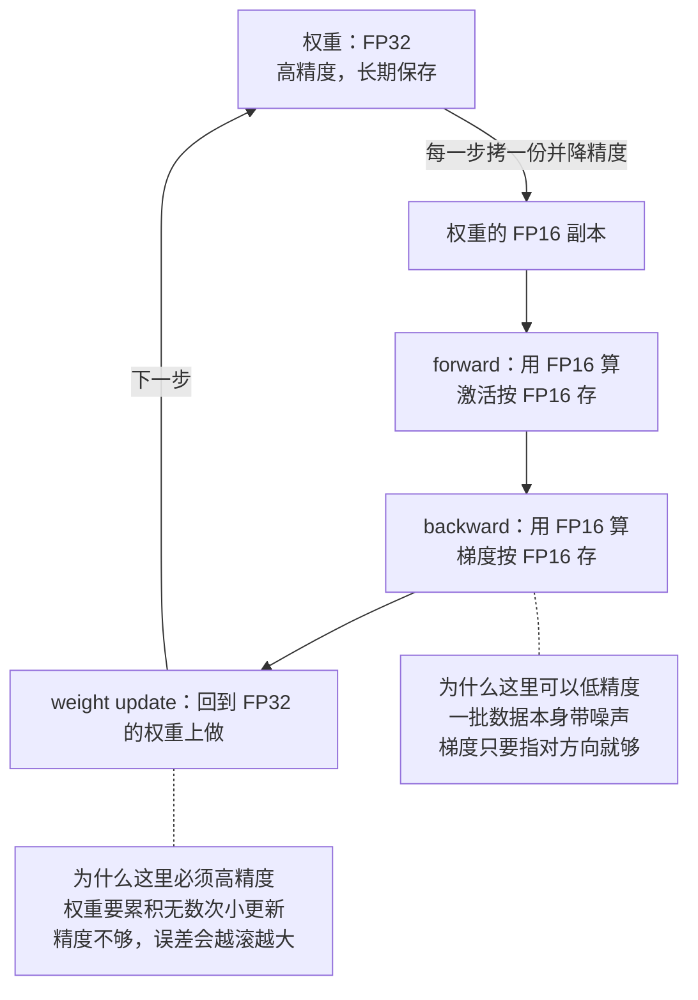
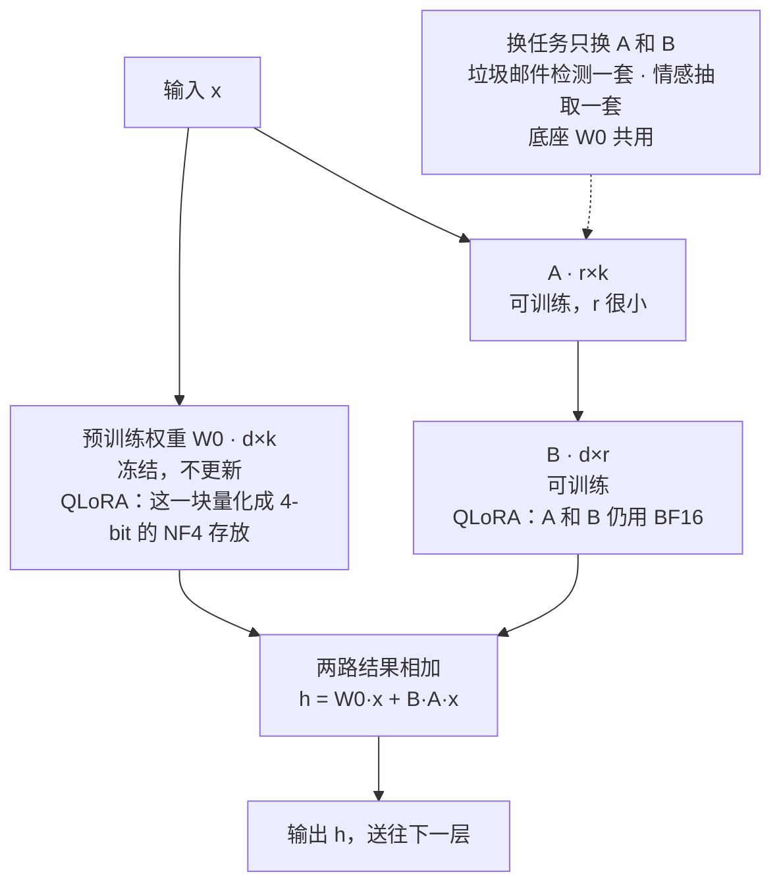

# CME295 第 4 讲｜LLM 训练（LLM Training）

> Stanford CME295: Transformers & Large Language Models（2025 秋）· 第 4 讲，2025 年 10 月 17 日（期中考试前的最后一讲）
> 视频：<https://www.youtube.com/watch?v=VlA_jt_3Qc4>（1:47:27；英文字幕为自动生成，缩写和专名错得较多，见文末勘误）
> 讲者：Afshine Amidi（开场到 1:02:23：预训练与训练优化）· Shervine Amidi（1:02:23 起：SFT、评测、LoRA / QLoRA）
> 课程大纲：<https://cme295.stanford.edu/syllabus/>

**一句话**：LLM 的训练分两大步——先在数千亿到十几万亿 token 的原始文本上做"预测下一个 token"的预训练（约 10^25 FLOPs，模型大小和数据量按 Chinchilla 的"每个参数约 20 个 token"搭配），为此得靠数据并行加 ZeRO、模型并行、FlashAttention 和混合精度，把参数、激活、梯度、优化器状态塞进每张只有 80 GB 的 GPU；再用小几个数量级的高质量"指令—回答"数据做 SFT（loss 只算回答部分），把只会续写的 base model 变成助手，算力不够就用 LoRA / QLoRA 只训练一个低秩增量——而"调得好不好"，至今没有哪一个数字说得清。

## 时间轴

| 时间 | 内容 |
|---|---|
| [0:00](https://www.youtube.com/watch?v=VlA_jt_3Qc4&t=0s) | 课务：下周期中（第 1–4 讲，闭卷）；12 月 10 日期末（第 5–9 讲） |
| [4:11](https://www.youtube.com/watch?v=VlA_jt_3Qc4&t=251s) | 回顾第 3 讲：MoE、三种解码方式与 temperature、KV cache 等推理优化 |
| [7:19](https://www.youtube.com/watch?v=VlA_jt_3Qc4&t=439s) | 从"一任务一模型"到 transfer learning；LLM 的两阶段范式 |
| [10:24](https://www.youtube.com/watch?v=VlA_jt_3Qc4&t=624s) | 预训练：预测下一个 token；Common Crawl 等数据来源；GPT-3 300B、Llama 3 15T token |
| [13:26](https://www.youtube.com/watch?v=VlA_jt_3Qc4&t=806s) | 两个记号：FLOPs（计算量）与 FLOPS（硬件速度） |
| [16:34](https://www.youtube.com/watch?v=VlA_jt_3Qc4&t=994s) | Scaling laws：算力、数据、参数越多越好；大模型更 sample efficient |
| [18:37](https://www.youtube.com/watch?v=VlA_jt_3Qc4&t=1117s) | 固定算力怎么分：IsoFLOP 曲线、Chinchilla 的 20 倍经验值；GPT-3 训练不足 |
| [20:09](https://www.youtube.com/watch?v=VlA_jt_3Qc4&t=1209s) | 问答：架构影响不大；跨代模型之间有没有迁移，没法一概而论 |
| [21:55](https://www.youtube.com/watch?v=VlA_jt_3Qc4&t=1315s) | 预训练的难处：成本、knowledge cutoff、知识编辑、照搬训练数据 |
| [24:49](https://www.youtube.com/watch?v=VlA_jt_3Qc4&t=1489s) | 训练优化总览：矩阵乘法与 GPU / TPU |
| [26:34](https://www.youtube.com/watch?v=VlA_jt_3Qc4&t=1594s) | 训练一步要存什么：激活、梯度、Adam 的两个 moment |
| [30:13](https://www.youtube.com/watch?v=VlA_jt_3Qc4&t=1813s) | 显存有限：H100 每张 80 GB，只能多卡分摊 |
| [31:09](https://www.youtube.com/watch?v=VlA_jt_3Qc4&t=1869s) | Data parallelism：切 batch、每卡一份模型、梯度取平均；通信代价 |
| [33:51](https://www.youtube.com/watch?v=VlA_jt_3Qc4&t=2031s) | ZeRO：优化器状态、梯度、参数逐级分片 |
| [35:51](https://www.youtube.com/watch?v=VlA_jt_3Qc4&t=2151s) | Model parallelism：expert / tensor / pipeline 三种 |
| [38:26](https://www.youtube.com/watch?v=VlA_jt_3Qc4&t=2306s) | FlashAttention：GPU 的两种内存 HBM 与 SRAM |
| [40:39](https://www.youtube.com/watch?v=VlA_jt_3Qc4&t=2439s) | 标准 attention 的三趟 HBM 读写；softmax 按行归一化带来的困难 |
| [43:17](https://www.youtube.com/watch?v=VlA_jt_3Qc4&t=2597s) | tiling，以及分块 softmax 的缩放因子技巧 |
| [47:25](https://www.youtube.com/watch?v=VlA_jt_3Qc4&t=2845s) | 问答：切的是整行还是网格；缩放因子是精确迭代算出来的 |
| [49:30](https://www.youtube.com/watch?v=VlA_jt_3Qc4&t=2970s) | 第二个想法 recomputation；结果表：多算了，却更快更省 |
| [52:37](https://www.youtube.com/watch?v=VlA_jt_3Qc4&t=3157s) | Quantization：浮点数的 sign / exponent / mantissa；FP32、FP16、FP64、BF16 |
| [55:14](https://www.youtube.com/watch?v=VlA_jt_3Qc4&t=3314s) | 同一张 GPU，精度越低算得越快 |
| [56:00](https://www.youtube.com/watch?v=VlA_jt_3Qc4&t=3360s) | Mixed precision training：权重 FP32，forward / backward 用 FP16 |
| [58:52](https://www.youtube.com/watch?v=VlA_jt_3Qc4&t=3532s) | 问答：是否所有层都降精度；各家自己重做 scaling law（Llama 3 的 405B）；量化的数值范围 |
| [1:02:31](https://www.youtube.com/watch?v=VlA_jt_3Qc4&t=3751s) | Shervine 接手：base model 只会续写（泰迪熊例子） |
| [1:05:29](https://www.youtube.com/watch?v=VlA_jt_3Qc4&t=3929s) | SFT 的定义；目标函数：loss 只算输出部分 |
| [1:09:21](https://www.youtube.com/watch?v=VlA_jt_3Qc4&t=4161s) | Instruction tuning 的数据：类别、人工与合成、安全（拒答与 hedging） |
| [1:15:25](https://www.youtube.com/watch?v=VlA_jt_3Qc4&t=4525s) | 问答：指令没写明细节，模型怎么泛化 |
| [1:17:28](https://www.youtube.com/watch?v=VlA_jt_3Qc4&t=4648s) | 数量级：13k 条对 1,000 万条，都远小于预训练；调优后的泰迪熊回答 |
| [1:20:00](https://www.youtube.com/watch?v=VlA_jt_3Qc4&t=4800s) | SFT 的难处：数据贵、prompt 分布要对得上 |
| [1:22:02](https://www.youtube.com/watch?v=VlA_jt_3Qc4&t=4922s) | 问答：会不会背出训练样本；temperature 与多样性；归根到底靠数据 |
| [1:26:10](https://www.youtube.com/watch?v=VlA_jt_3Qc4&t=5170s) | 评测：MMLU、GSM8K 等 benchmark 的分类 |
| [1:28:16](https://www.youtube.com/watch?v=VlA_jt_3Qc4&t=5296s) | training on the test task：要比，就得处境相同 |
| [1:30:50](https://www.youtube.com/watch?v=VlA_jt_3Qc4&t=5450s) | Chatbot Arena 及其问题：不稳、可操纵、事实性、人群偏差、安全偏差 |
| [1:36:04](https://www.youtube.com/watch?v=VlA_jt_3Qc4&t=5764s) | alignment = SFT + preference tuning；新出现的 mid-training |
| [1:37:53](https://www.youtube.com/watch?v=VlA_jt_3Qc4&t=5873s) | LoRA：冻结 W0，只训练低秩的 B 和 A |
| [1:41:17](https://www.youtube.com/watch?v=VlA_jt_3Qc4&t=6077s) | LoRA 加在哪：attention 还是 FFN；学习率 10 倍、怕大 batch |
| [1:44:24](https://www.youtube.com/watch?v=VlA_jt_3Qc4&t=6264s) | 问答：rank 要不要搜 |
| [1:45:16](https://www.youtube.com/watch?v=VlA_jt_3Qc4&t=6316s) | QLoRA：NF4、double quantization、显存省约 16 倍 |

## 核心内容

### 1. 大图：从"一任务一模型"到"预训练 + 调优"

*图 4-1｜LLM 训练的几个阶段，以及本讲覆盖的范围：预训练到 SFT（自绘示意）· [▶ 看原幻灯片 9:24](https://www.youtube.com/watch?v=VlA_jt_3Qc4&t=564s)*

- **这一讲的位置**：第 1 讲讲 self-attention 和 Transformer，第 2 讲讲它的改进与变体，第 3 讲定义了 LLM（MoE、解码方式、KV cache 等推理优化）；这一讲回答"这些模型是怎么训出来的"。
- **以前的做法**：一个任务训一个模型。要检测垃圾邮件就专门训一个，要抽取情感再训一个，各自走一遍 train / validation / test。可这些任务并非互不相干——都得先读懂文字。
- **transfer learning**（迁移学习）：不从零开始，先拿一个已经学到通用能力的 pre-trained model，再针对自己的任务调权重。这个想法由来已久，LLM 的训练范式就建在它上面（图 4-1）：
    - 第一阶段 pre-training：在海量数据上训练，只求学会语言和代码本身的结构；
    - 第二阶段 tuning：从预训练好的权重出发继续训练，让模型适配具体用途。
- **阶段的名字**（Shervine 在 [1:36:04](https://www.youtube.com/watch?v=VlA_jt_3Qc4&t=5764s) 补充）：SFT 加上第 5 讲的 preference tuning，合称 alignment（对齐）。最近还冒出一个 mid-training，夹在预训练和 SFT 之间——目标函数和预训练一样，数据换成贴近目标任务的那一类。
- **本讲分工**：Afshine 讲预训练，以及"这么大的模型怎么训得动"（第 2–7 节）；Shervine 讲调优的第一步 SFT、怎么评、怎么省着调（第 8–10 节）。

### 2. 预训练：目标、数据，和两个长得几乎一样的记号

- **目标**只有一个：给定前文，预测下一个 token。第 3 讲说过，LLM 是 text-to-text 模型，九成以上是 decoder-only，一个 token 一个 token 地往后生成；预训练就是拿人类写下的一切文字来练这件事。它是整个训练流程里最贵的一步，算力、时间、钱都是。
- **数据**：能找到的都算——英文、其他语言、各种编程语言的代码。论文里最常见的名字是 Common Crawl（持续抓取的公开网页，讲者说每月约 30 亿页）；此外有 Wikipedia，有 Reddit 这类社交媒体上的对话，代码来自 GitHub、Stack Overflow 等。
- **规模**按 token 数算，量级是数千亿到数万亿、乃至十几万亿：GPT-3 用了 300B token，Llama 3 用了 15T。
- **FLOPs 与 FLOPS**：到处都在用，先分清。
    - FLOPs = floating-point operations，浮点运算的*次数*，是计算量的单位。训练一个 LLM 大约是 10^25 FLOPs 的量级。它大致正比于"参数个数 × 训练 token 数"，没有通用的精确公式，因为还取决于架构：MoE 模型每次只激活一部分参数（第 3 讲），同样的规模下算得更少。
    - FLOPS（全大写）= floating-point operations per second，每秒能做多少次浮点运算，是*硬件速度*的指标，GPU 规格表上都会标。
    - 有的论文会把两者混着写，只能看上下文。
  > 小注：最常用的近似是 C ≈ 6·N·D（Kaplan et al., 2020：每个参数、每个 token，forward 约 2 次运算，backward 约 4 次）。代进去：GPT-3 是 6 × 175B × 300B ≈ 3 × 10^23；Llama 3 405B 是 6 × 405B × 15T ≈ 4 × 10^25，和课上说的 10^25 量级对得上。

### 3. Scaling laws 与 Chinchilla：算力固定，钱该花在模型上还是数据上

- **Kaplan et al., 2020** 做了大量实验，分别改变三个量：算力、数据集大小、模型参数量。结论是任何一个变大，模型预测下一个 token 的能力都稳定变好。于是 2019 到 2024 年间，大家一路把模型往大里做。
- 论文的另一个观察：大模型更 **sample efficient**——处理同样多的 token，大模型达到的效果更好。
- **但算力有限**。Chinchilla 论文（Hoffmann et al., 2022）换了一个问法：算力预算固定，模型大小和训练 token 数怎么搭配最划算？做法是固定一个预算（图上同一种颜色的一条曲线），在这个预算内训练大小不同的模型——模型越大，喂得起的 token 越少——每条曲线都有一个最低点；把各预算下的最低点放在一起看，得到一条经验关系：**训练 token 数约为参数量的 20 倍**时，算力花得最值。
- 按这个标准，GPT-3（175B 参数只配了 300B token，不到 2 倍；按 20 倍算要 3.5T）属于严重 undertrained。

$$
C \;\approx\; k\cdot N\cdot D,\qquad D_{\mathrm{opt}} \;\approx\; 20\,N
$$

C 是训练的总计算量（FLOPs），N 是模型参数个数，D 是训练用的 token 数，k 是随架构而变的常数（见第 2 节小注）；第二个式子就是 Chinchilla 的经验结论：预算 C 给定时，让 D 约等于 20 倍的 N。

> 小注：Chinchilla 论文摘要——训练了 400 多个模型（70M 到 16B 以上参数、5B 到 500B token），结论是模型大小和 token 数应当同比例放大（模型翻一倍，token 也翻一倍）；据此训练的 Chinchilla 只有 70B 参数，但数据是 280B 的 Gopher 的 4 倍，算力相同而效果全面更好。"20 倍"是从论文的最优配置表里读出来的经验值（70B 对 1.4T token）。

- **问答**
    - 这些规律依赖具体架构吗？讲者：现在说 LLM，基本就是 decoder-only 的 Transformer；论文自己也说架构细节影响不大，起决定作用的是 token 数和模型大小。
    - 新一代模型会不会从上一代的权重出发？多数模型闭源，不公开这些，没法一概而论。
    - 换一套设置，这个配比还成立吗（[59:22](https://www.youtube.com/watch?v=VlA_jt_3Qc4&t=3562s) 的提问）？各家会在自己的设置上重做一遍：先用小模型、少量数据拟合出自己的关系，再外推到大规模。Llama 3 论文专门有一节讲这件事，405B 这个数就是这么定出来的。
- **预训练的几个难处**
    - 贵：起步数百万美元，多则数千万、上亿；耗时长；现在的论文也会报告环境成本。
    - **knowledge cutoff**（知识截止日期）：数据只收到某一天为止，base model 自己无从知道此后发生的事。各家的 model card 都会写这一行（课上翻的是 GPT-5 的页面：9 月 30 日）。
    - 事后往权重里注入或修改知识很难：没有干净的办法只改一处而不让别处退步。
    - 模型可能原样吐出训练时见过的内容，有抄袭风险。
  > 小注：OpenAI 的模型页面上，GPT-5 的 knowledge cutoff 是 2024 年 9 月 30 日，而模型 2025 年 8 月才发布——两者隔了将近一年，这段时间里发生的事模型一概不知。

### 4. 训练一步，显存花在哪

*图 4-2｜训练一步的三个环节，以及显存里常驻的四类东西（自绘示意）· [▶ 看原幻灯片 26:34](https://www.youtube.com/watch?v=VlA_jt_3Qc4&t=1594s)*

- **为什么要关心显存**：Transformer 的计算几乎全是矩阵乘法，这正是 GPU 擅长的（Google 用自研的 TPU）。但一张卡的显存有限——课上翻的 H100 规格表上是每张 80 GB——而训练时要同时放下的东西远不止模型本身。
- **一步训练的三个环节**（图 4-2）
    1. *forward pass*：一批数据逐层算过去，得到 loss（预测和标签差多少）。途中每层算出的中间值叫 **activations**（激活），算 loss 要用，backward 时链式法则也要用（第 6 节会回到这一点），所以得留在显存里。它有多大，取决于模型大小、batch size 和上下文长度——self-attention 是 O(n²)，序列一长这部分涨得很快。
    2. *backward pass*：求 loss 对每个参数的 **gradient**（梯度），也就是"往哪个方向调，loss 会变小"。每个参数一个梯度，同样要存。
    3. *weight update*：按梯度改权重。常用的 Adam 优化器还要为每个参数维护两个量——first moment 和 second moment，即梯度和梯度平方的滑动平均。这些就是 **optimizer states**（优化器状态），也要存。

$$
m_t=\beta_1 m_{t-1}+(1-\beta_1)\,g_t,\qquad v_t=\beta_2 v_{t-1}+(1-\beta_2)\,g_t^{2}
$$

g_t 是第 t 步算出的梯度，m_t 和 v_t 是梯度与梯度平方的滑动平均（即 first / second moment），β1、β2 是控制"记多久"的衰减系数；每个参数都有自己的 m 和 v，所以光优化器状态就是参数量的两倍。

> 小注：ZeRO 论文给过一个记账方式（混合精度 + Adam）：每个参数占 2 字节的 FP16 权重 + 2 字节的 FP16 梯度 + 12 字节（FP32 的权重副本、m、v 各 4 字节）= 16 字节。一个 7.5B 参数的模型光这几项就要约 120 GB，一张 80 GB 的卡已经放不下，还没算激活。

- **结论**：单卡装不下，只能用多张卡把负载分摊出去。接下来几节的方法，都在回答"怎么分"和"怎么省"。

### 5. 多卡并行：切数据，还是切模型

*图 4-3｜以两张卡为例，各种并行策略下每张卡上放什么（自绘示意）· [▶ 看原幻灯片 31:09](https://www.youtube.com/watch?v=VlA_jt_3Qc4&t=1869s) · 出处：[Rajbhandari et al., 2019](https://arxiv.org/abs/1910.02054)*

- **Data parallelism**（DP，数据并行）：把一个 batch 切成几份分给各张卡，每张卡都放一份完整的模型，各自独立做 forward 和 backward。省下的是和 batch size 挂钩的那部分显存。
    - 梯度怎么办（学生问）：各卡算出的梯度不同，更新之前要跨卡通信、取平均，保证每张卡上的模型始终一致。
    - 代价有两条：每张卡仍得放得下一整份模型（学生答出来的）；卡间通信让训练变慢。
- **ZeRO**（Zero Redundancy Optimization）：DP 下每张卡存着一模一样的参数、梯度、优化器状态，纯属重复。ZeRO 把它们分片（shard / partition），每张卡只保管自己那一份：
    - ZeRO-1：只分优化器状态，这一项就能省掉很多；
    - ZeRO-2：梯度也分；
    - ZeRO-3：参数也分，卡上不再有任何冗余信息。
    - 分得越细，通信越多。选哪一级，看模型有多大、对训练时间有多敏感；放得下就不必分。
  > 小注：ZeRO 论文 Figure 1 的例子（7.5B 参数、64 张卡）：每卡 120 GB → ZeRO-1 31.4 GB → ZeRO-2 16.6 GB → ZeRO-3 1.9 GB。PyTorch 里的 FSDP 是同一思路的实现。
- **Model parallelism**（模型并行）：连同一个 batch 内部的计算也拆到多张卡上。讲者不想念目录，只点了三种，要求知道大意即可：
    - *tensor parallelism*：把一次大矩阵乘法切开，每张卡算一块，单卡要放的东西就小了；
    - *pipeline parallelism*：按层切，一张卡负责第 1–3 层，下一张负责第 4–6 层，依次接力；
    - *expert parallelism*：MoE 模型（第 3 讲）的各个 expert 放在不同的卡上。
  > 小注：真正的大规模训练是把这几种叠起来用的。Llama 3 论文里，405B 同时用了 tensor、pipeline、context、data 四种并行（论文称 4D parallelism）。

### 6. FlashAttention：少搬数据，结果一位不差

*图 4-4｜标准 attention 与 FlashAttention 的数据搬运对比（自绘示意）· [▶ 看原幻灯片 41:41](https://www.youtube.com/watch?v=VlA_jt_3Qc4&t=2501s) · 出处：[Dao et al., 2022](https://arxiv.org/abs/2205.14135)*

- **动机：GPU 里有两种内存**（这项工作 2022 年出自 Stanford）
    - HBM（high bandwidth memory）：规格表上写的那个"显存"，几十 GB，大但相对慢；
    - SRAM：和计算单元在同一块芯片上，只有几十 MB，但快一个数量级（讲者给的量级：HBM 每秒几 TB，SRAM 每秒几十 TB）。
- **标准 attention 慢在哪**：第 1 讲的公式拆开是三步——

$$
S=\frac{QK^{\top}}{\sqrt{d_k}}\in\mathbb{R}^{n\times n},\qquad P=\mathrm{softmax}_{\mathrm{row}}(S),\qquad O=PV
$$

Q、K、V 各有 n 行（n 是序列长度，每行是一个 token 的向量），d_k 是 key 的维度，S 是 n×n 的打分矩阵，P 是对 S 逐行做 softmax 的结果，O 是输出。

- 不做优化时，Q、K、V 放在 HBM 里，三步每一步都是"从 HBM 读进来、算、写回 HBM"（图 4-4 左）。GPU 算得极快，时间大多耗在这几趟搬运上——瓶颈是 IO，不是计算。
- **为什么看上去没法分块**：softmax 是按行归一化的（每行加起来等于 1），似乎必须先拿到整行才能算。
- **核心技巧**：其实不必。把一行切成几块，各自做 softmax，再各乘一个缩放因子，就等于整行一起做的 softmax：

$$
\mathrm{softmax}\big([\,S_1\;\;S_2\,]\big)=\big[\,\alpha_1\,\mathrm{softmax}(S_1)\;\;\;\alpha_2\,\mathrm{softmax}(S_2)\,\big],\qquad \alpha_i=\frac{\sum_j e^{S_{i,j}}}{\sum_j e^{S_{1,j}}+\sum_j e^{S_{2,j}}}
$$

S_1、S_2 是同一行打分切成的两块，α_i 是第 i 块的指数和占整行指数和的比例——softmax 的分母是整行共用的一个数，分块之后只需把这个分母修正回来。

> 小注：α 的表达式课上没有写（讲者说公式在论文里，不要求记），这里按 softmax 的定义补出。实际算法边算边维护"到目前为止的指数和"，每来一块就把已有的结果重新缩放一次，所以最后的结果是精确的。

- **tiling**（分块）：于是可以把 Q、K、V 切成小块，一块块送进 SRAM，在里面把"打分 → softmax → 乘 V"从头到尾算完，累加到输出里，最后才写回 HBM（图 4-4 右）。对 HBM 的读写大幅减少。
- 讲者反复强调这是 **exact** attention：没有任何近似，只是换了计算的组织方式。学生问缩放因子是不是估出来的——不是，是迭代着精确算出来的。幻灯片为了好画，一次切的是整行整列；实际可以把矩阵切成任意网格。
- **第二个想法：recomputation**（重计算）。backward 时链式法则要用到 forward 的激活（第 4 节）。既然 attention 现在算得很快，那就不存、或者少存这些激活，backward 时现场再算一遍。
- **结果**：论文的对比表里，FlashAttention 的计算量（GFLOPs）反而更多——因为重算；但 HBM 读写从 40.3 降到 4.4，将近 10 倍，运行时间也更短。通常"重计算"是拿时间换显存，这里时间和显存两头都赚。
  > 小注：论文 Figure 2（GPT-2 medium，A100）：标准 attention 66.6 GFLOPs、HBM 读写 40.3 GB、41.7 ms；FlashAttention 75.2 GFLOPs、4.4 GB、7.3 ms。摘要里的端到端训练加速：BERT-large 15%，GPT-2（序列长 1K）3 倍。
- FlashAttention-2、-3 是同一思路针对新一代 GPU 的再适配——每代硬件的长处短处不同，总有再优化的空间。

### 7. 量化与混合精度训练

*图 4-5｜混合精度训练：哪一步用哪种精度，以及讲者给的直觉（自绘示意）· [▶ 看原幻灯片 56:15](https://www.youtube.com/watch?v=VlA_jt_3Qc4&t=3375s) · 出处：[Micikevicius et al., 2017](https://arxiv.org/abs/1710.03740)*

- **问题**：权重都是浮点数。小数点后那么多位，真的都需要吗？能不能降一点精度来省显存，而效果基本不变？**Quantization**（量化）就是把数从一种精度的表示换成另一种（通常更低的）精度。
- **浮点数怎么存**：一串 bit 分三段——1 位符号（sign）、若干位指数（exponent，决定能表示多大多小的范围）、若干位尾数（mantissa，决定刻度有多细）。课上的表列了四种格式：

| 格式 | 总位数 | 符号 / 指数 / 尾数 | 特点 |
|---|---|---|---|
| FP64（双精度） | 64 | 1 / 11 / 52 | 刻度最细，也最慢 |
| FP32（单精度） | 32 | 1 / 8 / 23 | 传统的默认精度 |
| FP16（半精度） | 16 | 1 / 5 / 10 | 内存减半，但范围窄、刻度粗 |
| BF16（bfloat16，brain float） | 16 | 1 / 8 / 7 | 范围和 FP32 一样，刻度更粗 |

> 小注：各段的位数是这几种格式的标准定义，幻灯片的表里有，讲者没有逐个念。

- **低精度不只省显存，还更快**：同一张 GPU 规格表上，算力（FLOPS）随数据格式而变——讲者念的数是 FP64 约 34 teraFLOPS，换成 FP32 大致翻倍，更低的精度还要更高。
- **Mixed precision training**（混合精度训练）（图 4-5）：权重保持 FP32；forward 和 backward 里的运算全部用 FP16；权重更新仍然在 FP32 上做。论文作者发现效果几乎不降，显存和速度却都赚了。
- **为什么这样分工**（讲者给的直觉）：一批数据本身就带噪声，算出来的梯度只是告诉权重"大致往哪个方向走"，小数点后很多位没有意义；而权重要长期累积无数次小更新，精度不够的话，量化误差会一步步滚大。
  > 小注：原论文摘要——保留一份 FP32 的权重副本（master weights）来累积更新，每一步再舍入成 FP16 去做 forward / backward；另配 loss scaling（先把 loss 放大再反传，防止很小的梯度在 FP16 下变成 0）；显存占用接近减半。loss scaling 课上没提。现在更常用 BF16：指数位和 FP32 一样多，数值范围相同，一般不需要 loss scaling。
- **问答**
    - 所有层、所有权重都这样处理吗？不一定，变体很多，有些部分更敏感，需要保留高精度。
    - 低精度能表示的范围不够怎么办？量化有多种方案，讲者点了两个名字：zero-point quantization 和 absmax quantization；第 10 节 QLoRA 里的 NF4 也是冲着这个问题设计的。

### 8. SFT 与 instruction tuning：把"续写机"变成助手

- **base model 的问题**（Shervine 的泰迪熊例子）：问预训练好的模型"泰迪熊脏了，能放进洗衣机吗？"，它不会回答你。它学的只是"接下来最可能出现什么文字"，所以可能接着再抛一个问题（学生猜的），或者续一句关于泰迪熊材质的话——只是在模仿语料里的模式，不是助手。
- **SFT**（supervised fine-tuning，监督微调）：supervised 指需要标签，数据是成对的"输入、期望输出"；fine-tuning 指从预训练好的权重出发继续训练，而不是从头来。
- **目标函数的关键区别**：形式上还是预测下一个 token，但 loss 只算在输出部分。输入是给定的条件，我们不想让模型学着复述用户的话，而是学"在这个输入之后，什么样的回答最好"。

$$
\mathcal{L}_{\mathrm{SFT}}=-\sum_{t=1}^{T}\log p_\theta\left(y_t \mid x,\,y_{<t}\right)
$$

x 是指令（prompt），y_1 到 y_T 是标准回答的各个 token，θ 是模型参数；求和只跑在回答的 token 上，指令部分不计 loss。预训练则是从 BOS 开始，语料的每个位置都算。

| | 预训练 | SFT |
|---|---|---|
| 数据 | 原始文本，没有人工标注 | "指令、回答"对，精挑细选 |
| loss 算在哪 | 每一个 token 位置 | 只算回答部分 |
| 数据量（课上的数） | GPT-3 300B token · Llama 3 15T token | GPT-3 约 13k 条 · Llama 3 约 1,000 万条 |
| 学到什么 | 语言、代码和其中携带的知识 | 以什么方式回应指令 |

- **instruction tuning**（指令微调）：SFT 可以拿来适配你自己的某个任务；当目的是让通用模型学会回应指令、成为有用的助手时，这一类 SFT 叫 instruction tuning，它是今天各家 LLM 训练的主要阶段之一。
- **数据长什么样**
    - 类别：写故事、写诗、列清单、解释概念……覆盖用户可能提出的各类请求，每条指令配一个标准回答；还有数学（证明怎么一步步写）和高质量的代码。
    - 来源：早期几乎全靠人写——专业的语言学家按一套细则，写出流畅、有帮助的回答。现在可以让已有的强模型生成候选回答，再由人或另一个 LLM 审核，整理数据集快了不少。
    - **安全**：目标是 helpful 而且 harmless。数据配比（data mixture）里通常有一部分专门教模型不要复述预训练语料里的有害内容：对有害请求拒答，或者用 hedging 的方式留有余地、不下一刀切的断言。拒答也可以在模型外面用正则拦，但不可扩展，所以通常是训进模型里的。
- **数量级**：GPT-3 约 13k 条样本，Llama 3 约 1,000 万条。就算每条 1,000 个 token，也比预训练小好几个数量级。心智模型：预训练量大而粗，学语言的通用规律；SFT 量小而精，把模型的目标对准你要的用途。
  > 小注：13k 这个数应出自 InstructGPT（Ouyang et al., 2022）——它在 GPT-3 上用标注员写的示范做监督微调，SFT 数据集约 13k 条训练 prompt；GPT-3 原论文本身没有 SFT 阶段。
- 调完之后再问泰迪熊：模型会正面回答——最好别机洗，建议手洗。
- **SFT 的四个难处**
    1. 高质量数据贵：要人参与，要符合一整套准则。好在数据集可以复用、逐步补充。
    2. 分布要对得上：SFT 的 prompt 分布应当贴近真实使用时的分布。学生问：训练样本只说"写个故事"，没说什么体裁，模型怎么泛化？讲者：靠预训练积累的知识——SFT 教会的是"写故事"这件事本身，细节模型能自己补。但差得太远就可能失灵，比如训练里都是课本式的故事，用户要的却是电影剧情式的。
    3. 评估难（第 9 节）。
    4. 计算开销大（第 10 节）。
- **问答**
    - 把某条 SFT 训练输入原样再喂给模型，会得到训练时的那个故事吗？多半不会逐字相同——采样时 temperature 不为零；风格可能相近，取决于预训练见过什么。temperature 越高，越容易走到输出分布里不那么常见的区域（第 3 讲）。
    - 想让回答更多样，除了调 temperature 呢？讲者说答案简单但难办：在这个类别里放更多、铺得更开的数据。数据点在分布空间里散得开，模型才抓得住要学的要点，而不是反复背同一个故事。

### 9. 调完怎么评：没有一个数字说得清

- **benchmark 的分类**：通用语言理解（MMLU，Massive Multitask Language Understanding，几十个子任务）、推理、数学推理（GSM8K）、代码生成……新 benchmark 不断冒出来，因为大家会冲着已有的去优化，总会留下新的缺口。
  > 小注：MMLU 共 57 个学科；GSM8K 是 Grade School Math 8K，约 8.5K 道小学水平的数学应用题——讲者对 G 代表什么没有把握，说成了高中水平。
- **training on the test task**（注意不是 test *set*）：同一类模型在某个 benchmark 上的分数有时会突然跳一截，却说不出原因。一篇论文（应为 Dominguez-Olmedo et al., 2024）指出：训练数据里有没有"和这个测试任务同类的数据"影响很大——不少 benchmark 本身就附带一份 auxiliary training set。要公平地比两个模型，必须保证它们在这一点上处境相同：要么都在测试任务上训练过，要么都没有；否则比出来的不是模型本身的能力。
  > 小注：论文的做法是评测前先把每个模型都在同一份任务相关数据上微调一遍；这样处理之后，所谓"涌现能力"也变成了随规模逐渐出现，而不是突然出现。
- **分数高不等于好用**：benchmark 一出来，训练数据就会越做越像它，结果模型处处高分，用户却感觉不到差别。这不怪模型，也不怪 benchmark——"模型对你有多大价值"本来就很难压成一个数。
- **Chatbot Arena**：用户提问，两个模型各答一份，用户选更好的；网站用成对比较的结果算出排名，相当于给用户的"vibes"打了个分。问题同样不少：
    - 不稳：新模型刚上榜时碰到哪些对手带有随机性，头几场对排名影响很大。
    - 可操纵：有论文表明，只要能从回答里认出是哪个模型（最简单的办法是问一句"你是谁"），恶意投票者就可以专给目标模型投票。
    - 用户判断不了事实性："用冷水机洗"听上去具体、可操作，用户会觉得有帮助，可它对不对，用户并不知道；专家整理的 benchmark 则有明确的准则判定事实对错。
    - 投票人群不等于真实用户群：比如回答里的 emoji，大众多半喜欢，领域专家可能反感。
    - 安全偏差：用户不喜欢被拒答，投票天然偏向有问必答的模型，哪怕拒答才是产品想要的行为。
  > 小注：讲者没报论文题目，可能是 Min et al., 2025（用水印或分类器认出目标模型，几百张新票就能改变排名）或 Huang et al., 2025（识别模型的准确率超过 95%，约一千票可以操纵排名）。
- **结论**：评测要多个角度合起来看，最后取决于你自己的用途——看清每个模型的长处短处，再对照自己的场景。第 8 讲专门讲评测。

### 10. LoRA 与 QLoRA：只训练一个低秩增量

*图 4-6｜LoRA 的两路 forward，以及 QLoRA 改了哪一块（自绘示意）· [▶ 看原幻灯片 1:38:11](https://www.youtube.com/watch?v=VlA_jt_3Qc4&t=5891s) · 出处：[Hu et al., 2021](https://arxiv.org/abs/2106.09685)*

- **动机**：全量微调要更新每一个权重，计算开销大。LoRA（low-rank adaptation）是最常用的参数高效微调（parameter-efficient fine-tuning）方法。
- **做法**：不直接改权重矩阵，而是把它写成"冻结的预训练权重 + 一个低秩的增量"——

$$
W=W_0+BA,\qquad B\in\mathbb{R}^{d\times r},\quad A\in\mathbb{R}^{r\times k},\quad r\ll\min(d,k)
$$

W_0 是冻结的预训练权重（d 行 k 列），B 和 A 是新加的、唯一要训练的两个矩阵，r 是它们的秩（rank）；可训练参数从 d × k 个变成 r × (d + k) 个。

- W 的维度通常是几百到几千，r 通常只有十来个以内（讲者说 4 就很常见）。举例：d = k = 4096、r = 8 时，全量是约 1,680 万个参数，LoRA 只有约 6.6 万个，少 256 倍。forward 时两路分别算，结果相加（图 4-6）。
  > 小注：联系第 4 节——W0 不更新，就不必为它存梯度和 Adam 的两份状态，这才是省显存的大头。LoRA 论文摘要的数字：相对 GPT-3 175B 的 Adam 全量微调，可训练参数少 10,000 倍，显存需求少 3 倍；和 adapter 不同，它不增加推理延迟。
- **任务专属的 A、B**：同一个 base model，垃圾邮件检测训一套 A、B，情感抽取再训一套；底座共用，按需切换。
- **加在哪些层**：原论文只加在 attention 的权重矩阵上，后来发现那不是收益最大的位置。讲者引了"几周前"的一篇博客（应为 Thinking Machines 的 [LoRA Without Regret](https://thinkingmachines.ai/blog/lora/)，2025 年 9 月）：加在 feed-forward 层收益最大。现在通常两处都加，但主要增益来自 FFN。
- **两个经验性质**（同一来源；讲者说没有严格的理论解释，只转述了研究者的猜测）
    - 学习率要比全量微调高，经验值约 10 倍——猜测是秩很小，要探索的空间需要更大的步子；
    - batch size 大了效果变差——猜测是"两个矩阵的乘积"的训练动力学和一个完整矩阵不同。
- 其他参数高效的方法：prefix tuning、adapters，课程教材里有，用得少，没展开。
- **问答**：r 要不要 grid search？可以，但它就是个设计选择，通常前人已经试过，直接挑一个常见值即可——参数量已经降了几个数量级，再抠一点意义不大。
- **QLoRA**（最后两分钟）：在 LoRA 的基础上，把冻结的 W0 量化成 4-bit 存放，A、B 仍用 BF16 训练。
    - **NF4**（4-bit NormalFloat）：假设权重服从正态分布，按分位数（quantile）而不是等宽的区间来划分取值，让每个取值对应大致同样多的权重——有限的几个 bit 用得最充分。
    - **double quantization**：量化会产生一批"量化常数"（用来在量化值和原值之间来回换算），把这些常数再量化一次。额外省得不多，但值得知道。
    - 效果：讲者给的数是显存节省约 16 倍。
  > 小注：QLoRA 摘要——65B 参数的模型可以在单张 48 GB 的 GPU 上微调，效果与 16-bit 全量微调持平。论文正文里，16-bit 全量微调 65B 需要 780 GB 以上显存，780 ÷ 48 ≈ 16，应是"16 倍"的来源。论文的第三个技巧 paged optimizers（应对显存尖峰）课上没提。

### 11. 放在一起看：每个手段省的是哪一块

| 手段 | 对准哪一块 | 课上提到的代价 |
|---|---|---|
| data parallelism | 和 batch size 挂钩的显存，分摊到多卡 | 每卡仍要放下整份模型；梯度聚合的通信让训练变慢 |
| ZeRO-1 / 2 / 3 | 各卡重复保存的优化器状态 / 梯度 / 参数 | 分得越细，通信越多 |
| tensor / pipeline / expert parallelism | 单卡放不下的模型本身 | 课上没展开 |
| FlashAttention | attention 的 HBM 读写；配合 recomputation 少存激活 | 多做一些 FLOPs，但总时间反而更短 |
| mixed precision | 激活和梯度的字节数，顺带算得更快 | 权重和更新仍要留在 FP32 |
| LoRA | 要训练的参数量，少几个数量级 | 学习率要重调（约 10 倍）；大 batch 下效果变差 |
| QLoRA | 冻结权重 W0 自身占的显存（4-bit） | 课上没展开 |

## 关键图表速查（点时间戳跳到原幻灯片）

| 图 | 看什么 | 跳转 | 出处 |
|---|---|---|---|
| Scaling laws 三联图 | 算力、数据集大小、参数量各自增大时，loss 都稳定下降 | [17:04](https://www.youtube.com/watch?v=VlA_jt_3Qc4&t=1024s) | [Kaplan et al., 2020](https://arxiv.org/abs/2001.08361) |
| IsoFLOP 曲线 | 一种颜色一个算力预算；每条曲线的最低点就是该预算下最划算的模型大小 | [18:37](https://www.youtube.com/watch?v=VlA_jt_3Qc4&t=1117s) | [Hoffmann et al., 2022](https://arxiv.org/abs/2203.15556) |
| 最优配置表 | 参数量与 token 数大约 1 : 20；拿 GPT-3 的 175B / 300B 对照 | [19:39](https://www.youtube.com/watch?v=VlA_jt_3Qc4&t=1179s) | 同上 |
| 训练一步的示意 | 依次点出要存的三样：activations、gradients、Adam 的两个 moment | [27:06](https://www.youtube.com/watch?v=VlA_jt_3Qc4&t=1626s) | — |
| H100 规格表 | GPU memory 一行：80 GB；[55:14](https://www.youtube.com/watch?v=VlA_jt_3Qc4&t=3314s) 再看各精度下的算力 | [30:13](https://www.youtube.com/watch?v=VlA_jt_3Qc4&t=1813s) | NVIDIA 规格表 |
| ZeRO 分片示意 | 三级：优化器状态 → 梯度 → 参数，每一级每卡占用都更少 | [34:22](https://www.youtube.com/watch?v=VlA_jt_3Qc4&t=2062s) | [ZeRO](https://arxiv.org/abs/1910.02054) |
| GPU 内存层级 | HBM 大而慢、SRAM 小而快，带宽差约 10 倍 | [39:01](https://www.youtube.com/watch?v=VlA_jt_3Qc4&t=2341s) | [FlashAttention](https://arxiv.org/abs/2205.14135) |
| 分块 softmax 等式 | 整行 softmax = 各块 softmax 乘各自的缩放因子 | [44:51](https://www.youtube.com/watch?v=VlA_jt_3Qc4&t=2691s) | 同上 |
| tiling 动画 | 绿色是从 SRAM 读，蓝色是从 HBM 读；输出矩阵被一块块填满 | [45:52](https://www.youtube.com/watch?v=VlA_jt_3Qc4&t=2752s) | 同上 |
| FlashAttention 结果表 | GFLOPs 变多，HBM 读写 40.3 → 4.4，运行时间反而更短 | [50:35](https://www.youtube.com/watch?v=VlA_jt_3Qc4&t=3035s) | 同上 |
| 浮点格式表 | sign / exponent / mantissa 各占几位；FP16 和 BF16 差在哪 | [53:40](https://www.youtube.com/watch?v=VlA_jt_3Qc4&t=3220s) | — |
| 混合精度流程 | 权重 FP32，forward / backward FP16，更新回到 FP32 | [56:15](https://www.youtube.com/watch?v=VlA_jt_3Qc4&t=3375s) | [Micikevicius et al., 2017](https://arxiv.org/abs/1710.03740) |
| SFT 的 loss 位置 | 指令部分不算 loss，黄色的回答部分才算 | [1:11:10](https://www.youtube.com/watch?v=VlA_jt_3Qc4&t=4270s) | — |
| LoRA 分解图 / QLoRA | W0 冻结，旁路 B·A；QLoRA（[1:45:57](https://www.youtube.com/watch?v=VlA_jt_3Qc4&t=6357s)）里 W0 换成 NF4 | [1:38:11](https://www.youtube.com/watch?v=VlA_jt_3Qc4&t=5891s) | [LoRA](https://arxiv.org/abs/2106.09685) · [QLoRA](https://arxiv.org/abs/2305.14314) |

## 提到的工作

| 名称 | 在本讲里的作用 |
|---|---|
| transfer learning | 两阶段范式的思想来源：不从零开始，先预训练再调 |
| [Common Crawl](https://commoncrawl.org/) | 预训练语料的代表：持续抓取的公开网页，每月约 30 亿页 |
| [GPT-3](https://arxiv.org/abs/2005.14165)（Brown et al., 2020） | 175B 参数、300B token；按 Chinchilla 标准训练不足的例子 |
| [Llama 3](https://arxiv.org/abs/2407.21783)（2024） | 15T token 的预训练；自己重做 scaling law 定出 405B；SFT 约 1,000 万条 |
| [Scaling Laws for Neural Language Models](https://arxiv.org/abs/2001.08361)（Kaplan et al., 2020） | 算力、数据、参数与 loss 的关系；大模型更 sample efficient；架构细节影响小 |
| [Chinchilla](https://arxiv.org/abs/2203.15556)（Hoffmann et al., 2022） | 固定算力下的最优配比：token 数约为参数量的 20 倍 |
| GPT-5 的 model card | knowledge cutoff 那一行的示例 |
| NVIDIA H100 · Google TPU | 显存 80 GB、各精度算力的规格表示例；TPU 是 Google 自研的替代 |
| [Adam](https://arxiv.org/abs/1412.6980)（Kingma & Ba, 2014） | 优化器；它的 first / second moment 就是要额外存的优化器状态 |
| [ZeRO](https://arxiv.org/abs/1910.02054)（Rajbhandari et al., 2019） | 给数据并行去冗余：三级分片 |
| expert / tensor / pipeline parallelism | 模型并行的三种，只讲了大意 |
| [FlashAttention](https://arxiv.org/abs/2205.14135)（Dao et al., 2022） | IO-aware 的精确 attention：tiling 加 recomputation |
| [FlashAttention-2](https://arxiv.org/abs/2307.08691) · [FlashAttention-3](https://arxiv.org/abs/2407.08608) | 同一思路针对新一代 GPU 的再适配 |
| [Mixed Precision Training](https://arxiv.org/abs/1710.03740)（Micikevicius et al., 2017） | 权重 FP32、计算 FP16 的混合精度做法 |
| zero-point / absmax quantization | 问答里点名的两种处理数值范围的量化方案 |
| [InstructGPT](https://arxiv.org/abs/2203.02155)（Ouyang et al., 2022） | 课上"GPT-3 约 13k 条 SFT 样本"应出自这里 |
| [MMLU](https://arxiv.org/abs/2009.03300) · [GSM8K](https://arxiv.org/abs/2110.14168) | 通用知识与数学推理 benchmark 的代表 |
| [Training on the Test Task](https://arxiv.org/abs/2407.07890)（Dominguez-Olmedo et al., 2024） | 解释 benchmark 分数的突然跳升；公平比较要求处境相同（应为这篇） |
| [Chatbot Arena](https://arxiv.org/abs/2403.04132)（Chiang et al., 2024） | 用户成对投票的排行榜；课上讲了它的五类问题 |
| [Min et al., 2025](https://arxiv.org/abs/2501.17858) 或 [Huang et al., 2025](https://arxiv.org/abs/2501.07493) | "排行榜可以被操纵"的论文；讲者没报题目（推断） |
| [LoRA](https://arxiv.org/abs/2106.09685)（Hu et al., 2021） | 参数高效微调的主角 |
| [LoRA Without Regret](https://thinkingmachines.ai/blog/lora/)（Thinking Machines，2025 年 9 月） | "几周前的博客"应为这篇：FFN 上收益最大、学习率约 10 倍、怕大 batch |
| [prefix tuning](https://arxiv.org/abs/2101.00190) · [adapters](https://arxiv.org/abs/1902.00751) | 其他参数高效微调方法，只点了名 |
| [QLoRA](https://arxiv.org/abs/2305.14314)（Dettmers et al., 2023） | W0 量化成 NF4，加 double quantization |

## 术语对照

| English | 中文 |
|---|---|
| pre-training / fine-tuning | 预训练 / 微调（从已有权重出发继续训练） |
| transfer learning | 迁移学习 |
| base model | 基座模型：只做过预训练、只会续写的模型 |
| next-token prediction | 预测下一个 token |
| knowledge cutoff | 知识截止日期 |
| FLOPs / FLOPS | 浮点运算次数（计算量）/ 每秒浮点运算次数（硬件速度） |
| scaling laws | 规模定律：loss 随算力、数据、参数变化的经验规律 |
| compute-optimal | 算力最优：预算固定时最划算的模型与数据配比 |
| sample efficient | 样本效率高：看同样多的数据学得更好 |
| undertrained | 训练不足：相对模型大小，数据喂得太少 |
| forward / backward pass | 前向 / 反向传播 |
| activations | 激活：每层的中间计算结果 |
| gradient | 梯度 |
| optimizer states | 优化器状态：Adam 为每个参数记的 first / second moment（一阶、二阶矩） |
| data parallelism (DP) | 数据并行：切 batch，每卡一份模型 |
| model parallelism | 模型并行：把模型本身拆到多卡 |
| tensor / pipeline / expert parallelism | 张量并行（切矩阵）/ 流水线并行（切层）/ 专家并行（分 expert） |
| shard / partition | 分片 |
| communication cost | 通信开销：卡与卡之间传数据的时间 |
| HBM (high bandwidth memory) | 高带宽显存：GPU 上大而相对慢的那块内存 |
| SRAM | 片上静态存储：紧挨计算单元，小而快 |
| IO-aware | 把内存读写也算进算法设计里 |
| tiling | 分块 |
| exact attention | 精确注意力：结果与标准算法完全一致，没有近似 |
| recomputation | 重计算：forward 不存激活，backward 时再算一遍 |
| quantization | 量化：把数换成更低精度的表示 |
| sign / exponent / mantissa | 符号位 / 指数位 / 尾数位 |
| mixed precision training | 混合精度训练 |
| SFT (supervised fine-tuning) | 监督微调 |
| instruction tuning | 指令微调 |
| data mixture | 数据配比：各类数据按什么比例混在一起 |
| refusal / hedging | 拒答 / 留有余地的表述 |
| helpful / harmless | 有帮助 / 无害 |
| out of distribution | 分布外：和训练时见过的数据差得远 |
| benchmark | 基准测试 |
| auxiliary training set | benchmark 附带的辅助训练集 |
| alignment | 对齐：SFT 加 preference tuning |
| preference tuning | 偏好调优（第 5 讲） |
| mid-training | 中期训练：预训练之后、SFT 之前，换数据不换目标 |
| parameter-efficient fine-tuning (PEFT) | 参数高效微调 |
| low-rank adaptation (LoRA) | 低秩适配 |
| rank | 秩：这里指 B、A 两个矩阵中间那一维的大小 |
| NF4 (4-bit NormalFloat) | 按正态分布的分位数划分的 4-bit 格式 |
| quantile | 分位数 |
| double quantization | 双重量化：把量化常数再量化一次 |
| VRAM | 显存 |

## 字幕勘误

"Shervin / Shvin" → Shervine；"Afin / Ashen / Ain" → Afshine；"MOE" → MoE；"based LLMs" → MoE-based LLMs；"flops"（两处含义不同）→ FLOPs 与 FLOPS；"scaling loss" → scaling laws；"chinchila" → Chinchilla；"atom optimizer" → Adam optimizer；"zero / 0 1, 02, 03" → ZeRO、ZeRO-1 / 2 / 3；"HPM / HPN" → HBM；"SROM / SRAMM" → SRAM；"submax" → softmax；"red from" → read from；"flaps" → FLOPs；"mantisa" → mantissa；"contisation" → quantization；"P32" → FP32；"lama 35 billion" → Llama 3 405B；"LMA 3" → Llama 3；"apps quantization" → absmax quantization；"GP5" → GPT-5；"sentiment instruction" → sentiment extraction；"span detection" → spam detection；"Laura / LoRa / Lora" → LoRA；"BNA" → B and A；"prom distribution" → prompt distribution；"cured by experts" → curated by experts；"JetBot Arena" → Chatbot Arena；"Chad GPT" → ChatGPT；"grad school math" → grade school math（GSM8K）；"VRAMm" → VRAM。

## 带走的问题

1. 按 Chinchilla 的 20 倍经验值，GPT-3 的 175B 参数该配多少 token？反过来，课上说 Llama 3 用了 15T token——它最小的 8B 版本每个参数摊到近 2,000 个 token（课外事实），远超 20 倍。Chinchilla 优化的只是训练算力；把推理成本也算进去，"最优"会往哪边移？
2. 用第 4 节的四类显存给一个 7B 模型记账：参数、梯度、Adam 状态各占多少？ZeRO-1 / 2 / 3 分别把哪一项除以卡数？为什么 ZeRO-3 通信最多，而 data parallelism 省不掉"每卡一份模型"？
3. FlashAttention 多做了 FLOPs 却更快，说明标准 attention 的瓶颈是什么？换成一个本来就受限于计算的算子，recomputation 还能"两头都赚"吗？
4. SFT 为什么不在指令部分算 loss？如果算上，模型会多学到什么、可能带来什么副作用？mid-training 的目标函数和预训练一样，那它和 SFT 的界线到底在哪？
5. "两个模型要么都在测试任务上训练过、要么都没有"才可比——闭源模型的训练数据不公开，这个条件怎么保证？Chatbot Arena 的投票偏差（喜欢 emoji、讨厌拒答）如果被拿来当优化目标，会把模型推向哪里（第 5 讲 preference tuning、第 8 讲评测）？
