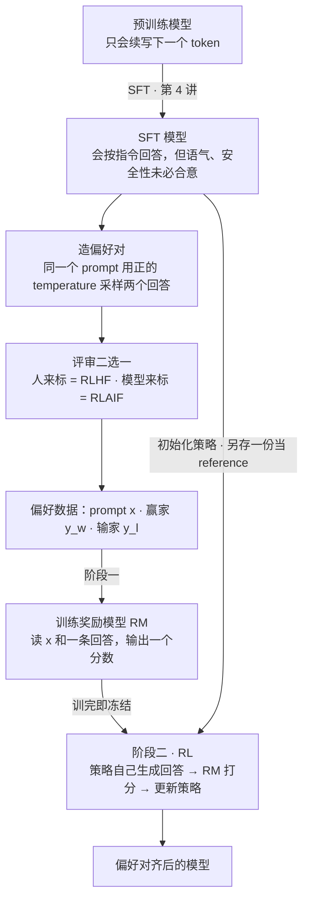
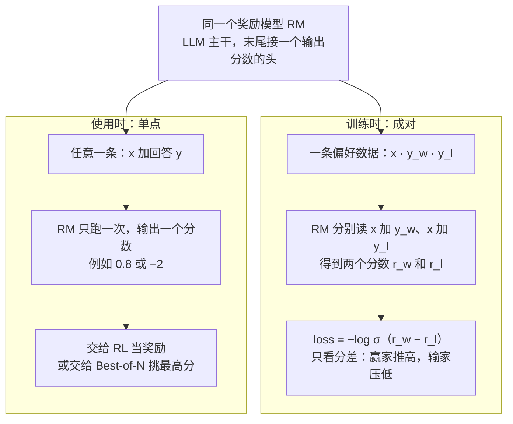
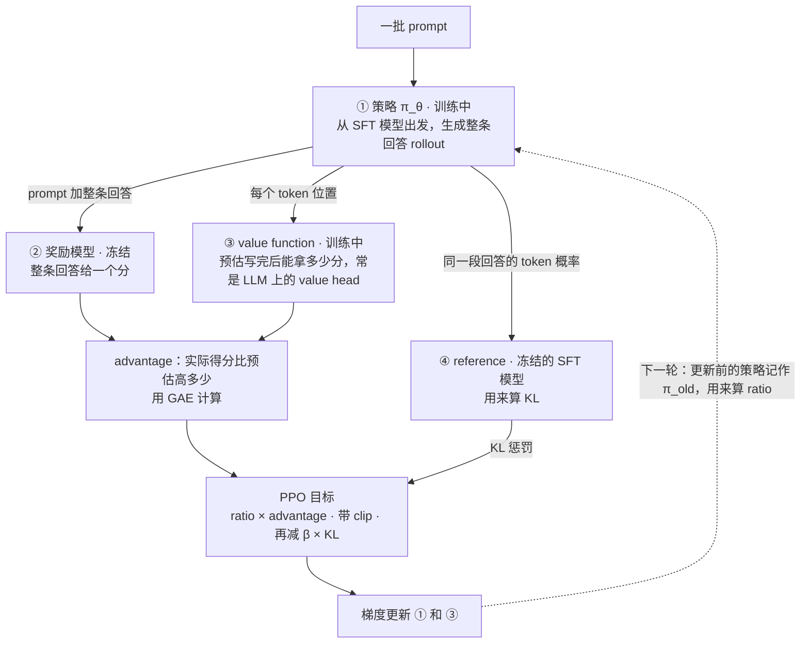
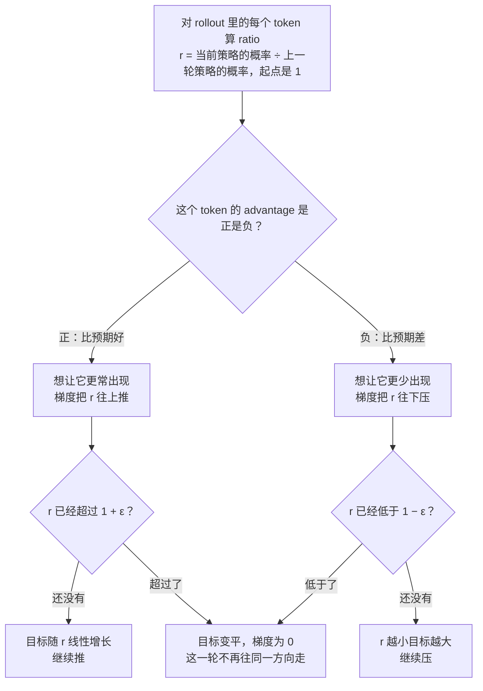
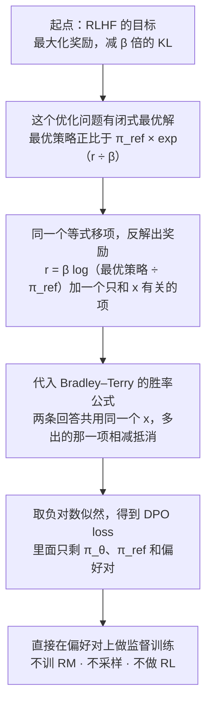
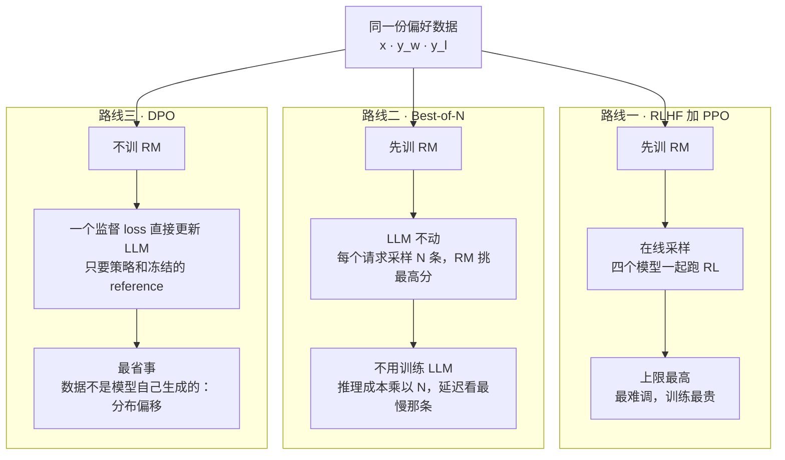

# CME295 第 5 讲｜LLM 微调（LLM Tuning）

> Stanford CME295: Transformers & Large Language Models（2025 秋）· 第 5 讲，2025 年 10 月 31 日 · 期中之后的第一讲，期末考覆盖第 5–9 讲
> 视频：<https://www.youtube.com/watch?v=PmW_TMQ3l0I>（1:47:41，英文字幕是自动生成的，缩写和人名错得多，见文末勘误）
> 讲者：Afshine Amidi（开场到 Best-of-N）· Shervine Amidi（1:29:47 起的 DPO 部分）
> 课程大纲：<https://cme295.stanford.edu/syllabus/>

**一句话**：SFT 只能教模型"该怎么答"，没法告诉它"别这样答"；偏好微调（preference tuning）改用"两个回答里哪个更好"这种便宜得多的成对数据来补这一课。经典做法 RLHF 分两步：先用 Bradley–Terry 公式把偏好对训成一个给回答打分的奖励模型，再用 PPO 让 LLM 去追高分，同时用 KL 惩罚和 clip 把它拴在 SFT 模型附近，防止 reward hacking。嫌 RL 太重，可以只拿奖励模型在推理时做 Best-of-N，或者用 DPO 把两步并成一个直接作用在偏好对上的监督 loss。

## 时间轴

| 时间 | 内容 |
|---|---|
| [0:06](https://www.youtube.com/watch?v=PmW_TMQ3l0I&t=6s) | 开场：期中之后的安排；回顾第 4 讲的 pretraining、SFT、LoRA |
| [4:00](https://www.youtube.com/watch?v=PmW_TMQ3l0I&t=240s) | 今天的主题：训练的第三步，让模型对齐人的偏好 |
| [4:50](https://www.youtube.com/watch?v=PmW_TMQ3l0I&t=290s) | Preference tuning：泰迪熊例子里的偏好对；为什么 SFT 之后还需要这一步 |
| [10:05](https://www.youtube.com/watch?v=PmW_TMQ3l0I&t=605s) | 问答：LoRA 和偏好微调是什么关系；偏好对能注入负信号 |
| [11:31](https://www.youtube.com/watch?v=PmW_TMQ3l0I&t=691s) | 数据收集：pointwise / pairwise / listwise 三种标注形式 |
| [13:55](https://www.youtube.com/watch?v=PmW_TMQ3l0I&t=835s) | 造偏好对的配方：同一 prompt 采样两次再比较；二元还是分级；改写日志里的坏回答 |
| [17:43](https://www.youtube.com/watch?v=PmW_TMQ3l0I&t=1063s) | RLHF overview：RL 的基本词汇（agent、state、action、policy、reward） |
| [19:47](https://www.youtube.com/watch?v=PmW_TMQ3l0I&t=1187s) | 把这些词一一对应到 LLM 上 |
| [22:27](https://www.youtube.com/watch?v=PmW_TMQ3l0I&t=1347s) | 问答：贵不贵；奖励信号稀疏；奖励按整条回答给 |
| [26:02](https://www.youtube.com/watch?v=PmW_TMQ3l0I&t=1562s) | RLHF 的两个阶段；RLHF 与 RLAIF 的区别 |
| [28:24](https://www.youtube.com/watch?v=PmW_TMQ3l0I&t=1704s) | Reward model：要一个能分清好坏回答的打分模型 |
| [29:46](https://www.youtube.com/watch?v=PmW_TMQ3l0I&t=1786s) | Bradley–Terry 公式与 sigmoid |
| [32:20](https://www.youtube.com/watch?v=PmW_TMQ3l0I&t=1940s) | 训练 RM：从最大似然一步步推出 pairwise loss |
| [38:44](https://www.youtube.com/watch?v=PmW_TMQ3l0I&t=2324s) | 成对训练、单点打分；数据量、模型选型、RewardBench |
| [41:50](https://www.youtube.com/watch?v=PmW_TMQ3l0I&t=2510s) | 问答：奖励分维度；标注指南；回归还是分类；分数归一化 |
| [46:02](https://www.youtube.com/watch?v=PmW_TMQ3l0I&t=2762s) | RL 阶段：rollout → RM 打分 → 更新 LLM |
| [48:29](https://www.youtube.com/watch?v=PmW_TMQ3l0I&t=2909s) | 为什么不能离初始模型太远：遗忘、reward hacking、不稳定 |
| [53:54](https://www.youtube.com/watch?v=PmW_TMQ3l0I&t=3234s) | PPO：奖励项加 KL 惩罚；KL divergence 是什么 |
| [57:56](https://www.youtube.com/watch?v=PmW_TMQ3l0I&t=3476s) | advantage 与 value function；GAE |
| [1:03:39](https://www.youtube.com/watch?v=PmW_TMQ3l0I&t=3819s) | PPO-Clip：公式、三个易混点、两张图的直觉 |
| [1:10:20](https://www.youtube.com/watch?v=PmW_TMQ3l0I&t=4220s) | 问答：不可导点；为什么和上一轮比；ratio 怎么算 |
| [1:12:24](https://www.youtube.com/watch?v=PmW_TMQ3l0I&t=4344s) | PPO KL-penalty；现在常见的混合写法 |
| [1:14:24](https://www.youtube.com/watch?v=PmW_TMQ3l0I&t=4464s) | PPO 要同时跑四个模型；GRPO 预告 |
| [1:16:20](https://www.youtube.com/watch?v=PmW_TMQ3l0I&t=4580s) | RL 路线的挑战 |
| [1:19:58](https://www.youtube.com/watch?v=PmW_TMQ3l0I&t=4798s) | On-policy vs off-policy；问答：为什么不直接拿偏好数据做 SFT |
| [1:22:43](https://www.youtube.com/watch?v=PmW_TMQ3l0I&t=4963s) | Best-of-N：做法、例子、代价 |
| [1:27:17](https://www.youtube.com/watch?v=PmW_TMQ3l0I&t=5237s) | 问答：N 条全差怎么办；分数尺度在这里无所谓 |
| [1:29:47](https://www.youtube.com/watch?v=PmW_TMQ3l0I&t=5387s) | DPO（Shervine 接手）：对 PPO 和 Best-of-N 的两点抱怨 |
| [1:32:09](https://www.youtube.com/watch?v=PmW_TMQ3l0I&t=5529s) | DPO 的 loss；论文副标题的含义 |
| [1:35:19](https://www.youtube.com/watch?v=PmW_TMQ3l0I&t=5719s) | DPO 是怎么推出来的 |
| [1:39:00](https://www.youtube.com/watch?v=PmW_TMQ3l0I&t=5940s) | DPO 对比 RLHF；为什么 PPO 整体仍更强：分布偏移 |
| [1:42:05](https://www.youtube.com/watch?v=PmW_TMQ3l0I&t=6125s) | 问答：两套权重；reference 能不能换成别的模型 |
| [1:44:13](https://www.youtube.com/watch?v=PmW_TMQ3l0I&t=6253s) | 泰迪熊进洗衣机：偏好微调改语气不改事实；问答：实践中怎么选 |

## 核心内容

### 1. 为什么 SFT 之后还要第三步

- **前两步回顾（第 4 讲）**：预训练用海量文本教模型语言和代码的规律，又慢又贵，产物只会续写下一个 token；SFT 用一份小而精的数据教它"怎么表现"，比如变成聊天助手，LoRA 让这一步不必动全部权重。
- **第三步要解决什么**：SFT 之后的模型已经像个助手了，但语气、友好度、安全性未必合意。课上的例子：让模型推荐能和泰迪熊一起做的活动，它却劝用户少花时间在泰迪熊上——格式没毛病，只是不是我们想要的回答。把它改写成想要的样子，两条配在一起就是一个**偏好对**（preference pair）：同一个 prompt，一条想要、一条不想要。让模型向"想要"的那一侧靠拢，就叫偏好微调，也常叫对齐（alignment）。
- **为什么不把这些修正直接补进 SFT 数据**，讲者给了四条理由：
    1. 比较比创作容易。从零写一首好诗很难，两首诗里挑一首好的却很容易。SFT 需要示范，偏好数据只需要判断，收集成本低得多。
    2. SFT 数据的 prompt 分布要小心配平，某类 prompt 多了，模型就会偏向那种答法。模型每出一次错就往 SFT 集里补一条，很容易把分布带歪。
    3. SFT 数据要求质量极高，把模型的每个失误都改写成完美示范，时间上耗不起。
    4. SFT 只有正信号：它告诉模型该生成什么，却没法表达"别生成这个"。偏好对里输的那条正好提供负信号。
- 讲者也提醒：偏好微调不是万灵药。SFT 后的模型如果错得很多，先回头检查 SFT 数据。
- **问答**：LoRA 在偏好微调里的对应物是什么？——两者不在一个层面：LoRA 决定"调哪些参数"，偏好微调换的是"目标函数"，完全可以叠在一起用。

### 2. 偏好数据怎么来

- **三种标注形式**
    - *pointwise*：给单个回答打一个绝对分。人很难校准——0.9 和 0.2 之间到底差在哪，说不清。
    - *pairwise*：两个回答里挑更好的那个。最容易标，业界基本都用它，本讲后面也只用这一种。
    - *listwise*：给 n 个回答排序。不用说"好多少"，比 pointwise 容易，但比 pairwise 麻烦。
- **标准配方**：取一个 prompt（来自线上日志，或一份希望覆盖的 prompt 清单，总之要贴近用户真实提问的分布）→ 用大于 0 的 temperature 把它喂给模型两次，得到两个不同的回答（第 3 讲的采样）→ 找评审比较。评审可以是人，可以是 LLM-as-a-judge（讲者说后面的课会细讲，应在第 8 讲），也可以是 BLEU、ROUGE 这类规则指标（现在用得少）。
- **量表**：最简单的是二元的"更好 / 更差"；也可以分成"好很多、好、略好、略差、差、差很多"几级。但很多任务本身就主观，分级越细越难标得一致，所以实践中多用二元。
- **另一种来源**：从日志里找出不满意的回答，人工改写成好的——开头的泰迪熊例子就是这样来的。代价是又回到了"创作"，比单纯比较贵。
    > 小注：InstructGPT 实际是按 listwise 收集、按 pairwise 训练的：每个 prompt 让标注员给 4–9 个回答排序，再拆成两两配对去训奖励模型。

### 3. RLHF 全景：先把 RL 的词翻译成 LLM 的词

*图 5-1｜从 SFT 模型到偏好对齐模型：偏好数据、奖励模型、RL 三步怎么接起来（自绘示意）· [▶ 看原幻灯片 26:32](https://www.youtube.com/watch?v=PmW_TMQ3l0I&t=1592s) · 出处：[Ouyang et al., 2022](https://arxiv.org/abs/2203.02155)（InstructGPT；课上没点名，推断）*

- **RL 的基本词汇**（讲者问有没有 RL 专家，没人举手，于是从零讲）：一个 agent 在时刻 t 处于状态 s_t，按照策略 π_θ(a_t | s_t) 选一个动作 a_t，环境随后给它一个奖励。策略无非是"给定状态，每个动作的概率"。
- **搬到 LLM 上**，每个词都有对应物：

| RL 概念 | 在 LLM 里对应什么 |
|---|---|
| agent | LLM 本身 |
| state s_t | 到目前为止的输入：prompt 加已经生成的 token |
| action a_t | 生成下一个 token |
| environment | 讲者的说法：可以看成词表，也就是所有可选的 token |
| policy π_θ | LLM 前向一次输出的 next-token 概率分布，θ 就是 LLM 的权重 |
| reward | 对生成结果好坏的打分，从偏好数据里来 |

- 目标：学一组 θ，让 π_θ 和偏好一致。
- **RLHF**（reinforcement learning from human feedback）分两个阶段（图 5-1）：阶段一训练**奖励模型**，输入是 prompt 加回答，输出一个分数，全部偏好对都用在这里；阶段二是 RL，用这个分数当奖励去调 LLM。名字里的 human feedback 指的是奖励模型的训练标签来自人；标签若来自模型，就叫 RLAIF。
- **问答**
    - 奖励是每个 token 给一次，还是整条回答给一次？——整条给一次。
    - 这点信号够吗？——SFT 在每个 token 上都有监督；这里一条回答大约只有一个信号，所以人们常说 RLHF 的信号是稀疏的（sparse）。
    - 会不会很贵？——照常按 batch 训练，本质上和别的训练过程一个量级，只是比 SFT 多出几样东西（见第 6 节的四个模型）。

> 小注：这套"SFT → 奖励模型 → PPO"的三步流程因 InstructGPT（ChatGPT 的前身）而广为人知。那篇论文把这里的环境称为 bandit 环境：给一个 prompt，收一条回答，RM 给分，回合结束——环境几乎是空的。到了 agent 场景（第 7 讲），环境才变成真实的工具和网页，上表里变的主要是 environment 和 reward 两行。

### 4. 阶段一：奖励模型与 Bradley–Terry

*图 5-2｜奖励模型：训练时要成对的数据，用的时候一条回答就能打分（自绘示意）· [▶ 看原幻灯片 32:20](https://www.youtube.com/watch?v=PmW_TMQ3l0I&t=1940s)*

- **要什么**：一个打分函数 RM(x, y)，回答好就给高分，差就给低分。它必须同时读 prompt 和回答——脱离问题，没法判断回答好不好。
- **难点**：手里只有"谁赢谁输"的成对标签，没有绝对分数。Bradley–Terry 公式把两者接了起来：假设每个回答背后有一个隐藏分数 r，回答 i 胜过回答 j 的概率只由两者的分差决定。

$$
P(y_i \succ y_j)=\frac{e^{r_i}}{e^{r_i}+e^{r_j}}=\sigma(r_i-r_j),\qquad \sigma(z)=\frac{1}{1+e^{-z}}
$$

r_i、r_j 是两个回答各自的分数，σ 是 sigmoid 函数（把任意实数压到 0 和 1 之间）；r_i 比 r_j 高得越多，这个概率越接近 1。

- **训练**：同一个模型分别读"x 加 y_w"和"x 加 y_l"，得到两个分数。loss 是讲者带着全班从最大似然推出来的：假设各个偏好对相互独立，要找的是让"观察到这些胜负结果"的联合概率最大的参数；联合概率是一串连乘，数值会小到不稳定，于是取 log 变成连加；机器学习习惯做最小化，再添一个负号。有学生先答了 binary cross-entropy，讲者确认方向是对的——要的就是这个概率的负对数似然。

$$
\mathcal{L}_{\mathrm{RM}}(\theta)=-\,\mathbb{E}_{(x,\,y_w,\,y_l)}\Big[\log\sigma\big(r_\theta(x,y_w)-r_\theta(x,y_l)\big)\Big]
$$

y_w、y_l 是同一个 prompt x 下赢和输的回答，r_θ 是参数为 θ 的奖励模型；赢家的分数比输家高得越多，loss 越小。

- **成对训练，单点使用**（图 5-2，讲者说这是他觉得最漂亮的地方）：loss 要两条回答才能算，但训出来的模型读一条"prompt 加回答"就能输出一个数，用的时候不需要配对。
- **工程细节**：数据通常是几万对或更多，标签就是偏好（RLHF 里来自人）。模型现在的通行做法是拿一个 decoder-only 的 LLM，在序列末尾接一个输出分数的分类头；也可以用 BERT 这类 encoder-only 模型，在 [CLS] 的表示上做投影（第 2 讲）。奖励模型的好坏有专门的 benchmark，讲者举了 RewardBench。
- **问答**
    - 不同任务里"好"的标准不一样怎么办？——奖励总是沿某个维度定义的：有用、友好、安全……可以每个维度一个 RM，也可以做一个综合分。
    - 人工偏好对标注指南非常敏感。指南要尽量客观、清楚，否则标签噪声会很大。
    - 这算回归还是分类？——讲者倾向于把它看成一个概率模型：标签是"赢 / 输"，像分类；最后用的却是那个连续分数。分数没有固定量纲（好回答可能是 1，差回答可能是 −2、−3），所以进入 RL 的 loss 之前通常要做归一化。

> 小注：Bradley–Terry（1952）原本是给成对比较排名用的统计模型，国际象棋的 Elo 和 Chatbot Arena 的排行榜是同一思路。这个 loss 只约束分差，所有分数整体平移不改变 loss，所以 InstructGPT 在做 RL 之前先加一个偏置，把分数的均值挪到 0。另外，这里的 RM 给整条回答打一个分，相当于 CS329A 笔记里的 ORM（outcome reward model）。

### 5. 阶段二：让 LLM 追高分，但要拴住它

- **一轮 RL 长什么样**：取一个 prompt → LLM 生成一整条回答（叫 completion，也叫 rollout）→ prompt 和回答一起送进 RM → 得到一个分数，比如 −2 → 拿这个分数去更新 LLM。此时 RM 是冻结的，被训练的只有 LLM。数据量通常在十万条 prompt 以上，"标签"由 RM 现场给出，起点是 SFT 模型。
- **目标有两半**：奖励要高；同时不能离初始模型太远。为什么要后一半，课堂上讨论出三条理由：
    1. SFT 模型里已经有大量知识和能力，走远了会灾难性遗忘（catastrophic forgetting）。
    2. **Reward hacking**。RM 只是"我们真正想要的东西"的一个不完美代理。讲者的比方：目标是把课讲得有信息量，却拿下课时的掌声大小当奖励；优化过了头，就会发现讲笑话最能换掌声——奖励拉满，目标落空。LLM 也一样，对 RM 优化得太狠，学到的是钻 RM 的空子。
    3. 训练稳定性。
- 两半写在一起，就是 RLHF 的目标函数：

$$
\max_{\theta}\;\;\mathbb{E}_{x,\;y\sim\pi_\theta(\cdot\mid x)}\big[\,r(x,y)\,\big]\;-\;\beta\,\mathrm{KL}\big(\pi_\theta(\cdot\mid x)\,\big\|\,\pi_{\mathrm{ref}}(\cdot\mid x)\big)
$$

第一项是 RM 给当前策略 π_θ 自己生成的回答 y 打的平均分；第二项衡量 π_θ 的输出分布离 reference（冻结的 SFT 模型 π_ref）有多远，β 决定罚多重。

- **KL divergence**：衡量两个概率分布 P、Q 差多远的量，KL(P‖Q) = Σ p_i · log(p_i / q_i)。讲者特意不叫它"距离"。它恒大于等于 0（用 Jensen 不等式证明），当且仅当 P 和 Q 完全相同时等于 0。
    > 小注：不叫距离，是因为它不对称（KL(P‖Q) 一般不等于 KL(Q‖P)），也不满足三角不等式。实现上，InstructGPT 把 KL 惩罚直接折进奖励：每个 token 扣掉 β · log(π_θ / π_ref)，RM 的分数只在回答结束时加一次。数据量上它也比课上说的量级小：SFT 约 1.3 万条 prompt，RM 约 3.3 万条，PPO 约 3.1 万条。

### 6. PPO（上）：advantage、value function 与四个模型

*图 5-3｜PPO 一次迭代里的四个模型：两个在训练，两个冻结（自绘示意）· [▶ 看原幻灯片 1:14:24](https://www.youtube.com/watch?v=PmW_TMQ3l0I&t=4464s) · 出处：[Schulman et al., 2017](https://arxiv.org/abs/1707.06347)*

- **PPO**（proximal policy optimization）是 RL 阶段最常用的算法。proximal 是"邻近"的意思：每次更新都别走远。
- **实际最大化的不是原始奖励，而是 advantage**（讲者自嘲前面"撒了个小谎"）。advantage 衡量的是：这次的输出比"预期水平"好多少。同样拿到 0.8 分，如果这个 prompt 平时都能拿 0.9，那这次其实算差的。这样做的原因是：从奖励里减掉一个基线（baseline）能降低估计的方差，训练更稳、更快。
- **"预期水平"由 value function 来估**。它和奖励模型很容易混，对比如下：

| | 奖励模型 RM | value function |
|---|---|---|
| 读什么 | prompt 加**完整**回答 | prompt 加**写到一半**的回答 |
| 输出 | 这条回答的分数 | 照当前策略继续写完，预计最终能拿多少分 |
| 粒度 | 整条回答一个数 | 每个 token 位置一个数 |
| 怎么来 | 阶段一训好，RL 时冻结 | RL 时和策略一起训（回归问题），通常是 LLM 上另接的一个 value head |

- advantage 具体怎么从奖励和 value 算出来，用的是 **GAE**（generalized advantage estimation）——一个带几个超参数的大公式。讲者说这超出了本课范围，只给了论文。
    > 小注：GAE 的两个超参数是折扣因子 γ 和在偏差与方差之间做权衡的 λ。
- **所以 PPO 要同时伺候四个模型**（图 5-3）：策略（训练）、value function（训练）、RM（冻结）、reference（冻结的 SFT 模型）。显存和工程负担主要就来自这里。真的需要这么多吗？讲者的回答是"也许不用"：GRPO 就是朝这个方向改的，留到第 6 讲，想预习可以看 DeepSeekMath 论文。
    > 小注：GRPO 砍掉的正是 value function：对同一个 prompt 采样一组回答，用组内的平均奖励当基线。CS329A 笔记里 PPO 与 GRPO 的对比，说的就是图 5-3 里 ③ 这个框要不要。

### 7. PPO（下）：Clip 与 KL-penalty 两种写法

*图 5-4｜PPO-Clip 的判断流程：好的多来一点，坏的少来一点，但每轮只许挪一小步（自绘示意）· [▶ 看原幻灯片 1:06:42](https://www.youtube.com/watch?v=PmW_TMQ3l0I&t=4002s) · 出处：[Schulman et al., 2017](https://arxiv.org/abs/1707.06347)*

PPO 论文给了两种目标函数，区别在"别走远"这件事怎么写。先看用得最多的 PPO-Clip：

$$
L^{\mathrm{CLIP}}(\theta)=\mathbb{E}_t\Big[\min\Big(r_t(\theta)\,A_t,\;\mathrm{clip}\big(r_t(\theta),\,1-\epsilon,\,1+\epsilon\big)\,A_t\Big)\Big],\qquad r_t(\theta)=\frac{\pi_\theta(a_t\mid s_t)}{\pi_{\theta_{\mathrm{old}}}(a_t\mid s_t)}
$$

A_t 是第 t 个 token 的 advantage，r_t(θ) 是同一个 token 在当前策略和上一轮策略下的概率之比，ε 是允许这个比值偏离 1 的幅度。

- **三个容易绊倒的地方**（讲者说他自己当初也被绕过）：
    1. 虽然记作 L，这是一个要**最大化**的目标，不是要最小化的 loss。
    2. r_t(θ) **不是 reward**，是概率比（ratio）。
    3. π_old 不是 SFT 模型，而是 RL 过程中**上一次迭代**的策略。
- **直觉**（图 5-4）：A 大于 0，说明这个 token 值得强化，想把它的概率调高，也就是让 r 变大；目标随 r 线性增长，但过了 1 + ε 就变平，再推也没有收益，所以一步不会推太多。A 小于 0 则反过来，想让 r 变小，低于 1 − ε 之后同样变平。
    > 小注：min 的作用是只在"朝有利方向走过头"时才截断。如果 A 大于 0 而 r 已经掉到 1 − ε 以下，取 min 会选没截断的那一项，梯度照样把它拉回来。PPO 论文的实验里 ε = 0.2 效果最好，后来成了常用默认值；CS329A 笔记里 DAPO 的 clip-higher，改的就是这里的上界 1 + ε。
- **KL-penalty 写法**：不做硬截断，改成减去一个惩罚项，目标是 E[ r_t(θ) · A_t − β · KL(π_old ‖ π_θ) ]。2017 年的原论文里 old 指上一轮迭代；到了 LLM 时代，KL 里放的一般是 reference（SFT 模型）。现在常见的是两者混用——对 reference 的 KL 惩罚，加上对上一轮策略的 clip。讲者也强调各家 loss 写法很多，这不是定式。
- **问答**
    - clip 的折点不可导怎么办？——和 ReLU 一样处理。
    - 为什么和上一轮比，而不是和 base 模型比？——两个约束都要：不能离 base 太远（KL 项管），每一轮更新也不能太猛（clip 管），后者是为了训练稳定。
    - ratio 具体怎么算？——就是 LLM 输出分布里，那个 token 在给定输入下的概率，新旧两个策略各算一次再相除。

### 8. RL 路线的代价；on-policy 与 off-policy

- **讲者列的挑战**
    1. 两阶段流水线有依赖：阶段二做完才发现 RM 有问题，就得全部重来。
    2. 超参数多：KL 的 β、clip 的 ε、GAE 里至少还有两个……换一组就要重训。
    3. 不稳定：限制了步长也不总是够。
    4. 不好监控：能看的主要是平均奖励，它不像预训练和 SFT 的交叉熵那样，直接反映模型学得怎么样。
    5. 需要探索（exploration）：同一个 prompt 多次生成如果都差不多，模型就没机会发现哪种回答更好，得设法保证采样的多样性。
    6. 门槛：多数人不熟 RL，而且这一步为什么非用 RL 不可，并不显然。
- **on-policy 与 off-policy**（论文里会反复出现的一对词）：SFT 时，模型模仿的是一批现成的"prompt 加回答"，不一定是它自己写的，这叫 off-policy。RL 阶段每一轮都让**当前**的模型自己生成，再按这些生成的好坏更新自己，这叫 on-policy。PPO 是 on-policy 算法。
- **问答**：为什么不直接拿偏好数据做 SFT？——SFT 只能说"这样答"，没法说"别这样答"，除非把坏回答全都改写成好回答。不过讲者顺势埋了个伏笔：确实有一种监督式的办法能做到 RL 做的事，就是第 10 节的 DPO。

### 9. Best-of-N：有奖励模型，但不想做 RL

- **做法**：SFT 模型原封不动。每来一个 prompt，采样 N 条回答（比如 4、5 条），每条交给 RM 打分，把分最高的那条返回给用户。泰迪熊的例子里三条回答的分数是 0.8、−2 和一个居中的分，返回 0.8 那条。
- **代价**
    - 模型本身得有点水平。N 条全都差，挑出来的也差；调高 temperature 能增加多样性，但救不了差模型。
    - 主要问题是把训练的活全推给了推理：每个请求的生成成本乘以 N。流量大的服务要先算账——推理侧的流量有多大，一次性的训练成本又是多少。
    - Shervine 后来补了一个思想实验：就算钱无限、N 条并行生成，也得等最慢的那条；N 个延迟里取最大值，分布整体右移，延迟一定比单次生成差。
- **问答**：分数的尺度在这里无所谓——任何保持顺序的缩放都不改变谁最高。尺度只在分数进入 loss（也就是 RL）时才要紧。
    > 小注：这就是 CS329A 笔记里"重复采样加验证器"的最简形态：RM 充当 ORM，N 就是花在推理时的算力。

### 10. DPO：把两阶段压成一个监督 loss

*图 5-5｜DPO 的推导链：从 RLHF 的目标出发，把奖励模型"消掉"（自绘示意）· [▶ 看原幻灯片 1:35:19](https://www.youtube.com/watch?v=PmW_TMQ3l0I&t=5719s) · 出处：[Rafailov et al., 2023](https://arxiv.org/abs/2305.18290)*

- **动机**就是前面攒下的抱怨：PPO 的 loss 背后要带四套权重（当前策略、old 或 reference，advantage 里还藏着 RM 和 value function）；Best-of-N 又有成本和延迟问题。DPO（direct preference optimization）的回答是：全程用监督学习，一个 loss 直接更新 LLM。

$$
\mathcal{L}_{\mathrm{DPO}}(\theta)=-\,\mathbb{E}_{(x,\,y_w,\,y_l)}\left[\log\sigma\!\left(\beta\log\frac{\pi_\theta(y_w\mid x)}{\pi_{\mathrm{ref}}(y_w\mid x)}-\beta\log\frac{\pi_\theta(y_l\mid x)}{\pi_{\mathrm{ref}}(y_l\mid x)}\right)\right]
$$

π_θ(y | x) 是正在训练的模型生成整条回答 y 的概率，π_ref 是冻结的 SFT 模型，β 和第 5 节目标函数里的 β 是同一个（讲者给的量级是 0.1 左右）。

- **怎么读这个式子**：形状和第 4 节 RM 的 loss 一模一样，都是 −log σ(赢家的分 − 输家的分)，只是"分"换成了 β · log(π_θ / π_ref)——模型相对 reference 把这条回答的概率抬高了多少。里面没有 RM，没有采样，输入只有偏好对。论文副标题 Your Language Model is Secretly a Reward Model 说的就是这件事：那个相当于奖励的量，完全由策略自己表达。
- **怎么推出来的**（图 5-5）。讲者强调全程没有引入新假设，只是代数推导：
    1. 从第 5 节的 RLHF 目标（最大化奖励，减 β 倍 KL）出发。
    2. 这个优化问题有闭式的最优解，见下式左半。
    3. 同一个等式移项，把奖励写成最优策略的函数，见下式右半。
    4. 把它代进 Bradley–Terry 的胜率公式，再像第 4 节那样取负对数似然，就得到上面的 loss。

$$
\pi^{*}(y\mid x)=\frac{1}{Z(x)}\,\pi_{\mathrm{ref}}(y\mid x)\,\exp\!\Big(\frac{r(x,y)}{\beta}\Big)\quad\Longleftrightarrow\quad r(x,y)=\beta\log\frac{\pi^{*}(y\mid x)}{\pi_{\mathrm{ref}}(y\mid x)}+\beta\log Z(x)
$$

π* 是最优策略，Z(x) 是只依赖 prompt 的归一化常数（partition function）；左式的意思是"最优策略等于 reference 按 exp(r / β) 重新加权"。

> 小注：Z(x) 要对所有可能的回答求和，实际算不出来。但 Bradley–Terry 只看同一个 x 下两个回答的分差，β · log Z(x) 相减时正好抵消——DPO 能落地全靠这一步，课上一带而过。

- **和 RLHF 比**：两阶段变一阶段；四个模型变两个（一套在训，一套冻结）；不需要在线采样，也就没有 RL 那一堆稳定性问题。
- **那为什么不是人人都用 DPO**：讲者引了一篇系统对比的论文，结论是 PPO 调好了整体仍然更强。DPO 的软肋是**分布偏移**（distribution shift）：它可以直接拿一份现成的偏好数据集来训，省掉奖励建模，但这些回答不是当前模型自己生成的，和模型的输出分布对不上。补救办法是先在偏好数据上做一遍 SFT，或者自己采样、自己标注——后者又把成本加了回来。
    > 小注：这篇应为 Xu et al., 2024（ICML 2024）：Is DPO Superior to PPO for LLM Alignment? 用第 8 节的词说，DPO 是 off-policy 的，PPO 是 on-policy 的，分布偏移就是 off-policy 的代价。
- **问答**
    - 两套权重分别是什么？——冻结的 reference 只出现在 loss 里；被更新的那一套就是最终的偏好微调模型。
    - reference 能不能换成另一个更大的模型？——那就成了另一种算法。偏好微调的本意是从上一个 checkpoint 出发、微调回答的分布，换掉 reference，loss 就失去了这层含义。讲者没把话说死，但直觉上不看好。
- **收尾的例子**（贯穿整门课的泰迪熊）：问"能把泰迪熊放进洗衣机吗"，SFT 后的回答事实正确——会洗坏，建议手洗——但口气生硬；偏好微调后的回答内容不变，语气温和得多。**偏好微调不教新事实**，它只是在模型已有的回答分布里挪动概率，往人更喜欢的那一侧靠。

### 11. 三条路线放在一起看

*图 5-6｜同一份偏好数据的三种用法，成本分别落在哪里（自绘示意）· [▶ 看原幻灯片 1:39:00](https://www.youtube.com/watch?v=PmW_TMQ3l0I&t=5940s)*

| | RLHF + PPO | Best-of-N | DPO |
|---|---|---|---|
| 要不要奖励模型 | 要 | 要 | 不要 |
| 改不改 LLM 权重 | 改 | 不改 | 改 |
| 训练时同时要带的模型 | 4 个：策略、value function、RM、reference | 不训练 | 2 个：策略、reference |
| 训练数据从哪来 | on-policy：当前模型现场生成，RM 打分 | — | off-policy：现成的偏好对 |
| 成本花在哪 | 训练：最贵、最难调 | 推理：每个请求乘以 N，延迟变差 | 训练：和一次 SFT 差不多 |
| 讲者的评价 | 上限最高，适合懂 RL、要榨出最后一点性能的团队 | 先算推理流量和训练成本的账 | 花小得多的力气拿到接近的效果，但未必最好 |

- **实践中怎么选**（全场最后一个问答）：看算力预算，也看你愿意花多少精力"照看"训练过程。PPO 难调但上限最高；想快速做一次偏好微调、效果又要过得去，DPO 是首选。

## 关键图表速查（点时间戳跳到原幻灯片）

| 图 | 看什么 | 跳转 | 出处 |
|---|---|---|---|
| 泰迪熊偏好对 | 同一个 prompt 下，一条"像助手但不想要"的回答和改写后的回答怎么配成一对 | [5:19](https://www.youtube.com/watch?v=PmW_TMQ3l0I&t=319s) | — |
| RL 回路映射到 LLM | agent 与 environment 的回路上，每个量被换成 LLM 里的对应物 | [21:55](https://www.youtube.com/watch?v=PmW_TMQ3l0I&t=1315s) | — |
| RLHF 两阶段 | 两个阶段各自的输入输出：RM 吃 prompt 加回答、吐分数；RL 吃 prompt、吐更合偏好的回答 | [26:32](https://www.youtube.com/watch?v=PmW_TMQ3l0I&t=1592s) | [InstructGPT](https://arxiv.org/abs/2203.02155)（推断，课上没点名） |
| Bradley–Terry 与 sigmoid 曲线 | 胜率只取决于分差；sigmoid 两端分别趋于 0 和 1 | [29:46](https://www.youtube.com/watch?v=PmW_TMQ3l0I&t=1786s) | Bradley & Terry, 1952 |
| RM loss 的手推过程 | 从"偏好对相互独立、最大似然"到负的期望 log σ(分差)，每一步怎么来 | [34:52](https://www.youtube.com/watch?v=PmW_TMQ3l0I&t=2092s) | — |
| PPO loss 的两部分 | 奖励项和 KL 项各管什么；reference 就是 SFT 模型 | [54:15](https://www.youtube.com/watch?v=PmW_TMQ3l0I&t=3255s) | [PPO](https://arxiv.org/abs/1707.06347) |
| advantage 与 value function | value 是 token 级的"预计最终得分"，由接在 LLM 上的 value head 输出 | [59:03](https://www.youtube.com/watch?v=PmW_TMQ3l0I&t=3543s) | [GAE](https://arxiv.org/abs/1506.02438) |
| PPO-Clip 的两张折线图 | A 为正时目标在 1 + ε 之后变平；A 为负时在 1 − ε 以下变平 | [1:06:42](https://www.youtube.com/watch?v=PmW_TMQ3l0I&t=4002s) | [PPO](https://arxiv.org/abs/1707.06347) |
| PPO 需要的四个模型 | 策略、value function、RM、reference，哪两个在训、哪两个冻结 | [1:14:24](https://www.youtube.com/watch?v=PmW_TMQ3l0I&t=4464s) | — |
| Best-of-N 例子 | 三条回答各自的 RM 分数（0.8、−2、居中），返回最高的那条 | [1:24:11](https://www.youtube.com/watch?v=PmW_TMQ3l0I&t=5051s) | — |
| DPO loss | 认出 log σ(分差) 的 Bradley–Terry 结构；"分"换成了 β · log(π_θ / π_ref) | [1:32:41](https://www.youtube.com/watch?v=PmW_TMQ3l0I&t=5561s) | [DPO](https://arxiv.org/abs/2305.18290) |
| DPO 推导四步 | 目标 → 闭式最优策略 → 反解奖励 → 代入 Bradley–Terry | [1:35:19](https://www.youtube.com/watch?v=PmW_TMQ3l0I&t=5719s) | 同上 |
| PPO 与 DPO 的实证对比 | 讲者据此说 PPO 总体更强、DPO 受分布偏移拖累 | [1:40:33](https://www.youtube.com/watch?v=PmW_TMQ3l0I&t=6033s) | 应为 [Xu et al., 2024](https://arxiv.org/abs/2404.10719) |
| 泰迪熊进洗衣机 | SFT 后与偏好微调后的两个回答：事实相同，语气不同 | [1:44:13](https://www.youtube.com/watch?v=PmW_TMQ3l0I&t=6253s) | — |

## 提到的工作

| 名称 | 在本讲里的作用 |
|---|---|
| pretraining、SFT、[LoRA](https://arxiv.org/abs/2106.09685)、ZeRO（第 4 讲） | 开场回顾：偏好微调接在这两步之后；LoRA 可以和它叠加用 |
| ChatGPT 这类聊天助手 | SFT 把预训练模型变成助手的例子 |
| RLHF | 本讲主线：奖励模型加 RL 的两阶段偏好微调 |
| RLAIF | 对照：偏好标签来自模型而不是人（术语应出自 [Constitutional AI](https://arxiv.org/abs/2212.08073)，课上只提了名字） |
| Bradley–Terry 模型（1952） | 把"谁赢"的成对标签和"每个回答一个分数"连起来的概率模型；RM 和 DPO 的 loss 都建在它上面 |
| LLM-as-a-judge | 偏好标注的一种来源，讲者说后面的课细讲（应在第 8 讲） |
| BLEU / ROUGE | 规则类指标，也能用来比较两个回答，现在用得少 |
| BERT 与 [CLS]（第 2 讲） | RM 的另一种选型：encoder-only 模型，在 [CLS] 表示上接投影 |
| [RewardBench](https://arxiv.org/abs/2403.13787)（Lambert et al., 2024） | 评测奖励模型好坏的 benchmark |
| Jensen 不等式 | 证明 KL divergence 非负 |
| [PPO](https://arxiv.org/abs/1707.06347)（Schulman et al., 2017） | RL 阶段的主力算法；Clip 和 KL-penalty 两种目标都出自这篇 |
| [GAE](https://arxiv.org/abs/1506.02438)（Schulman et al., 2015） | 计算 advantage 的标准方法，课上只给了引用 |
| GRPO / [DeepSeekMath](https://arxiv.org/abs/2402.03300)（Shao et al., 2024） | "PPO 真要四个模型吗"的后续答案，留到第 6 讲 |
| Best-of-N（BoN） | 有 RM、不做 RL 的推理时方案 |
| [DPO](https://arxiv.org/abs/2305.18290)（Rafailov et al., 2023） | 把 RLHF 的两阶段并成一个监督 loss |
| [Is DPO Superior to PPO?](https://arxiv.org/abs/2404.10719)（Xu et al., ICML 2024；应为这篇） | "PPO 总体更强、DPO 有分布偏移"的依据 |

## 术语对照

| English | 中文 |
|---|---|
| preference tuning / alignment | 偏好微调 / 对齐：让输出更合人（或某个指标）的偏好 |
| preference pair | 偏好对：同一个 prompt 下一好一坏两个回答 |
| pointwise / pairwise / listwise | 单点打分 / 成对比较 / 列表排序 |
| winning / losing response（y_w / y_l） | 赢家回答 / 输家回答 |
| RLHF | 基于人类反馈的强化学习 |
| RLAIF | 基于 AI 反馈的强化学习：偏好标签由模型给 |
| agent / environment / state / action | 智能体 / 环境 / 状态 / 动作 |
| policy π_θ | 策略：给定状态下各个动作的概率；在这里就是 LLM 的 next-token 分布 |
| reward model (RM) | 奖励模型：读 prompt 加回答，输出一个分数 |
| Bradley–Terry model | 成对比较的概率模型：胜率等于分差的 sigmoid |
| negative log-likelihood | 负对数似然 |
| classification head / value head | 接在 LLM 末端的小输出层：前者给回答打分，后者预估最终得分 |
| completion / rollout | 模型针对一个 prompt 生成的一整条回答 |
| sparse reward | 稀疏奖励：整条回答只给一次分 |
| reward hacking | 奖励投机：分数涨了，真正的目标没达到 |
| catastrophic forgetting | 灾难性遗忘 |
| KL divergence | KL 散度：两个概率分布差多远（不对称，不是距离） |
| reference model π_ref | 参考模型：冻结的 SFT 模型 |
| PPO (proximal policy optimization) | 近端策略优化 |
| advantage | 优势：这次输出比预期好多少 |
| value function | 价值函数：从写到一半的回答预估最终奖励 |
| baseline | 基线：从奖励里减掉的"平均水平"，用来降方差 |
| GAE (generalized advantage estimation) | 广义优势估计 |
| probability ratio r_t(θ) | 概率比：当前策略与上一轮策略对同一个 token 的概率之比（不是 reward） |
| clipping | 截断：ratio 超出 1 ± ε 的区间后不再带来收益 |
| on-policy / off-policy | 用当前模型自己生成的数据训练 / 用别处来的数据训练 |
| exploration | 探索：采样要够多样，才能发现更好的回答 |
| Best-of-N (BoN) | N 选一：采样 N 条，RM 挑最高分 |
| DPO (direct preference optimization) | 直接偏好优化 |
| partition function Z(x) | 配分函数：让概率之和为 1 的归一化常数 |
| distribution shift | 分布偏移：训练用的回答不是模型自己会生成的那种 |

## 字幕勘误

"PO""PPU" → PPO；"RHF" → RLHF；"RL … Aif" → RLAIF；"Kale / Kyle / scale divergence" → KL divergence；"Laura" → LoRA；"zero" → ZeRO；"blur rouge" → BLEU、ROUGE；"BERS" → BERT；"Reward bench" → RewardBench；"Bradlary" → Bradley–Terry；"binary cony" → binary cross-entropy；"parise""pair wise" → pairwise；"perference" → preference；"bun" → BoN；"DPU" → DPO；"deepse math" → DeepSeekMath；"raiders" → raters（标注员）；"overfeeding""overfeit" → overfitting；讲 KL 正负时的 "luck" → log；"80""AD and H" → a_t、a_t 和 s_t；"Afinen""Ein""Afin" → Afshine；"Shervin" → Shervine。

## 带走的问题

1. RM 的 loss 只约束分差，不约束绝对值。这对 Best-of-N 无所谓，对 PPO 却要先做归一化——为什么？如果换一个分数尺度大 10 倍的 RM，同一个 β 下 KL 这根绳子是变松了还是变紧了？
2. PPO 里有两根绳子：对 reference 的 KL，和对 π_old 的 clip。它们各自防的是什么？去掉其中一根会出什么事？（DAPO 去掉了 KL 项、放宽了 clip 的上界——在奖励可验证的推理任务上，为什么敢这么做？）
3. DPO 的隐式奖励是 β · log(π_θ / π_ref)。训练中如果 y_w 和 y_l 的概率一起下降、只是 y_l 降得更快，loss 同样会变小。这对生成质量意味着什么？on-policy 采样的 PPO 为什么不容易出这个问题？
4. 在你做的 agent 产品里，偏好信号可以从哪里来（重试、编辑、点踩、任务是否完成）？它们更像 pointwise、pairwise 还是 listwise？标注口径不清带来的噪声，会怎样从 RM 一路传到策略？
5. Best-of-N 把成本放在推理侧，PPO 和 DPO 放在训练侧。什么样的流量和延迟要求下 BoN 反而划算？能不能把 BoN 挑出来的回答再拿去做 SFT，把推理成本"蒸馏"回训练里？
