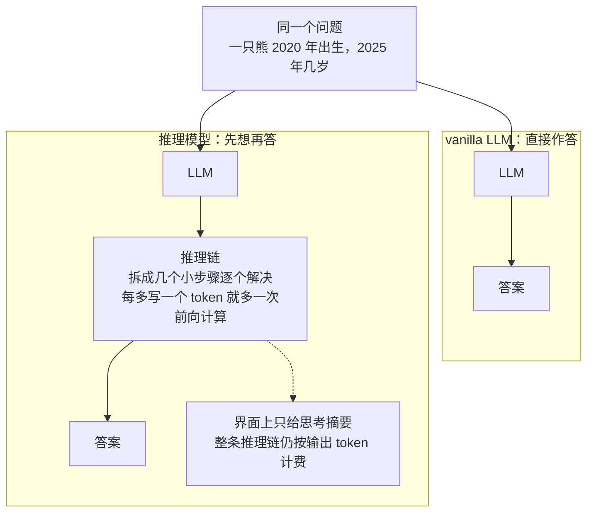
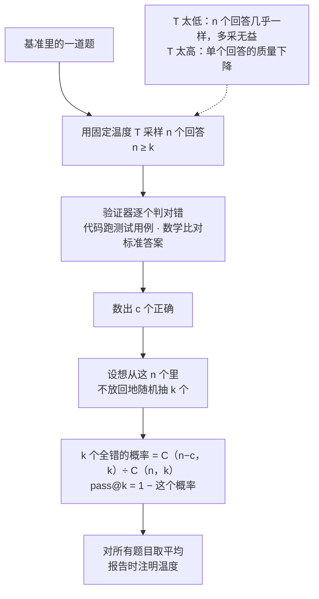
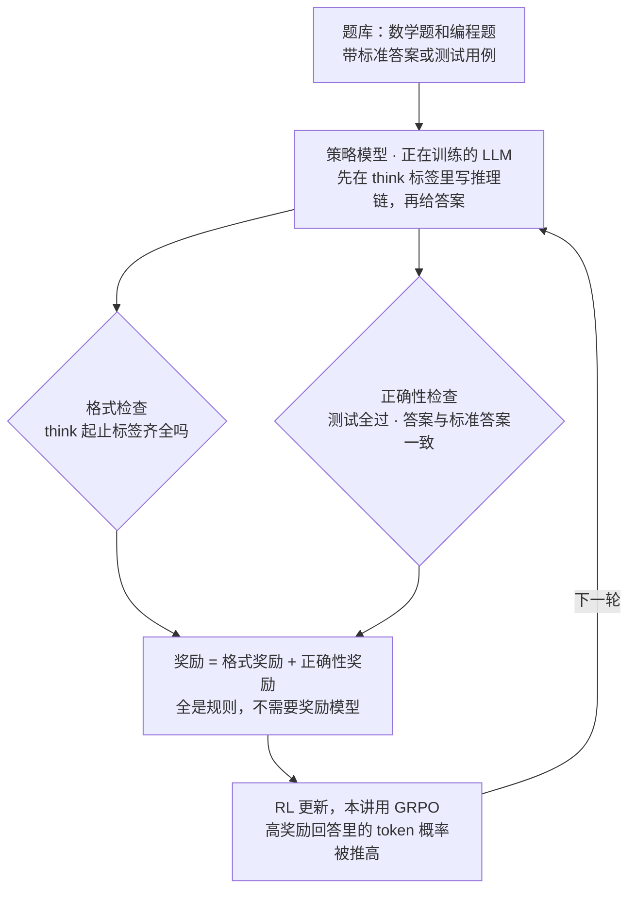
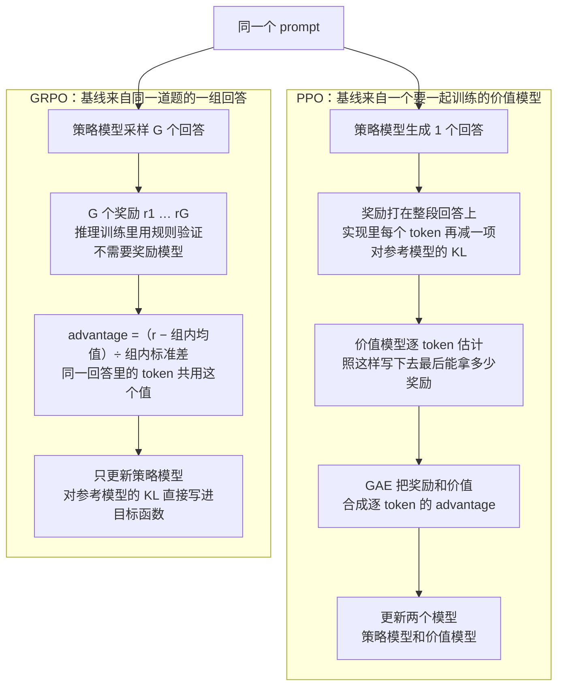
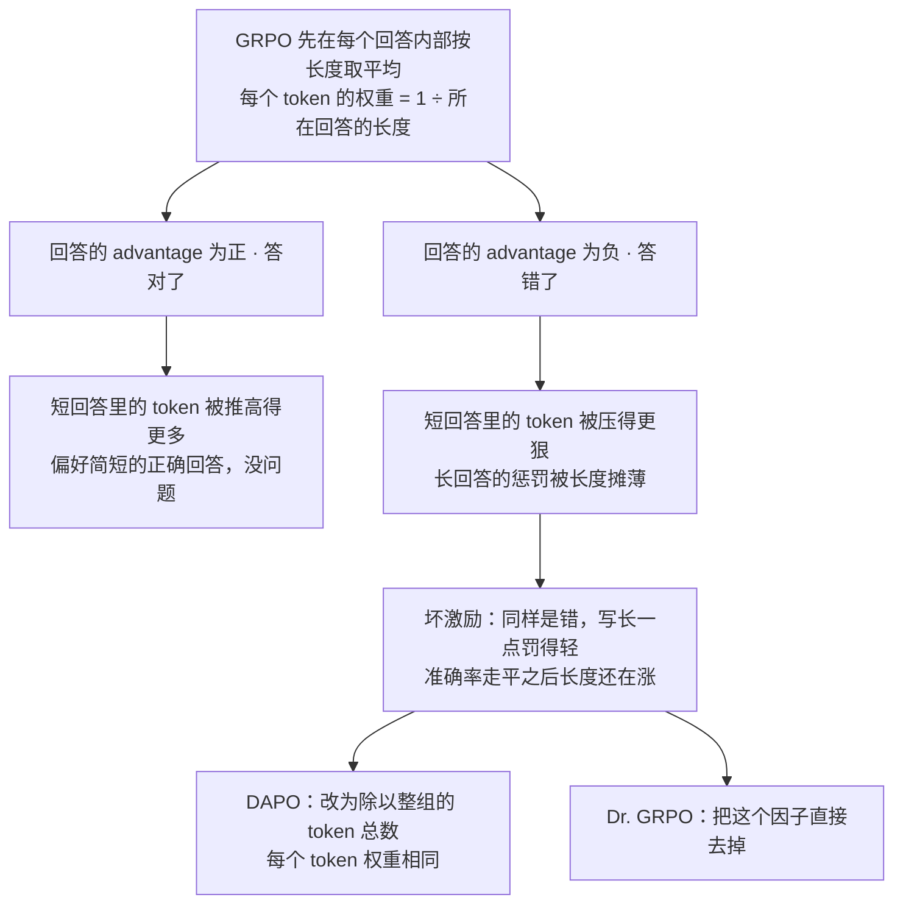
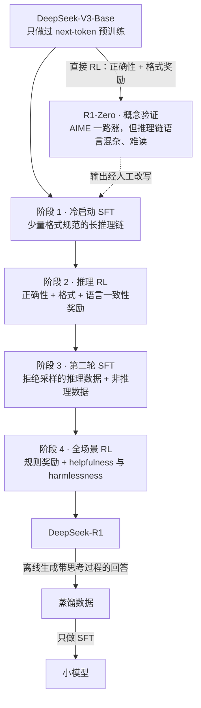

# CME295 第 6 讲｜LLM 推理（LLM Reasoning）

> Stanford CME295: Transformers & Large Language Models（2025 秋）· 第 6 讲，2025 年 11 月 7 日
> 视频：<https://www.youtube.com/watch?v=k5Fh-UgTuCo>（1:47:10，英文字幕是自动生成的，缩写和专名错得比较多，见文末勘误）
> 讲者：Afshine Amidi（开场到 1:29:38：推理模型、评测指标、GRPO 及其改进）· Shervine Amidi（1:29:38 起：DeepSeek-R1 配方与蒸馏）
> 课程大纲：<https://cme295.stanford.edu/syllabus/>

> 小注：大纲页现在挂的是 2026 秋季版课表，讲次已经重排（那一版的第 6 讲是 AI Agents）。这套录像对应的 2025 秋课表在 <https://cme295.stanford.edu/syllabus/2025/>，那一页也挂着本讲的幻灯片 PDF。本笔记里说的"第 N 讲"都指 2025 秋录像的编号。

**一句话**：推理模型就是先写出一段推理链、再给答案的 LLM——把第 3 讲的 chain of thought 从提示技巧变成训练出来的习惯。衡量它用数学题、编程题这类能自动判对错的基准，核心指标是 pass@k；训练它不靠人写推理链，而是拿"格式对不对、答案对不对"这两个可验证奖励做 RL，算法是 GRPO：同一道题采一组回答，用组内均值当基线，省掉 PPO 那个要一起训练的价值模型。GRPO 按回答长度取平均的写法会让答错的长回答少挨罚，于是有了 DAPO 和 Dr. GRPO 的修补。最后，DeepSeek-R1 把这些零件拼成完整配方：R1-Zero 用纯 RL 做概念验证，R1 走"冷启动 SFT → 推理 RL → 拒绝采样 SFT → 全场景 RL"四步，再把能力蒸馏进小模型。

## 时间轴

| 时间 | 内容 |
|---|---|
| [0:06](https://www.youtube.com/watch?v=k5Fh-UgTuCo&t=6s) | 开场与回顾：预训练 → SFT → 偏好微调；用 RL 的词汇描述 LLM |
| [5:16](https://www.youtube.com/watch?v=k5Fh-UgTuCo&t=316s) | RLHF 损失的两部分；PPO-Clip 与 PPO-KL penalty |
| [8:56](https://www.youtube.com/watch?v=k5Fh-UgTuCo&t=536s) | vanilla LLM 的长处与四个短板；后三个留给第 7、8 讲 |
| [12:43](https://www.youtube.com/watch?v=k5Fh-UgTuCo&t=763s) | 本讲的两个目标；reasoning 的工作定义；知识题与推理题 |
| [15:43](https://www.youtube.com/watch?v=k5Fh-UgTuCo&t=943s) | 核心想法：把 chain of thought 做大；问答：日期这类上下文放在 preamble |
| [18:53](https://www.youtube.com/watch?v=k5Fh-UgTuCo&t=1133s) | 两个直觉：拆成见过的小问题；多写 token 就是多用算力 |
| [21:24](https://www.youtube.com/watch?v=k5Fh-UgTuCo&t=1284s) | vanilla LLM 与推理模型的输出对比；推理模型时间线 |
| [24:30](https://www.youtube.com/watch?v=k5Fh-UgTuCo&t=1470s) | 怎么认出推理模型：Thinking 与思考摘要；推理 token 按输出计费 |
| [27:49](https://www.youtube.com/watch?v=k5Fh-UgTuCo&t=1669s) | 基准：编程（HumanEval、Codeforces、SWE-bench）与数学（AIME、GSM8K），怎么自动判对错 |
| [32:04](https://www.youtube.com/watch?v=k5Fh-UgTuCo&t=1924s) | pass@k 的定义与动机；和 Best-of-N 的关系 |
| [35:32](https://www.youtube.com/watch?v=k5Fh-UgTuCo&t=2132s) | 为什么要采 n 个而不是 k 个；板书推导估计式 |
| [44:21](https://www.youtube.com/watch?v=k5Fh-UgTuCo&t=2661s) | pass@1；温度怎么影响 pass@k；cons@k |
| [48:07](https://www.youtube.com/watch?v=k5Fh-UgTuCo&t=2887s) | 怎么训出推理模型：不从 SFT 起步的三个理由 |
| [51:32](https://www.youtube.com/watch?v=k5Fh-UgTuCo&t=3092s) | 两个可验证奖励（格式 + 正确性）；R1-Zero 的 AIME 曲线 |
| [54:10](https://www.youtube.com/watch?v=k5Fh-UgTuCo&t=3250s) | 控制思考量：思考预算、上下文感知、budget forcing、连续思考 |
| [57:44](https://www.youtube.com/watch?v=k5Fh-UgTuCo&t=3464s) | GRPO：名字、目标，和 PPO 在 advantage 上的分歧 |
| [1:03:30](https://www.youtube.com/watch?v=k5Fh-UgTuCo&t=3810s) | 问答：为什么要换掉价值函数；组内基线的直觉 |
| [1:06:03](https://www.youtube.com/watch?v=k5Fh-UgTuCo&t=3963s) | GRPO 与 PPO 的流程对照；哪些模型冻结、哪些要训练 |
| [1:11:44](https://www.youtube.com/watch?v=k5Fh-UgTuCo&t=4304s) | 两个目标函数并排看：相同点与不同点；小结 |
| [1:16:14](https://www.youtube.com/watch?v=k5Fh-UgTuCo&t=4574s) | 长度偏置：RL 越训回答越长，准确率却先走平了 |
| [1:19:31](https://www.youtube.com/watch?v=k5Fh-UgTuCo&t=4771s) | 从 GRPO 目标函数里找原因：按回答长度取平均的那个因子 |
| [1:25:00](https://www.youtube.com/watch?v=k5Fh-UgTuCo&t=5100s) | DAPO 与 Dr. GRPO 的修法和效果 |
| [1:27:14](https://www.youtube.com/watch?v=k5Fh-UgTuCo&t=5234s) | 另外两处改动：标准差带来的偏置；非对称的裁剪上下界 |
| [1:29:38](https://www.youtube.com/watch?v=k5Fh-UgTuCo&t=5378s) | 换 Shervine：DeepSeek-R1 配方总览；R1-Zero 在 base 模型上直接做 RL |
| [1:34:31](https://www.youtube.com/watch?v=k5Fh-UgTuCo&t=5671s) | R1-Zero 的问题：推理链语言混杂、难读 |
| [1:36:11](https://www.youtube.com/watch?v=k5Fh-UgTuCo&t=5771s) | R1 的前两个阶段：冷启动 SFT；加了语言一致性奖励的推理 RL |
| [1:38:42](https://www.youtube.com/watch?v=k5Fh-UgTuCo&t=5922s) | 后两个阶段：拒绝采样造数据的第二轮 SFT；全场景 RL |
| [1:42:20](https://www.youtube.com/watch?v=k5Fh-UgTuCo&t=6140s) | 结果：推理模型与非推理模型分成两簇 |
| [1:43:24](https://www.youtube.com/watch?v=k5Fh-UgTuCo&t=6204s) | 蒸馏到小模型；为什么不直接对小模型做 RL |

## 核心内容

### 1. 承上启下：第 5 讲的 RL 工具箱，和 vanilla LLM 的四个短板

- **三步训练回顾**：预训练最烧算力，模型学到文本和代码的结构，但只会续写（第 4 讲）；SFT 用精选的高质量数据教它按要求办事，比如当助手；偏好微调让它贴近人的偏好，做法是 RLHF——先用人类偏好数据训一个奖励模型，再进入 RL 阶段（第 5 讲）。今天要借用的就是这个 RL 阶段。
- **把 LLM 套进 RL 的词汇表**：agent 是 LLM 自己；状态是到目前为止的输入（prompt 加已生成的 token）；动作是选下一个 token；策略（policy）就是模型给出的下一个 token 的概率分布；一段回答写完后拿到一个奖励，第 5 讲里这个奖励代表人的偏好。
- **RL 阶段的损失有两部分**：一是最大化 advantage——奖励减去一个基线，意思是"这个回答比预期好多少"，减基线是为了降低梯度的方差；二是别跑太远，既不要离上一轮迭代的旧策略太远，也不要离起点的 SFT 模型太远。理由是模型已经学会了很多，这一步只想校准，不想重塑。
- **PPO 的两个变体**：PPO-Clip 盯着新旧策略对同一个 token 的概率比（幻灯片里记作 r，它不是 reward），超出阈值就裁掉，不鼓励一步迈太大；PPO-KL penalty 用 KL 散度当罚项，原论文里比的是上一轮的策略，如今的 RLHF 通常比的是 SFT 模型。实际训练一般是两者混着用。
- **vanilla LLM 的四个短板**：讲者把"输入 prompt、直接吐答案"的模型叫 vanilla LLM。它写代码、找 bug、写文章都很强，但有四个弱点：推理能力有限，稍复杂的数学题就容易半路走丢；知识是静态的，停在预训练数据的截止日期（例子：问它几天前的选举结果）；只会说不会做，没法替你下单；输出是自由文本，翻译用的 BLEU、摘要用的 ROUGE 这类规则指标不再适用，评测很难。后三个留给第 7、8 讲，本讲只管第一个。

### 2. 什么是推理模型：把 chain of thought 做成模型的习惯

*图 6-1｜vanilla LLM 与推理模型的输出对比（自绘示意）· [▶ 看原幻灯片 21:24](https://www.youtube.com/watch?v=k5Fh-UgTuCo&t=1284s)*

- **先对齐用词**：中文里 inference（运行模型做生成）和 reasoning（分步求解问题）都常被译成"推理"。本讲标题里的推理是 reasoning。
- **工作定义**：讲者先承认学界对 reasoning 没有公认的定义，然后给了一个够用的：解决问题的能力，而这类问题通常要经过多步的求解过程，典型的是数学题和编程题，并希望这种能力能外溢到其他领域。对照的例子：问"这门课的课号是什么"是知识题，知道就是知道；问"一只熊 2020 年出生，到 2025 年几岁"是推理题——当然真正的推理题要难得多。
- **核心想法来自 chain of thought**（第 3 讲）：CoT 在 prompt 里放几个把推理过程写出来的示例，引导模型也先写过程、再给答案。推理模型做的是同一件事，只是规模大得多，而且是训练出来的：输出不再只是答案，而是"推理链 + 答案"。
- **先写过程为什么有用**，讲者给了两个直觉：
    - LLM 靠 next-token prediction 作答，本质是在挑"看起来最像样"的续写。一道很难的题几乎不可能在训练集里原样出现过；拆成小步之后，每一小步都更像训练时见过的模式，可以各个击破——和学生把新题往做过的题上靠是一回事。
    - 每生成一个 token 都要做一次完整的前向计算，多写 token 等于给这道题多分配算力。后面反复出现的 compute budget（思考预算）指的就是愿意让模型为一次回答花多少 token。
- **问答：题目依赖上下文怎么办**（学生指出熊的例子得知道今天的日期）。模型前面通常有一段 preamble，日期这类信息就放在那里；需要去外部取的信息留给第 7 讲。讲者把这些看作推理模型的扩展，而不是它的根基。
- **时间线**：2024 年 9 月 OpenAI 的 o1-preview 是起点，之后各家都在猜它是怎么做的；12 月 Google 出了 Gemini 2.0 Flash Thinking；2025 年 1 月 DeepSeek-R1 的论文引起轰动，因为它追平了 OpenAI 的推理成绩，而且把方法写了出来；此后 xAI、Anthropic、Mistral 等的模型也陆续有了推理能力。这个方向只有一年左右的历史，本讲几乎所有内容都出自 2024—2025 年。
- **怎么认出推理模型**：界面上有 Thinking 字样和思考耗时（那段时间就是在生成推理链），ChatGPT 还能在标准和加长思考之间切换。界面显示的是思考摘要，不是原始推理链。讲者猜了三个原因：原始链条人未必读得懂；用户不想读好几页；拿到原始链条的人可以用它训练出模仿这种能力的模型——第 7 节的蒸馏正是这么做的。
- **计费**：各家 API 文档里都有一句，推理 token 计入输出 token 收费，看不到也要付钱。所以用户想要的是"用最少的推理 token 换最强的推理能力"，这为第 6 节的长度问题埋了伏笔。

### 3. 怎么衡量：能自动判对错的基准，和 pass@k

*图 6-2｜pass@k 的估计流程：多采、验证、再用组合数折算（自绘示意）· [▶ 看原幻灯片 35:32](https://www.youtube.com/watch?v=k5Fh-UgTuCo&t=2132s) · 出处：[Chen et al., 2021](https://arxiv.org/abs/2107.03374)*

- **编程基准**：给一个题目或一个 bug，模型交出的代码去跑测试用例，全过才算对。HumanEval 是一百多道人工写的编程题；Codeforces 来自竞赛编程网站；SWE-bench 的题目取自真实的 GitHub issue。
    > 小注：HumanEval 共 164 题，出自 OpenAI 的 Codex 论文（Chen et al., 2021）；下面的 pass@k 估计式也是这篇论文提出的。
- **数学基准**：在 prompt 里要求模型把最终答案放进固定格式（比如一个 box 里），解析出来和标准答案比对。AIME 是美国数学奥赛的资格赛，题目并不简单，推理模型的报告里几乎都有它；GSM8K 是小学水平的应用题。
- 这两类任务的共同点是对错可以自动判定，不需要人，也不需要另一个模型。到下一节，这一点会变成训练信号。
- **pass@k 的定义**：让模型对同一道题作答 k 次，至少有一次正确的概率。它有意义的前提是你付得起多次生成、又有办法检查答案——这时多花算力换更高的命中率是划算的。它和第 5 讲的 Best-of-N 很像，区别是这里用确定性的验证器来挑，而不是用奖励模型打分。
- **怎么估**（讲者在黑板上推了一遍）：只生成 k 个、看里面有没有对的，这样估出来的值波动很大。做法是生成 n 个（n ≥ k），数出其中 c 个正确，然后问：从这 n 个里不放回地随机抽 k 个，至少抽到一个正确的概率是多少？用"至少一个对 = 1 − 全都错"来算：第一个抽到错的概率是 (n−c)/n，第二个是 (n−c−1)/(n−1)，一直乘到第 k 个；把这串乘积写成阶乘，正好是两个组合数之比。

$$
\text{pass@}k \;=\; 1-\prod_{j=0}^{k-1}\frac{n-c-j}{n-j} \;=\; 1-\frac{\binom{n-c}{k}}{\binom{n}{k}}
$$

其中 n 是每道题采样的回答总数，c 是其中判为正确的个数，k 是指标允许的尝试次数；分子是"只从错的里面挑 k 个"的挑法数，分母是"从全部 n 个里挑 k 个"的挑法数。

- k = 1 时公式化简成 c/n，也就是单次作答的正确率 pass@1。
- **温度和 pass@k**（回答前面一位学生的提问）：多次采样的收益来自回答的多样性，而多样性由温度控制。T = 0 时每次输出都一样，k 再大曲线也是平的；T 稍高（图里的 0.2）曲线开始随 k 上升；T 过高（图里的 1.2）虽然够多样，但原本不太可能的 token 被频繁选中，单个回答的质量下降，效果也不好。图里 k 较大时最好的是 0.8，k 较小时偏低的温度（比如 0.4）更好。所以论文报基准成绩时都会注明温度。
    > 小注：Codex 论文做过同样的实验（幻灯片上的图推断就出自那里），结论是 pass@1 的最优温度为 0.2、pass@100 为 0.8——允许的尝试次数越多，越值得用高温度换多样性。
- **其他指标**：cons@k（consensus）取 k 个回答里出现次数最多的那个答案，再判对错，和第 3 讲的 self-consistency 是同一个思路；此外还有常见的 accuracy、exact match。
- **和 CS329A 的关系**：CS329A 第 2 讲的 coverage 曲线画的就是 pass@k 随 k 的变化，那边讲的是它的幂律和"采得到不等于挑得出"（generation–verification gap）；cons@k 就是 CS329A 第 6 讲里的 maj@K。那几讲讲的是研究前沿，这里补的是基础：这个数该怎么估，温度为什么要一起报。

### 4. 怎么训出来：为什么是 RL，奖励从哪来

*图 6-3｜用可验证奖励做 RL 的训练回路（自绘示意）· [▶ 看原幻灯片 51:32](https://www.youtube.com/watch?v=k5Fh-UgTuCo&t=3092s) · 出处：[DeepSeek-AI, 2025](https://arxiv.org/abs/2501.12948)*

- **目标**：让模型在回答之前自己写出推理链，而且这件事要能规模化。
- **为什么不从 SFT 起步**（前提是手里没有现成的推理链）：
    1. SFT 要高质量的示范数据，也就是得有人把很长的推理链一条条写出来，又难又贵。
    2. 模型"想问题"的方式未必和人一样，人写的推理过程不一定是教它的最好教材。
    3. 上一节刚看到，这类任务天生带着可验证的奖励：代码能不能通过测试，数学答案和标准答案是否一致。有现成的奖励信号，第 5 讲又刚学了 LLM 上的 RL，那就用 RL。
- **两个奖励，都是规则**：格式奖励检查模型有没有把推理过程放在约定的 think 起止标签之间；正确性奖励检查最终答案——代码过没过全部测试，数学答案对不对。两者合起来就是训练用的奖励，全程不需要奖励模型。
- **效果**：只靠这两个奖励做 RL，模型在 AIME 上的准确率随训练步数稳步上升，幅度很大。图来自 DeepSeek-R1-Zero 的训练曲线（第 7 节细讲）。
    > 小注：按论文 arXiv 第一版，R1-Zero 的 AIME 2024 pass@1 从 15.6% 升到 71.0%；64 个样本取多数票（cons@64）是 86.7%。
- **和 CS329A 的关系**：CS329A 第 3 讲讲的是对错要靠训练出来的验证器来判的情形（ORM / PRM）；本讲挑的是规则就能判的任务，所以整个绕开了奖励模型。CS329A 第 6 讲的 STaR 是另一条路：让模型自己生成推理链，答对才留下来做 SFT——R1 配方的第三阶段用的是同一种思路。
- **思考量怎么控制**（讲者说这些还是开放问题）：
    - 不是每个 prompt 都值得长考，要避免在简单问题上想太多（overthinking）。一种可能的做法是先用一个轻量分类器判断这道题需要多少思考，再分配预算。
    - 上下文窗口有限，模型思考时得知道还剩多少空间。
    - **budget forcing**（s1 论文）：想让模型多想，就在它准备收尾时插入 Wait 这样的词，它往往会换一条思路再查一遍；想让它停，就插入一句"时间到，我的答案是"，逼它作答。
    - **连续思考**（continuous thought）：推理不一定要落在语言 token 上，也可以在隐藏表示里进行，信息更密、也更省；这条线很活跃，讲者说几天前还看到新论文。
    > 小注：幻灯片上链接的那篇 2024 年论文应为 Coconut（Hao et al.），做法是把最后一层的隐藏状态直接当作下一步的输入，不解码成 token。另外，s1 本身只用 1,000 条带推理链的样本对 Qwen2.5-32B-Instruct 做 SFT——手里已有推理链时 SFT 依然好用，这和讲者"从零开始才用 RL"的前提并不矛盾。

### 5. GRPO：用同一道题的一组回答，代替 PPO 的价值模型

*图 6-4｜PPO 与 GRPO 的流程对照：advantage 从哪来、要训练哪些模型（自绘示意）· [▶ 看原幻灯片 1:06:07](https://www.youtube.com/watch?v=k5Fh-UgTuCo&t=3967s) · 出处：[Shao et al., 2024](https://arxiv.org/abs/2402.03300)*

- **定位**：GRPO（Group Relative Policy Optimization）2024 年提出，如今是推理训练里默认的 RL 算法。它和 PPO 要做的两件事一样：最大化 advantage；不让模型离旧策略和参考模型太远。分歧只在 advantage 怎么算。
    > 小注：GRPO 出自 DeepSeekMath（Shao et al., 2024 年 2 月）。那篇论文里奖励还来自训练出来的奖励模型，到 DeepSeek-R1 才换成纯规则奖励。
- **PPO 怎么算**：奖励是打给整段回答的，但更新要落到每个 token 上。PPO 为此另外训练一个价值函数（value function，实现上是另一个要和策略一起训练的模型）：在每个 token 的位置上，预测"按当前策略继续写下去，最后能拿多少奖励"。再用 GAE（generalized advantage estimation，课上没有展开的一个公式）把奖励和逐 token 的价值合成 advantage。讲者说瓶颈就在这个昂贵的价值模型上。
- **GRPO 怎么算**：对同一个 prompt 采样 G 个回答，各自算出奖励；拿每个回答的奖励和这一组的平均水平比，再除以组内标准差，就是它的 advantage，这个回答里的所有 token 共用这一个值。没有价值模型，代价只是每道题要多采几个回答。

$$
\hat{A}_i=\frac{r_i-\mathrm{mean}(r_1,\dots,r_G)}{\mathrm{std}(r_1,\dots,r_G)}
$$

其中 r_i 是第 i 个回答的奖励，G 是同一个 prompt 采样的回答数，mean 和 std 是这 G 个奖励的均值和标准差。

- **问答：为什么要这么换**。PPO 是 2017 年的算法，为通用的 RL 场景设计，那时还没有 LLM；价值函数在那些场景里很自然，放到语言任务里却意味着多养一个昂贵的模型。GRPO 的想法是有一个"相对好坏"就够了，而组内均值恰好是一个懂题目难度的基线：简单题大家都答对，奖励高也不稀奇；难题上难得有一个回答做对，就应该大力推高它用到的 token。
- **一个实现细节**：PPO 对参考模型的 KL 罚项通常并进奖励里——每个 token 都带一项 KL，只有最后一个 token 再加上整段回答的奖励；GRPO 则把 KL 项直接写在目标函数里。
- **谁冻结、谁训练**：两种算法里参考模型和奖励模型都是冻结的；推理训练因为奖励可验证，干脆没有奖励模型。要训练的，GRPO 只有策略模型，PPO 是策略模型加价值模型。
- **两个目标函数并排看**：相同点是都围绕新旧策略的概率比做文章，都用 clip 把一次更新限制在小范围内（第 5 讲按 advantage 的正负画过那两张图）；不同点是 KL 放在哪，以及 advantage 怎么来。

$$
J_{\mathrm{GRPO}}(\theta)=\mathbb{E}\left[\frac{1}{G}\sum_{i=1}^{G}\frac{1}{|o_i|}\sum_{t=1}^{|o_i|}\Big(\min\big(\rho_{i,t}\hat{A}_i,\ \mathrm{clip}(\rho_{i,t},\,1-\varepsilon,\,1+\varepsilon)\,\hat{A}_i\big)-\beta\,D_{\mathrm{KL}}\big[\pi_\theta\,\|\,\pi_{\mathrm{ref}}\big]\Big)\right]
$$

其中 o_i 是第 i 个回答，|o_i| 是它的 token 数；ρ 是新旧策略对第 i 个回答第 t 个 token 的概率比（幻灯片沿用 PPO 的记号写作 r，这里改用 ρ，免得和奖励混淆）；ε 是裁剪范围，β 是 KL 罚项的系数，π_ref 是参考模型。

- **讲者的小结**：PPO 主要用在偏好微调，GRPO 主要用在推理训练；GRPO 不需要价值函数，advantage 靠和同组的其他回答比出来。他也坦言这是全课最难的一段，建议回看录像。
- **和 CS329A 的关系**：CS329A 第 6 讲是顺着 DeepSeekMath 论文讲 GRPO 的（省显存、online 胜过 offline、整组全对或全错时没有信号）；这里补的是基础：目标函数逐项怎么读，和 PPO 在实现层面差在哪。

### 6. 长度偏置：GRPO 为什么越训越长，DAPO 和 Dr. GRPO 怎么修

*图 6-5｜长度偏置是怎么从"按回答长度取平均"里长出来的（自绘示意）· [▶ 看原幻灯片 1:21:04](https://www.youtube.com/watch?v=k5Fh-UgTuCo&t=4864s) · 出处：[Liu et al., 2025](https://arxiv.org/abs/2503.20783)*

- **为什么在意长度**：推理 token 按量收费，对用户是钱，对服务方是算力，双方都希望同样的效果用更短的输出达到。
- **现象**：RL 训练过程中，平均回答长度随步数一路上涨，主要涨在推理链上。起初这和准确率的上升同步，看着是好事；但到某个阶段准确率已经走平，长度还在涨——说明推着长度往上走的不只是"题目需要更长的思考"。
- **从目标函数里找原因**：上一节的式子有两层求和，外层遍历组里的 G 个回答，内层遍历回答里的每个 token，内层前面有一个 1/|o_i|。把这个因子挪到求和号里面看，它只取决于 token 所在的回答有多长：回答越短，每个 token 分到的权重越大。
    - advantage 为正（答对）时，短回答里的 token 被推高得更多——偏好简短的正确答案，这没问题。
    - advantage 为负（答错）时，短回答里的 token 被压得更狠，长回答的惩罚却被长度摊薄了。对模型来说，同样是错，写得长反而罚得轻。这个坏激励被认为是长度失控的原因。
- **两种修法**：DAPO（2025 年 3 月；不是第 5 讲的 DPO，字幕把它也识别成了 DPO）把归一化因子改成整组回答的 token 总数，对所有 token 一视同仁；Dr. GRPO（全称 GRPO Done Right）干脆把这个因子去掉。DAPO 的目标函数：

$$
J_{\mathrm{DAPO}}(\theta)=\mathbb{E}\left[\frac{1}{\sum_{i=1}^{G}|o_i|}\sum_{i=1}^{G}\sum_{t=1}^{|o_i|}\min\big(\rho_{i,t}\hat{A}_i,\ \mathrm{clip}(\rho_{i,t},\,1-\varepsilon_{\mathrm{low}},\,1+\varepsilon_{\mathrm{high}})\,\hat{A}_i\big)\right]
$$

和上一节的式子比，变了两处：分母从每个回答各自的长度 |o_i| 换成整组的 token 总数；裁剪的上下界拆成 ε_low 和 ε_high 两个数（见下面的非对称裁剪）。

> 小注：DAPO 的目标函数里没有 KL 项——论文认为长推理链训练本来就该让模型远离初始分布；论文取 ε_low = 0.2、ε_high = 0.28。Dr. GRPO 出自 Liu et al., 2025，实现上是把 1/|o_i| 换成一个固定常数。

- **效果**：修正之后回答长度不再无休止地涨。拆开看更有说服力：答对的回答，长度和原版 GRPO 差不多；答错的回答，平均长度比原版短得多——改动正好作用在该作用的地方。
- **顺带提到的另外两处改动**：
    - advantage 里除以标准差，会带来和题目难度有关的偏置：一道很难的题，采出来的回答大多失败，组内奖励的标准差很小，拿它当分母会出问题。
    - clip 的上下界不该对称。裁剪限制的是概率比，所以一个 token 的新概率最多涨到（1 + ε）× 旧概率；旧概率本来就很低的 token，这点空间几乎涨不动。但也不能把 ε 整体调大，否则高概率的 token 可能一步掉到接近零。于是让上下界不对称，只放宽上界。
    > 小注：去掉标准差是 Dr. GRPO 的另一半改动——论文的说法是，标准差小的题（太难或太容易）除过之后 advantage 被放大，等于被过度加权，称为题目难度偏置，与长度偏置并列。非对称裁剪是 DAPO 的 Clip-Higher。DAPO 还有两个补丁本讲没讲：dynamic sampling 和超长样本的处理。
- **和 CS329A 的关系**：CS329A 第 6 讲把 DAPO 的四个补丁连同消融实验过了一遍；这里补的是基础：token-level loss 到底在修什么，从公式上一步步推出来。

### 7. DeepSeek-R1 配方：R1-Zero 验证想法，R1 拼成流水线，再蒸馏给小模型

*图 6-6｜从 V3-Base 到 R1-Zero、R1，再到蒸馏小模型的整条流水线（自绘示意）· [▶ 看原幻灯片 1:36:11](https://www.youtube.com/watch?v=k5Fh-UgTuCo&t=5771s) · 出处：[DeepSeek-AI, 2025](https://arxiv.org/abs/2501.12948)*

- **对照组：传统 LLM 的流水线**是预训练的 base 模型 → SFT（指令微调）→ 面向偏好的 RL。R1 论文分两步走：先用 R1-Zero 证明只靠可验证奖励的 RL 能走多远，再根据观察到的问题设计出完整的 R1。
- **R1-Zero**
    - 起点是 DeepSeek-V3-Base：只做过 next-token 预训练、没见过任何监督数据的 base 模型；架构上是 MoE（第 3 讲），注意力用的是 DeepSeek-V2 引入的 MLA。
    - 不做 SFT，直接上第 4 节的 RL，奖励只有答案正确性和格式两项。prompt 模板很简单：开头几句交代这是用户和助手的对话，然后用大白话说明格式要求（思考过程放进 think 标签，最终答案放进 answer 标签），中间留一个位置填题目，接着让模型往下写。
    - 结果是 AIME 准确率随训练一路上涨，一条 SFT 数据都没用。但作者去读推理链时发现两类问题：思考过程里多种语言混用；行文不通顺、难读。讲者的解释是，模型此前没受过任何强监督，RL 又只优化被奖励的东西，推理链"该长什么样"没有锚点。
- **R1 的四个阶段**（同样从 V3-Base 出发）

| 阶段 | 做什么 | 数据或奖励 | 针对什么 |
|---|---|---|---|
| 1 · 冷启动 SFT | 先做一小轮 SFT | 少量长推理链：取自 R1-Zero 的输出，由人改写成格式规范、语言一致的样子 | 给后面的 RL 一个"推理链该长什么样"的锚点 |
| 2 · 推理 RL | 和 R1-Zero 同样的 RL | 正确性 + 格式，再加语言一致性奖励：推理链里目标语言的词占多大比例 | 提升推理能力，同时压住语言混杂 |
| 3 · 第二轮 SFT | 规模大得多的 SFT | 非推理数据约 200k 条，沿用 V3 的 SFT 数据；推理数据是它的 3 倍，靠拒绝采样得到 | 模型不能只会做题，还得覆盖写作、问答这些日常用途 |
| 4 · 全场景 RL | 最后一轮 RL | 推理题照旧用规则奖励；通用题用 helpfulness 和 harmlessness 两种偏好奖励 | 对齐成一个有用且无害的助手 |

- **几个细节**
    - 冷启动数据有多少，讲者说论文没给确切数字，从措辞看比其他阶段少几个数量级，大概是几千条。
    - **拒绝采样**（rejection sampling）在这里的意思是：拿一批推理类的 prompt，让阶段 2 训出来的模型生成回答，再用规则和 LLM judge 筛选，只留好的，其余丢弃。数据量太大，筛选只能自动做。
    - 阶段 4 里 harmlessness 看的是整段输出，包括 think 里的推理过程；helpfulness 只看用户最终读到的那部分回答。
    > 小注：论文的原话是 thousands of cold-start data，来源除了整理过的 R1-Zero 输出，还有用长 CoT 做 few-shot、直接提示模型写出带反思和验证的详细解答，再由人工后处理。语言一致性奖励在论文的消融里会让成绩略降，作者为了可读性接受了这个代价。阶段 3 的数据是约 600k 推理 + 约 200k 非推理；这一轮 SFT 是从 V3-Base 重新训的，阶段 2 的 RL 模型只用来造数据。
- **结果**：在推理类基准上，模型明显分成两簇，非推理模型一簇，推理模型一簇，后者高出一大截；R1 和宣称具备推理能力的闭源模型不相上下——这也是它在 2025 年 1 月引起轰动的原因。
- **蒸馏：手里没有 600B 的模型怎么办**
    - 回顾经典蒸馏（第 2 讲末尾讲 DistilBERT 时）：训练文本是固定的，学生模型在每个位置上拟合的不是 one-hot 的"下一个 token"，而是老师模型给出的整个概率分布。
    - 推理能力的蒸馏是另一种做法：现成的推理 SFT 数据并不存在，所以先让老师（R1）离线生成一批带思考过程的完整回答，再拿这些序列对小模型做普通的 SFT——拟合的是老师写出来的 token 序列，不是概率分布。名字仍叫蒸馏。
    - 蒸馏出来的小模型，成绩和 o1-mini 这类闭源的小号推理模型相当。
    - 为什么不直接对小模型做同样的 RL？作者的结论是：在小尺寸上，蒸馏比从头做 RL 更有效。
    - 回头看第 2 节：厂商不展示原始推理链，防的正是这种蒸馏。
    > 小注：V3 / R1 总参数 671B，每个 token 激活 37B。蒸馏用的就是阶段 3 那约 800k 条数据，学生是 Qwen2.5 和 Llama 3 系列的 1.5B 到 70B，只做 SFT、不做 RL。论文的对照实验：Qwen-32B 基座直接做上万步 RL（R1-Zero-Qwen-32B）只和 QwQ-32B-Preview 相当，而从 R1 蒸馏出来的 32B 在各项基准上都明显更高。

## 关键图表速查（点时间戳跳到原幻灯片）

| 图 | 看什么 | 跳转 | 出处 |
|---|---|---|---|
| vanilla LLM 与推理模型对照 | 输入相同，输出从"答案"变成"推理链 + 答案" | [21:24](https://www.youtube.com/watch?v=k5Fh-UgTuCo&t=1284s) | 讲者自绘 |
| 推理模型时间线 | o1-preview（2024 年 9 月）→ Gemini 2.0 Flash Thinking（12 月）→ DeepSeek-R1（2025 年 1 月）→ 各家跟进 | [22:26](https://www.youtube.com/watch?v=k5Fh-UgTuCo&t=1346s) | 讲者汇总 |
| pass@k 板书推导 | 从"1 − 全错的概率"出发，连乘式怎样整理成两个组合数之比 | [37:03](https://www.youtube.com/watch?v=k5Fh-UgTuCo&t=2223s) | [Codex 论文](https://arxiv.org/abs/2107.03374) |
| 温度与 pass@k 曲线 | T = 0 的线是平的；k 越大，最优温度越高；T = 1.2 已经过头 | [45:54](https://www.youtube.com/watch?v=k5Fh-UgTuCo&t=2754s) | 推断出自 [Codex 论文](https://arxiv.org/abs/2107.03374) |
| R1-Zero 的 AIME 训练曲线 | 横轴是 RL 步数，准确率稳步上升；整个过程只有两个规则奖励 | [53:05](https://www.youtube.com/watch?v=k5Fh-UgTuCo&t=3185s) | [DeepSeek-R1](https://arxiv.org/abs/2501.12948) |
| budget forcing 示例 | 推理链中途插入 Wait 之后，模型换了一条思路继续查 | [55:40](https://www.youtube.com/watch?v=k5Fh-UgTuCo&t=3340s) | [s1](https://arxiv.org/abs/2501.19393) |
| GRPO 流程图 | 一个 query 采 G 个回答 → G 个奖励 → 组内归一化的 advantage；KL 项单独接到参考模型 | [1:06:07](https://www.youtube.com/watch?v=k5Fh-UgTuCo&t=3967s) | [DeepSeekMath](https://arxiv.org/abs/2402.03300) |
| PPO 流程图 | 逐 token 的奖励（只有末位带回答的奖励，每位都带 KL）、价值模型、GAE | [1:07:38](https://www.youtube.com/watch?v=k5Fh-UgTuCo&t=4058s) | 同上 |
| 冻结与训练的模型对照 | GRPO 只训练策略模型；PPO 多训练一个价值模型；推理训练里没有奖励模型 | [1:10:14](https://www.youtube.com/watch?v=k5Fh-UgTuCo&t=4214s) | 同上 |
| 两个目标函数并排 | 找相同：概率比、clip；找不同：KL 的位置、advantage 的来源 | [1:11:44](https://www.youtube.com/watch?v=k5Fh-UgTuCo&t=4304s) | [PPO](https://arxiv.org/abs/1707.06347) · [DeepSeekMath](https://arxiv.org/abs/2402.03300) |
| 回答长度与准确率两条曲线 | 长度一直涨；准确率到后段走平，两条线从这里分道 | [1:17:57](https://www.youtube.com/watch?v=k5Fh-UgTuCo&t=4677s) | 长度曲线应出自 [DeepSeek-R1](https://arxiv.org/abs/2501.12948) |
| 挪动长度因子的那一页 | 把"1 ÷ 回答长度"移进内层求和之后，每个 token 的权重一目了然 | [1:21:04](https://www.youtube.com/watch?v=k5Fh-UgTuCo&t=4864s) | 讲者推导 |
| 修正前后的对比图 | 右下角那张：答错的回答明显变短，答对的长度基本不变 | [1:25:39](https://www.youtube.com/watch?v=k5Fh-UgTuCo&t=5139s) | 应出自 [Dr. GRPO 论文](https://arxiv.org/abs/2503.20783) |
| R1-Zero 的 prompt 模板 | 格式要求就是几句大白话；红色部分是填题目的位置 | [1:32:58](https://www.youtube.com/watch?v=k5Fh-UgTuCo&t=5578s) | [DeepSeek-R1](https://arxiv.org/abs/2501.12948) |

## 提到的工作

| 名称 | 在本讲里的作用 |
|---|---|
| RLHF、[PPO](https://arxiv.org/abs/1707.06347)（Schulman et al., 2017） | 第 5 讲的回顾；PPO-Clip 与 KL penalty 是 GRPO 的对照 |
| [GAE](https://arxiv.org/abs/1506.02438)（Schulman et al., 2015） | PPO 用价值函数算 advantage 的方法，课上只提了名字 |
| BLEU、ROUGE | 传统 NLP 的规则指标，说明自由文本为什么难评测 |
| [Chain of thought](https://arxiv.org/abs/2201.11903)（Wei et al., 2022） | 推理模型的思想来源：先写过程再作答 |
| [Self-consistency](https://arxiv.org/abs/2203.11171)（Wang et al., 2022） | cons@k 指标背后的思路 |
| Best-of-N（第 5 讲） | pass@k 的近亲：用奖励模型而不是验证器来挑 |
| OpenAI o1-preview、o1-mini | 推理模型的起点；R1 和蒸馏小模型的比较对象 |
| Gemini 2.0 Flash Thinking；xAI、Anthropic、Mistral 的推理模型 | 时间线上的后继者 |
| [HumanEval / Codex 论文](https://arxiv.org/abs/2107.03374)（Chen et al., 2021） | 编程基准；pass@k 估计式与温度曲线的出处（后者为推断） |
| Codeforces、[SWE-bench](https://arxiv.org/abs/2310.06770)（Jimenez et al., 2023） | 竞赛编程题、真实 GitHub issue 两类编程基准 |
| AIME、[GSM8K](https://arxiv.org/abs/2110.14168)（Cobbe et al., 2021） | 数学基准：奥赛资格赛、小学应用题 |
| [s1](https://arxiv.org/abs/2501.19393)（Muennighoff et al., 2025） | budget forcing：用 Wait 延长思考，或强制收尾 |
| [Coconut](https://arxiv.org/abs/2412.06769)（Hao et al., 2024，应为） | 连续思考：在隐藏表示里推理 |
| [DeepSeekMath / GRPO](https://arxiv.org/abs/2402.03300)（Shao et al., 2024） | 本讲的核心算法 |
| [DAPO](https://arxiv.org/abs/2503.14476)（Yu et al., 2025） | 按整组 token 总数归一；非对称裁剪 |
| [Dr. GRPO](https://arxiv.org/abs/2503.20783)（Liu et al., 2025） | 去掉长度因子和标准差 |
| [DeepSeek-R1 / R1-Zero](https://arxiv.org/abs/2501.12948)（2025） | 后半场的主角：纯 RL 的概念验证、四阶段配方、蒸馏 |
| [DeepSeek-V3](https://arxiv.org/abs/2412.19437)、[DeepSeek-V2](https://arxiv.org/abs/2405.04434) | R1 的 base 模型；MLA 的出处 |
| 经典蒸馏与 DistilBERT（第 2 讲） | 对照：拟合老师的概率分布，而不是老师写出的序列 |

## 术语对照

| English | 中文 |
|---|---|
| reasoning model | 推理模型：先输出推理链再作答的 LLM（这里的推理是 reasoning，不是 inference） |
| reasoning chain / chain of thought (CoT) | 推理链 / 思维链 |
| vanilla LLM | 讲者的叫法：输入 prompt、直接出答案的普通 LLM |
| knowledge cutoff | 知识截止日期 |
| preamble | 前置提示：放日期等背景信息的那段系统文字 |
| compute / thinking budget | 思考预算：愿意为一次回答花多少 token |
| reasoning tokens | 推理 token，计入输出 token 收费 |
| thought summary | 思考摘要：界面上展示的、经过概括的推理过程 |
| verifiable reward | 可验证奖励：用规则就能判定对错的奖励 |
| test case / ground truth | 测试用例 / 标准答案 |
| pass@k, pass@1 | k 次尝试里至少一次正确的概率；单次正确率 |
| cons@k (maj@k) | k 个回答取多数票之后的正确率 |
| sampling without replacement | 不放回抽样 |
| temperature | 温度：控制采样的随机程度 |
| format reward / accuracy reward | 格式奖励 / 正确性奖励 |
| overthinking | 过度思考：在简单问题上写很长的推理链 |
| budget forcing | 预算强制：插入特定词来延长或终止思考 |
| continuous thought | 连续思考：在隐藏表示而不是 token 上推理 |
| policy / old policy / reference model | 策略 / 上一轮迭代的旧策略 / 参考模型（通常是 SFT 模型） |
| advantage / baseline | 优势 / 基线：回答比预期好多少，以及那个"预期" |
| value function (value model, critic) | 价值函数：预测从当前位置写下去最终能拿多少奖励 |
| probability ratio, clipping | 新旧策略的概率比；把它裁剪在一个区间里 |
| KL divergence | KL 散度：衡量两个概率分布差多远 |
| group | 组：同一个 prompt 采样出的 G 个回答 |
| length bias | 长度偏置 |
| token-level loss | 按 token 计的损失：每个 token 等权 |
| Clip-Higher | 只放宽上界的非对称裁剪 |
| cold start | 冷启动：RL 之前先用少量数据做一轮 SFT |
| language mixing / language consistency reward | 语言混杂 / 语言一致性奖励 |
| rejection sampling | 拒绝采样：多生成、只留通过筛选的 |
| helpfulness / harmlessness | 有用性 / 无害性 |
| distillation, teacher / student | 蒸馏，老师模型 / 学生模型 |

## 字幕勘误

"RHF / RLF" → RLHF；"PO / PPU / PO clip" → PPO / PPO-Clip；"kale / scale divergence" → KL divergence；"blur" → BLEU；"Chenn thought / chain of dots" → chain of thought；"01 preview / 01 mini" → o1-preview / o1-mini；"DeepSync / DeepSc" → DeepSeek；"R10" → R1-Zero；"clouds" → Claude；"Chad GPT" → ChatGPT；"human evil" → HumanEval；"swbench" → SWE-bench；"AIM" → AIME；"pass at K" → pass@k；讲 budget forcing 时的 "weights" → Wait；1:25 处的 "DPO" → DAPO（不是第 5 讲的 DPO）；"GRP1" → GRPO one；"too white" → too wide；"multi- latent attenu attention" → Multi-head Latent Attention（MLA）；"a porm" → 推断为 RMSNorm；"coots" → CoTs；"in the O of case" → 推断为 on the order of thousands；"huristic" → heuristic；"Shervin" → Shervine，"Afin / Afen" → Afshine。

## 带走的问题

1. 估计 pass@k 时，为什么要采 n ≥ k 个再用组合数折算，而不是直接采 k 个看有没有对的？n = k 时估计式退化成什么？最优温度为什么随 k 变大而升高？
2. GRPO 的组内基线在什么情况下给不出学习信号（提示：整组全对或全错）？这和"除以标准差会过度加权太难或太容易的题"是什么关系？
3. 修掉长度偏置之后，答错的回答变短了，答对的长度没变。原先的长度增长里，有多少是题目真的需要更长的推理，有多少只是目标函数的副作用？怎么设计实验把两者分开？
4. R1-Zero 纯 RL 就能涨分，R1 为什么还要在前面加冷启动 SFT、后面再来一轮 SFT 和 RL？语言一致性奖励让推理链更好读、成绩却略降——对人可读和对模型最优发生冲突时该怎么取舍（回想"不从 SFT 起步"的第二个理由）？
5. 小模型上蒸馏胜过直接做 RL，这说明 RL 更像是在发掘 base 模型已有的能力，还是在教新能力？和 CS329A 第 6 讲"maj@K 涨、pass@K 不涨"的结论放在一起，你会怎么判断？
