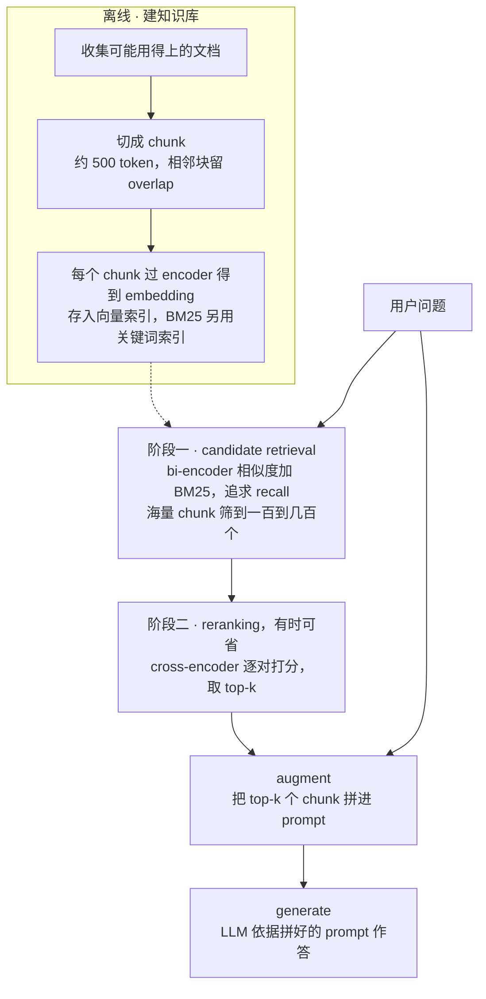
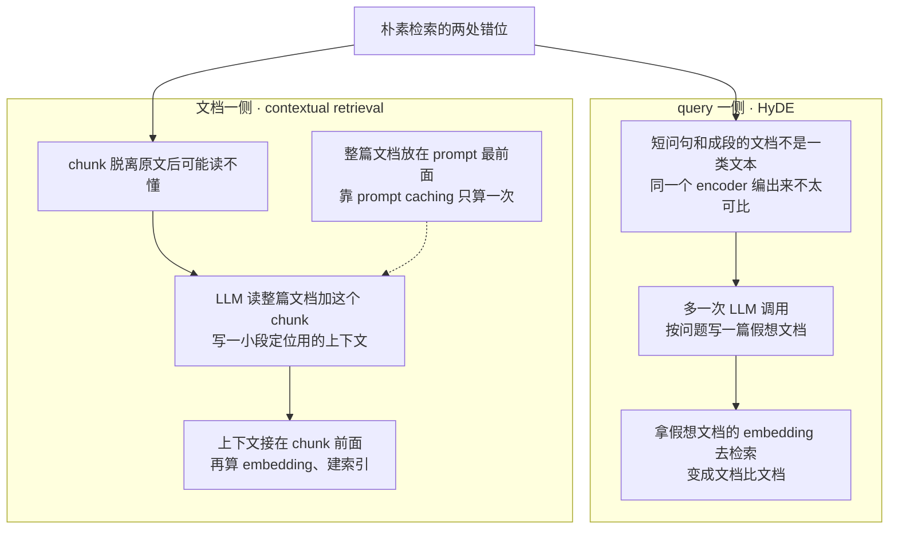
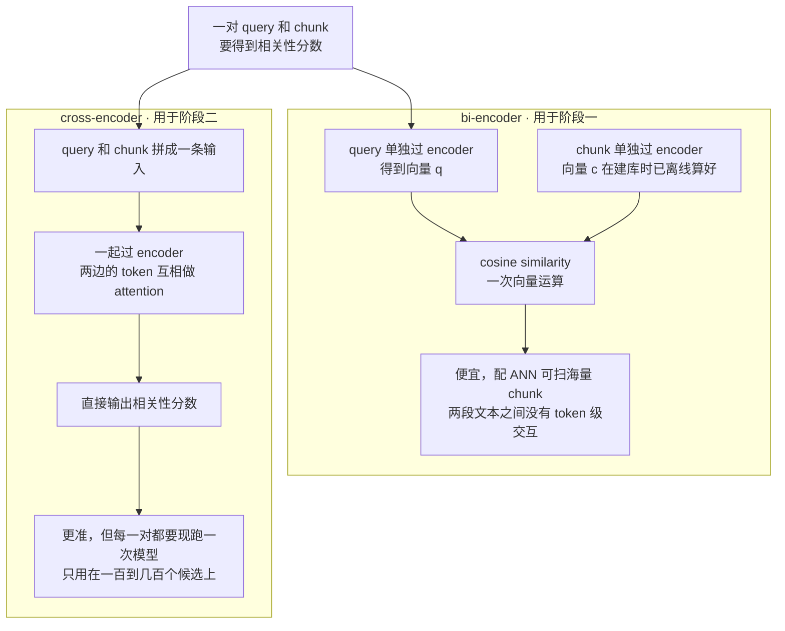
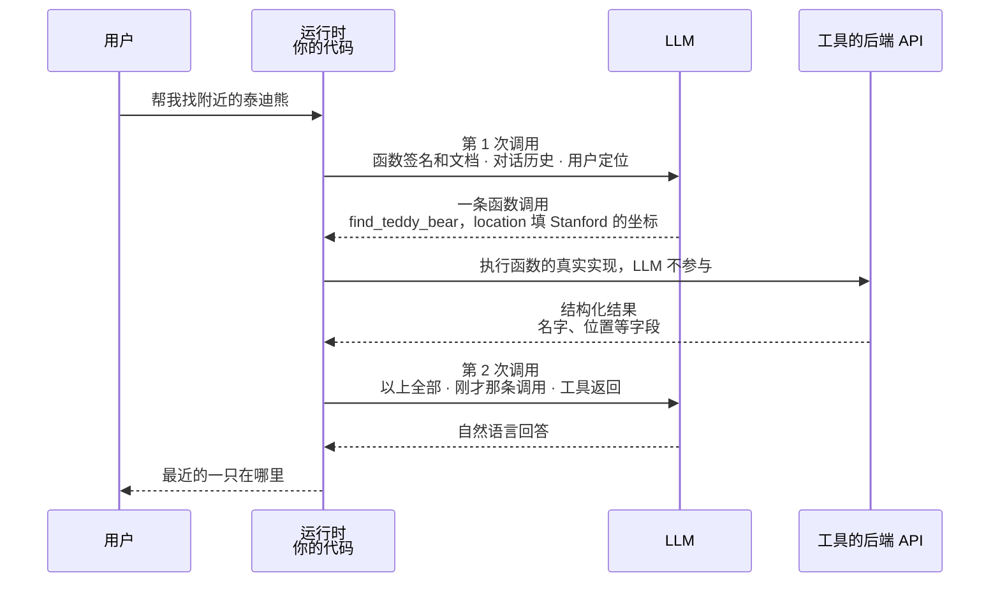
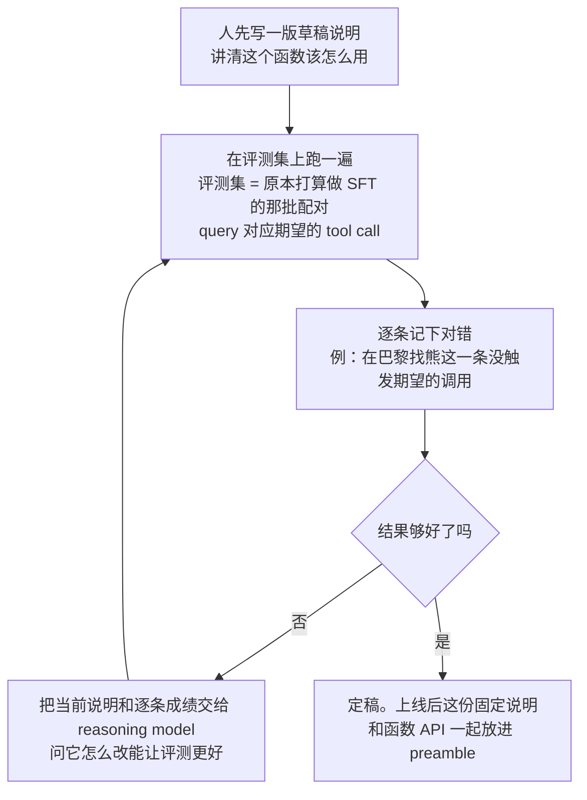
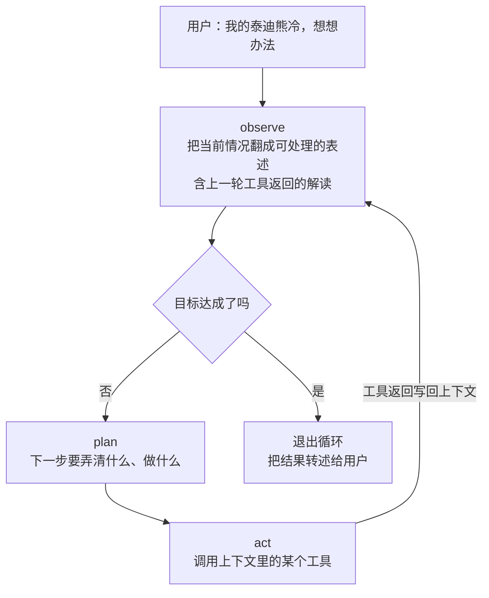

# CME295 第 7 讲｜Agentic LLM（Agentic LLMs）

> Stanford CME295: Transformers & Large Language Models（2025 秋）· 第 7 讲（2025 年 11 月 14 日）
> 视频：<https://www.youtube.com/watch?v=h-7S6HNq0Vg>（1:49:22，英文字幕是自动生成的，专名错得比较多）
> 讲者：Afshine Amidi（回顾与 RAG，到 59 分钟为止）· Shervine Amidi（tool calling、MCP、agent、安全）
> 课程大纲：<https://cme295.stanford.edu/syllabus/>

> 小注：大纲页面现在默认显示 2026 秋的排课（页面上可切换 2025 / 2026），编号和这个视频对不上——2026 版里 AI Agents 是第 6 讲。本笔记按视频的编号。

**一句话**：训练好的 LLM 还有两块短板：知识停在截止日期，也不会替人做事。这一讲分三层给它接上外部世界。RAG 把检索到的相关片段拼进 prompt，功夫全在检索上：切块建库，bi-encoder 加 BM25 粗召回，cross-encoder 重排，用 NDCG / MRR / precision@k / recall@k 量好坏。Tool calling 让模型只管预测函数参数，由运行时去执行，再把结构化结果交回模型转述；工具太多就先用 tool selector 筛，接口各家不同就用 MCP 统一。Agent 是在工具调用外面再套一个 observe–plan–act 循环（ReAct），多个 agent 之间靠 A2A 通信。模型能动手之后，数据外泄这类安全问题，加上每一步都可能出错并且累积，成了 agent 大规模落地的主要限制。

## 时间轴

| 时间 | 内容 |
|---|---|
| [0:06](https://www.youtube.com/watch?v=h-7S6HNq0Vg&t=6s) | 开场：本讲三件事 RAG / tool calling / agent；回顾第 6 讲（推理模型、GRPO、length bias、DAPO 与 Dr. GRPO） |
| [5:18](https://www.youtube.com/watch?v=h-7S6HNq0Vg&t=318s) | vanilla LLM 剩下的两块短板：知识不更新、不能行动 |
| [6:38](https://www.youtube.com/watch?v=h-7S6HNq0Vg&t=398s) | RAG 的动机：knowledge cutoff；为什么不接着训练、为什么不全塞进上下文（长度、needle in a haystack、按 token 计费） |
| [14:33](https://www.youtube.com/watch?v=h-7S6HNq0Vg&t=873s) | RAG 的定义与三步：retrieve → augment → generate；问答：检索坏了怎么办 |
| [19:22](https://www.youtube.com/watch?v=h-7S6HNq0Vg&t=1162s) | 建知识库：chunk 与 embedding；三个超参（embedding 维度、chunk size、overlap） |
| [23:36](https://www.youtube.com/watch?v=h-7S6HNq0Vg&t=1416s) | 两阶段检索：candidate retrieval 保 recall，ranking 求精；问答：按 token 硬切合理吗 |
| [27:39](https://www.youtube.com/watch?v=h-7S6HNq0Vg&t=1659s) | 语义相似检索：cosine similarity、ANN、bi-encoder、Sentence-BERT |
| [34:25](https://www.youtube.com/watch?v=h-7S6HNq0Vg&t=2065s) | BM25 关键词打分与 hybrid 检索（Cuddly 和 Huggy 的例子） |
| [37:54](https://www.youtube.com/watch?v=h-7S6HNq0Vg&t=2274s) | HyDE：先让 LLM 写一篇假想文档再去检索；contextual retrieval：给每个 chunk 补一段上下文 |
| [41:00](https://www.youtube.com/watch?v=h-7S6HNq0Vg&t=2460s) | prompt caching：相同前缀只算一次；缓存命中的输入按十分之一计价 |
| [45:24](https://www.youtube.com/watch?v=h-7S6HNq0Vg&t=2724s) | reranking：cross-encoder 把 query 和 chunk 一起送进 encoder |
| [47:49](https://www.youtube.com/watch?v=h-7S6HNq0Vg&t=2869s) | 检索评测：NDCG、MRR、precision@k、recall@k；MTEB；问答（reranker 从哪来、contrastive loss） |
| [59:28](https://www.youtube.com/watch?v=h-7S6HNq0Vg&t=3568s) | 换 Shervine 讲。Tool calling：结构化数据看成函数；定义；"找附近的泰迪熊"例子 |
| [1:05:22](https://www.youtube.com/watch?v=h-7S6HNq0Vg&t=3922s) | 函数定义长什么样：模型只看签名和文档，看不到实现 |
| [1:07:54](https://www.youtube.com/watch?v=h-7S6HNq0Vg&t=4074s) | 三步机制：预测参数 → 执行函数 → 把结果转述成回答 |
| [1:11:00](https://www.youtube.com/watch?v=h-7S6HNq0Vg&t=4260s) | 怎么训练：两类 SFT 样本，样本要多样 |
| [1:15:05](https://www.youtube.com/watch?v=h-7S6HNq0Vg&t=4505s) | 不训练的路线：few-shot 的局限；拿评测集和 reasoning model 迭代出一份工具使用说明 |
| [1:20:30](https://www.youtube.com/watch?v=h-7S6HNq0Vg&t=4830s) | 工具的三类用途；多工具并存的麻烦；小结与三个缺陷 |
| [1:26:22](https://www.youtube.com/watch?v=h-7S6HNq0Vg&t=5182s) | tool selection：先凭名字和极短说明筛工具，再放完整 API；问答：这不就是 RAG 吗 |
| [1:29:17](https://www.youtube.com/watch?v=h-7S6HNq0Vg&t=5357s) | MCP：server、tools、prompts、resources、client；荐诗集的例子 |
| [1:31:56](https://www.youtube.com/watch?v=h-7S6HNq0Vg&t=5516s) | agent 的定义；ReAct 的 observe–plan–act 循环（"泰迪熊冷了"的例子） |
| [1:39:06](https://www.youtube.com/watch?v=h-7S6HNq0Vg&t=5946s) | 多个 agent 与 A2A 协议；问答：每个 agent 都是一个 LLM 吗、token 预算 |
| [1:42:16](https://www.youtube.com/watch?v=h-7S6HNq0Vg&t=6136s) | 安全：数据外泄的例子、ToolSword、训练期与推理期两道防线、Agent-SafetyBench、Anthropic 刚披露的攻击 |
| [1:46:04](https://www.youtube.com/watch?v=h-7S6HNq0Vg&t=6364s) | 收尾：错误逐步累积；起步建议；AI 辅助编程与判断力 |

## 核心内容

### 1. 引子：回顾上一讲，和 vanilla LLM 剩下的两块短板

- **回顾第 6 讲**：reasoning model 先写一段推理链（通常不给用户看）再作答，换来数学、代码任务上的提升。训练用的 GRPO 不训练 value function：对同一个 prompt 采一组回答，每个回答的 advantage 是它的 reward 相对组内其他回答的好坏；奖励只看有没有写出推理链、答案对不对。训练中 AIME 成绩上升，输出却越来越长，成绩趋平后还在涨，根源是 loss 里同一个 token 在短回答和长回答中贡献不同（length bias）。DAPO 把归一化改成与 token 所在序列无关，Dr. GRPO 干脆去掉这一项。
- **本讲补什么**：上一讲补的是推理能力。剩下的短板，一是知识不会更新，对应 RAG（Afshine 讲）；二是不能行动，对应 tool calling 和 agent（Shervine 讲）。

### 2. RAG 为什么存在：两条省事的路都走不通

- **问题**：模型只知道训练数据里有的东西。各家 model card 都写着 knowledge cutoff（知识截止日期），课上举的 GPT-5 是 2024 年 9 月 30 日。问它这之后的事，裸模型答不了，或者答错。
- **路一：接着训练，把新知识训进去**。改动模型的知识而不让别的能力倒退很难，大家通常避免这么干。再者，如果你已经基于这个模型为好几个用例各做了微调，每注入一次知识就得全部重做一遍，维护不起。
- **路二：把截止日期之后的资料全塞进 prompt**。三个麻烦：
    - 上下文有限。常见量级是几十万 token（GPT-5 是 400,000）。按 1 token 约 4 个字符粗算，相当于几百页、一本很厚的书，装不下一个不断增长的资料库。
    - 就算装得下，无关内容越多，模型越容易被带偏。needle in a haystack 测试量的就是这个：在一段很长的 prompt（haystack）里埋一条事实（needle），再问模型这条事实是什么。课上放的是 GPT-4 的热力图，横轴是 prompt 长度，纵轴是事实埋在文中的深度；超过一定长度后模型开始找不回来，事实落在前半段时尤其明显。
    - 调用按 token 计费。GPT-5 的输入价在每百万 token 1 美元的量级，每条请求都塞满就积少成多。
    > 小注：这张热力图应为 Greg Kamradt 2023 年 11 月对 GPT-4-128K 做的测试（[代码仓库](https://github.com/gkamradt/LLMTest_NeedleInAHaystack)）；课上只说"有人做了这个测试"。
- **RAG 的答案**：只把和问题**相关**的资料找出来放进 prompt。名字就是三步：retrieve（从知识库取回相关文档）→ augment（把取回的内容拼到问题后面）→ generate（把拼好的 prompt 交给 LLM）。效果上等于把答案递到模型眼前，让它照着读。
- **问答**：检索这一步做坏了怎么办？讲者的回应是，正因如此，谈 RAG 基本就是在谈怎么把检索做好，后面的内容全部围绕这一步。
  > 小注：这里讲的是开头检索一次的标准 RAG。把检索做成一个工具，放进第 11 节的循环里，由模型决定何时查、查什么，就是 CS329A 第 7 讲拿来和 Search-o1 对比的 agentic RAG。

### 3. 建知识库，和两阶段检索

*图 7-1｜RAG 全流程：离线建库，在线两阶段检索，再拼接与生成（自绘示意）· [▶ 看原幻灯片 24:06](https://www.youtube.com/watch?v=h-7S6HNq0Vg&t=1446s)*

- **建库**：先把可能用得上的文档收集起来，切成 chunk（文本块，每块有 token 数上限，量级是几百），再给每个 chunk 算一个 embedding（把一段文本压成一个定长向量，意思相近的文本，向量也相近）。讲者的提醒：听到 retrieval 就该想到 embedding。
- **三个超参**：
    - embedding 维度：文档越细腻复杂，越想要大一点；但维度大了占空间，检索时计算也更多。常见在一千多，比如 1,500 左右。
    - chunk size：太小，文字脱离上下文读不懂；太大，一个向量概括不了里面的内容。常见取 500 token 上下。
    - overlap：相邻 chunk 之间重叠一段，因为读懂当前块往往需要上一块末尾的内容。课上给的量级是低几百 token。
- **embedding 模型从哪来**（问答）：可以直接用预训练好的（多数人这么做），也可以自己训。它的目标就是让相关的文本在向量空间里挨得近，好把相关文档取回来。
- **两阶段检索**，做法借自搜索和推荐系统：
    - 阶段一 candidate retrieval（候选召回）：从海量 chunk 里粗筛出一小批可能相关的候选，一百到几百个。这一步追求 recall，宁可多拿也不能漏，所以只能用便宜的运算。
    - 阶段二 ranking，也叫 reranking（重排，有时可以省）：候选已经很少，付得起更贵的模型，把真正相关的排到最前面，最后取 top-k 拼进 prompt。
- **问答**：按 token 数硬切，会不会把内容切得支离破碎？会，第 5 节的 contextual retrieval 就是为此而来。讲者另外提醒：JSON、Markdown 这类自带结构的文件，切块时要顾及它的结构，课上没展开。

### 4. 阶段一：语义检索（bi-encoder）加关键词检索（BM25）

- **语义相似检索**：把 query 也编码成 embedding，和库里所有 chunk 的 embedding 比相似度，留下分数最高的一批。相似度通常用 cosine similarity。

$$
\cos(q,c)=\frac{q\cdot c}{\lVert q\rVert\,\lVert c\rVert}
$$

q 是 query 的向量，c 是 chunk 的向量，分子是两者的点积，分母是两个向量长度的乘积；结果越接近 1 越相似。

- **换一种距离行不行**（问答）：各种实现里也会见到 L2 距离等变体，讲者让大家自己想想它们之间的关系。向量都归一化到长度 1 时，展开平方可得 ‖q − c‖² = 2 − 2·cos(q, c)，按 L2 从小到大排和按 cosine 从大到小排是同一个顺序，所以这些变体本质上差不多。
- **ANN**：知识库可能极大，逐个比一遍（线性扫描）太慢。实际用 approximate nearest neighbor（近似最近邻）方法：建库时先把向量分区组织好，查询时只看其中一小部分。课上只点了名字。
  > 小注：常见实现有 FAISS（IVF 分桶、PQ 压缩）、HNSW 图索引、ScaNN。
- **bi-encoder**：这种结构的名字。query 过一次 encoder，chunk 过一次 encoder，两边互不相干，最后只比两个向量。encoder 通常是 BERT 一类的 encoder-only 模型（讲者说是第 2、3 讲的内容）。讲者强烈推荐读 Sentence-BERT：它扩展了 BERT，让模型为整段文本输出一个适合做相似度检索的向量，训练目标是让相关的一对 cosine 高、不相关的一对 cosine 低。
  > 小注：SBERT 论文比较的是 classification、regression、triplet 三种训练目标。学生问到的 contrastive loss（带 in-batch negatives 的对比损失）是今天训练 embedding 模型更常见的做法。
- **语义相似不保证关键词命中**：embedding 检索找的是意思相近，取回的文档可以和 query 没有一个词相同。有时你恰恰要求结果里必须出现 query 里的词。课上的例子：两只泰迪熊，一只叫 Cuddly，一只叫 Huggy，问 Cuddly 在哪。这两个名字语义上很近，纯 embedding 检索可能取回讲 Huggy 的文档；BM25 取回的文档按定义一定和 query 有词重叠。
- **BM25**：一个启发式的相关性分数，由 query 和文档之间词的重叠情况算出来，不需要训练。

$$
\mathrm{BM25}(q,d)=\sum_{t\in q}\mathrm{IDF}(t)\cdot\frac{f(t,d)\,(k_1+1)}{f(t,d)+k_1\left(1-b+b\,\frac{|d|}{\mathrm{avgdl}}\right)}
$$

> 小注：课上没有给公式，上式是 BM25 的标准形式。f(t,d) 是词 t 在文档 d 里出现的次数，|d| 是文档长度，avgdl 是平均文档长度；k1（常取 1.2–2.0）让同一个词重复出现的收益递减，b（常取 0.75）惩罚长文档，IDF 让罕见词权重更高。

- **hybrid**：所以现在的做法是看用例，决定要不要在相关性分数里掺一份启发式分数。不少人用 embedding 检索和 BM25 的某种组合。
  > 小注：课上没说怎么合并。常见的是两路分数加权，或用 reciprocal rank fusion（RRF）按名次融合。

### 5. 两个补丁：HyDE 与 contextual retrieval（附 prompt caching）

*图 7-2｜检索的两个补丁：一个改 query，一个改 chunk（自绘示意）· [▶ 看原幻灯片 38:31](https://www.youtube.com/watch?v=h-7S6HNq0Vg&t=2311s) · 出处：[Gao et al., 2022](https://arxiv.org/abs/2212.10496) · [Anthropic, 2024](https://www.anthropic.com/news/contextual-retrieval)*

- **HyDE，修 query 一侧的错位**：用户的 query 通常很短，是个问句；知识库里的文档是成段的陈述。用同一个 encoder 去编码这两种性质不同的文本，得到的向量并不那么可比。HyDE 的办法是多一次 LLM 调用：先让模型根据 query 写一篇假想的文档，再拿这篇假文档的 embedding 去检索，于是变成文档和文档比。讲者的评价很克制：不一定有效，也不是人人都用，值得试一下。
  > 小注：HyDE 原文允许假想文档包含事实错误，作者的论点是 encoder 的稠密瓶颈会滤掉细节，只留下"相关文档大概长什么样"。
- **另一条路**：干脆给 query 和文档各训一个 encoder。理论上可行，但要维护两个模型，实际很少这么做。
- **contextual retrieval，修文档一侧的错位**：chunk 脱离原文后可能读不懂。办法是在每个 chunk 前面补一小段文字，概括读懂这一块需要知道的背景。这段文字由 LLM 写，输入是整篇文档加上这个 chunk，提示它给一段简短的说明。之后用"上下文加 chunk"去算 embedding、建索引。
  > 小注：这是 Anthropic 2024 年 9 月公开的做法，补的上下文约 50–100 token，embedding 和 BM25 索引两边都用。他们报告的检索失败率（1 − recall@20）：5.7% → 3.7%（只用带上下文的 embedding）→ 2.9%（再加带上下文的 BM25）→ 1.9%（再加 reranking）。
- **代价与 prompt caching**：每个 chunk 一次 LLM 调用，每次还都带着整篇文档，听上去很贵，这里可以用 prompt caching。原理来自 decoder-only 模型的因果性：每个位置只看它左边的内容，所以两条 prompt 只要前缀相同，前缀部分算出的激活值就完全相同，算一次存起来，之后直接查。闭源模型的提供商把它做成了计费选项：定价页上单列一栏缓存命中的输入 token，课上展示的 OpenAI 模型是正常输入价的十分之一。
    - 用在这里：把整篇文档放在 prompt 最前面，变化的 chunk 和指令放在最后，同一篇文档的所有 chunk 共用一份缓存。
    - 通用的建议：把多条 prompt 之间会重复的内容尽量挪到开头。
    > 小注：被存下来的就是前缀各层的 key 和 value（KV cache）。命中要求从第一个 token 起逐 token 完全一致，所以可变内容必须放在后面；各家另有最短长度和缓存存活时间的限制。

### 6. 阶段二：用 cross-encoder 重排

*图 7-3｜bi-encoder 与 cross-encoder：同样是给一对文本打分，算法和成本都不同（自绘示意）· [▶ 看原幻灯片 45:44](https://www.youtube.com/watch?v=h-7S6HNq0Vg&t=2744s) · 出处：[Reimers & Gurevych, 2019](https://arxiv.org/abs/1908.10084)*

- **做法**：不再分别编码，而是把 query 和 chunk 拼在一起送进同一个 encoder，直接输出一个相关性分数。模型同时看到两段文本，query 的 token 和 chunk 的 token 之间有 attention（学生追问，讲者确认），能捕捉到阶段一里两个独立向量表达不了的交互。这种结构叫 cross-encoder，和阶段一的 bi-encoder 相对。
- **为什么只放在第二阶段**：分数依赖具体的 query，没法像 chunk 向量那样离线算好，每一对都要现跑一次模型。对几十万、上百万个 chunk 不现实，对一百到几百个候选付得起。
- **模型从哪来**（问答）：有现成的预训练 reranker，也可以自己训一个。讲者推荐看 [SBERT 的文档站](https://www.sbert.net/)，bi-encoder 和 cross-encoder 两种用法都有。
- 之所以叫 reranking，是因为阶段一按相似度其实已经排过一次序。

### 7. 检索质量怎么量：NDCG、MRR、precision@k、recall@k

- **设定**：和二分类一样需要真值标签（ground truth），也就是对每个 query 事先标好哪些 chunk 真的相关。系统跑完两个阶段，把 chunk 按预测分数从高到低排，取前 k 个；RAG 里正是这 k 个会被拼进 prompt。指标回答两个问题：相关的有没有进前 k；进来之后是不是排在靠前的位置。
- **NDCG@k**：顾及位置的指标。

$$
\mathrm{DCG@}k=\sum_{i=1}^{k}\frac{\mathrm{rel}_i}{\log_2(i+1)}\qquad \mathrm{NDCG@}k=\frac{\mathrm{DCG@}k}{\mathrm{IDCG@}k}
$$

rel_i 是系统排在第 i 位的那个 chunk 的真值标签（相关为 1，不相关为 0）；分母 log2(i+1) 是随名次增大的折扣；IDCG 是把所有真正相关的 chunk 排在最前面时能得到的 DCG。

- **把名字拆开看**：cumulative 是把前 k 位的相关性累加起来；discounted 是位置越靠后折扣越大，相关文档排在第 1 位比排在第 k 位得分高；normalized 是因为 DCG 的取值范围取决于这个 query 有多少相关文档，除以理想排序的 IDCG 之后，排得完美恰好得 1，不同 query 之间才可比。
  > 小注：折扣函数课上只说是"名次的某个函数"，这里写的是最常见的 log2(i+1)。
- **MRR**：更简单的指标。只看第一个相关文档排在第几位，取倒数，再对一批 query 取平均。

$$
\mathrm{MRR}=\frac{1}{|Q|}\sum_{q\in Q}\frac{1}{\mathrm{rank}_q}
$$

Q 是评测用的 query 集合，rank_q 是 query q 的结果里第一个相关 chunk 的名次（排在第 2 位就贡献 1/2）。它完全不管第一个相关文档之后还有没有别的相关文档，但通常和其他指标走势一致，所以常用。

- **precision@k 与 recall@k**：分类指标的排序版。

$$
\mathrm{Precision@}k=\frac{|\mathrm{Rel}\cap\mathrm{Top}_k|}{k}\qquad \mathrm{Recall@}k=\frac{|\mathrm{Rel}\cap\mathrm{Top}_k|}{|\mathrm{Rel}|}
$$

Rel 是真正相关的 chunk 的集合，Top_k 是系统排出的前 k 个。precision@k 问的是选进来的有多少是对的，recall@k 问的是该选的有多少被选进来了。

> 小注：自拟算例，不是课上的数字。库里共有 3 个相关 chunk，系统的 top-5 按名次的真值是 1, 0, 1, 0, 0。DCG@5 = 1 + 0.5 = 1.5，IDCG@5 = 1 + 0.631 + 0.5 = 2.131，NDCG@5 ≈ 0.70；RR = 1；precision@5 = 0.4；recall@5 ≈ 0.67。把前两位对调成 0, 1, 1, 0, 0：NDCG@5 降到约 0.53，RR 降到 0.5，precision 和 recall 不变——后两者只看进没进前 k，不看排第几。对应到两阶段（推断）：阶段一主要看 recall@100 这类指标，因为漏掉的后面补不回来；最终的 top-k 看 NDCG 和 MRR。

- **MTEB**：Massive Text Embedding Benchmark，常用的公开基准。想知道自己的 retriever 行不行，就拿到上面跑出这些指标，和别的方案比。这四个指标在检索论文里反复出现，讲者建议把思路和公式都记熟。

### 8. Tool calling：一次调用的三步，每一步上下文里有什么

*图 7-4｜一次工具调用里谁在什么时候看到什么（自绘示意）· [▶ 看原幻灯片 1:08:26](https://www.youtube.com/watch?v=h-7S6HNq0Vg&t=4106s)*

- **和 RAG 的分工**：RAG 处理的是非结构化的文字资料。如果要接入的数据是结构化的，像一张表，给定某几列的值就得到一个输出，就可以把它看成一个函数：输入是参数，输出是返回值。让模型使用这种函数叫 function calling，也叫 tool calling。课上用 Python 写例子只是因为好读，换别的语言也行。
- **定义**：讲者取了 IBM 一篇文章的说法，要点两个。一是为了完成某个任务；二是可以动态地访问外部资源，并对其施加动作（是"可以"，不是"必须"）。第二点正好补上开头说的知识缺口。
- **工具是事先写好的**（问答）：函数由开发者事先定义和实现，不是模型临场生成的。
- **函数长什么样**：例子是 find_teddy_bear，按位置去调某个后端 API，返回附近的泰迪熊。它有三个部件。签名：函数名、参数、返回类型。文档字符串 docstring：说明这个函数干什么、参数是什么意思，模型全靠它理解工具，所以至关重要。实现：里面是真正的后端调用，返回一个带结构的对象（课上用一个 class 规定了名字、位置等字段）。**模型只看得到签名和文档，看不到实现**。
- **三步**（图 7-4）：

| 步骤 | 谁来做 | 上下文里有什么 | 产出 |
|---|---|---|---|
| 1 · 预测参数 | LLM | preamble 里的函数 API（签名加文档，不含实现）；对话历史和用户这句话；已知的环境信息，如定位权限给出的坐标 | 一条函数调用：函数名加填好的参数，比如把 Stanford 的坐标填进 location |
| 2 · 执行 | 你的运行时代码，和 LLM 无关 | 不涉及上下文：解析出函数名和参数，真正去跑 | 结构化的返回值（名字、位置等字段） |
| 3 · 转述 | LLM | 第 1 步的全部内容，加上模型刚发出的那条调用，加上工具返回 | 给用户的自然语言回答 |

- 第 1 步里模型的任务不是推断函数怎么实现，只是决定往里填什么参数。第 3 步还要再过一次模型，是因为用户要的是一句人话而不是 JSON，而且你往往希望回答遵循特定的格式。
  > 小注：对应到今天的 chat API：工具定义（名字、描述、JSON Schema 形式的参数）经 tools 字段进入上下文；第 1 步的产出是一条结构化的 tool call 消息；第 2 步的返回作为 tool 角色的消息追加进对话，再发起第 2 次模型调用。

### 9. 怎么让模型学会用一个工具：做 SFT，或者只写一份说明

*图 7-5｜不训练的路线：用评测集和 reasoning model 在线下迭代出一份工具使用说明（自绘示意）· [▶ 看原幻灯片 1:18:10](https://www.youtube.com/watch?v=h-7S6HNq0Vg&t=4690s)*

- **路线一：SFT**。三步里有两步是模型在做，所以要两类训练样本。输入都是到此刻为止的全部对话历史，输出是模型在这一刻该说的话。
    - 第一类（tool prediction）：输入是函数 API 加用户 query，输出是带参数的函数调用。
    - 第二类：输入是原始 query、已经发出的调用、工具返回这一整串历史，输出是最终回答。需要它，是因为你通常希望回答按特定方式组织；模型也得知道最初问的是什么、这份结果对应哪一次调用。
    - 样本要多样，贴近真实用户的分布：位置没明说、要从用户定位里取的；位置直接写在话里的；多轮对话聊到一半才提出要找熊的。学生问工具不止一个怎么办：SFT 数据里放多工具的样本就行，选工具的问题见第 10 节。
- **路线二：不训练，只靠提示**。如今的模型在预训练和指令微调阶段见过大量代码，读 Python 函数、写函数调用本来就熟练，专门为此做 SFT 未必必要。
    - few-shot（在上下文里放几组输入输出的示例）可行，也是公认的做法。但示例只覆盖具体的几个点，未必能泛化到用户千变万化的说法。
    - 讲者更推荐在 preamble 里放一份详细的文字说明，讲清这个工具该怎么用。这种说明很难写好，所以不要自己从头写到尾：起个草稿，其余交给 reasoning model 按图 7-5 迭代——拿原本打算做 SFT 的那批配对当评测集，逐条看对错，让它据此改写。讲者说实际效果好得出人意料。
    - 迭代都发生在线下（问答里澄清过）。上线后，这份固定的说明和函数 API 一起放进 preamble，对任何 query 都一样。
  > 小注：课上只讲了 SFT 和纯提示两条路。用 RL 学工具使用，见 CS329A 第 4 讲的 RLEF（执行结果当奖励）和第 5 讲的 SWiRL（judge 逐步打分）。图 7-5 的循环，是自动提示优化（automatic prompt optimization）的一个最小版本。

### 10. 工具多了之后：tool selection 与 MCP

- **工具的三类用途**：取信息（搜索、天气、股价；"今天有什么新闻"靠的是搜索工具，不是模型自己的知识）；做计算（把问题转成代码，执行后读出结果，比让模型在推理链里硬算可靠）；替用户办事（例如发邮件：模型填好抬头和正文，连发送也替你按）。
- **讲者在这里停下来小结的三个缺陷**：
    - 真实产品不会只有一个工具：找熊、抱熊、看熊的心情、给熊送礼。不知道用户要哪个，只好全放进 preamble。工具一多又回到 needle in a haystack：某个工具的 API 淹没在上下文里，还可能有功能相近、互相打架的 API。什么都想支持，结果什么都做不好。
    - 上下文终究有限。几亿用户、五花八门的需求，不可能把所有工具同时放进去。
    - 工具是手写的，每家 LLM 定义和使用工具的方式可能都不一样，同一个工具要为每个模型重写一遍。
- **tool selection（对付前两条）**：讲者引了一篇 Google DeepMind 的技术论文（没给题目），里面管它叫 tool selector，文献里也叫 router。分两步。第一步给 LLM 看用户 query 和一份工具清单，清单可以很长，但每个工具只有名字和一两个词的说明，让它挑出可能用得上的。第二步只把被选中工具的完整 API 和 query 一起放进上下文，走第 8 节的流程。
- **问答**：这不就是 RAG 吗？可以用 RAG 来做（把工具描述当文档来检索），但不是非得这样，让一个 LLM 按指令来挑也行。
- **MCP（对付第三条）**：Model Context Protocol，Anthropic 提出的协议，统一工具暴露给模型的方式。工具的提供方按协议实现一次，支持 MCP 的 LLM 应用都能用，不必再为每个模型各写一份。课上只过了一遍词汇：

| MCP 里的角色 | 含义 | 课上"给爱读诗的泰迪熊荐书"的例子 |
|---|---|---|
| host | 跑着 LLM 的应用 | Claude |
| MCP client | host 里的一个基础设施组件，和一个 server 一对一连接 | 课上没展开 |
| MCP server | 对外提供工具的服务实例 | 由图书供应商来实现，他们最懂怎么提供这类内容 |
| tools | 供模型调用的函数实现 | 找书、荐书 |
| prompts | 一类模板，示范这些工具怎么用 | 按书名查找、按用户口味推荐 |
| resources | 完成任务时可以依托的外部数据 | 泰迪熊自己的藏书、畅销榜 |

> 小注：MCP 于 2024 年 11 月发布，消息格式是 JSON-RPC 2.0。client 用 tools/list 拿到每个工具的 name、description 和 inputSchema（JSON Schema），用 tools/call 执行——进入模型上下文的仍然只是签名加文档，和第 8 节一致。规范里三种原语的控制方不同：tools 由模型决定调用，resources 由应用决定取用，prompts 由用户选用。

### 11. Agent：在工具调用外面套一个循环（ReAct）

*图 7-6｜课上的 observe–plan–act 循环，退出与否由模型自己在 observe 时判断（自绘示意）· [▶ 看原幻灯片 1:35:26](https://www.youtube.com/watch?v=h-7S6HNq0Vg&t=5726s) · 出处：[Yao et al., 2022](https://arxiv.org/abs/2210.03629)*

- **定义**：agent 是一个自主地追求目标、代表用户完成任务的系统。和单次工具调用相比多了两样东西：推理，以及多轮迭代。通俗地说，人们讲 agent 时指的就是这层循环。它和上一讲的推理链并不互斥，循环内部完全可以有 reasoning chain；骨架是工具调用加迭代。
- **ReAct（reason + act）**：讲者称之为里程碑式的论文。很多请求没法一步完成，得把目标拆成可以执行的小步，逐步做完再给答案。ReAct 把这个过程组织成若干轮循环，每轮由几个原子阶段组成。课上分成 observe、plan、act，论文里的叫法是 thought、action、observation；各处的名称和顺序会有出入，直觉是同一个。
- **走一遍例子**（用户说：我的泰迪熊冷，想想办法）：
    - 第 1 轮。observe：把这句话翻成可处理的表述——熊冷，可能和室温有关，而室温现在未知。plan：先弄清室温。act：上下文里恰好有读取室温的工具，调用它。
    - 第 2 轮。observe：工具返回 65°F，解读为比预期的冷。plan：需要把温度调高。act：调用设定温度的工具，参数是升高 5 度。
    - 第 3 轮。observe：温度已经设到位，目标达成。退出循环，把"已调高 5 度"转述给用户。
- **什么让一个 workflow 成为 agentic**：有一个初始请求，有一组可执行的动作，每一轮由 LLM 自己判断目标是否达成，达成就输出，否则再来一轮。工具返回的内容必须是模型读得懂的，因为下一轮的 observe 全靠它。
  > 小注：CS329A 第 4 讲细讲过 ReAct 原文：纯 prompting（few-shot 轨迹），在 HotpotQA、FEVER、WebShop 上验证；如今打开 thinking 的模型会自动"想一步、调一次工具"。CS329A 第 5 讲的 LATS，是在这条单轨迹循环上再加树搜索和反思。

### 12. 多个 agent 与 A2A

- **场景**：家里除了调温的 agent，还可以有管能源分配的、管空气质量的。用户只对其中一个说话，它们之间需要互相沟通。host 和工具之间需要 MCP，agent 和 agent 之间同样需要一套标准，于是 Google 在 2025 年早些时候发布了 Agent2Agent（A2A）协议。
- **协议让开发者填什么**：一是 agent 对外声明自己的 skills（会做哪些事），并附上示例，让别的 agent 知道能找它干什么。二是这个 agent 怎样执行一个请求：执行过程中向其他 agent 发出什么状态；收到"停下"时怎样取消正在做的事（cancel 方法）。
  > 小注：在 A2A 规范里，这份自我介绍叫 Agent Card（一个 JSON 文档），每个 skill 有 id、name、description、tags、examples；一次请求对应一个 task，状态包括 submitted、working、input-required、completed、failed、canceled 等。
- **问答**：每个 agent 都是一个带着自己上下文的 LLM 吗？可以这么理解，课上的例子就是这样。它们各自独立运行自己的推理循环，彼此只看得到对方的输入和输出。有学生担心 token 开销失控：可以设预算上限；各 agent 不会挤占彼此的上下文，花的是你的钱。

### 13. 安全，与落地的建议

- **新能力带来新风险**：模型能替你执行动作，恶意的一方就可能让它替自己执行。课上的例子是数据外泄（data exfiltration）：agent 手里有一个能向外写数据的工具（比如发邮件），又接触得到用户的敏感信息，只要有一条 prompt 让它把密码发到某个地址，数据就出去了。更多的风险类型，讲者推荐读 ToolSword。
  > 小注：这类攻击现在通称 prompt injection；恶意指令藏在工具返回、网页或邮件正文里时，叫 indirect prompt injection。ToolSword 把工具学习分成输入、执行、输出三个阶段，各给两个安全场景（恶意请求与越狱、噪声误导与风险提示、有害反馈与错误冲突）。
- **两类补救**：
    - 训练期：和 R1 等模型的训练流程一样，在 SFT 和 RL 的数据配比里放入覆盖安全（harmlessness）的数据。
    - 推理期：穿过了训练期防线的请求还可以再拦一道，例如一个安全分类器，读到目前为止的对话，判断模型即将给出的输出是否安全。
- **基准**：Agent-SafetyBench 汇总了 agent 可能出现的各类安全隐患，并给了一整套评测。
  > 小注：该基准有 349 个交互环境、2,000 个测试用例、8 类风险、10 种失败模式；论文评测的 16 个 agent，安全得分都不到 60%。
- **一条当时的新闻**：上课前一天，Anthropic 发了一份很详细的报告，披露有攻击者借助 Claude 的工具和 agent 能力发动了大规模网络攻击，逐步还原了攻击者的做法和可能的补救。讲者想传达的是：攻防双方都会越来越强，这不是一场注定要输的仗，但防御措施必须到位。
  > 小注：报告题为 [Disrupting the first reported AI-orchestrated cyber espionage campaign](https://www.anthropic.com/news/disrupting-AI-espionage)（2025 年 11 月 13 日）。按报告，Anthropic 不是被攻击的一方，而是滥用行为的发现方：一个被它评估为有国家背景的组织利用 Claude Code 攻击了约 30 个机构，少数得手，80–90% 的操作由 AI 完成；绕过防护的办法是把任务拆成看似无害的小步，并谎称在做防御性安全测试。
- **为什么还看不到大规模自主运行的 agent**：循环的每一步都可能跑偏，比如没有正确理解工具返回、参数填错，而且错误会沿着后续步骤累积。能力上的缺口可以用 SFT 补，但讲者认为推理上的缺口最好靠模型自身的能力，而不是靠 SFT 打补丁。agent 怎么评测留到下一讲（第 8 讲）。
  > 小注：CS329A 第 8 讲的 METR 结果是同一件事的量化版：要求 80% 成功率时，模型能独立完成的任务长度只有 15 分钟量级。
- **动手建议**：
    - start small：先挑最简单的用例（比如找最近的熊），确认现有的实现和 prompt 跑得通，再往外扩。
    - start smart：先用能力最强的模型，摸清现有模型能做到的上限，之后再优化延迟和成本。先求对，再求快。
    - 调试：模型会输出推理链，出问题时先去读它。
- **讲者最喜欢的用法**是 AI 辅助编程：把繁琐的管线类工作交出去，腾出脑子。前提是自己懂代码的基本功。生成代码变得廉价之后，判断一段代码对不对、是不是在做该做的事，才是难的部分，你的判断力（taste）从此最值钱。

## 关键图表速查（点时间戳跳到原幻灯片）

| 图 | 看什么 | 跳转 | 出处 |
|---|---|---|---|
| needle in a haystack 热力图 | 横轴 prompt 长度，纵轴事实埋入的深度；看长 prompt 一侧、前半段深度处成片的失败 | [13:03](https://www.youtube.com/watch?v=h-7S6HNq0Vg&t=783s) | 应为 [Kamradt 的测试](https://github.com/gkamradt/LLMTest_NeedleInAHaystack) |
| 两阶段检索 | 海量 chunk → 一百到几百个候选 → top-k；哪一段追求 recall，哪一段用贵的模型 | [24:06](https://www.youtube.com/watch?v=h-7S6HNq0Vg&t=1446s) | — |
| bi-encoder 示意 | query 和 chunk 各过各的 encoder，最后只比两个向量 | [30:46](https://www.youtube.com/watch?v=h-7S6HNq0Vg&t=1846s) | [Sentence-BERT](https://arxiv.org/abs/1908.10084) |
| HyDE | 多出来的那次 LLM 调用在哪：query → 假想文档 → embedding | [38:31](https://www.youtube.com/watch?v=h-7S6HNq0Vg&t=2311s) | [HyDE](https://arxiv.org/abs/2212.10496) |
| contextual retrieval | 整篇文档加 chunk 进 LLM，产出的一小段上下文接在 chunk 前面 | [40:35](https://www.youtube.com/watch?v=h-7S6HNq0Vg&t=2435s) | [Anthropic, 2024](https://www.anthropic.com/news/contextual-retrieval) |
| cross-encoder | 两段文本拼成一条输入，出来的直接是分数；和 bi-encoder 那张对照着看 | [45:44](https://www.youtube.com/watch?v=h-7S6HNq0Vg&t=2744s) | [SBERT 文档](https://www.sbert.net/) |
| NDCG 公式 | 分子是真值相关性，分母随名次增大；再看 IDCG 怎样把分数归一到 1 | [49:52](https://www.youtube.com/watch?v=h-7S6HNq0Vg&t=2992s) | — |
| find_teddy_bear 的函数定义 | 三块：签名、docstring、带后端调用的实现；模型看得到的只有前两块 | [1:05:52](https://www.youtube.com/watch?v=h-7S6HNq0Vg&t=3952s) | — |
| 工具调用三步 | 每一步的输入和输出；第 2 步完全没有 LLM | [1:08:26](https://www.youtube.com/watch?v=h-7S6HNq0Vg&t=4106s) | — |
| 两类 SFT 样本 | 输入总是到此为止的对话历史，输出分别是 tool call 和最终回答 | [1:12:30](https://www.youtube.com/watch?v=h-7S6HNq0Vg&t=4350s) | — |
| tool selector 两步 | 第一步的清单里每个工具只有名字和极短说明，第二步才出现完整 API | [1:26:41](https://www.youtube.com/watch?v=h-7S6HNq0Vg&t=5201s) | Google DeepMind 的一篇技术论文（课上没给题目） |
| MCP 词汇与荐书例子 | server、tools、prompts、resources、client 各对应例子里的什么 | [1:29:49](https://www.youtube.com/watch?v=h-7S6HNq0Vg&t=5389s) | [MCP](https://modelcontextprotocol.io/) |
| ReAct 走查 | observe → plan → act 转了几轮，哪一次 observe 触发退出 | [1:35:26](https://www.youtube.com/watch?v=h-7S6HNq0Vg&t=5726s) | [ReAct](https://arxiv.org/abs/2210.03629) |
| 数据外泄例子 | 三个条件凑齐：能向外写的工具、读得到的敏感数据、一条恶意指令 | [1:42:54](https://www.youtube.com/watch?v=h-7S6HNq0Vg&t=6174s) | [ToolSword](https://arxiv.org/abs/2402.10753) |

## 提到的工作

| 名称 | 在本讲里的作用 |
|---|---|
| [GRPO](https://arxiv.org/abs/2402.03300)、[DAPO](https://arxiv.org/abs/2503.14476)、[Dr. GRPO](https://arxiv.org/abs/2503.20783) | 开场回顾第 6 讲：组内相对 advantage、length bias 与两种修法 |
| [DeepSeek-R1](https://arxiv.org/abs/2501.12948) | 回顾里的训练曲线应出自它；讲安全时又提到它训练流程里的 harmlessness 数据 |
| GPT-5 的 model card 与定价页 | knowledge cutoff、400,000 token 上下文、按 token 计费、缓存输入十分之一价 |
| needle in a haystack 测试 | 说明长上下文里无关内容会拖累模型 |
| RAG（[Lewis et al., 2020](https://arxiv.org/abs/2005.11401)） | 本讲前半的主题；课上只讲了方法，没提这篇论文，列在这里备查 |
| [BERT](https://arxiv.org/abs/1810.04805) 与 [Sentence-BERT](https://arxiv.org/abs/1908.10084)（Reimers & Gurevych, 2019） | bi-encoder 用的 encoder；讲者强烈推荐读 SBERT，多种损失函数的比较也在里面 |
| approximate nearest neighbor（ANN） | 阶段一避免线性扫描的手段，只点了名 |
| BM25 | 关键词启发式打分，与 embedding 检索组成 hybrid |
| [HyDE](https://arxiv.org/abs/2212.10496)（Gao et al., 2022） | 用假想文档替 query 去检索 |
| [Contextual Retrieval](https://www.anthropic.com/news/contextual-retrieval)（Anthropic, 2024） | 给每个 chunk 补一段由 LLM 写的上下文 |
| prompt caching | 让 contextual retrieval 付得起；也是排布 prompt 的通用技巧 |
| [MTEB](https://arxiv.org/abs/2210.07316)（Muennighoff et al., 2022） | 检验 retriever 与 embedding 模型的公开基准 |
| IBM 的 [What is tool calling](https://www.ibm.com/think/topics/tool-calling) | tool calling 定义的出处 |
| Google DeepMind 的一篇技术论文 | tool selector 的出处；课上没给题目，未能确认是哪一篇 |
| [MCP](https://modelcontextprotocol.io/)（Anthropic） | 统一工具暴露给模型的方式 |
| [ReAct](https://arxiv.org/abs/2210.03629)（Yao et al., 2022） | agent 循环的代表作 |
| [A2A](https://a2a-protocol.org/)（Google, 2025） | agent 之间通信的协议 |
| [ToolSword](https://arxiv.org/abs/2402.10753)（Ye et al., 2024） | 工具使用各阶段的安全问题 |
| [Agent-SafetyBench](https://arxiv.org/abs/2412.14470)（Zhang et al., 2024） | agent 安全的评测基准 |
| Anthropic 2025 年 11 月 13 日的[披露报告](https://www.anthropic.com/news/disrupting-AI-espionage) | 工具与 agent 能力被用于真实攻击的案例 |

## 术语对照

| English | 中文 |
|---|---|
| knowledge cutoff | 知识截止日期 |
| context window / context length | 上下文窗口 / 上下文长度 |
| needle in a haystack | 大海捞针测试：在长 prompt 里埋一条事实，再问模型 |
| retrieval-augmented generation (RAG) | 检索增强生成 |
| knowledge base | 知识库 |
| chunk / chunk size / overlap | 文本块 / 块大小 / 相邻块的重叠 |
| embedding | 嵌入向量：把一段文本压成一个定长向量 |
| candidate retrieval | 候选召回，即粗筛 |
| ranking / reranking | 排序 / 重排 |
| semantic similarity | 语义相似：意思相近，不要求有相同的词 |
| cosine similarity | 余弦相似度 |
| approximate nearest neighbor (ANN) | 近似最近邻搜索 |
| bi-encoder | 双编码器：query 和文档各自独立编码，再比向量 |
| cross-encoder | 交叉编码器：query 和文档拼在一起编码，直接出分数 |
| BM25 | 基于词重叠的启发式相关性打分 |
| hybrid search | 混合检索：embedding 加关键词 |
| HyDE (hypothetical document embeddings) | 假想文档嵌入 |
| contextual retrieval | 带上下文的检索：给每个 chunk 补一段背景 |
| prompt caching | 提示缓存：相同前缀的计算结果复用 |
| ground truth | 真值标签 |
| DCG / IDCG / NDCG | 折损累计增益 / 理想排序下的 DCG / 归一化后的 DCG |
| MRR (mean reciprocal rank) | 平均倒数排名 |
| precision@k / recall@k | 前 k 个里的精确率 / 召回率 |
| tool calling / function calling | 工具调用 / 函数调用 |
| preamble | 放在对话最前面的固定内容，如 system prompt 和工具定义 |
| docstring | 函数的文档字符串 |
| few-shot | 少样本示例：在上下文里放几组输入输出 |
| tool selector / router | 工具选择器 / 路由 |
| Model Context Protocol (MCP) | 模型上下文协议 |
| host / MCP client / MCP server | 跑 LLM 的应用 / 其中的连接组件 / 提供工具的服务 |
| agent | 智能体 |
| observe / plan / act | 观察 / 规划 / 行动 |
| Agent2Agent (A2A) | agent 之间的通信协议 |
| skill（A2A 语境） | agent 对外声明的一项能力 |
| data exfiltration | 数据外泄 |
| harmlessness | 无害性 |
| safety classifier | 安全分类器 |
| headroom | 上限空间：现有模型最多能做到什么程度 |

## 字幕勘误

"rag" / "rack" / "drag" → RAG；"gRPO" → GRPO；"AIM data set" → AIME；"DAPo" → DAPO；"GRPO done right" 指的是 Dr. GRPO；"haststack" → haystack；"GP5" → GPT-5；"cosign" → cosine；"by encoder" → bi-encoder；"birds" / "sentence bird" / "espert" / "expert paper" → BERT / Sentence-BERT / SBERT paper；"BF20" → BM25；"huristic" / "heristic" → heuristic；"the height" → HyDE；"short 16 context" → 应为 short, succinct context（推断）；"one10enth" → one tenth；"Ashin" / "Afin" / "Shervin" → Afshine / Shervine；"deep minds" → DeepMind；"with only training"（1:16 处）→ 应为 with only prompting（推断，上下文在说省掉 SFT）；"fshot" → few-shot；"premputed" → pre-computed；"maybeformational" → maybe informational；"cloud" → Claude（MCP 例子和攻击披露两处都是）；"react" → ReAct；"teddy bear is called" → is cold；"65 fah" → 65°F；"is not set at the correct temperature" → 应为 is now set（推断，随后就退出了循环）；"agentto agent" → Agent2Agent；"a tool sword" → ToolSword；"nearest pair" → nearest bear；1:00:41 处一长串重复的 "rest" 是识别故障，可忽略。

## 带走的问题

1. 两阶段检索里，阶段一只管 recall，阶段二才管排序。最终答案错了，你怎么分辨是没召回、排错了，还是模型没用好拼进去的 chunk？三种情况各看哪个指标？
2. NDCG、MRR 都需要"哪些 chunk 真的相关"的真值标签。自己的业务语料没有标注时怎么办：人工标、让 LLM 标，还是用下游回答的质量反推？LLM 标注会带来什么偏差（第 8 讲会讲 LLM-as-a-judge）？
3. tool selector 本身就是一次检索，也会漏选。漏掉一个必需的工具，和多放几个无关的工具，哪种错更贵？另外它和 prompt caching 有冲突：每个 query 选出的工具集不同，前缀就变了，怎么排布上下文才能两头兼顾？
4. 数据外泄的例子里，恶意指令从哪来并不重要，只要进了上下文，模型就可能照办。训练期的 harmlessness 数据和推理期的安全分类器各自拦得住哪一类、拦不住哪一类？对不可逆的动作（发邮件、付款），还需要哪些模型之外的机制？可对照 CS329A 第 5 讲 LATS 对不可逆动作的讨论。
5. 循环的每一步都可能出错，并且会累积。假设单步成功率是 95%，一个 20 步的任务整体成功率大约是多少？这对"先用最强的模型摸清上限"这条建议意味着什么？
