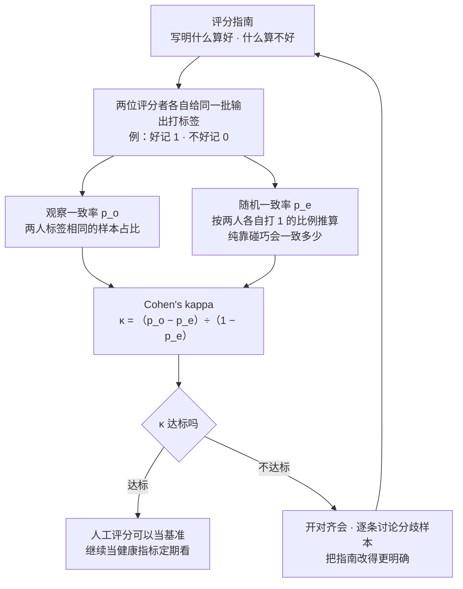
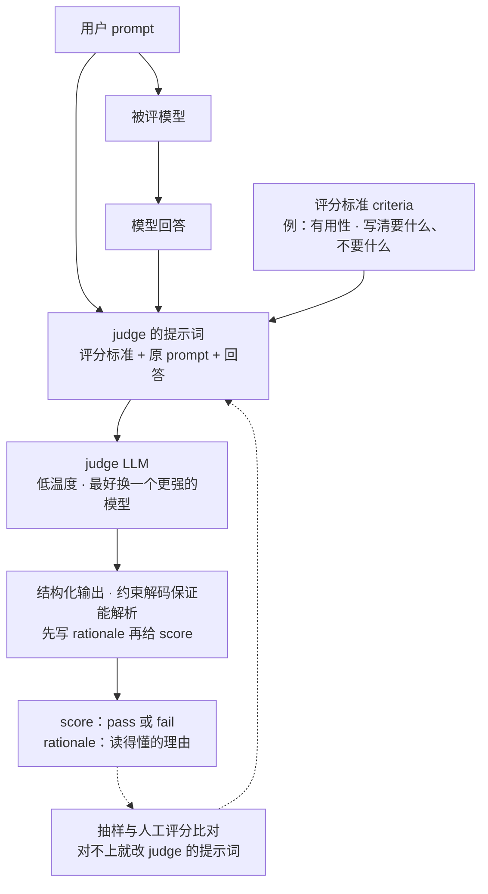
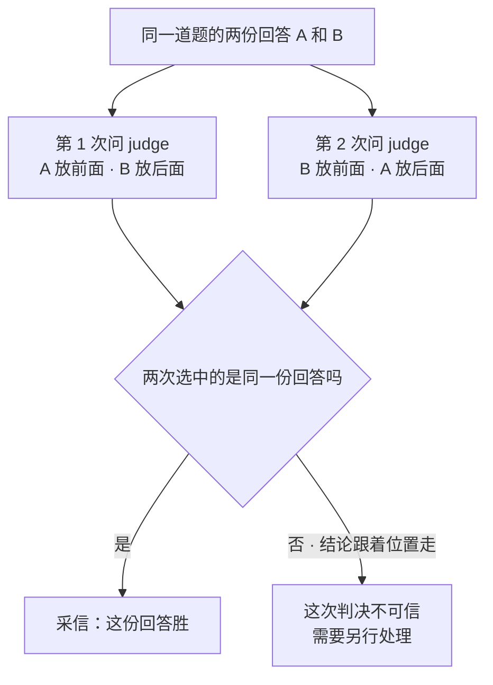
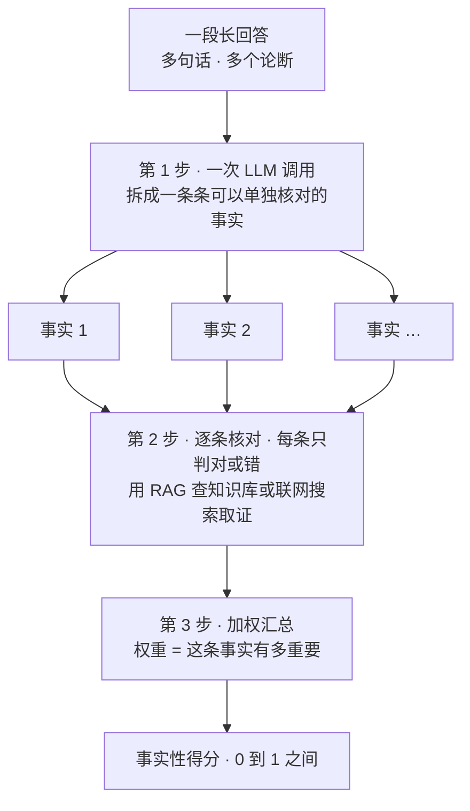
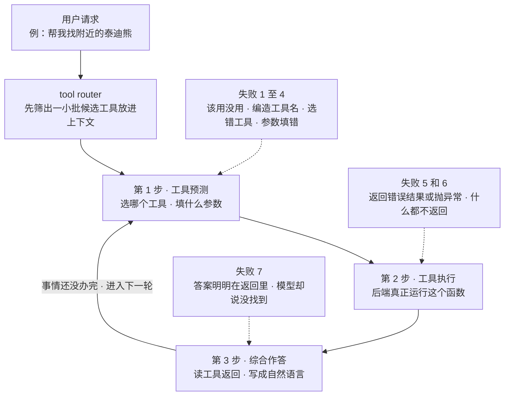
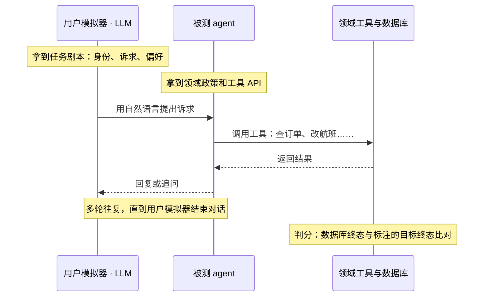

# CME295 第 8 讲｜LLM 评测（LLM Evaluation）

> Stanford CME295: Transformers & Large Language Models（2025 秋）· 第 8 讲（2025 年 11 月 21 日）
> 视频：<https://www.youtube.com/watch?v=8fNP4N46RRo>（1:49:25，英文字幕为自动生成，专名错得很多）
> 讲者：Afshine Amidi（前 60 分钟：人工评分、规则指标、LLM-as-a-judge、事实性）· Shervine Amidi（后 50 分钟：agent 评测、benchmark、数据污染）
> 课程大纲：<https://cme295.stanford.edu/syllabus/>

> 小注：大纲页现在显示的是 2026 秋的新课表——评测挪到了第 7 讲，第 8 讲换成了 Diffusion LLMs。本笔记沿用 2025 秋录像的编号。

**一句话**：自由文本没有万能指标，这一讲按"人参与得越来越少"走了三级台阶：请人逐条打分（贵、慢、主观，要用 Cohen's kappa 这类扣掉"碰巧一致"的指标盯住评分者之间的一致性）→ 人只写一次参考答案，用 METEOR / BLEU / ROUGE 做 n-gram 比对（换个说法就失灵，和人的判断相关性一般）→ 让另一个 LLM 当裁判（不要参考答案、分数自带理由，但有位置、冗长、自我偏好三种偏差，必须拿人工评分来校准）。后半讲把 agent 的一次工具调用拆成"预测—执行—综合"三步，列出七种常见失败，再按知识、推理、代码、安全、agent 五类各讲一个代表 benchmark（MMLU、AIME 与 PIQA、SWE-bench、HarmBench、τ-bench 及其 pass^k），最后提醒数据污染和 Goodhart 定律。

## 时间轴

| 时间 | 内容 |
|---|---|
| [0:06](https://www.youtube.com/watch?v=8fNP4N46RRo&t=6s) | 开场：量不出来就没法改进；回顾第 7 讲（RAG、tool calling、agentic workflow） |
| [4:45](https://www.youtube.com/watch?v=8fNP4N46RRo&t=285s) | "评测"的多种含义；本讲只谈输出质量；自由文本没有通用指标 |
| [6:21](https://www.youtube.com/watch?v=8fNP4N46RRo&t=381s) | 理想方案：每条输出都请人打分 |
| [7:08](https://www.youtube.com/watch?v=8fNP4N46RRo&t=428s) | 人工评分的主观性（生日礼物例子）；inter-rater agreement |
| [10:01](https://www.youtube.com/watch?v=8fNP4N46RRo&t=601s) | 板书：两个人闭着眼睛打分，也有 50% 的时候一致 |
| [14:43](https://www.youtube.com/watch?v=8fNP4N46RRo&t=883s) | Cohen's kappa；Fleiss' kappa、Krippendorff's alpha；对齐会 |
| [17:50](https://www.youtube.com/watch?v=8fNP4N46RRo&t=1070s) | 人工评分的第二个局限：慢、贵 |
| [18:24](https://www.youtube.com/watch?v=8fNP4N46RRo&t=1104s) | 规则指标的设定：人只写一次参考答案 |
| [21:00](https://www.youtube.com/watch?v=8fNP4N46RRo&t=1260s) | METEOR：F-score × (1 − penalty) |
| [25:07](https://www.youtube.com/watch?v=8fNP4N46RRo&t=1507s) | BLEU 与 brevity penalty；ROUGE |
| [26:42](https://www.youtube.com/watch?v=8fNP4N46RRo&t=1602s) | 规则指标的三个局限 |
| [28:00](https://www.youtube.com/watch?v=8fNP4N46RRo&t=1680s) | LLM-as-a-judge：输入、输出、prompt 模板 |
| [31:25](https://www.youtube.com/watch?v=8fNP4N46RRo&t=1885s) | 技巧：先写 rationale 再给 score |
| [33:44](https://www.youtube.com/watch?v=8fNP4N46RRo&t=2024s) | structured output：用约束解码保证输出能解析 |
| [36:48](https://www.youtube.com/watch?v=8fNP4N46RRo&t=2208s) | 两种形态：pointwise 与 pairwise；顺带合成偏好数据 |
| [38:47](https://www.youtube.com/watch?v=8fNP4N46RRo&t=2327s) | 三种偏差：position、verbosity（40:21 起）、self-enhancement（42:27 起） |
| [45:03](https://www.youtube.com/watch?v=8fNP4N46RRo&t=2703s) | 问答：还有别的偏差吗；judge 要不要更大 |
| [47:22](https://www.youtube.com/watch?v=8fNP4N46RRo&t=2842s) | 最佳实践：标准写明确、二元量表、人工校准、低温度 |
| [52:48](https://www.youtube.com/watch?v=8fNP4N46RRo&t=3168s) | 评测维度：任务表现 vs 形式与对齐 |
| [54:06](https://www.youtube.com/watch?v=8fNP4N46RRo&t=3246s) | 事实性：拆成事实、逐条核对、加权汇总 |
| [1:00:15](https://www.youtube.com/watch?v=8fNP4N46RRo&t=3615s) | 换 Shervine：agent 评测；一次工具调用的三步 |
| [1:02:42](https://www.youtube.com/watch?v=8fNP4N46RRo&t=3762s) | 工具预测阶段的四种失败 |
| [1:14:12](https://www.youtube.com/watch?v=8fNP4N46RRo&t=4452s) | 工具执行阶段的两种失败 |
| [1:18:19](https://www.youtube.com/watch?v=8fNP4N46RRo&t=4699s) | 综合作答阶段的失败 |
| [1:21:52](https://www.youtube.com/watch?v=8fNP4N46RRo&t=4912s) | 七种失败的共性；要系统地给错误分类 |
| [1:23:50](https://www.youtube.com/watch?v=8fNP4N46RRo&t=5030s) | benchmark 分类总览 |
| [1:25:12](https://www.youtube.com/watch?v=8fNP4N46RRo&t=5112s) | 知识：MMLU |
| [1:29:34](https://www.youtube.com/watch?v=8fNP4N46RRo&t=5374s) | 推理：AIME 与 PIQA |
| [1:32:35](https://www.youtube.com/watch?v=8fNP4N46RRo&t=5555s) | 代码：为什么人人都该看这一项；SWE-bench（1:33:57 起） |
| [1:36:15](https://www.youtube.com/watch?v=8fNP4N46RRo&t=5775s) | 安全：为什么发布对比表里少见；HarmBench |
| [1:40:51](https://www.youtube.com/watch?v=8fNP4N46RRo&t=6051s) | agent：τ-bench；pass^k（1:43:22 起） |
| [1:45:12](https://www.youtube.com/watch?v=8fNP4N46RRo&t=6312s) | 对回现实：Gemini 发布的对比表；模型画像与 Pareto frontier |
| [1:47:48](https://www.youtube.com/watch?v=8fNP4N46RRo&t=6468s) | 数据污染；Goodhart 定律；结语 |

## 核心内容

### 1. 先说清楚"评测"指什么

- 讲者开场就说这可能是整门课最重要的一讲：量不出模型的好坏，就不知道该往哪里改。第 6、7 讲都在补 LLM 的短板（推理、取外部知识、执行动作），这一讲回答"补完之后到底好了多少"。
- "评测一个 LLM"可以指很多事：输出质量（连贯性、事实性……），也可以是系统指标（延迟、价格、可用率）。本讲只谈**输出质量**——给定一条回答，怎么量化它有多好。
- 难点：LLM 是 text-to-text 模型，输出可以是自然语言、代码、数学推理，形式完全自由，不存在一个通用指标。前半讲按"人参与得越来越少"的顺序走了三条路线：

| 路线 | 人要做什么 | 好处 | 课上点出的问题 |
|---|---|---|---|
| 人逐条打分 | 模型每改一版，都重新评每条输出 | 最接近想要的"真值" | 贵、慢；任务主观时评分者之间不一致 |
| 参考答案 + 规则指标 | 给固定的一批 prompt 写一次参考答案 | 模型怎么迭代都能自动重算 | 容不下换说法；与人工评分相关性一般；起步仍要人写参考 |
| LLM-as-a-judge | 写评分标准；抽样做人工校准 | 不要参考答案；分数带解释 | 位置、冗长、自我偏好等偏差；它只是人工评分的近似 |

### 2. 人工评分，以及怎么量评分者之间一不一致

*图 8-1｜把评分者间一致性当健康指标来用的回路（自绘示意）· [▶ 看原幻灯片 14:43](https://www.youtube.com/watch?v=8fNP4N46RRo&t=883s) · 出处：[Cohen, 1960](https://doi.org/10.1177/001316446002000104)*

- **理想方案和它的第一个问题**：最理想是每条输出都请人打分，再汇总。但评分任务本身可能是主观的。课上的例子：用户问该送什么生日礼物，模型答"泰迪熊几乎总是贴心的礼物，挑一个你觉得合适的就行"。按"有用性"评：一位评分者觉得有用（方向明确），另一位觉得没用（到底选哪种毛绒玩具并没有说）。于是需要 inter-rater agreement（评分者间一致性）这类指标，确认大家用的是同一把尺子。
- **为什么不能只看 agreement rate**：最直观的指标是"两人给出相同标签的比例"。问题是单看这个数，判断不了它算高还是算低。板书推导：假设 Alice 和 Bob 根本不看内容，各自以概率 p_A、p_B 随机打"好"（记 1），否则打"不好"（记 0），互相独立；两人一致 = 同时打 1 或同时打 0。代入 p_A = p_B = 0.5，碰巧一致的概率已经是 50%。这个"碰巧一致率"还随两人的打分比例变化：标签越偏向一边，它越高。
- **Cohen's kappa**：把观察到的一致率放到"碰巧一致率"这条基线上重新标定。

$$
p_e = p_A\,p_B + (1-p_A)(1-p_B), \qquad \kappa = \frac{p_o - p_e}{1 - p_e}
$$

p_A、p_B 是两位评分者各自打"好"的比例，p_e 是两人按这个比例独立随机打分时碰巧一致的概率，p_o 是实际观察到的一致率；κ 的分子是"比碰巧多出来的一致"，分母是"最多还能多出来多少"。

- **读法与变体**：完全一致时 κ = 1；和瞎打一样时 κ = 0；比瞎打还差时 κ 为负。Cohen's kappa 针对两位评分者；Fleiss' kappa、Krippendorff's alpha 是它的推广，思路相同——都以"随机打分会怎样"为基线。
    > 小注：自己代个数：两人都有 90% 的概率打"好"时，p_e = 0.9 × 0.9 + 0.1 × 0.1 = 0.82；此时观察到 85% 的一致率，κ 只有 (0.85 − 0.82) ÷ (1 − 0.82) ≈ 0.17。agent benchmark 的通过率常常很偏，只报一致率会很好看，所以要报 κ。Fleiss' kappa 面向多位评分者的类别标签；Krippendorff's alpha 还容许缺失标注和有序、连续量表。常见的经验读法（Landis & Koch, 1977）：0.41–0.60 中等，0.61–0.80 较强，0.81 以上近乎完全一致。
- **实践中的用法**：把一致性当成健康指标长期跟踪；数值不理想，就让评分者开对齐会，对一对各自是怎么评的，把评分指南写得更明确（图 8-1 的回路）。
- **第二个问题**：慢、贵——请人评 1,000 条输出要很久。结论是"每条都请人评"不现实；但人工评分没有被丢掉，后面它是校准 LLM judge 的基准。
    > 小注：CS329A 第 8 讲里，METR 的人类基线样本少，讲者给的通行做法同样是看 inter-rater agreement、分歧大就补样本；GDPval 的专家盲评彼此一致率 71%。主观任务上，人与人的一致率就是任何自动评审的天花板。

### 3. 规则指标：METEOR、BLEU、ROUGE

- **设定**：不再让人评每条输出，而是请人为固定的一批 prompt 各写一次参考答案（reference），之后模型每迭代一版，都拿输出和参考自动比对。同一个意思可以有多种说法，所以这类指标都想留一点弹性。
- **METEOR**（机器翻译用；全称 Metric for Evaluation of Translation with Explicit ORdering）：一个 F-score 乘上一个词序惩罚。

$$
\mathrm{METEOR} = F_{\mathrm{mean}}\,(1-\mathrm{Pen}), \qquad F_{\mathrm{mean}} = \frac{P\,R}{\alpha P + (1-\alpha)R}, \qquad \mathrm{Pen} = \gamma\left(\frac{c}{u_m}\right)^{\beta}
$$

P 是预测里的 unigram（单个词）有多少比例能在参考里匹配上，R 是参考里的 unigram 有多少比例被预测匹配上，F_mean 是两者的加权调和平均（常见的 F1 是等权特例，这里权重 α 可调）；c 是匹配上的词连成的连续片段（chunk）数，u_m 是匹配上的 unigram 总数，γ、β 是人为选定的超参数。

- METEOR 惩罚项的直觉：词序和参考完全一致时，匹配的词连成一整段，c 最小、惩罚最小；词都对、顺序却被打散，c 变大、惩罚变大——名字里的 explicit ordering 指的就是这个。
- "匹配"不限于字面相同：同义词、同词根的词也算。
- 讲者对 METEOR 的两点批评：α、β、γ 一串超参数，更像一份配方；匹配条件再放宽，仍然容不下风格上的改写。
    > 小注：原论文（Banerjee & Lavie, 2005）的取值相当于 α = 0.9（recall 的权重是 precision 的 9 倍）、γ = 0.5、β = 3；匹配分三轮：先字面，再 Porter 词干，再 WordNet 同义词。课上用的是后来带可调参数的写法。
- **BLEU**（机器翻译用；Bilingual Evaluation Understudy）：偏 precision——预测里的 n-gram 有多少出现在参考里。只看 precision 的话，译得很短就能刷分，所以再乘一个 brevity penalty 惩罚过短的输出。课上只讲到这里，没有展开公式；下面是原论文的定义。

$$
\mathrm{BLEU} = \mathrm{BP}\cdot\exp\!\left(\sum_{n=1}^{N} w_n \log p_n\right), \qquad \mathrm{BP} = \min\!\left(1,\; e^{\,1-r/c}\right)
$$

p_n 是 n 阶 n-gram 的 precision，w_n 是各阶的权重，BP 是 brevity penalty，c 是生成文本的长度、r 是参考的长度：比参考短就按指数打折，不短则不罚。

> 小注：这个式子课上没有出现，取自 Papineni et al., 2002。通常 N = 4、各阶等权；p_n 用"截断计数"——同一个 n-gram 最多按它在参考里出现的次数计，防止靠重复一个词刷分。

- **ROUGE**（摘要用）：同样的思路，有多个变体。
    > 小注：ROUGE 全称 Recall-Oriented Understudy for Gisting Evaluation，和 BLEU 相反，偏 recall：ROUGE-N 看参考里的 n-gram 有多少被生成文本覆盖，ROUGE-L 用最长公共子序列。
- **三个共同局限**
    1. 容不下风格变化。课上把"毛绒泰迪熊能在睡前安抚孩子"这个意思换了三种说法，意思相同、用词几乎不重叠，这些指标会给后两种很低的分。
    2. 与人工评分的相关性并不高——那些超参数本来就是为了凑相关性调出来的。
    3. 起步仍然要人写参考答案，有的项目负担不起。

### 4. LLM-as-a-judge：让另一个 LLM 来打分

*图 8-2｜LLM-as-a-judge 的数据流，虚线是用人工评分做校准的回路（自绘示意）· [▶ 看原幻灯片 28:50](https://www.youtube.com/watch?v=8fNP4N46RRo&t=1730s) · 出处：[Zheng et al., 2023](https://arxiv.org/abs/2306.05685)*

- **动机**：前七讲的 LLM 在海量数据上预训练，又按人类偏好调过（第 5 讲），既有知识，也"知道"人喜欢什么样的回答——那就让它来评。这个叫法出自两年前的一篇论文（应为 Zheng et al., 2023）。
- **输入三样**：生成回答时用的 prompt、模型的回答、评分标准（criteria，沿哪个维度评）。**输出两样**：分数（例如 pass / fail）和 rationale（理由）。和规则指标的关键区别在后者：公式乘出来的数字说不清"为什么是这个分"，judge 能解释。
- **技巧：先 rationale、后 score**。经验上能提高评分质量。讲者把它和第 6 讲的推理模型类比：先输出 chain of thought 再作答，等于让模型在给分之前把判断过程说出来。
    > 小注：机制上，自回归生成时先写出的理由会成为给分时的上下文；反过来先给分，理由就成了事后找补。用结构化输出时字段顺序也要 rationale 在前——OpenAI 的文档说明输出按 schema 里键的顺序生成。
- **保证能解析：structured output**。课上提问：照这样写 prompt，能保证每次都解析出 rationale 和 score 吗？不能，采样是概率性的。办法是第 3 讲讲过的 constrained / guided decoding：解码时只允许从"合法 token"里采样，强制输出符合指定格式（如 JSON）。OpenAI、Gemini、Anthropic 的 API 都把它叫 structured output：把想要的格式写成一个类（这里两个字段 rationale、score），通过参数传进去（讲者记得 OpenAI 的参数名是 text_format，别家大同小异）。
- **两个好处**：不需要参考答案和人工评分就能起步；分数可解释。
- **两种形态**：pointwise——给一个回答，问好不好；pairwise——给两个回答，问哪个更好。pairwise 还有一个副产品：第 5 讲训练 reward model 需要成对的偏好标签，可以让 judge 来合成。

### 5. judge 的三种偏差，以及怎么缓解

*图 8-3｜用位置互换检出并抵消 position bias（自绘示意）· [▶ 看原幻灯片 38:47](https://www.youtube.com/watch?v=8fNP4N46RRo&t=2327s) · 出处：[Zheng et al., 2023](https://arxiv.org/abs/2306.05685)*

| 偏差 | 表现 | 课上给的缓解办法 |
|---|---|---|
| position bias（位置偏差） | pairwise 比较时，倾向选先出现的那份回答，与内容无关 | 同一对回答按两种顺序各问一次，结论一致才采信（图 8-3）；也有论文去改位置编码，但不是开箱即用的做法 |
| verbosity bias（冗长偏差） | 更长、更啰嗦的回答更容易被判为更好，哪怕并不更正确 | 在评分指南里明说不要因为长就加分；放几个 in-context 例子做示范；改成 pointwise 打分，再按输出长度加惩罚 |
| self-enhancement bias（自我偏好） | judge 偏爱由它自己（同一个模型）生成的回答 | 生成和评审不要用同一个模型；最好选更大、推理更强的模型当 judge |

- **自我偏好的直觉**：模型会生成某段文字，说明在它自己的概率分布里这段文字本来就"很可能"，回头再看到时自然也倾向于认为它好。讲者也承认，如今各家模型的训练数据高度重合，"换一个模型"做不到完全隔离，只是把风险压低。
- **两次结论不一致怎么办**：课上只说"可能要另做处理"。
    > 小注：Zheng et al. 的保守做法是两种顺序下都胜才算胜，不一致就记平局；大规模评测时也可以随机分配位置，让偏差在期望上抵消。该论文报告 GPT-4 当 judge 与人的一致率超过 80%，和人与人之间的一致率同一水平。
- **问答**
    - judge 的偏好和人（ground truth）不一致、系统性地偏向某个标签，算不算偏差？算。讲者强调这三种远不是全部。
    - 换了不同的模型当 judge，它还会偏爱"像 LLM 写的"回答吗？会，取决于 judge 有多强。通行做法是选容量大得多、推理能力强的模型，不容易被"听起来像自己会说的话"带走。judge 比被评模型大不是硬性要求，只是常见选择。

### 6. judge 的最佳实践：把它当成需要校准的仪器

- **评分标准写得干脆**：明确要什么、不要什么。标准含糊，judge 和人都会各评各的。
- **用二元量表**（pass / fail），不用细粒度分数：judge 更好判；人工评分者也更好判，拿人的评分去对齐 judge 时噪声更小；多出来的档位未必带来有用的信号。
- **先 rationale、后 score**；对已知偏差逐项设防（第 5 节）。
- **用人工评分校准**：虽说不靠人工评分就能起步，但最终想逼近的量就是人的判断。预算允许时，收一批人工评分，和 judge 的分数做相关性分析，对不上主要靠改 judge 的 prompt。
    > 小注：二元标签下，judge 与人的一致程度同样应该用第 2 节的 κ 来报，并和人与人之间的 κ 放在一起看。CS329A 第 8 讲的两个实例：GDPval 的自动评审与专家一致率 66%（专家之间 71%）；DeepScholar-Bench 的自动指标与人工标注一致率 70–80%。
- **低温度**（常见取 0.1 或 0.2）：今天评一次、两天后再评一次，分数不该差很多——评测要可复现。
- **不要对代理指标过度优化**：judge 分数只是人工评分的近似。模型越改、judge 分越高，不等于人也觉得越好；所以在迭代模型的过程中要持续确认两者没有走散。这和本讲结尾的 Goodhart 定律是同一件事。

### 7. 评哪些维度；事实性要拆开评

*图 8-4｜事实性评测的三步流水线（自绘示意）· [▶ 看原幻灯片 55:57](https://www.youtube.com/watch?v=8fNP4N46RRo&t=3357s) · 出处（推断）：[Min et al., 2023](https://arxiv.org/abs/2305.14251)*

- **维度分两大类**：任务表现（有用性、事实性、相关性……）；形式与对齐（语气、风格、有没有不安全的内容）。每个维度各写一份评分标准。
- **事实性为什么特殊**：前面建议用二元量表，但一段长文本可能只错一小处，整段判"不事实"太粗，需要量出"错了多少"。课上的例子是一段讲泰迪熊来历的话，里面藏了两处错：年代应为 1900 年代而不是 1920 年代；罗斯福总统是拒绝开枪，而不是得意地想开枪。
- **三步流水线**（图 8-4）
    1. 一次 LLM 调用把文本拆成事实列表（例子里是 4 条）。
    2. 逐条核对，每条只判对 / 错——单条事实基本上非对即错，不必再搞复杂。核对通常要用上一讲的 RAG 去查知识库，或者联网搜索，所以这一步本身也是若干次 LLM 调用。
    3. 加权汇总。权重 α_i 表示每条事实的重要性（"以谁的名字命名"比"总统当时的态度"重要）；图省事可以全取相等。

$$
\mathrm{Factuality} = \frac{\sum_{i=1}^{m} \alpha_i \cdot \mathbf{1}[\,\mathrm{fact}_i\ \mathrm{correct}\,]}{\sum_{i=1}^{m} \alpha_i}
$$

m 是拆出来的事实条数，α_i 是第 i 条事实的重要性权重，方括号里的指示函数在第 i 条事实核对为正确时取 1、否则取 0；权重已经归一（和为 1）时分母就是 1。这是按讲者的口头描述写出来的形式。

- **例子的结果**：第 2、3 条正确，汇总得 0.6（字幕只剩一个"6"，按 0–1 的量纲推断为 0.6；4 条里对 2 条却不是 0.5，推断幻灯片上用了不相等的权重）。讲者强调怎么量化这种"部分正确"仍是开放问题，这只是目前常见的做法。
    > 小注：这套"拆成原子事实—逐条查证—汇总"的做法应出自 FActScore（Min et al., 2023，等权，即被可靠知识源支持的原子事实占比）和 [SAFE](https://arxiv.org/abs/2403.18802)（Wei et al., 2024，用 LLM 加 Google Search 逐条查证，与众包标注者 72% 一致、成本低 20 多倍），课上没有点名。它量的是 precision（说出来的有多少是对的），不惩罚"该说的没说"；CS329A 第 8 讲 DeepScholar-Bench 的 nugget coverage 补的正是 recall 这一侧，citation precision / claim coverage 则是同一思路用在"引用是否撑得住论断"上。

### 8. Agent 评测：把一次工具调用拆成三步，逐步找失败

*图 8-5｜一次工具调用的三步，以及七种失败各落在哪一步（自绘示意）· [▶ 看原幻灯片 1:01:38](https://www.youtube.com/watch?v=8fNP4N46RRo&t=3698s)*

- **为什么单拿出来讲**：agent 是一个循环（第 7 讲的 ReAct：observe → plan → act），最终结果不好，可能错在任何一环。想让评测结果有意义，先得知道每一环能怎么错。Shervine 只看其中一轮：一次工具调用 = ① 工具预测（选对工具、填对参数）→ ② 工具执行 → ③ 根据返回综合作答（第 7 讲的三步图）；agent 就是把这三步串很多轮。
- **七种常见失败**（讲者说是他自己最常遇到的，不是全部）
    1. **该用工具却没用**（步骤 ①）。模型直接回"抱歉，我不知道去哪找"——assistant 的行话叫 punt（放弃作答）。
        - 可能是 tool router 没把这个工具选进上下文。工具一多，不可能每次都把全部 API 塞进 preamble，通常先用 router 筛一遍（第 7 讲）；router 应当偏 recall——省上下文可以，但不能漏掉要用的。对策：调 router。
        - 也可能工具就在上下文里，模型却没想到用。对策：回到"教模型用工具"那一步，在 SFT 数据里补这种模式，或者改提示词。
    2. **tool hallucination**：调用了一个不存在的函数（定义的是 find_teddy_bear，模型却去调 find_bear）。
        - 先查是不是普遍现象：横跨所有工具的总指令（horizontal instructions）有没有讲清"只能用给定的函数"。总指令很关键，格式和逻辑都要严谨，可以让 LLM 帮着迭代。
        - API 写得不好：模型在 SFT 阶段见的都是高质量 API，你的写法不够"像样"，它就容易对不上。模型能看到的只有函数名、参数、描述这三样，它们就是你能拧的三个旋钮。
        - 模型太弱、不 ground（不以给定内容为依据，自己编）：确认属实再换更强的模型。
    3. **用错了工具**：本该调查找工具，模型却去"发消息找人要一只熊"——也说得通，但不是你要的行为；让模型知道你偏好哪种做法，是你的责任。对策：检查 router 的召回；检查两个工具的 API 描述是否范围重叠，写清各自负责什么情形。
    4. **工具对了、参数错了**：坐标填成 (0, 0)，落在大西洋里。多半是上下文里根本没有位置信息，模型只好编——让上下文带上位置，或者先跑一个定位工具，拿不到权限就给用户一个可操作的报错，而不是塞假参数。也可能是模型不懂参数该填什么：重训，或重写 API。
    5. **工具返回了错的结果，或直接抛异常**（步骤 ②）。这是纯软件工程问题：修工具。一个细节：报错未必是坏事（没给定位权限时，模型可以据此告诉用户）；但裸抛异常时，模型常把它当成自己的内部错误，只会笼统道歉、说不清发生了什么。更好的做法是返回结构化的、把状况讲明白的正常输出。
    6. **工具什么都不返回**。对执行动作的工具尤其危险：第 7 讲"把恒温器调高"的例子里，工具不吭声，模型不知道成没成，可能直接回一句"已经调好了"——虚假确认。原则：每次工具调用都要返回有意义的输出。连"没找到"也一样：空 JSON 表示"找过了，没有"，None 则什么都没说。
    7. **结果在手却不会用**（步骤 ③）：工具明明返回了一只叫 Teddy、离你一英里的熊，模型却说没找到。依次排查：模型 grounding 差（早期模型常见，如今少了）；工具返回太多，关键信息被淹没——回去精简工具输出；返回的是难以解读的原始数据——改成带字段名的结构化对象（比如含 name、distance 的 TeddyBear 对象）。
- **共性**：毛病分两大类。模型侧——推理与 grounding 的能力、上下文里内容的相关度、tool router 和工具 API 的"建模"（SFT、prompt，以及函数名、参数、docstring 写得合不合理）；工具侧——实现本身有 bug。
- **方法论**：工具一多，错误五花八门，每个 case 查起来都像一次探险。要有条理地给错误分类，再成组地解决。
    > 小注：CS329A 第 8 讲里 METR 对 GPT-4 和 o1 的失败轨迹做人工归类，讲者说"提出难 benchmark 就该配失败模式分析"，是同一条方法论。两者的粒度互补：METR 按整条轨迹归类（过早放弃、重复已失败的动作……），这里按单次工具调用的环节归类。

### 9. Benchmark 的几大类：知识、推理、代码、安全

| 类别 | 代表 | 题型 | 怎么判分 | 主要在量什么 |
|---|---|---|---|---|
| 知识 | MMLU | 近 60 个学科的四选一 | 抽出模型输出的选项字母，与答案比对 | 预训练把知识记住了多少 |
| 推理 · 数学 | AIME | 竞赛题，答案是一个整数 | 与标准答案精确匹配 | 多步推演的质量 |
| 推理 · 常识 | PIQA | 物理常识二选一，约 2 万题 | 选项比对 | 对日常物理世界的理解 |
| 代码 | SWE-bench | 真实的 GitHub issue 加代码库，要求给出 patch | 打上 patch，跑该 PR 引入的测试 | 在真实仓库里读写代码、修 bug |
| 安全 | HarmBench | 四类有害请求 | 训练出来的分类器判断模型是否"照做了" | 面对有害请求会不会配合 |
| agent | τ-bench（第 10 节） | 多轮对话加工具调用 | 对话结束后的数据库终态 | 守着政策把事办成，而且次次办成 |

- **一条主线：能硬编码判分，就不要用 judge**。MMLU、AIME、PIQA 都把答案的形式卡死（一个字母、一个整数、二选一），好处是可以用写死的规则提取和比对，不必再叠一层 LLM judge——judge 自己会错，多一层就多一层误差。HarmBench 是这几个里唯一靠分类器判分的，读它的分数时要记得判分器本身也会错。
- **MMLU**（Massive Multitask Language Understanding）：学科从日常话题到法律、医学。题目多数要先有该领域的知识，单靠逻辑推不出来（课上的医学例题：给一串临床指标，问损伤在哪）。讲者的定位：它主要量的是预训练的成效（但不只是预训练）。
    > 小注：原论文（Hendrycks et al., 2020）是 57 个学科。
- **AIME**：美国高中生通往奥赛选拔的考试，很难；题干往往只有一两句话，但要写出完整推理才能得到答案——正好考 chain of thought（或推理模型的 thinking tokens）。答案格式固定，对评测很友好。课上展示的是 2025 年的题。
    > 小注：AIME 的答案是 0–999 的整数（课上说成"三位数"）。每年两套卷、每套 15 题，一年只有 30 题，一题就是 3.3 个百分点，比较模型时要留意方差。
- **PIQA**（Physical Interaction QA）：扎根日常物理世界的常识推理。论文里的例子：东西掉在地毯上找不到，该给吸尘器口套一个实心的封盖，还是套一个发网？实心封盖不透气，什么也吸不了；发网透气，又能把小东西兜住。对人是常识，对模型未必显然。
- **为什么人人都该看代码成绩**：一是 AI 辅助编程本身就是最成功的用途（第 7 讲）；二是 agent 的工具多半写成 Python 函数，模型得会读写代码，才能正确发起工具调用、读懂返回。
- **SWE-bench 怎么造出来的**：从热门 Python 仓库里筛出"解决了某个 issue、同时引入了测试"的 pull request。可以合理假设这些测试在修复前不过、修复后通过，于是"测试状态的前后变化"就是修复质量的客观度量（test-driven development 的思路）。评测时给模型代码库和 issue，要它产出 patch，打上之后看测试过不过。名字应是 software engineering benchmark 的缩写，论文没有明说。
    > 小注：原论文（Jimenez et al., 2023）是 12 个仓库、2,294 个任务，当时最好的 Claude 2 只解决 1.96%。现在厂商报的多是 SWE-bench Verified（OpenAI 组织人工筛过的 500 题子集）。
- **HarmBench 与安全评测的特殊性**
    - 为什么模型发布时的对比表里很少有安全 benchmark：什么该拒、什么不该拒取决于各家的政策，那是某些人做出的决定，未必普世；各家也并不都宣称要把某个安全 benchmark 做到 100%，横向比较意义有限。model card 里通常有安全章节，讲做了哪些工作，但不拿同一个 benchmark 互相比。自己跑安全 benchmark 之前，先看它的内容和你的政策是否一致，分数才有意义。
    - 四类：standard（普通的有害行为）、copyright（诱导生成受版权保护的内容）、contextual（带一段文本上下文）、multimodal（上下文是文本以外的模态）。课上的例子：撬开不该开的门；左右别人的选举投票。
    - 判分：有害输出是开放式的，正则匹配解决不了，论文训练了一个分类器。一个值得学的设计是把"能力"和"安全"分开：只要模型试着去做有害的事，哪怕做得很差、没做成，也算攻击成功。
    > 小注：HarmBench（Mazeika et al., 2024）共 510 个行为（四类依次 200 / 100 / 100 / 110），指标是 attack success rate；非版权类用微调过的 Llama 2 13B 当分类器，版权类用基于哈希的比对。"harmful behavior benchmark"是讲者对名字的猜测，论文标题里没有这个展开。

### 10. τ-bench 与 pass^k：agent 要的是次次都成

*图 8-6｜τ-bench 的一次 trial：LLM 扮用户，结束后按数据库终态判分（自绘示意）· [▶ 看原幻灯片 1:42:40](https://www.youtube.com/watch?v=8fNP4N46RRo&t=6160s) · 出处：[Yao et al., 2024](https://arxiv.org/abs/2406.12045)*

- **设置**：τ 取自 Tool–Agent–User。两个领域（航空、零售），每个领域给一组工具 API、一份政策（agent 能做什么、不能做什么）和一批任务。任务是交给"用户"的一段问题陈述，用户要通过 agent 把事办成。
- **为什么要用 LLM 模拟用户**：多轮对话里，用户下一句说什么取决于 agent 上一步做了什么，没法预先写死脚本，所以让另一个大模型来扮演用户。
- **怎么判分**：对话结束后，看数据库是不是处在目标状态（比如机票确实改签了），和 / 或是否执行了任务要求的动作（比如取消），据此给 reward。
    > 小注：论文里 reward = r_action × r_output，取 0 或 1：前者要求最终数据库与标注的唯一目标数据库完全一致，后者要求 agent 的回复里包含任务规定要告知用户的信息。零售 115 个任务、航空 50 个；用户由 gpt-4-0613 扮演。
- **pass^k**（读作 pass hat k）：同一个任务独立跑 k 次，k 次**全部**成功的概率；对照此前的 pass@k——k 次里**至少一次**成功的概率。为什么要换：航空、零售正是想拿 agent 顶替人工坐席的场景，要的是可靠和一致，"十次里能成一次"没有用。

$$
\mathrm{pass@}k = \mathbb{E}_{\mathrm{task}}\!\left[1 - \frac{\binom{n-c}{k}}{\binom{n}{k}}\right], \qquad \mathrm{pass}^{k} = \mathbb{E}_{\mathrm{task}}\!\left[\frac{\binom{c}{k}}{\binom{n}{k}}\right]
$$

n 是每个任务实际跑的次数，c 是其中成功的次数，k 是要考察的尝试次数（k ≤ n），期望是对所有任务取平均；两式在 k = 1 时都等于 c/n，k 增大时 pass@k 只升不降、pass^k 只降不升。

> 小注：讲者说 pass@k 的推导是"上一讲"做的，实际在第 6 讲（板书从 [37:03](https://www.youtube.com/watch?v=k5Fh-UgTuCo&t=2223s) 起）。pass^k 用的是同一套"从 n 次里无放回抽 k 次"的组合论证：抽到的 k 次全是成功的概率为 C(c,k) ÷ C(n,k)。直觉上，单次成功率为 p 时 pass^k 约等于 p 的 k 次方——单次 90% 的 agent，连续 8 次全成只有约 43%。论文的数字：当时最强的 GPT-4o 的 pass^1 为零售 61.2%、航空 35.2%，零售的 pass^8 不到 25%。

> 小注：CS329A 第 8 讲里 METR 的 50% 与 80% time horizon 问的是同一件事的另一面：METR 固定可靠度、看能做多长的任务；pass^k 固定任务、看能不能次次做成。该课第 2 讲重复采样里的 coverage 则对应 pass@k。

### 11. 读榜、选模型，以及数据污染

- **对回现实**：上课前几天 Gemini 发布了新模型，发布材料里的对比表和上面的分类基本对得上：推理一栏有 AIME 和 PIQA 的多语言版 Global PIQA，代码一栏是 SWE-bench 的一个变体，工具使用一栏是 τ-bench 的后继 τ²-bench。不少经典 benchmark 如今以加了多语言的变体出现。
    > 小注：指 2025 年 11 月 18 日发布的 Gemini 3 Pro，表里代码一栏是 SWE-bench Verified。[Global PIQA](https://arxiv.org/abs/2510.24081)（Chang et al., 2025）覆盖 100 多种语言；[τ²-bench](https://arxiv.org/abs/2506.07982)（Barres et al., 2025）新增电信领域，用户一侧也能动手操作环境（dual control）。
- **benchmark 画的是模型的画像，不是总分**：没有全好或全坏的模型，各有长短。讲者的个人经验（他声明不是普适建议）：写代码用 Claude Sonnet 系列，要快、要便宜时用 Gemini Flash。
- **Pareto frontier**：把性能对另一个你在意的维度画出来——价格最常见，也可以是安全、上下文长度——每个价位上最好的模型连成的边界就是 Pareto 前沿，选模型就在前沿上选。
- **数据污染**：benchmark 成绩成立的前提是模型没见过题目和答案。课上提到三种防范：给数据集加哈希值（推断指 canary string 一类的标记串，便于从训练语料里识别和剔除）；评测能上网的 agent 时，用 blocklist 挡住可能含答案的网站；数学上可以直接用模型训练之后才出的新卷子（比如当年的 AIME）。
    > 小注：CS329A 第 8 讲的 DeepScholar-Bench 只收主流模型训练截止期之后的 arXiv 论文、每月换新题，是"用新题"这条路的系统化版本。本讲没有谈 benchmark 饱和，那一讲正是从"传统 benchmark 饱和"讲起的。
- **Goodhart 定律**：一个指标一旦被当成目标，就不再是好指标。benchmark 成绩要和你真正想要的东西对照着看，它不能直接告诉你某个模型对你好不好用。此前课上提过的 Chatbot Arena 可以补一点"真实使用中的表现"，但最终还是得自己拿任务去试。

## 关键图表速查（点时间戳跳到原幻灯片）

| 图 | 看什么 | 跳转 | 出处 |
|---|---|---|---|
| 板书：随机一致率 | Alice、Bob 各以 p_A、p_B 随机打分；一致 = 同为 1 或同为 0；代入 0.5 得到 50% | [10:01](https://www.youtube.com/watch?v=8fNP4N46RRo&t=601s) | 板书 |
| Cohen's kappa 公式 | 观察一致率高于、等于、低于碰巧水平时，κ 分别为正、零、负 | [14:43](https://www.youtube.com/watch?v=8fNP4N46RRo&t=883s) | [Cohen, 1960](https://doi.org/10.1177/001316446002000104) |
| METEOR 公式 | F-score × (1 − penalty)；penalty 里"连续片段数 ÷ 匹配 unigram 数"怎么体现词序 | [21:29](https://www.youtube.com/watch?v=8fNP4N46RRo&t=1289s) | [Banerjee & Lavie, 2005](https://aclanthology.org/W05-0909/) |
| BLEU 与 ROUGE | BLEU 偏 precision，所以要 brevity penalty；ROUGE 用于摘要 | [25:07](https://www.youtube.com/watch?v=8fNP4N46RRo&t=1507s) | [Papineni et al., 2002](https://aclanthology.org/P02-1040/) · [Lin, 2004](https://aclanthology.org/W04-1013/) |
| 同一句话的三种说法 | 意思相同、用词几乎不重叠——规则指标为什么失灵 | [26:42](https://www.youtube.com/watch?v=8fNP4N46RRo&t=1602s) | — |
| judge 的 prompt 模板 | 三个输入（标准、原 prompt、回答）；要求先返回 rationale 再返回 score | [30:45](https://www.youtube.com/watch?v=8fNP4N46RRo&t=1845s) | [Zheng et al., 2023](https://arxiv.org/abs/2306.05685) |
| structured output 代码 | 用一个类声明 rationale、score 两个字段，经 API 参数传入 | [34:34](https://www.youtube.com/watch?v=8fNP4N46RRo&t=2074s) | — |
| 三种偏差 | 位置、冗长（40:21）、自我偏好（42:27）各一页，每页下方是缓解办法 | [38:47](https://www.youtube.com/watch?v=8fNP4N46RRo&t=2327s) | 同上 Zheng et al. |
| 事实性流水线 | 原文 → 4 条事实 → 逐条对错 → 加权得分 | [55:57](https://www.youtube.com/watch?v=8fNP4N46RRo&t=3357s) | 应出自 [FActScore](https://arxiv.org/abs/2305.14251) |
| 工具调用三步图 | 工具预测 → 工具执行 → 综合作答；后面七种失败都挂在这张图上 | [1:01:38](https://www.youtube.com/watch?v=8fNP4N46RRo&t=3698s) | 第 7 讲的幻灯片 |
| 七种失败汇总 | 按三步归类的总表；下一页是模型侧 / 工具侧两类共性 | [1:21:22](https://www.youtube.com/watch?v=8fNP4N46RRo&t=4882s) | — |
| SWE-bench 流程图 | 代码库 + issue → 模型给 patch → 打上后看测试状态的前后变化 | [1:35:50](https://www.youtube.com/watch?v=8fNP4N46RRo&t=5750s) | [Jimenez et al., 2023](https://arxiv.org/abs/2310.06770) |
| τ-bench 改签例子 | 用户、agent、工具三方的多轮往来；最后按数据库终态给 reward | [1:42:40](https://www.youtube.com/watch?v=8fNP4N46RRo&t=6160s) | [Yao et al., 2024](https://arxiv.org/abs/2406.12045) |
| Gemini 发布对比表 | 找 AIME、Global PIQA、SWE-bench 变体、τ²-bench 各在哪一栏 | [1:45:27](https://www.youtube.com/watch?v=8fNP4N46RRo&t=6327s) | Gemini 3 Pro 发布材料（推断） |

## 提到的工作

| 名称 | 在本讲里的作用 |
|---|---|
| RAG（bi-encoder 召回 + cross-encoder 重排）、tool calling、ReAct（第 7 讲） | 开场回顾；事实核对要用 RAG；agent 评测沿用三步图、tool router、恒温器例子 |
| Cohen's kappa（[Cohen, 1960](https://doi.org/10.1177/001316446002000104)）、Fleiss' kappa、Krippendorff's alpha | 扣掉"碰巧一致"之后的评分者间一致性指标 |
| METEOR（[Banerjee & Lavie, 2005](https://aclanthology.org/W05-0909/)） | 翻译指标：加权 F-score × 词序惩罚 |
| BLEU（[Papineni et al., 2002](https://aclanthology.org/P02-1040/)） | 翻译指标：n-gram precision × brevity penalty |
| ROUGE（[Lin, 2004](https://aclanthology.org/W04-1013/)） | 摘要指标，偏 recall，多个变体 |
| LLM-as-a-judge（应为 [Zheng et al., 2023](https://arxiv.org/abs/2306.05685)） | 本讲的核心方法；三种偏差的出处 |
| constrained / guided decoding，即各家 API 的 structured output（第 3 讲） | 保证 judge 的输出一定能解析 |
| reward model 与偏好数据（第 5 讲） | pairwise judge 可以用来合成偏好标签 |
| 推理模型与 chain of thought（第 6 讲） | "先 rationale 后 score"的类比；pass@k 也在第 6 讲 |
| [FActScore](https://arxiv.org/abs/2305.14251)、[SAFE](https://arxiv.org/abs/2403.18802)（课上未点名，推断） | "拆事实—逐条核对—汇总"的事实性评测 |
| MMLU（[Hendrycks et al., 2020](https://arxiv.org/abs/2009.03300)） | 知识类 benchmark |
| AIME | 数学推理 benchmark，可以用当年新题避开污染 |
| PIQA（[Bisk et al., 2019](https://arxiv.org/abs/1911.11641)）与 [Global PIQA](https://arxiv.org/abs/2510.24081) | 物理常识推理；后者是多语言变体 |
| SWE-bench（[Jimenez et al., 2023](https://arxiv.org/abs/2310.06770)） | 代码类 benchmark：真实 issue + 测试判分 |
| HarmBench（[Mazeika et al., 2024](https://arxiv.org/abs/2402.04249)） | 安全类 benchmark：四类行为、分类器判分 |
| τ-bench（[Yao et al., 2024](https://arxiv.org/abs/2406.12045)）与 [τ²-bench](https://arxiv.org/abs/2506.07982) | agent 类 benchmark：LLM 扮用户、数据库终态判分、pass^k |
| pass@k（[Chen et al., 2021](https://arxiv.org/abs/2107.03374)） | pass^k 的对照：至少成功一次 vs 次次成功 |
| Gemini 新模型的发布对比表 | 说明这些 benchmark 类别在真实发布里怎么出现 |
| Claude Sonnet、Gemini Flash | 讲者的个人选型经验：前者写代码，后者快而便宜 |
| Chatbot Arena | 此前课上提过；用真实用户的偏好补 benchmark 的不足 |
| Goodhart's law | 指标一旦成为目标，就不再是好指标 |

## 术语对照

| English | 中文 |
|---|---|
| output quality | 输出质量（本讲的评测对象，区别于延迟、价格等系统指标） |
| rater / human rating | 评分者 / 人工评分 |
| inter-rater agreement | 评分者间一致性 |
| agreement rate | 一致率（两人标签相同的比例） |
| chance agreement | 随机（碰巧）一致率 |
| Cohen's kappa | 科恩 kappa 系数（两位评分者、扣除碰巧一致） |
| agreement session | 对齐会（评分者一起统一口径） |
| reference | 参考答案（人写的理想输出） |
| rule-based metric | 规则指标（按公式比对输出与参考） |
| unigram / n-gram | 单个词 / 连续 n 个词的片段 |
| precision / recall | 精确率 / 召回率 |
| harmonic mean | 调和平均 |
| chunk | 连续匹配片段（METEOR 里用来衡量词序） |
| brevity penalty | 过短惩罚（BLEU） |
| stylistic variation | 风格变化（同一意思的不同说法） |
| LLM-as-a-judge | 用 LLM 当裁判 |
| criteria | 评分标准 |
| rationale | 理由（judge 对分数的解释） |
| structured output | 结构化输出 |
| constrained / guided decoding | 约束解码（只允许采样合法 token） |
| pointwise / pairwise | 单点评分 / 两两比较 |
| preference data | 偏好数据 |
| position bias | 位置偏差 |
| verbosity bias | 冗长偏差 |
| self-enhancement bias | 自我偏好偏差 |
| calibration | 校准（让 judge 的评分向人工评分看齐） |
| proxy | 代理指标 |
| factuality | 事实性 |
| fact-checking | 事实核对 |
| tool prediction / tool execution | 工具预测（选工具、填参数）/ 工具执行 |
| punt | 放弃作答（助手直接说做不了） |
| tool router / tool selector | 工具路由器（先筛出候选工具再放进上下文） |
| tool hallucination | 工具幻觉（调用不存在的函数） |
| grounding | 以给定内容为依据（而不是自己编） |
| horizontal instructions | 横跨所有工具的总指令 |
| docstring | 函数的文档字符串 |
| false confirmation | 虚假确认（没做成却说做成了） |
| benchmark | 基准测试 |
| commonsense reasoning | 常识推理 |
| pull request / issue / patch | 合并请求 / 问题单 / 补丁 |
| test-driven development | 测试驱动开发 |
| model card | 模型卡（随模型发布的说明文档） |
| policy | 政策（agent 或模型被允许和禁止的行为） |
| user simulator | 用户模拟器（LLM 扮演用户） |
| pass@k / pass^k | k 次里至少成一次 / k 次全部成功的概率 |
| reliability / consistency | 可靠性 / 一致性 |
| Pareto frontier | 帕累托前沿 |
| data contamination | 数据污染（评测题进了训练数据） |
| blocklist | 屏蔽名单 |
| Goodhart's law | 古德哈特定律 |

## 字幕勘误

"raider(s)" → rater(s)；"interrator" → inter-rater；"coins scapa" / "cohen scappa" → Cohen's kappa；"fly scapa" → Fleiss' kappa；"crypendors alpha" → Krippendorff's alpha；"meteor" / "mter" / "meter" → METEOR；"blur" / "BL" / "blue" → BLEU；"under study" → Understudy；"rouge" → ROUGE；"unigs" / "engrams" → unigrams / n-grams；"fcore" → F-score；"LM as a judge" / "LS judge" / "L me" / "LM messages" → LLM-as-a-judge（及其复数）；"rework model" → reward model；"facility dimension" → factuality dimension；"facteing" → fact-checking；"a score of 6" → 应为 0.6（推断）；"tool wer" / "tool wrers" → tool router(s)；"duck string" → docstring；"agent tick loop" → agentic loop；"find a beer" → find a bear；"AIM" / "aim" → AIME；"PAS" / "pika" / "pa" → PIQA；"SWEBench" / "swbench" → SWE-bench，"Swiss" → SWE；"toao bench" / "Towbench" / "TaoBench" → τ-bench，"towel squared bench" → τ²-bench；"pass hat K" 即 pass^k；"Sony models" → Sonnet models（Claude Sonnet）；"parareto" / "parto" → Pareto；"a good heart's law" → Goodhart's law；"multimodel" → multimodal；"c by encoder" / "sentence spurt" → bi-encoder / Sentence-BERT；"Ashin" / "Afin" / "Shervin" → Afshine / Shervine。

## 带走的问题

1. 你的 agent benchmark 通过率很偏（比如九成样本都 pass）时，judge 与人工标注"95% 一致"到底说明了什么？换成 κ 大约是多少？该怎样抽样（分层、补难例）才能让一致性指标有信息量？
2. 位置互换能干净地检出位置偏差，冗长偏差和自我偏好却没有这么现成的对照。你会怎样设计实验去量自己的 judge 有多偏爱长回答（例如同一内容的长短改写对）？当被评模型已经是最强的模型时，"换一个更强的 judge"这条建议还剩什么？
3. 事实性流水线量的是 precision：只说一句绝对正确的废话也能拿满分。它该怎样和有用性、recall 类的指标组合？"拆事实"这一步自己出错（漏拆、拆错）时，误差会怎样传到最终分数里？
4. τ-bench 让 LLM 扮用户、按数据库终态判分。用户模拟器自己出错（没按剧本说、提前结束对话）会不会被算成 agent 的失败？终态判分看不见"过程中违反了政策、结果却碰巧正确"的情形，该怎么补？pass^k 的 k 取多大，才对得上你的业务对可靠性的要求？
5. 本讲的七种失败按"单次工具调用的环节"归类，METR 按"整条轨迹的行为"归类。你的 benchmark 的失败分析需要哪一层？两层之间怎么对上——比如"重复已失败的动作"往下拆，会落到七种里的哪几种？
