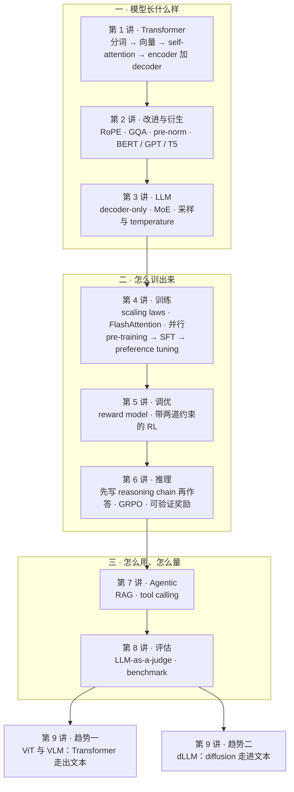
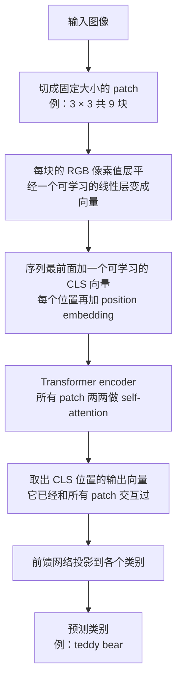
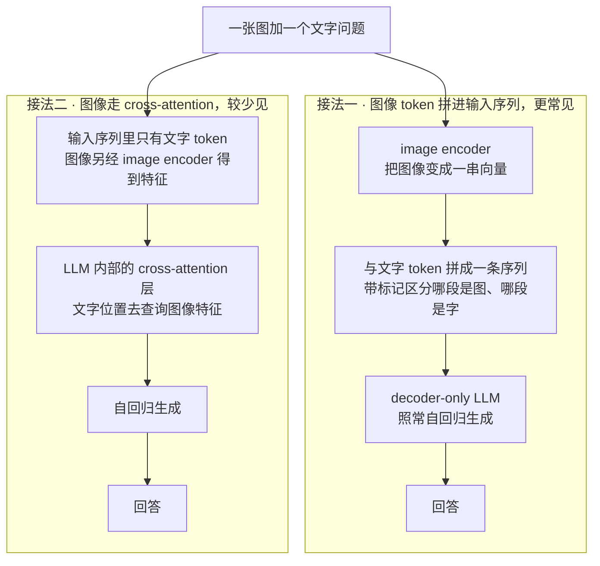
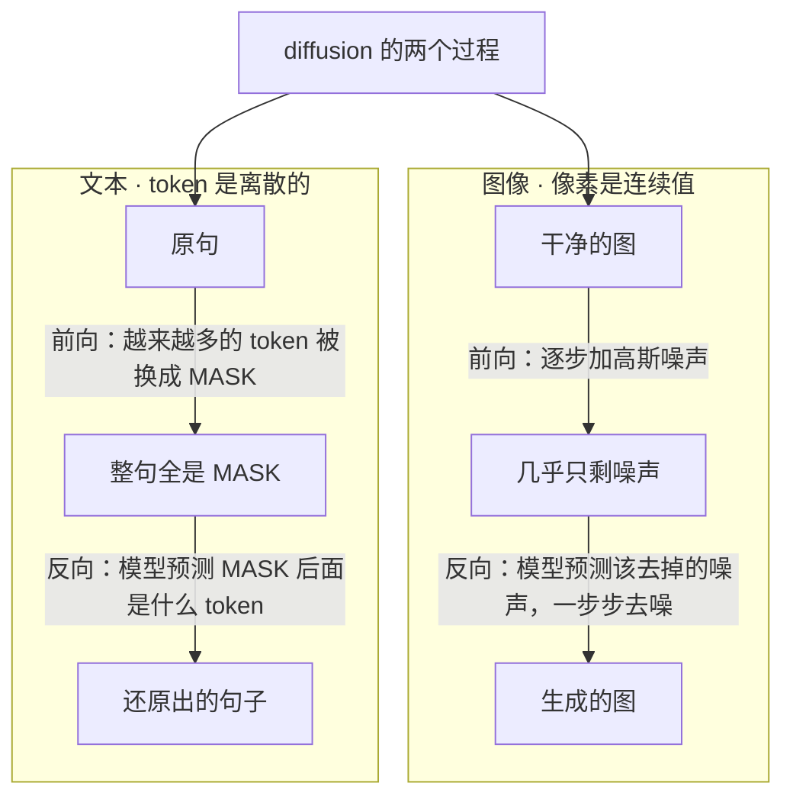
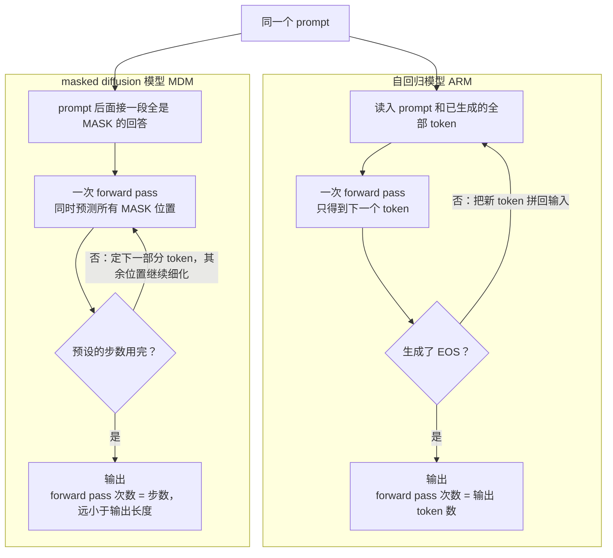
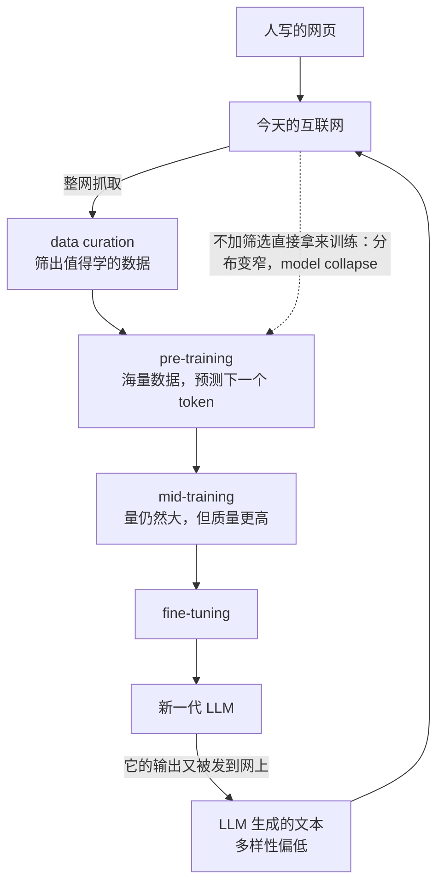

# CME295 第 9 讲｜回顾与当前趋势（Recap & Current Trends）

> Stanford CME295: Transformers & Large Language Models（2025 秋）· 第 9 讲，也是全课最后一讲（视频简介标注的授课日期：2025 年 12 月 5 日）
> 视频：<https://www.youtube.com/watch?v=Q86qzJ1K1Ss>（1:51:31，只有自动生成的英文字幕，专名识别错误较多）
> 讲者：Afshine Amidi（回顾与两个趋势）· Shervine Amidi（1:23:38 起的收尾部分）
> 课程大纲：<https://cme295.stanford.edu/syllabus/>

**一句话**：最后一讲分三段。先用 48 分钟把前八讲串成一条线：模型长什么样（第 1–3 讲）、怎么训出来（第 4–6 讲）、怎么用和怎么量（第 7–8 讲）。再讲两个方向相反的趋势：Transformer 走出文本（ViT 把图像切成 patch 当 token，VLM 让 LLM 就图作答），图像领域的 diffusion 走进文本（拿 MASK 充当噪声的 diffusion LLM，用少量并行步数换速度）。最后 Shervine 盘点还没定型的东西——架构细节、数据、成本、硬件、agent 的落地和几个开放问题——并给出课后跟进这个领域的办法。

## 时间轴

| 时间 | 内容 |
|---|---|
| [0:06](https://www.youtube.com/watch?v=Q86qzJ1K1Ss&t=6s) | 开场：本讲三部分——回顾、趋势、收尾 |
| [1:12](https://www.youtube.com/watch?v=Q86qzJ1K1Ss&t=72s) | 回顾第 1 讲：tokenization、word2vec、RNN、self-attention、Transformer |
| [6:35](https://www.youtube.com/watch?v=Q86qzJ1K1Ss&t=395s) | 回顾第 2 讲：RoPE、GQA、pre-norm；BERT / GPT / T5 三个家族 |
| [11:17](https://www.youtube.com/watch?v=Q86qzJ1K1Ss&t=677s) | 回顾第 3 讲：decoder-only LLM、MoE、采样与 temperature |
| [15:05](https://www.youtube.com/watch?v=Q86qzJ1K1Ss&t=905s) | 回顾第 4 讲：scaling laws、20 倍经验法则、FlashAttention、并行、三段式训练 |
| [24:09](https://www.youtube.com/watch?v=Q86qzJ1K1Ss&t=1449s) | 回顾第 5 讲：LLM 即 policy、Bradley–Terry、reward model、RL 目标的两道约束 |
| [29:41](https://www.youtube.com/watch?v=Q86qzJ1K1Ss&t=1781s) | 回顾第 6 讲：reasoning chain、GRPO 对比 PPO、verifiable reward、长度偏差 |
| [38:37](https://www.youtube.com/watch?v=Q86qzJ1K1Ss&t=2317s) | 回顾第 7 讲：RAG 的两步检索、tool calling 的两步、agentic workflow |
| [44:09](https://www.youtube.com/watch?v=Q86qzJ1K1Ss&t=2649s) | 回顾第 8 讲：规则指标、LLM-as-a-judge 及其偏差、benchmark 的维度 |
| [47:35](https://www.youtube.com/watch?v=Q86qzJ1K1Ss&t=2855s) | 期末范围：第 5–8 讲（期中考的是第 1–4 讲），之后的内容不考 |
| [48:57](https://www.youtube.com/watch?v=Q86qzJ1K1Ss&t=2937s) | 趋势一的动机：self-attention 处理的只是向量，向量不一定非得来自文字 |
| [52:46](https://www.youtube.com/watch?v=Q86qzJ1K1Ss&t=3166s) | ViT 的做法，以及"归纳偏置很低、数据够多就能赢 CNN"的发现 |
| [55:49](https://www.youtube.com/watch?v=Q86qzJ1K1Ss&t=3349s) | ViT 端到端走一遍：patch → 向量 → CLS → encoder → 类别 |
| [59:01](https://www.youtube.com/watch?v=Q86qzJ1K1Ss&t=3541s) | VLM 的两种接法：图像 token 拼进输入（LLaVA）、走 cross-attention（Llama 3） |
| [1:01:34](https://www.youtube.com/watch?v=Q86qzJ1K1Ss&t=3694s) | Transformer 在文本之外：DiT、MM-DiT、推荐、语音 |
| [1:04:02](https://www.youtube.com/watch?v=Q86qzJ1K1Ss&t=3842s) | 趋势二的动机：自回归生成在推理时没法并行（训练时可以） |
| [1:07:12](https://www.youtube.com/watch?v=Q86qzJ1K1Ss&t=4032s) | 2025 年的信号：Google 的实验性文本 diffusion 模型、Inception；难点是文本离散 |
| [1:08:44](https://www.youtube.com/watch?v=Q86qzJ1K1Ss&t=4124s) | 两分钟讲 diffusion：为什么从噪声出发；雕塑家的类比；前向加噪与反向去噪 |
| [1:13:24](https://www.youtube.com/watch?v=Q86qzJ1K1Ss&t=4404s) | 搬到文本：MASK 之于文本如同噪声之于图像；MDM 与 dLLM 两个名字 |
| [1:16:28](https://www.youtube.com/watch?v=Q86qzJ1K1Ss&t=4588s) | 推理过程：从全 MASK 出发逐步还原；写演讲稿的直觉 |
| [1:18:31](https://www.youtube.com/watch?v=Q86qzJ1K1Ss&t=4711s) | 为什么快：forward pass 次数等于步数；参考文献 LLaDA |
| [1:20:06](https://www.youtube.com/watch?v=Q86qzJ1K1Ss&t=4806s) | 优点（速度、fill-in-the-middle）、现状（在追赶）、待做（把自回归的配套技巧搬过来） |
| [1:23:38](https://www.youtube.com/watch?v=Q86qzJ1K1Ss&t=5018s) | 收尾开始：两种模态互相借架构、借输入（DeepSeek-OCR）、借技巧（2D RoPE） |
| [1:28:35](https://www.youtube.com/watch?v=Q86qzJ1K1Ss&t=5315s) | Transformer 的设计仍在迭代：optimizer、归一化、attention、激活函数、MoE、超参 |
| [1:32:12](https://www.youtube.com/watch?v=Q86qzJ1K1Ss&t=5532s) | 数据：互联网被 LLM 文本充斥、data curation、mid-training、model collapse |
| [1:34:49](https://www.youtube.com/watch?v=Q86qzJ1K1Ss&t=5689s) | 架构本身是不是最优；从刷 benchmark 转向成本与质量的 Pareto 前沿；SLM |
| [1:36:52](https://www.youtube.com/watch?v=Q86qzJ1K1Ss&t=5812s) | 硬件：GPU 只擅长矩阵乘；把 attention 直接做进模拟电路的概念验证 |
| [1:39:58](https://www.youtube.com/watch?v=Q86qzJ1K1Ss&t=5998s) | 今天的用例：写代码、text-to-query、可视化、通用助手、创作起稿、辅助学习 |
| [1:43:05](https://www.youtube.com/watch?v=Q86qzJ1K1Ss&t=6185s) | 往前看：agent 大众化、AI 浏览器与 prompt injection、OS 级助手、客服这块试金石 |
| [1:46:39](https://www.youtube.com/watch?v=Q86qzJ1K1Ss&t=6399s) | 开放问题：持续学习、"幻觉"、个性化、可解释性、安全 |
| [1:47:40](https://www.youtube.com/watch?v=Q86qzJ1K1Ss&t=6460s) | 怎么保持更新：arXiv、会议、代码库、Hugging Face Trending Papers、X、YouTube、课程 study guide |
| [1:50:16](https://www.youtube.com/watch?v=Q86qzJ1K1Ss&t=6616s) | 致谢与告别 |

## 核心内容

### 1. 全课一页图：八讲是怎么接起来的

*图 9-1｜全课一页图：八讲分三层，最后一讲从这条线上往外探两步（自绘示意）· [▶ 看原幻灯片 1:12](https://www.youtube.com/watch?v=Q86qzJ1K1Ss&t=72s)*

回顾部分没有新内容，讲者的目的是让各块拼得上。下表把每一讲压成三件事，想重看哪一段，点时间戳跳过去。

| 讲 | 要记住的三件事 | 跳转 |
|---|---|---|
| 1 · Transformer | ① 文本先切成 token（subword 最常用，词根可以复用），再变成向量；word2vec 靠"预测中心词或上下文词"这类代理任务学向量，但同一个词在任何句子里向量都一样 ② RNN 逐个读 token，隔得远的信息留不住；self-attention 让任意两个 token 直接相连 ③ Q / K / V：拿 query 和所有 key 算相似度，softmax 之后对 value 加权平均；Transformer 由 encoder 和 decoder 组成，最初为翻译而设计 | [1:12](https://www.youtube.com/watch?v=Q86qzJ1K1Ss&t=72s) |
| 2 · 改进与衍生 | ① 位置：原版给每个绝对位置配一个向量加到 token 上；RoPE 改成在 attention 内部旋转 Q 和 K，分数只取决于两个 token 的相对距离 ② GQA：多个 head 共用一组 K / V 投影矩阵；归一化从子层之后（post-norm）挪到子层之前（pre-norm）③ 三个家族：encoder-only（BERT，取 CLS 向量做分类，不能生成文本）、decoder-only（GPT）、encoder-decoder（T5），后两类都能自回归生成 | [6:35](https://www.youtube.com/watch?v=Q86qzJ1K1Ss&t=395s) |
| 3 · LLM | ① LLM 就是放大了的 decoder-only 模型，文本进、文本出 ② MoE：把 FFN 换成多个 expert，由 gate 按 token 稀疏路由，一次前向只动用一部分参数；expert 还能分放到不同 GPU 上并行 ③ 解码：greedy 每次取概率最高的 token，sampling 按分布抽；temperature 低则分布尖、输出稳定，高则更随机、更有变化 | [11:17](https://www.youtube.com/watch?v=Q86qzJ1K1Ss&t=677s) |
| 4 · 训练 | ① scaling laws：算力、数据、参数越多，test loss 越低；但算力有限时，当年多数模型相对数据量而言太大、没训够，经验法则是训练 token 数至少为参数量的 20 倍（100B 参数对应 2T token）② FlashAttention：GPU 有又大又慢的 HBM 和又小又快的 SRAM，把计算切块送进 SRAM、少读写 HBM；结果是精确的，还靠"丢掉中间结果、用时重算"换来更快的速度；另有 data parallelism 与 model parallelism ③ 三段式：pre-training 学会续写 → SFT 学会按要求作答 → preference tuning 用成对偏好数据注入负信号 | [15:05](https://www.youtube.com/watch?v=Q86qzJ1K1Ss&t=905s) |
| 5 · 调优 | ① 把 LLM 看成 RL 里的 policy：state 是到目前为止的输入，action 是预测下一个 token，reward 来自人的偏好 ② 人工偏好标注只覆盖很少的数据，所以训练 reward model；它按 Bradley–Terry 形式成对训练 ③ RL 目标：最大化奖励，同时别离 SFT 模型太远（奖励不完美，会被钻空子，即 reward hacking），每轮更新也别离上一轮太远 | [24:09](https://www.youtube.com/watch?v=Q86qzJ1K1Ss&t=1449s) |
| 6 · 推理 | ① reasoning model 先输出一段 reasoning chain 再给答案，思路来自第 3 讲的 chain-of-thought 提示；训练过程中 AIME 准确率一路上升 ② GRPO 对比 PPO：不要 value model，同一道题采样一组回答、在组内互相比较得到 advantage；答案可验证时连 reward model 也省了，只需保留 policy 和 reference 两个模型 ③ 原版 GRPO 的归一化项让错误回答越写越长；Dr. GRPO 和 DAPO 是针对性的修正 | [29:41](https://www.youtube.com/watch?v=Q86qzJ1K1Ss&t=1781s) |
| 7 · Agentic | ① RAG：模型的知识停在 knowledge cutoff，现实中也不会天天重训，所以先检索、再作答 ② 检索分两步：bi-encoder 做向量召回（query 向量对预先算好的文档向量求 cosine 相似度）→ cross-encoder 把 query 和文档一起送进模型精排 → 取 top-K 拼进 prompt ③ tool calling 也是两步：模型选定 API 并填好参数 → 外部执行 → 结果回填，模型再生成最终回答；agentic workflow 是这两样的多步组合 | [38:37](https://www.youtube.com/watch?v=Q86qzJ1K1Ss&t=2317s) |
| 8 · 评估 | ① BLEU / ROUGE / METEOR 这类规则指标认不出"说法不同但同样正确"② LLM-as-a-judge：输入 prompt、模型回答和评判标准，先写 rationale 再给分；现在多用 pass / fail 二值，因为更容易判 ③ 三种偏差：position（先出现的占便宜）、verbosity（偏爱长回答）、self-enhancement（偏爱自己的输出）；benchmark 覆盖知识、推理、代码、安全等维度 | [44:09](https://www.youtube.com/watch?v=Q86qzJ1K1Ss&t=2649s) |

全课的中心思想是 self-attention，讲者在回顾里把这条式子又念了一遍：

$$
\mathrm{Attention}(Q,K,V)=\mathrm{softmax}\!\left(\frac{QK^{\top}}{\sqrt{d_k}}\right)V
$$

Q、K、V 分别是所有 token 的 query、key、value 向量排成的矩阵，d_k 是 key 向量的维度；写成矩阵形式，正好是今天的硬件最擅长的运算。这条式子后面还会出现两次：趋势一里它处理的向量换成了图像 patch，收尾部分的硬件话题则围着 QKᵀ 这一步的开销转。

$$
P(y_i \succ y_j)=\frac{e^{r_i}}{e^{r_i}+e^{r_j}}=\sigma(r_i-r_j)
$$

这是第 5 讲的 Bradley–Terry 形式：r_i 和 r_j 是 reward model 给两个回答打的分，左边是"回答 i 比回答 j 更好"的概率，σ 是 sigmoid。

- **讲者特意放慢讲的三处**（期末只考第 5–8 讲，所以这几讲回顾得更细）
    - reward model 的一个细节：训练时成对喂数据（这个好、那个差），让模型对两个回答各出一个分数；推理时却只给它一个回答、拿一个分数。成对训练、单个使用。
    - RL 损失里的两道约束针对不同的风险：贴近 SFT 模型是防 reward hacking（SFT 模型本身已经不差，相当于正则化）；贴近上一轮是防单步更新过大。
    - PPO 和 GRPO 的差别落在"advantage 怎么来"上。value function 估计的是照当前 policy 走下去预期能拿到的奖励，给奖励提供一个参照；PPO 要训练并维护一个 value model，再用 GAE 把奖励和 value 预测合成 advantage。GRPO 嫌这太贵，改用组内比较。它又常用在数学这类答案可验证的任务上，于是 reward model 也省了。
    > 小注：那个让回答变长的归一化项，是 GRPO 损失里按回答长度取平均的 1/|o|——同样答错，长回答摊到每个 token 上的惩罚更小。Dr. GRPO（论文副标题里的 GRPO Done Right，[Liu et al., 2025](https://arxiv.org/abs/2503.20783)）去掉了它，也去掉了 advantage 里除以组内标准差的那一项。20 倍经验法则应出自 Chinchilla（[Hoffmann et al., 2022](https://arxiv.org/abs/2203.15556)），讲者在回顾里只说是 2020 年代初的一篇论文。

### 2. 趋势一：Vision Transformer——把图像切成"词"

*图 9-2｜ViT 做图像分类的数据流（自绘示意）· [▶ 看原幻灯片 55:49](https://www.youtube.com/watch?v=Q86qzJ1K1Ss&t=3349s) · 出处：[Dosovitskiy et al., 2020](https://arxiv.org/abs/2010.11929)*

- **问题从哪来**：Transformer 先在机器翻译上成功，随后在各种文本任务上都表现很好，自然要问它能不能用在文本之外。讲者的切入点是 self-attention 的定义：一个 query 去看一堆 key 和 value，判断哪些元素和自己相关、据此算出自己的新向量。这个过程里，token 只是向量——如果向量代表的是图像的一小块，机制照样成立。
- **为什么只用 encoder**：任务是图像分类（给一张图，判断属于哪一类），需要的是"读懂"，不是"生成"。课上见过的模型里最适合分类的是 BERT：encoder-only，算出有意义的向量，再投影到类别上。ViT（2020 年）照搬了这个思路。
- **做法**（图 9-2）：把图像切成固定大小的 patch；每个 patch 是一组像素，每个像素有 RGB 三个值，展平后经过一个可学习的线性层变成向量；再加上位置信息，让模型知道每块在图上的哪里；序列最前面放一个可学习的 CLS 向量。整条序列送进 encoder，所有位置互相 attention。最后取 CLS 位置的输出——一来这是沿用 BERT 的惯例，二来它已经通过 self-attention 看过所有 patch——接一个前馈网络预测类别。

$$
z_0=\left[x_{\mathrm{cls}};\;x_p^{1}E;\;x_p^{2}E;\;\dots;\;x_p^{N}E\right]+E_{\mathrm{pos}}
$$

x_p^i 是第 i 个 patch 展平后的像素向量，E 是所有 patch 共用的线性投影矩阵，x_cls 是可学习的 CLS 向量，E_pos 是位置向量，N 是 patch 的个数；z_0 就是送进 encoder 的输入序列。课上是用话描述的这一步，记号取自 ViT 论文。

- **值得记的发现：归纳偏置不是必需的**。inductive bias（归纳偏置）指模型结构里预先写死的假设，它引导模型往某个方向找规律。CNN 的卷积核在图上滑动、每次只看一小片邻域，这和人看图的方式相近，大家一直认为视觉任务需要这种先验。ViT 让每个 patch 从第一层起就能看到所有其他 patch，几乎没有这种先验。论文的结论是：只要训练的图像数据足够多，ViT 反而胜过 CNN。讲者称这个结果很了不起——先验可以靠数据学出来。
    > 小注：ViT 论文的标准设置是 16 × 16 像素的 patch，课上的 3 × 3 指把整张图切成 9 块，只是为了画得下。"数据足够多"在论文里指在 ImageNet-21k（约 1,400 万张）或 JFT-300M（约 3 亿张）上预训练；只在 ImageNet-1k 这种中等规模数据上从头训练时，ViT 比同量级的 ResNet 低几个点。

### 3. 从"看懂图"到"就图作答"：VLM 的两种接法

*图 9-3｜让 LLM 就一张图回答问题的两种接法（自绘示意）· [▶ 看原幻灯片 1:00:03](https://www.youtube.com/watch?v=Q86qzJ1K1Ss&t=3603s) · 出处：[LLaVA](https://arxiv.org/abs/2304.08485)、[Llama 3](https://arxiv.org/abs/2407.21783)*

- **场景**：在 ChatGPT 里上传一张图再提问。输入有两种：图像（上一节已经会表示）和文字（token）。这类模型叫 vision language model（VLM）。
- **接法一，更常见**：全部当输入。图像先过一个 encoder 变成一串 token，和文字 token 拼在一起，再用某种标记让模型知道哪些是图、哪些是字；之后就是普通的 decoder-only 自回归生成。讲者举的例子是开放权重的 LLaVA。
- **接法二，较少见**：图像不进输入序列，而是在 cross-attention 层和文字 token 交互。cross-attention 是第 1 讲里 decoder 去看 encoder 输出的那一层，这里被看的对象换成了图像特征。讲者说 Llama 3 的论文里画的是这种接法。
    > 小注：LLaVA（[Liu et al., 2023](https://arxiv.org/abs/2304.08485)）用现成的 CLIP 视觉编码器（本身就是一个 ViT）加一个投影层，把图像特征映射到 LLM 的词向量空间。Llama 3 论文（[2024](https://arxiv.org/abs/2407.21783)）里的多模态部分当时注明仍在开发，后来发布的 Llama 3.2 Vision 沿用了 cross-attention 适配层。对照第 1 讲：接法一把图像当成"更长的 prompt"，LLM 的结构不用动，代价是占用上下文长度；接法二要在 LLM 里加新层，但图像不挤占输入序列。
- **文本之外还有哪些**：课程只讲了文本到文本，但 Transformer 的用武之地远不止于此。图像理解有 ViT；图像生成里，diffusion transformer（DiT）和 multimodal diffusion transformer（MM-DiT）同样建立在 self-attention 之上；推荐、语音等领域也在用。讲者的建议是课后对非文本的 Transformer 应用保持开放，这几个名字可以当入门的线索。

### 4. 趋势二：diffusion 语言模型（上）——把噪声换成 MASK

*图 9-4｜图像 diffusion 与文本 masked diffusion 的对应关系：MASK 扮演噪声的角色（自绘示意）· [▶ 看原幻灯片 1:13:55](https://www.youtube.com/watch?v=Q86qzJ1K1Ss&t=4435s) · 出处：[Nie et al., 2025](https://arxiv.org/abs/2502.09992)*

- **动机：自回归的推理没法并行**。到这里为止，课上一直默认 LLM 是自回归的（文献里记作 ARM，autoregressive model）：根据已有的全部内容预测下一个 token，拼回去，再预测下一个，直到输出 EOS。后一个 token 依赖前面所有 token，所以推理时只能一个一个出。讲者特意做了区分：训练是可以并行的——整段目标文本一次喂进去，causal mask（第 1 讲）保证每个位置看不到后面的 token、没法作弊。不能并行的只是推理。
- **2025 年的信号**：Google 在 I/O 上展示了一个实验性的文本 diffusion 模型，提速很明显；创业公司 Inception 也在走这条路，讲课前约一个月刚上过头条。讲者说这个方向最早的论文出在 2020 年代初，到现在才开始真正好用。
    > 小注：Google 那个模型即 Gemini Diffusion（2025 年 5 月的 I/O 上公布）。Inception 的模型叫 Mercury，[论文](https://arxiv.org/abs/2506.17298)摘要称其代码模型在 H100 上每秒输出 1,109 和 737 个 token，比速度优化过的前沿模型平均快至多 10 倍；"一个月前的头条"推断指 2025 年 11 月 6 日宣布的 5,000 万美元融资。
- **两分钟讲 diffusion**：图像生成的通行做法是从噪声出发。为什么是噪声？讲者给了几条理由：逐像素做自回归不可行，像素太多；噪声可以用高斯分布描述，数学性质好，也容易采样；随机的起点带来多样性，同一个要求能生成不同的图。目标是学一个变换，把噪声分布变成目标图像的分布。训练涉及两个过程（图 9-4 左）：前向过程把干净的图逐步加噪，直到几乎只剩噪声；模型学的是反向过程——预测该去掉的噪声，一步步把图还原出来。
- **雕塑家的类比**：石料相当于噪声，每块都不一样；成品相当于目标数据分布；雕塑家要学的是该凿掉哪些部分。讲者借了米开朗基罗的说法来对应：雕像本来就在石头里，要做的只是去掉多余的部分。
- **搬到文本：难点与对应关系**。像素是连续值，可以只加一点点噪声；token 是离散的，没有"加一点噪声"这回事。目前研究给出的对应是：MASK token 之于文本，如同噪声之于图像——MASK 的含义就是这个位置的信息被拿掉了。于是前向过程变成把越来越多的 token 换成 MASK，直到整句全是 MASK；模型学的是把 MASK 还原成原来的 token（图 9-4 右）。这类模型叫 masked diffusion model（MDM），也叫 diffusion LLM（dLLM）；讲者提醒这些叫法还没有固定下来。数学推导课上略过了，想深入可以读 LLaDA。
    > 小注：LLaDA（[Nie et al., 2025](https://arxiv.org/abs/2502.09992)）的训练目标很朴素：随机抽一个掩码比例 t，把每个 token 以概率 t 独立换成 MASK，只在被盖住的位置上算交叉熵，再按 1/t 加权。和第 2 讲 BERT 的 masked language modeling 相比，区别在于掩码比例从 0 到 1 随机取，而不是固定在 15% 左右，所以它能从全 MASK 开始采样，是一个真正的生成模型。摘要称 LLaDA 8B 在 in-context learning 上与 LLaMA3 8B 相当。

### 5. diffusion 语言模型（下）——推理时怎么跑、快在哪、卡在哪

*图 9-5｜同一个 prompt，自回归解码与 masked diffusion 解码各要做多少次 forward pass（自绘示意）· [▶ 看原幻灯片 1:16:28](https://www.youtube.com/watch?v=Q86qzJ1K1Ss&t=4588s) · 出处：[Nie et al., 2025](https://arxiv.org/abs/2502.09992)*

- **推理过程**（图 9-5 右）：prompt 作为条件放在前面，回答部分一开始全是 MASK，模型预测这些 MASK 后面是什么 token，分若干步完成。它可以先定下靠后位置的 token，而靠前的某些位置还空着——这一点和自回归根本不同。
- **直觉：写演讲稿**。讲者坦言自己一开始也想不通：人写东西明明是一个词一个词写的，文本为什么适合用 diffusion 来生成？他的办法是换个例子：写演讲稿不会从第一个字线性地写到最后一个字，而是先列提纲（先讲什么、再讲什么），有了草稿再逐段打磨。diffusion 的生成就是这样由粗到细（coarse-to-fine）的过程。
- **快在哪**：自回归生成要做的 forward pass 次数等于要输出的 token 数；diffusion 只需要做"步数"那么多次，而步数可以事先定好。步数越多质量越高，但通常远小于输出长度——这是它快的根本原因。
- **两个优点**
    - 速度。输出越长越明显，有的基准测出来大约快 10 倍。讲者点名 coding 场景：一个任务要调很多次模型，用户一直在等，延迟降下来体验差别很大。多步调用模型的 agent 面对的是同一笔账。
    - 生成时把文本当成一个整体来考虑，能同时利用两边的上下文，所以天然适合 fill-in-the-middle 这类任务：给定前后的代码，补出中间缺的那一段。
- **卡在哪**：有一段时间性能赶不上自回归的前沿模型，不过课上提到的几篇论文里差距在缩小。另一条工作线是把围绕自回归模型发展出来的技巧搬过来，比如 reasoning chain（第 6 讲）在 diffusion 里该怎么做——很多技巧天生是为自回归设计的。
    > 小注：课上没有展开每一步具体怎么"定下一部分 token"。LLaDA 的做法是每步对所有 MASK 位置同时给出预测，保留置信度高的，把其余位置重新盖上 MASK 留给后面的步骤（low-confidence remasking）；回答长度要预先给定，是一个超参数。
- **两个趋势合起来看**：课上学的东西可以拿到别的领域去用（Transformer 进入视觉），别的领域的东西也可以拿回文本来用（diffusion 进入 LLM）。讲者说这只是当下动向的一小部分。

### 6. 收尾（上）：两种模态互相借东西，Transformer 的细节也没有定型

从这里起换 Shervine 讲。他先接着上一段的话头，把文本和图像之间的互相借鉴列了一遍：

| 借的是什么 | 方向 | 课上的例子 |
|---|---|---|
| 架构 | 图像 → 文本 | diffusion 用到文本生成上，换来更低的延迟 |
| 架构 | 文本 → 图像 | 图像 diffusion 模型里原本用卷积网络，换成 Transformer 后效果更好；新近的图像 diffusion 论文基本都用 Transformer（幻灯片上链接的是 DiT） |
| 输入表示 | 图像 → 文本 | DeepSeek-OCR：用很少的 vision token 就能还原出对应的文字 token |
| 内部技巧 | 文本 → 图像与多模态 | RoPE 改写成 2D：在二维网格上分配位置，文字 token 也摆进同一套坐标，相对位置的计算依然成立 |

- **DeepSeek-OCR 为什么值得一提**：名字里的 OCR（光学字符识别，把扫描图像转成文字）容易误导。讲者说这篇论文的看点不在 OCR 任务本身，而在它表明：可以学到一个函数，从很少的 vision token 重建出文本 token——图像 patch 当 token 用，表示能力很强。有研究者顺势给出理由：tokenizer 本来就不是理想的工具；图像块天然承载文字的含义，比如 emoji，用文本来表示反而要更多的 token。
    > 小注：[DeepSeek-OCR](https://arxiv.org/abs/2510.18234)（2025 年 10 月）摘要里的数字：文本 token 数在 vision token 的 10 倍以内时，解码精度约 97%；压到 20 倍时仍有约 60%。论文把它定位成"用视觉模态压缩长上下文"的初步探索。"有研究者"推断指论文发布后 Andrej Karpathy 等人的公开评论。
- **2D RoPE 为什么能成立**：RoPE 的要点是 attention 分数只取决于相对位置（第 2 讲）。图像 patch 的位置有行和列两个坐标，只要分别按行距和列距去旋转，相对关系照样保得住；图文混排时，再给文字 token 在同一套坐标里安排一个位置即可。幻灯片上的图画的就是这种分配方式。
    > 小注：那张图课上没有点名出处。这个思路的一个代表是 Qwen2-VL 的 M-RoPE（[Wang et al., 2024](https://arxiv.org/abs/2409.12191)）：把旋转用的维度分给时间、高、宽几个分量；纯文字 token 的几个分量取相同的值，于是退化回普通的 1D RoPE。
- **还在迭代的设计决定**。Shervine 的意思是：研究远没有结束，今天用的每个细节都还在被改。
    - optimizer：Adam 长期是默认选择，现在受到挑战。讲者举的是 Kimi K2 论文里的 Muon 及其新版本 MuonClip，认为它有可能成为新的标准。
        > 小注：Muon 最早由 Keller Jordan 等人在 2024 年提出；[Kimi K2](https://arxiv.org/abs/2507.20534)（2025 年 7 月）的贡献是 MuonClip——在 Muon 上加 QK-clip 压住训练不稳定。摘要称这个 1T 总参数（激活 32B）的 MoE 模型用它训了 15.5T token，没有出现 loss spike。
    - 归一化：位置从 post-norm 变成 pre-norm；种类也在变，原版用 LayerNorm，现在常见参数更少的 RMSNorm。背后的理论还没有定论。
    - attention：GQA 之后并没有统一的设计，各家论文各用各的；有的模型在某些层用一种 attention，到别的层又换一种。
    - 激活函数：深度学习里长期用简单好用的 ReLU；LLM 转向了"像 ReLU 但不完全是"的函数，比如 GELU，新的还在不断出现。
    - 要不要做成 MoE，多少层、多少个 head、FFN 多宽——都还在争论。
- **连架构本身也未必是终点**：Transformer 是不是最好的架构并不清楚，这本身就是一个研究方向，未来的突破可能来自重新设计它。

### 7. 收尾（中）：数据、成本与硬件

*图 9-6｜LLM 生成的文本回流进训练数据的回路，以及 data curation 和 mid-training 所处的位置（自绘示意）· [▶ 看原幻灯片 1:33:15](https://www.youtube.com/watch?v=Q86qzJ1K1Ss&t=5595s) · 出处：[Shumailov et al., 2023](https://arxiv.org/abs/2305.17493)*

- **数据**：早期的 LLM 占了一个便宜——爬下整个互联网，拿到的基本都是人写的内容，格式不干净，但来源可靠。现在随便搜点什么，排在前面的结果里已经有大量 LLM 生成的文本（讲者随口估了个八成）。他认为并非没救，理由有两条。一是 data curation（数据的筛选与整理）越来越受重视，已经有公司专门做这件事。二是训练流程多了一段：从 pre-training → fine-tuning 变成 pre-training → mid-training → fine-tuning，mid-training 的语料量仍然很大，但质量更高。幻灯片上链接的论文讲的是 model collapse：LLM 生成的文本多样性偏低，拿它来训练，模型见到的数据分布就变了，能学到的东西变少（图 9-6 的虚线）。
    > 小注：这篇应为 Shumailov 等人的工作（[arXiv 版，2023](https://arxiv.org/abs/2305.17493)；2024 年发表于 Nature）。摘要的说法是：用模型生成的内容训练会造成不可逆的缺陷，原始分布的尾部会消失。
- **成本**：过去几年的研究主线是把 benchmark 刷得更高。假如我们关心的用例都被解决了，下一步是什么？Shervine 的判断是 Pareto 前沿的另一条边会变得重要：在保持高质量的前提下，让每次推理更便宜。迹象有两个：small language model（SLM）这个叫法的出现；LLM 供应商自己说，连最高档的订阅也在亏钱——推理侧的算力必须花得更聪明。
- **硬件**：全课几乎没碰的一块。GPU 真正擅长的只有矩阵乘法，而 Transformer 有自己的特殊需求：QKᵀ 这一步很贵；FlashAttention 为了少搬数据宁可重算；大量优化工作研究的都是数据在 GPU 各级内存之间怎么流动。这说明也许需要更贴合的硬件。讲者介绍了一篇概念验证论文：把这些运算直接做进硬件，用模拟信号实现输入输出，数组里的数值用脉冲表示，计算结果是电路物理性质的副产品（比如基尔霍夫定律让电流自然相加），最后只要把结果读出来。论文在仿真里看到延迟和能耗都明显下降——计算不用自己做，是硬件顺带给的。
    > 小注：应为 Leroux 等人的 analog in-memory computing attention（[arXiv 2409.19315](https://arxiv.org/abs/2409.19315)）：用 gain cell 这种基于电荷的存储单元存放 K、V 投影，并就地以模拟方式并行完成 attention 的点积。arXiv 摘要称 attention 的延迟和能耗相对 GPU 最多可降两个和五个数量级。预印本出在 2024 年 9 月，正式版 2025 年刊于 Nature Computational Science；讲者说的"9 月"应指正式版。

### 8. 收尾（下）：LLM 今天用在哪、接下来往哪走、怎么跟进

- **今天的用例**
    - 写代码：AI 编程助手的 agent mode 把自然语言变成代码。
    - 很多问题可以转化成 text-to-query 或 text-to-code，连可视化也是：讲者提到 Google 最近的一次发布，能按一些原则即时生成可视化界面。
        > 小注：推断指 2025 年 11 月随 Gemini 3 推出的 generative UI（Gemini app 里的 dynamic view 和 visual layout）。
    - 通用助手：问常识，让它替你浏览网页、再用自然语言转述。
    - 创作类工作的起稿：从草稿改，比从白纸写容易。
    - 学习：Shervine 说他看到有学生边听课边在 ChatGPT 里追问相关概念，他很赞成——及早拿到反馈回路对掌握概念很有用，现在是学东西的好时候。
- **明天**：agentic workflow 目前还局限在懂行的人手里，下一步是大众化——不用写代码，用自然语言就能搭出对自己有用的东西。讲者说幻灯片上写的是"明天"，可就在两天前已经有一个发布朝这个方向走了。
    > 小注：按日期推断是 Google Workspace Studio（2025 年 12 月 3 日发布，用自然语言搭建 Workspace 里的 agent）。
- **再往后**
    - AI 替你浏览网页。现在人做任务的方式太"微观"，这类琐碎操作正适合交给助手。代表产品是 10 月发布的 ChatGPT Atlas。讲者猜它的使用量还不大，障碍在安全：任何人都可能在网页里埋一段恶意 prompt（prompt injection），借此把你的数据偷走。他的类比是 HTTPS——当年用它表明连接是安全的，将来也许会有某种证书，表明一个网站可以放心让 AI 助手浏览。
    - 再高一层：LLM 进到操作系统这一级，在桌面或手机上替你操作。第 7 讲说过 agent 不够可靠：步骤越多，出错的概率越大，怎么让预测稳定下来是个重要课题。
        > 小注：一个粗略的算法：假设每步成功率是 p 且相互独立，n 步全对的概率是 p 的 n 次方；p = 0.95、n = 20 时只剩约 36%。
    - 更长远的试金石：AI 客服是否真的有用。Shervine 说自己每次打电话听到 AI 客服，第一反应都是赶紧转人工。人能带来的价值维度远多于 LLM：同理心、对现实的把握，还有很多没写进 system prompt、但大家都觉得理所当然的东西。
- **当前架构下的开放问题**
    - 持续学习：训练结束后权重就固定了，RAG 和工具（第 7 讲）都是绕开这个限制的办法。能不能有一个持续学习的系统，是开放问题。
    - "幻觉"：Shervine 给这个词打了引号。模型被训练来预测下一个 token，而不是把陈述对应到事实；从这个角度看，"幻觉"是这种设计的直接后果，算不上故障。
    - 还有个性化、可解释性、安全，清单很长。
- **怎么保持更新**：arXiv 上有最新的论文；NeurIPS 这样的会议（讲课那周正在开）会帮你筛出值得看的；除了论文，强烈建议读作者放出来的代码，附上实现如今已是惯例；Papers with Code 已经被 Hugging Face 的 Trending Papers 取代；X 上有活跃的社区；YouTube 上推荐 Yannic Kilcher（2017 年就细讲过 Transformer 论文）和 Andrej Karpathy（约十年前在 Stanford，讲者眼里最好的教育者之一）；各公司的技术博客；还有课程配套的 study guide，两位讲者打算至少每年更新一次，并且已有多种语言的译本。

## 关键图表速查（点时间戳跳到原幻灯片）

| 图 | 看什么 | 跳转 | 出处 |
|---|---|---|---|
| self-attention 的 Q / K / V 示意与矩阵公式 | 一个 query 对所有 key 打分、再对 value 加权平均；同一张图在 50:12 又被拿来引出 ViT | [4:49](https://www.youtube.com/watch?v=Q86qzJ1K1Ss&t=289s) | [Vaswani et al., 2017](https://arxiv.org/abs/1706.03762) |
| scaling laws 三联图 | 纵轴是 test loss，三张分别对应算力、数据量、参数量，都是越多越低 | [15:51](https://www.youtube.com/watch?v=Q86qzJ1K1Ss&t=951s) | 应出自 [Kaplan et al., 2020](https://arxiv.org/abs/2001.08361) |
| RLHF 回路 | prompt → rollout → reward model 打分 → 更新权重；损失里的两道约束各防什么 | [27:13](https://www.youtube.com/watch?v=Q86qzJ1K1Ss&t=1633s) | — |
| PPO 与 GRPO 对照图 | GRPO 一侧没有 value model；一组回答的奖励互相比较得到 advantage | [33:01](https://www.youtube.com/watch?v=Q86qzJ1K1Ss&t=1981s) | 应出自 [DeepSeekMath](https://arxiv.org/abs/2402.03300) |
| RAG 的两步检索 | bi-encoder 召回与 cross-encoder 精排，输入的组织方式有何不同 | [40:22](https://www.youtube.com/watch?v=Q86qzJ1K1Ss&t=2422s) | — |
| ViT 端到端示例 | 小熊图片被切块、变向量、加 CLS 与位置；CLS 的输出接分类头 | [55:49](https://www.youtube.com/watch?v=Q86qzJ1K1Ss&t=3349s) | [ViT](https://arxiv.org/abs/2010.11929) |
| VLM 的两种接法 | 图像 token 是拼在输入序列里，还是从 cross-attention 层进入 | [1:00:03](https://www.youtube.com/watch?v=Q86qzJ1K1Ss&t=3603s) | [LLaVA](https://arxiv.org/abs/2304.08485)、[Llama 3](https://arxiv.org/abs/2407.21783) |
| 2025 年的发布截图 | Google I/O 上的文本 diffusion 模型、Inception 的报道——这个方向热起来的旁证 | [1:07:12](https://www.youtube.com/watch?v=Q86qzJ1K1Ss&t=4032s) | — |
| 图像 diffusion 的两个过程 | 前向逐步加噪，反向预测该去掉的噪声 | [1:11:51](https://www.youtube.com/watch?v=Q86qzJ1K1Ss&t=4311s) | — |
| 文本版的前向过程与推理 | MASK 逐步增多直到全 MASK；推理时带着 prompt 从全 MASK 往回还原 | [1:14:26](https://www.youtube.com/watch?v=Q86qzJ1K1Ss&t=4466s) | [LLaDA](https://arxiv.org/abs/2502.09992) |
| 2D RoPE 示意 | 位置怎样分配到二维网格上，文字 token 又摆在哪 | [1:27:33](https://www.youtube.com/watch?v=Q86qzJ1K1Ss&t=5253s) | 课上未点名 |
| 仍在迭代的设计决定清单 | optimizer、归一化、attention、激活函数、MoE、各类超参，逐项对照今天的做法 | [1:28:35](https://www.youtube.com/watch?v=Q86qzJ1K1Ss&t=5315s) | [Kimi K2](https://arxiv.org/abs/2507.20534) 等 |
| 模拟电路里的 attention | 运算被做进硬件，结果直接读出；延迟与能耗的对比 | [1:38:26](https://www.youtube.com/watch?v=Q86qzJ1K1Ss&t=5906s) | 应为 [Leroux et al.](https://arxiv.org/abs/2409.19315) |
| 保持更新的资源页 | 论文、代码、社区、视频、study guide 各去哪找 | [1:47:40](https://www.youtube.com/watch?v=Q86qzJ1K1Ss&t=6460s) | — |

## 提到的工作

| 名称 | 在本讲里的作用 |
|---|---|
| word2vec、RNN | 回顾第 1 讲：不看上下文的词向量、留不住远距离信息的循环结构，引出 self-attention |
| [Transformer](https://arxiv.org/abs/1706.03762)（2017） | 全课的地基；本讲两个趋势都从它出发 |
| [RoPE](https://arxiv.org/abs/2104.09864)、[GQA](https://arxiv.org/abs/2305.13245)、pre-norm | 回顾第 2 讲的三项改进；RoPE 在收尾部分以 2D 形式再次出现 |
| [BERT](https://arxiv.org/abs/1810.04805)、GPT、[T5](https://arxiv.org/abs/1910.10683) | 三个家族的代表；BERT 的 CLS 做法被 ViT 直接沿用 |
| MoE | 回顾第 3 讲：FFN 处的稀疏专家；收尾部分又作为仍有争议的设计选项出现 |
| scaling laws、[Chinchilla](https://arxiv.org/abs/2203.15556)（应为） | 回顾第 4 讲：越大越好，以及 20 倍 token 的经验法则 |
| [FlashAttention](https://arxiv.org/abs/2205.14135) | 回顾第 4 讲；在硬件话题里再次被引用，说明瓶颈在数据搬运 |
| Bradley–Terry、reward model、[PPO](https://arxiv.org/abs/1707.06347)、GAE | 回顾第 5、6 讲：偏好建模与带 value model 的 RL |
| GRPO（[DeepSeekMath](https://arxiv.org/abs/2402.03300)）、[Dr. GRPO](https://arxiv.org/abs/2503.20783)、[DAPO](https://arxiv.org/abs/2503.14476) | 回顾第 6 讲：组内比较的 advantage、长度偏差及其修正 |
| chain-of-thought、AIME | reasoning chain 的思路来源；衡量推理训练进展的数学 benchmark |
| RAG、bi-encoder 与 cross-encoder、tool calling | 回顾第 7 讲；收尾部分说它们是在绕开"权重训练后就固定"这个限制 |
| BLEU / ROUGE / METEOR、LLM-as-a-judge | 回顾第 8 讲：规则指标的局限与 judge 的三种偏差 |
| [ViT](https://arxiv.org/abs/2010.11929)（2020） | 趋势一的主角：patch 当 token、encoder-only、CLS 分类 |
| CNN | ViT 的对照：自带很强的视觉归纳偏置 |
| [LLaVA](https://arxiv.org/abs/2304.08485) | VLM 接法一的例子：图像 token 与文字 token 拼接 |
| [Llama 3](https://arxiv.org/abs/2407.21783) | VLM 接法二的例子：图像经 cross-attention 进入 |
| [DiT](https://arxiv.org/abs/2212.09748)、MM-DiT | 图像生成里的 Transformer；也是"文本借给图像"的架构例子 |
| Google 的实验性文本 diffusion 模型（Gemini Diffusion） | 2025 年 dLLM 升温的信号之一 |
| Inception（[Mercury](https://arxiv.org/abs/2506.17298)） | 做 dLLM 的创业公司，另一个信号 |
| [LLaDA](https://arxiv.org/abs/2502.09992) | 讲者推荐的 dLLM 入门论文，含课上略过的数学 |
| [DeepSeek-OCR](https://arxiv.org/abs/2510.18234) | 很少的 vision token 就能还原文字——图像 patch 作为输入表示的潜力 |
| Adam、Muon / MuonClip（[Kimi K2](https://arxiv.org/abs/2507.20534)） | optimizer 这种基础部件也还在变 |
| LayerNorm、[RMSNorm](https://arxiv.org/abs/1910.07467)、ReLU、[GELU](https://arxiv.org/abs/1606.08415) | 归一化与激活函数的更替 |
| model collapse（[Shumailov et al.](https://arxiv.org/abs/2305.17493)，应为） | 用 LLM 生成的数据训练会怎样；data curation 的动机 |
| SLM | 成本—质量前沿上的小模型路线 |
| analog in-memory attention（[Leroux et al.](https://arxiv.org/abs/2409.19315)，应为） | 为 attention 定制硬件的概念验证 |
| ChatGPT Atlas | AI 浏览器；引出 prompt injection 的安全问题 |
| Hugging Face Trending Papers、Papers with Code | 跟进论文与代码的去处，后者已被前者取代 |
| Yannic Kilcher、Andrej Karpathy | 讲者推荐的两位 YouTube 讲解者 |

## 术语对照

| English | 中文 |
|---|---|
| subword tokenizer | 子词分词器（把词拆成可复用的片段） |
| long-range dependency | 长程依赖（隔得很远的 token 之间的关系） |
| rotary position embeddings (RoPE) | 旋转位置编码 |
| grouped-query attention (GQA) | 分组查询注意力（多个 head 共用 K / V） |
| post-norm / pre-norm | 归一化放在子层之后 / 之前 |
| mixture of experts (MoE)、gating | 混合专家、门控路由 |
| greedy decoding / sampling / temperature | 贪心解码 / 采样 / 温度 |
| undertrained | 训练不足（模型相对数据量太大） |
| HBM / SRAM | GPU 上又大又慢 / 又小又快的两级内存 |
| recomputation | 重计算（不存中间结果，用时再算） |
| data / model parallelism | 数据并行 / 模型并行 |
| pre-training / mid-training / SFT / preference tuning | 预训练 / 中期训练 / 监督微调 / 偏好调优 |
| policy、rollout、reward hacking | 策略、一次完整的生成、钻奖励的空子 |
| value function、advantage | 价值函数（预期奖励的参照）、优势（比参照好多少） |
| verifiable reward | 可验证奖励（答案能直接核对，无需 reward model） |
| knowledge cutoff | 知识截止日期 |
| bi-encoder / cross-encoder | 双塔编码器（各自编码后比相似度）/ 交叉编码器（query 与文档一起编码） |
| rationale | 评分理由（judge 在给分前先写出来） |
| position / verbosity / self-enhancement bias | 位置 / 冗长 / 自我偏好偏差 |
| patch | 图像块（ViT 里的 token） |
| inductive bias | 归纳偏置（写死在模型结构里的先验假设） |
| vision language model (VLM) | 视觉语言模型 |
| cross-attention | 交叉注意力（一路序列去查询另一路） |
| autoregressive model (ARM) | 自回归模型（逐 token 生成） |
| forward / reverse process | 前向过程（加噪或加 MASK）/ 反向过程（去噪或还原） |
| masked diffusion model (MDM)、diffusion LLM (dLLM) | 掩码扩散模型、扩散语言模型 |
| coarse-to-fine refinement | 由粗到细的逐步细化 |
| fill-in-the-middle | 中间填空（给定前后文补中段，多见于代码） |
| data curation | 数据筛选与整理 |
| model collapse | 模型坍缩（反复用模型生成的数据训练导致分布变窄） |
| Pareto frontier | 帕累托前沿（这里指成本与质量无法同时再改进的边界） |
| small language model (SLM) | 小语言模型 |
| analog in-memory computing | 模拟存内计算（在存储单元里直接用模拟电路做运算） |
| prompt injection、exfiltrate | 提示注入、窃取数据外传 |
| continual learning | 持续学习（部署后还能继续更新知识） |

## 字幕勘误

"CM295" → CME295；"wordtovec" → word2vec；"birds" → BERT；"rope" → RoPE；"HPM""SRAMM" → HBM、SRAM；"PO""PPU" → PPO；"GRPL" → GRPO；"AIM benchmark" → AIME；"GRPO done rights" → GRPO Done Right（即 Dr. GRPO）；"depo dapo" → DAPO；"blur, rouge, meor" → BLEU、ROUGE、METEOR；"by encoder" → bi-encoder；"lava" → LLaVA；"LADA" → LLaDA；"mass tokens" → mask tokens；"paralyzable""paralyze" → parallelizable、parallelize；"indictive bias" → inductive bias；"Kim K2" → Kimi K2；"atom optimizer" → Adam optimizer；"the LLM as ane" → as an MoE；"Parto Frontier" → Pareto frontier；"kirhoff" → Kirchhoff；"JGPT" → ChatGPT；"used as an eight" → as an aid；"new rips" → NeurIPS；"Yanik Kilchshire" → Yannic Kilcher；"Andrish Karpath" → Andrej Karpathy；"Afin""Ashin""Ein" → Afshine；"Shervin" → Shervine。

## 带走的问题

1. ViT 几乎没有归纳偏置，靠大数据赢了 CNN。数据不够多的时候该怎么选？"少先验、多数据"这条经验的边界在哪——在你自己的任务上，数据量落在哪一侧？
2. VLM 的两种接法各自的代价是什么：哪一种占用上下文长度，哪一种要改动 LLM 本体？输入是多张图或一段视频时，账会怎么变？为什么多数模型选了把图像 token 拼进输入这条路？
3. dLLM 的步数是速度与质量之间的旋钮。同一步里同时定下的多个 token 彼此看不到对方，这对要求严格前后一致的输出（代码、数学推导、工具调用的 JSON）意味着什么？回答长度要预先给定，又会带来什么限制？
4. 围绕自回归模型的一整套配套——KV cache、reasoning chain、RL 后训练、流式输出——有多少能平移到 dLLM？对一个多步 agent 来说，单步延迟降到十分之一、单步质量略降，总体成功率是升还是降（对照第 8 节的成功率小注）？
5. 互联网被 LLM 文本充斥之后，data curation 和 mid-training 能从根本上避开 model collapse 吗？后训练里又在大量主动使用合成数据（第 5、6 讲），这两件事的区别在哪？
6. Shervine 说权重训练后固定、RAG 和工具只是绕路，又说"幻觉"是 next-token 目标的直接后果。如果接受这两个判断，RAG、verifiable reward、LLM-as-a-judge 各自补的是哪一块？一个真正持续学习的系统至少要改掉什么？
