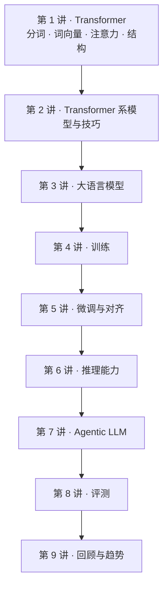

# CME295 学习笔记

> Stanford CME295: Transformers & Large Language Models（2025 秋）· 讲者 Afshine Amidi、Shervine Amidi
> 非官方个人笔记，根据 YouTube 公开课视频的字幕整理 · [播放列表](https://www.youtube.com/playlist?list=PLoROMvodv4rOCXd21gf0CF4xr35yINeOy) · [课程大纲](https://cme295.stanford.edu/syllabus/)

**一句话**：这门课把大模型从底到顶走一遍——模型长什么样（第 1–3 讲），怎么训出来、怎么调到听话（第 4–5 讲），怎么想问题、怎么动手做事（第 6–7 讲），怎么量它好不好（第 8 讲），最后回顾并看趋势（第 9 讲）。CS329A 默认你已经懂这些，这门课正好把那些默认的词一个个讲清楚。

## 课程地图

*图 0-1｜九讲的顺序就是一个模型从结构到落地的顺序（自绘示意）*

## 各讲索引

| 讲 | 主题 | 视频 |
|---|---|---|
| [第 1 讲](#l1) | Transformer：NLP 背景、分词、词向量、RNN、注意力、完整结构 | [YouTube](https://www.youtube.com/watch?v=Ub3GoFaUcds) |
| [第 2 讲](#l2) | Transformer 系模型与技巧：位置嵌入、注意力变体、几类模型家族 | [YouTube](https://www.youtube.com/watch?v=yT84Y5zCnaA) |
| [第 3 讲](#l3) | 大语言模型：从 Transformer 到 LLM | [YouTube](https://www.youtube.com/watch?v=Q5baLehv5So) |
| [第 4 讲](#l4) | LLM 训练 | [YouTube](https://www.youtube.com/watch?v=VlA_jt_3Qc4) |
| [第 5 讲](#l5) | LLM 微调：偏好数据、奖励模型、RLHF 与 PPO、Best-of-N、DPO | [YouTube](https://www.youtube.com/watch?v=PmW_TMQ3l0I) |
| [第 6 讲](#l6) | LLM 推理能力 | [YouTube](https://www.youtube.com/watch?v=k5Fh-UgTuCo) |
| [第 7 讲](#l7) | Agentic LLM | [YouTube](https://www.youtube.com/watch?v=h-7S6HNq0Vg) |
| [第 8 讲](#l8) | LLM 评测：人工评分、规则指标、LLM-as-a-judge、benchmark、agent 评测 | [YouTube](https://www.youtube.com/watch?v=8fNP4N46RRo) |
| [第 9 讲](#l9) | 回顾与当前趋势 | [YouTube](https://www.youtube.com/watch?v=Q86qzJ1K1Ss) |

## 和 CS329A 怎么对照

| 这门课 | CS329A 里对应的内容 | 关系 |
|---|---|---|
| 第 5 讲 微调与对齐 | 第 3 讲验证器、第 6 讲 RL | 这里讲 RLHF、PPO、DPO 的基础；那边讲研究前沿 |
| 第 6 讲 推理能力 | 第 2 讲测试时计算、第 6 讲 GRPO | 同一批想法，这里从头解释 |
| 第 7 讲 Agentic LLM | 第 4 讲工具反馈、第 5 讲规划、第 7 讲 Search-o1 | 这里讲 RAG、工具调用、agent 循环的机制 |
| 第 8 讲 评测 | 第 8 讲智能体评测 | 这里讲指标和 judge 的基本功；那边讲长程任务的评测 |

## 怎么用这份笔记

- **每讲的结构是固定的**：一句话 → 时间轴 → 核心内容（带图和公式）→ 关键图表速查 → 提到的工作 → 术语对照 → 字幕勘误 → 带走的问题。赶时间可以只读"一句话"、图和"带走的问题"。
- **时间戳都能点**，直接跳到视频里对应的位置。图下面黄色的「▶ 看原幻灯片」会跳到老师讲那一页 PPT 的时刻。
- **图是重新画的示意图**，用来解释机制，不是课件截图。
- **公式单独成块**，后面跟一句话解释每个符号。
- **"小注"** 是补充的课外事实或对口误的更正；**"应为 / 应出自"** 表示这是根据内容推断的，老师没有明说。
- 这门课的英文字幕多为自动生成，人名和缩写错得不少，每讲末尾的"字幕勘误"列了会影响理解的那些。想对照原文：在播放器「设置 → 字幕 → 自动翻译 → 中文（简体）」可以开中文字幕。
