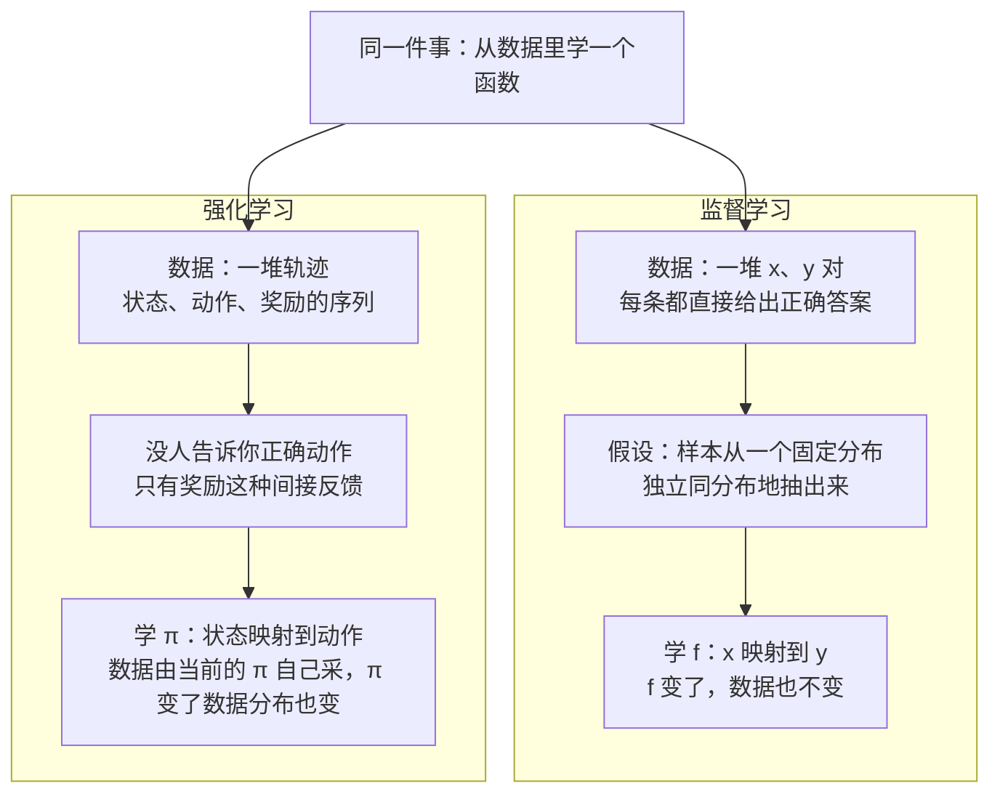
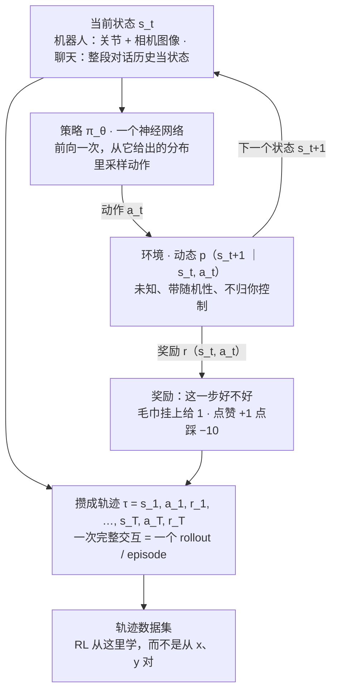
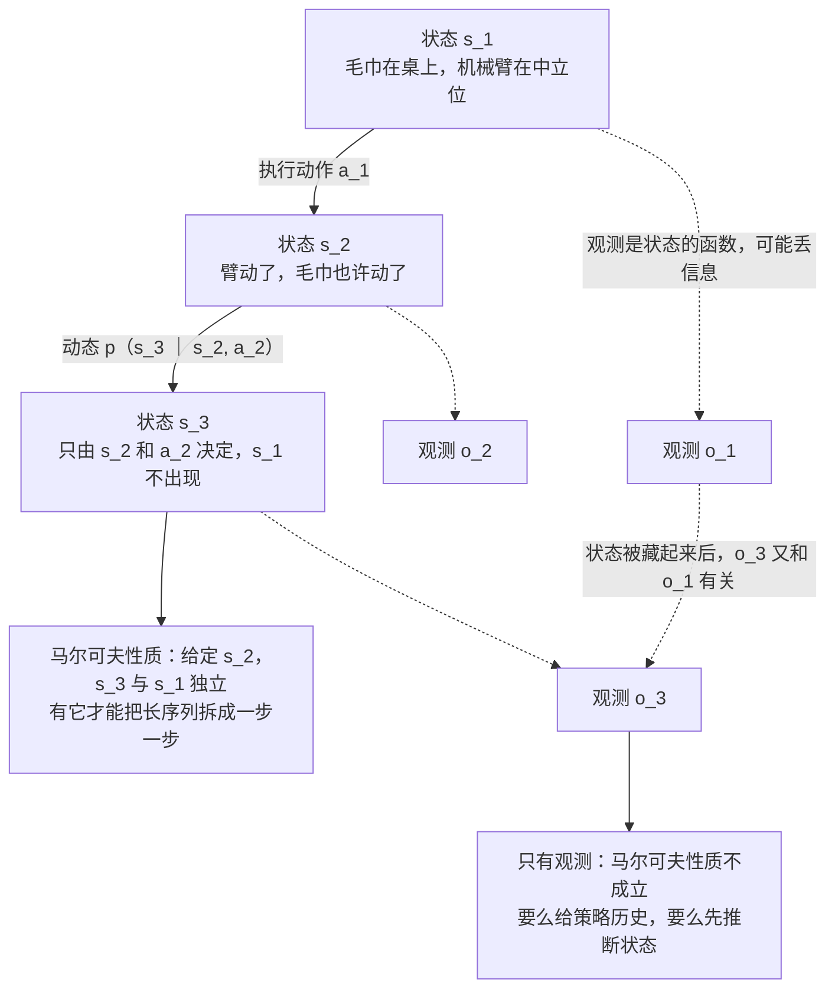
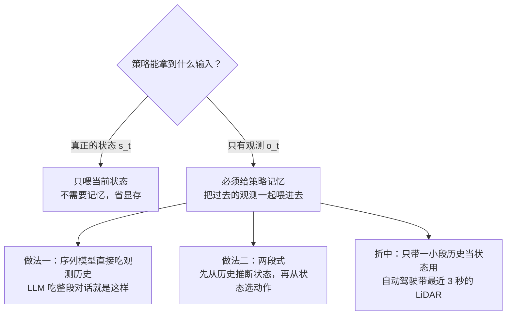
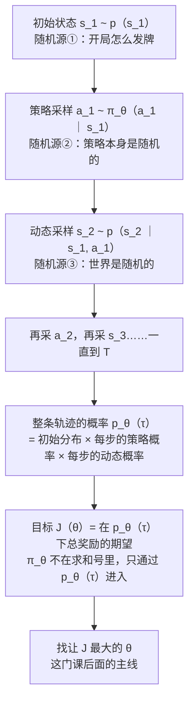
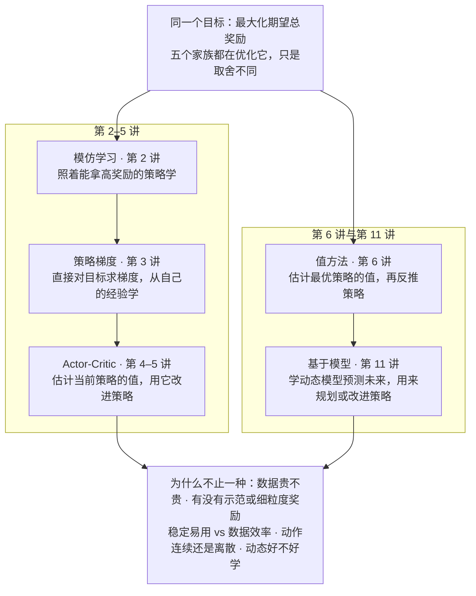

# CS224R 第 1 讲｜课程介绍与 MDP（Class Intro）

> Stanford CS224R: Deep Reinforcement Learning（2025 春）· 第 1 讲，2025 年 4 月 2 日 · 课程表上的题目是 Course intro + MDPs，没有指定阅读
> 视频：<https://www.youtube.com/watch?v=EvHRQhMX7_w>（52:58，英文字幕是人工校对过的 CC，错得很少，见文末勘误）
> 讲者：Chelsea Finn（课程主讲，不是客座）
> 课程主页：<https://cs224r.stanford.edu/>

**一句话**：强化学习和监督学习的差别不在模型而在数据——没人告诉你正确动作是什么，只有奖励这种间接反馈；而且数据是你正在学的策略自己采出来的，策略一变，看到的东西就变。本讲把"经验"写成数据：状态 s、观测 o、动作 a、奖励 r、轨迹 τ，用马尔可夫性质把长序列拆成一步一步，把策略 π_θ 定义成一个从状态到动作的神经网络，再把 RL 的目标写成"在策略诱导出的轨迹分布下，最大化期望总奖励"。收尾先让值函数 V、Q 认个脸，并画出全课的算法地图：模仿学习、策略梯度、actor-critic、值方法、基于模型——它们优化的是同一个目标，只是在数据成本、监督形式、稳定性之间做了不同取舍。

## 时间轴

| 时间 | 内容 |
|---|---|
| [0:05](https://www.youtube.com/watch?v=EvHRQhMX7_w&t=5s) | 开场：讲者自我介绍、今天的计划与三个学习目标 |
| [0:55](https://www.youtube.com/watch?v=EvHRQhMX7_w&t=55s) | 什么是 deep RL：观察→行动→再观察的决策问题；课程覆盖的主题清单 |
| [1:50](https://www.youtube.com/watch?v=EvHRQhMX7_w&t=110s) | 和监督学习的两处根本不同：反馈是间接的、数据不是 i.i.d. |
| [4:15](https://www.youtube.com/watch?v=EvHRQhMX7_w&t=255s) | 课程范围与目标；想学理论去 CS234 |
| [5:12](https://www.youtube.com/watch?v=EvHRQhMX7_w&t=312s) | 为什么学 deep RL：五条理由（Spotify、Cursor 的例子，和一句玩笑） |
| [8:24](https://www.youtube.com/watch?v=EvHRQhMX7_w&t=504s) | 已部署的系统：腿式机器人、叠衣服、AlphaGo 与 Move 37、LLM 后训练、交通、生成模型、芯片 |
| [11:32](https://www.youtube.com/watch?v=EvHRQhMX7_w&t=692s) | 讲者的故事：看着机器人学会拼玩具飞机；从"闭眼"到加相机 |
| [13:33](https://www.youtube.com/watch?v=EvHRQhMX7_w&t=813s) | 开放问题与本课后半程主题；曲棍球机器人与 reset；问答：真实世界里奖励从哪来 |
| [16:25](https://www.youtube.com/watch?v=EvHRQhMX7_w&t=985s) | 把经验写成数据：状态、观测、动作、轨迹、奖励 |
| [20:23](https://www.youtube.com/watch?v=EvHRQhMX7_w&t=1223s) | 马尔可夫链视角：动态与马尔可夫性质；只有观测时为什么不成立；三个问答 |
| [26:31](https://www.youtube.com/watch?v=EvHRQhMX7_w&t=1591s) | 两个例子：20 Hz 的机器人 vs 事件驱动的聊天机器人 |
| [30:04](https://www.youtube.com/watch?v=EvHRQhMX7_w&t=1804s) | 课堂练习与问答：自动驾驶的状态、稀疏奖励与示范、网页 agent |
| [33:44](https://www.youtube.com/watch?v=EvHRQhMX7_w&t=2024s) | 策略 π_θ 是一个神经网络；rollout / episode；只有观测就得给策略记忆 |
| [38:22](https://www.youtube.com/watch?v=EvHRQhMX7_w&t=2302s) | RL 的目标：最大化轨迹总奖励；随机性从哪来 |
| [42:34](https://www.youtube.com/watch?v=EvHRQhMX7_w&t=2554s) | 轨迹的概率分布与目标函数；折扣因子；为什么策略要随机 |
| [48:22](https://www.youtube.com/watch?v=EvHRQhMX7_w&t=2902s) | 值函数与 Q 函数先认个脸；五个算法家族；MDP / POMDP 收尾 |

## 核心内容

### 1. 这门课讲什么、不讲什么

- **今天的三个学习目标**：deep RL 到底指什么；怎么把"行为"表示成一种可以被优化的东西；怎么把一个实际问题写成强化学习问题。前两节是动机，后面全是记号——讲者说得很直白，今天引入的记号接下来每一讲都要用。
- **什么是 RL**：决策问题。一个系统基于一个信息流做一连串决策：观察一次，据此行动一次，再观察，再行动。课程研究这类问题和它们的解法：模仿学习（第 2 讲）、model-free 与 model-based（第 3–6 讲、第 11 讲）、online 与 offline（第 7 讲）、multi-task 与 meta-RL（第 12–13 讲），再额外关照两块应用：RL for LLMs（第 9–10 讲）和 RL for robots（第 16–17 讲）。
- **什么是 deep**：只讲能 scale 到深度神经网络的解法，跟神经网络无关的经典解法基本不碰。
- **课程目标与范围（logistics 就这几条）**
    - 抓核心概念，让你之后能自己读懂更前沿的方法；动手实现算法，实现到自己有把握的程度；例子来自机器人、控制和语言模型，方法本身更通用。
    - 想要更多理论和其他应用，讲者推荐 CS234。
    - 录像里没有评分、作业和项目的细节——讲者说这些都在网上，见课程主页。
    > 小注：CS234 是 Stanford 另一门强化学习课（Emma Brunskill 主讲），偏理论分析；CS224R 的定位是"深度网络 + 动手实现 + 机器人与 LLM 两块应用"。

### 2. 和监督学习的两处根本不同

*图 1-1｜监督学习和强化学习的数据长什么样：标签直接给 vs 反馈间接给，样本 i.i.d. vs 分布随策略变（自绘示意）· [▶ 看原幻灯片 1:52](https://www.youtube.com/watch?v=EvHRQhMX7_w&t=112s)*

- **监督学习的默认设定**：数据集是一堆输入输出对 (x, y)，每条都直接告诉你正确答案；并且假设这些样本是从某个固定分布里独立同分布（i.i.d.）抽出来的。学习目标是一个从 x 到 y 的函数。
- **RL 的设定**：要学的是行为——从状态 s 到动作 a 的映射，记作 π(a|s)。讲者点出两处根本不同：
    1. 没人直接告诉你正确动作是什么。反馈是间接的：一个奖励信号，说这一步（或这一整段）好不好。
    2. 数据不是从一个固定分布来的。它来自经验，而且往往是你正在学的那个策略自己采出来的——策略一变，之后看到的状态就变了。
- **"行为"有多宽**：机器人的运动控制、和人对话的聊天机器人、玩游戏、开车、在网页上操作的 agent，都算。
- 对已经学过 RLHF 的读者：CME295 第 5 讲用一张表把 agent、state、action、policy、reward 对到 LLM 上，那是"用法"；本讲是这些词的原始定义，第 6 节的聊天机器人例子会把两边再对一次。
    > 小注：第二处不同是后面好几讲的伏笔。第 2 讲的模仿学习之所以难，就是因为用别人的数据训出的策略一上场，看到的状态分布就变了（compounding errors，DAgger 为此而生）；第 5、7 讲的 off-policy 和 offline RL 也都是在和"数据分布随策略变"这件事打交道。

### 3. 为什么学 deep RL：五条理由和一串例子

- **理由一：走出监督学习**。三种情形监督学习接不住：
    - 预测有后果。Spotify 给你推一首歌（甚至直接播），这个决定会影响下一次该推什么——不该再推同一首，也许要留在同一流派。要把后果纳入优化，就需要一个能谈论后果的框架。
    - 没有直接监督。给 Cursor 或 Copilot 这类编程助手一句"这次做得好 / 做得差"，这不是它该输出的答案，是对结果的间接评价。从这种反馈、或者从任何一个目标（包括不是准确率、甚至不可微的目标）里学，都可以写成 RL 问题——所以 RL 比监督学习灵活得多。
    - 决策问题无处不在：任何 AI agent；任何和人交互的系统（聊天机器人、推荐系统）；任何"这次的决定会影响未来观测"的反馈回路。
- **理由二：已经在很多高性能系统里跑着**。讲者放了一串：
    - 腿式机器人：在模拟器里用 RL 学，再迁移到真机——狗形机器人、会跳舞的人形，都是真实世界里的真机。
    - 机械臂操作：一台从洗衣机里掏衣服并叠好，一台折简单的折纸。这两个用的是模仿学习，仍在本课范围内。
    - 游戏：DeepMind 用 deep RL 训练的系统击败了李世石。更有意思的是 Move 37——一步让所有围棋专家都意外的棋，人类之前没想到过的策略。这说明 RL 可以是**发现新解法的工具**，而不只是模仿数据；讲者把这一点延伸到需要做实验才能发现的事，比如寻找疾病的治疗方法。
    - 语言模型：几乎所有现代 LLM 的后训练都用某种形式的 RL，尤其是高级推理（第 9–10 讲）。
    - 交通控制：研究用 RL 把自动驾驶车插进人类车流，提高道路的吞吐量。
    - 生成模型：用 RL 让扩散模型的生成更贴合提示——基模型画"海豚骑自行车"画得不像，RL 优化后就对了。
    - 芯片设计：用于 Google 生产 TPU 的芯片布局。
    > 小注：这几个例子课上都没给出处，以下是推断。叠衣服和折纸应出自讲者参与创办的 Physical Intelligence 的 [π0](https://arxiv.org/abs/2410.24164)（Black et al., 2024）；"海豚骑车"应出自 [DDPO](https://arxiv.org/abs/2305.13301)（Black et al., 2023，用 RL 训练扩散模型，目标之一正是 prompt-image alignment）；芯片布局应为 [Mirhoseini et al., 2020](https://arxiv.org/abs/2004.10746)（2021 年发表于 Nature，用于 Google 的 TPU 设计）；AlphaGo 是 [Silver et al., 2016](https://www.nature.com/articles/nature16961)，2016 年 3 月以 4 比 1 击败李世石，Move 37 出现在第二局。
- **理由三：从经验中学习，像是智能的根本**。讲者讲了自己的故事：本科毕业后进了一个做机器人 RL 的实验室，座位旁边就是一台机器人，一位博士后经常在上面跑 RL 实验——学习把玩具飞机的两个零件装到一起。她着迷的是**能亲眼看到它随练习变好**：一开始什么都不会，最后能熟练完成。"越练越好"这种能力，其他机器学习系统里没有。
    - 但那台机器人是"闭着眼"的——没用相机。她觉得这是根本性限制，于是和那位博士后做了带相机的后续：机器人在真实世界里学会把红色积木插进形状分类盒，成功率练到大约 95% 到 100%；年轻版的讲者把积木举在手里，机器人也能接过去放进去。
    - 任务很简单、年代也久远，但它们把"真实世界里的 RL 过程"和"随练习进步"直观地放在你眼前。
    > 小注：推断——那位博士后应为 Sergey Levine。"闭眼"拼玩具飞机应出自 [Levine, Wagener & Abbeel, 2015](https://arxiv.org/abs/1501.05611)（guided policy search，摘要里列的第一个任务就是拼装玩具飞机）；带相机的后续是 [Levine*, Finn* et al., 2016](https://arxiv.org/abs/1504.00702)（End-to-End Training of Deep Visuomotor Policies，形状分类盒是其中一个任务）。
- **理由四：开放的研究问题很多**。机器人怎么学到"什么对任务是好的"；行为怎么泛化到许多场景而不是一个；能不能在大规模多样数据上运行并跨任务迁移；能不能学长时程任务（做一顿饭、解一道难数学题）；机器人能不能完全自主地练习。最后一点她放了个反例：机器人学把曲棍球打进球门，每次尝试完必须有人把球放回去，因为它不会"撤销"任务——画面里她的朋友 Yevgen 干的活比机器人还多，这样收数据显然不现实。这些问题对应本课后半程：奖励学习（第 8 讲）、offline RL（第 7 讲）、多任务与 meta-RL（第 12–13 讲）、层级（第 15 讲）、推理（第 10 讲）、reset-free RL（第 16 讲）。
    > 小注：推断——Yevgen 应为 Yevgen Chebotar，曲棍球任务应出自 [Chebotar et al., 2017](https://arxiv.org/abs/1703.03078)。
- **理由五**（玩笑）：朋友说这问题根本不难，答案就是"OpenAI 一百万美元的总包"。
- **问答：机器人在真实世界里学，奖励从哪来？** 那两个例子里奖励是物体位置到目标位置的负距离。形状盒的例子里积木一直握在机械臂里，所以位置能从臂的位置算出来；曲棍球的例子里球上贴了动作捕捉标记。这些做法都是任务特定的，换个任务就不成立——这正是为什么需要奖励学习（第 8 讲）。

### 4. 把经验写成数据：状态、观测、动作、轨迹、奖励

*图 1-2｜agent 与环境的回路：策略出动作、环境出下一状态和奖励，一圈圈攒成轨迹（自绘示意）· [▶ 看原幻灯片 16:37](https://www.youtube.com/watch?v=EvHRQhMX7_w&t=997s)*

- **出发点**：机器人练习的那段视频、聊天机器人的一段对话，怎么写成能学习的数据？RL 的标准答案是先定义几个量。
- **状态 s**：世界当前的完整描述。机器人挂毛巾的例子里，可以是机械臂的位置、毛巾的位置、挂钩的位置；如果拿不到毛巾的信息，就是相机图像加关节位置。
- **观测 o**：很多时候拿不到真正的状态，只能拿到观测。观测和状态的区别在于：观测可能不包含做决策所需的全部信息，你可能要回看过去的观测。聊天机器人的例子：把某一步的观测定义为用户最新的一条消息，只看它显然不够决定下一句该说什么，得把历史一起给它。
- **动作 a**：agent 做出的决策。
- **轨迹 τ**：一次和环境的完整交互，也就是状态和动作的序列（或观测和动作的序列）。于是 RL 的数据集是一堆轨迹，而不是一堆 (x, y) 对。
- **奖励函数 r(s, a)**：告诉你一个状态加一个动作有多好。很多时候只依赖状态：毛巾离挂上还有多远、有没有挂上；用户满不满意、给了赞还是踩。
- **经验**就是带上奖励的轨迹。每 rollout 一次策略，就得到一条这样的数据：

$$
\tau=(s_1,a_1,r_1,\;s_2,a_2,r_2,\;\dots,\;s_T,a_T,r_T),\qquad r_t=r(s_t,a_t)
$$

s_t、a_t 是第 t 步的状态和动作，r_t 是那一步的奖励，T 是这条轨迹的长度；后面所有算法吃的都是这种序列。

- 对照 CME295 第 5 讲的 RLHF：那里一条轨迹就是 prompt 加一整条回答，奖励只在末尾给一次。本讲的定义更一般——每一步都可以有奖励，"只在最后给"是特例，也就是后面会反复提到的稀疏奖励。CS329A 里的 verifier、ORM，用这里的话说都是奖励函数 r 的一种实现。

### 5. 马尔可夫性质：为什么下一步只看当前这一步

*图 1-3｜状态链满足马尔可夫性质，观测链不满足：状态被藏起来之后，早先的观测又变得有用（自绘示意）· [▶ 看原幻灯片 20:23](https://www.youtube.com/watch?v=EvHRQhMX7_w&t=1223s)*

- **状态和动作串起来像一条马尔可夫链**。以挂毛巾为例：s_1 是毛巾在桌上、机械臂在中立位；机器人执行 a_1（把臂移到某处）；当前状态和这个动作共同决定 s_2——也许臂只是在空中移动、毛巾没动，也许毛巾被带动了；再执行 a_2，得到 s_3……
- **动态函数**（dynamics）p(s_3 | s_2, a_2) 描述世界怎么变：臂真的动了吗，毛巾怎么动，作为"之前在哪、机器人做了什么"的函数。关键观察：这个分布里没有 s_1。也就是说，给定 s_2，s_3 和 s_1 独立。这个独立性叫**马尔可夫性质**：

$$
p(s_{t+1}\mid s_t,a_t)=p(s_{t+1}\mid s_t,a_t,\,s_{t-1},a_{t-1},\dots,s_1,a_1)
$$

左边只用当前状态和动作，右边把整段历史都摆上——两者相等，说明历史里没有额外信息。有了它，长序列可以拆成"一步一步"来处理，不必操心更早的所有依赖；这也是 RL 里很多推导能成立的前提。

- **动态是未知的**。我们不知道世界会怎么演化、不能预测未来；RL 算法要在不知道 p 的情况下工作（第 11 讲的 model-based 方法会尝试去学它）。
- **只有观测时，情况就变了**。观测 o_t 是状态 s_t 的函数，可能丢掉信息。如果状态观测不到，o_3 就不只是 o_2 和 a_2 的函数，还会依赖 o_1——马尔可夫性质在观测层面不成立。
- **问答**
    - 实际要多少过去的观测才能推出状态？强烈依赖领域。机器人里常常只用当前的传感器读数就够，但要看传感器是什么：触觉传感器不接触时几乎没有信息，比视觉"部分可观测"得多；再加上图像就完整多了。
    - 奖励为什么要依赖动作，只依赖状态不行吗？人形机器人学走路，自然的奖励是前进了多少，那只看状态；但如果不想让它把所有电机绷得死紧、耗太多能量，就要对输出的扭矩加惩罚，这就依赖动作。多数情况下只看状态即可。
    - 观测只是状态的一部分，为什么未来的观测就不再独立于过去的观测？还是触觉：接触、松开、再接触，最近的那次读数 o_2 信息很少，反而是更早的 o_1 告诉你更多关于当前状态的事。熟悉图模型的人可以把状态节点边缘化掉，这种依赖会直接显现出来。
    > 小注：这套形式化的名字课上留到最后才说（第 10 节）：状态、动作、奖励、初始状态分布、动态合起来叫 Markov decision process（MDP），只有观测的版本叫 partially observable MDP（POMDP）；MDP 的提法一般追溯到 Bellman 1957 年的工作。LLM 语境下把"整段对话到当前为止"当作状态，正是为了让马尔可夫性质成立——状态里已经含有全部历史，下一步只需看它。

### 6. 两个具体的 MDP：20 Hz 的机器人和事件驱动的聊天机器人

| | 机器人挂毛巾 | 聊天机器人 |
|---|---|---|
| 状态 / 观测 | 状态：RGB 图像 + 各关节位置 + 各关节速度（三者维度不同，网络要能分别接收） | 观测：用户最新的一条消息（通常没有紧凑的状态表示，所以用观测） |
| 动作 | 下一步的目标关节位置：现在在 90°，命令它去 92° | 下一条回复，可能是一句话、一段话，可能很长 |
| 轨迹 | 图像序列（其实就是视频）+ 关节位置序列 + 指令序列 | 整段对话记录 |
| 时间步 | 把时间离散化成固定 20 Hz：每秒 20 帧、20 次关节读数、20 次动作 | 不固定频率：用户什么时候回，就什么时候进入下一步 |
| 奖励 | 毛巾在钩上给 1，否则 0；可以再加扭矩惩罚 | 点赞 +1，点踩 −10，没有反馈 0 |

- 20 Hz 这一点讲者说自己初学时也觉得反直觉——人不会每秒做 20 次决定——但对物理系统这是最实用的表示。两个例子放在一起看的价值在于：**时间步可以是 1/20 秒，也可以是"用户回复一次"**，MDP 不关心时间步在物理上是什么。
- **课堂练习**：为自动驾驶、网页 agent 等例子（或自选）写出状态或观测、动作、轨迹、奖励。问答里有几条值得记：
    - 自动驾驶用状态还是观测？取决于传感器。LiDAR 加前视相机的当前一帧缺少周围车的速度，而速度对预测未来很重要；可以把最近 3 秒的 LiDAR 历史拼起来当状态。这是一个反复出现的主题：**拿一小段历史当状态用**。
    - 奖励是"挂上给 1 否则 0"，几乎永远拿 0，怎么学？那段视频里其实先示范了几次作为初始化，帮它完成了探索。奖励稀疏、又没有朝目标"塑形"时，示范数据常常是启动 RL 的关键（第 2 讲、第 14 讲）。
    - 网页 agent：状态是页面的 HTML 和 URL，动作是和页面交互，奖励是任务有没有完成。
    - 传感器不完美，是不是一切都该叫观测？可以那样建模，但带很多历史有代价。哪怕传感器万分之一的概率黑屏，实践里也常把它近似当状态用，因为这会改变可用的算法。观测该用全量还是相对上一帧的增量？看取舍——历史很长时用增量压缩可能合理。
- 对照 CME295 第 5 讲：那里 LLM 的动作是"下一个 token"，本讲的例子里动作是"下一整条消息"。两种粒度都是合法的 MDP，选哪种会改变 T 的长短、奖励的稀疏程度和策略随机性落在哪一层（带走的问题 1）。

### 7. 策略：一个从状态到动作的神经网络

*图 1-4｜策略要不要记忆，取决于输入是状态还是观测（自绘示意）· [▶ 看原幻灯片 35:17](https://www.youtube.com/watch?v=EvHRQhMX7_w&t=2117s)*

- **策略 π**：把状态或观测（或观测序列）映射到动作的函数，几乎总用 π 表示。它可以就是一个神经网络——卷积网络、Transformer、全连接网络，甚至线性函数；θ 记它的参数，也就是要学的东西。写成 π_θ(a | s)，含义是"给定状态，各个动作的概率"。
- **用策略跑一遍**：观察到状态 → 网络前向一次，输出动作的分布，从里面采样一个动作 → 在真实世界执行 → 观察下一个状态 → 循环。跑出来的结果就是一条轨迹；由策略生成的轨迹叫 **rollout** 或 **episode**——一个 episode 就是一次尝试，然后再来一次；roll out 的意象是策略和动态交替往前滚。
- **只有观测时，给策略记忆**：把多个观测一起喂进去，用序列模型处理——语言模型正是用序列模型吃过去的观测。有状态就不需要记忆，只喂当前状态即可；这很划算，因为记忆会占显存。
- **问答**
    - 大写 T 和小写 t：T 是轨迹的长度（状态动作的个数），t 是某一步，t 从 1 到 T。
    - 能不能同时喂状态和观测？状态严格包含更多信息，观测加进去没有意义。
    - 历史观测为什么有用？它们让你更了解底层状态。对话的例子：用户先要你写一段代码，你写了，用户给了反馈——要把这些过去的观测都带上，才算抓住了"世界的完整状态"。
    - 也可以两段式：先从历史推断状态，再从状态预测动作。如果你对"好的状态表示"有想法，这条路有用；否则直接从观测到动作也行。

### 8. RL 的目标：在策略诱导的轨迹分布下最大化期望总奖励

*图 1-5｜随机性从三处进入一条轨迹，连乘起来就是轨迹分布，目标是在这个分布下的期望总奖励（自绘示意）· [▶ 看原幻灯片 43:07](https://www.youtube.com/watch?v=EvHRQhMX7_w&t=2587s)*

- **目标不是某一步的奖励，而是整条轨迹的奖励之和最大**。
- **这个和不是确定的量**。同一个策略每次跑，总奖励都可能不同。讲者让学生找原因，最后归纳出两个主要来源：世界是随机的（动态是分布，不是函数），策略也是随机的。开车的例子：别的车行为随机，你的车也不会每次做同样的决定。此外还有开局的随机性——初始状态 s_1 本身有分布，比如牌怎么发。
    - 学生问：奖励函数会不会也是随机的？讲者的回答很有代表性：通常把奖励建模成确定的函数，把随机性归到状态和动作里。只有观测时奖励看起来会是随机的；奖励学习里对奖励有不确定性，那是另一回事。
    - 目标会随时间变怎么办？通常建模成另一个决策过程；也可以把看不见的目标放进状态，让奖励函数保持确定——**不失一般性，随机性可以推进状态里**。
- **轨迹的概率**。要谈"期望"，就得先写出轨迹的分布：先有初始状态，策略据此选动作，动态据此给出下一状态，如此交替：

$$
p_\theta(\tau)=p(s_1)\prod_{t=1}^{T}\pi_\theta(a_t\mid s_t)\,p(s_{t+1}\mid s_t,a_t)
$$

p(s_1) 是初始状态分布，π_θ(a_t | s_t) 是策略选每个动作的概率，p(s_{t+1} | s_t, a_t) 是动态；一条轨迹的概率就是这三类因子沿时间连乘。

- **目标函数**：

$$
\theta^{*}=\arg\max_{\theta}\;J(\theta),\qquad J(\theta)=\mathbb{E}_{\tau\sim p_\theta(\tau)}\left[\sum_{t=1}^{T}r(s_t,a_t)\right]
$$

J(θ) 是在 p_θ(τ) 下总奖励的期望，θ* 是让它最大的参数。讲者特意指出：π 并不出现在求和号里面，它只通过轨迹分布 p_θ(τ) 进入——你要找的是"能导出高奖励轨迹分布"的策略。这门课的大部分内容，就是在这个目标下怎么优化行为。

- **问答**：T 必须固定吗？不必，可以是可变的，固定只是写起来方便；聊天里 T 可以理解为对话的长度。
- **折扣因子**。上面的写法对所有时刻的奖励一视同仁——一千年后的奖励和今天的一样重要。有时候你更在乎眼前，于是给每步奖励乘上一个随 t 衰减的权重：

$$
J_\gamma(\theta)=\mathbb{E}_{\tau\sim p_\theta(\tau)}\left[\sum_{t=1}^{T}\gamma^{\,t}\,r(s_t,a_t)\right],\qquad 0<\gamma\le 1
$$

γ 是折扣因子：γ = 1 回到原式；γ 越小越"贪"，越只看近期。几讲之后会细说它。

> 小注：指数写成 γ^t 还是 γ^(t−1) 各家不同，只差一个常数因子，不影响最优策略。CME295 第 5 讲的 RLHF 把一整条回答当一步，γ 实际上是 1；机器人和游戏里常取 0.99 上下。

- **为什么策略要是随机的**（讲者说这是个小岔题）：
    1. 要学习就得尝试不同的东西。学打网球不能一直重复同一个动作，得试几种打法再看哪种好——随机策略就是"同时尝试几种策略并判断哪种最好"的表示方式（探索，第 14 讲）。
    2. 数据来自人或别的系统时，不同的人用不同的打法。要建模他们，策略也得是随机的。这时可以借用生成模型的工具：策略不再是"A 到 B 的映射"，而是"给定状态或观测之下，动作的生成模型"。
    > 小注：LLM 里 temperature 大于 0 的采样就是随机策略；CS329A 与 CME295 里 GRPO 对同一个 prompt 采一组回答，靠的正是这一点。第 2 讲的模仿学习会碰到"示范是多模态的"问题，就是这里的第二条理由。

### 9. 值函数与 Q 函数：先认个脸

- **为什么需要**：如果不知道一个策略有多好，就没法让它变得更好。
- **值函数 V^π(s)**：从状态 s 出发、之后一直按 π 行动，未来能拿到的期望奖励。它就是第 8 节的目标函数"从 s 起算"的版本：

$$
V^{\pi}(s)=\mathbb{E}_{\pi}\left[\sum_{t'=t}^{T}r(s_{t'},a_{t'})\;\Big|\;s_t=s\right]
$$

期望里的随机性来自策略 π 和动态；条件是第 t 步正处在 s。

- **Q 函数 Q^π(s, a)**：和 V 几乎一样，区别是第一步的动作 a 由你指定——它可以不是 π 会选的那个——之后再按 π 走：

$$
Q^{\pi}(s,a)=\mathbb{E}_{\pi}\left[\sum_{t'=t}^{T}r(s_{t'},a_{t'})\;\Big|\;s_t=s,\;a_t=a\right]
$$

多出的条件 a_t = a 就是"先试这个动作"；有了 Q，比较同一状态下不同动作的好坏就有了尺子。

- 讲者今天不展开，只是先让大家眼熟：周五的模仿学习（第 2 讲）用不到，下周起（第 3–4 讲）会大量使用。
    > 小注：CME295 第 5 讲里 PPO 的 value head 估的就是这里的 V^π，只不过 MDP 是 token 级的；那里的 advantage A_t 等于 Q^π 减 V^π，本讲没有出现，第 3–4 讲会引入。CS329A 里给每一步打分的 PRM，可以理解为在学一个 V 或 Q 的近似。

### 10. 算法地图：五个家族，为什么不止一种

*图 1-6｜课程的算法地图：五个家族优化同一个目标，列内箭头是课程顺序，差别在各自的取舍（自绘示意）· [▶ 看原幻灯片 50:00](https://www.youtube.com/watch?v=EvHRQhMX7_w&t=3000s)*

- **五类算法**，都在优化第 8 节那个目标：
    1. 模仿学习：照着一个能拿高奖励的策略学（第 2 讲）。
    2. 策略梯度：直接对目标求导，从自己的练习和经验里学（第 3 讲，下周开始）。
    3. Actor-critic：估计当前策略的值，用它来改进策略（第 4–5 讲）。
    4. 值方法：估计最优策略的值，再从中反推出一个好策略（第 6 讲）。
    5. Model-based：学世界的动态模型、预测未来，用它来改进策略或做规划（第 11 讲）。
- **为什么监督学习一个梯度下降就够，RL 却要这么多算法？** 因为 RL 算法各自做了不同的取舍，在不同假设下才好用：
    - 收集数据贵不贵：模拟器里数据几乎免费，人手写回复或真人交互就很贵。
    - 有哪些监督形式可用：有没有示范，有没有细粒度的奖励。
    - 稳定、易用 vs 数据效率：数据不缺时可以多花时间调超参。
    - 动作是什么样：维度多高，连续还是离散。
    - 动态模型好不好学。
- **收尾**：状态、观测、动作、奖励函数、初始状态分布、动态——合起来叫 MDP；只有观测叫 POMDP。讲者故意把名字留到最后：叫什么不重要，但以后别人说 MDP，你知道指的就是这套问题定义。再加上轨迹、策略、目标函数、值函数、Q 函数，就是今天全部的记号。

## 记号速查

| 记号 | 名字 | 一句话解释 | 本讲的例子或备注 |
|---|---|---|---|
| s_t | 状态 state | 时刻 t 世界的完整描述；有了它，决策不必再看更早的历史 | 臂的位置 + 毛巾位置 + 钩位置；或图像 + 关节位置 |
| o_t | 观测 observation | 状态的函数，可能丢信息；拿不到 s 时用它，通常要配历史 | 用户最新的一条消息；触觉读数 |
| a_t | 动作 action | 时刻 t 的一次决策 | 目标关节位置；下一条回复 |
| r(s_t, a_t) | 奖励函数 reward | 这一步有多好；很多时候只依赖 s | 毛巾挂上给 1；点赞 +1、点踩 −10 |
| π_θ(a_t｜s_t) | 策略 policy | 给定状态下各动作的概率分布；θ 是网络参数 | CNN、Transformer、MLP，甚至线性函数 |
| τ | 轨迹 trajectory | s_1, a_1, r_1, …, s_T, a_T, r_T；由策略生成时叫 rollout / episode | 20 Hz 的视频 + 关节 + 指令；整段对话 |
| t、T | 时间步、时程 horizon | t 是某一步，T 是轨迹长度，可以不固定 | 机器人 1/20 秒一步；聊天以用户回复一次为一步 |
| p(s_1) | 初始状态分布 | 开局的随机性 | 牌怎么发 |
| p(s_t+1｜s_t, a_t) | 动态 / 转移 dynamics | 世界怎么变；未知；满足马尔可夫性质 | 臂动没动、毛巾怎么动 |
| p_θ(τ) | 轨迹分布 | p(s_1) 乘以每步的策略概率和动态概率；π 只通过它进入目标 | 图 1-5 |
| J(θ) | RL 目标 objective | 在 p_θ(τ) 下总奖励的期望；求让它最大的 θ | 全课的主线 |
| γ | 折扣因子 discount | 0 < γ ≤ 1，用 γ^t 给奖励加权，越小越看重近期 | γ = 1 回到不折扣的原式 |
| V^π(s) | 值函数 value | 从 s 出发按 π 走的期望未来奖励 | 下周起使用 |
| Q^π(s, a) | 动作值函数 Q | 从 s 先做 a、之后按 π 走的期望未来奖励 | 下周起使用 |
| A^π(s, a) | 优势 advantage | 本讲未出现：Q^π 减 V^π，第 3–4 讲引入 | CME295 第 5 讲 PPO 里的 A_t 就是它 |
| MDP / POMDP | 马尔可夫决策过程 / 部分可观测版本 | s、a、r、p(s_1)、动态五件套；只有 o 时是 POMDP | 收尾 52:06 才点名 |

## 关键图表速查（点时间戳跳到原幻灯片）

| 图 | 看什么 | 跳转 | 出处 |
|---|---|---|---|
| 监督学习 vs 强化学习 | 左边 x、y 对与 i.i.d. 假设，右边 π(a｜s)、间接反馈、数据随策略变 | [1:52](https://www.youtube.com/watch?v=EvHRQhMX7_w&t=112s) | — |
| 已部署系统拼图 | 腿式机器人、掏洗衣机叠衣服、折纸：哪些是 RL，哪些是模仿学习 | [8:24](https://www.youtube.com/watch?v=EvHRQhMX7_w&t=504s) | 叠衣服应为 [π0](https://arxiv.org/abs/2410.24164)（推断） |
| AlphaGo 与 Move 37 | RL 作为"发现新解法"工具的论据 | [9:30](https://www.youtube.com/watch?v=EvHRQhMX7_w&t=570s) | [Silver et al., 2016](https://www.nature.com/articles/nature16961) |
| 海豚骑车前后对比 | 基模型的生成 vs RL 优化后更贴合提示的生成 | [10:31](https://www.youtube.com/watch?v=EvHRQhMX7_w&t=631s) | 应为 [DDPO](https://arxiv.org/abs/2305.13301) |
| 拼玩具飞机与形状分类盒 | 真实世界里机器人随练习变好；"闭眼"版和带相机版的差别 | [11:32](https://www.youtube.com/watch?v=EvHRQhMX7_w&t=692s) | 应为 [Levine et al., 2015](https://arxiv.org/abs/1501.05611)、[Levine, Finn et al., 2016](https://arxiv.org/abs/1504.00702) |
| 曲棍球机器人与 Yevgen | reset 问题：每次尝试后人比机器人干得多 | [14:35](https://www.youtube.com/watch?v=EvHRQhMX7_w&t=875s) | 应为 [Chebotar et al., 2017](https://arxiv.org/abs/1703.03078) |
| 经验即数据 | s、o、a、τ、r 各自的定义与机器人 / 聊天两个例子 | [16:37](https://www.youtube.com/watch?v=EvHRQhMX7_w&t=997s) | — |
| 马尔可夫链图 | s_1→s_2→s_3 的箭头和 p(s_3｜s_2, a_2)；观测版本多出的依赖 | [20:23](https://www.youtube.com/watch?v=EvHRQhMX7_w&t=1223s) / [22:27](https://www.youtube.com/watch?v=EvHRQhMX7_w&t=1347s) | — |
| 机器人 vs 聊天机器人对照 | 20 Hz 与事件驱动的时间步；两种奖励的写法 | [26:31](https://www.youtube.com/watch?v=EvHRQhMX7_w&t=1591s) | — |
| 策略幻灯片 | 网络吃状态或观测序列、吐动作分布；rollout 的过程 | [33:44](https://www.youtube.com/watch?v=EvHRQhMX7_w&t=2024s) | — |
| 轨迹分布与目标函数 | p(τ) 的连乘和期望总奖励；π 只出现在分布里 | [43:40](https://www.youtube.com/watch?v=EvHRQhMX7_w&t=2620s) | — |
| 折扣因子 | γ^t 权重；γ 的取值范围与"贪"的方向 | [46:21](https://www.youtube.com/watch?v=EvHRQhMX7_w&t=2781s) | — |
| V 与 Q 的定义 | 两者只差在"第一步动作谁选" | [48:55](https://www.youtube.com/watch?v=EvHRQhMX7_w&t=2935s) | — |
| 算法家族与取舍 | 五类算法各一句话；为什么不止一种算法 | [50:00](https://www.youtube.com/watch?v=EvHRQhMX7_w&t=3000s) / [50:33](https://www.youtube.com/watch?v=EvHRQhMX7_w&t=3033s) | — |

## 提到的工作

| 名称 | 在本讲里的作用 |
|---|---|
| CS234 | 想学更多理论和其他应用时的替代课 |
| Spotify 推荐 | "预测有后果"的例子：这次推了，下次就不该再推同一首 |
| Cursor / Copilot | "只有间接反馈"的例子：做得好 / 做得差不是标签 |
| 腿式机器人 sim-to-real（狗形、跳舞人形） | 已部署的 deep RL 例子；先在模拟器学再迁移到真机 |
| 掏洗衣机叠衣服、折纸的机械臂 | 模仿学习的部署例子；推断出自讲者参与创办的 Physical Intelligence 的 [π0](https://arxiv.org/abs/2410.24164)（Black et al., 2024） |
| AlphaGo（[Silver et al., 2016](https://www.nature.com/articles/nature16961)） | 击败李世石；Move 37 说明 RL 能发现人类没想到的策略 |
| LLM 后训练中的 RL | 几乎所有现代 LLM 都在用，尤其是推理；第 9–10 讲 |
| 混合车流的交通控制 | 把自动驾驶车插进人类车流以提高吞吐量；应出自 Berkeley 的 Flow 项目（Wu 等人），课上没点名 |
| [DDPO](https://arxiv.org/abs/2305.13301)（Black et al., 2023） | 用 RL 训练扩散模型使生成贴合提示；"海豚骑车"应出自此篇 |
| 芯片布局（[Mirhoseini et al., 2020](https://arxiv.org/abs/2004.10746)） | 用于 Google 生产 TPU 的芯片设计；应为此篇 |
| Guided policy search（[Levine, Wagener & Abbeel, 2015](https://arxiv.org/abs/1501.05611)） | 讲者故事里"闭眼"学拼玩具飞机的机器人；应为此篇 |
| End-to-End Training of Deep Visuomotor Policies（[Levine*, Finn* et al., 2016](https://arxiv.org/abs/1504.00702)） | 加相机后的后续：红积木进形状分类盒 |
| 曲棍球机器人（应为 [Chebotar et al., 2017](https://arxiv.org/abs/1703.03078)） | reset 问题的反例；Yevgen 应为 Yevgen Chebotar |
| 马尔可夫链 / 马尔可夫性质 / MDP / POMDP | 本讲的形式化框架 |
| 序列模型、Transformer | 只有观测时给策略记忆的工具 |
| 动作的生成模型 | 随机策略的一种实现手段，课上没点名具体方法 |
| 图模型与边缘化 | 解释"观测之间为什么有依赖"的另一种视角 |

## 术语对照

| English | 中文 |
|---|---|
| deep reinforcement learning (deep RL) | 深度强化学习：用深度神经网络表示策略、值函数或模型的 RL |
| decision-making problem | 决策问题：基于一个信息流连续做多次决策 |
| supervised learning | 监督学习：从带正确答案的 (x, y) 对里学一个函数 |
| i.i.d. (independent and identically distributed) | 独立同分布：监督学习对样本的默认假设，RL 里不成立 |
| behavior | 行为：从状态到动作的映射，RL 要学的对象 |
| agent | 智能体：做决策的那一方 |
| environment | 环境：agent 之外的一切，按动态演化并给出奖励 |
| state s | 状态：世界当前的完整描述 |
| observation o | 观测：状态的函数，可能丢信息 |
| partially observable | 部分可观测：只能拿到观测、拿不到状态 |
| action a | 动作：agent 的一次决策 |
| trajectory τ | 轨迹：一次交互的状态、动作（和奖励）序列 |
| rollout / episode | 由策略跑出的一条轨迹 / 一次完整尝试 |
| reward function r(s, a) | 奖励函数：这一步有多好 |
| sparse reward | 稀疏奖励：绝大多数时候是 0，只在完成时给分 |
| shaped reward | 塑形奖励：设计成朝目标逐渐增加的奖励（课上提到稀疏奖励"没有 shape 好"） |
| demonstration | 示范：人先做几遍，用来启动学习 |
| exploration | 探索：尝试不同的动作以发现更好的策略 |
| reset / reset-free RL | 复位 / 免复位 RL：每次尝试后把环境恢复原状；免复位是让机器人自己接着练 |
| Markov chain | 马尔可夫链：下一状态只依赖当前状态的随机序列 |
| Markov property | 马尔可夫性质：给定 s_t 和 a_t，s_t+1 与更早的历史独立 |
| dynamics / transition function | 动态 / 转移函数：世界怎么变，通常未知 |
| initial state distribution | 初始状态分布：开局的随机性 |
| MDP (Markov decision process) | 马尔可夫决策过程：状态、动作、奖励、初始分布、动态的合称 |
| POMDP (partially observable MDP) | 部分可观测马尔可夫决策过程：只有观测的版本 |
| graphical model / marginalize | 图模型 / 边缘化：把隐藏的状态积掉，观测之间的依赖就显现 |
| policy π_θ | 策略：给定状态下动作的分布；θ 是网络参数 |
| deterministic / stochastic policy | 确定性 / 随机策略：后者输出一个分布再采样 |
| memory / history | 记忆 / 历史：只有观测时喂给策略的过去观测 |
| sequence model | 序列模型：处理观测历史的网络，Transformer 是一种 |
| horizon T / time step t | 时程（轨迹长度）/ 时间步 |
| discretize time | 时间离散化：机器人常用固定的 20 Hz |
| expected sum of rewards | 期望总奖励：RL 的目标 |
| objective J(θ) | 目标函数 |
| discount factor γ | 折扣因子：0 < γ ≤ 1，越小越看重近期 |
| greedy | 贪心：只顾眼前的奖励 |
| value function V^π(s) | 值函数：从 s 出发按 π 走的期望未来奖励 |
| Q function Q^π(s, a) | 动作值函数：先做 a 再按 π 走 |
| optimal policy | 最优策略：让目标最大的策略 |
| imitation learning | 模仿学习：照着示范策略学 |
| policy gradient | 策略梯度：直接对目标求 θ 的梯度 |
| actor-critic | 演员–评论家：估计当前策略的值来改进策略 |
| value-based methods | 值方法：估计最优值函数再反推策略 |
| model-based / model-free RL | 基于模型 / 无模型：是否显式地学动态 |
| online / offline RL | 在线 / 离线 RL：边交互边学 / 只用固定数据集学 |
| multi-task RL / meta-RL | 多任务 / 元强化学习 |
| hierarchical RL | 分层 RL：高层选子目标、低层执行 |
| reward learning | 奖励学习：从人类反馈等数据里学出奖励函数 |
| sim-to-real | 模拟到真机迁移 |
| generative model over actions | 动作的生成模型：随机策略的一种实现 |
| motion capture (mocap) | 动作捕捉：给物体贴标记测位置 |
| tactile sensor | 触觉传感器：不接触时几乎没有信息 |
| torque penalty | 扭矩惩罚：奖励里依赖动作的那一项 |
| nonstationary | 非平稳：奖励或动态随时间变 |
| Move 37 | AlphaGo 对李世石第二局的第 37 手：人类没想到过的策略 |

## 字幕勘误

人工字幕，整体很准，只有几处会误导："same currency" → shape-sorting cube（形状分类盒）；"curious diseases" → cures for diseases；"teapot" → chatbot；"current space" 和 "observe the space" → state；"supervised example" → supervised learning；"performance systems" → performant systems；"an error from here to here" → an arrow；"the dynamic" → the dynamics；"straight from observations side" → 应为 observations to actions（推断）；收尾那句把 MDP 和 POMDP 的名字串在了一起，应读作 Markov decision process（MDP），只有观测时叫 POMDP。

## 带走的问题

1. CME295 把 LLM 的动作定义为"下一个 token"，本讲把聊天机器人的动作定义为"下一整条消息"。两种都是合法的 MDP。换一种粒度，T、奖励的稀疏程度、策略的随机性各落在哪里？对你自己的 agent（一次工具调用算一步？一个 token 算一步？）哪种更合适，为什么？
2. 目标函数里 π 不出现在求和号里，只藏在 p_θ(τ) 中。这为什么让"直接梯度下降"不再显然？提示：期望所依赖的采样分布本身随 θ 变——第 3 讲的策略梯度就是在处理这件事。
3. 讲者说"不失一般性，随机性可以推进状态里"。对一个调用外部工具、返回结果带噪的 agent：什么是 s，什么是 o，你会给策略多长的历史？马尔可夫性质在哪一层成立？
4. 20 Hz 的机器人和事件驱动的聊天机器人，T 的含义完全不同。对一个多轮的网页 agent，γ 取 1 还是小于 1 分别意味着什么？什么时候你希望它"贪"近期？
5. 0/1 的稀疏奖励靠几次示范启动，曲棍球机器人靠人来 reset。在 LLM 后训练里，SFT 起的正是"示范启动"的作用（CME295 第 4–5 讲）；那 reset 对应什么？一个 coding agent 的 episode 从哪开始、到哪结束、谁来复位环境？
