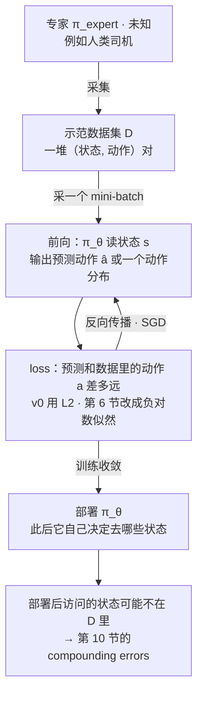
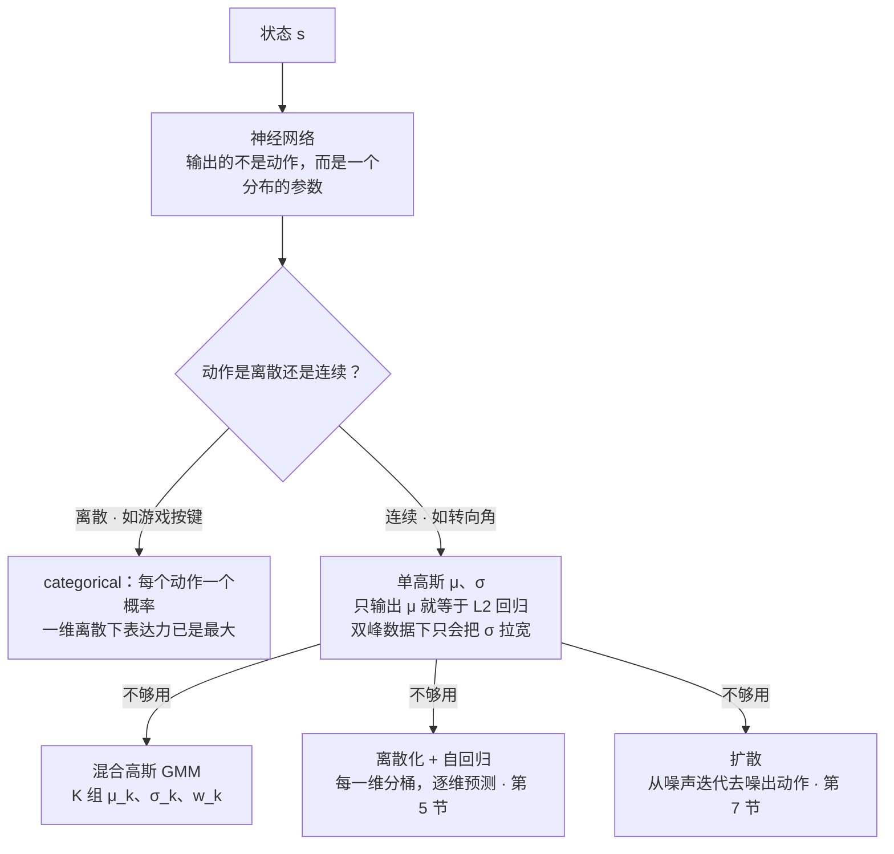
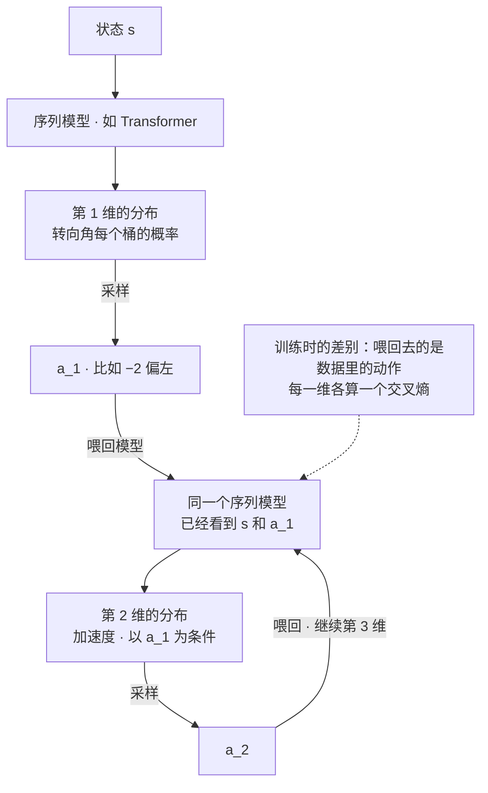
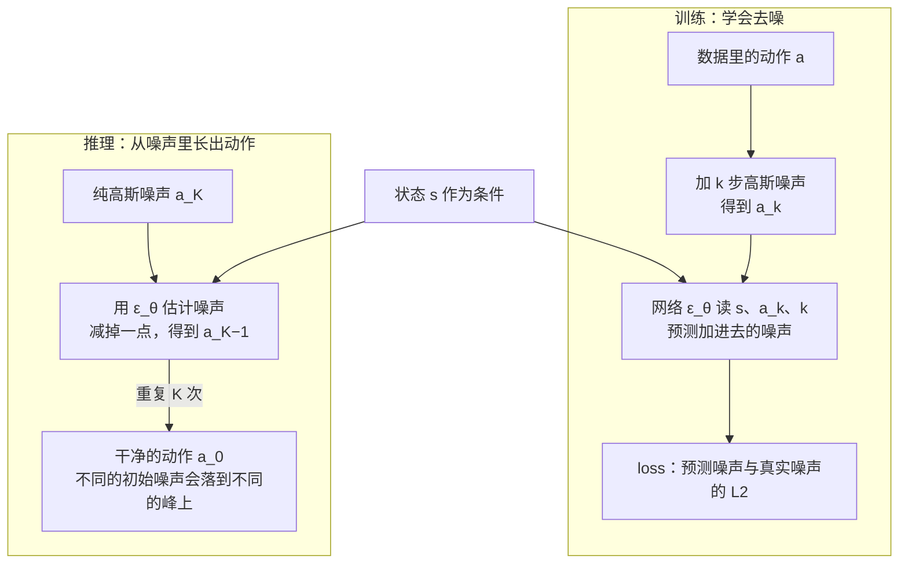
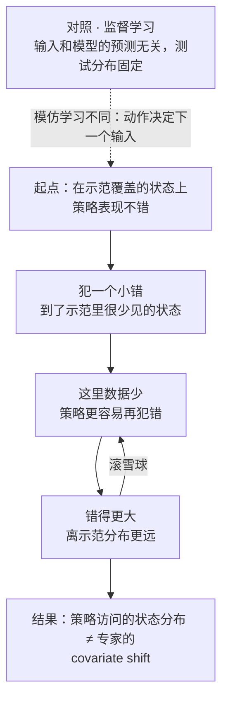
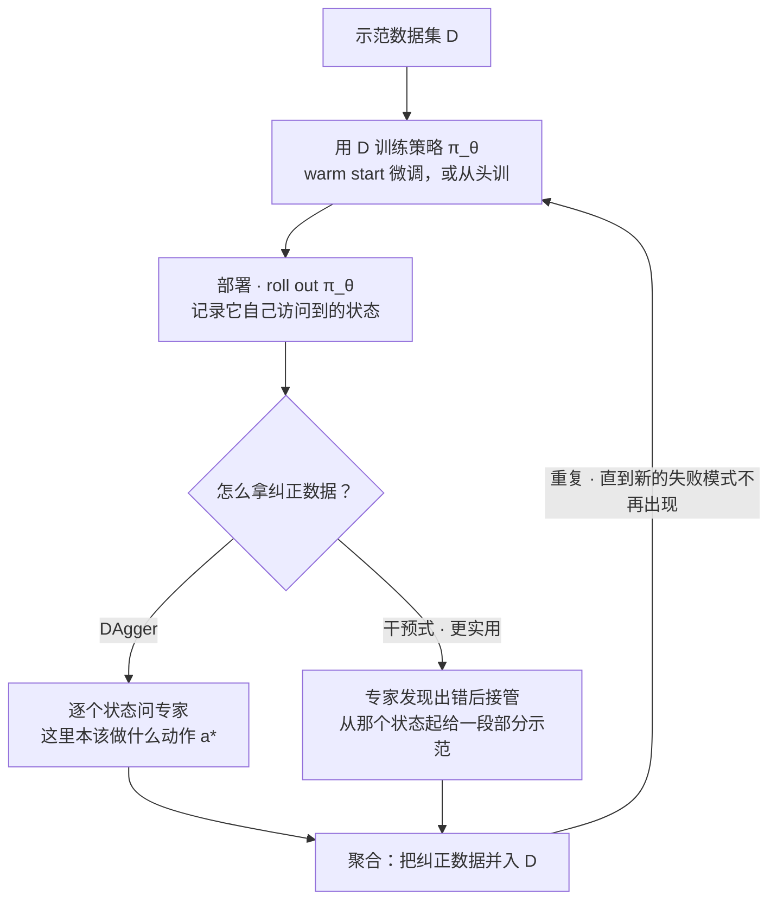

# CS224R 第 2 讲｜模仿学习（Imitation Learning）

> Stanford CS224R: Deep Reinforcement Learning（2025 春）· 第 2 讲，2025 年 4 月 4 日
> 视频：<https://www.youtube.com/watch?v=WxRDyObrm_M>（1:07:05，英文字幕是自动生成的，术语拼写错得不少，见文末勘误）
> 讲者：Chelsea Finn（课程主讲，不是客座）
> 课程主页：<https://cs224r.stanford.edu/> · 本讲指定阅读：[Diffusion Policy: Visuomotor Policy Learning via Action Diffusion](https://arxiv.org/abs/2303.04137)（Chi et al., 2023；v5 为 2024）

**一句话**：模仿学习不写奖励函数，直接把专家示范里的（状态, 动作）对当训练集做监督学习，这就是行为克隆。它有两个坑。第一，示范常常是多峰的——同一个路口有人直行、有人并线——用 L2 回归只能学到"平均动作"，所以策略必须输出一个足够有表达力的分布（categorical、混合高斯、离散化 + 自回归、扩散），再用最大似然去拟合；讲者用实验说明这一步能决定成败。第二，策略一旦部署，下一个状态由它自己的动作决定，一个小错会把它带到示范没覆盖的地方，错误越滚越大（compounding errors）；补救办法是让专家在策略自己访问到的状态上给纠正数据，也就是 DAgger，或者更实用的"专家接管"式干预。

## 时间轴

| 时间 | 内容 |
|---|---|
| [0:06](https://www.youtube.com/watch?v=WxRDyObrm_M&t=6s) | 开场：第 1 讲记号回顾（state / observation、action、trajectory、reward、policy）；今天的计划与学习目标 |
| [2:41](https://www.youtube.com/watch?v=WxRDyObrm_M&t=161s) | 问题设定：专家示范 D 来自未知的 π_expert，目标是追平专家；自动驾驶例子 |
| [4:13](https://www.youtube.com/watch?v=WxRDyObrm_M&t=253s) | Version 0：对专家动作做 L2 回归，训完直接部署 |
| [7:16](https://www.youtube.com/watch?v=WxRDyObrm_M&t=436s) | 什么会出错：直行 vs 并线，动作分布是双峰的，L2 只学到均值 |
| [11:29](https://www.youtube.com/watch?v=WxRDyObrm_M&t=689s) | 问答：为什么不直接查表做最近邻；多峰在多人采集的数据里很常见 |
| [14:35](https://www.youtube.com/watch?v=WxRDyObrm_M&t=875s) | 让网络输出分布的参数：离散动作用 categorical；单高斯为什么不够；问答：完美拟合多峰不会"犹豫"，目标是追平而不是超越 |
| [20:49](https://www.youtube.com/watch?v=WxRDyObrm_M&t=1249s) | 更有表达力的分布：借生成模型的思路；混合高斯 GMM；"表达力"到底指什么 |
| [25:54](https://www.youtube.com/watch?v=WxRDyObrm_M&t=1554s) | 离散化 + 自回归：转向角分桶、加速度以转向角为条件逐维预测；序列模型；维度顺序；为什么离散化 |
| [36:41](https://www.youtube.com/watch?v=WxRDyObrm_M&t=2201s) | 训练目标：最大化数据里动作的 log 概率；GMM 写密度求导；自回归逐维交叉熵，训练时喂数据里的动作 |
| [41:16](https://www.youtube.com/watch?v=WxRDyObrm_M&t=2476s) | 问答：离散化丢掉桶之间的距离、桶粒度是关键超参数；离散标签怎么反向传播 |
| [43:53](https://www.youtube.com/watch?v=WxRDyObrm_M&t=2633s) | 扩散策略：从噪声迭代去噪出动作；关键问题：把网络做大 + L2 不等于分布更有表达力 |
| [47:57](https://www.youtube.com/watch?v=WxRDyObrm_M&t=2877s) | 实证：Transport 任务 diffusion vs GMM、单人 vs 多人数据；真机挂衬衫 diffusion vs L1；业界大模型的选择 |
| [51:30](https://www.youtube.com/watch?v=WxRDyObrm_M&t=3090s) | 小结；offline 与 online 算法；模仿学习的优缺点；问答：大模型里除了课上讲的还有什么 |
| [55:10](https://www.youtube.com/watch?v=WxRDyObrm_M&t=3310s) | 什么会出错 II：和监督学习的根本差别；compounding errors；covariate shift |
| [58:17](https://www.youtube.com/watch?v=WxRDyObrm_M&t=3497s) | 解决办法：堆数据；收集纠正数据；DAgger 的循环；问答：纠正数据太窄会过拟合 |
| [1:03:24](https://www.youtube.com/watch?v=WxRDyObrm_M&t=3804s) | 从干预中学习：专家接管、给部分示范；自动驾驶安全员；上限仍是专家 |

## 核心内容

### 1. 问题设定：给我示范，我来模仿

- **第 1 讲的记号，这一讲全要用**（讲者开场先复习了一遍）：
    - **状态 s_t**（state）：能比较完整地描述"世界此刻什么样"的信息；如果只能看到一部分，叫**观测 o_t**（observation），比如摄像头的一帧。
    - **动作 a_t**（action）：每一步做出的决策，比如转向角和油门。
    - **轨迹 τ**（trajectory）：一段时间里 s_1, a_1, s_2, a_2, … 这样的序列，是"一段行为"的记录。
    - **奖励函数 r(s, a)**（reward）：给"在状态 s 做动作 a"打分，说这一步有多好。
    - **策略 π**（policy）：给定当前状态（或者观测的历史）决定做什么动作；它就是我们要学的东西。第 1 讲提过策略可以用生成模型来表示，今天会真正用上。
    - RL 的目标是让期望的累计奖励最大。今天讲的是达到这个目标的一条路——去模仿一个已经很好的策略。
- **模仿学习的设定**：手里有一批专家采集的轨迹，叫**示范**（demonstrations），记作 D，本质是一堆（状态, 动作）对。我们不知道专家用的是什么策略，只把 D 看成从一个未知的 π_expert 里采出来的样本；目标是学一个 π_θ，表现达到或接近专家。自动驾驶是贯穿全讲的例子：人开车大多数时候开得不错，记录传感器读数和转向、加速指令，就得到示范。
- **问答里两个关于目标的澄清**
    - 是不是默认专家在最大化某个奖励？——只假设专家"足够好"，不要求最优；现实里很多任务的最优策略根本没法指望。
    - 模仿学习能不能超过专家？——本讲所有方法的目标都是追平示范者。想超越，要靠之后的 RL（第 3 讲起），或者主动筛选数据，只留你认为更好的那部分。
- **学习目标**（讲者说这部分和课程主线有点"正交"，但没有它做不出能用的模仿学习系统）：怎么用神经网络表示一个分布而不是一个确定性函数；为什么表达力强的分布对模仿学习很重要；什么是 compounding errors，怎么治。
    > 小注：对做 LLM 的读者，SFT 就是文本上的模仿学习：状态是 prompt 加已生成的 token，动作是下一个 token，示范是人写的回答。CME295 第 4 讲的 SFT loss 正是本讲第 6 节那个负对数似然目标的特例。

### 2. Version 0：行为克隆就是监督回归

*图 2-1｜行为克隆的流水线：示范数据集上的监督学习，部署之后才和监督学习分道扬镳（自绘示意）· [▶ 看原幻灯片 6:16](https://www.youtube.com/watch?v=WxRDyObrm_M&t=376s)*

- **做法**：从 D 里采一个 mini-batch 的（s, a），把 s 喂给策略网络得到预测动作 â，让 â 尽量接近数据里的 a，对 D 里所有的对做这个最小化。训练就是普通的前向、算 loss、反向传播、用你喜欢的 SGD 变种迭代。训完直接部署——它应该会模仿数据里的动作。

$$
\min_{\theta}\;\sum_{(s,a)\in D}\big\|\pi_\theta(s)-a\big\|^{2}
$$

π_θ(s) 是策略网络对状态 s 输出的那一个动作，a 是示范者在同一状态下的动作；对数据集里每一对都算平方误差再相加。

- **这是确定性策略**：讲者当场改了幻灯片——原来写成从 π_θ 里采样，其实这一版的策略只输出一个动作，做的就是 L2 回归。而专家未必是确定性的，这就埋下了第 3 节的问题。
- 本讲把它叫 version 0；文献里的名字是**行为克隆**（behavior cloning，BC）。

### 3. 什么会出错 I：示范是多峰的，L2 只学得到均值

- **驾驶例子**：同一个路况，有的司机直行（转向角 0），有的并线到左边的快车道（转向角约 −2）。数据集里两种都有，直行的更多。把这个状态下的动作画成分布：直行的司机在 0 附近一个峰，并线的在 −2 附近一个峰，整个数据集是两个峰叠起来的**多峰分布**（multimodal）。
- **L2 回归学到什么**：均值——两个峰之间的某个转向角，车会骑在车道线上。而且这个动作在数据分布下本身概率很低，所以它不只是"看起来蠢"，在数学上也是一个差的选择。
- **问答**
    - 为什么不直接在数据里找最像的状态、照抄动作？——那是最近邻，在有些机器学习问题上可行；但车一上路就会遇到数据里没有的情形，没法照抄。（这一点到第 10 节会变成模仿学习的核心难题。）
    - 动作不是数值怎么办？——离散动作马上讲。
- **这在实践里常见吗**：讲者说"一直在发生"，尤其是数据由多个人采集时：每个人有自己的偏好和习惯，这些因素观测不到，同一个状态下自然有不同做法。只有当示范来自一个策略始终一致的专家时，确定性策略才够用。
- **自然的下一步**：既然示范本身是一个分布，能不能不只学均值，而是把整个分布学下来？

### 4. 让神经网络输出一个分布，而不是一个动作

*图 2-2｜策略头的几种分布类：网络输出的是分布的参数，表达力由分布类决定（自绘示意）· [▶ 看原幻灯片 15:37](https://www.youtube.com/watch?v=WxRDyObrm_M&t=937s)*

- **核心做法**：网络输入状态，输出的不是动作，而是**某个分布类的参数**；分布类越有表达力，能学到的分布就越丰富。所有参数都隐含地依赖状态——同一个网络在有的状态下输出多峰分布，在有的状态下输出单峰分布（问答里有人确认了这一点）。
- **离散动作**：比如玩超级马里奥，动作是上、下、A、B、右这几个键。网络输出每个动作的概率，就是一个 **categorical 分布**，训练相当于分类。在一维离散动作上它是"最大表达力"的：没有任何动作分布是它表示不了的。可惜世界上大多数动作不是一维离散的。
- **连续动作**：最自然的是高斯分布。只输出均值 μ，就等价于 L2 回归；再让它输出方差也没用——在双峰数据上它只会把方差撑大去盖住两个峰，还是不像样。所以要换更有表达力的分布类。
- **"表达力"是什么意思**（问答）：一个分布类能**完美**表示的分布有多少。只用高斯就只能完美表示高斯；混合高斯能表示任何单个高斯，也能表示任何"若干高斯叠加"的分布，所以严格更强。不同分布类之间有时不好比，但 GMM 对高斯是严格包含。
- **问答：完美建模了双峰分布，策略会不会"犹豫不决"，一会儿选这个峰、一会儿选那个？**——只要状态表示够好就不会：一旦采样到并线并开始向左，速度朝左这件事已经写进了状态，下一步的条件分布会集中在"继续向左"上。好的示范加好的状态表示，再把分布拟合好，出来的就是好策略。
- **借生成模型的思路**：图像扩散模型能生成彼此完全不同的人脸和视频，语言模型一个 token 一个 token 地预测——两者都远比"输出均值和方差"或"一维 categorical"有表达力。它们通常用来建模"给定文字的图像"或"给定前文的下一个词"，但底层技术是通用的，同样可以拿来学给定状态的动作分布 p(a | s)。本讲讲三种：混合高斯、离散化 + 自回归、扩散。
- **混合高斯（GMM）**：网络输出 K 组参数，每组是一个高斯的均值、标准差和权重。K 要事先定，当超参数调，看不同 K 拟合得好不好。

$$
\pi_\theta(a\mid s)=\sum_{k=1}^{K} w_k(s)\,\mathcal{N}\big(a;\,\mu_k(s),\,\sigma_k(s)^{2}\big),\qquad \sum_{k=1}^{K} w_k(s)=1
$$

K 个高斯各有自己的均值 μ_k、标准差 σ_k 和权重 w_k，三者都是网络读入 s 之后输出的；权重非负且加起来是 1，所以整体仍是一个合法的概率密度。

### 5. 离散化 + 自回归：像语言模型一样一维一维地出动作

*图 2-3｜自回归策略：逐维出分布、采样、喂回，和语言模型逐词生成同构（自绘示意）· [▶ 看原幻灯片 32:34](https://www.youtube.com/watch?v=WxRDyObrm_M&t=1954s)*

- **什么时候用**：动作本来就是离散的但有多个维度；或者动作连续且多维——先离散化（tokenize），再上自回归模型。
- **简化的驾驶例子**：动作有两维，转向角和加速度。
    1. **离散化**：转向角的真实分布高斯画不出来，就把角度切成若干桶，网络给每个桶输出一个概率，得到一个"阶梯"形的近似。桶切得越细越像原分布，但要输出的数也越多——这是个权衡。
    2. **自回归**：加速度要以转向角为条件——并线时因为要插进左边的车流，通常要加速；直行则倾向保持车速。所以先输出转向角的分布，采样一个 a_1（比如 −2），把 a_1 喂回模型，再输出以它为条件的加速度分布：条件是 −2 时，高加速度的概率大；条件是 0 时，分布落在小加速度上。第三维同理，以前两维为条件——用序列模型（比如 Transformer）的话，它天然看到之前所有的维度。
- **和语言模型完全同构**：起始 token → 下一个词的分布 → 采样 → 喂回 → 再下一个词。只是这里迭代的是动作的各个维度，不是句子里的词。

$$
\pi_\theta(a\mid s)=\prod_{d=1}^{D}\pi_\theta\big(a_d\mid s,\,a_{1},\dots,a_{d-1}\big),\qquad
\mathcal{L}_{\mathrm{AR}}(\theta)=-\sum_{d=1}^{D}\log\pi_\theta\big(a_d^{\mathrm{data}}\mid s,\,a_{1}^{\mathrm{data}},\dots,a_{d-1}^{\mathrm{data}}\big)
$$

a_d 是动作的第 d 维（离散化之后是一个桶的编号），每个因子都是一个 categorical 分布；loss 是各维交叉熵之和，条件里用的是数据里的动作 a^data，测试时才换成自己采样的。

- **问答**
    - 维度顺序怎么定？——语言里词序天然存在；动作维度的顺序一般手工挑，也可以当超参数；有时有自然的选择，比如机械臂沿运动链（kinematic chain）从基座依次到各关节。好消息是表达力不随顺序变：你表示的始终是所有维度的联合分布，一维一维出只是因为一次性预测整个联合分布要输出的格子数是桶数的维度次方（每维 100 个桶、10 维动作就已经爆炸），逐维分解便宜得多。
    - 用自回归是不是就必须离散化？——离散化有两个好处：每个桶的高度随意，能表示比混合高斯复杂得多的多峰分布（上限只受桶粒度限制）；自回归则负责解决高维带来的组合爆炸。原则上自回归也能配 GMM 或高斯，只是既然都用自回归了，离散化通常是更有力的选择，所以不常见。
    - 训练数据怎么造？——采一对（s, a），按分桶策略把 a 的每一维映射到桶，每一维用交叉熵 loss，等于每一维做一次分类。
    - 交叉熵不知道"隔壁桶"和"隔十个桶"的差别？——这是离散化的一个缺点。实践中这种距离关系学得挺快，结果通常没问题，但可能需要更多数据；桶的粒度是非常重要的超参数——切太细，稍微偏一个桶就算全错，信号很难学到。更进一步可以做标签平滑，让标签不是一个 one-hot，而是在邻近的桶上也分一点。
    - 离散的东西怎么反向传播？——离散的只是标签；网络输出的是每个桶的概率（连续值），交叉熵直接对它求导，和分类问题一样。只有权重本身离散时反向传播才有麻烦。
    > 小注：训练时喂数据里的动作、推理时喂自己采样的动作，这套做法在序列建模里叫 teacher forcing，讲者描述了做法但没用这个词。两者不一致带来的问题（exposure bias）和第 10 节的 compounding errors 是同一种病。

### 6. 训练目标：让数据里的动作在你的策略下概率最大

$$
\min_{\theta}\;-\,\mathbb{E}_{(s,a)\sim D}\big[\log\pi_\theta(a\mid s)\big]
$$

(s, a) 从示范数据集 D 里采，π_θ(a | s) 是正在学的策略给这个"专家动作"的概率；取 log、加负号变成最小化，就是负对数似然。

- **所有生成式策略共用的目标**：网络输出的是分布，就应该让数据里出现的动作在这个分布下的概率尽量大。训练循环不变：采（s, a），前向得到分布，算 −log π_θ(a | s)，反向传播。
- **不同模型里这一项长什么样**
    - GMM：直接写出第 4 节的密度函数，对网络输出的 μ_k、σ_k、w_k 求导。
    - 离散化 + 自回归：第 5 节的逐维交叉熵，每一维一个 categorical 的负对数似然相加。
    - 扩散：似然写不出来，改用第 7 节的去噪目标。
- 讲者的幻灯片把这个式子写成对示范数据的期望，蓝色标出的是"示范里的动作"：概率是在正在学的策略下算的，动作是专家的。拟合得越好，策略和专家的行为越接近，任务表现也越好。
    > 小注：L2 回归其实是这个目标的一个特例——把 π_θ(a | s) 取成方差固定的高斯，−log 密度就只剩 ‖μ_θ(s) − a‖² 加常数。所以 version 0 不是另一个目标，而是同一个目标配了最没表达力的分布类。CME295 第 4 讲的 SFT 交叉熵、第 5 讲奖励模型的 −log σ(分差)，形式上也都是负对数似然。

### 7. 扩散策略；把网络做大不等于把分布做宽

*图 2-4｜扩散策略：训练学的是"猜噪声"，推理靠迭代去噪把噪声变成动作（自绘示意）· [▶ 看原幻灯片 43:53](https://www.youtube.com/watch?v=WxRDyObrm_M&t=2633s) · 出处：[Chi et al., 2023](https://arxiv.org/abs/2303.04137)*

- **扩散**（diffusion）：连续动作的另一个好选择，尤其是高维连续动作——图像也是高维连续变量，扩散模型在那里已经证明了自己。做法是**去噪**：从一团纯噪声出发，一步一步把它变得更不像噪声，最终得到一个干净的动作。
- **两种迭代**：自回归和扩散都是迭代式的，区别在迭代的方向——自回归沿着动作的维度迭代，扩散沿着去噪步数迭代。
- **课堂上的关键问题**：这些分布类都没改网络结构。那能不能还用 L2，只把网络做大？大网络不是更有表达力吗？——学生答对了：在驾驶例子里，网络再大，输出的还是均值，只是均值估得更准。这里有两种彼此独立的表达力：**函数的表达力**（从 s 到参数能表示多少种映射）和**分布的表达力**（这些参数能刻画多少种分布）。只输出 μ、σ 的网络可以把 s 到 (μ, σ) 的映射学得极其复杂，但它能表示的分布永远是一个高斯。

$$
a^{k-1}=\alpha\big(a^{k}-\gamma\,\varepsilon_\theta(s,\,a^{k},\,k)\big)+\mathcal{N}(0,\sigma^{2}I),\qquad k=K,\dots,1
$$

这是一步去噪：a^k 是第 k 步的带噪动作，ε_θ 是读入状态 s、当前带噪动作和步数 k 后预测噪声的网络，α、γ、σ 是按步数预先定好的系数；从纯噪声 a^K 出发做 K 步就得到动作 a^0。

$$
\mathcal{L}_{\mathrm{diff}}(\theta)=\mathbb{E}_{(s,a^{0})\sim D,\;k,\;\varepsilon^{k}}\Big\|\varepsilon^{k}-\varepsilon_\theta\big(s,\,a^{0}+\varepsilon^{k},\,k\big)\Big\|^{2}
$$

训练时随机挑一个步数 k，给数据里的动作 a^0 加上对应量级的噪声 ε^k，让网络把这团噪声猜出来；loss 就是猜的噪声和真噪声的平方误差。

> 小注：上面两个式子出自指定阅读 Diffusion Policy 论文，课上只讲了直觉。论文把每一步去噪解释成沿动作分布的 score（对数密度的梯度）走一步 Langevin 动力学，多峰分布因此天然能被表示：不同的初始噪声落到不同的峰上。论文报告在 4 个基准的 12 个任务上平均提升 46.9%，并给了三项落地技术——receding horizon（每次预测一段动作序列、只执行前几步）、视觉条件化、时序扩散 Transformer。

### 8. 实证：表达力值多少，业界怎么选

- **仿真：Transport 任务**。两台机械臂，把一个工具从一台传到另一台，一个策略同时控制两台。比较 diffusion 和 GMM（diffusion 的表达力远超 GMM），各在两份数据上训：一份由一个人采集，一份由多个人采集，指标是成功率。结果：diffusion 在两份数据上都不错，多人数据上略降——数据越多样，难度越高；GMM 首先整体不如 diffusion，其次在多人数据上掉得多得多。两个结论：表达力有用；数据里的行为越多样，表达力越关键。
    > 小注：这组结果应出自 Diffusion Policy 论文的 robomimic 实验：Transport 任务的两份数据分别是 ph（一位熟练操作者）和 mh（多位操作者），GMM 对照应为 robomimic 自带的 LSTM-GMM 策略。
- **真机：把衬衫挂上衣架**。任务本身很难，数据集很大——规模一上去就没法由一个人用一致的策略采完，所以是很多人、很多种做法。比较 diffusion 和 L1 loss（后者是确定性策略）。总体成功率不如仿真任务，但结论一致：换成 L1，成功率掉了接近一半。
    > 小注：应为 ALOHA Unleashed（Zhao et al., 2024，讲者是合著者）：ALOHA 2 双臂平台上的大规模示范加 Diffusion Policy，挂衣架是其中一个真机任务。
- **问答：有没有场景想用"其他分布的混合"而不是混合高斯？**——其他分布往往本身已经够有表达力，讲者没见过，但也不是完全不可想象。
- **业界的大模型都建在这些基础上**：机器人领域 NVIDIA、Figure、Physical Intelligence 的基础模型，以及开源的视觉-语言-动作模型（VLA），都是大规模示范数据配表达力强的分布；自动驾驶里 Waymo 和 Wayve 的模型用的是离散化 + 自回归预测。
    > 小注：讲者没点论文名，推断分别指 GR00T N1、Helix、π0 和 OpenVLA；其中 OpenVLA 把动作离散成 token 走自回归，π0 和 GR00T N1 用 flow matching（扩散的近亲）。Waymo 的应为 EMMA，把轨迹写成文本 token 让多模态大模型自回归生成。
- **问答：这些大模型里除了课上讲的还有什么？**——不止这些。第一个例子的功夫花在数据筛选和模型架构上；NVIDIA 的人形机器人数据很难采，重点在怎么用仿真数据；Figure 的架构设计是为了让模型跑在很高的控制频率上；OpenVLA 也有不少架构选择；此外还有各种联合训练目标。但今天讲的内容是这些系统背后最主要的驱动力。

### 9. 小结：什么时候要分布；offline 还是 online

- **小结**：示范来自一个行为一致的人，学单峰策略就够；示范来自多个人、多峰，就要学分布，而且要用表达力强的生成模型。
- **这套算法是完全 offline 的**——这是 RL 里非常重要的一对概念：
    - **offline 算法**只用一份现成的数据集，不从正在学的策略那里拿任何新数据。
    - **online 算法**会用学到的策略去采新数据。代价有两条：边学边采，贵；策略没练好时上线可能不安全，比如医疗场景你不会想让半成品策略去收数据。
    > 小注：offline / online 说的是"学习过程中要不要和环境交互"，和 CME295 里见过的 on-policy / off-policy 不是一回事：后者说的是"训练用的数据是不是当前策略生成的"。online 的 RL 既可以是 on-policy（只用当前策略刚采的数据，第 3、4 讲），也可以是 off-policy（把旧数据存进 replay buffer 反复用，第 5、6 讲）；完全不交互的 offline RL 是第 7 讲。行为克隆是 offline 的，数据来自专家而非当前策略，也就天然是 off-policy 的。
- **模仿学习的优点**：不需要策略自己采数据（offline）；不需要写奖励函数——第 1 讲说过驾驶这类任务的奖励很难写全，这里完全绕开。
- **缺点**：要想可靠，往往需要非常多的示范。这就引出了后半讲：从在线的纠正和干预中学习。
- 讲者原计划"时间允许的话"再讲怎么采集示范，这一讲没讲到。

### 10. 什么会出错 II：错误会滚雪球

*图 2-5｜compounding errors：一个小错把策略推离示范分布，数据越稀错越大（自绘示意）· [▶ 看原幻灯片 55:40](https://www.youtube.com/watch?v=WxRDyObrm_M&t=3340s)*

- **和监督学习的根本差别**：监督学习用一份固定的数据集，模型的输入和它自己的预测无关。模仿学习不是——策略的动作决定它下一步会看到什么状态。
- **滚雪球的过程**：把一条示范想成一串状态点。策略从起点出发，一开始表现不错；但它不可能完美，某一步犯了个小错，跑到了示范附近但没被覆盖的状态。这个状态在数据里很少见，于是策略在这里更容易再犯错，错了就离示范更远，数据更稀，错得更大……这就是 **compounding errors**。
- **结果**：策略实际访问的状态分布，和专家访问的状态分布不一样。这叫 **covariate shift**，是分布偏移的一种。它让模仿学习从根本上区别于监督学习，也直接拖低表现。
- **和前几节的关系**：分布拟合得不好（比如只学均值），就更容易迈出第一个错步；但就算拟合得很好，也还是会犯错、会漂移。所以表达力缓解不了这个问题的根源。
    > 小注：这条直觉有定量版本（应为 Ross & Bagnell, 2010 和下一节的 DAgger 论文）：单步错误率为 ε 时，行为克隆在长度 T 的轨迹上的期望代价可以差到 ε·T² 量级，而 DAgger 能把它压回 ε·T 量级。CME295 第 5 讲说 DPO 吃现成偏好对会有分布偏移、PPO 在线采样没有，本质上是同一件事。

### 11. DAgger 与从干预中学习

*图 2-6｜DAgger 与干预式学习共用一个循环，差别只在纠正数据怎么来（自绘示意）· [▶ 看原幻灯片 1:00:53](https://www.youtube.com/watch?v=WxRDyObrm_M&t=3653s) · 出处：[Ross et al., 2011](https://arxiv.org/abs/1011.0686)*

- **最笨的办法**：堆数据、训到底、祈祷。如果有这个条件，讲者说这并不算坏。
- **更受欢迎的办法：收集纠正数据**（corrective data）。策略开始跑偏时，记录"在这个状态下正确的动作是什么"。把这些纠正数据和原始示范合在一起重训，策略就有了"犯错之后怎么回来"的例子——关键在于纠正是在**策略自己访问到的状态**上收集的，正好补上 covariate shift 造成的空洞，把数据覆盖的状态分布拓宽到"专家会去的地方"加"策略犯错后会去的地方"。
- **DAgger 的循环**（Dataset Aggregation；讲者说这名字起得很糟，但术语得认识）
    1. 用当前策略 roll out，记下它访问的状态；
    2. 在这些状态上向专家查询"本该做什么"，得到 a*；
    3. 把这些（s, a*）**聚合**进原数据集；
    4. 在聚合后的数据上更新策略——通常从原策略 warm start 微调，担心偏差也可以从头训；
    5. 重复：新策略可能以新的方式失败，再针对它收纠正数据。
- **DAgger 的代价**：数据效率高，但"查询专家"可能很难做到——要拿着策略走过的一串 s_1, a_1, s_2, a_2, …，逐个状态问人"这里转向角本该是多少"，很多场景下人给不出这种逐步的动作标签。
- **干预式：让专家接管**。不逐状态问，而是让策略跑，专家看到出错就整个接过控制（比如直接开车），从那个状态起给一段**部分示范**；把这些部分示范聚合进数据集、更新策略、重复。
    - 什么时候算"出错"是主观的，由示范者决定；通常要主动一点，在撞上之前就接管。
    - 缺点：有些错来得又快又不可预测（比如动作突然大变），人来不及接；最适合的是漂移得慢的错误，比如慢慢滑向隔壁车道时把它拉回来。
    - 现实中自动驾驶公司就是这么干的：让策略开，安全员在策略"卡住不动"或开始犯错时接管。也出过安全员没能阻止严重事故的案例——把"防大错"寄托在示范者身上有风险，但作为提供纠正的交互方式它很实用，对性能提升很大。
    - 问答：不管哪种办法，策略的上限都是专家。
    > 小注：接管式的变体文献里叫 HG-DAgger（human-gated DAgger，Kelly et al., 2019），提出动机正是讲者说的两点：逐状态标注时人没有真正在控制系统，标签质量差，也不安全。DAgger 原文是 Ross, Gordon & Bagnell, 2011。
- **问答：纠正数据太窄会不会过拟合？**——会。原始示范来自全美各地，纠正数据只在 Stanford 校园采，合并后策略可能只在校园那种场景里学会纠正，还可能整体向校园数据过拟合。纠正数据要在不比原数据窄的、足够多样的场景里采。
- **往后看**（按课程目录推断）：第 8 讲 Reward Learning 应会讲另一条从示范出发的路——不克隆动作，而是从示范里反推奖励再做 RL；第 15 讲会回到模仿学习与分层策略；第 16、17 讲的机器人内容会大量用到本讲的方法。

## 关键图表速查（点时间戳跳到原幻灯片）

| 图 | 看什么 | 跳转 | 出处 |
|---|---|---|---|
| 模仿学习问题设定 | 示范 D 是（状态, 动作）对，来自未知的 π_expert；目标是学 π_θ 追平专家 | [2:41](https://www.youtube.com/watch?v=WxRDyObrm_M&t=161s) | — |
| 直行 vs 并线的三条曲线（板书） | 两个子群各一个峰，合起来是双峰；L2 的均值落在两峰之间、概率很低 | [8:53](https://www.youtube.com/watch?v=WxRDyObrm_M&t=533s) | — |
| 幻灯片版多峰示意 | 黄色直行、蓝色并线、黑色虚线是合并数据；确定性策略选在黑线的均值 | [12:30](https://www.youtube.com/watch?v=WxRDyObrm_M&t=750s) | — |
| 网络输出分布参数（板书） | 状态 → 网络 → 分布的参数 → 分布；表达力取决于最上面那层分布类 | [15:07](https://www.youtube.com/watch?v=WxRDyObrm_M&t=907s) | — |
| 离散化的阶梯分布（板书） | 转向角分桶后每桶一个概率；桶越细越像原分布但输出越多 | [28:32](https://www.youtube.com/watch?v=WxRDyObrm_M&t=1712s) | — |
| 序列模型逐维出动作（板书） | 采样 a_1 喂回模型再出 a_2 的分布，和语言模型逐词生成同构 | [32:34](https://www.youtube.com/watch?v=WxRDyObrm_M&t=1954s) | — |
| 负对数似然目标（板书） | 所有生成式策略共用的目标：让数据里的动作概率最大 | [38:12](https://www.youtube.com/watch?v=WxRDyObrm_M&t=2292s) | — |
| 三种生成式策略一页 | 离散化自回归逐维预测的示意，以及扩散从噪声去噪到动作 | [43:53](https://www.youtube.com/watch?v=WxRDyObrm_M&t=2633s) | [Diffusion Policy](https://arxiv.org/abs/2303.04137) |
| Transport 成功率柱状图 | diffusion vs GMM、单人 vs 多人数据；GMM 在多人数据上掉得最狠 | [47:57](https://www.youtube.com/watch?v=WxRDyObrm_M&t=2877s) | 应出自 [Diffusion Policy](https://arxiv.org/abs/2303.04137) |
| 真机挂衬衫对比 | 多人采集的大数据集上 diffusion vs L1；L1 成功率掉近一半 | [49:28](https://www.youtube.com/watch?v=WxRDyObrm_M&t=2968s) | 应为 [ALOHA Unleashed](https://arxiv.org/abs/2410.13126) |
| 业界大模型一页 | 机器人基础模型与 Waymo、Wayve 驾驶模型各自的动作分布选择 | [50:29](https://www.youtube.com/watch?v=WxRDyObrm_M&t=3029s) | — |
| compounding errors 板书 | 小错 → 罕见状态 → 更大的错；策略访问的状态分布偏离示范 | [55:40](https://www.youtube.com/watch?v=WxRDyObrm_M&t=3340s) | — |
| DAgger 算法一页 | roll out → 查询专家 → 聚合 → 更新 → 重复；绿色是专家在策略状态上的动作 | [1:00:53](https://www.youtube.com/watch?v=WxRDyObrm_M&t=3653s) | [Ross et al., 2011](https://arxiv.org/abs/1011.0686) |
| 从干预中学习一页 | 专家接管后给部分示范，聚合后更新；和 DAgger 的差别只在怎么拿纠正数据 | [1:04:25](https://www.youtube.com/watch?v=WxRDyObrm_M&t=3865s) | 应为 [HG-DAgger](https://arxiv.org/abs/1810.02890) |

## 提到的工作

| 名称 | 在本讲里的作用 |
|---|---|
| 第 1 讲的记号：state / observation、action、trajectory、reward、policy | 开场回顾；今天全部用上 |
| Behavior cloning（L2 / L1 回归） | version 0：对专家动作做监督回归；实验里作为 L1 对照 |
| 自动驾驶示范；Super Mario | 贯穿全讲的连续动作例子；离散动作的例子 |
| 高斯 / 混合高斯（GMM） | 连续动作的分布类：单高斯不够，GMM 严格更强，K 是超参数 |
| 图像 / 视频扩散模型；自回归语言模型 | 生成模型的两个例子，说明同样的技术能建模 p(a∣s) |
| Transformer | 自回归策略里用的序列模型 |
| 标签平滑（label smoothing） | 缓解离散化后交叉熵不知道桶间距离的办法 |
| [Diffusion Policy](https://arxiv.org/abs/2303.04137)（Chi et al., 2023） | 指定阅读；扩散策略；Transport 实验应出自此文 |
| [ALOHA Unleashed](https://arxiv.org/abs/2410.13126)（Zhao et al., 2024） | 应为真机挂衬衫 diffusion vs L1 的出处 |
| NVIDIA、Figure、Physical Intelligence 的机器人基础模型；开源 VLA | 大规模示范加表达力强的分布的工业实例（推断：GR00T N1、Helix、π0、[OpenVLA](https://arxiv.org/abs/2406.09246)） |
| Waymo、Wayve 的驾驶模型 | 离散化 + 自回归动作预测的例子（Waymo 的应为 EMMA，推断） |
| [DAgger](https://arxiv.org/abs/1011.0686)（Ross, Gordon & Bagnell, 2011） | 在策略访问的状态上查询专家、聚合数据、重训 |
| [HG-DAgger](https://arxiv.org/abs/1810.02890)（Kelly et al., 2019；应为） | 专家接管、给部分示范的干预式变体 |
| 自动驾驶安全员 | 干预式学习在工业界的现实版本，也有失败案例 |
| Offline RL（第 7 讲） | offline / online 的区分在后面课程里反复出现 |

## 术语对照

| English | 中文 |
|---|---|
| imitation learning | 模仿学习：从专家示范里学策略，不需要奖励函数 |
| demonstration（D） | 示范：专家采集的轨迹，一堆（状态, 动作）对 |
| expert policy π_expert | 专家策略：生成示范的那个未知策略 |
| state / observation | 状态 / 观测：完整的世界描述 / 只看到其中一部分 |
| action / trajectory | 动作 / 轨迹：每步的决策 / 一段状态与动作的序列 |
| reward function | 奖励函数：给（状态, 动作）打分；模仿学习不需要它 |
| policy π_θ | 策略：给定状态（或观测历史）输出动作或动作分布，θ 是网络参数 |
| behavior cloning (BC) | 行为克隆：对示范做监督学习 |
| supervised regression / L2 loss / L1 loss | 监督回归 / 平方误差 / 绝对误差；两者训出的都是确定性策略 |
| deterministic / stochastic policy | 确定性 / 随机策略：输出一个动作 / 输出一个分布 |
| multimodal distribution | 多峰分布：同一状态下有几种不同的合理做法 |
| expressiveness / expressive distribution class | 表达力：一个分布类能完美表示的分布有多少 |
| categorical distribution | 类别分布：每个离散动作一个概率，一维离散时表达力最大 |
| Gaussian / mixture of Gaussians (GMM) | 高斯 / 混合高斯：K 个高斯按权重叠加 |
| discretize / tokenize / bin | 离散化 / 词元化 / 分桶：把连续动作切成有限个桶 |
| autoregressive model | 自回归模型：一维一维地出，后一维以前面的为条件 |
| cross-entropy loss | 交叉熵：分类的标准 loss，等于 categorical 的负对数似然 |
| label smoothing | 标签平滑：one-hot 标签在邻近桶上也分一点概率 |
| kinematic chain | 运动链：机械臂从基座到末端的关节顺序 |
| diffusion model / denoising | 扩散模型 / 去噪：从噪声迭代生成 |
| negative log-likelihood (NLL) / maximum likelihood | 负对数似然 / 最大似然：让数据在模型下的概率最大 |
| generative model | 生成模型：能表示并采样一个复杂分布的模型 |
| vision-language-action model (VLA) | 视觉-语言-动作模型：吃图像和语言、吐动作的机器人基础模型 |
| success rate | 成功率：机器人任务的常用指标 |
| offline / online algorithm | 离线 / 在线算法：只用现成数据 / 用学到的策略去采新数据 |
| compounding errors | 错误累积：小错把策略带到没数据的状态，接着错得更多 |
| covariate shift / distribution shift | 协变量偏移 / 分布偏移：策略访问的状态分布和专家不一样 |
| corrective data | 纠正数据：在策略自己访问的状态上由专家给的正确动作 |
| DAgger (dataset aggregation) | 数据集聚合：roll out → 查询专家 → 聚合 → 重训 |
| intervention / partial demonstration | 干预 / 部分示范：专家接管后从当前状态起给的一段示范 |
| safety driver | 安全员：自动驾驶测试里随时准备接管的人 |
| warm start / fine-tune | 热启动 / 微调：从上一版策略继续训而不是从头训 |
| overfitting / generalization | 过拟合 / 泛化 |

## 字幕勘误

"decision-m problem" → decision-making problem；"gausian / gausion" → Gaussian；"DMM" → GMM；"auto reggressive / autogressive" → autoregressive；"stoastic" → stochastic；"den noiseise" → denoise；"covariant shift" → covariate shift；"dagger" → DAgger；"Whimo" → Waymo；"Wave" → Wayve；"open VA" → OpenVLA；"PI" → Physical Intelligence（π）；"L2 law" → L2 loss；"discreet" → discrete；"lay the way from" → lead away from；"PBS" → p of s（专家的状态分布）；"code training" → co-training；"a T1 / a T2" → a_1、a_2（动作的第一、二维）；"oftenimes" → oftentimes。

## 带走的问题

1. LLM 的 SFT 就是行为克隆，那 compounding errors 在 LLM 上对应什么？（训练时喂真实前文、推理时喂自己生成的 token，错一个 token 后面全在没见过的前文上继续。）RLHF 的在线采样为什么能缓解？这和 CME295 第 5 讲里 DPO 的分布偏移是不是同一回事？
2. categorical 在一维离散动作上"表达力最大"，语言模型的动作正是一个 token——所以它从不需要 GMM 或扩散。把这个逻辑反推到机器人：什么时候离散化 + 自回归就够，什么时候必须上扩散？桶粒度、动作维度和控制频率各起什么作用？
3. DAgger 假设专家能在策略访问到的任意状态上给出动作。在你做的 agent 产品里，"专家"是谁？用户的重试、编辑、手动接管算不算干预式纠正数据？怎么避免"纠正数据只在 Stanford 校园采"式的过拟合？
4. 讲者说完美拟合多峰分布加上好的状态表示就够了。如果状态表示不好——比如只看当前一帧、看不出已经开始并线——策略会怎样？这和第 1 讲里 observation 与 state 的区别、以及"以观测历史为条件的策略"有什么关系？
5. 自回归和扩散都是迭代过程，一个迭代在动作维度上，一个迭代在去噪步上。对需要高频控制的机器人，两者的推理延迟各意味着什么？Diffusion Policy 论文的 receding horizon（一次预测一段动作、只执行前几步）是怎么摊薄这个成本的，又会带来什么新问题？
