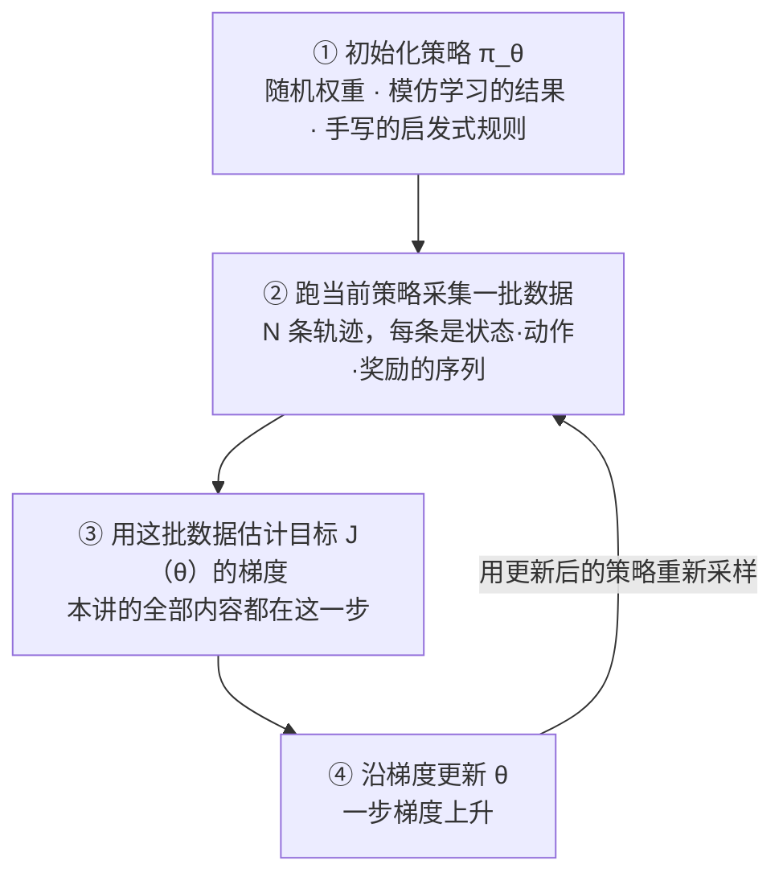
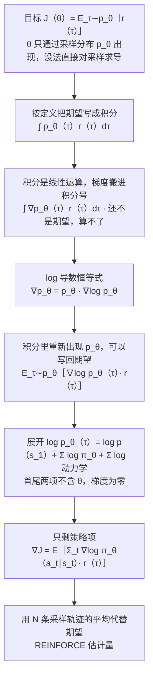
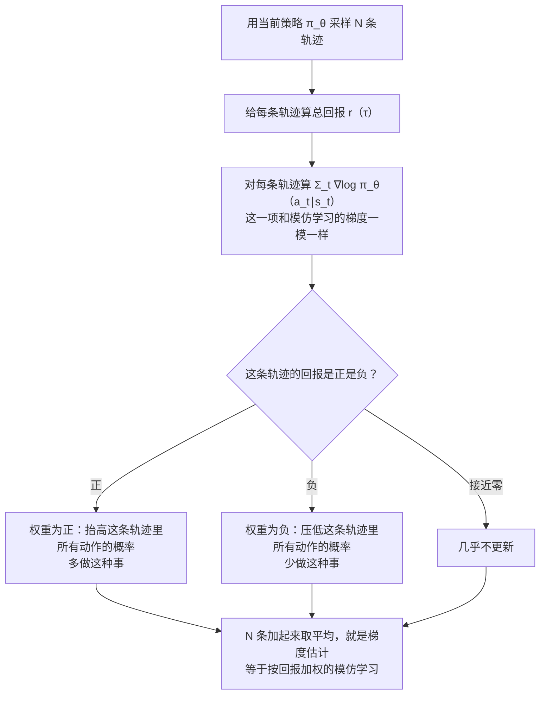
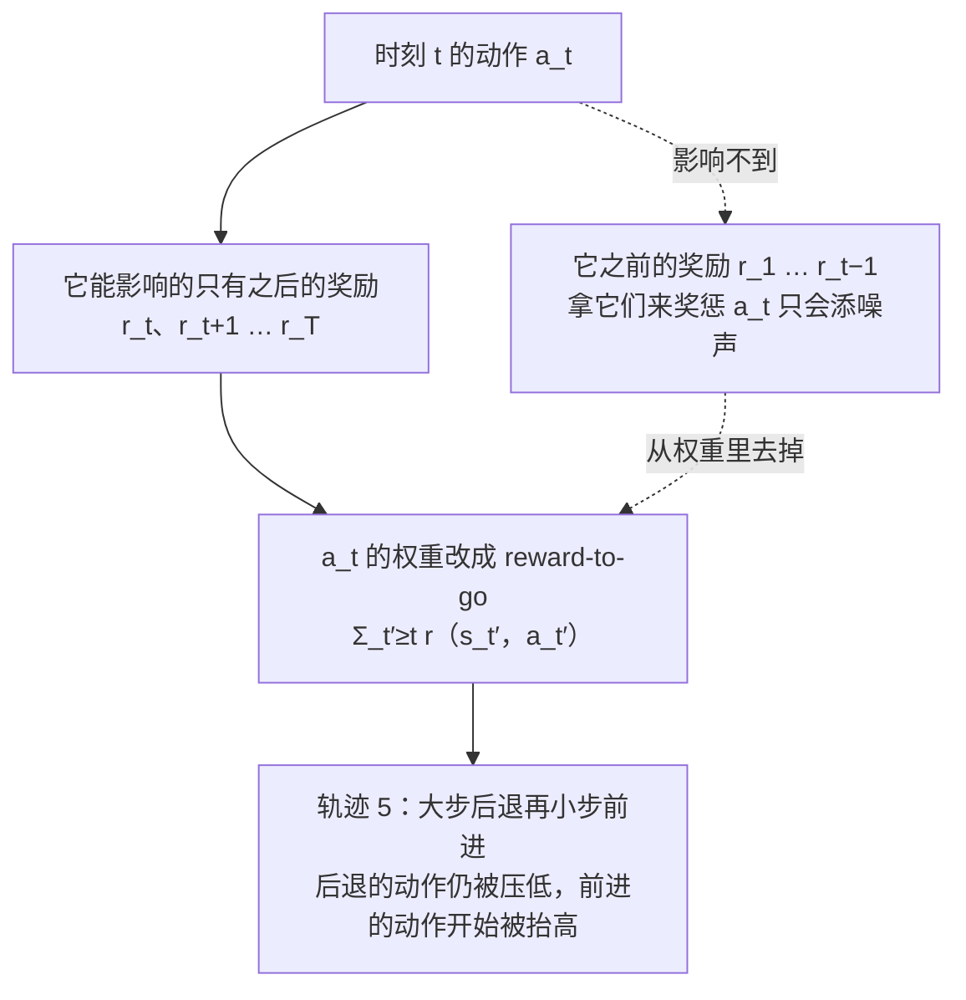
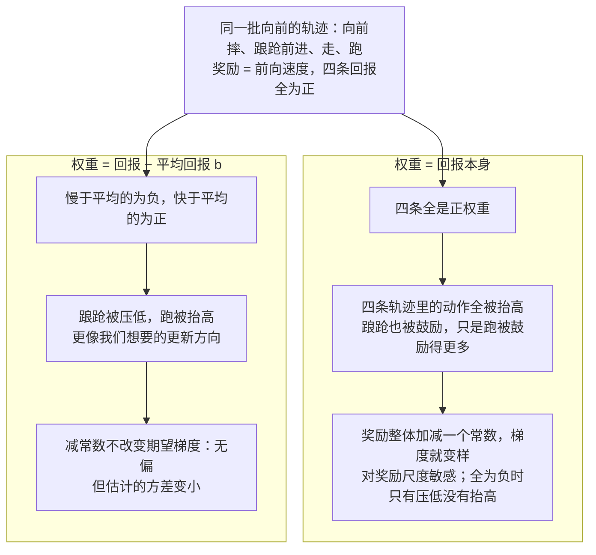
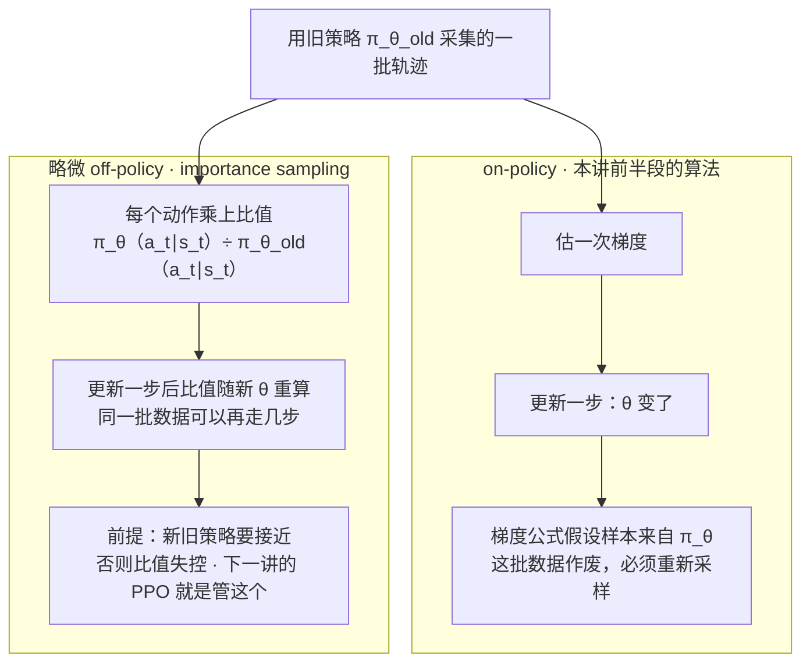

# CS224R 第 3 讲｜策略梯度（Policy Gradients）

> Stanford CS224R: Deep Reinforcement Learning（2025 春）· 第 3 讲，2025 年 4 月 9 日 · 课程的第一个 online RL 算法；下一讲的 actor-critic 与 PPO 直接接在它后面
> 视频：<https://www.youtube.com/watch?v=KCAOXd4IO9o>（1:02:37，英文字幕是自动生成的，数学符号几乎全被听成别的词，见文末勘误）
> 讲者：Chelsea Finn（课程主讲；本讲不是客座）
> 课程主页：<https://cs224r.stanford.edu/> · 指定阅读：[Williams, 1992 — Simple statistical gradient-following algorithms for connectionist reinforcement learning（REINFORCE 原文）](https://link.springer.com/article/10.1007/BF00992696)

**一句话**：RL 的目标 J(θ) 是"按当前策略采样出的轨迹，回报的期望"。它不能直接求导：θ 藏在采样过程里，采样又要经过我们不知道的环境动力学。log-derivative trick 把梯度搬进期望，再把轨迹概率展开，初始分布和动力学项不含 θ、求梯度时自动消失，只剩策略自己的 ∇log π_θ(a_t ∣ s_t)；用采样轨迹的平均去估计它，就是 REINFORCE——本质是"模仿自己采的数据，按回报加权"。这个估计量噪声极大，课上用三个机器人例子演示了它会把策略推向哪些荒唐方向，并给了两个不改变期望梯度的降噪手段：只用动作之后的奖励（reward-to-go）、减掉一个 baseline。最后指出它是 on-policy 的——每更新一步就得重新采样——用 importance sampling 的概率比可以在同一批数据上多走几步，下一讲的 actor-critic 与 PPO 从这里接着讲。

## 时间轴

| 时间 | 内容 |
|---|---|
| [0:06](https://www.youtube.com/watch?v=KCAOXd4IO9o&t=6s) | 回顾：状态、动作、轨迹、奖励、策略；RL 目标是期望回报；第 2 讲模仿学习的两个短板；offline 与 online；今天讲第一个 online 算法 |
| [3:09](https://www.youtube.com/watch?v=KCAOXd4IO9o&t=189s) | online RL 的骨架：初始化 → 采样 → 用数据改进 → 重复；评估一个策略只能靠跑、取样本平均 |
| [5:44](https://www.youtube.com/watch?v=KCAOXd4IO9o&t=344s) | 目标 J(θ)：轨迹分布 p_θ(τ) 与回报 r(τ)；为什么不能直接对采样求导 |
| [7:50](https://www.youtube.com/watch?v=KCAOXd4IO9o&t=470s) | 推导：期望写成积分、梯度搬进积分、log-derivative trick、再写回期望 |
| [13:33](https://www.youtube.com/watch?v=KCAOXd4IO9o&t=813s) | 展开 log p_θ(τ)：初始分布和动力学不含 θ，只剩 Σ ∇log π_θ；最终公式与 REINFORCE 的名字 |
| [19:14](https://www.youtube.com/watch?v=KCAOXd4IO9o&t=1154s) | 完整算法三步；问答：怎么从数据算 ∇log π（前向、取对数概率、反向）；自动微分 |
| [21:17](https://www.youtube.com/watch?v=KCAOXd4IO9o&t=1277s) | 直觉：第一项就是模仿学习的梯度，第二项按回报加权；问答：和模仿学习的区别、稀疏奖励、初始状态、先模仿再 RL；红绿轨迹图 |
| [26:56](https://www.youtube.com/watch?v=KCAOXd4IO9o&t=1616s) | 练习一：人形机器人学走路，奖励是前向速度；答案是"鼓励向前摔、不鼓励迈步"——高方差；为什么要采多条轨迹 |
| [30:59](https://www.youtube.com/watch?v=KCAOXd4IO9o&t=1859s) | 改进一：因果性 / reward-to-go；问答：先进再退为什么仍难、固定步长时状态要带剩余步数 |
| [37:12](https://www.youtube.com/watch?v=KCAOXd4IO9o&t=2232s) | 练习二：四条都在前进的轨迹，全是正回报，连踉跄也被鼓励；对奖励尺度敏感 |
| [41:46](https://www.youtube.com/watch?v=KCAOXd4IO9o&t=2506s) | 改进二：减去 baseline；板书证明减常数不改变期望梯度；问答：无偏与降方差、b 每批算一次、最优 baseline |
| [48:32](https://www.youtube.com/watch?v=KCAOXd4IO9o&t=2912s) | 练习三：叠夹克的稀疏奖励，三条失败轨迹得到一模一样的负梯度；小结：要大 batch 与稠密奖励；问答 |
| [52:37](https://www.youtube.com/watch?v=KCAOXd4IO9o&t=3157s) | 实现：写一个 surrogate objective，一次前向一次反向；离散动作是交叉熵，高斯策略是平方误差 |
| [54:42](https://www.youtube.com/watch?v=KCAOXd4IO9o&t=3282s) | 麻烦：on-policy——每走一步梯度都要重新采样；on-policy 与 off-policy 的定义 |
| [56:15](https://www.youtube.com/watch?v=KCAOXd4IO9o&t=3375s) | Importance sampling：用旧策略的样本估计新策略下的期望；推导与两个条件 |
| [59:20](https://www.youtube.com/watch?v=KCAOXd4IO9o&t=3560s) | 按轨迹的比值是连乘会失控，改成按时间步，状态分布之比近似为 1；最终形式；收尾：下一讲 actor-critic 与 PPO |

## 核心内容

### 1. 回顾与今天的位置：第一个 online RL 算法

*图 3-1｜online RL 的骨架：采样、估梯度、更新，循环往复（自绘示意）· [▶ 看原幻灯片 3:09](https://www.youtube.com/watch?v=KCAOXd4IO9o&t=189s)*

- **RL 的基本词汇**（第 1 讲定义过，这里再过一遍）：环境在每个时刻处于一个**状态** s_t（机器人的关节角、游戏画面；在 LLM 里就是 prompt 加已经生成的 token）；智能体（agent）选一个**动作** a_t；环境给一个**奖励** r(s_t, a_t)，一个数，说明这一步做得好不好。一条从头到尾的"状态、动作、状态、动作……"序列叫**轨迹** τ；沿轨迹把奖励加起来叫**回报**（return），本讲直接写成 r(τ)。要学的是**策略** π_θ(a_t ∣ s_t)：给定状态输出动作的概率分布，θ 是神经网络的权重。RL 的目标是让期望回报最大；讲者把它写成"对轨迹分布求期望"，这个分布同时由策略、环境动力学（可能是随机的）和奖励函数决定。
- **第 2 讲的模仿学习**：有专家示范时，最大化示范动作的似然，让策略学着做专家会做的事。简单、好扩展，但两个短板：超不过示范者；没有"练习后变好"这回事。
- **offline 与 online**：offline 算法只用一份现成的数据集，不拿学到的策略去采新数据；online 算法要用当前策略去采新数据。今天开始讲 online RL，第一个算法就是**策略梯度**（policy gradient）。讲者说它是训练腿式机器人和语言模型的那些算法的底座，也是课程默认项目的一部分；今天只走到一半，周五（第 4 讲）补齐剩下的部分——那就是 PPO。
    > 小注：CME295 第 5 讲的 PPO 和 CS329A 第 6 讲的 GRPO 都直接给出了"∇log π 乘以 advantage"这个形状，本讲是它的来历：第 2–4 节推公式，第 7–8 节解释 advantage 里的两个成分（reward-to-go 与 baseline），第 11 节推出 PPO 里那个概率比。
- **骨架**（图 3-1）：初始化策略（随机权重、模仿学习的结果、或手写的启发式规则，看问题而定）；跑策略采一批数据；用这批数据改进策略；再用改进后的策略采新数据。讲者的 2D 导航例子里，策略就是这样一轮轮从"多数失败"走到"稳定成功"的——这就是 online RL：一边采数据一边改。
- **怎么知道一个策略好不好**：看权重看不出来，只能跑。要估计"期望回报"这个量，就跑策略多次、观察每次的回报、取平均，这个样本平均就是对期望的估计（统计里叫 Monte Carlo 估计）。采数据本身不难：从策略采一个动作，观察下一个状态，再喂给策略，循环到结束，这一整条叫一次 rollout。难的是采完之后怎么改策略。

### 2. 目标函数：θ 藏在采样里，梯度不能直接求

$$
J(\theta)=\mathbb{E}_{\tau\sim p_\theta(\tau)}\big[r(\tau)\big],\qquad r(\tau)=\sum_{t=1}^{T} r(s_t,a_t),\qquad p_\theta(\tau)=p(s_1)\prod_{t=1}^{T}\pi_\theta(a_t\mid s_t)\,p(s_{t+1}\mid s_t,a_t)
$$

τ 是一条轨迹，r(τ) 是它 T 步奖励的总和；p_θ(τ) 是"用策略 π_θ 跑出这条轨迹"的概率，等于初始状态的概率、每一步策略选中该动作的概率、每一步环境转到下一状态的概率三者连乘。J(θ) 就是平均而言一条轨迹能拿多少回报。

- **符号约定**：讲者把轨迹分布写成 p_θ(τ)，下标 θ 强调这个分布随策略变；p(s_{t+1} ∣ s_t, a_t) 是环境的**动力学**（dynamics），我们不知道它长什么样，只能与环境交互时观察到样本。
- **为什么难**：我们习惯用梯度法训神经网络，那就需要 ∇_θ J(θ)。但 θ 对 J 的影响完全是通过"采样出哪些轨迹"实现的：不能对采样过程求导，而且采样还经过未知的动力学。所以要绕一条路——目标是把它改写成"某个可以逐样本求导的量的期望"，这样就能先采样、再对每个样本求导、最后平均。
    > 小注：本讲的回报是有限步长 T 内不打折扣的和。折扣因子 γ（未来第 k 步的奖励乘 γ^k，让远处的奖励算得轻一些）要到后面讲 actor-critic 和 Q-learning 时才出现，这里不需要。

### 3. 推导：log-derivative trick 把梯度搬进期望

*图 3-2｜从"不能求导的期望"到"能用样本估计的梯度"：推导的六步（自绘示意）· [▶ 看原幻灯片 13:03](https://www.youtube.com/watch?v=KCAOXd4IO9o&t=783s) · 出处：[Williams, 1992](https://link.springer.com/article/10.1007/BF00992696)*

讲者在黑板上推了一遍，再回到幻灯片对照。逐步说清每一步做了什么、为什么允许：

1. **期望写成积分**。按定义，E_{τ~p_θ}[r(τ)] = ∫ p_θ(τ) r(τ) dτ（动作离散时就是求和）。这一步只是定义。
2. **梯度搬进积分**。积分是线性运算，梯度可以直接放到被积函数上：∇J = ∫ ∇p_θ(τ) r(τ) dτ。到这里其实没有进展——积分里不再是"p_θ 乘以什么"的形状，不能靠采样估计；要真算这个积分，又绕不开未知的动力学。
3. **log-derivative trick**。看恒等式 p_θ(τ) · ∇log p_θ(τ)：log 的导数是 1/x，链式法则再乘上 ∇p_θ(τ)，分子分母的 p_θ(τ) 约掉，结果就是 ∇p_θ(τ)。这条恒等式"什么也没做"，却把 ∇p_θ 改写成了"p_θ 乘一个东西"。代回积分，得到 ∫ p_θ(τ) · ∇log p_θ(τ) · r(τ) dτ——现在被积函数又是"p_θ 乘某个函数"，正是期望的定义，可以写回 E_{τ~p_θ}[∇log p_θ(τ) · r(τ)]。
    - **问答**：这跟第一行有什么区别？不还是要采样吗？——是的，还是要采样，也仍然不对采样过程求导。区别在于 θ 现在出现在期望**里面**、一个可以求导的表达式上：只要从 p_θ 采出很多轨迹，对每条算方括号里的量再平均，就得到一个随样本数变准的梯度估计。

$$
\nabla_\theta J(\theta)=\int \nabla_\theta p_\theta(\tau)\,r(\tau)\,d\tau=\int p_\theta(\tau)\,\nabla_\theta\log p_\theta(\tau)\,r(\tau)\,d\tau=\mathbb{E}_{\tau\sim p_\theta(\tau)}\big[\nabla_\theta\log p_\theta(\tau)\,r(\tau)\big]
$$

三个等号分别是"梯度进积分"、"代入恒等式 ∇p_θ = p_θ ∇log p_θ"、"按定义写回期望"；最右边这个期望可以用采样估计，θ 只出现在 ∇log p_θ(τ) 里。

4. **展开 log p_θ(τ)**。∇log p_θ(τ) 仍然不是我们能算的东西——它是整条轨迹的概率，不是策略 π_θ(a ∣ s)。把 p_θ(τ) 按定义写成连乘，取 log 变连加：初始状态的 log 概率、每一步策略的 log 概率、每一步动力学的 log 概率。对 θ 求梯度时，初始状态分布和动力学都与 θ 无关，这两项直接为零，只剩下 Σ_t ∇log π_θ(a_t ∣ s_t)——这是把状态喂进网络、取输出分布里那个动作的 log 概率、反向传播一次就能得到的量。**未知的动力学在这里消失了**，整个方法能成立全靠这一点。

$$
\nabla_\theta\log p_\theta(\tau)=\nabla_\theta\Big[\log p(s_1)+\sum_{t=1}^{T}\log\pi_\theta(a_t\mid s_t)+\sum_{t=1}^{T}\log p(s_{t+1}\mid s_t,a_t)\Big]=\sum_{t=1}^{T}\nabla_\theta\log\pi_\theta(a_t\mid s_t)
$$

方括号里三项分别来自初始状态分布、策略、动力学；只有中间一项含 θ，所以整条轨迹的 log 概率梯度就是各步动作 log 概率梯度之和。

5. **代回去，换成样本平均**。把第 4 步塞进第 3 步的期望，再用 N 条采样轨迹的平均代替期望，就得到最终可以写进代码的估计量：

$$
\nabla_\theta J(\theta)\approx\frac{1}{N}\sum_{i=1}^{N}\Big(\sum_{t=1}^{T}\nabla_\theta\log\pi_\theta(a_t^{i}\mid s_t^{i})\Big)\Big(\sum_{t=1}^{T}r(s_t^{i},a_t^{i})\Big)
$$

上标 i 是第 i 条采样轨迹；第一个括号是这条轨迹里所有动作的 log 概率梯度之和，第二个括号是它的总回报；N 条相乘再平均，就是梯度的估计。N 越大估计越准，无穷多样本时是精确值，但那办不到。

- 这个式子叫 **vanilla policy gradient**（最朴素的策略梯度），对应的算法叫 **REINFORCE**——就是指定阅读 Williams 1992 那篇。
    > 小注：REINFORCE 在 Williams 的论文里是个缩写：REward Increment = Nonnegative Factor × Offset Reinforcement × Characteristic Eligibility，其中 offset 就是第 8 节的 baseline，1992 年那篇已经证明了减 baseline 不改变期望梯度。第 3 步的技巧在统计里也叫 likelihood-ratio 或 score-function 估计，任何"对采样分布的参数求梯度"的场合都能用。

### 4. 算法：从一批数据到一次更新

- **三步循环**（对应图 3-1）：从当前策略采 N 条轨迹；按上面的公式算梯度估计；对策略参数走一步梯度；用新策略重新采样，如此往复。式子里对 i 的求和就是"用 N 个样本估期望"，N 越大越好。
- **问答：第一项具体怎么从数据算**——手里是 N 条轨迹，每条 T 步的状态和动作。把状态过一遍策略网络（前向），得到动作的分布；在这个分布里查数据中实际采到的那个动作的概率（离散动作就是 categorical 分布里那一项），取 log；对它做一次反向传播，就是 ∇log π_θ(a_t ∣ s_t)。要不要手推梯度？——不用，PyTorch 这类自动微分框架替你算。

### 5. 直觉：按回报加权的模仿学习

*图 3-3｜策略梯度的直觉：模仿自己采的数据，但按回报给每条轨迹加权（自绘示意）· [▶ 看原幻灯片 21:49](https://www.youtube.com/watch?v=KCAOXd4IO9o&t=1309s)*

- **第一项眼熟**：Σ_t ∇log π_θ(a_t ∣ s_t) 正是第 2 讲模仿学习目标（最大化数据里动作的 log 似然）的梯度。单看它，意思是"抬高数据里出现过的动作的概率"。
- **第二项是权重**：整条轨迹的回报。所以策略梯度 = 模仿学习的梯度 × 回报（图 3-3）。模仿的对象是策略自己采出来的数据；回报高的轨迹权重大，动作被抬高；回报为负的轨迹权重是负数，梯度反向，动作被压低——被推离坏的、推向好的。
- **和模仿学习的两点不同**：数据是自己 rollout 出来的，不是别人给的；用了奖励——模仿学习不管数据好坏一律模仿，默认给的都是好数据。
- **图示**：几条轨迹，红色是初始的轨迹分布，其中一条回报高标成绿色。梯度一步之后，分布往绿的那条挪、离红的远。讲者的一句话总结：多做观察到的好事，少做观察到的坏事——这就是"试错"的数学化。
- **问答**
    - 奖励极稀疏（成功 1 失败 0）也能用吗？——原则上能，只是那种情况下这个算法未必好用，后面会看到。
    - 轨迹的第一个状态怎么采？——由环境决定：弹球游戏由机器给出初始画面，语言模型里就是用户的第一个问题。
    - 先做模仿学习、再切到策略梯度，合理吗？——合理。随机初始化的策略只会做随机动作，奖励稠密时也许还行；有示范就用示范初始化，再在它之上改进。反过来给示范按回报加权来改进模仿学习，也可以。
    - 不知道奖励函数该怎么定，能从示范里摸出来吗？——这是 reward learning，第 8 讲讲；实践里并不容易。

### 6. 练习一：五条轨迹会把人形机器人推向哪里

- **设定**：仿真里的人形机器人学走路，奖励 = 前向速度：前进为正、后退为负、不动为零。初始策略很差，采到五条轨迹，讲者让全班两两讨论"梯度会鼓励什么"：

| 轨迹 | 发生了什么 | 回报的符号 |
|---|---|---|
| 1 | 向后摔倒 | 负 |
| 2 | 向前摔倒 | 正——摔的方向朝前，速度为正 |
| 3 | 站着不动 | 约零 |
| 4 | 小步向前，然后向后摔 | 先正后负，总和为负 |
| 5 | 大步向后，然后小步向前 | 先负后正，总和为负 |

- **答案**：梯度对 1、4、5 里的所有动作是负的，对 2 是正的，对 3 约为零。于是策略被鼓励向前摔，被劝阻迈步——不管往前还是往后——也被劝阻向后摔。我们想要的是迈步，它学到的是摔。
- **这就是高方差**（high variance）：梯度估计强烈依赖于恰好采到哪几条轨迹。换一批样本，比如碰巧有一条真的在走，梯度可能完全不同。"噪声大"和"方差高"在这里是一回事。
- **问答：为什么同一个策略要采多条轨迹，采一条不行吗？**——两个原因：策略本身是随机的，多采几条才能探索到不同的做法；环境也可能是随机的，同样的动作会有不同结局，多采才能学到这些结局。

### 7. 改进一：动作只影响它之后的奖励（reward-to-go）

*图 3-4｜因果性：给动作 a_t 加权时，只算它之后的奖励（自绘示意）· [▶ 看原幻灯片 31:29](https://www.youtube.com/watch?v=KCAOXd4IO9o&t=1889s)*

- **观察**：时刻 t 的动作影响不了 t 之前的状态和奖励。可现在的公式里，每个动作都被整条轨迹的回报加权，包括它之前的奖励；甚至会因为"前面拿了高分"而鼓励后面的动作。轨迹 5（大步后退再小步前进）本来能教会我们"小步前进是好的"，但整条回报为负，前进那几步也一并被压低。
- **改法**：把加在 ∇log π_θ(a_t ∣ s_t) 上的权重，从整条回报改成从 t 开始求和 Σ_{t' ≥ t} r(s_{t'}, a_{t'})——只算这个动作之后的奖励，叫 **reward-to-go**。有学生提醒了一个细节：原来是两个独立的和相乘，现在奖励的求和要搬到对 t 的求和**里面**，每个时刻有自己的权重。

$$
\nabla_\theta J(\theta)\approx\frac{1}{N}\sum_{i=1}^{N}\sum_{t=1}^{T}\nabla_\theta\log\pi_\theta(a_t^{i}\mid s_t^{i})\left(\sum_{t'=t}^{T}r(s_{t'}^{i},a_{t'}^{i})\right)
$$

和第 3 节的式子比，奖励的求和从 t' = 1 改成从 t' = t 开始，并且移到了对 t 的求和里面：动作 a_t 只被它之后的奖励加权。

- **为什么允许**：讲者的解释是因果性——a_100 只影响 s_100 之后的事，和 s_50、s_99 上的奖励独立，所以那些奖励可以从它的权重里去掉。她坦言课上不给严格的数学证明，这只是关于世界的因果结构的一个事实。
    > 小注：严格证明和第 8 节 baseline 的证明是同一招。对 t' < t，E[∇log π_θ(a_t ∣ s_t) · r(s_{t'}, a_{t'})] 里，先固定 t 之前发生的一切，再对 a_t 求期望：E_{a_t ~ π_θ}[∇log π_θ(a_t ∣ s_t)] = ∇ Σ_a π_θ(a ∣ s_t) = ∇1 = 0，所以"过去的奖励"那些项期望为零。去掉它们不改变期望梯度，只减少方差。
- **效果**：轨迹 5 里后退动作的权重仍为负，前进动作的权重变正，开始被抬高。
- **问答**
    - 先前进再后退呢？——还是难：从算法的角度看，前进那一步"可能"就是导致后来摔倒的原因，单看一条轨迹分不清；弄清动作对未来的影响正是 RL 要从经验里学的，所以后面的奖励不能丢。
    - T = 10、第 6 步做了件好事，来得及被奖励吗？——第 6 步的权重是从 6 加到 10 的奖励和，只要好处在接下来几步里兑现就能被抬高；能不能兑现取决于奖励函数。
    - 固定步长的坑：同一个状态在"还剩 4 步"和"还剩 10 步"时权重不同，那这个状态就不是真正 **Markov** 的（Markov 意味着当前状态已经包含了预测未来所需的全部信息）；正确做法是把剩余步数放进状态里，两种情形就成了不同的状态。

### 8. 练习二与改进二：减一个 baseline

*图 3-5｜同一批数据，减不减 baseline 的差别（自绘示意）· [▶ 看原幻灯片 41:46](https://www.youtube.com/watch?v=KCAOXd4IO9o&t=2506s) · 出处：[Williams, 1992](https://link.springer.com/article/10.1007/BF00992696)*

- **练习二**：用上 reward-to-go，策略也变好了一些，四条轨迹分别是向前摔、慢慢踉跄前进、走、跑。回报全为正。课堂答案：跑得最快的回报最高，被鼓励得最多；但另外三条也是正回报，同样被抬高，只是幅度小——策略也会被鼓励去踉跄，而我们只想要跑。
- **问答**：这是局部最优吗？——不是，是方差：只要有跑的轨迹，它会一轮轮被强化，最终收敛到全局最优，只是被其他数据拖慢了。会鼓励翻滚前进吗？——没有翻滚的数据就不会。能只从部分轨迹学吗？——现在用的就是"未来的部分"；下一讲有更聪明的估计。
- **对奖励尺度敏感**：全是正回报就全部抬高；反过来若奖励全为负（比如每步一个惩罚），就只有压低、没有抬高。同一个任务给奖励整体加个常数，行为就变——这不合理。
- **baseline**：简单的修法是从回报里减一个常数 b，比如这批数据的平均回报。高于平均的权重为正、被抬高；低于平均的为负、被压低（图 3-5）。
- **为什么可以随便减一个数**：讲者在黑板上证明，减去 b 对梯度的影响是 E[∇log p_θ(τ) · b]。把它写成积分；把第 3 节的恒等式反着用，p_θ ∇log p_θ 又变回 ∇p_θ；b 是常数、梯度是线性运算，两者都提到积分号外面；剩下的 ∫ p_θ(τ) dτ 是概率的归一化，恒等于 1；对常数 1 求梯度是 0。

$$
\mathbb{E}_{\tau\sim p_\theta}\big[\nabla_\theta\log p_\theta(\tau)\,b\big]=\int p_\theta(\tau)\,\nabla_\theta\log p_\theta(\tau)\,b\,d\tau=b\,\nabla_\theta\!\int p_\theta(\tau)\,d\tau=b\,\nabla_\theta 1=0
$$

b 是与轨迹无关的常数；这条链说明"减 b"这一项在期望上贡献为零，所以减 baseline 后的估计量和原来的估计量指向同一个期望梯度。

- 所以减 baseline **在期望上不改变梯度**——统计里叫**无偏**（unbiased）；但它能减小估计的方差。
- **问答**
    - 如果能精确算出期望，b 就没用了？——对，它只在"用有限样本估期望"时才有意义。
    - b 真的是常数吗？它看起来依赖于轨迹。——一批数据算一个 b，这一批里的所有更新都用同一个值。
    - 方差为什么会降？——可以把梯度估计的方差写出来分析，课上不展开；直觉就是"比平均好的多做，比平均差的少做"。平均回报还不是**最优 baseline**：把方差对 b 求导取零能解出最优的 b，它和平均回报很接近，只多了些加权项。
    > 小注：最优 baseline 应出自 Greensmith, Bartlett & Baxter（2004, JMLR）：按 ‖∇log π_θ‖² 加权的平均回报，实践里几乎没人用；更常见的是下一讲的 value function V(s_t)，一个依赖状态、同样无偏的 baseline。CS329A 第 6 讲 GRPO 的"组内平均奖励"就是本节的 baseline 在 LLM 里的样子：同一个 prompt 采 G 条回答，用组内平均当 b。

### 9. 练习三：稀疏奖励下失败样本无差别

- **设定**：机器人叠夹克，奖励 1 = 叠整齐，0.5 = 叠了但有褶皱，0 = 没叠。四条轨迹：没碰夹克、只叠了袖子、把夹克铺平但没叠、叠好了。回报 0、0、0、正。
- **有 baseline 时的梯度**：第 4 条权重为正、被鼓励；1–3 权重为负、被压低。好的一面是确实在鼓励成功；不满意的有两点：
    1. 1–3 的梯度完全一样，没有任何区分——但"叠了袖子"明显比"没碰"更接近成功。这是奖励太稀疏的后果。
    2. "叠袖子"这一段其实是好的，本该拿来鼓励策略，现在整条轨迹都被压低。下一讲（actor-critic）有办法利用轨迹里好的那一段。
- **讲者的小结**：策略梯度依然噪声大、方差高。它最适合**稠密奖励**和**大 batch**——如果这一批里恰好没采到成功的那条，四条全是零回报，梯度就是零，策略动不了。
- **问答**
    - 改奖励函数不就行了？——是，更稠密的奖励对这个例子肯定有帮助；但"先叠好袖子、然后把衣服掉地上"这种轨迹还是用不上前半段，那要等下一讲。
    - baseline 和 reward-to-go 能一起用吗？——能，但 baseline 要想得仔细些，因为不同时刻的 reward-to-go 求和项数不一样。
    - 用平均回报当 baseline，要不要一直更新？——要。策略变好之后"平均"就变了，每批数据都重算。
    > 小注：LLM 里一条回答就是一条轨迹、奖励只在结尾给一次，于是每个 token 的 reward-to-go 都等于最终奖励——这就是 CS329A 第 6 讲里 GRPO 一条回答内所有 token 的 advantage 相同的原因。"稀疏奖励下失败样本无差别"也原样出现在那里：一个 prompt 采 G 条全错（或全对），组内减去平均后权重全为零，这一组对梯度没有贡献；DAPO 的 dynamic sampling 就是为这个补的。

### 10. 实现：写一个 surrogate objective

- **直接照公式算太慢**：估计量里有 N × T 个 ∇log π 项，逐项反向传播就是 N × T 次。办法是写一个**替代目标**（surrogate objective）——它不是"最大化期望回报"那个原始目标，但对 θ 的梯度恰好等于策略梯度：把每个 log π_θ(a_t^i ∣ s_t^i) 乘以一个当常数处理的权重（总回报、reward-to-go、或减了 baseline 的版本），加起来除以 N，交给自动微分，一次前向一次反向。权重不含梯度，求导时只剩 ∇log π 乘权重。讲者说幻灯片上这个式子有笔误：第二个求和应该在第一个求和里面。
- **落到具体的策略类**：离散动作的 categorical 策略，这个替代目标就是按权重加权的交叉熵；连续动作常用**高斯策略**（网络输出动作的均值和方差），替代目标就是加权的平方误差；也可以用更复杂的策略类，比如 diffusion policy。
    > 小注：把同一思路用到第 11 节的 off-policy 版本，替代目标就变成"概率比 × 权重"：因为 ∇(π_θ / π_old) = (π_θ / π_old) · ∇log π_θ，对它求导恰好得到第 11 节的梯度。CME295 第 5 讲 PPO-Clip 里的 r_t(θ) · A_t 就是这个替代目标，clip 是在它上面加的限制。

### 11. 最后的麻烦：on-policy，以及用 importance sampling 松一松

*图 3-6｜同一批数据：on-policy 只能用一次，importance sampling 让它能多走几步（自绘示意）· [▶ 看原幻灯片 55:13](https://www.youtube.com/watch?v=KCAOXd4IO9o&t=3313s)*

- **采样过程本身的问题**：梯度公式假设样本来自 π_θ；可第三步一更新，θ 变了，这批数据就不再来自当前策略——每走一步梯度都要重新采一批数据，而神经网络通常要走成千上万步。这种性质叫 **on-policy**：估计梯度必须用当前这个策略采的数据；**off-policy** 算法则可以复用过去的策略采的数据。这一对词是 online 算法的一个属性，和 online / offline 是两组不同的词。
- **能不能推一个 off-policy 的版本？** 讲者说只做"一点点 off-policy"：目标是在同一批数据上多走几步梯度，工具是 **importance sampling**（重要性采样），RL 之外也很有用。
- **问题设定**：想估计 E_{x~p}[f(x)]，但只能从另一个分布 q 采样，q 叫**提议分布**（proposal distribution）。对应到这里：q 是采数据的旧策略，p 是刚更新过的新策略。
- **推导**：把期望写成积分 ∫ p(x) f(x) dx；只要 q 在 p 非零的地方也非零（术语叫有**支撑**），就可以乘一个等于 1 的因子 q(x)/q(x)，重新组合成 ∫ q(x) · [p(x)/q(x)] · f(x) dx——这又是一个期望，只不过是对 q 的。结论：从 q 采样，把每个样本的 f 乘以 p/q 这个权重再平均，就是对"p 下的期望"的估计。

$$
\mathbb{E}_{x\sim p(x)}\big[f(x)\big]=\int p(x)f(x)\,dx=\int q(x)\,\frac{p(x)}{q(x)}\,f(x)\,dx=\mathbb{E}_{x\sim q(x)}\Big[\frac{p(x)}{q(x)}\,f(x)\Big]
$$

p 是想要的分布，q 是实际能采样的分布，p(x)/q(x) 叫重要性权重；样本在 p 下比在 q 下更可能出现就加权，反之减权。

- **用到策略上**：目标写成对旧策略轨迹分布的期望，里面的回报乘以 p_θ(τ)/p_{θ_old}(τ)。两个条件：旧策略在新策略会走的地方必须有非零概率，否则分母为零、比值没有定义；新旧策略越接近效果越好，差得远了权重会极端。
- **从轨迹到单步**：轨迹概率之比展开成连乘，初始分布和动力学上下约掉，剩下 T 个 π_θ(a_t ∣ s_t)/π_{θ_old}(a_t ∣ s_t) 的连乘。轨迹一长，几十上百个数相乘，大于 1 就爆、小于 1 就归零，数值上没法用。实践里改成对时间步（状态–动作对）求期望。这里有个小坑：严格说还要乘上新旧策略下状态分布之比，那个量算不出来，实践里近似为 1——讲者明说这是不对的，但只能这么办。于是得到最终形式：

$$
\nabla_\theta J(\theta)\approx\frac{1}{N}\sum_{i=1}^{N}\sum_{t=1}^{T}\frac{\pi_\theta(a_t^{i}\mid s_t^{i})}{\pi_{\theta_{\mathrm{old}}}(a_t^{i}\mid s_t^{i})}\,\nabla_\theta\log\pi_\theta(a_t^{i}\mid s_t^{i})\left(\sum_{t'=t}^{T}r(s_{t'}^{i},a_{t'}^{i})-b\right)
$$

样本来自旧策略 π_{θ_old}；每一步多了一个新旧策略对同一动作的概率比，其余（reward-to-go 减 baseline）和第 7、8 节一样。θ 更新后比值随之重算，同一批数据可以多走几步。

- **算法**：和之前一样，只是同一批数据可以走多步梯度。讲者说今天没时间讲 KL 约束——也就是怎么保证"新旧策略接近"。
    > 小注：这个比值就是 CME295 第 5 讲 PPO-Clip 里的 r_t(θ)，"新旧策略必须接近"在 PPO 里由 clip 或 KL 惩罚兜底；GRPO 用的也是同一个单步比值。"状态分布之比近似为 1"的合法性由 TRPO（[Schulman et al., 2015](https://arxiv.org/abs/1502.05477)）给出：新旧策略足够接近时，用旧策略的状态分布算的替代目标与真目标之差有上界。
- **收尾**：直觉始终是"多做高回报的事、少做低回报的事"，梯度依然噪声大，大 batch 与稠密奖励下最好用。下一讲 actor-critic 紧接着今天讲，包括 PPO。

## 关键图表速查（点时间戳跳到原幻灯片）

| 图 | 看什么 | 跳转 | 出处 |
|---|---|---|---|
| online RL 算法骨架 | 初始化、采样、改进三步的循环；2D 导航例子几轮之后的变化 | [3:09](https://www.youtube.com/watch?v=KCAOXd4IO9o&t=189s) | — |
| 从期望到积分的板书 | J(θ) 写成积分、梯度搬进去、log trick 那几行 | [7:50](https://www.youtube.com/watch?v=KCAOXd4IO9o&t=470s) | — |
| 推导小结幻灯片 | 恒等式 p ∇log p = ∇p，以及代回之后的期望形式 | [13:03](https://www.youtube.com/watch?v=KCAOXd4IO9o&t=783s) | — |
| 轨迹概率的展开 | 取 log 变连加；求梯度时首尾两项消失，只剩 π 项 | [17:41](https://www.youtube.com/watch?v=KCAOXd4IO9o&t=1061s) | [Williams, 1992](https://link.springer.com/article/10.1007/BF00992696) |
| REINFORCE 三步算法 | 采样、估梯度、梯度步；对 i 的求和就是 N 个样本 | [19:14](https://www.youtube.com/watch?v=KCAOXd4IO9o&t=1154s) | — |
| 红绿轨迹分布图 | 更新后的分布往高回报轨迹挪、离低回报的远 | [25:55](https://www.youtube.com/watch?v=KCAOXd4IO9o&t=1555s) | — |
| 人形机器人五条轨迹 | 每条的奖励正负；小组讨论"梯度会鼓励什么" | [26:56](https://www.youtube.com/watch?v=KCAOXd4IO9o&t=1616s) | — |
| reward-to-go 公式 | 求和下标从 t' = t 开始；奖励和搬进对 t 的求和里 | [32:00](https://www.youtube.com/watch?v=KCAOXd4IO9o&t=1920s) | — |
| 四条前进轨迹 | 全正回报下四条都被抬高；引出对奖励尺度敏感 | [37:12](https://www.youtube.com/watch?v=KCAOXd4IO9o&t=2232s) | — |
| baseline 无偏证明板书 | 反用 log trick、∫ p = 1、梯度为零 | [43:22](https://www.youtube.com/watch?v=KCAOXd4IO9o&t=2602s) | [Williams, 1992](https://link.springer.com/article/10.1007/BF00992696) |
| 叠夹克四条轨迹 | 奖励 1 / 0.5 / 0；三条失败轨迹的梯度完全一样 | [48:32](https://www.youtube.com/watch?v=KCAOXd4IO9o&t=2912s) | — |
| surrogate objective | 一个能交给自动微分的替代目标（讲者说有笔误：第二个和应在第一个和里面） | [53:08](https://www.youtube.com/watch?v=KCAOXd4IO9o&t=3188s) | — |
| importance sampling 推导 | 乘 q/q 等于 1，把对 p 的期望改写成对 q 的期望 | [56:46](https://www.youtube.com/watch?v=KCAOXd4IO9o&t=3406s) | — |
| 轨迹比值的连乘 | 动力学约掉后剩策略比值连乘；为什么要改成按时间步、状态分布之比近似为 1 | [59:51](https://www.youtube.com/watch?v=KCAOXd4IO9o&t=3591s) | 应为 [TRPO](https://arxiv.org/abs/1502.05477) |

## 提到的工作

| 名称 | 在本讲里的作用 |
|---|---|
| 模仿学习 / behavior cloning（第 2 讲） | 策略梯度的第一项就是它的梯度；也可以用来初始化策略 |
| [REINFORCE / vanilla policy gradient](https://link.springer.com/article/10.1007/BF00992696)（Williams, 1992） | 本讲主角，指定阅读；baseline 的无偏性也出自这篇 |
| log-derivative trick（likelihood-ratio / score-function 估计） | 推导的核心一步：∇p = p ∇log p |
| 腿式机器人、语言模型的 RL 训练 | 讲者点名的应用，算法底座是策略梯度 |
| PyTorch 自动微分 | 算 ∇log π 不用手推 |
| Markov 性质 | 固定步长时要把剩余步数放进状态，否则状态不 Markov |
| 最优 baseline（应出自 [Greensmith et al., 2004](https://jmlr.org/papers/v5/greensmith04a.html)） | 平均回报不是最优 baseline，但足够好 |
| categorical / Gaussian policy | 离散 / 连续动作的策略类；替代目标分别是加权交叉熵 / 加权平方误差 |
| diffusion policy（应为 [Chi et al., 2023](https://arxiv.org/abs/2303.04137)） | 更复杂的策略类，一句带过 |
| importance sampling | 推 off-policy 版本的工具 |
| actor-critic、[PPO](https://arxiv.org/abs/1707.06347)（第 4 讲预告） | 下一讲；今天的概率比就是 PPO 的 r_t(θ) |
| KL 约束（[TRPO](https://arxiv.org/abs/1502.05477) / PPO） | 保证新旧策略接近；今天没时间讲 |
| reward learning（第 8 讲预告） | 不知道奖励函数怎么定时的办法 |

## 术语对照

| English | 中文 |
|---|---|
| state s_t / action a_t | 状态 / 动作：环境此刻的情况 / 智能体此刻的选择 |
| trajectory τ | 轨迹：一整条状态、动作交替的序列，也叫 episode、rollout |
| reward r(s_t, a_t) / return | 奖励：每一步的一个分数 / 回报：沿轨迹把奖励加起来，本讲记作 r(τ) |
| policy π_θ(a_t ∣ s_t) | 策略：给定状态输出动作的概率分布；θ 是网络权重 |
| trajectory distribution p_θ(τ) | 轨迹分布：初始状态分布、策略、环境动力学三者相乘 |
| dynamics / transition p(s_{t+1} ∣ s_t, a_t) | 动力学：环境从一个状态转到下一个状态的规律，通常未知 |
| horizon T | 步长：一条轨迹走多少步 |
| RL objective J(θ) | RL 目标：期望回报 |
| Monte Carlo / sample estimate | 样本估计：用有限次采样的平均代替期望 |
| rollout | 跑一遍策略得到一条轨迹 |
| online / offline | 在线：用当前策略采新数据 / 离线：只用现成数据集 |
| on-policy / off-policy | 同策略：只能用当前策略采的数据 / 异策略：可以复用旧策略的数据 |
| policy gradient | 策略梯度：目标 J 对策略参数 θ 的梯度 |
| log-derivative trick | 对数导数技巧：∇p = p ∇log p，把梯度搬进期望 |
| REINFORCE / vanilla policy gradient | 最基础的策略梯度算法 |
| gradient ascent | 梯度上升：沿梯度方向更新以最大化目标 |
| automatic differentiation | 自动微分：框架替你算 ∇log π |
| variance / noisy gradient | 方差 / 噪声：梯度估计随采到的样本剧烈变化 |
| unbiased | 无偏：估计量的期望等于真值 |
| causality / reward-to-go | 因果性 / 未来回报：动作 a_t 只用它之后的奖励加权 |
| Markovian state | Markov 状态：当前状态包含预测未来所需的全部信息 |
| baseline b | 基线：从回报里减去的常数，常用平均回报 |
| optimal baseline | 最优基线：让方差最小的 b，比平均回报多一些加权项 |
| dense / sparse reward | 稠密 / 稀疏奖励：每步都有信号 / 只在结尾或极少时刻有信号 |
| batch | 一批：一次采集的 N 条轨迹 |
| surrogate objective | 替代目标：梯度与策略梯度相同、可直接交给自动微分的目标 |
| categorical / Gaussian policy | 离散动作策略 / 高斯策略：连续动作，网络输出均值与方差 |
| diffusion policy | 扩散策略：用扩散模型表示的策略 |
| importance sampling | 重要性采样：从 q 采样、乘以 p/q 权重来估计 p 下的期望 |
| proposal distribution q | 提议分布：实际用来采样的分布，这里是旧策略 |
| support | 支撑：分布取值非零的区域；q 要覆盖 p |
| probability ratio π_θ / π_θold | 概率比：新旧策略对同一动作的概率之比，PPO 里的 r_t(θ) |
| KL constraint | KL 约束：限制新旧策略的距离，下一讲 |

## 字幕勘误

"toao""tow""to""town""directories" → τ（tau）、trajectories；"marovian" → Markovian；"heristics" → heuristics；"pietorch" → PyTorch；"important sampling" → importance sampling；"kale constraints" → KL constraints；"gausian" → Gaussian；"arrowl""orall" → RL；"waiting terms" → weighting terms；"on principal" → in principle；baseline 证明里的 "v to the""V" → b（baseline）；"key of data" → p_θ；"recomputee" → recompute；"polic" → policy；"reinforce" → REINFORCE；"ST50" → s_50。

## 带走的问题

1. 今天的估计量最后写成 ∇log π_θ · (reward-to-go − b)。CME295 第 5 讲的 PPO 用 value function 当 b，CS329A 第 6 讲的 GRPO 用组内平均再除以组内标准差。按今天的证明，b 依赖状态时还无偏吗（提示：把第 8 节证明里的 b 换成 b(s_t)，对 a_t 求期望）？除以标准差呢——它改的是方向还是步长？
2. 讲者说 reward-to-go 的严格证明"不好写"。试着用 baseline 的证明思路把它写出来：对 t' < t，为什么 E[∇log π_θ(a_t ∣ s_t) · r(s_{t'}, a_{t'})] = 0？哪一步用到了"a_t 是在看到 s_t 之后才采样的"？
3. Importance sampling 要求新旧策略接近，否则比值失控；把状态分布之比近似为 1 更是"明知不对"。PPO 的 clip 和 KL 惩罚分别在补哪一个漏洞？如果在同一批数据上走 50 步梯度而不是 5 步，哪个问题先爆？
4. 在 LLM 里，一条回答是一条轨迹，奖励只在结尾给一次，所以所有 token 的 reward-to-go 相同，失败回答里的每个 token 都被同等压低——对应今天叠夹克的困境。你会怎么给中间步骤（工具调用成功、子目标完成）设计更稠密的奖励，又不引入 CME295 里讲的 reward hacking？
5. 今天的三个课堂例子都在说"梯度方向取决于恰好采到了什么"。你手上的 agent 如果要用策略梯度改进，一批要采多少条轨迹才够？"这一批里一条成功都没有"时梯度为零——DAPO 的 dynamic sampling 是怎么绕开这个问题的，代价是什么？
