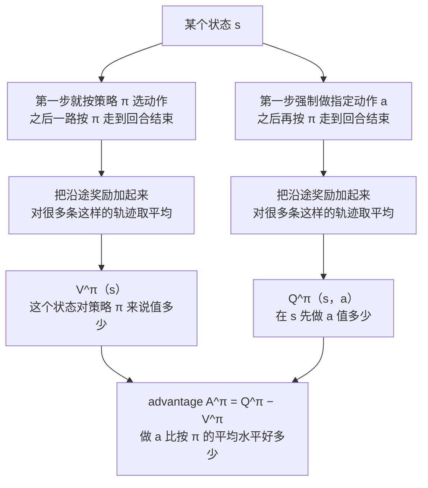
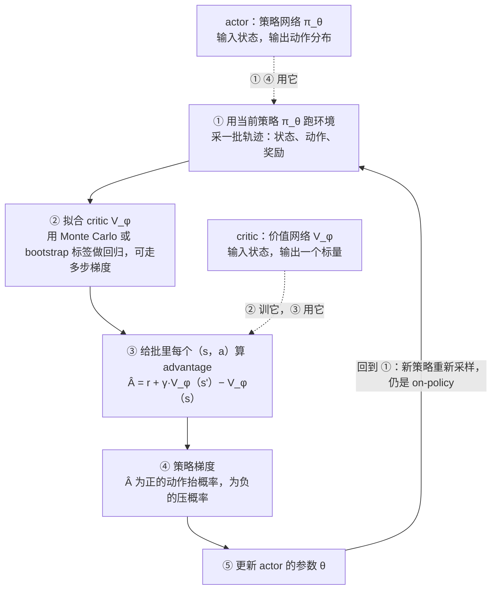
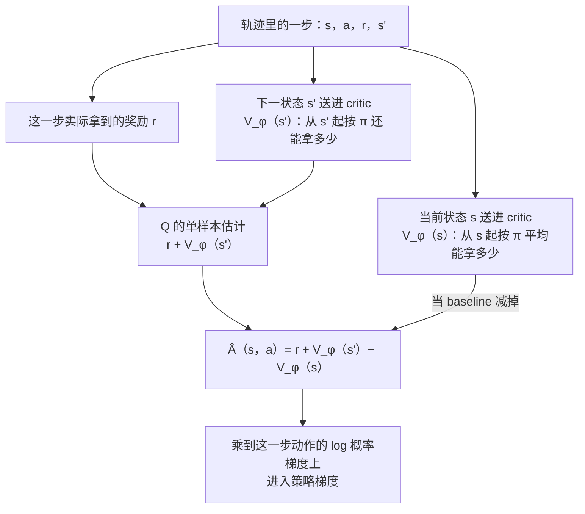
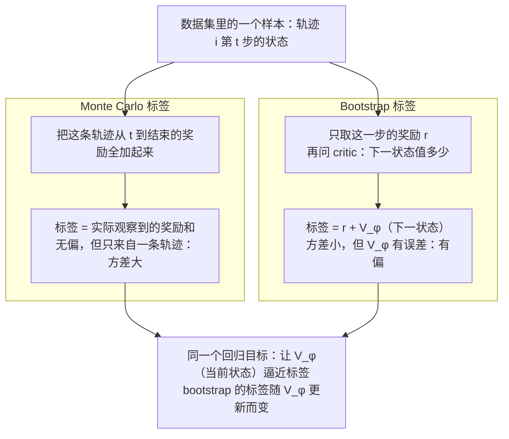
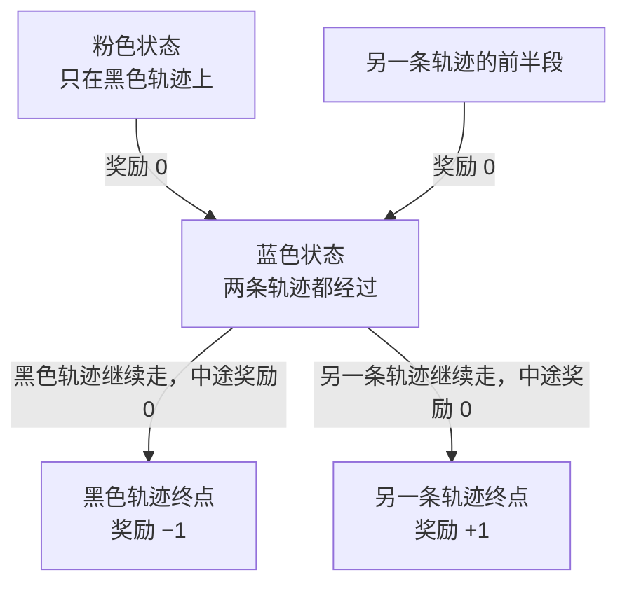
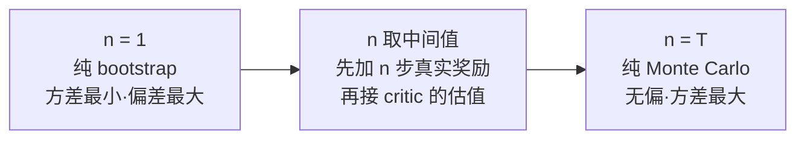

# CS224R 第 4 讲｜Actor-Critic 方法（Actor-Critic Methods）

> Stanford CS224R: Deep Reinforcement Learning（2025 春）· 第 4 讲，2025 年 4 月 11 日 · 紧接第 3 讲的策略梯度；开头预告的 off-policy 变体没讲到，是第 5 讲的内容
> 视频：<https://www.youtube.com/watch?v=oejFZShW9hU>（1:03:30，英文字幕是自动生成的，符号和上下标常被念白，见文末勘误）
> 讲者：Chelsea Finn（课程主讲，不是客座）
> 课程主页：<https://cs224r.stanford.edu/> · 指定阅读：[Policy Gradient Methods for Reinforcement Learning with Function Approximation（Sutton et al., 1999）](https://proceedings.neurips.cc/paper_files/paper/1999/file/464d828b85b0bed98e80ade0a5c43b0f-Paper.pdf) · [Proximal Policy Optimization Algorithms（Schulman et al., 2017）](https://arxiv.org/abs/1707.06347)

**一句话**：第 3 讲的策略梯度拿"这条轨迹后面实际拿到的奖励和"来决定一个动作该被鼓励还是打压——只有一个样本，噪声大，走对一步却摔倒的轨迹会被整体否定。本讲加一个专门评估"这个状态值多少"的价值网络（critic），用它算出的 advantage 替换那个单样本奖励和，策略网络（actor）的梯度方差立刻小很多。critic 怎么训是重头戏：Monte Carlo 回归到实际看到的奖励和，无偏但方差大；bootstrapping 用"这一步的奖励加上自己对下一状态的估值"当标签，方差小但把估值误差带了进来；n-step return 在两者之间插值，折扣因子 γ 让无限长回合的估值不至于爆掉。PPO 的 value head 就是这里的 critic，本讲只讲到"怎么估、怎么用"，clip 和 off-policy 都留给后面。

## 时间轴

| 时间 | 内容 |
|---|---|
| [0:05](https://www.youtube.com/watch?v=oejFZShW9hU&t=5s) | 回顾第 3 讲：在线 RL 的循环、策略梯度与 baseline、on-policy 的代价、importance weight 的局限 |
| [3:09](https://www.youtube.com/watch?v=oejFZShW9hU&t=189s) | 今天讲什么：actor-critic、policy evaluation；PPO 建立在它之上 |
| [4:12](https://www.youtube.com/watch?v=oejFZShW9hU&t=252s) | 价值函数 V^π(s)：从 s 出发按 π 走到底的期望奖励和 |
| [6:52](https://www.youtube.com/watch?v=oejFZShW9hU&t=412s) | Q 函数 Q^π(s, a)；V 是 Q 的期望；advantage = Q − V；问答：归一化 |
| [12:01](https://www.youtube.com/watch?v=oejFZShW9hU&t=721s) | 练鼓的例子：三个动作下自己算 V、Q、A；问答：Q 是学会的概率；下棋的胜率 |
| [15:36](https://www.youtube.com/watch?v=oejFZShW9hU&t=936s) | 策略梯度的两个不满意场景：迈步后摔倒、折衣服的稀疏奖励 |
| [18:10](https://www.youtube.com/watch?v=oejFZShW9hU&t=1090s) | 把 reward-to-go 换成 Q，再减 V 当 baseline，得到 advantage 形式的梯度；问答：仍是同一目标、无偏 |
| [25:47](https://www.youtube.com/watch?v=oejFZShW9hU&t=1547s) | 算法总览：跑策略 → 拟合价值估计 → 改进策略 |
| [26:50](https://www.youtube.com/watch?v=oejFZShW9hU&t=1610s) | 推导：A 只用 V 表示，A ≈ r + V(s') − V(s)；问答：为什么是近似、要不要新交互 |
| [33:29](https://www.youtube.com/watch?v=oejFZShW9hU&t=2009s) | 为什么估 V；critic 是输出标量的网络；Monte Carlo：重置做不到，改用多条轨迹回归 |
| [41:11](https://www.youtube.com/watch?v=oejFZShW9hU&t=2471s) | Bootstrapping：用 r + V_φ(s') 当标签；TD learning；问答：只输入 s、初始化 |
| [48:24](https://www.youtube.com/watch?v=oejFZShW9hU&t=2904s) | 两条轨迹的例子：MC 与 bootstrap 对蓝色、粉色状态的估值 |
| [52:00](https://www.youtube.com/watch?v=oejFZShW9hU&t=3120s) | 偏差–方差；n-step returns：在 n = 1 到 n = T 之间插值 |
| [56:08](https://www.youtube.com/watch?v=oejFZShW9hU&t=3368s) | 折扣因子 γ：等价于每步有 1 − γ 的概率进入死亡状态；γ 与 n 的关系 |
| [1:00:12](https://www.youtube.com/watch?v=oejFZShW9hU&t=3612s) | 完整的 actor-critic 算法：五步；actor 与 critic 两个网络 |
| [1:02:17](https://www.youtube.com/watch?v=oejFZShW9hU&t=3737s) | 回顾：策略梯度 vs actor-critic；三种估值方式统称 policy evaluation |

## 核心内容

### 1. 回顾：策略梯度为什么"不省数据"

- **在线 RL 的循环**（第 3 讲）：用当前策略在环境里跑一批数据 → 用这批数据改进策略 → 重复，靠不断练习越来越好。策略 π_θ(a | s) 是"给定状态 s，选各个动作 a 的概率"，θ 是策略网络的参数；从头跑到回合结束得到的状态、动作、奖励序列叫一条轨迹 τ。
- **策略梯度的更新**：从 π_θ 采 N 条轨迹，对每一步算"这个动作的 log 概率对 θ 的梯度"，再乘上这一步之后实际拿到的奖励和（reward-to-go）。后面奖励高，就抬高这个动作的概率；再减一个 baseline（比如平均奖励），变成"高于平均的多做、低于平均的少做"。
- **两个毛病**
    1. **完全 on-policy**：梯度里的期望是对 π_θ 自己采的样本算的，θ 一变，手里的样本就不再来自当前策略，所以每批数据只能走一步梯度，要不停地重新采。第 3 讲讲的 importance weight（新策略下动作的概率 ÷ 旧策略下的概率）能让旧数据复用，但讲者特意提醒：数学漂亮不等于万能——两个策略只要差得稍多，这个比值就会极大或极小，梯度估计跟着变差。
    2. **数据用得糙**：走路的例子里，机器人向前迈了一小步、随后向后摔倒，整条轨迹的 reward-to-go 为负，策略梯度会连"向前迈步"一起打压，因为它分不清哪一步是功、哪一步是过。折衣服的例子里奖励稀疏，只折了袖子、只铺平了衣服的轨迹奖励为零，等于白采。如果我们能判断"向前迈一步本身是有利的"，这些数据就都能用上。
- **本讲的目标**：actor-critic 方法，建在策略梯度之上。核心学习目标是 **policy evaluation**——估计一个状态、一个动作对当前策略来说值多少；然后用这个估计造出更好的 RL 算法。讲者说这类方法是 PPO 的基础，PPO 既用来训练语言模型，也用来训练仿真里的人形机器人。
    > 小注：CME295 第 5 讲见过 PPO 的 clipped objective，里面那个 A_t 就是本讲要造的 advantage，PPO 的 value head 就是本讲的 critic。clip、KL 这些"别走远"的约束本讲完全没碰，开头预告的 off-policy 变体也没讲到，都在第 5 讲。

### 2. 三个价值量：V、Q、advantage

*图 4-1｜V、Q、advantage 三个量分别在问什么：区别只在第一步是按策略选还是强制指定（自绘示意）· [▶ 看原幻灯片 7:53](https://www.youtube.com/watch?v=oejFZShW9hU&t=473s)*

- **价值函数 V^π(s)**（第 1 讲出现过）：从状态 s 出发、之后一直按策略 π 走，到回合结束能拿到的奖励总和的期望。要取期望，是因为两处有随机性：策略选动作是抽样的，环境给出的下一状态也可能是抽样的（环境是随机的，stochastic）。直观理解：从这个状态出发跑很多条轨迹，每条把从这一刻到结束的奖励加起来，再对所有轨迹取平均。
- **Q 函数 Q^π(s, a)**：和 V 只差一处——第一步不按 π 选，而是强制执行指定的动作 a，之后再按 π 走。这个 a 可能是 π 根本不太会选的动作；由于环境随机，同一个 a 也可能落到不同的下一状态。

$$
V^{\pi}(s_t)=\mathbb{E}_{\pi}\Big[\sum_{t'=t}^{T} r(s_{t'},a_{t'})\,\Big|\,s_t\Big],\qquad Q^{\pi}(s_t,a_t)=\mathbb{E}_{\pi}\Big[\sum_{t'=t}^{T} r(s_{t'},a_{t'})\,\Big|\,s_t,a_t\Big]
$$

s_t、a_t 是时刻 t 的状态和动作，r 是每一步的奖励，T 是回合长度；两个期望都对"之后按 π 走会遇到的状态和动作"取，区别只是 Q 额外把第一个动作 a_t 固定住。

- **两者的关系**：把 Q 里那个"指定的 a"换成按 π 抽样，再对抽样取期望，就回到了 V——V 是 Q 在策略自己的动作分布下的平均。
- **advantage A^π(s, a)**：Q 减 V，"在 s 做 a，比按 π 的平均水平好多少"。这是本讲真正要塞进策略梯度里的量。

$$
V^{\pi}(s)=\mathbb{E}_{a\sim\pi(\cdot\mid s)}\big[Q^{\pi}(s,a)\big],\qquad A^{\pi}(s,a)=Q^{\pi}(s,a)-V^{\pi}(s)
$$

左式说 V 是 Q 对策略动作分布的期望，右式定义 advantage；A 为正表示这个动作好于策略的平均表现，为负表示差于平均。

- **练鼓的例子**（讲者让全班算）：奖励是"一个月后能演奏得 1 分，否则 0 分"，T 就是一个月；动作有三个：躺沙滩、看电视、练鼓；当前策略是在所有状态下都躺沙滩，而且现在还不会打鼓。那么 V^π(当前状态) = 0，因为照这个策略永远学不会；Q(躺沙滩) 和 Q(看电视) 都是 0；Q(练鼓) 是"练这一步之后又躺回沙滩"仍能学会的概率，可能接近 1，也可能远小于 1——取决于一个时间步有多长、这个人有没有天赋；advantage 只有练鼓是正的，另外两个是 0。
- **问答**
    - V 和 Q 之间有归一化吗？——期望就是平均，用样本估的时候各自除以各自的样本数，天然是归一的。
    - 讲者补了个更常见的直觉：下棋时，价值函数就是"当前局面下这个棋手的胜率"——它评的是局面对某个特定的人有多好。

### 3. 把单样本的 reward-to-go 换成 advantage

- 策略梯度里真正决定"抬还是压"的，是每一步后面的奖励和。它其实在估"在 s 做 a 之后还能拿多少"——这正是 Q^π(s, a) 的定义，只不过用了一条轨迹里的一个样本。如果换成真正的 Q^π（相当于从那个状态、那个动作出发把策略跑无穷多次再平均），梯度会准得多：Q 高的动作抬概率，Q 低的压概率。
- **再加 baseline**：第 3 讲的 baseline 是平均奖励，这里对应的自然是"Q 的平均"；而 Q 在策略动作分布下的平均恰恰是 V^π。于是权重变成 Q 减 V，也就是 advantage：抬高 advantage 为正的动作，压低为负的。回到练鼓的例子：练鼓的 advantage 是正的，梯度会增加练鼓的概率、减少另外两个。

$$
\nabla_\theta J(\theta)\approx\frac{1}{N}\sum_{i=1}^{N}\sum_{t=1}^{T}\nabla_\theta\log\pi_\theta(a_{i,t}\mid s_{i,t})\;A^{\pi}(s_{i,t},a_{i,t})
$$

J(θ) 是策略的期望奖励和，i 编号 N 条采样轨迹，t 编号轨迹里的时间步；和第 3 讲的 REINFORCE 相比，只是把每一步的权重从"这条轨迹后面的奖励和"换成了 advantage。

- **为什么更好**：advantage 估得越准，梯度越不噪；如果知道真实的 A^π，这就是一个非常好的梯度。讲者确认：它优化的仍是第 3 讲那个"期望奖励和"目标，只是估计方式变了，用真实 advantage 时这个梯度估计是无偏的（推导略过，有偏的东西后面才出现）。真正的难题是我们不知道真实的 A^π，接下来几十分钟都在讲怎么估它。
    > 小注：把 reward-to-go 换成 Q^π 这一步的合法性，正是指定阅读 Sutton et al., 1999 的 policy gradient theorem；那篇还证明了 critic 用和策略"兼容"（compatible）的线性特征时，不会给梯度引入偏差。
- **问答**
    - 这和原来的采样有什么不同？——原来对每个 (s, a) 只有它所在那一条轨迹的一个奖励和，是极噪的单点估计；现在要的是"这个动作的优势"，概念上等于从这个状态、动作出发把策略滚无穷次。
    - baseline 是对当前这条轨迹平均，还是对所有轨迹？——设成 V^π 的话，概念上是无穷多条轨迹的平均；怎么用有限数据估它，马上讲。

### 4. Actor-critic 的循环：多出来的一步"拟合"

*图 4-2｜Actor-critic 的一轮：比策略梯度多出"拟合 critic"这一步，两个网络各司其职（自绘示意）· [▶ 看原幻灯片 1:00:12](https://www.youtube.com/watch?v=oejFZShW9hU&t=3612s)*

- 原来的循环只有两步：跑策略、改策略。现在中间插一步：**拟合一个模型去估计期望回报**——估 V^π、Q^π 或 A^π 都行；改策略那一步照旧，只是用这个估计代替单样本的奖励和。
- **两个网络**：策略网络是 **actor**（执行者），价值网络是 **critic**（评论者，它在"评价"一个状态、一个策略有多好）。名字就是这么来的。
- **估哪一个**：直接拟合 A 拿不到现成的监督信号；Q 和 V 都估要维护两个模型。讲者的选择是只拟合 V，再从 V 推出 A——下一节就是这个推导。问答里她补充：这只是实践上简单一点，直接估 Q 的办法下周会讲（第 5、6 讲）。

### 5. 只拟合 V 就够了：advantage 的一步近似

*图 4-3｜一个 advantage 估计是怎么从轨迹里的一步和 critic 的两次前向拼出来的（自绘示意）· [▶ 看原幻灯片 30:55](https://www.youtube.com/watch?v=oejFZShW9hU&t=1855s)*

- **推导**（板书）：Q^π(s_t, a_t) 是"当前这一步的奖励，加上之后所有奖励"。之后的奖励取决于下一状态 s_{t+1}——它由环境的动态（dynamics）抽样决定；而"从 s_{t+1} 出发按 π 走到底的奖励和"按定义就是 V^π(s_{t+1})。于是 Q 等于当前奖励，加上"下一状态的价值"对环境动态的期望。
- **近似**：我们不能对环境动态随便抽样，但采数据时确实看到了一个 s_{t+1}——就用这一个样本代替期望。这样 Q 和 A 都只用 V 就能写出来，critic 只需要拟合 V：

$$
Q^{\pi}(s_t,a_t)=r(s_t,a_t)+\mathbb{E}_{s_{t+1}\sim p(\cdot\mid s_t,a_t)}\big[V^{\pi}(s_{t+1})\big]\approx r(s_t,a_t)+V^{\pi}(s_{t+1}),\qquad \hat A(s_t,a_t)=r(s_t,a_t)+V_\phi(s_{t+1})-V_\phi(s_t)
$$

p(· | s_t, a_t) 是环境的转移分布；≈ 处用轨迹里实际出现的那一个 s_{t+1} 代替对 p 的期望；V_φ 是参数为 φ 的 critic 网络对 V^π 的估计，Â 是最终塞进策略梯度的 advantage 估计。

- **问答**
    - 为什么是近似？——下一状态可能有多种，我们只用了轨迹里看到的那一个。环境越确定（deterministic），这个近似越好；越随机越差。好消息是后面会看到怎么用大量数据、多步梯度把它抹平。
    - 需要和环境新的交互吗？——不需要。s_t、a_t、s_{t+1} 都取自同一条已经采好的轨迹。
    - 那个上标 π 很多论文为了省事会省掉，但讲者强调它很重要：这里估的是**某个特定策略**的价值，不是任意策略的。
    > 小注：r + V(s_{t+1}) − V(s_t) 在文献里叫 TD error，记作 δ_t。CME295 第 5 讲提过的 GAE（Schulman et al., 2015）就是把第 9 节里不同 n 的 advantage 估计按 λ 做指数加权平均，(γ, λ) 两个超参由此而来。

### 6. 拟合 critic 之一：Monte Carlo 回归

- **critic 长什么样**：一个神经网络 V_φ，输入一个状态，输出一个标量（讲者特意说：不像幻灯片上画的那样是多维的），参数记作 φ。
- **理想做法做不到**：想知道某个状态的价值，最直接的是把世界重置（reset）到那个状态、从那里跑很多次取平均。现实世界没法重置；仿真器有时可以，但实践中一般也不这么干。
- **能做的**：手里有很多条轨迹，每条轨迹的每个时刻 t 都对应一个"从 t 到结束的实际奖励和"。把所有 (状态, 之后的奖励和) 配成对，就是一个监督学习数据集：输入状态、标签是奖励和，用 L2 回归训练 V_φ。数据点数 = 轨迹数 × 平均步数。不同轨迹里会出现相似的状态，网络在它们之间共享信息（讲者的词是 amortize），等于变相对相似状态取了平均。

$$
\min_{\phi}\;\sum_{i=1}^{N}\sum_{t=1}^{T}\Big(V_\phi(s_{i,t})-y_{i,t}\Big)^{2},\qquad y^{\mathrm{MC}}_{i,t}=\sum_{t'=t}^{T} r(s_{i,t'},a_{i,t'})
$$

s_{i,t} 是第 i 条轨迹第 t 步的状态，y_{i,t} 是它的回归标签；Monte Carlo 的标签就是这条轨迹从 t 起实际看到的奖励和，后面几节只换标签、不换这个平方误差目标。

- 这叫 **Monte Carlo 估计**：跑很多次，直接回归到看到的结果。最简单，讲者自嘲也最傻。
- **问答**
    - 每次策略一变就得重采、重训吗？——用这个方法是的，V^π 是绑定策略的；后面会有能复用旧数据的办法。
    - critic 每走一步梯度都要重新采数据吗？——不用。和策略梯度不同，拟合 critic 不改变策略，同一批数据上可以走很多步梯度。
    - 能不能顺便学"给定 s、a 预测下一状态"？——可以，那叫 model-based 方法（学一个世界模型），过几周讲（第 11 讲）。

### 7. 拟合 critic 之二：bootstrapping / TD learning

*图 4-4｜同一个回归目标、两种标签：Monte Carlo 用实际结局，bootstrap 用自己的估值（自绘示意）· [▶ 看原幻灯片 47:54](https://www.youtube.com/watch?v=oejFZShW9hU&t=2874s)*

- **想法**：训到一半时，V_φ 对某些状态的估值已经像样了。那么对时刻 t 的状态，与其用整条轨迹后面的奖励和当标签，不如用"这一步的奖励加上 V_φ 对下一状态的估值"——理想标签本来就是"当前奖励加下一状态的期望价值"，只是把期望价值换成了自己的估计。

$$
y^{\mathrm{TD}}_{i,t}=r(s_{i,t},a_{i,t})+V_\phi(s_{i,t+1})
$$

回归目标和上一节完全一样，只是标签换成了"这一步的奖励加 critic 对下一状态的估值"；标签里有 V_φ 自己，所以它会随训练不断变化。

- **bootstrapping** 这个词的意思是"用自己的估计当监督"（拽着自己的鞋带把自己提起来）。V_φ 一更新，标签跟着变；实践中通常每走一步梯度就刷新一次标签，网络特别大、更新特别贵时可以刷得慢一点。
- **它换来了什么**：MC 标签只看这一条轨迹碰巧发生的一个结局；bootstrap 标签里的 V_φ(s_{t+1}) 是用**所有**轨迹训出来的，隐含了"从 s_{t+1} 出发可能发生的各种结局"。这正是它对第 5 节那个"单样本近似"的补偿。
- 另一个名字是 **temporal difference（TD）learning**：看的是相邻两个时间步之间的差。讲者提醒别和反向传播混了：训练时仍然是对那个 L2 目标做 backprop；"信息沿时间往回传"（下一状态的估值传给当前状态）是另一回事。
- **问答**
    - 为什么 critic 只输入当前状态，不输入历史？——未来的奖励只取决于现在在哪（Markov 假设），当前奖励又是确定的，所以标签只需条件在 s_t 上。
    - 初始估值很差时标签不就全错了？——一般不用特别处理，只要别把网络初始化到输出 −1000 这种离谱值；真担心的话可以先用几轮 Monte Carlo 把量级拉对，再切到 bootstrap。
    > 小注：实现上 bootstrap 标签要当常数处理（stop-gradient，不让梯度流过 V_φ(s_{t+1})），这叫 semi-gradient TD；用一个更新慢一拍的旧网络算标签的 target network 技巧，应在第 6 讲 Q-learning 里正式出现。TD learning 这个名字出自 Sutton 1988。

### 8. 两条轨迹的例子：bootstrap 为什么能跨轨迹传信息

*图 4-5｜课上的练习：两条轨迹共享一个蓝色状态，粉色状态只在通往 −1 的那条上（自绘示意）· [▶ 看原幻灯片 48:24](https://www.youtube.com/watch?v=oejFZShW9hU&t=2904s)*

- 只采了两条轨迹：黑色那条最后奖励 −1，另一条最后奖励 +1，中途奖励全是 0；蓝色状态两条轨迹都经过，粉色状态只在黑色轨迹上、位于蓝色之前。问：两种方法各给这两个状态什么估值？

| 状态 | Monte Carlo | Bootstrap |
|---|---|---|
| 蓝色（两条轨迹共有） | 0：数据集里同一个状态带着 −1 和 +1 两个标签，回归取平均 | 0：标签是 0 加下一状态的估值，两条轨迹的下一状态分别估成 −1 和 +1，平均仍是 0 |
| 粉色（只在黑色轨迹上） | −1：只看得到自己这条轨迹的结局 | 0：标签是 0 加 V_φ(蓝) = 0，蓝色状态的估值把另一条轨迹的信息带了过来 |

- 蓝色之后，黑色轨迹上的状态估值都是 −1，另一条上都是 +1，两种方法一致；差别出在蓝色之前。讲者的评价：bootstrap 的估值可以说更准，因为它能通过自己的估值把不同轨迹的信息聚合起来；MC 只有在数据集里出现**一模一样**的状态时才会做这种聚合。

### 9. 偏差–方差：n-step returns

*图 4-6｜n-step return 是两种标签之间的一根滑杆（自绘示意）· [▶ 看原幻灯片 53:33](https://www.youtube.com/watch?v=oejFZShW9hU&t=3213s)*

- 两种标签的取舍：Monte Carlo 完全无偏，但方差高；bootstrap 方差低得多，但一定有偏——当前的 V_φ 总有误差，误差会被当成标签的一部分学进去。
- **中间路线**：先累加接下来 n 步实际看到的奖励——趁方差还没涨起来——再在第 t+n 步接上 critic 的估值。n = 1 就是纯 bootstrap，n = T 就是纯 Monte Carlo，实践中通常取中间某个值最好。

$$
y^{(n)}_{i,t}=\sum_{t'=t}^{t+n-1} r(s_{i,t'},a_{i,t'})+V_\phi(s_{i,t+n})
$$

前 n 项是轨迹里真实观察到的奖励，最后一项是 critic 对第 t+n 步状态的估值；n 越小越像 bootstrap，n 越大越像 Monte Carlo。

- **什么时候该大 n**：时间步很短的场景（比如 10 ms 一步），相邻两步之间几乎没发生什么，一步 bootstrap 学不到东西；方差随 n 涨得慢就多看几步，涨得快就少看。n 不改变"贪不贪心"——各种 n 估的都是同一个 V^π，变的只是估计的偏差和方差。
- **问答**：能不能把 MC 标签和 n-step 标签都放进数据集？——原则上可以，实践中一般只挑一种：高方差的标签会拖慢学习，估值不准的标签也是。

### 10. 折扣因子 γ：给无限长的回合"设个寿命"

- **问题**：前面一直在把未来奖励全加起来。回合很长甚至无限长时（第 1 讲提过），奖励和会大到没边，估值就没法学。
- **做法**：在标签里给下一状态的估值乘一个系数 γ（0.9、0.99 之类），意思是"更在乎眼前的奖励，越远的越不在乎"；γ = 1 就回到原来。

$$
y_{i,t}=r(s_{i,t},a_{i,t})+\gamma\,V_\phi(s_{i,t+1}),\qquad y^{(n)}_{i,t}=\sum_{t'=t}^{t+n-1}\gamma^{\,t'-t}\,r(s_{i,t'},a_{i,t'})+\gamma^{n}\,V_\phi(s_{i,t+n})
$$

γ 在 0 和 1 之间；一步标签里下一状态的估值打一次折，n 步标签里第 k 步之后的奖励打 k 次折、末尾的估值打 n 次折（课上只点到了估值项上的 γ^n，奖励项上的折扣是标准写法）。

- **它到底改了什么**：加折扣等价于稍微改了决策过程本身（MDP，即"状态、动作、转移概率、奖励"这一整套定义）：每一步都有 1 − γ 的概率进入一个"死亡状态"——奖励为零、再也出不来；原 MDP 里所有转移概率都乘上 γ。γ = 0.99 就是"每步有 1% 的概率当场结束"。
- **γ 和 n 的关系**（问答）：两者互相牵连——环境越确定、时间步越细，越会往前多看几步，这同样会影响 γ 的选择；但 n 管的是"往前看几步再交给估值"，γ 管的是"远处的奖励算几分"，不是一回事。
    > 小注：γ 把有效视野压到大约 1/(1 − γ) 步，γ = 0.99 大约看 100 步。LLM 的 RLHF 通常直接取 γ = 1——一条回答只有几十到几千个 token、奖励在末尾，不折扣才不会把长回答末尾的奖励打薄。

### 11. 完整算法，以及它通向哪里

- **五步**（图 4-2）：① 用当前策略采一批轨迹；② 用 n-step 标签在这批数据上走多步梯度，拟合 V_φ；③ 对每个 (s_t, a_t) 算 Â = r + γ V_φ(s_{t+1}) − V_φ(s_t)，它回答"按 critic 和实际奖励看，数据里这个动作有多好"；④ 用 Â 做策略梯度，抬高有利动作、压低不利动作；⑤ 更新 θ，回到 ①。
- **回到开头的例子**：向前迈步然后摔倒的轨迹现在能用上了——尤其是用 bootstrap 估值时，critic 会学到"迈步之后的状态"比"摔倒之后的状态"值钱，迈步的 advantage 为正、摔倒为负，各得其所。数据利用率高得多。
- **一句话对比**：策略梯度是"看到什么好就多做、看到什么坏就少做"；actor-critic 是"先学会判断什么好什么坏，再按判断多做少做"。三种估值方式——直接看奖励和、bootstrap、两者混合——统称 policy evaluation。
- **接下来**：这个算法仍然是 on-policy 的——V_φ 估的是当前策略的价值，每轮都要重新采样。第 5 讲会把它改成 off-policy，让旧策略的数据（攒在 replay buffer——一个存历史转移样本的缓冲区——里）也能用；第 6 讲直接学 Q，不经过 V。
    > 小注：CS329A 第 6 讲的 GRPO 走的是另一条路——干脆不要 critic，对同一个 prompt 采一组回答，用组内平均奖励当 baseline。按本讲的语言，那是 Monte Carlo 估计配一个只依赖状态（prompt）的 baseline：省掉了 critic 的偏差和显存，代价是回到高方差，靠一组多条采样来压。

## 关键图表速查（点时间戳跳到原幻灯片）

| 图 | 看什么 | 跳转 | 出处 |
|---|---|---|---|
| V 与 Q 的两张示意图 | 同一个 s 出发：直接按 π 跑 vs 先做 a 再按 π 跑，各自对奖励和取平均 | [7:53](https://www.youtube.com/watch?v=oejFZShW9hU&t=473s) | — |
| V、Q、A 的关系式 | V 是 Q 在策略动作分布下的期望；A = Q − V | [8:53](https://www.youtube.com/watch?v=oejFZShW9hU&t=533s) | — |
| 练鼓的例子 | 三个动作、一个"永远躺沙滩"的策略，自己算 V、Q、A | [12:01](https://www.youtube.com/watch?v=oejFZShW9hU&t=721s) | — |
| 走路摔倒与折衣服 | 策略梯度浪费数据的两个场景：功过不分、稀疏奖励 | [16:07](https://www.youtube.com/watch?v=oejFZShW9hU&t=967s) | — |
| 用 V 当 baseline 得到 advantage 的梯度式 | reward-to-go → Q → Q − V 的三次替换 | [21:43](https://www.youtube.com/watch?v=oejFZShW9hU&t=1303s) | [Sutton et al., 1999](https://proceedings.neurips.cc/paper_files/paper/1999/file/464d828b85b0bed98e80ade0a5c43b0f-Paper.pdf)（课上没点名） |
| 三步算法框图 | 跑策略 → 拟合价值估计 → 改进策略，中间那步是新增的 | [26:18](https://www.youtube.com/watch?v=oejFZShW9hU&t=1578s) | — |
| 板书：A ≈ r + V(s') − V(s) | Q 拆成当前奖励加下一状态价值的期望，再用单样本近似 | [30:55](https://www.youtube.com/watch?v=oejFZShW9hU&t=1855s) | — |
| Monte Carlo 数据集 | (状态, 之后的奖励和) 配对成监督学习数据，数据量 = 轨迹数 × 步数 | [37:04](https://www.youtube.com/watch?v=oejFZShW9hU&t=2224s) | — |
| bootstrap 标签 | 理想标签 = 当前奖励加下一状态的期望价值，把期望价值换成 V_φ 自己 | [43:13](https://www.youtube.com/watch?v=oejFZShW9hU&t=2593s) | — |
| 两条轨迹的例子 | 蓝色、粉色两个状态在 MC 与 bootstrap 下的估值差异 | [48:24](https://www.youtube.com/watch?v=oejFZShW9hU&t=2904s) | — |
| n-step return 公式 | 前 n 步用真实奖励、之后接 critic；n = 1 与 n = T 两个极端 | [53:33](https://www.youtube.com/watch?v=oejFZShW9hU&t=3213s) | — |
| 折扣即"死亡状态" | 每步以 1 − γ 的概率进入零奖励的吸收态；其余转移乘 γ | [58:11](https://www.youtube.com/watch?v=oejFZShW9hU&t=3491s) | — |
| 完整 actor-critic 算法 | 五步循环；两个网络分别叫 actor 和 critic | [1:00:12](https://www.youtube.com/watch?v=oejFZShW9hU&t=3612s) | — |

## 提到的工作

| 名称 | 在本讲里的作用 |
|---|---|
| 策略梯度 / REINFORCE 与 baseline（第 3 讲） | 出发点：本讲把它的单样本 reward-to-go 换成 critic 给的 advantage |
| importance weights（第 3 讲） | 回顾里的提醒：只在新旧策略很接近时可靠，不是万能药 |
| 价值函数 V、Q（第 1 讲引入） | 本讲的主角，policy evaluation 的对象 |
| [PPO](https://arxiv.org/abs/1707.06347)（Schulman et al., 2017；指定阅读） | 被点名为建在 actor-critic 之上的算法，用于训练 LLM 和仿真人形机器人；clip 部分本讲未讲 |
| [Policy gradient theorem](https://proceedings.neurips.cc/paper_files/paper/1999/file/464d828b85b0bed98e80ade0a5c43b0f-Paper.pdf)（Sutton et al., 1999；指定阅读） | 课上未点名；把 reward-to-go 换成 Q^π 的理论依据 |
| Monte Carlo estimation | 拟合 critic 的第一种方法：回归到实际奖励和 |
| Bootstrapping / temporal difference learning | 第二种方法：用自己的估值当标签 |
| n-step returns | 两者之间的插值 |
| 折扣因子与 MDP 的"死亡状态"改写 | 处理长回合下估值爆炸 |
| Model-based RL（第 11 讲预告） | 问答：学一个预测下一状态的模型是另一条路 |
| Off-policy actor-critic（第 5 讲预告） | 本讲开头预告、没讲到的部分 |
| 直接估 Q 的方法（第 5、6 讲预告） | 问答：为什么这里选择估 V |
| 国际象棋的胜率 | 价值函数的直觉例子 |

## 术语对照

| English | 中文 |
|---|---|
| state / action / policy π_θ | 状态 / 动作 / 策略：给定状态下各动作的概率，θ 是策略网络参数 |
| trajectory τ / episode / rollout | 轨迹 / 回合 / 一次滚动：从头跑到结束的状态、动作、奖励序列 |
| return / sum of rewards | 回报：一条轨迹上奖励的总和 |
| reward-to-go | 未来奖励和：从某一步起到结束的奖励之和 |
| baseline | 基线：从权重里减掉的"平均水平"，用来降方差 |
| on-policy / off-policy | 只能用当前策略自己采的数据 / 能复用别的策略采的数据 |
| importance weight | 重要性权重：新策略下的动作概率 ÷ 旧策略下的动作概率 |
| value function V^π(s) | 价值函数：从 s 出发按 π 走到底的期望回报 |
| Q function Q^π(s, a) | 动作价值函数：在 s 先做 a、之后按 π 走的期望回报 |
| advantage A^π(s, a) | 优势：Q 减 V，做 a 比按 π 平均好多少 |
| policy evaluation | 策略评估：估计一个给定策略的 V、Q 或 A |
| actor / critic | 执行者（策略网络）/ 评论者（价值网络） |
| Monte Carlo estimation | 蒙特卡洛估计：跑很多次，回归到实际看到的回报 |
| bootstrapping | 自举：用自己当前的估值当训练标签 |
| temporal difference (TD) learning | 时序差分学习：bootstrapping 的另一个名字，看相邻时间步的差 |
| n-step return | n 步回报：前 n 步用真实奖励，之后接估值 |
| bias / variance | 偏差 / 方差：估计的系统性偏离 / 估计的随机波动 |
| unbiased estimate | 无偏估计：平均下来正好等于真值 |
| discount factor γ | 折扣因子：未来奖励每往后一步乘一次 γ |
| MDP (Markov decision process) | 马尔可夫决策过程：状态、动作、转移概率、奖励的整套定义 |
| absorbing / death state | 吸收态：进去就出不来、奖励为零的状态，折扣的等价解释 |
| dynamics / transition | 环境动态：给定 s、a 时下一状态的分布 |
| deterministic / stochastic | 确定性 / 随机性（说环境或策略） |
| horizon T | 时间范围：回合的最大步数 |
| reset | 重置：把环境放回某个状态，现实中通常做不到 |
| sparse reward | 稀疏奖励：只有完成任务才有奖励 |
| supervised regression / L2 loss | 监督回归 / 平方误差 |
| model-based RL | 基于模型的 RL：学一个预测下一状态的世界模型 |
| replay buffer | 经验回放缓冲区：攒历史数据供 off-policy 复用（第 5 讲） |

## 字幕勘误

自动字幕把符号念白了的地方多：开头 "the pi of S" 应为 V^π(s)；"used to write ingredients" 是无意义的误识别；"S S I and A I" 应为 s_i、a_i；"n equals t" 里的 t 应为大写的 T（回合长度）；"gamma to the end" 应为 γ^n（gamma to the n）；"block trajectory" 应为 black trajectory；"the hat of zero" 应为估值 V̂ = 0。人名和算法名本讲几乎没有出现，没有会误导的错认。

## 带走的问题

1. 用真实的 A^π 时梯度无偏；换成 r + V_φ(s') − V_φ(s) 后偏差从两处来：单样本的 s' 和 V_φ 自己的误差。哪一处能靠多采数据抹平，哪一处不能？n-step 分别对这两处做了什么？
2. Monte Carlo 的 critic 和策略绑死，策略一变就得重采。bootstrap 标签里的 V_φ(s_{t+1}) 估的是"当前策略"的价值——如果这批数据是旧策略采的，它估的到底是谁的价值？第 5 讲的 off-policy actor-critic 要回答的就是这个。
3. 在 LLM 的 RLHF 里每个 token 是一步、奖励只在末尾：Monte Carlo 标签和 bootstrap 标签分别长什么样？PPO 的 value head 学的是哪一个？GRPO 用组内平均当 baseline，相当于回到本讲的哪种估计，为什么在"一个 prompt、一条回答"的结构里可以接受？
4. 按"死亡状态"的解释，你的 agent 如果平均要 30 步工具调用才能完成任务，γ = 0.9 和 γ = 0.99 各意味着什么"寿命"？会不会让它对最后那一步的任务完成奖励视而不见？
5. 两条轨迹的例子里 bootstrap 更准，是因为蓝色状态在两条轨迹里**完全相同**。真实任务里状态几乎不会重复，critic 靠什么把信息传过去？这对 critic 的网络结构和输入表示提出了什么要求？
