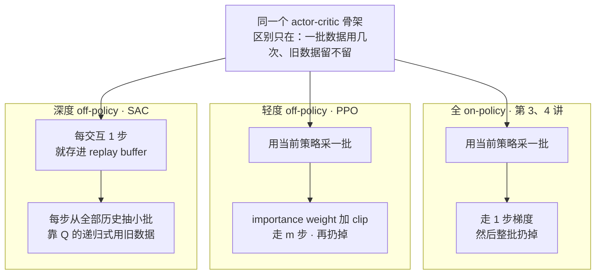
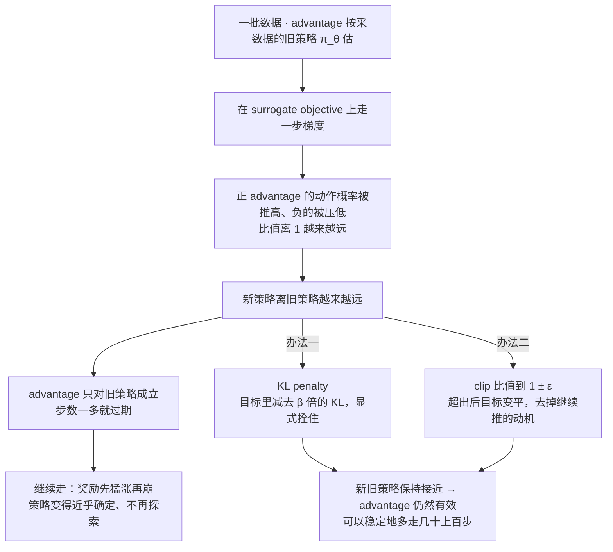
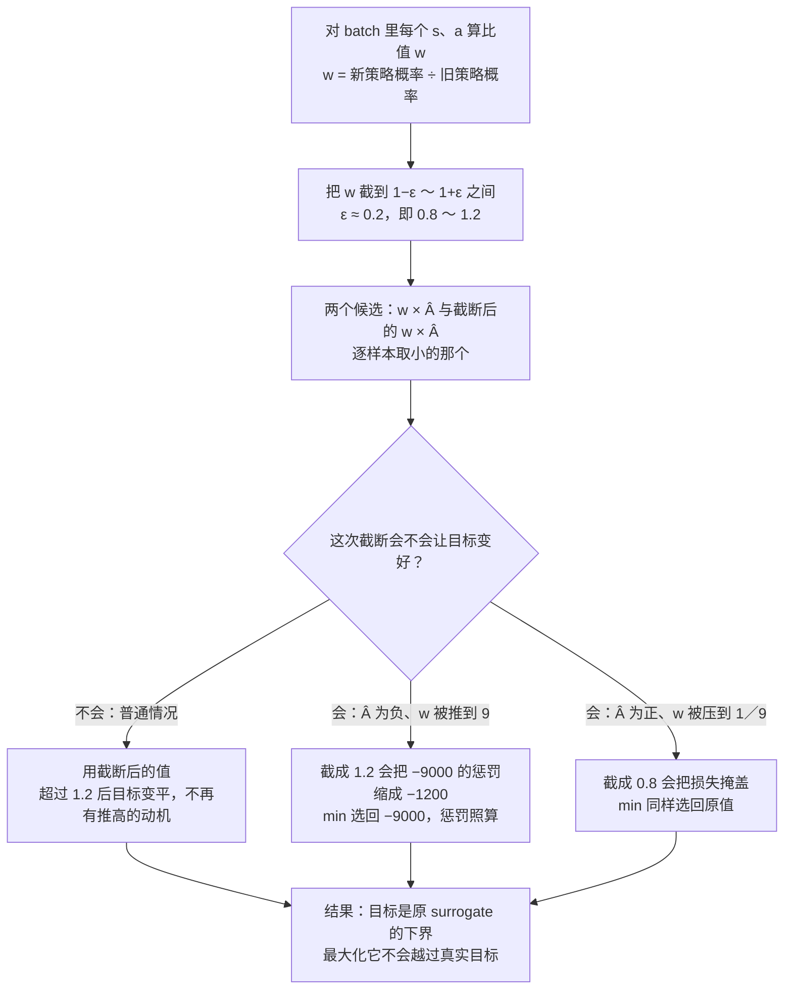
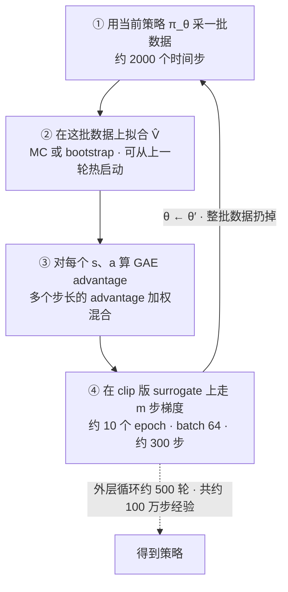
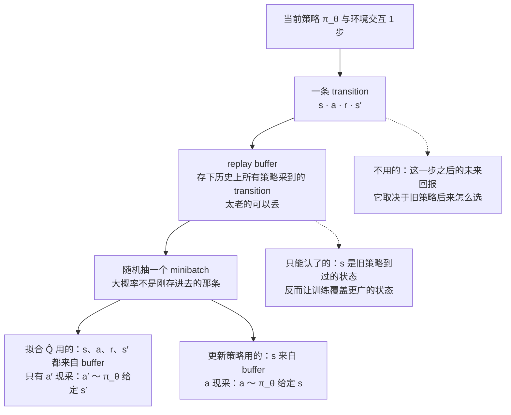
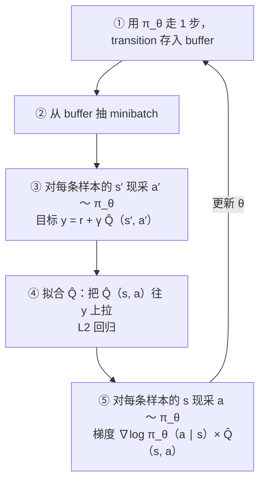

# CS224R 第 5 讲｜Off-Policy Actor-Critic（Off-Policy Actor Critic）

> Stanford CS224R: Deep Reinforcement Learning（2025 春）· 第 5 讲，2025 年 4 月 16 日 · 承接第 4 讲的 actor-critic，引出第 6 讲的 Q-learning
> 视频：<https://www.youtube.com/watch?v=cRGKc-nAWho>（1:09:21，英文字幕是自动生成的，PPO、SAC、KL 这些缩写几乎全错，见文末勘误）
> 讲者：Chelsea Finn（课程主讲，不是客座讲座）
> 课程主页：<https://cs224r.stanford.edu/> · 指定阅读：[Playing Atari with Deep Reinforcement Learning](https://arxiv.org/abs/1312.5602)（Mnih et al., 2013，即 DQN；课上没有展开，它里面的 replay buffer 和 bootstrap 目标是本讲后半段思路的 Q-learning 版本，第 6 讲细讲）

**一句话**：第 4 讲的 actor-critic 是 on-policy 的——每采一批数据只能走一步梯度就得扔掉，而和环境交互是 RL 里最贵的事，这样用太浪费。本讲沿一条线把它改成 off-policy：先用 importance weight 让一批数据走多步，发现 advantage 会过期、步数一多就崩，于是用 KL penalty 或者把 importance weight 截到 1 ± ε 来拴住新策略，这就是 PPO；再把过去所有的数据存进 replay buffer，为此把拟合 V 换成拟合 Q——Q 的递归式对任何 (s, a) 都成立，动作是谁选的无所谓——并把目标值和策略梯度里的动作都改成从当前策略现采，这就是 SAC 的骨架。代价也说清了：PPO 稳但费数据，SAC 省数据但难调。

## 时间轴

| 时间 | 内容 |
|---|---|
| [0:06](https://www.youtube.com/watch?v=cRGKc-nAWho&t=6s) | 回顾：策略梯度与 importance weight；V、Q、advantage 的定义；AlphaGo 例子 |
| [4:41](https://www.youtube.com/watch?v=cRGKc-nAWho&t=281s) | 回顾第 4 讲 actor-critic：用 advantage 替换回报；policy evaluation 的三种拟合目标 |
| [6:11](https://www.youtube.com/watch?v=cRGKc-nAWho&t=371s) | 今天的目标：从 on-policy actor-critic 出发，做出 PPO 和 SAC 两个真实算法 |
| [7:12](https://www.youtube.com/watch?v=cRGKc-nAWho&t=432s) | 一批数据走多步：importance weight 版梯度；为什么要写成 surrogate objective |
| [13:22](https://www.youtube.com/watch?v=cRGKc-nAWho&t=802s) | 走多了会崩：advantage 过期；三条学习曲线；问答（过拟合的策略长什么样、为什么要 importance weight） |
| [21:13](https://www.youtube.com/watch?v=cRGKc-nAWho&t=1273s) | 办法一：KL penalty 把新策略拴在旧策略旁边；β 怎么调；要多存一份旧参数 |
| [28:21](https://www.youtube.com/watch?v=cRGKc-nAWho&t=1701s) | 办法二：把 importance weight 截到 1 ± ε——PPO 的核心 |
| [32:26](https://www.youtube.com/watch?v=cRGKc-nAWho&t=1946s) | PPO 的 trick 2：与原目标取 min 保证是下界；±1000 的板书例子 |
| [37:32](https://www.youtube.com/watch?v=cRGKc-nAWho&t=2252s) | trick 3：GAE，把不同步长的 advantage 加权混合；问答 |
| [42:11](https://www.youtube.com/watch?v=cRGKc-nAWho&t=2531s) | 完整 PPO 算法与典型超参数；half-cheetah 曲线；问答（循环怎么接、超参数怎么调） |
| [46:48](https://www.youtube.com/watch?v=cRGKc-nAWho&t=2808s) | 更 off-policy：replay buffer 存下全部历史；要拆掉哪些 on-policy 假设 |
| [49:52](https://www.youtube.com/watch?v=cRGKc-nAWho&t=2992s) | 天真版本坏在哪：在 buffer 上拟合的 V 属于哪个策略（课堂讨论） |
| [53:26](https://www.youtube.com/watch?v=cRGKc-nAWho&t=3206s) | 改拟合 Q：板书推导 Q 的递归式，它对任意 (s, a) 都成立 |
| [57:31](https://www.youtube.com/watch?v=cRGKc-nAWho&t=3451s) | 目标 y = r + γ Q̂(s′, a′)，a′ 从当前策略现采；覆盖度问答 |
| [1:05:17](https://www.youtube.com/watch?v=cRGKc-nAWho&t=3917s) | 策略更新：用 Q 不用 A、动作也从当前策略现采；完整算法就是 SAC 的骨架 |
| [1:07:19](https://www.youtube.com/watch?v=cRGKc-nAWho&t=4039s) | SAC 与 PPO 的数据效率；真机机器人两小时学会走；PPO 在仿真和 LLM 里的位置 |

## 核心内容

### 1. 回顾：V、Q、advantage 三个"有多好"

- **先把词摆齐**（前几讲建立的词汇，本讲开头又过了一遍）：agent 在时刻 t 看到状态 s_t，按策略 π_θ(a_t | s_t) 选动作 a_t——策略就是"给定状态，各个动作的概率"，θ 是策略网络的参数；环境给一个奖励 r(s_t, a_t)，并把它送到下一个状态 s_{t+1}。一整段交互 (s_0, a_0, s_1, a_1, …) 叫轨迹 τ；从某时刻起把之后的奖励加起来叫回报（return）。折扣因子 γ（0 到 1 之间的数）给越远的奖励打越重的折，本讲板书为了简洁把它省了，幻灯片上的目标值里有。
- **值函数**：V^π(s) 是从 s 出发、之后一直按 π 行动，平均能拿到的未来奖励总和。上标 π 很要紧：同一个状态换个策略，值就变。
- **Q 函数**：Q^π(s, a) 是从 s 出发，先固定做动作 a，之后再按 π 行动的期望回报。它比 V 多做一件事：把第一步钉死。
- **advantage**：A^π(s, a) = Q^π(s, a) − V^π(s)，在 s 做 a 比"按 π 的平均水平"好多少。正表示比平均好，负表示比平均差。
- **AlphaGo 的例子**帮助建立直觉：奖励是终局的胜负；V(棋局) 就是在这个局面下按当前策略下完，预期的结果。策略更强，值更高；局面更好，值也更高——V 同时取决于状态和策略。Q 则是"先走这一手，再按策略下完"的预期结果。

$$
V^{\pi}(s_t)=\mathbb{E}_{\pi}\Big[\sum_{t'\ge t} r(s_{t'},a_{t'})\,\Big|\,s_t\Big],\qquad Q^{\pi}(s_t,a_t)=\mathbb{E}_{\pi}\Big[\sum_{t'\ge t} r(s_{t'},a_{t'})\,\Big|\,s_t,a_t\Big],\qquad A^{\pi}=Q^{\pi}-V^{\pi}
$$

V^π(s_t) 是从 s_t 起按 π 行动的期望回报，Q^π(s_t, a_t) 多了"第一步固定做 a_t"这个条件，两者之差就是 advantage；期望里的随机性来自环境的状态转移和策略的采样。

- **第 3 讲的策略梯度**：用当前策略采一批轨迹，把之后奖励高的动作的概率往上推；减掉一个 baseline（平均奖励）之后，就变成"高于平均的多做、低于平均的少做"，方差也小了。它有一条硬约束：数据必须来自你正要更新的那个策略。第 3 讲末尾已经提过，用 importance weight 可以放松这条约束，让一批数据走多步——本讲前半段就从这里展开。
- **第 4 讲的 actor-critic**：梯度公式的形状和策略梯度一样，只是把"之后的奖励总和"换成了 advantage 的估计——先估计哪些动作好、哪些坏，再让策略多做好的。估计的过程叫 policy evaluation：训一个输入 s、输出一个数的网络 V̂(s)，训练目标有三种：整条轨迹的奖励和（Monte Carlo）、一步奖励加下一状态的 V̂（bootstrapping，拿自己的估计当目标）、或者几步奖励再加 V̂。advantage 则近似为 r + V̂(s′) − V̂(s)。

### 2. 今天的路线：一批数据用几次，决定了你有多 off-policy

*图 5-1｜同一个 actor-critic 骨架的三个 off-policy 层级：数据用一次、用多次、永远留着（自绘示意）· [▶ 看原幻灯片 46:48](https://www.youtube.com/watch?v=cRGKc-nAWho&t=2808s)*

- **on-policy 与 off-policy**：on-policy 指更新策略用的数据必须由当前这个策略采出来；off-policy 指可以用别的策略——通常是自己以前的版本——采的数据。CME295 第 5 讲用"SFT 是 off-policy、RL 阶段是 on-policy"介绍过这对词，本讲讲的是 RL 算法内部怎么一级一级变得更 off-policy。
- **为什么想 off-policy**：和环境交互是最贵的东西（真机上是时间和磨损，仿真里也要算力），梯度步相对便宜。on-policy 算法每采一批只走一步就扔，数据浪费得厉害。
- **三个层级**（图 5-1）：全 on-policy，一批一步（第 3、4 讲）；轻度 off-policy，一批走多步、然后扔掉——PPO；深度 off-policy，所有历史都留在 replay buffer 里反复用——SAC。三者共用同一个 actor-critic 骨架，区别只在数据怎么用、公式里哪些 on-policy 假设被拆掉。
- **讲者给的学习目标**：弄懂 PPO 和 SAC 这两个实际在用的算法背后的关键概念；最后比较 PPO、SAC 和模仿学习各自适合的场景。

### 3. 一批数据走多步：importance weight 与 surrogate objective

- **on-policy actor-critic 的五步**：① 用 π_θ 采一批数据；② 用这批数据的奖励拟合 V̂；③ 对批里每个 (s, a) 算 advantage；④ 估计策略梯度；⑤ 更新参数。走完第 ⑤ 步，参数从 θ 变成 θ′，而数据是 π_θ 采的——想再走一步，就得在 θ′ 处估计梯度，可手里没有 π_θ′ 的数据。
- **importance weight**（第 3 讲的工具）：给批里每个样本乘一个比值 π_θ′(a | s) / π_θ(a | s)——新策略给这个动作的概率，除以采数据的旧策略给它的概率。旧策略爱选、新策略不爱选的动作被打折；反过来的被放大。这样用旧数据也能得到新策略的梯度。advantage 估计不动，仍是旧策略的；反向传播走的是 θ′。之后每走一步，变的只有这个比值。
- **surrogate objective 是怎么来的**：实现时没人手写梯度，而是写一个目标函数交给 PyTorch / JAX 自动求导。所以要找一个函数，它对 θ′ 的梯度恰好等于上面的加权梯度。看一眼加权梯度：里面有 π_θ′ 乘 ∇log π_θ′。而 ∇log π = ∇π / π，所以这个乘积就是 ∇π_θ′——这是第 3 讲推策略梯度时那个 log 技巧倒过来用。于是把 ∇log 去掉、只留 π_θ′ 本身，就是要找的函数。记作 J̃，加波浪号是因为它不是真目标（期望回报 J），只是一个梯度相同的替身。

$$
\tilde{J}(\theta')=\sum_{i}\frac{\pi_{\theta'}(a_i\mid s_i)}{\pi_{\theta}(a_i\mid s_i)}\,\hat{A}^{\pi_\theta}(s_i,a_i),\qquad \nabla_{\theta'}\tilde{J}(\theta')=\sum_{i}\frac{\pi_{\theta'}(a_i\mid s_i)}{\pi_{\theta}(a_i\mid s_i)}\,\nabla_{\theta'}\log\pi_{\theta'}(a_i\mid s_i)\,\hat{A}^{\pi_\theta}(s_i,a_i)
$$

左边是 surrogate objective：对批里每个样本 i，新策略与旧策略给动作 a_i 的概率之比，乘上旧策略下的 advantage 估计 Â；右边是它对 θ′ 的梯度，正好是 importance weight 版的 actor-critic 梯度。分母和 Â 相对 θ′ 都是常数。

- **怎么读它**：策略能动的只有分子。要把 J̃ 做大，办法很直接：Â 为正的动作把概率抬高——旧策略给的概率越低，抬高后的比值越大，收益越大；Â 为负的动作把概率压低。第一次走梯度之前，比值恒为 1；走了一步才开始偏离。CME295 第 5 讲 PPO-Clip 里的 r_t(θ) 就是这个比值。
- **问答**
    - 为什么要看 surrogate 而不是直接看梯度？——是同一个东西。但看 surrogate 更容易看出"策略被鼓励去做什么"；PPO 写成目标也比写成梯度好读。
    - 为什么非要 importance weight？——没有它，旧数据估出来的就不是新参数处的梯度，多走一步都没有依据。

### 4. 走多了会怎样：advantage 会过期

*图 5-2｜一批数据走太多步为什么会崩，以及两个断点在哪（自绘示意）· [▶ 看原幻灯片 13:52](https://www.youtube.com/watch?v=cRGKc-nAWho&t=832s)*

- **哪里会出问题**：advantage 是从一批有限的数据（讲者给的量级是几千个时间步）、按旧策略估出来的，它只对旧策略成立。多走几十上百步以后策略已经变了，advantage 还是老的——讲者管这叫对 advantage 过拟合（overfit）。更麻烦的是，surrogate 的动机本身就在推着策略远离旧策略（比值越大越好），所以越走 advantage 越失效，是个正反馈。
- **板书上的三条学习曲线**（横轴是采到的数据量，纵轴是奖励）：每批只走 1 步——学得很慢，每个数据点只被用一次；走 5 步——快一些；贪心地走很多步——奖励先猛涨，然后不稳，甚至崩掉。崩的一种形态：策略把某个高 advantage 动作的概率推到接近 1，变得几乎确定、不再探索；神经网络是平滑的，相邻状态也一起被带偏。
- **问答里的网格例子**：agent 在 2D 网格里要走到某个目标，一批数据告诉它"向右走是对的"，却没告诉它走到某处要停下转向上；对这批 advantage 拟合过头的策略会一路向右冲进角落。再举一例：旧策略在某个状态选了向上，advantage 说"这条路好，因为之后会向上"；新策略若在那个状态改了主意，这些 advantage 就整个不成立，只能重新采数据。
- **另两个问答**："走 5 步"指在一批数据上连做 5 次梯度更新，再采新批、重训 V̂；现在 V̂ 只在当前批上训，怎么复用旧批是本讲后半段的事。比值的分母是旧策略、固定不动，分子随策略变，所以旧策略给的概率很小时，比值可以冲到很大，反过来也可以压到零——约束的目的就是让它待在 1 附近。
- **对症的思路**：只要新策略离旧策略不太远，advantage 就还大致有效。两个办法：办法一在目标里显式加约束；办法二直接去掉"越推越好"的动机。图 5-2 画的就是这条因果链和两个断点。

### 5. 办法一：KL penalty，把新策略显式拴在旧策略旁边

$$
\tilde{J}_{\mathrm{KL}}(\theta')=\tilde{J}(\theta')-\beta\,\mathrm{KL}\big(\pi_{\theta'}(\cdot\mid s)\,\big\|\,\pi_{\theta}(\cdot\mid s)\big)
$$

J̃ 是第 3 节的 surrogate objective；KL 项衡量新策略 π_θ′ 与旧策略 π_θ 在同一状态下给出的动作分布差多远；β 决定罚多重。

- **KL 散度**（CME295 第 5 讲讲过）：衡量两个分布差多远的量，非负、不对称。对离散动作，两个 categorical 分布的 KL 直接按定义算；对连续动作，策略常是高斯，KL 是两组均值和方差的函数——查公式加进目标即可，求导仍交给框架。加了这一项，策略在多走几步的同时会被拉着不离旧策略太远，advantage 因而更久有效，就能稳定地走更多步；但它也在限制步长，是个平衡。板书上的第四条曲线是"多步加 KL 罚"，比前三条都好。
- **β**：罚多重的超参数。讲者的经验：它重要，但按数量级调就够了，不必精确到小数点后几位。
- **问答里的两个工程点**
    1. 算 KL 要用旧策略的参数，得在显存里再放一份——LLM 上就是整份旧模型的权重，很烦。折中办法是只缓存旧策略给这批数据的概率，用完即弃。
    2. 图像输入的策略要走很多步梯度才能把视觉特征学好；KL 约束的价值正在于允许多走步来打磨特征，同时不让动作分布变太多。
- **去向**：本讲之后不再用 KL 版。PPO 有一个带 KL 罚项的变体，不是最常用的，但在偏好优化里用得很多，几周后（第 9 讲 RL for LLMs）会再见到。
    > 小注：CME295 第 5 讲 RLHF 目标里的 KL，罚的是"当前策略 vs 冻结的 reference（SFT 模型）"；本讲罚的是"新策略 vs 上一轮策略"——同一件工具，锚点不同，LLM 实践里常两个都要。PPO 论文里这个变体叫 PPO-penalty，β 还会按实测 KL 的大小自动增减，不完全靠手调。

### 6. 办法二：clip importance weight，去掉"越推越好"的动机——这就是 PPO

- **做法**：记 importance weight 为 w。把 w 截在 [1 − ε, 1 + ε] 之间：先取 max(w, 1 − ε) 挡住下界，再取 min(·, 1 + ε) 挡住上界。ε 取 0.2 左右——不是"无穷小"的那种 ε，区间就是 0.8 到 1.2。
- **为什么有用**：比值一旦推过 1.2，目标就停在 1.2 × Â 不再增长，继续抬高概率没有收益；压到 0.8 以下同理。它并不禁止策略变化，只是把变化的动机拿掉了。讲者说，给 importance weight 加边界是 PPO 的核心思想——trick 1。把 surrogate 里的 w 换成截断后的 w，就得到 clip 版 surrogate。

*图 5-3｜PPO 的两个 trick 叠在一起：截断去掉动机，取 min 保证截断只会让目标变差不会变好（自绘示意）· [▶ 看原幻灯片 32:57](https://www.youtube.com/watch?v=cRGKc-nAWho&t=1977s) · 出处：[Schulman et al., 2017](https://arxiv.org/abs/1707.06347)*

- **trick 2：和原目标取 min**（图 5-3）。clip 有个漏洞：极少数情况下，截断反而会让目标变好。板书的例子：某个 (s, a) 的 Â 是 −1000（很坏的动作），新策略却把它的概率从 0.1 推到了 0.9——可能是为了照顾附近的好动作顺带推上去的，比值是 9；截到 1.2 之后，惩罚从 −9000 缩成 −1200，clip 帮它把错误掩盖了。反过来，Â 为 +1000 而概率从 0.9 压到 0.1，比值 1/9，截到 0.8 同样把损失掩盖。修法是逐样本取 min(w × Â, clip(w) × Â)：clip 永远不会让目标变好，于是整个目标是原 surrogate 的下界。优化一个下界是安全的：你不可能把它推到超过真目标的地方去。
- **问答**：为什么两边都截？——上面两个例子正好是一上一下两种事故，只截一边挡不住另一种。讲者也坦言，不确定这种事故在实践中多常发生。

$$
\tilde{J}_{\mathrm{PPO}}(\theta')=\sum_{i}\min\Big(w_i\,\hat{A}_i,\;\mathrm{clip}(w_i,\,1-\epsilon,\,1+\epsilon)\,\hat{A}_i\Big),\qquad w_i=\frac{\pi_{\theta'}(a_i\mid s_i)}{\pi_{\theta}(a_i\mid s_i)},\quad \epsilon\approx 0.2
$$

w_i 是第 i 个样本的 importance weight，Â_i 是旧策略下的 advantage 估计，clip 把 w_i 限制在 1 ± ε 内；对每个样本取截断前后两项中较小者，再求和。这就是 CME295 第 5 讲的 PPO-Clip（那里记作 L^CLIP，r_t(θ) 就是 w），这里补上了它从 importance weight 出发的来路。

> 小注：ε = 0.2 也是 PPO 论文的推荐默认值。CS329A 里 DAPO 的 clip-higher 改的就是上界 1 + ε，让低概率动作能被抬得更多——按本讲的逻辑，就是有意放宽"去掉动机"的那一侧。

### 7. PPO 的第三个 trick：GAE，把不同步长的 advantage 混着用

- **作用在 advantage 上**。V̂ 照常拟合（Monte Carlo 或 bootstrap 都行），但算 advantage 时不再只看一步：n 步版本先加 n 步的真实奖励，再加第 n 步之后那个状态的 V̂，最后减去当前状态的 V̂。再把不同 n 的估计加权混合——权重随 n 增大快速衰减，主要还是靠 n = 1、2 这些短的。这就是 generalized advantage estimation（GAE）。

$$
\hat{A}^{(n)}_t=\sum_{k=0}^{n-1}\gamma^{k}\,r_{t+k}+\gamma^{n}\,\hat{V}(s_{t+n})-\hat{V}(s_t),\qquad \hat{A}^{\mathrm{GAE}}_t=\sum_{n\ge 1} w_n\,\hat{A}^{(n)}_t
$$

Â^(n) 是 n 步 advantage：前 n 步真实奖励按 γ 折扣相加，加上 n 步后状态的值估计，减去当前状态的值估计；GAE 把各个 n 的估计用权重 w_n 混合，w_n 随 n 快速衰减。

- **偏差与方差的权衡**（第 4 讲的老话题）：n 小，靠 V̂ 多，偏差大方差小；n 大，靠真实奖励多，偏差小方差大。混合是在两者之间取一条折中线。讲者很坦率：她自己没做过系统对比，不确定它有多必要；她能给的直觉是——时间步很密的时候（比如高频控制），一步的 r + V̂(s′) − V̂(s) 里两个 V̂ 几乎相等，估计对 V̂ 的误差很敏感，拉长视野会稳一点；混合不同 n 则是在不确定哪个 n 对时的对冲。
- **问答**：用了这些权重还要 γ 吗？——要，两者一起用，展开后会出现 γ 和 λ 相乘的项。这和"n 步回报的加权平均"一样吗？——V̂ 的拟合方式不变，只是 advantage 换成不同 n 的加权平均，可以这么理解。
    > 小注：GAE 论文里的权重是 w_n = (1 − λ) λ^(n−1)，λ 就是那个第二超参数：λ = 0 退化为一步 TD advantage，λ = 1 退化为 Monte Carlo advantage，实践中常取 0.9 几。CME295 第 5 讲说 GAE 有 γ、λ 两个超参数却没展开，展开就是这里。

### 8. 完整的 PPO：算法、典型超参数、half-cheetah 曲线

*图 5-4｜PPO 的一轮：采一批、拟合 V̂、算 GAE、走几百步，然后整批扔掉（自绘示意）· [▶ 看原幻灯片 42:11](https://www.youtube.com/watch?v=cRGKc-nAWho&t=2531s) · 出处：[Schulman et al., 2017](https://arxiv.org/abs/1707.06347)*

- **算法**：① 采一批 → ② 拟合 V̂ → ③ 算 GAE advantage → ④ 在 clip 版 surrogate 上走 m 步梯度 → 回到 ①，用最新策略采下一批。
- **典型超参数**（讲者强调只是量级，实际按领域调）：一批约 2000 个时间步——如果一条轨迹就有 1000 步，那这批只有两三条轨迹；短视野任务则是很多条。第 ④ 步在这批数据上跑约 10 个 epoch（一个 epoch 是把这批数据过一遍），mini-batch 64，算下来约 300 步梯度——和 on-policy 的 1 步相比，这就是 clip 换来的东西。ε = 0.2。外层循环约 500 轮，总共约 100 万步经验。
- **half-cheetah 曲线**：half-cheetah 是仿真里"半只猎豹"跑步的常用 benchmark。横轴是经验步数，纵轴是奖励。米色的是（稍微聪明一点的）vanilla policy gradient——不拟合 advantage、不 clip；PPO 在上方，用少得多的数据涨得快得多。讲者归因于两点：拟合了 advantage，以及 clip 让每批数据能走几百步。
    > 小注：这条曲线应出自 PPO 论文的 MuJoCo 对比图（推断，课上没点名）。
- **问答**
    - 第 ④ 步到第 ① 步的箭头是什么意思？——走完 m 步后用最新策略重新采一批，此时 θ 变成刚才的 θ′，旧批扔掉。V̂ 可以从上一轮热启动，也可以重训，看领域。
    - 曲线里每个算法的超参数怎么来的？——各自调各自的。规范做法是在一两个环境上调好，然后原封不动用到其他环境；按环境逐个调等于偷偷多花了样本，曲线上看不出来。控制频率差很多（1 Hz 对 50 Hz）或者对象差很多（LLM 对 half-cheetah）时，超参数确实要重调。

### 9. 更 off-policy：replay buffer，以及它会弄坏什么

- **从轻度到深度**：PPO 仍然每轮扔掉旧批。下一步是把过去所有的试错经验都留着用。这需要两件事：(1) 一个 replay buffer——存历史数据的集合（作业 1 里已经用过），新数据不断加进去，太老的可以丢，名字来自"回放"过去的经验；(2) 把公式里隐含的 on-policy 假设一条条拆掉。
- **算法形态的变化**：不再"采一批、更新一批"，而是更在线：与环境交互一步，就更新一次；每次更新用的 mini-batch 从整个 buffer 里随机抽，而不只是最近这批。

*图 5-5｜replay buffer 进什么、出什么：四元组照用，动作现采，未来回报不用（自绘示意）· [▶ 看原幻灯片 48:50](https://www.youtube.com/watch?v=cRGKc-nAWho&t=2930s)*

- **天真版本**：buffer 从空开始 → 用当前策略交互、把 transition (s, a, r, s′) 存进去 → 随机抽一个 mini-batch（有很小的概率抽到刚存的那条）→ 用和以前一样的 bootstrap 目标 r + V̂(s′) 拟合 V̂，只是对 mini-batch 取平均 → 算 advantage → 走一步策略梯度 → 循环。
- **它坏在两处**。讲者让全班讨论了两分钟第一处：在整个 buffer 上按 r + V̂(s′) 拟合出来的 V̂，是哪个策略的值函数？答案是——不是当前策略的。当前策略在 buffer 里也许只有一条数据，其余全是历史策略采的；不同策略在同一状态选不同动作，随之而来的 s′ 和 r 都不同。硬要说的话，它是所有历史策略的某种混合体的值函数，而且这个混合还随状态变（有的状态只有某个旧策略去过），根本写不清楚。可我们要的是当前策略的 V，否则 advantage 和梯度都不对。第二处：buffer 里的动作 a 是旧策略选的，不是当前策略会选的——它既出现在 V̂ 的目标里，也出现在策略梯度里。
    > 小注：replay buffer 在指定阅读 DQN（Mnih et al., 2013）里就是主角之一：存最近 100 万帧的经验，从中均匀抽 mini-batch，一条经验会被用很多次；更早的出处是 Lin（1992）的 experience replay。

### 10. 修法一：不拟合 V，改拟合 Q——递归式对任何 (s, a) 都成立

- **核心问题**：怎么用别的策略采的数据，拟合出当前策略的值函数？讲者的办法是：别拟合 V，改拟合 Q。
- **板书推导，用话说一遍**
    1. 从定义出发：Q^π(s_t, a_t) 是"从 s_t 做 a_t、之后按 π"的未来奖励之和的期望。
    2. 把求和的第一项拆出来：第一项是 r(s_t, a_t)，而 s_t、a_t 是 Q 的输入，是给定的——这一项没有任何随机性。
    3. 剩下的从 t + 1 起的奖励和，要对 s_{t+1}（由环境动态决定）和之后的动作（由 π 决定）取期望。仔细看，它正是 V^π(s_{t+1}) 的定义。
    4. 再往前走一步：V^π(s_{t+1}) 是对 a_{t+1} ~ π 取期望的 Q^π(s_{t+1}, a_{t+1})。于是 Q 被自己递归地定义：当前奖励，加上下一步 Q 的期望。
    5. 关键观察：这个等式对任意 (s_t, a_t) 都成立。推导里没有任何地方假设 a_t 是谁选的——策略 π 只在 t + 1 之后出场。

$$
Q^{\pi_\theta}(s_t,a_t)=r(s_t,a_t)+\gamma\,\mathbb{E}_{s_{t+1}\sim p(\cdot\mid s_t,a_t),\;a_{t+1}\sim\pi_\theta(\cdot\mid s_{t+1})}\Big[Q^{\pi_\theta}(s_{t+1},a_{t+1})\Big]
$$

r(s_t, a_t) 是这一步的奖励，p 是环境的状态转移分布（不随策略变），a_{t+1} 从当前策略 π_θ 采样；等式说的是"Q 等于当前奖励加下一步 Q 的期望"，且对任何 (s_t, a_t) 成立。

- **它为什么解决了问题**：buffer 里一条数据是 (s, a, r, s′) 加上之后的奖励。之后的奖励取决于旧策略后来怎么选，关系很复杂，不用；但 (s, a, r, s′) 四样都能用——a 是谁选的无所谓，因为它是 Q 的输入；s′ 是环境对 (s, a) 的反应，环境动态不随策略变。唯一要换掉的是下一步的动作：不用 buffer 里的 a′，而是把 s′ 喂给当前策略现采一个 a′ ~ π_θ(· | s′)。于是目标里的 Q̂(s′, a′) 是当前策略的 Q，拟合出来的也就是当前策略的 Q。

$$
y_i=r_i+\gamma\,\hat{Q}_\phi(s'_i,a'_i),\quad a'_i\sim\pi_\theta(\cdot\mid s'_i),\qquad \min_{\phi}\;\sum_{i}\big(\hat{Q}_\phi(s_i,a_i)-y_i\big)^2
$$

y_i 是第 i 条样本的目标值：数据里的奖励，加上 γ 倍的"下一状态 s′_i 与现采动作 a′_i 处的 Q̂"；Q̂_φ 是参数为 φ 的 Q 网络，训练就是把 Q̂(s_i, a_i) 往 y_i 上拉的 L2 回归，算 y 时 Q̂ 当常数看。

- **监督学习的形式**：输入 (s, a)，网络输出一个数，用 L2 把它往 y 上拉——和第 4 讲拟合 V̂ 一模一样，只是多了动作输入。期望用单样本估计：s′ 用数据里那一个，a′ 采一个；也可以对同一个 s′ 采多个 a′ 取平均，而且一个 mini-batch 里每条样本各采一个，本身就是多个样本。
- **代价：覆盖度**（问答里反复出现的词）。目标 y 要准，buffer 里得有"和当前策略会选的动作相近"的数据。某个状态从没去过，不行；去过但只试过很不一样的动作，也不行——Q̂ 在没见过的动作上只能靠神经网络插值，插值靠谱到什么程度，目标就准到什么程度。所以旧数据并不是白给的，仍然需要当前策略持续采数据来补覆盖。有学生问 KL 约束能不能帮忙（让策略别离数据太远）——讲者说下面要讲的算法没这么做，但这是个好主意，"别偏离太远"这类约束在 RL 里会反复出现。
    > 小注：板书上的递归式省了 γ，幻灯片上的目标写作 r + γ Q̂。另外，动作离散且数量少时，对 a′ 的期望可以精确算出来；如果把"按 π_θ 采 a′"换成"取让 Q̂ 最大的 a′"，就是 Q-learning / DQN（指定阅读，第 6 讲）——那时连策略网络都不用了。覆盖度问题在第 7 讲 offline RL 里会成为主角。

### 11. 修法二：策略更新的动作也从当前策略现采——SAC 的骨架

- **策略更新做两处改动**：(1) 直接用 Q̂ 而不是 advantage——也就是不减 baseline。方差会大一些，但现在用的是整个 buffer 的数据而不只是最近一批，样本多得多，扛得住。(2) 动作不用 buffer 里的 a，而是把 s 喂给当前策略现采 a ~ π_θ(· | s)——理由是当前策略的动作多半比历史策略的好；这和 Q 目标里换 a′ 是同一个技巧，只是用在当前状态而不是下一状态。

$$
\nabla_\theta J(\theta)\approx\sum_{i}\nabla_\theta\log\pi_\theta(a_i\mid s_i)\,\hat{Q}_\phi(s_i,a_i),\qquad s_i\sim\mathcal{D},\quad a_i\sim\pi_\theta(\cdot\mid s_i)
$$

s_i 从 replay buffer D 里抽，a_i 从当前策略现采，Q̂_φ 是第 10 节拟合好的 Q 网络；形状和第 3 讲的策略梯度一样，只是回报换成 Q̂，且没有 baseline。

- **剩下没法修的一处**：s 来自 buffer，是历史策略走到过的状态，不是当前策略的状态分布。讲者说这一点没有办法，但也未必是坏事：策略在更宽的状态分布上被训练，而不只在自己会去的那些状态上。

*图 5-6｜off-policy actor-critic 的一轮：两处"动作现采"是它能用旧数据的全部秘密（自绘示意）· [▶ 看原幻灯片 1:06:18](https://www.youtube.com/watch?v=cRGKc-nAWho&t=3978s) · 出处：[Haarnoja et al., 2018](https://arxiv.org/abs/1801.01290)*

- **完整算法**（图 5-6）：交互一步存 buffer → 抽 mini-batch → 对每条样本的 s′ 现采 a′、算目标 y → 用 L2 拟合 Q̂ → 对每条样本的 s 现采 a，用 ∇log π_θ(a | s) × Q̂(s, a) 更新策略 → 循环。讲者说这基本上就是 Soft Actor-Critic（SAC）；估计这个策略梯度还有别的方式，拟合 Q 也有更讲究的做法，下一讲（Q-learning）会见到。
    > 小注：真正的 SAC（Haarnoja et al., 2018）在这个骨架上还加了几样课上有意略过的东西："soft"指目标里加了策略的熵当奖励，鼓励探索、也让 Q 目标更平滑；Q 网络训两份取较小值，压住 Q 的高估；算目标 y 用一份缓慢跟随的 target network 而不是正在训的 Q̂，免得目标跟着自己跑；连续动作下策略梯度用重参数化技巧而不是 log π × Q。这些就是讲者说的"其他估计梯度的方式"和"更讲究的拟合"。

### 12. PPO 还是 SAC：数据效率、稳定性，以及谁在真机上用

- **数据效率**：课上一张曲线，橙色是带 replay buffer 的 SAC，棕色是 PPO——SAC 用少得多的经验达到同样的奖励。代价是 Q 函数这套东西超参数更难调，训练通常没有 PPO 稳。
- **真机上的 RL**：够 off-policy 的算法才能把交互量压到真机可承受的程度。课上的例子：一台四足机器人用本讲的算法，大约两小时学会向前走；一个用示范起步的精细操作任务，RL 在所有测试任务上拿到 100% 成功率，模仿学习低得多，而且 RL 学出的策略动作更快。
- **PPO 的地盘**：要稳、不在乎数据时用它。仿真里数据不要钱，可以在仿真里训，把仿真器调准后迁移到真机（sim-to-real）；操作类任务的 sim-to-real 难得多，但课上放了用 PPO 在仿真里训出、真机上花约五分钟拧好魔方的例子。PPO 也是语言模型上的常用选择——下周（第 9 讲）开始讲。

| | PPO | SAC（本讲推出的骨架） |
|---|---|---|
| 数据怎么用 | 一批走 m 步（约 300 步）后扔掉 | 全部历史进 replay buffer，每步都抽来用 |
| 评估谁 | 拟合 V̂，算 GAE advantage | 拟合 Q̂，目标 r + γ Q̂(s′, a′)，a′ 现采 |
| 拴住策略的方式 | clip importance weight 加取 min | 没有显式约束；靠 Q 的递归式让旧数据合法 |
| 策略梯度用的动作 | 数据里的 a | 从当前策略现采的 a |
| 数据效率 | 低 | 高得多 |
| 稳定性与调参 | 稳，超参数好调 | 不如 PPO 稳，超参数难调 |
| 典型用武之地 | 仿真、sim-to-real、LLM | 真机机器人 |

> 小注：三个真机例子课上没给出处，应为：Haarnoja et al., 2018《Learning to Walk via Deep RL》（Minitaur 四足，真机约两小时，用的是最大熵 RL 即 SAC 一系）；HIL-SERL（Luo et al., 2024：示范加人工纠正起步，1 到 2.5 小时训练达到近乎 100% 成功率，比模仿学习成功率高约 2 倍、执行快约 1.8 倍）；OpenAI 2019 的机械手拧魔方（仿真里用 PPO 训练）。SAC 对 PPO 的曲线应出自 SAC 论文的 MuJoCo 对比图（推断）。

## 关键图表速查（点时间戳跳到原幻灯片）

| 图 | 看什么 | 跳转 | 出处 |
|---|---|---|---|
| AlphaGo 的 V 与 Q | 奖励是终局胜负；V 同时随棋局和策略变，Q 先钉死一手 | [3:39](https://www.youtube.com/watch?v=cRGKc-nAWho&t=219s) | — |
| importance weight 版梯度与 surrogate objective | 认出 π_θ′ × ∇log π_θ′ = ∇π_θ′，所以目标里只剩比值乘 Â | [12:22](https://www.youtube.com/watch?v=cRGKc-nAWho&t=742s) | — |
| 三条学习曲线（板书） | 每批 1 步、5 步、太多步各自的形状：慢、快、先涨后崩 | [13:52](https://www.youtube.com/watch?v=cRGKc-nAWho&t=832s) | — |
| KL penalty 板书 | 在 surrogate 后面减 β 倍的 KL(新 ‖ 旧)；β 按数量级调 | [21:45](https://www.youtube.com/watch?v=cRGKc-nAWho&t=1305s) | [PPO](https://arxiv.org/abs/1707.06347)（KL 变体） |
| clip 的 max / min 写法 | 先 max 挡下界 1 − ε，再 min 挡上界 1 + ε；ε ≈ 0.2 | [29:54](https://www.youtube.com/watch?v=cRGKc-nAWho&t=1794s) | [PPO](https://arxiv.org/abs/1707.06347) |
| PPO 最终目标与 ±1000 例子 | clip 项与原项取 min，整体是原 surrogate 的下界；Â = −1000、比值 9 时 clip 反而缩小惩罚 | [32:57](https://www.youtube.com/watch?v=cRGKc-nAWho&t=1977s) | [PPO](https://arxiv.org/abs/1707.06347) |
| GAE 的多步 advantage | n 步奖励加 V̂(s_{t+n}) 减 V̂(s_t)，不同 n 加权；权重随 n 快速衰减 | [38:35](https://www.youtube.com/watch?v=cRGKc-nAWho&t=2315s) | [GAE](https://arxiv.org/abs/1506.02438) |
| PPO 算法与典型超参数 | 2000 步一批、10 epoch、batch 64 约 300 步、ε = 0.2、500 轮约 100 万步 | [42:41](https://www.youtube.com/watch?v=cRGKc-nAWho&t=2561s) | [PPO](https://arxiv.org/abs/1707.06347) |
| half-cheetah 曲线 | 米色 vanilla PG 对 PPO：拟合 advantage 加 clip 带来的数据效率差距 | [44:15](https://www.youtube.com/watch?v=cRGKc-nAWho&t=2655s) | 应为 [PPO](https://arxiv.org/abs/1707.06347) 的 MuJoCo 对比图 |
| Q 递归式板书 | 拆出第一项 r(s_t, a_t)，剩下的是 V^π(s_{t+1})，再写成 a_{t+1} ~ π 下的 Q | [54:57](https://www.youtube.com/watch?v=cRGKc-nAWho&t=3297s) | — |
| Q 的目标 y | s、a、r、s′ 来自 buffer，只有 a′ 从当前策略采；未来回报不用 | [1:00:04](https://www.youtube.com/watch?v=cRGKc-nAWho&t=3604s) | — |
| 完整 off-policy actor-critic | 五步循环；标出 Q 目标和策略梯度里两处"动作现采" | [1:06:18](https://www.youtube.com/watch?v=cRGKc-nAWho&t=3978s) | [SAC](https://arxiv.org/abs/1801.01290) |
| SAC 对 PPO 曲线 | 橙色 SAC 用少得多的经验到达同样奖励；代价是难调、不稳 | [1:07:19](https://www.youtube.com/watch?v=cRGKc-nAWho&t=4039s) | 应为 [SAC](https://arxiv.org/abs/1801.01290) 的对比图 |
| 真机例子 | 四足两小时学会走；示范起步的操作任务 RL 100% 对模仿学习；仿真训的 PPO 拧魔方 | [1:07:50](https://www.youtube.com/watch?v=cRGKc-nAWho&t=4070s) | 见第 12 节小注 |

## 提到的工作

| 名称 | 在本讲里的作用 |
|---|---|
| 策略梯度与 importance weight（第 3 讲） | 开场回顾；一批数据走多步的工具就是 importance weight |
| Actor-critic 与 policy evaluation（第 4 讲） | 本讲的出发点：把回报换成 advantage 估计 |
| AlphaGo（Silver et al., 2016） | 解释 V 和 Q 直觉的例子：奖励是终局胜负 |
| [PPO](https://arxiv.org/abs/1707.06347)（Schulman et al., 2017） | 本讲前半主角：clip 版 importance weight、与原目标取 min；带 KL 罚项的变体 |
| [GAE](https://arxiv.org/abs/1506.02438)（Schulman et al., 2015） | PPO 的第三个 trick：多步 advantage 加权混合 |
| PyTorch / TensorFlow / JAX | surrogate objective 存在的理由：把目标交给自动求导 |
| half-cheetah | PPO 对 vanilla PG、SAC 对 PPO 两张曲线用的仿真跑步任务 |
| replay buffer（作业 1；[DQN](https://arxiv.org/abs/1312.5602)，Mnih et al., 2013，指定阅读） | 深度 off-policy 的第一件事：存下全部历史 transition |
| [SAC](https://arxiv.org/abs/1801.01290)（Haarnoja et al., 2018） | 本讲后半推出的算法"基本上就是它"；熵项等细节课上未讲 |
| Q-learning（第 6 讲、复习课） | 讲者预告："更讲究的拟合 Q 的方法" |
| 真机四足行走（应为 [Haarnoja et al., 2018](https://arxiv.org/abs/1812.11103)） | off-policy 够省数据，真机约两小时学会走 |
| 示范起步的精细操作（应为 [HIL-SERL](https://arxiv.org/abs/2410.21845)，Luo et al., 2024） | RL 在所有测试任务上 100%，模仿学习低得多且更慢 |
| 机械手拧魔方（[OpenAI, 2019](https://arxiv.org/abs/1910.07113)） | PPO 在仿真里训练、迁移到真机的例子 |
| 模仿学习（第 2 讲） | 结尾比较：数据够时 RL 成功率和速度都更高 |
| 偏好优化 / RL for LLMs（第 9 讲） | KL 罚项版 PPO 的去处；PPO 是 LLM 上的常用选择 |

## 术语对照

| English | 中文 |
|---|---|
| on-policy / off-policy | 同策略 / 异策略：训练数据必须来自当前策略 / 可以来自别的（旧的）策略 |
| importance weight / importance ratio | 重要性权重：新策略概率除以采数据策略的概率，用来纠正数据来源不同 |
| surrogate objective | 替代目标：梯度和真目标相同、专门写给自动求导的函数 |
| policy evaluation | 策略评估：估计某个策略的 V 或 Q |
| bootstrapping | 自举：用自己的估计（V̂ 或 Q̂）当训练目标的一部分 |
| Monte Carlo return | 蒙特卡洛回报：整条轨迹的奖励直接加起来 |
| n-step return | n 步回报：加 n 步真实奖励，再接一个值估计 |
| baseline | 基线：从回报里减掉的平均水平，用来降方差 |
| advantage | 优势：某个动作比策略平均水平好多少 |
| KL divergence / KL penalty | KL 散度 / KL 罚项：衡量并惩罚新旧策略分布的差异 |
| clipping | 截断：把比值限制在 1 ± ε 内，去掉继续偏离的动机 |
| lower bound | 下界：PPO 目标不超过原 surrogate，优化它不会"越界" |
| GAE (generalized advantage estimation) | 广义优势估计：不同步长 advantage 的加权混合 |
| epoch / mini-batch | 轮 / 小批：把整批数据过一遍叫一个 epoch；每步梯度用的小份数据叫 mini-batch |
| replay buffer | 回放缓冲：存历史 transition 的数据集，更新时从中随机抽 |
| transition | 转移四元组 (s, a, r, s′)：一步交互的记录 |
| target y | 目标值：Q̂ 回归的标签，r + γ Q̂(s′, a′) |
| coverage | 覆盖度：数据里有没有当前策略会选的那类动作、会到的那类状态 |
| mixture of policies | 策略混合体：在 buffer 上直接拟合 V 时，实际拟合的对象 |
| data efficiency | 数据效率：达到同样奖励需要多少交互 |
| warm start | 热启动：新一轮的 V̂ 从上一轮的参数开始训 |
| sim-to-real | 仿真到真机的迁移 |
| half-cheetah | 仿真里"半只猎豹"跑步的基准任务 |
| soft actor-critic (SAC) | 软演员-评论家：本讲推出的 off-policy actor-critic 的正式版本 |

## 字幕勘误

"PO" → PPO；"SACE""soft factor critic" → SAC / soft actor-critic；"actor credit" → actor-critic；"kale divergence" → KL divergence；"Alph Go" → AlphaGo；"GA" → GAE；"endstep returns" → n-step returns；"pietorch" → PyTorch；"skew functions" → Q functions；"circuit objective""sur objective" → surrogate objective；"sum of awards" → sum of rewards；"overfitit" → overfit；讲 clip 范围时的 "something like 2" → 0.2，"uh8""08" → 0.8；"bygative a,000" → by negative 1,000；"1 over9" → 1/9；网格例子里的 "needs the thumb" → needs to turn；"vi" → V；"fit QA""Q4 our current policy" → fit Q(s, a)、Q for our current policy；"ST""A+1" → s_t、a_{t+1}。

## 带走的问题

1. PPO 的 clip 只是"去掉动机"，不是硬约束：一个 mini-batch 里其他样本的梯度照样能把某个 (s, a) 的比值推出 1 ± ε 之外。这和 KL penalty 的差别在实践中意味着什么？什么时候值得两个一起用（LLM 的 RLHF 就是这么做的）？
2. 在 buffer 上直接拟合 V 得到的是"历史策略混合体"的值函数，换成 Q 就绕开了——递归式里究竟是哪一项吸收了"谁选的动作"？如果动作离散且很少，a′ ~ π 的期望能不能精确算？第 6 讲的 Q-learning 会怎么改这一项？
3. SAC 的目标 y 依赖覆盖度。把 replay buffer 换成一份固定的、别人采的数据集，再也不和环境交互——本讲的算法会在哪一步出事？这正是第 7 讲 offline RL 的起点。
4. GRPO（CS329A）去掉了 value function、用组内均值当 baseline；本讲的 off-policy 更新反过来去掉了 baseline、直接用 Q。两者各自靠什么压方差？为什么 LLM 上很少见 replay buffer 式的深度 off-policy？
5. 你的 agent 系统里，历史日志就是一个 replay buffer。按本讲的逻辑，哪些量可以直接从旧日志学（Q 的递归式对任何 (s, a) 成立），哪些不能（未来回报依赖旧策略的后续选择）？日志里"动作"的覆盖度够不够，怎么判断？
