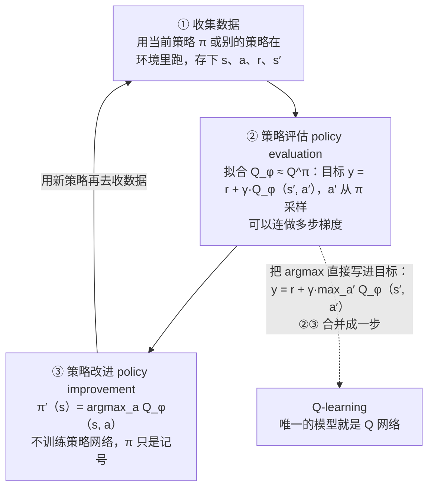
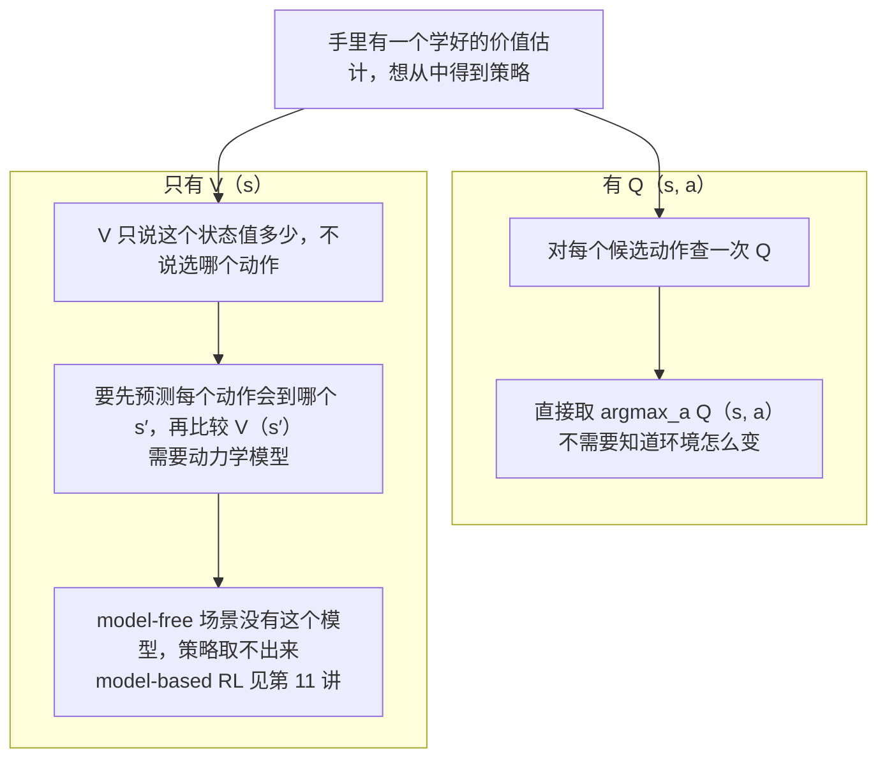
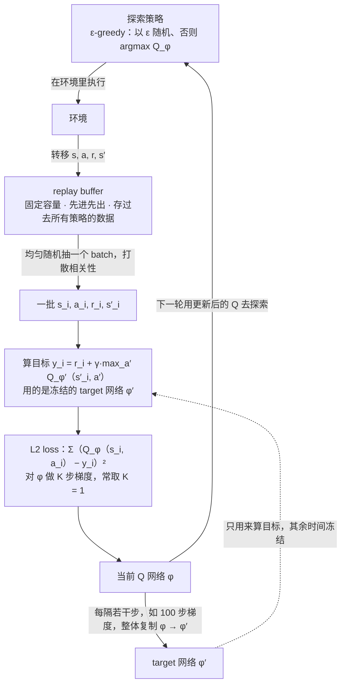
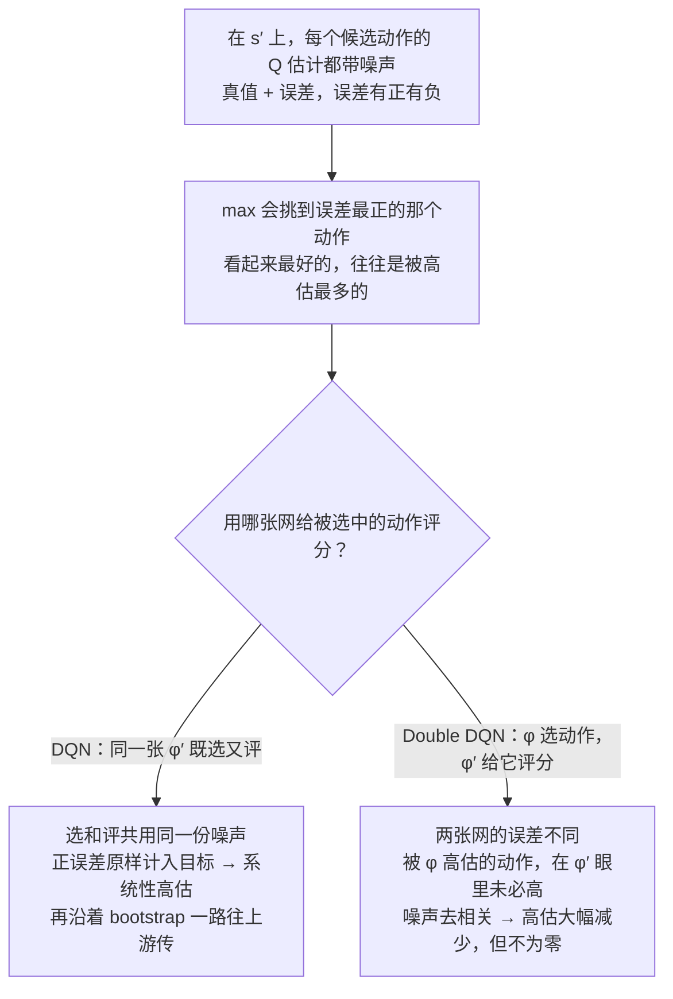
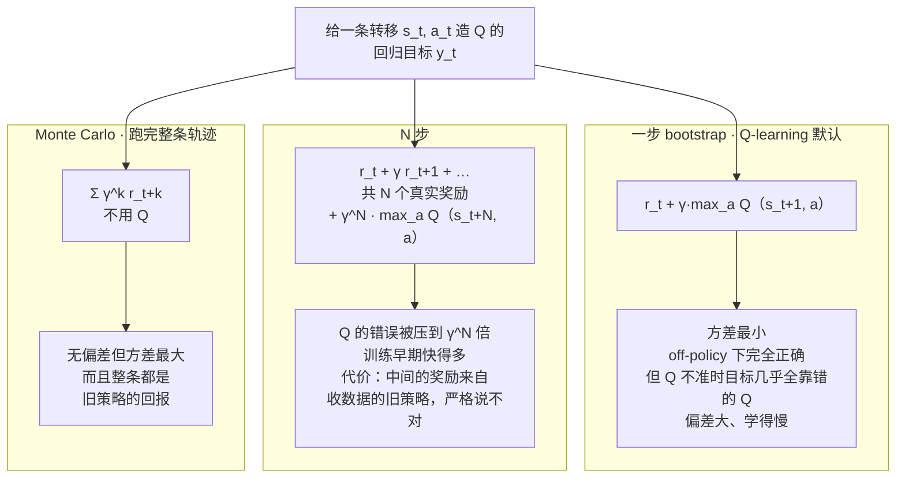
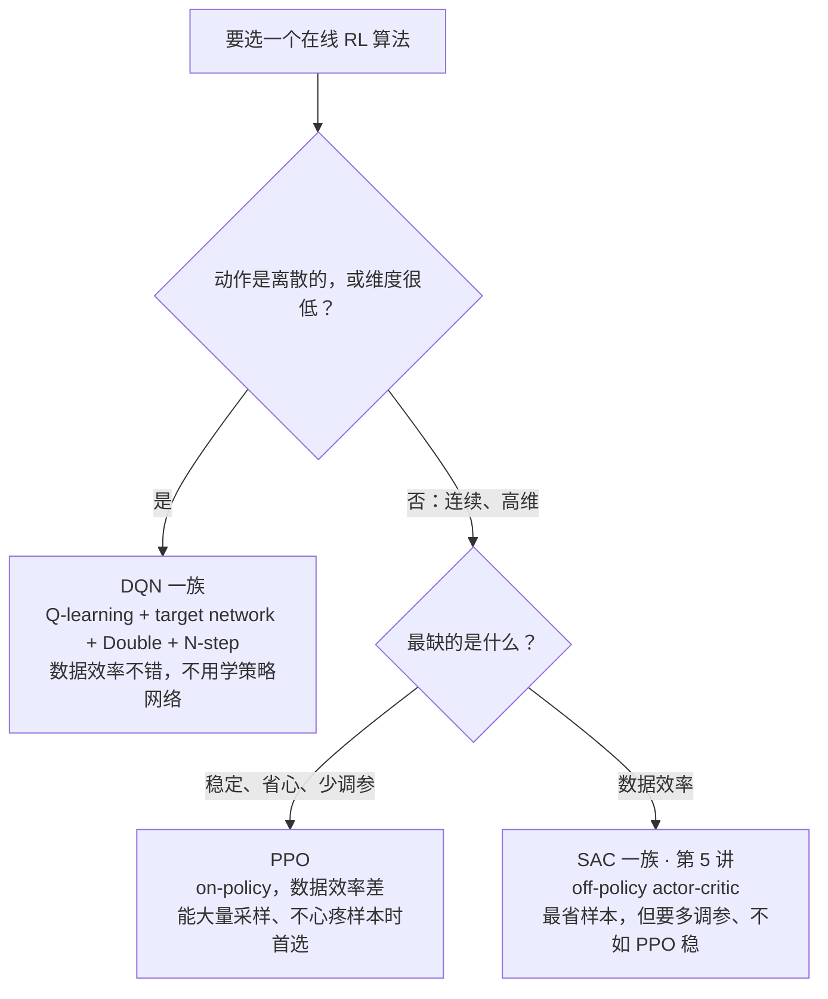

# CS224R 第 6 讲｜Q-learning

> Stanford CS224R: Deep Reinforcement Learning（2025 春）· 第 6 讲，2025 年 4 月 18 日 · 在线 RL 算法的最后一讲；之后有一节 Q-learning 复习课，第 7 讲转入 offline RL
> 视频：<https://www.youtube.com/watch?v=-7kv6jf0isQ>（1:01:40，英文字幕为自动生成，"Q" 几乎全被听成 p / t / key / two，见文末勘误）
> 讲者：Chelsea Finn（课程主讲，不是客座）
> 课程主页：<https://cs224r.stanford.edu/> · 指定阅读：[Deep Reinforcement Learning with Double Q-learning](https://arxiv.org/abs/1509.06461)（van Hasselt et al., 2015）、[A Distributional Perspective on Reinforcement Learning](https://arxiv.org/abs/1707.06887)（Bellemare et al., 2017；课程页面误链了另一篇，以这篇为准。课上没有讲到它，见第 10 节末尾的小注）

**一句话**：前几讲的算法都要学一个策略网络，这一讲把它扔掉——只学 Q 函数，行动时对每个候选动作查一次 Q、取 argmax。之所以行得通，是因为"对准确的 Q^π 取 argmax"得到的新策略一定不比原策略差（policy improvement），反复做就是 policy iteration；再把 argmax 直接写进回归目标 r + γ·max Q，评估和改进合成一步，就是 Q-learning，它逼近的是 Bellman 最优方程的解。这个目标对任何一条 (s, a, r, s′) 都成立，所以天然 off-policy，可以吃 replay buffer 里所有旧数据；但"max + 神经网络"既不稳又系统性高估，靠 DQN 的 target network、Double DQN 的选评分离、N-step 目标三个技巧，它才在 Atari 和机器人抓取上真正跑起来。

## 时间轴

| 时间 | 内容 |
|---|---|
| [0:05](https://www.youtube.com/watch?v=-7kv6jf0isQ&t=5s) | 回顾 V 与 Q 的定义、policy gradient / actor-critic / off-policy actor-critic 三种循环；今天：value-based RL，三个目标 |
| [4:17](https://www.youtube.com/watch?v=-7kv6jf0isQ&t=257s) | 思考题：手里有准确的 Q^π，取 argmax 定义新策略；2D 导航例子，同桌讨论 |
| [7:23](https://www.youtube.com/watch?v=-7kv6jf0isQ&t=443s) | 逐行推 Q^π：新策略更好但不是最优；问答：γ 小于 1 时 Q 随距离衰减，稠密奖励一轮到位 |
| [12:27](https://www.youtube.com/watch?v=-7kv6jf0isQ&t=747s) | 新策略永远不比旧的差；迭代算法：收数据 → 拟合 Q^π → argmax；唯一的网络是 Q |
| [14:32](https://www.youtube.com/watch?v=-7kv6jf0isQ&t=872s) | 问答：连续动作怎么做 max；稀疏奖励下要迭代多少轮（backup 与 horizon） |
| [16:36](https://www.youtube.com/watch?v=-7kv6jf0isQ&t=996s) | 写成算法：policy evaluation + policy improvement = policy iteration；板书 |
| [19:41](https://www.youtube.com/watch?v=-7kv6jf0isQ&t=1181s) | 问答引出 Q-learning：把 max 放进目标；两种理解；Bellman equation 与 Bellman optimality equation |
| [23:20](https://www.youtube.com/watch?v=-7kv6jf0isQ&t=1400s) | 问答：为什么用 Q 不用 V |
| [26:29](https://www.youtube.com/watch?v=-7kv6jf0isQ&t=1589s) | 术语小结；收敛性：表格能收敛，函数逼近连线性都可能发散 |
| [29:05](https://www.youtube.com/watch?v=-7kv6jf0isQ&t=1745s) | Q-learning 是 off-policy 的；为什么数据要比策略更"广"；ε-greedy 与 Boltzmann 探索 |
| [33:49](https://www.youtube.com/watch?v=-7kv6jf0isQ&t=2029s) | 完整算法：replay buffer、均匀抽 batch、L2 loss 的梯度、K 步更新；餐馆比喻；一串关于 buffer 的问答 |
| [40:31](https://www.youtube.com/watch?v=-7kv6jf0isQ&t=2431s) | 实践一：moving target 不稳 → target network → DQN（2013，Atari 从像素学起） |
| [44:02](https://www.youtube.com/watch?v=-7kv6jf0isQ&t=2642s) | 实践二：Q 值准不准？loss 上升不必慌；真实回报远低于估计：overestimation |
| [47:09](https://www.youtube.com/watch?v=-7kv6jf0isQ&t=2829s) | 为什么 max 会高估；Double Q-learning 用两张网选评分离；Double DQN 的实现 |
| [53:27](https://www.youtube.com/watch?v=-7kv6jf0isQ&t=3207s) | 实践三：N-step 目标；off-policy 带来的偏差和几种应对 |
| [58:05](https://www.youtube.com/watch?v=-7kv6jf0isQ&t=3485s) | 成功案例：Atari 超过人类、机器人抓取 96%；PPO / DQN / SAC 怎么选；总结 |

## 核心内容

### 1. 回顾与今天的三个目标

- **两个价值量**（第 4、5 讲定义过，这里再压一遍）：价值函数 V^π(s) 是从状态 s 出发、一直按策略 π 行动，未来奖励之和的期望；Q 函数 Q^π(s, a) 是先在 s 执行动作 a、之后再按 π 行动的期望回报。两者只差第一步是"随策略"还是"指定"。有折扣因子 γ 时，越远的奖励权重越小。
- **已经学过的三种循环**：
    1. policy gradient（第 3 讲）：用当前策略采样轨迹，提高未来回报高的动作的对数概率；减掉 baseline，让高于平均的动作被强化、低于平均的被抑制。
    2. actor-critic（第 4 讲）：在循环里多加一步——先估计当前策略的期望回报（critic），再拿它来改策略（actor）。
    3. off-policy actor-critic（第 5 讲）：不只用最新一轮的数据，而是想用过去所有数据。为此要从旧策略的数据里估出 Q，办法是把 Q 写成递归式：Q(s, a) 等于当下的奖励加上"下一个状态、下一个动作"的 Q。这个等式对所有 (s, a) 都成立，所以从 buffer 里抽 (s, a, s′)、从**当前**策略采一个 a′，就能做监督回归。这种"用自己的估计当标签"叫 bootstrapping；前提是数据要覆盖新策略会选的动作。
- **今天**：value-based RL，也就是 Q-learning。Finn 说它可以算是第一个深度 RL 方法（DQN）的基础。三个目标：Q 函数和策略是什么关系；怎么完全不学显式策略也能做 RL；Q-learning 不稳定时怎么救。

### 2. 思考题：拿 Q^π 取 argmax，能不能得到更好的策略

- **设定**：有一个策略 π，并且对它的 Q^π 估得很准。现在不再按 π 行动，而是在每个状态把所有候选动作的 Q^π 比一比，永远执行最大的那个：

$$
\pi'(a\mid s)=\mathbb{1}\Big[a=\arg\max_{a'} Q^{\pi}(s,a')\Big]
$$

𝟙[·] 是指示函数：条件成立取 1，否则取 0。这是一个确定性策略（deterministic policy）：概率全压在 Q 值最大的动作上。注意里面的 Q 仍然是旧策略 π 的 Q，不是新策略自己的。

- **例子**（2D 导航）：起点在一个蓝色方框里，目标是星星；到星星奖励 1，其他地方 0；为简单起见 γ = 1。当前策略是"永远向右"。同桌讨论：新策略 π′ 比 π 好、坏、一样，还是已经最优？
- **逐行推**（课上一起算的）：
    - 星星所在那一行：一直向右就能撞到星星，"向右"的 Q^π = 1；但如果某一步"向上"，之后又回到向右，就会错过，所以同一行里 Q 依动作而异。
    - 星星下面一行：向右的 Q^π = 0（永远到不了），向上的 Q^π = 1（上去一格之后按 π 向右，正好撞上）。
    - 再往下一行：向上的 Q^π 也是 0——上去之后按 π 向右，还是错过。
    - 于是 π′ 在星星那行向右，在下一行向上，在更下面的行因为所有动作 Q 都是 0，只能沿用默认的向右。
- **结论**：π′ 比 π 好（多了一整行状态能到目标），但不是最优——从起点出发它还是一路向右。有同学马上问"多迭代几次是不是就最优了"，Finn 说这正是接下来几张幻灯片要讲的。
- **问答**
    - γ 小于 1 会怎样？例子里为了简单用了 γ = 1；若 γ = 0.9，星星旁边的 Q 是 1，再远一格是 0.9，再远是 0.9²……随距离按 γ 的幂衰减；但到不了星星的那些行仍然全是 0。
    - 奖励稠密一点呢？如果奖励是"到星星的负距离"，Finn 没在黑板上推，但自己算会发现：从同一个"向右"策略出发，一次改进就得到直奔星星的策略——稀疏奖励下"目标在哪"要一行一行往回传，稠密奖励一步就把方向指明了。
- **一般结论（policy improvement）**：只要 Q^π 准确，π′ 永远至少和 π 一样好；两者相等当且仅当 π 已经最优。理由一句话：在任何状态，"先执行 Q^π 最大的动作、之后再按 π 走"的期望回报，不会低于"按 π 随机抽一个动作再按 π 走"：

$$
\max_{a} Q^{\pi}(s,a)\;\ge\;\mathbb{E}_{a\sim\pi(\cdot\mid s)}\big[Q^{\pi}(s,a)\big]=V^{\pi}(s)
$$

左边是新策略 π′ 第一步的价值，右边是旧策略的状态价值 V^π(s)；最大值不小于平均值，所以哪怕之后仍按旧策略走，也已经不亏。

> 小注：这就是教科书里的 policy improvement theorem（Sutton & Barto）。它还能往下推一步：π′ 之后每一步也都换成 argmax，回报只会更高，所以 V^{π′} ≥ V^π 对所有状态成立。

### 3. Policy iteration：只学 Q，不学策略网络

*图 6-1｜policy iteration 的循环，以及把 argmax 塞进目标之后它怎么变成 Q-learning（自绘示意）· [▶ 看原幻灯片 13:28](https://www.youtube.com/watch?v=-7kv6jf0isQ&t=808s)*

- **既然 argmax 总能改进，那就干脆别学策略网络了**。迭代算法：① 用策略跑环境收数据；② 用这批数据拟合 Q^π（也可以像第 5 讲那样 off-policy 地用旧数据）；③ 把策略定义成 argmax Q；然后拿新策略收数据、估计**新**策略的 Q^π，如此往复。整个系统里唯一的模型是 Q 网络，π 只是为了说话方便的记号。
- **两个步骤的名字**：② 叫 policy evaluation（策略评估：算清楚一个策略值多少），③ 叫 policy improvement（策略改进）；两者交替就叫 policy iteration。评估这一步可以连做多个梯度步——它不是 on-policy 的策略梯度，只是在拟合固定目标。板书里的目标和第 5 讲一样：

$$
y_i = r(s_i,a_i)+\gamma\,Q_\phi(s'_i,a'_i),\qquad a'_i\sim\pi(\cdot\mid s'_i)
$$

(s, a, s′) 来自 buffer，a′ 从当前策略采样，φ 是 Q 网络的参数；然后最小化 Q_φ(s, a) 与 y 的平方误差。CME295 第 5 讲里 PPO 的 value head 估的是 V^π，就是 policy evaluation 在 LLM 里的样子；这里评估的对象换成了 Q。

- **问答**
    - 动作是连续的怎么取 max？离散动作（上、下、左、右）最省事，直接枚举。连续动作时 argmax 本身成了一个优化问题：对动作做梯度上升原则上可行，实际效果不好；动作维度不高时，随机采一批动作、挑 Q 最高的反而更好；还有各种基于采样、逐轮细化的优化器。动作离散但空间巨大（比如文本），可以在 Q 值上做某种搜索。
        > 小注：机器人抓取里常用的"采样再细化"是 cross-entropy method（CEM），第 10 节的 QT-Opt 就是这么取 max 的；另一条路是再训一个网络专门输出 argmax，那就回到第 5 讲的 actor-critic。对 LLM 来说，"在文本动作上按价值搜索"正是 CS329A 里 PRM 引导 beam search 的思路——价值模型当 Q，搜索当 argmax（我的类比，课上没这么说）。
    - 奖励稀疏还能用吗？能，但要有心理准备：每一轮改进只把"目标在哪"的信息往回传一步（术语叫 backup），环境越大、horizon 越长，需要的迭代轮数就越多。
    - 这个策略是确定性的吗？是。这也是为什么后面不建议用它本身去收数据——每个状态只会出一种动作，数据里没有多样性。

### 4. Q-learning：把 max 写进目标，逼近 Bellman 最优方程

- **由一个问答引出**：目标里的 a′ 是"下一步做什么"，为什么从 π 采样，而不是取 max 或平均？Finn：平均（多采几个 a′）可以，能让目标更准；更妙的是把改进步骤直接写进 Q 的目标里：

$$
y_i = r(s_i,a_i)+\gamma\,\max_{a'} Q_\phi(s'_i,a')
$$

同样的 (s, a, r, s′)，唯一的改动是下一步动作不再从 π 抽，而是取让 Q_φ 最大的那个。用这个目标去拟合 Q，就是 Q-learning。

- **两种理解**：
    1. 这些目标恰好就是"新策略"（对当前 Q 取 argmax 的那个策略）的 Q 值——改进步骤已经内嵌在目标里，评估的对象直接是改进后的策略。
    2. 第 5 讲的递归式对任意策略都成立，当然也包括最优策略 π*。但最优策略还多一条性质：它在下一个状态一定选 Q 最大的动作。于是可以写一条**只对最优策略成立**的方程——把"对下一动作取期望"换成"取最大"：

$$
Q^{\pi}(s,a)=r(s,a)+\gamma\,\mathbb{E}_{s'}\Big[\mathbb{E}_{a'\sim\pi(\cdot\mid s')}\big[Q^{\pi}(s',a')\big]\Big],\qquad
Q^{*}(s,a)=r(s,a)+\gamma\,\mathbb{E}_{s'}\Big[\max_{a'} Q^{*}(s',a')\Big]
$$

前者叫 Bellman equation，对任何策略 π 成立，是策略评估时用的；后者叫 Bellman optimality equation，只有最优 Q 函数 Q* 满足（当且仅当）。E_{s′} 是对环境转移的期望，Finn 特意说明动力学未知，这一项只能靠样本 s′ 来近似。Q-learning 的更新可以看成在努力让第二个等式的左右两边相等：等式一旦成立，取 argmax 得到的就是最优策略。

- **术语提醒**：读论文会反复遇到这两个名字；口头上有人把第二个也叫 Bellman equation。两者都有对应 V 的版本。

*图 6-2｜为什么是 Q 而不是 V：从 Q 取策略只需 argmax，从 V 取策略要先知道动作会把你带到哪（自绘示意）· [▶ 看原幻灯片 23:20](https://www.youtube.com/watch?v=-7kv6jf0isQ&t=1400s)*

- **问答：为什么整堂课都在说 Q，不说 V？** V 的方程同样能写，但 Q 的好处是能直接取出策略：知道 Q 就能对动作 argmax。只知道 V(s) 的话，不知道哪个动作会带来更高的价值；原则上可以做前瞻——预测每个动作之后到哪个 s′，比较 V(s′)——但那需要动力学模型，而我们是 model-free（第 11 讲的 model-based RL 才走这条路）。所以从 V 取策略、用 V 改进策略，都比用 Q 难得多。
- **会不会收敛？** 好消息：如果状态和动作空间小到能把每个 (s, a) 的 Q 存进一张表（tabular），而且探索充分——数据把所有状态动作都覆盖到——这个算法保证收敛到最优。坏消息：除此之外没有保证；哪怕只用线性函数逼近 Q，也能构造出发散的例子。不过实践中它能被调到非常好用，课末有例子。有同学追问"如果"指什么：不是 Q 估得多准（Q 本来就是被这个过程拟合出来的），而是空间大小和数据覆盖两件事。
    > 小注：表格版 Q-learning 出自 Watkins 1989 年的博士论文，收敛证明见 Watkins & Dayan（1992）。"函数逼近 + bootstrapping + off-policy"三者同时出现就可能发散，Sutton & Barto 称之为 deadly triad——Q-learning 三样全占，所以第 7–9 节的稳定化技巧不是锦上添花，而是必需品。

### 5. Q-learning 是 off-policy 的：数据该从哪来

- **为什么 off-policy**：Bellman 最优方程对所有 (s, a) 成立，所以训练数据里的动作不必来自当前策略——第 5 讲定义过，用别的策略产生的数据来学，就叫 off-policy。
- **而且数据最好比当前策略更"广"**：目标里那个 max 要把所有候选动作都比一遍（离散动作时就是全部枚举），这就要求每个动作的 Q 都估得靠谱。某个动作如果从来没在数据里出现过，它的 Q 值可能被随手估高，max 一挑就挑中它，目标就错了。所以收数据要用一个探索策略（exploration policy），专门比确定性的 argmax 策略多试一些动作。
- **两种常见探索策略**：
    - **ε-greedy**：以概率 ε 均匀随机选一个动作，以概率 1 − ε 按 argmax Q 行动。随机那一份保证所有动作都有覆盖。训练初期 ε 大、多探索，随着 Q 越估越准逐渐调小。名字的意思：大部分时间贪心（greedy），ε 的时间不贪心。
    - **Boltzmann 探索**：按 Q 值的大小按比例选动作——把每个动作的 Q 取指数（保证为正）再归一化成一个分布，Q 高的动作选得多，低的选得少。稍复杂一些。
- **问答：连续动作怎么探索？** ε-greedy 主要用于离散动作；连续动作要先定义一个"均匀"分布（得知道动作范围），或者用标准差很大的高斯。连续动作上 Boltzmann 更常见，但具体怎么从这个分布采样，Finn 当场没想起细节，说课后在 Ed 上补。
    > 小注：Boltzmann 探索就是对 Q 做 softmax，通常还带一个温度系数；Nature 版 DQN 的 ε 是在前一百万帧里从 1.0 线性退到 0.1。第 14 讲会系统讲探索。

### 6. 完整算法：replay buffer、均匀抽样、K 步更新

- **一轮 Q-learning**：① 用某个策略（实践里就是 ε-greedy 或 Boltzmann）在环境里收数据；② 把转移 (s, a, r, s′) 加进 replay buffer；③ 从 buffer 里**均匀**抽一个 batch——刻意不用刚收回来的那几条，而是从整个 buffer 里随机抽，这样 batch 内的样本彼此不相关、近似 iid；④ 对 batch 算目标 y，最小化 L2 loss，更新 Q；⑤ 步骤 ③④ 重复 K 次，再回到 ①。

$$
\phi\;\leftarrow\;\phi-\alpha\sum_{i}\Big(Q_\phi(s_i,a_i)-y_i\Big)\,\nabla_\phi Q_\phi(s_i,a_i)
$$

L2 loss 对 φ 求导，链式法则得到"误差 × Q 对参数的梯度"；α 是学习率。y_i 虽然也含 φ，求导时当常数处理，梯度不传进目标里。

- **K 的选择**：实践中最常见的是 K = 1，收一步数据、更新一步；K 越大，每批数据被榨得越干，数据效率越高。Finn 后面说 DQN 的数据效率"看细节"，指的主要就是这类设置。
- **问答：用别的策略收数据，不会比用好策略收的数据更差吗？** 会，但这是有意为之：先学出更准的 Q，后面才能得到更优的策略——前期收点次优数据、换后期更好。Finn 的比喻：让 agent 帮你挑餐馆，一开始没吃过几家，就该多试、包括可能不好的，才知道什么叫好；等 Q 估准了再收敛到少数几家。
- **训练完的产物是 Q**；部署时的策略就是对它取 argmax 的贪心策略，不再探索。
- **问答（一串关于 buffer 的）**
    - 还叫 off-policy 吗？收数据的策略和当前策略很像啊。——叫。buffer 里有当前策略的数据，也有过去所有策略的数据；off-policy 的意思不是"不用自己的数据"，而是"不只用自己的数据"。
    - buffer 大小为 1 是不是就 on-policy 了？——差不多，但只要收数据的策略（ε-greedy）和被评估的策略（argmax）不同，严格说仍是 off-policy。
    - 每轮重新初始化 Q 吗？——不，warm start，接着上一轮的参数继续训。
    - buffer 怎么管，会不会某些状态被反复抽？——这确实重要。通常 buffer 固定容量、先进先出（FIFO），满了就丢最老的；Q-learning 的 buffer 一般很大。开头 buffer 太小，可以第一轮多收一些预填。还有异步方案：一些线程往 buffer 里写，另一些线程读 buffer 更新 Q——因为收数据和更新网络都耗时——这时更要盯紧 buffer 管理，别让某条数据被更新一千次、另一条只更新一次。

### 7. 实践技巧一：target network，DQN 的诞生

*图 6-3｜DQN 的完整循环：探索策略喂 replay buffer，均匀抽 batch，用冻结的 target 网络算目标，定期整体复制（自绘示意）· [▶ 看原幻灯片 42:31](https://www.youtube.com/watch?v=-7kv6jf0isQ&t=2551s) · 出处：[Mnih et al., 2013](https://arxiv.org/abs/1312.5602)*

- **问题**：Q-learning 用神经网络时常常不稳定。原因之一是目标 r + γ·max Q_φ 里含有正在被更新的 φ——每改一次参数，标签就跟着变（moving target），优化问题高度非平稳，K = 1 时尤其明显。
- **办法**：别让标签变得那么勤。另存一份 Q 网络参数 φ′（target network），算目标时用它，且冻结不动；只每隔一段时间（比如 100 个梯度步）把最新的 φ 整体复制过去。这样内层循环的标签固定，本质上就是在做监督学习，而监督学习稳定得多。
- **DQN**：用了 target network 的 Q-learning 就是 DQN。Finn 把它算作 2013 年出现的、按她的看法第一个深度 RL 方法：直接从游戏画面像素训练神经网络玩多款 Atari 游戏，在此之前 RL 的例子多半是低维的玩具问题。作业里要自己实现它。
    > 小注：2013 年那篇 workshop 论文已有 replay buffer，target network 是 2015 年 Nature 版加进去的：每 10,000 次更新同步一次 φ′，buffer 容量一百万条转移。
- **问答：能不能存两张 Q 值表，而不是两套参数？** 不行——循环里一直有新数据进来，新的 s′ 需要现算目标，只有参数才能对没见过的状态算 Q。

### 8. 实践技巧二：max 会系统性高估，Double DQN

- **先看 Q 值准不准**：训练曲线上，回报在涨，Q 的估计值也在涨——符合预期，Q 就是在估平均回报。一个实用提醒：Q 的 loss 在训练中往往**上升**，别慌——新收的数据回报更高，Q 值的量级变大，loss 的尺度自然跟着变大；开头到处都是 0 奖励时 loss 当然小。把 Q 值画到 Pong 的画面上也像样：必须向上接球时，"上"的 Q 明显高于"下"和"不动"；球在对面时三者差不多。
- **但和真实回报一比就露馅**：把训练后策略跑出来的真实折扣回报画成一条水平线，DQN 估的值在它上面很远——估计值一直系统性地高于真值。这叫 overestimation（高估）。Double DQN 这一算法估得准得多，高估小得多。
    > 小注：这张"估计值 vs 真值"的图出自指定阅读 van Hasselt et al., 2015；图里 DQN 的估计不仅偏高，还会随训练不稳定地跳动，Double DQN 的曲线则平且贴近真值。

*图 6-4｜max 为什么高估，以及 Double DQN 怎么把"选动作"和"评动作"拆到两张网上（自绘示意）· [▶ 看原幻灯片 47:40](https://www.youtube.com/watch?v=-7kv6jf0isQ&t=2860s) · 出处：[van Hasselt et al., 2015](https://arxiv.org/abs/1509.06461)*

- **高估从哪来**：目标里的 max 在数学上等于两步——先用 Q_φ′ 在 s′ 上挑一个 Q 最大的动作，再用**同一个** Q_φ′ 给这个动作打分。神经网络的估计总带噪声：挑动作时，噪声偏正的动作更容易被挑中；评分时用的又是同一份噪声，那份正误差就原封不动进了目标。选和评共用一份噪声，等于在系统性地"利用"噪声，目标就偏高；这个偏高又通过 bootstrapping 传给上游的 Q。
- **Double Q-learning 的想法**：用两张不同的网络——网络 A 挑动作，网络 B 给挑出的动作评分。两张网的噪声不同，A 高估的动作在 B 眼里未必高，噪声去相关之后就不再被利用。
- **实践中怎么做（Double DQN）**：我们本来就有两张网——当前网络 φ 和定期冻结的 target 网络 φ′。于是：用当前网络 φ 选动作，用 target 网络 φ′ 评分：

$$
y_{\mathrm{DQN}}=r+\gamma\,Q_{\phi'}\Big(s',\;\arg\max_{a'} Q_{\phi'}(s',a')\Big),\qquad
y_{\mathrm{Double}}=r+\gamma\,Q_{\phi'}\Big(s',\;\arg\max_{a'} Q_{\phi}(s',a')\Big)
$$

第一行是 DQN 的目标，把 max 显式写成"用 φ′ 选、再用 φ′ 评"；第二行只把 argmax 里面的下标换成 φ——不多一张网，也不多一次前向。

- **问答**
    - 能保证两张网噪声不同吗？——不能保证；有些噪声来自网络结构本身，两张网都有。但实践中效果很好，高估大幅减少——仍然不为零，图里 Double DQN 的曲线还是略高于真值。
    - φ′ 只是 φ 的旧版本，为什么噪声就不一样了？——φ′ 是过时的，φ 自那之后又吃了很多梯度更新和新数据；噪声不只来自初始化，也来自"做了哪些更新"，两者的误差模式确实不同。
    - 三张、四张网会更好吗？——Finn 觉得值得一试：如果噪声来源是随机的，更多独立样本可能有帮助；如果来自结构这类固定因素，就未必。
    > 小注：原始 Double Q-learning（van Hasselt, 2010）是表格版，维护两张独立的 Q 表、每次随机更新其中一张；Double DQN 的贡献正是"不加网络，直接借用 target network 当第二个估计器"。连续动作的 actor-critic 里同样的高估问题由 TD3 的 clipped double Q（两个 critic 取 min）处理，SAC 也沿用了这个做法。

### 9. 实践技巧三：N-step 目标

*图 6-5｜一步 bootstrap、N 步、Monte Carlo 三种目标的偏差-方差取舍（自绘示意）· [▶ 看原幻灯片 54:27](https://www.youtube.com/watch?v=-7kv6jf0isQ&t=3267s)*

- **动机**：目标 r + γ·max Q 里，Q 准的时候 max Q 那一项承担了大部分信息；Q 不准的时候（训练初期）真正可靠的只有那一个 r，而单步奖励对"这个 (s, a) 到底值多少"说明不了太多，学得慢。
- **回忆第 4 讲**：估回报有三种做法：Monte Carlo 把整条轨迹的奖励加起来（无偏但方差大）；一步 bootstrap 用 r + V(s′)（方差小，偏差来自 V 的错误）；N-step 折中——先加 N 步真实奖励，第 N 步之后接价值估计。搬到 Q 上：

$$
y_t=\sum_{k=0}^{N-1}\gamma^{k}\,r_{t+k}\;+\;\gamma^{N}\max_{a}Q_{\phi'}(s_{t+N},a)
$$

前 N 步用 buffer 里记录的真实奖励，第 N 步之后的状态 s_{t+N} 上再取 max Q 来 bootstrap；Q 的错误被乘上 γ^N，影响变小。

- **有同学一眼看出问题**：off-policy 时这 N 个奖励来自当初收数据的那个策略，不是我们想评估的最优策略——中间那几步它可能走了别的动作。N = 1 时没这个问题，因为 r 只取决于 (s, a)。所以 N-step 目标在 Q-learning 里**严格说是错的**：训练早期更少依赖坏 Q、学得快得多，代价是估的不完全是 Q*。
- **怎么办**：
    1. 最常见、也最不讲道理的答案——当它不存在，照用 N 大于 1。尽管不正确，N-step 在实践里非常经常地显著提升效果。
    2. 动态选 N：只用和当前策略一致的那一段数据——看记录里的动作是否等于当前 Q 的 argmax，一致就往下数，不一致就在那里截断。只在动作空间小、数据基本 on-policy 时值得做。
    3. 训练后期把 N 调小——Q 准了之后一步目标就够。
    4. 用 importance sampling 给这些奖励加权，修正策略不一致。
    > 小注：Rainbow（Hessel et al., 2018）的消融里，N = 3 的多步目标是对 DQN 提升最大的组件之一，用的就是"照用"的第 1 种做法；带 importance-sampling 修正并截断权重的版本是 Retrace（Munos et al., 2016）。CME295 第 5 讲的 GAE，本质是对不同 N 的 N-step 估计做指数加权平均。

### 10. 成功案例、选型建议与总结

- **Atari**：Q-learning 在很多 Atari 游戏上超过大多数人类玩家；幻灯片上那张长条形图，横线以上是达到或超过人类水平的游戏，以下是不如人类的。
- **机器人抓取**：一个连续动作的例子——Q 函数由 Q-learning 训练，行动时对动作做连续优化来近似 argmax；抓取成功率约 96%。上一讲说过 RL 能给出成功率更高、更可靠的策略，这里又是一例；而且需要先绕着物体调整位姿再抓时，它也能自己学会——整个过程被当成一个序贯决策问题在优化。
    > 小注：应为 QT-Opt（Kalashnikov et al., 2018）：用 7 台机械臂收集了约 58 万次真实抓取，用 CEM 在动作空间里取 max，在没见过的物体上 96% 成功率。

*图 6-6｜Finn 的选型建议：先看动作空间，再看你更缺稳定性还是更缺样本（自绘示意）· [▶ 看原幻灯片 1:00:12](https://www.youtube.com/watch?v=-7kv6jf0isQ&t=3612s)*

- **三种在线算法怎么选**（这是最后一个在线 RL 方法，Finn 顺便给建议）：
    - **PPO**：最看重稳定性和易用性时选它，基本不用怎么调参；但数据效率很差，适合能大量采样、不心疼样本的场景。CME295 第 5 讲和 CS329A 里 LLM 的 RL 用它，正是因为对 LLM 来说采样只是推理，而稳定性更值钱。
    - **DQN**：动作离散或低维时很好，数据效率可以相当不错，取决于实现细节（例如 K）。
    - **SAC 及其变体**：最在乎数据效率时选它，但要多调参，稳定性不如 PPO。
- **总结**：Q-learning 与它在实践中的三个技巧——target network、Double DQN、N-step 目标；两个术语——Bellman equation 与 Bellman optimality equation；核心思想——不学显式策略也能做 RL。在线 RL 算法到此告一段落，第 7 讲进入 offline RL：手里只有一份固定数据集、不能再交互时怎么办——那是 off-policy 推到极限的情形，本讲"数据要覆盖 max 会考虑的动作"这条警告会变成主角。
    > 小注：指定阅读的第二篇（Bellemare et al., 2017，算法名 C51）课上没有讲。它的想法是把 Q(s, a) 这一个标量换成"回报的整个分布"来学：把回报离散成 51 个支点，用分布版的 Bellman 算子做目标，再用交叉熵拟合。"平均 10 分"和"一半 0 分、一半 20 分"在标量 Q 下无法区分，分布式 RL 能。读它时可以对照第 4 节：Bellman 最优方程作用的对象从一个数变成一个分布。

## 关键图表速查（点时间戳跳到原幻灯片）

| 图 | 看什么 | 跳转 | 出处 |
|---|---|---|---|
| 2D 导航思考题 | 蓝框起点、星星目标、"永远向右"的策略；按行标出各动作的 Q^π 是 1 还是 0 | [5:50](https://www.youtube.com/watch?v=-7kv6jf0isQ&t=350s) | — |
| 迭代算法三步 | 收数据 → 拟合 Q^π → π 定义为 argmax；注意没有策略网络 | [13:28](https://www.youtube.com/watch?v=-7kv6jf0isQ&t=808s) | — |
| Q-learning 目标 | 与 policy iteration 板书的唯一区别：a′ 的采样换成 max | [20:43](https://www.youtube.com/watch?v=-7kv6jf0isQ&t=1243s) | — |
| Bellman equation 与 Bellman optimality equation | 两条方程并排，差别只在"对 a′ 取期望"还是"取 max" | [26:29](https://www.youtube.com/watch?v=-7kv6jf0isQ&t=1589s) | — |
| 收敛性的好消息与坏消息 | 表格 + 充分探索能收敛；线性函数逼近也可能发散 | [27:34](https://www.youtube.com/watch?v=-7kv6jf0isQ&t=1654s) | — |
| ε-greedy 与 Boltzmann | 两种探索策略的写法；ε 随训练退火 | [30:06](https://www.youtube.com/watch?v=-7kv6jf0isQ&t=1806s) | — |
| 完整 Q-learning 算法 | 收数据 → 进 buffer → 均匀抽 batch → 梯度更新 × K；梯度式里是误差乘 ∇Q | [33:49](https://www.youtube.com/watch?v=-7kv6jf0isQ&t=2029s) | — |
| target network / DQN 算法 | 目标里用冻结的 φ′；内层循环成了监督学习；定期复制 | [41:31](https://www.youtube.com/watch?v=-7kv6jf0isQ&t=2491s) | [Mnih et al., 2013](https://arxiv.org/abs/1312.5602) |
| 回报与 Q 值的训练曲线 | 两者一起上升；顺带记住 loss 上升不必慌 | [44:33](https://www.youtube.com/watch?v=-7kv6jf0isQ&t=2673s) | [Mnih et al., 2013](https://arxiv.org/abs/1312.5602)（推断） |
| Pong 画面上的 Q 值 | 该向上时"上"的 Q 明显高；球在对面时三个动作差不多 | [45:36](https://www.youtube.com/watch?v=-7kv6jf0isQ&t=2736s) | [Mnih et al., 2015](https://www.nature.com/articles/nature14236)（推断） |
| 估计值 vs 真实回报 | 红色水平线是真值，DQN 的估计远在其上；Double DQN 贴近得多 | [46:37](https://www.youtube.com/watch?v=-7kv6jf0isQ&t=2797s) | [van Hasselt et al., 2015](https://arxiv.org/abs/1509.06461) |
| 高估的拆解 | max 写成"用同一张网选、再用同一张网评"；Double DQN 只改 argmax 里的下标 | [47:40](https://www.youtube.com/watch?v=-7kv6jf0isQ&t=2860s) | 同上 |
| N-step 目标板书 | N 个真实奖励加 γ^N 倍的 max Q；随后列出 off-policy 偏差的应对 | [54:58](https://www.youtube.com/watch?v=-7kv6jf0isQ&t=3298s) | — |
| Atari 条形图与机器人抓取 | 横线以上超过人类；抓取是连续动作的 Q-learning，96% 成功率 | [58:05](https://www.youtube.com/watch?v=-7kv6jf0isQ&t=3485s) | [Mnih et al., 2015](https://www.nature.com/articles/nature14236) · 应为 [QT-Opt](https://arxiv.org/abs/1806.10293) |

## 提到的工作

| 名称 | 在本讲里的作用 |
|---|---|
| policy gradient（第 3 讲）、actor-critic（第 4 讲）、off-policy actor-critic（第 5 讲） | 开场回顾的三种循环；Q-learning 从第 5 讲的 Q 目标改一个 max 得来 |
| policy iteration（policy evaluation + policy improvement） | 本讲第一个算法：只学 Q，策略是 argmax；Q-learning 是它的合并版 |
| Bellman equation / Bellman optimality equation | 策略评估与最优性的两条方程；Q-learning 在逼近后者 |
| Q-learning（应出自 Watkins, 1989；课上未点名） | 主线算法 |
| ε-greedy、Boltzmann 探索 | 收数据用的两种探索策略 |
| replay buffer | off-policy 数据的容器：均匀抽样去相关、FIFO、预填、异步读写 |
| [DQN](https://arxiv.org/abs/1312.5602)（Mnih et al., 2013；Nature 版 2015） | target network + replay buffer 的 Q-learning；Atari 从像素学起；作业要实现 |
| [Double DQN](https://arxiv.org/abs/1509.06461)（van Hasselt et al., 2015，指定阅读） | 高估的诊断图与"当前网选、target 网评"的修法 |
| Double Q-learning（van Hasselt, 2010；推断） | 两张网选评分离的原始想法 |
| N-step return（第 4 讲已用于 actor-critic） | 第三个技巧；off-policy 偏差与几种应对 |
| importance sampling | N-step 偏差的修正手段之一，课上只提名字 |
| Atari 基准 | DQN 超过人类的成功案例 |
| 机器人抓取（应为 [QT-Opt](https://arxiv.org/abs/1806.10293)，Kalashnikov et al., 2018） | 连续动作 Q-learning 的成功案例，96% 成功率 |
| PPO、SAC | 结尾选型建议里的另外两种在线算法 |
| [Distributional RL / C51](https://arxiv.org/abs/1707.06887)（Bellemare et al., 2017，指定阅读） | 课上没讲；见第 10 节末尾的小注 |
| Ed（课程论坛）、作业 | Boltzmann 连续采样的细节课后补；DQN 是作业内容 |

## 术语对照

| English | 中文 |
|---|---|
| value function V^π(s) | 状态价值函数：从 s 出发按 π 行动的期望回报 |
| Q function / action-value Q^π(s, a) | 动作价值函数：先做 a、再按 π 行动的期望回报 |
| value-based RL | 基于价值的 RL：只学价值函数，不学显式策略 |
| greedy policy / argmax policy | 贪心策略：每个状态选 Q 最大的动作 |
| deterministic policy | 确定性策略：每个状态只出一个动作 |
| policy evaluation | 策略评估：估计给定策略的 V 或 Q |
| policy improvement | 策略改进：对 Q 取 argmax 得到更好的策略 |
| policy iteration | 策略迭代：评估与改进交替 |
| Bellman equation | Bellman 方程：Q^π 的递归式，对 a′ 取期望 |
| Bellman optimality equation | Bellman 最优方程：Q* 的递归式，对 a′ 取 max |
| optimal policy π* / Q* | 最优策略与最优 Q 函数 |
| discount factor γ | 折扣因子：越远的奖励权重越小 |
| bootstrapping | 自举：用自己的估计当回归目标 |
| backup | 回传：把下游的价值信息传回上游状态一步 |
| horizon | 决策步数的长度；稀疏奖励下要迭代的轮数与之相当 |
| tabular | 表格法：每个 (s, a) 单独存一个 Q 值 |
| function approximation | 函数逼近：用神经网络等参数化模型表示 Q |
| convergence / divergence | 收敛 / 发散 |
| off-policy | 用其他策略（含过去的自己）产生的数据训练 |
| coverage | 覆盖：数据是否包含 max 会考虑的所有动作 |
| exploration policy | 探索策略：为收数据而故意多试动作的策略 |
| ε-greedy | ε 概率随机、其余贪心 |
| Boltzmann exploration | 玻尔兹曼探索：按 exp(Q) 归一化后的概率选动作 |
| anneal ε | 退火：训练中逐步调小 ε |
| replay buffer | 经验回放池：存过去转移，随机抽样训练 |
| transition (s, a, r, s′) | 一条转移记录 |
| i.i.d. / decorrelate | 独立同分布 / 去相关：均匀抽样打散相邻样本的相关性 |
| FIFO | 先进先出：buffer 满了丢最老的 |
| warm start | 热启动：接着上一轮参数继续训 |
| moving target / non-stationary | 移动的目标 / 非平稳：标签随参数一起变 |
| target network φ′ | 目标网络：冻结的 Q 参数副本，只用来算目标 |
| DQN (Deep Q-Network) | 深度 Q 网络 |
| overestimation | 高估：估计值系统性高于真实回报 |
| Double DQN | 双 DQN：当前网络选动作、目标网络评分 |
| N-step return | N 步回报：N 个真实奖励加第 N 步后的价值估计 |
| Monte Carlo return | 蒙特卡洛回报：整条轨迹奖励之和，不用价值估计 |
| bias / variance | 偏差 / 方差 |
| importance sampling | 重要性采样：按策略概率比给样本加权以修正分布差异 |
| data efficiency | 数据效率：达到同样效果需要多少环境样本 |
| SAC (Soft Actor-Critic) | 软 actor-critic：off-policy 的连续动作算法 |

## 字幕勘误

自动字幕把 "Q" 听成了各种词，通读时先把它们都换回来："p value / t value / key value / key function / two function / tube function / tree function / cube function / C function" → Q value、Q function；"qpi / qi / 2 pi / Q pi" → Q^π；"the 2" → the Q。其他："value functions entry functions" → value functions and Q functions；"active criticisms / actritic" → actor-critic；"last semester" → last lecture；"GQM / DQ / DQM" → DQN；"Belman / solving equation / solvality equation / sol equation" → Bellman equation、Bellman optimality equation；"optional policy / optical policy" → optimal policy；"F1 3D policy" → ε-greedy policy；"Bolton distribution" → Boltzmann distribution；"five star / five prime / U5 prime" → φ′（target 网络参数）；"double D" → Double DQN；"Tucka" → 应为 Seaquest（推断）；"mstep / ends up / nstep returns" → N-step returns；"bonner" → Monte Carlo；"bootstropping" → bootstrapping；"important sampling" → importance sampling；"PTO / SAT / soft critic" → PPO、SAC、Soft Actor-Critic；"homeless" → homework；"edge" → Ed；"deorrelating" → decorrelating。

## 带走的问题

1. 第 2 节的 2D 例子里，从"永远向右"出发，policy iteration 要迭代多少轮才能让起点也走对？把奖励换成"到星星的负距离"为什么一轮就够？这对你给 agent 设计奖励有什么提示？
2. Q-learning 的目标对任意 (s, a, r, s′) 成立，所以能用任何来源的数据。那第 7 讲的 offline RL 直接拿一份固定数据集跑 Q-learning，会在哪一步出问题？提示：max 会考虑数据里没出现过的动作。
3. Double DQN 只把 argmax 里的下标从 φ′ 换成 φ。如果反过来——用 φ′ 选动作、用 φ 评分——高估会减轻吗？为什么论文选前者？
4. N-step 目标在 off-policy 下"严格说是错的"，但实践里几乎总是有用。你能说清它错在哪、又为什么有用吗？如果 buffer 里的数据来自一个非常差的旧策略，N 该取大还是取小？
5. 把 Q-learning 搬到 LLM：状态是 prompt 加已生成的 token，动作是下一个 token，Q 是"接下来这么写最终得分的期望"。max 要遍历整个词表，target network 和 replay buffer 还需要吗？哪些困难是 PPO / GRPO（CME295 第 5 讲、CS329A）没有的？
