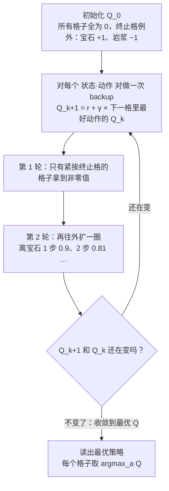
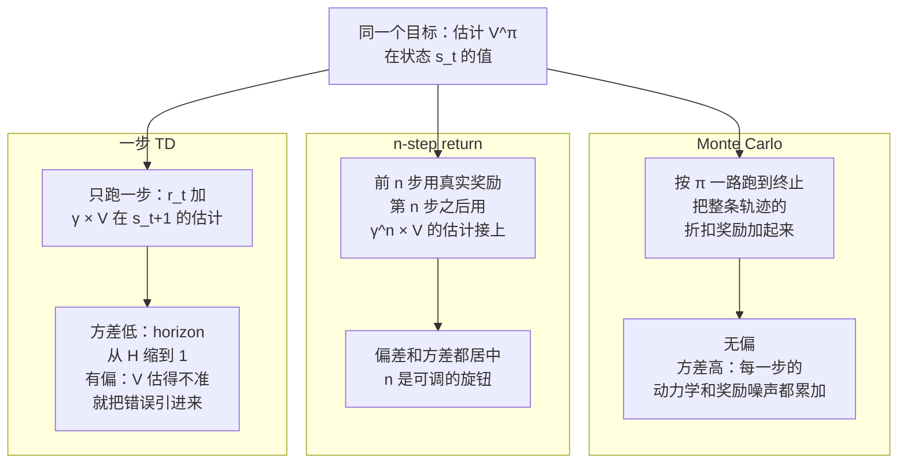
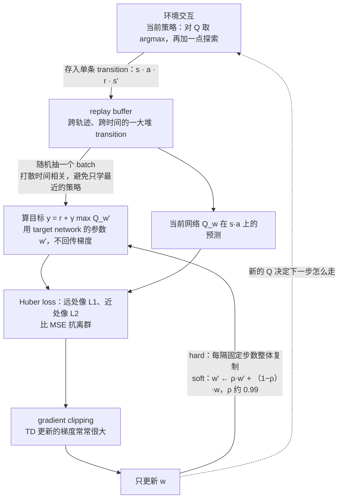
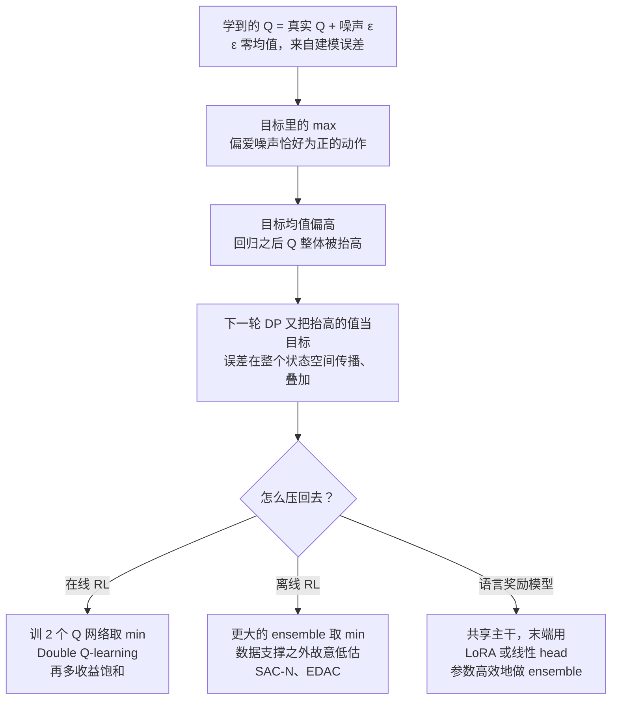

# CS224R 复习课｜Q-learning 回顾（Tutorial Session: Review of Q-Learning）

> Stanford CS224R: Deep Reinforcement Learning（2025 春，主讲 Chelsea Finn）· 课程表上的 "Extra section on Q-learning" 助教复习课，2025 年 4 月 18 日，排在第 6 讲之后
> 视频：<https://www.youtube.com/watch?v=07MQNMcxhZU>（50:39，英文字幕为自动生成，人名、缩写错得多，见文末勘误）
> 讲者：助教 Anikait（开场自报姓名，字幕写作 "Anakiette"；应为 Chelsea Finn 组的博士生 Anikait Singh，推断）· 不是 Chelsea Finn，也不是客座讲座
> 课程主页：<https://cs224r.stanford.edu/> · 本讲无指定阅读；理论推导见第 6 讲笔记；助教发的 PDF 附有可以自己改 grid world 的 Colab（课上提到，链接未给）

**一句话**：Q-learning 的全部内容是一条自洽关系——一个状态-动作对的价值，等于当下奖励加上 γ 倍"下一状态里最好动作的价值"。表格环境里把这条关系当更新规则反复套，价值就从终止格一圈圈往外传，argmax 就是最优策略；换成神经网络后，同一条关系变成回归问题，用一步 TD 目标换低方差、付出偏差。复习课后半段全是让这个回归稳定下来的工程手段：stop-gradient 与 target network、gradient clipping 与 Huber loss、按 transition 存的 replay buffer，以及针对 max 算子带来的系统性高估的 ensemble 取 min。

## 时间轴

| 时间 | 内容 |
|---|---|
| [0:06](https://www.youtube.com/watch?v=07MQNMcxhZU&t=6s) | 开场：助教自我介绍；四段提纲——MDP 回顾、表格型 Q iteration、参数化 Q-learning 的 TD 与 MC 取舍、实现细节 |
| [1:11](https://www.youtube.com/watch?v=07MQNMcxhZU&t=71s) | MDP 复习：状态、动作、转移动力学、奖励、初始状态、折扣 γ、horizon；grid world 里的机器人与宝石 |
| [2:41](https://www.youtube.com/watch?v=07MQNMcxhZU&t=161s) | 三个量：V^π、Q^π、advantage 各自回答什么问题 |
| [4:44](https://www.youtube.com/watch?v=07MQNMcxhZU&t=284s) | Bellman 最优方程改写成迭代更新；grid world 里价值从终止格往外传（6:16 起逐轮演示） |
| [7:47](https://www.youtube.com/watch?v=07MQNMcxhZU&t=467s) | 问答：Bellman 方程与迭代式的区别；"Q 出现在等号两边就是 DP"的判别法；Q_0 怎么初始化 |
| [11:21](https://www.youtube.com/watch?v=07MQNMcxhZU&t=681s) | 最优 V、Q、π 三图对照：γ = 0.9 时价值按步数衰减；策略就是 argmax |
| [12:55](https://www.youtube.com/watch?v=07MQNMcxhZU&t=775s) | 问答：只学策略行不行——policy gradient 的方差与 Q 函数的偏差 |
| [14:28](https://www.youtube.com/watch?v=07MQNMcxhZU&t=868s) | advantage 在 grid world 里的样子：最优策略下处处不大于 0；次优策略的 Q^π 与 critic 的用法（16:30） |
| [18:02](https://www.youtube.com/watch?v=07MQNMcxhZU&t=1082s) | 表格法为何不可扩展；V 网络、连续 Q 网络、离散 Q 网络三种参数化 |
| [21:38](https://www.youtube.com/watch?v=07MQNMcxhZU&t=1298s) | 白板推导：从 Monte Carlo 回报拆出一步 TD 目标（改编自 Sutton & Barto） |
| [25:54](https://www.youtube.com/watch?v=07MQNMcxhZU&t=1554s) | MC 与 TD 的偏差–方差；n-step return；两张图与一张三行表（29:29）；语言场景与机器人场景的差别 |
| [32:06](https://www.youtube.com/watch?v=07MQNMcxhZU&t=1926s) | Stitching：一步 DP 能把两段轨迹拼成最优路径 |
| [33:08](https://www.youtube.com/watch?v=07MQNMcxhZU&t=1988s) | 实现细节一、二：stop-gradient 与 target network（白板写 TD 回归的 loss，35:45）；gradient clipping 与 Huber loss（38:18） |
| [39:49](https://www.youtube.com/watch?v=07MQNMcxhZU&t=2389s) | 实现细节三：replay buffer 为什么按 transition 存；问答：带历史的 critic（41:53） |
| [42:54](https://www.youtube.com/watch?v=07MQNMcxhZU&t=2574s) | 过估计：max 算子把零均值噪声变成正偏差，并在 DP 里层层叠加 |
| [46:58](https://www.youtube.com/watch?v=07MQNMcxhZU&t=2818s) | Double DQN 论文里的图；critic ensemble 取 min；在线两个够用、离线要更多（SAC-N、EDAC）；语言奖励模型的类比 |

## 核心内容

### 1. 这节课在整门课里的位置

- **定位**：排在第 6 讲之后的助教复习课，目标不是推新理论，而是把 Q-learning 从表格例子一路走到训得动的神经网络版本。助教的提纲有四段：MDP 记号、表格环境里的 fitted Q iteration、参数化 Q-learning 里 TD 与 Monte Carlo 的取舍、让训练稳定的实现细节。理论推导见第 6 讲，这里只保留跟着例子走所需的部分。
- **MDP 的词汇**（第 1 讲定义过）：agent 在环境里一步步行动。一个 MDP（Markov decision process）由状态集合 S、动作集合 A、转移动力学 p(s' | s, a)（在 s 做 a 之后落到 s' 的概率）、奖励 r(s, a)、初始状态分布、折扣因子 γ 和 horizon H（一条轨迹的长度）组成。一串状态-动作叫轨迹 τ；把轨迹上的奖励按 γ^k 折扣后加总叫回报（return）。目标是最大化期望回报。表格环境里，策略 π 就是"每个格子该走哪一步"的一张表。
- **贯穿全课的例子**：网格里的小机器人要走到右上角的宝石格，中途有一格岩浆。

### 2. V、Q、advantage：三个量各回答什么问题

- **V^π(s)**（value function，价值函数）：站在状态 s、之后一直按策略 π 行动，期望还能拿到多少回报。它只看状态。
- **Q^π(s, a)**（Q function）：先在 s 执行动作 a，之后再按 π 行动，期望还能拿多少。比 V 多一个可以"试探"的自由度——同一个状态下比较不同动作。
- **两者的关系**：对动作按策略取期望，Q 就变回 V。
- **advantage A^π(s, a)**（优势）：这个动作比"按策略的平均水平"好多少。CME295 第 5 讲 PPO 里减 baseline 用的就是它，这里是它在 MDP 里的原始定义。

$$
V^{\pi}(s)=\mathbb{E}_{a\sim\pi(\cdot\mid s)}\big[Q^{\pi}(s,a)\big],\qquad A^{\pi}(s,a)=Q^{\pi}(s,a)-V^{\pi}(s)
$$

V^π 是 Q^π 对策略 π 选出的动作取的平均；A^π 是某个具体动作的 Q 减去这个平均，为正说明这个动作比策略的平均表现好。

### 3. 表格型 Q iteration：价值从终止格往外传

*图 T-1｜表格型 Q iteration：把 Bellman 关系当更新规则反复套，价值从终止格一圈圈向外传播（自绘示意）· [▶ 看原幻灯片 6:16](https://www.youtube.com/watch?v=07MQNMcxhZU&t=376s) · 出处：[Sutton & Barto, 2018](http://incompleteideas.net/book/the-book-2nd.html)*

- **Bellman 最优方程**说的是一条自洽关系：最优 Q 在 (s, a) 上的值，等于当下奖励加上 γ 倍"下一状态里最好动作的最优 Q"，对转移的随机性取期望。它没有任何"第几轮"的下标，只是最优解必须满足的性质。
- **变成算法**：给等号两边加上轮次下标——右边用第 k 轮的 Q_k 算，得到第 k+1 轮的 Q_{k+1}——就是 Q iteration，一种动态规划（dynamic programming，DP）。

$$
Q^{*}(s,a)=\mathbb{E}_{s'\sim p(\cdot\mid s,a)}\Big[r(s,a)+\gamma\max_{a'}Q^{*}(s',a')\Big]\quad\Longrightarrow\quad Q_{k+1}(s,a)\leftarrow\mathbb{E}_{s'\sim p(\cdot\mid s,a)}\Big[r(s,a)+\gamma\max_{a'}Q_{k}(s',a')\Big]
$$

左边是 Bellman 最优方程：Q* 是"当下奖励加 γ 倍下一状态最优动作价值"这个关系的不动点；右边把同一关系写成第 k 轮到第 k+1 轮的更新，s' 按转移动力学 p 取期望，表格里就是对可能的下一格加权求和。

- **grid world 走一遍**：五个动作（原地、左、右、上、下）；走进右上角宝石格得 +1，走进中间偏上的岩浆格得 −1，两者都是终止格；γ 小于 1 让机器人尽快到达、别乱逛。Q_0 在所有格子都是 0，只有终止格例外——在那里不管做什么动作都立刻拿到 +1 或 −1。第 1 轮更新后，只有紧挨宝石的格子拿到非零值；第 2 轮再往外扩一圈；如此反复，整张网格被填满，Q 收敛。
- **问答里的三个澄清**
    - Bellman 方程和迭代式的区别：前者无下标、只是最优解的性质；后者带轮次下标，是从终止格出发反复套用它的过程。
    - 怎么一眼分辨 DP 和 Monte Carlo：更新式的等号两边都出现 Q——用自己的估计更新自己，术语叫 bootstrapping——就是 DP 风格；只出现奖励的，是 Monte Carlo。
    - Q_0 不是随手编的：表格设定里约定全零初始化，Q_1 就是套一次更新的结果。
    > 小注：这个迭代为什么一定收敛、收敛到的为什么是 Q*，靠的是 Bellman 算子在 γ 小于 1 时是压缩映射，推导见第 6 讲。

### 4. 最优 V、Q、π 三图对照，以及 advantage 长什么样

- 最优价值 V*：γ = 0.9 时，宝石格 +1，离它一步的格子 0.9，两步 0.81，依此衰减；岩浆格 −1。
- 最优 Q*：既可以由上面的迭代收敛得到，也可以解析算出。
- 最优策略 π*：在完全可观测的 MDP 里最优策略是确定性的，就是每个格子对 Q* 取 argmax；画出来是从任意格子到宝石的最短路径。
- **问答：只学策略不就够了？** 表格里策略正是从 Q 的 argmax 里读出来的，没有 Q 就没有全局的"哪里值多少"。只学策略的方法（第 3 讲的 policy gradient）也存在，但奖励或动力学一有噪声，方差就上来了；Q 函数是用一点偏差换掉这些方差。哪种更好取决于环境。
- **advantage 图**：在最优策略下 advantage 处处小于等于 0——最优动作为 0（并列最优也是 0，例如左下角格子往上和往右一样好），其余为负，朝岩浆走的动作负得最多。
- **次优策略**：换一个随机的策略 π，Q^π 和 Q* 明显不同，策略甚至会走进岩浆。但正因为 Q^π 是"对着当前策略"算的，它能告诉你哪些动作比现在做的更好——这就是第 4 讲 actor-critic 里 critic 的用法：拿 Q^π 做一步策略改进。Q* 已经收敛，对应的 π* 没有改进空间。

### 5. 从表格到神经网络：三种参数化

- **表格为什么不可扩展**：状态或动作一多，表就有成千上万甚至上百万行，学不动，也不会泛化。用神经网络参数化 Q，相近的状态（语义上或字面上相近）自然得到相近的 Q 值——这种平滑性是表格没有的。
- **三种网络形状**
    - V 网络：输入 s，输出一个标量。V 不依赖动作，所以只有这一种参数化。
    - 连续动作的 Q 网络：输入 (s, a)，输出一个标量。动作没法穷举，要对动作取期望时只能从策略里采样，得到的是采样估计。
    - 离散动作的 Q 网络：输入 s，输出一个向量，每个动作一个 Q 值（grid world 就是 5 维）。可以精确地对所有动作取期望或取 max；只要动作集合可枚举，就推荐这种。

### 6. 白板推导：从 Monte Carlo 回报到一步 TD

*图 T-2｜同一个价值，三种估法：真实奖励用几步、估计值从哪一步接上（自绘示意）· [▶ 看原幻灯片 29:29](https://www.youtube.com/watch?v=07MQNMcxhZU&t=1769s) · 出处：[Sutton & Barto, 2018](http://incompleteideas.net/book/the-book-2nd.html)*

- **起点**：V^π(s) 是从 s 出发、按 π 行动的期望回报，回报展开成折扣奖励之和。直接按定义估计——跑完整条轨迹把奖励加起来、多跑几条取平均——就是 Monte Carlo（MC）估计。
- **拆一步**：把 k = 0 那一项（当下奖励）单独拎出来，剩下的求和整体提出一个 γ；剩下那部分正好是"从下一个状态出发的回报的期望"，也就是 V^π(s_{t+1})。于是 V^π(s) 等于 r_t 加 γ V^π(s_{t+1}) 的期望。这就是一步 TD（temporal difference）目标：真实奖励只用一步，后面全部交给自己的估计。
- **拆 n 步**：同样的展开做 n 次，前 n 步用真实奖励、第 n 步之后用 γ^n V^π(s_{t+n}) 接上，就是 n-step return。助教说 Q 函数的推导完全平行。

$$
V^{\pi}(s)=\mathbb{E}_{\pi}\Big[\sum_{k=0}^{\infty}\gamma^{k}\,r(s_{t+k},a_{t+k})\,\Big|\,s_t=s\Big]=\mathbb{E}_{\pi}\Big[\sum_{k=0}^{n-1}\gamma^{k}\,r(s_{t+k},a_{t+k})+\gamma^{n}\,V^{\pi}(s_{t+n})\,\Big|\,s_t=s\Big]
$$

左边是 MC 的定义：整条轨迹的折扣奖励之和；右边是 n-step 形式，前 n 步真实奖励、之后用 V^π 的估计代替。n = 1 是一步 TD，n 取到整条轨迹就回到 MC。

- **偏差–方差**：MC 无偏，但每一步的动力学噪声和奖励噪声都会累加，horizon 越长方差越大；TD 把 horizon 缩到 1，方差大幅下降，代价是把 V 的估计误差引进来（有偏）。n 是两者之间的旋钮。
- **问答**：表格设定下 MC 和 TD 收敛到同一个答案；用了函数逼近之后未必。
- **环境决定选哪个**：语言场景里动力学几乎确定、数学和代码的奖励可以精确验证，所以大家直接用 MC rollout——CS329A 里的 GRPO 就是用组内 MC 回报做基线，第 10 讲会回到这里；换到 agent 或机器人场景，噪声回来了，TD 的取舍才变得重要。
    > 小注：CME295 第 5 讲提到的 GAE，就是把所有 n 的 n-step 估计按 λ 的幂加权平均，用一个连续旋钮代替选定某个 n。

| | 一步 TD | n-step | Monte Carlo |
|---|---|---|---|
| bootstrap 深度 | 1 步 | n 步 | 整条 episode |
| 偏差 | 高 | 居中，随 n 变 | 无 |
| 方差 | 低 | 居中 | 高 |

### 7. Stitching：DP 独有的"拼接"能力

- 迷宫里策略只走过两段轨迹：A 到 B、C 到 D。因为每次 backup 只看前一步，DP 能把两段拼起来，找到从 A 到 D 的最优路径——MC 做不到，它只能评价完整走过的轨迹。这让 DP 类算法对状态空间的覆盖更充分、样本效率更高，也是第 7 讲离线 RL 看重 Q-learning 的原因之一。

### 8. 实现细节一：stop-gradient 与 target network

- **问题**：目标 r 加 γ max Q(s', a') 里的 Q 和被更新的 Q 是同一个网络。如果让梯度穿过目标，等于追着一个自己会动的靶子，优化非常难。
- **semi-gradient**：目标照算，但不往目标里回传梯度（stop-gradient）。参数还是同一套，只是目标被当成常数。
- **target network**：更进一步，目标用一套单独的、滞后的参数 w'。两种更新法：hard——每隔固定步数把 w 整体复制给 w'；soft——每一步按 Polyak / EMA 平滑，ρ 通常取 0.99 上下。两种经验上都行，助教觉得现在更多人用 soft；更新频率是要调的超参数。
- **白板上的 loss**：一步 TD 目标 y 等于 r 加 γ V(s')，loss 是 V_w(s) 与 y 之差的平方。等号两边都是可学习网络时非常不稳定；stop-gradient 让右边固定、只有左边收梯度。

$$
y=r+\gamma\max_{a'}Q_{w'}(s',a'),\qquad \mathcal{L}(w)=\big(Q_{w}(s,a)-\operatorname{sg}[y]\big)^{2},\qquad w'\leftarrow\rho\,w'+(1-\rho)\,w
$$

y 是用 target network 参数 w' 算出的一步 TD 目标，sg 表示不回传梯度；loss 只对当前网络 Q_w 求导；最后一式是 soft 更新，ρ 越接近 1，w' 跟得越慢、靶子越稳。

> 小注：hard 与 soft 两种做法分别由 DQN（Mnih et al., 2015，Nature 版每 10,000 步复制一次）和 DDPG（Lillicrap et al., 2015，τ = 0.001，相当于 ρ = 0.999）带起来；SAC 常用 τ = 0.005。

### 9. 实现细节二：gradient clipping 与 Huber loss

- **gradient clipping**：TD 更新常常冒出很大的梯度；截断之后参数能平滑地逼近最优点，而不是在它周围打转（助教用一张 loss 等高线图对比了有无截断的轨迹）。
- **Huber loss**：把 L1 和 L2 拼在一起——离目标远时像 L1，不被离群样本带偏；靠近目标后切换成 L2，精细收敛。助教说这是训 value function 的常用配置，不是唯一选择。
    > 小注：这两招在 Nature 版 DQN 里就是一套：把 TD 误差截断到 −1 与 1 之间，等价于 Huber loss。

### 10. 实现细节三：replay buffer

*图 T-3｜一次深度 Q-learning 更新：什么进 replay buffer、什么出来，target network 在哪一环（自绘示意）· [▶ 看原幻灯片 39:49](https://www.youtube.com/watch?v=07MQNMcxhZU&t=2389s) · 出处：[Mnih et al., 2015](https://www.nature.com/articles/nature14236)*

- **是什么**：一块存过往经验的内存。关键是按单条 transition (s, a, r, s') 存，而不是按整条轨迹存。第 5 讲讲 off-policy actor-critic 时它已经出现过：训练用的数据不必来自当前策略，这正是 Q-learning 能 off-policy 的原因。
- **两个好处**
    - 打散时间相关：一个 batch 可以从整个数据集、任意轨迹的任意位置抽，相邻样本不再高度相关。
    - 避免 recency bias：不只学最近一个策略的数据。Q 函数受益于对状态空间的广覆盖，被当前策略窄化分布反而坏事。
    - 合起来就是样本效率更高，经验可以反复用。
- **容量**：buffer 通常有上限；真受限时可以重新加权或丢掉一部分，多数时候不必操心。
- **问答：critic 能不能带历史？** 可以，RNN 或 transformer 都有人做，Decision Transformer 就是用长上下文同时预测动作和价值的例子。语言模型的策略本来就条件在整段历史上；机器人数据时间相关性强，带历史要更小心。

### 11. 过估计：max 把噪声变成系统性偏差

*图 T-4｜过估计怎么产生、怎么在 DP 里滚雪球，以及三种场景下的 ensemble 解法（自绘示意）· [▶ 看原幻灯片 46:58](https://www.youtube.com/watch?v=07MQNMcxhZU&t=2818s) · 出处：[van Hasselt et al., 2016](https://arxiv.org/abs/1509.06461)*

- **推导思路**（助教说是改自函数逼近下的 RL 分析）：把学到的 Q 写成真实 Q 加噪声 ε，ε 来自建模误差、均值为 0。目标里对下一步动作取 max，会系统性地挑中噪声恰好为正的那个动作——所以即使每个动作的噪声零均值，"max 之后的噪声"均值为正。回归到这个偏高的目标，Q 整体被抬高；下一轮 DP 又拿抬高的值当目标，误差在整个状态空间传播、叠加，最后 Q 值爆掉。
- **助教的自我纠正**：问题不在"只看了部分动作"——离散场景下动作是全部枚举的——而在 Q 本身的建模误差。
- **论文里的图**（应出自 Double DQN 论文）：一列画学到的估计和真实值，一列画所有动作的估计和它们的 max，一列画估计与真实值的差；标准 Q-learning 的误差曲线很大，两套网络的 double Q-learning 把它压下去。

$$
\mathbb{E}_{\varepsilon}\Big[\max_{a'}\big(Q(s',a')+\varepsilon_{a'}\big)\Big]\ \ge\ \max_{a'}Q(s',a')\ \ \text{even if}\ \ \mathbb{E}[\varepsilon_{a'}]=0,\qquad y_{\mathrm{ens}}=r+\gamma\min_{i\in\{1,\dots,N\}}\max_{a'}Q_{w'_i}(s',a')
$$

左式是过估计的根源：对"真值加零均值噪声"取 max，期望不小于真值的 max，多出来的部分就是正偏差；右式是解法，N 个独立初始化的 target 网络各算一个目标，取最小的那个当 y。

> 小注：这个"零均值噪声经 max 变成正偏差"的分析最早应出自 Thrun & Schwartz, 1993；表格版 Double Q-learning 是 van Hasselt, 2010，Double DQN 把它搬到神经网络上。

### 12. 解法：critic ensemble 取 min

- **做法**：训 N 个 Q 网络，初始化不同，各自在不同状态上犯错；对它们取 min，得到一个偏保守的估计——用可控的低估换掉失控的高估。这本质上是在估计 Q 的 epistemic uncertainty，即"模型不知道自己不知道"的那部分。
- **N 取多大**：在线 RL 里 N = 2（double Q-learning）就够，再多收益饱和。离线 RL 面对的是静态数据集，一旦查询到数据支撑之外的状态-动作，误差传播得更凶，所以要更大的 ensemble，SAC-N、EDAC 是代表（第 7 讲）。
- **语言里的类比**：奖励模型也会遇到类似的高估——CME295 第 5 讲的 reward hacking 就是奖励模型被钻空子。参数高效的做法是共享大部分层，只在末端用 LoRA 或线性 adapter 做 ensemble。
    > 小注：An et al., 2021（NeurIPS）里，SAC-N 只是把 clipped double Q 的 N 从 2 加大到几十上百；EDAC 加了一个让各网络梯度方向分散的正则项，把需要的网络数降到约十分之一。"取 min"的具体写法各家不同：Double DQN 用一套网络选动作、另一套评估；TD3 和 SAC 的 clipped double Q 是在选定动作上对两个 critic 取 min。

## 关键图表速查（点时间戳跳到原幻灯片）

| 图 | 看什么 | 跳转 | 出处 |
|---|---|---|---|
| MDP 框图与 grid world | agent 与环境的回路上每个符号是什么；右上角的宝石格就是本讲所有例子的目标 | [1:11](https://www.youtube.com/watch?v=07MQNMcxhZU&t=71s) | — |
| Q iteration 逐轮演示 | 终止格先有值，每一轮多传一圈，直到整张网格填满 | [6:16](https://www.youtube.com/watch?v=07MQNMcxhZU&t=376s) | [Sutton & Barto, 2018](http://incompleteideas.net/book/the-book-2nd.html) |
| 最优 V、Q、π 三图 | 0.9、0.81 的衰减；每格五个方向的 Q；箭头就是最短路径 | [11:21](https://www.youtube.com/watch?v=07MQNMcxhZU&t=681s) | — |
| advantage 网格 | 最优动作为 0、其余为负；红色的是朝岩浆走的动作 | [14:28](https://www.youtube.com/watch?v=07MQNMcxhZU&t=868s) | — |
| 三种网络参数化 | V 网络、连续 Q 网络、离散 Q 网络各自的输入输出 | [19:03](https://www.youtube.com/watch?v=07MQNMcxhZU&t=1143s) | — |
| MC rollout 对比 TD backup | 左边多条完整轨迹取平均，右边只展开一步；下面的三行表 | [29:29](https://www.youtube.com/watch?v=07MQNMcxhZU&t=1769s) | — |
| Stitching 迷宫 | A 到 B、C 到 D 两段轨迹怎么拼成 A 到 D | [32:06](https://www.youtube.com/watch?v=07MQNMcxhZU&t=1926s) | — |
| 过估计三列图 | 标准 Q-learning 的误差曲线与 double Q-learning 的对比 | [46:58](https://www.youtube.com/watch?v=07MQNMcxhZU&t=2818s) | 应为 [Double DQN](https://arxiv.org/abs/1509.06461) 图 2 |

## 提到的工作

| 名称 | 在本讲里的作用 |
|---|---|
| [Sutton & Barto, Reinforcement Learning: An Introduction](http://incompleteideas.net/book/the-book-2nd.html) | 白板上 MC 到 TD 推导的出处 |
| Bellman 最优方程、动态规划 | 表格型 Q iteration 的依据；"Q 在等号两边"是 DP 的判别法 |
| Fitted Q iteration（[Ernst et al., 2005](https://www.jmlr.org/papers/v6/ernst05a.html)） | 提纲里表格环境那一段用的算法名，课上按 Q iteration 讲 |
| Policy gradient（第 3 讲） | 对照：只学策略的方法，噪声环境下方差大 |
| Actor-critic（第 4 讲） | 次优策略的 Q^π 作为 critic 做一步策略改进 |
| n-step return | TD 与 MC 之间的旋钮 |
| Target network、Polyak / EMA 更新 | 稳定 TD 回归的靶子；应出自 DQN 与 DDPG |
| Huber loss、gradient clipping | 让 TD 回归对离群值和大梯度更稳 |
| Replay buffer（第 5 讲） | 按 transition 存经验；打散时间相关、避免 recency bias |
| [Decision Transformer](https://arxiv.org/abs/2106.01345)（Chen et al., 2021） | 问答里"带历史的 critic 或 policy"的例子 |
| [Double DQN](https://arxiv.org/abs/1509.06461)（van Hasselt et al., 2016） | 过估计的图示；N = 2 的 ensemble 解法 |
| [SAC-N、EDAC](https://arxiv.org/abs/2110.01548)（An et al., 2021） | 离线 RL 里更大的 Q ensemble |
| [LoRA](https://arxiv.org/abs/2106.09685)（Hu et al., 2021） | 语言奖励模型做参数高效 ensemble 的手段 |
| 离线 RL（第 7 讲） | stitching 与大 ensemble 的应用场景预告 |
| 助教的 PDF 与 Colab | 可以自己改的表格环境 |

## 术语对照

| English | 中文 |
|---|---|
| MDP (Markov decision process) | 马尔可夫决策过程：状态、动作、转移、奖励、初始分布、折扣、horizon 的打包 |
| state / action | 状态 / 动作 |
| transition dynamics p(s' \| s, a) | 转移动力学：做完动作落到哪个状态的概率 |
| reward r(s, a) | 奖励 |
| discount factor γ | 折扣因子：越远的奖励打的折越多，也鼓励尽快到达目标 |
| horizon H | 一条轨迹的长度 |
| trajectory / rollout | 轨迹 / 把策略跑一遍得到的轨迹 |
| return / reward-to-go | 回报：从当前时刻起折扣奖励之和 |
| policy π | 策略：每个状态下选什么动作（表格里就是一张查表） |
| value function V^π(s) | 价值函数：从 s 出发按 π 行动的期望回报 |
| Q function Q^π(s, a) | 动作价值函数：先做 a 再按 π 行动的期望回报 |
| advantage A^π(s, a) | 优势：某个动作比策略平均水平好多少 |
| optimal V* / Q* / π* | 最优价值 / 最优 Q / 最优策略 |
| Bellman equation | Bellman 方程：价值必须满足的自洽关系 |
| dynamic programming (DP) | 动态规划：反复套用 Bellman 关系 |
| (fitted) Q iteration | 用 Bellman 关系迭代更新 Q；fitted 指用函数逼近器去拟合 |
| bootstrapping | 自举：用自己的估计去更新自己 |
| Monte Carlo (MC) estimate | 蒙特卡洛估计：跑完整条轨迹把奖励加起来 |
| TD (temporal difference) | 时序差分：一步真实奖励加下一状态的估计 |
| n-step return | n 步回报：前 n 步真实奖励，之后接估计 |
| bias–variance trade-off | 偏差–方差权衡 |
| tabular / parametric | 表格型 / 参数化（用神经网络等函数逼近器） |
| function approximation | 函数逼近 |
| terminal state | 终止状态：到此结束，宝石格和岩浆格 |
| stitching | 拼接：DP 能把两段不完整轨迹拼出更好的路径 |
| semi-gradient / stop-gradient | 半梯度 / 截断梯度：目标当常数，不回传 |
| target network | 目标网络：一套滞后的参数专门算 TD 目标 |
| hard / soft target update | 硬更新（定期整体复制）/ 软更新（每步平滑） |
| Polyak averaging / EMA | 指数滑动平均：w' 按 ρ 向 w 缓慢靠拢 |
| gradient clipping | 梯度截断 |
| Huber loss | 远处 L1、近处 L2 的损失，抗离群值 |
| replay buffer | 经验回放池：按 transition 存过往经验 |
| transition | 一条 (s, a, r, s') 记录 |
| temporal correlation / recency bias | 时间相关性 / 近因偏差：只学最近策略的数据 |
| sample efficiency | 样本效率 |
| on-policy / off-policy | 用当前策略自己产生的数据训练 / 用别处或过去的数据训练 |
| overestimation | 过估计：Q 被系统性地高估 |
| epistemic uncertainty | 认知不确定性：模型因为没见过而不确定的部分 |
| critic ensemble | 多个 Q 网络的集成 |
| Double Q-learning | 两套 Q 网络互相制约，压过估计 |
| offline RL | 离线 RL：只有静态数据集，不能再交互 |
| support / distribution shift | 数据支撑 / 分布偏移：查询到数据没覆盖的状态-动作 |

## 字幕勘误

"Anakiette" → Anikait（推断）；"marov" → Markov；"Bman""Bowman""Belman" → Bellman；"sutin embarto" → Sutton & Barto；"key value""cube functions""Q store""QS star" → Q value、Q functions、Q*；"polyac""poliac" → Polyak；"endstep""nups return" → n-step return；"vias" → bias；"edac""sacken" → EDAC、SAC-N；"Laura" → LoRA；"LA state""U level state" → lava state；"grid roles""good world" → grid world；"policy grading" → policy gradient；"aentic" → agentic；"MSE stall loss" → MSE-style loss；"auto grading clipping" → gradient clipping；"heristic" → heuristic；"tupless" → tuples；"collab" → Colab；噪声项的 "Y parameter" 应为 ε。

## 带走的问题

1. 表格设定下 TD 和 MC 收敛到同一个答案，换成神经网络就未必。bootstrapping 的偏差和函数逼近的误差是怎么互相放大的？把 n 从 1 调到整条轨迹，你会按什么信号来选？
2. 过估计的推导只用了"噪声零均值加一个 max"。policy gradient 和 actor-critic 里用 V 做 baseline 时没有 max，是不是就没有这个问题？那第 4 讲的 critic 有没有别的系统性偏差？
3. ensemble 取 min 是用"低估"换"稳定"。离线 RL 里对数据支撑之外的动作低估是好事；在线探索时，低估会不会反过来压制探索？为什么在线 N = 2 够用、离线要更多？
4. 语言场景里奖励可验证、动力学确定，MC 就够，GRPO 的组内基线就是 MC。如果你的 agent 任务奖励噪声大、轨迹很长（多轮工具调用），你会把 TD 的哪些技巧搬过来——target network、Huber、replay buffer？哪些和 LLM 的规模或 on-policy 训练不兼容？
5. Stitching 是 DP 相对 MC 独有的能力。你手里的用户会话日志里，有没有"两段各自不完整的轨迹能拼出一条更好路径"的情形？这需要日志以什么粒度存？
