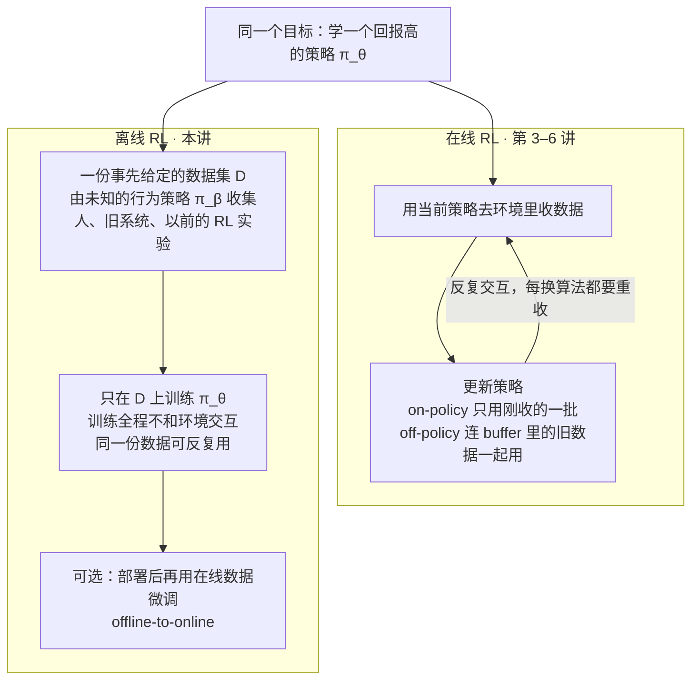
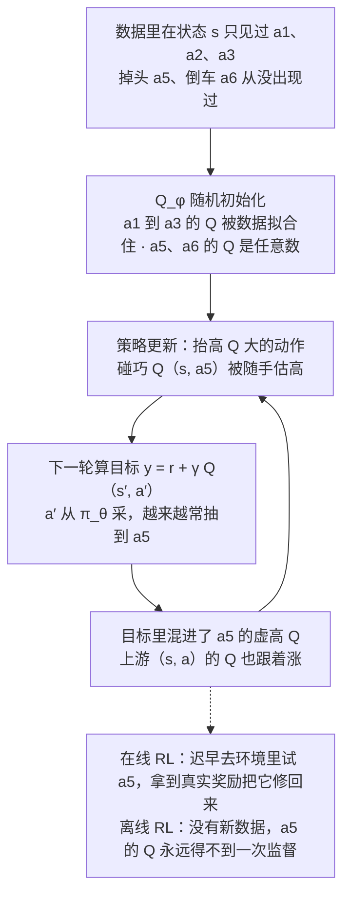
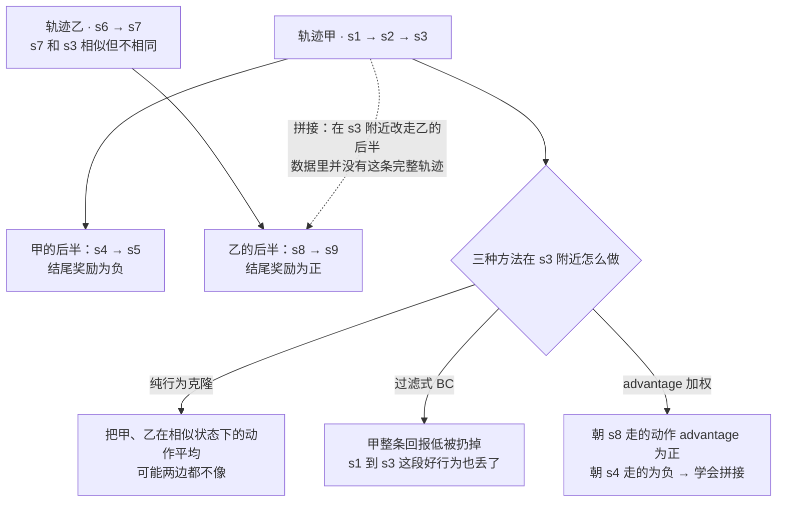
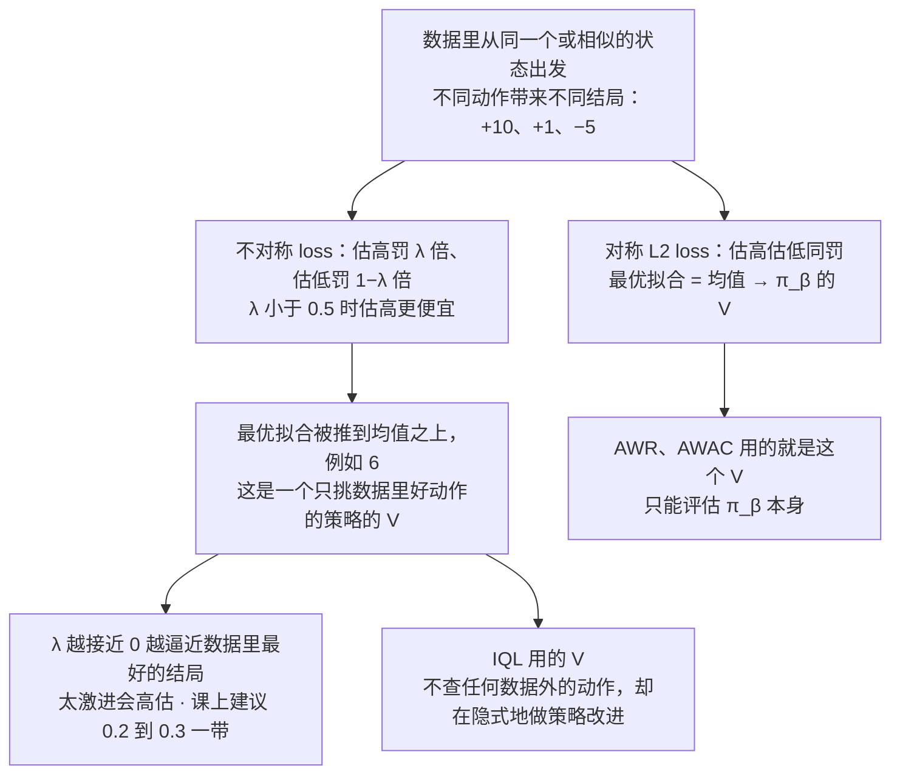
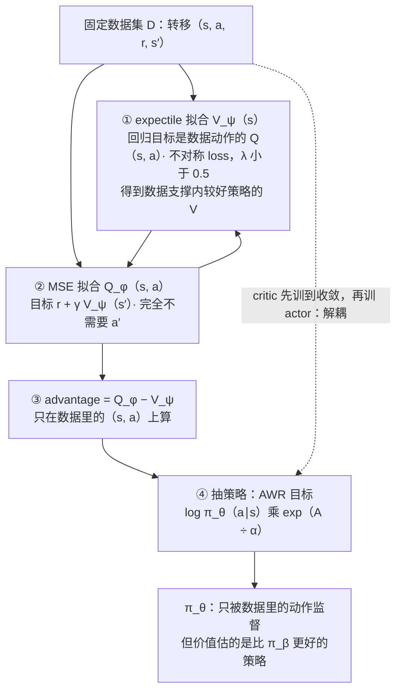
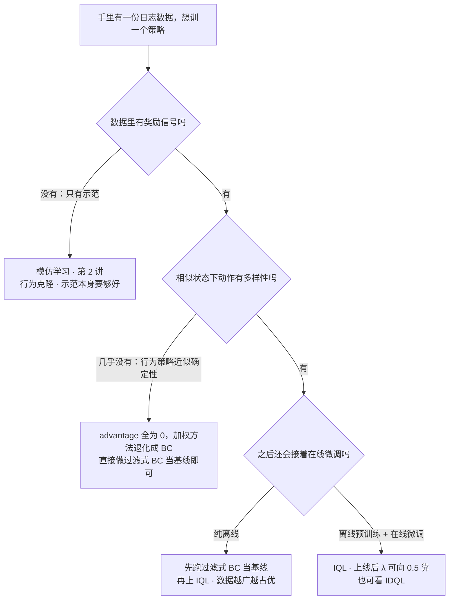

# CS224R 第 7 讲｜离线 RL（Offline RL）

> Stanford CS224R: Deep Reinforcement Learning（2025 春）· 第 7 讲，2025 年 4 月 23 日 · 在线 RL 算法讲完之后的第一讲：手里只有一份固定数据集、不能再和环境交互时怎么办
> 视频：<https://www.youtube.com/watch?v=lRDaXnPIzks>（1:07:50，英文字幕为自动生成，"Q" 常被听成 key、"KL" 被听成 kale，见文末勘误）
> 讲者：Chelsea Finn（课程主讲，不是客座）
> 课程主页：<https://cs224r.stanford.edu/> · 指定阅读：[Conservative Q-Learning for Offline Reinforcement Learning](https://arxiv.org/abs/2006.04779)（Kumar et al., 2020；课上没有讲到它，见第 12 节的小注）、[Offline Reinforcement Learning with Implicit Q-Learning](https://arxiv.org/abs/2110.06169)（Kostrikov et al., 2021；课程页面误链了另一篇，以这篇为准）

**一句话**：在线 RL 每换一个策略都要重新和环境交互收数据，而很多场景（自动驾驶、医疗、机器人）要么交互不安全，要么数据早就躺在那里；离线 RL 就是只用一份由未知的行为策略 π_β 收集的固定数据集训练策略、全程不再交互。直接把第 5 讲的 off-policy actor-critic 搬过来会翻车：Q 在数据里没出现过的动作上是随机数，策略更新专挑那些被随手估高的动作，离线时又没有新数据来纠正，虚高的 Q 被 bootstrap 一路放大。本讲的解法一条路走到底——策略只在数据里出现过的动作上被监督：过滤式行为克隆是基线；AWR 用 exp(advantage) 给模仿目标加权，能把两条半好的轨迹拼接起来；AWAC 让目标里的 a′ 也从数据里取，好做 bootstrap；IQL 再用 expectile regression 把价值函数从"π_β 的平均结局"抬到"数据支撑内更好策略"的水平，从头到尾不查询任何数据外的动作。指定阅读里的 CQL 走的是另一条路（把数据外动作的 Q 压低），课上没讲到。

## 时间轴

| 时间 | 内容 |
|---|---|
| [0:06](https://www.youtube.com/watch?v=lRDaXnPIzks&t=6s) | 回顾在线 RL：策略梯度、价值函数、actor-critic（PPO、SAC） |
| [1:08](https://www.youtube.com/watch?v=lRDaXnPIzks&t=68s) | 拟合价值函数的三种标签：Monte Carlo、TD bootstrap、用 Q 吃旧策略的数据；最后一种要求动作有覆盖 |
| [7:14](https://www.youtube.com/watch?v=lRDaXnPIzks&t=434s) | 完整的 off-policy actor-critic 循环；今天的三个目标；问答：这和 Q-learning 差在哪 |
| [9:50](https://www.youtube.com/watch?v=lRDaXnPIzks&t=590s) | 在线 vs 离线；为什么要 offline RL：已有数据、在线交互不安全（驾驶、医疗）、实验数据反复用；离线在线混用；问答：离线是不是 off-policy 的特例 |
| [14:03](https://www.youtube.com/watch?v=lRDaXnPIzks&t=843s) | 形式化：数据集、行为策略 π_β（可以是混合策略）、目标函数；分布偏移只来自策略；问答：数据够全会不会没有偏移；数据从哪来 |
| [19:45](https://www.youtube.com/watch?v=lRDaXnPIzks&t=1185s) | 把 SAC 直接跑在离线数据上会怎样：板书 a1–a6，随机初始化的 Q 在数据外是任意数，策略专挑虚高的动作；幻灯片版；问答：离散动作、能不能排除 OOD 动作 |
| [26:26](https://www.youtube.com/watch?v=lRDaXnPIzks&t=1586s) | 缓解高估：模仿学习天然只监督数据里的动作，但超不过数据；轨迹拼接 s1→s3 加 s7→s9 |
| [29:58](https://www.youtube.com/watch?v=lRDaXnPIzks&t=1798s) | 基线：过滤式 BC——只模仿回报靠前的轨迹；不能拼接，但一定要先跑 |
| [32:34](https://www.youtube.com/watch?v=lRDaXnPIzks&t=1954s) | 用 exp(advantage) 给模仿目标加权；它近似一个 KL 约束目标；问答：状态不必精确相交、温度、与 actor-critic 的差别 |
| [39:44](https://www.youtube.com/watch?v=lRDaXnPIzks&t=2384s) | 先估行为策略的 advantage；版本一：Monte Carlo 拟合 V，A = 回报 − V，这就是 AWR；问答：GAE、大数据集方差小 |
| [46:05](https://www.youtube.com/watch?v=lRDaXnPIzks&t=2765s) | 同桌讨论：行为策略是确定性的会学到什么——advantage 全 0、退化成 BC；AWR 完整算法与优缺点；+10 / +1 / −5 的例子 |
| [52:16](https://www.youtube.com/watch?v=lRDaXnPIzks&t=3136s) | 想 bootstrap 又不查数据外动作：a′ 也从数据里取——AWAC；估的仍是 π_β 的价值 |
| [53:48](https://www.youtube.com/watch?v=lRDaXnPIzks&t=3228s) | 估一个比 π_β 更好的策略的价值：同一状态的结局有分布，L2 拟合的是均值，改拟合更高的分位；不对称 loss 与 expectile regression，λ 的含义 |
| [1:01:12](https://www.youtube.com/watch?v=lRDaXnPIzks&t=3672s) | IQL：expectile 拟合 V、MSE 拟合 Q（目标用 V）、A = Q − V、AWR 抽策略；问答：会不会高估、λ 怎么选、要不要随训练调；优点 |
| [1:05:18](https://www.youtube.com/watch?v=lRDaXnPIzks&t=3918s) | 命名 implicit Q-learning；问答：为什么要 Q 不直接 Monte Carlo；总结；选型建议、offline-to-online、IDQL |

## 核心内容

### 1. 回顾：拟合价值函数的三种标签，最后一种埋着今天的雷

- **先把记号压一遍**：智能体在时刻 t 处于状态 s_t，按策略 π_θ(a | s)（给定状态输出动作的分布，θ 是网络参数）选动作 a_t，环境给奖励 r_t 并跳到 s_{t+1}；一整段状态、动作、奖励交替的序列叫轨迹 τ，轨迹上奖励的总和叫回报，折扣因子 γ 让远处的奖励权重更小。价值函数 V^π(s) 是从 s 出发一直按 π 行动的期望回报，Q^π(s, a) 是先做 a、之后再按 π 行动的期望回报，advantage A^π = Q^π − V^π 是"做 a 比按 π 平均做好多少"（第 4 讲第 2 节）。用当前策略自己刚采的数据训练叫 on-policy，用别的策略（含过去的自己）的数据训练叫 off-policy，存旧数据的容器叫 replay buffer（第 5 讲）。
- **在线 RL 的三条线**（第 3–6 讲）：策略梯度——用当前策略采一批轨迹，抬高带来高于平均回报的动作的概率；actor-critic——先拟合一个价值函数（估"这个状态或动作接下来能拿多少奖励"），再拿它告诉策略哪些动作该多做，PPO 和 SAC 都是这个套路；Q-learning——连策略网络都不要，只学 Q。
- **拟合价值函数的三种标签**（讲者特意重放一遍，因为今天全靠它们）。都是同一个平方误差回归，换的只是标签：
    1. **Monte Carlo**：标签是这条轨迹从 t 起实际拿到的奖励之和。最简单。
    2. **bootstrap / TD**：标签是"这一步的奖励，加上自己对下一状态的估值 V(s′)"。用自己的估计当标签叫 bootstrapping，也叫 temporal-difference 更新。
    3. 前两种都假设数据是被评估的那个策略自己采的（on-policy）。数据若来自一堆旧策略的混合，改拟合 Q(s, a)：(s, a, s′) 从数据里取，下一步动作 a′ 却从**正在学的策略**里现采。第 5 讲第 10 节推过：Q 的递归式对任何 (s, a) 都成立，所以数据里的动作是谁选的无所谓。

$$
y^{\mathrm{MC}}_t=\sum_{t'\ge t} r_{t'},\qquad y^{\mathrm{TD}}_t=r_t+\gamma\,V_\phi(s_{t+1}),\qquad y^{\mathrm{off}}_t=r_t+\gamma\,\hat{Q}_\phi(s_{t+1},a'),\;\;a'\sim\pi_\theta(\cdot\mid s_{t+1})
$$

三个标签喂给同一个回归目标 min_φ Σ (估值 − y)²；φ 是价值网络的参数。第三个式子里，只有 a′ 不来自数据。

- **第三种标签的隐患**：标签里用的是自己对 (s′, a′) 的估计，所以 Q 必须在"和将来要评估的动作长得像"的动作上训练过。正在学的策略如果和收数据的旧策略差得远，标签就不准，Q 就学不准——它需要数据对动作有好的**覆盖**（coverage）。第 5 讲的问答里这只是个提醒，今天它是主角。
- **完整的 off-policy actor-critic**（第 5 讲图 5-6）：策略去环境里收数据 → 存进装着过去所有策略数据的 replay buffer → 抽一批 → 用上面的标签更新 Q → 更新策略，抬高 Q 值高的动作的概率 → 循环。
- **问答：这是 Q-learning 吗？** 不是，这是第 5 讲的东西（SAC 一类）。Q-learning（第 6 讲）再改一处：目标里不从 π_θ 采 a′，而是对 a′ 取 max，学的是最优策略的 Q。它同样能 off-policy，前提也是覆盖够好。
- **今天的三个目标**：offline RL 的核心难点是什么；两类方法以及它们为什么行；offline RL 凭什么比同样从离线数据学的模仿学习更好。

### 2. 什么是 offline RL，为什么要它

*图 7-1｜在线 RL 靠反复交互换数据，离线 RL 只有一份固定数据集（自绘示意）· [▶ 看原幻灯片 9:50](https://www.youtube.com/watch?v=lRDaXnPIzks&t=590s)*

- **定义**：在线 RL 的流程是"收数据 → 更新策略（用最新一批或至今全部数据）→ 再收"；offline RL 则是数据集事先给定，只在这份数据上训练策略，训练过程中不再收集任何新数据。
- **三个理由**
    1. **数据已经有了，而在线试错不安全**。自动驾驶：人类驾驶的数据海量，而把一个还不会开车的策略放上路去收数据显然不行。
    2. **医疗**：用 RL 决定治疗方案，讲者提到一个癫痫发作预防的项目——有现成系统的数据，就不必让一个糟糕的策略去病人身上试。
    3. **实验数据可以反复用**（更微妙的一点）：跑过几次在线 RL 之后，手里已经有一堆策略跑出来的数据，每次改算法都从头收太浪费——训机器人抓取时，第一次跑的算法几乎不会是最终版本。所以在线数据比离线数据贵：离线数据可以用很多遍。
- **混着用**：先用离线数据训出一个还不错的策略，再上线（比如带安全员）用在线数据继续改进；部署之后还能持续变好，是很多真实场景的刚需。这条线课末会回来（第 12 节）。
- **问答：offline RL 是不是"off-policy RL 但不知道数据来自谁"的特例？** 有几分道理，但纯 offline 有一条硬约束——完全不能再收数据——所以它不算在线 off-policy RL 的特例；算法层面确实会借用 off-policy 的技巧，因为那些技巧本来就是为"用旧策略的数据"设计的。
    > 小注：第 2 讲第 9 节区分过 offline / online（学习过程中要不要交互）和 on-policy / off-policy（训练数据是不是当前策略生成的）——offline 必然 off-policy，反之不然。癫痫那个项目应为 Pineau 组的 Guez et al., 2008（用批量 RL 学电刺激策略），课上没给出处。

### 3. 形式化：行为策略 π_β 与分布偏移

- **数据集**：D 是一堆轨迹，比如很多人、很多地方、很多辆车的驾驶记录。我们不知道产生它的策略是什么（多个人开的，就是多个策略），但数学上可以假设它是由一个**行为策略**（behavior policy）π_β 跑出来的；多个策略的情况把 π_β 看成它们的混合（按权重平均），不损失一般性。数据背后于是有一个状态分布、一个动作分布、环境的动力学和奖励函数。
- **目标**：学一个策略 π_θ，最大化它自己跑出来的轨迹的奖励之和。

$$
\max_{\theta}\;J(\theta)=\mathbb{E}_{\tau\sim\pi_\theta}\Big[\sum_{t} r(s_t,a_t)\Big],\qquad \mathcal{D}=\{\tau_i\}\sim\pi_\beta,\quad \pi_\theta\neq\pi_\beta
$$

期望是对 π_θ 自己产生的轨迹取的，而我们手里只有 π_β 的轨迹，也没法去采 π_θ 的——这就是 offline RL 的核心难点：**分布偏移**（distribution shift）。环境的动力学在数据和部署时是同一个，偏移只来自策略不同。

- **问答：数据足够全面时，学到的策略和 π_β 会不会同分布？** 几乎不会。通常你想比数据里的平均司机开得好，学出来的分布反而比 π_β 更窄；如果 π_β 本来就很好，那更像模仿学习的设定，策略仍可能慢慢漂离数据分布。
- **数据从哪来**：人、手写的控制器或现有系统、以前的 RL 实验，或者这些的混合。
    > 小注：CME295 第 5 讲第 10 节说 DPO 直接吃现成的偏好数据、因而有分布偏移，PPO 在线采样没有——那正是本讲的设定：DPO 是 offline 的偏好优化。第 9 讲会正面处理这件事。

### 4. 直接把 SAC 跑在离线数据上会怎样：OOD 动作被"钓"出来

*图 7-2｜一个 OOD 动作的虚高 Q 怎样被策略"钓"出来、又怎样通过 bootstrap 传回上游，而且离线时永远得不到纠正（自绘示意）· [▶ 看原幻灯片 24:15](https://www.youtube.com/watch?v=lRDaXnPIzks&t=1455s)*

- **自然的想法**：既然 off-policy 算法能用旧策略的数据，那把 SAC 拿来、只是不再收数据，行不行？有同学答对了要害：策略更新会抬高 Q 值高的动作，而 Q 是在从策略采出的动作上评估的；策略一旦和 π_β 不同，这些动作在数据里可能根本没出现过，用来监督 Q 的标签就不可靠，Q 不准，策略也就好不了。
- **板书推演**（图 7-2）：某个状态 s 下，数据里只见过 a1、a2、a3；车其实还能开出去探险 a4、在高速上掉头 a5、倒车 a6。Q 网络随机初始化，训练只能把 a1 到 a3 那一段拟合住，数据之外的 Q 是任意数。策略更新一看 a5 的 Q 碰巧挺高，就抬高它的概率；之后算目标时 a′ 越来越常抽到 a5，虚高的 Q 混进标签、传给上游的 (s, a)，而 a5 在数据里永远不会出现，它的 Q 永远得不到一次真实监督。术语：这些动作叫 **out-of-distribution（OOD）动作**，数据覆盖到的范围叫数据的**支撑**（support）；策略在"利用"（exploit）Q 在 OOD 动作上的错误。
- **幻灯片上的说法**：Q 在数据支撑之外不可靠 → 策略更新专门去找 Q 过分乐观的地方 → 更新之后这些 Q 值被高估（overestimation），而且会被反复强化，因为没有任何数据说它不好。换个角度：这发生在学到的策略偏离 π_β 太远的时候——OOD 动作正是 π_β 从不做的事；离 π_β 近一点，问题就轻。
- **和第 6 讲的高估对照**：Double DQN 治的是 max 挑中噪声偏正的动作；那里是在线的，ε-greedy 迟早会去试那个动作、拿到真实奖励把它修回来。离线没有这一步——图 7-2 的循环没有出口。
- **问答**
    - 离散动作会不会好些？——一样。若数据里每个状态都覆盖了全部动作，就没有 OOD 问题；实际上总有些状态没覆盖全，那里照样高估。
    - 更新 Q 时把 OOD 动作排除掉不就行了？——有这样做的方法，但麻烦在于**不知道什么算 OOD**：手里只有样本，一个状态选了 a1，一个非常相似的状态选了 a2，对前者来说 a2 严格说没见过，可你没法划这条线。
- **由此得到 offline RL 方法的两条设计原则**：别偏离 π_β 太远；避开 OOD 动作。本讲后面的方法都在落实它们——具体做法是让策略只在数据里的动作上被监督。另一条路线是不拴策略、直接把数据外动作的 Q 压低，那是指定阅读 CQL 的做法，课上没讲到（第 12 节小注）。

### 5. 用模仿学习避开 OOD，但要能超过数据：轨迹拼接

*图 7-3｜轨迹拼接：两条各自半好的轨迹，只有会用奖励的方法才拼得起来（自绘示意）· [▶ 看原幻灯片 28:27](https://www.youtube.com/watch?v=lRDaXnPIzks&t=1707s)*

- **为什么模仿学习没有这个病**：行为克隆（第 2 讲）只在数据里出现过的 (s, a) 上做监督，从不评估别的动作，等于隐式地避开了 OOD 动作。
- **但纯模仿不是我们要的**：离线数据未必好——数据集里的人类司机不见得按你想要的方式开车。offline RL 该做的，是**利用奖励信息**超过数据背后的策略：翻一遍数据，这段行为好、那段不好，据此学出更好的策略；纯模仿最多和数据一样好。
- **拼接（stitching）**：数据里两条轨迹，甲结尾拿到负奖励，乙结尾拿到正奖励。甲的前半段本身没问题——在中途改走乙的后半段，就是一条好轨迹。好的离线方法应该认出这一点：在甲、乙相近的那个状态，选乙的动作。符号化：s1→s3 好，s7→s9 好，offline RL 原则上能学出从 s1 走到 s9 的策略；模仿学习不能——它在相近的状态只会把甲、乙的动作平均一下。
- **问答（后面补的）：两条轨迹要精确相交吗？** 不用。讲者画图时故意让 s3 和 s7 不是同一个状态：策略和 advantage 都是神经网络，相似的状态和动作自然有相似的输出，能泛化过去；泛化得多好取决于两个状态有多近、数据有多大。
    > 小注：第 4 讲第 8 节两条轨迹共享一个蓝色状态的练习，讲的正是 bootstrap 能跨轨迹传信息；拼接是同一件事在离线数据上的名字。第 2 讲第 3 节说 L2 行为克隆只学得到多峰示范的均值，图 7-3 里"纯 BC 把动作平均"就是它。

### 6. 基线：过滤式行为克隆

- **做法**：从 D 里只挑回报高的轨迹——比如回报在第 70 百分位以上、也就是前 30%——组成新数据集，在上面做标准的行为克隆：最大化数据里动作的 log π_θ(a | s)。
- **评价**：用奖励的方式很原始，而且做不到拼接——甲整条回报低，会被整条扔掉，s1 到 s3 那段好行为也没了。但它是很好的基线：任何 offline RL 方法上手前先跑它，确保新方法比它强。
- **伏笔**：讲者说，一些最好的 offline RL 方法其实和它相去不远——它们都带一个模仿学习的成分。
    > 小注：LLM 里的对应物是 CS329A 笔记里的 STaR / rejection-sampling fine-tuning：只在答对的样本上做 SFT，同样是"按结果过滤、然后模仿"，同样做不到拼接（我的类比，课上没说）。

### 7. 用 advantage 给模仿加权

- **想法**：不按整条轨迹取舍，而是给数据里每一个 (s, a) 的模仿目标乘一个权重，权重反映这个动作有多好。衡量"有多好"的现成量就是 advantage A(s, a)。权重取 exp(A/α)，α 是温度：

$$
\max_{\theta}\;\sum_{(s,a)\in\mathcal{D}}\log\pi_\theta(a\mid s)\,\exp\!\Big(\frac{A(s,a)}{\alpha}\Big)
$$

和行为克隆唯一的区别是多了指数权重：advantage 高的动作被使劲模仿，低的几乎不管，α 越小权重越"尖"。(s, a) 全部来自数据，策略从不在数据外的动作上被监督。

- **它能拼接**：回到图 7-3，在 s3 附近，朝 s8 走的动作 Q 是 1，朝 s4 走的（就数据来看）Q 是 0，V 是两者的平均，于是前者 advantage 为正、后者为负——加权之后策略被明确告知该走哪边。前提是 advantage 估得准，这是接下来几节的全部内容。
- **为什么是指数**：这个目标可以推导出来（幻灯片上有，课上没推）：它近似地在解一个带 KL 约束的优化——最大化按 Q 衡量的未来奖励，同时要求策略离 π_β 不远。对 offline RL 这是个合理的目标：离 π_β 太远，就没有可靠的信息告诉你怎么改进。

$$
\max_{\pi}\;\mathbb{E}_{s\sim\mathcal{D},\;a\sim\pi(\cdot\mid s)}\big[Q(s,a)\big]\quad\text{s.t.}\quad \mathbb{E}_{s\sim\mathcal{D}}\Big[\mathrm{KL}\big(\pi(\cdot\mid s)\,\big\|\,\pi_\beta(\cdot\mid s)\big)\Big]\le\epsilon
$$

KL 衡量两个动作分布差多远（CME295 第 5 讲），ε 是允许偏离 π_β 的幅度；解这个问题、再把解投影到策略网络上，就得到上面的加权目标。CME295 第 5 讲 RLHF 目标里拴住 SFT 模型的那根 KL 绳子，和这里是同一根，只是锚点换成了 π_β。

- **问答**
    - 指数会不会爆？——实现里有温度 α，写成 exp(A/α)，可以压住。
    - 和 actor-critic 的目标像不像？——像，但两处不同：那里权重是 A 本身、没有指数；那里动作从当前策略采（SAC）或来自在线数据，这里 (s, a) 都从离线数据集来。更深一层的原因讲者只点到为止：在线方法往往在优化一个 reverse KL，离线方法优化的更像 forward KL，展开说要很久。
    > 小注：那个 KL 约束问题有闭式解 π*(a | s) ∝ π_β(a | s) · exp(A(s, a)/α)——和 CME295 第 5 讲 DPO 推导第 2 步的 π* ∝ π_ref · exp(r/β) 是同一个式子，只是锚点从 SFT 模型换成 π_β。用 forward KL（KL(π* ‖ π_θ)）把 π_θ 拟合到 π* 上，需要的是 π_β 的样本按 exp(A/α) 加权做最大似然，也就是只用数据里的动作；用 reverse KL（KL(π_θ ‖ π*)）则要从 π_θ 采动作再问 Q——正是第 4 节会出事的那一步。这就是离线方法偏爱 forward KL 的原因（推断，课上只提了名字）。指数权重的推导应出自 AWR（Peng et al., 2019）和 AWAC（Nair et al., 2020）两篇。

### 8. 估 advantage 之一：Monte Carlo，得到 AWR

- **先回答"谁的 advantage"**：advantage 总是相对某个策略定义的。眼下最省事的选择：估**行为策略** π_β 的 advantage——数据就是 π_β 采的，评估它是 on-policy 的，第 1 节的前两种标签都能直接用。
- **版本一：Monte Carlo**。先用平方误差把 V_φ(s_t) 回归到这条轨迹从 t 起实际拿到的奖励之和，纯监督学习；再算 advantage。算 advantage 有两条路：一是第 4 讲的一步 TD 式 r + V(s′) − V(s)，它依赖 V 相当准；二是更简单的——直接用实际的未来奖励和减去 V(s)，不依赖两个估值之差。后者就是 **advantage-weighted regression（AWR）**。两种都合法，后者在离线数据上用得多、效果也好；GAE 也可以用。

$$
\min_{\phi}\sum_{(s_t,\,\tau)\in\mathcal{D}}\Big(V_\phi(s_t)-\sum_{t'\ge t} r_{t'}\Big)^{2},\qquad \hat{A}(s_t,a_t)=\sum_{t'\ge t} r_{t'}-V_\phi(s_t)
$$

左式是 Monte Carlo 回归，标签是轨迹 τ 从 t 起的奖励和（带折扣时加 γ 的幂）；右式的 advantage 是"这条轨迹实际拿到的"减"这个状态平均能拿到的"。

- **问答：为什么这里敢用高方差的 Monte Carlo？** 一部分原因是离线数据集通常很大，方差没那么要命；更大的原因是简单——拟合 V 是监督学习，训练策略是加权的监督学习，整个算法没有一处不稳。后面更复杂的方法会更好，因为这个估计的方差仍然比 bootstrap 大。
- **同桌讨论：行为策略是确定性的会怎样？** 比如车在某些车道永远直行，数据里从不出现转向。答案：每个状态只见过一个动作，实际奖励和就等于 V，advantage 全是 0，exp(0) = 1，目标退化成普通的行为克隆。讲者说这其实挺好：数据里没有动作的多样性，你本来就不可能比 π_β 做得更好，算法优雅地退回模仿。
- **问答**
    - 那收数据时是不是该故意偏离专家、多试几种动作？——是，动作多样性对 offline RL 是好事，尤其当专家并不最优时：多样性是超过专家的唯一本钱。
    - advantage 全 0 常见吗？——真实的 advantage 在没见过的动作上并不为 0，只是数据里看不到；只要动作有变化，估出来的 advantage 就会明显非零，取决于数据有多"广"。
    - advantage 网络在数据外的动作上输出什么？——这个目标从不在数据外评估它，所以不成问题；真要问，离数据近可能还靠谱，远了就是任意值。
- **完整算法与评价**：① Monte Carlo 回归拟合 V；② 用 exp((奖励和 − V)/α) 加权做行为克隆，α 控制权重多"尖"。优点：极其简单——大概是最简单的、有可能超过过滤式 BC 的方法；从不查询、也从不在 OOD 动作上训练，所以稳。缺点：Monte Carlo 有噪声；估的是 π_β 的 advantage 而不是新策略的，改进幅度因此有限。
- **数值例子**（回答"advantage 是不是总接近 0"）：同一个（或相近的）状态下三种结局 +10、+1、−5，V 拟合到平均值，三个动作的 advantage 就是各自结局减 V——一正两负，差异很大。只有从相似状态出发、动作不同、结局不同，advantage 才拉得开。
    > 小注：课上口算把平均说成 3，得到 7、−2、−8；三个数的平均实际是 2，advantage 应为 8、−1、−7，结论不变。AWR 原文是 Peng, Kumar, Zhang & Levine, 2019。

### 9. 估 advantage 之二：a′ 也从数据里取，得到 AWAC

- **想要 bootstrap**：Monte Carlo 方差大，最好能像第 1 节第三种标签那样用 TD 目标——但那个目标坏就坏在 Q(s′, a′) 里的 a′ 是从正在学的策略采的。最简单的修法：a′ 也从数据里取，就用这条转移里实际发生的下一个动作。这样 (s′, a′) 一定在数据里，一定有监督。

$$
y=r+\gamma\,\hat{Q}_\phi(s',a'),\qquad (s,a,r,s',a')\sim\mathcal{D}
$$

和第 1 节第三个标签的唯一区别：a′ 不再来自 π_θ，而是数据里紧接着记录的那个动作。

- **算法**：用这个目标拟合 Q，由 Q 算 advantage，再套第 7 节的加权目标——课上称之为 **advantage-weighted actor-critic（AWAC）**。它去掉了 AWR 的一个弱点（可以 bootstrap 了），但另一个还在：估的仍然是 π_β 的价值，不是更好的策略的。
    > 小注：这种"a′ 取数据里的下一个动作"的目标在文献里常叫 SARSA 式目标；AWAC 原文（Nair et al., 2020）里 critic 的 a′ 其实是从当前策略采的，靠加权 BC 的隐式约束让策略离数据不远、查询不至于太 OOD（推断；两种写法都只估 π_β 附近的价值，讲者要说的要点相同）。AWAC 的设计初衷正是"离线预训练 + 在线微调"。

### 10. 估一个比 π_β 更好的策略的价值：拟合分位而不是均值

*图 7-4｜expectile regression：把对称 loss 换成不对称 loss，拟合值就从"数据的平均结局"挪到"数据里较好的结局"（自绘示意）· [▶ 看原幻灯片 1:00:10](https://www.youtube.com/watch?v=lRDaXnPIzks&t=3610s) · 出处：[Kostrikov et al., 2021](https://arxiv.org/abs/2110.06169)*

- **换个角度看 TD 目标**：r + γ Q(s′, a′) 可以看成 V(s′) 的一个样本。同一个状态出发、数据里不同的动作带来不同的结局，所以对一个状态而言，数据里其实有一个**结局的分布**——很多条落在某个值附近，少数几条更高。用 L2（平方误差）回归，拟合到的是这个分布的**均值**，也就是 π_β 的 V。
- **想法**：要估一个比 π_β 更好的策略的 V，就别拟合均值，去拟合更高的**分位**（percentile），比如第 70 百分位；直方图的最右端对应"数据支撑内最好的策略"的 V。怎么让回归拟合分位？换 loss。
- **不对称 loss**：L2 关于误差 e 是对称的抛物线 e²，估高估低同罚。改成两边斜率不同：估高（e 大于 0）罚 λ 倍，估低罚 1 − λ 倍。λ = 0.5 就是 L2；λ 小于 0.5 时估高更便宜、估低更贵，最优拟合值被推到均值之上；λ 大于 0.5 反之。这叫 **expectile regression**，讲者说是个"很酷的技巧"；幻灯片上画了不同 λ 下 loss 的形状，以及同一个随机变量的均值（红线）和各个 expectile。

$$
L_\lambda(e)=\big|\lambda-\mathbb{1}[e<0]\big|\;e^{2},\qquad e=V_\phi(s)-y
$$

e 是估值减目标；e ≥ 0（估高）时权重是 λ，e < 0（估低）时权重是 1 − λ；λ = 0.5 退回普通平方误差。最小化它得到的不是均值，而是分布的 λ-expectile。

- **效果**：估高和估低都还挨罚，只是稍微估高一点罚得轻。回到 +10 / +1 / −5 的例子：均值是 3（课上的口算），某个 λ 下最优输出会跑到 6 一带——比均值高，但不是简单取最大。
    > 小注：expectile 之于不对称平方损失，正如分位数之于不对称绝对值损失、均值之于普通平方损失；λ 趋于 0 时逼近支撑内的最大值。IQL 论文的写法是 L₂^τ(u) = |τ − 𝟙(u < 0)| u²，u 是目标减估值，方向和课上的 e 相反，所以论文的 τ = 1 − λ：论文在 D4RL 运动任务上取 τ = 0.7、AntMaze 上取 0.9，对应课上说的 λ ≈ 0.3 和 0.1。

### 11. IQL：expectile 拟合 V、MSE 拟合 Q，从不查询数据外的动作

*图 7-5｜IQL 的四步：V 用 expectile、Q 用 MSE 互为目标，advantage 只在数据动作上算，最后用 AWR 抽策略（自绘示意）· [▶ 看原幻灯片 1:02:15](https://www.youtube.com/watch?v=lRDaXnPIzks&t=3735s) · 出处：[Kostrikov et al., 2021](https://arxiv.org/abs/2110.06169)*

- **算法**
    1. 用 expectile loss 拟合 V_ψ(s)，回归目标是数据里动作的 Q(s, a)——在"这个状态下数据里各个动作的 Q"这个分布上取上侧 expectile。
    2. 用普通的均方误差拟合 Q_φ(s, a)，目标是 r + γ V_ψ(s′)——目标里只有 V，根本不需要 a′，无论从策略还是数据里取都不需要。
    3. advantage = Q_φ − V_ψ，只在数据里的 (s, a) 上算。
    4. 用第 7 节的加权目标抽策略：log π_θ(a | s) 乘 exp((Q − V)/α)。
- 两个价值网络里只有 V 用不对称 loss；V 和 Q 交替训练、互为目标。

$$
L_V(\psi)=\mathbb{E}_{(s,a)\sim\mathcal{D}}\Big[L_\lambda\big(V_\psi(s)-\hat{Q}_\phi(s,a)\big)\Big],\qquad L_Q(\phi)=\mathbb{E}_{(s,a,r,s')\sim\mathcal{D}}\Big[\big(\hat{Q}_\phi(s,a)-r-\gamma\,V_\psi(s')\big)^{2}\Big],\qquad \max_{\theta}\;\mathbb{E}_{(s,a)\sim\mathcal{D}}\Big[\log\pi_\theta(a\mid s)\,\exp\!\Big(\tfrac{\hat{Q}_\phi(s,a)-V_\psi(s)}{\alpha}\Big)\Big]
$$

ψ、φ、θ 分别是 V、Q、策略的参数；三个损失里的 s、a、s′ 全部来自 D，没有任何一处需要在数据外的动作上评估 Q。

> 小注：V 的回归目标是数据动作的 Q(s, a)，课上板书没明写，按论文补上。"implicit"的意思：第 6 讲 Q-learning 目标里对 a′ 的 max，被换成了数据动作上的上侧 expectile——λ 越小越接近 max，但永远只在支撑之内取，所以策略改进是"隐式"完成的，不用真的去比较没见过的动作。

- **问答**
    - 这样会不会高估？——从不把数据外的动作喂进网络，之前最大的高估来源已经没了。但 λ 设成 0 大概率会高估；实践里取 0.2、0.3 这种不那么激进的值。而且这里是**故意**高估 π_β 的 V：要估的本来就是一个比 π_β 更好的策略的 V。
    - 策略在变好，λ 要不要逐步调？——不用。数据全程是离线的，你想要的一直是"比 π_β 好一个固定的量"，λ 保持不变。如果之后开始收在线数据，数据来自更好的策略，λ 反而应该往 0.5 靠。
    - 为什么还要 Q，不直接用 Monte Carlo 回报配 expectile？——可以，这套想法对 Monte Carlo 同样适用；用 Q 是因为 bootstrap 目标方差更低，而 bootstrap 只有 Q 能做。
- **优点**：不查询 OOD 动作；策略只在数据动作上训练；actor 和 critic 解耦——先把 V 和 Q 训到收敛（或训够），再单独训策略。名字：**implicit Q-learning（IQL）**。

### 12. 总结、选型建议与各方法对数据的要求

*图 7-6｜按讲者的建议整理的选型路径（自绘示意）· [▶ 看原幻灯片 1:06:50](https://www.youtube.com/watch?v=lRDaXnPIzks&t=4010s)*

- **讲者的总结**：在线数据贵，每次跑算法都要重收；离线数据可以反复用。核心难点是 π_β 和学到的策略之间的偏移。过滤式或加权的模仿学习是基线；把策略显式拴在 π_β 上——只在数据动作上监督策略——避开了分布偏移；轨迹拼接则是它超过纯模仿的来源。应用案例的幻灯片跳过了。
- **建议**：纯离线训练，过滤式 BC 和 IQL 都是好选择，IQL 大概率更好，数据越广越明显；要做"离线预训练 + 在线微调"，IQL 非常合适，配合在线收数据效果也好。IQL 还有一个变体 IDQL，策略换成扩散策略（第 2 讲第 7 节），更新方式也不同，想深入 IQL 一系可以看它。
- **各方法对数据集的要求**（给要从日志里学的人）：

| 方法 | 学什么 | 从不评估什么 | 对数据集的要求 | 能拼接 | 能超过 π_β |
|---|---|---|---|---|---|
| 行为克隆（第 2 讲） | 只学策略 | 数据外的动作 | 示范本身就要够好 | 否 | 否 |
| 过滤式 BC | 前 k% 轨迹上的策略 | 数据外的动作 | 要有整条轨迹的回报；好轨迹得有一定数量 | 否 | 只到数据里好轨迹的水平 |
| AWR | Monte Carlo 的 V + 加权 BC | 数据外的动作 | 要有每步奖励和完整轨迹（算 reward-to-go）；相似状态下动作要有多样性，否则退化成 BC | 能（advantage 准的话） | 有限：advantage 是 π_β 的 |
| AWAC（课上的版本） | SARSA 式 bootstrap 的 Q + 加权 BC | 数据外的动作 | 单步转移 (s, a, r, s′, a′) 即可；动作多样性 | 能 | 有限：价值仍是 π_β 的 |
| IQL | expectile 的 V + MSE 的 Q + 加权 BC | 数据外的动作 | 单步转移 (s, a, r, s′) 即可；动作多样性；λ 要调 | 能 | 能：估的是支撑内更好策略的价值 |
| CQL（指定阅读，课上没讲） | 保守的 Q + actor | 会评估数据外动作，但把它们的 Q 压低 | 单步转移；正则化系数要调 | 能 | 能 |

> 小注：指定阅读的第一篇 CQL（Kumar et al., 2020）课上没有讲到。它代表另一条路线：不拴策略，而是在 Q 的 Bellman 损失上加一个正则项，把策略会选的（也就是可能 OOD 的）动作的 Q 压低、把数据里动作的 Q 抬高，从而让学到的 Q 成为真实价值的下界——图 7-2 里那个虚高的 Q(s, a5) 被直接按下去，策略再也钓不到它。摘要里的数字：在离散和连续控制的离线基准上，最终回报比之前的方法高 2 到 5 倍。第一作者 Aviral Kumar 就是第 10 讲的客座讲者。

> 小注：IDQL（Hansen-Estruch et al., 2023）把 IQL 的 critic 重新解释成一个带行为正则的隐式 actor 的 actor-critic；指出高斯策略配 AWR 表达不了这个隐式 actor 的多峰形状，于是改成：用扩散模型拟合 π_β，从中采一批动作，用 critic 算出的权重做重要性重采样来抽策略。

## 关键图表速查（点时间戳跳到原幻灯片）

| 图 | 看什么 | 跳转 | 出处 |
|---|---|---|---|
| 拟合价值函数的三种标签 | Monte Carlo、TD、off-policy 的 Q 目标并排；第三种里只有 a′ 来自策略 | [1:08](https://www.youtube.com/watch?v=lRDaXnPIzks&t=68s) | — |
| 在线 vs 离线流程 | 在线是"收 → 更新 → 再收"的循环，离线只有一份给定的数据集 | [9:50](https://www.youtube.com/watch?v=lRDaXnPIzks&t=590s) | — |
| 板书：数据集与 π_β | 一堆驾驶轨迹被看成由一个（混合的）行为策略采出；目标函数的期望却在 π_θ 下 | [14:03](https://www.youtube.com/watch?v=lRDaXnPIzks&t=843s) | — |
| 板书：a1 到 a6 与随机的 Q | 数据里只有 a1 到 a3；随机初始化的 Q 曲线在数据外任意起伏，策略专挑高的 | [21:19](https://www.youtube.com/watch?v=lRDaXnPIzks&t=1279s) | — |
| 幻灯片：OOD 动作上的 Q | 数据支撑只盖住一部分动作；策略更新去找过分乐观的 Q；更新后被高估并反复强化 | [24:15](https://www.youtube.com/watch?v=lRDaXnPIzks&t=1455s) | — |
| 轨迹拼接 | 绿色轨迹结尾正奖励、另一条负奖励；把前半段和绿色后半段拼起来 | [28:27](https://www.youtube.com/watch?v=lRDaXnPIzks&t=1707s) | — |
| 过滤式 BC | 只保留回报超过某个百分位的轨迹再做 BC；注意它不能拼接 | [30:30](https://www.youtube.com/watch?v=lRDaXnPIzks&t=1830s) | — |
| advantage 加权目标 | 行为克隆目标乘 exp(advantage)；旁边写着它近似 KL 约束目标，附参考文献 | [33:36](https://www.youtube.com/watch?v=lRDaXnPIzks&t=2016s) | [AWR](https://arxiv.org/abs/1910.00177) |
| 版本一：Monte Carlo 板书 | V 回归到奖励和；advantage 的两种算法：r + V(s′) − V(s) 与"奖励和 − V" | [40:44](https://www.youtube.com/watch?v=lRDaXnPIzks&t=2444s) | [AWR](https://arxiv.org/abs/1910.00177) |
| AWAC 的一处改动 | TD 目标里的 a′ 从"策略采样"改成"数据里的下一个动作" | [52:16](https://www.youtube.com/watch?v=lRDaXnPIzks&t=3136s) | [AWAC](https://arxiv.org/abs/2006.09359) |
| 结局直方图 | 同一状态的价值样本有分布；L2 给均值；支撑内最好策略的 V 在右端 | [56:28](https://www.youtube.com/watch?v=lRDaXnPIzks&t=3388s) | [IQL](https://arxiv.org/abs/2110.06169) |
| 不对称 loss 板书与 expectile 曲线 | e² 两侧权重不同；λ = 0.5 回到 L2；不同 λ 的 loss 形状与各个 expectile | [57:32](https://www.youtube.com/watch?v=lRDaXnPIzks&t=3452s) | [IQL](https://arxiv.org/abs/2110.06169) |
| IQL 算法 | V 用 expectile、Q 用 MSE 且目标是 V、策略用 exp(Q − V) 加权；下一页是三条优点 | [1:02:15](https://www.youtube.com/watch?v=lRDaXnPIzks&t=3735s) | [IQL](https://arxiv.org/abs/2110.06169) |
| 总结与建议 | 纯离线：过滤式 BC 或 IQL；离线转在线：IQL；IDQL 用扩散策略 | [1:06:50](https://www.youtube.com/watch?v=lRDaXnPIzks&t=4010s) | [IDQL](https://arxiv.org/abs/2304.10573) |

## 提到的工作

| 名称 | 在本讲里的作用 |
|---|---|
| 策略梯度（第 3 讲）、actor-critic（第 4 讲）、PPO / SAC（第 5 讲）、Q-learning（第 6 讲） | 开场回顾；SAC 是"直接跑在离线数据上会翻车"的例子 |
| 拟合价值函数的三种标签（Monte Carlo、TD、off-policy 的 Q 目标） | 本讲的工具箱；第三种标签是问题的根源 |
| 自动驾驶、癫痫治疗（应为 Guez et al., 2008）、机器人抓取 | 为什么要 offline RL 的三个场景 |
| 行为克隆（第 2 讲） | 天然避开 OOD 动作的参照系，但超不过数据 |
| 过滤式 BC（filtered BC） | 第一个基线：只模仿回报靠前的轨迹 |
| [AWR](https://arxiv.org/abs/1910.00177)（Peng et al., 2019） | exp(advantage) 加权的行为克隆，配 Monte Carlo 的 V |
| KL 约束的策略优化；forward / reverse KL | 加权目标的来历；在线与离线目标差别的深层原因，课上只提了名字 |
| GAE（第 5 讲） | 问答里提到也能用来估 advantage |
| [AWAC](https://arxiv.org/abs/2006.09359)（Nair et al., 2020） | a′ 取自数据的 bootstrap 版本（课上的讲法；见第 9 节小注） |
| expectile regression | 用不对称平方损失拟合分位而不是均值 |
| [IQL](https://arxiv.org/abs/2110.06169)（Kostrikov et al., 2021，指定阅读） | 本讲的终点：expectile 的 V、MSE 的 Q、加权 BC |
| [IDQL](https://arxiv.org/abs/2304.10573)（Hansen-Estruch et al., 2023） | IQL 的扩散策略变体，课末推荐 |
| 扩散策略（第 2 讲） | IDQL 的策略类 |
| [CQL](https://arxiv.org/abs/2006.04779)（Kumar et al., 2020，指定阅读） | 课上没讲；保守 Q 的另一条路线，见第 12 节小注 |
| offline-to-online fine-tuning | IQL 的推荐用法；上线后 λ 往 0.5 靠 |

## 术语对照

| English | 中文 |
|---|---|
| offline RL / batch RL | 离线强化学习：只用给定的固定数据集训练，不再交互 |
| online RL | 在线强化学习：训练过程中反复收集新数据 |
| off-policy | 用其他策略（含过去的自己）的数据训练；离线必然 off-policy |
| behavior policy π_β | 行为策略：收集数据集的那个（未知的、可能是混合的）策略 |
| mixture of policies | 混合策略：多个策略按权重平均，用来统一描述多来源的数据 |
| distribution shift | 分布偏移：目标在 π_θ 的轨迹上取期望，数据却来自 π_β |
| support / coverage | 支撑 / 覆盖：数据实际出现过的状态和动作范围 |
| out-of-distribution (OOD) action | 数据外的动作：某状态下数据里从未出现的动作 |
| overestimation | 高估：Q 在 OOD 动作上偏高且被策略反复强化 |
| exploit（Q 的误差） | 利用：策略更新专挑 Q 估错偏高的动作 |
| bootstrapping / TD target | 自举 / 时序差分目标：用自己的估值当回归标签 |
| Monte Carlo return / reward-to-go | 蒙特卡洛回报：轨迹从 t 起实际拿到的奖励和 |
| trajectory stitching | 轨迹拼接：把两条轨迹各自好的一段接成一条更好的 |
| filtered behavior cloning | 过滤式行为克隆：只在回报靠前的轨迹上做 BC |
| advantage-weighted regression (AWR) | 优势加权回归：exp(advantage) 加权的行为克隆 |
| temperature α | 温度：控制 exp(A/α) 权重有多"尖" |
| KL-constrained objective | KL 约束目标：最大化 Q 同时限制离 π_β 的 KL |
| forward / reverse KL | 前向 / 反向 KL：拟合分布时用目标分布的样本还是自己的样本 |
| advantage-weighted actor-critic (AWAC) | 优势加权 actor-critic：bootstrap 的 Q 配加权 BC |
| SARSA-style target | SARSA 式目标：a′ 取数据里实际的下一个动作（小注里的说法） |
| percentile / expectile | 百分位 / expectile：不对称平方损失的最小点，λ = 0.5 时是均值 |
| expectile regression | expectile 回归：用不对称平方损失做回归 |
| asymmetric loss | 不对称损失：估高与估低罚得不一样重 |
| implicit Q-learning (IQL) | 隐式 Q 学习：max 换成支撑内的上侧 expectile，从不查询数据外动作 |
| decoupled actor / critic | 解耦：先训好价值网络，再单独训策略 |
| offline-to-online fine-tuning | 离线预训练、在线微调 |
| diffusion policy | 扩散策略（第 2 讲）：IDQL 的策略类 |
| conservative Q-learning (CQL) | 保守 Q 学习：压低数据外动作的 Q，使 Q 成为真值的下界 |
| D4RL | 离线 RL 的标准基准数据集（小注里提到） |

## 字幕勘误

"PO" → PPO；"SACE""soft vector critic" → SAC / soft actor-critic；"q hot pi of fi" → Q̂^π_φ；"key value""key function""keying" → Q value、Q function、Q-learning（"implicit keying" → implicit Q-learning）；"kale constraint""reverse kale / forward kale" → KL constraint、reverse / forward KL；"auto distribution""autodistribution" → out-of-distribution；"off-picoly" → off-policy；"monocolor returns" → Monte Carlo returns；"GA""GE" → GAE；"advantage beta regression" → advantage-weighted regression；"expect loss" → expectile loss；"behavior coding" → behavior cloning；"the learn policy" → the learned policy；"e^ squ" → e²；"downweing / upweing" → down-weighting / up-weighting。

## 带走的问题

1. 图 7-2 的循环在线时靠探索打断，离线时没有出口。如果你的 agent 只能从日志里学、永远不能上线试错，"策略只在数据动作上被监督"是不是唯一的出路？CQL 那条路（压低数据外动作的 Q）和它相比，各自在什么样的数据上会吃亏？
2. 确定性数据集让 AWR 退化成行为克隆。你的产品日志里，同一类状态下"动作"的多样性从哪来（不同用户、A/B 实验、随机化）？如果多样性来自不同用户，π_β 是混合策略，那 advantage 衡量的是"比谁好"？
3. IQL 的 λ 越小越激进，λ 趋于 0 时 V 逼近"数据里最好的结局"——这和第 6 讲里 max 带来的高估有什么本质区别？为什么 λ 常取 0.2 到 0.3 而不是更小？在线微调时又为什么该往 0.5 靠？
4. 过滤式 BC 需要整条轨迹的回报，AWR 需要 reward-to-go，AWAC / IQL 只需要单步转移。你的日志能提供哪一种？稀疏奖励（只有会话结束时的一个分）下，三者各自的 advantage 估计会出什么问题？
5. CME295 第 5 讲的 DPO 在固定偏好数据上训练，算不算 offline RL？它拴住 reference 的 KL 和本讲拴住 π_β 的 KL 是同一根绳子吗？如果把 IQL 的想法搬到 LLM——只用日志里的回答做加权 SFT——advantage 该怎么估、V 的 expectile 又该在什么分布上取？
