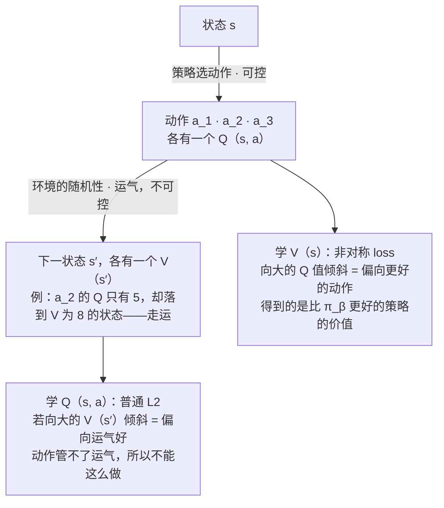
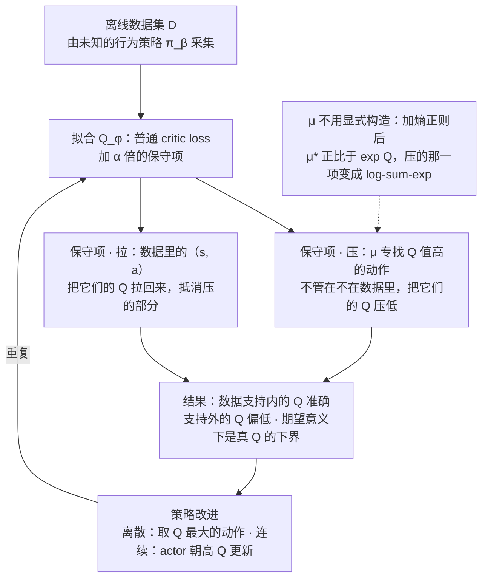
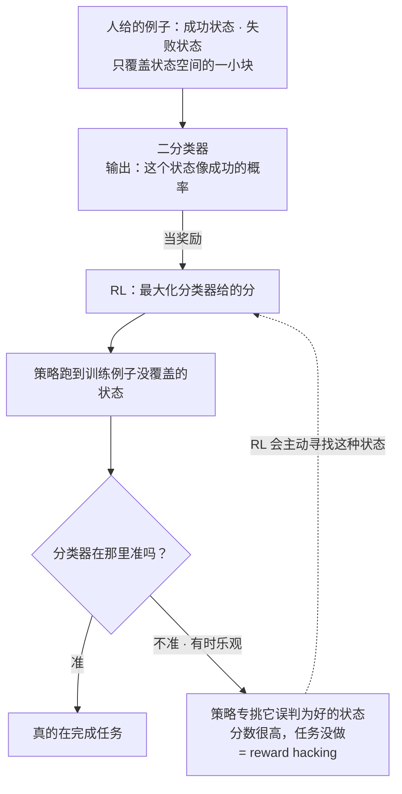
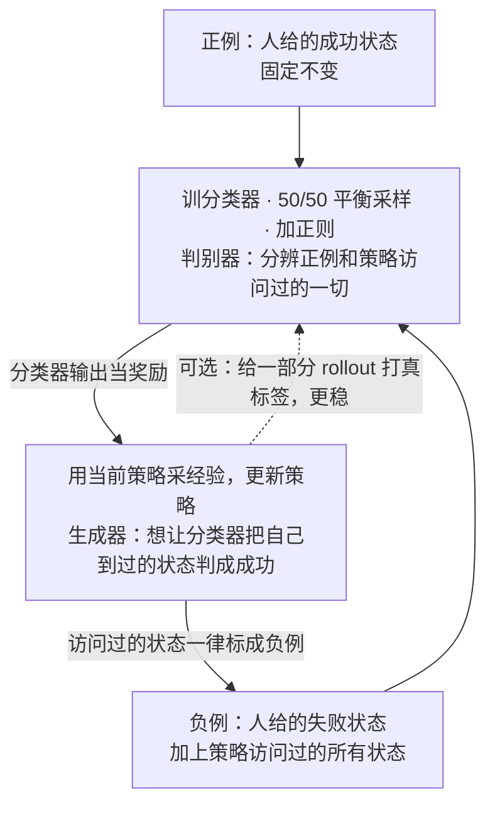
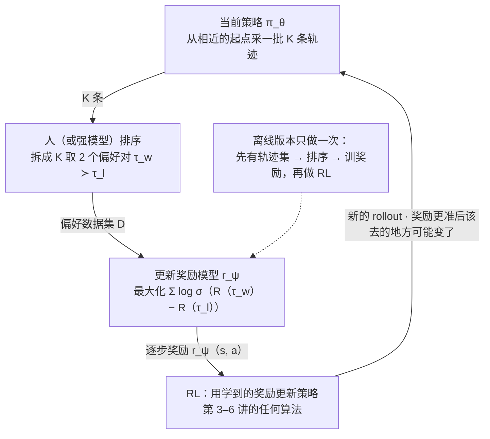
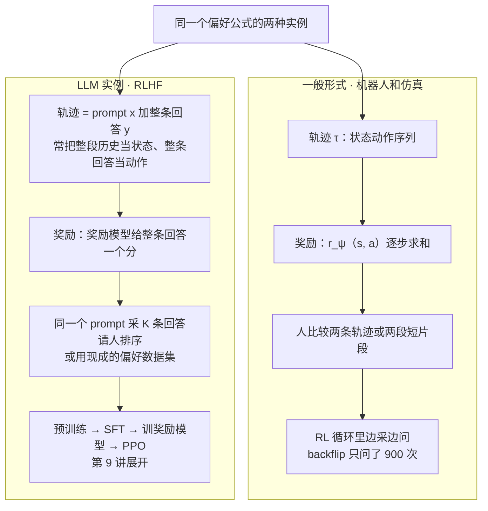

# CS224R 第 8 讲｜奖励学习（Reward Learning）

> Stanford CS224R: Deep Reinforcement Learning（2025 春）· 第 8 讲，2025 年 4 月 25 日
> 视频：<https://www.youtube.com/watch?v=PDIxDhA9Z6Y>（1:05:58，英文字幕是自动生成的，"Q value" 几乎全被听成 "key value"，见文末勘误）
> 讲者：Chelsea Finn（课程主讲，不是客座）
> 课程主页：<https://cs224r.stanford.edu/> · 本讲指定阅读：[Deep Reinforcement Learning from Human Preferences](https://arxiv.org/abs/1706.03741)（Christiano et al., 2017）

**一句话**：前 24 分钟收尾离线 RL：IQL 为什么只在学 V 时用非对称 loss——动作可以挑、运气不能挑；以及 CQL——把数据支持之外的 Q 值压低、数据里的拉回来，加个熵正则之后连那个"专找高 Q 值动作"的分布 μ 都不用显式构造，惩罚项直接变成 log-sum-exp。后 40 分钟讲奖励从哪来：倒水、聊天、驾驶都没有现成的奖励，proxy 又靠不住。最省事的办法是拿成功示例训一个分类器当奖励，但 RL 会专门去找分类器没见过、又误判为好的状态（reward hacking）；解药是把策略访问过的状态一律标成负例回灌重训，这恰好就是一个 GAN。更通用的办法是从成对偏好学：假设"更好的那条轨迹奖励和更大"，差值过 sigmoid 做最大似然，可以一次排 K 条、可以放进 RL 循环里边采边问——仿真里的 backflip、驾驶偏好、ChatGPT 的 RLHF 用的都是这一个公式。

## 时间轴

| 时间 | 内容 |
|---|---|
| [0:06](https://www.youtube.com/watch?v=PDIxDhA9Z6Y&t=6s) | 开场：今天三件事——收尾离线 RL、为什么任务指定难、怎么从人类监督学奖励；离线 RL 的设定与分布偏移回顾 |
| [2:07](https://www.youtube.com/watch?v=PDIxDhA9Z6Y&t=127s) | IQL 回顾：只用数据里的动作学 V 和 Q；为什么 V 用非对称 loss 而 Q 用 L2——动作可控、运气不可控 |
| [7:19](https://www.youtube.com/watch?v=PDIxDhA9Z6Y&t=439s) | 第二条路：允许查询策略的动作，但把数据外的 Q 值压下去；CQL 版本一与"下界"性质 |
| [11:58](https://www.youtube.com/watch?v=PDIxDhA9Z6Y&t=718s) | 版本二：把数据里的动作加回来；问答：会不会伤泛化、α 怎么定、μ 到底是什么、为什么不直接做行为克隆 |
| [16:32](https://www.youtube.com/watch?v=PDIxDhA9Z6Y&t=992s) | 数据集状态上的期望下界；CQL 完整算法；μ 加熵正则后的闭式解，惩罚项变成 log-sum-exp |
| [21:46](https://www.youtube.com/watch?v=PDIxDhA9Z6Y&t=1306s) | 应用：LinkedIn 用 CQL 优化通知发送；问答：到底为什么要保守；离线 RL 小结 |
| [24:49](https://www.youtube.com/watch?v=PDIxDhA9Z6Y&t=1489s) | 奖励学习：奖励从哪来？倒水、聊天、驾驶；proxy 的问题；模仿学习为什么不够 |
| [28:25](https://www.youtube.com/watch?v=PDIxDhA9Z6Y&t=1705s) | 从目标示例学：成功 / 失败分类器当奖励；两个问题——稀疏、被钻空子 |
| [30:55](https://www.youtube.com/watch?v=PDIxDhA9Z6Y&t=1855s) | 防钻空子：把策略访问过的状态标成负例重训分类器，和 CQL 是一个思路 |
| [34:33](https://www.youtube.com/watch?v=PDIxDhA9Z6Y&t=2073s) | 问答：正例太少会过拟合；负例越加越多要 50/50 平衡；假负例为什么没关系；直接用概率当奖励 |
| [39:42](https://www.youtube.com/watch?v=PDIxDhA9Z6Y&t=2382s) | 问答：这不就是 GAN？机器人例子 50 条示范 26% → 62%；GAN 旁白；扩展成完整奖励函数；目标示例小结 |
| [45:16](https://www.youtube.com/watch?v=PDIxDhA9Z6Y&t=2716s) | 从偏好学：哪条更好比打分容易；一条偏好 = 一个关于奖励和的不等式 |
| [48:21](https://www.youtube.com/watch?v=PDIxDhA9Z6Y&t=2901s) | 奖励网络；差值过 sigmoid 变概率；最大似然目标；可以比较部分轨迹 |
| [51:59](https://www.youtube.com/watch?v=PDIxDhA9Z6Y&t=3119s) | 问答：人没说"好多少"怎么办；一次排 K 条；完整算法；放进 RL 循环里边采边问 |
| [56:36](https://www.youtube.com/watch?v=PDIxDhA9Z6Y&t=3396s) | 例子：backflip 只问了 900 次；驾驶偏好；LLM：煎蛋卷的两个回答、预训练 → SFT → RLHF 三步 |
| [1:00:13](https://www.youtube.com/watch?v=PDIxDhA9Z6Y&t=3613s) | 问答：x 是 prompt 还是整段历史、排序怎么拆成对、σ 是什么；RLAIF；小结；其他监督形式；无监督 RL 让 agent 自己提目标 |

## 核心内容

### 1. 收尾离线 RL：IQL 为什么只对 V 用非对称 loss

*图 8-1｜一次 rollout 里的两种随机性：动作可以挑，所以 V 可以向好动作倾斜；下一状态是运气，所以 Q 不能向好运气倾斜（自绘示意）· [▶ 看原幻灯片 3:09](https://www.youtube.com/watch?v=PDIxDhA9Z6Y&t=189s) · 出处：[Kostrikov et al., 2021](https://arxiv.org/abs/2110.06169)*

- **上周三的设定回顾**（第 7 讲）：**离线 RL**（offline RL）是从一批固定的数据里学策略，训练期间不再和环境交互。数据由某个未知的**行为策略**（behavior policy）π_β 采集，目标是让要学的 π_θ 拿到高奖励。两者之间有**分布偏移**（distribution shift）：π_θ 想采取的动作，数据里未必有。
- **为什么传统算法会翻车**：如果学一个 Q 函数（第 6 讲：Q(s, a) 是"在 s 做 a、之后照策略走下去能拿到的期望回报"）再用它改进策略，改进这一步会在 π_θ 自己采出来的动作上查询 Q，而这些动作可能不在数据覆盖范围里；随机初始化的 Q 在那些地方随便给个大数，策略就会奔着那个虚高的数去——这就是**高估**（overestimation）。
- **IQL 的回答**：干脆一次也不在数据之外查询。它只用数据里出现过的状态和动作学一个 V 和一个 Q。可是照常规更新，学到的只是 π_β 自己的 V^π 和 Q^π，没法比行为策略好多少；所以 IQL 在学 V 时用**非对称 loss**（第 7 讲的 expectile 回归：向较大的 Q 值倾斜），学到的是"比行为策略好的那个策略"的价值；学 Q 时用普通的 L2。
- **本讲补的一课：为什么非对称只放在 V 上**。讲者的解释是，rollout 一条轨迹有两种随机性：一是你选了哪个动作，二是选定动作之后环境把你送到了哪个下一状态。前者可控，后者是运气。她举了三个动作的数字例子：a_1 的 Q 值不错，但实际落到的 s′ 价值只有 8——这次运气差；a_2 本身更差，Q 只有 5，可实际落到的 s′ 价值有 8——走运了；a_3 是个冒险动作，Q 是 −5，真做了却没那么糟，s′ 的价值是 0。
    - 学 V 时向大的 Q 值倾斜，倾斜的对象是**动作**，等于偏向更好的动作，得到一个更好的策略的价值函数——这正是想要的。
    - Q 的回归目标是下一状态的 V。如果学 Q 时也向大的 V(s′) 倾斜，倾斜的对象就成了**运气**，学到的是一个"更走运的策略"的价值，而运气不是动作能控制的——所以 Q 必须老老实实用对称的 L2。
- **为什么还要 Q、不能只有 V**：改进策略时要知道哪个动作更好，这只有 Q 能回答（比如第 7 讲的 advantage-weighted regression，用的就是 Q 减 V）。

### 2. CQL：把数据之外的 Q 值压下去

*图 8-2｜CQL 的一轮：普通的价值拟合之外多了"压分布外、拉分布内"两项，然后照常做策略改进（自绘示意）· [▶ 看原幻灯片 17:35](https://www.youtube.com/watch?v=PDIxDhA9Z6Y&t=1055s) · 出处：[Kumar et al., 2020](https://arxiv.org/abs/2006.04779)*

- **另一条路**：仍然估计价值、仍然允许在策略自己的动作上查询 Q，但设法**劝阻**算法去追那些"看起来高、其实是分布外"的 Q 值。最直接的想法：数据支持（support，数据真正覆盖到的范围）之外的 Q 值，直接往下压。压完之后，对分布外的东西就是**保守 / 悲观**的（conservative / pessimistic），在数据覆盖的地方则不那么保守。
- **版本一**：在普通的 critic loss（第 4–6 讲那种以 TD 目标为回归目标的平方误差）之外再加一项：从数据集里取状态 s，从某个别的分布 μ 里取动作 a，把 Q_φ(s, a) 的期望往小里压。μ 应该覆盖策略可能考虑的分布外动作——而策略考虑的正是 Q 值高的动作，所以干脆让 μ 去找 Q 值最高的动作。

$$
\min_{\phi}\;\mathcal{L}_{\mathrm{critic}}(\phi)\;+\;\alpha\,\max_{\mu}\;\mathbb{E}_{s\sim\mathcal{D},\,a\sim\mu(\cdot\mid s)}\big[Q_\phi(s,a)\big]
$$

φ 是 Q 网络的参数，L_critic 是普通的价值拟合 loss，α 是惩罚项的权重（超参数）；内层的 max 让 μ 专挑当前 Q_φ 认为最好的动作，外层的 min 再把这些动作的 Q 压低。

- **它的性质**：只要 α 足够大，学到的 Q̂ 是真实 Q 函数的一个**下界**（lower bound）。讲者画的图：横轴是动作，真 Q 是一条曲线，数据只覆盖中间一段，学到的 Q̂ 整条曲线都在真 Q 之下。
- **问题**：太悲观了。这一项压的是**所有**动作的 Q 值，可数据里出现过的动作我们有数据、有把握，不该压。
- **版本二**：把同样的项在数据里的（s, a）上减回来——分布外的压、数据内的拉，两相抵消，希望得到一个"数据支持内准确、支持外偏低"的 Q。

$$
\min_{\phi}\;\mathcal{L}_{\mathrm{critic}}(\phi)\;+\;\alpha\Big(\max_{\mu}\;\mathbb{E}_{s\sim\mathcal{D},\,a\sim\mu(\cdot\mid s)}\big[Q_\phi(s,a)\big]\;-\;\mathbb{E}_{(s,a)\sim\mathcal{D}}\big[Q_\phi(s,a)\big]\Big)
$$

括号里第二项在数据集自己的（s, a）对上取期望；μ 在支持内挑出的动作会被这一项抵消掉，只有支持外的动作真正被压。

- **性质变了**：不再是对每个（s, a）都成立的逐点下界，但可以证明**在数据集的状态上、期望意义下**仍是真 Q 的下界（证明在 CQL 论文里；α = 0 时不成立，α 要足够大，具体条件讲者没记住）。讲者说这条性质说明这个目标"是合理的"。
- **问答**
    - 会不会伤害到数据之外的泛化？——会，它就是要在支持外更悲观。α 控制悲观程度：如果你相信自己的模型在这个问题上泛化得不错，就把 α 调小，多用原始 critic 目标、少用正则项。
    - 公式里该写 Q 还是 Q̂？——是正在学的那个 Q_φ；幻灯片把 Q 当作被最小化的对象，板书按参数写，记号略有出入。
    - μ 是什么？是一个"支持外的假策略"吗？——可以把它看成一个策略，但不是要运行的那个：它专门去找 Q 值大的动作，不管在不在数据里；一旦找进了数据支持内，就被第二项抵消，所以支持内的估计仍然准确。
    - 既然目标是压低分布外的 Q，为什么不直接做行为克隆？——因为这个算法**有可能比行为克隆好得多**：任何 RL 方法都在利用奖励信息去找 Q 值高的策略；周三讲的按奖励筛选、排序再模仿的方法也能超过行为克隆。只在数据里的动作上训策略是一条合法路线，CQL 是另一条。
- **完整算法**：在数据集上优化上面的目标得到 Q → 更新策略（离散动作直接取 Q 最大的动作；连续动作要做一步 actor 更新，让策略去选高 Q 的动作）→ 重复。
- **μ 不用真的造出来**。显式构造 μ 又烦又多一个活动部件；而且按上面的写法，μ 会坍缩成只取那一个 Q 最大的动作。我们希望它考虑更宽的一批动作——给 μ 加一个**熵**正则（entropy：分布越"散"熵越大）。"既要 Q 大、又要熵大"这个问题有闭式解：最优的 μ 正比于 Q 值的指数。代回去，那一项就变成对动作的 log-sum-exp，μ 从公式里消失了。

$$
\mu^{*}(a\mid s)\propto\exp\big(Q_\phi(s,a)\big)\;\;\Longrightarrow\;\;
\min_{\phi}\;\mathcal{L}_{\mathrm{critic}}(\phi)\;+\;\alpha\,\mathbb{E}_{s\sim\mathcal{D}}\Big[\log\sum_{a}\exp Q_\phi(s,a)\Big]\;-\;\alpha\,\mathbb{E}_{(s,a)\sim\mathcal{D}}\big[Q_\phi(s,a)\big]
$$

μ* 是加了熵正则后的最优"找茬分布"；log Σ_a exp Q 是一个"软最大值"——比 Q 的最大值略大、随 Q 平滑变化；连续动作空间下用采样来估计这个和。讲者说推导可能课后发到 Ed 上。

> 小注：这就是 CQL 论文（Kumar, Zhou, Tucker, Levine, 2020）里的 CQL(H) 变体，H 指熵正则；论文还有把熵换成对某个先验分布的 KL 的 CQL(ρ) 变体。连续动作下论文用重要性采样近似 log-sum-exp。

- **一个"真实世界"的应用**：LinkedIn 用 double DQN（第 6 讲）加上 CQL 的惩罚项，在离线数据上学一个决定"要不要给用户发通知"的策略。目标是多目标的：点击率要高（说明用户真感兴趣），通知总数要少（别变成骚扰），还关心周活跃用户。上线做 A/B 测试后，比原有系统点击率更高、通知更少、用户使用量略增。
    > 小注：应为 Prabhakar et al., KDD 2022，[Multi-objective Optimization of Notifications Using Offline Reinforcement Learning](https://arxiv.org/abs/2207.03029)，摘要里说的正是"基于 CQL 的 double DQN"。
- **问答：到底为什么要保守**——回到离线 RL 的初衷：数据支持之外你没法再采数据。如果假装能远远走出数据，学到的 Q 就不准，策略就差。保守只针对支持外。
- **离线 RL 小结**：在线采数据贵，离线数据有用；核心难题是策略与数据之间的偏移带来的高估；今天讲的办法是显式惩罚 Q 值；离线方法能超过模仿学习（包括筛选式模仿），靠的是把数据里好的片段拼接起来（stitching）和利用奖励信息。

### 3. 奖励从哪来：任务指定为什么难

- **问题**：除了模仿学习，前面所有算法都在最大化奖励之和，可奖励是谁给的？最早的 RL 用例是电脑游戏，游戏分数天然就是奖励。真实世界很少这么慷慨：
    - 让机器人把水从壶里倒进杯子——小孩都会，机器人很难。人喝到水有满足感，机器人没有。想手写奖励，得先表示"水在哪、洒了没、进杯子了没"，很难。
    - 聊天机器人——没有人会告诉你"这句回答值 1 分、那句值 10 分"。
    - 自动驾驶——世界不给分；交规、乘客舒不舒服……一堆因素要揉进去。
- **用 proxy**：可以让人打 1 / 0 的成功标签，或者用点击率这种**代理指标**——我们并不真的在乎人点没点，只是它和我们在乎的东西相关。但 proxy 有很多坏处（CME295 第 5 讲里"用掌声当讲课奖励"的比方，就是 proxy 被优化过头的样子），值得想想有没有别的监督方式。
- **模仿学习**（第 2 讲）不需要奖励，但它只是在模仿动作，没有在想"结果"；有些任务示范难给，或者专家和机器人自由度不同，示范根本对不上。
- **奖励学习**要做的事：推断专家想达到什么结果、人想要什么。人类很擅长这个——讲者放了小孩看一眼就明白大人想干什么、还主动去帮忙的视频。本讲讲两条路：**从目标示例学**，**从人类偏好学**。

### 4. 从成功示例学：训一个分类器当奖励，以及它怎么被钻空子

*图 8-3｜reward hacking 从哪里进来：分类器只在固定数据上训过，而被它优化的策略会跑到数据之外，专找它判错的地方（自绘示意）· [▶ 看原幻灯片 29:55](https://www.youtube.com/watch?v=PDIxDhA9Z6Y&t=1795s)*

- **最简单的做法**：给几个"成功了"的例子（比如铅笔盒放到了笔记本后面），再给几个"没成功"的例子，训一个二分类器，正例标 1、负例标 0，把它的输出当奖励，跑 RL。也就是：收集成功状态（可以想成一个**目标集合**里的状态）和失败状态 → 训分类器 → 用分类器给的奖励做 RL。
- **会出什么问题**（讲者问学生，两个答案都对）：
    1. 奖励很**稀疏**：它只说你在不在目标集合里，进不了目标集合之前没有任何"正在接近"的信号。
    2. 策略会学会**骗过分类器**而不是完成任务。分类器只在你给的那批例子的分布上训过；策略却能跑遍各种状态，包括数据里没有的。这和离线 RL 里的分布外问题是一回事：对着分类器优化，RL 会主动寻找它判错的地方，而它判错时有时会乐观。讲者强调这一点"格外会出问题"——RL 算法会**专门去找**分类器以为好、其实没见过的状态，利用它的弱点。
    > 小注：这就是 CME295 第 5 讲和 CS329A 第 3 讲里的 reward hacking，只不过那里被钻空子的是奖励模型或 verifier，这里是一个成功分类器。机制完全相同：奖励函数是从固定数据学出来的，而被它优化的策略会改变数据分布。

*图 8-4｜防钻空子的循环：策略访问过的状态回灌成负例、重训分类器——结构上就是一个 GAN，分类器是判别器、策略是生成器（自绘示意）· [▶ 看原幻灯片 33:32](https://www.youtube.com/watch?v=PDIxDhA9Z6Y&t=2012s) · 出处：[Fu et al., 2018](https://arxiv.org/abs/1805.11686)（VICE；课上没点名，推断）*

- **能不能防？** 讲者说恰好和 CQL 同一天讲，因为解法是同一个思路。画一个抽象的状态空间：正例聚在一处，负例在另一处，分类器学到一条决策边界；RL 训着训着跑到边界外某个区域——那里有的状态其实不错，有的很糟，分类器没见过、说不准。既然没有真奖励、也不想在线要人工标签，就**保守**一点：把策略访问过的这些状态**全部当负例**，回灌重训分类器；边界收紧，策略再往别处试，分类器在那些状态附近越来越准。
- **完整循环**：收集初始的成功 / 失败状态 → 训分类器 → 用当前策略采经验，用分类器奖励更新策略 → 把访问过的状态加进负例 → 重训分类器 → 重复。
- **问答里把这个算法盘了一遍**
    - 正例很少会过拟合：边界可能只圈住那几个正例点，旁边的都判负。——给分类器加正则（普通的正则化手段就有帮助），让它更平滑。
    - 负例越加越多：不做处理的话，分类器最后会到处预测负。——**必须 50/50 重新平衡**：采样时一半正例一半负例。原始负例会不会被采样负例淹没？可以也做平衡，看初始负例有多少。
    - 更要命的：策略会真的走到目标状态，甚至和正例一模一样，却被标成负例——标签明明是错的（**假负例**）。——讲者算了一笔账说明为什么只要平衡了就没事：设采样的一半是真正例，另一半里 40% 是假负例、10% 是真负例（含原始负例）。分类器对一个正例输出的"是正例"概率不会是 1，但一定**大于 0.5**、也大于"是负例"的概率；只有另一半**全部**是假负例时才恰好 0.5，只要还有一点真负例就严格大于。真负例的概率则小于 0.5。所以用作奖励时正负仍然分得开。
    - 那能不能干脆不做 0/1 阈值、直接用概率当奖励？——可以，也很正常。用置信区间？——也许有帮助，但需要更复杂的 RL 方法，讲者没细想过。
    - 遇到很难区分的状态？——有正则的话倾向于判正，因为正则鼓励函数平滑；具体看它和正例差多少。
    - 跑完一条轨迹之后我们看得到真实标签吗？——不，假设除了初始数据没有任何额外的人工监督。当然也可以给一部分 rollout 打标签来继续更新分类器，不必每条都标，这也能让训练更稳。
- **这不就是 GAN 吗？**（一个学生抢在两页幻灯片之前问出来）——对，这**正是**一个生成对抗网络：分类器是判别器，分辨"你给的正例"和"策略访问的一切"；策略是生成器。不需要懂 GAN 也能用这个算法，但懂的话会发现结构一模一样。GAN 原本是生成模型，常用来生成图像：训一个分辨真图和生成图的分类器，再训生成器去骗它。
    > 小注：GAN 出自 Goodfellow et al., 2014。把成功示例当正例、策略状态当负例来学奖励的这一套，应为 VICE（Fu et al., 2018，[Variational Inverse Control with Events](https://arxiv.org/abs/1805.11686)），它把任务写成"最大化目标事件发生的概率"。
- **一个机器人例子**（讲者组里的工作，"我们发现"）：50 条示范，取每条的末状态当成功正例；replay buffer（第 5 讲的经验池）用示范初始化。直接模仿这 50 条，成功率约 26%——50 条不多，再多收也很难到 100%；改用这样学出来的分类器做 RL，成功率 62%。不算惊艳，但比模仿高一大截。研究里发现的关键点也是：**分类器一定要正则化**，否则会过拟合那 50 个正例。
- **扩展**（时间不够，讲者跳过了）：不只学"目标分类器"，还能学完整的奖励函数——把示范里**所有**状态当正例、策略 rollout 的所有状态当负例，学到的就是对状态分布的奖励，而不只是对目标状态的。
    > 小注：这条被跳过的路就是对抗式模仿 / 逆强化学习一族：GAIL（Ho & Ermon, 2016）和 AIRL（Fu et al., 2018）。逆强化学习（inverse RL）问的是"找一个奖励，使示范在它下面是最优的"；对抗式做法把"示范 vs 策略"的判别器直接当奖励。本讲预告里说的"从示范学奖励"，实际只讲到这里。
- **目标示例这条路的小结**：框架很实用；对抗式训练可能不稳定，GAN 文献里的各种正则化技巧可以直接搬过来，很有用；最大的缺点是**需要示例**——有时造这些示例本身就难、耗时。

### 5. 从偏好学：比较比打分容易

- **换一种监督**：不只想到达某个目标集合，而是想区分"好行为"和"坏行为"，这可能不只是到没到某个状态的事；而且不想只靠示范或目标示例，想对**整条 rollout** 给反馈。
- **问哪个问题**：一种是"这条轨迹有多好"——从蓝点出发尽快到星星，让你给一条路径打分，很难。换一种问法："这两条哪条更好"——蓝线还是粉线？全场都选蓝线。**相对偏好**比绝对评价容易得多，二维画线如此，很多真实任务也如此。
- **一条偏好告诉了我们什么**：如果人说 τ^w（winning）比 τ^l（losing）好，最自然的解读是：沿 τ^w 各步奖励之和应该大于沿 τ^l 的。一个二元标签只给一点点关于奖励的信息，我们要把很多这样的标签**汇总**成一个奖励函数。

$$
\tau^{w}\succ\tau^{l}\;\;\Longrightarrow\;\;\sum_{t} r\big(s^{w}_t,a^{w}_t\big)\;>\;\sum_{t} r\big(s^{l}_t,a^{l}_t\big)
$$

τ^w、τ^l 是被判为更好和更差的两条轨迹，r 是要找的（未知的）逐步奖励；≻ 读作"优于"。

- **写成可以优化的目标**（讲者一步步来；课上把奖励的参数也记作 θ，本笔记改记 ψ，免得和策略参数混淆）：
    1. 把奖励设成一个神经网络 r_ψ(s, a)，读一个状态和一个动作，输出一个标量；一条轨迹的奖励 R_ψ(τ) 就是沿途各步之和（沿用前几讲的简写）。
    2. 起点：希望 R_ψ(τ^w) − R_ψ(τ^l) 是正数。
    3. 机器学习里我们喜欢概率、喜欢做最大似然，于是把这个差**过一个 sigmoid**，压到 0 和 1 之间，当作"τ^w 确实优于 τ^l"的概率。
    4. 在数据集的所有偏好对上让这个概率最大——对每一对，各自求奖励和、相减、过 sigmoid、取 log 再求和，用梯度下降优化 ψ。

$$
P_\psi\big(\tau^{w}\succ\tau^{l}\big)=\sigma\big(R_\psi(\tau^{w})-R_\psi(\tau^{l})\big),\qquad R_\psi(\tau)=\sum_{t} r_\psi(s_t,a_t),\qquad \sigma(z)=\frac{1}{1+e^{-z}}
$$

σ 是 sigmoid（讲者在问答里现场画了它的 S 形曲线）；两条轨迹的奖励和差得越多，模型认为"τ^w 更好"的概率越接近 1；差为 0 时恰好 0.5。

$$
\max_{\psi}\;\sum_{(\tau^{w},\,\tau^{l})\in\mathcal{D}}\log\sigma\big(R_\psi(\tau^{w})-R_\psi(\tau^{l})\big)
$$

D 是偏好对的数据集；这就是最大化"标注结果在模型下的对数似然"，取负号就是训练用的 loss。

> 小注：这就是 Bradley–Terry 模型（1952），CME295 第 5 讲的奖励模型 loss 是它在 LLM 上的特例——那里 R 是奖励模型给整条回答的一个分数，这里是对整条轨迹逐步奖励求和的一般形式。课上没有点 Bradley–Terry 的名字。CS329A 第 3 讲的 ORM 也是同一个东西。

- **不必是整条轨迹**：从 Palo Alto 开到旧金山、把厨房收拾干净，这样的轨迹里有很多子段，可能有的段好、有的段差。所以也可以拿**部分轨迹**来比："这段比那段好"。
    > 小注：Christiano et al. 正是这么做的：让标注者比较两段等长的短片段（clip），而不是整条 episode。
- **问答：人只说了谁好，没说好多少**。如果三条轨迹一条很好、一条差一点、一条差很远，这个目标不区分"好一点"和"好很多"。——两点回应：其一，数据多了之后，成对偏好会隐含一个排序（A 优于 B、B 优于 C……），排序会**迫使**奖励函数给最好的那条明显更高的分，想要的效果自然就出来了；其二，实际收集时经常直接给标注者一批轨迹让他们**排序**，信息更显式。
- **完整算法**：有一个轨迹数据集 → 采一批 K 条 → 请人排序 → 在当前奖励模型下算每条的奖励（前向一遍、沿途求和）→ 对排序里的每一对（共 K 取 2 对）算上面目标的梯度，反向传播 → 更新 ψ → 重复。重复这件事就是在一个固定数据集上做梯度下降。
- **同一起点**：给 LLM 学奖励时通常用**同一个 prompt** 采 K 条回答再排。原因是这些轨迹起点相同才好比：一条从别的起点出发的轨迹可能到得更快，但它起点本来就容易，比较不公平。所以采样时尽量让一批轨迹起点相近。

### 6. 把偏好学习放进 RL 循环：backflip、驾驶与 RLHF

*图 8-5｜偏好学习闭环：策略采样 → 人比较 → 奖励模型 → RL → 再采样；离线版本只走一遍（自绘示意）· [▶ 看原幻灯片 55:34](https://www.youtube.com/watch?v=PDIxDhA9Z6Y&t=3334s) · 出处：[Christiano et al., 2017](https://arxiv.org/abs/1706.03741)*

- **在环学习**：第 5 节是先有数据集再训奖励。也可以把它放进 RL 的循环：策略采样 → 请人排序 → 更新奖励 → 奖励更准了，策略该去的地方可能变了（讲者的例子：本来往这边走，现在应该往那边）→ 更新策略 → 新 rollout → 再问人 → 再更新奖励 → 重复。
- **三个例子**
    - **仿真里的 backflip**（指定阅读 Christiano et al., 2017）：给一个仿真小人写"后空翻"的奖励几乎不可能；他们在 RL 循环里只向人问了 **900 次**"这个比那个好吗"，学出了会后空翻的策略，顺带学出了一个"人类偏好的后空翻"奖励函数。
        > 小注：论文摘要的说法是：人只对不到 1% 的环境交互给了反馈；训练这类新行为大约需要一小时的人工时间。
    - **驾驶**：学"保持车道、保持某个速度、避免碰撞"各占多重——可以想见避碰的权重远大于保持速度。
        > 小注：应为 Sadigh et al., 2017（RSS），Active Preference-Based Learning of Reward Functions：奖励是几个手工特征的线性组合，用主动挑选的成对比较学权重。
    - **语言模型**：prompt 是"怎么煎蛋卷"，从模型采两个回答，问人哪个更好。训练时会花钱请标注员；你用 ChatGPT 时它偶尔弹出的"这两个回答哪个更好"，就是在给 OpenAI 攒偏好数据。有了偏好就能训一个**奖励模型**，判断回答 y 对 prompt x 有多好。

*图 8-6｜同一个偏好目标的两种实例：机器人的逐步奖励求和，与 LLM 的整条回答打分（自绘示意）· [▶ 看原幻灯片 58:42](https://www.youtube.com/watch?v=PDIxDhA9Z6Y&t=3522s) · 出处：[Ouyang et al., 2022](https://arxiv.org/abs/2203.02155)（InstructGPT；课上没点名，推断）*

- **LLM 的完整流水线**（CME295 第 4–5 讲讲过用法，这里是它在 RL 课里的位置）：
    1. **预训练**：在海量、质量参差的数据上预测下一个 token。这一步之后模型知道很多，但不好控制——不一定回答问题、不一定照你说的做，只是接着预测合理的下一个词。
    2. **监督微调（SFT）**：造一份高质量的"这个 prompt 应该这样答"的数据集，在上面做**模仿学习**（第 2 讲）。
    3. **人类反馈**：先收偏好数据（也可以用现成的偏好数据集，不一定非得用自己的模型采）→ 训奖励模型 → 用 RL 最大化它，常用 PPO（第 4 讲）。下周三的课（第 9 讲）专门讲偏好学习。
    > 小注：这条三步流水线应出自 InstructGPT（Ouyang et al., 2022）。第 9 讲的客座讲者 Archit Sharma 是 DPO 的作者之一，会讲怎么把第三步的两阶段并成一个。
- **问答**
    - x 只是 prompt 还是整段对话历史？——通常是整段历史。把 LLM 写成 RL 问题有两种粒度：按 token 的序列决策；或者更粗糙但更简单的——把整段历史当状态、把下一整条回答当要优化的动作。
    - 排序怎么变成公式里的概率？——K 条的排序拆成 K 取 2 个对，每对都有"谁优于谁"，τ^w 记优选的、τ^l 记劣选的；采一对代进公式。
    - σ 是什么？——sigmoid，把实数压到 0 到 1 之间的那条 S 形曲线。
- **RLAIF**：偏好也可以不问人、问一个强模型："这两个哪个更好？"而且"更好"有很多维度，可以指定问你关心的那一维——比如把两条回答喂给模型，问哪条**更无害**，用来阻止模型产出有害内容。背后的洞见：**批评比生成容易**，所以用 AI 反馈有机会得到比评判者本身更强的模型；已有工作显示这种反馈在多个维度上都能带来提升。
    > 小注：无害性这个例子和 RLAIF 这个词应出自 Constitutional AI（Bai et al., 2022）。CME295 第 5 讲把它列为 RLHF 的对照项；这里讲者给出了它成立的前提——评判者的判断要比被评判者的生成更可靠。

### 7. 小结与两条延伸

- **奖励不能当成现成的**。两条路对比：

| | 从目标示例学 | 从偏好学 |
|---|---|---|
| 要人提供什么 | 成功（和失败）状态的例子 | 成对比较或一批排序 |
| 好处 | 很实用，标签便宜 | 不需要示范、不需要目标示例；比较极易提供；在 LLM 上已大规模部署 |
| 代价 | 对抗式训练难优化；示例有时难造 | 可能需要人在 RL 循环里持续给监督 |
| 被钻空子时怎么办 | 把策略访问的状态回灌成负例 | 边采边问，让奖励模型跟着策略的分布走 |

- **还有别的监督形式**：目标和偏好只是两种反馈。人还可以用语言说"这个不错""这个有帮助但语气有点刻薄"……怎么把这些用起来，讲者认为是一个还有很多事可做的研究方向。
- **无监督 RL**：也可以不让人给目标，让 agent 自己提目标、自己有好奇心。一个例子是两个 agent 博弈：一个负责出目标，另一个负责去达成，能涌现出有意思的行为。第 14 讲的探索会回到这个话题。
    > 小注：应为 asymmetric self-play（Sukhbaatar et al., 2018）。

## 关键图表速查（点时间戳跳到原幻灯片）

| 图 | 看什么 | 跳转 | 出处 |
|---|---|---|---|
| IQL 三个动作的数字例子 | Q̂(s, a) 和实际落到的 V(s′) 对不上的三种情形：倒霉、走运、冒险动作没那么糟；由此看出非对称只能放在 V 上 | [3:42](https://www.youtube.com/watch?v=PDIxDhA9Z6Y&t=222s) | [IQL](https://arxiv.org/abs/2110.06169) |
| CQL 版本一与下界曲线 | 横轴是动作、数据只覆盖中间一段；压低所有 Q 之后学到的 Q̂ 整条在真 Q 之下 | [11:25](https://www.youtube.com/watch?v=PDIxDhA9Z6Y&t=685s) | [CQL](https://arxiv.org/abs/2006.04779) |
| CQL 完整目标的板书 | 压数据外、拉数据内两项怎么写；问答里关于 Q 还是 Q̂ 的记号澄清 | [12:59](https://www.youtube.com/watch?v=PDIxDhA9Z6Y&t=779s) | 同上 |
| μ 的闭式解与 log-sum-exp | 加熵正则后 μ* 正比于 exp Q，惩罚项变成 log Σ exp Q，μ 从公式里消失 | [20:08](https://www.youtube.com/watch?v=PDIxDhA9Z6Y&t=1208s) | 同上 |
| LinkedIn 通知的 A/B 结果 | 基线、double DQN、加 CQL 三者的点击率、通知总数、活跃度 | [22:48](https://www.youtube.com/watch?v=PDIxDhA9Z6Y&t=1368s) | 应为 [Prabhakar et al., 2022](https://arxiv.org/abs/2207.03029) |
| 铅笔盒分类器 | 正例、负例各几张 → 二分类器 → 输出当奖励 | [28:25](https://www.youtube.com/watch?v=PDIxDhA9Z6Y&t=1705s) | — |
| 决策边界被钻空子的手绘 | 策略跑到边界外分类器没见过的区域；把这些状态标成负例后边界收紧 | [31:25](https://www.youtube.com/watch?v=PDIxDhA9Z6Y&t=1885s) | 应为 [VICE](https://arxiv.org/abs/1805.11686) |
| 50/50 平衡的算账 | 一半真正例、另一半 40% 假负例加 10% 真负例时，正例的概率仍严格大于 0.5 | [37:08](https://www.youtube.com/watch?v=PDIxDhA9Z6Y&t=2228s) | — |
| 机器人 26% vs 62% | 50 条示范、末状态当正例、示范初始化 replay buffer；模仿 vs 分类器奖励的 RL | [41:12](https://www.youtube.com/watch?v=PDIxDhA9Z6Y&t=2472s) | — |
| 蓝线 vs 粉线 | 给一条路径打分很难，两条里选一条全场秒答——相对偏好比绝对评价容易 | [45:46](https://www.youtube.com/watch?v=PDIxDhA9Z6Y&t=2746s) | — |
| 偏好目标的推导板书 | 奖励和之差 → 过 sigmoid 当概率 → 在所有偏好对上最大似然 | [49:54](https://www.youtube.com/watch?v=PDIxDhA9Z6Y&t=2994s) | [Christiano et al., 2017](https://arxiv.org/abs/1706.03741) |
| 排 K 条的完整算法 | 采 K 条 → 人排序 → 当前奖励模型前向求和 → K 取 2 对的梯度 → 更新；LLM 里用同一个 prompt | [54:02](https://www.youtube.com/watch?v=PDIxDhA9Z6Y&t=3242s) | 同上 |
| backflip | 900 次询问，在 RL 循环里同时学出策略和奖励 | [56:36](https://www.youtube.com/watch?v=PDIxDhA9Z6Y&t=3396s) | 同上 |
| LLM 三步流水线 | 预训练 → SFT（模仿学习）→ 偏好数据、奖励模型、RL 三小步 | [58:42](https://www.youtube.com/watch?v=PDIxDhA9Z6Y&t=3522s) | 应为 [InstructGPT](https://arxiv.org/abs/2203.02155) |

## 提到的工作

| 名称 | 在本讲里的作用 |
|---|---|
| [IQL](https://arxiv.org/abs/2110.06169)（Kostrikov et al., 2021） | 第 7 讲的主角，本讲补讲为什么非对称 loss 只用在 V 上 |
| advantage-weighted regression（第 7 讲） | 讲者说明"为什么还要学 Q"时举的策略提取方法 |
| [CQL](https://arxiv.org/abs/2006.04779)（Kumar et al., 2020） | 本讲前半的主角：压低分布外 Q 值的保守目标；下界证明在论文里 |
| [Double DQN](https://arxiv.org/abs/1509.06461)（第 6 讲） | LinkedIn 例子的底座算法，加上 CQL 的惩罚项 |
| LinkedIn 通知优化（应为 [Prabhakar et al., KDD 2022](https://arxiv.org/abs/2207.03029)） | CQL 的真实世界应用：离线数据学策略，线上 A/B 验证 |
| 成功分类器当奖励（应为 [VICE](https://arxiv.org/abs/1805.11686)，Fu et al., 2018） | 从目标示例学奖励；把策略访问的状态回灌成负例 |
| 机器人 50 条示范的实验（讲者组里的工作，课上没给题目） | 模仿 26% vs 分类器奖励的 RL 62%；分类器要正则化 |
| [GAN](https://arxiv.org/abs/1406.2661)（Goodfellow et al., 2014） | 分类器 = 判别器、策略 = 生成器；正则化技巧可以直接搬 |
| [GAIL](https://arxiv.org/abs/1606.03476) / [AIRL](https://arxiv.org/abs/1710.11248)（应为） | 被跳过的扩展：示范全部状态当正例，学完整奖励函数 |
| [Deep RL from Human Preferences](https://arxiv.org/abs/1706.03741)（Christiano et al., 2017） | 指定阅读；backflip 900 次询问；在 RL 循环里学偏好奖励 |
| 驾驶偏好（应为 Sadigh et al., 2017, RSS） | 学车道、速度、避碰各占多重 |
| ChatGPT / [InstructGPT](https://arxiv.org/abs/2203.02155)（应为） | LLM 三步流水线；用户点选"哪个回答更好"就是在攒偏好数据 |
| [PPO](https://arxiv.org/abs/1707.06347)（第 4 讲） | RLHF 第三步里常用的 RL 算法 |
| RLAIF / [Constitutional AI](https://arxiv.org/abs/2212.08073)（应为） | 用强模型代替人给偏好；无害性例子；"批评比生成容易" |
| 无监督 RL、目标提议者 vs 达成者（应为 [asymmetric self-play](https://arxiv.org/abs/1703.05407)） | 收尾的延伸：不靠人给目标 |
| 第 9 讲预告（客座 Archit Sharma） | 偏好学习与 DPO 下周三展开 |

## 术语对照

| English | 中文 |
|---|---|
| offline RL | 离线强化学习：只用一批固定数据学策略，训练中不与环境交互 |
| behavior policy π_β | 行为策略：采集离线数据的那个未知策略 |
| distribution shift | 分布偏移：要学的策略想做的动作，数据里未必有 |
| overestimation | 高估：分布外动作的 Q 值被随机地估高，策略奔着它去 |
| support of the data | 数据支持：数据真正覆盖到的状态动作范围 |
| in-distribution / out-of-distribution (OOD) | 分布内 / 分布外 |
| critic / critic loss | 价值网络及其拟合 loss（第 4 讲）：以 TD 目标做回归 |
| asymmetric loss / expectile | 非对称 loss / 分位期望回归（第 7 讲）：向大的一侧倾斜 |
| conservative / pessimistic | 保守 / 悲观：分布外一律往低估 |
| lower bound | 下界：学到的 Q̂ 不高于真 Q |
| entropy regularizer | 熵正则：鼓励分布更"散"，别坍缩成一个点 |
| log-sum-exp | 对数-求和-指数：最大值的平滑版本 |
| stitching | 拼接：把数据里不同轨迹的好片段接成更好的行为 |
| A/B test | 线上对照实验 |
| task specification | 任务指定：把"想要什么"写成算法能优化的目标 |
| proxy reward | 代理奖励：和真正目标相关但不等于它的可测量量 |
| reward hacking / exploiting the classifier | 奖励投机：分数高了，任务没做 |
| goal set / success classifier | 目标集合 / 成功分类器：判断一个状态算不算成功 |
| sparse reward | 稀疏奖励：只在目标附近才有信号 |
| decision boundary | 决策边界 |
| class balancing | 类别平衡：采样时正负各半 |
| false negative | 假负例：其实是正例却被标成负 |
| regularization / smoothness | 正则化 / 平滑：防止只圈住几个正例点 |
| GAN / discriminator / generator | 生成对抗网络 / 判别器 / 生成器 |
| replay buffer | 重放缓冲区（第 5 讲）：存经验供离策略更新，可以用示范初始化 |
| preference / pairwise comparison | 偏好 / 成对比较 |
| winning / losing trajectory（τ^w / τ^l） | 优选 / 劣选轨迹 |
| trajectory return R(τ) | 轨迹的奖励和 |
| sigmoid σ | S 形函数：把实数压到 0 到 1 |
| maximum likelihood | 最大似然 |
| ranking / K choose 2 | 排序 / K 取 2 个对 |
| in the loop | 在环：奖励学习和 RL 交替进行 |
| RLHF / RLAIF | 人类反馈 / AI 反馈的强化学习 |
| SFT (supervised fine-tuning) | 监督微调：文本上的模仿学习 |
| reward model | 奖励模型：判断回答 y 对 prompt x 有多好 |
| unsupervised RL / curiosity | 无监督 RL / 好奇心：agent 自己提目标 |

## 字幕勘误

"key value / key function / key values" → Q value / Q function（全程几十次，是本讲最大的读字幕障碍）；"auto distribution" → out-of-distribution；"mew" → μ（mu）；"RO algorithm" → RL algorithm；"behavior coding" → behavior cloning；"vpi / qpi" → V^π、Q^π；"hati" → Q̂_φ（Q hat phi）；"some x" → sum-exp（log-sum-exp）；"subjective" → this objective；"genative adversarial" → generative adversarial；"adversarial trading" → adversarial training；"chat GBT" → ChatGPT；"PO" → PPO；"TOW W / TOW L" → τ_w、τ_l；"towels" → taus（τ）；"directory" → trajectory；"dispered / disper" → dispreferred；"timeconuming" → time-consuming；"ed" → Ed（课程论坛）。

## 带走的问题

1. CQL 里"压"用的是专找高 Q 值的 μ，"拉"用的是数据分布。如果把 μ 直接换成当前策略 π_θ，闭式解还在吗？α 调得太大或太小，学到的 Q̂ 和最终策略分别会出什么毛病？
2. "把策略访问过的状态一律标成负例"和"把数据外动作的 Q 值压低"是同一种保守。它们各自付出的代价是什么？在你做的 agent 评测里，如果用模型自己的输出当负例去训一个判别式的 verifier（CS329A 第 3 讲），会不会撞上本讲 50/50 平衡和假负例的问题？
3. 偏好目标只约束奖励和的差。给 r_ψ 整体加一个常数 c，两条等长轨迹的差不变，两条不等长的轨迹差却会变——这说明什么？用部分轨迹比较时应该怎么控制长度？
4. 在 RL 循环里边采边问（Christiano）和先收一大批偏好再训奖励模型（InstructGPT 式）：前者防的是什么、多付了什么代价？对照 CME295 第 5 讲的 on-policy / off-policy 和 DPO 的分布偏移，想一想这两种做法分别对应哪一边。
5. RLAIF 依赖"批评比生成容易"。当被评判的策略比评判模型还强的时候，评判模型会不会变成新的被钻空子的对象？本讲的哪一招——负例回灌、在环监督、正则化——能移植到 LLM 的奖励模型上？
