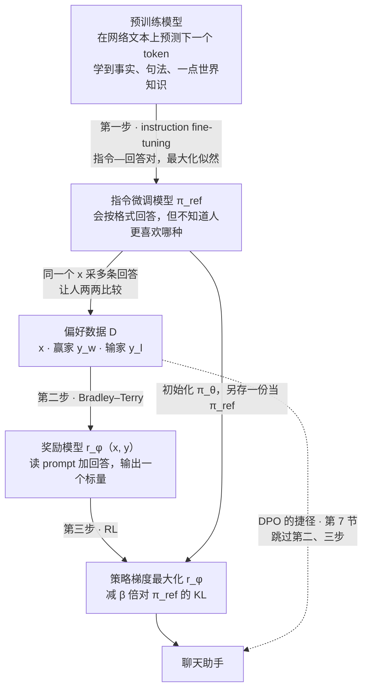
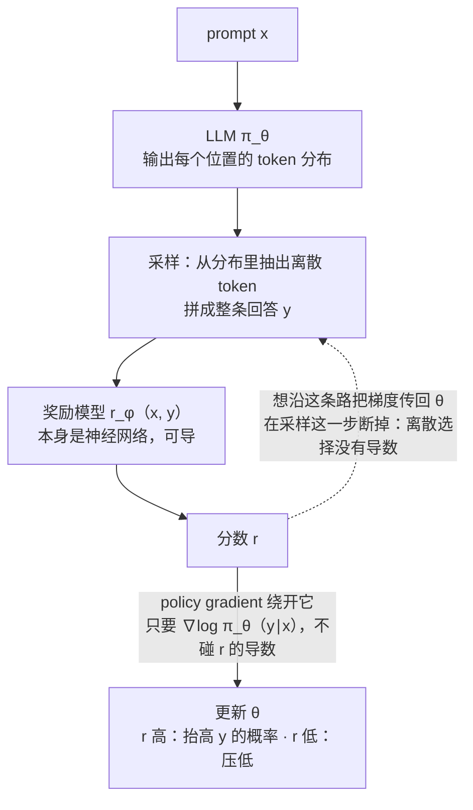
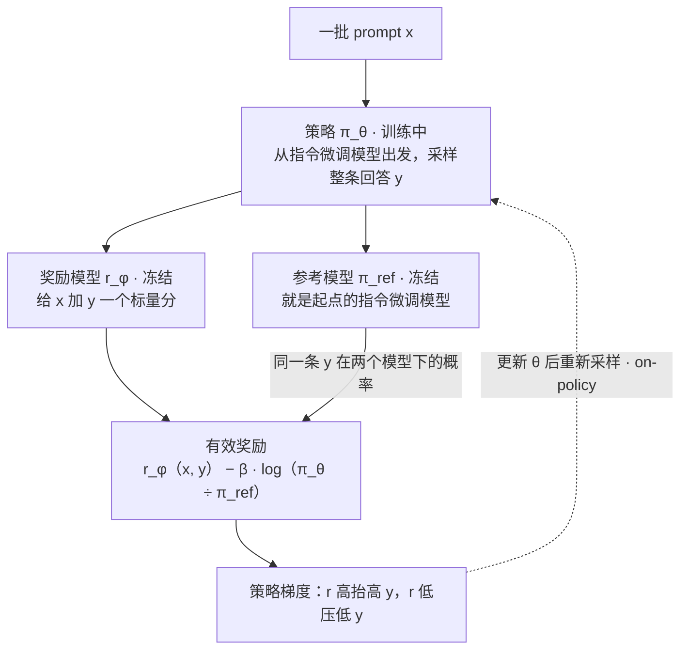
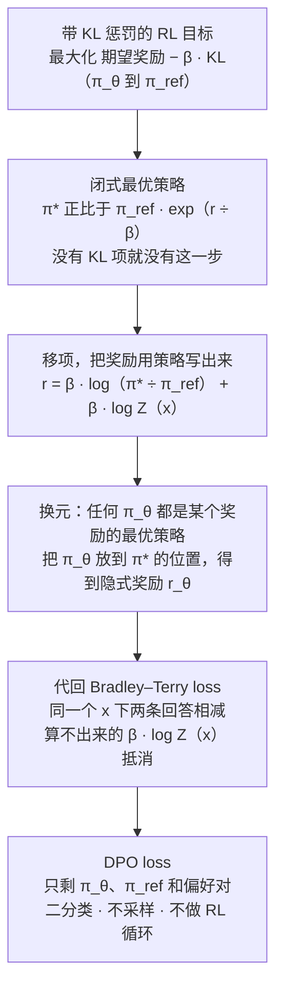
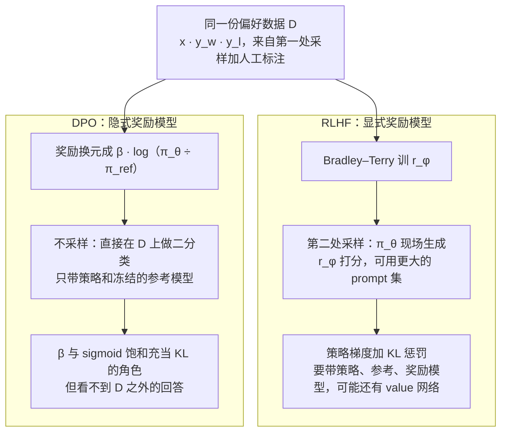

# CS224R 第 9 讲｜RL for LLMs：偏好优化（客座 Archit Sharma）

> Stanford CS224R: Deep Reinforcement Learning（2025 春）· 第 9 讲，2025 年 4 月 30 日 · 客座讲座；第 8 讲讲的是从偏好里学奖励的一般方法，本讲把它落到语言模型上；开场说"推理部分由 Aviral 来讲"，应指第 10 讲（Aviral Kumar）
> 视频：<https://www.youtube.com/watch?v=XKLGuwvSKvI>（1:02:51，英文字幕是自动生成的，DPO、KL、Gumbel 这类专名错得多，见文末勘误）
> 讲者：Archit Sharma（客座；视频简介写的是 Gemini 团队研究员、DPO 论文第一作者——论文实为 Rafailov、Sharma、Mitchell 三人共同一作。课上讲到 DPO 时用的是"我们当时想……"的第一人称）
> 课程主页：<https://cs224r.stanford.edu/> · 指定阅读：[Direct Preference Optimization: Your Language Model is Secretly a Reward Model](https://arxiv.org/abs/2305.18290)（Rafailov et al., 2023）

**一句话**：预训练只教模型"续写文本"，不教它"帮人"。变成助手要三步：instruction fine-tuning 用指令—回答对教会格式，但它标注贵、开放任务没有标准答案、而且只有"对 / 错"没有"好一点 / 差一点"；RLHF 改问人"两条回答哪条更好"，用 Bradley–Terry 把偏好对训成一个打分的奖励模型，再用策略梯度让 LLM 追高分，并加一个 KL 惩罚把它拴在起点模型附近，防止它钻奖励模型的空子。DPO 是讲者自己的工作：带 KL 惩罚的目标有闭式最优解，奖励可以反写成"策略相对起点模型的对数概率比"，代回 Bradley–Terry 后算不出来的配分函数 Z(x) 恰好抵消——于是奖励模型和整个采样 RL 循环一起省掉，一个二分类 loss 直接在偏好对上更新 LLM。收尾讲这套范式的裂缝：偏好噪声大、奖励模型准确率只有六七成、reward hacking、以及优化短期偏好带来的谄媚。

## 时间轴

| 时间 | 内容 |
|---|---|
| [0:06](https://www.youtube.com/watch?v=XKLGuwvSKvI&t=6s) | 开场：模型与算力越做越大；今天回答"预训练模型怎么变成聊天助手"：IFT、RLHF、DPO 三种技术 |
| [1:07](https://www.youtube.com/watch?v=XKLGuwvSKvI&t=67s) | 预训练学到什么：next-token 预测顺带学到事实、句法和一点世界知识；但语言建模不等于帮人：GPT-3 的登月续写 |
| [5:13](https://www.youtube.com/watch?v=XKLGuwvSKvI&t=313s) | Instruction fine-tuning：指令—回答对；越大的模型增益越大；微调前后的对比 |
| [8:50](https://www.youtube.com/watch?v=XKLGuwvSKvI&t=530s) | IFT 的四个局限；问答：IFT 教的主要是格式，知识来自底座；指令数据早已不限于问答 |
| [12:54](https://www.youtube.com/watch?v=XKLGuwvSKvI&t=774s) | RLHF 的设定：摘要任务、指令 x 与样本 y、人给的奖励；期望奖励最大化；InstructGPT 三步 |
| [15:25](https://www.youtube.com/watch?v=XKLGuwvSKvI&t=925s) | 为什么要 RL：奖励不可导；policy gradient 复习——log-derivative trick 与 Monte Carlo 估计 |
| [21:04](https://www.youtube.com/watch?v=XKLGuwvSKvI&t=1264s) | 人打分不校准，改问偏好；Bradley–Terry 奖励模型；问答：分差无界要归一化、为什么用 sigmoid |
| [25:39](https://www.youtube.com/watch?v=XKLGuwvSKvI&t=1539s) | RLHF 循环；难题：奖励模型明明可导，为什么还要 RL——离散 token 的采样瓶颈；Gumbel-softmax |
| [29:45](https://www.youtube.com/watch?v=XKLGuwvSKvI&t=1785s) | 奖励模型不完美，加 KL 惩罚折进奖励；摘要任务上 RL 首次超过人写的摘要 |
| [32:47](https://www.youtube.com/watch?v=XKLGuwvSKvI&t=1967s) | 问答：偏好不可传递与噪声；奖励模型准确率只有 65–70%；能不能主动挑 prompt |
| [35:22](https://www.youtube.com/watch?v=XKLGuwvSKvI&t=2122s) | DPO 的动机：RLHF 流水线又贵又难调；为什么不能从偏好直接优化 LLM |
| [38:33](https://www.youtube.com/watch?v=XKLGuwvSKvI&t=2313s) | 推导：KL 约束目标的闭式最优策略 → 把奖励反写成策略 → 黑板上 Z(x) 抵消 → DPO loss |
| [45:21](https://www.youtube.com/watch?v=XKLGuwvSKvI&t=2721s) | 读 DPO loss；问答：KL 去哪了、"你其实还是在训奖励模型"、还要不要 RLHF、两处采样、偏好强度 |
| [50:57](https://www.youtube.com/watch?v=XKLGuwvSKvI&t=3057s) | DPO 的结果；本节小结：RLHF 与 DPO 各自的取舍 |
| [53:31](https://www.youtube.com/watch?v=XKLGuwvSKvI&t=3211s) | InstructGPT 的例子；DPO 在开源社区；偏好优化后的风格差异；问答：短期与长期偏好、排序数据怎么用 |
| [58:15](https://www.youtube.com/watch?v=XKLGuwvSKvI&t=3495s) | GPT-4o 谄媚事件；reward hacking；rubric 打分；展望：可验证奖励、个性化、幻觉 |

## 核心内容

### 1. 这讲要回答的问题：预训练模型怎么变成助手

- **背景**：过去五到十年最稳定的趋势是模型越做越大、算力越砸越多，甚至有人据此预测 AGI 2027。但本讲的问题不是"再大一点"，而是：一个被训练来预测下一个 token 的模型，怎么变成聊天助手？
- **预训练学到什么**（讲者声明这不是 NLP 课，只快速过一遍）：模型在海量网络文本上学"下一个 token 是什么"。补全"Stanford University is located in ___, California"要记事实；续写一段 Iroh 和 Zuko 的故事要懂句法和指代；接上"Pat 在真空舱里看保龄球和树叶同时落下，作为物理学家的 Pat 预测……"要懂一点物理。结论：next-token 预测学到的远不止语言，还有某种"世界怎么运转"的知识。
- **但"会建模文本"不等于"会帮人"**：GPT-3 拿到"用几句话给六岁小孩解释登月"，续写出来的是"用几句话给六岁小孩解释万有引力……解释相对论……"——在它见过的语料里，这种句子后面往往跟着更多同款题目。它只是在预测文本，没有在回答问题。这道落差就是本讲要填的。
- **今天的三种技术**：instruction fine-tuning、RLHF、DPO，最后谈这套范式还缺什么。
    > 小注：本讲前半场的例子（Zuko、真空保龄球、登月、地震摘要 8.0 对 1.2、policy gradient 的三行推导、p^PT 与 RM_φ 的记号）应与 Stanford CS224N 讲 RLHF 那一讲的课件同源（推断），想找幻灯片可以去那门课的网站。
- **和前两门课的关系**：CME295 第 4 讲讲过预训练与 SFT，第 5 讲讲过 RLHF、PPO、DPO 的用法。本讲真正新的东西在第 4 节和第 7 节：为什么绕不开策略梯度，以及 DPO 是怎么从 KL 目标一步步推出来的。

### 2. 第一步：Instruction fine-tuning，以及它的四个局限

- **范式**：先预训练，再针对任务微调（fine-tuning）——收一批输入和目标输出，最大化目标输出的对数似然。早期是单任务，比如影评情感分类；后来发现预训练模型什么都能干，就把任务数堆上去：收集大量"指令—回答"对（"氮的沸点是多少？——−320.4"），训完在没见过的任务上也能答（"Geoffrey Hinton 能和 George Washington 对话吗？先给理由再回答"）。
- **规模效应**：同一份指令数据，模型越大，微调后的增益越大（BIG-Bench、MMLU 上的表）；很小的数据就能带来很强的泛化。微调前后对比：问"下面句子里代词指代谁、是否有歧义"，原始模型接着往下编句子，微调后才真正回答。
    > 小注：这几页应出自 FLAN（[Wei et al., 2021](https://arxiv.org/abs/2109.01652)，氮沸点与 Hinton 的例子）和 Flan-PaLM（[Chung et al., 2022](https://arxiv.org/abs/2210.11416)，"越大的模型增益越大"的表）；讲者没点名。
- **四个局限**（讲者先让大家自己想）：
    1. 标注贵。题越难，能写出标准答案的人越少，逐题请人写答案没法规模化。
    2. 很多任务没有"正确答案"。LLM 的大量用途是创作类的——"写一个关于狗和它的宠物蚱蜢的故事"没有唯一正解。
    3. 所有错误一视同仁。IFT 只有一个预定义答案，偏离它的每个 token 受同样的惩罚，没法表达"这句大体对，只是把 Avatar 说成奇幻剧不如说成冒险剧好"这种程度差别。更麻烦的是，模型写答案已经比人好，靠人写标签就被人的水平封顶。
    4. 目标错位。我们想要的是模型理解意图、和人互动得好；训练目标却只是"把这条答案预测准"。
- **问答**
    - IFT 的收益来自学格式还是学知识？——多数证据说主要是格式：故意用错误答案做指令微调，下游还是不错，知识基本来自底座。
    - 指令数据只能是问答格式吗？——早期是，现在极其多样，函数调用、工具使用都在里面。
- **和第 2 讲的关系**：IFT 就是行为克隆——最大化示范数据的似然，误差一视同仁。CME295 第 4 讲讲怎么做 SFT，这里讲为什么它不够。

### 3. RLHF 的设定：把 RL 的词翻到 LLM 上

*图 9-1｜InstructGPT 式的三步流水线：指令微调教格式，奖励模型学偏好，RL 追分；DPO 是从偏好数据直通结果的捷径（自绘示意）· [▶ 看原幻灯片 14:24](https://www.youtube.com/watch?v=XKLGuwvSKvI&t=864s) · 出处：[Ouyang et al., 2022](https://arxiv.org/abs/2203.02155)*

- **贯穿本讲的例子是摘要**：没有唯一正确的摘要，正适合用偏好。记号：指令（prompt）x，模型生成的样本 y（课件写 ŷ），先假设人能给 (x, y) 一个奖励分——地震新闻的两条摘要，说了地震和无人受伤的得 8.0 分，扯湾区天气和山火的得 1.2 分。
- **目标**：给定 x，让 LLM 生成的 y 平均得分最高——就是这门课第 1 讲写下的 RL 目标。

$$
\max_{\theta}\;J(\theta)=\mathbb{E}_{x\sim\mathcal{D},\;y\sim\pi_\theta(\cdot\mid x)}\big[\,r(x,y)\,\big]
$$

x 是从 prompt 集合 D 里抽的指令，y 是当前策略 π_θ（参数为 θ 的 LLM）对它生成的整条回答，r(x, y) 是这条回答得到的奖励；目标是调 θ，让自己生成的回答平均得分最高。课件里策略写作 p_θ、样本写作 ŷ，本文统一用 π_θ 和 y。

- **RL 的词在这里各指什么**（这门课前几讲的记号，一一对上）：

| RL 里的词 | 本讲里的对应物 |
|---|---|
| state（状态） | prompt x |
| action（动作） | 整条回答 y。问答里讲者确认：采样的是整句，不是逐个 token |
| policy π_θ（策略） | LLM 本身：给定 x 生成 y 的概率 π_θ(y ∣ x)，等于逐 token 概率的连乘 |
| reward（奖励） | 人（或奖励模型）对 (x, y) 的打分，整条回答只给一次 |
| trajectory / episode（轨迹 / 回合） | 一步就结束：读 x、写 y、拿分。第 1 讲的 MDP 在这里退化成单步决策，也就是 bandit |
| environment（环境） | 几乎是空的：没有状态转移，只有打分 |

> 小注：CME295 第 5 讲把每个 token 当一个动作、整条回答当一条轨迹；本讲和 DPO 论文用的是"整条回答是一个动作"的 bandit 视角。两种视角在"奖励只在结尾给一次"这点上等价（第 3 讲的 reward-to-go 讨论），区别只在 value function 要不要按 token 算。

- **三步流水线**（InstructGPT，图 9-1）：先用示范数据做 IFT 把格式调对；再训一个奖励模型，让它对齐人的意图；最后最大化奖励模型的分。后两步是本讲重点。

### 4. Policy gradient 复习：为什么绕不开 RL

*图 9-2｜奖励模型明明可导，梯度却过不了"采样"这一关：策略梯度只用 ∇log π_θ，从旁边绕过去（自绘示意）· [▶ 看原幻灯片 27:12](https://www.youtube.com/watch?v=XKLGuwvSKvI&t=1632s)*

- **第一个理由**：奖励往往不可导——让人给一个分数，人脑没法反向传播。策略梯度（policy gradient）方法的价值就在于它能优化"不可导奖励的期望"。讲者说 Chelsea 早已讲过（第 3 讲），这里只复习。
- **推导走三步**。要的是 ∇_θ E_{y∼π_θ}[r(y)]（为省记号先不写条件 x）。第一步，把期望按定义写成对所有 y 的求和 Σ_y r(y) · π_θ(y)，由梯度的线性性，∇ 可以移进求和号，落在 π_θ(y) 上。第二步，log-derivative trick：由链式法则 ∇ log π_θ = ∇π_θ / π_θ，所以 ∇π_θ = π_θ · ∇ log π_θ，把这个恒等式代回去。第三步，求和式里重新出现了 π_θ(y) 这个权重，于是整个式子又是一个"在 π_θ 下的期望"——可以采样估计了：从 π_θ 采 m 条回答，算 r · ∇log π_θ 的平均，就是 Monte Carlo 估计，插进任何梯度优化器。

$$
\nabla_\theta\,\mathbb{E}_{y\sim\pi_\theta}[r(y)]=\sum_{y} r(y)\,\nabla_\theta\pi_\theta(y)=\sum_{y} r(y)\,\pi_\theta(y)\,\nabla_\theta\log\pi_\theta(y)=\mathbb{E}_{y\sim\pi_\theta}\big[r(y)\,\nabla_\theta\log\pi_\theta(y)\big]\approx\frac{1}{m}\sum_{i=1}^{m} r(y_i)\,\nabla_\theta\log\pi_\theta(y_i)
$$

三个等号分别是：期望的定义、log-derivative trick、再把求和认回期望；最后的 ≈ 是用 m 条采样回答做的 Monte Carlo 估计。r 只以数值形式出现，从头到尾没有对它求导。

- **为什么要费这番周折**：对句子求期望不可能枚举——每个位置的词表十万量级、长度上千——必须有一个能采样的随机估计量，这个 trick 恰好把"梯度"变回"期望"。
- **直觉**：奖励高的样本，抬高它的对数似然；奖励低的样本往反方向推——好的动作多做、坏的少做，这就是 reinforcement 一词的来历。第 3 讲把它叫 REINFORCE，还讲了减 baseline 降方差；本讲不谈降方差，CME295 第 5 讲的 PPO 就是这个估计量加上 advantage 和 clip 之后的样子。
- **问答：为什么"必须"这样求梯度**？——两个理由：奖励不可导；更精确的数学理由是 θ 在期望的采样分布里，梯度必须穿过采样过程。奖励若可导，完全可以设别的目标端到端反传。
- **讲者的难题**（他说这题"有点难"，学生答得接近）：奖励模型是神经网络，可导，那为什么还要 RL？答案是离散瓶颈（图 9-2）：LLM 输出的是采样出来的离散 token，从奖励模型出发的梯度到"采样"这一步就断了。如果 y 是连续变量，直接反传把分数推高就行，还省掉昂贵的采样；但 y 是几千个离散 token。有学生提 Gumbel-softmax，讲者说这类"让采样可导"的技巧没有在这种规模上成功：一条回答是"十万词表 × 序列长度"的组合空间，Gumbel-softmax 通常撑不过千维。教训：别默认必须用 RL，先问梯度能不能直接传。
    > 小注：Gumbel-softmax（[Jang et al., 2016](https://arxiv.org/abs/1611.01144)；同期 Maddison et al. 的 Concrete distribution）用"加 Gumbel 噪声再过带温度的 softmax"这个连续松弛替代离散采样，让梯度能穿过采样步，代价是有偏、且高维下方差大。
- **问答：加了奖励模型之后，什么变得可导了？**——什么都没变。策略梯度只需要 ∇log π_θ，从不往奖励里反传。

### 5. 从偏好到奖励模型：Bradley–Terry

- **问题**：训最大的 LLM 需要百万级查询，不可能让一支"人类军团"给每条回答打分。解决：把"学人的奖励"拆成单独的优化问题，先训一个奖励模型（reward model），再进 RL。
- **为什么不直接要分数**：不同人的刻度不同——"7 分"对两个人意思完全不同；同一个人中午吃了什么都会影响打分；直接要分数训出的奖励模型不好用。改问偏好：给几条摘要，问"这条比那条好吗"。数据形式是 (x, y_w, y_l)，y_w 是赢家、y_l 是输家，集合记作 D。
- **Bradley–Terry 目标**：从偏好数据得到一个"隐含"的奖励分，要求赢家的分高于输家。

$$
\mathcal{L}_{\mathrm{RM}}(\phi)=-\,\mathbb{E}_{(x,\,y_w,\,y_l)\sim\mathcal{D}}\Big[\log\sigma\big(r_\phi(x,y_w)-r_\phi(x,y_l)\big)\Big]
$$

r_φ 是参数为 φ 的奖励模型，σ 是 sigmoid，把分差映射成"y_w 赢 y_l 的概率"；最小化它就是最大化"观察到这些胜负"的对数似然。CME295 第 5 讲从最大似然一步步推过这个式子，第 8 讲在机器人轨迹上用的也是它——那里比较的是两段轨迹，这里比较的是两条回答。

- **问答里的两点，后面 DPO 要用**
    - 分数无界吗？要归一化吗？——目标只要求分差大：1000 与 10000、1 与 999 都能满足，没有任何东西定住尺度。所以实践里要做事后归一化，让不同 prompt 的分数在同一尺度上，否则 RL 阶段会很"诡异"。讲者特意标注：这是发展 DPO 要用到的关键观察——loss 只看分差。
    - 为什么用 sigmoid？——不是必须，别的函数也行；sigmoid 天然对应"这条赢那条的概率"，所以通行。
- **后面问答里的更多现实**
    - 偏好可能不可传递：A 胜 B、B 胜 C，却 C 胜 A。说不通，但真实数据里就是有，噪声很大，没有好办法。
    - 偏好学习本质是二分类。一般的二分类能到 90–95%，语言模型的奖励模型通常只有 65–70%——勉强好于随机，却已足以带来大幅提升。
    - 能不能主动挑模型"拿不准"的 prompt 去问偏好？——属于主动探索、最大化信息增益那一类，有零散工作，没有标准做法（第 14 讲）。
    > 小注：Bradley–Terry 给每条回答一个标量分，胜率只由分差决定，天然可传递，所以它表达不了讲者说的循环偏好；直接建模两两胜率的"一般偏好模型"（如 Nash learning from human feedback，[Munos et al., 2023](https://arxiv.org/abs/2312.00886)）就是冲着这点去的。

### 6. RLHF 循环与 KL 惩罚：把它拴在起点附近

*图 9-3｜RLHF 的一轮：策略采样，奖励模型打分，KL 项按"这条回答在策略下比在参考模型下概率高多少"扣分（自绘示意）· [▶ 看原幻灯片 30:15](https://www.youtube.com/watch?v=XKLGuwvSKvI&t=1815s) · 出处：[Stiennon et al., 2020](https://arxiv.org/abs/2009.01325)（应为）*

- **现在手里有**：指令微调模型（课件记作 p^PT，讲者说它可以是指令微调过的，本文写 π_ref）和训好的奖励模型 r_φ。RLHF 循环就是把 r_φ 插进第 3 节的目标：从 π_θ 采样 y，r_φ 打分，用第 4 节的策略梯度更新 θ。它是 on-policy 的：数据必须来自当前策略，每更新一步都得重新采样（第 3 讲）。
- **但奖励模型永远不完美**：它是在某个偏好分布上拟合出来的，只在那附近可信；朴素地优化下去，会得到"钻奖励模型空子"的模型（reward hacking，第 10 节有图）。补救是 **KL 惩罚**：把 −β log(π_θ(y ∣ x) / π_ref(y ∣ x)) 这一项加进奖励——当前模型给这条回答的概率比起点模型高得越多，扣得越多。对 y 取期望，这一项恰好是 π_θ 与 π_ref 之间的 KL 散度。第 5 讲预告过"带 KL 罚项的 PPO 变体在偏好优化里常用"，就是这里。

$$
\max_{\theta}\;\mathbb{E}_{x\sim\mathcal{D},\;y\sim\pi_\theta(\cdot\mid x)}\Big[r_\phi(x,y)-\beta\log\frac{\pi_\theta(y\mid x)}{\pi_{\mathrm{ref}}(y\mid x)}\Big]=\max_{\theta}\;\mathbb{E}_{x\sim\mathcal{D}}\Big[\mathbb{E}_{y\sim\pi_\theta(\cdot\mid x)}\big[r_\phi(x,y)\big]-\beta\,\mathrm{KL}\big(\pi_\theta(\cdot\mid x)\,\big\|\,\pi_{\mathrm{ref}}(\cdot\mid x)\big)\Big]
$$

π_ref 是起点的指令微调模型，β 是罚多重的旋钮；等号成立是因为 KL(P ‖ Q) 的定义就是 E_{y∼P}[log P(y) / Q(y)]。左边是课件的写法（KL 折进每条回答的奖励），右边是第 7 节推导用的写法。

- **KL 散度**是什么：衡量分布 P 偏离 Q 多少的量，恒大于等于 0，P 和 Q 相同时为 0，不对称。问答：某条 y 在 π_θ 下的概率小于 π_ref 时，这一项是正的奖励，会不会反而鼓励模型往那边走？——单条样本的项可正可负，但整体期望（KL）恒非负，讲者留作练习。
    > 小注：证明用 Jensen 不等式（−log 是凸函数），CME295 第 5 讲证过。工程上 InstructGPT 把这一项按 token 折进奖励、只在结尾加奖励模型的分，见那讲的小注。
- **早期最有说服力的结果**（摘要任务）：横轴模型大小，纵轴"摘要被人偏好于参考摘要的比例"。预训练模型随规模上升；SFT 更高；RL 那条曲线是第一条超过人写摘要的——很小的模型也能生成比人更受偏好的摘要，讲者说这是直接优化偏好威力的早期证据。
    > 小注：应出自 [Stiennon et al., 2020](https://arxiv.org/abs/2009.01325)《Learning to summarize from human feedback》，DPO 论文的摘要实验用的也是同一套 TL;DR 数据。

### 7. DPO（上）：从 KL 目标到一个分类 loss

*图 9-4｜DPO 的推导链：奖励和策略之间有一个可逆的换算，换过去之后奖励模型就多余了（自绘示意）· [▶ 看原幻灯片 39:36](https://www.youtube.com/watch?v=XKLGuwvSKvI&t=2376s) · 出处：[Rafailov et al., 2023](https://arxiv.org/abs/2305.18290)*

- **动机**：RLHF 在千亿、万亿参数上极贵——每条回答都要采样、送奖励模型打分，用 PPO 还要训 value function；讲者放了一张"专门用来吓人"的全流程图，零件越多越难调对。做 DPO 时他们的问题是：手里就是一个语言模型和一堆偏好，为什么不能直接在偏好数据上优化模型参数，非得先学一个中间量（奖励模型）？"direct"指的就是从偏好直达策略。
- **高层思路**：把奖励模型用语言模型自己表示出来。奖励模型是用一个简单的分类 loss（Bradley–Terry）拟合到偏好上的；若能把两者连起来，就能拿语言模型的参数直接去拟合那个 loss。
- **推导**（讲者说"这段数学有点密，我慢慢讲"）。全程没有引入新假设，只是代数，下面按讲者的顺序分六步走。

**第 1 步**：起点是第 6 节的 KL 约束目标。此时 π_ref 和 r_φ 固定，只优化 θ。

**第 2 步**：关键事实：这个问题有**闭式解**（能直接写出来、不需要迭代优化的解）。普通的期望奖励最大化没有这种东西，加了 KL 项才有。最优策略 π* 是把 π_ref 按 exp(r / β) 重新加权：奖励高的回答概率被指数级抬高，低的压低；Z(x) 是让它归一化成概率分布的常数，先只看分子。讲者说"这一步先信我，推导之后可以分享"。

$$
\pi^{*}(y\mid x)=\frac{1}{Z(x)}\,\pi_{\mathrm{ref}}(y\mid x)\,\exp\!\Big(\frac{r(x,y)}{\beta}\Big),\qquad Z(x)=\sum_{y}\pi_{\mathrm{ref}}(y\mid x)\,\exp\!\Big(\frac{r(x,y)}{\beta}\Big)
$$

π* 是第 6 节目标的最优策略；Z(x) 是配分函数（partition function），要对所有可能的回答求和，实际算不出来，但它只依赖 x、不依赖 y。

> 小注：补上讲者跳过的推导（DPO 论文附录 A.1）。把目标除以 −β，改写成最小化 E_{y∼π}[log π(y ∣ x) − log π_ref(y ∣ x) − r(x, y) / β]；后两项凑成 −log[π_ref · exp(r / β)] = −log[π*(y ∣ x) · Z(x)]，于是被最小化的量等于 KL(π ‖ π*) − log Z(x)。log Z(x) 与 π 无关，KL 恒非负且只在 π = π* 时为零，所以最优解就是 π*。没有 KL 项时，最优策略会把全部概率压到奖励最高的那条回答上，没有这样漂亮的形式。

**第 3 步**：两边取 log、乘 β、移项，奖励就能用最优策略表示。直觉检查：一条回答奖励高，它在 π* 下的概率相对 π_ref 就高，β log(π* / π_ref) 也高；反之亦然。

$$
r(x,y)=\beta\log\frac{\pi^{*}(y\mid x)}{\pi_{\mathrm{ref}}(y\mid x)}+\beta\log Z(x)
$$

奖励等于"最优策略相对参考模型把这条回答的概率抬高了多少"（取 log、乘 β），再加一个只和 x 有关的常数。

**第 4 步**：关键一跃（讲者称之为 the main argument）：这个关系不只对 π* 成立。随便拿一个策略 π_θ，它都是**某个**奖励函数的最优策略——把 π_θ 放进上式 π* 的位置，得到的 r_θ(x, y) = β log(π_θ / π_ref) + β log Z(x) 就是那个奖励。于是可以用策略的参数 θ 来参数化奖励模型：这是一次换元（reparameterization），不是近似。

**第 5 步**：把 r_θ 代回第 5 节的 Bradley–Terry loss。讲者到黑板上把上式写了两遍，一遍给 y_w、一遍给 y_l：两条回答共用同一个 x（同一篇文章的两条摘要），相减时 β log Z(x) 正好抵消。这就是一直让大家"先忽略 Z(x)"的原因——它算不出来，但从不需要算。剩下的分差就是两个 β log 比值之差。

**第 6 步**：代进去，得到 DPO loss：

$$
\mathcal{L}_{\mathrm{DPO}}(\theta)=-\,\mathbb{E}_{(x,\,y_w,\,y_l)\sim\mathcal{D}}\left[\log\sigma\!\left(\beta\log\frac{\pi_\theta(y_w\mid x)}{\pi_{\mathrm{ref}}(y_w\mid x)}-\beta\log\frac{\pi_\theta(y_l\mid x)}{\pi_{\mathrm{ref}}(y_l\mid x)}\right)\right]
$$

形状和第 5 节的奖励模型 loss 一模一样，只是奖励换成了隐式奖励 β log(π_θ / π_ref)；这是一个二分类目标，直接对语言模型的参数 θ 求梯度，没有采样，没有 RL 循环。CME295 第 5 讲直接给了这个式子，这里是它的来路。

### 8. DPO（下）：怎么读这个 loss，以及课堂上的追问

- **训练时发生什么**：一开始 π_θ = π_ref，所有隐式奖励都是 0，每一对的胜率预测都是 0.5。梯度只流过 π_θ，π_ref 全程不动。loss 要让 r_θ(y_w) 升、r_θ(y_l) 降，而抬高 r_θ 的唯一办法是抬高 π_θ(y_w ∣ x)、压低 π_θ(y_l ∣ x)——"好的上去、坏的下来"，和策略梯度的直觉一样，却不需要 RL。
- **问答：KL 惩罚去哪了？模型不会漂走吗？**——讲者说 DPO 其实做到了：loss 是 log-sigmoid，分差够大就饱和、梯度消失；β 控制"多小的分差就算够大"——β 大，一点点偏离就饱和，参数几乎不再动。DPO 的 β 和第 6 节的 β 是同一个超参数，两边都管"允许离起点多远"。

$$
\nabla_\theta\mathcal{L}_{\mathrm{DPO}}(\theta)=-\,\beta\,\mathbb{E}_{(x,\,y_w,\,y_l)\sim\mathcal{D}}\Big[\sigma\big(\hat r_\theta(x,y_l)-\hat r_\theta(x,y_w)\big)\,\big(\nabla_\theta\log\pi_\theta(y_w\mid x)-\nabla_\theta\log\pi_\theta(y_l\mid x)\big)\Big],\qquad \hat r_\theta(x,y)=\beta\log\frac{\pi_\theta(y\mid x)}{\pi_{\mathrm{ref}}(y\mid x)}
$$

r̂_θ 是隐式奖励；后一个括号是"抬高赢家、压低输家"的方向，前面的 σ(·) 是权重：隐式奖励把两条回答排错了序时权重才大，排对且差距够大时趋于 0——这就是讲者说的"饱和"。

> 小注：这个梯度式课上没写，出自 DPO 论文第 4 节；它把"β 控制饱和快慢"说得更精确：分差乘了 β 才进 sigmoid。

- **问答：DPO 的主要优点是不用训奖励模型？**——讲者纠正：你其实还是在训奖励模型，用的是同一个 loss。DPO 提供的是"奖励模型 ↔ 它的最优策略"之间的连接，所以省掉的是从奖励模型走到最优策略的那个显式 RL 循环。奖励模型被巧妙地参数化成了语言模型本身，拟合奖励模型的同时就在优化语言模型。
- **问答：既然便宜，还要不要 RLHF？**——看情况。显式奖励模型有一个潜在好处：它可能泛化到偏好数据里没出现过的生成，给它们打分；所以取决于预算和目标。
- **问答：两处采样**。RLHF 里有两处采样：造偏好数据时采（人来标），RL 优化时采（奖励模型打分）。DPO 只去掉了第二处，第一处照旧。另外在线 RL 只需要 prompt、不需要偏好对，所以 RL 阶段用的 prompt 集通常比偏好数据的大——这是 DPO 放弃的东西之一。
- **问答：能不能利用偏好的强弱？**——RLHF 和 DPO 都只吃二元标签，是共同的局限。实践里让标注员给强度、只保留强偏好；怎么从噪声大、强度弱的偏好里学仍是未解问题。
- **结果**：论文证明了 DPO 目标与 KL 约束 RL 的等价；摘要任务上的胜率（和第 6 节一样的量法）与 PPO 相当或更好——讲者自己也说"这一点有争议"，但总体表现不错。
- **问答：多条回答排序怎么用？**——为效率通常一次排多条，拆成 C(N, 2) 个偏好对；也可以用 Bradley–Terry 的推广 Plackett–Luce 直接在排序上训练，两者都行。
    > 小注：Plackett–Luce 版的 DPO 在论文附录 A.3：排序的似然是一串 softmax 的连乘，同一个 x 下 Z(x) 同样抵消。

### 9. RLHF 与 DPO 放在一起看：放弃了什么，留下了什么

*图 9-5｜同一份偏好数据的两条路：RLHF 多一次采样和一个显式奖励模型，DPO 把奖励换元进策略后两者都省了（自绘示意）· [▶ 看原幻灯片 37:31](https://www.youtube.com/watch?v=XKLGuwvSKvI&t=2251s) · 出处：[Rafailov et al., 2023](https://arxiv.org/abs/2305.18290)*

- **讲者的小结**：优化偏好是因为它更贴近我们使用模型的方式；不用各人刻度不同的分数，而是收偏好，再以某种形式学一个奖励模型——显式（RLHF）或隐式（DPO）。RLHF 有时比 DPO 更强，但难调对、因采样而昂贵；DPO 跳过采样，把问题写成二分类，简单有效、不需要在线步骤。

| | RLHF | DPO |
|---|---|---|
| 奖励模型 | 显式 r_φ，单独训 | 隐式 β · log(π_θ / π_ref)，和策略共用一套参数 |
| 采样 | 两处：造偏好数据时、RL 时 | 一处：造偏好数据时 |
| 训练时要带的模型 | 策略、参考模型、奖励模型（PPO 还要 value 网络） | 策略、参考模型 |
| 防漂移 | 显式 KL 项，旋钮 β | 同一个 β，通过 sigmoid 饱和起作用 |
| prompt 覆盖 | RL 阶段只需要 prompt，可以用更大的集合 | 只有偏好数据里的 prompt 和回答 |
| 泛化 | 奖励模型可能给没见过的回答打分 | 看不到 D 之外的回答 |
| 讲者的评价 | 有时更强；难调、贵 | 便宜、稳，开源社区一度全用它 |

- **后续采用**：DPO 发布后开源社区大量使用，便宜、性能好，一度所有开源 LLM 都用它做偏好对齐；Llama、Mistral 系列的后训练也用到 DPO。
    > 小注：Llama 3 的后训练是 SFT、拒绝采样、DPO 轮流迭代（[Dubey et al., 2024](https://arxiv.org/abs/2407.21783)）；Mistral 底座上 HuggingFace 的 Zephyr（[Tunstall et al., 2023](https://arxiv.org/abs/2310.16944)）是最早靠 DPO 出圈的开源模型之一。
- **风格差异**：问"人们压力的五大来源"，只做过 IFT 的模型给一句话的短答案；经过偏好优化后，答案更长、带格式的列表——讲者强调这些是涌现出来的：模型发现人喜欢这种形式。这也埋下了下一节的问题：人喜欢的，未必是对人好的。
- **用这门课的词说**：DPO 只用现成的偏好数据、不与环境交互，是 off-policy 的（第 5 讲），甚至可以说是一种 offline 方法（第 7 讲）；RLHF 每轮重新采样，是 on-policy 的。CME295 第 5 讲说 PPO 调好了整体仍比 DPO 强、DPO 受分布偏移拖累，指的就是表里"看不到 D 之外的回答"这一行。

### 10. 这套范式的裂缝：噪声、谄媚、reward hacking 与展望

- **人的反馈能信吗？**（学生问："人不知道自己要什么怎么办？"）讲者的回答：短期激励和长期激励错位——有些行为短期看着好，人按短期感受打分，长期却有害；这是 RLHF 流水线里真正难的问题。例子：GPT-4o 一次模型更新后变得明显谄媚（sycophantic），对用户的好坏主意一律附和，公认不健康。讲者声明自己不在 OpenAI、不评论，但强调"反馈数据怎样塑造模型的涌现行为"仍在被理解中。
    > 小注：这件事就发生在本讲前几天：4 月 25 日推送的 GPT-4o 更新因谄媚被 4 月 29 日回滚；OpenAI 事后的说明提到，那次更新把用户点赞 / 点踩这类短期反馈加进了奖励信号——正是讲者说的短期激励。
- **公司会不会有意优化"参与度"而非人的利益？**——超出本讲范围。类比 YouTube 推荐系统曾让人看得比自己想要的多；但据讲者回忆，平台的真正激励是长期健康的参与——一天看 20 小时对产品也不好。真优化长期参与度，理论上不该落到 GPT-4o 那种短期谄媚。
- **Reward hacking**：对着学到的奖励模型训练，一开始确实更合人意，练得越久越偏离我们真正想要的——这是 RL 里"用代理奖励替代真实奖励"的通病，机器学习里也普遍。后果：训到某个点必须停，限制了 RL 的可扩展性；这是活跃的优化问题。
    > 小注：那张图应为 [Gao et al., 2022](https://arxiv.org/abs/2210.10760)《Scaling Laws for Reward Model Overoptimization》：横轴是策略离起点的 KL，代理奖励模型的分数一直涨，"金标"奖励模型的分数先涨后跌；奖励模型越大、数据越多，峰值来得越晚。
- **现状与展望**（讲者的清单）
    - 奖励信号在往 rubric（多维评分标准）走，按多个方面分别打分；仍需收集多种类型的数据教模型什么行为可取。不可能覆盖聊天机器人会遇到的所有情境，只能靠泛化，而泛化时常以无法预料的方式失效。CS329A 第 3 讲的验证器和 rubric 就在这条线上。
    - 偏好数据仍然昂贵，且未必代表我们想要的行为，需要更好的反馈形式。
    - 推理：模型自己生成、由可验证奖励打分——下一讲（第 10 讲）的主题；CME295 第 6 讲和 CS329A 第 6 讲的 GRPO 就在那条线上。
    - 个性化：现在的模型对齐的是"所有人的平均偏好"，但每个人是一对一使用的，需要更多关于用户的上下文。
    - 幻觉和失控的涌现行为仍是开放问题。
- **结尾**：课堂上的很多问题都是正在研究的问题，没有现成答案，鼓励大家自己去查。

## 关键图表速查（点时间戳跳到原幻灯片）

| 图 | 看什么 | 跳转 | 出处 |
|---|---|---|---|
| 真空舱里的保龄球和树叶 | 要接对下一句就得懂点物理：next-token 预测顺带学到世界知识 | [2:39](https://www.youtube.com/watch?v=XKLGuwvSKvI&t=159s) | — |
| GPT-3 的登月续写 | 语言建模和"帮人"的落差：把指令续写成一串同款指令 | [4:11](https://www.youtube.com/watch?v=XKLGuwvSKvI&t=251s) | [InstructGPT](https://arxiv.org/abs/2203.02155) |
| 指令微调的规模表 | BIG-Bench、MMLU 上，模型越大微调后增益越大 | [7:19](https://www.youtube.com/watch?v=XKLGuwvSKvI&t=439s) | 应为 [Chung et al., 2022](https://arxiv.org/abs/2210.11416) |
| InstructGPT 三步流水线 | 示范数据 → 奖励模型 → RL；本讲的骨架 | [14:24](https://www.youtube.com/watch?v=XKLGuwvSKvI&t=864s) | [InstructGPT](https://arxiv.org/abs/2203.02155) |
| 策略梯度三行推导 | 展开期望 → log-derivative trick → 变回期望再采样 | [17:00](https://www.youtube.com/watch?v=XKLGuwvSKvI&t=1020s) | — |
| 从打分到偏好 | 两条地震摘要；为什么不要分数要偏好；Bradley–Terry 目标 | [23:07](https://www.youtube.com/watch?v=XKLGuwvSKvI&t=1387s) | Bradley & Terry, 1952 |
| 可导的奖励模型与离散瓶颈 | 梯度从奖励模型往回传，在采样处断掉 | [27:12](https://www.youtube.com/watch?v=XKLGuwvSKvI&t=1632s) | — |
| KL 惩罚折进奖励 | β log(π_θ / π_PT) 这一项；为什么它的期望恰好是 KL | [30:15](https://www.youtube.com/watch?v=XKLGuwvSKvI&t=1815s) | — |
| 摘要任务的三条曲线 | 预训练、SFT、RL 随模型规模的偏好率；RL 首次超过人写的摘要 | [31:46](https://www.youtube.com/watch?v=XKLGuwvSKvI&t=1906s) | 应为 [Stiennon et al., 2020](https://arxiv.org/abs/2009.01325) |
| 闭式最优策略与反写奖励 | π_ref 按 exp(r / β) 加权；移项得 r = β log(π* / π_ref) + β log Z | [39:36](https://www.youtube.com/watch?v=XKLGuwvSKvI&t=2376s) | [DPO](https://arxiv.org/abs/2305.18290) |
| 黑板：Z(x) 抵消 | 对 y_w、y_l 各写一遍，同一个 x，相减消掉算不出来的项 | [43:17](https://www.youtube.com/watch?v=XKLGuwvSKvI&t=2597s) | [DPO](https://arxiv.org/abs/2305.18290) |
| DPO loss 与结果 | 认出 Bradley–Terry 的形状；摘要胜率与 PPO 相当或更好 | [45:21](https://www.youtube.com/watch?v=XKLGuwvSKvI&t=2721s) · [50:57](https://www.youtube.com/watch?v=XKLGuwvSKvI&t=3057s) | [DPO](https://arxiv.org/abs/2305.18290) |
| IFT 与偏好优化后的风格差异 | "压力的五大来源"：一句话的短答案 vs 带格式的长答案，涌现出来的偏好 | [55:07](https://www.youtube.com/watch?v=XKLGuwvSKvI&t=3307s) | — |
| Reward hacking | 对学到的奖励模型训得越久，越偏离真正想要的 | [59:46](https://www.youtube.com/watch?v=XKLGuwvSKvI&t=3586s) | 应为 [Gao et al., 2022](https://arxiv.org/abs/2210.10760) |

## 提到的工作

| 名称 | 在本讲里的作用 |
|---|---|
| GPT-3 与 [InstructGPT](https://arxiv.org/abs/2203.02155)（Ouyang et al., 2022） | 登月续写的反例；三步流水线；结尾的前后对比例子 |
| Instruction fine-tuning：[FLAN](https://arxiv.org/abs/2109.01652)（Wei et al., 2021）、[Flan-PaLM](https://arxiv.org/abs/2210.11416)（Chung et al., 2022；均为推断） | 第一步：指令—回答对；越大的模型增益越大 |
| BIG-Bench、MMLU | 衡量指令微调收益的问答基准 |
| [Learning to summarize from human feedback](https://arxiv.org/abs/2009.01325)（Stiennon et al., 2020；应为） | 贯穿全讲的摘要任务；RL 首次超过人写摘要的曲线 |
| Bradley–Terry 模型（1952） | 从偏好对到标量奖励；DPO 的 loss 也建在它上面 |
| Policy gradient / REINFORCE（第 3 讲） | 复习：log-derivative trick、Monte Carlo 估计 |
| [Gumbel-softmax](https://arxiv.org/abs/1611.01144)（Jang et al., 2016） | 问答：让离散采样"可导"的技巧，讲者说在 LLM 规模上没成功 |
| KL 散度 / KL 惩罚 | 拴住策略；第 5 讲预告的 KL 版 PPO 的去处 |
| PPO、value function（第 4 讲） | RLHF 流程复杂的来源之一（"吓人"的全流程图） |
| [DPO](https://arxiv.org/abs/2305.18290)（Rafailov, Sharma, Mitchell et al., 2023） | 本讲主角：闭式解 → 换元 → 二分类 loss |
| Plackett–Luce 模型 | Bradley–Terry 的排序推广；问答里提到，DPO 论文附录有对应版本 |
| Llama、Mistral | 用 DPO 做后训练的开源模型 |
| GPT-4o 谄媚事件（2025 年 4 月） | 短期偏好与长期利益错位的现实案例 |
| YouTube 推荐系统 | "优化参与度"的历史类比 |
| Reward hacking / 代理奖励（应为 [Gao et al., 2022](https://arxiv.org/abs/2210.10760)） | 对学到的奖励模型过度优化会偏离真实目标 |
| Rubric 打分、可验证奖励（第 10 讲、CS329A） | 展望：奖励信号的新来源 |
| 主动探索 / 信息增益（第 14 讲） | 问答：主动挑模型拿不准的 prompt 收偏好，没有标准做法 |

## 术语对照

| English | 中文 |
|---|---|
| pre-training / next-token prediction | 预训练 / 下一个 token 预测：在海量文本上学续写 |
| instruction fine-tuning（IFT，也叫 SFT） | 指令微调：在指令—回答对上最大化似然，教格式 |
| preference optimization / alignment | 偏好优化 / 对齐：让输出更合人的偏好 |
| preference pair（x, y_w, y_l） | 偏好对：同一个 prompt 下的赢家回答和输家回答 |
| RLHF | 基于人类反馈的强化学习：显式奖励模型加 RL |
| reward model r_φ | 奖励模型：读 prompt 加回答，输出一个标量分 |
| calibration | 校准：不同人、不同时候的打分刻度不一致，所以改问偏好 |
| Bradley–Terry model | 成对比较的概率模型：胜率是分差的 sigmoid |
| Plackett–Luce model | Bradley–Terry 对"排序"的推广 |
| intransitive preference | 不可传递的偏好：A 胜 B、B 胜 C、C 却胜 A |
| policy π_θ | 策略：这里就是 LLM，给定 prompt 生成整条回答的概率 |
| bandit | 单步决策问题：一个状态、一个动作、一次奖励，回合即结束 |
| expected reward objective | 期望奖励目标：自己采样的回答平均得分 |
| policy gradient | 策略梯度：不对奖励求导也能优化期望奖励的方法 |
| log-derivative trick | 对数导数技巧：∇p = p · ∇log p，把梯度搬进期望 |
| Monte Carlo estimate | 蒙特卡洛估计：用采样平均代替期望 |
| non-differentiable reward | 不可导奖励：比如人给的分 |
| discrete bottleneck | 离散瓶颈：采样 token 这一步没有导数，梯度传不回去 |
| Gumbel-softmax | 让离散采样近似可导的连续松弛技巧 |
| on-policy | 在策略：训练数据必须由当前策略现场采样 |
| KL divergence / KL penalty | KL 散度 / KL 惩罚：衡量策略离起点多远，并按此扣分 |
| reference model π_ref（课件 p^PT） | 参考模型：起点的指令微调模型，训练中冻结 |
| β | 控制"允许离起点多远"的旋钮，RLHF 和 DPO 里是同一个 |
| reward hacking / proxy reward | 奖励投机 / 代理奖励：分数涨了，真正想要的没有 |
| closed-form solution | 闭式解：能直接写出来、不需要迭代优化的解 |
| partition function Z(x) | 配分函数：让概率之和为 1 的归一化常数，只依赖 x，算不出来 |
| reparameterization | 换元 / 重参数化：把奖励改用策略的参数来表示 |
| implicit reward | 隐式奖励：β log(π_θ / π_ref)，由策略自己表达的奖励 |
| DPO（direct preference optimization） | 直接偏好优化：从偏好对直接更新策略的二分类 loss |
| sigmoid saturation | sigmoid 饱和：分差够大后梯度消失，DPO 里起 KL 的作用 |
| win rate | 胜率：生成的回答被评审偏好于对照的比例 |
| emergent behavior | 涌现行为：没有明确训练却出现的行为，比如长答案、列表格式 |
| sycophancy | 谄媚：一味附和用户 |
| rubric | 评分标准：按多个维度分别打分 |
| verifiable reward | 可验证奖励：能用规则或程序判对错的奖励，第 10 讲 |
| personalization | 个性化：对齐到个人而非平均偏好 |
| active exploration / information gain | 主动探索 / 信息增益：挑最能减少不确定性的 prompt 去问 |

## 字幕勘误

"GPD3 / GPD / GPD40" → GPT-3 / GPT / GPT-4o；"instruct GPD" → InstructGPT；"DPU" → DPO；"RLF / RHF / RLE" → RLHF；"callback library divergence" → Kullback–Leibler divergence；"kale penalty / scale penalty / scale constrained" → KL penalty / KL-constrained；"Bradley objective" → Bradley–Terry objective；"gumball softmax / Gumba Softmax" → Gumbel-softmax；"placket loose" → Plackett–Luce；"MLU" → MMLU；"SFD" → SFT；"Mistl" → Mistral；"PPD / p pre-trained" → p^PT（参考模型）；"RM 5" → RM_φ；"syopantic / psychopantic" → sycophantic；"diet preference optimization" → direct preference optimization；"instruction puning" → instruction tuning；"stoastic" → stochastic；"non-ifferiable" → non-differentiable；"anticedent" → antecedent；"Iro" → Iroh；开场的"a is going to cover reasoning"应为 Aviral（Kumar，第 10 讲）；"NC2 pairs" → N choose 2，即 C(N, 2) 个偏好对。

## 带走的问题

1. Z(x) 能抵消，靠的是两条回答共用同一个 x。如果偏好对来自不同 prompt，DPO 还成立吗？Plackett–Luce 版本把 N 条回答一起排序，为什么仍能抵消？
2. 讲者说"你其实还是在训奖励模型"。隐式奖励 β log(π_θ / π_ref) 和显式奖励模型在"给没见过的回答打分"上有什么不同？为什么讲者说显式奖励模型可能泛化更好（提示：想想两处采样和 prompt 集大小）？
3. 奖励模型的二分类准确率只有 65–70%，为什么仍能带来大幅提升？标注噪声会怎样从奖励模型传到策略，又会怎样传到 DPO 的隐式奖励？β 该调大还是调小？
4. 从你做的 agent 产品看：短期偏好和长期利益的错位（谄媚）在用户反馈信号里长什么样？如果 reward hacking 意味着"训到某个点必须停"，你会用什么信号决定何时停？
5. 讲者说 RL 阶段用的 prompt 集通常比偏好数据的大，这是 DPO 放弃的东西。把 DPO 改成"在线"版本（自己采样、找评审标注、再做 DPO）会补回什么，又会把哪部分成本加回来？和 CME295 第 5 讲的分布偏移讨论对照着想。
