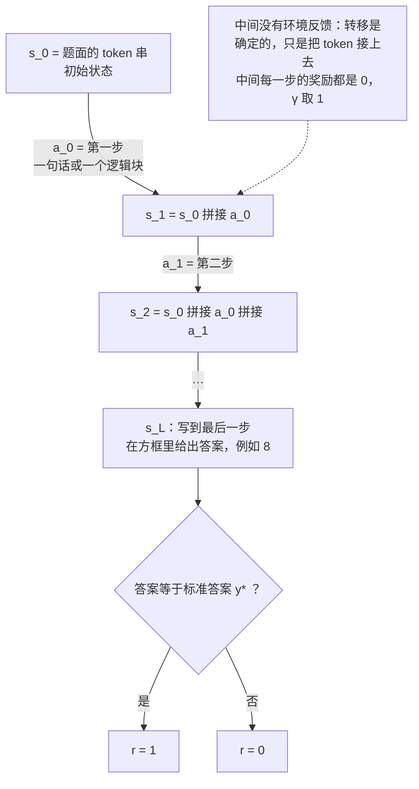
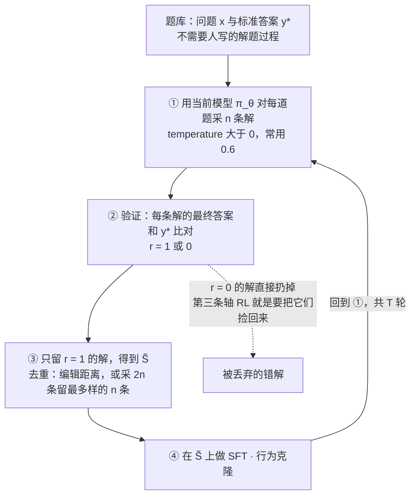
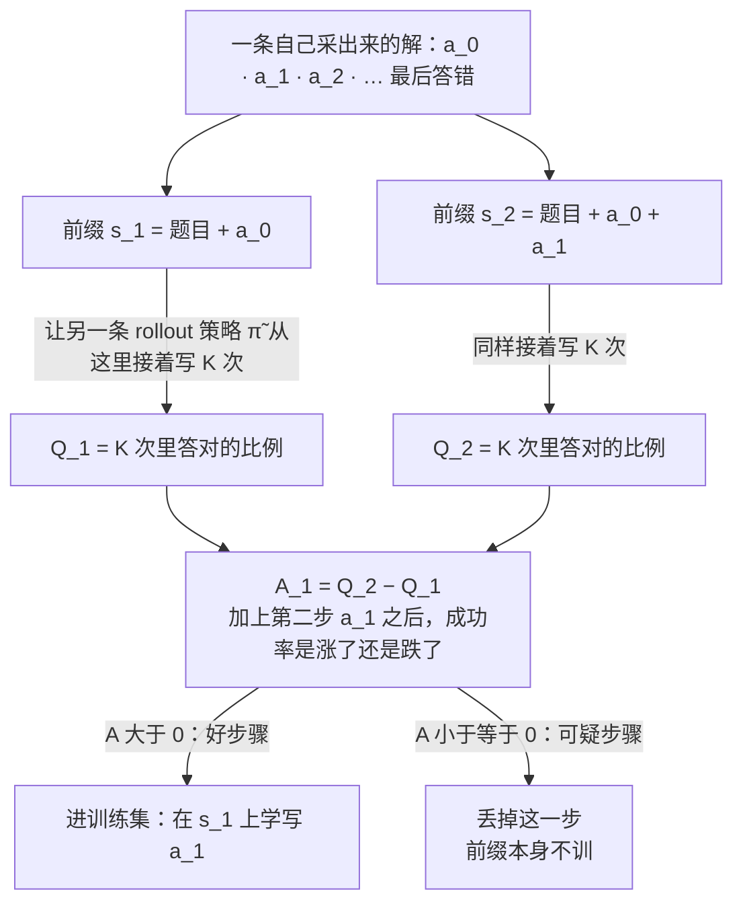
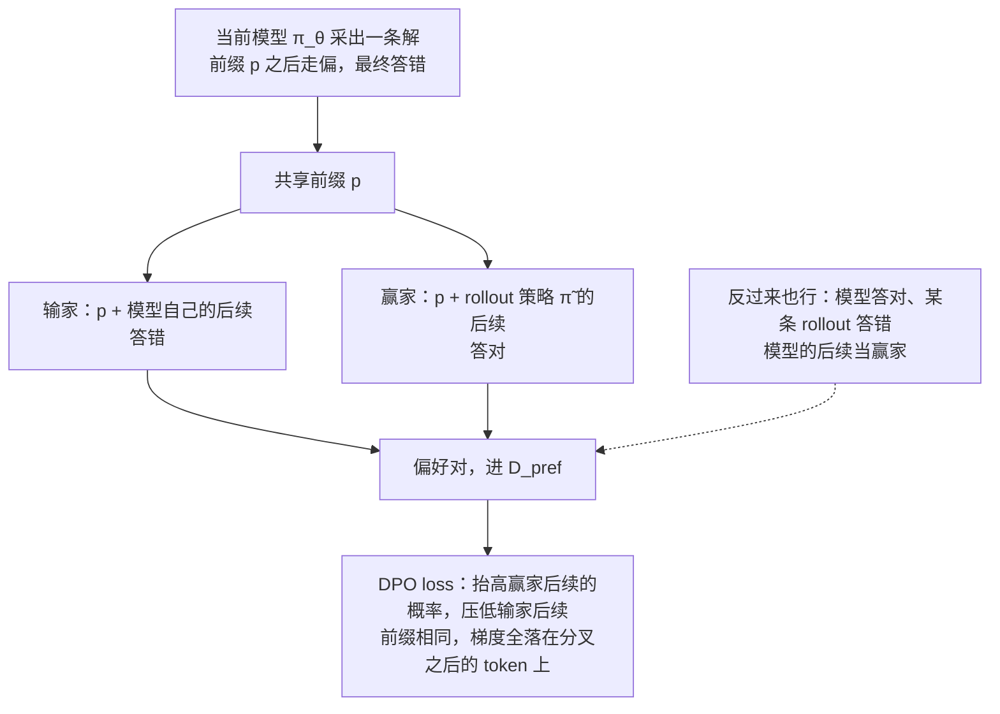
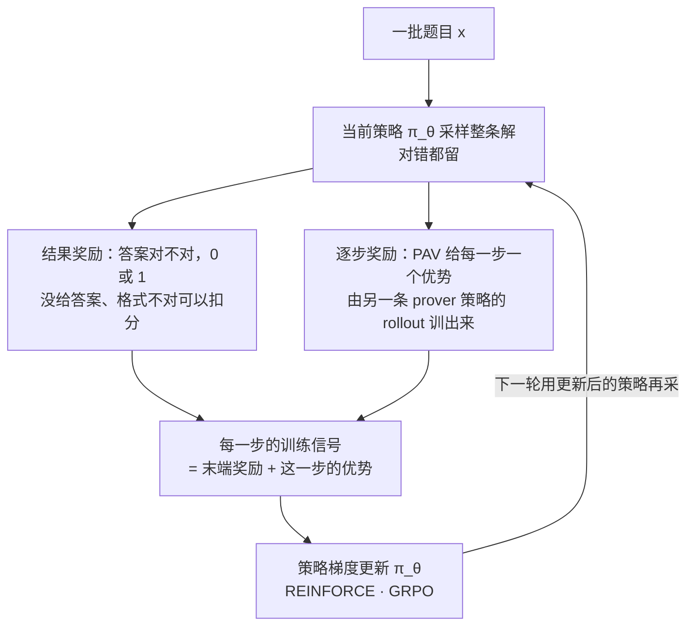
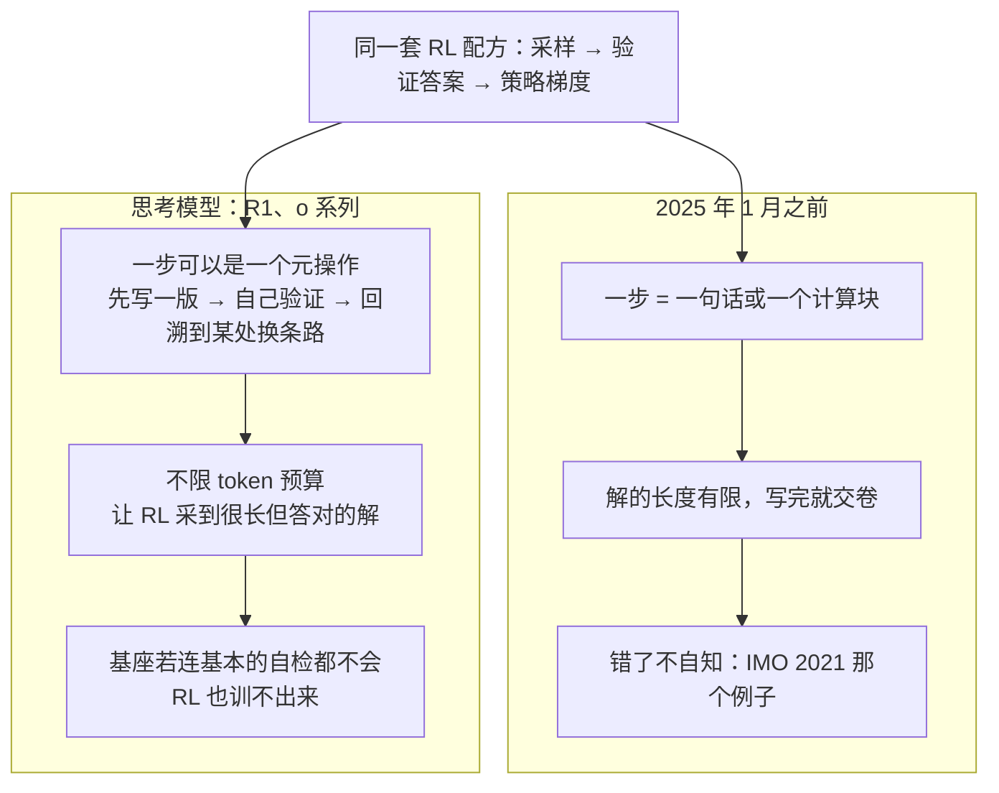

# CS224R 第 10 讲｜RL for LLM 推理（客座 Aviral Kumar）

> Stanford CS224R: Deep Reinforcement Learning（2025 春）· 第 10 讲，2025 年 5 月 2 日 · 客座讲座，课表上的题目是 "RL for LLMs: Reasoning"，紧接第 9 讲的偏好优化
> 视频：<https://www.youtube.com/watch?v=O2VpNnwB4lM>（1:10:30，英文字幕是人工校对的 CC，比自动字幕干净得多，但缩写仍有几处错，见文末勘误）
> 讲者：Aviral Kumar（Carnegie Mellon University）——客座，视频简介确认；讲的主要是他自己组里的两篇论文
> 课程主页：<https://cs224r.stanford.edu/> · 本讲没有指定阅读；对应论文：[RL on Incorrect Synthetic Data…](https://arxiv.org/abs/2406.14532)（Setlur et al., NeurIPS 2024）与 [Rewarding Progress](https://arxiv.org/abs/2410.08146)（PAV，Setlur et al., ICLR 2025）

**一句话**：讲者把"解数学题"写成一个没有环境、转移确定、只有末端 0/1 奖励的 MDP，然后用一条数据缩放曲线串起三类方法：在人写的解上做 SFT，误差随数据量降得极慢；让模型自己采样、只留答对的解再 SFT（RFT）能省 2 倍数据，但采得越多反而越差，病根是答对的解里混着"多余步骤"（spurious steps）；真正的 RL 味道在于逐步的 credit assignment——从每个前缀让另一条策略接着写，用成功率的差分当每一步的优势，据此过滤步骤做 SFT、或构造共享前缀的偏好对做 DPO，数据效率能到 8 倍；同样的逐步优势训成 PAV 塞进在线 RL，比只用 0/1 奖励省 5–6 倍样本。到了 DeepSeek-R1 这一代，算法没变，变的是"一步"能是什么：基座模型学会了自我验证与回溯，再放开 token 预算，RL 才能把它们放大。

## 时间轴

| 时间 | 内容 |
|---|---|
| [0:05](https://www.youtube.com/watch?v=O2VpNnwB4lM&t=5s) | 开场：推理是什么；本讲只看数学竞赛题（AIME 例子）；常规范式 = 在参考解上做 next-token prediction |
| [2:41](https://www.youtube.com/watch?v=O2VpNnwB4lM&t=161s) | 为什么监督不够：误差随数据量降得慢、高质量数据快用完；IMO 2021 例子里 o1 的解像样但逻辑错 |
| [6:14](https://www.youtube.com/watch?v=O2VpNnwB4lM&t=374s) | 本讲结构：以 DeepSeek-R1（2025 年 1 月）为界；模仿学习 / 离线 RL / 在线 RL 三类 |
| [8:19](https://www.youtube.com/watch?v=O2VpNnwB4lM&t=499s) | 把解题写成 MDP：题目是初始状态、步骤是动作、答案对错是末端 0/1 奖励；板书；问答：动作空间无穷、证明题、答对但步骤差 |
| [12:26](https://www.youtube.com/watch?v=O2VpNnwB4lM&t=746s) | NeurIPS 2024 论文的数据缩放分析：SFT / RFT / RL 三条轴；板书 RFT 算法 |
| [19:39](https://www.youtube.com/watch?v=O2VpNnwB4lM&t=1179s) | 问答：RFT 会不会鼓励啰嗦；错误方法答对了怎么办；会不会偏向简单题 |
| [21:40](https://www.youtube.com/watch?v=O2VpNnwB4lM&t=1300s) | 结果一：SFT 的误差随题数降得极慢，RFT 省 2 倍数据；结果二：每题正确解采得越多，误差先降后升；去重 |
| [27:50](https://www.youtube.com/watch?v=O2VpNnwB4lM&t=1670s) | 病因：spurious steps；GSM8K 里 100 乘 2 的例子；和模仿学习里 causal confusion 的关系 |
| [32:31](https://www.youtube.com/watch?v=O2VpNnwB4lM&t=1951s) | RL 的药方：逐步 credit assignment——从每个前缀让另一条策略接着写，成功率就是值函数 |
| [36:09](https://www.youtube.com/watch?v=O2VpNnwB4lM&t=2169s) | 写成公式：rollout 策略的 Q 函数，γ = 1、只有末端奖励；问答：rollout 该用哪条策略、和 stitching 的关系 |
| [40:14](https://www.youtube.com/watch?v=O2VpNnwB4lM&t=2414s) | 优势 = 相邻前缀 Q 之差；负优势就是可疑步骤；NLP 圈叫它 PRM |
| [44:23](https://www.youtube.com/watch?v=O2VpNnwB4lM&t=2663s) | 方法一：按优势过滤步骤再 SFT；只训这一步、不训前缀；问答；结果：上翘的曲线被压平 |
| [51:42](https://www.youtube.com/watch?v=O2VpNnwB4lM&t=3102s) | 方法二：共享前缀构造偏好对做 DPO；rollout 策略要质量还是多样性；板书算法；一步怎么切 |
| [58:36](https://www.youtube.com/watch?v=O2VpNnwB4lM&t=3516s) | 结果三：逐步 DPO 比 SFT 省 8 倍数据；Pass@5 是什么；温度 0.6 |
| [1:01:40](https://www.youtube.com/watch?v=O2VpNnwB4lM&t=3700s) | 在线 RL：RFT 推广成策略梯度、GRPO；逐步优势训成 PAV，稠密奖励省 5–6 倍样本；问答：只训 MATH 不涨 GSM8K |
| [1:07:22](https://www.youtube.com/watch?v=O2VpNnwB4lM&t=4042s) | 思考模型（R1、o 系列）：算法没变，变的是"一步"是什么——自我验证、回溯、更长的预算 |

## 核心内容

### 1. 推理为什么轮到 RL：监督学出来的解"像对，但错"

- **范围**：讲者一上来就说"推理"对不同人意思不同，一节课讲不完，所以只看一类问题——数学竞赛题，比如 AIME（American Invitational Mathematics Examination）里的数论题：输入是自然语言题面，输出是一段自然语言的解，末尾给一个确定的数值答案。"末尾有唯一答案"这个限定后面会反复用到。
- **常规范式**：把题面和参考解各自 tokenize，用 next-token prediction（负对数似然）训模型在给定题面时续写参考解——也就是 SFT。它为什么有效，讲者给了一个他喜欢的视角：学到的模型 p_θ 只是对真实"专家分布" p* 的近似，两者之差有一个随训练数据量下降的上界。数据足够多，就能逼近专家；数据不够，就学不到专家水平。
- **问题正在这里**：推理题的高质量数据远远不够。讲者引了一个估算——照现在的用法，互联网上的高质量数据到 2028 年前后就会用完；机器人和具身智能同样数据受限。
    > 小注：这个估算应出自 Epoch AI 的 Villalobos et al., 2022（Will we run out of data?），2024 年的更新版给的区间是 2026–2032 年。
- **数据不够时监督学到的是什么**：讲者拿一道 IMO 2021 的不等式证明题喂给 OpenAI 的 o1（他记得是 o1）。模型给出的解从行文看完全像专家写的，但逻辑是错的：这道题必须把整个求和当成一个整体处理，模型却逐项去看，最后径直断言结论，而且完全没意识到自己错了、也不去改。讲者的总结：SFT 训出来的模型会写出"考试里看着能得分"的解，只是逻辑内容不对——RL 要修的就是这一点。
- **本讲的地图**（6:14）：按时间线切成两段。第一段是 DeepSeek-R1（2025 年 1 月发布）之前的"经典"技术，再按方法分成三类：模仿学习、离线 RL、在线 RL；第二段讲这些技术怎么延伸到今天的"思考模型"，以及从前一段到后一段到底什么变了、什么没变。他反复强调这是个人的组织方式，文献太多难免漏掉。
    > 小注：讲者是离线 RL 算法 CQL 的第一作者，第 7 讲讲过它；他开场那句"今天不讲 CQL"被字幕听成了 SQL。

### 2. 把解题写成 MDP：没有环境、转移确定、奖励只在最后

*图 10-1｜解题 MDP：状态是"题目加已经写出的步骤"，动作是下一步，只有最后一步有奖励（自绘示意）· [▶ 看原幻灯片 8:51](https://www.youtube.com/watch?v=O2VpNnwB4lM&t=531s)*

- **MDP**（Markov decision process，马尔可夫决策过程）是 RL 描述问题的标准格式：状态 s、动作 a、转移（做了 a 之后到哪个新状态）、奖励 r，第 1 讲定义过；这里是它在文本上的一个特例。
- **对应关系**（8:51 的幻灯片，10:23 的板书）：题面的 token 串是初始状态 s_0；模型写出的解被切成一串步骤，每一步是一个动作 a_i；下一个状态 s_{i+1} 就是把 a_i 接到 s_i 后面，没有别的变化；写到最后，模型在方框里给出答案（例子里是 8），和标准答案 y* 比对，相同得 1，否则 0。中间每一步的奖励都是 0。
- **它是一种什么 MDP**：讲者的说法是 sparse reward（稀疏奖励：整条轨迹只有末端一个信号）加 deterministic dynamics（确定性转移：没有外部环境给你"下一个状态"，下一个状态就是拼接）。这和第 9 讲的 RLHF 设定、CME295 第 5 讲那张"RL 词汇对照 LLM"的表是一致的；区别只在动作的粒度——那边一个 token 一个动作，这里一"步"一个动作，为的是后面能给每一步记功记过。
- **问答**
    - 动作有多少个？——无穷多。但和连续控制里"固定维度的连续向量"不同，这里是变长的离散 token 串。
    - 答案不是一个数、而是一段证明怎么办？——社区还没有公认的好办法，所以本讲只讨论末尾有确定答案的竞赛题。
    - 会不会答对了、但中间步骤很差？——会，而且这正是本讲的主线之一。

### 3. 三条轴：SFT、RFT、RL，以及 RFT 的循环

*图 10-2｜RFT 的循环：模型自己采样，验证器按最终答案过滤，只在答对的解上做 SFT；答错的解被扔掉——把测试时的采样算力变成训练数据的最简形态（自绘示意）· [▶ 看原幻灯片 14:33](https://www.youtube.com/watch?v=O2VpNnwB4lM&t=873s) · 出处：[Setlur et al., 2024](https://arxiv.org/abs/2406.14532)*

- **为什么讲这篇论文**：讲者选了自己在 NeurIPS 2024 的一篇（RL on Incorrect Synthetic Data…），理由不是它发明了什么，而是它对一批现成方法做了系统的实证分析，能给人一个"什么时候该用什么"的概念模型。分析的形式是 data scaling：同一批题目和标准答案，看每种方法的测试误差随数据量怎么变。
- **三条轴**（13:30）。手里有一个题库，每道题带标准答案（定义奖励所必需），可以沿三个方向加数据：
    1. **SFT**：在人写的参考解上做模仿学习（第 2 讲的行为克隆）。加数据 = 加更多题和参考解。
    2. **RFT**（rejection fine-tuning）：让模型对每道题自己采样多条解，按最终答案过滤，只在答对的解上做 SFT。加数据 = 每题多采几条正确解。
    3. **RL**：把答错的解也用起来——第 7 讲讲过，RL 不要求数据是高质量的，这也是作业里的内容。
- **RFT 的板书**（14:33 起）：对题 x，从当前模型 π_θ(·|x) 采 y_1…y_n；用标准答案 y* 算每条的奖励 r(y_j)；留下 r = 1 的构成 S̃；在 S̃ 上做 SFT / BC；重复 T 轮。名字里的 rejection 指扔掉答错的那些。

$$
\tilde{S}=\big\{\,y_j\sim\pi_\theta(\cdot\mid x)\;:\;r(y_j,\,y^\star)=1\,\big\},\qquad
\max_\theta\;\sum_{(x,\,y)\in\tilde{S}}\log\pi_\theta(y\mid x)
$$

y_j 是模型自己采出来的解，r(y_j, y*) 是把它的最终答案和标准答案比对得到的 0/1 奖励；右边就是普通的 SFT，只不过训练集换成了自己生成、验证通过的解。

- **RFT 的好处**：不需要人写的参考解，只需要题目和标准答案——数据是 on-policy 的（当前策略自己采的），过滤靠的是可计算的奖励。讲者把它定位成"on-policy 的模仿学习"，后面会用这个定位解释它的天花板。
    > 小注：CS329A 里的 STaR 就是这个循环（外加对答错的题"看着答案补写解释"的 rationalization）；RFT 这个名字应出自 Yuan et al., 2023。
- **问答**（19:39 起）
    - 会不会逼模型写得啰嗦？——不会主动鼓励。过滤只看对错：如果答对的解恰好都长，才会间接学到长；2 + 2 这种题多数解直接写 4，学到的就是直接写 4。
    - 用错误的方法碰巧答对了，也会被学进去？——会。这正是后面实验要看的东西。
    - 数据会不会偏向简单题？——会。实践中先在参考解上做一轮 SFT，模型有了基本能力再上 RFT。

### 4. 两条实验曲线：RFT 省 2 倍，但采得越多越糟

- **基准**：GSM8K 和 MATH。讲者提醒这两个现在已经被刷满，以后不该再拿来比方法，但 2024 年时它们仍有代表性。基座之一是 DeepSeek 的数学模型（讲者说的是 DeepSeek V2），当时最好的开源数学模型之一。
    > 小注：论文里的两个基座应为 Llama2-7B 和 DeepSeek-Math-7B；讲者口中的 "DeepSeek V2" 应指后者。
- **SFT 的缩放曲线**（22:11）：测试误差确实随题数下降，但慢得离谱——拟合出来是 D 的 −0.15 到 −0.05 次方这个量级，而你希望的是 D 的 −1/2 次方那种一加数据就往下掉的曲线。

$$
\mathrm{err}(D)\;\approx\;C\cdot D^{-\alpha},\qquad
\alpha_{\text{实测}}\in[0.05,\;0.15]\quad\text{vs}\quad \alpha_{\text{希望}}=\tfrac{1}{2}
$$

D 是训练用的题数，α 是拟合出的指数：α 越大，加数据的回报越快。推理方法的共同目标就是把这条曲线往左下角推。

- **结果一**（24:14）：RFT 在两个基准上都能用一半的题数达到 SFT 的测试误差——on-policy 的模仿比 off-policy 的模仿省 2 倍数据。
- **结果二**（25:15）：那就一直加 n（每题采的正确解条数）？不行。横轴改成每题保留的正确解数量（再乘上题数这个常数），误差先降，过了某个点开始回升，有的数据集上明显变差。
- **问答**：每题的正确解要去重吗？——要。常见做法是按编辑距离去重，或者采 2n 条留最多样的 n 条；讲者本来嫌细节多没放上幻灯片。
- **结论**：在有限的一批初始状态 s_0 上反复拟合自己生成的解，会伤害到新题上的泛化。原因见下一节。

### 5. 病因：答对的解里混着 spurious steps

- **什么叫 spurious step**：答对的解里某一步本身是错的或多余的，只是碰巧没影响最终答案。GSM8K 里最扎眼的例子（29:23）：模型先写"总共需要的钱是 100 乘 2 等于 200"，下一行又改口按 100 除以 2 算，最后答对了。中间那句 200 就是 spurious step——不该存在，却被当成正确解的一部分学了进去。
- **它怎么毒害训练**：把这类解当示范做 SFT，模型学到的是"在训练题上恰好能通向正确答案的 token 关联"，到新题上就不成立。论文里量过，训练越久 spurious steps 越多；讲者不敢说这是误差回升的唯一原因，但它是主要原因之一，而且普通的拟合指标看不出来。
- **和模仿学习的联系**（31:59）：这就是模仿学习里的 causal confusion——策略学到了错误的因果关联，在训练分布上照样答对，一换分布就露馅。第 2 讲讲 compounding error 时"训练时对、上场就偏"是同一类病。
    > 小注：causal confusion 一词应出自 de Haan, Jayaraman & Levine, 2019；讲者提到时发现台下没反应，没有展开。
- **问答**：spurious step 到底是"错"还是"无关"？——那一步本身未必错，但至少是无关的；无关也有害——想象给模型一百万个无关 token，让它自己挖出有用信息，测试时会很难。一步是一句话吗？——本讲前半段是，但没有公认定义，后半段会看到"一步"是一整块东西。

### 6. 药方：逐步 credit assignment——从前缀往后 rollout，成功率就是 Q

*图 10-3｜怎么给一步打分：从它之前和之后的两个前缀分别让 rollout 策略接着写，成功率之差就是这一步的优势（自绘示意）· [▶ 看原幻灯片 33:32](https://www.youtube.com/watch?v=O2VpNnwB4lM&t=2012s) · 出处：[Setlur et al., 2024](https://arxiv.org/abs/2406.14532)*

- **credit assignment**（功过归因）是 RL 的老问题：整条轨迹只有末端一个奖励，怎么知道功劳或过错在哪一步。RL 的答案是值函数，这里把它落到"步骤"上。
- **做法**（33:32）：拿一条模型采出来的解，截取前 i 步作为前缀，让另一条 rollout 策略从这里接着写完，重复多次。如果多数 rollout 都答对，说明前缀没什么问题；如果无论怎么写都答错，前缀里有毛病；时对时错，介于两者之间。这个"从前缀出发的期望成功率"就是一个值函数——rollout 策略在这个 MDP 里的期望 0/1 奖励。

$$
Q^{\pi}(s,a)=\mathbb{E}_{\pi}\Big[\sum_{t=0}^{\infty}\gamma^{t}\,r(s_t,a_t)\;\Big|\;s_0=s,\;a_0=a\Big]
$$

先回顾一般定义（第 4 讲、第 6 讲）：Q^π(s, a) 是在状态 s 做动作 a、之后一直按策略 π 行动，能拿到的折扣奖励总和的期望；γ 是折扣因子，越小越只看眼前。

$$
Q^{\tilde\pi}(s_i,a_i)=\mathbb{E}_{a_{i+1:L}\sim\tilde\pi}\big[\,r(\text{answer},\,y^\star)\,\big],\qquad
s_i=x\circ a_0\circ\cdots\circ a_{i-1},\quad \gamma=1
$$

在解题 MDP 里只剩一项：s_i 是题目 x 拼上前 i 步，a_i 是当前这一步，π̃ 是负责接着写的 rollout 策略，γ 取 1、中间奖励全是 0，所以 Q 就是"从这个前缀出发、由 π̃ 写完后答对的概率"。

- **优势**（40:46）：一般定义是 A(s, a) = Q(s, a) − V(s)，即"这个动作比该状态下的平均水平好多少"（第 4 讲用它做 baseline 降方差）。这里转移是确定的、状态是拼接，V(s_i) 就等于上一步的 Q，优势退化成相邻两个前缀的 Q 之差：

$$
A(s_i,a_i)\;=\;Q^{\tilde\pi}(s_i,a_i)\;-\;V^{\tilde\pi}(s_i)\;=\;Q^{\tilde\pi}(s_i,a_i)\;-\;Q^{\tilde\pi}(s_{i-1},a_{i-1})
$$

加上这一步之后成功率涨了，优势为正，是好步骤；跌了，优势为负，就是可疑步骤，不该学。

- **rollout 该用哪条策略**（38:43，讲者的个人观点）：公式本身不限定 π̃。他认为应该用一条和当前模型不同的策略，否则会在同样的地方一起失败；NLP 社区有不少工作用同一条策略也能凑合，但缺少同等规模的对照实验，现有证据多数支持"不同策略"。
    > 小注：后一篇论文（PAV）把这条策略叫 prover policy，摘要里明确要求它不同于被训练的策略。
- **问答**
    - 这和离线 RL 里的 trajectory stitching、advantage weighting 是不是一回事？——是，论文里就是这么讨论的（第 7 讲和复习课第 7 节讲过 stitching）。
    - 要不要真的去拟合一个 Q 函数？——文献里两派：一派显式训一个逐步打分的模型，NLP 叫它 PRM（process reward model，对每一步打分，区别于给整条回答打分的 RM / ORM）——讲者不认为 PRM 和 Q 值在语义上该是同一个东西，但大家就这么叫；另一派就用上面的 rollout 直接估优势。CS329A 第 3 讲讲的 PRM 是前者。
    - 这怎么帮模型学到通用的解题策略？——它把一条长解的成败拆到每一步：模型能定位是第一步还是第三步出了问题，而不是笼统地知道"错了"，数据效率因此大增。

### 7. 方法一：按优势过滤，再做 SFT

- **算法**（44:23）：沿用 RFT 的采样，但对每条解的每一步都做 rollout 估优势，把优势为正的步骤放进训练集——哪怕它来自一条最终答错的解；把优势为负或很低的步骤扔掉——哪怕它来自一条答对的解。

$$
\mathcal{L}(\theta)=-\sum_{i}\,\mathbb{1}\!\big[A(s_i,a_i)>0\big]\,\log\pi_\theta(a_i\mid s_i)
$$

1[·] 是指示函数：优势为正的步骤才计入 loss，而且只学"在前缀 s_i 之后写出 a_i"。这是第 7 讲 AWR（advantage-weighted regression）的过滤版：AWR 用 exp(A) 做权重，讲者说那个目标要调很多参数，只能跑一次实验的话选过滤。

- **只训这一步，不训前缀**（46:28，板书在 47:00）：假设 s_1 上的 a_1 优势很高、s_0 上的 a_0 优势很低，训练的只有"给定 s_0 拼 a_0、写出 a_1"，不会训模型去写 a_0。
- **问答**
    - 部署时要有个东西不断提示模型"下一步"吗？——不需要。训练按步切分，部署时策略一口气写完整条解，s_1 只是"题目加已写的步骤"，同一个策略接着写就是。
    - 只训这一步是因为马尔可夫性吗？——状态里保留了全部历史，说它是非马尔可夫策略也行，说状态是拼接、策略是马尔可夫的也行；按步训练不是为了马尔可夫性，是为了能定位哪一步把解带偏了。
    - Q 很低但优势为正的步骤要吗？——他们试过留下答错解里的好步骤，没问题；对那种"从任何前缀出发都不可能答对"的解，整条过滤掉可能略好，但没有过硬的结果。既然只学"前缀之后的这一步"，对前缀本身的敏感度不大。
- **结果**（50:40）：横轴仍是每题正确解数，优势过滤把 RFT 那条上翘的曲线压住了；按启发式定义数出来的 spurious steps 也少了。

### 8. 方法二：共享前缀的偏好对，用 DPO 做离线 RL

*图 10-4｜从一次 rollout 里造偏好对：前缀相同，模型自己答错的后续做输家，rollout 策略答对的后续做赢家（自绘示意）· [▶ 看原幻灯片 52:15](https://www.youtube.com/watch?v=O2VpNnwB4lM&t=3135s) · 出处：[Setlur et al., 2024](https://arxiv.org/abs/2406.14532)*

- **想法**（51:42）：前面的 rollout 只被用来算优势，算完就扔。换个用法：模型自己的一条解在前缀 p 之后走偏、最终答错，而某条 rollout 从同一个 p 出发答对了——两者拼成一个偏好对，赢家是 p 加 rollout 的后续，输家是 p 加模型的后续。反过来也行：模型答对、某条 rollout 答错，模型的后续当赢家。
- **两点不同**：一是前缀共享，正负样本的差异被逼到分叉之后那一小段上；二是 rollout 里的 token 本身进了训练集，不再只是估计量。loss 就是第 9 讲和 CME295 第 5 讲的 DPO，条件里多了个前缀：

$$
\mathcal{L}_{\mathrm{DPO}}=-\,\mathbb{E}_{(p,\,y_w,\,y_l)\sim D_{\mathrm{pref}}}\Big[\log\sigma\Big(\beta\log\frac{\pi_\theta(y_w\mid p)}{\pi_{\mathrm{ref}}(y_w\mid p)}-\beta\log\frac{\pi_\theta(y_l\mid p)}{\pi_{\mathrm{ref}}(y_l\mid p)}\Big)\Big]
$$

p 是共享前缀（题目加已经写出的步骤），y_w、y_l 是分叉之后的两段后续，π_ref 是训练起点的冻结副本，β 控制离起点多远；讲者没写这个式子，只说"就是同一个 DPO loss 作用在这两段上"。

- **板书的算法**（55:23）：每轮从 π_θ 采 y_1…y_n，做 rollout、构造 D_pref，最小化 DPO loss；D_pref 里的前缀来自当前模型，一段后续来自 π_θ，另一段来自 rollout 策略。
- **rollout 策略要强还是要杂**（53:49 的问答）：他们在论文里把它写成了一个可以最大化的表达式，本质是探索与利用的平衡（第 14 讲的主题）。模型很差、几乎全错时，需要一条能偶尔答对的 rollout 策略，否则永远见不到成功；模型已有五成把握时，更需要多样的解法来覆盖它容易失败的方式。
- **一步怎么切**（56:30）：这篇工作按句子切；后续工作用 "Step #k:" 的格式；现在的模型指令跟随够好，可以直接要求它按某种格式写（每个逻辑块之间画横线、不许出现 step 这个词……），再按格式切。没有通用约定。
- **结果三**（58:36）：横轴回到题数，基座是 Llama 2 和 DeepSeek 的数学模型，虚线是这个逐步 DPO：达到 SFT 同样的测试误差，需要的题数少 8 倍（RFT 那条 2 倍的线为了清爽拿掉了）。
- **问答**：Pass@5 是什么？——给模型 5 次机会、至少答对一次的比例；Pass@n 同理，是评估"多试几次能不能成"的指标（CS329A 第 2 讲的 coverage 就是它）。采样温度用多少？——大家多用 0.6，没有定论。

### 9. 在线 RL：从 RFT 到策略梯度，再到 PAV 的稠密奖励

*图 10-5｜在线 RL 的两路信号：末端的 0/1 结果奖励，加上 PAV 给每一步的优势（自绘示意）· [▶ 看原幻灯片 1:03:45](https://www.youtube.com/watch?v=O2VpNnwB4lM&t=3825s) · 出处：[Setlur et al., 2025](https://arxiv.org/abs/2410.08146)*

- **最朴素的在线版**（1:01:40）：把 RFT 里的"过滤后 SFT"换成直接做 on-policy RL——采样、按答案给奖励（没给出答案或格式不对可以扣分，这叫 reward shaping），然后用策略梯度最大化奖励。第 3 讲的 REINFORCE 写出来就是 ∇log π 乘奖励。再往前一步是 GRPO：PPO 的变体，把学出来的 value function 换成组内 rollout 的经验估计（CS329A 第 6 讲、CME295 第 6 讲用过）。
- **加上逐步优势**（1:03:45）：训练过程中同样可以对每条采样的解做 rollout 算优势；更省的办法是训一个网络去拟合这些优势（或 Q 值），像奖励模型一样对每一步打分，然后让策略同时最大化末端奖励和逐步优势：

$$
\nabla_\theta J=\mathbb{E}_{y\sim\pi_\theta(\cdot\mid x)}\Big[\sum_{i}\nabla_\theta\log\pi_\theta(a_i\mid s_i)\,\big(r(y,\,y^\star)+\alpha\,\hat A(s_i,a_i)\big)\Big]
$$

前半是第 3 讲的策略梯度估计；括号里 r 是整条解的 0/1 结果奖励，Â 是拟合出来的这一步的优势，α 是两者的权重。

- **PAV**（process advantage verifier，1:05:49）：process 指逐步，advantage 指拟合的是优势函数，verifier 是推理圈对奖励模型的叫法。和只用末端 0/1 奖励（ORM 式）的 RL 比，稠密的优势奖励省 5–6 倍样本、绝对准确率高 6–7 个点；讲者说数字看着小，但在他们用的 2B 和 9B 模型上已是那些数据集上能拿到的最好结果。
    > 小注：PAV 论文摘要给的是在线 RL 5–6 倍样本效率、准确率高 6% 以上；用作测试时搜索也比 ORM 准 8% 以上、省 1.5–5 倍算力。2B / 9B 应为 Gemma 2。
- **问答**（1:04:48）：在 MATH 上训，GSM8K 会涨吗？——不会，很多人验证过。但把不同难度的题目混在一起训，就能泛化——这正是 DeepSeek-R1 这类有公开配方的思考模型所用的基本在线配方，泛化程度相当可观，虽然也不是对所有问题都成立。

### 10. 思考模型：算法没变，变的是"一步"能是什么

*图 10-6｜同一套配方，前后两代的差别在"一步"的内容和允许的长度（自绘示意）· [▶ 看原幻灯片 1:07:22](https://www.youtube.com/watch?v=O2VpNnwB4lM&t=4042s) · 出处：[DeepSeek-AI, 2025](https://arxiv.org/abs/2501.12948)*

- **讲者的判断**（1:07:55）：DeepSeek-R1、OpenAI 的 o 系列，训练配方和本讲前面讲的基本一样，RL 目标没变。有些新名字——GRPO（PPO 加些小改动）、advantage-induced policy alignment——不必细究，都当作"策略梯度加小改动"就行。
- **真正变的是动作空间**（1:08:26）。他自己说这是个粗糙的说法，严格讲模型还是逐 token 生成；但做 RL 的基座模型已经会执行一些"元操作"：先写一版解，再去验证它，发现不对就回溯到某个点换条路。这可以看成对"一步"的又一种定义——比"再算一个量"有意思得多的动作。
- **第二个变化是预算**：如果告诉模型 token 数不设上限、只要最后答对，RL 就能采到很长但正确的解并强化它。这两点合起来，才有今天思考模型的表现。
- **反事实**（1:10:00）：拿一个不具备基本自检、验证能力的基座去做同样的 RL，现在做不出好结果。所以高层技术没变，是基座变得"能采出更有意思的步骤"了。
    > 小注：这和 CS329A 第 2 讲"测试时算力换准确率"的观察是同一件事从训练侧看：RL 之所以能放大自我验证和回溯，是因为基座里已经有这些行为的雏形。

## 关键图表速查（点时间戳跳到原幻灯片）

| 图 | 看什么 | 跳转 | 出处 |
|---|---|---|---|
| AIME 例题与参考解 | 题面是自然语言，解也是自然语言，末尾一个确定答案——本讲全部方法的前提 | [1:07](https://www.youtube.com/watch?v=O2VpNnwB4lM&t=67s) | — |
| IMO 2021 不等式与 o1 的解 | 行文像专家，逐项处理却是逻辑错误，断言结论而不自知——SFT 模型的典型失败 | [4:42](https://www.youtube.com/watch?v=O2VpNnwB4lM&t=282s) | — |
| 解题 MDP 一页 | 题面 = s_0，步骤 = 动作，方框答案对错 = 0/1 奖励；板书里 s_{i+1} 就是拼接 | [8:51](https://www.youtube.com/watch?v=O2VpNnwB4lM&t=531s) | — |
| 三条数据轴 | 纵轴加题数（SFT），横轴加每题正确解数（RFT），第三轴把错解用起来（RL） | [13:30](https://www.youtube.com/watch?v=O2VpNnwB4lM&t=810s) | [Setlur et al., 2024](https://arxiv.org/abs/2406.14532) |
| SFT vs RFT 随题数 | 两条都在降，但指数只有 0.05–0.15；RFT 在一半题数处追平 SFT | [22:11](https://www.youtube.com/watch?v=O2VpNnwB4lM&t=1331s) | 同上 |
| RFT 随每题正确解数 | 先降后升；采得越多不等于越好 | [25:15](https://www.youtube.com/watch?v=O2VpNnwB4lM&t=1515s) | 同上 |
| spurious step 的 GSM8K 例子 | "100 乘 2 等于 200"那一步多余且错，下一行改口，最终仍答对 | [29:23](https://www.youtube.com/watch?v=O2VpNnwB4lM&t=1763s) | 同上 |
| 前缀 rollout 示意 | 保留前三步，橙色的 rollout 策略往后写多次；全对、全错、时对时错各说明什么 | [33:32](https://www.youtube.com/watch?v=O2VpNnwB4lM&t=2012s) | 同上 |
| Q 与优势的定义页 | 只剩一个期望的 Q；优势写成相邻前缀 Q 之差而不是 Q 减 V | [36:39](https://www.youtube.com/watch?v=O2VpNnwB4lM&t=2199s) | 同上 |
| 优势过滤的效果 | 与 RFT 同一横轴，上翘被压平；spurious steps 计数下降 | [50:40](https://www.youtube.com/watch?v=O2VpNnwB4lM&t=3040s) | 同上 |
| 共享前缀的偏好对 | 前缀相同，模型自己答错的后续 vs 橙色 rollout 答对的后续 | [52:15](https://www.youtube.com/watch?v=O2VpNnwB4lM&t=3135s) | 同上 |
| 8 倍数据效率 | Llama 2 与 DeepSeek 两组曲线，虚线（逐步 DPO）在 1/8 题数处追平实线（SFT） | [58:36](https://www.youtube.com/watch?v=O2VpNnwB4lM&t=3516s) | 同上 |
| PAV 的稠密奖励 vs ORM | 在线 RL 里样本效率 5–6 倍、绝对准确率高 6–7 个点 | [1:06:19](https://www.youtube.com/watch?v=O2VpNnwB4lM&t=3979s) | [Setlur et al., 2025](https://arxiv.org/abs/2410.08146) |
| 思考模型一页 | 目标没变；动作空间变了（验证、回溯）；预算放开 | [1:07:22](https://www.youtube.com/watch?v=O2VpNnwB4lM&t=4042s) | — |

## 提到的工作

| 名称 | 在本讲里的作用 |
|---|---|
| AIME、IMO 2021 | 例题来源：有确定答案的竞赛题；IMO 2021 的不等式用来展示 o1 的逻辑错误 |
| OpenAI o1 / o 系列、Gemini thinking、Claude Sonnet thinking | 思考模型的例子；o1 的 IMO 解是"像对但错"的展示 |
| [DeepSeek-R1](https://arxiv.org/abs/2501.12948)（DeepSeek-AI, 2025） | 本讲时间线的分界（2025 年 1 月）；有公开配方的思考模型，用的是基本在线 RL 配方 |
| [Will we run out of data?](https://arxiv.org/abs/2211.04325)（Villalobos et al., 2022；应为） | "高质量数据 2028 年前后用完"的估算来源 |
| [RL on Incorrect Synthetic Data…](https://arxiv.org/abs/2406.14532)（Setlur et al., NeurIPS 2024） | 本讲主线：SFT / RFT / 逐步优势 / 逐步 DPO 的数据缩放分析，2 倍与 8 倍的结论 |
| [GSM8K](https://arxiv.org/abs/2110.14168)、[MATH](https://arxiv.org/abs/2103.03874) | 实验基准；讲者提醒已被刷满 |
| Llama 2、DeepSeek 的数学模型（讲者说 DeepSeek V2，应为 DeepSeek-Math） | 实验基座 |
| SFT / 行为克隆（第 2 讲） | 第一条轴：在人写的参考解上模仿 |
| RFT（rejection fine-tuning；名字应出自 [Yuan et al., 2023](https://arxiv.org/abs/2308.01825)）· STaR（CS329A） | 第二条轴：自采样、按答案过滤、再 SFT |
| causal confusion（应为 [de Haan et al., 2019](https://arxiv.org/abs/1905.11979)） | 解释 spurious steps 为什么伤泛化 |
| Q 函数、值函数、优势（第 4、6 讲） | 逐步 credit assignment 的数学载体 |
| PRM / ORM（CS329A 第 3 讲） | 讲者把 PRM 对应到逐步的 Q 值，但不认为语义上该等同 |
| [AWR](https://arxiv.org/abs/1910.00177)（Peng et al., 2019；第 7 讲） | 方法一是它的过滤版：指示函数代替 exp(A) 权重 |
| trajectory stitching（第 7 讲、复习课第 7 节） | 逐步优势和它是同一类机制，论文里有讨论 |
| [DPO](https://arxiv.org/abs/2305.18290)（Rafailov et al., 2023；第 9 讲） | 方法二的 loss，作用在共享前缀的两段后续上 |
| Pass@k | 评估指标："给 k 次机会至少对一次" |
| REINFORCE（第 3 讲）、[PPO](https://arxiv.org/abs/1707.06347)、[GRPO](https://arxiv.org/abs/2402.03300)（DeepSeekMath） | 在线 RL 的更新规则；GRPO 用组内 rollout 替代 value 网络 |
| [PAV](https://arxiv.org/abs/2410.08146)（Setlur et al., ICLR 2025） | 在线 RL 里的逐步优势验证器：5–6 倍样本效率 |
| advantage-induced policy alignment（应为 [Zhu et al., 2023](https://arxiv.org/abs/2306.02231)） | 讲者点名的"策略梯度小改动"之一，不必细究 |
| CQL（第 7 讲；讲者自己的工作） | 开场说今天不讲它 |

## 术语对照

| English | 中文 |
|---|---|
| reasoning（本讲的限定） | 推理：这里特指解有确定答案的数学竞赛题 |
| next-token prediction | 下一个 token 预测：SFT 用的目标 |
| MDP (Markov decision process) | 马尔可夫决策过程：状态、动作、转移、奖励四件套 |
| state s_i / action a_i | 状态 = 题目加已写的步骤；动作 = 下一步 |
| sparse reward | 稀疏奖励：只有最终答案对错这一个信号 |
| deterministic dynamics | 确定性转移：下一状态就是拼接，没有外部环境 |
| trajectory / rollout / trace | 一条完整的解；rollout 也指"从某个前缀让策略往后写" |
| on-policy / off-policy | 用当前模型自己采的数据训 / 用别处来的数据训 |
| SFT / behavior cloning (BC) | 监督微调 / 行为克隆：在示范上做最大似然 |
| RFT (rejection fine-tuning) | 拒绝采样微调：自采样、按答案过滤、再 SFT |
| data scaling analysis | 数据缩放分析：测试误差随数据量的曲线 |
| spurious step | 多余步骤：错误或无关、但没影响最终答案的一步 |
| causal confusion | 因果混淆：学到在训练分布上成立、换分布就失效的关联 |
| credit assignment | 功过归因：把末端奖励分到各步 |
| value function V / Q function | 从某状态（做某动作）出发的期望回报；这里就是接着写能答对的概率 |
| advantage A | 优势：加上这一步之后成功率的变化 |
| discount factor γ | 折扣因子；本讲取 1 |
| rollout policy π̃ / prover policy | 负责从前缀接着写的另一条策略 |
| PRM / ORM | 过程奖励模型（逐步打分）/ 结果奖励模型（整条打分） |
| verifier | 验证器：推理圈对奖励模型的叫法 |
| AWR (advantage-weighted regression) | 优势加权回归：按 exp(A) 加权的模仿 |
| trajectory stitching | 轨迹拼接：把不同轨迹里好的片段接起来 |
| preference pair / DPO | 偏好对 / 直接偏好优化 |
| exploration vs exploitation | 探索与利用：rollout 策略要多样还是要准 |
| Pass@k | k 次尝试至少对一次的比例 |
| reward shaping | 奖励整形：没给答案、格式不对等额外扣分 |
| policy gradient / REINFORCE | 策略梯度：∇log π 乘回报 |
| GRPO | 用组内采样估优势的 PPO 变体 |
| PAV (process advantage verifier) | 过程优势验证器：拟合逐步优势的网络 |
| dense reward | 稠密奖励：每一步都有信号 |
| thinking model | 思考模型：R1、o 系列这类 |
| self-verification / backtracking | 自我验证 / 回溯：思考模型的"元操作" |
| test-time budget | 测试时预算：允许生成的 token 数 |

## 字幕勘误

"SQL" → CQL（讲者说今天不讲的那个离线 RL 算法，推断）；"RFP""RFD" → RFT；"SFP" → SFT；"DPR""BPO" → DPO；"RHF""RHLF" → RLHF；"GRP" → GRPO；1:07:55 处的 "TRPO" → GRPO（他前面刚讲完的那个，推断）；"DeepSeek carbon" → DeepSeek-R1；"QL's" → Q values；"S naughts" → s_0；"01 reward" → 0/1 reward；"first-step BPO" → per-step DPO。

## 带走的问题

1. RFT 的曲线为什么会上翘？如果你的 agent 用"任务成功的轨迹做 SFT"这一招，什么样的 spurious steps 会混进去（多余的工具调用、碰巧成功的错误参数）？怎么量它？
2. 优势 = 相邻前缀的 Q 之差，这个等式依赖"转移确定、状态是拼接"。如果一步里有真实环境反馈（工具返回、网页变化），哪一项要改？V(s_i) 还等于上一步的 Q 吗？
3. rollout 策略为什么最好和被训的策略不同？用同一条策略估优势时，会系统性地高估或低估哪类步骤？
4. 共享前缀的 DPO 把梯度集中在分叉之后；如果输家和赢家在分叉后仍有大段相同内容，会发生什么？这和 CME295 第 5 讲讨论过的"DPO 里两条概率一起下降"是什么关系？
5. 讲者说思考模型的关键是基座已经会自检和回溯。对你的产品：若基座不会某种元操作（比如"回头核对用户最初的约束"），你会先用 SFT 教它这个动作再上 RL，还是直接 RL？依据本讲的哪条证据？
