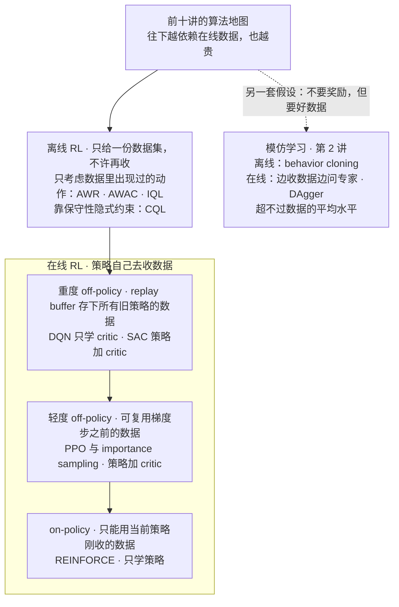
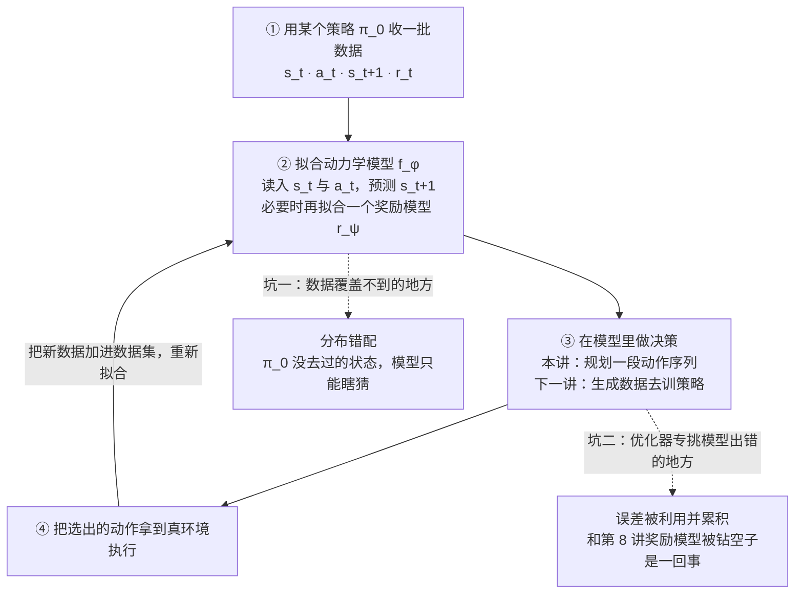
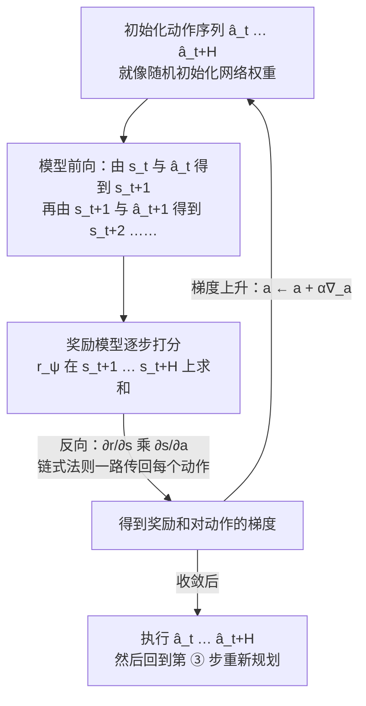
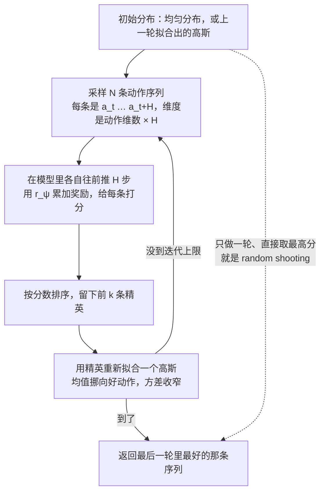
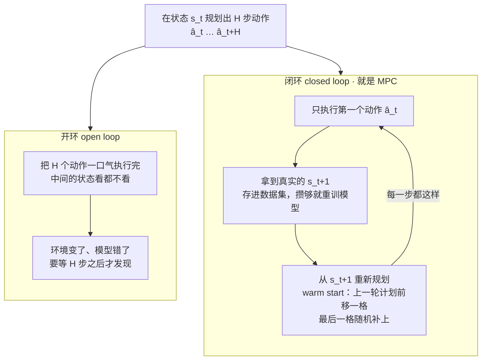
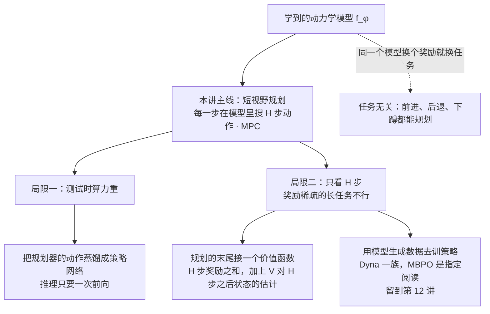

# CS224R 第 11 讲｜基于模型的 RL（Model-Based RL）

> Stanford CS224R: Deep Reinforcement Learning（2025 春）· 第 11 讲，2025 年 5 月 7 日 · 开场先用一页幻灯片把第 2–7 讲的算法排成一张地图；本讲只讲完"用模型做规划"这一半，"用模型生成数据"那一半（指定阅读 MBPO 所属的路线）因时间关系推到了第 12 讲开头
> 视频：<https://www.youtube.com/watch?v=PvqyGnOirgA>（1:13:20，英文字幕是人工校对的 CC，不是自动生成，错词很少，见文末勘误）
> 讲者：Chelsea Finn（课程主讲，不是客座；她说 model-based RL 在她心里有特殊位置，早年做过不少这方面的工作）
> 课程主页：<https://cs224r.stanford.edu/> · 指定阅读：[When to Trust Your Model: Model-Based Policy Optimization](https://arxiv.org/abs/1906.08253)（Janner et al., 2019，即 MBPO；课上只在案例的对照组里出现了名字，它的机制留到下一讲，第 8 节末尾的小注先做了预告）

**一句话**：前面十讲的算法都把环境当黑箱，只能靠采样和策略梯度摸索动作的后果。这一讲先学一个"模拟器"——读入 (s_t, a_t)、吐出 s_t+1 的动力学模型（必要时配一个奖励模型），然后在模拟器里"先想后做"：站在当前状态搜一段未来 H 步的动作，让想象中的奖励之和最大，可以对动作做梯度上升，也可以用 random shooting 或 cross-entropy method 撒样本挑好的。麻烦在于模型只在数据覆盖到的地方准，优化器又专挑它出错的地方钻，所以要边执行边把新数据加回去重训，并且只执行第一个动作就重新规划（model predictive control），用闭环纠错换鲁棒。代价是测试时算力重、只看得了短视野；出路是把规划器蒸馏成策略、在规划末尾接价值函数，或用模型生成数据训策略（下一讲的 MBPO）。案例 PDDM 用 3 个模型的 ensemble 加改良 CEM，让 24 关节五指手靠 4 小时真机数据学会转保定球，数据量只有 model-free 的五分之一。

## 时间轴

| 时间 | 内容 |
|---|---|
| [0:05](https://www.youtube.com/watch?v=PvqyGnOirgA&t=5s) | 开场：一页总览前十讲的算法——online 与 offline、on-policy 与 off-policy、只学策略 / 策略加 critic / 只学 critic、离线 RL 两类、模仿学习 |
| [4:45](https://www.youtube.com/watch?v=PvqyGnOirgA&t=285s) | 今天的主题：model-based RL；它能套在上一页所有方法之上；预告灵巧手案例与本讲目标 |
| [5:52](https://www.youtube.com/watch?v=PvqyGnOirgA&t=352s) | 核心想法：学一个模拟器——物理模型或以动作为条件的视频预测；Veo 2、Sora；股市、棋类规则、对手建模 |
| [8:25](https://www.youtube.com/watch?v=PvqyGnOirgA&t=505s) | 算法草图：收数据 → 学模拟器 → 在里面跑你喜欢的方法；问答：这么做会出什么问题 |
| [10:30](https://www.youtube.com/watch?v=PvqyGnOirgA&t=630s) | 两个坑：数据覆盖不到（迷宫例子）、模拟器不准（Sora 叠方块）；模型设计依赖领域；有了好模拟器也还得做 RL |
| [13:11](https://www.youtube.com/watch?v=PvqyGnOirgA&t=791s) | 怎么学动力学模型：已知 / 大部分已知只拟合几个参数 / 从头学；图像观测：整段视频还是潜空间；还得学奖励模型 |
| [20:03](https://www.youtube.com/watch?v=PvqyGnOirgA&t=1203s) | 用模型 · 规划：把奖励沿模型反传到动作上；板书四步；问答：连续动作、随机模型、误差被利用、加引号的"策略" |
| [31:57](https://www.youtube.com/watch?v=PvqyGnOirgA&t=1917s) | 不用梯度的优化：随机采样、往好样本附近重采、cross-entropy method；问答：有限差分、策略存在哪、算慢了状态变了怎么办 |
| [43:28](https://www.youtube.com/watch?v=PvqyGnOirgA&t=2608s) | 梯度法与采样法的优缺点；random shooting 与 CEM 两版采样式规划；优化维度是动作维数乘 H |
| [48:09](https://www.youtube.com/watch?v=PvqyGnOirgA&t=2889s) | 爬山例子：模型只学过"往右更高"，规划一路向右掉下悬崖；把执行过的数据加回去重训，才成了 RL 算法 |
| [51:21](https://www.youtube.com/watch?v=PvqyGnOirgA&t=3081s) | 开环还是闭环：只执行第一个动作再重新规划；model predictive control；问答：多模态振荡、warm start、隔几步再规划、模型误差帮探索 |
| [1:00:47](https://www.youtube.com/watch?v=PvqyGnOirgA&t=3647s) | 规划小结：同一模型换奖励就换任务；缺点是测试时算力重、只适合短视野或稠密奖励 |
| [1:03:27](https://www.youtube.com/watch?v=PvqyGnOirgA&t=3807s) | 用模型训策略：把规划器蒸馏成策略；长视野的两条路——规划末尾接价值函数、用模型生成数据（留到下一讲） |
| [1:07:07](https://www.youtube.com/watch?v=PvqyGnOirgA&t=4027s) | 案例 PDDM：24 关节五指手、3 个模型的 ensemble、改良 CEM；与 SAC、NPG、MBPO、PETS 的对比；真机 4 小时数据 |

## 核心内容

### 1. 开场：把前十讲的算法放到一张地图上

*图 11-1｜前十讲算法的一张地图：按"能用多旧的数据"从上到下排开，按"学什么"标注；模仿学习因假设不同单列（自绘示意）· [▶ 看原幻灯片 0:38](https://www.youtube.com/watch?v=PvqyGnOirgA&t=38s)*

- **为什么有这一页**：office hours 里不少人反映这些名词搅在一起分不清，讲者就做了一页几乎装下所有已讲算法的总览。
- **第一道分界：online 还是 offline**。online 指策略会被拿去收集数据；offline 指只给一份数据集，不能再和环境交互（第 7 讲）。
- **online 里再按"能复用多旧的数据"分三档**
    - on-policy：只能用当前这个策略刚收的数据，走一步梯度就得扔——REINFORCE 和 vanilla policy gradient（第 3 讲）。
    - 轻度 off-policy：可以复用本轮梯度步之前那个策略的数据——PPO 和 importance sampling（第 5 讲）。
    - 重度 off-policy：用 replay buffer 存下过去所有策略的数据反复用——DQN、SAC（第 5–6 讲）。
- **按"学什么"上色**：只学策略的叫 policy gradient 方法；策略和 critic（价值函数）都学的叫 actor-critic，PPO 和 SAC 属于这类；只学 critic、不显式学策略的叫 Q-learning，DQN 是代表。讲者补了一句：外面常把 PPO 叫 policy gradient 方法，但它确实学了价值函数，本课为免混淆一直叫它 actor-critic。
- **offline RL 两类**：一类明确只考虑数据里出现过的动作（AWR、AWAC、IQL）；另一类靠保守性隐式地把你约束在数据附近（CQL）。
- **越往右越贵**：从 on-policy 到 offline，对在线数据的依赖递减；在线数据反复大量收集很难，通常比离线数据贵得多。
- **模仿学习单列**（第 2 讲）：离线的 behavior cloning 直接模仿数据里的动作；DAgger 是在线的——既用当前策略收数据，又拿新数据去问专家该怎么做。它们的假设不一样：不需要奖励函数，但需要相当好的数据，而且没法超过数据里的平均水平。
    > 小注：讲者说到 online 那一组时口误成了 "offline setting"，幻灯片和上下文都是 online。另外，本讲的 model-based RL 不是这张图上的第四列——它是一层可以套在任何一列之上的做法，这正是她接下来那句话的意思。
- **今天的主题**：model-based RL 可以套在上面所有类别之上。内容四块：核心想法、怎么学模型、怎么用模型（规划和生成数据）、灵巧手案例；目标是理解动力学模型怎么学、怎么用，以及这一类方法的取舍。

### 2. 核心想法：学一个模拟器

*图 11-2｜model-based RL 的基本循环，以及讲者让全班找出来的两个坑（自绘示意）· [▶ 看原幻灯片 8:56](https://www.youtube.com/watch?v=PvqyGnOirgA&t=536s)*

- **模拟器就是动力学模型**。第 1 讲的 MDP 里有一个转移概率 p(s_t+1 | s_t, a_t)，描述"在状态 s_t 做动作 a_t，世界会变成什么样"。前面所有算法都不去学它，只从采样到的 (s, a, r, s′) 里间接受益；model-based RL 的核心想法是把它学出来——能预测"如果我这么做，接下来会发生什么"。
- **模型长什么样取决于能观测到什么**
    - 能直接看到底层物理量（关节角、位置、速度）时，它就是一个物理模型。
    - 看不到时，它更像"以动作为条件的视频预测"：我说了这句话对方会怎么反应，我这样迈腿会不会摔。Veo 2、Sora 这类模型已经能生成很逼真的视频，可以想象用它们来教汽车、机器人、四旋翼理解自己的动作会怎样改变世界。
    - 模型也不必是物理世界：想在股市赚钱，模拟器要预测行情以及你的操作是否影响行情；玩游戏，模拟器就是游戏规则——棋类的规则已知，根本不用学；多人游戏里还要建模其他玩家，通常单独建模，一个偷懒办法是拿自己的模型当对手的模型。
- **算法草图**（图 11-2 的实线部分）：① 用某个策略收一批数据；② 训一个读入 (s_t, a_t)、输出 s_t+1 的网络，最简单的损失是预测值和真实下一状态的 L2 距离；③ 在这个模拟器里跑你喜欢的方法——前面学过的任何 RL 算法，或者本讲重点的规划方法。
- **讲者的提问：照这个草图做会出什么事？** 学生答出了两点，讲者又补了三点：
    1. **模拟器不准会被利用**。和第 8 讲的奖励模型被策略钻空子、第 6 讲 Q 函数被 argmax 挑出过估计是同一回事：优化器专门找模型出错的地方，误差还会一步步累积，在模拟器里学到的东西搬回真环境就不灵了。CME295 第 5 讲讲 reward hacking 时用的"掌声当奖励"的比方，换到动力学模型上一样成立。
    2. **数据覆盖**。收数据的初始策略 π_0 和最终要学的策略不同，模型在后者会去的状态上根本没见过数据。迷宫例子：数据只沿一条黄色路线，模型对迷宫其他区域一无所知，那些区域的策略自然学不出来。
    3. **不准的例子**：Sora 按提示生成"人形机器人把红绿蓝方块按顺序叠起来"，视频里方块会变色、凭空多出一块。讲者说她很想让机器人做到这样，但这不是机器人在现实里能做的事。
    4. 模型怎么设计依赖领域：视频预测、带摩擦的低层物理、股市，输入、架构、训练方式都不同，有的领域天生好模拟，有的不好。
    5. 就算模拟器很好，也不等于能轻松得到好策略——RL 过程还是要在模拟器里做一遍，而且要考虑模型不准的地方，因为模型几乎从不完美。
    > 小注：这就是 "model-based" 的全部含义：多学一个模型，把它当环境的替身。前面十讲的算法因为不学模型，统称 model-free。

### 3. 动力学模型怎么学

- **三种处境**
    - 模型已知：直接用，皆大欢喜。
    - 大部分已知：推桌上的物体，物理大体清楚，只是不知道桌面的摩擦系数；开车，加速和转向的响应大致知道，缺几个参数。这时保留已知结构、用数据拟合未知参数——讲者说这是把领域知识塞进 RL 里最漂亮的方式之一。
    - 几乎不知道（实践中绝大多数情况）：物体属性太多、人和其他司机的行为没法写成公式。做法是用神经网络或别的函数逼近器从头学。
- **训练目标**：随机动力学就最大化下一状态的对数似然；动力学接近确定性时，直接最小化预测误差。有学生问是否一定端到端——讲者说这里的目标就是"能不能生成未来状态"，这个目标本身的利弊后面会谈。

$$
\min_{\phi}\;\sum_{(s_t,a_t,s_{t+1})\in\mathcal{D}}\big\|f_\phi(s_t,a_t)-s_{t+1}\big\|_2^{2}\qquad\text{or}\qquad\max_{\phi}\;\sum_{(s_t,a_t,s_{t+1})\in\mathcal{D}}\log p_\phi(s_{t+1}\mid s_t,a_t)
$$

f_φ 是参数为 φ 的确定性模型，直接回归下一状态；p_φ 是随机版本，给下一状态一个分布。D 是收来的转移数据集，两个目标都是普通的监督学习。

- **图像观测的两条路**（讲者在板上画了一辆车、几辆别的车、地上一点垃圾）
    - 直接生成整段未来视频（以动作为条件），就像上一节的 Veo 2 和 Sora。贵：要预测所有像素在未来怎么变。
    - 先学一个编码器把图像 s_t 压成低维表示 z_t，再在表示空间里学模型预测 z_t+1。省算力，但要先解决"好的表示从哪来"。

$$
z_t=E_\theta(s_t),\qquad \hat z_{t+1}=f_\phi(z_t,a_t),\qquad \hat r_{t+1}=r_\psi(\hat z_{t+1})
$$

E_θ 是编码器，f_φ 在潜空间里预测下一步，r_ψ 是配套的奖励模型；三者都只在低维的 z 上工作，像素细节从此不必建模。

- **问答：压到低维会丢信息，主要是为了省算力吗？**——是。而且丢掉的正该是无关信息：路面是纯黑还是磨旧了一点，对开车没影响，学到一个丢掉这些细节的表示，就不用花算力去建模它们。
- **别忘了奖励模型**：用模型往前看，看到的不能只是状态，还得知道这些状态值多少奖励，所以通常还要学一个 r_ψ（第 8 讲的奖励学习方法）。奖励已知时——比如学走路用前进速度、导航用到目标的距离——就不必学。
    > 小注：潜空间里学模型的代表作应为 PlaNet 和 Dreamer 一族（Hafner et al., 2019 起），课上没有点名；它们的动力学、奖励、价值都在 z 上学，是这条路线的后续。

### 4. 用模型 · 路线一：规划——把奖励的梯度反传到动作上

*图 11-3｜通过动力学模型和奖励模型把梯度传回动作序列：更新的是动作，不是网络参数（自绘示意）· [▶ 看原幻灯片 21:35](https://www.youtube.com/watch?v=PvqyGnOirgA&t=1295s)*

- **为什么以前不能这么干**：MDP 是一条链——s_t 做 a_t 得到 s_t+1 和奖励，再做 a_t+1……前面的算法假设不知道动作怎么影响未来状态，所以只能绕开这段不可导的环境去优化奖励，第 3 讲的策略梯度整套推导都是在绕这个弯。现在有了动力学模型和奖励模型，两个都是神经网络，就可以直接从奖励一路反向传播到动作。
- **什么叫规划**：站在当前状态，往前想 H 步，找一串动作 a_t … a_t+H，让这 H 步的奖励之和最大。H 叫视野（horizon）。

$$
\hat a_{t:t+H}=\arg\max_{a_{t:t+H}}\;\sum_{t'=t}^{t+H} r_\psi(s_{t'},a_{t'})\qquad\text{s.t.}\quad s_{t'+1}=f_\phi(s_{t'},a_{t'})
$$

优化变量是整段动作序列 a_{t:t+H}，未来状态由模型 f_φ 递推给出，r_ψ 给每一步打分；解出来的 â 是"我现在打算这么走"的计划。

- **板书四步**：① 跑某个策略收数据；② 训模型，最小化预测的下一状态和真实的差；③ 找动作：初始化一段动作（就像随机初始化网络权重），算奖励和对动作的梯度，做一步更新，反复；④ 执行这 H 个动作，然后回到 ③。梯度按链式法则拆成两段：奖励对状态的梯度来自奖励模型，状态对动作的梯度来自动力学模型。

$$
\frac{\partial}{\partial a_{t:t+H}}\sum_{t'=t}^{t+H} r_\psi(s_{t'})=\sum_{t'}\frac{\partial r_\psi}{\partial s_{t'}}\cdot\frac{\partial s_{t'}}{\partial a_{t:t+H}},\qquad \hat a_{t:t+H}\leftarrow \hat a_{t:t+H}+\alpha\,\frac{\partial}{\partial a_{t:t+H}}\sum_{t'} r_\psi(s_{t'})
$$

∂r_ψ/∂s 是奖励模型给的"哪个方向的状态更值钱"，∂s/∂a 是动力学模型给的"动作怎么改变状态"，α 是步长。和平时训网络的区别只在于：被更新的是动作，网络参数 φ、ψ 全程冻结。

> 小注：讲者板书写的是减号（a ← a − α∇），随后自己指出幻灯片上也有同样的笔误——这里是最大化奖励，应该是加号，也就是梯度上升。

- **问答摘要**
    - 动作是连续的吗？——这一版是；离散动作后面用采样法处理。
    - 奖励是确定性的？——本课一直这么假设，随机性都可以塞进动力学和状态变量里。奖励模型 r_ψ 可以用第 8 讲的方法学，也可能本来就知道。
    - 动力学模型是随机的怎么反传？——看怎么建模：高斯有对样本求导的技巧，diffusion 模型又不一样。目前先讨论确定性模型。
    - 会不会利用奖励的误差？——会，而且动力学和奖励两边的误差都会被利用，任一边不准，选出的动作在真实世界里就可能不好，这是后面要解决的事。
    - 这里根本没有策略网络？——对。讲者给"策略"打上引号：所谓策略就是这个规划过程本身，每到一个状态都重新做一遍优化。
    - 只看 H 步，无限视野怎么办？——先只考虑短视野，第 8 节再谈。
    > 小注：对动作做梯度反传的做法在控制里叫轨迹优化；反传要穿过 H 次模型前向，H 越长梯度越容易爆炸或消失，这是后面偏爱采样法的原因之一（课上没展开，推断）。

### 5. 不用梯度也能优化：random shooting 与 cross-entropy method

*图 11-4｜cross-entropy method 的循环：撒样本、打分、留精英、拟合高斯、重采样；只做一轮就是 random shooting（自绘示意）· [▶ 看原幻灯片 37:45](https://www.youtube.com/watch?v=PvqyGnOirgA&t=2265s)*

- **梯度法在一维奖励曲线上长什么样**：随机起一个动作，算这点的斜率，朝上坡挪一步；再算，斜率变缓就少挪一点；斜率为零就停。整个过程是串行的，一次只看一个点。
- **采样法**（也叫 gradient-free 或 zeroth-order 优化）：完全不用梯度，撒一把动作看各自的奖励。最简单的版本是并行采一堆、取最好的一个——random sampling，讲者说它常常比你以为的好用。
- **再进一步**：既然某几个样本明显更好，下一轮就往它们附近多采——把最好的几个拟合成一个简单分布（比如高斯），从中重采样，再打分、再拟合，逐轮收紧。把这个迭代写正式，就是 cross-entropy method（CEM）——别和交叉熵损失搞混，两者只是同名。
    1. 从初始分布采样（可以是均匀分布）。
    2. 按奖励（幻灯片上是按损失）排序。
    3. 留下最好的几条（精英）。
    4. 用精英拟合一个高斯。
    5. 回到第 1 步，从新分布采样；迭代若干轮后返回最后一轮里最好的样本。它是通用优化器，任何目标都能用。

$$
A^{(i)}\sim\mathcal{N}(\mu,\Sigma),\qquad J\big(A^{(i)}\big)=\sum_{t'=t}^{t+H} r_\psi\big(\hat s^{(i)}_{t'}\big),\qquad \mathcal{E}=\text{top-}k\big\{A^{(i)}\big\}_{i=1}^{N},\qquad \mu\leftarrow\frac{1}{k}\sum_{A\in\mathcal{E}}A,\quad \Sigma\leftarrow\operatorname{Cov}(\mathcal{E})
$$

A^(i) 是第 i 条候选动作序列 a_{t:t+H}，J 是把它放进模型里推 H 步得到的想象奖励之和，E 是得分最高的 k 条精英；均值挪向精英、方差按精英收窄，下一轮就在好动作附近搜索。

- **问答摘要**
    - 能不能用采样近似梯度？——可以，叫有限差分：采两个很近的点，用差值估斜率，有利有弊，但是正经方法。
    - "策略"为什么打引号？——没有参数化的策略网络，背后是一个迭代优化过程。它确实是从状态到动作（甚至到未来多个动作）的映射，但为了和网络那种紧凑的闭式映射区分，通常不叫它策略。
    - 那策略存在哪？——存的只有模型参数和奖励模型参数。每个时间步都现场想"做这个、这个、这个会怎样"，再挑好的。这意味着测试时要花多得多的算力，而且是实时花——CS329A 里 test-time compute 的那笔账，在 RL 里就是规划。
    - 采出来的动作会不会超出模型训练数据的分布？——会，下一页处理。
    - 算完一轮状态已经变了怎么办？——讲者坦言没有好答案：实践里就是把规划做得尽量快；也可以估计耗时，比如耗了两步就从 a_t+2 开始执行，代价是你到的状态未必是你以为的状态。异步规划仍是开放问题。
- **两类优化器的取舍**（讲者说这解释了为什么规划里采样法常是好选择）

| | 梯度法 | 采样法 |
|---|---|---|
| 维度 | 能扩展到极高维；过参数化的大网络尤其合适 | 维度一高样本就盖不住空间，很难找到好点 |
| 对目标的要求 | 需要平滑的优化地形 | 不需要梯度：离散动作、只有奖励值没有梯度、奖励不连续都行 |
| 并行 | 天然串行：算一次梯度、更新、再算 | 天然并行：样本各算各的，有时反而更快 |
| 在本讲的角色 | 第 4 节的反传到动作 | random shooting、CEM，以及案例 PDDM 的规划器 |

- **采样式规划的两个版本**：记 A 为整段动作序列 a_t … a_t+H。版本一 random shooting：从某个分布采 N 条 A，在模型里各推 H 步算奖励和，挑最高的执行——"朝未来射一堆子弹，选打得最准的一枪"。版本二用 CEM 迭代改进采样分布。并行化之后很快，动作维数低时实现也简单；但优化变量的维数是动作维数乘以 H，两者一大就吃力。

### 6. 为什么会掉下悬崖：分布错配，以及把执行数据加回去

- **一个"简单而美丽"的环境**：一座山，奖励就是所在位置的海拔（越高风景越好）。
- **第一轮**：某个策略在山脚附近跑了一段，数据显示"往右走海拔升高"，模型学会了这条规律。规划器于是给出"一路向右"的计划，执行之后确实爬了一阵——然后越过山顶，掉下悬崖。
- **病因**：正是第 2 节说的分布错配。开头那批数据没覆盖悬崖那一侧，模型在那里只是把"往右更高"外推过去，规划器又恰好最信这条外推。
- **药方很朴素**：把刚才执行过的轨迹（包括掉下去的那段）加进数据集，重新拟合模型，再规划、再执行。第二轮模型学到"过了顶点再往右，海拔骤降、奖励很低"，规划器就会走到顶上停住。
- **意义**：加上这个回环，它才真正成了一个 RL 算法——迭代地收数据、拟合（这里是动力学）模型、选动作、执行。图 11-2 里从执行回到拟合的那条边，就是这一步。
- **后面问答里的两个补充**（[1:00:17](https://www.youtube.com/watch?v=PvqyGnOirgA&t=3617s)）
    - 模型误差反而帮助探索：规划器会被引到模型不准的地方（它在那里"以为"有高奖励），而那里正是最缺数据的地方。
    - 这是个 off-policy 算法：模型不挑数据是谁收的，用一个很宽的策略收数据反而更好——模型在更多地方准，前提是模型容量够。
    > 小注：这个"边执行边把数据加回去"的循环和第 2 讲 DAgger 治误差累积的思路是同一个：让训练分布追上执行分布。区别是 DAgger 要专家来标动作，这里只需要环境给出真实的下一状态。

### 7. 开环还是闭环：model predictive control

*图 11-5｜同一份 H 步计划的两种用法：开环一口气执行完，闭环只执行第一步就重新规划（自绘示意）· [▶ 看原幻灯片 55:03](https://www.youtube.com/watch?v=PvqyGnOirgA&t=3303s)*

- **到目前为止是开环的**：在 s_t 规划出 a_t … a_t+H，然后把 H 个动作全执行完，中间到达的状态看都不看。控制里这叫 open loop——不用环境的反馈。
- **闭环**：同样规划 H 步，但只执行第一个动作 a_t，拿到真实的 s_t+1，再从 s_t+1 重新规划一段新序列。每一步都这样。
- **开环什么时候糟糕**（学生答）：环境变化大、发生了你没预料到的事时，开环不会做出任何反应；闭环因为每步都看最新状态，能及时改道，有时策略质量会好非常多。世界比较确定时可以稍微开环，但 H 不能太大。
- **这就是 model predictive control（MPC）**：规划一段 → 只执行第一步 → 观察 → 重规划；同时像第 6 节那样把新数据存起来、定期重训模型。它在机器人里极其常见（腿式机器人用它规划接下来几秒），低维的简单控制系统也常用。
- **重规划为什么值钱**：不只是应对环境变化——脚滑了、撞到了东西，下一步就能换一套完全不同的动作；它也能纠正模型误差。模型在状态空间大部分地方准、少数地方不准时，闭环规划对这种局部错误鲁棒得多。
- **问答摘要**
    - 有多条同样好的路会不会来回摇摆？——会有，尤其每步都重规划时；但状态一旦明显显示你已经选定一边，往往就不摇了。
    - 算力：每步都重新做一遍优化很贵。解法一是 warm start——把上一步的计划整体前移一格当本步的初始值，最后一格随机补上，优化几步就够，顺带也让你更愿意坚持上一步的选择；采样式方法可以在上一计划附近加噪声初始化，别只盯着那一条。解法二是折中：视野 100 步，但每 3 步或 10 步才重规划一次。
    - 模型变好之后能不能少重规划？——完全可以；最终拿去用的模型和学习过程中的模型可以用不同的重规划超参数。
    > 小注：MPC 的另一个名字是 receding horizon control——窗口随时间往前推。它在过程控制里用了几十年，这里只是把手写的物理模型换成了学出来的神经网络。

### 8. 规划的边界，以及怎么越过去

*图 11-6｜短视野规划的两个局限各自的出路；"用模型生成数据"那一支留到第 12 讲（自绘示意）· [▶ 看原幻灯片 1:03:27](https://www.youtube.com/watch?v=PvqyGnOirgA&t=3807s)*

- **小结**：规划 = 用梯度或采样找一段动作 → 执行 → 用执行数据更新模型 → 重规划纠错。
- **最迷人的一点：任务无关**。模型学的是"世界怎么变"，不带任务。同一个模型在测试时换一个奖励或目标就是另一个任务：机器人往前走、往后走、蹲下，全用同一个模型规划出来。这和 model-free 方法一个策略只会一件事形成鲜明对比。
- **两个局限**
    1. 测试时算力重：每一步都要跑一遍优化，模型大、规划贵时不现实。
    2. 只适合短视野。要想看得远，目前的办法只有把 H 拉长，优化维数随之膨胀，模型误差也随步数累积。奖励足够稠密时能补救：想学一个永远往前走的策略（无限视野），只要奖励是前进速度这种每步都有信息的 shaped reward，短视野规划就能近似长视野问题。奖励稀疏的长任务则不行——一方面是模型精度，另一方面是规划长序列本身太贵，而且这里根本没学策略。
- **出路一：蒸馏**。把规划器在各个状态选出的动作存下来，监督训练一个策略网络去模仿。推理只剩一次前向，解决算力问题；但动作还是规划器给的，视野问题没解决。
- **出路二：末尾接一个价值函数**。价值函数 V(s)（第 4 讲）估计"从 s 出发按策略走下去还能拿多少回报"。规划时只显式优化 H 步，H 步之后到达的状态交给 V 打分，长期后果就折进来了。代价是要同时学模型和价值函数，部件多了很多——讲者因此不想多讲。

$$
\hat a_{t:t+H}=\arg\max_{a_{t:t+H}}\;\Big[\sum_{t'=t}^{t+H} r_\psi(s_{t'},a_{t'})+V(s_{t+H+1})\Big]
$$

前一项是想象中 H 步的奖励，后一项用价值函数替代 H 步之外的全部未来；V 越准，H 就可以越短。

- **问答：那为什么不直接用 Q 函数？**——讲者的回答有两面。一面是这确实部件太多；另一面是如果模型很好甚至已知，在模型里 rollout 到算力允许的深度、再问价值函数，对"这个动作到底多好"的估计比单独一个价值函数准得多——游戏里这是标配。只有模型很好或很容易学好时才值得。
    > 小注：她说的"游戏里"应指 AlphaZero、MuZero 这一类——树搜索在已知或学到的模型里展开若干步，叶子节点用价值网络估值，正是上面这个公式的搜索版本（推断，课上没点名）。
- **出路三：用模型生成数据去训策略**。讲者因为时间关系把这部分推到了下一讲，本视频没有讲。
    > 小注：这条线是指定阅读 MBPO（Janner et al., 2019）所在的位置，先做个预告。祖先是 Sutton 1990 年的 Dyna：模型充当"额外的环境"，生成的转移和真实转移混在一起去更新策略或 Q 函数。MBPO 回答的是"多信模型一点还是少信一点"：从 replay buffer 里的真实状态出发，只在模型里往前 rollout 很短的 k 步，把这些短分支喂给 SAC；模型是多个概率网络的 ensemble，预测时随机挑一个成员。论文给了一个"每步单调改进"的界（作者自己也承认过于保守），实证上样本效率远好于之前的 model-based 方法，渐近性能追平 model-free，而且能撑到别的 model-based 方法失效的长视野。短 rollout 的道理和第 6 节的悬崖是一回事：模型误差随想象步数累积，走得越远越不可信。

### 9. 案例：PDDM——五指灵巧手上的规划

| 项目 | 设置 |
|---|---|
| 任务 | 手掌里转两个保定球（Baoding balls）；手持笔写数字；真机上把物体转 90° 或 180° |
| 状态 | 手的各关节位置（手上的传感器）加物体的 3D 位置（视觉系统估计，或贴动作捕捉标记） |
| 动作 | 控制五指手的 24 个关节 |
| 奖励 | 让物体沿目标轨迹走，掉了球有惩罚 |
| 模型 | 很朴素：两层各 500 个隐单元的全连接网络；训 3 个不同随机种子、不同小批次顺序的副本组成 ensemble |
| 规划器 | 改良的 CEM：迭代重采样，精英均值改成按奖励加权的软平均，并对动作序列做时间平滑，偏好平滑的轨迹 |
| 循环 | 收 30 条轨迹 → 更新模型 → 再收；规划始终在执行回路里 |

- **为什么讲这个**：讲者认为它仍是五指手上最令人印象深刻的结果之一，而且对照实验清楚说明了 model-based 规划里什么最要紧。
- **ensemble 的用处**：一个模型对某个动作过分乐观，别的模型的误差会把它拉回来；各模型错的地方不同，规划器就没法只钻某一个模型的空子。这是对付第 2 节"误差被利用"的一种便宜办法。
- **仿真对照**：model-free 的 SAC 和 natural policy gradient（一种策略梯度法）；model-based 的 MBPO、PETS（另一种规划器），以及一个不用 ensemble、不迭代采样的版本（相当于 random shooting）。
- **结果**
    - 转保定球这种难任务，只有 PDDM 学会；只做随机采样的版本（黄线）很差——采不到分布里好的那一块，也没法收紧。
    - 写字任务简单些，SAC 和 NPG 也能达到高分，但数据量差得远：model-based 大约 10 万步，model-free 大约 50 万步。它也比其他 model-based 方法更强。
    - 三条消融：模型要够大；ensemble 不能少；规划视野有取舍——太长则维度太高，反而变差。
- **真机**：五指手硬件极其脆弱（Gates 楼里就有一只，学生都不敢碰，怕修不起），所以数据效率生死攸关。4 小时真机数据后，90° 转动成功率约 100%，180° 更难、成功率低一些但已很可观。球掉了由另一台机器人负责捡回来重置。
- **下一讲**：model-based RL 的最后一部分（用模型生成数据），然后进入多任务与目标条件 RL（第 12 讲）。

## 关键图表速查（点时间戳跳到原幻灯片）

| 图 | 看什么 | 跳转 | 出处 |
|---|---|---|---|
| 算法总览一页 | 横向从 on-policy 到 offline，越往右越依赖在线数据；三种颜色对应只学策略、策略加 critic、只学 critic | [0:38](https://www.youtube.com/watch?v=PvqyGnOirgA&t=38s) | — |
| 学模拟器：物理模型 vs 视频预测 | Veo 2、Sora 生成的视频；模型也可以是股市、游戏规则、其他玩家 | [5:52](https://www.youtube.com/watch?v=PvqyGnOirgA&t=352s) | — |
| 算法草图 | 收数据 → 拟合 f(s, a) ≈ s′ → 在模型里跑 RL 或规划；讲者让全班找茬 | [8:56](https://www.youtube.com/watch?v=PvqyGnOirgA&t=536s) | — |
| 迷宫与 Sora 叠方块 | 数据覆盖不到的区域模型瞎猜；视频模型会变色、凭空长出方块 | [11:05](https://www.youtube.com/watch?v=PvqyGnOirgA&t=665s) | — |
| 反传到动作的板书四步 | 收数据、训模型、对动作做梯度更新、执行后回到第三步；减号应为加号 | [23:16](https://www.youtube.com/watch?v=PvqyGnOirgA&t=1396s) | — |
| 梯度法 vs 采样法的曲线 | 一维奖励曲线上，梯度法沿斜率走，采样法撒点再往好点附近加密 | [32:29](https://www.youtube.com/watch?v=PvqyGnOirgA&t=1949s) | — |
| Cross-entropy method | 采样 → 排序 → 取精英 → 拟合高斯 → 重采样；别和 cross-entropy loss 混 | [37:45](https://www.youtube.com/watch?v=PvqyGnOirgA&t=2265s) | — |
| 两类优化器的优缺点 | 梯度法可扩展但要光滑；采样法可并行、免梯度但高维吃力；random shooting 与 CEM 两版规划 | [43:28](https://www.youtube.com/watch?v=PvqyGnOirgA&t=2608s) | — |
| 爬山掉悬崖 | 模型只见过"往右更高"，规划一路向右；把执行数据加回去后学会停在顶上 | [48:43](https://www.youtube.com/watch?v=PvqyGnOirgA&t=2923s) | — |
| 开环 vs 闭环的板书 | 一口气执行 H 步 vs 每步只执行第一个动作、拿到新状态再重规划 | [51:51](https://www.youtube.com/watch?v=PvqyGnOirgA&t=3111s) | — |
| MPC 一页 | 规划、执行首动作、观察、重规划、定期重训模型；对模型误差鲁棒 | [55:03](https://www.youtube.com/watch?v=PvqyGnOirgA&t=3303s) | — |
| 规划的优点与局限 | 任务无关是优点；算力重、短视野是局限；蒸馏成策略、末尾接价值函数是出路 | [1:01:18](https://www.youtube.com/watch?v=PvqyGnOirgA&t=3678s) | — |
| PDDM 的设置 | 24 关节手、3 模型 ensemble、改良 CEM、每 30 条轨迹更新一次模型 | [1:07:37](https://www.youtube.com/watch?v=PvqyGnOirgA&t=4057s) | [PDDM](https://arxiv.org/abs/1909.11652) |
| PDDM 的视频与曲线 | 只有它能转保定球；写字任务 model-based 约 10 万步对 model-free 约 50 万步；消融看模型大小、ensemble、视野 | [1:10:41](https://www.youtube.com/watch?v=PvqyGnOirgA&t=4241s) | 同上 |

## 提到的工作

| 名称 | 在本讲里的作用 |
|---|---|
| REINFORCE / vanilla policy gradient（第 3 讲） | 总览图里 on-policy 的代表 |
| [PPO](https://arxiv.org/abs/1707.06347)、importance sampling（第 5 讲） | 轻度 off-policy：可复用梯度步之前的数据 |
| [DQN](https://arxiv.org/abs/1312.5602)、[SAC](https://arxiv.org/abs/1801.01290)（第 5–6 讲） | replay buffer 一档的代表；SAC 又是案例里的 model-free 对照 |
| AWR、AWAC、[IQL](https://arxiv.org/abs/2110.06169)、[CQL](https://arxiv.org/abs/2006.04779)（第 7 讲） | 离线 RL 的两类：只看数据里的动作 / 靠保守性约束 |
| behavior cloning、[DAgger](https://arxiv.org/abs/1011.0686)（第 2 讲） | 模仿学习的离线与在线版本 |
| Veo 2、Sora | "学到的模拟器"长什么样的例子；Sora 叠方块的视频说明物理未必靠谱 |
| 奖励学习（第 8 讲） | 规划需要的奖励模型 r_ψ 从哪来 |
| random shooting | 一轮采样、取最优的规划器 |
| cross-entropy method（CEM） | 迭代收紧采样分布的通用优化器；本讲采样式规划的主力 |
| finite differences | 问答：没有梯度时用相近样本的差估梯度 |
| model predictive control（MPC） | 只执行第一步就重规划的闭环规划；机器人里的标配 |
| natural policy gradient（NPG） | 案例里的另一个 model-free 对照 |
| [PDDM](https://arxiv.org/abs/1909.11652)（Nagabandi et al., 2019） | 案例主角：ensemble 加改良 CEM 的灵巧手规划 |
| [MBPO](https://arxiv.org/abs/1906.08253)（Janner et al., 2019） | 案例里的 model-based 对照；本讲指定阅读；机制属于下一讲 |
| [PETS](https://arxiv.org/abs/1805.12114)（Chua et al., 2018） | 案例里的另一种 model-based 规划器 |
| ensembles | 3 个模型互相制衡，防止规划器钻单个模型的空子 |
| 游戏里的 rollout 加价值函数 | 规划末尾接价值函数的现成范例（应指 AlphaZero / MuZero 一类，推断） |

## 术语对照

| English | 中文 |
|---|---|
| model-based RL / model-free RL | 基于模型 / 无模型的 RL：学不学环境的动力学模型 |
| dynamics model / transition model / simulator | 动力学模型 / 转移模型 / 模拟器：读入 (s_t, a_t) 预测 s_t+1 |
| action-conditioned video prediction | 以动作为条件的视频预测：看不到底层物理量时的模型形态 |
| latent representation z_t | 潜表示：把图像压成的低维向量，模型在这个空间里预测 |
| reward model r_ψ | 奖励模型：给预测出的状态打分，规划时和动力学模型配套 |
| planning | 规划：站在当前状态往前想 H 步，搜一段动作让想象中的奖励最大 |
| horizon H | 视野：往前规划的步数 |
| backpropagation into actions | 反传到动作：梯度对的是动作序列，网络参数冻结 |
| gradient ascent | 梯度上升：沿梯度方向最大化（这里是奖励） |
| sampling-based / gradient-free / zeroth-order optimization | 采样式 / 免梯度 / 零阶优化：只用函数值不用梯度 |
| random shooting | 随机射击：采一批动作序列，取模型里奖励最高的那条 |
| cross-entropy method (CEM) | 交叉熵方法：采样、排序、取精英、拟合高斯、重采样的迭代优化器 |
| elites | 精英：每轮得分最高的那几个样本 |
| finite differences | 有限差分：用相近两点的函数值之差近似梯度 |
| distribution mismatch / data coverage | 分布错配 / 数据覆盖：模型只在数据到过的地方准 |
| model exploitation / compounding errors | 利用模型误差 / 误差累积：优化器专挑模型错的地方，且一步错步步错 |
| open loop / closed loop | 开环 / 闭环：执行时不看 / 看环境反馈 |
| model predictive control (MPC) / replanning | 模型预测控制 / 重规划：规划一段、只执行第一步、观察、再规划 |
| warm start | 热启动：用上一步的计划前移一格当本步的初始值 |
| task-agnostic | 任务无关：同一个模型换奖励就换任务 |
| shaped / dense reward vs sparse reward | 稠密奖励 vs 稀疏奖励：每步都有信息 vs 只在终点有信息 |
| distillation | 蒸馏：用规划器的动作监督训练一个策略网络 |
| value function V(s) | 价值函数：从 s 出发继续走下去的期望回报；规划末尾用它替代 H 步之外的未来 |
| ensemble | 集成：多个随机种子不同的模型，各自的误差互相制衡 |
| degrees of freedom (DoF) | 自由度：可独立控制的关节数，案例里的手是 24 |
| data / sample efficiency | 数据效率：达到同样性能要多少交互数据 |
| online / offline; on-policy / off-policy | 在线 / 离线：能否继续收数据；同策略 / 异策略：数据是否必须来自当前策略 |
| policy gradient / actor-critic / Q-learning | 只学策略 / 策略加 critic / 只学 critic 的三类方法 |

## 字幕勘误

字幕是人工校对的，错词很少："SQL" → CQL（conservative Q-learning，上下文说的是"靠保守性"）；"bounding balls" → Baoding balls（保定球）；"[? soft ?] actor critic" → soft actor-critic，即 SAC；"video production" → video prediction；"masonries" → 应为 many scenarios；"gearing a given thing" 一处含混，讲的是转向和挡位。另外两处不是字幕问题：开头 online 那一组被讲者说成了 offline；动作更新式里的减号应为加号，讲者在 32:29 自己更正了。

## 带走的问题

1. 掉悬崖的例子里，模型错在"没见过的地方外推"，把执行数据加回去就能修——但这依赖"能安全地掉一次悬崖"。在你做的 agent 系统里（比如让 LLM agent 在工具环境里试错），哪些错误允许发生一次再修，哪些不行？后者是不是正好要靠 ensemble 的分歧来事先挡一下？
2. 规划的优化维度是动作维数乘 H，PDDM 又发现视野太长反而变差。除了维度之外，还有什么原因让长视野的规划更糟？如果模型是完美的，视野越长是不是一定越好？
3. MPC 每步都重规划，本质是把算力花在测试时；蒸馏成策略是把算力搬回训练时。这和 CS329A 里 test-time compute 与训练的取舍是同一件事吗？什么条件下你愿意在推理时花 100 倍算力？
4. "只在模型里做 RL"会被优化器钻空子，和第 8 讲奖励模型被钻空子、第 6 讲 Q 函数的过估计同源。MBPO 的答案是只信短 rollout，PDDM 的答案是 ensemble。还有哪些"什么时候该信模型"的判据？在 LLM agent 里，"模型"换成对工具和环境的预期时，这个问题变成了什么？
5. 讲者说模型误差反而帮助探索——规划器会被引到模型不准的地方，那里正是需要数据的地方。这和第 14 讲要讲的不确定性驱动的探索是什么关系？什么时候这种"误打误撞的探索"会变得危险？
