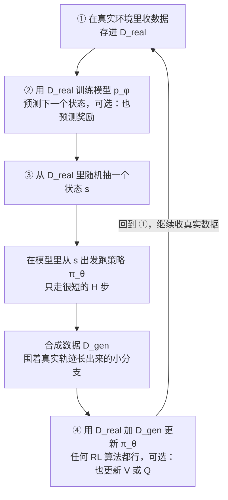
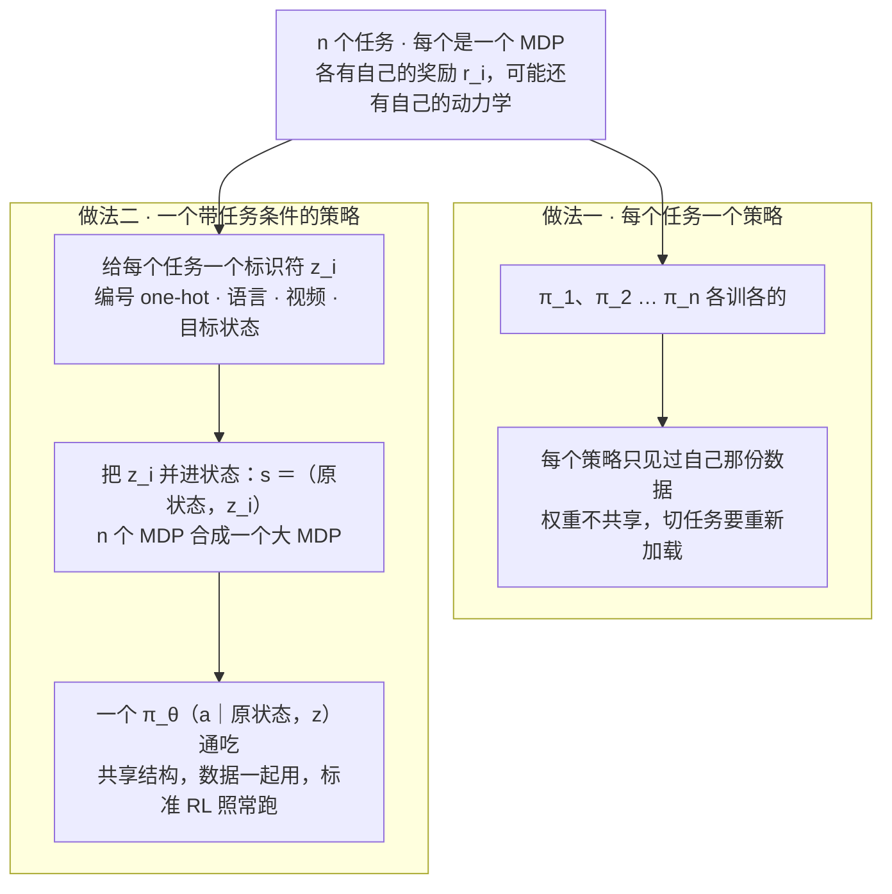
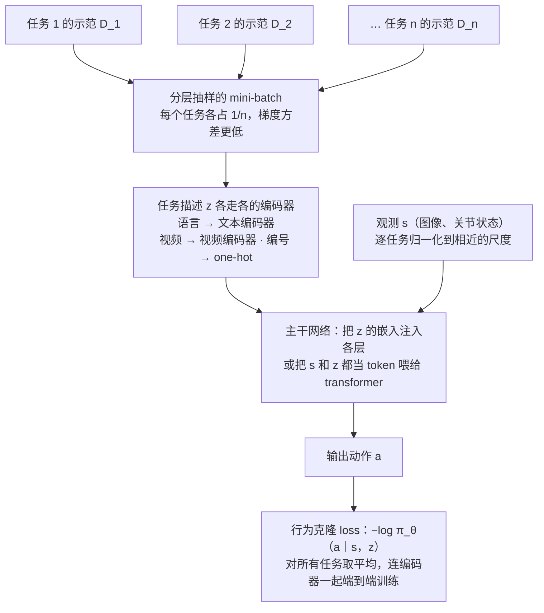
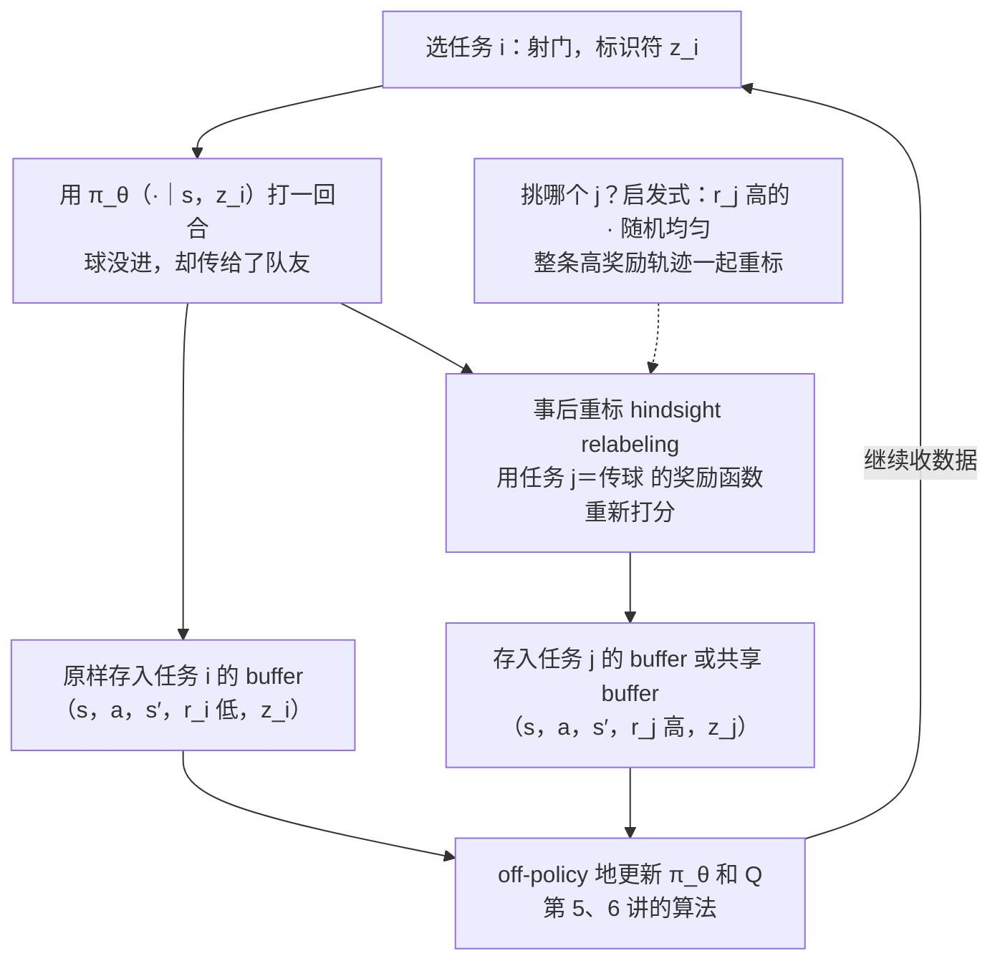
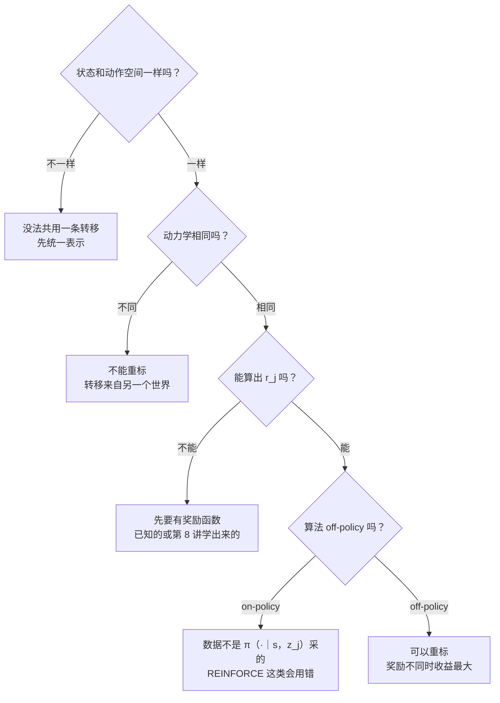
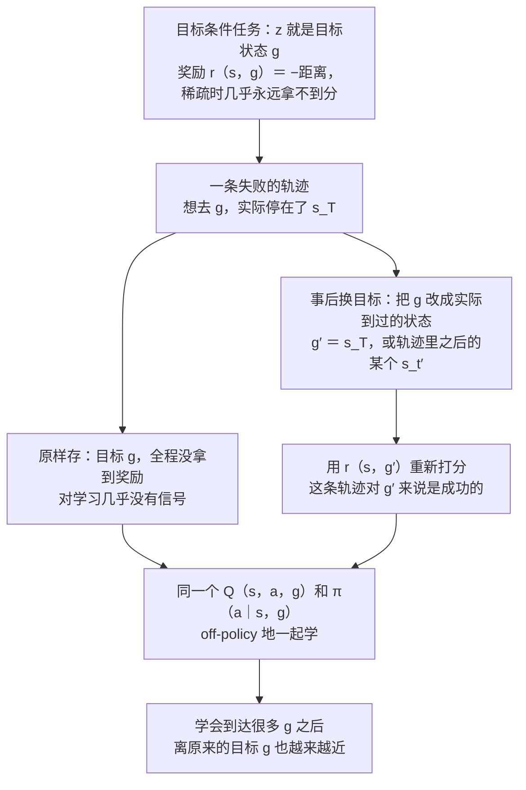

# CS224R 第 12 讲｜多任务与目标条件 RL（Multi-Task RL）

> Stanford CS224R: Deep Reinforcement Learning（2025 春）· 第 12 讲，2025 年 5 月 9 日 · 前 27 分钟先把第 11 讲的 model-based RL 收尾（用学到的模型造合成数据、什么时候值得学模型），之后才进入多任务；hindsight relabeling 是作业要重新实现的内容
> 视频：<https://www.youtube.com/watch?v=qNdsI_4AQJw>（1:10:29，英文字幕为自动生成，relabeling、MDP、Euclidean 这类词几乎都错，见文末勘误）
> 讲者：Chelsea Finn（课程主讲，不是客座）
> 课程主页：<https://cs224r.stanford.edu/> · 指定阅读：[Hindsight Experience Replay](https://arxiv.org/abs/1707.01495)（Andrychowicz et al., 2017；课程页面这一条误链到了一篇元学习论文，那篇属于第 13 讲，以这篇为准）

**一句话**：前半小时收尾 model-based RL——学到的模型除了拿来规划，还能当"学出来的模拟器"：从真实数据里的状态出发跑几步短 rollout，造出来的合成数据和真实数据一起喂给任何 RL 算法，等于用算力换真实交互；值不值得学模型，要看模型是不是比策略更好学。后半段讲多任务 RL：一个任务就是一个 MDP，给每个任务一个标识符 z（编号、一句话、一段视频、或者一个目标状态）并进状态里，n 个 MDP 就合成一个大 MDP，一个 π_θ(a | s, z) 通吃，标准的模仿学习和 RL 照常跑。RL 里还多一手：为任务 i 收的数据可以事后按任务 j 的奖励函数重新打分（hindsight relabeling）——想射门却传出一记好球，对"传球"来说就是成功样本；前提是动力学相同、奖励能算出来、算法是 off-policy 的。目标条件 RL 是它最漂亮的特例，指定阅读 HER 讲的就是把没到达的目标换成实际到过的状态。

## 时间轴

| 时间 | 内容 |
|---|---|
| [0:06](https://www.youtube.com/watch?v=qNdsI_4AQJw&t=6s) | 开场与今日安排；回顾第 11 讲：学模型 → 规划这条路的优缺点 |
| [3:09](https://www.youtube.com/watch?v=qNdsI_4AQJw&t=189s) | 模型的第二种用法：当学出来的模拟器，从真实数据里的状态出发做短 rollout |
| [7:48](https://www.youtube.com/watch?v=qNdsI_4AQJw&t=468s) | 板书算法；问答：短 rollout 会不会拖慢收敛、奖励从哪来、算力换数据、稳定性、兼容 on-policy / off-policy |
| [16:07](https://www.youtube.com/watch?v=qNdsI_4AQJw&t=967s) | 什么时候用 model-based RL：三大优点、三大缺点 |
| [19:40](https://www.youtube.com/watch?v=qNdsI_4AQJw&t=1180s) | 问答：额外超参有哪些；在线与离线版本；迷宫 vs 倒水；机器人上什么时候管用 |
| [24:20](https://www.youtube.com/watch?v=qNdsI_4AQJw&t=1460s) | 模型的其他形态：逆模型、多步逆模型、不带动作的未来预测、状态插值 |
| [27:23](https://www.youtube.com/watch?v=qNdsI_4AQJw&t=1643s) | 多任务 RL 是什么、为什么要做：通才策略、共享结构摊薄数据、通才更可靠 |
| [32:02](https://www.youtube.com/watch?v=qNdsI_4AQJw&t=1922s) | 任务 = 一个 MDP；四个例子里各自什么在变；任务标识符：编号、语言、视频 |
| [38:14](https://www.youtube.com/watch?v=qNdsI_4AQJw&t=2294s) | 板书：把任务标识符并进状态、n 个 MDP 合成一个；目标条件 RL 与负距离奖励；问答：one-hot 之外 |
| [44:25](https://www.youtube.com/watch?v=qNdsI_4AQJw&t=2665s) | 多任务模仿学习：loss 对任务取平均；分层抽样的 mini-batch；逐任务归一化 |
| [48:08](https://www.youtube.com/watch?v=qNdsI_4AQJw&t=2888s) | 架构：语言 + 视频双编码器；LLM 的 prompt 就是任务描述；VLA 式的 transformer 策略 |
| [52:11](https://www.youtube.com/watch?v=qNdsI_4AQJw&t=3131s) | 问答与演示视频：IL vs RL；中途切换指令；一个策略 vs 每任务一个；层级化留到第 15 讲 |
| [57:20](https://www.youtube.com/watch?v=qNdsI_4AQJw&t=3440s) | 多任务 RL：任务描述也喂给 Q 和 V；每任务一个 replay buffer；数据共享要重标奖励 |
| [58:22](https://www.youtube.com/watch?v=qNdsI_4AQJw&t=3502s) | 冰球例子；板书 relabeling 算法；问答：挑哪个任务 j；这就叫 hindsight relabeling |
| [1:05:07](https://www.youtube.com/watch?v=qNdsI_4AQJw&t=3907s) | 什么时候能重标：同状态动作空间、动力学必须相同、要有奖励函数、必须 off-policy |
| [1:09:47](https://www.youtube.com/watch?v=qNdsI_4AQJw&t=4187s) | 目标条件版本：负距离奖励的三种形态；本讲到此结束 |

## 核心内容

### 1. 收尾 model-based RL：模型的第二种用法是当"学出来的模拟器"

*图 12-1｜把学到的模型当模拟器：从真实状态出发做短 rollout，用合成数据补贴策略更新（自绘示意）· [▶ 看原幻灯片 13:00](https://www.youtube.com/watch?v=qNdsI_4AQJw&t=780s) · 出处：[Janner et al., 2019](https://arxiv.org/abs/1906.08253)（MBPO；课上没点名，应为）*

- **上一讲的回顾**：model-based RL（基于模型的 RL）先从数据里学一个**模型**（dynamics model）p_φ(s_{t+1} | s_t, a_t)——给定当前状态和动作，预测下一个状态，可以是确定性的，也可以是一个分布。第 11 讲拿它做**规划**（planning）：不学"状态 → 动作"的映射，而是在每个状态现场用梯度或采样优化未来一小段 horizon（时间跨度）上的动作序列，边跑边更新模型、定期重新规划。优点是简单，模型够通用时换目标、换奖励很方便，甚至测试时就能换；缺点是测试时算力大，而且只对短 horizon 或奖励很密（shaped reward）的问题实用——horizon 一长，算力更贵，模型被反复套用后误差也会累积。
- **第二种用法：用模型来学策略**。思路是把它当成一个学出来的模拟器，给手头的数据"增补"。课堂上学生提了两种做法：从真实轨迹的末尾接着往下生成；或者像第 2 讲的 DAgger 那样，前半段由策略在真实环境里走、后半段交给模型接。Finn 的推广是：起点不必是末尾，数据集（包括离线给你的数据）里**任何一个状态**都可以当起点。
- **rollout 一定要短**。rollout 指从某个状态出发、按策略一步步走出来的一段轨迹。模型走远了就不准，所以合成轨迹不要和真实轨迹一样长，而是做成围着真实轨迹长出来的许多小分支，给数据周围补一圈覆盖——实践里这种效果最好。三种造数据的方式对比：从初始状态生成完整轨迹（长 horizon 上不准，覆盖也差）；从初始状态只生成一小段（覆盖不到后面的状态）；从真实数据里的所有状态出发各生成一小段（短 rollout 加全程覆盖）——取第三种。
- **算法**（板书和幻灯片各写了一遍，图 12-1）：① 在真实环境收数据 D_real；② 用它更新模型，幻灯片版里模型也可以顺带学预测奖励；③ 从 D_real 里抽状态 s，在模型里从 s 出发按当前策略（或某个探索策略）走一小段，得到合成数据 D_gen；④ 用 D_real 和 D_gen 一起更新 π_θ，可选地也更新价值函数；然后回到 ①。第 ③ 步的一条合成轨迹就是：

$$
s_0\sim\mathcal{D}_{\mathrm{real}},\qquad a_k\sim\pi_\theta(\cdot\mid s_k),\qquad s_{k+1}\sim p_\phi(\cdot\mid s_k,a_k),\qquad k=0,\dots,H-1,\;\;H\ll T
$$

起点 s_0 从真实数据里抽，之后每一步的动作由当前策略 π_θ 给、下一个状态由学到的模型 p_φ 给，只走 H 步；H 远小于真实回合长度 T，这是整个配方的关键。

- **问答里补齐的细节**
    - 只做短 rollout 会不会拖慢收敛？——合成数据是对真实数据的补贴，不要求自己走到目标：靠近目标的起点很快会碰到奖励，远处的分支会连回数据集里的状态，第 4 讲起的 bootstrapping（用对后续状态的估值来更新当前估值）会把信号传回去；它甚至能让策略在真实数据没走过的地方发现捷径。真正想省的是**真实数据**的量。
    - 合成数据的奖励从哪来？——要么奖励函数已知，要么像第 8 讲那样学出来，要么就让这个模型（或另一个模型）用监督学习顺带预测奖励。没有奖励的估计，这套方法就没法用。
    - 算力？——训练时更贵（要训模型，还要在模型里 rollout），本质上是拿算力换环境交互，真实交互不安全或很贵（物理设备）时划算。和规划不同，测试时不额外花算力，最终跑的就是一个普通策略。
    - 稳定吗？——生成多少合成数据、更新时怎么配比，取决于你多信任模型。真正的新麻烦是多了一整套超参：模型的架构（生成图像时可能和策略完全不同）、学习率、epoch 数、正则化，再加上 rollout 长度和合成数据量。模型训得好一般没问题；模型训砸了，整个算法跟着变差。
    - 第 ④ 步兼容各种 RL 算法，包括 on-policy 的（要求数据来自正在更新的那个策略）——只要合成数据也是 π_θ 自己在模型里采的就行。也有方法只用模型数据更新策略，效果也不错。
    - 板书写的是在线版本（不断收新的真实数据）；也有完全离线的版本：固定一份数据集，用模型增补，训完策略就结束。更新时只用本轮的 D_real、D_gen 还是连同以前的一起用，决定了它是 on-policy 还是 off-policy——模型本身非常灵活。
    > 小注：这个"真实转移 + 模型里的短分支"的配方，源头是 Sutton 1990 年的 Dyna；深度 RL 里的标准版本应为 MBPO（Janner et al., 2019，第 11 讲的选读）：rollout 从 1 步起逐渐放长，策略更新用的数据绝大多数来自模型。

### 2. 什么时候值得学模型

| | 第 11 讲：拿模型做规划 | 本讲：拿模型造合成数据 |
|---|---|---|
| 学不学策略 | 不学，测试时现场优化动作 | 学，策略照常用 RL 更新 |
| 测试时算力 | 大 | 和普通策略一样 |
| 训练时算力 | 训模型 | 训模型，还要在模型里 rollout |
| 对 horizon 的要求 | 只能短 | rollout 短，但价值传播能把信号接到长 horizon |
| 换任务或奖励 | 方便，甚至测试时换 | 要重训策略，模型本身可以复用 |

- **大优点**（三条）
    1. 只要能学到一个还不错的模型，"预测未来"用处极大：真实数据可以少得多，还能顺带做测试时规划。Finn 补了一句幻灯片上没有的话：能预见自己动作的后果，本来就该是模型的一种基本能力。
    2. 模型可以在**没有奖励标签**的数据上训练。真实数据里往往只有一小部分带奖励，model-free 方法只能用那一部分，模型却能把没奖励的大头也吃进去——大量无奖励数据加少量有奖励数据，是很常见的处境。
    3. 模型是任务无关的：在足够宽的数据上训出来，可以跨任务、跨奖励函数复用。如果目标本来就不是学一个任务而是学很多个，这一点直接引出本讲的下半场。
- **大缺点**（三条）
    1. 模型优化的不是任务表现。以图像为状态时，它忙着把每个像素对上（天空的颜色对不对），而这往往和"学出好策略"无关：训练目标和下游目标错位。
    2. 有时模型比策略更难学。这种情况下学模型等于先给自己出一道更难的题。
    3. 多一样要训的东西：更多超参、更多算力。
- **模型和策略哪个更难学，完全看领域**（问答）：迷宫导航里，模型极简单——往右走就往右挪，除非撞墙——策略却很复杂，每个位置都要往不同方向拐，这时学模型划算；倒水时，策略可能只是转一下手腕，模型却要懂流体力学、水碰到碗边和碗心会怎样，这时直接学策略更省事。
- **机器人上的战绩**（问答）：状态是紧凑的关节角、物体位置时相当成功——四足机器人的"盲走"、上一讲看过的灵巧手转球（已知两个球的位置），后者用 model-free 甚至模仿学习都会非常难；状态是高维图像时则明显吃力。视频生成模型在变强，Finn 觉得这条路未来可能会通，但现在还没有。
- **模型不止一种形态**（最后一张幻灯片）：除了"给 s、a 预测 s′"的前向模型，还可以学逆模型（给 s_t 和 s_{t+1}，反推动作 a_t）、多步逆模型（给 s_t 和 s_{t+N}，反推一串动作）——它们更像策略，只是多了一个未来状态当输入，而且不需要奖励；不带动作的未来预测（环境里可能发生什么，即 affordance）；两个状态之间的插值；转移的生成模型。数据源不同，各有用处。
    - 问答：模型用了无奖励数据，会不会预测状态很准、预测奖励很差？——可能，也可能反过来。一般奖励比状态好预测，但确实会遇到奖励估计不准、要专门补数据的情况。

### 3. 多任务 RL：一个任务就是一个 MDP，把任务标识符并进状态

*图 12-2｜每任务一个策略，还是一个带任务条件的策略：后者把 n 个 MDP 合成一个（自绘示意）· [▶ 看原幻灯片 38:14](https://www.youtube.com/watch?v=qNdsI_4AQJw&t=2294s)*

- **要解决什么**：不想只训一个"会倒水"的策略，想要一个**通才策略**（generalist policy）：能订旅行也能网购的语言模型助手；能走、跑、跳舞、蹲的四足机器人；能挂毛巾、卸洗碗机、擦水渍的移动机器人；给不同的人做个性化推荐的音乐推荐系统；能玩 Pokemon、弹珠台和 Flappy Bird 的游戏 agent。把每个任务看成独立的 RL 问题，它们的奖励函数可能不同，动力学可能不同（不同的游戏、不同的用户），甚至动作空间都可能不同。
- **核心思路一句话**：照常做 RL，只是策略除了看状态，还要看"现在要做哪个任务"——π_θ(a | s, z)。
- **为什么要一起训**：这门课反复回到数据效率——要多少数据才能算出一个靠谱的梯度。如果目标本来就是做很多任务，学任一任务的成本可以在任务之间**摊薄**，因为任务之间通常有共享结构（语言助手要懂的语法、不同网站相似的操作；机器人前进和后退都得先保持平衡；口味相近的用户）。更深一层的理由是经验性的：近几年反复看到，通才系统比单任务系统更可靠、表现更好。
- **"任务"是什么**：其实没有严格定义。一种可用的定义是，不同任务就是不同的 MDP（Markov decision process，第 1 讲的记号）：各有自己的状态空间、动作空间、初始状态分布、转移模型和奖励函数，用下标 i 区分。

$$
\mathcal{M}_i=\big(\mathcal{S}_i,\ \mathcal{A}_i,\ p_i(s_1),\ p_i(s'\mid s,a),\ r_i(s,a)\big),\qquad i=1,\dots,n
$$

第 i 个任务 M_i 由五样东西定义：状态空间 S_i、动作空间 A_i、初始状态分布 p_i(s_1)、转移模型（动力学）p_i(s′ | s, a) 和奖励函数 r_i(s, a)；任务不同，就是这五样里至少有一样不同。

- 注意 MDP 意义上的"任务"和日常语义不是一回事：在草地上往前走和在平地上往前走，奖励函数相同、动力学不同，按这个框架算两个任务，虽然都叫"走路"。
- **四个例子，各自什么在变**（课堂问答一起过的；策略在所有例子里都会变）：

| 例子 | 一个任务是什么 | 跨任务在变的量 | 不变的量 |
|---|---|---|---|
| 个性化音乐推荐 | 一个用户 | 奖励（有人爱摇滚、有人爱嘻哈）、动力学（听歌频率之类的行为模式） | — |
| 角色动画 | 一种动作：后空翻、跑步、侧手翻 | 奖励 | 物理引擎的动力学、初始状态（都从站立开始） |
| 角色穿不同衣物 | 一件衣物：短袖、长袖、连衣裙 | 动力学（布料的物理）、初始状态 | — |
| 不同机械臂抓东西 | 一台机械臂：4、6、7 个自由度 | 状态的维度、动作的维度、动力学 | — |

- **任务标识符**（task identifier，记作 z_i）：策略得知道现在该做哪个任务。最朴素的是编号——这台机械臂是任务 0、那台是任务 1——实现上就是 one-hot 向量（第 k 位是 1、其余全 0），没有更好办法时就用它；也可以是一句语言描述、一段演示视频，形式很自由。
- **板书：把 z 并进状态**。原来是一堆 MDP，现在构造一个覆盖全部任务的**单个** MDP：新的状态是"原状态加任务标识符"，奖励和转移按 z 分派给对应任务的函数。

$$
s=(\bar{s},\,z_i),\qquad r(\bar{s},z_i,a)=r_i(\bar{s},a),\qquad p(s'\mid \bar{s},z_i,a)=p_i(s'\mid \bar{s},a)
$$

s̄ 是原来的状态，z_i 是任务标识符；合成后的大 MDP 里，奖励和转移都只是"查一下 z 是谁，再调用那个任务自己的 r_i 和 p_i"。这个构造要求各任务的状态空间和动作空间一致；维度都不一样时，得先想办法统一表示。

- **目标条件 RL**（goal-conditioned RL）是特例：z 就是一个想到达的目标状态 g，奖励通常写成当前状态到目标的负距离——欧氏距离（问答里确认：L2 就是均方误差）、稀疏的 0/1，等等。

$$
r(s,a,g)=-\,d(s,g),\qquad d(s,g)\in\Big\{\ \|s-g\|_2^2,\quad \|\varphi(s)-\varphi(g)\|,\quad \mathbb{1}\big[\|s-g\|>\epsilon\big]\ \Big\}
$$

g 是目标状态，d 是某种距离：可以是状态空间里的均方误差，可以是先用编码器 φ 映到嵌入空间再算距离，也可以是稀疏的 0/1——只要不在目标的 ε 球内就算没到（本讲结尾给的三种）。

- 合并之后仍然是标准 MDP，第 3–6 讲的算法直接可用，很多场景下这就是好办法。但 Finn 铺垫说，有些情况下利用"这个大 MDP 是由若干任务拼起来的"这一结构能做得更好，目标条件 RL 正是这样的情况——这就是第 5–7 节。
- **问答**：把用户当任务时，one-hot 是不是太粗？——是的，RL 里 one-hot 很常见但确实有更好的表示：用一段语言描述用户偏好；或者把用户喜欢和不喜欢的几个例子直接放进 z——z 里含有关于任务的数据，策略做的就成了上下文学习（in-context learning），是下周第 13 讲元 RL 的内容。

### 4. 多任务模仿学习：loss 对任务取平均，再加两个小技巧

*图 12-3｜多任务模仿学习的数据流：分层抽样、多模态的任务描述各走各的编码器、一个 BC loss（自绘示意）· [▶ 看原幻灯片 48:08](https://www.youtube.com/watch?v=qNdsI_4AQJw&t=2888s) · 出处：[Jang et al., 2021](https://arxiv.org/abs/2202.02005)（BC-Z；课上没点名，应为）*

- **设定**：任务数 n 不大，每个任务 i 有一份专家示范 D_i。第 2 讲的行为克隆是最小化 −log π_θ(a | s)，也就是让策略给专家动作的概率尽量高；多任务版本只是用同一组参数 θ，把各任务的 loss 取平均：

$$
\min_\theta\ \frac{1}{n}\sum_{i=1}^{n}\mathcal{L}_i(\theta),\qquad \mathcal{L}_i(\theta)=\mathbb{E}_{(s,a)\sim\mathcal{D}_i}\big[-\log\pi_\theta(a\mid s,z_i)\big]
$$

L_i 是第 i 个任务上的行为克隆 loss，(s, a) 从该任务的示范里抽，策略同时看到状态 s 和任务标识符 z_i；n 个任务共用一个 θ。

- **技巧一：分层抽样的 mini-batch**。如果任务差别很大——一个让机器人往前走、一个往后走、一个躺下——随机抽的 mini-batch 可能这批几乎全是前进、下批几乎全是躺下，相邻两步的梯度方向完全不同，方差很大。理论上网络该靠 z 把它们分开，实际上不总那么容易。办法是让每个 mini-batch 都含有每个任务的数据，想按任务均匀优化就各占 1/n，梯度方差会低不少。
- **技巧二**（幻灯片上没有）：逐任务把状态和动作归一化到相近的尺度。
- **架构：输入本身是多模态的**。策略吃 (s, z)，可 z 可能是一句话或一个 one-hot，s 可能是图像。Finn 举了一篇她喜欢的老论文（还没用 transformer）：机器人做简单的操作任务，图像先降采样再进主干；任务描述有两种——一句话"把瓶子放进陶瓷碗"，或者一段人做这件事的视频——分别走语言编码器和视频编码器，嵌入被"乘进"主干的各层；训练时随机用其中一种描述，loss 就是行为克隆，编码器和主干一起端到端训。
    > 小注：这篇应为 BC-Z（Jang et al., 2021）：语言或人类视频的预训练嵌入做条件，"乘进各层"的做法是 FiLM 式调制；100 多个任务上训练后能零样本泛化到没见过的任务描述。
- **更现代的架构**：语言模型的任务描述天然就是 prompt——从这个角度看，LLM 的整个 SFT（CME295 第 4 讲）就是"不同 prompt 当不同任务"的多任务模仿学习。机器人这边现在也常用 transformer：预训练的图像编码器把图像投到语言模型的输入空间，任务串"机器人该怎么做才能把茄子放进碗里"也切成 token 一起喂进去，输出动作，整个模型连图像和文本编码器一起端到端训。z_i 在这里就是 prompt。
    > 小注：这一页应为 RT-2（Brohan et al., 2023）：把动作也写成文本 token，让视觉-语言模型直接输出动作，靠网络数据带来语义泛化；课上那句提问式的任务串就是它的 prompt 格式。
- **问答：和 RL 比呢**？——任务条件这一招 IL 和 RL 都能用；取舍和前几讲一样：模仿学习用不了奖励、超不过示范者，但简单、容易堆到大数据；RL 有奖励信息时能明显超过给定的数据。
- **演示**：一段视频里只有铺毛巾、挂毛巾两个任务——毛巾铺得差不多时，人当场把指令切成"挂毛巾"，同一个 transformer 策略接着做；另一段有十几条语言指令：把盘子放进抽屉、关微波炉、底盘后退、底盘左转……**任务的抽象层级可以不一样**，"往前开""右夹爪放低"和"把餐巾扔掉"都算任务。同一个模型还训过看图问答——模型够大就不难，但要做的事越多，模型得越大。
- **问答：一个策略，还是每个任务一个**？——视频里是一个策略加 prompt。每任务一个策略意味着完全不共享权重，每套权重只见过自己那份更小的数据，通常更差；还要存更多权重，切任务时可能得重新加载。但把很多任务塞进一个模型确实会有优化上的麻烦，有些场合分开训反而合适。
    > 小注：课上说的"优化上的麻烦"，最常被点名的是任务间梯度冲突——两个任务的梯度方向相反，一起平均就互相抵消；PCGrad（Yu et al., 2020，Finn 是作者之一）把冲突的分量投影掉，蒸馏（先各训各的再合成一个学生）是另一条路。本讲都没展开。
- **问答：更高层的任务**（"把厨房收拾干净"）——视频里的都是单个扁平策略，能做一些层级不低的任务，但直接说"收拾厨房"它做不了，层级化留到两周后的第 15 讲。**长 horizon 任务**指要走很多步才能完成的任务，麻烦在于该做什么的选择太多（多模态）、奖励稀疏、反馈来得很晚。

### 5. 多任务 RL 与 hindsight relabeling：一次失误对另一个任务可能是成功

*图 12-4｜hindsight relabeling 的数据流：一段经验存两份，第二份换上另一个任务的奖励和标识符（自绘示意）· [▶ 看原幻灯片 59:24](https://www.youtube.com/watch?v=qNdsI_4AQJw&t=3564s) · 出处：[Andrychowicz et al., 2017](https://arxiv.org/abs/1707.01495)*

- **多任务 RL 的做法和 IL 一样**：任务描述 z 不但喂给策略，也喂给 Q 函数或价值函数——凡是在学的东西都接上这个"prompt"。任务数离散且不多时，给每个任务单独开一个 replay buffer（第 5 讲：存历史转移供反复抽样的仓库）会方便些，尤其想控制每个 batch 里各任务的配比时。
- **RL 独有的新问题：数据共享**。为任务 i 探索时收的数据——比如让策略"拿起海绵"，它没拿到——对别的任务也可能有用；可是按任务分桶之后，这段经验永远不会拿去更新别的任务。想让它帮到另一个任务，就得**重标**（relabel）：动力学相同、奖励函数不同时，把奖励标签换成另一个任务的。
- **冰球例子**：蓝色是队友，橙色是对方守门员，任务一是传球，任务二是射门。你想射门，打歪了，球却恰好到了队友脚下——对射门是失败，对学传球却是一条好样本。做法：这段经验照常以射门的 z 存一份；再把奖励换成传球任务的奖励、标识符换成传球的 z，存进传球任务的 buffer（或共享 buffer）。
- **板书算法**（图 12-4）：选一个任务 i 和它的 z_i → 用 π_θ(· | s, z_i) 收数据，每条转移是 (s_t, a_t, s_{t+1}, r_t, z_i)，存进任务 i 的 buffer → 对另一个任务 j，把同一条转移重标 → 存进任务 j 的 buffer 或共享 buffer → 对若干个任务这样做 → 更新 π_θ → 再收数据。重标本身只是一个替换：

$$
\big(s_t,\ a_t,\ s_{t+1},\ r_i(s_t,a_t),\ z_i\big)\ \longrightarrow\ \big(s_t,\ a_t,\ s_{t+1},\ r_j(s_t,a_t),\ z_j\big)
$$

状态、动作、下一个状态原样保留，只把奖励换成用任务 j 的奖励函数重新算出来的值，把标识符换成 z_j；这就是"事后"（hindsight）二字的含义——回头看自己做了什么，再决定它算哪个任务的样本。

- **哪些数据值得重标、标给谁**（问答）：说实话是启发式的——学习是个"无定形"的过程，很难预先判断一段数据对某个任务有没有用。两条常用启发：一是 r_j 高的转移，说明你无意中替任务 j 做对了什么；二是干脆随机、均匀地给所有任务都重标一份。幻灯片版补了一条：可以按整条轨迹来——某处奖励高，其余部分多半也做对了什么。连续状态没有任何障碍，算法里没有一步假设状态离散。
- **重标后的数据怎么用**：把第 6 讲的 Q-learning 目标加上任务条件，就能看出为什么它吃得下这种数据（这是笔者的写法，课上只说"用 off-policy 算法更新"）：

$$
y=r_j(s_t,a_t)+\gamma\,\max_{a'}Q_{\bar\theta}(s_{t+1},a',z_j),\qquad \mathcal{L}(\theta)=\big(Q_\theta(s_t,a_t,z_j)-y\big)^2
$$

Q_θ(s, a, z) 是带任务条件的 Q 函数（在任务 z 下、状态 s 做动作 a 之后能拿到的折扣回报），Q_θ̄ 是第 6 讲的 target network，γ 是折扣因子；目标 y 只用到重标后的奖励和下一个状态，完全不关心当初这个 a_t 是在哪个任务条件下选出来的。

### 6. 什么时候能重标：对 MDP 的要求和对算法的要求

*图 12-5｜重标之前要过的四道关：同空间、同动力学、奖励可算、算法 off-policy（自绘示意）· [▶ 看原幻灯片 1:05:07](https://www.youtube.com/watch?v=qNdsI_4AQJw&t=3907s)*

- **对 MDP 的要求**（Finn 一条条问出来的）
    - 状态空间和动作空间要相同，尤其是共用一个 buffer 时，维度必须对得上。
    - 初始状态分布 p(s_1) 要相近；差太远的话，共享数据意义不大。
    - 奖励尺度相近有帮助。有学生担心密奖励和稀疏奖励混在一起——这是多任务 RL 的通病，不过重标用的是目标任务自己的奖励函数，在这里问题没那么大。
    - **动力学必须相同**。重标只改 r 和 z，(s, a, s′) 原样保留，等于拿任务 i 的转移去教任务 j 的动力学；动力学不同，教的就是错的东西。
    - 奖励函数不同时才最有用；奖励相同的话，这条数据本来就以那个奖励躺在 buffer 里了。
- **对算法的要求：必须 off-policy**。数据里的动作是 π_θ(· | s, z_i) 选的，换成 z_j 条件时策略可能会选别的动作，所以重标数据对 π_θ(· | s, z_j) 来说是 off-policy 的（不是当前要更新的策略自己采的）。第 3 讲的 REINFORCE 这种要求数据来自正在更新的策略的算法用不了，要用第 5、6 讲的 off-policy actor-critic 或 Q-learning。有学生追问：用重要性权重（importance weights，用概率之比修正数据来源的差异）的话，是不是要记下采集数据的策略？——Finn 先说要，随即改口：重标出来的数据应当被当成"在 z_j 条件下采到的"，不需要记录来源。
    > 小注：严格说动作是在 z_i 条件下采出来的，真要做重要性加权，比值应是 π(a | s, z_j) ÷ π(a | s, z_i)，得知道原来的 z_i。但 Q-learning 类方法（第 6 讲）本来就不需要重要性权重——回归目标对任何一条 (s, a, r, s′) 都成立——这正是"必须 off-policy"这一条的用意（笔者的理解）。
- **还要能算奖励**：重标要给转移重新打分，所以任务 j 的奖励函数得是已知的，或者是第 8 讲那样学出来的。
- **三句话总结**：奖励函数可算、动力学一致、算法 off-policy。
    > 小注：这套"按任务重标"在真实机器人上的大规模版本应为 MT-Opt（Kalashnikov et al., 2021）：十几个抓取、放置任务共用一个 Q 函数，每条回合用各任务的成功判别器重标后互相共享数据；课上没提。

### 7. 目标条件版本与 HER：把"没到的地方"当成目标

*图 12-6｜目标条件下的 hindsight relabeling：失败的轨迹换上实际到达的状态当目标，就成了成功样本（自绘示意）· [▶ 看原幻灯片 1:09:47](https://www.youtube.com/watch?v=qNdsI_4AQJw&t=4187s) · 出处：[Andrychowicz et al., 2017](https://arxiv.org/abs/1707.01495)*

- **本讲最后半分钟**：目标条件版本和前面完全一样，只是奖励函数变成状态到目标的负距离——连续状态下可以是均方误差、嵌入空间里的距离，或者"在目标的 ε 球内算 1、否则算 0"的稀疏形式（第 3 节的公式）。视频到这里结束，"换目标"的具体做法没来得及展开，指定阅读 HER 讲的就是它。
- **为什么这是"利用结构能做得更好"的那个案例**（接第 3 节的铺垫，笔者的推断）：目标条件任务把第 6 节的四道关全部自动过掉——所有目标共享同一个环境，动力学天然一致；奖励 r(s, g) 是写得出来的距离函数，对任何 g 都能现算；目标状态就在状态空间里，任务空间和状态空间是同一个。于是"重标给哪个任务"有了不需要启发式的答案：**标给这条轨迹实际到过的状态**。稀疏奖励下随机策略几乎永远碰不到指定的 g，原始数据里全是 0 分；换成到过的状态当目标，每条轨迹对某个 g′ 都是成功的，正样本要多少有多少。

$$
\big(s_t,\ a_t,\ s_{t+1},\ g\big)\ \longrightarrow\ \big(s_t,\ a_t,\ s_{t+1},\ g'\big),\qquad g'=s_{t'}\ \text{for some}\ t'>t,\qquad r'=r(s_{t+1},g')
$$

g 是这条轨迹原本要去的目标，g′ 是同一条轨迹里之后某个时刻实际到达的状态；用 g′ 重新算奖励 r′，其余不动。它和第 5 节的公式是同一个替换，只是"任务 j"换成了"到过的状态"。

> 小注：以下是 HER 论文（Andrychowicz et al., 2017）的内容，课上没讲到。它把这个替换接在任意 off-policy 算法上（论文用 DDPG），奖励只用"到没到"的二元稀疏信号；比较了四种取 g′ 的策略——整条轨迹的终点、同一轨迹里之后的状态、同一回合里任意状态、buffer 里任意状态——其中"之后的状态"最好；在推、滑、抓放三个机械臂任务上从零学会，并迁移到了真机。论文把它称为一种隐式的课程（implicit curriculum）：先学会到近处，再逐渐够到远处。作业要实现的就是这个。

## 关键图表速查（点时间戳跳到原幻灯片）

| 图 | 看什么 | 跳转 | 出处 |
|---|---|---|---|
| 规划路线的优缺点 | 简单、换目标方便 vs 测试时算力大、只适合短 horizon 或密奖励 | [2:07](https://www.youtube.com/watch?v=qNdsI_4AQJw&t=127s) | — |
| 合成数据的三种画法 | 黑色是真实轨迹、红色是模型想象的：整条、从头一小段、从每个真实状态各长一小段——取第三种 | [5:13](https://www.youtube.com/watch?v=qNdsI_4AQJw&t=313s) | 应为 [MBPO](https://arxiv.org/abs/1906.08253) |
| 板书算法 | 收 D_real → 训模型 → 从 D_real 抽 s 在模型里短 rollout 得 D_gen → 合并更新 π_θ | [7:48](https://www.youtube.com/watch?v=qNdsI_4AQJw&t=468s) | — |
| 幻灯片版四步算法 | 模型可顺带学奖励；第四步可换任意 RL 算法、可选更新价值函数 | [13:00](https://www.youtube.com/watch?v=qNdsI_4AQJw&t=780s) | — |
| 什么时候用 model-based RL | 三大优点对三大缺点；注意"无奖励数据也能训模型"和"训练目标错位"两条 | [16:07](https://www.youtube.com/watch?v=qNdsI_4AQJw&t=967s) | — |
| 模型的其他形态 | 逆模型、多步逆模型、不带动作的未来预测、插值、转移的生成模型 | [24:20](https://www.youtube.com/watch?v=qNdsI_4AQJw&t=1460s) | — |
| 多任务 RL 的定义 | 任务 = MDP，五个分量都带下标 i | [32:02](https://www.youtube.com/watch?v=qNdsI_4AQJw&t=1922s) | — |
| 四个例子 | 推荐、角色动画、衣物、机械臂——各自哪些分量在变 | [33:35](https://www.youtube.com/watch?v=qNdsI_4AQJw&t=2015s) | — |
| 任务标识符与合并 MDP 的板书 | 状态 =（原状态，z_i），奖励和转移按 z 分派 | [38:14](https://www.youtube.com/watch?v=qNdsI_4AQJw&t=2294s) | — |
| 多任务 IL 目标与分层 mini-batch | 单个 θ 最小化各任务 loss 的平均；每个 mini-batch 各任务占 1/n | [45:27](https://www.youtube.com/watch?v=qNdsI_4AQJw&t=2727s) | — |
| 语言 + 视频双编码器架构 | 两种任务描述各走各的编码器，嵌入乘进主干各层，BC loss 端到端 | [49:08](https://www.youtube.com/watch?v=qNdsI_4AQJw&t=2948s) | 应为 [BC-Z](https://arxiv.org/abs/2202.02005) |
| VLA 式 transformer 策略 | 预训练图像编码器投到语言模型输入空间，任务串当 token，输出动作 | [51:40](https://www.youtube.com/watch?v=qNdsI_4AQJw&t=3100s) | 应为 [RT-2](https://arxiv.org/abs/2307.15818) |
| 冰球重标例子 | 想射门却传出好球：原样存一份，再按传球任务的奖励重标一份 | [59:24](https://www.youtube.com/watch?v=qNdsI_4AQJw&t=3564s) | — |
| hindsight relabeling 幻灯片算法与适用条件 | 收数据 → 存 buffer → 重标 → 更新；挑任务：随机或高奖励，整条轨迹也行；条件：同动力学、有奖励函数、off-policy | [1:04:35](https://www.youtube.com/watch?v=qNdsI_4AQJw&t=3875s) | [HER](https://arxiv.org/abs/1707.01495) |

## 提到的工作

| 名称 | 在本讲里的作用 |
|---|---|
| 第 11 讲的 model-based RL 与规划 | 开场回顾：学模型 → 规划这条路的优缺点 |
| Dyna（Sutton, 1990）、[MBPO](https://arxiv.org/abs/1906.08253)（Janner et al., 2019） | 合成数据算法的来源；课上没点名，应为 |
| DAgger（第 2 讲） | 学生用它类比"前半段真实、后半段模型" |
| 灵巧手转球（应为 [PDDM](https://arxiv.org/abs/1909.11652)，Nagabandi et al., 2019） | model-based RL 在紧凑状态上成功的例子 |
| 视频生成模型 | 图像状态下学模型的未来希望 |
| 逆模型、多步逆模型、affordance、插值、转移的生成模型 | 模型的其他形态，只点了名 |
| one-hot、语言描述、演示视频 | 任务标识符 z 的三种形式 |
| 上下文学习、元 RL（第 13 讲） | 把任务的示例放进 z 的延伸 |
| [BC-Z](https://arxiv.org/abs/2202.02005)（Jang et al., 2021；应为） | 语言 + 视频双任务描述的多任务 IL 架构 |
| SFT（CME295 第 4 讲） | LLM 的 SFT 就是拿 prompt 当任务标识符的多任务 IL |
| [RT-2](https://arxiv.org/abs/2307.15818)（Brohan et al., 2023；应为） | VLA 式的 transformer 策略，z 就是 prompt |
| 毛巾任务与十几条指令的演示视频 | 单个扁平策略做多任务、任务抽象层级不一的例子；课上没点名 |
| 分层 RL（第 15 讲，SayCan） | "收拾厨房"这类更高层的任务留到那里 |
| Hindsight relabeling、[HER](https://arxiv.org/abs/1707.01495)（Andrychowicz et al., 2017） | 本讲主角；指定阅读；作业要实现 |
| [PCGrad](https://arxiv.org/abs/2001.06782)（Yu et al., 2020；课上没提，小注补充） | 多任务里梯度冲突的一种处理 |
| [MT-Opt](https://arxiv.org/abs/2104.08212)（Kalashnikov et al., 2021；课上没提，小注补充） | 真实机器人上大规模按任务重标、共享数据 |

## 术语对照

| English | 中文 |
|---|---|
| model-based RL | 基于模型的 RL：先学环境的转移模型，再拿它规划或造数据 |
| dynamics model p_φ(s′ ∣ s, a) | 动力学模型 / 转移模型：预测下一个状态 |
| planning | 规划：不学策略，在每个状态现场优化未来几步的动作 |
| horizon | 时间跨度：往前看几步 |
| rollout | 按策略从某个状态出发走出来的一段轨迹 |
| synthetic / imagined data | 合成数据：在学到的模型里走出来的转移，区别于真实环境的数据 |
| compounding error | 误差累积：模型被反复套用，预测越走越偏 |
| shaped / dense reward vs sparse reward | 密奖励 / 稀疏奖励：每步都有反馈 vs 只有到达时才有 |
| inverse model | 逆模型：给两个状态，反推中间的动作 |
| affordance | 环境里"可能发生什么"，不依赖自己的动作 |
| multi-task RL | 多任务 RL：一个策略学多个任务 |
| generalist policy | 通才策略 |
| task identifier z_i | 任务标识符：告诉策略现在做哪个任务的输入 |
| one-hot vector | 独热向量：第 k 位是 1、其余全 0，用来编码"第 k 个任务" |
| task conditioning | 任务条件化：策略、Q、V 都额外吃 z |
| goal-conditioned RL | 目标条件 RL：任务标识符就是要到达的目标状态 |
| aggregated MDP | 合并的 MDP：把 z 并进状态之后覆盖所有任务的那一个 MDP |
| stratified mini-batch | 分层抽样的 mini-batch：每个任务在批里占固定比例 |
| per-task normalization | 逐任务归一化：各任务的状态和动作缩放到相近尺度 |
| behavior cloning (BC) | 行为克隆：最大化示范动作的对数概率（第 2 讲） |
| prompt as task descriptor | 把 prompt 当任务描述：LLM 的 SFT 就是多任务 IL |
| VLA (vision-language-action) | 视觉-语言-动作模型：图像和任务串进语言模型，输出动作 |
| weight sharing | 权重共享：多个任务用同一套参数 |
| hierarchy / long-horizon task | 层级化 / 长时程任务：要走很多步才完成的任务，第 15 讲 |
| replay buffer | 重放缓冲区：存历史转移、反复抽样的仓库（第 5 讲） |
| data sharing | 数据共享：一个任务收的数据拿去更新另一个任务 |
| relabeling / hindsight relabeling | 重标 / 事后重标：回头把一段经验按另一个任务的奖励重新打分 |
| off-policy | 用不是当前策略采的数据来更新（第 5 讲） |
| importance weights | 重要性权重：用概率之比修正数据来源不同 |
| ε-ball | ε 球：离目标不超过 ε 的范围，稀疏奖励的"算到达"判据 |
| HER (hindsight experience replay) | 事后经验重放：把实际到过的状态当目标重标 |
| implicit curriculum | 隐式课程：先学会近的目标，再自然够到远的 |

## 字幕勘误

"reabeling""reabel""reabelled" → relabeling；"MTP""MVP""mark decision process""marov" → MDP、Markov decision process；"uklidian" → Euclidean；"shaped wards" → shaped rewards；"denser words""sparse words" → dense rewards、sparse rewards；"Dagger" → DAgger；"recommener" → recommender；"invitation learning" → imitation learning；"D genen" → D_gen；"repo buffer" → replay buffer；"Pytha""PI theta" → π_θ；"ZI""Zj" → z_i、z_j；"ST A T S + one" → s_t、a_t、s_{t+1}；"heristic" → heuristic；"highle" → high-level；"onpolicy" → on-policy；"directories" → trajectories；讲架构时的 "and pen" → end-to-end；"four two states" → for two states。

## 带走的问题

1. 合成数据的 rollout 长度是个超参：长了模型误差累积，短了覆盖不够。如果模型完全准确（比如就是游戏引擎本身），第 1 节的算法退化成什么？如果模型完全不准呢？"从真实状态出发做短分支"和第 2 讲 DAgger 的"从策略走到的状态出发请专家标注"，结构上像在哪里、差在哪里？
2. 把任务标识符并进状态之后，理论上第 3–6 讲的标准 RL 就能解，那 relabeling 到底多给了算法什么信息？（提示：奖励函数是已知的、动力学在任务间共享——这两条"结构"标准 RL 并不知道。）
3. 冰球例子里，重标数据对 π_θ(· | s, z_j) 是 off-policy 的。如果你用的是第 3 讲的 REINFORCE，会出什么问题？喂给第 6 讲的 Q-learning 为什么就没事？如果非要做重要性加权，分母该是谁？
4. 在你做的 agent 里，一次失败的工具调用轨迹能不能被"事后重标"成另一个任务的成功样本？逐条对照第 6 节的四道关：LLM agent 的环境在任务之间共享吗？另一个任务的奖励能不能对这条轨迹现算？你的训练方法吃得下 off-policy 数据吗？
5. Finn 说通才系统经验上比单任务系统更可靠，可第 4 节又说把很多任务塞进一个模型会有优化上的麻烦。什么情况下你会选择拆开训、再想办法合并？如果任务之间的梯度方向真的相反，分层抽样的 mini-batch 帮得上忙吗？
