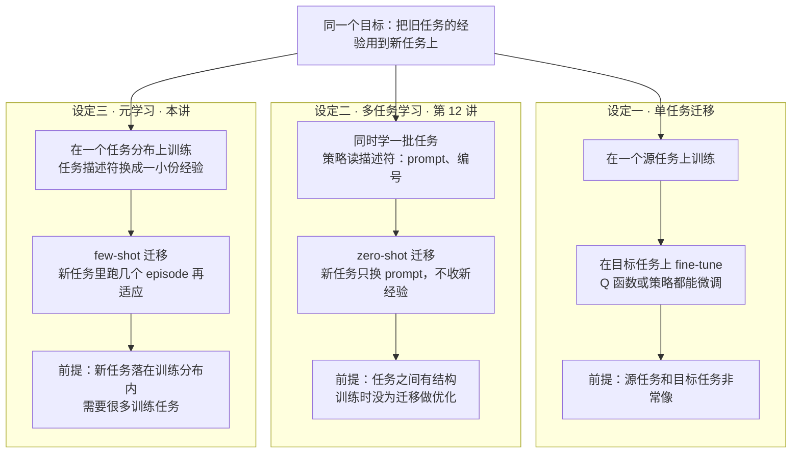
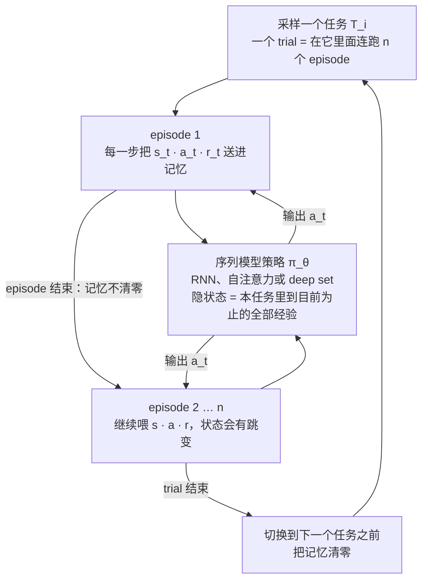
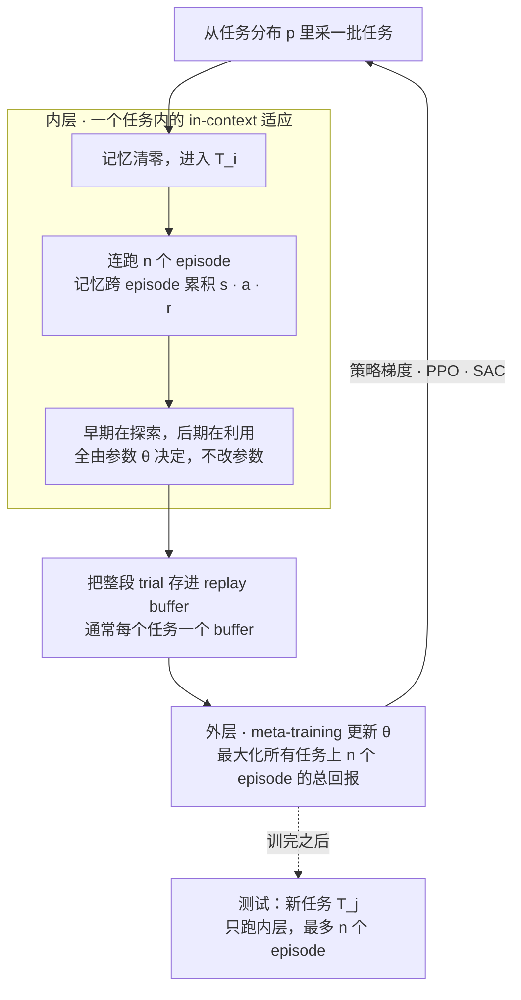
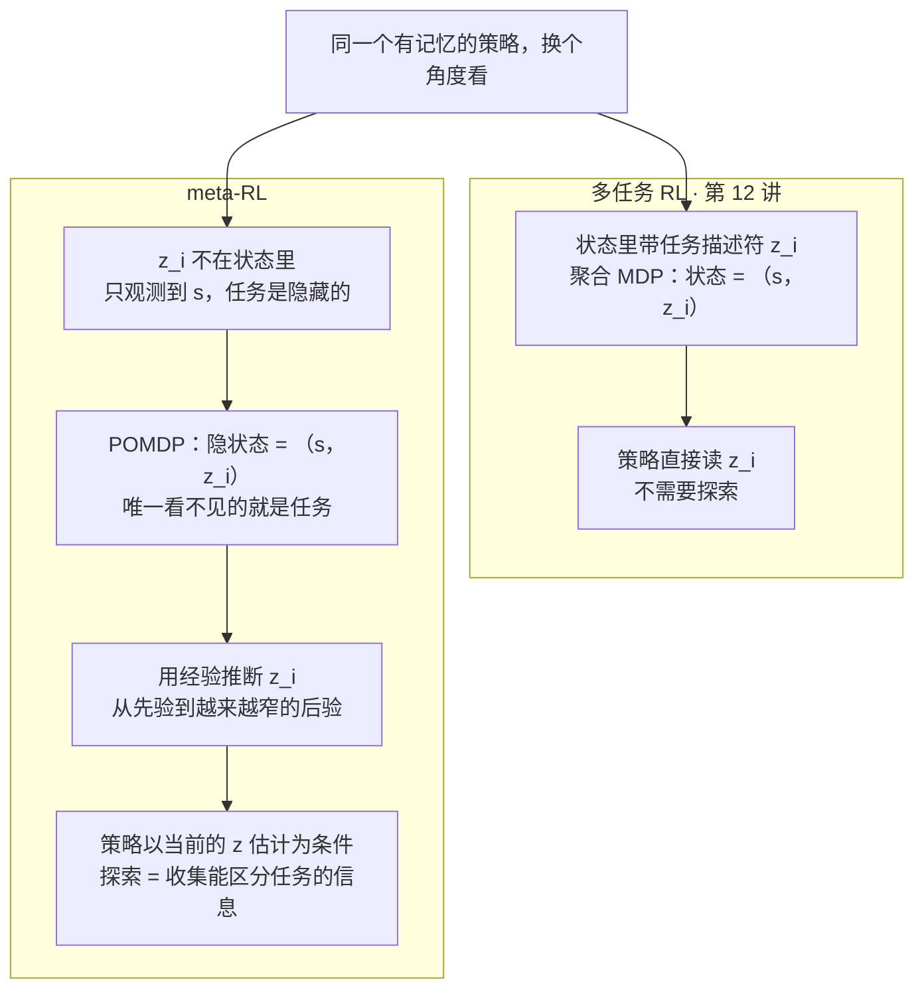
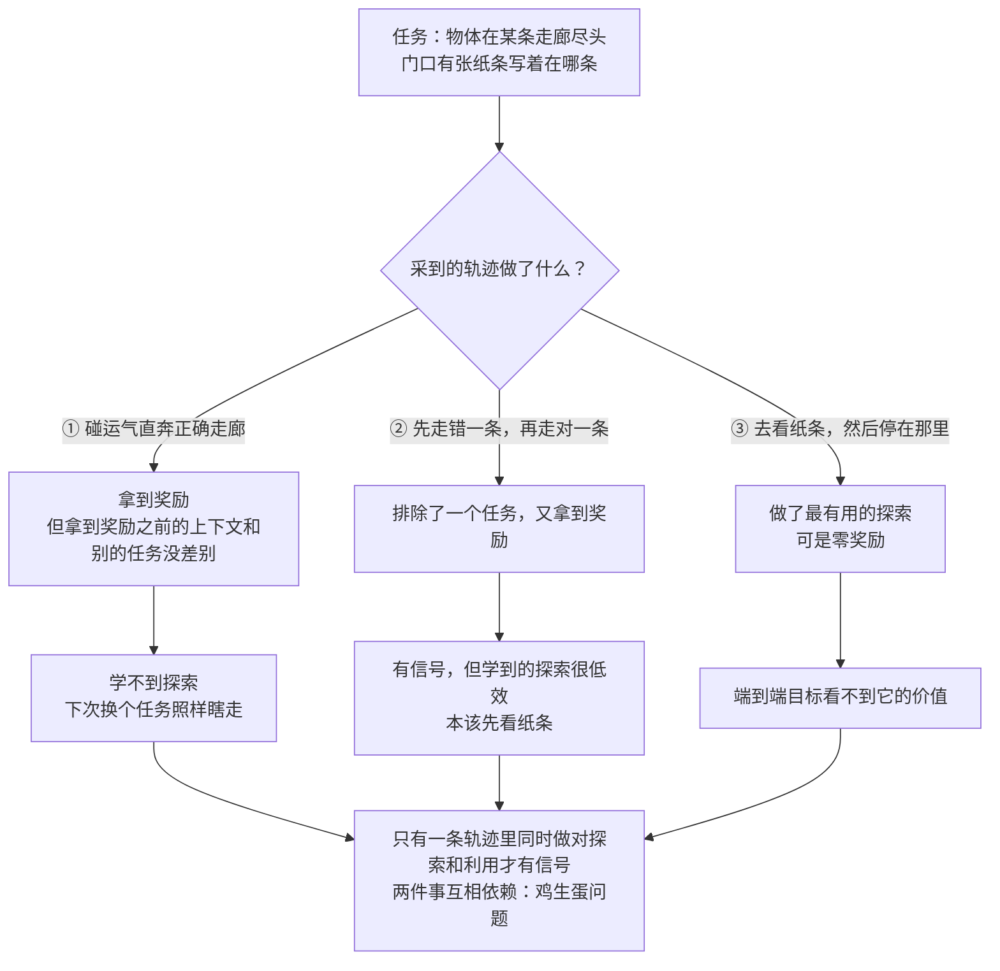
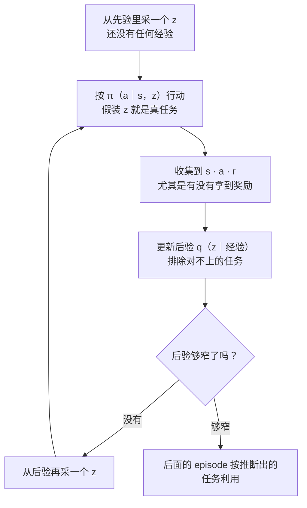

# CS224R 第 13 讲｜元强化学习（Meta RL）

> Stanford CS224R: Deep Reinforcement Learning（2025 春）· 第 13 讲，2025 年 5 月 14 日 · 承接第 12 讲的多任务 RL，为第 14 讲的探索铺路
> 视频：<https://www.youtube.com/watch?v=wSiyEpvoGkA>（1:09:10，英文字幕是自动生成的，算法名和记号错得不少，见文末勘误）
> 讲者：Chelsea Finn（本讲不是客座讲座）
> 课程主页：<https://cs224r.stanford.edu/> · 指定阅读：[RL²: Fast Reinforcement Learning via Slow Reinforcement Learning](https://arxiv.org/abs/1611.02779)（Duan et al., 2016）· 课上讲到但没点名的：[PEARL](https://arxiv.org/abs/1903.08254)（Rakelly et al., 2019）

**一句话**：普通 RL 每个任务都从零学，人却能靠旧经验几分钟学会一台新咖啡机。元强化学习（meta-RL）把"快速适应"本身当成训练目标：在一个任务分布上训练，让策略拿到新任务里一点点经验（几步或几个 episode）就能上手。最成功的一类是黑箱方法：把策略做成有记忆的序列模型，状态、动作、奖励一起喂进去，记忆跨越多个 episode，端到端最大化所有任务的总回报，探索和利用的权衡由模型自己学出来（RL²、SNAIL）。换个角度看，这是在用经验推断一个隐藏的任务变量 z，整个问题是一个"只有任务看不见"的 POMDP——PEARL 显式维护 z 的后验，还借此换成 off-policy 算法提速。代价是难优化：探索和利用互相依赖，端到端信号只在两件事同时做对时才出现；后验采样这类辅助探索目标是缓解办法，第 14 讲继续。

## 时间轴

| 时间 | 内容 |
|---|---|
| [0:06](https://www.youtube.com/watch?v=wSiyEpvoGkA&t=6s) | 回顾第 12 讲：多任务 RL 的聚合 MDP；目标条件 RL 与它的自监督好处 |
| [2:42](https://www.youtube.com/watch?v=wSiyEpvoGkA&t=162s) | 今天的主题：meta-RL 的问题定义与黑箱方法；为什么要它——咖啡机例子，人不是从零开始 |
| [5:48](https://www.youtube.com/watch?v=wSiyEpvoGkA&t=348s) | 迁移的三种设定：单任务 fine-tune、多任务 zero-shot、元学习 few-shot；任务描述符可以是一份数据集；RL 之外的 few-shot：图像分类、GPT-3 的 in-context learning |
| [12:27](https://www.youtube.com/watch?v=wSiyEpvoGkA&t=747s) | meta-RL 的例子：走迷宫——第一个 episode 探索，第二个直奔目标；探索是 RL 特有的难点；腿式机器人、用户偏好等场景 |
| [17:04](https://www.youtube.com/watch?v=wSiyEpvoGkA&t=1024s) | 正式定义：多任务 vs 迁移 vs 元学习；任务就是 MDP；适应数据的两种形式；探索策略与任务策略 |
| [20:20](https://www.youtube.com/watch?v=wSiyEpvoGkA&t=1220s) | 黑箱方法：把策略做成有记忆的序列模型；和普通循环策略的几点差别（奖励当输入、跨 MDP 训练、记忆跨 episode） |
| [24:41](https://www.youtube.com/watch?v=wSiyEpvoGkA&t=1481s) | 算法四步：采任务 → 连跑 n 个 episode → 存 buffer → 最大化全部任务的回报；测试时最多跑 n 个 episode；问答：episode 边界、初始状态 |
| [31:23](https://www.youtube.com/watch?v=wSiyEpvoGkA&t=1883s) | 架构：RNN（RL²）、自注意力加 1D 卷积（SNAIL）、deep set；视觉迷宫实验：1000 个小迷宫训练，大迷宫上也能用 |
| [36:29](https://www.youtube.com/watch?v=wSiyEpvoGkA&t=2189s) | 问答：为什么会学到"尽快找到"——折扣因子；输入是什么；探索和利用藏在目标函数里；能不能普通 RL 加 test-time training |
| [39:31](https://www.youtube.com/watch?v=wSiyEpvoGkA&t=2371s) | test-time compute 就是 meta-RL：解数学题当成 MDP，解法是要探索的东西；DeepSeek-R1 对 2 + 2 也长想；把 test-time compute 的效率纳入训练 |
| [42:05](https://www.youtube.com/watch?v=wSiyEpvoGkA&t=2525s) | 三种视角：经验就是任务描述符；meta-RL 推广了目标条件 RL；任务推断视角；问答：为什么不直接给任务编号 |
| [46:08](https://www.youtube.com/watch?v=wSiyEpvoGkA&t=2768s) | meta-RL 没有聚合 MDP：任务不可观测，它是一个特殊的 POMDP |
| [48:40](https://www.youtube.com/watch?v=wSiyEpvoGkA&t=2920s) | 显式推断任务分布 z 的方法（PEARL）；底层用 off-policy 算法让 meta-training 快得多；问答：replay buffer 里放整段轨迹 |
| [52:46](https://www.youtube.com/watch?v=wSiyEpvoGkA&t=3166s) | 小结：黑箱方法通用、表达力强，但难优化；样本效率继承自底层优化器（策略梯度 / PPO / SAC） |
| [53:46](https://www.youtube.com/watch?v=wSiyEpvoGkA&t=3226s) | in-context 探索为什么难：走廊加纸条的例子，三条轨迹各给什么信号；做饭的比方；问答：是稀疏奖励的锅吗 |
| [1:02:30](https://www.youtube.com/watch?v=wSiyEpvoGkA&t=3750s) | 解法一：后验采样（Thompson sampling）的做法、点机器人例子、什么时候会很糟；内在奖励等其他解法，周五第 14 讲继续 |

## 核心内容

### 1. 为什么要 meta-RL：人不是从零开始学的

- **回顾第 12 讲**：多任务 RL 把一批任务塞进一个聚合 MDP——状态旁边多带一个任务描述符（prompt、目标，或者干脆一个编号），采一个任务、在它的 MDP 里跑策略、再采下一个。目标条件 RL 是它的特例：任务是"到达某个目标状态"，描述符就是那个状态；好处是可以自监督，随便一个状态都能当任务，代价是不好训（作业里会做一个简单版本）。
- **今天的差别**：多任务 RL 训完直接用；meta-RL 关心的是**到了新任务，只给一点点经验，能不能很快学会**。
- **咖啡机的例子**：让 RL agent 学会操作一台没见过的意式咖啡机要试非常多次——步骤多、要按顺序做、奖励还不细；人只要有一点说明或用过别的机器，几分钟就会。差距在于人不是从零开始：会用手挪东西、用过别的机器、听得懂"拧一下旋钮"。机器人换环境、换任务是一例；解一道没见过的数学题也是——做过别的题，就有策略可以套。
- 于是问题变成：RL 算法能不能利用以前任务的经验，让新任务用更少的数据学会？这常被看成**迁移学习**（transfer learning）问题。

### 2. 三种迁移设定：fine-tune、多任务 zero-shot、元学习 few-shot

*图 13-1｜把旧经验搬到新任务的三种设定：各自要什么前提、给不给新经验（自绘示意）· [▶ 看原幻灯片 17:04](https://www.youtube.com/watch?v=wSiyEpvoGkA&t=1024s)*

- **设定一：单任务迁移**。先在一个任务上训练，再在新任务上 fine-tune——监督学习的微调概念在 RL 里同样可用，微调 Q 函数或策略都行。前提是两个任务非常像。
- **设定二：多任务学习**（第 12 讲）。任务之间有结构时——"拿起水瓶""拿起手机"，而不是"任务一、任务二"——新任务只要换一个 prompt 就可能**零样本**（zero-shot）迁移，一条新经验都不用收。但训练时并没有为迁移做优化。
- **设定三：元学习**（meta-learning）。关心**少样本**（few-shot）迁移：几个例子、几次尝试就能适应。和多任务学习的本质区别是，训练时就把"将来要用一小份数据去适应"考虑进去了；换句话说，任务描述符不再是 prompt 或编号，而是**一份数据集本身**。这就是 in-context learning 的意思。
- **前提对比**：设定一要求源任务和目标任务极像；设定二、三只要求新任务落在训练任务的**分布**之内，代价是需要很多个训练任务。
- **问答：和"先训练再 fine-tune"到底差在哪？**——训练过程在显式优化"用小数据集适应"的能力，所以迁移更快、需要的数据少得多；手段就是给算法一堆训练任务，而不是一个。

### 3. RL 之外的 few-shot：图像分类与 LLM 的 in-context learning

- **few-shot 图像分类**：给六张带标签的图，判断一张新图属于哪类。只用六张图从零训分类器毫无希望。元学习的做法是构造许多结构相同的其他分类任务，训练一个"读一个小训练集加一张查询图，输出标签"的模型——**每个 few-shot 问题本身成了一条训练样本**。
- **LLM 的 in-context learning**：把几对"蹩脚英文 → 正确英文"的例子放进 prompt，再给一个新句子让它改。例子就是训练集，新句子就是查询。语言模型并没有专门按这个格式训练过，互联网文本的统计规律自己带出了这种能力；讲者放的是一个 base 模型的输出，不加任何监督训练就能做到，虽然不总是对。
    > 小注：讲者说这应该是 GPT-3；改错英文的例子应出自 GPT-3 论文（Brown et al., 2020）的少样本演示。CME295 的 LLM 基础部分讲过 in-context learning 的用法，这里是把它归到"元学习"这个大类里看。
- 共同形状：模型读训练集 D 和新样本 x，输出对 x 的预测——预测同时依赖 x 和 D。
- **问答：LLM 靠 prompting 把数据集塞进上下文，meta-RL 也是这样吗？**——今天讲的这一类，是的。也有靠梯度更新或类似最近邻的办法，但 meta-RL 里最成功的方法长得就像 prompting，本讲只讲它。
    > 小注：靠梯度更新适应的那一族应指 MAML（Finn et al., 2017）——元学习一个初始化，新任务上走几步梯度；本讲没有展开，2025 春的选读里也只列了 RL² 和 PEARL。

### 4. meta-RL 的问题定义：任务是 MDP，探索是新增的难点

- **迷宫例子**：agent 要走一个新迷宫，只有第一人称视角。RL 和监督学习不同：不只是输出标签，还要**自己去环境里收集经验**。目标是只用一个（或几个）episode——第一个 episode 到处探索找目标，之后直奔目标。从零训练做不到，meta-RL 的办法是构造一批相关的训练迷宫，在 meta-training 阶段学会"怎样高效地探索并解决"这一类 MDP。
    - 术语：一个 **episode** 是从初始状态出发到终止的一段完整交互；这段交互记录下来（状态、动作、奖励的序列）叫一条**轨迹** τ。
- **新增的难点：探索**。监督学习的 few-shot 拿着现成的训练集做预测；这里训练集要靠探索自己造，还得权衡花多少时间探索、多少时间利用（exploit）已知信息拿分。
- **关键假设**：要有一个**任务分布** p(T)，新任务落在这个分布里。问答：必须和某个训练任务一样吗？——可以不一样，后面有例子。
- **其他场景**：腿式机器人适应不同地形（仿真里训多种环境，真实世界当成又一个环境）；操作不同物体；语言模型按用户偏好适配——把该用户想要的回答样例放进上下文；还有推理（第 8 节）。
- **正式表述**：多任务学习同时解多个任务，没为迁移优化；迁移学习先解源任务再解目标任务；元学习有一批训练任务的经验，要很快解一个新任务。RL 里每个任务是一个 **MDP**（马尔可夫决策过程，第 1 讲：状态空间、动作空间、动力学、奖励函数），各任务这四样都可以不同。
- **记号**：要学的是一个"读了少量经验之后能解任务的策略"，并且这些经验要自己收集。经验有两种形式，中间是连续谱：

$$
\pi_\theta\big(a_t\mid s_t,\ \mathcal{D}_i\big),\qquad \mathcal{D}_i=\{\tau_1,\dots,\tau_k\}\ \ \text{or}\ \ \{(s_1,a_1,r_1),\dots,(s_K,a_K,r_K)\},\qquad \mathcal{D}_i\sim\pi^{\mathrm{exp}}_\theta\ \text{in}\ \mathcal{T}_i
$$

D_i 是在任务 T_i 里由探索策略 π^exp 收集的经验：要么是几条完整轨迹，要么只是几个时间步——前者关心多次尝试后的表现，后者关心一个 episode 内的在线适应。"探索策略"和"任务策略"分开写只是为了讲清楚，实践中可以是同一个网络。

- 顺着这个记号看，策略条件在一份训练数据上，这份数据就像一个任务标识——从这个角度看它又回到了多任务学习的形状（第 9 节会正式讨论）。

### 5. 黑箱方法：把策略做成有记忆的序列模型

*图 13-2｜黑箱 meta-RL 的策略：一个序列模型把同一任务里 n 个 episode 的状态、动作、奖励连着读，记忆只在换任务时清零（自绘示意）· [▶ 看原幻灯片 20:20](https://www.youtube.com/watch?v=wSiyEpvoGkA&t=1220s) · 出处：[Duan et al., 2016](https://arxiv.org/abs/1611.02779)*

- **好消息**是有一个概念上极简单的办法：训练一个**序列模型**——Transformer、RNN，任何带记忆的网络——把 agent 在当前 MDP 里收集到的全部经验都喂给它，让它根据"到目前为止看到的数据"输出动作，再在所有训练 MDP 上训练这个模型。**坏消息**是它在实践中很难优化，后面几节都在讲这一点。

$$
a_t\sim\pi_\theta\big(a_t\mid s_t,\,h_t\big),\qquad h_t=f_\theta\big(s_{1:t-1},\,a_{1:t-1},\,r_{1:t-1}\big)
$$

h_t 是记忆（RNN 的隐状态或 Transformer 的上下文），由本任务里此前所有的状态、动作、奖励算出来，跨越已经跑完的 episode；策略读当前状态 s_t 和记忆 h_t 决定动作。

- **和"普通 RL 里用一个循环策略"有什么不同**（讲者让全班找差别，凑出五条）：
    1. 普通 RL 常常根本不用记忆；这里记忆是核心。
    2. **奖励被当作输入**送进记忆：在用当前 MDP 的奖励信号来变好，因此**测试时同样要拿得到奖励**——普通 RL 部署时通常不假设有奖励。
    3. 动作也可以当输入：策略接近确定性时过去的动作已隐含在记忆里；随机性强时采样结果不在记忆里，最好喂进去。
    4. 模型是**跨 MDP 训练**的：不同任务的状态空间、动作空间、动力学、奖励都可能不同。
    5. 记忆**跨越多个 episode**：要在 episode 之间学习，隐状态就不能在 episode 结束时清零，而要一直保留到换任务。

### 6. 算法：内层 in-context 适应，外层 meta-training

*图 13-3｜两个循环：内层靠记忆在一个任务里适应，参数不动；外层跨任务更新参数，让内层适应得更好（自绘示意）· [▶ 看原幻灯片 27:45](https://www.youtube.com/watch?v=wSiyEpvoGkA&t=1665s) · 出处：[Duan et al., 2016](https://arxiv.org/abs/1611.02779)*

- **四步**（板书）：
    1. 采一个任务（MDP）T_i。
    2. 在 T_i 里连跑 n 个 episode，记忆跨这 n 个 episode 累积。这 n 个 episode 合起来叫一个 trial。
    3. 可选：若底层是带 replay buffer 的 off-policy 算法，把这些 episode 存进 buffer（**replay buffer**：存放过往经验供反复训练的仓库，第 5 讲；这里通常每个任务一个 buffer）。
    4. 更新策略，最大化**所有任务**上的回报（**回报** return：一段交互里奖励的总和）——就是普通 RL 目标再对任务求和。然后回到第 1 步。

$$
\max_{\theta}\ \sum_{i}\ \mathbb{E}_{\tau_{1:n}\sim\pi_\theta\ \text{in}\ \mathcal{T}_i}\left[\sum_{k=1}^{n}\sum_{t}\gamma^{t}\,r^{(k)}_{t}\right]
$$

θ 是序列模型策略的参数；外面对一个 mini-batch 里的任务 i 求和，里面是策略在任务 T_i 里连跑 n 个 episode 的期望回报，r^(k)_t 是第 k 个 episode 第 t 步的奖励，γ 是折扣因子（问答里确认实际用的是折扣回报）。与普通 RL 的差别只有两处：跨多个 MDP 优化，以及策略的记忆跨一组 episode。

- **n 通常很小**：n 若是一千，整段经验塞不进上下文。切换任务时截断记忆。讲者的图里 n = 2。
- **训出来是什么**：一个能在 episode 之间靠经验适应的策略，而且它**自己决定探索和利用怎么权衡**：n = 2 就得在两个 episode 内尽快拿分；n 大一些探索预算多一点，但只要早探索能换来更高回报，它仍会尽快探索。依据只有一条：哪样总回报更高。
- **测试时**：来一个新 MDP T_j，喂它状态、动作、奖励，**最多跑 n 个 episode**——跑得更长会做什么没有保证；想处理可变长度，训练时就用可变的 episode 数。
- **问答**
    - 模型怎么知道新的 episode 开始了？——可以加位置编码或一个专门的 token；实际上换 episode 时状态通常有明显跳变，模型自己也看得出来。
    - 每个 episode 的初始状态 s_1 会变吗？——会，每个 episode 重新从初始状态分布采样。

### 7. 架构、优化器与迷宫实验

- **架构三选**：
    - 普通 **RNN**：最早的 meta-RL 工作就是这么做的。那时 PPO 还没出现，用的是一个假设上和 PPO 类似的算法。
        > 小注：即指定阅读 RL²（Duan et al., 2016）——GRU 策略加 TRPO（PPO 的前身）；同期的 Learning to Reinforcement Learn（Wang et al., 2016）思路相同，"最早的工作"应指这两篇。
    - **自注意力加 1D 卷积**：Transformer 流行之前的一篇工作，可以当成一种 Transformer；注意它把动作也喂进了模型。
        > 小注：应为 SNAIL（Mishra et al., 2017）：temporal convolution 负责聚合过去的经验，soft attention 负责精确取出某一条信息。
    - **前馈网络加平均**：对每条经验各算一个 embedding 再取平均，叫 **deep set**。能完全并行所以算得快，表达力也出人意料地强，后面会再提到。
        > 小注：deep set 一词出自 Zaheer et al., 2017；后面第 10 节那个方法的任务编码器就是这种"逐条编码再聚合"的形状（推断）。
- **视觉迷宫实验**（类 Transformer 架构）：在 1000 个小迷宫上训练，在没见过的小迷宫和**大迷宫**上测试——大迷宫在训练分布之外，是一个能外推的例子。agent 只看图像：第一个 episode 到处走找目标，第二个 episode 直接走向目标；大迷宫里它探索了上半区、判断是死胡同就不再深入。训练时 n = 2。
- **数字**：指标是第一、第二个 episode 里找到目标的平均用时，对比随机策略和 LSTM。小迷宫上第一个 episode 就明显好于随机（探索是高效的），第二个 episode 更快；大迷宫上也显著好于随机；两种迷宫上自注意力架构都强于 LSTM。
    > 小注：这张表应出自 SNAIL 论文的视觉导航实验，其中 LSTM 基线就是 RL² 的架构；具体数字课上没有念。
- **问答**
    - 奖励只是"找到目标"，为什么会学成"尽快找到"？——用的是**折扣回报**：γ 大约 0.95 或 0.99 而不是 1，越早拿到奖励目标值越高。
    - 输入到底是什么？——之前 episode 的全部视频帧、动作和奖励，加上本 episode 到当前为止的一切。
    - 探索和利用在算法哪一步体现？——哪一步都不是，全在目标函数里：agent 不知道自己在哪个迷宫，不探索就拿不到高分，端到端优化回报自然逼出探索。
    - 策略很差、拿不到奖励时是不是很难学？——是，这是第 14 讲的主题。
    - 能不能普通 RL 训完再做 test-time training？——带记忆的语言模型在某种意义上已经在做 meta-RL 了；test-time compute 则是让它把问题想一遍，下一节讲。

### 8. 岔路：test-time compute 就是 meta-RL

- **解数学题当成一个 MDP**：证明一个不等式（讲者说可能正是 Aviral 在第 10 讲用的那道），可以试的策略很多——猜测检验、消项……你事先不知道哪条路通。理想情况是把不同策略都探一探，再基于最好的那条给出答案。
- **DeepSeek-R1 的现象**：给它难题，它想很久，到某个点自己截断再输出解释；给它"2 + 2 = ?"，它也认真推一遍再分步解释——明显浪费。
- **用 meta-RL 的眼光**：既然知道测试时要用 test-time compute，就把它纳入训练，鼓励模型**高效地使用**：简单题尽快给答案，难题想它需要的那么久（包括探索不同策略），然后转向利用、给出解释。讲者引的一篇论文显式优化这一点，结果是同样 token 数下性能更高，同样性能下 token 更少。
    > 小注：应为 Qu et al., 2025（MRT，Aviral Kumar 组）：把 test-time compute 形式化为 meta-RL，用"每写完一段，最终做对的概率涨了多少"作为稠密的进度奖励；摘要称在数学推理上相对 outcome-reward RL 有 2–3 倍的相对提升、约 1.5 倍的 token 效率。CS329A 讲 test-time compute 时是从"多采样加验证器"入手的，这里是同一件事的 RL 视角。

| meta-RL 的词 | 在 LLM 推理里对应什么 |
|---|---|
| 任务 T_i | 一道题 |
| 一个 trial 里的 n 个 episode | 一条长思考链里的若干次"尝试" |
| 探索 | 试不同解法、检验、回头 |
| 利用 | 写下最终答案和解释 |
| 记忆 h_t | 上下文里已经写出的 token |
| 奖励 | 最终对错（外加"进度"之类的辅助信号） |
| 探索和利用的权衡 | 想多久才停 |

### 9. 三种视角：经验即任务描述符 → 任务推断 → POMDP

*图 13-4｜任务推断视角：多任务 RL 里任务写在状态里，meta-RL 里任务是隐状态，只能从经验里推断（自绘示意）· [▶ 看原幻灯片 44:07](https://www.youtube.com/watch?v=wSiyEpvoGkA&t=2647s)*

- **视角一：经验就是任务描述符**。多任务策略读一个描述符（"在哪里堆叠""往哪个方向走"），meta-RL 策略读一段经验。把经验看成任务标识，它就是多任务学习——只是这个"标识"在任务内部会变，类比不完美。
- **视角二：meta-RL 推广了目标条件 RL**。目标到达型 MDP 是奖励最大化型 MDP 的子集；目标条件 RL 做的是对新目标的 **zero-shot** 泛化，meta-RL 做的是靠 K 个 episode 或 K 步经验的 **K-shot** 适应。
- **视角三：任务推断**。图 13-2 里流进策略的那份信息，本质上是关于任务的信息。任务描述符 z_i 不在状态里，你不知道自己在哪个 MDP，经验就是用来**辨认**它的。于是 meta-RL 可以读作两步：探索以推断未知的任务，然后按当前对任务的估计去执行。
- **问答：既然要推断任务，为什么不直接把任务告诉它？**——因为经常没有紧凑的表示来描述任务。只能用编号的话，测试时来个"任务 100"它什么也做不了；条件在经验上却可能泛化，因为状态、奖励是连续的量。归根结底是表示问题：要学一个连续向量 z 来表示任务。
- **没有聚合 MDP，只有 POMDP**。第 12 讲里，把 z 拼进状态得到一个新的 MDP。meta-RL 里 z_i 不给，问题**天生是部分可观测的**，拼不出聚合 MDP；硬要写成单个决策过程，就是一个 **POMDP**（部分可观测 MDP：看不到真实状态 s，只看到 s 的某个函数 o）。而且是一种特殊的 POMDP——**唯一看不见的就是任务**。

$$
\text{multi-task RL: }\ \tilde{s}_t=(s_t,\,z_i)\ \text{observed}\qquad\qquad \text{meta-RL: }\ \tilde{s}_t=(s_t,\,z_i),\quad o_t=s_t,\quad z_i\ \text{hidden}
$$

两边的完整状态都是（s_t, z_i）；多任务 RL 里 z_i 摆在状态里，策略直接读；meta-RL 里观测只有 s_t，z_i 是隐藏的。因此"从经验推断任务"就等于"推断 POMDP 的隐状态"，推断出来问题就还原成一个 MDP。

> 小注：文献里把这种"动力学和奖励未知、其余都可观测"的特殊 POMDP 叫 Bayes-adaptive MDP（BAMDP）；在它上面做最优决策就是最优的探索——第 6 节"端到端原则上能学到最优权衡"的说法，理论上落在这里。

### 10. 显式推断任务分布，并用 off-policy 算法提速

- **一个显式输出 z 的方法**（前面架构图里出现过）：输出的是 z 的一个**分布**——一开始只有先验，经验越多估计越准；维护分布而不是点估计，后面能做很有用的事（第 12 节）。它做的是连续控制：往不同方向走、以不同速度跑，以及摩擦系数、惯量等物理参数不同的任务。
    > 小注：应为 PEARL（Rakelly et al., 2019，Finn 是作者之一）：编码器把每条经验编码后聚合成 z 的高斯后验，策略和 Q 函数以 z 为条件，底层是 SAC；摘要称 meta-training 的样本效率比此前方法高 20–100 倍。
- **训练效率来自底层算法**。此前的方法都用 PPO 那一类基本 on-policy 的算法，没有 replay buffer（术语：**on-policy** 只用当前策略刚采的数据，**off-policy** 能反复用旧数据，第 5 讲）。适应很快，但底层若是 on-policy，meta-training 本身会非常慢。课堂小测：第 4 步换成 off-policy 算法更高效还是更低效？——更高效：用 buffer 里的数据更新这个带记忆的策略，meta-training 省数据得多；测试时的适应效率则差不多。曲线上，带 replay buffer 的方法（蓝线）比 RL² 等 on-policy 方法学得快得多。
    > 小注：PEARL 论文里对比的三条基线是 ProMP、MAML-TRPO 和 RL²，都用 on-policy 的底层算法；字幕里的 "PPO" 应为其中之一（推断是 ProMP）。
- **问答：replay buffer 里到底存什么？**——每个任务一个 buffer，每一项是该 MDP 里的一**段 episode 序列**（状态、动作、奖励都在）。要训的是带记忆的模型，所以存的不是零散的 (s, a) 转移，而是整段轨迹，训练时才能当记忆喂进去。
- **小结**：黑箱方法通用、表达力强、架构选择多。难点有二：一是难优化——输入太多（整段视频、动作、奖励），模型要自己发现哪些特征对之后的利用有用；二是探索难（下一节）。样本效率完全继承自第 4 步的优化器：vanilla 策略梯度极不省数据，PPO 稳一些但仍不省，SAC 省得多、只是超参数更难调。

### 11. in-context 探索为什么难：走廊与纸条

*图 13-5｜走廊加纸条：三种采样到的轨迹分别给端到端训练什么信号（自绘示意）· [▶ 看原幻灯片 56:21](https://www.youtube.com/watch?v=wSiyEpvoGkA&t=3381s) · 出处：[Liu et al., 2021](https://arxiv.org/abs/2008.02790)（DREAM；应为）*

- **端到端的承诺与代价**。直接对 n 个 episode 的总回报优化，原则上能学到**最优的探索—利用权衡**——但优化极难。
- **例子**：机器人要找备用灯泡；有好几条走廊，不同任务对应灯泡在不同走廊尽头；门口有张纸条写着在第几条——这个信息在状态里。学习时采到的轨迹有三种（图 13-5）：碰运气直奔正确走廊，拿到了奖励，但拿到奖励之前的上下文和任务换成别的走廊时**没有任何区别**，它没学到探索，也没学到怎么用探索到的信息；先走错一条再走对一条，排除了一个任务又拿到奖励，教了它一种可行但低效的探索——本该先看纸条；去看纸条然后待在那儿，最有用的探索，可是零奖励。
- **结论**：只有当一条轨迹里**同时**做对了探索和利用，才有好的学习信号；两件事分在不同 episode 里就没有信号。于是样本复杂度取决于"运气好到两件事一起做对"的概率——同时学探索和利用很难。
- **做饭的比方**：要在新厨房快速学做饭。不会找食材（探索差）就做不了饭；不会做饭（利用差）就算找到食材也拿不到奖励。鸡生蛋的**耦合问题**：探索和执行互相依赖才能一起成功。
- **问答：根子是不是奖励稀疏？**——奖励稠密的话确实好办得多，因为不需要专门采取探索动作；这个问题只在**探索本身难**的时候才出现，探索容易时只剩利用要学。
    > 小注：走廊加纸条的例子和做饭的比方应出自 DREAM（Liu et al., 2021，Finn 组），那篇工作的解法——把探索和利用解耦——是第 14 讲的内容。

### 12. 解法一：后验采样；其他解法留到第 14 讲

*图 13-6｜后验采样：每次从当前的任务后验里采一个 z 当真去做，靠结果收窄后验（自绘示意）· [▶ 看原幻灯片 1:03:00](https://www.youtube.com/watch?v=wSiyEpvoGkA&t=3780s) · 出处：[Rakelly et al., 2019](https://arxiv.org/abs/1903.08254)（应为）*

- **思路**：不只对端到端回报优化，加上**辅助的探索目标**，逼它去弄清任务。今天讲一种，周五（第 14 讲）讲更多。
- **后验采样**（posterior sampling，也叫 Thompson sampling）：前提是第 10 节那种能推断任务分布的方法——z_i 现在是一个学出来的隐变量，不是已知的。做法：从当前对 z 的分布里**采一个 z，然后假装它就是真任务去行动**。

$$
z\sim q_\phi\big(z\mid \mathcal{D}_{<t}\big),\qquad a_t\sim\pi_\theta\big(a_t\mid s_t,\,z\big)
$$

q_φ 是由目前经验算出的任务后验，π_θ 是以任务变量为条件的策略：每个 episode 开头采一个 z，整段按这个 z 行动，episode 结束后用新经验更新后验再采。只要"给定 z 的策略"已经会做那个任务，探索就自动变成"逐个尝试可能的任务"。

- **点机器人例子**：稀疏奖励，碰到某个圆圈才有分，不同圆圈对应不同任务。先从先验采 z、按各个 z 跑出几条探索轨迹，据此推断出任务大概在两个候选之一；再采、再跑，一旦某条轨迹拿到正奖励，后验一下子收窄，之后就按推断出的任务执行。
- **什么时候不好**（讲者让大家猜）：动作空间大只是部分原因；z 出分布当然会坏；见到一点奖励就过早利用也可能。讲者心里的答案是**走廊那个场景**：后验采样学到的策略是挨条走廊去试，而不是先看纸条——它就是靠"执行各个候选任务的策略"来探索的。走廊要是很长（走一条要几天），它会花几天试一条、再几天试下一条，而不去主动找能告诉它答案的信息。反过来，没有纸条的话挨条试就是对的。
- **其他解法**（点到为止）：加**内在奖励**（intrinsic reward）鼓励访问新状态；或者鼓励访问能**区分不同任务的动力学和奖励模型**的状态。这类探索比后验采样高效得多，但有很多干扰项或动力学很复杂时也会出问题。它们都比端到端好优化、各有原则，但在某些环境里可能相当次优。
    > 小注：这些就是第 14 讲的主题——DREAM 以及基于"任务可辨识信息"的探索；和 CS329A 第 2 讲讲的"重复采样要多样"是同一个问题在 RL 里的正式提法。

## 关键图表速查（点时间戳跳到原幻灯片）

| 图 | 看什么 | 跳转 | 出处 |
|---|---|---|---|
| 迁移的三种设定 | fine-tune / 多任务 zero-shot / 元学习 few-shot 各要什么前提 | [6:19](https://www.youtube.com/watch?v=wSiyEpvoGkA&t=379s) | — |
| few-shot 图像分类 | 六张带标签图加一张查询图；每个 few-shot 问题本身是一条样本 | [9:22](https://www.youtube.com/watch?v=wSiyEpvoGkA&t=562s) | — |
| GPT-3 的 in-context learning | 几对改错英文的例子放进 prompt，base 模型直接会做 | [9:52](https://www.youtube.com/watch?v=wSiyEpvoGkA&t=592s) | [GPT-3](https://arxiv.org/abs/2005.14165)（推断） |
| 迷宫例子 | 第一个 episode 探索、第二个直奔目标；探索是 meta-RL 独有的难点 | [12:27](https://www.youtube.com/watch?v=wSiyEpvoGkA&t=747s) | — |
| 带记忆的策略 | 状态、动作、奖励一起进序列模型，上下文随经验增长 | [20:20](https://www.youtube.com/watch?v=wSiyEpvoGkA&t=1220s) | — |
| 算法四步与 n = 2 的展开图 | 采任务 → n 个 episode → buffer → 最大化全任务回报；记忆在哪里截断 | [27:45](https://www.youtube.com/watch?v=wSiyEpvoGkA&t=1665s) | [RL²](https://arxiv.org/abs/1611.02779) |
| 架构与优化器 | RNN、自注意力加卷积、deep set 三种实现 | [31:53](https://www.youtube.com/watch?v=wSiyEpvoGkA&t=1913s) | [SNAIL](https://arxiv.org/abs/1707.03141)（应为） |
| 视觉迷宫实验 | 1000 个小迷宫训练；小、大迷宫上找到目标的用时表：随机 / LSTM / 自注意力 | [35:27](https://www.youtube.com/watch?v=wSiyEpvoGkA&t=2127s) | [SNAIL](https://arxiv.org/abs/1707.03141)（应为） |
| DeepSeek-R1 对难题和 2 + 2 | 简单题也长想；把 test-time compute 的效率纳入训练 | [40:01](https://www.youtube.com/watch?v=wSiyEpvoGkA&t=2401s) | [MRT](https://arxiv.org/abs/2503.07572)（应为） |
| 任务推断视角 | 流进策略的信息就是任务信息；探索是为了推断 z | [44:07](https://www.youtube.com/watch?v=wSiyEpvoGkA&t=2647s) | — |
| meta-RL 是 POMDP | 隐状态 = 观测加任务；唯一看不见的是任务 | [47:39](https://www.youtube.com/watch?v=wSiyEpvoGkA&t=2859s) | — |
| off-policy 提速曲线 | 蓝线（带 replay buffer）比 RL² 等 on-policy 方法学得快得多 | [51:12](https://www.youtube.com/watch?v=wSiyEpvoGkA&t=3072s) | [PEARL](https://arxiv.org/abs/1903.08254)（应为） |
| 走廊加纸条的三条轨迹 | 哪条有信号、哪条没有；为什么要同时做对探索和利用 | [56:21](https://www.youtube.com/watch?v=wSiyEpvoGkA&t=3381s) | [DREAM](https://arxiv.org/abs/2008.02790)（应为） |
| 后验采样的点机器人 | 先按先验采样试探，后验收窄后直奔目标 | [1:04:31](https://www.youtube.com/watch?v=wSiyEpvoGkA&t=3871s) | [PEARL](https://arxiv.org/abs/1903.08254)（应为） |

## 提到的工作

| 名称 | 在本讲里的作用 |
|---|---|
| 多任务 RL、目标条件 RL、聚合 MDP（第 12 讲） | 开场回顾；本讲三种视角的参照物 |
| fine-tuning（监督学习里的微调概念） | 迁移设定一：Q 函数或策略都能微调，但要求任务极像 |
| few-shot 图像分类 | RL 之外的元学习例子：每个 few-shot 问题本身是一条样本 |
| [GPT-3](https://arxiv.org/abs/2005.14165)（Brown et al., 2020）的 in-context learning | base 模型改错英文的例子；元学习的另一种形态（出处为推断） |
| [RL²](https://arxiv.org/abs/1611.02779)（Duan et al., 2016）· 指定阅读 | 最早的黑箱 meta-RL：RNN 策略、奖励当输入、记忆跨 episode；也是 PEARL 曲线里的基线 |
| [Learning to Reinforcement Learn](https://arxiv.org/abs/1611.05763)（Wang et al., 2016） | 同期同思路的 RNN 方法（应为"最早的工作"之一，课上未点名） |
| TRPO（[Schulman et al., 2015](https://arxiv.org/abs/1502.05477)） | "PPO 出现前、假设类似的算法"（推断）；RL² 的底层优化器 |
| [SNAIL](https://arxiv.org/abs/1707.03141)（Mishra et al., 2017） | 自注意力加 1D 卷积的架构；视觉迷宫实验的来源（应为） |
| [Deep Sets](https://arxiv.org/abs/1703.06114)（Zaheer et al., 2017） | 前馈加平均的第三种架构（课上只提了名字） |
| LSTM | 迷宫实验里的记忆基线，输给自注意力架构 |
| [DeepSeek-R1](https://arxiv.org/abs/2501.12948)（2025） | test-time compute 的现象：难题长想、2 + 2 也长想 |
| [MRT](https://arxiv.org/abs/2503.07572)（Qu et al., 2025） | 用 meta-RL 优化 test-time compute 的效率（应为） |
| 第 10 讲 Aviral Kumar 的不等式例题 | 讲者说可能是同一道题 |
| [PEARL](https://arxiv.org/abs/1903.08254)（Rakelly et al., 2019） | 显式推断 z 的分布、off-policy 提速、后验采样与点机器人例子（应为，课上未点名） |
| PPO（[Schulman et al., 2017](https://arxiv.org/abs/1707.06347)）、SAC（[Haarnoja et al., 2018](https://arxiv.org/abs/1801.01290)） | 第 4 步可选的底层优化器：PPO 稳但不省数据，SAC 省数据但难调（第 4、5 讲） |
| POMDP | 描述 meta-RL 的正确形式：只有任务不可观测 |
| posterior sampling / Thompson sampling | 今天讲的唯一一种辅助探索方法 |
| 内在奖励、区分任务的探索 | 点到为止的其他解法，第 14 讲展开 |
| [DREAM](https://arxiv.org/abs/2008.02790)（Liu et al., 2021） | 走廊纸条例子与做饭比方的出处（应为）；第 14 讲 |

## 术语对照

| English | 中文 |
|---|---|
| meta-reinforcement learning (meta-RL) | 元强化学习：在一个任务分布上学"怎么快速适应新任务" |
| transfer learning / fine-tuning | 迁移学习 / 微调：先学源任务，再在目标任务上接着训 |
| multi-task learning | 多任务学习：一个策略同时学一批任务（第 12 讲） |
| task descriptor | 任务描述符：告诉策略在做哪个任务的输入（prompt、目标、编号，或一份经验） |
| task distribution p(T) | 任务分布：训练任务和测试任务都从它采样 |
| zero-shot / few-shot / K-shot | 零样本 / 少样本 / K 样本：新任务上不给、给一点、给 K 条经验 |
| in-context learning | 上下文内学习：把示例放进输入，靠前向计算而不是改参数来适应 |
| episode / trial | 一段完整交互 / 同一任务里连跑的 n 个 episode |
| trajectory τ | 轨迹：状态、动作、奖励的序列 |
| exploration / exploitation | 探索 / 利用：收集信息 vs 用已知信息拿分 |
| exploration policy / task policy | 探索策略 / 任务策略：收集适应数据的策略 / 适应后解任务的策略，可以是同一个网络 |
| black-box meta-RL | 黑箱元 RL：用序列模型直接把经验映射到动作，不显式建模"怎么适应" |
| recurrent policy / sequence model | 循环策略 / 序列模型：带记忆（隐状态或上下文）的策略 |
| hidden state / memory | 隐状态 / 记忆：到目前为止经验的压缩 |
| deep set | 深度集合：逐条编码再取平均的置换不变结构 |
| replay buffer | 重放缓冲区：存旧经验反复训练；这里每个任务一个，存整段轨迹 |
| on-policy / off-policy | 用当前策略刚采的数据训练 / 能复用旧数据训练 |
| return | 回报：一段交互里奖励的（折扣）总和 |
| discount factor γ | 折扣因子：越晚的奖励打越多折，逼出"尽快拿分" |
| MDP / POMDP | 马尔可夫决策过程 / 部分可观测 MDP：后者看不到真实状态 |
| aggregate MDP | 聚合 MDP：把任务描述符拼进状态得到的一个大 MDP（第 12 讲） |
| latent task variable z | 隐任务变量：用连续向量表示"在做哪个任务" |
| task inference | 任务推断：从经验估计 z |
| prior / posterior | 先验 / 后验：没有经验时、看过经验后对 z 的分布 |
| posterior sampling / Thompson sampling | 后验采样 / 汤普森采样：从后验采一个 z，当真去做 |
| intrinsic reward | 内在奖励：为鼓励探索额外加的奖励 |
| auxiliary objective | 辅助目标：主目标之外再加的训练信号 |
| coupling problem | 耦合问题：探索和利用互相依赖，缺一个另一个学不成 |
| test-time compute | 推理时算力：让模型在回答前多想 |
| positional encoding | 位置编码：告诉序列模型每个输入在第几步 |
| extrapolation / out-of-distribution | 外推 / 分布外：测试任务超出训练分布仍能用 |
| sample efficiency | 样本效率：达到某个性能要多少交互数据 |

## 字幕勘误

"metal learning""metalearning" → meta-learning；"Deep Seek RL one""our one" → DeepSeek-R1；"RL squared" → RL²（写法而已）；"positioning coding" → positional encoding；"paralyze" → parallelize；"goal condition" → goal-conditioned；"ZI""TI""TJ" → z_i、T_i、T_j；"PPO so algorithm" → PPO-style algorithm；"trading process" → training process；"past as input" → passed as input；"test video points" → test data points（推断）；"few-shot shot" → few-shot；51:12 处对比曲线里的 "RL squared and PPO" 中的 PPO → 应为 ProMP（推断，见第 10 节小注）；"up to me update" → then update。

## 带走的问题

1. 黑箱 meta-RL 把奖励当输入，测试时也要拿得到奖励。在你做的 agent 产品里，"新用户前几轮"的适应信号是什么？如果线上根本没有奖励，第 5 节那套还能喂什么进记忆？
2. 第 6 节说端到端优化原则上能学到最优的探索—利用权衡，第 11 节又说这个信号几乎拿不到。把两句话放在一起：什么样的任务分布（奖励稠密还是稀疏、有没有"纸条"）会让端到端方法可行？
3. 第 8 节把一条长思考链读成一个 trial：n 个 episode 对应什么？"换任务时清记忆"对应什么？MRT 的"进度"奖励，和第 12 节里"访问能区分任务的状态"是不是同一个思路？
4. 第 10 节里 PEARL 之所以能用 off-policy 算法，是因为把任务推断和控制解耦了。对第 5 节那种把奖励直接喂进 RNN 的黑箱策略，直接换 SAC 会遇到什么麻烦？（提示：buffer 里旧轨迹的探索行为是旧策略做出来的。）
5. 后验采样在走廊场景失效，是因为它探索的单位是"整条候选任务的策略"。如果用 LLM 做 agent，把"读说明书"当成一个动作，你会怎样设计一个辅助探索奖励，让它先看纸条再走？
