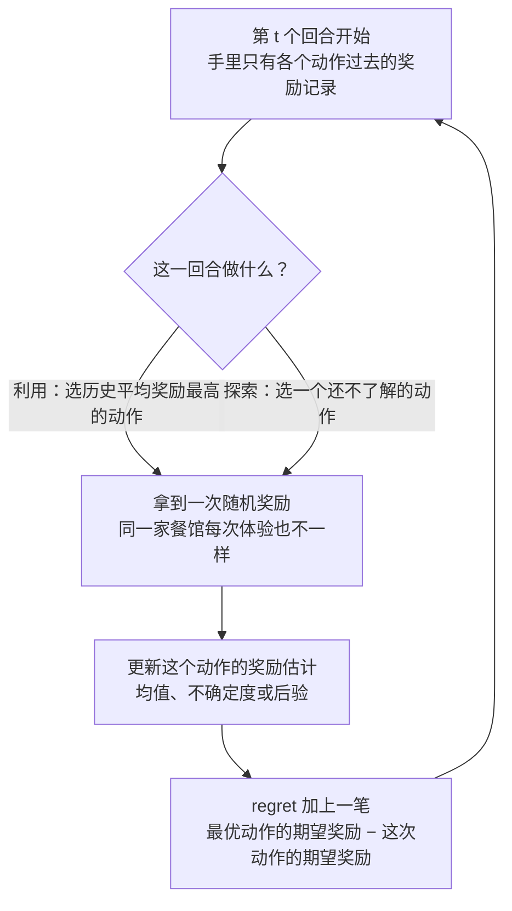
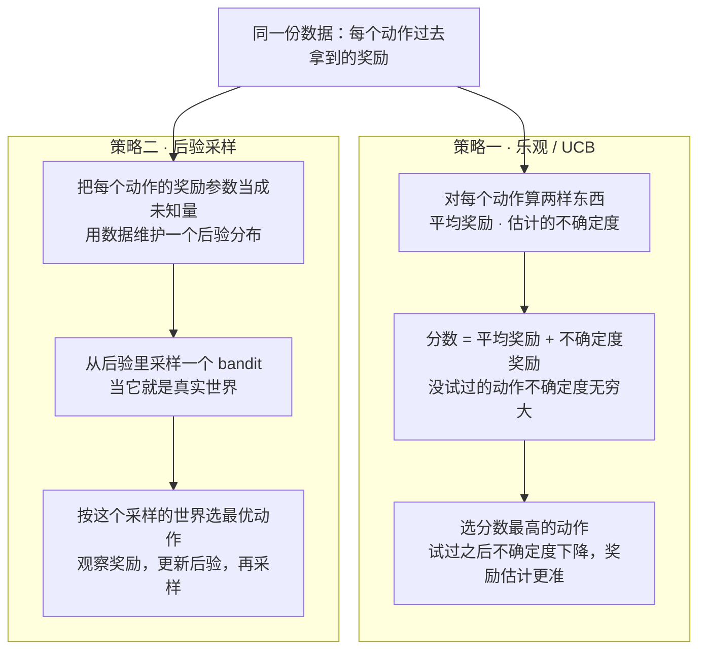
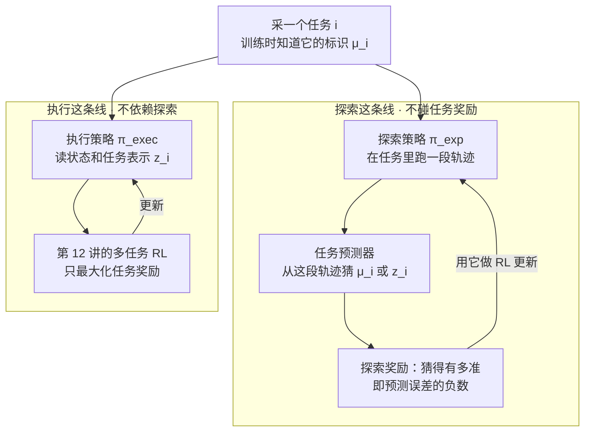
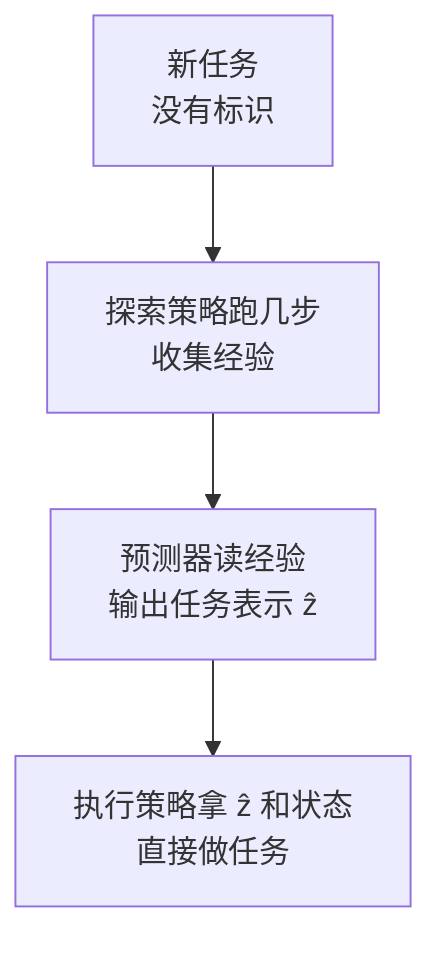
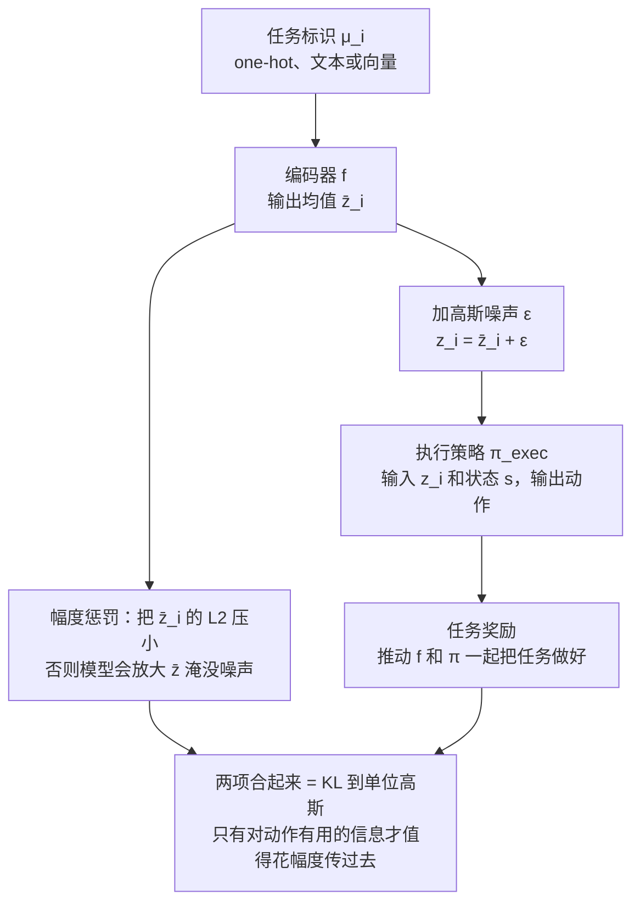
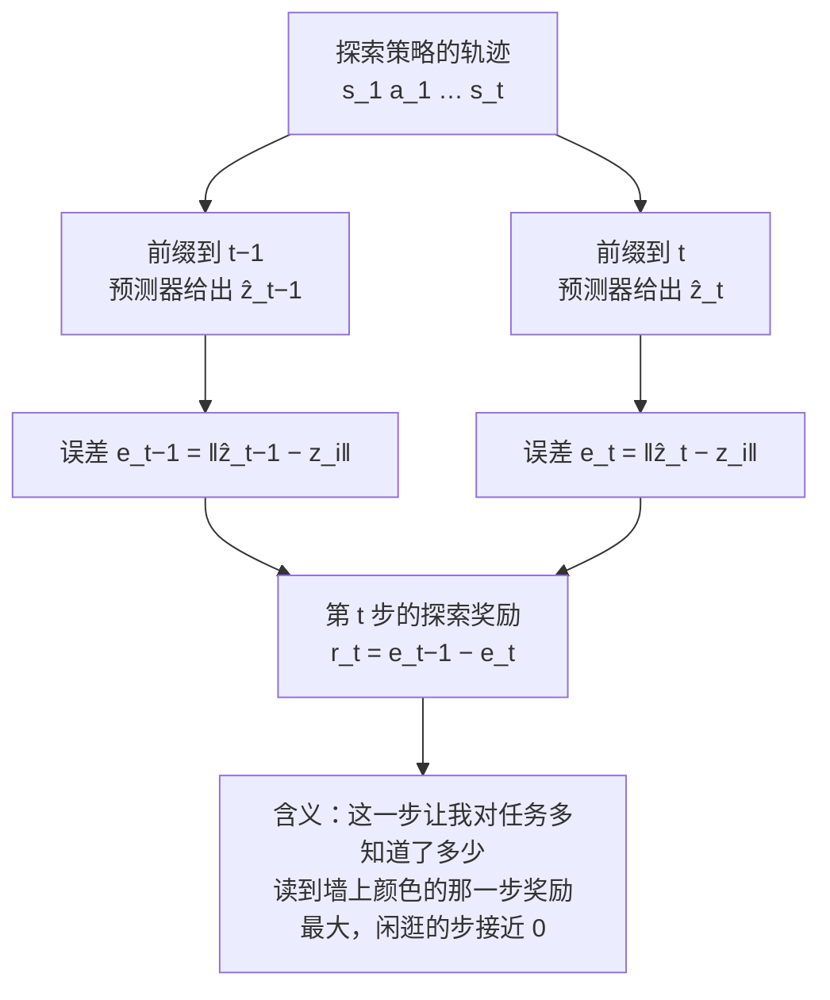

# CS224R 第 14 讲｜探索（Exploration）

> Stanford CS224R: Deep Reinforcement Learning（2025 春）· 第 14 讲，2025 年 5 月 16 日 · 承接第 13 讲的 meta-RL，把那里留下的"怎么学会探索"收尾；作业 4 要实现本讲的 DREAM
> 视频：<https://www.youtube.com/watch?v=4tlSKdi8teU>（1:12:42，英文字幕是自动生成的，游戏名、算法名和记号错得不少，见文末勘误）
> 讲者：Chelsea Finn（本讲不是客座讲座）
> 课程主页：<https://cs224r.stanford.edu/> · 指定阅读：[Decoupling Exploration and Exploitation for Meta-Reinforcement Learning without Sacrifices](https://arxiv.org/abs/2008.02790)（DREAM，Liu et al., ICML 2021）

**一句话**：探索（exploration）是 RL 里"要不要去试没做过的事"的问题。Breakout 随手乱按也能撞到分数，Montezuma's Revenge 的奖励是一串稀疏事件，从零探索几乎不可能。本讲先在最简单的 bandit（单步、无状态、奖励随机）里把问题说清：用 regret 衡量探索好坏，"对不确定的动作保持乐观"（UCB）和"从后验里采一个世界再行动"（后验采样）是两种能分析或有实效的策略，课堂选药游戏里后验采样远胜 greedy 和 ε-greedy。到了机器人和 LLM 这种大 MDP，讲者的态度很直接：从零探索基本不可行，实际靠示范或预训练基座模型做初始化，再加塑形奖励。但即便有先验，部署时仍要探索（厨房里找食材、推理时试不同思路），这正是第 13 讲 meta-RL 留下的鸡生蛋难题：端到端同时学探索和利用，两边互相等对方先学会。DREAM 的解法是解耦——执行策略拿着任务标识做普通的多任务 RL，探索策略只负责收集"能猜出这是哪个任务"的经验，奖励是逐步的信息增益；再用变分信息瓶颈把任务标识压成只含任务相关信息的表示 z，探索就不会去看墙上的画。它能恢复最优探索，样本复杂度从 A² log A 降到 A log A，还被用来替助教给学生的程序找 bug。

## 时间轴

| 时间 | 内容 |
|---|---|
| [0:06](https://www.youtube.com/watch?v=4tlSKdi8teU&t=6s) | 开场：今天三段——bandit 里的探索、大 MDP（机器人 / LLM）怎么办、回到 meta-RL 学会探索 |
| [0:37](https://www.youtube.com/watch?v=4tlSKdi8teU&t=37s) | Breakout vs Montezuma's Revenge：奖励稀疏、事件链长、agent 不懂精灵的含义；Mao 牌的比方 |
| [4:15](https://www.youtube.com/watch?v=4tlSKdi8teU&t=255s) | 探索问题的两种看法；探索 vs 利用；餐馆、广告投放、钻井三个例子 |
| [6:49](https://www.youtube.com/watch?v=4tlSKdi8teU&t=409s) | 什么叫"最优的探索"：从多臂 bandit 到大 MDP 的难度谱；bandit 的定义 |
| [9:53](https://www.youtube.com/watch?v=4tlSKdi8teU&t=593s) | Regret：定义、oracle 上界、三种曲线；问答：期望、为什么线性、为什么只能用于分析 |
| [19:46](https://www.youtube.com/watch?v=4tlSKdi8teU&t=1186s) | 策略一：面对不确定保持乐观（UCB）；策略二：后验采样；工业界的推荐与广告 |
| [25:22](https://www.youtube.com/watch?v=4tlSKdi8teU&t=1522s) | 课堂游戏：10 种药、5000 个病人；greedy / ε-greedy / UCB / 后验采样的对比；问答：ε 的调度 |
| [32:10](https://www.youtube.com/watch?v=4tlSKdi8teU&t=1930s) | 大 MDP 怎么办：讲者的悲观看法；从零探索不可行，靠示范、基座模型和塑形奖励 |
| [35:45](https://www.youtube.com/watch?v=4tlSKdi8teU&t=2145s) | 即便有先验也要 test-time 探索：厨房找食材、LLM 推理；回顾 meta-RL 的鸡生蛋问题 |
| [38:18](https://www.youtube.com/watch?v=4tlSKdi8teU&t=2298s) | 替代策略：先学动力学 / 奖励模型再去探索；干扰物问题 |
| [39:49](https://www.youtube.com/watch?v=4tlSKdi8teU&t=2389s) | 不学模型：用任务标识 μ 解耦；探索策略 + 任务预测器，执行策略只做多任务 RL；meta-test 三步 |
| [44:54](https://www.youtube.com/watch?v=4tlSKdi8teU&t=2694s) | 泛化：压缩的任务表示 z；变分信息瓶颈——加噪 + 幅度惩罚等于 KL；问答：one-hot 为什么反而不压缩 |
| [52:37](https://www.youtube.com/watch?v=4tlSKdi8teU&t=3157s) | 执行目标的完整写法：编码器 f、执行策略 π、KL 正则；问答：何时可以省掉瓶颈、为什么输出分布 |
| [1:00:24](https://www.youtube.com/watch?v=4tlSKdi8teU&t=3624s) | 探索奖励：末端预测误差太稀疏，改成逐步的信息增益 |
| [1:04:30](https://www.youtube.com/watch?v=4tlSKdi8teU&t=3870s) | DREAM：命名、作业 4；理论：最优性与 A log A 对 A² log A；读墙上颜色的实验；小结 |
| [1:09:38](https://www.youtube.com/watch?v=4tlSKdi8teU&t=4178s) | 应用：用 DREAM 给学生的 Bounce / Breakout 程序找 bug；CS106A 2023 春：批改快 44%、准 6% |

## 核心内容

### 1. 为什么探索难：Montezuma's Revenge 与 Mao 牌

- **开场安排**：三段——先在 bandit 里讲探索（最简单、能分析）；再看这些想法能不能搬到机器人和 LLM 的大 MDP；最后回到第 13 讲的 meta-RL，讲怎么"学会探索"。
- **两个 Atari 游戏的对比**：训练一个 RL agent 玩 Breakout，奖励就是得分，能得到很强的玩家；换成 Montezuma's Revenge，RL 系统就很难玩好。差别在于第二个游戏的奖励是稀疏的离散事件：拿钥匙有用、开门有用、要躲滚动的骷髅、别掉下平台——人一眼看懂这些精灵的含义，agent 什么都不知道；通关只和这些事件弱相关，事件之间又相隔很远，一开始 agent 完全拿不到任何奖励，连"走到钥匙那里"都要一长串动作。
    > 小注：Breakout / Montezuma's Revenge 这对例子几乎是探索文献的标配。课上只带过一句"给新状态、新动作发奖励 bonus"的研究路线，代表作是用伪计数（pseudo-count）当 bonus 的 count-based exploration（[Bellemare et al., 2016](https://arxiv.org/abs/1606.01868)）和用随机网络的预测误差当 bonus 的 RND（[Burda et al., 2018](https://arxiv.org/abs/1810.12894)）；预测误差类 bonus 有一个著名的失效模式叫 noisy TV：一台随机换台的电视永远"新奇"，agent 会站在那里看个不停。本讲没有展开这些。
- **Mao 牌的比方**：一种"半是游戏半是玩笑"的纸牌游戏——事先不告诉你规则，犯规就罚，罚了也不告诉你为什么，规则未必讲道理，只能靠试错把规则摸出来。RL 算法面对 Montezuma's Revenge 就是这个处境：不知道规则，不知道什么好什么坏，不知道自己能做什么；任务越长，要摸索的动作序列就越长。讲者的极端版本：想象你的人生目标是赢 50 局 Mao，而且这个目标本身也没人告诉你，只能从赢局的奖励和输局的罚分里慢慢体会——稀疏奖励下的 RL 就是这么难。

### 2. 探索与利用：同一个目标下的两股力

- **两种看问题的角度**：一是"发现高奖励的策略"——单个动作可能都不给奖励，串起来才有；二是"决定试新的还是继续做已知最好的"。后者把问题拆成一对：**利用（exploitation）**——做已知能拿高奖励的事，比如按当前的 Q 函数选动作（第 6 讲：Q(s, a) 是在状态 s 做动作 a 之后预计能拿到的总回报）；**探索（exploration）**——做没做过的事，指望找到更高的奖励。目标是长期总奖励最大，两者必须平衡。
- **三个例子**：搬到新城市，探索是试新餐馆，利用是去最喜欢的那家；广告投放（RL 一个非常常见的用途）——利用是放历史上最成功的广告，探索是随机换一条；石油钻探——利用是在出过油的地方接着钻，探索是换个新地点。
- **"最优的探索"是什么意思**：取决于问题多复杂。讲者画了一条难度谱：多臂 bandit（一步、无状态）→ 上下文 bandit（每一步带特征）→ 小 MDP → 大 MDP。左端可以严格分析一个策略是否最优；右端——本课大部分时候面对的、没有已知结构的大 MDP——不但分析不可行，连设计能保证探索得好的算法都不可行。

### 3. Bandit：把探索问题剥到最简

- **定义**：bandit 是 RL 的一种极简形式（名字来自"独臂强盗"老虎机，讲者特意说不是抢东西的那种强盗）：每个 episode 只有一步（horizon 为 1），没有状态，而且——和本课之前所有 MDP 不同——奖励是随机的。选餐馆就是 bandit：每次选一家（一条"臂"），体验好坏有随机性，下一次再根据过去的经验决定选熟悉的还是没去过的。
- **为什么值得单独讲**：它足够简单，能定义并分析"探索得好不好"；同时它在工业界（推荐系统、广告位）被大量使用——很多实际问题确实没有长 episode、没有状态。

### 4. Regret：衡量探索好坏的尺子

*图 14-1｜bandit 的回合循环：每一回合都在"利用"和"探索"之间二选一，代价记在 regret 上（自绘示意）· [▶ 看原幻灯片 8:21](https://www.youtube.com/watch?v=4tlSKdi8teU&t=501s)*

- **换一种记账方式**：之前的课看的是每个 episode 的回报，有时取平均；bandit 里关心的是整个学习过程的最优性——先探索、后利用，总账算下来离最好能拿到的差多少。
- 假设已经跑了 T 个 episode。事后看，最好的情况是每一回合都选期望奖励最高的动作 a*，总共拿到 T · E[r(a*)]。这是一个 oracle 的上界：第一回合你对问题一无所知，只能随机选，真实算法做不到它。把它减去实际拿到的奖励之和，就是 regret（"后悔值"）。

$$
\mathrm{Regret}(T)=T\cdot\mathbb{E}\big[r(a^{*})\big]-\sum_{t=1}^{T} r(a_t)
$$

a* 是期望奖励最高的动作（只有 oracle 才知道是哪个），T 是已经跑过的回合数，r(a_t) 是第 t 回合实际选的动作 a_t 拿到的奖励；前一项是"事后看最多能拿多少"，后一项是"实际拿了多少"，差值越小越好。

- **三种 regret 曲线**（横轴是 episode 数；bandit 里每个 episode 只有一步，所以也就是时间）：
    - 一直选最优动作：regret 恒为 0（期望意义下；有随机性时会有小波动）。
    - 一直选同一个次优动作，或者纯随机：期望意义下每回合都多付一笔固定的差价，regret 线性增长——**线性 regret 意味着算法根本没有从探索里学到东西**。
    - 聪明的算法：开头像线性（在探索、在收集信息），之后拐平（进入利用阶段）——这叫次线性（sublinear）regret。
- **问答**
    - 曲线是多次运行取平均吗？——图上每条是一次运行，画得很光滑；实际会有噪声，比如某一步运气差就往上跳一下。对多次运行取期望才是平滑的那条。
    - 一直选 A1 的话怎么算这个公式？——**算不了**。regret 需要知道最优动作的期望奖励，也就是知道 bandit 的真相，所以它是分析工具，不是训练目标；我们想要的是让它拐平，但不能直接对它做优化。
    - 它一定单调吗？——取期望后单调；单次运行里奖励是随机的（比如最优动作 90% 的时候给高奖励），实际拿到一次好奖励时曲线反而会往下走一点。
- **在 bandit 上很多简单策略可以证明最优或给出 regret 界**——讲者也提醒：有理论保证的算法，实际表现照样会因问题而异。
    > 小注：UCB1 在多臂 bandit 上的 regret 是 O(log T) 量级（Auer et al., 2002），log 曲线画出来正是"先陡后平"，这就是"次线性"的直观含义。

### 5. 两种 bandit 策略：乐观（UCB）与后验采样

*图 14-2｜同一份数据的两种用法：UCB 给不确定的动作加 bonus，后验采样从可能的世界里抽一个照着做（自绘示意）· [▶ 看原幻灯片 20:47](https://www.youtube.com/watch?v=4tlSKdi8teU&t=1247s)*

- **策略一：面对不确定保持乐观**。对每个动作记录过去奖励的平均值；纯利用就是选平均值最高的。为了鼓励去试新的，再加一项和"奖励估计的方差"成比例的 bonus：越不确定的动作分数越高。直觉是"没见过的东西先假设它好"；试过发现差，方差和均值估计都会掉下来，以后自然不选它。这类算法叫 **UCB（upper confidence bound，置信上界）**，可以推出 regret 保证。
    - 问答：没试过的动作方差是多少？——可以当成无穷大，所以算法会先把每个动作至少试一遍，之后不确定度随数据增多而下降。

$$
a_t=\arg\max_{a}\Big[\hat{\mu}_a+c\cdot\hat{\sigma}_a\Big]
$$

μ̂_a 是动作 a 过去奖励的平均值，σ̂_a 是这个平均值的不确定度（讲者说成"奖励估计的方差"），c 决定乐观到什么程度；没试过的动作 σ̂_a 视为无穷大，所以每个动作至少会被试一次。

> 小注：UCB1 的具体 bonus 是 √(2 ln t / N_a)，N_a 是动作 a 被选过的次数（Auer et al., 2002）。"置信上界"的意思就是用"均值加置信区间上沿"去排序。

- **策略二：后验采样（posterior sampling）**。第 13 讲末尾见过它。把每个动作的奖励分布看成参数未知的东西——这其实定义了一个部分可观测的 MDP（POMDP：agent 看不到环境的全部状态，这里看不到的是奖励函数的参数）；用已有数据维护对参数的后验分布，每回合从后验里采样出一个"可能的 bandit"，假设它就是真的，选它下面最优的动作；看到奖励后更新后验，再采样，循环往复。它比 UCB 难给理论保证，但实践里常常很好。

$$
\theta\sim p(\theta\mid\mathcal{D}_{t}),\qquad a_t=\arg\max_{a}\ \mathbb{E}\big[r\mid a,\theta\big]
$$

θ 是各个动作奖励分布的未知参数，D_t 是到目前为止的全部观测，p(θ | D_t) 是后验；每回合先抽一个"世界"θ，再选这个世界里期望奖励最高的动作。

> 小注：这就是 Thompson sampling（Thompson, 1933）。第 13 讲说的"用后验采样解决 meta-RL 的探索"是它从 bandit 推广到 MDP 的版本：采的不是一组奖励参数，而是一整个 MDP。

### 6. 课堂游戏：给 5000 个病人选药

- **设定**：你是某研究医院药物研发的负责人，瘟疫来了，手上有大约 10 种药、约 5000 个病人，每个病人只能开一种药，结果是活或死。目标是累计救活最多的人——既要救眼前的人，又要为将来积累关于每种药的信息。这就是一个 bandit：每种药一条臂，疗效未知。
- **全班玩了一局**：先随意试了 1、4、10、7、6、5 号药，10、6、5 出现死亡；7 号连活几次后大家开始"利用"它，直到它也出现死亡；又试了 8、9、1、4、3；9 号连续救活，最后大家决定一直开 9 号。揭晓真实疗效：9 号确实最好，7 号也不错——全班找到了最优臂。
- **和算法比**：以"救活人数"和"regret"两张图对比四种算法——greedy（只选目前看起来最好的）随病人数增多越来越差；ε-greedy（第 6 讲：以概率 ε 随机选、否则贪心）早期比 UCB 好、后期反被 UCB 超过，因为 UCB 更舍得探索，长期能选到更优的动作；后验采样一骑绝尘。全班的曲线甚至比所有算法都好——讲者说这只是一次运行，有运气成分。
- **问答**：后验采样赢在哪，有数学解释吗？——这个具体问题也许能分析，但一般情况下很难给它通用的理论保证。ε-greedy 的问题很大程度在 ε 这个超参数：通常要随时间衰减；如果 ε 固定，到了后期你已经很了解各种药了，还以固定概率给病人开随机药，代价很大。

### 7. 大 MDP 里的探索：讲者的悲观看法与实际做法

- **能不能把这些搬到机器人和 LLM**：各家看法不一，讲者自称偏悲观。研究上确实有很多尝试：估计某个状态或动作是否见过，给新状态、新动作发"新奇度"bonus；或者仿照后验采样，对动力学建模再据此行动。但到了很大的 MDP，从零开始探索基本上是不可行的——
    - 随机初始化一个 Transformer 语言模型，只用"用户点赞"这类奖励从零训练，不可能成功：token 序列的空间太大，用户的耐心太少。
    - 机器人从零学倒水，只会在那里随机挥手臂，做不出任何有用的事。
- **实际的探索长什么样**：重度依赖**示范**（第 2 讲的模仿学习）或**在数据和示范上预训练的基座模型**。RL 在 LLM 上成功，很大程度是因为基座模型已经会写通顺的句子、大致知道怎么处理一类 prompt（第 9、10 讲）；机器人若有达成高奖励的示范，以它为起点做 RL 威力很大。这些初始化本质上是把模型偏置到状态空间里"可能有奖励"的那一片——一位学生的总结，讲者认可：就是在告诉模型"这些是我想让你做的那类事"。
- **另一件能做就做的事：塑形奖励（shaped reward）**——用稠密奖励替代稀疏奖励来引导探索。仿真里可以手写；从偏好学出来的单步奖励（第 8 讲）本身也相当稠密。这些可以和示范、基座模型组合使用。
    > 小注：这一段和 CS329A 第 2 讲、CME295 第 5 讲说的是同一件事：LLM 的 RL 之所以"探索"得动，全靠预训练分布本身就把好答案放在采样可及的范围里，所以那边把探索落实为采样多样性（temperature、重复采样），而不是从零发现。

### 8. 即便有先验也要在 test-time 探索：回到 meta-RL 的鸡生蛋问题

- **问题没有消失**：就算有一个训好的、会很多事的策略，部署时仍可能缺少拿高奖励所需的信息，必须在测试时探索。第 13 讲的两个例子：厨房里做饭得先开抽屉、开柜子找食材；LLM 做推理题得试不同的解题思路，而不是直接往下写自以为对的 token（CS329A 第 2 讲的采样多样性、第 13 讲"test-time compute 就是 meta-RL"说的是同一件事）。
- **meta-RL 的答案与它的病**：把策略做成带记忆（历史）的模型，记忆让它能"先试、记住、再利用"——这就是第 13 讲的黑箱 meta-RL（RL²）。但如果用一个端到端目标同时优化探索和利用，会撞上**鸡生蛋问题**：还没学会探索，就找不到食材、拿不到奖励；还没学会做任务，任何探索行为也换不来奖励。两边互相等对方先学会，学习信号只在两件事同时做对时才出现——这叫耦合（coupling）问题。
- 第 13 讲还讲了几种更容易优化、但会牺牲最优性的替代探索策略（后验采样是其一）。**本讲要给的方法要两头都占**：既能得到最优的探索—利用权衡，又容易训练。它建立在最后一种替代策略之上，所以先回顾那个。

### 9. 替代策略：学一个模型再探索，以及它的干扰物问题

- **做法**：对每个环境 / 任务拟合一个动力学模型和一个奖励模型（第 11 讲 model-based 的思路），然后让探索策略去做"能让我对环境模型更了解"的事——探索目标就和执行任务解耦了。在"导航到不同圆圈"的一族 MDP 里，这样训出来的探索轨迹（幻灯片上的紫色轨迹）会专门去访问能暴露奖励函数位置的状态。
- **好处与坏处**：能学到高效的探索策略；但在某些场景下会次优——**干扰物**（distractor）问题：如果墙上挂着画，为了把每个环境的模型学准，它会把所有的画都看一遍，而这对任务毫无用处。
- **本讲的目标**：沿着"探索目标与执行解耦"的思路，但不学模型，也不去关心任务无关的信息。

### 10. DREAM 的核心一步：用任务标识把探索和执行解耦

*图 14-3｜DREAM 训练时的两条线：探索策略只为"猜出任务"而学，执行策略拿着任务标识只为"做好任务"而学，互不等待（自绘示意）· [▶ 看原幻灯片 40:50](https://www.youtube.com/watch?v=4tlSKdi8teU&t=2450s) · 出处：[Liu et al., 2021](https://arxiv.org/abs/2008.02790)*

- **把"预测环境"换成"预测任务"**：给每个任务贴一个标识 μ_i——可以是 one-hot 编号、一句语言描述，或者一个连续向量。探索的目标改成：收集能让我猜出"现在是哪个任务"的经验。
- **两条独立的训练线**（讲者说实践中两个策略可以合成一个，但分开想更清楚）：
    1. **探索线**：探索策略 π_exp 在任务里跑出一段经验；另训一个任务预测器，从这段经验预测 μ_i。探索策略的奖励就是预测器猜得多准（负的预测误差）。这个目标和"把任务做好"完全无关。
    2. **执行线**：执行策略 π_exec 直接拿任务标识当输入，只优化任务奖励——这就是第 12 讲的多任务 RL，它不依赖探索好不好。
- 耦合于是被拆开：执行不等探索，探索不等执行。
- **问答**
    - 哪部分是探索？——探索策略本身；预测器只是给它提供奖励。
    - 和第 13 讲的黑箱 meta-RL 差在哪？——仍然是采样不同 MDP 来训练；差别有两点：探索的目标函数换了；执行策略被喂了任务标识，所以学做任务时不需要一个好的探索策略。
    - 能泛化到没见过的任务吗？——one-hot 标识会有困难，第 11 节解决。

*图 14-4｜meta-test 三步：先探索、再识别任务、再利用（自绘示意）· [▶ 看原幻灯片 43:23](https://www.youtube.com/watch?v=4tlSKdi8teU&t=2603s) · 出处：[Liu et al., 2021](https://arxiv.org/abs/2008.02790)*

- **meta-test 时怎么用**：新任务来了，先跑探索策略收集经验 → 把经验喂给任务预测器得到任务表示 → 把它喂给执行策略去做任务。全程不用建模动力学或奖励。

### 11. 让它泛化：压缩的任务表示与变分信息瓶颈

*图 14-5｜变分信息瓶颈：加噪声让信息可以丢，幅度惩罚让模型不能靠放大幅度作弊，两者合起来就是一个 KL 项（自绘示意）· [▶ 看原幻灯片 47:28](https://www.youtube.com/watch?v=4tlSKdi8teU&t=2848s) · 出处：[Alemi et al., 2017](https://arxiv.org/abs/1612.00410)（课上没点名，推断）*

- **one-hot 的问题**：新任务未必能对上旧的某个编号；而且 one-hot 其实比连续表示**更不压缩**——四个目标位置的任务里，任务 1 和任务 4 的目标挨得很近，one-hot 却把它们当成毫不相干的两个，学出来的连续表示会把它们放得很近。此外标识里常混着任务无关的东西（墙的颜色、装饰），只有"食材在哪"才要紧；两个厨房食材位置相同、其他不同，本该算同一个任务。
- **办法**：不直接预测 μ_i，先把它编码成一个压缩的潜在任务表示 z_i，把任务无关的信息"瓶颈"掉；探索线改为预测 z_i。
- **怎么在神经网络里压缩信息**（讲者先板书讲原理）：
    1. 编码器把 μ_i 映射成 z_i，执行策略读 z_i 和状态输出动作。端到端训练不会自发丢信息。
    2. 给 z_i 加高斯噪声。加噪确实会丢信息，但只在测试时加会把有用的信息也丢掉；训练时也加噪，模型会学会把 z_i 的幅度放大，让噪声相对变小——照样能把所有信息塞过去。
    3. 所以再加一项损失，惩罚 z_i 的幅度（L2）。幅度被压住之后，模型只会把对预测动作真正有用的信息"花幅度"传过去，其余的自然被噪声淹没。
    - 这套"加噪 + 幅度惩罚"就是**变分信息瓶颈（variational information bottleneck）**：把 z̄_i + ε 看成一个均值 z̄_i、方差固定的高斯分布，两项合起来等价于最小化它到单位高斯的 KL 散度（衡量两个分布差多远的量，CME295 第 5 讲 / 本课第 9 讲用过）。
- **执行线的完整目标**：两个带参数的网络——编码器 f 把 μ_i 映射成 z 的分布，执行策略 π_exec 读 z 和状态输出动作——一起最大化任务奖励，同时最小化 KL 正则。z 是一个向量（有学生问）。

$$
\max_{\pi_{\mathrm{exec}},\,f}\;\;\mathbb{E}_{z\sim f(\cdot\mid\mu_i),\;\tau\sim\pi_{\mathrm{exec}}(\cdot\mid z)}\Big[\sum_{t} r_i(s_t,a_t)\Big]\;-\;\mathrm{KL}\big(f(z\mid\mu_i)\,\big\|\,\mathcal{N}(0,I)\big)
$$

f(z | μ_i) 是均值为 z̄_i、方差固定的高斯分布（也就是"z̄_i 加噪声"），τ 是执行策略在任务 i 里跑出的轨迹，r_i 是任务 i 的奖励；第一项要求 z 足以把任务做好，第二项要求 z 别带多余信息。课上板书没写 KL 项的权重，实现里它是一个超参数。

$$
\mathrm{KL}\big(\mathcal{N}(\bar z,\sigma^{2}I)\,\big\|\,\mathcal{N}(0,I)\big)=\tfrac{1}{2}\sum_{j}\Big(\bar z_{j}^{2}+\sigma^{2}-1-\log\sigma^{2}\Big)
$$

σ 固定时括号里只有 z̄_j² 随参数变，所以这个 KL 就是 z̄ 的 L2 惩罚加一个常数——讲者说"加噪声 + 幅度惩罚等价于 KL"，指的就是这个等式（课上没有展开，这是高斯 KL 的标准结果）。

- **问答**
    - ε 要进 loss 吗？——不用。训练时每次前向都重新采一个 ε 加上去，它的影响已经通过 KL 那一项体现了。
    - 为什么要加 KL 项？——不加的话 z 会保留任务无关的信息，探索策略就会跑去探索那些无关的东西（墙的颜色）。
    - 训练时给了任务标识，测试时怎么办？——测试时不需要 μ_i：探索策略跑完，预测的是 z_i 而不是 μ_i，直接喂给执行策略。
    - 能不能让执行策略自己学会只看相关部分？——如果任务表示本来就干净，可以跳过瓶颈这一步：比如任务是"左转 / 右转 / 前进"这样的文本，或者目标坐标——相似的任务表示本来就相近。只有 one-hot 这类不含结构的标识才需要压缩；讲者说这是目前鼓励"只看相关部分"的较好的数学框架之一。
    - 为什么要输出分布而不是一个向量？——随机性正是能丢信息的原因；确定性的连续向量哪怕只有一维也能编码无穷多信息，压维度只是启发式，控制不了信息量。

### 12. 探索策略的奖励：逐步的信息增益

*图 14-6｜探索奖励怎么算：同一个预测器看两段前缀，误差降了多少就是这一步的信息增益（自绘示意）· [▶ 看原幻灯片 1:02:57](https://www.youtube.com/watch?v=4tlSKdi8teU&t=3777s) · 出处：[Liu et al., 2021](https://arxiv.org/abs/2008.02790)*

- **目标**：让探索策略收集"能预测 z"的数据。两条线可以同时训。
- **最直接的奖励**：轨迹结束时看预测器对 z 猜得多准，奖励是负的预测误差，其余时刻为 0。问题是太稀疏——只有最后一步有信号，和第 1 节的 Montezuma's Revenge 一个毛病。
- **更稠密的写法**：每一步都问"这一步让我对任务多知道了多少"。用预测器分别看轨迹到 t−1 步和到 t 步的前缀，两次预测误差之差就是这一步的信息增益，作为第 t 步的奖励。误差应随时间下降：读到墙上颜色的那一步奖励最大，闲逛的步奖励接近 0。

$$
r^{\mathrm{exp}}_{t}=\big\|\hat z(\tau_{:t-1})-z_i\big\|^{2}-\big\|\hat z(\tau_{:t})-z_i\big\|^{2}
$$

ẑ(τ_{:t}) 是预测器只看轨迹前 t 步给出的任务表示估计，z_i 是执行线学出的"真值"；前一项减后一项就是"这一步让误差降了多少"，也就是这一步带来的信息增益。课上把误差写成 ẑ 减 z_i，没有明说取平方。

> 小注：DREAM 论文里这个奖励写成预测器对 z 的 log 似然之差（应为 log q(z | τ_{:t}) − log q(z | τ_{:t−1})）；预测器是高斯时，log 似然就是负的平方误差，和课上的写法一致。

### 13. DREAM 的理论、实验与小结

- **名字**：DREAM = Decoupled Reward-free Exploration And execution in Meta-RL（讲者自嘲和很多研究算法一样是硬凑的缩写）。作业 4 要实现它。"reward-free"指探索那条线不用任务奖励。
- **理论**：在相当温和的假设下，能恢复最优的探索与利用。效率上构造一个 bandit 式的问题：有 A 条臂，其中 0 号臂不是普通动作，而是"告诉你哪条臂最优"，最优策略显然是先拉 0 号臂、再拉它告诉你的那条。端到端 meta-learning 学到这个策略需要的样本量约 A² log A，DREAM 只要 A log A（假设：底层用 Q-learning，外层做均匀探索）。图上随臂数增加，DREAM 到达最优的样本数远少于端到端（橙色）。
- **实验**：一族任务——去拿某种颜色的物体，颜色写在一堵墙的另一面。agent 得先绕过墙读颜色，再去对应的物体；奖励稀疏。端到端方法全部"躺平"，学不会探索；第 13 讲那些替代策略理论上能好一点但探索仍次优；DREAM 学会了"先去看牌子，再去找物体"。视频里探索 episode 绕到墙后读牌子，随后直奔蓝色钥匙。
- **问答：探索和利用交错的任务呢？**——这里是"先探索后利用"的设定；有些任务要先找信息、做一个子任务、再找信息。讲者说他们有后续工作把两者合到一个策略里，奖励是"识别任务的奖励 + 任务奖励"，感兴趣可以私下问。
- **小结**：端到端学探索——能得到最优，但探索难时几乎优化不动；替代策略——好优化、有原则，但可能大幅次优、探索低效；解耦——最优且好优化，两头都占。代价是**需要任务标识**：至少要能枚举训练任务、知道当前在哪个任务里，这是它拿到好处的关键前提。

### 14. 应用：让 meta-RL 替助教找学生程序里的 bug

- **场景**：入门编程课上学生写交互式小游戏——code.org 上的 Bounce（像半边 Pong，把球打进球门），Stanford CS106A 的 Breakout。学生程序会有 bug，比如球本该掉下去丢一条命，却从球拍上弹回来。助教批改时得亲自玩游戏才能发现 bug，非常耗时。
- **建模**：每个学生的程序是一个任务，目标是探索并找出其中的 bug，再据此给学生反馈。直接用 DREAM，学到的探索策略像一组测试用例：故意让球打进球门看会发生什么、故意不接球看球落地会怎样、故意把球打到墙上——有个 bug 程序一碰墙就生成一堆球。
- **落地**：2023 年春季 CS106A 的一次实验里，助教用 meta-RL agent 玩游戏的视频预填批改 rubric，自己只做核对：批改快了 44%，准确率高了 6%；助教喜欢用，之后至少又用了一个学期。
    > 小注：这条线应出自 [Giving Feedback on Interactive Student Programs with Meta-Exploration](https://arxiv.org/abs/2211.08802)（Liu et al., NeurIPS 2022 oral）：论文在 70 万多份 code.org 学生程序上把找错准确率做到 94.3%，离人类只差 1.5 个百分点；课上说的 44% / 6% 是 CS106A 的课堂部署数据，论文摘要里没有。

## 关键图表速查（点时间戳跳到原幻灯片）

| 图 | 看什么 | 跳转 | 出处 |
|---|---|---|---|
| Breakout 与 Montezuma's Revenge | 同是 Atari，为什么一个 RL 轻松拿高分、一个几乎学不动：奖励事件稀疏且弱相关 | [0:37](https://www.youtube.com/watch?v=4tlSKdi8teU&t=37s) | — |
| 探索问题的难度谱 | 多臂 bandit → 上下文 bandit → 小 MDP → 大 MDP；越往右越难分析、越难设计算法 | [7:19](https://www.youtube.com/watch?v=4tlSKdi8teU&t=439s) | — |
| Regret 板书与三条曲线 | 公式两项各是什么；恒零、线性、次线性三种形状分别对应什么行为 | [12:00](https://www.youtube.com/watch?v=4tlSKdi8teU&t=720s) | — |
| UCB 与后验采样两页 | UCB 是均值加方差 bonus；后验采样是"采一个 MDP、按它行动、更新、再采" | [20:47](https://www.youtube.com/watch?v=4tlSKdi8teU&t=1247s) | UCB 应出自 Auer et al., 2002 |
| 选药游戏的结果 | 真实疗效（9 号最好）、救活人数、regret：greedy 越来越差，ε-greedy 早好晚差，后验采样最好 | [29:04](https://www.youtube.com/watch?v=4tlSKdi8teU&t=1744s) | — |
| 大 MDP 里探索靠什么 | 示范 / 基座模型做初始化，塑形奖励引导；从零探索不可行 | [33:42](https://www.youtube.com/watch?v=4tlSKdi8teU&t=2022s) | — |
| 学模型再探索的紫色轨迹 | 探索轨迹专门去访问能暴露奖励位置的状态；旁白提到墙上的画会把它带偏 | [38:49](https://www.youtube.com/watch?v=4tlSKdi8teU&t=2329s) | — |
| 解耦训练的两条线 | 探索策略 + 任务预测器一组，执行策略 + 任务标识一组，各自的目标 | [42:23](https://www.youtube.com/watch?v=4tlSKdi8teU&t=2543s) | [DREAM](https://arxiv.org/abs/2008.02790) |
| meta-test 三步 | 探索 → 预测任务 → 执行；不需要动力学或奖励模型 | [43:23](https://www.youtube.com/watch?v=4tlSKdi8teU&t=2603s) | [DREAM](https://arxiv.org/abs/2008.02790) |
| 信息瓶颈板书 | 只加噪为什么会被"放大幅度"绕过；加上 L2 惩罚为什么等于 KL | [49:00](https://www.youtube.com/watch?v=4tlSKdi8teU&t=2940s) | 应为 [Alemi et al., 2017](https://arxiv.org/abs/1612.00410) |
| 执行目标板书 | 编码器 f 与策略 π 一起最大化奖励、减 KL；z 是向量 | [55:11](https://www.youtube.com/watch?v=4tlSKdi8teU&t=3311s) | [DREAM](https://arxiv.org/abs/2008.02790) |
| 探索奖励板书 | 末端误差太稀疏 → 相邻两步误差之差，"每一步的信息增益" | [1:02:57](https://www.youtube.com/watch?v=4tlSKdi8teU&t=3777s) | [DREAM](https://arxiv.org/abs/2008.02790) |
| 样本复杂度与实验曲线 | 随臂数增加 DREAM 与端到端的差距拉大；读墙实验里端到端全部躺平 | [1:06:03](https://www.youtube.com/watch?v=4tlSKdi8teU&t=3963s) | [DREAM](https://arxiv.org/abs/2008.02790) |
| Bounce 找 bug 与批改数据 | 探索策略像测试用例：打进球门、落地、撞墙各看一次；44% 更快、6% 更准 | [1:10:42](https://www.youtube.com/watch?v=4tlSKdi8teU&t=4242s) | 应为 [Liu et al., 2022](https://arxiv.org/abs/2211.08802) |

## 提到的工作

| 名称 | 在本讲里的作用 |
|---|---|
| Breakout / Montezuma's Revenge（Atari） | 开场对比：稠密得分 vs 稀疏事件，探索为什么难 |
| Mao（纸牌游戏） | 比方：规则未知、罚分不解释的试错处境 |
| multi-armed bandit / contextual bandit | 难度谱的左端；本讲分析探索的载体 |
| regret | 衡量"探索加利用"总账的分析量，不是训练目标 |
| UCB（应出自 Auer et al., 2002） | 乐观策略：均值加不确定度 bonus，可推 regret 保证 |
| posterior sampling / Thompson sampling | 采一个可能的世界再按它行动；第 13 讲见过；课堂游戏里最好 |
| greedy / ε-greedy（第 6 讲） | 游戏里的两个基线；ε 需要衰减 |
| novelty / count-based bonus | 讲者一句带过的"大 MDP 探索"研究路线，态度悲观 |
| 示范与模仿学习（第 2 讲）、预训练基座模型（第 9、10 讲） | 大 MDP 里探索的实际来源：初始化把模型偏置到有奖励的区域 |
| 塑形奖励；从偏好学出的单步奖励（第 8 讲） | 引导探索的稠密信号 |
| 黑箱 meta-RL / [RL²](https://arxiv.org/abs/1611.02779)（第 13 讲） | 端到端学探索的代表；鸡生蛋的耦合问题 |
| 学动力学 / 奖励模型的探索目标（第 11、13 讲） | DREAM 建立其上的替代策略；干扰物问题 |
| 多任务 RL（第 12 讲） | DREAM 执行线的训练方式 |
| [Deep Variational Information Bottleneck](https://arxiv.org/abs/1612.00410)（Alemi et al., 2017；推断） | 压缩任务表示的工具：加噪 + L2 = KL |
| Q-learning（第 6 讲） | DREAM 样本复杂度结论的假设之一 |
| [DREAM](https://arxiv.org/abs/2008.02790)（Liu et al., ICML 2021） | 本讲主角；作业 4 |
| 探索与利用合一的后续工作 | 问答里提到，未点名 |
| [Giving Feedback on Interactive Student Programs with Meta-Exploration](https://arxiv.org/abs/2211.08802)（Liu et al., NeurIPS 2022；应为） | 用 DREAM 给学生程序找 bug 的应用 |
| code.org Bounce、CS106A Breakout | 应用里的两个课程环境 |

## 术语对照

| English | 中文 |
|---|---|
| exploration / exploitation | 探索 / 利用：试没做过的事 vs 做已知最好的事 |
| sparse reward | 稀疏奖励：绝大多数时刻没有任何奖励信号 |
| multi-armed bandit | 多臂老虎机：单步、无状态、奖励随机的极简 RL |
| contextual bandit | 上下文老虎机：每一步附带特征（状态）的 bandit |
| arm | 臂：bandit 里的一个动作选项 |
| horizon | 时域：一个 episode 有多少步；bandit 里是 1 |
| stochastic reward | 随机奖励：同一动作每次拿到的奖励不一样 |
| regret | 后悔值：最优动作能拿到的总奖励减实际拿到的 |
| sublinear regret | 次线性 regret：曲线先陡后平，说明探索之后学会了利用 |
| oracle | 全知者：知道问题真相的假想参照 |
| greedy / ε-greedy | 贪心 / ε-贪心：只选当前最好 / 以概率 ε 随机 |
| optimism in the face of uncertainty | 面对不确定保持乐观：没试过的先假设它好 |
| UCB (upper confidence bound) | 置信上界：用均值加置信区间上沿排序动作 |
| posterior sampling / Thompson sampling | 后验采样 / 汤普森采样：从后验抽一个世界，按它选最优动作 |
| posterior | 后验分布：看过数据之后对未知参数的信念 |
| POMDP | 部分可观测 MDP：agent 看不到环境的全部状态 |
| novelty bonus | 新奇度奖励：给没见过的状态或动作额外加分 |
| shaped / dense reward | 塑形 / 稠密奖励：每一步都给信号，引导探索 |
| demonstrations | 示范：人或专家的成功轨迹，做 RL 的起点 |
| base model | 基座模型：预训练好的模型，为 RL 提供初始化 |
| meta-RL | 元强化学习：在一族任务上训练，让新任务少量经验就能上手 |
| meta-training / meta-testing | 元训练 / 元测试：在训练任务上学；在新任务上探索、识别、执行 |
| chicken-and-egg / coupling problem | 鸡生蛋 / 耦合问题：探索与利用互相等对方先学会 |
| decoupling | 解耦：探索和执行各用各的目标 |
| task identifier μ | 任务标识：one-hot、文本或向量，训练时已知 |
| latent task representation z | 潜在任务表示：从 μ 压缩出的、只含任务相关信息的向量 |
| exploration policy / execution policy | 探索策略 / 执行策略 |
| multi-task RL | 多任务 RL：策略带任务描述符，在多个 MDP 上直接最大化奖励 |
| distractor | 干扰物：环境里与任务无关但会吸引探索的东西 |
| (variational) information bottleneck | （变分）信息瓶颈：加噪加惩罚，逼表示只留有用信息 |
| KL divergence | KL 散度：两个分布差多远的量 |
| unit Gaussian | 单位高斯：均值 0、方差 1 的正态分布 |
| L2 penalty | L2 惩罚：压小向量的幅度 |
| prediction error | 预测误差：预测的任务表示离真值多远 |
| information gain | 信息增益：一步之后对任务多知道了多少 |
| reward-free exploration | 无奖励探索：探索目标里不出现任务奖励 |
| sample complexity | 样本复杂度：学到目标行为需要多少样本 |

## 字幕勘误

"Mau / MAU" → Mao（纸牌游戏）；"Montzuma's / Montazuma's" → Montezuma's Revenge；"trade a reinforcement learning agent" → train；"weekly correlates" → weakly；"metalarning / metaarl" → meta-learning / meta-RL；"MVP" → MDP；"kale divergence" → KL divergence；"gausian / gausion" → Gaussian；"keyarning" → Q-learning；"one dot vector" → one-hot vector；"mui" → μ_i；"zbar" → z̄；"sat" → s_t；"exporting" → exploiting；"huristic" → heuristic；"a squ log a" → A² log A；"dream" → DREAM；"intromputer science" → intro computer science；"TAS" → TAs。

## 带走的问题

1. regret 要知道最优动作的期望奖励才能算，所以不能当训练目标。那么 UCB 的 bonus 和后验采样各自把"让 regret 拐平"这件事编码进了哪个量？把 ε 衰减的 ε-greedy 放进同一个框架，它缺了什么？
2. 讲者说大 MDP 里"从零探索不可行，靠基座模型和示范"。这和 CS329A 里 GRPO 训练需要采样多样性、DAPO 用 clip-higher 防止熵塌缩，是同一个探索问题的两面吗？基座模型给的是先验，那 RL 训练过程中的探索还剩什么要做？
3. DREAM 把探索奖励定义为对 z 的信息增益。如果任务标识 μ 本身有噪声（两个学生程序的 bug 相同却被标成不同任务），瓶颈会怎么处理？如果 z 学得不好、保留了墙的颜色，探索策略会怎么"作弊"？
4. DREAM 的前提是训练时知道任务标识。你做的 agent 产品里，"任务"是什么，有没有现成的标识（用户、会话类型、prompt 模板）？如果没有，第 13 讲的 PEARL 式后验推断和 DREAM 各要付出什么？
5. 先探索后利用 vs 交错探索：LLM 的推理（试一条思路 → 验证 → 换思路）更像哪一种？把"信息增益"当作过程奖励（CS329A 的 PRM）放进推理任务里，会奖励什么样的步骤？
