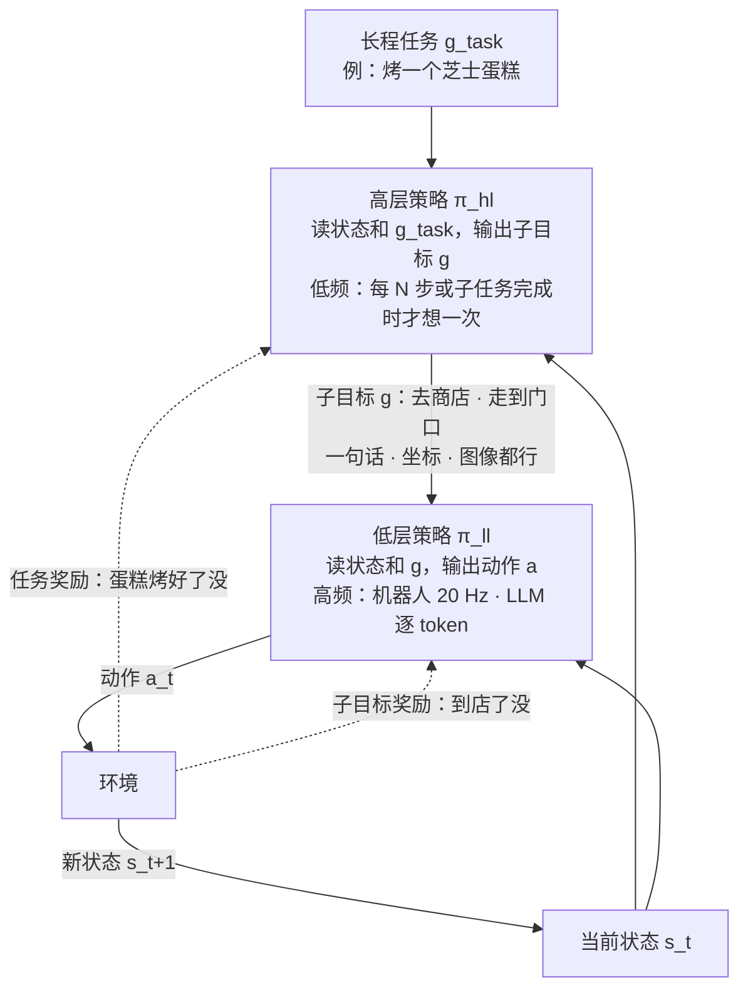
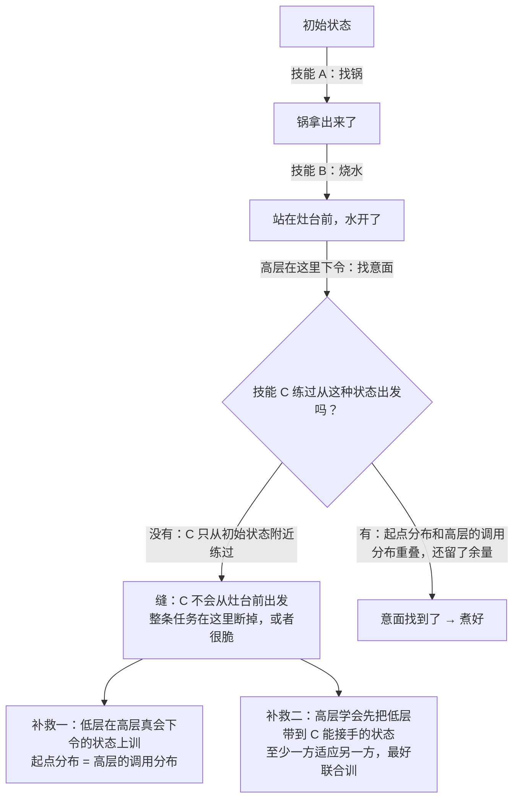
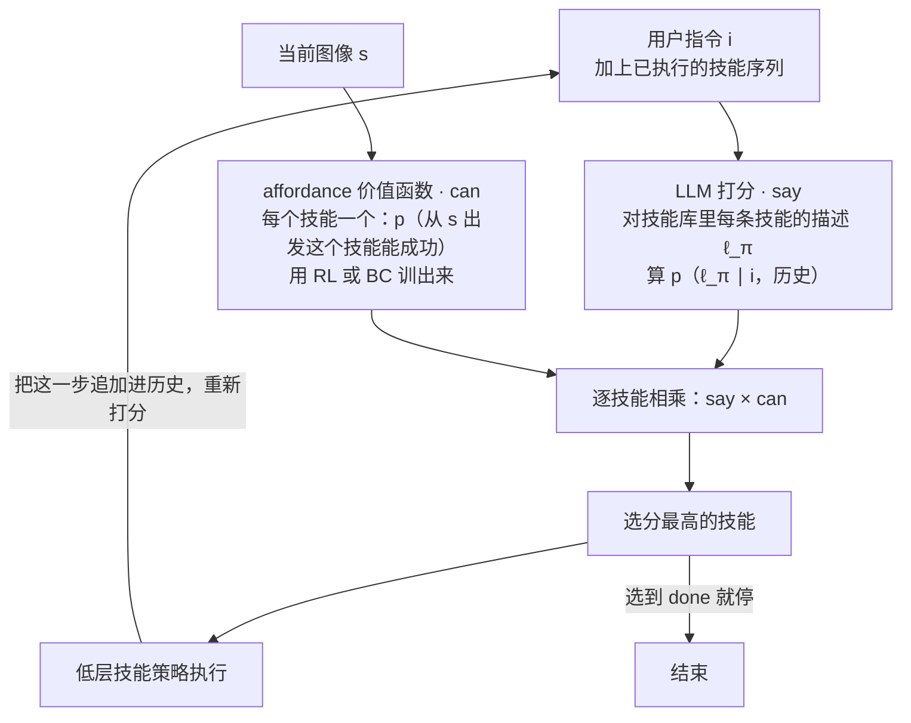
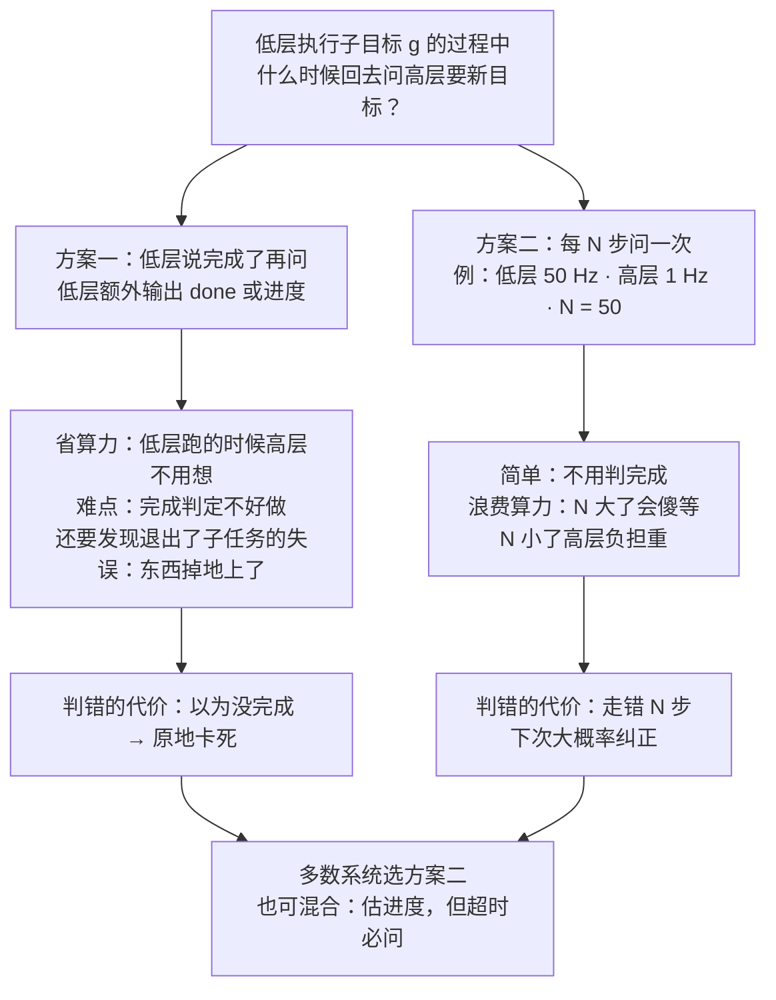
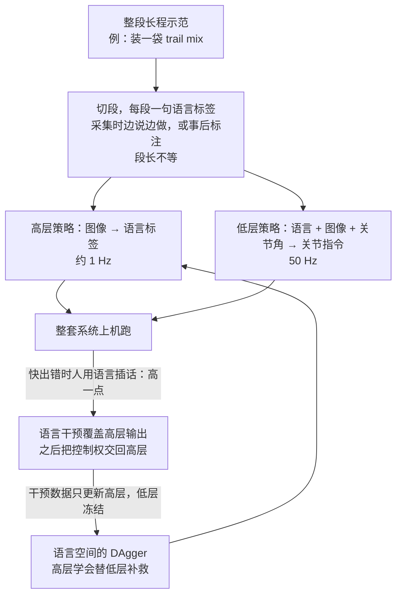
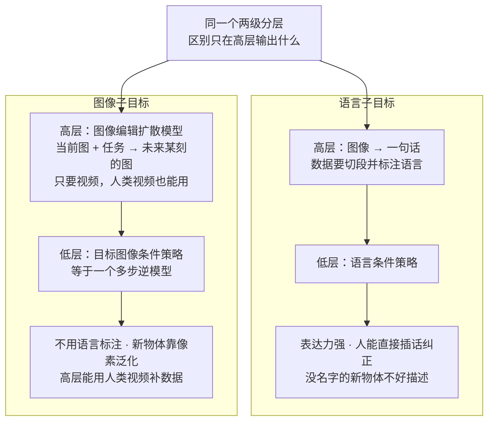

# CS224R 第 15 讲｜分层 RL 与 IL（Hierarchical RL and IL）

> Stanford CS224R: Deep Reinforcement Learning（2025 春）· 第 15 讲，2025 年 5 月 21 日 · 承接第 12 讲的多任务与目标条件策略、第 13 讲的元 RL，把"一个策略会做多件事"推进到"把多件事串成一件长事"；下一讲进入机器人 RL
> 视频：<https://www.youtube.com/watch?v=iKWYLSVAtfM>（1:09:32，英文字幕是自动生成的，hierarchical、DAgger、relabeling、Yosemite 这类词几乎都错，见文末勘误）
> 讲者：Chelsea Finn（课程主讲，不是客座讲座）
> 课程主页：<https://cs224r.stanford.edu/> · 指定阅读：[Do As I Can, Not As I Say: Grounding Language in Robotic Affordances](https://arxiv.org/abs/2204.01691)（SayCan，Ahn et al., 2022；课上没有点名，只在 38:10 用"机器人站在咖啡机前"的例子讲了它要解决的问题，第 6 节按论文补上机制）

**一句话**：长程任务（做一顿饭、修一个让训练 loss 爆炸的 bug）难在状态多、容易出错、容易原地卡死。分层把一个策略拆成两层：高层读状态、输出一个子目标（一句话、一个坐标、一张图），低层读状态和子目标、输出动作；低层跑得快，高层隔一阵才想一次。好处不在"多了一个网络"，而在中间监督、跨子任务共享、按目标空间探索和低频推理——端到端训一个隐目标的两层网络，和平的策略没有区别。三个设计选择贯穿全讲：子目标怎么表示（够表达、有结构、层级合适）；每层用什么监督（低层为子目标、高层为总任务，且低层必须在高层真会下令的状态上可用，否则技能之间有"缝"）；什么时候换目标（多数系统每 N 步问一次高层，因为把"完成"判错会卡死）。例子里分层模仿占大头：语言子目标配语言空间的 DAgger，图像子目标配图像编辑扩散模型；分层 RL 用目标状态或语言当高层动作，配 hindsight relabeling；指定阅读 SayCan 是"LLM 当高层"的样板：LLM 说该做什么，价值函数说做不做得成，相乘选技能。

## 时间轴

| 时间 | 内容 |
|---|---|
| [0:05](https://www.youtube.com/watch?v=iKWYLSVAtfM&t=5s) | 回顾多任务与元 RL；今天：把多个子任务的行为串成长程任务 |
| [1:35](https://www.youtube.com/watch?v=iKWYLSVAtfM&t=95s) | 什么叫长程任务；为什么难：状态多、会出错、会卡死 |
| [4:10](https://www.youtube.com/watch?v=iKWYLSVAtfM&t=250s) | 分层的主意：高层出目标、低层出动作；频率不同；芝士蛋糕的逐级分解 |
| [10:20](https://www.youtube.com/watch?v=iKWYLSVAtfM&t=620s) | 分层策略怎么 rollout：计划一个目标 → 反复出动作 → 重新计划 |
| [12:24](https://www.youtube.com/watch?v=iKWYLSVAtfM&t=744s) | 分层为什么有用：中间监督、跨子任务共享、结构化探索、省算力 |
| [16:30](https://www.youtube.com/watch?v=iKWYLSVAtfM&t=990s) | 中间路线：一个策略先"想"子目标再出动作，像 chain of thought |
| [19:37](https://www.youtube.com/watch?v=iKWYLSVAtfM&t=1177s) | 设计选择一：目标怎么表示——四道练习题与三条标准 |
| [25:48](https://www.youtube.com/watch?v=iKWYLSVAtfM&t=1548s) | 设计选择二：每层的监督——煮意面的例子；端到端等于平的策略 |
| [30:59](https://www.youtube.com/watch?v=iKWYLSVAtfM&t=1859s) | 技能之间的缝：低层要在高层会下令的状态上可用；LLM 当高层与 affordance |
| [38:42](https://www.youtube.com/watch?v=iKWYLSVAtfM&t=2322s) | 设计选择三：什么时候换目标——完成判定 vs 固定步数 |
| [44:54](https://www.youtube.com/watch?v=iKWYLSVAtfM&t=2694s) | 近几个月的四个分层机器人系统；chain of thought 也是分层 |
| [46:28](https://www.youtube.com/watch?v=iKWYLSVAtfM&t=2788s) | 分层模仿 · 语言子目标：切段标注、两级架构、语言空间的 DAgger |
| [54:10](https://www.youtube.com/watch?v=iKWYLSVAtfM&t=3250s) | 分层 vs 平策略的对比数字；更长的任务：装袋、收拾卧室 |
| [55:45](https://www.youtube.com/watch?v=iKWYLSVAtfM&t=3345s) | 分层模仿 · 图像子目标：图像编辑扩散模型生成子目标图，人类视频也能用 |
| [59:18](https://www.youtube.com/watch?v=iKWYLSVAtfM&t=3558s) | chain-of-thought 版本；大规模系统仍靠模仿；问答：草图、错误的语言 |
| [1:05:03](https://www.youtube.com/watch?v=iKWYLSVAtfM&t=3903s) | 分层 RL：目标状态与语言目标、hindsight relabeling；无监督技能发现；下一讲预告 |

## 核心内容

### 1. 从"会做多件事"到"把多件事串起来"：长程任务为什么难

- **前情**：第 12 讲把任务描述并进策略输入，一个 π(a | s, z) 做多个任务；第 13 讲的 meta-RL 要从几步经验里推断任务。今天要把多个短任务的行为**串**成一个长程任务。
- **什么叫长程任务**（long-horizon task）：要做很久、由若干子任务按某种顺序组成的任务。讲者的四个例子横跨机器人和 LLM：机器人做一顿饭；LLM agent 修一个让训练 loss 爆炸的 bug；自动驾驶开去 Yosemite；LLM 评审一份长报告。步骤之间有的相互依赖，有的可以并行。
- **为什么难**，三条：
    1. 时间一长，路上要经过的状态就多，每个新状态都得会决策——策略要在宽得多的状态分布上都好用。
    2. 出错的机会多，出了错还得会恢复。
    3. 更阴险的是**卡死**：某种错误让你没有进展、回到同一个状态，确定性的策略就会在那里反复犯同一个错，永远不往前走。

### 2. 分层的主意：高层出目标，低层出动作

*图 15-1｜两级分层：高层低频地给子目标，低层高频地出动作，两层拿的是不同的奖励（自绘示意）· [▶ 看原幻灯片 5:10](https://www.youtube.com/watch?v=iKWYLSVAtfM&t=310s)*

- **两层策略**。多任务策略 π(a | s, g) 已经能按目标 g 做事；那就再放一个策略，专门负责**给它下目标**：
    - **低层策略** π_ll(a | s, g)：读当前状态和一个子目标 g，输出动作。做的是短任务。
    - **高层策略** π_hl(g | s, g_task)：读当前状态（它也得知道自己在哪），可选地再读整个长程任务的描述 g_task（想同时会开去 Yosemite、大峡谷、西雅图，就得有这一项），输出交给低层的子目标 g。

$$
g_t \sim \pi_{\mathrm{hl}}(g \mid s_t,\ g_{\mathrm{task}}),\qquad a_t \sim \pi_{\mathrm{ll}}(a \mid s_t,\ g_t)
$$

s_t 是当前状态，g_task 是整个长程任务的描述，g_t 是高层给低层的子目标，a_t 是真正发给环境的动作。高层的"动作"就是子目标，所以子目标也叫高层动作（high-level action）、技能（skill）、option 或子任务（subtask），本讲混用。

- **为什么拆得开**：直接训一个策略输出电机指令去"烤芝士蛋糕"几乎无从下手；但可以一层层问"第一步是什么"：买原料 → 去商店 → 走到门口 → 迈一步 → 收缩一块肌肉。越往下越小、越好训，小任务训好了再用高层**组合**。层数也可以不止两层：一层管"去商店、买东西、拿回来"，更低的一层管电机。
- **频率不同**。低层按环境的原始节拍走：机器人大概 20 Hz，LLM 逐 token；高层粗得多——写完一段、到了商店，才给下一个目标。
- **怎么 rollout**：先向高层要一个目标（讲者说这一步也可以叫**规划**：往前想下一步该做什么）；然后反复从低层采样动作、执行、观察新状态，目标不变；到某个时刻——子目标完成了，或时间到了，第 7 节专门讨论——回到第一步，按最新状态重新要目标。

### 3. 分层为什么有用，以及"一个策略先想再做"的中间路线

- **四条理由**：
    1. **中间监督**。低层为"达成子目标"训，高层才为"完成长程任务"训——两层目标函数不同，低层拿到的是关于中间步骤的监督信号，引导整个系统往终点走：高层在蛋糕烤好时拿奖励，低层在找到原料、预热好烤箱时拿奖励。
    2. **跨子任务共享**。平的策略（flat policy：不分层，直接从任务和状态出动作）也能靠 shaped reward 拿到中间监督；分层多出来的是低层以子目标为输入，相似的子任务会共享数据、学得更省。
    3. **结构化探索**（RL 专属）。高层提出的目标把探索组织在目标空间里，而不只是在原始动作空间里瞎撞——第 14 讲的探索问题在这里换了一个空间。
    4. **省算力**。做蛋糕要一步步推理，平的策略每个时间步（20 Hz）都得重新推理一遍；分层把推理放在低频的高层。
- **问答**：中间监督为什么帮得上？RL 里只在蛋糕烤好时给奖励太稀疏，没法取得进展；模仿学习里也有好处——策略若不明确"我在做哪一步"（尤其没有历史输入时），会在几个子任务之间来回摇摆。要并行做几件事怎么办？除非低层有十只手，否则总得排顺序；顺序重不重要交给高层学。
- **中间路线**：真的需要两个策略吗？还有一种做法很像 LLM 的 chain of thought：一个策略先推理出该做哪个子目标，再输出低层动作——两层合在一个模型里、按顺序预测。它保留了中间监督的好处，但推理仍要在全频率上跑，没有省算力这条；和真正分层相比孰优孰劣，讲者说实证上还没有结论。
    > 小注：第 10 讲的 RL for LLM reasoning 和 CS329A 里的推理模型，走的就是这条"先想再答"的路——那里的思维链就是写在输出里的子目标序列。

### 4. 设计选择一：子目标怎么表示

- 讲者先让大家做练习：四个问题，各自的中间步骤该是什么、怎么表示？① 学做意大利菜（比如 focaccia）的机器人；② 校园里自动骑行的车，要把导航拆成去各个地点；③ 起草法律文书的 LLM；④ 替用户规划并预订一周假期的 web agent。
- **课堂上的答案**：
    - 骑车：中间目标是通往终点的路标点（waypoints），用 GPS 坐标表示，低层奖励就是离坐标有多近。
    - 订假期：按天拆（订第一天、第二天……），或更粗（订交通、酒店、活动）；讲者补了一条——先弄清用户想要什么样的假期，这个"高层调研"本身也是一个中间目标。
    - 做菜："打蛋""开柜子"这类自然语言字符串；想让面包呈某种样子，也可以给一张图当目标——多模态的目标表示。
- **三条标准**：
    1. **够表达**：要做很多种菜，自然语言这种能描述无数低层行为的表示就合适。
    2. **有结构**：目标若只是"子任务 1""子任务 2"这样的编号，低层看不出它们的关系；GPS 坐标天然有结构——相近的坐标对应相近的动作，低层学起来容易得多。
    3. **抽象层级合适**：骑车的目标太低（"下一秒的精确速度"）等于没拆，太高（"去 quad"）也没把问题拆小。合适的层级常依赖领域。
- **问答·状态也要按层抽象吗**：实践中高层通常也读完整状态，损失不大；真想抽象，可以让 LLM 先把状态总结成高层信息。

### 5. 设计选择二：每层的监督，以及技能之间的"缝"

*图 15-2｜煮意面的"缝"：各训各的技能在状态空间里接不上，长程任务就断在交接处（自绘示意）· [▶ 看原幻灯片 34:01](https://www.youtube.com/watch?v=iKWYLSVAtfM&t=2041s)*

- **煮意面的例子**：状态空间里可以想象几团区域——初始状态、"锅拿出来了"、"水烧开了"、"意面找到了"、"意面煮好了"。低层学"怎么行动才能到达这些区域"，高层学"在某团区域里该发哪条命令"。

$$
J_{\mathrm{ll}}(\pi_{\mathrm{ll}};\,g)=\mathbb{E}\Big[\sum_t r_g(s_t,a_t)\Big],\qquad
J_{\mathrm{hl}}(\pi_{\mathrm{hl}})=\mathbb{E}_{g\sim\pi_{\mathrm{hl}},\ a\sim\pi_{\mathrm{ll}}}\Big[\sum_t r_{\mathrm{task}}(s_t,a_t)\Big]
$$

r_g 是"离子目标 g 有多近"或"到没到"的子目标奖励，r_task 是只在意面煮好时才给的任务奖励；低层按前者训（找锅时只看有没有找到锅），高层按后者训——发出一串子目标让系统最终到达终点。

- **端到端不等于分层**：也可以不要显式的子目标表示，让高层输出一个隐向量（latent goal，就是网络中间的激活），两层只用任务奖励端到端训。讲者提醒：这其实就是**一个平的策略换了种架构**——观察喂了两次的一个大网络。设计这类系统时要想清楚好处从哪来（额外监督？结构化探索？），否则"我希望高层做这个、低层做那个"只是想象，最后和平策略比不出差别。
- **分开训会留下"缝"**（图 15-2）。"找锅"已经训得很稳；再训"找意面"时若不小心，会从初始状态附近出发去训。可高层想要的顺序是"先烧水，再找意面"，那时机器人站在灶台前——低层从没在这种状态下练过"找意面"，串起来就断在这里。模块化训练的通病：各训各的，从不接在一起，最后拼不起来。

$$
\mathbb{E}_{s\sim d^{\pi_{\mathrm{hl}}}(s),\ g\sim\pi_{\mathrm{hl}}(g\mid s)}\Big[\sum_t r_g(s_t,a_t)\Big]
\quad\text{vs.}\quad
\mathbb{E}_{s\sim p_0(s),\ g\sim p(g)}\Big[\sum_t r_g(s_t,a_t)\Big]
$$

d^{π_hl}(s) 是高层真正会在哪些状态下令的分布，π_hl(g | s) 是它在那里会下哪些令；低层该在左边这个分布上好用，而不是右边"初始状态 p_0 加随便抽一个目标"。低层不必对每个状态都行，只要对高层会命令的那些 (s, g) 组合行就够了。

- **反过来也一样**：高层若假设低层完美，就发现不了低层的短板，也学不会"在某些状态要一直命令同一个目标，直到下一个技能能接手"。两层都没训好时，这是鸡生蛋的问题。
- **重叠要留余量**：技能 A 结束的状态集合和技能 B 能起步的状态集合至少要有交集，最好有缓冲——如果"找意面"只在正对着开水锅时才行，站偏一点就不行，整条任务就会脆。
- **问答·顺序必须固定吗**：不必。高层可以自己决定顺序，既看效率也看低层在哪儿更可靠；烧水和找意面本来就可以换序，甚至趁烧水的空档去找意面。
- **怎么补**：可以先分开训，但至少要让一方适应另一方，最好两层为总目标联合调。
- **LLM 当高层**：即使不是传统的 LLM 问题，LLM 也很擅长这种高层推理——问它"煮意面分几步"往往答得出来。所以可以把高层独立拿来用，再针对低层微调：LLM 不知道低层最擅长哪个顺序、有什么能力。讲者的例子：机器人站在咖啡机前，你说"去弄杯咖啡"，不看图像的 LLM 可能让它出门去星巴克买——机器人根本没有这种 **affordance**（可供性：在当前状态下这个动作做不做得成）。这正是指定阅读 SayCan 要解决的问题。
    > 小注：CS329A 第 5 讲讲的 LLM 规划——先列出步骤再逐步执行——就是这里的高层策略；本讲补上另一半：规划器必须适应执行器的能力边界，否则计划再合理也落不了地。

### 6. 指定阅读补充：SayCan——LLM 说"该做什么"，价值函数说"做不做得成"

*图 15-3｜SayCan 的打分：LLM 给"语义上该不该做"，价值函数给"当前做不做得成"，逐技能相乘（自绘示意）· [▶ 看原幻灯片 38:10](https://www.youtube.com/watch?v=iKWYLSVAtfM&t=2290s) · 出处：[Ahn et al., 2022](https://arxiv.org/abs/2204.01691)*

> 小注：这一节的机制来自指定阅读（Ahn et al., 2022），课上没有展开，只在 38:10 用咖啡机的例子讲了动机。放在这里是因为它是"LLM 当高层、技能库当低层"最直接的样板，也是读者做 LLM 规划加工具执行时最该对照的一篇。

- **设定**：机器人有一个技能库 Π，每个技能 π 有一句语言描述 ℓ_π（"拿一罐可乐""走到桌子边"），由 RL 或行为克隆训出来；每个技能还配一个**价值函数** p(c_π | s, ℓ_π)——在当前状态 s 下这个技能能成功的概率（第 12 讲的目标条件 Q 函数：Q 高说明做得成）。
- **打分**：对技能库里的每个技能，LLM 算"在指令 i 和已执行步骤之后，下一句是 ℓ_π 的概率"（say）；价值函数算"从 s 出发 ℓ_π 能成"的概率（can）；相乘，选最大的执行；把执行过的技能追加进 prompt，重新打分，直到选到 done。

$$
\pi^{*}=\arg\max_{\pi\in\Pi}\;
\underbrace{p_{\mathrm{LLM}}\big(\ell_\pi \mid i,\ \ell_{\pi_1},\dots,\ell_{\pi_{k-1}}\big)}_{\text{say}}
\cdot
\underbrace{p\big(c_\pi \mid s,\ \ell_\pi\big)}_{\text{can}}
$$

i 是用户指令，ℓ_{π_1} 到 ℓ_{π_{k−1}} 是已执行技能的描述，第一项是 LLM 对"接下来做 ℓ_π"的语言似然，第二项是从状态 s 出发该技能能成功的概率；相乘意味着"语义上合理但当前做不成"和"做得成但答非所问"的技能都会被压下去。

- **对回第 5 节**：SayCan 用"LLM 固定不动、价值函数做适配"回答了"高层怎么适应低层能力"——LLM 不看图像也没关系，affordance 那一项替它看了。代价是 LLM 只能在预先定义好的技能集合里挑；技能之间的"缝"仍要靠价值函数如实报告"从这里做不成"来避开。对照你的 agent：LLM 规划器加工具就是 say；工具在当前上下文里能不能调、前置条件满不满足，就是 can——多数 LLM agent 只做了前一半。

### 7. 设计选择三：什么时候换目标

*图 15-4｜什么时候重新问高层：完成判定 vs 固定步数，各自的代价与失败模式（自绘示意）· [▶ 看原幻灯片 39:13](https://www.youtube.com/watch?v=iKWYLSVAtfM&t=2353s)*

- **问题**：rollout 里"反复采样低层动作"要重复多久，也就是多久回去向高层要一次新目标？两个自然的方案：
    1. **低层说完成了再问**：水烧开了，才让高层说"去找意面"。这意味着低层除了出动作，还要输出"完成了没有"——一个二元或进度指示，可以看成这个子任务的成功分类器。
    2. **每 N 步问一次**：低层 50 Hz、高层 1 Hz，那就是每 50 步。简单，但没那么优雅。

$$
g_t=\begin{cases}\tilde g\sim\pi_{\mathrm{hl}}(\cdot\mid s_t,\ g_{\mathrm{task}}) & t \bmod N = 0\\[2pt] g_{t-1} & \text{otherwise}\end{cases}
$$

方案二写成式子就是这样：每隔 N 个低层步重新采样一次子目标，其余时刻沿用上一步的；N 越小，高层被问得越勤。

- **方案一的账**：做得好最省算力——低层执行时高层不用重新思考。但两件事难：一是"完成没有"本身不好估；二是要处理**需要重做旧目标的失误**——收拾桌子时手一滑东西掉地上了，子目标就不该再是"放桌上"而该是"从地上捡起来"，这要求你还要判断"我是不是已经离开了这个子任务说得通的状态"。
- **方案二的账**：会浪费算力，N 上有取舍——N 太大，机器人拿出锅之后就干等，直到下一次询问才去找意面；N 太小，高层要在更多状态上更频繁地准确出目标，负担和算力都上去。实践中一般取得比较小。
- **看错了各有什么后果**：方案一把"已完成"判成"未完成"，低层就一直待在那个状态，**永远卡死**——这种错再少，结局也很糟；方案二高层偶尔给错子目标，最多走错 N 步，下一次询问大概率纠正回来。所以现有的分层系统大多选方案二；也可以混合：估进度，但太久没换也强制重新询问。
    > 小注：CME295 第 7 讲的 agent loop——模型每一步都重新决定下一个工具调用——就是方案二取 N = 1 的极端：最不会傻等，也最费推理；本讲给了它一个可调的旋钮。

### 8. 分层模仿学习 · 语言子目标：切段标注，加语言空间的 DAgger

*图 15-5｜语言子目标的分层模仿：示范切段标注训两层，再用语言干预对高层做 DAgger（自绘示意）· [▶ 看原幻灯片 49:04](https://www.youtube.com/watch?v=iKWYLSVAtfM&t=2944s) · 出处：[Shi et al., 2024](https://arxiv.org/abs/2403.12910)（YAY Robot；应为）*

- **分层正在流行**：讲者放了近四五个月里发布的四个机器人系统——收拾卧室、递交物体并倒进箱子、把东西收进冰箱、把水果放进碗——都有一个出中间目标的高层模型和一个出动作的低层模型；LLM 那边的 chain of thought 同样如此。
    > 小注：课上只放了图。"收拾卧室"应为 π0.5（Physical Intelligence，2025 年 4 月），其余应为同期 Helix、GR00T N1 这类"高层 VLM 加低层动作模型"的系统（推断）。
- **数据长什么样**：真实机器人，任务是做 trail mix 并装袋。收整段长程示范，再**切段**，每段配一句语言标签："拿起袋子""拿起金属勺""舀 M&M's"。标签可以采集时边说边做，也可以事后用标注界面补。段长不等，但部署时高层按固定频率重新询问，比数据里的典型段长更密。
- **两级架构**：高层读 RGB 图像，预测语言标签，约 1 Hz；低层读语言标签、RGB 图像和关节角，输出关节指令，50 Hz；两层的观测不必一样。两层都用模仿学习训：

$$
\mathcal{L}_{\mathrm{hl}}=-\sum_t \log\pi_{\mathrm{hl}}\big(\ell_{k(t)}\mid o_t\big),\qquad
\mathcal{L}_{\mathrm{ll}}=-\sum_t \log\pi_{\mathrm{ll}}\big(a_t\mid o_t,\ \ell_{k(t)}\big)
$$

o_t 是第 t 步的观测，a_t 是示范里的动作，ℓ_{k(t)} 是第 t 步所在那一段的语言标签；两个都是行为克隆（第 2 讲）的负对数似然，只是高层的"动作"是一句话，低层多了一句话当输入。

- **语言空间的 DAgger**：只在离线数据上做模仿，两层仍是各训各的。第 2 讲的 DAgger 可以用在两层上；有意思的是高层的 DAgger 发生在**语言空间**而不是关节空间：整套系统上机跑，人看到快出错时打字或口述一句命令覆盖高层输出，之后把控制权交回；这些带语言干预的数据只拿来微调高层，低层冻结。因为干预是在两层合成一个系统时收的，高层就能学会**补偿低层的短板**——某条命令低层老做不好，高层就学会先说一句别的。
- **视频**：黄字是高层输出："拿起勺子"→"我要花生"→"把勺移进袋子"，此时低层快失误了，人插话"左臂向左""高一点"再"移进袋子"；交回控制后高层继续"倒进袋子"。微调之后，高层在同样的情形下自己会先说"高一点"。
- **数字**（来自另一篇做法基本相同的论文）：分层 vs 单个平策略，task progress 提升 34%，instruction accuracy 也有差距；高层用 DAgger vs 普通模仿也有提升——这就是"两层互相适应"带来的。
- **能做更长的任务**：把三样东西装进一个 ziploc 袋（一口气做完传统上很难）；类似的系统给一句"收拾卧室"，系统会一路给出"拿起衬衫""放进篮子""拿起枕头""整理毯子""捡纸巾扔垃圾桶"……平的策略很难做到。
    > 小注：切段标注、语言干预、trail mix 那套应为 YAY Robot（Shi et al., 2024，Finn 组）；34% 的对比应出自 Hi Robot（Shi et al., 2025）——高层是一个 VLM，任务有做三明治（课上"拿起一片奶酪、放到面包上"的切段例子应出自这里）、收拾餐桌、买菜。

### 9. 分层模仿学习 · 图像子目标：让扩散模型"画"出下一步

*图 15-6｜语言子目标 vs 图像子目标：同一个分层骨架，换掉高层的输出类型，数据要求和长处随之改变（自绘示意）· [▶ 看原幻灯片 56:15](https://www.youtube.com/watch?v=iKWYLSVAtfM&t=3375s) · 出处：[Black et al., 2023](https://arxiv.org/abs/2310.10639)（SuSIE；应为）*

- **换一种子目标**：高层不出语言，出一张**目标图像**——"我要你未来达到这个样子"。实践上用图像编辑模型：读当前图像和高层任务，把它"编辑"成未来某个时刻应有的样子（用的是扩散模型，视频里能看到噪声逐渐变成图像）。低层变成目标图像条件策略，可以看成一个**多步逆模型**：读当前图和未来图，输出把前者变成后者的动作。两层仍用模仿学习训。

$$
\hat o_{t+k}=f_\theta\big(o_t,\ g_{\mathrm{task}}\big),\qquad a_t\sim\pi_{\mathrm{ll}}\big(a\mid o_t,\ \hat o_{t+k}\big)
$$

f_θ 是图像编辑模型（高层），输入当前观测 o_t 和任务描述，输出 k 步之后的预测图像 ô_{t+k}；低层读当前图和这张子目标图出动作。问答里讲者给了尺度感：整个任务可能一分钟量级，子目标图大约十秒之后。

- **数据要求变了**：不再需要按语言切段，只要有长程任务的**视频**。高层可以在机器人轨迹上训（预测 1 秒、5 秒、10 秒后的帧），也可以用人类视频训"什么样的未来画面算朝目标前进"——机器人数据稀缺时尤其有用。问答里补充：图像编辑模型的通用预训练教会它"怎么生成图"；实际用的人类视频每段只有一句整体标注；随机 YouTube 视频难用一些，但也能教"未来可能出现什么画面"。
- **例子**：把牙膏放进木碗——先生成"牙膏举到碗上方"的子目标图（粉色边框），到达后再生成"放低手臂"；开抽屉——先"夹爪搭上把手"，再"向右移"。
- **好处**：遇到没见过、用语言说不清的物体时，图像比语言好用——不需要知道那个东西叫什么，也能生成像素并泛化。
- **对比**：高层只用机器人数据 vs 加上人类视频，后者性能更高。
- **chain-of-thought 版本**：也有把两层合成一个模型的做法——读任务和当前观测，先输出子目标图或子任务（也可以是 bounding box、路标点），再输出动作，都是最近一年的工作。
    > 小注：图像子目标这套应为 SuSIE（Black et al., 2023，Finn 与 Levine 组合作）：在 InstructPix2Pix 上用机器人数据和 Something-Something 人类视频微调。chain-of-thought 版本应指 ECoT（2024）、CoT-VLA（2025）这类 VLA（vision-language-action 模型：用视觉语言模型直接输出机器人动作）——推断，课上没点名。
- **现状与问答**：这些大规模系统迄今主要靠模仿学习；怎么在大规模上用 RL 微调它们是开放问题，也很重要——在没见过的物体上，成功率还远谈不上可靠。问答：推荐系统用不用得上分层？讲者没见过，分层通常用在更长、更复杂的任务上。子目标能不能是草图？可以，训一个吃草图的低层就行；语言最流行，轨迹、草图都是可选表示。高层给了错误的语言怎么办？低层通常照错的做，直到被纠正；不过有时低层会**忽略**高层——给它乱码，它会按那个状态下"通常接下来该做的事"走，比如手里端着意面，下一步多半就是倒。

### 10. 分层 RL：目标状态和语言当高层动作

- **讲者的态度**：分层模仿的系统很新、例子多；分层 RL 让她兴奋的例子不多，但"在分层模仿的初始化之上用 RL 继续训"值得探索。已有做法主要是让低层去**到达状态**。
- **目标状态**：作业一里的四足 ant——要到达远处，得先把方块推到右边再走过去；另一个场景直接走会掉进沟里，得先推方块搭桥。贪心地走到不了，是标准的长程问题。做法：低层是目标条件策略，奖励是"到达目标状态"，目标是相对位置；高层输出目标状态，这就是它的高层动作。两个关键：高层也做 **hindsight relabeling**（第 12 讲：事后把没达成的目标换成实际到过的状态），重标高层该输出的目标；并且用 **off-policy** 算法训（第 5–6 讲：能用旧数据），否则效率不够。
    > 小注：应为 HIRO（Nachum et al., 2018）。它的 relabeling 有个特殊理由：低层一直在变，旧数据里高层当时发的目标 g 放到现在的低层上，未必再产生同样的动作序列；于是把 g 换成"最能解释当时低层动作"的目标，这样 off-policy 的高层数据才仍然有效，论文叫 off-policy correction。
- **语言目标**：低层是语言条件策略，用语言空间的 hindsight relabeling（做到了什么就把指令改成什么）；高层输出语言——这本身相当难。2019 年的工作，任务简单：按指令推绿、红、蓝方块摆成某种排列。
    > 小注：应为 Jiang et al., 2019，Language as an Abstraction for Hierarchical Deep RL；指令重标叫 hindsight instruction relabeling。

### 11. 无监督技能发现，与下一讲

- 前面都是**监督**低层去达成给定的目标、高层去输出这些目标。另一个方向：不给监督，让系统自己**发现**有用的技能。例子是作业里的 half cheetah，自动学出倒退、前进、前空翻；原则上发现了技能，就可以串起来做更难的任务。但这仍是活跃的研究方向，在很大的状态空间里很难放大。
    > 小注：应为 DIAYN（Eysenbach et al., 2018）：给每个技能一个编号 z，训一个判别器从状态猜 z，策略的奖励是"让判别器猜得出来"，于是不同技能会走到彼此区分得开的状态。
- **下一讲**：机器人 RL，重点是带自主性的学习；客座讲者 Ashish Kumar（Tesla Optimus 团队）。

## 关键图表速查（点时间戳跳到原幻灯片）

| 图 | 看什么 | 跳转 | 出处 |
|---|---|---|---|
| 长程任务的四个例子 | 做一顿饭、修让 loss 爆炸的 bug、开去 Yosemite、评审长报告：步骤有的互相依赖、有的可并行 | [2:06](https://www.youtube.com/watch?v=iKWYLSVAtfM&t=126s) | — |
| 两层策略的板书 | 高层 π_hl 读 s 和任务出 g，低层 π_ll 读 s 和 g 出 a；哪一层跑得快 | [5:41](https://www.youtube.com/watch?v=iKWYLSVAtfM&t=341s) | — |
| 芝士蛋糕的分解链 | 烤蛋糕 → 买原料 → 去商店 → 走到门口 → 迈步 → 收缩肌肉：每往下一层都更好训 | [7:16](https://www.youtube.com/watch?v=iKWYLSVAtfM&t=436s) | — |
| 分层为什么有用 | 四条理由；注意"中间监督"和"平策略加 shaped reward"的差别在跨子任务共享 | [13:25](https://www.youtube.com/watch?v=iKWYLSVAtfM&t=805s) | — |
| 目标表示练习 | 四道题：意大利菜机器人、校园自动骑行、写法律文书的 LLM、订假期的 web agent | [19:37](https://www.youtube.com/watch?v=iKWYLSVAtfM&t=1177s) | — |
| 煮意面的状态空间草图 | 几团状态区域和技能之间的箭头，"缝"就画在两团区域中间 | [34:31](https://www.youtube.com/watch?v=iKWYLSVAtfM&t=2071s) | — |
| 什么时候换目标 | 两个方案各自的失败模式；结论：多数系统选固定步数 | [43:20](https://www.youtube.com/watch?v=iKWYLSVAtfM&t=2600s) | — |
| 四个近期分层机器人系统 | 都有一个出中间目标的高层模型和一个出动作的低层模型 | [45:26](https://www.youtube.com/watch?v=iKWYLSVAtfM&t=2726s) | 收拾卧室应为 [π0.5](https://arxiv.org/abs/2504.16054)（推断） |
| 语言子目标的数据切段 | 一段示范切成长短不一的段，每段一句话；部署时以固定频率重新询问 | [47:32](https://www.youtube.com/watch?v=iKWYLSVAtfM&t=2852s) | 应为 [YAY Robot](https://arxiv.org/abs/2403.12910) |
| 语言干预视频 | 黄字是高层输出；人插话"高一点"覆盖高层；微调后高层自己会说 | [52:06](https://www.youtube.com/watch?v=iKWYLSVAtfM&t=3126s) | 同上 |
| 分层 vs 平策略的数字 | task progress 提升 34%，instruction accuracy 有差距；DAgger 优于普通模仿 | [54:10](https://www.youtube.com/watch?v=iKWYLSVAtfM&t=3250s) | 应为 [Hi Robot](https://arxiv.org/abs/2502.19417) |
| 图像子目标示例 | 粉色边框是生成的子目标图：牙膏举到碗上方、再放低；开抽屉先搭把手再向右 | [57:46](https://www.youtube.com/watch?v=iKWYLSVAtfM&t=3466s) | 应为 [SuSIE](https://arxiv.org/abs/2310.10639) |
| Ant push 与 ant fall | 直接冲会掉沟里，要先推方块搭桥再过去 | [1:06:06](https://www.youtube.com/watch?v=iKWYLSVAtfM&t=3966s) | 应为 [HIRO](https://arxiv.org/abs/1805.08296) |
| Half cheetah 的技能 | 无监督发现的倒退、前进、前空翻 | [1:08:43](https://www.youtube.com/watch?v=iKWYLSVAtfM&t=4123s) | 应为 [DIAYN](https://arxiv.org/abs/1802.06070) |

## 提到的工作

| 名称 | 在本讲里的作用 |
|---|---|
| 多任务 / 目标条件策略（第 12 讲）、meta-RL（第 13 讲） | 开场回顾：分层把"会做多件事"的策略当低层 |
| Options 框架（Sutton, Precup & Singh, 1999） | 子目标的另一个名字 option 出自这里；课上只提了名字 |
| Chain of thought | "一个策略先想再做"的中间路线；LLM 里的分层 |
| [DAgger](https://arxiv.org/abs/1011.0686)（Ross et al., 2011；第 2 讲） | 高层在语言空间做 DAgger：人用语言干预覆盖高层输出 |
| [YAY Robot](https://arxiv.org/abs/2403.12910)（Shi et al., 2024；应为） | 语言子目标的分层模仿：trail mix 装袋、切段标注、语言纠正 |
| [Hi Robot](https://arxiv.org/abs/2502.19417)（Shi et al., 2025；应为） | 分层 vs 平策略 task progress 提升 34% 的对比；奶酪片切段例子 |
| [π0.5](https://arxiv.org/abs/2504.16054)（Physical Intelligence, 2025；推断） | "收拾卧室"一句话展开成一串语言子任务 |
| [SuSIE](https://arxiv.org/abs/2310.10639)（Black et al., 2023；应为） | 图像子目标：图像编辑扩散模型当高层，可用人类视频训 |
| [InstructPix2Pix](https://arxiv.org/abs/2211.09800)（Brooks et al., 2022；推断） | 上一条所用的图像编辑模型底座 |
| [ECoT](https://arxiv.org/abs/2407.08693)（Zawalski et al., 2024）、[CoT-VLA](https://arxiv.org/abs/2503.22020)（Zhao et al., 2025）（推断） | 把子目标图 / 子任务 / bounding box 当思维链再出动作的单模型版本 |
| [HIRO](https://arxiv.org/abs/1805.08296)（Nachum et al., 2018；应为） | 目标状态当高层动作的分层 RL：ant push / ant fall；高层 relabeling 加 off-policy |
| [Hindsight Experience Replay](https://arxiv.org/abs/1707.01495)（Andrychowicz et al., 2017；第 12 讲） | 两个分层 RL 例子都用的 hindsight relabeling 出自这里 |
| [Language as an Abstraction for Hierarchical Deep RL](https://arxiv.org/abs/1906.07343)（Jiang et al., 2019；应为） | 语言目标的分层 RL：语言空间的 hindsight relabeling |
| [DIAYN](https://arxiv.org/abs/1802.06070)（Eysenbach et al., 2018；应为） | 无监督技能发现：half cheetah 学会倒退、前进、前空翻 |
| [SayCan](https://arxiv.org/abs/2204.01691)（Ahn et al., 2022；指定阅读） | LLM 当高层时用 affordance 价值函数落地；课上只用咖啡机例子讲了动机 |
| Ashish Kumar（Tesla Optimus） | 下一讲客座讲者 |

## 术语对照

| English | 中文 |
|---|---|
| long-horizon task | 长程任务：要做很久、由多个子任务按顺序组成 |
| hierarchy / hierarchical policy | 分层 / 分层策略：高层出子目标、低层出动作 |
| high-level policy π_hl / low-level policy π_ll | 高层策略 / 低层策略 |
| subgoal / subtask / skill / option / high-level action | 子目标 / 子任务 / 技能 / option / 高层动作：同一个东西的不同叫法 |
| flat policy | 平的策略：不分层，直接从任务和状态出动作 |
| temporal abstraction | 时间抽象：高层在更粗的时间尺度上决策 |
| goal-conditioned policy | 目标条件策略：目标并进输入的策略（第 12 讲） |
| intermediate supervision | 中间监督：针对中间步骤而不是最终结果的训练信号 |
| shaped reward | 塑形奖励：为中间进展额外加的奖励 |
| structured exploration | 结构化探索：在目标空间而不是原始动作空间里探索 |
| chain of thought | 思维链：先写出中间推理再给答案；这里指"先想子目标再出动作"的单策略 |
| goal representation / level of abstraction | 目标表示 / 抽象层级 |
| waypoint | 路标点：导航里的中间坐标 |
| latent goal | 隐目标：没有显式含义、只是网络激活的目标向量 |
| end-to-end | 端到端：只用最终任务的信号训所有部件 |
| affordance | 可供性：在当前状态下某个动作做不做得成 |
| success classifier / done predictor | 成功分类器 / 完成判定：判断子目标是否已达成 |
| re-query | 重新询问：回到高层要新目标 |
| behavior cloning (BC) | 行为克隆：对示范动作做监督学习（第 2 讲） |
| DAgger | 数据聚合：让策略自己跑、专家纠正、再训（第 2 讲） |
| intervention / correction | 干预 / 纠正：人在系统运行中覆盖它的输出 |
| task progress / instruction accuracy | 任务进度 / 指令准确率：分层系统的两个评测指标 |
| image editing model / diffusion model | 图像编辑模型 / 扩散模型：从噪声逐步去噪生成图像的生成模型 |
| (multi-step) inverse model | （多步）逆模型：从当前和未来的观测反推动作 |
| VLA (vision-language-action model) | 视觉-语言-动作模型：用视觉语言模型直接输出机器人动作 |
| hindsight relabeling | 事后重标：把没达成的目标换成实际达成的（第 12 讲） |
| off-policy | 离策略：训练数据不必来自当前策略（第 5–6 讲） |
| skill discovery | 技能发现：不给监督，让系统自己学出多样的行为 |

## 字幕勘误

"Yusede" → Yosemite；"fshot" → few-shot；"hierarchal" → hierarchical；"highle""lowle""pi ll""the little policy" → high-level、low-level、π_ll、low-level policy；"goal condition setting" → goal-conditioned；"fkatcha" → focaccia；"being the eggs" → beat the eggs；"course defined" → coarse；"stator observation" → state or observation；"language walls" → language models；"Dagger" → DAgger；"requer""requery" → re-query；"post talk" → post hoc；"middle scoop" → metal scoop；"wayoints" → waypoints；"creass" → crevasse；"reabeling" → relabeling。

## 带走的问题

1. 第 5 节的"缝"在 LLM agent 里长什么样？规划器列的步骤，执行器（工具）在当前上下文里未必做得成——你的系统里谁负责报告"从这里做不成"？SayCan 的 can 项能不能用工具的前置条件检查来代替？
2. 方案一（完成才换）和方案二（每 N 步换）的失败模式不同：卡死 vs 走错 N 步。你的 agent loop 是哪一种？如果模型每一步都重新规划（N = 1），它付出的代价是什么，省下的又是什么？
3. 端到端训一个隐目标的两层网络，讲者说它就是平的策略。那么"思维链写在输出里"和"隐目标藏在激活里"差在哪——中间监督从哪来？如果像第 10 讲那样只按最终答案给奖励，思维链还算中间监督吗？
4. 语言子目标能让人插话纠正，图像子目标不需要标注还能用人类视频。你的场景里哪种表示同时满足"够表达、有结构、层级合适"？能不能两种都用？
5. 分层 RL 里高层的旧数据会因为低层变了而失效（HIRO 的 relabeling）。类比一下：如果你的工具（低层）升级了，之前收集的"规划器决策 → 结果"数据还能直接拿来训规划器吗？
