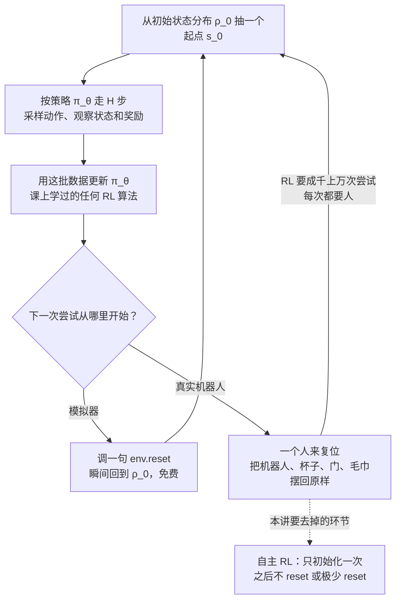
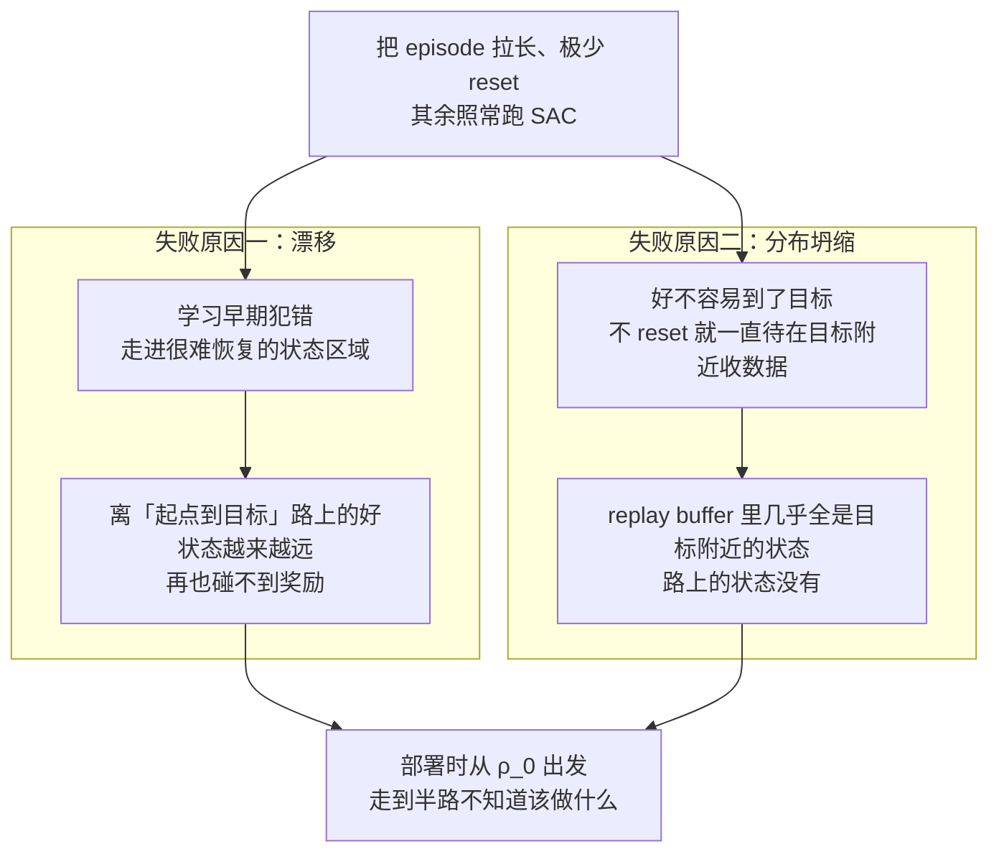
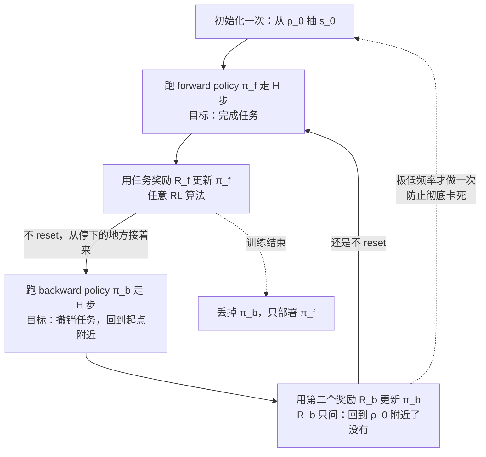
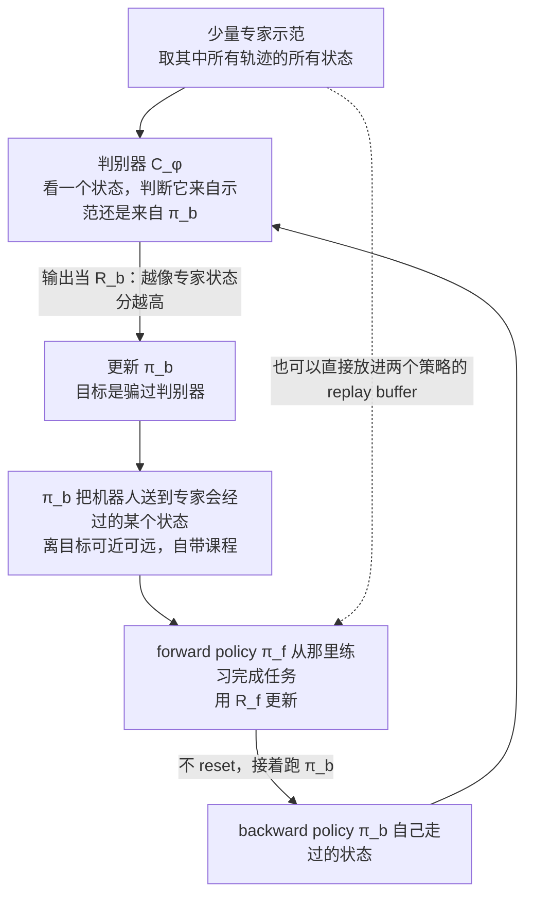
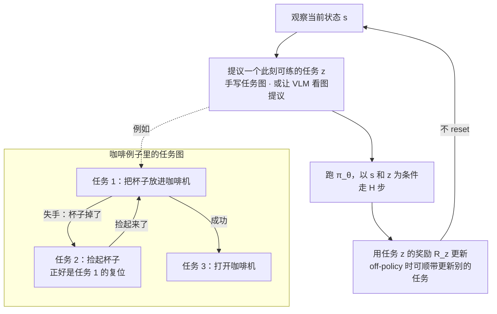
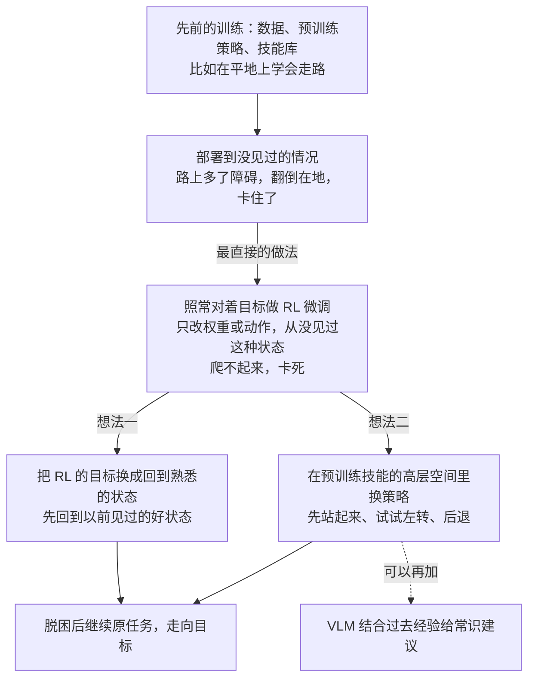

# CS224R 第 16 讲｜机器人 RL：自主学习（RL for Robots: Autonomous Learning）

> Stanford CS224R: Deep Reinforcement Learning（2025 春）· 第 16 讲，2025 年 5 月 23 日 · 本讲和第 17 讲是课程的机器人专场：今天讲"怎么让机器人在没人盯着的时候自己练"，第 17 讲是关于 sim-to-real 与人形机器人的客座讲座
> 视频：<https://www.youtube.com/watch?v=rbaWQQLrzl0>（1:05:44，英文字幕是自动生成的，算法名和板书记号错得不少，见文末勘误）
> 讲者：Chelsea Finn（课程主讲，不是客座；讲的大多是她自己实验室的工作）
> 课程主页：<https://cs224r.stanford.edu/> · 本讲没有指定阅读；课上讲到但没点名的三篇核心论文：[EARL](https://arxiv.org/abs/2112.09605)（Sharma et al., 2021）· [MEDAL](https://arxiv.org/abs/2205.05212)（Sharma et al., 2022）· [Single-Life RL](https://arxiv.org/abs/2210.08863)（Chen et al., 2022）

**一句话**：RL 靠试错练习，看起来比模仿学习自主得多，可每次"再来一次"都默认有人把机器人和场景摆回起点——模拟器里是一句 env.reset()，真机上是一个人。本讲把"去掉这个人"定义成自主 RL 问题：初始化一次，之后几乎不 reset；评价要么看一生累计的奖励（火星车），要么看学完之后部署的策略好不好（做饭机器人）。直接把 episode 拉长会失败：机器人会漂移进难以恢复的状态，或者到了目标就赖着不走、replay buffer 里只剩目标附近的状态。解法是让机器人自己复位：forward–backward RL 多学一个"撤销任务"的 backward policy；MEDAL 让它回到示范里的专家状态分布，奖励用判别器学出来；多任务循环则按当前状态挑一个此刻可练的任务，任务图可以手写，也可以让 VLM 提议。最后是 single-life RL：部署后遇到没见过的情况，在一条 episode 里靠"先回熟悉状态"和"在预训练技能层面换策略"把自己救回来。

## 时间轴

| 时间 | 内容 |
|---|---|
| [0:06](https://www.youtube.com/watch?v=rbaWQQLrzl0&t=6s) | 开场：本讲与第 17 讲聚焦机器人；今天讲自主学习，下周三是 sim-to-real 与人形机器人的客座讲座；大纲 |
| [1:07](https://www.youtube.com/watch?v=rbaWQQLrzl0&t=67s) | 动机：RL 靠试错"练习"看似自主，但每次重试都默认有人把机器人放回起点；env.reset() 只有模拟器里才有 |
| [7:19](https://www.youtube.com/watch?v=rbaWQQLrzl0&t=439s) | 三段真实视频：人替机器人摆冰球、关门、复位毛巾——人比机器人还忙 |
| [8:19](https://www.youtube.com/watch?v=rbaWQQLrzl0&t=499s) | 问题定义：初始化一次、之后几乎不 reset；两种评价——一生累计奖励（火星车）vs 学完后部署的策略（做饭） |
| [12:23](https://www.youtube.com/watch?v=rbaWQQLrzl0&t=743s) | 两个目标函数的板书；问答：只有一条命为什么还要取期望；为什么这个问题重要 |
| [17:02](https://www.youtube.com/watch?v=rbaWQQLrzl0&t=1022s) | 实验：SAC 把 episode 拉长 2 倍、10 倍，连简单的 fish 任务都学不会 |
| [19:04](https://www.youtube.com/watch?v=rbaWQQLrzl0&t=1144s) | 两个原因：漂移进难以恢复的状态；到了目标就赖着，replay buffer 的状态分布坍缩 |
| [22:10](https://www.youtube.com/watch?v=rbaWQQLrzl0&t=1330s) | Forward–backward RL：学一个撤销任务的 backward policy；算法步骤；问答：两个策略共享信息吗 |
| [27:51](https://www.youtube.com/watch?v=rbaWQQLrzl0&t=1671s) | 三个改进方向；MEDAL：backward policy 回到专家状态分布，奖励用判别器学；问答：为什么不会赖在目标状态 |
| [35:07](https://www.youtube.com/watch?v=rbaWQQLrzl0&t=2107s) | EARL benchmark：每 20 万步才 reset 一次；各算法比较；问答：示范从哪来、episodic 是什么意思 |
| [39:13](https://www.youtube.com/watch?v=rbaWQQLrzl0&t=2353s) | 正反任务难度不对称；真机延时视频；奖励也得用模型给；这些还在研究阶段 |
| [42:16](https://www.youtube.com/watch?v=rbaWQQLrzl0&t=2536s) | 多任务循环：咖啡例子；按状态选任务的算法；灵巧手、四足、七阶段拧螺丝 |
| [48:31](https://www.youtube.com/watch?v=rbaWQQLrzl0&t=2911s) | 任务怎么选：手写任务图 vs 让 VLM 提议；与分层 RL 的区别；生成目标图当奖励；可重复的任务 |
| [53:04](https://www.youtube.com/watch?v=rbaWQQLrzl0&t=3184s) | Single-life RL：部署后在一条 episode 里自适应；插钥匙的例子；三种设定对比 |
| [56:39](https://www.youtube.com/watch?v=rbaWQQLrzl0&t=3399s) | 测试时直接用 RL 微调会翻倒卡死；两个想法：先回熟悉状态、在预训练技能层面换策略；例子 |
| [1:02:17](https://www.youtube.com/watch?v=rbaWQQLrzl0&t=3737s) | 问答：安全约束怎么办；VLM 的常识；总结 |

## 核心内容

### 1. 为什么 RL 还没让机器人自主：藏在 reset 里的那个人

*图 16-1｜课上一直在用的 RL 循环里，"回到起点"这一步在模拟器里免费、在真机上是人在做（自绘示意）· [▶ 看原幻灯片 4:11](https://www.youtube.com/watch?v=rbaWQQLrzl0&t=251s)*

- **先把词摆出来**：agent 在每个时刻 t 看到状态 s_t，按策略 π_θ(a_t | s_t) 选一个动作 a_t，环境给出奖励 r(s_t, a_t) 并转到下一个状态；一段连续的状态–动作序列叫轨迹（trajectory）或 rollout，长度记作 H（horizon）；每次尝试的起点从初始状态分布 ρ_0 里抽。模仿学习（imitation learning，第 2 讲）是让 agent 模仿专家给的示范（demonstrations）；强化学习是让 agent 自己试错（trial and error），靠自己的经验变好。
- **练习看起来很自主**：一条轨迹里的每一步都由策略自己决定，没有人插手。讲者用一张示意图说明：从 ρ_0 出发，目标是进入奖励高的那片状态区域；第一次尝试通常走得很差，然后再试一次、再试一次。
- **问题出在"再试一次"上**：第一次尝试结束时机器人停在某个地方，可我们默认第二次又从 ρ_0 附近出发——它是怎么"魔法般"回去的？课上所有 RL 算法都默认这一步免费。模拟器里确实免费：走一千步，调一句 env.reset()。真实世界没有这个函数：把机器人挪回去、把杯子扶起来、把门关上，都是人做的。于是整个学习过程并不自主。
- **三个例子**：小车或自动驾驶要学会导航到篮球场，拐错一个弯就得先回来；机械臂学抓杯子，一不小心把杯子碰倒或推出臂展，就没法再试；移动机器人学把书放上书架，失误后书得回到够得着的地方。而 RL 不是试三次就会的事，往往要成千上万次尝试，每一次都对应一次人工干预。
- **三段真实视频**（[7:19](https://www.youtube.com/watch?v=rbaWQQLrzl0&t=439s)）：机器人学把冰球打进球门，旁边的朋友一直在捡球摆球，"干的活比机器人还多"；机器人学开门，同事在一旁不停地把门关上；机器人学叠毛巾，另一位同事把毛巾重新铺平。
    > 小注：叠毛巾那段里复位的人，字幕作 "Archet"，讲者说他本季度早些时候来讲过课，应为 Archit Sharma——本讲后面 EARL、MEDAL、single-life RL 三篇论文的一作或合作者（推断）。

### 2. 把问题定义清楚：自主 RL，以及两种"好"

- **最朴素的想法**：既然每个 episode 结束要人复位，那就把 episode 拉长，reset 次数自然变少，课上学过的算法原样照跑。这引出自主 RL（autonomous RL）的定义：把场景初始化一次，之后 agent 自己和世界交互，没有环境 reset；放宽一点，允许频率极低的 reset（比如 H 非常大时才复位一次）。
- **评价什么，先要想清楚**。同样是"没有 reset 的一段长长的经历"，有两种截然不同的关心法：
    1. **一生累计了多少奖励**：把 agent 放出去边学边干，我们在乎的是它这一生里到底把事做成了多少。例子是火星车——你要的是它在火星上采到科学数据，而不是学完之后再部署一遍。
    2. **学完之后的策略好不好**：训练过程中干得怎样无所谓，但训完拿出来的策略要能从起点出发反复把任务做好。例子是学做饭——练习时糊几锅没关系，将来要能给各种顾客稳定出菜。
- **第二种叫 deployed policy evaluation**，目标函数和课上一直用的一样：

$$
J_{\text{deploy}}(\pi)=\mathbb{E}_{s_0\sim\rho_0,\;a_t\sim\pi(\cdot\mid s_t)}\left[\sum_{t}\gamma^{t}\,r(s_t,a_t)\right]
$$

s_0 从初始状态分布 ρ_0 抽，之后每步按学好的策略 π 走，把奖励加起来（γ 是折扣因子，越远的奖励打的折越多）；它衡量的是"学完的这个策略从起点出发能拿多少分"，和策略是怎么学出来的无关。

- **第一种是 continuing 的视角**：看整个学习过程里的平均奖励，而且要在"寿命越来越长"的极限下看：

$$
J_{\text{life}}(\mathcal{A})=\lim_{H\to\infty}\frac{1}{H}\;\mathbb{E}_{\mathcal{A}}\left[\sum_{t=1}^{H} r(s_t,a_t)\right]
$$

这里的期望不再是对某一个固定策略取的，而是对整个学习过程（算法本身，记作 𝒜，包括它怎么采样、怎么更新）取的；H 小的时候只是平均了很短一段，所以取 H 趋于无穷。

- **问答：只有一条命，为什么还要取期望？**——如果只想知道这一次活得怎么样，直接跑一遍量就行。但环境有随机性，学习过程也有随机性（比如 batch 怎么抽），想评价的是"这个算法"而不是"这一次"，就得对多次运行取期望。
- **为什么值得做**：我们既希望机器人干活时不用人管，也希望它训练时不用人管。真机上做 RL 是把成功率和可靠性推到模仿学习之上的一条有希望的路；训练不需要人盯，就能收更多数据；更多数据又能换来更高的可靠性和更好的泛化——前提是这套系统能在各种真实环境里大规模铺开。

### 3. 只把 episode 拉长行不行？两个失败原因

*图 16-2｜不 reset 的两种死法：走偏了回不来，或者到了目标就再也不动（自绘示意）· [▶ 看原幻灯片 21:07](https://www.youtube.com/watch?v=rbaWQQLrzl0&t=1267s)*

- **实验**：拿 SAC（soft actor-critic，第 5 讲的 off-policy actor-critic 算法：把交互数据存进 replay buffer 反复用）在一个很简单的 fish 控制任务上跑——控制一条"鱼"游到指定位置。横轴是训练步数，纵轴是上一节的第二个目标：学到的策略部署后拿到的奖励。episode 长 1000 步时曲线正常爬升；拉长到 2 倍就变差，10 倍更差；拉到几万步才 reset 一次，几乎什么都学不到。这么简单的任务尚且如此。
- **原因一：漂移（drift）**。学习早期难免犯错，有些错会把机器人带进很难恢复的状态区域（这个环境里鱼断不了尾巴，但真机上会断）。episodic 的 RL 每次都能回 ρ_0 重来，自主学习却只能从停下的地方接着走，于是离"从起点到目标"那条路上的好状态越来越远，再也碰不到奖励。
- **原因二：分布坍缩（更隐蔽）**。假设机器人运气好终于到了目标，拿到奖励——不 reset，它就会赖在目标附近继续收数据，replay buffer 里很快全是目标附近的状态。学习信号看着很好，但我们要的策略是"从 ρ_0 出发走到目标"，路上那些状态它几乎没再见过。把最优策略会经过的状态分布记作 ρ*，buffer 里的分布和 ρ* 对不上，部署时走到半路就不知道该干什么。
- **术语**：能反复回起点重来的传统设定叫 episodic；没有 reset、一整段连续学习的设定叫 non-episodic，也叫 reset-free 或自主学习。两种失败都源于后者没有"回起点"这一步——所以最直接的解法就是让机器人自己学会回去。

### 4. Forward–backward RL：多学一个把任务"撤销"的策略

*图 16-3｜forward–backward RL 的循环：两个策略、两个奖励函数、两处"不 reset"（自绘示意）· [▶ 看原幻灯片 24:47](https://www.youtube.com/watch?v=rbaWQQLrzl0&t=1487s) · 出处：[Eysenbach et al., 2017](https://arxiv.org/abs/1711.06782)（Leave No Trace；课上没点名，推断）*

- **想法**：既然允许从 ρ_0 重来就能学好，那就再学一个策略，专门负责把机器人从任务结束时的状态送回 ρ_0。做任务的叫 forward policy π_f，撤销任务的叫 backward policy（也叫 reset policy）π_b，合起来就是 forward–backward RL。
- **算法**（讲者在板上写的步骤）：
    1. 第 0 步：初始化，从 ρ_0 抽一个 s_0。
    2. 跑 π_f 走 H 步，用任务本身的奖励 R_f 更新 π_f。
    3. **不 reset**，从停下的地方直接跑 π_b，用第二个奖励 R_b 更新 π_b——R_b 要回答的是"回到 ρ_0 附近了没有"，所以它是一个额外要定义的奖励函数。
    4. 再次不 reset，回到第 2 步。两个更新都可以用你喜欢的任何 RL 算法。
    5. 可以留一个频率极低的 reset，以防真的卡死。训练结束后 π_b 扔掉，只部署 π_f。

$$
\pi_f=\arg\max_{\pi}\;\mathbb{E}_{\pi}\Big[\sum_t R_f(s_t,a_t)\Big],\qquad \pi_b=\arg\max_{\pi}\;\mathbb{E}_{\pi}\Big[\sum_t R_b(s_t)\Big],\qquad R_b(s)=\mathbf{1}\big[s\in\operatorname{supp}\rho_0\big]
$$

两个策略各自最大化自己的累计奖励；R_b 最简单的写法是"到了初始状态分布覆盖的区域就给 1"（supp 指分布的支撑集），实践里也可以是到起点的距离，或者一个学出来的分类器。

- **跑多久切换**：最简单是固定 H 步。更讲究的做法是早期让 π_f 多跑一会儿（它还没学会什么，π_b 没活可干），后期再让 π_b 多跑；但固定步数更省事，而且一旦过程真的自主了，这个数字就没那么要紧——"你可以睡觉去，让机器人自己练"。
- **问答：两个策略之间共享信息吗？**——用 replay buffer 的话，可以把同一批数据按另一个任务的奖励重新打分后共用（第 12 讲的 hindsight relabeling 就是这个操作）；也可以共享图像编码器之类的部分权重。但实践里常常不怎么共享：两者学的是几乎相反的事，硬共享反而添乱。后面讲的多任务方法会共享得更多。
- **优缺点**：优点是极其简单。缺点是 π_b 本身没什么用——花一半算力学一个最后扔掉的策略，看着浪费；但正是它换来了自主。
    > 小注：这个"正反两个策略轮流跑、互为 reset"的框架应出自 Han et al., 2015（Levine 组的 compound controllers）和 [Leave No Trace](https://arxiv.org/abs/1711.06782)（Eysenbach et al., 2017），后者还让 reset 策略顺带判断"这一步做了还回不回得来"，是第 9 节安全问题的雏形（推断，课上没点名）。
- **三个改进方向**（后面逐个展开）：（a）π_b 不一定要回到最开头，可以回到更多样的状态；（b）不只学一正一反两个任务，而是在一圈任务之间循环练习；（c）有些任务本身可以设置成反复做的。

### 5. MEDAL：回到专家走过的状态，而不是回到起点

*图 16-4｜MEDAL：backward policy 的奖励是一个判别器，目标是让它走过的状态分布逼近示范的状态分布（自绘示意）· [▶ 看原幻灯片 31:31](https://www.youtube.com/watch?v=rbaWQQLrzl0&t=1891s) · 出处：[Sharma et al., 2022](https://arxiv.org/abs/2205.05212)*

- **动机**：forward–backward 每次都回到最开头，可我们要的策略得在"专家会经过的每一个状态"上都知道怎么做。已有工作表明，如果能从专家轨迹沿途的各个状态出发练习，哪怕在 episodic 设定里也比总从 ρ_0 出发学得快——离目标近的起点简单，远的难，等于自带课程（curriculum）。
    > 小注：这条"从示范沿途的状态起步"的结论应出自 Salimans & Chen, 2018（用一条示范通关 Montezuma's Revenge）和 Florensa et al., 2017 的 reverse curriculum 一类工作（推断）。
- **两处改动**：
    1. 第 −1 步：给少量专家示范（几条就够），当作专家状态分布的样本。
    2. π_b 的奖励不再是"回到 ρ_0"，而是"到达专家去过的那类状态"。这个奖励是学出来的：像第 8 讲的 reward learning 那样训一个判别器（discriminator / classifier）C_φ(s)，分辨一个状态来自示范还是来自 π_b 自己走过的状态；π_b 的任务就是骗过它。
- **为什么不会赖在目标状态**（问答）：目标状态也在示范里，π_b 直接停在目标不就行了？不行——判别器用的是示范里**所有**轨迹的**所有**状态，目标只是其中一小撮；如果 π_b 只去目标，判别器很快学会"只在目标附近出现的就是策略产生的"，奖励随之消失。形式上这是一个状态分布匹配（state-distribution matching）目标：让 π_b 走过的状态分布逼近专家的状态分布。

$$
\min_{\pi_b}\; D\big(\rho^{\pi_b}(s)\,\big\|\,\rho^{E}(s)\big),\qquad R_b(s)\approx\log C_\phi(s)
$$

ρ^{π_b} 是 π_b 走过的状态分布，ρ^E 是示范里的状态分布，D 是两者之间的某种散度（divergence，衡量两个分布差多远的量）；用判别器输出当奖励是实现这种匹配的标准做法（GAIL 那一路，第 8 讲），奖励的具体写法以论文为准（推断）。

- **好处**：同时治了漂移和坍缩——π_b 总把机器人送回专家分布附近，π_f 每次都从"路上"某处开始练，起点有难有易。示范还可以直接塞进两个策略的 replay buffer 里当训练数据。名字 MEDAL 的意思就是 matching expert distributions for autonomous learning。
- **EARL benchmark**（[35:07](https://www.youtube.com/watch?v=rbaWQQLrzl0&t=2107s)）：专门给自主 RL 设的模拟 benchmark，训练时每 200,000 个环境步才 reset 一次，评价看部署策略从 ρ_0 出发的表现。最简单的任务是抓杯子挪位置（抓取机制简化过）；更难的一个是门——正向任务关门，反向任务开门。结果：
    - 光跑 SAC、只靠极稀疏的 reset：学不出来，和 fish 一样。
    - 给它频繁 reset 的 oracle（拿到了本不该有的便利、用来看上限的基线）：能学好——说明差的不是算法，是 reset。
    - 几个专为 reset-free 设计的算法：靠扰动去访问新状态的（第 14 讲探索的思路）、原味 forward–backward、给目标课程的、以及 MEDAL。它们都明显好于不为此设计的算法；简单任务上彼此差不多，任务变难后 forward–backward 和 MEDAL 最好，靠新奇度或目标课程的那两个掉队。
    > 小注：这几个基线应为 R3L 的 perturbation controller（Zhu et al., 2020）和 VaPRL（Sharma et al., 2021）；MEDAL 论文摘要说在 EARL 的三个稀疏奖励任务上与先前方法持平或更好，最难的任务上提升约 40%（基线身份是推断，数字来自论文摘要）。
- **问答**
    - 示范从哪来？——真机上用遥操作（teleoperation）：主从臂式的 puppeteering 装置、VR 手柄、3D 鼠标、甚至键盘；模拟里可以写脚本策略，或者提前用 RL 训一个策略专门产示范来测算法。
    - episodic 到底什么意思？——每次尝试是一个 episode，试完 reset 再试；non-episodic 就是没有 reset、一整段连续学习，也叫 reset-free。

### 6. 真机上的现实：难度不对称、奖励也得学、还在研究阶段

- **正反难度不对称**：门任务里，开门（反向）取决于手臂起始位置，常常比关门（正向）更难。两个策略学得快慢不一，整个循环就会一头堵住——好比正向任务是后空翻，反向任务是站起来，难度差得远。这种不对称很常见。
- **真机延时视频**（[39:44](https://www.youtube.com/watch?v=rbaWQQLrzl0&t=2384s)）：左边是 forward–backward，两个策略都会犯错，但全程没人干预也在变好；右边是 MEDAL，能看到正向策略一旦没抓起来，反向策略就没活可干。
- **奖励也不是世界白给的**：真实世界不会告诉你"成功了"。所以 reset-free 算法几乎总是和 reward learning（第 8 讲）搭配：视频里的奖励全由模型（分类器）给，不需要人，整套东西才能"扔那儿跑一晚上"。
- **问答：鸡生蛋问题**——反向策略学不好，正向就没法从好状态起步；正向从没抓起毛巾，反向也没得练。答：可以给正反两个任务都提供示范来启动；除此之外，平衡两者本身就是这类方法的固有难题，目前只能说"在一些设定里能跑通"。
- **诚实的定位**：这些还处在研究阶段，不是机器人公司今天在用的东西。

### 7. 多任务循环：按当前状态挑一个能练的任务

*图 16-5｜多任务自主练习：由当前状态决定练哪个任务，"复位"变成了任务图里的一条边（自绘示意）· [▶ 看原幻灯片 43:48](https://www.youtube.com/watch?v=rbaWQQLrzl0&t=2628s) · 出处：[Gupta et al., 2021](https://arxiv.org/abs/2104.11203)（课上没点名，推断）*

- **换个角度**：如果要学的本来就不止一个任务，就不必拘泥于"一正一反"，而是在一圈任务之间循环，**由当前状态决定练什么**。做咖啡的例子：任务 1 是把杯子放进咖啡机；失手把杯子掉了，传统做法是人把杯子摆回去，现在改成让"捡起杯子"当任务 2——它恰好是任务 1 的复位；任务 1 成功了就练任务 3 打开咖啡机。这样就有一张任务图（或环），每个时刻只练从当前状态可行的任务，不可行的排除。
- **算法**：学一个以任务为条件的多任务策略 π_θ(a | s, z)（第 12 讲：z 是任务标识，可以是编号、一句话或一张目标图）。循环：观察状态 s → 提议一个任务 z_i → 跑以 z_i 为条件的策略走 H 步 → 更新。更新时若用 on-policy 算法（只能用当前策略自己刚采的数据），就只更新任务 z_i；若用 off-policy 算法（能用 replay buffer 里的旧数据），可以顺带更新所有任务。这要求每个任务都有奖励函数。照样没有 reset 或极少 reset；训练完部署的是能做多个任务的同一个策略。

$$
\max_{\theta}\;\mathbb{E}_{z\sim p(\cdot\mid s)}\;\mathbb{E}_{a_t\sim\pi_\theta(\cdot\mid s_t,\,z)}\left[\sum_{t}R_z(s_t,a_t)\right]
$$

p(z | s) 是任务提议器：看着当前状态给出一个此刻可练的任务；R_z 是任务 z 自己的奖励；策略参数 θ 在所有任务间共享。

- **例子**
    - 灵巧手：任务是把物体拿起、翻面、再旋转，各阶段是不同的任务。一开始既不会翻也不会转，就只能反复练"拿起来、放下去"；拿稳了才有机会练翻转。这正好化解上一节的不对称：正向没成功、状态没变，就不硬跑反向，而是继续练当下有意义的那个任务。
    - 四足机器人：同时学向前走、向后走和摔倒后爬起来，走得太靠后就切到向前走。
    - 七阶段的拧螺丝任务：拿起扳手、对准、反复拧，各阶段各跑各的策略，最后再由反向策略把扳手放回桌上。
    > 小注：灵巧手的例子应为 [Gupta et al., 2021](https://arxiv.org/abs/2104.11203)（Reset-Free RL via Multi-Task Learning），四足的例子应为 Smith et al., 2021（Legged Robots that Keep on Learning）（均为推断）。
- **任务怎么选**（问答，讲者说这是研究前沿）：
    1. 手写：预先定义任务集合和那张图——任务 1 失败去练任务 2，成功去练任务 3——照图执行。
    2. 学出来：训一个提议模型。哪个任务此刻最值得练，本身是个开放问题；一个可行做法是问语言模型或 VLM："这个场景里我能做哪些事来变强？"任务是场景相关的——桌上有玩具微波炉、香蕉、茄子、锅，"打开微波炉""把香蕉从银色锅里拿出来"可以，"拿起胡萝卜"不行，因为根本没有胡萝卜。
- **和分层 RL 什么关系**（问答，第 15 讲）：提议器长得像高层策略，但目的相反。高层策略是为了达成某个长期目标而选下一个子任务，越聚焦越好；提议器是为了让机器人**学到尽量多样的东西**，越发散越好。讲到的那个系统确实用了分层结构：VLM 提议任务 → 用图像编辑扩散模型把当前图改成"做完之后的样子"（第 15 讲讲过的那类工作）→ 策略去够这张目标图。顺带解决了奖励问题：给每个任务手写奖励很难，而有了目标图，奖励就是"离这张图还有多远"。
    > 小注：这个系统应为 Zhou et al., 2024 的 Autonomous Improvement of Instruction Following Skills via Foundation Models，目标图生成用的是第 15 讲提到的 SuSIE 一类图像编辑扩散模型（推断，课上没点名）。
- **问答：冰球例子能用提议器吗？**——能，比如让它决定练传球还是射门；不过要练的东西就那么几样时，直接排课表（一节练射门、一节练传球）也够了。
- **第三条路：把任务设计成可以反复做的**。例子是给餐饮企业叠餐巾——叠完一条接着叠下一条，天然不需要 reset。这方面研究不多。
- 以上三类（做–撤销、任务循环、可重复任务）都是为了"学出一个好策略"；火星车式的"一生累计奖励"问题，则由下一节的 single-life RL 来回答。

### 8. Single-life RL：部署之后只有一条命

*图 16-6｜single-life RL：部署中卡住时，直接微调会卡死，两条出路是"回熟悉状态"和"换高层策略"（自绘示意）· [▶ 看原幻灯片 58:12](https://www.youtube.com/watch?v=rbaWQQLrzl0&t=3492s) · 出处：[Chen et al., 2022](https://arxiv.org/abs/2210.08863)*

- **动机**：策略再好，部署到真实世界总会出岔子。人是怎么处理的？课上放了一段开门视频（[54:06](https://www.youtube.com/watch?v=rbaWQQLrzl0&t=3246s)）：钥匙没插正，人用力推不动，半秒之内就把钥匙拔出来重插——在一条 episode 里、不重来、当场适应。我们希望机器人在部署时也能这样：遇到没见过的情况，靠先前的训练加上现场的经验把自己救回来。
- **和前面两种设定的对比**：

| 设定 | 训练时 | 部署时 | 本讲对应 |
|---|---|---|---|
| episodic | 从 ρ_0 反复尝试，每次 reset | 部署一次固定策略 | 第 1–15 讲的默认设定 |
| reset-free / 自主 RL | 做任务、撤销任务反复循环，没有 reset | 部署一次固定策略 | 第 3–7 节 |
| single-life RL | 已有先前的数据或预训练策略 | 落进没见过的情况，要在**一条** episode 里边适应边完成任务，没有 reset | 本节 |

- **直接在测试时做 RL 微调行不行**：四足机器人在平地上训练，部署时路上多了障碍。最直接的做法是照常跑 RL：一边走一边用 TD 更新（第 4、6 讲：用下一步的价值估计修正当前估计）或策略梯度（第 3 讲）改权重。结果它确实翻过了第一个障碍，随后摔了个四脚朝天，就此卡死——RL 还在跑、更新还在做，但从没见过这种状态，怎么更新都爬不起来，除非有人来扶。
- **想法一：先回熟悉的状态，再谈目标**。卡住时，RL 的目标是"去目标"，可从这个陌生状态去目标它毫无头绪。把目标换成"回到先前经验里见过的好状态"，它反而容易脱困——那些状态离目标更近，也是它知道该怎么走的地方，回去之后再继续原任务。

$$
\tilde{r}(s)=\log D_\psi(s)
$$

D_ψ 是一个判别器，分辨一个状态更像先前数据里的状态，还是当前这条命里新踩到的状态；用它当奖励做 RL 更新，agent 就会被拉回熟悉的分布——和第 5 节 MEDAL 的判别器奖励是同一个套路，只是这次在部署时用（奖励的具体形式按论文，推断）。

> 小注：这就是 [Single-Life RL](https://arxiv.org/abs/2210.08863)（Chen, Sharma, Levine & Finn, NeurIPS 2022）：提出的算法叫 QWALE（Q-weighted adversarial learning），用 Q 值给判别器加权；摘要说在几个 single-life 连续控制任务上比标准 RL 的成功率高 20–60%。
- **想法二：在预训练技能的高层空间里适应**。只改权重、只换动作，能变的有限；如果手里有一组预训练好的技能（向前走、翻身站起），就可以在"换哪种策略"这一层探索——从只会闷头往前走，变成试试先站起来、试试往左。这是换策略而不是换动作。预训练的 LLM 还带着常识，也能帮 agent 在陌生情况下想到别的办法。
- **例子**
    - 想法一在同一个障碍环境里：还是翻倒了，但它会朝"站着"这种熟悉状态努力，试几次后爬起来，最终到达目标（[1:00:15](https://www.youtube.com/watch?v=rbaWQQLrzl0&t=3615s)）。
    - 低层适应的代表是"从最近几步的历史里推断环境、调整动作"（第 13 讲那种从上下文快速适应的思路），能应付地形略有不同这类小偏移；碰到差异很大的情况就不够了。
    - 高层适应的例子：四足机器人要去一个目标点，眼前只有一张图。没有上下文的策略会一直往前顶，因为它不记得自己刚试过前进；带上下文、在技能层面换策略的版本会试着左转、后退，最后在从没见过的环境里绕过障碍走到目标。要是在关节空间里试不同姿势来解决这种问题，几乎不可能。
    > 小注：高层技能切换这项应为 Chen et al., 2023 的 Adapt On-the-Go（ROAM），用预训练行为库加各行为的 value function 来选；结尾问答里"让 VLM 结合过去经验给策略建议"的应为同组 2024 年的 Commonsense Reasoning for Legged Robot Adaptation with Vision-Language Models；低层适应的代表应为 RMA（Kumar et al., 2021）（均为推断，课上没点名）。

### 9. 问答：安全怎么办；VLM 的常识；总结

- **安全**（问：怎么把安全约束"烤"进去？）：除了 reset，另一件需要人盯着的事就是安全——四足机器人可能摔坏自己，机械臂可能把玻璃杯摔到地上，或者把东西撞得很重。两条路：
    1. 学：直接在本讲的框架上加一层——学一个风险概念，识别自己是否处在高风险状态，再学一个 recovery policy 把自己带回已知更安全的状态。这些想法几年前就在安全 RL 里研究过。
    2. 硬约束：能在控制器层面做的尽量做——限制电机不至于过热、给机器人划一个活动盒子、限制施力大小。
    - 硬约束不是处处可行，所以"学安全"可能是唯一通用的办法；可学安全又需要失败的样本，这本身就危险。总之是个棘手的问题。
    > 小注：第一条路的代表应为 Recovery RL（Thananjeyan et al., 2021）；第 4 节小注里的 Leave No Trace 也在 reset 策略上加了"能不能回得来"的判断，是同一思路的早期版本（推断）。
- **在人群里导航**（问）：可以让 VLM 在高层出主意——课上最后那项工作就是让 VLM 结合过去的经验提出该试哪些策略；模型自带的常识（别撞人、该等就等）在这类场景里相当有用。
- **总结**：为什么 RL 算法没有自动带来自主——因为 reset 里藏着人；把问题定义成两种（一生累计奖励 vs 学出好策略）；对应的算法——学一个 backward policy、学一张任务图在多个任务间循环、以及 single-life RL 防止部署时漂走。

## 关键图表速查（点时间戳跳到原幻灯片）

| 图 | 看什么 | 跳转 | 出处 |
|---|---|---|---|
| 从 ρ_0 到高奖励区域的示意 | 一次尝试走偏后，"再试一次"默认又从起点出发——这一步是谁做的 | [3:08](https://www.youtube.com/watch?v=rbaWQQLrzl0&t=188s) | — |
| 三段人工复位视频 | 冰球、开门、叠毛巾：每次尝试之间人在干什么 | [7:19](https://www.youtube.com/watch?v=rbaWQQLrzl0&t=439s) | — |
| 两种评价与两个目标函数 | 火星车 vs 做饭；deployed 的期望在策略下取，continuing 的期望在整个学习过程下取、H 趋于无穷 | [13:53](https://www.youtube.com/watch?v=rbaWQQLrzl0&t=833s) | [EARL](https://arxiv.org/abs/2112.09605) |
| SAC 拉长 episode 的学习曲线 | 1000 步正常，2 倍、10 倍逐步变差，几万步几乎学不到 | [17:32](https://www.youtube.com/watch?v=rbaWQQLrzl0&t=1052s) | 同上 |
| 漂移与坍缩示意 | 走偏后回不来；到了目标后 buffer 只剩目标附近的状态 | [21:07](https://www.youtube.com/watch?v=rbaWQQLrzl0&t=1267s) | — |
| Forward–backward RL 板书 | 两个策略、两个奖励、两处"不 reset" | [23:14](https://www.youtube.com/watch?v=rbaWQQLrzl0&t=1394s) | [Leave No Trace](https://arxiv.org/abs/1711.06782)（推断） |
| MEDAL 的粉色专家区域 | backward policy 把机器人送回专家状态分布里任意一处，而不是起点 | [31:01](https://www.youtube.com/watch?v=rbaWQQLrzl0&t=1861s) | [MEDAL](https://arxiv.org/abs/2205.05212) |
| EARL 结果曲线 | SAC、oracle、扰动、forward–backward、目标课程、MEDAL 六条线怎么排 | [36:10](https://www.youtube.com/watch?v=rbaWQQLrzl0&t=2170s) | 同上 |
| 咖啡任务图与多任务算法 | 任务 2 就是任务 1 的复位；观察状态→提议任务→跑 H 步→更新 | [43:17](https://www.youtube.com/watch?v=rbaWQQLrzl0&t=2597s) | — |
| 灵巧手、四足、拧螺丝 | 按状态切换练哪个阶段；不对称问题怎么被绕开 | [46:28](https://www.youtube.com/watch?v=rbaWQQLrzl0&t=2788s) | [Gupta et al., 2021](https://arxiv.org/abs/2104.11203)（推断） |
| VLM 提议任务的场景 | 场景相关的可行任务：能拿香蕉，不能拿不存在的胡萝卜 | [49:32](https://www.youtube.com/watch?v=rbaWQQLrzl0&t=2972s) | — |
| 三种设定对比 | episodic / reset-free / single-life 各自的训练与部署 | [55:06](https://www.youtube.com/watch?v=rbaWQQLrzl0&t=3306s) | [SLRL](https://arxiv.org/abs/2210.08863) |
| 测试时微调翻倒 vs 回熟悉状态爬起 | 同一个障碍环境，RL 的目标不同，结局不同 | [57:09](https://www.youtube.com/watch?v=rbaWQQLrzl0&t=3429s) | 同上 |
| 高层换策略穿越障碍 | 没有上下文一直往前顶；有上下文会试左转、后退 | [1:01:46](https://www.youtube.com/watch?v=rbaWQQLrzl0&t=3706s) | — |

## 提到的工作

| 名称 | 在本讲里的作用 |
|---|---|
| 模仿学习与示范（第 2 讲） | 对照：RL 的"练习"比模仿更自主，但仍要人 reset；后面 MEDAL 和多任务方法又把示范请回来当启动数据 |
| env.reset() | 模拟器里免费的复位函数；真机没有，这是全讲的起点 |
| SAC（第 5 讲） | 拉长 episode 实验的算法，也是 EARL 里"不为 reset-free 设计"的基线 |
| fish 控制任务 | 拉长 episode 实验的环境（应为 DeepMind Control Suite 的 fish 域，推断） |
| Forward–backward RL / [Leave No Trace](https://arxiv.org/abs/1711.06782)（Eysenbach et al., 2017；推断） | 最简单的自主 RL 算法：多学一个撤销任务的 backward policy |
| Reward learning、判别器奖励、GAIL 一路（第 8 讲） | MEDAL 的 backward 奖励、真机上的成功判定、single-life RL 的"熟悉度"奖励都是它 |
| Hindsight relabeling（第 12 讲） | 两个策略之间共享数据的方式：同一批数据按另一个奖励重新打分 |
| [MEDAL](https://arxiv.org/abs/2205.05212)（Sharma, Ahmad & Finn, 2022） | backward policy 回到专家状态分布，而不是起点 |
| [EARL](https://arxiv.org/abs/2112.09605)（Sharma et al., 2021） | 自主 RL 的形式化与 benchmark：每 20 万步才 reset 一次 |
| 扰动 / 新奇度基线、目标课程基线 | EARL 里的两个对照（应为 R3L 与 VaPRL，推断）；任务变难后掉队 |
| 多任务 / 任务条件策略 π(a given s, z)（第 12 讲） | 任务循环用的策略形式 |
| [Reset-Free RL via Multi-Task Learning](https://arxiv.org/abs/2104.11203)（Gupta et al., 2021；推断） | 灵巧手拿起–翻面–旋转的例子 |
| Legged Robots that Keep on Learning（Smith et al., 2021；推断） | 四足同时学前进、后退、爬起的例子 |
| 七阶段拧螺丝 | 任务图例子：各阶段各跑各的策略，反向策略把扳手放回去 |
| VLM 任务提议 + 图像编辑扩散模型生成目标图（应为 Zhou et al., 2024；推断） | 学出来的任务提议器；目标图顺带解决奖励定义 |
| SuSIE 一类图像编辑扩散模型（第 15 讲） | 上一条里"把当前图改成做完之后的样子"的部件 |
| 分层 RL 与高层策略（第 15 讲） | 与任务提议器对比：一个为目标聚焦，一个为学习发散 |
| 叠餐巾 | 天然可重复、不需要 reset 的任务 |
| [Single-Life RL / QWALE](https://arxiv.org/abs/2210.08863)（Chen, Sharma, Levine & Finn, NeurIPS 2022） | 部署后一条 episode 内自适应；卡住时先回熟悉状态 |
| TD 更新、策略梯度（第 3、4、6 讲） | 测试时直接微调用的更新方式；单靠它们翻倒后爬不起来 |
| 从最近历史快速适应（应为 RMA，Kumar et al., 2021；第 13 讲的思路） | 低层适应的代表，只够应付小偏移 |
| Adapt On-the-Go / ROAM（Chen et al., 2023；推断） | 在预训练技能层面换策略穿过障碍 |
| VLM 常识辅助四足适应（Chen et al., 2024；推断） | 让 VLM 结合过去经验提建议；结尾"在人群里导航"的回答 |
| Recovery RL（Thananjeyan et al., 2021；推断） | 安全问答里"学风险 + 恢复策略"的代表 |
| Sim-to-real 与人形机器人 | 第 17 讲客座讲座的主题 |

## 术语对照

| English | 中文 |
|---|---|
| autonomous RL / reset-free RL / non-episodic RL | 自主 RL / 无复位 RL / 非分节 RL：初始化一次后不再（或极少）复位环境 |
| episodic | 分节的：每次尝试是一个 episode，试完复位再试 |
| reset | 复位：把机器人和场景摆回初始状态；模拟器里是 env.reset()，真机上是人 |
| initial state distribution ρ_0 | 初始状态分布：每次尝试起点的分布 |
| horizon H | 时域：一段 rollout 的步数 |
| rollout / trajectory | 按策略走出来的一段状态–动作序列 |
| deployed policy evaluation | 部署策略评价：学完的策略从 ρ_0 出发能拿多少奖励 |
| continuing / average reward | 连续设定 / 平均奖励：一生里每步平均拿多少，H 趋于无穷 |
| lifetime | 一生：一次没有复位的完整学习过程 |
| SAC (soft actor-critic) | 一种 off-policy actor-critic 算法（第 5 讲） |
| replay buffer | 经验回放池：存下交互数据反复使用 |
| drift | 漂移：走进难以恢复的状态区域，离好状态越来越远 |
| state distribution ρ^π(s) | 状态分布：策略 π 长期访问各状态的频率 |
| distribution collapse | 分布坍缩：buffer 里只剩目标附近的状态 |
| forward policy π_f / backward (reset) policy π_b | 正向策略 / 反向（复位）策略 |
| demonstrations | 示范：专家做任务的轨迹 |
| teleoperation | 遥操作：人通过主从臂、VR 手柄等直接操纵机器人 |
| discriminator / classifier reward | 判别器奖励：训一个分类器区分好状态与策略状态，输出当奖励（第 8 讲） |
| state-distribution matching | 状态分布匹配：让策略访问的状态分布逼近目标分布 |
| divergence | 散度：衡量两个分布差多远的量 |
| oracle | 神谕基线：给它本不该有的信息（这里是频繁 reset），用来看上限 |
| curriculum | 课程：从易到难安排起点或目标 |
| task-conditioned / multi-task policy | 任务条件策略：一个策略带任务标识 z 做多个任务（第 12 讲） |
| on-policy / off-policy | 只能用当前策略刚采的数据 / 可以用旧数据（第 5 讲） |
| task graph / task proposer | 任务图 / 任务提议器：按当前状态决定练什么 |
| VLM (vision-language model) | 视觉语言模型 |
| goal image | 目标图：任务完成时的样子，可以直接当奖励 |
| hierarchical RL / high-level policy | 分层 RL / 高层策略（第 15 讲） |
| single-life RL | 单命 RL：部署后在一条 episode 内适应，没有 reset |
| out-of-distribution (OOD) | 分布外：训练时没见过的情况 |
| test-time fine-tuning | 测试时微调：部署中继续更新权重 |
| TD update | 时序差分更新：用下一步的价值估计修正当前估计（第 4、6 讲） |
| skill / behavior library | 技能库：预训练好的一组行为 |
| recovery policy | 恢复策略：把机器人带回安全或熟悉的状态 |
| safety constraint | 安全约束：控制器层面的力、范围、温度限制 |
| sim-to-real | 模拟到真实迁移（第 17 讲） |

## 字幕勘误

"SACE" → SAC；"Earl" → EARL；"metal" → MEDAL；"non-epodic" → non-episodic；"forward backwardl" → forward–backward RL；"simtoreal" → sim-to-real；"Archet" → Archit；"teley operation" → teleoperation；"reabeling" → relabeling；"hierarchal""highle policy" → hierarchical、high-level policy；"increase age" → increase H；"pf""pi b" → π_f、π_b；"RF""RB" → R_f、R_b；"row star" → ρ*；"zi" → z_i；"roll out the policy for eight steps" → for H steps；"task condition policy" → task-conditioned policy；"auto distribution" → out-of-distribution；"adopting" → adapting；"ladder setting" → latter setting；"bacon safety constraints" → bake in safety constraints；"high-risisk" → high-risk。

## 带走的问题

1. 你的 agent 环境里 env.reset() 免费吗？沙箱里是；生产环境（真实账号、已发出的邮件、已改过的数据库）里没有 reset。哪些动作能靠一个 backward policy 撤销，哪些不能？这和第 9 节里"不可逆动作要靠硬约束"是不是同一件事？
2. MEDAL 的 backward 奖励是一个判别器。示范只有几条时，判别器会不会抓住示范的像素细节（光照、桌布）而不是任务相关的状态，让 π_b 学会"骗分"？这和第 8 讲里 GAIL 式奖励的通病有什么共通，哪些手段（正则、特征选择、更多示范）能缓解？
3. 一生累计奖励 vs 部署策略质量：一个 24 小时在线、边服务边学的 agent 更像火星车还是做饭机器人？这两个目标什么时候会冲突——为了学好策略需要探索，探索却会牺牲当下的奖励？
4. Single-life RL 的两条出路是"回熟悉状态"和"换高层策略"。对一个 LLM agent 来说，"熟悉状态"对应什么（回到上一个确认无误的 checkpoint？重新读一遍任务？），"技能库"对应什么？直接在部署时更新权重，和在技能层面换策略，哪个更像你现在处理失败重试的方式？
5. 任务提议器和分层 RL 高层策略的区别是"为学习而发散"vs"为目标而聚焦"。如果要让一个 agent 在没人盯着的时候自己找题练，你会怎么设计提议器，既让它练到真正薄弱的东西，又不让它在无意义的任务上空转？
