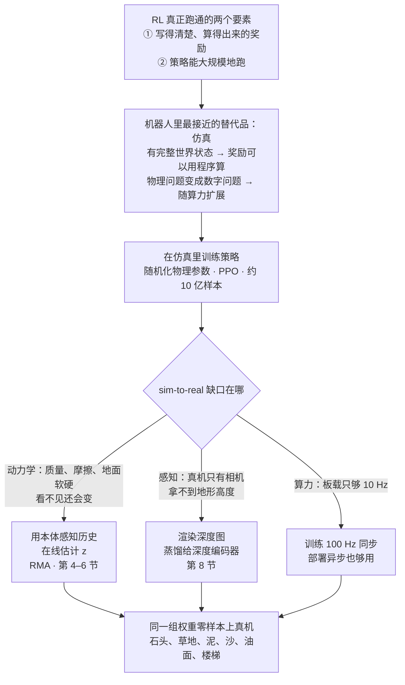
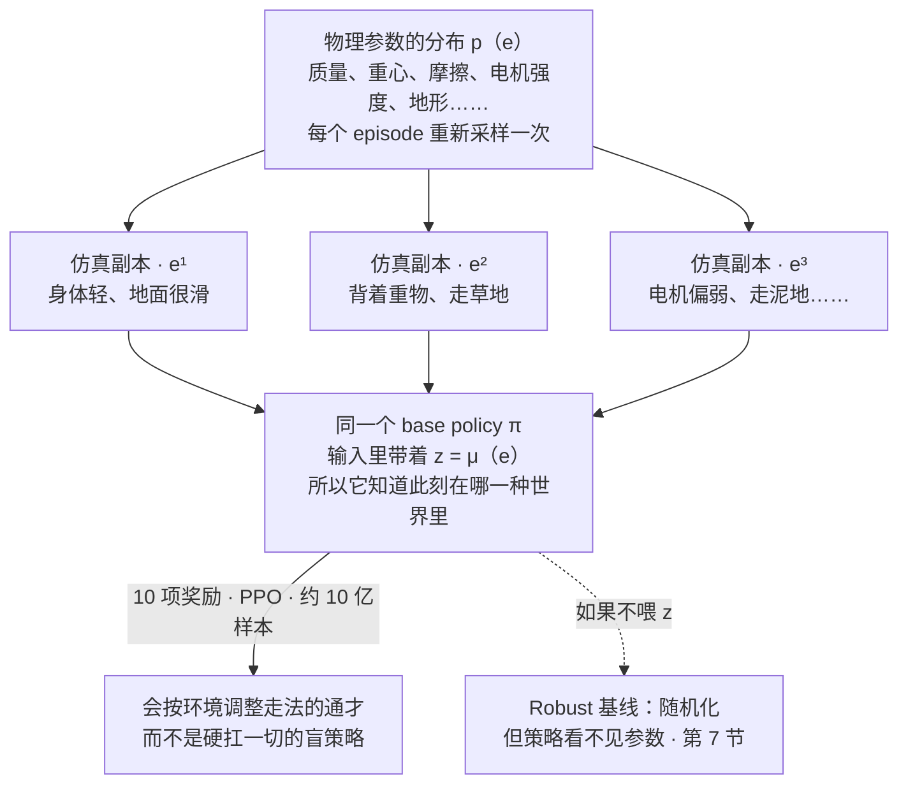
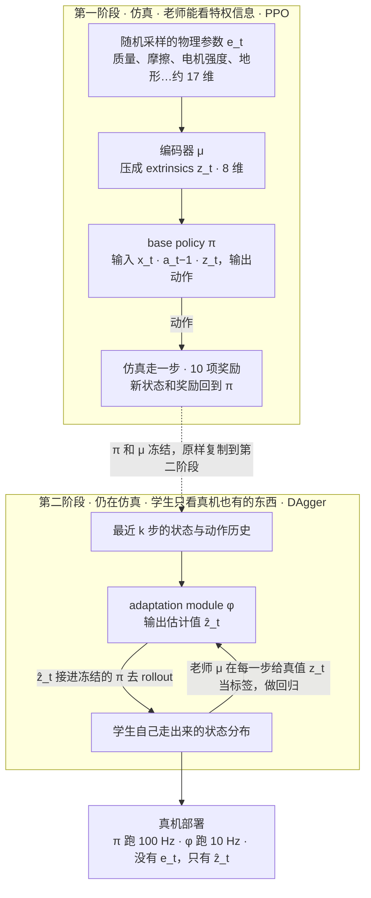
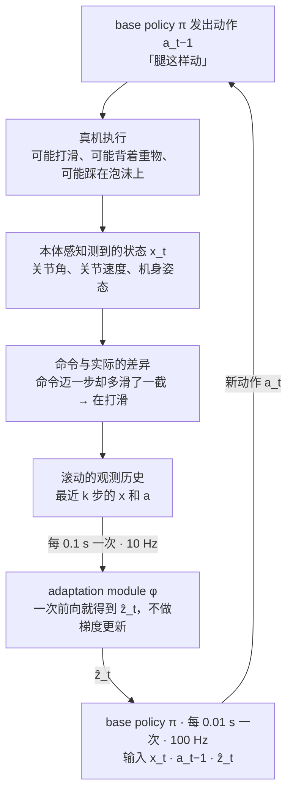
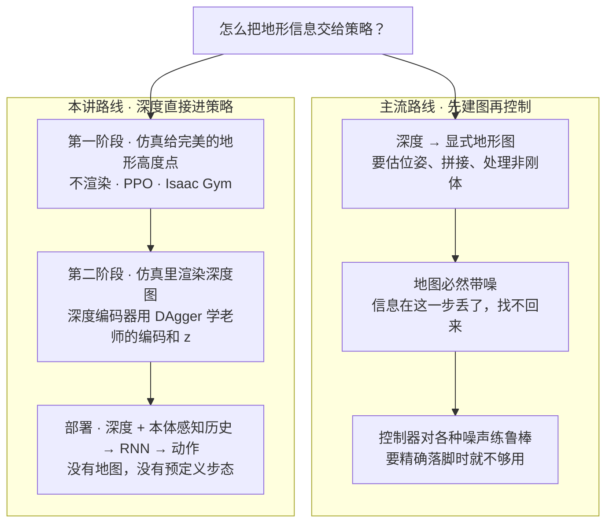

# CS224R 第 17 讲｜推进机器人智能：Sim-to-Real（客座 Ashish Kumar）

> Stanford CS224R: Deep Reinforcement Learning（2025 春）· 第 17 讲，2025 年 5 月 28 日 · 课表上的题目是 RL for Robots: Sim-to-Real Transfer，接在第 16 讲机器人 RL 之后、第 18 讲前沿之前
> 视频：<https://www.youtube.com/watch?v=Hp1WBWghrak>（49:48，英文字幕是自动生成的，人名、机器人术语和算法名错得多，见文末勘误）
> 讲者：Ashish Kumar（客座讲座；视频简介给的头衔是 AI Lead, Tesla Optimus。讲的主体是他在 UC Berkeley 读博时的腿式机器人工作，最后七八分钟是 Tesla 人形机器人的进展和他自己的展望）
> 课程主页：<https://cs224r.stanford.edu/> · 本讲没有指定阅读；讲座围绕的两篇主论文：[RMA: Rapid Motor Adaptation for Legged Robots](https://arxiv.org/abs/2107.04034)（Kumar et al., RSS 2021）· [Legged Locomotion in Challenging Terrains using Egocentric Vision](https://arxiv.org/abs/2211.07638)（Agarwal et al., CoRL 2022）

**一句话**：RL 在围棋、LLM 推理和机器人上真正跑通的案例，都靠两样东西——一个写得清楚、算得出来的奖励，以及一个能把策略大规模跑起来的地方。机器人在真实世界里两样都没有，最接近的替代品是仿真，但仿真里学会的走法一上真机就会撞上质量、摩擦、地面软硬这些看不见又会变的量。讲者的 RMA 配方分两步：先在物理参数被随机化、而且策略能"看见"这些参数（压缩成一个 8 维向量 z）的仿真里用 PPO 训一个 base policy；再训一个只看本体感知历史的 adaptation module，用 DAgger 让它学会从"命令了什么、实际动了多少"的差异里在几分之一秒内估出 z。同一组权重零样本上真机，盲走过石头、泥、沙、油面和 5 kg 负载；把深度图直接接进策略（不建地图），就能上楼梯、踩踏脚石；同一套配方还搬到了手内转物体和不同形态的无人机上。操作（manipulation）之所以还远不如行走可靠，正是因为可变形物体仿真不够快、奖励写不通用——讲者的赌注是算力会让仿真进步，通用奖励模型最坏也能靠人来标。

## 时间轴

| 时间 | 内容 |
|---|---|
| [0:06](https://www.youtube.com/watch?v=Hp1WBWghrak&t=6s) | 开场：拿"真正管用的"模仿学习和"真正管用的"RL 做对比 |
| [1:39](https://www.youtube.com/watch?v=Hp1WBWghrak&t=99s) | off-policy 数据 vs on-policy 数据；IL 给通才、RL 给专才；两者互补（AlphaGo、LLM） |
| [3:12](https://www.youtube.com/watch?v=Hp1WBWghrak&t=192s) | RL 的三个标志性成果，以及背后共同的两个要素：明确的奖励、能大规模运行策略 |
| [6:14](https://www.youtube.com/watch?v=Hp1WBWghrak&t=374s) | 机器人：仿真是拿到这两个要素的近似；sim-to-real 是本讲主题；伯克利户外盲走集锦 |
| [8:46](https://www.youtube.com/watch?v=Hp1WBWghrak&t=526s) | RMA 第一阶段：随机化物理参数并把它们（压成 z）喂给策略，PPO 训练；10 项奖励 |
| [10:48](https://www.youtube.com/watch?v=Hp1WBWghrak&t=648s) | 部署难题：z 在真机上看不见；用观测历史在线估计 |
| [12:23](https://www.youtube.com/watch?v=Hp1WBWghrak&t=743s) | 第二阶段：回仿真用 DAgger 训练 adaptation module；100 Hz 与 10 Hz |
| [13:24](https://www.youtube.com/watch?v=Hp1WBWghrak&t=804s) | 室内评估：倒油、5 kg 负载、活动木板；关掉适应模块会怎样 |
| [16:28](https://www.youtube.com/watch?v=Hp1WBWghrak&t=988s) | 适应模块内部：步态图、扭矩、z 的跳变 |
| [18:02](https://www.youtube.com/watch?v=Hp1WBWghrak&t=1082s) | 定量比较：Robust、SysID、真机微调、无适应 |
| [21:04](https://www.youtube.com/watch?v=Hp1WBWghrak&t=1264s) | 为什么要加视觉；问答：真机数据能否持续改进、直接训第二阶段、奖励系数、上一步动作 |
| [29:13](https://www.youtube.com/watch?v=Hp1WBWghrak&t=1753s) | 加视觉：先建地图的根本缺陷；深度直接进策略；两阶段训练；涌现的侧抬腿；基线 |
| [38:31](https://www.youtube.com/watch?v=Hp1WBWghrak&t=2311s) | 同一配方：手内旋转（接触检测假设）与无人机（估计质量和臂长） |
| [42:07](https://www.youtube.com/watch?v=Hp1WBWghrak&t=2527s) | 还剩什么：Tesla 人形与语言条件的操作；为什么操作落后于行走 |
| [46:13](https://www.youtube.com/watch?v=Hp1WBWghrak&t=2773s) | 推测：赌算力让仿真进步（Bitter Lesson）；通用奖励模型与 RL 的钻空子；超越人类 |

## 核心内容

### 1. 开场：拿"真正管用的"模仿学习和"真正管用的"RL 做对比

- 讲者先声明比较的口径：不是任意 IL 算法对任意 RL 算法，而是两边各自在最难的问题上真正跑通的那一批。
- **模仿学习管用的地方**：视觉语言模型的预训练、视频生成、图像分割。今天最好的这些模型，都是某种形式的模仿学习训出来的。它们的共同点：
    - 用 **off-policy 数据**：由人产生、或来自与最终策略毫无关系的来源；先清洗成一份好数据集再训练。（第 3 讲第 11 节和第 5 讲讲过 on-policy / off-policy：区别在于训练数据是不是当前策略自己生成的。）
    - 产物是**通才（generalist）**：一个模型做很多事。
- **RL 管用的地方**：博弈（围棋、仿真里的游戏）、LLM 推理（明显超出模仿学习预训练能到的水平）、机器人。共同点：
    - 用 **on-policy 数据**：要改进的那个策略自己去 rollout，再用这些数据更新自己；rollout 里**每一个数据点都能用**，好的坏的都算数——从负样本里学，是 RL 能学出非常精确的行为的原因之一。
    - 产物是**专才（specialist）**，或者把一个预训练的通才专业化。
- 不是说谁严格更好：AlphaGo 用模仿学习启动自我博弈和搜索；LLM 先用模仿学习把整个模型热身，再用 RL 把推理能力叠上去。
    > 小注：这里说的是 2016 年的 AlphaGo（先用人类棋谱做监督学习，再自我博弈）；2017 年的 AlphaGo Zero 把人类棋谱这一步去掉了，纯靠自我博弈从零学起。

两条路线的差别，写成目标函数就是"期望对谁取"：

$$
\text{IL: }\max_\theta\;\mathbb{E}_{(s,a)\sim\mathcal{D}_{\mathrm{human}}}\big[\log\pi_\theta(a\mid s)\big]
\qquad
\text{RL: }\max_\theta\;\mathbb{E}_{\tau\sim\pi_\theta}\Big[\textstyle\sum_t r(s_t,a_t)\Big]
$$

左边的期望在一份别人造好的固定数据集 D_human 上取，策略 π_θ 只负责把数据里的动作 a 在状态 s 下的概率抬高；右边的期望在当前策略 π_θ 自己走出来的轨迹 τ 上取，r 是每一步的奖励，好轨迹和坏轨迹都会进入更新。

### 2. RL 到底做到了什么，靠的是哪两样东西

- 三个定性成果：AlphaGo 超越人类，发现人没见过的新招；LLM 推理在很长的任务上保持连贯精确；机器人的灵巧性（dexterity）。三者相隔七八年，讲者认为共享同两个要素，本讲之后全部围绕它们展开：
    1. **写得清楚的奖励（well-specified reward）**。围棋的奖励是稀疏的（sparse：只在终局给一次）但极其明确——看一眼棋盘就知道赢没赢。LLM 推理用 DeepSeek-R1 那种规则奖励（rule-based reward），容易判定又能自动化，所以能规模化地拿到干净的奖励。（CS329A 的验证器、本课第 10 讲的可验证奖励说的就是这一条。）
    2. **能把策略大规模跑起来**。知道游戏规则就能把它放进仿真，随算力扩展：把算力转成数据，再用 RL 把数据转成更好的模型。LLM 则在集群上 rollout，用自动奖励函数评估，采数据、评估、改进三件事都极易扩展。
    > 小注：DeepSeek-R1 用的规则奖励主要是两类——答案对不对（accuracy）和格式对不对（format）；论文也明说在推理任务上刻意不用神经网络奖励模型，怕被 RL 钻空子。这和本讲第 10 节讲者的担忧是同一件事。

### 3. 机器人：用仿真拿到这两样东西，代价是 sim-to-real 缺口

*图 17-1｜从"RL 为什么管用"到"机器人为什么要走仿真"，再到本讲要补的三处缺口（自绘示意）· [▶ 看原幻灯片 6:14](https://www.youtube.com/watch?v=Hp1WBWghrak&t=374s)*

- 机器人在真实世界里两样都缺：奖励要靠人看，策略只能一台一台地跑。**仿真是最接近的近似**：有完整的世界状态，奖励可以用程序算；物理问题变成数字问题，随算力扩展。
- 但"在仿真里解决机器人"不等于"在真实世界解决机器人"，中间隔着 **sim-to-real 缺口**。讲座里它表现为三种：动力学参数（质量、摩擦、地面软硬、电机强弱）真机上看不见还会变；感知（仿真里能直接拿到地形高度，真机只有相机）；算力（板载计算只够让一部分模块跑 10 Hz）。
- 讲者先用结果说服你：伯克利户外的一台小四足机器人，**盲走**——没有视觉，只有本体感知（proprioception：关节角度、关节速度、机身姿态这些来自身体内部的传感信号），全部实时机载。脚被石头卡住就反复试探再继续；看不见的楼梯走得笨拙但不摔；草地、斜坡、工地、泥地（脚陷住就加力拔出来）、沙地。**所有片段是同一组权重**，零样本部署（zero-shot：不在真机上做任何调参或针对地形的改动）。这就是 RSS 2021 的 RMA。
    > 小注：RMA 论文里的机器人是 Unitree A1（课上说的 12 kg 就是它），仿真器是 RaiSim（字幕里写成了 "RAM"）。

### 4. 第一阶段：域随机化 = 在一族仿真器上训练，而且让策略看见参数

*图 17-2｜域随机化就是在一族仿真器上训练；RMA 的关键一步是把采样到的参数也交给策略（自绘示意）· [▶ 看原幻灯片 8:46](https://www.youtube.com/watch?v=Hp1WBWghrak&t=526s) · 出处：[Kumar et al., 2021](https://arxiv.org/abs/2107.04034)*

- 先把仿真当成真实世界，能拿到的东西都可以用：base policy 输出动作，仿真走一个 tick，返回新状态。固定一组物理参数训出的是只会在一种场景走路的窄策略，我们要的是所有场景都能走的通才。
- **域随机化（domain randomization）**：每个 episode 随机采样质量、摩擦等物理参数，相当于在一族仿真器上训练。讲者强调的关键一步是**把这些参数也作为输入交给策略**：它见过一大片参数范围，知道在什么质量、什么摩擦下该怎么走——不是对环境"盲"，而是清楚自己在应付什么。参数压缩后的向量叫 **extrinsics z**；问答里给了维度：z 约 8 维，原始参数约 17–18 维。
- **奖励**：主项是跟踪目标速度，其余是最小化做功和地面冲击。一共 10 项，讲者承认不优雅，但尽量讲原则：前几项定义任务（前向、侧向速度），中间一批是能量项，最后是稳定性和减少硬件损伤——仿真里没有"硬件坏了"这个概念，这些偏置必须手工注入，否则上不了真机。
- 整个系统（编码器 μ 和策略 π）用 PPO 端到端训练，约 10 亿个样本。PPO 的 clip 目标和 GAE 见第 5 讲第 6–8 节，这里直接当工具用。

$$
\max_{\theta,\,\mu}\;\mathbb{E}_{e\sim p(e)}\;\mathbb{E}_{\tau\sim\pi_\theta(\cdot\mid x_t,\,a_{t-1},\,z),\;\mathrm{sim}(e)}\Big[\textstyle\sum_t \gamma^{t}\, r_t\Big],\qquad z=\mu(e)
$$

e 是一个 episode 里采样到的物理参数向量，p(e) 是随机化的范围，sim(e) 是按 e 配置出来的那个仿真器；策略 π_θ 除了本体感知状态 x_t 和上一步动作 a_{t−1}，还读到 z = μ(e)，μ 和 π 一起被 PPO 更新。外层对 e 取期望，就是"通才"二字的数学含义。

$$
r_t=\underbrace{r_{\mathrm{vel}}\big(v_t,\,v^{\mathrm{cmd}}\big)}_{\text{task: track target velocity}}\;-\;\underbrace{\textstyle\sum_i w_i\,c_i(\tau_t,\dot q_t,f_t)}_{\text{energy: work, ground impact}}\;-\;\underbrace{\textstyle\sum_j w_j\,s_j}_{\text{stability, hardware safety}}
$$

v_t 是机身实际速度，v^cmd 是命令速度；c_i 是用关节力矩 τ_t、关节速度 q̇_t、触地力 f_t 算出的各种代价（做功、冲击等），s_j 是稳定性和保护硬件的惩罚项，w 是各自的权重。这是课上 10 项奖励的三组结构，具体每项的写法在论文里。

### 5. 第二阶段：z 在真机上看不见，就训一个学生从历史里估出来

*图 17-3｜老师靠特权信息学走路，学生靠历史猜出老师看到的 z；DAgger 保证标签打在学生自己会走到的状态上（自绘示意）· [▶ 看原幻灯片 12:23](https://www.youtube.com/watch?v=Hp1WBWghrak&t=743s) · 出处：[Kumar et al., 2021](https://arxiv.org/abs/2107.04034)*

- **部署时的麻烦**：z 在真机上是未知的。就算在客厅里把它估好，一到沙地或木屑上又失效。所以要**在运行时、几分之一秒内在线估计 z**。
- **凭什么估得出来**：用观测历史。你命令腿迈一步，某条腿却比预期多滑了一截——"命令了什么"和"实际动了多少"的差异就告诉你打滑了。一段时间内这种差异的历史，携带了估计 z 所需的信息。
- **怎么训**：回到仿真——那里既有 z 的真值也有观测历史，是个监督学习问题。具体用 DAgger（第 2 讲第 11 节）：让学生（adaptation module φ 接上冻结的 base policy）自己去 rollout，老师（第一阶段的编码器 μ）在每个时间步给出"本该估出的 z"当标签，监督学习更新 φ，再 rollout，再监督，反复。问答里讲者说得很朴素：φ 随机初始化，一开始跑出来的全是烂数据，每一轮好一点。要点和第 2 讲一样——标签打在学生自己会走到的状态上。
- **两个词**：训练时能看、部署时看不见的信息叫特权信息（privileged information）；老师-学生（teacher–student）蒸馏就是把靠它学到的行为转移给只看真机输入的学生。
- **部署**：base policy 跑 100 Hz，adaptation module 只跑 10 Hz——不是设计选择，是板载算力就这么多；训练时两者 100 Hz 同步，部署时不同步也没掉性能。
- 讲者的定位：这更像 **in-context learning**——历史进来，"学习"在一次前向传播里完成，而不是在真机上 rollout 再做梯度更新。第 13 讲元 RL 的"从经验推断隐藏的任务变量"是同一个思路：环境参数就是那个任务变量。

$$
\hat z_t=\phi\big(x_{t-k:t-1},\,a_{t-k:t-1}\big),\qquad
\min_\phi\;\mathbb{E}_{\tau\sim\pi(\cdot\mid\hat z)}\Big[\big\|\hat z_t-\mu(e_t)\big\|^2\Big]
$$

φ 只读最近 k 步的状态和动作，输出估计值 ẑ_t；损失是它与老师 μ(e_t) 的平方误差，而期望在"用 ẑ 驱动的策略自己走出来的轨迹"上取——这一点就是 DAgger，标签 μ(e_t) 只有仿真里才有。

### 6. 真机上适应模块到底在干什么：油、负载、关掉它会怎样

*图 17-4｜部署时的快速适应回路：学习发生在 φ 的前向传播里，几分之一秒，没有任何梯度（自绘示意）· [▶ 看原幻灯片 11:22](https://www.youtube.com/watch?v=Hp1WBWghrak&t=682s) · 出处：[Kumar et al., 2021](https://arxiv.org/abs/2107.04034)*

- **室内实验**（全部盲走）：塑料布上倒橄榄油，脚也包了塑料——打滑一下但继续前进，不翻；扔上 5 kg 负载（机器人 12 kg，差不多半个体重；额定负载约 3 kg）——身体先沉下去，几步之内恢复步态；踩在随脚移动的木板上照样走；床垫、泡沫、上下台阶都试过。
- **关掉适应模块**：第一步估一次 z 之后冻结。背 8 kg 时，重量把机器人往前压，它不知道该在前腿加大力矩、抬高离地间隙，于是前倾到抬不起下一步；泡沫上同理——事件没被检测到，就不会加力。
- **看内部**（油面实验的三张图）：步态图（gait plot：四条腿各自的触地时段，来自足底传感器）、前右膝的扭矩、z 里变化最大的两维。打滑瞬间步态乱了、扭矩抖动、z 跳变，随后步态和扭矩恢复。5 kg 落下时扭矩尖峰，之后回到规律步态，但**稳定在更高的扭矩水平**——要撑住多出来的重量。z 是学出来的，每一维不可直接解释，但能看到"出事了"被捕捉到。

### 7. 定量比较：对待"看不见的环境参数"的四种态度，以及问答

| 做法 | 怎么处理看不见的参数 e | 结果 |
|---|---|---|
| Robust | 随机化，但不喂给策略；一个盲策略硬扛一切 | 最常见的做法。保守，成功率更低；扭矩和加加速度（jerk）都更大——不知道环境，只能一味激进保证不摔 |
| SysID（系统辨识） | 不估压缩后的 z，直接从历史回归摩擦、质量这些物理量 | 估准很难（未必检测到全部打滑、也不知道确切质量），而且对"走稳"这个目标没必要；成绩反而低于 Robust |
| 真机微调 | 仿真策略拿到真机上 rollout，再做梯度更新 | 要先在真机上跑出数据再更新；RMA 是在前向传播里完成的 in-context 式适应，几分之一秒 |
| 无适应 | z 估一次就冻结 | 掉性能，仿真和真机上都验证过 |
| RMA | 历史 → φ → ẑ | 接近 expert，只差一点 |
| Expert | 直接看真值 z | 只能在仿真里存在，是上限 |

- **问答：能不能直接用 RL 端到端训第二阶段（策略直接读历史）？** 可以，算力够就行（GPU 仿真代替当年的 CPU 仿真）。但历史越长、信息越密，策略越可能钻仿真物理或奖励结构的空子。例子：训练时周期性地推机器人，带时间感的策略会学成"到点就绷紧"，一上真机就不灵；把推的时机也随机化才能绕开。讲者的观察：最成功的 sim-to-real 策略大多只用当前状态——"按状态索引"而不是"按状态和时间索引"；一旦带历史，历史的分布也得随机化够，多喂几步状态历史也一样。
- **问答：上一步动作为什么要当输入？** 它告诉策略上一拍命令了什么：一是让动作平滑一致，二是提供修正信号——上一拍没起作用，这一拍就该更大。状态本身有损，去掉它估计会掉性能。
- **问答：10 项奖励的系数怎么平衡？** 没有好办法。实际做法是一次只加一项：看当前组合缺什么，加进去后只调这一项相对其它项的权重，把指数级的搜索降成线性；系数多半不是最优的。
- **问答：真机上的 rollout 能不能拿来继续改进？** 两条路。一是真正的在线 RL——极限上什么都能学，但"永续在线改进"仍是开放问题（第 16 讲讲的真机自主学习走的就是这条路）。二是把上下文拉长——把一两天的经验压进上下文，靠 in-context learning 记住上次怎么修的；快而简单。哪个更完整讲者不敢说；他能想象一个记忆很长、在前向传播里持续改进、不需要 RL 梯度的系统，但负担会转移到"怎么在仿真里训出这种能力"。

### 8. 加上视觉：不建地图，把深度图直接接进策略

*图 17-5｜两条加视觉的路线：建图会在中间丢信息，直接耦合则把"看"的负担放进训练（自绘示意）· [▶ 看原幻灯片 32:52](https://www.youtube.com/watch?v=Hp1WBWghrak&t=1972s) · 出处：[Agarwal et al., 2022](https://arxiv.org/abs/2211.07638)*

- **盲走已经很强，为什么还要视觉**：一是跨缝隙、踩踏脚石、跳跃这些场景非看不可；二是效率、优雅和寿命——每次上楼都得先撞一下台阶才知道有台阶，硬件撑不了多久。
- **主流做法的根本缺陷**：感知与控制解耦，先建一张显式的地形图再交给控制器。建图本身是个更难的问题——非刚性物体、位姿漂移——地图必然带噪，信息在这一步丢掉就找不回来。于是只能训练控制器对各种噪声鲁棒，简单场景还行，要精确判断缝隙在哪时就不够。例子：原图里的边缘足够告诉你怎么落脚，转成度量地图并加噪之后就看不出了。
- **本工作的问法**：不是"地图要建多准"，而是"要不要地图"——把视觉和控制直接耦合，让动作头自己从感知里取需要的东西，中间不设瓶颈。
- **训练**：第一阶段和 RMA 一样，只多一个输入——地形高度采样点（完美、不加噪、不渲染），编码后进 MLP，PPO 训练，仿真器换成 Isaac Gym；奖励仍是跟踪速度加最小化能量；多种地形，一个策略全能走。第二阶段：真机上没有这些"点"，这里不去建图，而是在仿真里渲染深度图，训一个深度编码器去逼近老师的地形编码，extrinsics 照旧蒸馏，仍用 DAgger。分两阶段是为了速度：渲染深度很费时，直接在第二阶段用 RL 会慢一个数量级。
- **部署策略**：机载相机的自我中心深度（egocentric depth）加完整本体感知历史；这次用 RNN 拿稍长的上下文（RNN 不擅长很长的历史，社区因此转向 Transformer；这里没做消融）。

$$
\min_{\psi,\,\phi}\;\mathbb{E}_{\tau\sim\mathrm{student}}\Big[\big\|\psi(d_t)-\eta(m_t)\big\|^2+\big\|\phi(\mathrm{hist}_t)-\mu(e_t)\big\|^2\Big]
$$

d_t 是仿真渲染的深度图，m_t 是老师才有的地形高度点，η 是第一阶段学到的地形编码器，ψ 是学生的深度编码器；第二项和第 5 节一样是 extrinsics 的蒸馏。写法是我按讲座内容整理的，论文里的具体形式可能略有出入。

- **结果**：客厅里 20 张凳子摆成不同间距的踏脚石；几乎和机器人一样高的石阶；各种楼梯；几乎没有落脚点的滑面；CMU 附近的碎石堆——不总是一次成功，但**重试比上一次更合理**，讲者说这就是"在上下文里学习"。
- **涌现行为**：楼梯是给人设计的，机器人很矮，腿下没有空间直接抬腿——它学会把腿向侧面甩出去上楼；下楼时相对身高的倾斜也比 Spot 这样的高机器人大得多。没有预定义步态或足端轨迹，全靠 RL 搜索出来；踩点规划（footstep planning）也是涌现的——只在需要时才迈步。多地现场演示都稳，有一次脚垫脱落也跛着走完了。
- **基线**：盲策略；带噪地图（训练时也带同样的噪声）；直接深度。简单斜坡上三者差距小；地形一难，地图法几乎和盲一样差；楼梯和离散障碍上直接深度最好。有趣的一点：**楼梯上盲走反而比噪声地图好**——不准的地图比没有地图更糟。
    > 小注：这篇论文的机器人应仍是 Unitree A1，头部装一个 Intel RealSense 深度相机（推断自论文，课上只说"把相机和计算都绑在机器人身上"）。

### 9. 同一套配方：手内旋转与无人机

- **手内旋转**（Qi et al., CoRL 2022）：同一个策略转各种物体——纸巾卷、羽毛球、冰球、猕猴桃、杯子、方块；重量从 5 g 到近 200 g；摩擦、重心（有的物体挂着重物，重心跑到手指下方）、形状全变；仿真训练，零样本上真机。
- **机制假设**（模型到底怎么做的并不确定）：本体感知历史被用来做**接触检测**。画出某个关节的命令位置和实际位置：没接触时两条线重合，接触时实际位置达不到命令——这足以估计接触，进而推断物体的形状大小。
- 现场演示：橘子皮（力稍大就变形）、没见过的电源适配器——仿真根本做不到这种粒度。
    > 小注：论文摘要写明仿真里**只用圆柱体**训练，真机上却能转几十种形状、大小、重量不同的物体；手指的步态也是训练中涌现的。
- **无人机**（Zhang et al.）：同一组权重飞两台无人机，在线估计质量和臂长——一台比另一台重 4 倍、臂长 3 倍；直接控制每个螺旋桨的电机转速，不抽象到"容易的"控制层；用网球射螺旋桨仍然稳；起飞时先晃几下——它还在估自己是哪一台。
    > 小注：论文摘要里两台真机质量相差 4.5 倍（课上说的是约 4 倍），并能在飞行中适应达自重三分之一的突加扰动。

### 10. 还剩什么没解决？几乎全部

| | 行走（三四年前就做到了） | 操作（今天还不可靠） |
|---|---|---|
| 仿真技术 | 刚体接触已经够用 | 切菜、揉面团：可变形物体仿真慢，或者根本做不到 |
| 奖励 | "跟踪速度"就是完整的任务规范；随机化地形就得到通才 | 就算有完整仿真状态，切菜也得写"每片多大"的奖励，还取决于要做什么菜；写好了只得到一个任务，擀面、撒面粉又要新奖励——手工、不可扩展 |
| 讲者的赌注 | — | 算力让仿真进步；通用奖励模型，最坏由人来标 |

- **还剩什么**：几乎所有。还没有通用机器人模型能控制通用硬件做人能做的事。讲者选人形——已知能做人做的一切。
- **Tesla 的进展**：双足上坡——比四足更不宽容，更不稳定、要更快反应；同样仿真训练、零样本上硬件。跳舞视频：实时、机载、自主。第一个跑通之后第十个很快，因为管线简单。操作：同一个网络接语言输入执行命令，关键成分是**视频**——从人类第一视角视频加少量机器人数据学；能做很多任务，但不可靠。目标是一致性、灵巧、敏捷、可靠都到人类水平。
- **为什么行走早就灵巧可靠、操作还没有**：回到两个要素，上表逐项对照——仿真够不够用，奖励写不写得出。
- **推测部分**（讲者声明从这里起全是推测）：
    - 仿真：可变形物体能仿真但慢，有些交互目前完全仿真不了；但没有根本理由说仿真不能随算力扩展——押注算力，依据是 Sutton 的短文 The Bitter Lesson：能利用算力的通用方法最终最有效，而且差距很大。
    - 通用奖励模型：用大模型对世界的理解定义奖励？可能行，但 RL 会利用模型的弱点：RLHF 训久了模型会跑出分布（第 9 讲、CME295 第 5 讲的 reward hacking）；DeepSeek 也发现不用规则奖励时 RL 到某一步就开始钻空子。仍乐观的理由：最坏情况让人来标，人有几十亿，很可扩展。
- **结语**：主流把"追平人类"当机器人的目标，那一天是文明级事件，但只是第一步——电力矩驱动的执行器和硅基计算，可能做到人类想不到的事，更快、更高效、更敏捷。AlphaGo 已经用稀疏奖励加大量搜索发现了超越人类的行为。后续问题：让机器人不只匹配人类，而是超越。

## 关键图表速查（点时间戳跳到原幻灯片）

| 图 | 看什么 | 跳转 | 出处 |
|---|---|---|---|
| IL 与 RL 的对比表 | 左列 off-policy 数据、清洗、通才；右列 on-policy 数据、正负样本都用、专才 | [0:36](https://www.youtube.com/watch?v=Hp1WBWghrak&t=36s) | — |
| RL 三大成果与两个要素 | AlphaGo、LLM 推理、机器人共享"明确奖励 + 大规模运行"；三者相隔七八年 | [4:14](https://www.youtube.com/watch?v=Hp1WBWghrak&t=254s) | — |
| 户外盲走集锦 | 同一组权重零样本：石头、楼梯、草地、斜坡、工地、泥、沙 | [6:45](https://www.youtube.com/watch?v=Hp1WBWghrak&t=405s) | [RMA](https://arxiv.org/abs/2107.04034) |
| 第一阶段训练框图 | 随机化参数 → μ → z → base policy；PPO 训练 | [8:46](https://www.youtube.com/watch?v=Hp1WBWghrak&t=526s) | [RMA](https://arxiv.org/abs/2107.04034) |
| 10 项奖励 | 任务项、能量项、稳定与护硬件项三组 | [10:17](https://www.youtube.com/watch?v=Hp1WBWghrak&t=617s) | [RMA](https://arxiv.org/abs/2107.04034) |
| 在线估计 z 的思路 | 命令与实际运动的差异携带环境信息 | [11:22](https://www.youtube.com/watch?v=Hp1WBWghrak&t=682s) | [RMA](https://arxiv.org/abs/2107.04034) |
| 第二阶段 DAgger 框图 | 学生 rollout、老师逐步标 z；部署时 100 Hz 与 10 Hz | [12:23](https://www.youtube.com/watch?v=Hp1WBWghrak&t=743s) | [RMA](https://arxiv.org/abs/2107.04034)、[DAgger](https://arxiv.org/abs/1011.0686) |
| 步态图、扭矩、z 曲线 | 打滑或落重物时步态乱、z 跳变，随后恢复；扭矩停在更高水平 | [16:28](https://www.youtube.com/watch?v=Hp1WBWghrak&t=988s) | [RMA](https://arxiv.org/abs/2107.04034) |
| 定量比较表 | Robust、SysID、真机微调、无适应 vs RMA、expert | [18:02](https://www.youtube.com/watch?v=Hp1WBWghrak&t=1082s) | [RMA](https://arxiv.org/abs/2107.04034) |
| 视觉两阶段训练 | 第一阶段完美地形点不渲染，第二阶段渲染深度做蒸馏 | [32:52](https://www.youtube.com/watch?v=Hp1WBWghrak&t=1972s) | [Agarwal et al.](https://arxiv.org/abs/2211.07638) |
| 侧抬腿上楼与涌现踩点 | 没有预定义步态；只在需要时迈步 | [35:26](https://www.youtube.com/watch?v=Hp1WBWghrak&t=2126s) | [Agarwal et al.](https://arxiv.org/abs/2211.07638) |
| 视觉基线比较 | 难地形上地图法接近盲走；楼梯上盲走反而比噪声地图好 | [36:59](https://www.youtube.com/watch?v=Hp1WBWghrak&t=2219s) | [Agarwal et al.](https://arxiv.org/abs/2211.07638) |
| 接触检测假设 | 命令与实际关节位置重合 = 无接触，分离 = 接触 | [39:35](https://www.youtube.com/watch?v=Hp1WBWghrak&t=2375s) | [Qi et al.](https://arxiv.org/abs/2210.04887) |
| 行走 vs 操作的两要素 | 仿真够不够、奖励写不写得出 | [44:42](https://www.youtube.com/watch?v=Hp1WBWghrak&t=2682s) | — |

## 提到的工作

| 名称 | 在本讲里的作用 |
|---|---|
| [AlphaGo](https://www.nature.com/articles/nature16961)（Silver et al., 2016） | 三大成果之一：稀疏但明确的奖励、仿真里自我博弈；用 IL 启动；结尾"超越人类"的例证 |
| [DeepSeek-R1](https://arxiv.org/abs/2501.12948)（DeepSeek, 2025） | 规则奖励的例子；也是"不用可验证奖励时 RL 会钻空子"的例子（第 10 讲、CS329A） |
| [RMA](https://arxiv.org/abs/2107.04034)（Kumar et al., RSS 2021） | 本讲主线：两阶段训练、在线估计 extrinsics、盲走上真机 |
| [PPO](https://arxiv.org/abs/1707.06347)（Schulman et al., 2017） | 两篇工作第一阶段的训练算法（第 5 讲） |
| RaiSim | RMA 用的 CPU 物理仿真器 |
| [DAgger](https://arxiv.org/abs/1011.0686)（Ross et al., 2011） | 第二阶段训练 adaptation module 和深度编码器的方法（第 2 讲第 11 节） |
| 域随机化（应出自 [Tobin et al., 2017](https://arxiv.org/abs/1703.06907)） | Robust 基线：随机化但不告诉策略；RMA 在它之上加了"把参数喂给策略" |
| 系统辨识（system identification） | 基线：显式估计摩擦、质量等物理量 |
| [Egocentric vision locomotion](https://arxiv.org/abs/2211.07638)（Agarwal et al., CoRL 2022） | 视觉部分：不建地图，深度直接进策略 |
| [Isaac Gym](https://arxiv.org/abs/2108.10470)（Makoviychuk et al., 2021） | 视觉工作用的 GPU 仿真器 |
| RNN 与 Transformer | 部署策略用 RNN 拿上下文；没做 Transformer 消融 |
| Spot（Boston Dynamics） | 对比：高机器人下楼时倾斜小得多（字幕里写成 "sport"，应为 Spot） |
| [In-Hand Object Rotation via RMA](https://arxiv.org/abs/2210.04887)（Qi et al., CoRL 2022） | 同一配方用于手内旋转；接触检测假设 |
| [Near-hover quadcopter controller](https://arxiv.org/abs/2209.09232)（Zhang et al., 2022） | 同一配方用于不同形态的无人机 |
| Tesla Optimus | 人形：双足上坡、跳舞、语言条件的操作 |
| RLHF（第 9 讲、CME295 第 5 讲） | RL 利用奖励模型弱点的例子 |
| [The Bitter Lesson](http://www.incompleteideas.net/IncIdeas/BitterLesson.html)（Sutton, 2019） | 押注算力的依据 |

## 术语对照

| English | 中文 |
|---|---|
| imitation learning (IL) | 模仿学习：从示范数据做监督学习（第 2 讲） |
| on-policy / off-policy data | 当前策略自己生成的数据 / 别处来的数据 |
| generalist / specialist | 通才 / 专才 |
| well-specified reward | 写得清楚、算得出来的奖励 |
| sparse reward | 稀疏奖励：只在终局给一次 |
| rule-based / verifiable reward | 规则奖励 / 可验证奖励：能自动判定对错 |
| sim-to-real (transfer, gap) | 仿真到真机的迁移；两者之间的差距 |
| zero-shot deployment | 零样本部署：不在真机上做任何调整 |
| proprioception | 本体感知：关节角、关节速度、机身姿态等内部传感 |
| blind locomotion | 盲走：不用视觉 |
| base policy | 基础策略：真正输出动作的网络 |
| extrinsics z | 环境参数压缩后的向量 |
| privileged information | 特权信息：训练时能看、部署时看不见 |
| teacher–student distillation | 老师-学生蒸馏：把靠特权信息学到的行为转移给只看真机输入的学生 |
| adaptation module φ | 适应模块：从观测历史估计 z |
| DAgger | 数据聚合：在学生自己走到的状态上让老师打标签 |
| domain randomization | 域随机化：训练时随机采样物理参数 |
| system identification (SysID) | 系统辨识：显式估计物理量 |
| in-context learning | 上下文内学习：适应发生在前向传播里，不更新权重 |
| gait / gait plot | 步态 / 步态图（各条腿的触地时段） |
| torque | 力矩（关节输出） |
| jerk | 加加速度：加速度的变化率，衡量动作有多"猛" |
| payload | 负载 |
| terrain map / elevation map | 地形图 / 高程图：显式的地面高度表示 |
| egocentric depth | 自我中心的深度图：机器人自己视角的相机 |
| terrain height samples (scandots) | 地形高度采样点：仿真里给老师的特权地形信息 |
| RNN | 循环神经网络：按时间整合信息 |
| emergent behavior | 涌现行为：没写进规则、训练中自己出现 |
| footstep planning | 踩点规划 |
| dexterous manipulation / in-hand rotation | 灵巧操作 / 手内旋转 |
| contact detection | 接触检测 |
| morphology | 形态：机器人的身体构型（质量、臂长等） |
| quadruped / biped / humanoid | 四足 / 双足 / 人形 |
| rigid-body contact / deformable objects | 刚体接触 / 可变形物体 |
| reward exploitation | 钻奖励的空子（即 reward hacking） |
| general reward model | 通用奖励模型：用一个大模型给任意任务打分 |
| The Bitter Lesson | Sutton 的短文：能利用算力的通用方法最终胜出 |

## 字幕勘误

"Alph Go""alpho""Alph" → AlphaGo；"game of war" → game of Go；"DeepSseek Arvin paper" → DeepSeek-R1 论文；"RAM"（仿真器）→ RaiSim；"PO" → PPO；"RM"（21 分钟处）→ RMA；"CIS ID" → SysID（system identification）；"Coral 2022" → CoRL 2022；"propriception""propriceptive" → proprioception、proprioceptive；"gate" → gait；"talk profile""top profile" → torque profile；"simal""simtoreal" → sim-to-real；"bomb starting" → bootstrapping；"warmart" → warm-start；"self-player search" → self-play 与 search；"test bit" → testbed；"zeroot" → zero-shot；"quadriped" → quadruped；"rendering death" → rendering depth；"dextrous" → dexterous；"sport robot" → 应为 Spot robot；"phase to""phased to" → phase 2；"agile textures" → agile and dexterous；"agile index" → agile and dexterous；"Z1 and Z2 Z5" → z 的两个分量（应为 z_1 与 z_5）。

## 带走的问题

1. RMA 的 z 只有 8 维、不可解释；SysID 显式估 17 维物理量反而更差。为什么"估得准"和"走得好"不是一回事？这和 CS329A 里"验证器只需分对错、不必给出解释"有什么相似之处？
2. 讲者说最成功的 sim-to-real 策略多数只用当前状态，历史越长越容易钻仿真的空子；第 13 讲却说要给策略更长的记忆才能做 in-context 适应。两者矛盾吗？RMA 的两阶段设计是怎么在其间取舍的——哪个模块看历史、哪个不看、为什么这样分？
3. 楼梯上盲走比用带噪地图还好。把这个结论翻译到你做的 agent：一个中间表示（比如工具返回的结构化摘要）什么时候会比原始输入更有害？"直接把原始信号接进策略"的代价又是什么？
4. 操作落后于行走的两个原因是仿真不够、奖励写不通用。如果只能改善一个，改哪个？讲者对"通用奖励模型会被 RL 钻空子"的回答是"最坏情况让人来标"——这个论证放到 LLM 的 RLHF 上还成立吗（第 9 讲的 reward hacking 就是人标的奖励模型被钻了空子）？
5. 讲者说"第一个跑通之后第十个很快，因为管线简单"。RMA 的管线里，哪些部分是任务无关、可以直接复用的，哪些是每个新任务都要重做的（奖励项、随机化范围、选哪些量当特权信息）？
