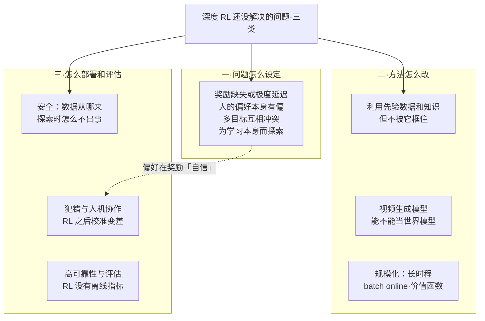
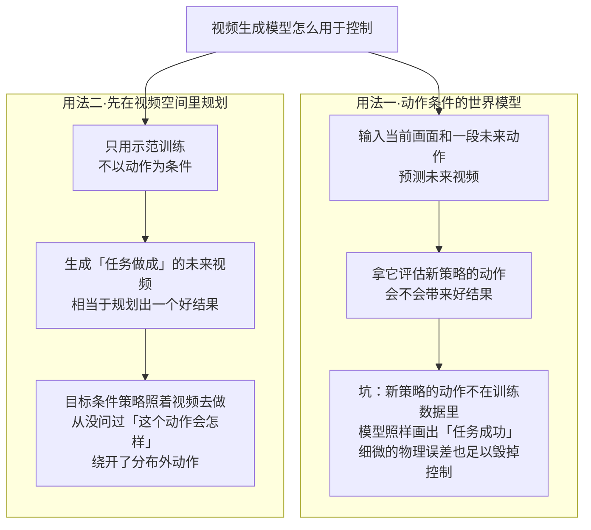
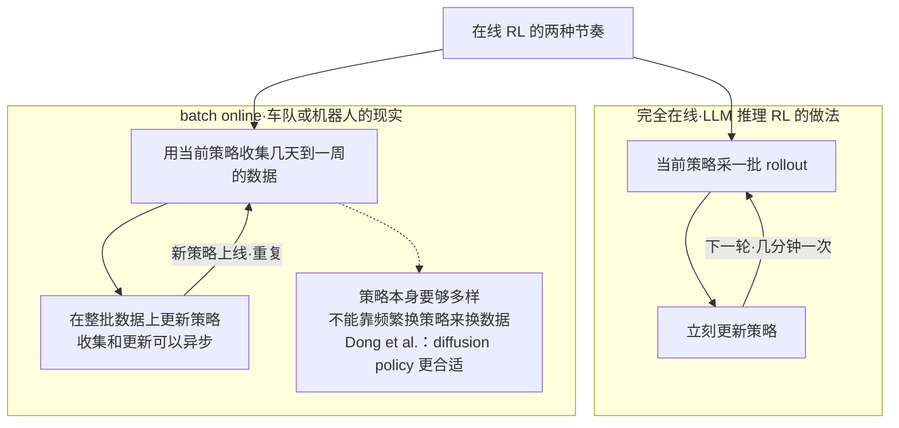
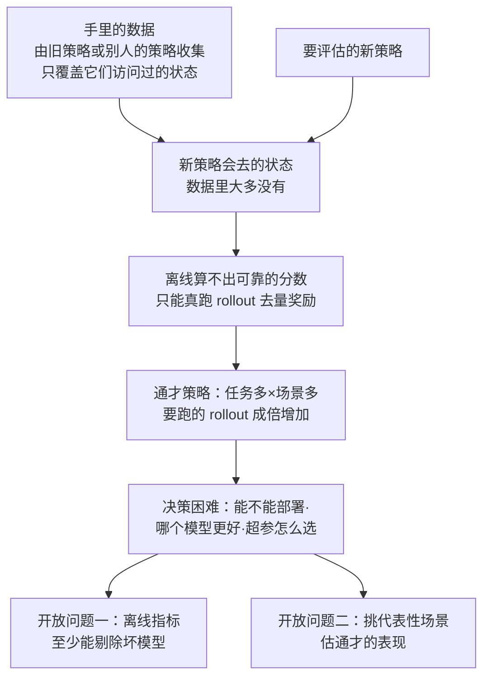
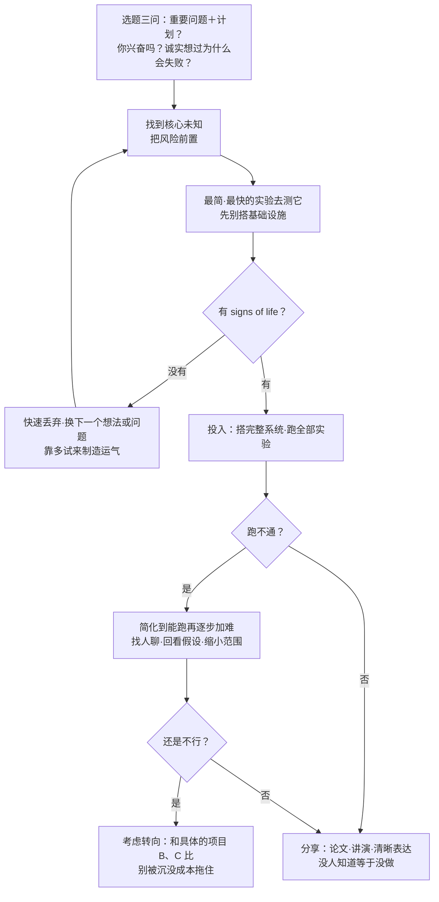

# CS224R 第 18 讲｜前沿与怎么做研究（Frontiers）

> Stanford CS224R: Deep Reinforcement Learning（2025 春）· 第 18 讲，2025 年 5 月 30 日 · 全课最后一讲
> 视频：<https://www.youtube.com/watch?v=FacJ_1tTSx4>（1:10:49，英文字幕是自动生成的，论文作者名几乎全被认错，见文末勘误）
> 讲者：Chelsea Finn（本课主讲，不是客座）· 前半讲开放问题与前沿，后半讲怎么做研究
> 课程主页：<https://cs224r.stanford.edu/> · 本讲没有指定阅读

**一句话**：这一讲不讲新算法。前半段把深度 RL 还没解决的问题分成三类——问题怎么设定（真实任务没有奖励，人给的偏好本身有偏，多目标不知道怎么配平）、方法怎么改（用先验数据但别被它框住，视频生成模型能不能当世界模型，RL 怎么在长时程和"批式在线"的现实里规模化）、怎么部署和评估（安全、校准、可靠性，以及 RL 没有可靠的离线指标）；后半段是她给博士生的做研究方法：选题看"重要问题 + 可行计划 + 你是否兴奋 + 诚实评估失败原因"，做的时候把风险前置、用最简实验找 signs of life、跑不通就先简化到能跑，最后要把学到的东西讲出去——研究的产出是知识，没人知道就等于没做。

## 时间轴

| 时间 | 内容 |
|---|---|
| [0:06](https://www.youtube.com/watch?v=FacJ_1tTSx4&t=6s) | 开场：本讲两部分——开放问题与怎么做研究；开放问题分三类：问题设定、方法、部署与评估 |
| [0:52](https://www.youtube.com/watch?v=FacJ_1tTSx4&t=52s) | 问题设定：奖励好定义的领域 vs 现实；聊天机器人偏好优化的偏差（Sharma et al.）；个性化与极化；多目标配平 |
| [4:13](https://www.youtube.com/watch?v=FacJ_1tTSx4&t=253s) | 机器人奖励难标（叠衬衫）；YouTube 推荐的奖励是人手调的；科学推理没有标准答案；人类靠玩耍学习 |
| [7:49](https://www.youtube.com/watch?v=FacJ_1tTSx4&t=469s) | 方法一：利用先验数据和知识；Ball et al. 2023 预训练权重反而更差；用先验又要超越先验 |
| [10:53](https://www.youtube.com/watch?v=FacJ_1tTSx4&t=653s) | 方法二：视频生成模型当世界模型；动作条件模型的分布外问题；两条出路 |
| [14:34](https://www.youtube.com/watch?v=FacJ_1tTSx4&t=874s) | 方法三：规模化；LLM RL 成功于短时程、极端在线；价值函数规模化；batch online 设定；Dong et al.；问答：离线算法 |
| [19:45](https://www.youtube.com/watch?v=FacJ_1tTSx4&t=1185s) | 部署一：安全关键领域；形式验证的局限；安全是开放世界问题；数据的代价；学习过程中的安全（骑车不扶把） |
| [23:48](https://www.youtube.com/watch?v=FacJ_1tTSx4&t=1428s) | 部署二：犯错与幻觉（秤的读数）；人机协作（医生 92 / 76 / 74）；RL 后校准变差；Tian et al. |
| [27:40](https://www.youtube.com/watch?v=FacJ_1tTSx4&t=1660s) | 部署三：没人兜底要高可靠（Luo et al. 100 / 100）；评估：RL 没有离线指标；通才评估；GPT-4o 谄媚回滚 |
| [31:28](https://www.youtube.com/watch?v=FacJ_1tTSx4&t=1888s) | 两个具体的开放问题；前沿部分收尾；问答：为什么 RL 会破坏校准 |
| [34:02](https://www.youtube.com/watch?v=FacJ_1tTSx4&t=2042s) | 第二部分：怎么做研究；她自己的来路；研究的三个现实 |
| [38:37](https://www.youtube.com/watch?v=FacJ_1tTSx4&t=2317s) | 选题三步；想法驱动 vs 问题驱动；找瓶颈；实习做视频预测的故事；别把自己框在一个领域；别做完美主义者 |
| [47:55](https://www.youtube.com/watch?v=FacJ_1tTSx4&t=2875s) | 处理风险：前置风险、最简实验、多迭代、看到 signs of life 再投入；两个例子（正弦回归、左右夹爪） |
| [54:35](https://www.youtube.com/watch?v=FacJ_1tTSx4&t=3275s) | 让东西跑起来：先简化再加难；找人聊；回看假设；缩小范围的故事；何时转向与沉没成本 |
| [1:01:12](https://www.youtube.com/watch?v=FacJ_1tTSx4&t=3672s) | 问答：领域太快怕被抢先；分享研究：产出是知识；不想分享的理由与反驳；清晰表达 |
| [1:07:21](https://www.youtube.com/watch?v=FacJ_1tTSx4&t=4041s) | 导师、信心；结语：现在是做研究最好的时候 |

## 核心内容

### 1. 全景：三类开放问题，各自接在这门课的哪一讲

*图 18-1｜本讲前半段的地图：三类开放问题和它们的子方向，虚线是讲者在问答里点出的一处关联（自绘示意）· [▶ 看原幻灯片 0:06](https://www.youtube.com/watch?v=FacJ_1tTSx4&t=6s)*

- 开场：这一讲讲两件事——深度 RL 还有哪些没解决的问题，以及怎么做偏实证的研究。开放问题按三类整理：**问题怎么设定**（奖励和目标从哪来）、**方法怎么改**、**怎么部署和评估**；清单不求穷尽，挑的是她被问得最多或自己觉得最有意思的几个。
- 每个方向都对应这门课前面某一讲教过的工具，"前沿"就是那个工具在真实世界里撞到的墙。下表是这层对应关系。

| 方向 | 课上打的底 | 撞到的墙 |
|---|---|---|
| 奖励从哪来 | 第 1 讲的 MDP 把奖励当给定；第 8 讲从偏好学奖励；第 10 讲可验证奖励 | 真实任务没有奖励或极度延迟；人给的偏好本身有偏；多目标怎么配平没人知道 |
| 利用先验数据 | 第 2 讲模仿学习；第 5 讲 replay buffer；第 7 讲离线 RL | 预训练权重可能反而限制探索；一段新闻、一个提示这类抽象知识塞不进现有格式 |
| 世界模型 | 第 11 讲基于模型的 RL | 视频生成模型知识丰富，但对分布外动作和细微物理都不可靠 |
| 规模化 | 第 3–4 讲策略梯度与价值函数基线；第 9–10 讲 LLM 上的 RL | 成功案例都是短时程、极端在线；价值函数在大规模下只当基线；现实的数据节奏是 batch online |
| 安全 | 第 14 讲探索；第 16 讲自主学习 | 安全是开放世界问题，靠数据又要付出收集不安全数据的代价；探索期间怎么不出事 |
| 校准与人机协作 | 第 9 讲 RLHF | RL 后训练把分布"锐化"，模型更自信却更不校准；人机合作的准确率可能不如 AI 单干 |
| 可靠性与评估 | 第 7 讲的分布偏移；第 16 讲真机 RL | 没人兜底时要 100 次成 100 次；RL 没有可靠的离线指标，通才策略的评估成本爆炸 |

### 2. 问题设定：奖励和目标从哪来

- **有奖励的地方 RL 已经很顺**：游戏、数学推理、写代码，奖励容易定义、结果容易验证（第 10 讲；CS329A 里的 verifier 就是这一类）。但真实世界里大量任务**没有奖励，或者奖励要很久才来**。
- **聊天机器人：偏好优化看起来成功，其实问题很大**。第 8–9 讲的偏好优化（从"两个回答哪个好"学奖励、再去优化）已经能大规模部署，但 Sharma et al. 分析了人给的偏好到底在奖励什么（其他条件相同时，带某个特征的回答被偏好的概率）：排在最前面的是**和提问者观点一致**、**说得自信**，**事实性**排在最底下。也就是说人不是在给"好的回答"打分，而是在给"想听的回答"打分。
- **个性化也未必是我们想要的目标**：迎合每个人的信念做推荐，放大到全体用户就是极化——持极端观点的人只会看到更极端的内容。她的结论是：现实里总有多个我们都在乎的目标，它们互相冲突，怎么配平本身就是难题。
- **机器人**：真机上只有二值奖励（成功 / 失败），仿真里靠人手写奖励项（hand-shaped reward），费力且要大量标注；就算有人标也难打分——几件机器人叠好的衬衫，褶皱多少、放没放正，连人都说不清。
- **YouTube 推荐**（她引了一篇公开论文）：优化 engagement（点没点）和 satisfaction（点了之后喜不喜欢），都合理，但论文写明两者怎么合成一个奖励是**人手工调的**。
- **科学推理**：数学题有标准答案，扩展到更广的科学问题时你不知道答案是什么，验证就没了着落，训练本身也就受限。
- **人是怎么学的**：小孩满地打滚、随便玩玩具，不是在优化某个任务，也许是在优化"学到东西"或"探索"本身；让机器也这样学是开放问题（最接近的是第 14 讲的内在动机）。

$$
r(x,y)=\sum_{i} w_i\, r_i(x,y)
$$

这是我把她举的几个例子写成的同一个形状：r_i 是各个子目标（有用、事实、点击、满意……），w_i 是权重；她的观察是 w_i 至今要么人拍脑袋定，要么没人说得清。

> 小注：偏好分析那篇应为 Sharma et al., 2023《Towards Understanding Sycophancy in Language Models》，讲者没报标题，也没用 sycophancy 这个词。YouTube 那篇应为 Zhao et al., RecSys 2019《Recommending What Video to Watch Next》。

### 3. 方法一：利用先验数据和知识，但别被它框住

- **默认工具只有两个**：拿预训练权重初始化，或者把已有数据灌进 replay buffer（第 5 讲：存历史转移、供反复采样的数据池）。但先验知识不一定长成数据的样子——从新闻里读到的事实、一个解题提示，都塞不进这两条管道。
- **更麻烦的是，这两条管道可能反而限制模型**。她举 Ball et al. 2023：示范数据只灌进 buffer、不预训练权重，反而比预训练权重更好。解释是：预训练模型的输出层往往已经收敛得很"确定"，最后一层几乎不探索。反过来看 LLM 上 RL 为什么顺——预训练语言模型的 token 分布本来就分散，探索是自带的。
- **为什么重要**：LLM 要解人类没解过的问题、机器人和自动驾驶要比人更快更可靠，都得站在先验知识上又不被它"框死"。她认为 RL 是超越人类能力最有希望的工具，但"用先验又能超越先验"仍然开放。
    > 小注：Ball et al. 2023 应为 RLPD（Efficient Online RL with Offline Data）：离线数据和在线数据各占一半地从 buffer 里采样、不做预训练、加 LayerNorm 和更高的更新次数；讲者引的是它"预训练权重反而更差"的对照实验。

### 4. 方法二：视频生成模型能不能当世界模型

*图 18-2｜视频生成模型的两种用法：拿来评估动作会撞上分布外问题，拿来规划结果则绕开它（自绘示意）· [▶ 看原幻灯片 11:56](https://www.youtube.com/watch?v=FacJ_1tTSx4&t=716s)*

- **为什么大家都在问**：视频生成模型显然掌握了大量世界知识——炉子上怎么做饭、手指怎么敲键盘（哪怕键盘是软糖做的）、走路什么样，按理说该对学行为有用。
- **坑在哪**（图 18-2 左）：训一个**动作条件**的视频模型（输入当前画面和一串未来动作、预测未来画面），数据来自某一个策略（往往是示范），拿它去评估**另一个策略**的动作，这些动作不在训练分布里，模型就会瞎预测：数据里大多是成功的示范，它就倾向于画出"任务成功"，哪怕这串动作根本做不成。而且视频看着再真，不等于底下的物理是对的——一点点误差就足以让控制失败。这和第 11 讲"模型的错误被策略利用"是同一个问题。
- **两条出路**：一是用**很多不同策略**的数据来训，指望动作分布覆盖够广；二是**换一种用法**（图 18-2 右）——不要动作条件，只用示范训一个"接下来画面会怎样"的模型，先在视频空间里规划出好结果，再让目标条件策略（第 12 讲）照着做：模型只回答"好的未来长什么样"，从不回答"这个动作会怎样"。
    > 小注：出路二应为 UniPi（Du et al., 2023）一路的做法：按文本指令生成任务视频，再用逆动力学模型把相邻帧翻译成动作；讲者没点名。

### 5. 方法三：规模化——长时程、batch online 与价值函数

*图 18-3｜完全在线与 batch online 的循环节奏：后者一轮收一大批数据，所以策略自己必须够多样（自绘示意）· [▶ 看原幻灯片 17:40](https://www.youtube.com/watch?v=FacJ_1tTSx4&t=1060s)*

- **成功都在"短时程 + 极端在线"这个角落**。LLM 上的大规模 RL 是真成功，但条件苛刻：偏好优化几乎都是**单轮**的——奖励只看下一条回复，不看整段对话，所以时程短、收集数据不需要人在回路里；数学推理的 RL（第 10 讲）则依赖**海量在线样本和策略更新交替进行**。一旦时程变长，或者收集数据要和人、和物理世界打交道，这两个条件都不成立。
- **长时程需要价值函数**（第 4 讲：V(s) 估计从状态 s 出发、按当前策略能拿到的期望回报）。大规模 PPO 里确实训了价值函数，但只用来当基线降方差，精度未必够做完整的 actor-critic 更新，更不够像 Q-learning（第 6 讲）那样直接靠它选动作。能不能把价值函数学到"直接优化策略"的精度，她认为是长时程问题的关键之一。
- **batch online：现实的数据节奏**（图 18-3）。自动驾驶公司不可能让整个车队每 30 秒、每分钟甚至每小时同步一次策略；现实是先收几天到一周的数据，在整批数据上更新一次，再把新策略推下去，循环往复。这个设定介于完全在线和完全离线（第 7 讲）之间，算法上有新讲究：Dong et al. 发现这时**表达力强的策略**（比如第 2 讲的 diffusion policy）非常重要——完全在线时策略偏确定也无妨，多样性来自策略的频繁变化；batch online 没有这份奢侈，多样性只能靠策略自己够分散。
- **问答**：DPO 这类算法不是已经很离线了吗？——是，也成功，但解决的是短时程问题；真正的问题是长时程能不能少用在线数据。
    > 小注：Dong et al. 应为 2025 年关于 batch online RL 的工作，讲者没给标题，这里不链接。

### 6. 部署一：安全——数据从哪来，学习过程中怎么不出事

- **哪些领域**：医疗、驾驶、心理咨询、法律和政治讨论——出错就是安全事故。
- **老办法的局限**：形式化验证或概率保证，前提假设在真实世界基本不成立；在无穷多的现实场景里完全保证安全是不可能的，人自己（司机、外科医生、飞行员）也会犯错；目标只能是有效处理安全关键场景，而不是证明不会出事。
- **安全是开放世界问题**——你得应付模型出错的每一种方式，而处理开放世界最成功的工具是大规模机器学习，顺着这个逻辑就该收集海量"什么安全、什么不安全"的数据。但这很不令人满意：意味着要在不安全的情形下收数据，代价也是真实的——新闻报道过内容审核标注员因标注创伤性、有毒内容出现心理健康问题。
- **开放问题**：能不能不靠大量真实事故数据、不靠大量人工标注，就学会什么是不安全——合成数据、先验知识都是可能的方向。
- **学习过程中的安全**：探索本身也得安全。她的例子是几年前自学不扶把骑车，全程没摔过一次；怎么让机器人学新动作而从不摔倒、不损坏自己？这意味着一边探索没去过的状态区域，一边判断哪里风险高，并为此设计课程（curriculum）；第 14 讲的探索、第 16 讲的自主学习都没把"不出事"当约束。

### 7. 部署二：会犯错的模型和它的人类搭档——校准

- **模型会犯错，有时叫幻觉**：她让模型读图里秤上糖的重量，模型自信地答"电子秤显示 108.2 g"，实际读数不是这个（有反光，确实难读），但它没流露半点不确定。
- **人是 LLM 输出的接收方，本该能兜住错误，但人机接口远没优化好**：一项研究里 AI 单独诊断准确率 92%，医生用 AI 辅助只有 76%，仅比医生单独的 74% 高一点。92 对 74 看着很美，可真正部署的是"人 + AI"这个系统，76 就没那么美了——能不能直接为人机联合系统优化？
- **一条可能的路是让模型知道自己什么时候可能错**：研究表明预训练模型的置信度（给出答案的预测概率）和实际准确率对得很准，贴着对角线；经 RL 后训练之后，校准明显变差。Tian et al. 的办法是不读模型内部的 logit 概率，而让模型**用文字说出概率**、并鼓励它给多个猜测，RLHF 之后的模型这样反而更校准。即便如此，还得在人机一起工作的条件下评估。
- **问答（32:50）：为什么 RL 会破坏校准？**——事后看的主流解释：RLHF 优化的目标不是准确率；它本质上是把预训练模型分散的输出分布**锐化**到我们想要的那个模式上。锐化就带来过度自信，尤其当偏好数据本身就在奖励"自信"（第 2 节）时——于是模型对也自信，错也一样自信。

$$
\Pr\big(\text{correct}\mid \hat p = p\big)=p
$$

p̂ 是模型给自己答案的置信度。校准的意思是：在它说"八成对"的所有回答里，恰好八成是对的；校准曲线贴着对角线就是校准好。

$$
\pi^{*}(y\mid x)\;\propto\;\pi_{\mathrm{ref}}(y\mid x)\,\exp\!\Big(\frac{r(x,y)}{\beta}\Big)
$$

CME295 第 5 讲和本课第 9 讲推过的 RLHF 最优解：参考模型 π_ref 按 exp(r / β) 重新加权。β 越小、奖励差距越大，概率越往高分回答上堆——这就是"锐化"；当 r 在奖励"自信"时，堆过去的是自信的回答，不是正确的回答。

> 小注：医生那项研究应为 Goh et al., 2024（JAMA Network Open）：50 名医生做诊断推理，GPT-4 单独 92%、医生加 GPT-4 76%、医生加传统资料 74%，与讲者引的数字一致。"RL 后校准变差"的图应出自 GPT-4 技术报告，MMLU 上 RLHF 前后的校准曲线。

### 8. 部署三：没人兜底时的可靠性，以及 RL 为什么没有离线指标

*图 18-4｜RL 为什么没有"验证集"：数据覆盖的状态和新策略会去的状态对不上，评估只能靠真跑（自绘示意）· [▶ 看原幻灯片 28:54](https://www.youtube.com/watch?v=FacJ_1tTSx4&t=1734s)*

- **很多系统最后没有人兜底**：自动驾驶、机器人的多数决策、被接进别的系统的 LLM 和 web agent，都不会有人逐一检查，要的是极高的可靠性。RL 很可能是答案的一部分——在线数据是拿高性能最有效的手段，Luo et al. 在难度不低的真机任务上跑 100 次成 100 次（第 16 讲）；难的是把它扩展到大规模、多场景。
- **评估：监督学习是天堂，RL 不是**。监督学习有留出验证集和准确率，离线就能知道模型多好；RL 一般**没有可靠的离线指标**，最终只能把策略放进环境里跑、量奖励。原因（图 18-4）：数据覆盖的是旧策略去过的状态，新策略会去的状态里没有数据——第 7 讲的分布偏移换到了评估这一侧。
- **通才让问题更糟**：一个策略要做很多任务，就得在各种场景里都评一遍，在线数据量成倍增长。于是最基本的决策都变难：这个模型够不够格部署？两个模型哪个更好？超参数怎么选？
- **现实案例**：约一个月前 OpenAI 更新了 ChatGPT 的 GPT-4o，有人问它"我比多少人会思考"，它答"你的 IQ 大约在 130 到 145，超过 98% 到 99.7% 的人"。这个把用户捧上天的版本后来被回滚——连大厂都很难在上线前判断新模型是不是比旧模型好。
- **两个具体的开放问题**：一，能不能有离线指标，哪怕估不出性能，至少能**剔除**不该部署的模型；二，在线评估时能不能**挑出有代表性的场景**，不必穷举就能衡量通才的表现。
- 前沿部分的收尾：学完这门课不等于懂了全部 RL，但基础已经够你读论文、看懂 state of the art 并在它上面往前推。

$$
J(\pi)=\mathbb{E}_{s\sim d^{\pi},\;a\sim\pi(\cdot\mid s)}\big[r(s,a)\big]\;\;\neq\;\;\mathbb{E}_{s\sim d^{\beta},\;a\sim\pi(\cdot\mid s)}\big[r(s,a)\big]
$$

d^π 是策略 π 自己跑起来会访问的状态分布，d^β 是日志数据的收集策略 β 的状态分布。左边才是你关心的性能，离线数据只能帮你估右边，差多少取决于两个分布重合多少——第 3 讲策略梯度的期望也是对 π_θ 自己的轨迹取的。

> 小注：GPT-4o 这次更新在 2025 年 4 月底被回滚；据 OpenAI 事后的说明，原因之一是过度依赖用户点赞 / 点踩这类短期反馈信号——正好对上第 2 节"偏好数据奖励的是想听的话"。

### 9. 怎么做研究（上）：三个现实与选题

- **先说清楚立场**：她讲的是自己怎么做研究、给博士生什么建议；做研究的方式有很多种，社区里方式越多样、发现越多样，不存在唯一最好的方法。
- **她自己的来路**：本来打算和父母一样进工业界做产品；实习之后发现自己兴奋的是 AI 和算法开发，而它的前沿在研究环境里；她感兴趣的东西（比如机器人）当时根本跑不通；做这些事的人都有博士学位；研究的模糊性本身也让她觉得有趣。结论：不必一开始就立志做研究。
- **研究的三个现实**
    1. 绝大多数想法不好、没有持久影响。很多想法连论文都出不了——她放了两页自己项目的结局，满是失败；就算成了论文，多数也没有长期影响。
    2. 研究天然是增量的。AlphaFold 算得上突破，但它紧贴着持续二十年的学术项目 CASP（蛋白质结构预测的竞赛和数据集）和神经网络的进展。单个项目不是突破也有价值：让别人接着建，或排除掉试过的想法。
    3. 在规模化很重要的 AI 研究里，往往是**简单的想法**比花哨的算法影响大，因为简单的东西才能 scale、才容易被集成和接着用。
- **三件事同等重要**：选什么做、怎么做、怎么分享。人们容易觉得第二件最重要，她认为三件缺一不可。
- **选题三步**
    1. **一个重要的问题，加一个可行的计划**，缺一不可。"我要解决气候变化"——问题重要，没有计划；"我有个很酷的算法，最多能让 RL 系统好一点点"——有计划，问题不重要。判断后者的办法是问：如果项目大获成功，结果长什么样、解决了什么重要问题——也就是项目的**上限**在哪？上限不高就不值得做。
    2. **你兴奋吗？** 研究是苦活，觉得酷才会拼命干，拼命干才更可能成。
    3. **对"为什么会失败"残酷地诚实**，然后再问：它还有好的成功机会吗？没有就大概率不会成功。
- **想法驱动还是问题驱动**：两种她都做过，但偏向问题驱动。从想法出发，你得替它找一个重要的问题，可能找不到，就算找到也可能有更好的解法；从问题出发，你在找**最好的解法**，坏处是解法事后看可能太"显然"、论文难写，但至少保证了问题重要。换个说法：前者的目标是"让想法跑通"，后者是"把问题解决"——后者舒服得多，因为有些想法就是不想跑通。
- **找瓶颈**：问题卡在数据上，你去改算法，最多涨几个点，大头在数据那边。长期目标也可以这么拆："能证明 P 对 NP 的 LLM"或"能在陌生厨房里做一碗麦片的机器人"，单个项目都做不到，但可以问：通向它的瓶颈是什么？我的下一个项目能不能推进那一段？
- **一个故事：别把自己框在一个领域**。博士二年级她去 Google 实习，想用视频预测模型跨机器人学技能，结果发现当时最好的视频预测模型烂得离谱：物体被抹掉、机械臂动作几乎没了。她自认不是生成模型的人，按理该换课题；她却去做了一个更好的视频预测模型——当时几乎没人做这件事，因为没人意识到这些模型有多差。那篇论文后来成了她求职报告的基础，引用约 1300 次。教训：跨越领域边界会**暴露新问题**（你想用的东西不好用，本领域的人往往不知道），也会**带去新想法**。
- **别做完美主义者**：项目的影响在开头是不可知的，否则就不叫研究了；到某个点就得开始试。
    > 小注：这篇应为 Finn, Goodfellow & Levine, 2016（NeurIPS）：动作条件的机器人视频预测——也正是第 4 节讨论的"动作条件视频模型"的早期版本。

### 10. 怎么做研究（中）：处理风险、让东西跑起来、何时转向

*图 18-5｜她描述的研究循环：先用最简实验测核心未知，看到 signs of life 才投入，跑不通就简化，最后必须分享（自绘示意）· [▶ 看原幻灯片 48:26](https://www.youtube.com/watch?v=FacJ_1tTSx4&t=2906s)*

- **处理风险的工具箱**（不是每条都适用于每个项目）
    - **把风险前置**。先想清楚项目最可能因为什么失败，在搭基础设施之前用最简单的实验去测那个**核心未知**。这很反直觉——搭系统、写代码看起来有进展，但如果核心未知最后不成立，那些"进展"全是浪费。
    - 设计"最简单、最快的检验"本身是一种技能，怎么测一个假设往往并不显然。
    - **多迭代，制造运气**。好想法要靠运气撞上，但多试就是在给自己造运气：针对性实验不成就快速丢掉，换下一个。她博士期间试过大量没进论文的想法，这个策略帮她快速穿过坏想法。
    - **项目初期广撒网，看到 signs of life 再投入**：初期同时试很多想法，哪个在核心未知上冒出初步结果，再对它投入。
    - **问答**：想法不多怎么办？——可以同时试多个问题、每个问题试几个想法，再按**可解性**选问题，因为开头你不知道一个问题有多难。
- **两个前置风险的例子**
    - 元学习（第 13 讲）：目标是让机器人用极少数据适应新任务，真机上搭系统工程量巨大。她先把任务换成用大约 5 个点回归一维正弦曲线，一天就能写完、跑出结果，看到 signs of life 才往下做。
    - 让机器人按语言指令切换策略：风险是拿到好的策略标签，以及机器人会不会"听"策略。后者更大，于是她找了一个数据集，一部分用右夹爪、一部分用左夹爪，只训一个策略看它能否照做：标签能从数据自动算出来、评估极简单，核心风险被单独隔离出来测。
- **让东西跑起来**
    - **从能跑的东西出发再加难，而不是从跑不通的东西出发去修**。一个系统不工作，原因可能有一百万种，可视化等工具能帮一点，但更省事的是把问题**大幅简化到能跑**，再逐步加数据、加任务回去。
    - 故事：让机器人看一段人做任务的视频、然后用模仿学习做出来。收了很多样的示范，几个月什么都跑不通；简化到单任务——居然也不行，于是先把单任务调通，再到 3 个、10 个。
    - **找人聊**（朋友、同事、导师）：一个人容易钻牛角尖，别人能帮你判断该跳到上一层重新审视问题、继续调超参，还是试个你没想到的东西。
    - **回看假设**：开头以为容易的事做着做着发现很难，那你的假设变了；假设变了，做法乃至课题要不要跟着变？
    - 故事：一个近期项目要让机器人听开放式指令（"把垃圾收了，但别动盘子"）、处理人的中途干预。初步跑通后他们加了一堆点子——比如指令含糊时让机器人反问——然后整体不工作了。最后回到"哪些部分本来是好的、哪些部分当前方法搞不定"，把项目**缩回**方法能处理的那些交互，其余写进 limitations。教训：放得太开就收回来；一个东西死活不肯跑通，对别人多半也不好用，影响不会大。
- **何时转向**：人总是考虑得太晚，因为太想把它做出来，还有**沉没成本谬误**——投入越多越舍不得，而实际进展未必配得上投入的时间。"继续 vs 做点别的"难决定，是因为"别的"太模糊；她的技巧是先想清楚候选项目 B、C 具体是什么，把决策变成"继续 A，还是做 B 或 C"，具体得多，也没那么焦虑。
- **问答（1:01:42）**：领域太快、怕被抢先，就压缩评估赶紧发？——有些论文评估确实该更彻底，但这不新鲜。她的态度：对放出去的结果要有信心；抢先有优势，但**执行好**同样有优势，执行更好的工作常比最先提出的更有影响；当然要平衡，不可能在 20 个数据集上全跑一遍。真机机器人做的人少，被抢先的压力小；但热门方向也值得做。
    > 小注：两个例子应分别出自 MAML（Finn et al., 2017，第 13 讲）的正弦回归实验，以及 Yu et al., 2018 从人类视频做一次性模仿的工作；"别动盘子"那个近期项目应为 Hi Robot（Shi et al., 2025）。三处讲者都没报标题。

### 11. 怎么做研究（下）：分享、导师、信心与结语

- **研究的产出是知识，不是产品**。产品的影响力体现在很多人用，知识的影响力体现在很多人知道——没人知道，就等于没有产出；连有产品的公司都在砸钱做营销。
- **不想分享的三个理由和她的反驳**：觉得像自我推销？——你是在教别人新东西；想法效果不好？——别人可能也想到了，正想知道它在什么条件下行、什么条件下不行；一切都显得太显然？——做久了你懂的比别人多得多，对你显然的对别人不显然。
- **清晰表达**：写作、图、报告都要清楚，听众没听懂就没有知识转移；想清楚听众是谁，拿不准时按**懂得更少**来假设；能不用行话就不用；靠练习和诚实的反馈进步。写论文、做幻灯片无从下手时，拿纸笔拆解任务、列提纲——**先自己想清楚要传达什么，再去问朋友，再去问 ChatGPT**。
- **导师**：有就大胆依靠。她博士的第一篇论文几乎没怎么写，合作者甚至重写了她那一节；整个研究流程是巨大的工程，循序渐进地学、把不会的交给别人，是她见过最成功的路径。
- **信心**：没人知道研究该怎么做，没人知道什么研究会有影响，想法大多失败，论文常被拒，很多人在一个领域想了很多年、比你懂得多——这些都是真的，但都不是不自信的理由；反复自我怀疑只会拖慢你。
- **结语**：现在 RL "在某种程度上能用了"，是不是只要拿去应用、不必再研究？应用有价值，但她认为现在是做研究最好的时代——AlphaFold、ChatGPT 这样的突破正在直接变成巨大的现实影响，一二十年前不是这样；现在做研究，你能参与到下一批影响更大的突破里。

## 关键图表速查（点时间戳跳到原幻灯片）

| 图 | 看什么 | 跳转 | 出处 |
|---|---|---|---|
| 偏好特征分析图 | 横轴是"其他条件相同时，带某特征的回答被偏好的概率"；最上面是"和我观点一致""自信"，最下面是事实性 | [1:38](https://www.youtube.com/watch?v=FacJ_1tTSx4&t=98s) | 应为 [Sharma et al., 2023](https://arxiv.org/abs/2310.13548) |
| 机器人叠的几件衬衫 | 褶皱多少、放没放正——连人都说不清该怎么打分 | [4:43](https://www.youtube.com/watch?v=FacJ_1tTSx4&t=283s) | — |
| YouTube 推荐的两个目标 | engagement（点没点）与 satisfaction（点了之后喜不喜欢）；合成奖励的权重是人手调的 | [5:45](https://www.youtube.com/watch?v=FacJ_1tTSx4&t=345s) | 应为 Zhao et al., RecSys 2019 |
| Ball et al. 2023 的对比 | 只用示范填 replay buffer、不预训练权重，反而比预训练权重更好 | [8:50](https://www.youtube.com/watch?v=FacJ_1tTSx4&t=530s) | 应为 [RLPD](https://arxiv.org/abs/2302.02948) |
| 动作条件视频模型的坑 | 用一个策略的数据训、评另一个策略的动作：分布外，预测失真 | [11:56](https://www.youtube.com/watch?v=FacJ_1tTSx4&t=716s) | — |
| 视频空间规划的替代用法 | 不以动作为条件预测未来视频，再交给目标条件策略执行 | [13:30](https://www.youtube.com/watch?v=FacJ_1tTSx4&t=810s) | 应为 [UniPi](https://arxiv.org/abs/2302.00111) |
| batch online 设定 | 收一批（几天到一周）→ 更新 → 重复；可以异步 | [17:40](https://www.youtube.com/watch?v=FacJ_1tTSx4&t=1060s) | — |
| Dong et al. 的结果 | batch online 下，diffusion policy 这类表达力强的策略明显更好 | [18:42](https://www.youtube.com/watch?v=FacJ_1tTSx4&t=1122s) | 应为 Dong et al., 2025（未链接） |
| 秤上的糖：幻觉例子 | 模型自信地说 108.2 g；其实读数不同（有反光），但它没表达任何不确定 | [24:18](https://www.youtube.com/watch?v=FacJ_1tTSx4&t=1458s) | — |
| 医生与 AI 的三组数字 | AI 单独 92%、医生用 AI 76%、医生单独 74% | [25:20](https://www.youtube.com/watch?v=FacJ_1tTSx4&t=1520s) | 应为 Goh et al., JAMA Network Open 2024 |
| 校准曲线：RL 前后 | 预训练模型的置信度贴着对角线；RL 后训练之后明显偏离 | [26:22](https://www.youtube.com/watch?v=FacJ_1tTSx4&t=1582s) | 应为 [GPT-4 技术报告](https://arxiv.org/abs/2303.08774) |
| Luo et al. 100 / 100 | 难度不低的真机任务，跑 100 次成 100 次 | [28:24](https://www.youtube.com/watch?v=FacJ_1tTSx4&t=1704s) | 应为 [HIL-SERL](https://arxiv.org/abs/2410.21845)（第 16 讲） |
| GPT-4o 的"你比多少人聪明" | IQ 130–145、超过 98%–99.7% 的人——被回滚的谄媚版本 | [30:56](https://www.youtube.com/watch?v=FacJ_1tTSx4&t=1856s) | — |
| 视频预测模型的失败样例 | 物体被抹掉、机械臂动作几乎没了、背景也不对——她实习时的起点 | [45:22](https://www.youtube.com/watch?v=FacJ_1tTSx4&t=2722s) | 应为 [Finn et al., 2016](https://arxiv.org/abs/1605.07157) |

## 提到的工作

| 名称 | 在本讲里的作用 |
|---|---|
| [Sharma et al., 2023](https://arxiv.org/abs/2310.13548)（Towards Understanding Sycophancy in Language Models；应为） | 人给的偏好奖励"同意我"和"自信"多于事实性 |
| YouTube 多任务推荐系统（应为 Zhao et al., RecSys 2019） | engagement 加 satisfaction 的奖励，合成权重靠人手调 |
| [RLPD](https://arxiv.org/abs/2302.02948)（Ball et al., 2023；应为） | 示范只填 replay buffer、不预训练权重反而更好：先验可能限制探索 |
| 视频生成模型（未点名） | 世界知识丰富，但拿来评估分布外动作不可靠 |
| [UniPi](https://arxiv.org/abs/2302.00111)（Du et al., 2023；应为） | "先在视频空间里规划，再用目标条件策略执行"这条出路 |
| PPO 的价值函数（第 4 讲） | 大规模下只当基线降方差，精度不够直接优化策略 |
| Dong et al.（应为 2025，未链接） | batch online 设定下表达力强的策略更重要 |
| Diffusion Policy（第 2 讲） | 表达力强的策略的例子 |
| DPO（第 9 讲） | 问答：更偏离线的算法，成功但短时程 |
| 形式化验证 / 概率保证 | 安全的老办法，假设在真实世界不成立 |
| 内容审核标注的新闻报道 | 靠数据学安全的现实代价：标注员的心理健康 |
| Goh et al., 2024（JAMA Network Open；应为） | AI 单独 92%、医生用 AI 76%、医生单独 74% |
| [GPT-4 技术报告](https://arxiv.org/abs/2303.08774)（应为） | 预训练模型校准好、RL 后训练之后变差的那张图 |
| [Tian et al., 2023](https://arxiv.org/abs/2305.14975)（Just Ask for Calibration） | 让模型用文字说概率、给多个猜测，RLHF 之后更校准 |
| [HIL-SERL](https://arxiv.org/abs/2410.21845)（Luo et al., 2024；应为，第 16 讲） | 真机任务 100 次成 100 次：RL 能给出高可靠性 |
| ChatGPT / GPT-4o 的谄媚更新（OpenAI，2025 年 4 月底回滚） | 评估之难：大厂也判断不了新模型是否更好 |
| AlphaFold 与 CASP | 研究是增量的：突破也建立在二十年的社区工程上 |
| [Finn, Goodfellow & Levine, 2016](https://arxiv.org/abs/1605.07157)（应为） | 实习故事：跨领域去做视频预测模型，约 1300 次引用 |
| [MAML](https://arxiv.org/abs/1703.03400)（Finn et al., 2017；应为，第 13 讲） | 前置风险的例子：用 5 个点回归正弦曲线，一天写完 |
| [Yu et al., 2018](https://arxiv.org/abs/1802.01557)（从人类视频一次性模仿；应为） | "简化到单任务再加回来"的故事 |
| [Hi Robot](https://arxiv.org/abs/2502.19417)（Shi et al., 2025；应为） | "缩小项目范围、其余写进 limitations"的故事 |
| ChatGPT（作为写作助手） | 先自己想清楚、再问朋友、再问它 |

## 术语对照

| English | 中文 |
|---|---|
| open problem / frontier | 开放问题 / 前沿：还没有令人满意解法的方向 |
| reward specification / hand-shaped reward | 奖励定义 / 手工塑形奖励：人手写各项奖励项 |
| binary reward | 二值奖励：只有成功 / 失败 |
| verifiable reward / verification | 可验证奖励 / 验证：能自动判断对错的任务 |
| preference optimization | 偏好优化：从"哪个回答更好"学习，第 8–9 讲 |
| sycophancy | 谄媚：说用户想听的话（论文用词，讲者没用） |
| factuality | 事实性 |
| personalization / polarization | 个性化 / 极化 |
| multi-objective | 多目标：多个互相冲突的目标要配平 |
| engagement / satisfaction | 参与度（点没点）/ 满意度（点了之后喜不喜欢） |
| intrinsic motivation | 内在动机：为学习或探索本身给奖励，第 14 讲 |
| prior data / prior knowledge | 先验数据 / 先验知识 |
| replay buffer | 重放缓冲区：存历史转移供反复采样的数据池，第 5 讲 |
| world model / video generation model | 世界模型 / 视频生成模型：预测未来观测的模型 |
| action-conditioned | 动作条件的：以未来动作为输入做预测 |
| out-of-distribution (OOD) | 分布外：训练数据里没有的输入 |
| goal-conditioned policy | 目标条件策略：以目标（这里是目标画面）为输入的策略，第 12 讲 |
| horizon | 时程：一段决策序列有多长 |
| online / offline / batch online | 在线 / 离线 / 批式在线：边采边学 / 只用固定数据 / 收一大批再更新 |
| asynchronous | 异步：数据收集和策略更新不互相等待 |
| expressive policy / diffusion policy | 表达力强的策略 / 扩散策略：能表示多峰动作分布，第 2 讲 |
| value function | 价值函数：从某状态出发的期望回报，第 4 讲 |
| variance reduction / baseline | 降方差 / 基线，第 3–4 讲 |
| actor-critic | 演员-评论家：策略和价值函数一起学，第 4 讲 |
| safety-critical | 安全关键的：出错代价极高的领域 |
| formal verification / probabilistic guarantee | 形式化验证 / 概率保证 |
| open-world | 开放世界：情形无穷多，不能穷举 |
| synthetic data | 合成数据 |
| safe exploration / curriculum | 安全探索 / 课程：按难度和风险安排学习顺序 |
| hallucination | 幻觉：自信地说错 |
| calibration | 校准：置信度等于实际准确率 |
| verbalized probability | 口头概率：让模型用文字说出把握有多大 |
| sharpening | 锐化：把分散的分布集中到一个模式上 |
| reliability | 可靠性：多次运行的成功率 |
| offline metric / held-out validation | 离线指标 / 留出验证：不用真跑就能算的评估 |
| distribution shift | 分布偏移：数据覆盖的状态和策略会去的状态不同 |
| generalist policy | 通才策略：一个策略做很多任务 |
| rollout | 一次完整运行：把策略放进环境跑一条轨迹 |
| bottleneck | 瓶颈：真正卡住进展的那一环 |
| frontload risk / core unknown | 前置风险 / 核心未知：最可能让项目失败的那个不确定 |
| signs of life | 初步迹象：最简实验里看到的第一个正面结果 |
| scope down | 缩小范围 |
| pivot / sunk cost fallacy | 转向 / 沉没成本谬误 |
| scooped | 被抢先 |
| jargon | 行话 |

## 字幕勘误

"Charma Tong" → Sharma et al.（Sharma、Tong 是前两位作者）；"Baladol" → Ball et al.；"Dong at all""town at all""Luo at all" → Dong / Tian / Luo et al.；"RHF" → RLHF；16:38 处的 "PO" → PPO；"GBT40""chat GBT""Chhat GBT" → GPT-4o、ChatGPT；"metalarning""metal learning" → meta-learning；"sinosoid" → sinusoid；"loits" → logits；"interled""interleved" → interleaved；"drawing bird" → drawing board；"expansive data" → 应为 expensive data；"a feeling that works" → a thing that works；"handshaped" → hand-shaped；"goodter" → better；"Alphafold" → AlphaFold。

## 带走的问题

1. 偏好数据奖励"同意我"和"自信"多于事实性。你的 agent 产品里的反馈信号（点踩、重试、编辑、任务是否完成）各自在奖励哪些特征？怎么设计收集流程，让"自信"不被顺带奖励？
2. 预训练权重让输出层太"确定"、探索变差，而 LLM 上 RL 顺是因为 token 分布天然分散。对一个经过大量 SFT、分布已被锐化的模型再做 RL，这个说法预测会发生什么？你会先量什么（比如输出熵），又会改什么？
3. 你的 agent 日志按天成批到达。在"完全在线的 PPO / GRPO"和"离线的 DPO"之间，你的设定是不是 batch online？第 5 讲的 replay buffer、第 7 讲的保守目标各能用上多少？为什么策略的多样性在这里比完全在线时更要紧？
4. RLHF 锐化分布导致过度自信。如果你的 agent 要向人类操作员报告把握有多大，你怎么衡量"人 + AI"联合系统的准确率？在你的产品里，什么机制可能造出"76% 低于 92%"的局面？
5. RL 没有可靠的离线指标。对一个 web agent，哪些离线检查至少能剔除明显不该上线的模型？怎么挑一组有代表性的场景来估通才表现？这和 CS329A 的 agent 评估笔记怎么接上？
6. 为你的下一个项目写下"核心未知"，以及一个一天内能跑完、能测它的最简实验（正弦回归那种量级）。什么样的结果算 signs of life，足以让你决定投入？
