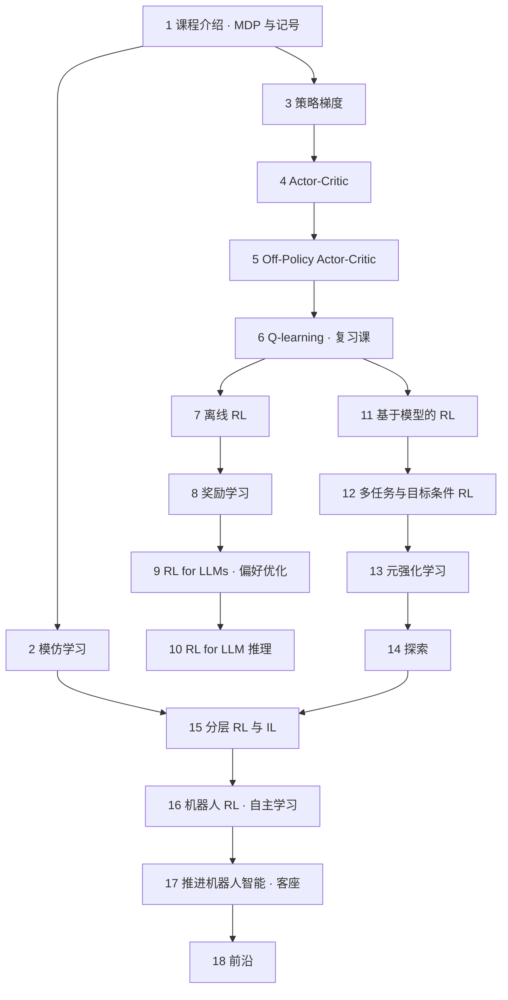

# CS224R 学习笔记

> Stanford CS224R: Deep Reinforcement Learning（2025 春）· 讲者 Chelsea Finn，个别讲次为客座讲座
> 非官方个人笔记，根据 YouTube 公开课视频的字幕整理 · [播放列表](https://www.youtube.com/playlist?list=PLoROMvodv4rPwxE0ONYRa_itZFdaKCylL) · [课程主页](https://cs224r.stanford.edu/)（现在挂的是 2026 春的课表；[2025 春的课表](https://cs224r.stanford.edu/spring_2025/)有各讲的选读论文）

**一句话**：这门课讲怎么让智能体从经验里学会做决定——先从模仿人的示范学起，再到策略梯度、actor-critic、Q-learning 三条核心算法路线，然后是从离线数据学、把奖励学出来、用 RL 训 LLM、基于模型的 RL、多任务与元学习、探索、分层，最后落到机器人。CME295 第 5–6 讲和 CS329A 第 6 讲里直接拿来用的 PPO、GRPO、DPO 公式，在这门课里会从 MDP 和策略梯度开始一步步推出来。

## 课程地图

*图 0-1｜第 1–6 讲是算法主干；第 7–10 讲讲数据和奖励从哪里来，并把这套东西用到 LLM 上；第 11–15 讲讲怎么学得更省、更通用；第 16–18 讲落到机器人和研究前沿（自绘示意）*

## 各讲索引

| 讲 | 主题 | 时长 | 视频 |
|---|---|---|---|
| [第 1 讲](#l1) | 课程介绍与 MDP：RL 问题的定义、全课的记号 | 52:58 | [YouTube](https://www.youtube.com/watch?v=EvHRQhMX7_w) |
| [第 2 讲](#l2) | 模仿学习：行为克隆、误差累积、Diffusion Policy | 1:07:05 | [YouTube](https://www.youtube.com/watch?v=WxRDyObrm_M) |
| [第 3 讲](#l3) | 策略梯度：RL 目标、REINFORCE、降方差 | 1:02:37 | [YouTube](https://www.youtube.com/watch?v=KCAOXd4IO9o) |
| [第 4 讲](#l4) | Actor-Critic：价值函数做基线、优势估计、PPO | 1:03:30 | [YouTube](https://www.youtube.com/watch?v=oejFZShW9hU) |
| [第 5 讲](#l5) | Off-Policy Actor-Critic：importance sampling、PPO clip 与 GAE、replay buffer、拟合 Q 得到 SAC 骨架 | 1:09:21 | [YouTube](https://www.youtube.com/watch?v=cRGKc-nAWho) |
| [第 6 讲](#l6) | Q-learning：policy iteration、DQN、Double DQN、N-step 目标 | 1:01:40 | [YouTube](https://www.youtube.com/watch?v=-7kv6jf0isQ) |
| [复习课](#l7) | 助教复习课：Q-learning 回顾 | 50:39 | [YouTube](https://www.youtube.com/watch?v=07MQNMcxhZU) |
| [第 7 讲](#l8) | 离线 RL：分布偏移、过滤式 BC、AWR / AWAC、IQL | 1:07:50 | [YouTube](https://www.youtube.com/watch?v=lRDaXnPIzks) |
| [第 8 讲](#l9) | 奖励学习：离线 RL 收尾（CQL）、成功分类器当奖励、成对偏好与 Bradley–Terry、RLHF / RLAIF | 1:05:58 | [YouTube](https://www.youtube.com/watch?v=PDIxDhA9Z6Y) |
| [第 9 讲](#l10) | RL for LLMs：RLHF 流水线、KL 惩罚、DPO 推导（客座 Archit Sharma） | 1:02:51 | [YouTube](https://www.youtube.com/watch?v=XKLGuwvSKvI) |
| [第 10 讲](#l11) | RL for LLM 推理：推理即 MDP、RFT、逐步 credit assignment、PAV（客座 Aviral Kumar） | 1:10:30 | [YouTube](https://www.youtube.com/watch?v=O2VpNnwB4lM) |
| [第 11 讲](#l12) | 基于模型的 RL：学动力学模型、random shooting / CEM / MPC 规划、PDDM | 1:13:20 | [YouTube](https://www.youtube.com/watch?v=PvqyGnOirgA) |
| [第 12 讲](#l13) | 多任务与目标条件 RL：MBRL 收尾、任务条件策略、hindsight relabeling | 1:10:29 | [YouTube](https://www.youtube.com/watch?v=qNdsI_4AQJw) |
| [第 13 讲](#l14) | 元强化学习：RL²、任务推断视角、PEARL、探索难题 | 1:09:10 | [YouTube](https://www.youtube.com/watch?v=wSiyEpvoGkA) |
| [第 14 讲](#l15) | 探索：bandit、UCB、后验采样、DREAM | 1:12:42 | [YouTube](https://www.youtube.com/watch?v=4tlSKdi8teU) |
| [第 15 讲](#l16) | 分层 RL 与 IL：两层策略、子目标表示、分层模仿、SayCan | 1:09:32 | [YouTube](https://www.youtube.com/watch?v=iKWYLSVAtfM) |
| [第 16 讲](#l17) | 机器人 RL：自主学习、reset-free、MEDAL、Single-Life RL | 1:05:44 | [YouTube](https://www.youtube.com/watch?v=rbaWQQLrzl0) |
| [第 17 讲](#l18) | 推进机器人智能：sim-to-real、域随机化、RMA、Tesla Optimus（客座 Ashish Kumar） | 49:48 | [YouTube](https://www.youtube.com/watch?v=Hp1WBWghrak) |
| [第 18 讲](#l19) | 前沿：三类开放问题，以及怎么做研究 | 1:10:49 | [YouTube](https://www.youtube.com/watch?v=FacJ_1tTSx4) |

## 和前两门课怎么对照

| 这门课 | 前两门课里对应的内容 | 关系 |
|---|---|---|
| 第 3–4 讲 策略梯度、Actor-Critic、PPO | CME295 第 5 讲 RLHF 与 PPO；CS329A 第 6 讲 GRPO、DAPO | 那边直接用公式，这边从头推导 |
| 第 8–9 讲 奖励学习、偏好优化 | CME295 第 5 讲奖励模型与 DPO；CS329A 第 3 讲验证器 | 那边讲 LLM 上的用法，这边讲一般形式和来历 |
| 第 10 讲 RL for LLM 推理 | CME295 第 6 讲；CS329A 第 2、6 讲 | 同一批工作，客座讲者的视角 |
| 第 7 讲 离线 RL | — | 前两门课没讲，agent 从日志数据里学时会用到 |
| 第 14 讲 探索 | CS329A 第 2 讲重复采样的多样性 | 同一个问题在 RL 里的正式提法 |

## 怎么用这份笔记

- **每讲的结构是固定的**：一句话 → 时间轴 → 核心内容（带图和公式）→ 关键图表速查 → 提到的工作 → 术语对照 → 字幕勘误 → 带走的问题。赶时间可以只读"一句话"、图和"带走的问题"。
- **这门课公式多**：关键公式单独成块，后面一两句话解释每个符号；推导过程用文字说"这一步在做什么、为什么可以这么做"。
- **时间戳都能点**，直接跳到视频里对应的位置。图下面黄色的「▶ 看原幻灯片」会跳到老师讲那一页 PPT 的时刻。
- **图是重新画的示意图**，用来解释机制，不是课件截图。
- **"小注"** 是补充的课外事实或对口误的更正；**"应为 / 应出自"** 表示这是根据内容推断的，老师没有明说。
- 字幕对人名、算法名的识别错误不少，每讲末尾的"字幕勘误"列了会影响理解的那些。想对照原文：在播放器「设置 → 字幕 → 自动翻译 → 中文（简体）」可以开中文字幕。
