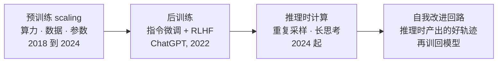
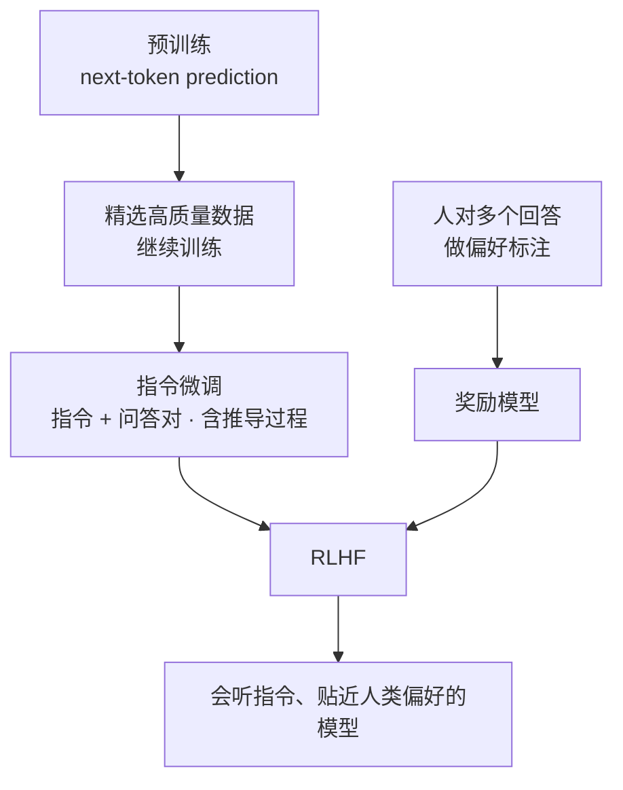
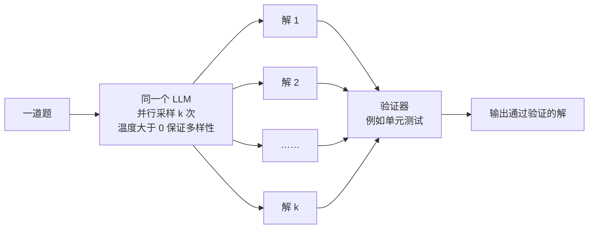
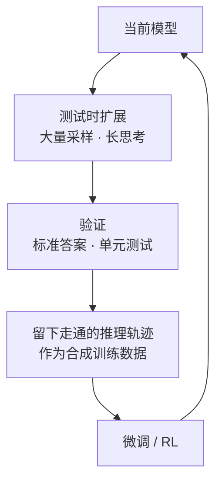
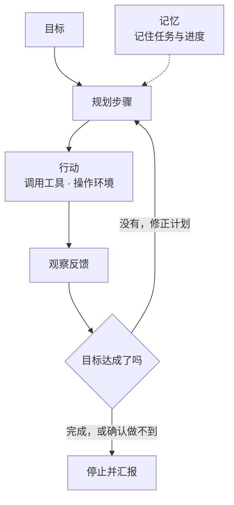

# CS329A 第 1 讲｜课程总览（Course Overview）

> Stanford CS329A: Self-Improving AI Agents（2025 秋）
> 视频：<https://www.youtube.com/watch?v=6YnLB0XbTnI>（1:09:42，自带人工校对英文 CC）
> 讲者：Aakanksha Chowdhery（Stanford 兼职教授 / Reflection AI，PaLM 一作）、Azalia Mirhoseini（Stanford CS 助理教授，此前在 Google Brain / DeepMind、Anthropic）
> 课程主页：<https://cs329a.stanford.edu>

**一句话**：LLM 的进步先后来自三条轴——预训练规模、后训练（指令微调 + RLHF）、推理时计算；把"推理时多算"换来的高质量轨迹再训回模型，就是课程名里的"自我改进"。Agent 是把这种能力放进"目标—行动—反馈—停止"的循环，而**可靠的验证**是整条链路的瓶颈。

## 时间轴

| 时间 | 内容 |
|---|---|
| [0:06](https://www.youtube.com/watch?v=6YnLB0XbTnI&t=6s) | 开场、讲者介绍、本讲安排 |
| [2:23](https://www.youtube.com/watch?v=6YnLB0XbTnI&t=143s) | Scaling laws：算力 / 数据 / 参数三条轴 |
| [4:11](https://www.youtube.com/watch?v=6YnLB0XbTnI&t=251s) | 模型规模的指数增长；few-shot / zero-shot |
| [6:50](https://www.youtube.com/watch?v=6YnLB0XbTnI&t=410s) | 涌现能力与 Chain-of-Thought |
| [10:50](https://www.youtube.com/watch?v=6YnLB0XbTnI&t=650s) | ChatGPT 的关键增量；预训练 → 精选数据 → 指令微调 → RLHF |
| [19:26](https://www.youtube.com/watch?v=6YnLB0XbTnI&t=1166s) | 推理成为新前沿：Large Language Monkeys（重复采样） |
| [24:32](https://www.youtube.com/watch?v=6YnLB0XbTnI&t=1472s) | 问答：搜索空间、延迟、无验证器领域、温度 |
| [27:50](https://www.youtube.com/watch?v=6YnLB0XbTnI&t=1670s) | DeepSeek / o1 / Gemini Thinking：测试时扩展 × 微调 = 自我改进回路 |
| [30:05](https://www.youtube.com/watch?v=6YnLB0XbTnI&t=1805s) | 推理模型：o1 的 test-time 曲线、"思考"的几个环节 |
| [34:46](https://www.youtube.com/watch?v=6YnLB0XbTnI&t=2086s) | o1 vs GPT-4o；问答：pass@1 vs pass@k、模型偏爱自己的轨迹、ORM/PRM |
| [40:50](https://www.youtube.com/watch?v=6YnLB0XbTnI&t=2450s) | 从 LLM 到 Agent：定义、agentic workflow、编排模式 |
| [47:56](https://www.youtube.com/watch?v=6YnLB0XbTnI&t=2876s) | Coding agent 循环；为什么今年变可靠；generator–verifier gap |
| [52:50](https://www.youtube.com/watch?v=6YnLB0XbTnI&t=3170s) | 澄清用户意图；落地场景：代码、客服、研究报告、AI Scientist |
| [58:07](https://www.youtube.com/watch?v=6YnLB0XbTnI&t=3487s) | 问答：CoT 是涌现的还是训练出来的 |
| [1:00:20](https://www.youtube.com/watch?v=6YnLB0XbTnI&t=3620s) | 课程安排：作业、项目、评分、时间点 |

## 核心内容

*图 1-1｜本讲的主线：能力提升的三条轴，以及它们怎么接成回路（自绘示意）*

### 1. 预训练时代：三条 scaling 轴

- 增加算力、数据量、参数量，测试 loss 都按可预测的规律下降——这是 GPT-3、PaLM、Gemini 一路做大的依据。
- 规模演进：BERT 3.4 亿 → GPT-2 15 亿 → GPT-3 1750 亿 → PaLM 5400 亿 → GPT-4（外界估计万亿级）。
- 讲者的判断：这条路从 2018 年一直有效，到 2024 年开始出现饱和迹象。这是后面转向后训练和推理时扩展的背景。
- 做大带来三件事：基准分数持续提升；few-shot / zero-shot（给任务描述或几个例子就能照做，不必逐任务微调，原型成本骤降）；涌现能力（到一定规模才出现，无法从 loss 曲线事先预测）。

### 2. Chain-of-Thought：最重要的涌现能力

- 做法：few-shot 示例里不只给答案，还给出推导过程。
- 规模依赖：LaMDA / GPT / PaLM 的对比中，约 8B 以下的模型几乎吃不到 CoT 的好处，大模型才明显受益。模运算、单词重排等任务同样呈现"到某个规模突然会了"。
- 为什么重要：今天的推理模型本质是 CoT 的延伸，区别在于思考链由模型自己生成，而不是人写进 prompt。
- 课末问答的补充：CoT 最初是被"发现"而非"设计"出来的（GSM8K 上先见苗头，PaLM 上变得显著，当时还能解释笑话）；但现在的推理模型是被专门训练去思考的，不能再简单归为涌现。趋势是模型自己判断什么时候需要长思考。

### 3. 从 GPT-3 到 ChatGPT：后训练流水线

*图 1-2｜从 base model 到 ChatGPT 的训练流水线（自绘示意）· [▶ 看原幻灯片 14:21](https://www.youtube.com/watch?v=6YnLB0XbTnI&t=861s)*

1. **预训练**：海量文本上做 next-token prediction。模型只有统计意义上的世界知识，不会听指令，也没有对错观。
2. **精选数据继续训练**：目标函数不变，数据换成高质量来源（书籍、优质文章等，厂商为此付出高额成本）。
3. **指令微调**：指令 + 问答对，含带推导过程的样本；数据是人工、模板、合成的混合。数据质量和覆盖面直接决定这一步的产出。
4. **RLHF**：人对模型的多个回答做偏好标注 → 训练 reward model 替代人 → 用 RL 把模型往 RM 认可的方向推。Reward 可以是多维的（正确性、有用性、具体性、无害性）并按需要加权。

对齐（让模型遵循人的目标、偏好、价值）至今没有被真正解决；课上的图显示，针对 sensibleness / safety 的精选数据微调能明显拉高对应指标。

### 4. 推理时计算：第三条轴

**Large Language Monkeys**（Azalia 实验室，2024）：同一道题并行采样 1 → 10,000 次，用验证器（例如单元测试）挑出正确解。

*图 1-3｜重复采样 + 验证器（自绘示意）· [▶ 看原幻灯片 20:26](https://www.youtube.com/watch?v=6YnLB0XbTnI&t=1226s) · 结果曲线见 [22:28](https://www.youtube.com/watch?v=6YnLB0XbTnI&t=1348s) · 出处：[Brown et al., 2024](https://arxiv.org/abs/2407.21787)*

- 指标是 coverage：至少有一个样本做对的题目比例（即 pass@k）。
- 结果：Llama-3 8B / 70B 单次采样不如 GPT-4o，但采样数上去后在数学、代码基准上反超。有的题 10,000 个样本里只有三四个是对的。
- 含义：模型"会的"远多于单次采样表现出来的。不动参数、只改推理方式就能换来能力，所以叫 inference scaling。Coverage 随样本数呈对数线性增长。

问答要点：

- **为什么不是暴力搜索**：候选解由模型生成，样本效率远高于在全空间随机搜索或树搜索；MiniF2F 里有 IMO 难度的题，小模型一万次采样就能碰到正解。
- **延迟**：并行采样对延迟影响小，真正的权衡是算力成本，并且随问题类型和难度变化。
- **没有验证器的领域**：要靠 LLM-as-judge、训练 reward model、工具辅助验证——第 3 讲专门讲。
- **温度**：不能无限调高，约 1.2 以上输出开始崩坏；增加多样性另有技巧。
- **按难度动态分配采样数**：当时没有直接对应的已发表工作，可以用 reward model 的信号来引导——被点名为值得做的方向。

### 5. 自我改进回路 = 测试时扩展 × 微调

*图 1-4｜课程名里的"自我改进"指的就是这个回路（自绘示意）· [▶ 看原幻灯片 28:36](https://www.youtube.com/watch?v=6YnLB0XbTnI&t=1716s)*

- DeepSeek、o1 系列、Gemini Thinking 的共同点：把测试时扩展当**数据引擎**。对答案可验证的题（数学有标准答案、代码有测试）大量采样，留下走通的推理轨迹，作为合成数据再微调 / RL 回模型。
- 这个回路没有明显的天花板，是课程名 "self-improving" 的所指。
- o1 的图：AIME 上 pass@1 准确率随测试时算力（对数轴）线性上升——这种关系此前只在训练算力上见过。
- **pass@k 与 pass@1**（Aakanksha 的解释）：base model 重复采样时能出对的，但不知道哪个对（pass@k 高）；train-time / test-time scaling 做的事，本质是让模型学会选中对的那条，把 pass@k 兑现成 pass@1。

> 小注：课上说 DeepSeek 是 2024 年 12 月发布，对应的是 V3；推理模型 R1 发布于 2025 年 1 月。

### 6. 推理模型在"想"什么

- 环节：问题分析 → 任务分解 → 试探并吸收反馈（跑测试、用计算器、自评）→ 自我纠错 → 走不通就回溯换方案。
- 例子：让 o1 写一个做矩阵转置的 bash 脚本，思考轨迹里依次出现需求分析、输入输出格式确认、实现步骤分解、中途发现问题并修正。
- 能力来源：一部分来自人工策划的数据（bootstrapping，如指令微调里带推导的样本），更大一部分是在合成数据上微调 / RL 的过程中习得并泛化的。
- 能力边界：o1 在数学、数据分析、编程上明显强于 GPT-4o，个人写作、文本编辑并不占优。

问答要点：

- 思考 token 虽然贵，但确实在帮助解题；起作用的不是"说出来"这个动作，而是训练把模型变成了通用的思考者。
- 能否用别的模型来生成推理轨迹：目前模型明显更偏好自己的轨迹，即使对方更强；但让另一个模型做评估和反馈是可行的（后面讲 SWiRL 时展开）。
- 怎么教会推理：没有公开的完整配方；课程会讲 ORM（结果奖励）与 PRM（过程奖励）。

### 7. 从 LLM 到 Agent

*图 1-5｜Agent 与聊天模型的区别：带反馈、自己决定何时停的循环（自绘示意）· [▶ 看原幻灯片 42:20](https://www.youtube.com/watch?v=6YnLB0XbTnI&t=2540s)*

- 聊天模型和推理模型仍是"回答问题"，并不替你完成任务。2025 年的变化：Claude Code、Codex、Deep Research 让端到端的真实工作流变得可用。
- Agent 的要素：有目标 → 自己规划步骤 → 与环境交互（调用工具）→ 根据反馈修正 → 自己决定何时停止（完成，或承认做不到）；长任务需要记忆来保持不跑偏。
- 现实：多数落地系统是**人手画好图的 agentic workflow**，而不是完全开放的循环；开放循环目前只在 coding 和 research 两个领域看到可用的迹象。
- 组件：LLM 调用、verifier（可执行的检查，如单元测试）、critic / judge（LLM-as-judge）、工具调用（搜索等）。
- 编排模式：prompt chaining（串行分解）、routing（按难度或类型分流）、parallelization（并行后聚合，Deep Research 的形态）、orchestrator（中心 LLM 先做计划再派发，如 Claude Code 的 plan）、evaluator（生成—评审循环）。这套分类和 Anthropic《Building Effective Agents》基本一致。
- 对模型的新要求：规划、多步推理、自我纠错——正是后续各讲的主题。

### 8. Coding agent 为什么今年才可靠

- 循环本身（读仓库、搜文件、改代码、跑命令、看输出、再改）和去年相比没怎么变。
- 讲者给的原因：更强的基座 + RL with verifiable rewards 起效；模型变强后还会触发自我改进回路——能自己生成测试，测试更可靠，验证也就更可靠（CodeMonkeys 的思路）。
- **Generator–verifier gap**：生成容易，判断生成物好不好难。创意写作这类领域只能靠人给反馈，人就成了瓶颈；有可靠反馈的领域才能持续改进。稳健验证仍是整个方向的瓶颈之一（第 3 讲，含 Azalia 实验室组合多个弱验证器的工作）。
- 一个没有共识的问题（学生提出）：如果预训练后的模型多采样总能出一个对的，RL 只是把 pass@k 变成 pass@1，为什么提升会这么大？讲者的回答：RL 到底是"激发"还是"增加"能力，目前没有定论；至少有迹象表明持续做 RL 能持续提升。
- 容易被忽略的一环：**澄清用户意图**。用户通常说不清需求，agent 得先弄清楚要找什么、用什么标准验证，才谈得上"完成"。

### 9. 落地场景

- **代码**：迁移、版本升级、重构、数据工程（抽取 / 清洗 / 数仓迁移）、补单元测试——重复性高、容易验证。
- **客服**：实时转写、知识库辅助、智能回复、通话总结；端到端自动化刚起步。
- **研究报告**：选参考资料 → 拟大纲 → 逐篇摘要 → 合成长文（课上的例子应出自 STORM 一类系统，作业会用到）。
- **AI Scientist**：想法生成 → 实验迭代 → 论文写作。即使有幻觉，作为跳出个人经验的头脑风暴来源也有价值。

## 关键图表速查（点时间戳跳到原幻灯片）

| 图 | 看什么 | 跳转 | 出处 |
|---|---|---|---|
| Scaling laws 三联图 | 横轴分别是算力、数据量、参数量，纵轴 test loss 一路下降 | [3:02](https://www.youtube.com/watch?v=6YnLB0XbTnI&t=182s) | 应出自 [Kaplan et al., 2020](https://arxiv.org/abs/2001.08361) |
| 模型规模增长 | 2018–2024 参数量的指数增长 | [4:11](https://www.youtube.com/watch?v=6YnLB0XbTnI&t=251s) | — |
| CoT 随规模涌现 | LaMDA / GPT / PaLM 三组：小模型吃不到 CoT 的好处 | [9:13](https://www.youtube.com/watch?v=6YnLB0XbTnI&t=553s) | 应出自 [Wei et al., 2022](https://arxiv.org/abs/2201.11903) |
| 重复采样的 coverage 曲线 | 红色虚线是 GPT-4o 单次采样；小模型的线在采样数上去后穿过它 | [22:28](https://www.youtube.com/watch?v=6YnLB0XbTnI&t=1348s) | [Brown et al., 2024](https://arxiv.org/abs/2407.21787) |
| o1 的 test-time compute 曲线 | AIME 上 pass@1 对测试时算力（对数轴）近似线性 | [30:39](https://www.youtube.com/watch?v=6YnLB0XbTnI&t=1839s) | OpenAI o1 发布博客 |
| o1 的思考轨迹 | 需求分析 → 分解 → 自我纠错的实际文本 | [32:40](https://www.youtube.com/watch?v=6YnLB0XbTnI&t=1960s) | 同上 |
| o1 vs GPT-4o 分领域对比 | 推理类任务占优，写作类不占优 | [34:46](https://www.youtube.com/watch?v=6YnLB0XbTnI&t=2086s) | 同上 |
| 两种 agentic workflow 图 | 生成 + 评审；并行 + 聚合 | [43:52](https://www.youtube.com/watch?v=6YnLB0XbTnI&t=2632s) | — |
| Coding agent 循环 | agent、终端、仓库之间的交互 | [47:56](https://www.youtube.com/watch?v=6YnLB0XbTnI&t=2876s) | — |
| 研究报告 agent 流程 | 选资料 → 大纲 → 摘要 → 成文 | [56:05](https://www.youtube.com/watch?v=6YnLB0XbTnI&t=3365s) | 应出自 [STORM](https://arxiv.org/abs/2402.14207) |
| AI Scientist 三阶段 | 想法生成 / 实验迭代 / 论文写作 | [57:05](https://www.youtube.com/watch?v=6YnLB0XbTnI&t=3425s) | [Lu et al., 2024](https://arxiv.org/abs/2408.06292) |

## 课程安排（对自学有用的部分）

- 3 次作业（50%）+ 课程项目（50%）；项目 1–4 人，提供 API 额度。
- 认可的项目：新评测集 / benchmark；现有 agentic 系统的可靠性研究；在某个 benchmark 上爬分；改进或质疑课上某篇论文的设计决策。不接受综述，也不接受只拼一个 app——必须有假设、有问题、有实验。
- 节奏：10 月初 proposal → 两周后 midterm（要有实验进展）→ 期末报告（权重大）→ 12 月 12 日海报展。
- 每讲配套论文列在课程主页，建议配合阅读；上一届有项目最终发表成论文。

## 提到的工作

| 名称 | 在本讲里的作用 |
|---|---|
| Scaling laws（三联图应出自 Kaplan et al., 2020） | 预训练三轴的可预测性 |
| BERT / GPT-2 / GPT-3 / PaLM / GPT-4 | 规模演进、few-shot、涌现 |
| Chain-of-Thought prompting（对比图应出自 Wei et al., 2022） | 随规模涌现的推理能力 |
| GSM8K | 最早显示推理链有效的数据集 |
| Large Language Monkeys（2024） | 重复采样的 inference scaling |
| OpenAI o1 / DeepSeek / Gemini Thinking | 推理模型；测试时扩展 + 合成数据训练 |
| SWiRL | 多步推理的合成数据 + 分步 RL（后续展开） |
| CodeMonkeys | 自生成测试来做验证 |
| The AI Scientist | 研究全流程 agent |
| Claude Code / Codex / Deep Research | 2025 年可用的端到端 agent |

## 术语对照

| English | 中文 |
|---|---|
| scaling laws | 扩展定律 |
| emergent behavior | 涌现行为 |
| few-shot / zero-shot learning | 少样本 / 零样本学习 |
| chain of thought (CoT) | 思维链 |
| instruction tuning | 指令微调 |
| RLHF | 基于人类反馈的强化学习 |
| reward model | 奖励模型 |
| inference-time / test-time scaling | 推理时（测试时）扩展 |
| repeated sampling | 重复采样 |
| coverage, pass@k | 覆盖率（k 次中至少一次做对） |
| pass@1 | 单次通过率 |
| verifier | 验证器 |
| LLM-as-a-judge | LLM 评审 |
| ORM / PRM | 结果奖励模型 / 过程奖励模型 |
| task decomposition | 任务分解 |
| self-correction / backtracking | 自我纠错 / 回溯 |
| agentic workflow | 智能体工作流 |
| prompt chaining / routing / parallelization | 提示链 / 路由 / 并行化 |
| orchestrator / evaluator | 编排器 / 评估器 |
| generator–verifier gap | 生成—验证差距 |
| RL with verifiable rewards | 可验证奖励的强化学习 |

## 字幕勘误（开 CC 看时会遇到）

"scaling loss" → scaling laws；"Cloud Code" → Claude Code；"normal 3HP and 7AB" → Llama-3 8B / 70B；"math f to f" → MiniF2F；"aiming benchmark" → AIME；"Swirl" → SWiRL；"white coding" → vibe coding；"Edson" → Ed（课程论坛）；"cs239a" → cs329a。

## 带走的问题

1. RL 是在"激发"预训练里已有的能力，还是在"增加"新能力？pass@k → pass@1 的解释能覆盖多少现象？
2. 没有验证器的领域（开放式对话、创意、消费级产品体验）怎么搭自我改进回路？反馈从哪来、怎么不被人力卡住？
3. "澄清用户意图"在 agent 循环里应该放在哪一步、用什么信号判断已经澄清够了？
