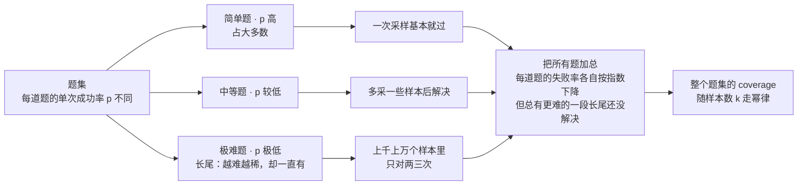
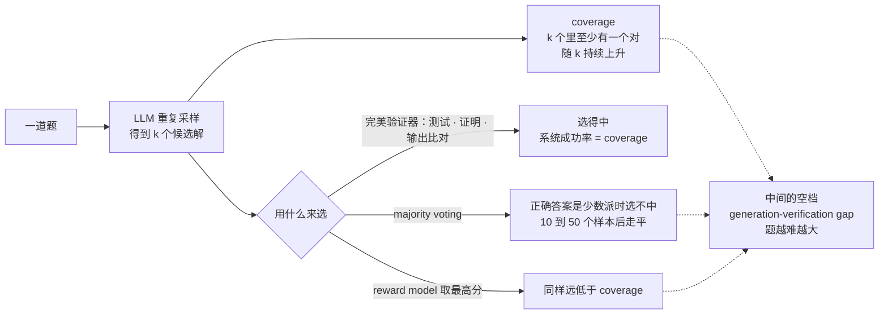
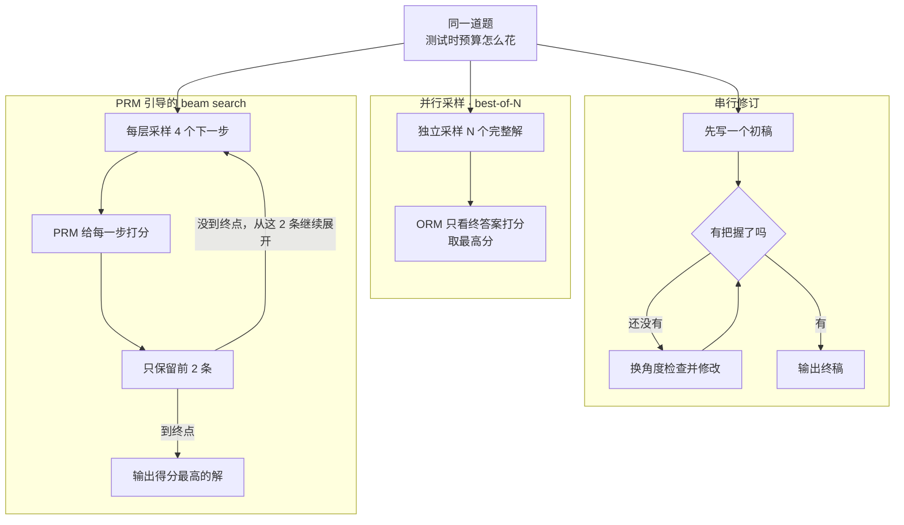
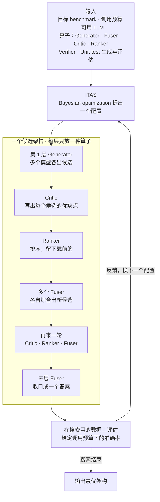
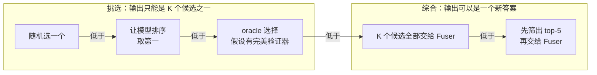

# CS329A 第 2 讲｜测试时计算扩展（Test-Time Compute Scaling）

> Stanford CS329A: Self-Improving AI Agents（2025 秋）· 对应课表第 2 次课（9 月 26 日）
> 视频：<https://www.youtube.com/watch?v=-Ggc37xLj_Y>（1:03:21，自带人工英文 CC；学生提问收音差，字幕里有不少 [INAUDIBLE]）
> 讲者：Azalia Mirhoseini（推断：本讲没有自我介绍，但她把 Large Language Monkeys、KernelBench、Weaver、Archon 都称作自己实验室的工作）
> 配套阅读：[Large Language Monkeys](https://arxiv.org/abs/2407.21787)（Brown et al., 2024）· [Scaling LLM Test-Time Compute Optimally…](https://arxiv.org/abs/2408.03314)（Snell et al., 2024）· [Archon](https://arxiv.org/abs/2409.15254)（Saad-Falcon et al., 2024）· [How Do Large Language Monkeys Get Their Power (Laws)?](https://arxiv.org/abs/2502.17578)（Schaeffer et al., 2025；讲者未点名，按内容推断）

**一句话**：不改参数、不做微调，只在推理侧多花算力，就能**可预测地**换来能力——重复采样的 coverage 随样本数走幂律，根源是题集里难题的长尾；真正的瓶颈是把对的样本挑出来（generation–verification gap）。并行采样之外，还有串行修订、PRM 引导的搜索，以及 Archon 这种把各类推理时算子当成"层"来做架构搜索的做法。

## 时间轴

| 时间 | 内容 |
|---|---|
| [0:06](https://www.youtube.com/watch?v=-Ggc37xLj_Y&t=6s) | 开场：预训练 / 微调 / 推理三阶段，本讲只动推理侧 |
| [1:06](https://www.youtube.com/watch?v=-Ggc37xLj_Y&t=66s) | Large Language Monkeys 回顾：重复采样 + 验证器 |
| [3:06](https://www.youtube.com/watch?v=-Ggc37xLj_Y&t=186s) | SWE-bench 上同样成立；单元测试让整条链路全自动 |
| [5:15](https://www.youtube.com/watch?v=-Ggc37xLj_Y&t=315s) | 推理侧的 scaling law：coverage 与样本数的指数化幂律 |
| [7:19](https://www.youtube.com/watch?v=-Ggc37xLj_Y&t=439s) | 为什么是幂律：单题指数、全集幂律，条件是难题长尾 |
| [11:30](https://www.youtube.com/watch?v=-Ggc37xLj_Y&t=690s) | 算力账本的变化：推理可以大笔投入，还能离线花 |
| [12:30](https://www.youtube.com/watch?v=-Ggc37xLj_Y&t=750s) | 自动验证：形式化证明、单元测试、AI as compiler（KernelBench）、语言互译 |
| [15:34](https://www.youtube.com/watch?v=-Ggc37xLj_Y&t=934s) | 没有验证器的领域：majority voting / reward model 与 coverage 的差距 |
| [19:42](https://www.youtube.com/watch?v=-Ggc37xLj_Y&t=1182s) | 讨论一：验证器质量、先自学再采样、只筛错、集成验证器（Weaver）、coverage 是否虚高 |
| [26:55](https://www.youtube.com/watch?v=-Ggc37xLj_Y&t=1615s) | Snell et al.：并行采样 vs 串行修订 |
| [28:57](https://www.youtube.com/watch?v=-Ggc37xLj_Y&t=1737s) | ORM 与 PRM；best-of-N；PRM 引导的 beam search |
| [33:02](https://www.youtube.com/watch?v=-Ggc37xLj_Y&t=1982s) | 并行 × 串行的组合；现成 PRM；实验设置（MATH、PaLM、难度五档） |
| [36:04](https://www.youtube.com/watch?v=-Ggc37xLj_Y&t=2164s) | 结果：voting < ORM < PRM < compute-optimal；难度 × 串并配比 |
| [38:08](https://www.youtube.com/watch?v=-Ggc37xLj_Y&t=2288s) | 测试时算力 vs 预训练：易题、中等题换得动，最难的题换不动 |
| [39:09](https://www.youtube.com/watch?v=-Ggc37xLj_Y&t=2349s) | 问答：推理每次都要花钱、比例的含义、小模型能否练成专家 |
| [42:22](https://www.youtube.com/watch?v=-Ggc37xLj_Y&t=2542s) | 讨论二：tree search、易题偏串行 / 难题偏并行的直觉 |
| [45:24](https://www.youtube.com/watch?v=-Ggc37xLj_Y&t=2724s) | Archon：把推理时扩展当成架构设计问题 |
| [47:26](https://www.youtube.com/watch?v=-Ggc37xLj_Y&t=2846s) | 算子：generator、fuser、critic、ranker、verifier |
| [50:38](https://www.youtube.com/watch?v=-Ggc37xLj_Y&t=3038s) | Fusion 实验：融合超过 oracle 选择；多模型集成 |
| [54:47](https://www.youtube.com/watch?v=-Ggc37xLj_Y&t=3287s) | Unit test 的生成与"由模型来评估" |
| [56:49](https://www.youtube.com/watch?v=-Ggc37xLj_Y&t=3409s) | 搜出来的架构；搜索空间的裁剪 |
| [58:53](https://www.youtube.com/watch?v=-Ggc37xLj_Y&t=3533s) | 叠层有收益；Bayesian optimization 与约束 |
| [1:00:53](https://www.youtube.com/watch?v=-Ggc37xLj_Y&t=3653s) | 结果：pass@1 平均超过 GPT-4o / Claude 3.5 Sonnet 14.1% |

## 核心内容

### 1. 出发点：只动推理侧

- LLM 的三个阶段：预训练（数月、海量 GPU、万亿级 token）、微调（数据量小几个数量级）、推理。本讲的所有方法都**不改参数、不做微调**，只改"怎么用模型"。
- 回顾 Large Language Monkeys：同一道题反复采样（10 次、100 次……），验证器挑出对的那个作为系统输出。Llama-3 8B / 70B 单次不如 GPT-4o，采样数上去后在高难数学、代码和多类问答上反超。
- 讲者的解读：小模型其实已经"会"这些题，只是第一次不说；重复采样是在把答案引出来。
- 这一范式在他们试过的领域几乎都成立，包括 SWE-bench 这类 agentic 基准：样本数 1 → 1,000，DeepSeek（讲者印象中是 V3）的 coverage 超过 Claude 3.5 和 o1-preview。代码任务有单元测试自动选样本，于是"开源模型 + 采样 + 测试"就是一条全自动造出更强系统的路。

> 小注：Large Language Monkeys 原论文的 SWE-bench Lite 实验用的是 DeepSeek-Coder-V2-Instruct、250 个样本（15.9% → 56%）；课上这张 1,000 样本、对比 o1-preview 的图应是后来更新的版本，讲者自己对模型版本也不确定。

### 2. 推理侧也有 scaling law，根源是难题的长尾

*图 2-1｜单题指数、全集幂律：难题长尾怎样把聚合曲线变成幂律（自绘示意）· [▶ 看原幻灯片 9:20](https://www.youtube.com/watch?v=-Ggc37xLj_Y&t=560s) · 出处：应出自 [Schaeffer et al., 2025](https://arxiv.org/abs/2502.17578)*

- 预训练 scaling law 让人按数据、算力、参数量预测 test loss。推理侧的对应物：coverage 与并行样本数 k 服从 exponentiated power law，两个系数靠曲线拟合得到。
- 验证范围：Llama-3、Gemma、Pythia 等模型族，70M–70B 参数，多个领域；拟合曲线大体贴合实测，连 70M 的模型也不例外。
- 用处是做预算：要达到某个 coverage，需要多少样本、多少资源，可以事先估。

**为什么是幂律**（应出自后续工作 *How Do Large Language Monkeys Get Their Power (Laws)?*，Schaeffer et al., 2025；见图 2-1）

- 单看一道题：单次成功率 p_i，则 pass_i@k = 1 − (1 − p_i)^k，失败率随 k **指数**下降。
- 整个题集的聚合曲线却是**幂律**。两者要对得上，充要条件是各题 pass@1 的分布在极难一端拖着一条长尾：多数题一次就过，但总有一批 pass@1 极低的题，越难越稀、却一直有。
- 实测的 pass@1 分布确实如此。换句话说，幂律是"题目难度分布"的性质，不是"单题行为"的性质。

> 小注：Monkeys 论文里的形式是 c ≈ exp(a·k^b)，即 log c 对 k 呈幂律。直觉推导：聚合失败率 = E[(1 − p)^k] ≈ ∫ f(p)·e^(−kp) dp；若密度 f(p) 在 p → 0 附近像 p^(β−1)，积分就按 k^(−β) 衰减。

**含义**：过去预训练花上亿到几十亿美元、微调少得多、单次推理几乎不计成本（一问一答）。现在推理成了可以大笔投入的第三项，而且能**离线**花——把 agent 放出去围着一个问题持续生成、持续改进。

### 3. 验证：采样之后的另一半问题

*图 2-2｜同一批样本：生成得出来的，和选得中的（自绘示意）· [▶ 看原幻灯片 15:34](https://www.youtube.com/watch?v=-Ggc37xLj_Y&t=934s) · 出处：[Brown et al., 2024](https://arxiv.org/abs/2407.21787)*

**容易验证的领域**

- 数学：形式化证明，证明工具逐步检查。
- 代码：单元测试。写测试通常比写完整程序容易得多，人来写也行。
- AI as compiler（讲者实验室在做、她本人很看好的方向）：让 LLM 从 PyTorch 源码生成 CUDA 这类贴近硬件的底层代码。验证天然存在——同样的输入，生成的 kernel 与 PyTorch 参考实现输出一致即可。KernelBench 就是这样的基准，coverage 同样随样本数稳定上升。
- 推广：任何两种语言之间的移植（Python / C++ ↔ Java）都能用"行为等价"来验。

> 小注：对比输出是在有限输入上做数值等价检查，工程上很强，但严格说不是完备证明；KernelBench 除正确性外还看相对 PyTorch 的加速。

**没有验证器的领域：generation–verification gap**（图 2-2 的下半部分）

- 对比图：横轴样本数，纵轴系统最终成功率。Majority voting（取出现最多的答案）在 10–50 个样本后就走平；假设有完美选择器的 coverage 曲线还在涨。两线之间的空档就是 generation–verification gap——模型生成得出正确答案，系统却捞不出来。第 1 讲叫它 generator–verifier gap。
- 题越难空档越大：MATH 比 GSM8K 明显。
- 换成 reward model（给每个答案打分的 LLM）做 best-of-N，或把 RM 与投票结合，离 coverage 仍差一大截。
- 投票失效的原因很直接：最难的题在 1,000 甚至 10,000 个样本里只对一两次、两三次，正确答案是少数派。GSM8K 上多数题投票管用，最难的那批照样如此。

### 4. 讨论一里值得留的点

- **Coverage 是不是虚高？** 数学题他们人工抽查过，真对的比例在 90% 以上（字幕此处数字含糊）；代码侧如果单元测试覆盖不全，"过了测试但其实不对"是真实的失败模式——又回到验证器质量。
- **验不出对，但筛得出错**：有些领域证明正确很贵，排除错误却容易；也有验证本身带噪声的（物理、分子动力学模拟）。讲者：视领域用模拟、工具或另一个模型来过滤。
- **很多验证器再投票**：正是 Weaver 的思路——弱监督地集成验证器，规模是 10–20 个而不是上千个，算力代价高。第 3 讲展开。
- **先自学再采样**：采样前先让模型探索问题域、沉淀成上下文，再进并行采样。讲者：self-study、搜索、工具使用都是重复采样之外的扩展手段。
- 每题 10,000 个样本的数据已放在 Hugging Face；"怎么缩小 generation–verification gap"被点名为合适的课程项目。

### 5. 生成方式 × 选择方式（Snell et al., 2024）

*图 2-3｜同一份测试时预算的三种花法：并行、串行、PRM 引导的搜索（自绘示意）· [▶ 看原幻灯片 26:55](https://www.youtube.com/watch?v=-Ggc37xLj_Y&t=1615s) · 出处：[Snell et al., 2024](https://arxiv.org/abs/2408.03314)*

论文：*Scaling LLM Test-Time Compute Optimally can be More Effective than Scaling Model Parameters*。讲者只取了与测试时扩展最相关的部分，可以整理成两个正交的维度。

**怎么生成**

- 并行采样：同一问题独立出 N 个答案。
- 串行修订（sequential revisions）：先出初稿，再反复修改、换角度检查，有把握了才输出。课上假设靠 prompt 驱动；推理模型则已经被训练成自己会这样做。

**怎么选**

- ORM：只看最终答案打分。它是学出来的，换到新领域准确率有限。
- PRM：对解答的每一步打分（0–1）。粒度是"步"不是 token——一个有意义的推理块，或者干脆按句子切；训练数据可以来自人工逐步标注好 / 坏。PRM 一般从语言模型微调而来，域内最好用（在目标任务的子集上训练最有效），但因为底座是 LM，跨任务也有一定泛化。

**组合**

- Best-of-N：并行采 N 个，ORM 取最高分。
- PRM 引导的 beam search：每层预算 4 个样本，PRM 打分留前 2，从这两条继续展开；也可以改用分数阈值。本质是逐层剪枝，只在有希望的分支上花算力。
- 并行 × 串行：例如开两条修订链，各得一个终稿，再用 PRM / ORM 选；链内部也可以用 PRM 引导。
- 实用提示：现成的开源 PRM 很多，挑一个和任务最接近的直接用，或者用自己的数据训 PRM / ORM。

### 6. Snell et al. 的实验结论

- 设置：MATH（12k 训练 / 500 测试），PaLM 系模型；自训 PRM，并专门微调了一个修订模型（讲者：如今只要是指令微调过的模型，让它改它就会改）。
- 难度定义：对每题多次采样，按模型自己的通过率分 5 档——难度是相对模型而言的。
- 预算—准确率曲线：majority voting < ORM < PRM < 精心混合的 compute-optimal 策略。目标是"达到某个准确率所需的最小生成预算"；怎么混合修订与并行，至今是开放问题。
- 串行 : 并行的配比：容易的题几乎全押串行最好；难题上最优配比说不清，从第 4 档到第 5 档都会变。
- 测试时算力 vs 预训练：按"推理 token : 预训练 token"的比例来比，易题和中等题把算力花在推理上更划算；最难的题仍是更大、预训练更多的模型占优。讲者说这与实验室的经验一致——小的开源模型配上测试时算力越来越能打，但极难的问题上，前沿模型在任何合理的推理预算下都还是更好。

问答要点：

- 预训练只花一次、推理每次都花，这样比公平吗？讲者承认这一点，但认为这组结果的价值在于回答"预训练是不是做到头了"——没有；同时不是谁都训得起大模型，对多数人、多数问题，测试时扩展是够得着的手段。
- 图上的比例是预训练算力与推理算力的相对比值，不是"每个任务训一次"的一比一。
- 小模型能不能练成难题专家？针对特定题集微调总是可以的，但这里比的是通用数据、通用配方。
- 讨论二：tree search 就是并行与串行的混合，树结构还能复用计算，对应前面的 PRM 逐层剪枝。学生的直觉——易题条条路都通，顺着一条改就行；难题可行路径稀少，需要更多并行探索——讲者认可。她的抽象：生成的 token 是一个调质量的旋钮，问题是怎么分配，以及怎么把这些生成引出来。

### 7. Archon：把推理时技术当成"层"来搜

*图 2-4｜Archon：外圈是 ITAS 的搜索循环，里面是被搜索的分层架构（自绘示意）· [▶ 看原幻灯片 46:24](https://www.youtube.com/watch?v=-Ggc37xLj_Y&t=2784s) · 出处：[Saad-Falcon et al., 2024](https://arxiv.org/abs/2409.15254)*

论文：*Archon: An Architecture Search Framework for Inference-Time Techniques*（讲者实验室，课程 TA 是共同作者之一）。

- 问题：各种推理时技术怎么混搭，才能把"正确率—成本"前沿推到最好，而不浪费 token？思路是把它当成**架构设计问题**。
- 输入：目标 benchmark、推理调用预算、可用 LLM 集合、推理时技术集合。优化器：ITAS（Inference-Time Architecture Search）。输出：一套把模型和技术组合起来的分层架构。

算子全部靠 prompt 实现，没有为这些角色训练过模型：

| 算子 | 做什么 |
|---|---|
| Generator | 从模型采样，n 次生成就是 n 个候选 |
| Fuser | 把问题和 K 个候选一起交给 LLM，让它综合出一个新答案（讲者归为串行更新） |
| Critic | 列出某个候选的优点和缺陷 |
| Ranker | 给候选按质量排序 |
| Verifier | 判断候选是否成立，并给出理由 |
| Unit test generator / evaluator | 让模型为题目写检验条件；再让模型（而不是执行器）逐条对照候选 |

Unit test 的例子（括号匹配题）：奇数个括号必须输出 no；闭括号必须与最近一个尚未匹配的开括号配对。也可以让模型把测试代码一并写出来。

### 8. Fusion 实验：综合比挑选更强

*图 2-5｜同一道题的 K 个候选，五种收口方式按 win rate 从低到高（自绘示意）· [▶ 看原幻灯片 51:41](https://www.youtube.com/watch?v=-Ggc37xLj_Y&t=3101s) · 出处：[Saad-Falcon et al., 2024](https://arxiv.org/abs/2409.15254)*

实验在某个问答 / 推理基准上比 win rate（讲者当场没想起是哪个）。

- 单模型采 1–10 个样本：随机选 < 模型自己排序取第一 < oracle 选择 < 全部 fuse < 先筛出 top-5 再 fuse。
- 最反直觉的一点：fusion 超过了 oracle selection。挑选类方法的上限是"最好的那个候选"，综合却可以写出比任何单个候选都好的答案；先筛后融更好，说明过滤仍有价值。
- 换成多模型集成（按强弱依次加入，每个模型出一个答案）：随机选会被弱模型拖低，但各方法的相对次序不变。负责融合的是最强的那个模型（讲者印象）。

### 9. Archon 搜出的架构、搜索约束与结果

- 通用任务上搜出的结构（见图 2-4）：多模型 generator 层 → critic → ranker → 多个 fuser → 再来一轮 critic / ranker / fuser → 最后一个 fuser 收口。代码任务则是：大量采样 → 生成 unit test → 评估。
- **深度有用**：多模型 + 三层 critic / fuser + 末层 fuser，在多数任务上明显好于"最强模型跑一次"和"最强模型采 8 次 + 一层 fusion"。讲者的类比：像深度学习里加层。
- 搜索很贵（每个配置都要跑大量推理调用），所以先离线做实验把空间砍小：每层只放一种算子；第一层固定为 generator；critic 必须排在 ranker 或 fuser 之前；unit test generator 后面必须跟 evaluator。
- 在专门划出的一份数据上，以"给定调用预算下的准确率"为目标，用 Bayesian optimization 搜；比贪心和随机搜索更省配置数。目标可以换（可用模型、调用预算等）。
- 结果：Archon 最后只输出一个答案，所以比的是 pass@1。只用开源模型的组合就能追平或超过当时的闭源前沿模型；在 instruction following、推理、数学、代码几类任务上，pass@1 平均比 GPT-4o、Claude 3.5 Sonnet 高 14.1%。
- 既可以针对单个任务搜，也可以搜一个通用架构；通用版同样超过前沿模型——说明这类架构能泛化到调优任务之外。

> 小注：论文初版摘要里，14.1 个百分点对应开源 + 闭源模型都可用（all-source）的设置，只用开源模型是 10.3 个百分点，后续版本数字略有更新；课上的口径与此略有出入，引用时以论文为准。论文评测集包括 MT-Bench、Arena-Hard-Auto、AlpacaEval 2.0、MixEval、MATH、CodeContests。

## 关键图表速查（点时间戳跳到原幻灯片）

| 图 | 看什么 | 跳转 | 出处 |
|---|---|---|---|
| 重复采样的 coverage 曲线 | 横轴样本数、纵轴 coverage：Llama-3 8B / 70B 多采样后越过 GPT-4o 的单次成绩；SWE-bench 那张横轴到 1,000，DeepSeek 越过 Claude 3.5 和 o1-preview | [2:06](https://www.youtube.com/watch?v=-Ggc37xLj_Y&t=126s) · [3:06](https://www.youtube.com/watch?v=-Ggc37xLj_Y&t=186s) | [Brown et al.](https://arxiv.org/abs/2407.21787) |
| scaling law 拟合 | 预测曲线与实测 coverage 基本重合；Llama-3、Gemma、Pythia，70M–70B 都成立 | [6:17](https://www.youtube.com/watch?v=-Ggc37xLj_Y&t=377s) | 同上 |
| 单题 pass@1 的分布 | 按 pass@1 统计题目数：一次就过的简单题占大头，pass@1 越低的方向拖着一条长尾——幂律的来源 | [10:22](https://www.youtube.com/watch?v=-Ggc37xLj_Y&t=622s) | 应出自 [Schaeffer et al.](https://arxiv.org/abs/2502.17578) |
| voting vs coverage | 绿 = majority voting，10–50 个样本后走平；蓝 = coverage（完美选择器）继续上升；MATH 的空档比 GSM8K 大，reward model 的线同样远在蓝线之下 | [15:34](https://www.youtube.com/watch?v=-Ggc37xLj_Y&t=934s) | [Brown et al.](https://arxiv.org/abs/2407.21787) |
| PRM 引导的 beam search 示意 | 每层 4 个样本、PRM 留前 2 再展开的树；对比 best-of-N 只在终点打一次分 | [29:59](https://www.youtube.com/watch?v=-Ggc37xLj_Y&t=1799s) | [Snell et al.](https://arxiv.org/abs/2408.03314) |
| 预算—准确率曲线 | majority voting 是基线；紫 = ORM，绿 = PRM，蓝 = 精心混合的 compute-optimal 策略 | [36:04](https://www.youtube.com/watch?v=-Ggc37xLj_Y&t=2164s) | 同上 |
| 难度 × 串并配比 | 1–5 档难度（5 最难）；颜色 = 串行 : 并行配比，最深的紫 = 几乎全串行，在易题上最好；难题上最优配比不固定 | [37:07](https://www.youtube.com/watch?v=-Ggc37xLj_Y&t=2227s) | 同上 |
| 测试时算力 vs 预训练 | 绿 = 易、蓝 = 中、橙 = 难；按推理 token 与预训练 token 的比例来比：易 / 中题推理侧划算，最难的题相反 | [38:08](https://www.youtube.com/watch?v=-Ggc37xLj_Y&t=2288s) | 同上 |
| Fusion win rate | 橙 = 随机选，绿 = ranker 取第一，蓝 = oracle 选择，红 = 全部 fuse，紫 = 先取 top-5 再 fuse；红线压过蓝线是看点；右图换成多模型集成，次序不变 | [51:41](https://www.youtube.com/watch?v=-Ggc37xLj_Y&t=3101s) | [Saad-Falcon et al.](https://arxiv.org/abs/2409.15254) |
| Archon 搜出的架构 | 逐层看：多模型 generator → critic → ranker → 多个 fuser → 再一轮 → 末层 fuser；原图字很小，对照图 2-4 看 | [56:49](https://www.youtube.com/watch?v=-Ggc37xLj_Y&t=3409s) | 同上 |
| 叠层消融 | 最右的粉色 = 多模型 + 三层 critic / fuser + 末层 fuser，对比"最强模型一次"和"最强模型 8 次 + 一层 fusion" | [58:53](https://www.youtube.com/watch?v=-Ggc37xLj_Y&t=3533s) | 同上 |
| Archon vs 闭源前沿 | 只用开源模型的 Archon 对比当时的闭源前沿模型；task-specific 与 general-purpose 两版；平均 pass@1 高 14.1% | [1:00:53](https://www.youtube.com/watch?v=-Ggc37xLj_Y&t=3653s) | 同上 |

## 提到的工作

| 名称 | 在本讲里的作用 |
|---|---|
| Large Language Monkeys（Brown et al., 2024） | 重复采样、coverage、推理侧 scaling law |
| *How Do Large Language Monkeys Get Their Power (Laws)?*（应出自，Schaeffer et al., 2025） | 单题指数 vs 全集幂律；难题长尾是充要条件 |
| 预训练 scaling laws（第 1 讲） | 推理侧 scaling law 的类比对象 |
| SWE-bench | agentic 代码基准，重复采样同样有效 |
| Llama-3 8B / 70B、Gemma、Pythia、GPT-4o、DeepSeek、Claude 3.5、o1-preview | 重复采样实验涉及的模型 |
| KernelBench | PyTorch → CUDA kernel 生成；对比输出即可验证 |
| GSM8K / MATH | voting 与 coverage 的差距；MATH 也是 Snell et al. 的实验集 |
| Weaver | 弱监督集成多个弱验证器（第 3 讲） |
| *Scaling LLM Test-Time Compute Optimally…*（Snell et al., 2024） | 并行 vs 串行、ORM vs PRM、难度分档、与预训练的对比 |
| PaLM（小注：论文用的是 PaLM 2-S*） | Snell et al. 的基座模型 |
| Archon（Saad-Falcon et al., 2024） | 推理时架构搜索（ITAS） |
| Bayesian optimization | ITAS 的搜索算法 |

## 术语对照

| English | 中文 |
|---|---|
| test-time / inference-time compute | 测试时 / 推理时计算 |
| repeated sampling | 重复采样 |
| coverage（pass@k） | 覆盖率 |
| exponentiated power law | 指数化幂律 |
| long tail of hard problems | 难题长尾 |
| automated verification | 自动验证 |
| formal proof | 形式化证明 |
| majority voting | 多数投票 |
| best-of-N | N 选一 |
| oracle verifier / oracle selection | 理想验证器 / 理想选择 |
| generation–verification gap | 生成—验证差距 |
| parallel sampling | 并行采样 |
| sequential revision | 串行修订 |
| outcome reward model（ORM） | 结果奖励模型 |
| process reward model（PRM） | 过程奖励模型 |
| beam search | 束搜索 |
| compute-optimal | 算力最优 |
| inference-time architecture search（ITAS） | 推理时架构搜索 |
| generator / fuser / critic / ranker / verifier | 生成器 / 融合器 / 批评器 / 排序器 / 验证器 |
| ensemble | 集成 |
| inference call budget | 推理调用预算 |
| Bayesian optimization | 贝叶斯优化 |
| weakly supervised | 弱监督 |

## 字幕勘误（开 CC 看时会遇到）

"test laws" → test loss；"exponential power law" → exponentiated power law（论文用词）；"Llama 3 8B, 7, 8B" → Llama-3 8B / 70B；"pass at one / past at one / paths at one / passage one" → pass@1；"RAC" → RAG；"weaver … a week supervised ensembling" → Weaver，weakly supervised ensembling；"the palm model" → PaLM；"itest" → ITAS；"users"（"a bunch of users"、"ranker and user"）→ fusers / fuser；"Oracle" → oracle（理想选择器，不是公司）；"inference called budget / inference, core budget" → inference call budget；"GPT-4.0" → GPT-4o；"math encoding problems" → math and coding；"above like a 90s, 7%, 8%" 数字含糊，只能确定是 90% 以上。另："capital MATH" 不是误识别，是讲者口头强调全大写的 MATH 数据集。

## 带走的问题

1. 幂律来自难题长尾，而长尾上的正确样本恰恰是"万里挑三"的少数派——验证器不完美时，coverage 的可预测增长有多少能兑现成 pass@1？
2. 串并配比随难度变，而且第 4 档到第 5 档就不一样：能不能在线估计难度、动态分配预算？（第 1 讲也点名过这个方向。）
3. Fusion 为什么能超过 oracle selection？在有唯一标准答案的任务（数学、代码）上还成立吗，还是主要发生在开放式问答的 win rate 上？
4. 推理模型已经把串行修订内化进权重，Archon 式的外部编排还剩多少增益？架构搜索本身的推理开销该不该算进预算？
