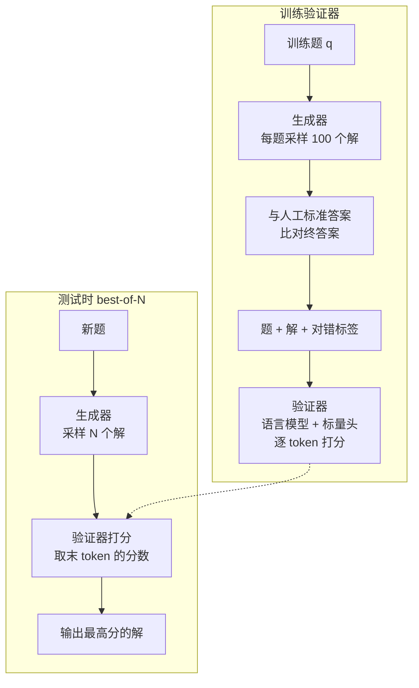
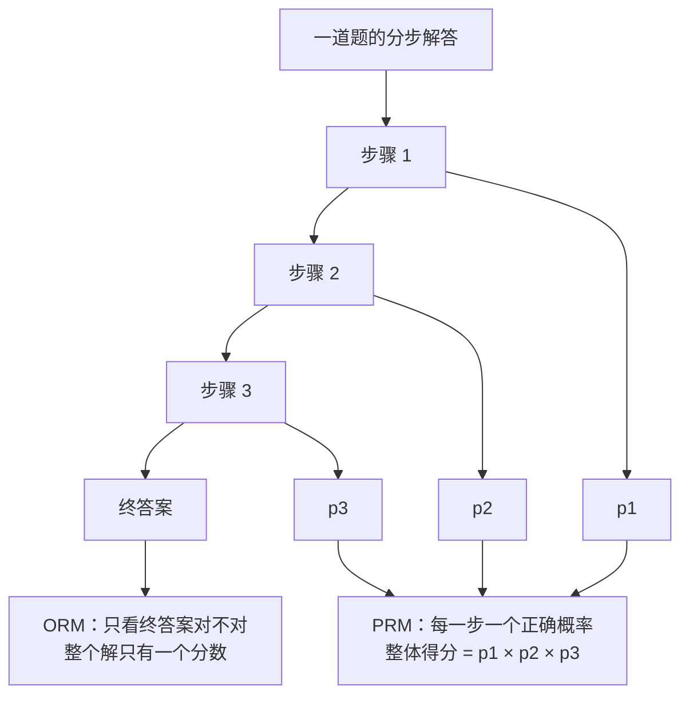
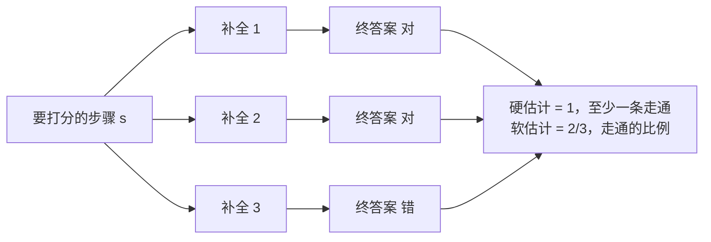
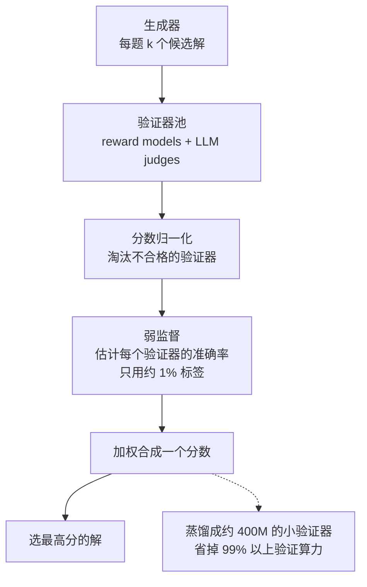

# CS329A 第 3 讲｜稳健的验证（Robust Verification）

> Stanford CS329A: Self-Improving AI Agents（2025 秋）· 对应课表第 3 次课（9 月 29 日）
> 视频：<https://www.youtube.com/watch?v=p7TdPUcPoik>（1:12:59，自带人工校对英文 CC）
> 讲者：Azalia Mirhoseini（最后一篇 Weaver 出自她的实验室）
> 配套阅读：Training Verifiers to Solve Math Word Problems（Cobbe et al., 2021）· Let's Verify Step by Step（Lightman et al., 2023）· Math-Shepherd（Wang et al., 2023）· Shrinking the Generation-Verification Gap with Weak Verifiers（Weaver, NeurIPS 2025）

**一句话**：重复采样说明模型"做得出来"，难的是"挑得出来"。四篇论文是一条清晰的演进线：结果级验证器（ORM）→ 人工标注的过程级验证器（PRM）→ 自动标注的 PRM 并反过来用于 RL → 不再训练新验证器，而是用弱监督把一堆不完美的验证器组合成一个强的，再蒸馏成小模型。

## 时间轴

| 时间 | 内容 |
|---|---|
| [0:06](https://www.youtube.com/watch?v=p7TdPUcPoik&t=6s) | 引子：从 generation–verification gap 到验证 |
| [1:08](https://www.youtube.com/watch?v=p7TdPUcPoik&t=68s) | 论文一：Training Verifiers（OpenAI 2021）与 GSM8K |
| [3:14](https://www.youtube.com/watch?v=p7TdPUcPoik&t=194s) | 验证器怎么训：采样 100 个解、按终答案打标签、双目标、逐 token 打分 |
| [10:50](https://www.youtube.com/watch?v=p7TdPUcPoik&t=650s) | 结果：验证 vs 纯微调；生成器与验证器的大小搭配 |
| [14:00](https://www.youtube.com/watch?v=p7TdPUcPoik&t=840s) | 采样数到 400 之后反而下降；问答 |
| [21:20](https://www.youtube.com/watch?v=p7TdPUcPoik&t=1280s) | 论文二：Let's Verify Step by Step——ORM vs PRM |
| [25:52](https://www.youtube.com/watch?v=p7TdPUcPoik&t=1552s) | PRM800K 与主动学习式的数据收集 |
| [29:00](https://www.youtube.com/watch?v=p7TdPUcPoik&t=1740s) | 结果：PRM > ORM > 多数投票；标注效率；分布外泛化 |
| [31:50](https://www.youtube.com/watch?v=p7TdPUcPoik&t=1910s) | 问答：PRM 会不会帮倒忙、跳步骤式的 reward hacking |
| [37:50](https://www.youtube.com/watch?v=p7TdPUcPoik&t=2270s) | 论文三：Math-Shepherd——不用人的过程标注 |
| [40:50](https://www.youtube.com/watch?v=p7TdPUcPoik&t=2450s) | 课堂讨论：rollout 式标注的三个缺陷 |
| [43:25](https://www.youtube.com/watch?v=p7TdPUcPoik&t=2605s) | 用于验证和 PPO 的结果；问答 |
| [51:48](https://www.youtube.com/watch?v=p7TdPUcPoik&t=3108s) | 论文四：Weaver——组合弱验证器 |
| [54:50](https://www.youtube.com/watch?v=p7TdPUcPoik&t=3290s) | score → weight → select；弱监督估计每个验证器的准确率 |
| [1:00:04](https://www.youtube.com/watch?v=p7TdPUcPoik&t=3604s) | 验证算力的几种扩法；8B ≈ 70B、70B ≈ o3-mini |
| [1:04:11](https://www.youtube.com/watch?v=p7TdPUcPoik&t=3851s) | 把整个验证器池蒸馏进 400M 小模型 |
| [1:06:20](https://www.youtube.com/watch?v=p7TdPUcPoik&t=3980s) | 总结与问答：代码领域、推理模型、采样与 pass@1 是否会合流 |

## 核心内容

### 1. 为什么需要验证器

上一讲的结论是 coverage 随采样数一路上升，但多数投票这种"免费"的选择方法在几十个样本以内就不再进步——能生成的和能选中的之间的差距就是 generation–verification gap。验证要解决两件事：生成之后自动选出对的答案；或者在生成过程中给模型引导。

<figure class="fig">

<svg viewBox="0 0 660 320" width="660" height="320" role="img" aria-label="示意图：采样数增加时 coverage、验证器 best-of-N、多数投票三条曲线的走势" xmlns="http://www.w3.org/2000/svg" font-size="13">
<line x1="60" y1="262" x2="560" y2="262" stroke="var(--muted, #5A6A63)" stroke-width="1.2" fill="none"/>
<line x1="60" y1="262" x2="60" y2="34" stroke="var(--muted, #5A6A63)" stroke-width="1.2" fill="none"/>
<line x1="247" y1="262" x2="247" y2="70" stroke="var(--rule, #D8E1DC)" stroke-width="1" stroke-dasharray="4 4" fill="none"/>
<line x1="346" y1="262" x2="346" y2="70" stroke="var(--rule, #D8E1DC)" stroke-width="1" stroke-dasharray="4 4" fill="none"/>
<polyline points="60,212 170,172 280,134 390,98 500,62" fill="none" stroke="var(--accent, #1B6350)" stroke-width="2.4" stroke-linejoin="round" stroke-linecap="round"/>
<polyline points="60,212 170,182 247,166 346,152 390,156 500,172" fill="none" stroke="var(--mark, #85590D)" stroke-width="2.4" stroke-linejoin="round" stroke-linecap="round"/>
<polyline points="60,212 170,194 247,188 500,188" fill="none" stroke="var(--muted, #5A6A63)" stroke-width="2.4" stroke-dasharray="7 5" stroke-linejoin="round" stroke-linecap="round"/>
<circle cx="346" cy="152" r="4" fill="var(--mark, #85590D)"/>
<circle cx="247" cy="188" r="4" fill="var(--muted, #5A6A63)"/>
<line x1="516" y1="66" x2="516" y2="168" stroke="currentColor" stroke-width="1" fill="none"/>
<line x1="510" y1="66" x2="522" y2="66" stroke="currentColor" stroke-width="1" fill="none"/>
<line x1="510" y1="168" x2="522" y2="168" stroke="currentColor" stroke-width="1" fill="none"/>
<text x="528" y="112" fill="currentColor">generation–</text>
<text x="528" y="130" fill="currentColor">verification gap</text>
<text x="500" y="50" fill="var(--accent, #1B6350)" text-anchor="end" font-weight="600">coverage：至少一个样本做对</text>
<text x="440" y="148" fill="var(--mark, #85590D)" text-anchor="start" font-weight="600">验证器选最高分</text>
<text x="440" y="208" fill="var(--muted, #5A6A63)" text-anchor="start" font-weight="600">多数投票</text>
<text x="247" y="60" fill="currentColor" text-anchor="middle">约 50：多数投票走平</text>
<text x="346" y="86" fill="currentColor" text-anchor="start" dx="8">约 400：验证器见顶后回落</text>
<text x="60" y="284" fill="currentColor" text-anchor="middle">1</text>
<text x="170" y="284" fill="currentColor" text-anchor="middle">10</text>
<text x="247" y="284" fill="currentColor" text-anchor="middle">50</text>
<text x="346" y="284" fill="currentColor" text-anchor="middle">400</text>
<text x="500" y="284" fill="currentColor" text-anchor="middle">10,000</text>
<text x="310" y="310" fill="currentColor" text-anchor="middle">每题采样数 N（对数刻度）</text>
<text x="22" y="150" fill="currentColor" text-anchor="middle" transform="rotate(-90 22 150)">最终答对的比例</text>
</svg>

<figcaption>图 3-0｜本讲要解决的问题（自绘示意）：只表达课上讲的走势和两个拐点，纵轴没有刻度，不是原始数据；两个拐点分别来自第 2 讲的多数投票讨论和 Cobbe et al. 的实验，实验设置并不相同 · <a href="https://www.youtube.com/watch?v=p7TdPUcPoik&t=840s">▶ 看原幻灯片 14:00</a></figcaption>
</figure>

### 2. 论文一：Training Verifiers to Solve Math Word Problems（OpenAI, 2021）

*图 3-1｜验证器的训练与使用（自绘示意）· [▶ 看原幻灯片 3:14](https://www.youtube.com/watch?v=p7TdPUcPoik&t=194s) · 出处：[Cobbe et al., 2021](https://arxiv.org/abs/2110.14168)*

- **GSM8K**：约 8,500 道小学数学应用题，题目不难，但都需要几步推理，解答用自然语言写。至今仍是小模型常用的评测，做项目时可以直接拿来当 eval。
- **验证器**：输入题目 + 解答，输出"这个解正确"的概率。
- **训练流程**：先把生成器在数据集上微调 2 个 epoch → 每题采样 100 个解 → 和人工标准答案比对终答案，得到对 / 错标签 → 用这批数据训练验证器 1 个 epoch。讲者的评论：今天的模型已经很会做数学和遵循指令，前面那步生成器微调多半可以省掉，新的验证器工作通常直接训练。
- **结构与目标**：验证器本身是语言模型，外加一个标量输出头，对解答的每个 token 都预测一次；题目部分的 token 不计损失。训练时同时用正确性预测和语言建模两个目标，论文报告两者一起用更好。推理时只取最后一个 token 的分数作为整个解的得分。可视化里能看到分数在出错的位置由绿转红。
- **结果**
  - 6B 和 175B 两个规模上，"采样 100 个 + 验证器选最高分"都优于"只做监督微调"，而且训练数据越多优势越大；数据很少时（175B 在约 1,000 题以下）验证器帮不上忙。
  - **大生成器 + 小验证器** 优于 **小生成器 + 大验证器**——符合"生成比验证难"的直觉。两者大小的 Pareto 最优配比被点名为值得做的研究题，尤其是现在基座强了很多、公开的 reward model 也很多（Hugging Face 上有排行榜）。
  - **采样数不是越多越好**：增加到约 400 个时收益最大，再多准确率反而下降。原因是样本越多，越容易出现"错误但验证器给高分"的解，验证器的分辨率跟不上。论文实际使用 100 个。对比：多数投票在 50 个样本以内就到头了。
- **问答**
  - 数据足够多时，直接微调和训练验证器会趋同；验证器的好处是不动基座，生成器保持通用。
  - 能不能对验证器本身做 test-time scaling：可以，Weaver 就是一种形式。

### 3. 论文二：Let's Verify Step by Step（OpenAI, 2023）

*图 3-2｜ORM 与 PRM 的打分方式（自绘示意）· [▶ 看原幻灯片 22:49](https://www.youtube.com/watch?v=p7TdPUcPoik&t=1369s) · 出处：[Lightman et al., 2023](https://arxiv.org/abs/2305.20050)*

- **动机**：分步解题时，前面一步走错，后面全盘皆错。
- **ORM vs PRM**：ORM 对整个解给一个奖励，标签来自终答案比对；PRM 对每一步给奖励，标签来自人工逐步标注（正确 / 错误 / 中性）。PRM 的整体得分取各步正确概率的乘积；ORM 仍取最后一个 token 的分数。
- **过程监督的好处**：信用分配更精确；能压住 false positive——模型有时过程是错的，终答案却碰对了，只看结果会把这种解当成正例；推理过程可解释，并且是"人认可的"解法。讲者特别提醒，false positive 是 test-time scaling 里容易踩的坑。
- **PRM800K**：开源的 80 万条步骤级标签。收集方式是迭代的主动学习：用当前 PRM 挑出最值得标注的样本给人标，再重训 PRM，循环往复，数据效率约为随机挑选的 2.6 倍。
  > 小注：课上对"convincing wrong-answer"的描述是"终答案对、中间步骤错"；论文原文的定义是"被当前 PRM 打了高分、但终答案错"的解。两种都是 PRM 最容易判断失误的样本，但方向相反，以论文为准。
- **训练**：以 GPT-4 为基座，ORM 和 PRM 都先在数学数据上微调过。
- **结果**：best-of-N 下 PRM > ORM > 多数投票，N 越大差距越大；多数投票在 100 个样本左右失效。PRM 能从正确率不到 5% 的样本分布里把对的解捞出来。按标注量算 PRM 也更省：量级上，ORM 每题标 100 个解的效果，大约相当于 PRM 每题标 1 个解。分布外测试中，多数投票反而比 ORM 稳，PRM 最好，对分布偏移的容忍度最高。
- **问答**
  - PRM 会不会帮倒忙（某一步看着好，其实对答案没贡献）：较新的做法是 PRM 和 ORM 一起用；另外 PRM 的阈值是新引入的超参，需要调。
  - 两者的标注量很难对齐比较：ORM 每题 k 个标签，PRM 是 k × 步数，而步数不好控制。
  - 模型跳过推理直接写答案，能骗过 PRM 吗：只在测试时当选择器用，生成器没被改动，可以通过 prompt 要求它写出步骤，问题不大。真正的风险出现在**拿 PRM 当奖励去训练生成器**的时候——模型可能学会少写步骤来讨好 PRM。人工标注可以把"跳步"标成差；自动标注时这一点要格外小心。

### 4. 论文三：Math-Shepherd（2023）——不用人的过程标注

*图 3-3｜用 rollout 给单个步骤自动打标签，N=3 的例子（自绘示意）· [▶ 看原幻灯片 39:17](https://www.youtube.com/watch?v=p7TdPUcPoik&t=2357s) · 出处：[Wang et al., 2023](https://arxiv.org/abs/2312.08935)*

- **思路**：一个步骤好不好，用"从这一步出发，最终走到正确答案的潜力"来定义。从该步往后采样 N 条补全：
  - Hard estimation：只要有一条到达正确答案，这步记 1；
  - Soft estimation：到达正确答案的比例，就是这步的得分。
- **课堂讨论出的三个缺陷**：N 太小会漏掉少见但正确的路径，非常规解法会被低估；难题上怎么 rollout 都是错的，得不到任何信号；中间走错、但最后碰对答案的路径，其错误步骤也会被标成正确。
- **两种用法**：测试时对 N 个候选解用 PRM 打分取最高；训练时把 PRM 当奖励，用 PPO 逐步强化生成器。
- **结果**
  - Hard 和 soft 两种估计在 N=4 时差别不大，最终选了更简单的 hard。
  - Math-Shepherd > ORM > self-consistency（多数投票的另一个名字）；在更难的 MATH 上优势比 GSM8K 更大，并超过了用 PRM800K 训练的验证器。结论在 LLaMA2-70B、LLemma-34B、DeepSeek-67B 上都成立。
  - Mistral-7B 用该 PRM 做 PPO，明显好于用 ORM 做 RL；RL 之后再叠一层验证还能涨，但已经开始趋于平缓。
- **和课程主题的关系**：模型自己生成标注 → 训练出 PRM → PRM 在测试时和训练时两头改进生成器，是多层的自我改进。
- **问答**
  - 怎么让 PRM 鼓励自我纠错：给打分步骤配 rubric，或者让它调用工具（计算器、SymPy）核对算式——验证本身也可以是 agentic 的、可以吃 test-time compute 的。
  - 固定总算力时，多采样生成器还是多花在验证器上：论文没有控制这个变量，是可以做的研究题。ORM 和 PRM 要公平比较，必须来自同一份数据。
  - 一个延伸想法：从 RL 之后的模型重新生成标签、再训一轮验证器，把循环继续转下去。

### 5. 论文四：Weaver（Stanford, NeurIPS 2025）——组合弱验证器

*图 3-4｜Weaver 的 score → weight → select 流程（自绘示意）· [▶ 看原幻灯片 54:52](https://www.youtube.com/watch?v=p7TdPUcPoik&t=3292s) · 出处：[Weaver, 2025](https://arxiv.org/abs/2506.18203)*

- **出发点**：不训练新验证器，用推理时算力缩小差距。"弱"不是故意挑差的，而是承认现有最好的验证器也都不完美。候选池包括各家训练的 reward model（ORM / PRM）和 LLM-as-judge（可带 rubric、可用工具）。
- **观察**：直接取 top-1 / top-5 / top-10 个验证器做平均，有帮助但不单调；一旦有标签、能给每个验证器学一个权重（朴素贝叶斯或逻辑回归，每个验证器只有一个参数），提升就很稳定。
- **Weaver 的流程（score → weight → select）**
  1. 让所有验证器打分并归一化到同一尺度；
  2. 用极少量标签把明显不合格的验证器**过滤掉**——讲者强调这一步很关键，池子要有准入门槛；
  3. 用弱监督（思路来自 Snorkel）估计每个验证器的准确率。核心假设是各验证器在给定真实标签时相互独立，信号来自它们之间一致与不一致的模式；如果所有验证器永远给出同样的分数，就学不到任何东西；
  4. 按估计出的权重合成一个分数，选最高的解。
- **结果**
  - 相比朴素平均，在 GPQA Diamond、MATH、MMLU-Pro 这些难任务上提升更明显。
  - 曲线从上到下：Pass@K oracle（上限）> Weaver（全量标签）> Weaver（每个数据集只用约 1% 标签）> 朴素集成 > 多数投票 / Multi-Agent Verification。后者只靠 prompt 让 LLM 从多个角度打分，有两个数据集上还不如多数投票。
  - Llama 3.1 8B Instruct 做生成器 + 一池 8B 及以下的验证器，平均约 70%，追平 70B 模型的多数投票；换成 70B 级生成器 + Weaver，平均 86.2%，接近 o3-mini。这里报告的是整个系统最终选中答案的准确率，不是 coverage。
- **验证算力的扩法**：更多样本、更大的生成器或验证器、更多验证器。
- **蒸馏**：验证器池的开销很大（每个样本要过一遍所有模型）。把 Weaver 的合成分数蒸馏进一个约 400M 的小模型，能保住约 97% 的准确率，验证算力省掉 99% 以上；按"准确率—总推理算力"衡量，连未蒸馏的 Weaver 也比朴素集成和多数投票划算。权重已开源。
  > 小注：论文摘要给的数字是保留 98.7% 的准确率、验证算力最多减少 99.97%。

### 6. 总结与最后的问答

- 验证在训练和推理两头都能提升质量；过程奖励总体比结果奖励有效，最好两者结合；验证器吃数据，数据越多越好，训好之后还可以反过来用于 RL；Weaver 是另一条路——把 test-time scaling 花在"更多验证器"上，而不是"对单个验证器多采样"。
- **代码领域**：除了训练验证器，还可以让模型自己生成单元测试来当验证器（CodeMonkeys，后面会讲）。
- **推理模型还需要这些吗**：仍然受益。推理模型的训练本身就是"生成推理轨迹 → 奖励 → RL → 把正样本轨迹用于下一轮训练"，test-time scaling 已经内化成了造数据的环节；推理时多采样依然能探索解空间的不同区域。
- **重复采样最终会不会只用于造训练数据、测试时只问一次**：讲者希望如此（pass@1 足够强、效率最高）。但把分布压尖的代价是可能损失解法的多样性和创造性，而这恰恰是希望保留的性质。
- **生成器和验证器同源好还是异源好**：模型普遍更偏好自己的生成；讲者没见过系统比较"同家族同尺寸 vs 不同家族不同尺寸"的研究——又一个开放题。

## 关键图表速查（点时间戳跳到原幻灯片）

| 图 | 看什么 | 跳转 | 出处 |
|---|---|---|---|
| 验证 vs 纯微调 | 6B / 175B 两条线随训练集变大的走势；数据少时验证器不占优 | [10:50](https://www.youtube.com/watch?v=p7TdPUcPoik&t=650s) | [Cobbe et al.](https://arxiv.org/abs/2110.14168) |
| 生成器与验证器的大小搭配 | 大生成器 + 小验证器那条线在上面 | [12:50](https://www.youtube.com/watch?v=p7TdPUcPoik&t=770s) | 同上 |
| 采样数 vs 准确率 | 约 400 处见顶、之后回落 | [14:00](https://www.youtube.com/watch?v=p7TdPUcPoik&t=840s) | 同上 |
| 逐 token 打分可视化 | 绿 → 红的位置就是验证器认为出错的地方 | [9:28](https://www.youtube.com/watch?v=p7TdPUcPoik&t=568s) | 同上 |
| PRM vs ORM vs 多数投票 | 三条 best-of-N 曲线随 N 拉开的差距 | [29:00](https://www.youtube.com/watch?v=p7TdPUcPoik&t=1740s) | [Lightman et al.](https://arxiv.org/abs/2305.20050) |
| 分布外泛化 | 多数投票 > ORM、PRM 最好 | [31:01](https://www.youtube.com/watch?v=p7TdPUcPoik&t=1861s) | 同上 |
| Math-Shepherd 对比基线 | 红 = self-consistency，蓝 = ORM，绿 = Math-Shepherd | [44:25](https://www.youtube.com/watch?v=p7TdPUcPoik&t=2665s) | [Wang et al.](https://arxiv.org/abs/2312.08935) |
| PPO 结果表 | PRM 做奖励 vs ORM 做奖励；RL 后再叠验证 | [46:29](https://www.youtube.com/watch?v=p7TdPUcPoik&t=2789s) | 同上 |
| Weaver 扩展曲线 | oracle、Weaver、朴素集成、多数投票、MAV 的相对位置 | [1:00:04](https://www.youtube.com/watch?v=p7TdPUcPoik&t=3604s) | [Weaver](https://arxiv.org/abs/2506.18203) |
| 8B ≈ 70B、70B ≈ o3-mini | 跨模型档位的对比柱状图 | [1:02:09](https://www.youtube.com/watch?v=p7TdPUcPoik&t=3729s) | 同上 |
| 蒸馏后的算力效率 | 浅蓝 = 蒸馏版，深蓝 = 原版 Weaver | [1:05:12](https://www.youtube.com/watch?v=p7TdPUcPoik&t=3912s) | 同上 |

## 提到的工作

| 名称 | 在本讲里的作用 |
|---|---|
| Training Verifiers to Solve Math Word Problems（Cobbe et al., 2021） | 第一个系统的 ORM + best-of-N；提出 GSM8K |
| Let's Verify Step by Step（Lightman et al., 2023） | ORM vs PRM；PRM800K；主动学习式标注 |
| Math-Shepherd（Wang et al., 2023） | rollout 自动标注过程标签；PRM 用于验证和 PPO |
| Weaver（NeurIPS 2025） | 弱监督组合验证器池并蒸馏 |
| Snorkel（Ratner et al.） | Weaver 所用弱监督思路的来源 |
| Multi-Agent Verification（MAV） | 多角度 prompt 打分的基线 |
| Self-consistency | 多数投票基线 |
| GSM8K / MATH / MATH500 / GPQA Diamond / MMLU-Pro | 评测集 |
| CodeMonkeys | 自生成单元测试作验证器（后续展开） |
| Hugging Face 上的 reward model 排行榜（应为 RewardBench） | 现成验证器的来源 |

## 术语对照

| English | 中文 |
|---|---|
| verifier | 验证器 |
| generation–verification gap | 生成—验证差距 |
| outcome reward model (ORM) | 结果奖励模型 |
| process reward model (PRM) | 过程奖励模型 |
| outcome / process supervision | 结果监督 / 过程监督 |
| credit assignment | 信用分配 |
| false positive | 假阳性（过程错、答案碰对） |
| best-of-N | N 选最优 |
| majority voting, self-consistency | 多数投票，自洽性 |
| coverage, pass@k oracle | 覆盖率，pass@k 上限 |
| active learning | 主动学习 |
| hard / soft estimation | 硬估计 / 软估计 |
| rollout, completion | 展开，补全 |
| reward hacking | 奖励投机 |
| rubric | 评分细则 |
| LLM-as-a-judge | LLM 评审 |
| weak supervision | 弱监督 |
| ensemble | 集成 |
| conditional independence | 条件独立 |
| distillation | 蒸馏 |
| distribution shift, out-of-distribution | 分布偏移，分布外 |
| greedy decoding | 贪心解码 |

## 字幕勘误

"GSM 8-K" → GSM8K；"PSI / QI" → 解 s_i / 题 q_i；"MLU Pro" → MMLU-Pro；"LLema-34B" → Llemma-34B；"code monkeys" → CodeMonkeys；"weak to strong supervision" 在这里指 weak supervision（Snorkel 一脉），不是 OpenAI 的 weak-to-strong generalization；论文一消融部分说的 "sentence level"，论文原文是整解级（solution-level）对 token 级。

## 带走的问题

1. 固定总推理算力，应该怎么在"生成器多采样""验证器做大""验证器加多"之间分配？生成器和验证器的大小有没有 Pareto 最优配比？
2. 把验证器当 RL 奖励时，怎么防止生成器学会跳步骤、写讨好验证器的过程？自动标注的 PRM 在这一点上比人工标注脆弱多少？
3. Weaver 的"验证器相互独立"假设在实践中多大程度成立？如果池子里的 judge 大多来自同一基座，相关性会不会让权重估计失真？
4. 数学和代码之外、没有标准答案的任务，rollout 式的过程标注还能定义吗？"走到正确答案的潜力"换成什么？
