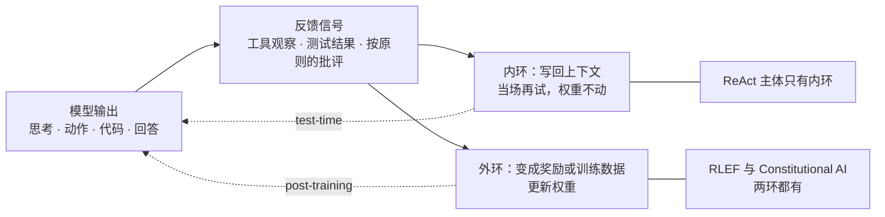
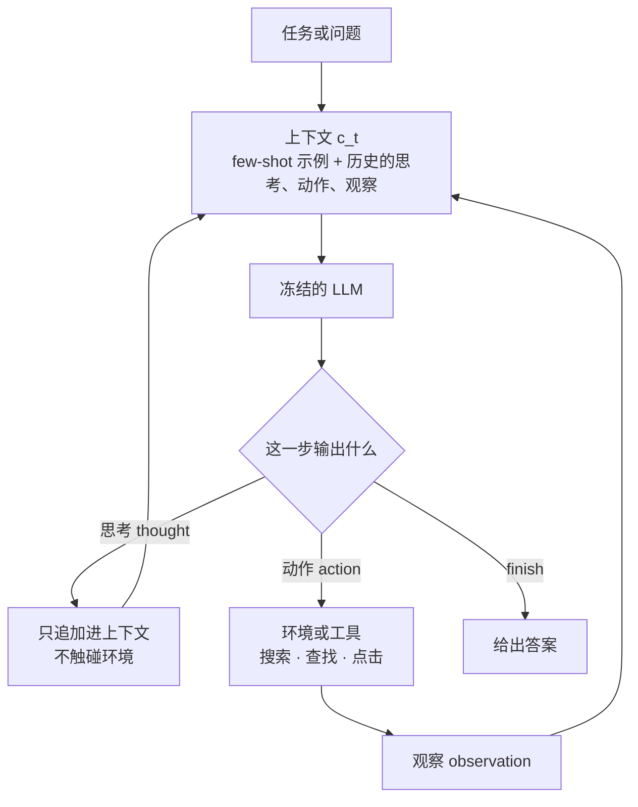
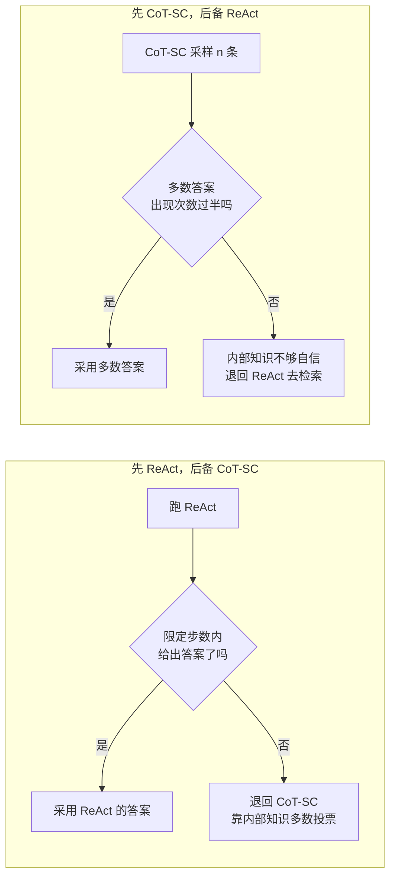
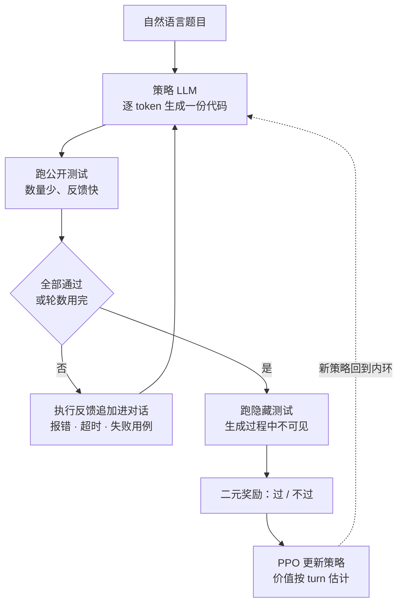
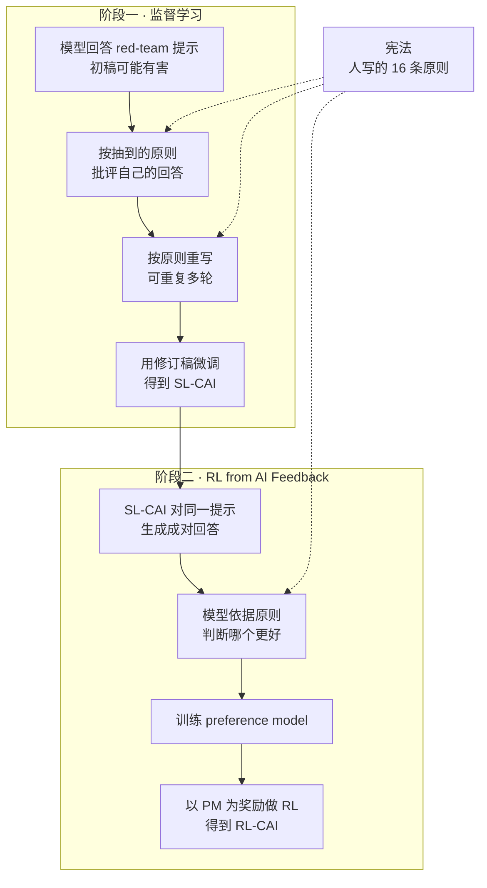

# CS329A 第 4 讲｜用工具与代码反馈来学习（Learning from Feedback with Tools/Code）

> Stanford CS329A: Self-Improving AI Agents（2025 秋）· 对应课表第 4 次课（10 月 3 日；所讲三篇论文与该次课的指定阅读完全一致）
> 视频：<https://www.youtube.com/watch?v=Lxh9RF5S-K0>（1:11:13，自带英文 CC，专名仍有识别错误）
> 讲者：Aakanksha Chowdhery（推断：没有自我介绍；她称前两讲由 Azalia 讲授，提到自己在 Google 与机器人团队的合作，ReAct 实验所用的 PaLM 也是她主导的模型）
> 配套阅读：[ReAct: Synergizing Reasoning and Acting in Language Models](https://arxiv.org/abs/2210.03629)（Yao et al., 2022）· [RLEF: Grounding Code LLMs in Execution Feedback with Reinforcement Learning](https://arxiv.org/abs/2410.02089)（Gehring et al., 2024）· [Constitutional AI: Harmlessness from AI Feedback](https://arxiv.org/abs/2212.08073)（Bai et al., 2022）

**一句话**：三篇论文回答同一个问题——让模型变好的反馈从哪来。ReAct 的反馈是工具返回的观察，只写回上下文；RLEF 的反馈是代码执行结果，先写回上下文供修复，再变成奖励更新权重；Constitutional AI 的反馈是模型依据人写的原则对自己的批评，用来造微调数据和偏好标签。回路里的信号够强，模型就能超出训练数据给它的水平。

## 时间轴

| 时间 | 内容 |
|---|---|
| [0:06](https://www.youtube.com/watch?v=Lxh9RF5S-K0&t=6s) | 引子：LLM 要落到真实任务，得会用工具、跑代码并从结果里学；三篇论文与"反馈从哪来" |
| [1:41](https://www.youtube.com/watch?v=Lxh9RF5S-K0&t=101s) | ReAct 的动机：人的"想—做—看"循环；没有 grounding 的模型只能幻觉 |
| [3:47](https://www.youtube.com/watch?v=Lxh9RF5S-K0&t=227s) | 回顾两条割裂的路线：CoT（只推理）与 WebGPT（只行动） |
| [4:49](https://www.youtube.com/watch?v=Lxh9RF5S-K0&t=289s) | ReAct 的做法：纯 prompting；三个任务 HotpotQA / FEVER / WebShop |
| [6:52](https://www.youtube.com/watch?v=Lxh9RF5S-K0&t=412s) | 左环推理、右环行动；思考只发生在语言空间；怎样保证动作合法 |
| [8:59](https://www.youtube.com/watch?v=Lxh9RF5S-K0&t=539s) | 实现（冻结的 PaLM + few-shot）与 Apple Remote 例题 |
| [12:30](https://www.youtube.com/watch?v=Lxh9RF5S-K0&t=750s) | 问答：模型知不知道该不该搜、是否交错、搜索结果矛盾、为什么要显式 thought |
| [17:19](https://www.youtube.com/watch?v=Lxh9RF5S-K0&t=1039s) | 知识任务的结果：基线、两种 fallback 组合、失败模式分析 |
| [20:23](https://www.youtube.com/watch?v=Lxh9RF5S-K0&t=1223s) | 决策任务 WebShop：对比 IL、IL + RL 与人类专家 |
| [22:05](https://www.youtube.com/watch?v=Lxh9RF5S-K0&t=1325s) | ReAct 小结与局限；课堂讨论（噪声反馈、缺失的认知机制、overthinking） |
| [27:25](https://www.youtube.com/watch?v=Lxh9RF5S-K0&t=1645s) | 论文二 RLEF：动机与设定（动作 = 代码，观察 = 执行反馈，二元奖励，PPO） |
| [29:16](https://www.youtube.com/watch?v=Lxh9RF5S-K0&t=1756s) | 框架图：公开测试内环 + 隐藏测试奖励外环；回文子串例题 |
| [31:20](https://www.youtube.com/watch?v=Lxh9RF5S-K0&t=1880s) | 两级测试的用意；token 级策略 + turn 级价值；问答：两组测试从哪来 |
| [35:26](https://www.youtube.com/watch?v=Lxh9RF5S-K0&t=2126s) | 结果：solve rate 对采样预算；为什么有效——逐轮错误分析 |
| [37:50](https://www.youtube.com/watch?v=Lxh9RF5S-K0&t=2270s) | 问答：二元奖励够不够、ORM 还是 PRM、对比 SFT、两级测试的消融、超时为何变多 |
| [43:44](https://www.youtube.com/watch?v=Lxh9RF5S-K0&t=2624s) | 小结与课堂讨论：代码库放不进上下文怎么办（Claude Code、SWE-bench、CodeMonkeys） |
| [46:25](https://www.youtube.com/watch?v=Lxh9RF5S-K0&t=2785s) | 论文三 Constitutional AI：RLHF 回顾与人工标注的瓶颈 |
| [47:56](https://www.youtube.com/watch?v=Lxh9RF5S-K0&t=2876s) | 宪法 = 人写的原则；两阶段总览；宪法示例 |
| [50:29](https://www.youtube.com/watch?v=Lxh9RF5S-K0&t=3029s) | SL 阶段：critique → revision → 微调；修订次数的影响 |
| [51:29](https://www.youtube.com/watch?v=Lxh9RF5S-K0&t=3089s) | RL 阶段：AI 偏好 → preference model → RL；问答：宪法修订与遗忘 |
| [53:33](https://www.youtube.com/watch?v=Lxh9RF5S-K0&t=3213s) | 结果：Elo 曲线；问答：CoT 版本更不 helpful、SL 阶段没有显式反馈、AI 反馈准不准 |
| [58:12](https://www.youtube.com/watch?v=Lxh9RF5S-K0&t=3492s) | Pareto 图；推广与后续工作（RLAIF、Self-Refine、SCoRe） |
| [1:00:20](https://www.youtube.com/watch?v=Lxh9RF5S-K0&t=3620s) | 全课回顾 |
| [1:03:30](https://www.youtube.com/watch?v=Lxh9RF5S-K0&t=3810s) | 结尾问答：认知科学类比、手工框架会不会过时、context 即 state、数据过滤 |

## 核心内容

### 1. 主线：反馈从哪来，喂到哪去

*图 4-1｜反馈的两个去处：内环写回上下文，外环更新权重（自绘示意）· [▶ 看原幻灯片 1:10](https://www.youtube.com/watch?v=Lxh9RF5S-K0&t=70s)*

- LLM 要在真实任务里有用，必须能和环境、工具、代码打交道，并从交互结果中学习。前两讲（重复采样、验证器）解决"多试几次，再挑出对的"；这一讲让外部世界直接告诉模型哪里不对。
- 讲者给三篇论文的分类标准只有一个——**反馈来源**：环境交互（ReAct）、可执行的客观检验（RLEF）、依据原则的批评（Constitutional AI）。
- 图 4-1 是我的整理：内环把反馈写回上下文、当场再试，对应第 1 讲的 test-time 轴；外环把反馈变成奖励或训练数据，对应 post-training 轴，也就是第 1 讲的自我改进回路。

### 2. 论文一：ReAct（Princeton + Google，2022）——在语言空间里交错推理与行动

*图 4-2｜ReAct 的思考—行动—观察循环（自绘示意）· [▶ 看原幻灯片 6:52](https://www.youtube.com/watch?v=Lxh9RF5S-K0&t=412s) · 出处：[Yao et al., 2022](https://arxiv.org/abs/2210.03629)*

- **动机**：人做事是"想 → 做 → 看结果 → 再想"的循环，当时的 LLM 却把两头割裂开。CoT 只推理：步骤看着合理，但全部出自内部状态，没有外部校验，容易幻觉（问今天的气温，不搜索就不可能知道）。WebGPT 一类只行动：在人操作浏览器的轨迹和偏好上微调，会用工具，却没有显式推理。
- **做法**：纯 prompting，不训练。冻结的 PaLM 加 few-shot 示例，示例里写出 thought / action / observation 三种条目，模型每一步自己决定输出思考还是动作。思考只存在于语言空间，不改变环境，只被追加进上下文；动作交给环境执行，观察同样追加进上下文。课上的形式化里，上下文 c_t 就是 RL 意义上的 state。这样不必训练 policy，只靠 prompt 就搭出了第 1 讲的 agent loop，轨迹还是人读得懂的。
- **让动作合法**：把"选动作"改写成在合法动作清单上的分类——把推理、当前状态和清单一起给模型让它挑，而不是自由生成。讲者说她在 Google 与机器人团队合作的工作也这么做，机器人没有动作清单根本无法操作。
  > 小注：她没有点名；从描述看应指 PaLM-SayCan / PaLM-E 一类工作（推断）。
- **例题（HotpotQA）**：除了 Apple Remote，还有什么设备能控制它最初要操控的那个程序？

  | 方式 | 推理 | 行动 | 在这道题上的表现 |
  |---|---|---|---|
  | Standard | – | – | 直接答错 |
  | CoT | 有 | – | 步骤写得出来，但事实没有依据，仍然答错 |
  | Act-only | – | 有 | 搜了 Apple Remote、又搜 Front Row，一路跟下去，最后给不出像样的答案 |
  | ReAct | 有 | 有 | 先想清要查什么 → 搜到 Front Row → 直接搜它搜不到 → 想到改搜 Front Row software → 得出答案 |

- **和今天的模型的关系**：Qwen 等模型打开 thinking 模式后，"想一步、调一次工具"会自动出现——后训练（课上提到 thinking fusion 一类阶段）已经在这类轨迹上蒸馏过。ReAct 不再是要手写的技巧，而是理解这种行为的积木。
- **问答**
  - 模型怎么知道该不该搜：它"知不知道自己知道什么"目前有两派看法；让它自报置信度通常过度自信、校准差，仍是研究问题。做应用不必赌这一点，让它用对工具、拿到有出处的信息更实际。
  - 思考是一次写完再逐个执行吗：不是，thought 与 action 严格交错，每个观察都会改变下一步思考；要并行采样得另外设计。
  - 搜索结果互相矛盾：交给用户之前要有校验和护栏，例如第 2 讲的多数投票；带检索的幻觉仍比只靠内部状态可控得多。
  - 为什么要显式写 thought：语言模型是在语言上训练的，推理 token 是引出正确动作的合适抽象；换成别的中间表示，未必需要。（另有学生问 thought 与 observation 在 KV-cache 里的表示差异，被建议当课程项目。）

### 3. ReAct 的结果、局限与课堂讨论

*图 4-3｜ReAct 与 CoT-SC 互为后备的两种组合（自绘示意）· [▶ 看原幻灯片 18:21](https://www.youtube.com/watch?v=Lxh9RF5S-K0&t=1101s) · 出处：[Yao et al., 2022](https://arxiv.org/abs/2210.03629)*

- **知识密集任务**（HotpotQA 多跳问答、FEVER 事实核查）：动作只有三种——搜索 Wikipedia 词条、在页面里查找字符串、结束并作答。基线是 standard、CoT、CoT-SC（self-consistency，即多数投票）和不带思考的 Act-only。
  - ReAct 稳定好于 Act-only；对 CoT 互有胜负：FEVER 上赢，HotpotQA 上没赢。
  - 最好的是图 4-3 的两种组合：内部知识和外部检索要配合着用，推理是把两者接起来的中间层；多数票占比在这里充当"内部知识够不够自信"的代理。
  - 失败模式分析：CoT 的主要问题是幻觉；ReAct 拿得到外部知识，错误更少、更可信。能微调时 ReAct 的优势更明显，再加外环训练还会更好（下周展开）。
  > 小注：论文 Table 1（PaLM-540B）的 HotpotQA EM / FEVER Acc——CoT 29.4 / 56.3，CoT-SC 33.4 / 60.4，Act 25.7 / 58.9，ReAct 27.4 / 60.9，CoT-SC→ReAct 34.2 / 64.6，ReAct→CoT-SC 35.1 / 62.0；ReAct 的步数上限是 HotpotQA 7 步、FEVER 5 步。
- **决策任务**（WebShop）：模拟购物网站，按用户指令（如找带抽屉的床头柜）搜索、点选、下单。只靠 prompting 的 ReAct 在 score 和 success rate 上都高过 imitation learning（即 SFT）和 IL + RL；但 score 66.6 对人类专家的 82.1，空间还很大。多步任务里一步出错就向后级联，所以 success rate 更低。
  > 小注：WebShop 里 score 是所购商品与需求的匹配度（平均 reward × 100），success rate 是完全匹配的比例；课上把 score 说成中间步骤的得分，不太准确。论文的 success rate：ReAct 40.0、Act 30.1、IL 29.1、IL + RL 28.7、人类专家 59.6。
- **局限**：动作空间一大，需要的示范就塞不进上下文；多轮推理抬高推理成本。
- **课堂讨论**
  - 环境反馈有噪声甚至误导：加一层 reflection，先审视环境给的东西；允许回溯（噪声会把 agent 带进重复循环）；多次检索或重复执行，换一个更好的置信度估计。
  - 除了"想 + 做"还缺什么认知机制：任务分解；并行尝试几条思路再比较；记忆与过往经验；按任务学会"想多少再动手"（讲者顺带提到现在的模型有 overthinking 的毛病，简单题也写很长的思考）；按各模型所长分派子任务的 compound system。

### 4. 论文二：RLEF（Meta FAIR，2024）——把执行反馈接进 RL

*图 4-4｜RLEF：推理时的修复内环与训练时的 PPO 外环（自绘示意）· [▶ 看原幻灯片 29:16](https://www.youtube.com/watch?v=Lxh9RF5S-K0&t=1756s) · 出处：[Gehring et al., 2024](https://arxiv.org/abs/2410.02089)*

- **动机**：课上举手用 Claude Code 的占了多数。要让 coding agent 足够强，一要读懂用户意图，二要能根据代码跑出来的结果迭代。
- **设定**：端到端 RL 微调。动作 = 一整份生成的代码；观察 = 执行反馈（跑测试的输出）；奖励 = 测试过没过的二元信号；优化用 PPO。内环（推理时）反复"生成 → 跑公开测试 → 读反馈"，直到通过或轮数用完；外环（训练时）用隐藏测试的结果给奖励、更新策略。讲者把内环称为对当前策略的 exploitation。
- **创新一：两级测试**。公开测试只是一小部分，跑得快，专给内环提供即时反馈；隐藏测试在生成过程中完全不可见，只用来给奖励。模型没法靠记住测试输出拿分，奖励也不会被"指导修复的那批测试"泄漏。问答里的解释：CodeContests 每道题都配有测试，留一部分给内环，另一部分留给奖励。
- **创新二：token 级策略 + turn 级价值**。策略逐 token 生成，保留细粒度控制；价值函数按回合估计——从 prompt 的最后一个 token 读出一个值，整段回答的所有 token 共用一个 advantage。讲者的类比：更接近 GSPO 那种"对整条序列给奖励"，而不是逐 token 给。
- **例题**：检测回文子串。第一轮的朴素解在公开测试上超时；读到反馈后第二轮做了优化，通过公开测试，才提交给隐藏测试。
- **结果**：纵轴 solve rate，横轴采样预算（对数），验证集、测试集各一张，基座是 Llama 3.1。在 CodeContests 上做完 RLEF，同等预算下 solve rate 明显更高，能泛化到其他代码 benchmark，达到 SOTA 所需的采样预算也更少。（采样预算是第 2 讲的并行那一支，多轮修复是串行那一支。）
  > 小注：n@k 是 AlphaCode 沿用下来的指标——每题采 k 个样本，从中挑 n 个提交，任何一个通过全部隐藏测试就算解出；课上对 10@k 的口头解释比较含糊，以此为准。论文的 1@3（CodeContests test）：Llama 3.1 8B Instruct 10.5 → 16.0，70B Instruct 27.5 → 40.1；默认每题最多 3 轮；奖励是全过 +1、不过 −1、回答里没有合法代码 −0.2，另加 KL 惩罚。CodeContests 数据集本身就把每题的测试分成 public 与 private 等几组，不需要自己切。
- **为什么有效**：没经过这种训练的模型，把"错误解 + 执行反馈"摆在面前也基本用不上；RLEF 每一轮都让它看到反馈，它才学会利用。消融图按轮次统计错误数、相邻两轮的代码改动量和错误类型（小、大模型各一组）：训练之后，后面轮次的 wrong output 变少，改动是冲着出错位置去的真修复。收益来自两处——多轮带来的样本多样性，加上更有针对性的修改。作业会在数学题上试同样的思路：先定位解答里的错误，再修。
  > 小注：论文还做了"喂随机的、与本题无关的反馈"的对照，修复能力明显下降，说明模型确实在读反馈，而不只是多采了几次样。
- **问答**
  - 二元奖励够吗：反馈里没有修改建议，只告诉模型哪里报了错（这些题不到 100 行）。学生猜够用是因为题目简单，难题还需要 error trace 等信息——讲者认为很可能，是好的项目题。她要大家带走的是：闭环本身成立，足够简单的问题上二元奖励就能转起来；要不要每一步都给反馈，就是第 3 讲 ORM 对 PRM 的争论，得按领域取舍。
  - 只有终局奖励，怎么鼓励一次做对：进 PPO 之前模型已在内环里有过几次改正机会；轮数上限等都可调。
  - 和 SFT 比：在推理轨迹上做 SFT 也能拿到一部分收益，域内尤其明显；RL 更能解新题，泛化略好——仍有争议。
  - 两级测试有没有消融（测试全部公开会怎样）：讲者没看到；她的理解是避免"用来反馈的"和"用来给奖励的"之间泄漏。这个问题课上没谈拢。
  - 为什么训练后 wrong output 变少、超时反而变多：讲者猜是逻辑错误修掉之后，剩下没解决的更多表现为超时；很依赖领域。
- **课堂讨论：代码库放不进上下文怎么办**。学生的方案：像 ReAct 那样带着搜索工具反复找，直到信息够用；给每个文件写摘要；把代码库建成图再按相似度检索。讲者：Claude Code 实际就是这么跑的——先找相关代码，再决定打什么 patch、跑测试；SWE-bench 考的就是这件事，Azalia 实验室的 CodeMonkeys 也针对同一问题。

### 5. 论文三：Constitutional AI（Anthropic，2022）——反馈来自模型自己

*图 4-5｜Constitutional AI 的两阶段流程（自绘示意）· [▶ 看原幻灯片 48:57](https://www.youtube.com/watch?v=Lxh9RF5S-K0&t=2937s) · 出处：[Bai et al., 2022](https://arxiv.org/abs/2212.08073)*

- **背景**：要把 base model 变成既 helpful 又 harmless 的助手，标准做法是 RLHF——人给两个回答排序（是否正确、有用、够具体）→ 训练 reward model → 拿它当目标 hill-climb。课上的图：做过 Python 微调的模型加上 RLHF 后更好，模型越大差距越明显。瓶颈在标注：几万条人工偏好标签，又慢又累，扩不上去。
  > 小注：这张图应出自 Anthropic 更早的 HH-RLHF 论文（[Bai et al., 2022a](https://arxiv.org/abs/2204.05862)）里对 Python 微调模型做 RLHF 的实验（推断）。
- **核心想法**：人只写一份"宪法"——一组描述期望行为的自然语言原则（论文用了 16 条），其余反馈由模型自己产生。可行的前提是指令遵循已经够强：问它"这段回答有没有某类问题"能如实判断，让它"按要求重写"也能照做。
- **阶段一（SL）**：用 red-teaming 提示诱出有问题的回答 → 按某条原则让模型批评自己（课上的三个例子：有没有有害或不道德的内容；有没有性别偏见；对儿童是否不合适）→ 按配套的 revision request 重写 → 用修订稿微调。修订次数越多，harmlessness 越高、helpfulness 越低，两者合起来的分数单调上升。
- **阶段二（RL）**：模型依据宪法给成对回答打偏好标签 → 训练 preference model → 用它做 RL。流程和 RLHF 一样，只是 PM 的数据来自宪法而不是人。
  > 小注：按论文，SL 阶段微调的目标是"原提示 → 修订后的回答"，critique 文本不进训练目标，同时混入 helpful RLHF 模型在普通提示上的回答来保住有用性；RL 阶段只有 harmlessness 的偏好标签由 AI 生成，helpfulness 的偏好标签仍是人标的，两者混合训练 PM。
- **结果**
  - Elo 曲线（横轴是 RL 训练序列数，Elo 由人对回答的两两偏好算出）：helpful-only RLHF、HH RLHF、RL-CAI、RL-CAI + CoT 四条线。换成 AI 反馈后 helpfulness 大致持平（略低），harmlessness 明显更高。
  - Pareto 图（横轴 helpfulness Elo，纵轴 harmlessness Elo）：pretrained base 两头都低；helpful-only RLHF 主要往右推；Constitutional SL 单独用还不如 RLHF；Constitutional RL + CoT 走到最外沿——这条更好的 Pareto 前沿就是论文的核心主张。
  - 讲者的评价：harmlessness 是 Claude 系列一直很强的地方，这套技术现在各家都在用。
- **推广与后续**：凡是要模型遵守一组（可能互相冲突的）规则的场景，都能套这个闭环。后续工作有 RLAIF 与 RLHF 的系统比较、Self-Refine（迭代式自反馈）、用 RL 教模型自我纠错（应为 SCoRe）。讲者提醒：模型过度自信，自己批评自己往往不灵，让一组别的模型来批评再取共识有时更好——和第 3 讲 Weaver 组合弱验证器是同一个直觉。
- **问答**
  - 宪法要修订怎么办：post-training 只占总算力的一小部分（她给的量级约 5%），本来就更新得频繁，可以跟着重做。更深的问题是 continual learning——怎么让模型可靠地忘掉旧规则、改守新规则，仍是开放问题；借可解释性方法抵消特定知识的尝试，还不能证明模型真的"忘了"。
  - CoT 版本的 helpfulness Elo 更低，是 CoT 拖了后腿吗：有可能，但讲者认为主因是 harmlessness 和 helpfulness 此消彼长，要找平衡点。
    > 小注：论文自己也写了 RL-CAI + CoT 比不带 CoT 的版本略不 helpful、略更 harmless。
  - SL 阶段是不是只在自己的 rollout 上提高似然、没有显式反馈：是，这一阶段没有奖励信号，和在推理轨迹上微调同理。微调规模远小于预训练，原有能力不会丢，只是输出分布偏向这类回答。
  - 怎么知道 AI 的反馈准不准：给 PM 留一个带人工标签的验证集，检查它和人的一致性——仍需要人，但远不到上万条。
  - 为什么不干脆从数据上限制（结尾处的提问）：预训练数据过滤确实在做，但模型是在互联网上训练的，滤不干净。

### 6. 回顾与最后的问答

三篇论文并排看（表是我的整理，"反馈可靠性"一行是我加的判断）：

| | ReAct | RLEF | Constitutional AI |
|---|---|---|---|
| 反馈来源 | 工具 / 环境返回的观察 | 代码执行与单元测试 | 模型依据人写的原则作出的批评与偏好 |
| 反馈可靠性 | 取决于工具，搜索结果可能有噪声 | 客观、可执行 | 受模型自身校准的限制 |
| 反馈怎么用 | 写回上下文，影响下一步思考 | 内环写回上下文，外环作 PPO 奖励 | 修订稿作 SFT 数据；AI 偏好训练 PM 再做 RL |
| 改不改权重 | 不改 | 改 | 改 |
| 人的投入 | few-shot 示例 | 题目与测试用例 | 一份宪法 + 少量一致性校验 |

- **这些设计都在类比人的认知，有没有更系统的方法**：现阶段确实在借用"人怎么解题"（分解、分析、并行）。真正要回答的是推理空间里的搜索能不能自动化：搜索空间定义得清楚时（比如游戏）可以；现实任务的搜索空间定义不清，只能在语言空间里做，靠真实环境里的观察来积累。
- **RL 后训练会不会让 ReAct 这类手工框架过时**：是也不是。抽象层面都是"生成 token，再用奖励监督"，可以被训练吸收；但具体到会计、金融、法律，完成任务的 workflow 高度领域相关，很难一套通吃。ReAct 本质上规定了一种"想—做—想—做"的工作流，而第 1 讲里 agent 的定义正是对工作流的抽象；讲者也把本讲的内容看作 agent 的雏形，只是还没有 session 和 memory。
- **形式化里的 context 是不是 state**：是，prompting 语境下的 state 就是上下文里的全部内容。动作空间包含"输出一段思考"和"输出一个环境动作"两类，模型每步二选一，思考可以单独成一步。

## 关键图表速查（点时间戳跳到原幻灯片）

| 图 | 看什么 | 跳转 | 出处 |
|---|---|---|---|
| Apple Remote 例题的四条轨迹 | 同一道 HotpotQA 题：standard 与 CoT 答错，Act-only 搜到了却收不了尾，ReAct 在搜索失败后改了检索词 | [9:29](https://www.youtube.com/watch?v=Lxh9RF5S-K0&t=569s) | [ReAct](https://arxiv.org/abs/2210.03629) |
| HotpotQA / FEVER 结果表 | ReAct 对 Act 稳赢、对 CoT 互有胜负；最高的两行是 ReAct 与 CoT-SC 的组合 | [18:45](https://www.youtube.com/watch?v=Lxh9RF5S-K0&t=1125s) | 同上 |
| 成功 / 失败模式分析 | CoT 的失败大头是幻觉；ReAct 的推理有检索结果支撑 | [19:35](https://www.youtube.com/watch?v=Lxh9RF5S-K0&t=1175s) | 同上 |
| WebShop 结果表 | ReAct 对 IL、IL + RL 的 score 与 success rate；66.6 对人类专家 82.1 | [20:53](https://www.youtube.com/watch?v=Lxh9RF5S-K0&t=1253s) | 同上 |
| RLEF 框架图 | 上方紫色块是带公开测试的多轮对话，黄色块是提交隐藏测试，右侧是 PPO 更新 | [29:16](https://www.youtube.com/watch?v=Lxh9RF5S-K0&t=1756s) | [RLEF](https://arxiv.org/abs/2410.02089) |
| 回文子串例题的对话 | 第一轮超时 → 执行反馈 → 第二轮优化后通过公开测试 | [30:48](https://www.youtube.com/watch?v=Lxh9RF5S-K0&t=1848s) | 同上 |
| solve rate 对采样预算 | 横轴是对数；验证集、测试集两张；RLEF 之后的线整体在基座之上 | [35:26](https://www.youtube.com/watch?v=Lxh9RF5S-K0&t=2126s) | 同上 |
| 逐轮错误与代码改动分析 | 第 1 / 2 / 3 轮的错误数与类型、相邻轮次的代码改动量；小、大模型各一组；留意超时一栏 | [36:50](https://www.youtube.com/watch?v=Lxh9RF5S-K0&t=2210s) | 同上 |
| 宪法示例 | 三组 critique / revision request：有害内容、性别偏见、儿童适宜性 | [49:28](https://www.youtube.com/watch?v=Lxh9RF5S-K0&t=2968s) | [Constitutional AI](https://arxiv.org/abs/2212.08073) |
| 修订次数对 PM 分数 | harmlessness 升、helpfulness 降、两者合计单调升 | [50:59](https://www.youtube.com/watch?v=Lxh9RF5S-K0&t=3059s) | 同上 |
| Elo 对训练序列数 | 左 helpfulness、右 harmlessness；四条线是 helpful RLHF、HH RLHF、RL-CAI、RL-CAI + CoT | [53:33](https://www.youtube.com/watch?v=Lxh9RF5S-K0&t=3213s) | 同上 |
| Harmlessness–helpfulness Pareto 图 | 从 pretrained base 出发，各方法把点往哪个方向推；RL-CAI + CoT 在最外沿 | [58:12](https://www.youtube.com/watch?v=Lxh9RF5S-K0&t=3492s) | 同上 |

## 提到的工作

| 名称 | 在本讲里的作用 |
|---|---|
| ReAct（Yao et al., 2022） | 主讲论文一：用 prompting 把推理与工具调用交错起来 |
| Chain-of-Thought、Self-Consistency（CoT-SC） | 只推理的基线；SC 就是多数投票 |
| WebGPT（应为 Nakano et al., 2021） | 只学操作浏览器、没有显式推理的代表 |
| PaLM | ReAct 实验用的冻结基座 |
| HotpotQA / FEVER / WebShop | 多跳问答 / 事实核查 / 模拟网购决策 |
| 与 Google 机器人团队合作的工作（应指 PaLM-SayCan / PaLM-E 一类，推断） | 在合法动作清单上做选择 |
| Qwen 的 thinking 模式 | 交错推理与工具调用已被内化的例子 |
| RLEF（Gehring et al., 2024） | 主讲论文二：执行反馈 + PPO |
| CodeContests | RLEF 的训练与评测集：竞赛编程题，每题配有测试用例 |
| Llama 3.1 | RLEF 的基座 |
| PPO、GSPO | RL 算法；后者用来类比"整条序列共用一个 advantage" |
| Claude Code、SWE-bench、CodeMonkeys | 仓库级 coding agent、对应的 benchmark、Azalia 实验室的相关工作 |
| Constitutional AI（Bai et al., 2022） | 主讲论文三：用 AI 反馈替代人工的 harmlessness 标注 |
| RLHF | Constitutional AI 要替代的人工偏好流程 |
| RLAIF vs. RLHF（应为 Lee et al., 2023） | 系统比较 AI 反馈与人类反馈 |
| Self-Refine（应为 Madaan et al., 2023） | 迭代式自反馈 |
| Training Language Models to Self-Correct via RL（应为 SCoRe，Kumar et al., 2024） | 用 RL 教模型自我纠错 |

## 术语对照

| English | 中文 |
|---|---|
| tool calling | 工具调用 |
| grounding | 落地（让输出有外部依据） |
| reasoning trace, thought | 推理轨迹，思考 |
| action / observation | 动作 / 观察 |
| action space | 动作空间 |
| interleaved | 交错 |
| hallucination | 幻觉 |
| calibration, overconfident | 校准，过度自信 |
| multi-hop question answering | 多跳问答 |
| fact verification | 事实核查 |
| imitation learning (IL) | 模仿学习 |
| backtracking | 回溯 |
| task decomposition | 任务分解 |
| overthinking | 过度思考 |
| compound system | 复合系统 |
| execution feedback | 执行反馈 |
| public / private tests | 公开 / 隐藏测试 |
| solve rate, n@k | 解出率 |
| sample budget | 采样预算 |
| turn-level value function | 回合级价值函数 |
| advantage | 优势 |
| exploitation | 利用 |
| leakage | 泄漏 |
| constitution, principle | 宪法，原则 |
| critique / revision | 批评 / 修订 |
| red-teaming prompt | 红队提示 |
| preference model (PM) | 偏好模型 |
| RLHF / RLAIF | 基于人类反馈 / AI 反馈的强化学习 |
| helpfulness / harmlessness | 有用性 / 无害性 |
| Pareto frontier | 帕累托前沿 |
| continual learning, unlearning | 持续学习，遗忘 |
| self-correction | 自我纠错 |

## 字幕勘误

"Azalea" → Azalia；"Cloud Code" → Claude Code（27:45、45:49 两处）；"Code Monks paper" → CodeMonkeys；"solve rate 10 at k" → 10@k（n@k 指标）；"[isn't] context is more difficult" → CodeContests；"two-tiered task strategy" → two-tier test strategy；"where do you get the public license" → public tests；"help climate" → hill-climb；"compositional principles" → constitutional principles；"self-critiquing relations" → self-critique and revisions；"set right a set of principles" → write a set of principles；"immediate steps" → intermediate steps；学生提问里的 "source" → thoughts；"much less harmless" 是讲者口误，意思是 much more harmless；"thinking fusion" 应指 Qwen3 后训练里的 Thinking Mode Fusion 阶段（推断）；"Python fine-tuning with RLHF" 不是识别错误，见第 5 节小注。

## 带走的问题

1. 模型什么时候该调工具、什么时候该信自己的内部知识？ReAct 的 fallback 用多数票占比当置信度的代理；在模型普遍过度自信的前提下，有没有更可靠的"知道自己不知道"的信号？
2. 二元的执行反馈在不到 100 行的竞赛题上够用；到了仓库级任务，需要多细的反馈（error trace、过程奖励）？公开 / 隐藏两级测试到底贡献了多少——课上没人见过这个消融。
3. RL 后训练把"推理 + 工具调用"内化之后，ReAct 这类手工编排的 workflow 还剩什么价值？在搜索空间定义不清的领域（会计、法律），工作流由谁来定义，能不能自动搜出来？
4. 用 AI 反馈替掉人类反馈之后，谁来验证 AI 的反馈？多模型共识是否比自我批评更可靠？宪法要修订时，怎样低成本地让模型真正"忘掉"旧规则？
