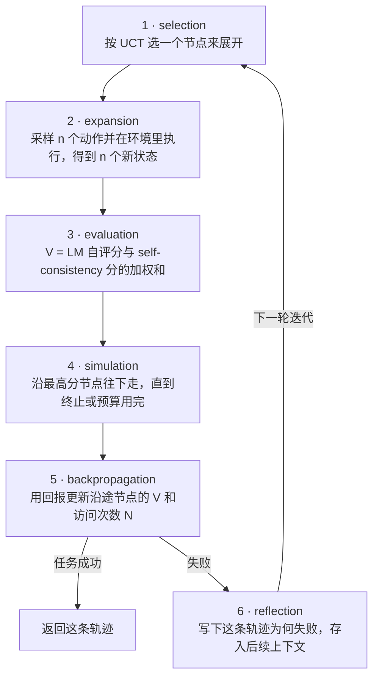
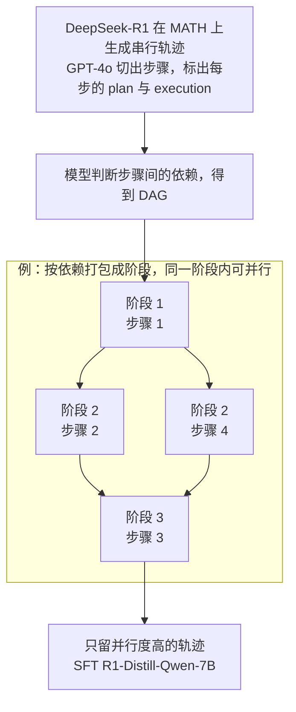
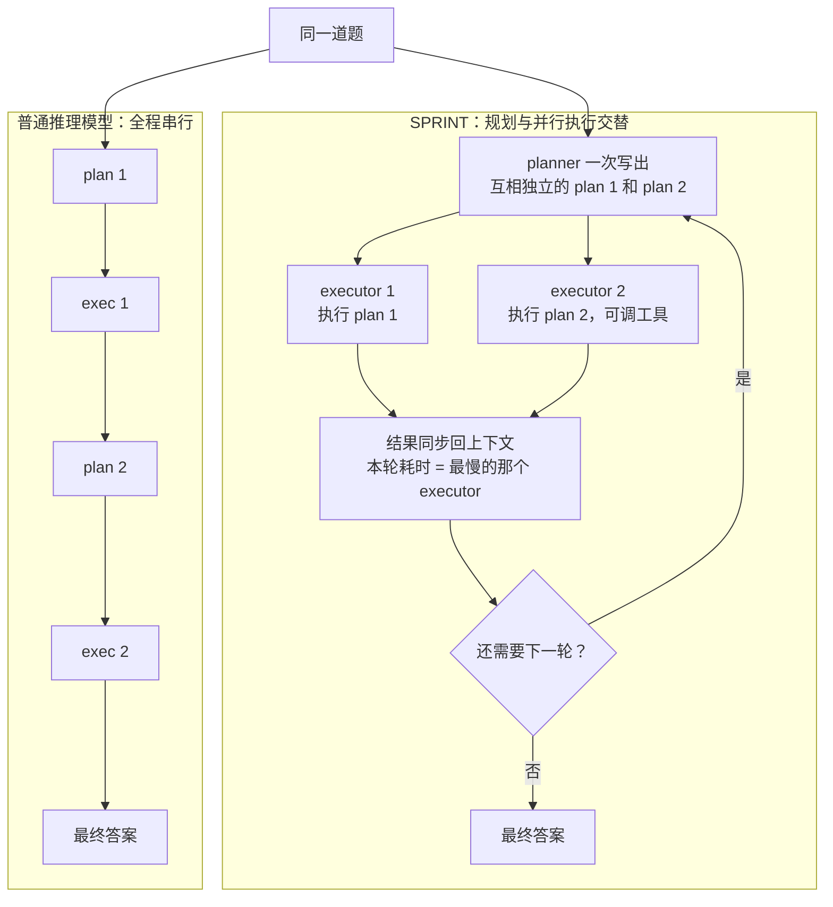
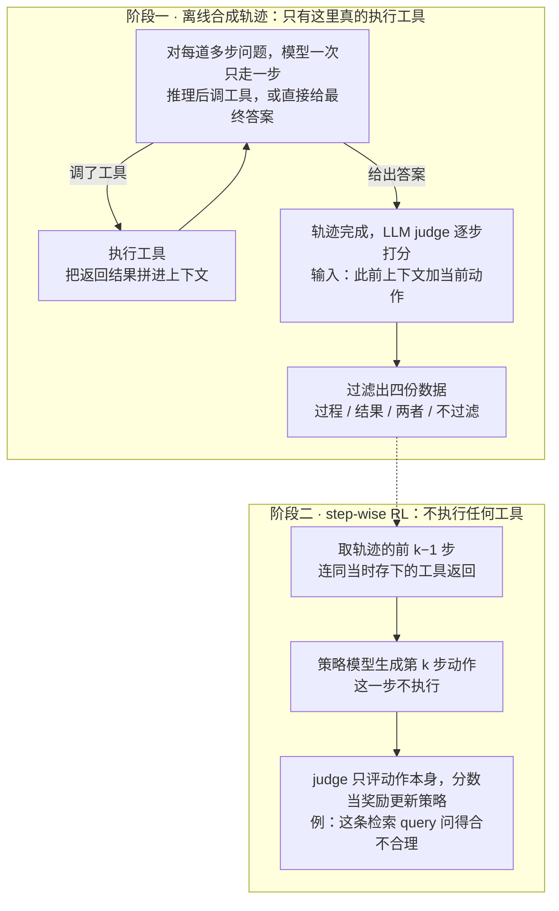
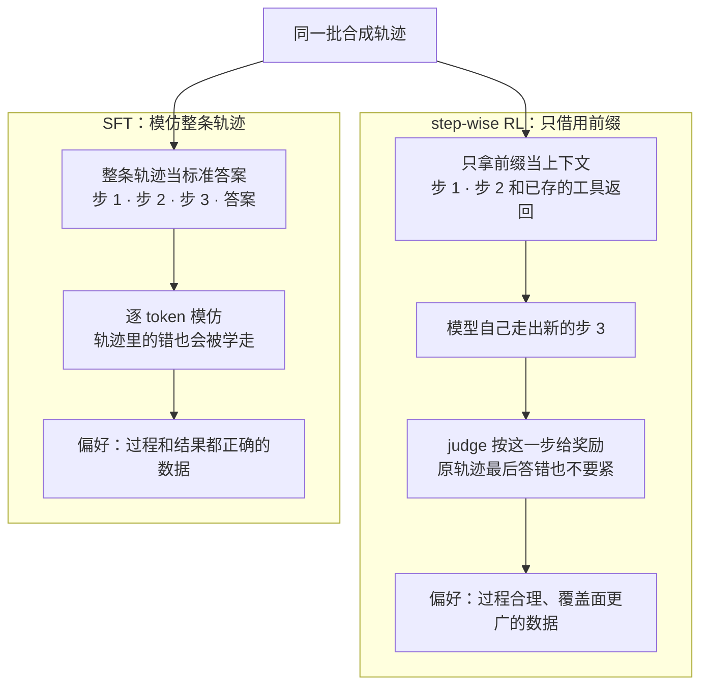

# CS329A 第 5 讲｜规划与多步推理（Planning and Multi-Step Reasoning）

> Stanford CS329A: Self-Improving AI Agents（2025 秋）· 对应课表第 5 次课（10 月 6 日，Multi-step Reasoning/Planning）——课上讲的三篇论文都在这次课的阅读清单里
> 视频：<https://www.youtube.com/watch?v=Ml_fp9XkB8Y>（1:14:56，自带英文 CC，专名仍有识别错误）
> 讲者：Azalia Mirhoseini（推断：讲者没有自我介绍，但讲 SPRINT 和 SWiRL 时都说"我们"，而这两篇论文唯一的共同作者是她）
> 配套阅读：[LATS](https://arxiv.org/abs/2310.04406)（Zhou et al., 2023）· [SPRINT](https://arxiv.org/abs/2506.05745)（NeurIPS 2025）· [SWiRL](https://arxiv.org/abs/2504.04736)（COLM 2025）——课上讲的是这三篇；清单里的 [ADaPT](https://arxiv.org/abs/2311.05772)（Prasad et al., 2024）和 [AB-MCTS](https://arxiv.org/abs/2503.04412)（Wider or Deeper?）课上没有讲

> 小注：讲者说 SWiRL "下周"在 COLM 报告。COLM 2025 是 10 月 7–10 日（蒙特利尔），而课表上这讲是 10 月 6 日，离开幕只差一天，说"下周"对不太上——可能是口误，也可能实际授课日期与课表略有出入。

**一句话**：多步任务要模型交替地"想、做、搜"，三篇论文各管一头：LATS 在推理时把 MCTS 套到 agent 轨迹上，用环境反馈和反思把算力换成成功率；SPRINT 用改写过的轨迹教推理模型把长思维链拆成"规划—并行执行"的回合，把串行 token 变成并行 token；SWiRL 用自己合成的多步轨迹加 judge 的逐步奖励做 step-wise RL，训练时一次工具都不调，学到的多步能力却能跨任务、跨工具迁移。

## 时间轴

| 时间 | 内容 |
|---|---|
| [0:05](https://www.youtube.com/watch?v=Ml_fp9XkB8Y&t=5s) | 开场：本讲三篇论文；多步任务 = reasoning + acting + search（规划旅行的例子） |
| [2:11](https://www.youtube.com/watch?v=Ml_fp9XkB8Y&t=131s) | LATS 要解决的问题：从"出一个计划就执行"到多样化探索，把 MCTS 引入 LLM agent |
| [3:48](https://www.youtube.com/watch?v=Ml_fp9XkB8Y&t=228s) | 夏威夷旅行的小例子；与 Math-Shepherd、ReAct 的区别 |
| [7:58](https://www.youtube.com/watch?v=Ml_fp9XkB8Y&t=478s) | 六个阶段；用迷宫例子走一遍 selection → simulation |
| [12:38](https://www.youtube.com/watch?v=Ml_fp9XkB8Y&t=758s) | backpropagation；value function、UCT、回传三个式子 |
| [16:49](https://www.youtube.com/watch?v=Ml_fp9XkB8Y&t=1009s) | reflection；HotpotQA 与 WebShop 结果 |
| [19:10](https://www.youtube.com/watch?v=Ml_fp9XkB8Y&t=1150s) | LATS 小结与局限：成本、不可逆动作 |
| [20:43](https://www.youtube.com/watch?v=Ml_fp9XkB8Y&t=1243s) | 课堂讨论：UCT 之外的 bandit 算法；重复动作怎么计数 |
| [23:21](https://www.youtube.com/watch?v=Ml_fp9XkB8Y&t=1401s) | SPRINT：推理模型越想越长，但很多步骤互不依赖 |
| [25:56](https://www.youtube.com/watch?v=Ml_fp9XkB8Y&t=1556s) | 框架：planner + 并行 executors，多轮交替 |
| [27:29](https://www.youtube.com/watch?v=Ml_fp9XkB8Y&t=1649s) | 数据管线：R1 轨迹 → GPT-4o 标注 → DAG → 打包 → SFT |
| [31:37](https://www.youtube.com/watch?v=Ml_fp9XkB8Y&t=1897s) | 为什么重要：串行与并行的时间线；推理时怎么跑 |
| [33:40](https://www.youtube.com/watch?v=Ml_fp9XkB8Y&t=2020s) | 问答：重新规划；有没有改变 next-token 预测 |
| [36:14](https://www.youtube.com/watch?v=Ml_fp9XkB8Y&t=2174s) | 训练配方与结果：准确率也涨、域外泛化 |
| [38:55](https://www.youtube.com/watch?v=Ml_fp9XkB8Y&t=2335s) | 问答：并行分支互相矛盾怎么办；两个观察（难题轮数多、前期并行多） |
| [41:35](https://www.youtube.com/watch?v=Ml_fp9XkB8Y&t=2495s) | 问答：负载均衡与 straggler；树有多宽取决于任务 |
| [45:13](https://www.youtube.com/watch?v=Ml_fp9XkB8Y&t=2713s) | 省 token 的幅度随推理长度变化；Sonnet 4.5 "工具用 100 次"的旁证 |
| [46:47](https://www.youtube.com/watch?v=Ml_fp9XkB8Y&t=2807s) | 问答：训练与推理时数据长什么样；SPRINT 的后续方向 |
| [50:04](https://www.youtube.com/watch?v=Ml_fp9XkB8Y&t=3004s) | SWiRL：动机、三个难点、设计目标 |
| [54:35](https://www.youtube.com/watch?v=Ml_fp9XkB8Y&t=3275s) | 阶段一：迭代式提示合成多步轨迹、judge 逐步打分、四种过滤 |
| [58:30](https://www.youtube.com/watch?v=Ml_fp9XkB8Y&t=3510s) | 阶段二：step-wise RL；训练时为什么不用调工具 |
| [1:01:09](https://www.youtube.com/watch?v=Ml_fp9XkB8Y&t=3669s) | 问答：judge 要不要训练、看不到工具输出怎么打分；目标函数 |
| [1:04:24](https://www.youtube.com/watch?v=Ml_fp9XkB8Y&t=3864s) | 推理时的迭代式提示；实验设置 |
| [1:06:56](https://www.youtube.com/watch?v=Ml_fp9XkB8Y&t=4016s) | 结果：过程过滤最好；跨任务、跨工具泛化；数据规模曲线 |
| [1:11:06](https://www.youtube.com/watch?v=Ml_fp9XkB8Y&t=4266s) | 每步过程奖励提升；RL vs SFT；总结 |

## 核心内容

### 1. 引子：多步任务要同时"想、做、搜"

- 这讲关心的任务不只要推理，还要按推理去行动，再根据反馈修订路线。讲者把"规划一次旅行"拆成三件事：**reason**（预算多少、去哪、怎么排）；**act**（把想法落成动作去拿信息：浏览网页、生成搜索 query、读 Reddit 或游记）；**search**（拿到反馈后改计划：换目的地、补查当地玩法）。三者要交替很多轮。
- 分工：LATS 是纯推理时的方法，算力花在轨迹空间的搜索上（第 2 讲的重复采样是整题独立采样，这里是边和环境交互边长出一棵树）。SPRINT 和 SWiRL 是训练方法，讲者特意点出两者共用的套路：**想让模型学会某种行为，先用 LLM 把数据改写或合成为体现这种行为的样子**。

### 2. 论文一：LATS——把 MCTS 搬到 agent 的轨迹上（ICML 2024）

*图 5-1｜LATS 一次迭代的六个阶段（自绘示意）· [▶ 看原幻灯片 7:58](https://www.youtube.com/watch?v=Ml_fp9XkB8Y&t=478s) · 出处：[Zhou et al., 2023](https://arxiv.org/abs/2310.04406)*

- **要解决什么**：让 LLM "写一个计划、照着执行"只走一条路；讲者认为模型至今仍不擅长给出多样的方案并做多步优化。LATS 把规划领域成熟的 Monte Carlo tree search 引入 LLM agent，并把环境反馈带回后续搜索。
- **和两篇前人工作的区别**：Math-Shepherd（第 3 讲）用验证器给*推理步骤*打分来引导搜索；LATS 打分的依据是*动作在环境里的实际结果*，外加对整条轨迹的反思。ReAct 是一条 reason–act 交替的单轨迹；LATS 在它之上加了树搜索、反思记忆和规划。直觉上 = CoT 的分步 + 树展开 + ReAct 式的环境反馈。
- **六个阶段**（课上用"走出迷宫"的例子过了一遍：昏暗的房间，左右各一扇门）
  1. *selection*：按 UCT 选出要展开的节点。
  2. *expansion*：从该节点采样若干动作（例中三个：开左门、开右门、检查房间找线索），逐个在环境里执行，把 observation 拼进上下文形成新状态。同一层的动作可以并行执行。
  3. *evaluation*：给每个新状态算一个值，由两部分加权相加——LLM 自评（直接让模型给 0–1 的"有多大希望成功"）和 self-consistency 分（同一动作在多次采样中出现的频率，比如 50 次里占 75%）。前两讲里当基线的多数投票，在这里成了动作层面的价值信号。
  4. *simulation*：从分最高的新节点一路往下展开，直到成功、失败或预算用完。
  5. *backpropagation*：用轨迹的回报沿路径更新各节点的值和访问次数。
  6. *reflection*：让模型写一段对这条轨迹成败原因的反思，附到后续迭代的上下文里。讲者说这一步对整体质量帮助很大。
- **三个式子**
  - 评估：V(s) = λ·LM(s) + (1−λ)·SC(s)
  - 选择：UCT(s) = V(s) + w·√(ln N(p) / N(s))，p 是 s 的父节点。前一项是利用，后一项是探索——一个节点相对父节点被访问得越少，探索项越大。只按当前 V 最大来选，会错过眼下分低、往后却可能更好的节点。
  - 回传：V(s) ← (V_old(s)·(N(s)−1) + r) / N(s)，就是按访问次数做的滑动平均。
- **结果**：HotpotQA（每题至少要检索两个 Wikipedia 页面）上，采样的轨迹越多成绩越高，加上反思再涨一截——更多的推理时算力被有效换成了多步任务的成绩。WebShop（按一串约束购物：已组装的便携折叠桌、指定颜色和表面、限价）上不做微调，成绩接近人类专家。
- **优点与局限**：纯推理时、模块化、容易移植。代价是成本——每次展开和回传都在增加调用，而论文没做成本—收益分析。另一个没处理的前提是动作可撤销：付款这类不可逆操作真去执行后果很重，这套搜索没法直接套用。
  > 小注：论文的 WebShop 表里 LATS 平均得分 75.9、成功率 38.0，人类专家 82.1 / 59.6——"接近专家"指平均得分，成功率差距仍不小。论文里反思只在轨迹失败时生成；limitations 一节也列了"开销更高"和"假设环境能回退到早先状态"；HumanEval（GPT-4，pass@1 92.7%）和 Game of 24 课上没提。
- **问答**
  - UCT 为什么是这个形式（提问听不清，从回答推断）：有理论直觉，但并没有证明它在这个场景下最优，要点是平衡探索和利用。
  - 试过 UCT 以外的 bandit 算法吗：没有。multi-armed bandit 文献里其他的探索—利用策略都可以换进来，论文的贡献是搭了这个平台。
  - 轨迹里重复出现的动作怎么算：同一父节点下再次采到同一动作，就累加它的计数，体现在 UCT 里；结构上假设的是一棵树，不是任意连通的图。

### 3. 论文二：SPRINT（上）——用改写过的轨迹教模型"并行地想"（NeurIPS 2025）

*图 5-2｜SPRINT 的训练数据管线，中间是一个按依赖打包的小例子（自绘示意）· [▶ 看原幻灯片 28:01](https://www.youtube.com/watch?v=Ml_fp9XkB8Y&t=1681s) · 出处：[Biju et al., 2025](https://arxiv.org/abs/2506.05745)*

- **动机**：推理模型（o1、Gemini Thinking、Gemini 2.5 Pro 等）题越难想得越久，想得久又对应更高的准确率——DeepSeek-R1 的训练曲线上，AIME 准确率和平均回答长度是一起涨的。但长思维链里很多步骤其实互不依赖：换一种解法试试、把任务拆成几个子任务、回头验证前面的结果。这些没有必要一个 token 一个 token 地排队生成。
- **思路**：在后训练阶段教推理模型自己发现并行机会。推理时变成一个 planner 加一组可以并行的 executor，规划与执行多轮交替。和第 2 讲 Snell et al. 说的并行采样不同，这里是在*一条*推理轨迹内部把串行 token 换成并行 token。
- **数据管线**（图 5-2）：R1 照常生成串行轨迹 → GPT-4o 切成步骤，并标出每步里的 plan 与 execution（有的 plan 带多段 execution）→ 再让模型判断步骤间的依赖，得到 DAG（课上的例子：步骤 2 和 4 互不依赖，但都依赖步骤 1）→ 无依赖的步骤打包进同一阶段。思考内容没变，只多了并行结构的标签。
- **训练配方**：在 MATH 上生成约 6k 条轨迹，留下并行度高的，对 DeepSeek-R1-Distill-Qwen-7B 做 SFT。训练数据里，相互独立的 plan 1、plan 2 被并排写在一起，后面才是 execution 1、execution 2。
  > 小注：论文里筛选后约剩 1,700 条；切步骤用 GPT-4o，建 DAG 用的是 GPT-4o-mini。

### 4. SPRINT（下）——推理时怎么跑，省了多少

*图 5-3｜串行推理与 SPRINT 推理的对比（自绘示意）· [▶ 看原幻灯片 32:08](https://www.youtube.com/watch?v=Ml_fp9XkB8Y&t=1928s) · 出处：[Biju et al., 2025](https://arxiv.org/abs/2506.05745)*

- **推理流程**：模型先一次写出本轮相互独立的若干 plan（带标签）；运行时据标签分叉，多个 executor 同时执行（也可以是调 Python 计算器这类工具）；结果同步回上下文后，再写下一轮 plan 或给出答案。模型仍是 next-token prediction，结构没变；变的是它学会了"能一起出的计划就一起出"，标签则让外部系统得以并行。
- **时间账**：一轮的耗时取决于最慢的那个 executor，而不是各段之和。straggler 没法根除；论文的一个措施是把过于简单的 execution 并回 plan，凑出更大的并行块。
- **结果**
  - 初衷只是减少串行 token，结果准确率也涨了：比 R1-Distill-7B 高约 3.5 个点，串行 token 又远少于 32B 模型。讲者的解释是模型似乎受益于更结构化的思考方式；学生补充"同样预算下能探索更多思路"，讲者认为有可能。
  - 域外泛化：只在 MATH 上训练，Countdown 和 GPQA Diamond 上的并行度和准确率也都更好。
  - MATH 上和准确率相近的方法比，串行 token 少约 40%。
  - 收益随推理长度增长：思考很短的题上，先规划再执行的额外开销可能让它比 RFT 基线还差；越是需要长思考的难题，省得越多。
  - 两个观察：难题需要更多轮 plan–execute；前几轮并行度高（在探索），越往后 plan 越少（集中深挖一条路）。
  > 小注：论文数字——MATH-500 上 SPRINT 92.5% / 平均 2,440 串行 token，RFT 91.0% / 2,880；在 RFT 要用 8,000 以上 token 的题上省 39%，GPQA 和 Countdown 的长轨迹上最多省 45% 和 65%。RFT 在论文里是 reasoning fine-tuned：用同一批 R1 原始轨迹（不改写成并行格式）做 SFT 的对照组；课上说成了 rejection fine-tuning。
- **为什么值得做**：多步推理的等待时间和成本已经是实际负担。讲者举了 Claude Sonnet 4.5 的例子：评测用的提示鼓励模型尽量多用工具、至少 100 次——任务的 token 规模正在远远超过 8–10k。
  > 小注：这句提示出自 Anthropic 发布 Sonnet 4.5 时对 SWE-bench Verified 评测方法的说明（原意是尽量多用工具、最好超过 100 次），是评测时附加的一句提示；讲者说的是 system card。
- **问答**
  - 需要重新规划怎么办：全部上下文模型都看得到，想回头改计划照样可以。
  - 各分支单看都对、合起来矛盾怎么办：所有分支最终汇入同一个上下文，模型要在作答前自己消解；串行推理同样会自相矛盾。而且实际看到的 plan 多是同一解法的不同步骤，不是同一问题的不同解法。
  - 树有多宽：取决于任务，有的任务天生更可并行；讲者手头没有具体数字。
- **后续方向**：用 RL / GRPO 代替 SFT（泛化通常更好）；让不同工具的调用相互重叠；把 token 上的节省真正兑现为 wall-clock 加速。

### 5. 论文三：SWiRL（上）——合成多步轨迹，再逐步做 RL（COLM 2025）

*图 5-4｜SWiRL 的两个阶段：工具调用只发生在离线造数据时（自绘示意）· [▶ 看原幻灯片 54:35](https://www.youtube.com/watch?v=Ml_fp9XkB8Y&t=3275s) · 出处：[Goldie et al., 2025](https://arxiv.org/abs/2504.04736)*

- **动机与难点**：多跳问答、数学、软件工程、旅行规划、数据分析都需要一连串"推理 + 调工具"。难点有三：错误会沿步骤累积；训练时实时调工具又慢又脆（工具会失败、有 bug），而训练本来就耗时；RLHF、RLAIF、基于执行反馈的 RL（RLEF）基本都按单步任务设计——中间随模型怎么做，奖励只看最终答案。
- **设计目标**：模型要知道何时调工具、怎么写调用的 query、多步之间保持准确、出错后能恢复、知道何时该停下来给答案；训练过程中不调工具；学到的能力能迁移到新工具、新任务。
- **阶段一：离线合成数据**。用迭代式提示让模型一次只走一步：可以推理（CoT）、调工具或给出最终答案；调了工具就执行，把环境返回拼进上下文，再问下一步。这样天然得到带步骤边界的轨迹，长度随题而变（1 步、3 步、5 步……）。随后让 LLM judge 逐步打分，输入是此前的上下文加当前动作。全程离线、可大规模并行。最后有四种过滤：过程过滤（每一步都被判为好）、结果过滤（最终答案对）、两者都要、不过滤。
- **阶段二：step-wise RL**。训练样本是轨迹的每一个前缀：把题目、前 k−1 步动作和当时存下的工具返回给模型，让它生成第 k 步——这一步**不执行**，直接由 judge 打分当奖励。目标是最大化"给定此前全部上下文时，单个动作的期望奖励"，k 从 1 取到 K。工具调用全部发生在阶段一，RL 循环里没有任何工具。
- **judge 看不到工具输出，怎么打分**（学生追问）：它评的是动作本身的质量。课上的例子是比较两个人谁更年长——"先去查第一个人的年龄"是不是一条合理的检索 query，不用知道查询结果就能判断；此前各步的工具返回已经在离线数据的上下文里。judge 没有经过训练，只靠提示。
- **推理时**：同样的迭代式提示。提示里写明可用的工具和标签格式（算式写在指定标签里交给计算器；信息够了就用 answer 标签作答），外部执行工具、回填结果、再次提示，直到模型给出答案。

### 6. SWiRL（下）——实验结果

*图 5-5｜同一批轨迹，SFT 和 step-wise RL 的用法不同，偏好的过滤方式也相反（自绘示意）· [▶ 看原幻灯片 1:12:39](https://www.youtube.com/watch?v=Ml_fp9XkB8Y&t=4359s) · 出处：[Goldie et al., 2025](https://arxiv.org/abs/2504.04736)*

- **设置**：用 Gemma-2-27b 生成多步合成数据，题目来自 HotpotQA 和 GSM8K，约 50k 条，按四种过滤方式各出一份。
  > 小注：论文里是 HotpotQA 1 万题 → 5 万条轨迹，GSM8K 7,500 题 → 37,500 条；judge 用的是 Gemini 1.5 Pro；问答数据集的"搜索"实际是向量库检索，GSM8K 用 SymPy 解释器当计算器。
- **只做过程过滤的数据最好**，好过结果过滤，也好过双重过滤——起初反直觉。讲者的解释：只留结果正确的轨迹，等于只留模型本来就会做的题；过程合理但结果错的轨迹，恰恰覆盖了它还不会的题。
- **跨任务、跨工具的泛化**：在 GSM8K + SymPy 计算器上训练，HotpotQA 从 65 升到 71；直接在 HotpotQA + 搜索上训练是 65 → 73。反方向同样成立。模型学到的不是某个工具的用法，而是"分步思考、在合适的时候调工具"这件事本身。
  > 小注：论文 Table 2 的另一半——GSM8K 基线 0.65，在 GSM8K 上训练到 0.79，只在 HotpotQA 上训练也有 0.76（即摘要里的相对 +16.9%）。
- **数据规模**：在 HotpotQA + 搜索上训练，样本从 100 加到 10,000，GSM8K 这个完全不同的任务上成绩也持续上升。讲者称这是全文最重要的一张图：在容易造数据的环境里合成多步数据，能力可以迁移到全新的工具和领域，规模放大后可能是很强的方法。
- **为什么变好**：RL 之后模型每一步的平均过程奖励提高了，分布内（HotpotQA）和分布外（GSM8K）都是——每一步都想得更对了。
- **RL vs SFT**（图 5-5）：同一批数据也能做 SFT，但多步 RL 明显更好，而且两者偏好的数据相反——SFT 要过程和结果都正确的轨迹。SFT 是模仿学习，轨迹里的错会被一起学走；step-wise RL 只借用轨迹的前缀，模型自己走出新的一步并按这一步得奖励，所以能从不完美的轨迹里跳出来。
- **和课程主线的关系**：模型自己造轨迹 → 模型当 judge → RL 改进模型，又是一个自我改进回路（第 1 讲）；逐步打分的 judge 相当于一个不用训练的 PRM，"过程过滤最好"也和第 3 讲"过程监督优于结果监督"相呼应。

### 7. 三篇放在一起看

| | LATS | SPRINT | SWiRL |
|---|---|---|---|
| 发力阶段 | 推理时，不改权重 | SFT，加推理时并行运行 | RL 后训练 |
| 信号来源 | 环境 observation、LM 自评、自我反思 | 没有奖励，模仿改写后的 R1 轨迹 | LLM judge 的逐步分数 |
| 换来什么 | 多步任务的成功率 | 串行 token 与延迟，顺带准确率 | 多步推理 + 工具的准确率、跨任务迁移 |
| 课上提到的代价 | 调用成本高；要求动作可撤销 | 并行度取决于任务；短推理反而吃亏；wall-clock 加速尚待兑现 | 课上没谈（见文末问题 3） |

## 关键图表速查（点时间戳跳到原幻灯片）

| 图 | 看什么 | 跳转 | 出处 |
|---|---|---|---|
| 迷宫例子的六阶段走查 | 三个候选动作各自的 observation；A 分最高，被一路展开到标着出口的门 | [8:28](https://www.youtube.com/watch?v=Ml_fp9XkB8Y&t=508s) | [LATS](https://arxiv.org/abs/2310.04406) |
| value / UCT / 回传三个式子 | 各管什么：V 负责评估，UCT 负责选择，回传是按访问次数的滑动平均 | [13:09](https://www.youtube.com/watch?v=Ml_fp9XkB8Y&t=789s) | 同上 |
| HotpotQA 与 WebShop 结果 | 采样轨迹数增加时成绩上升，加上 reflection 再涨一截；WebShop（18:33 起）不微调、接近人类专家 | [17:23](https://www.youtube.com/watch?v=Ml_fp9XkB8Y&t=1043s) | 同上 |
| R1 训练曲线两联图 | 一张是 AIME 准确率，一张是平均回答长度，两条一起往上走 | [24:22](https://www.youtube.com/watch?v=Ml_fp9XkB8Y&t=1462s) | 应出自 [DeepSeek-R1](https://arxiv.org/abs/2501.12948)（R1-Zero 的训练曲线） |
| SPRINT 数据管线 | 步骤标注 → DAG → 分阶段打包的三连图 | [28:32](https://www.youtube.com/watch?v=Ml_fp9XkB8Y&t=1712s) | [SPRINT](https://arxiv.org/abs/2506.05745) |
| 串行 vs SPRINT 时间线 | 同样的 plan 1、2，执行段重叠之后总时长变短 | [32:08](https://www.youtube.com/watch?v=Ml_fp9XkB8Y&t=1928s) | 同上 |
| 准确率 vs 串行 token | SPRINT 比 R1-Distill-7B 高约 3.5 个点，串行 token 远少于 32B | [37:16](https://www.youtube.com/watch?v=Ml_fp9XkB8Y&t=2236s) | 同上 |
| 省 token 幅度 vs 推理长度 | 最短一档可能为负（不如 RFT 基线），越长省得越多 | [45:13](https://www.youtube.com/watch?v=Ml_fp9XkB8Y&t=2713s) | 同上 |
| SWiRL 训练示意（谁更年长） | 每步动作旁的 reward；环境返回来自离线数据，新动作不执行 | [58:30](https://www.youtube.com/watch?v=Ml_fp9XkB8Y&t=3510s) | [SWiRL](https://arxiv.org/abs/2504.04736) |
| 四种过滤方式对比 | 只做过程过滤的那一组最高 | [1:06:56](https://www.youtube.com/watch?v=Ml_fp9XkB8Y&t=4016s) | 同上 |
| 跨任务泛化表 | HotpotQA：65 → 71（只在 GSM8K 上训）对 65 → 73（在 HotpotQA 上训）；反方向同样成立 | [1:08:30](https://www.youtube.com/watch?v=Ml_fp9XkB8Y&t=4110s) | 同上 |
| 数据规模曲线 | 训练样本 100 → 10,000，域外的 GSM8K 也一路上涨——讲者称全文最重要的图 | [1:10:04](https://www.youtube.com/watch?v=Ml_fp9XkB8Y&t=4204s) | 同上 |

## 提到的工作

| 名称 | 在本讲里的作用 |
|---|---|
| LATS（Zhou et al., 2023；ICML 2024） | 论文一：MCTS + 环境反馈 + 反思的推理时搜索框架 |
| MCTS / UCT | LATS 借用的搜索骨架与节点选择准则 |
| Math-Shepherd（第 3 讲） | 对照：验证器给推理步骤打分来引导搜索 |
| ReAct（Yao et al., 2022） | LATS 的基础：reason–act 交替并读环境反馈；在第 4 次课的阅读清单里 |
| Chain-of-thought、self-consistency、LLM-as-a-judge | LATS 的部件：分步推理、动作频率分、状态自评 |
| multi-armed bandit 文献 | 问答里提到的其他探索—利用算法的来源 |
| HotpotQA / WebShop | LATS 的评测；HotpotQA 也是 SWiRL 的训练与评测集 |
| SPRINT（Biju et al., NeurIPS 2025） | 论文二：交替的规划与并行执行 |
| o1、Gemini Thinking、Gemini 2.5 Pro、DeepSeek-R1 | "题越难想得越久"的推理模型；R1 也是 SPRINT 轨迹的来源 |
| DeepSeek-R1-Distill-Qwen-7B / 32B | SPRINT 微调的基座 / 串行 token 的对照 |
| GPT-4o | SPRINT 数据管线里的标注模型 |
| RFT 基线 | SPRINT 的主要对照（见第 4 节小注） |
| MATH / Countdown / GPQA Diamond / AIME | SPRINT 的训练集、两个域外评测；R1 训练曲线用的评测 |
| Claude Sonnet 4.5 的评测提示 | "工具用 100 次以上"——长程任务 token 规模的旁证 |
| GRPO | SPRINT 后续可以换用的 RL 方法 |
| SWiRL（Goldie et al., COLM 2025） | 论文三：合成多步数据 + step-wise RL |
| RLHF / RLAIF / RLEF | 被指为"按单步任务设计"的现有 RL 微调 |
| Gemma-2-27b | SWiRL 合成数据所用的模型 |
| GSM8K + SymPy | SWiRL 的数学训练、评测与计算器工具 |
| ADaPT、AB-MCTS | 在阅读清单里，课上没有讲 |

## 术语对照

| English | 中文 |
|---|---|
| multi-step reasoning | 多步推理 |
| planning | 规划 |
| trajectory | 轨迹 |
| Monte Carlo tree search (MCTS) | 蒙特卡洛树搜索 |
| selection / expansion / evaluation / simulation | 选择 / 展开 / 评估 / 模拟 |
| backpropagation（MCTS 语境） | 回传（不是神经网络的反向传播） |
| reflection | 反思 |
| UCT (upper confidence bounds applied to trees) | 树上的置信上界 |
| exploration vs exploitation | 探索与利用 |
| value function | 价值函数 |
| visit count | 访问次数 |
| observation | 观察（环境返回） |
| multi-armed bandit | 多臂老虎机 |
| irreversible action | 不可逆动作 |
| large reasoning model (LRM) | 大型推理模型 |
| sequential tokens | 串行 token |
| planner / executor | 规划器 / 执行器 |
| interleaved planning and execution | 规划与执行交替 |
| DAG (directed acyclic graph) | 有向无环图 |
| packing | 打包（无依赖的步骤并入同一阶段） |
| straggler | 拖后腿的慢任务 |
| wall-clock time | 实际耗时 |
| out-of-domain generalization | 域外泛化 |
| step-wise RL | 逐步强化学习 |
| synthetic data | 合成数据 |
| iterative prompting | 迭代式提示 |
| process / outcome filtering | 过程过滤 / 结果过滤 |
| tool call | 工具调用 |
| multi-hop question | 多跳问题 |
| imitation learning | 模仿学习 |
| mean process reward | 平均过程奖励 |

## 字幕勘误

"LATs" → LATS；"UTC" → UCT；"reasoning theorists" → 应为 reasoning steps / trajectories（推断）；"Amy" → AIME；"banded / embedded learning""multi-armed bounded" → bandit learning、multi-armed bandit；"Gemini Think" → Gemini Thinking；"spring" → SPRINT；"GPQ domain" → GPQA Diamond；"infant stage" → inference stage；"exit 1" → exec 1；"outfitted together" → outputted together；"proping" → prompting；"soil of generalizes" → SWiRL generalizes；"COLM in Conference in Language Modeling" → COLM（Conference on Language Modeling）；"HotPotQA" 即 HotpotQA；"rejection fine tuning" → 论文里 RFT 指 reasoning fine-tuned 基线（见第 4 节小注）。

## 带走的问题

1. LATS 默认环境可以回滚。动作不可逆（付款、发消息）时，树搜索还剩多少能用——靠世界模型在"想象"里搜，还是只在可逆的子空间里搜？多出来的调用成本又怎么和成功率的提升折算？
2. SPRINT 的并行结构是从已有串行轨迹里"挖"出来再模仿的。改用 RL、把延迟直接写进奖励，模型会不会找到 R1 轨迹里根本没有的分解方式？准确率的提升来自更结构化的思考，还是同样预算下更多的探索？
3. SWiRL 的 judge 不看工具返回，只评动作"看上去是否合理"。什么情况下这会失效（query 合理，但在这个环境里查不到东西）？judge 既做过滤又当 RL 奖励，会不会出现第 3 讲讨论过的 reward hacking？
4. 数据规模曲线只画到 10,000 条、两个任务、两种工具。继续放大、换成更杂的环境，跨任务迁移还会一直涨吗？"在容易造数据的环境里学多步能力"的边界在哪？
