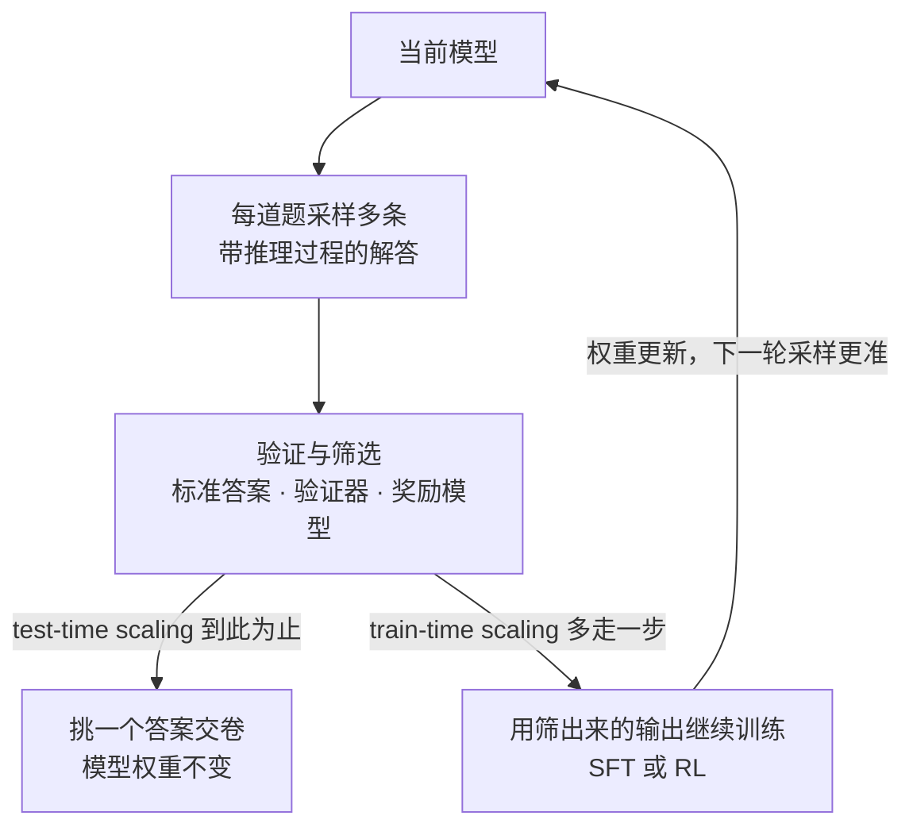
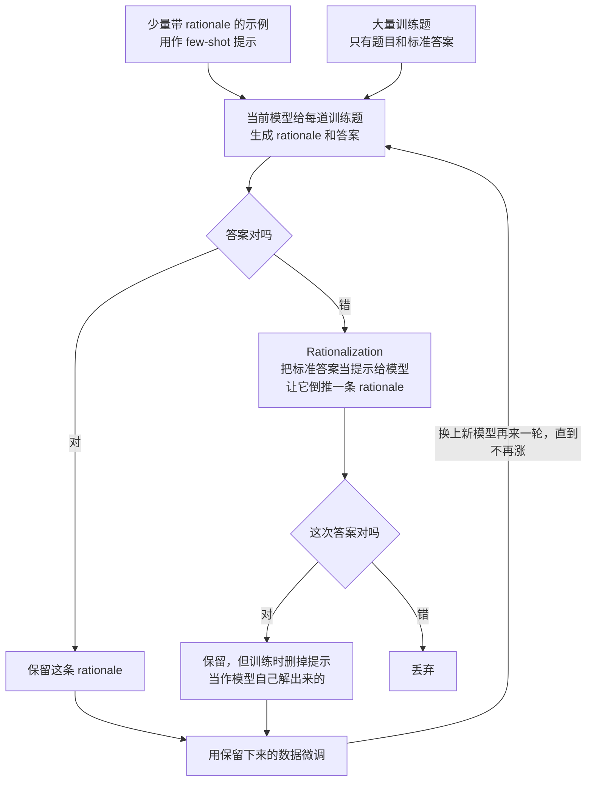
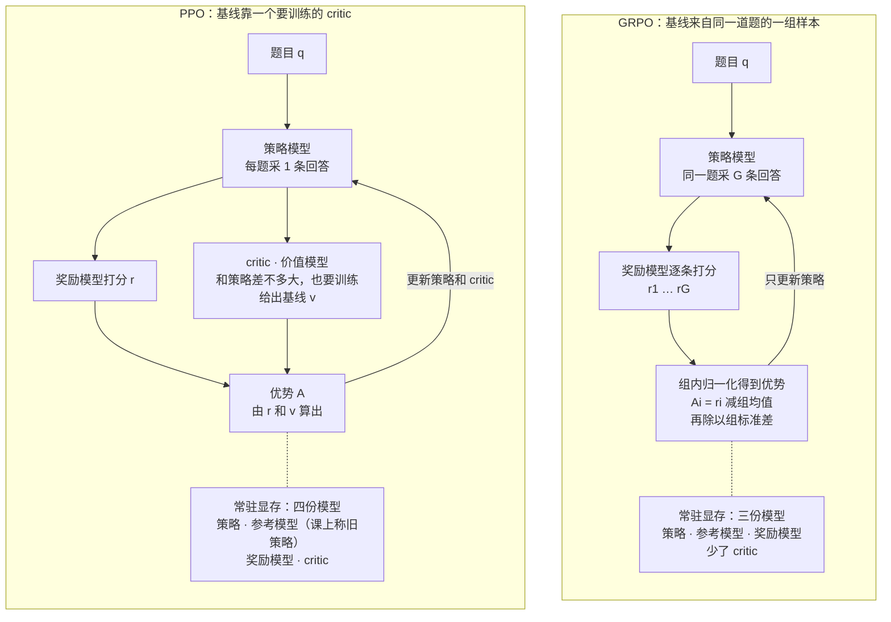
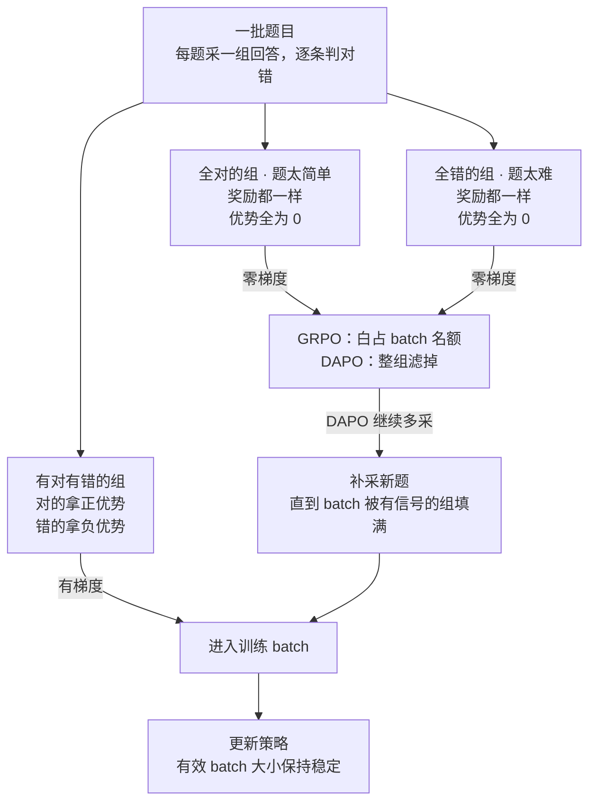
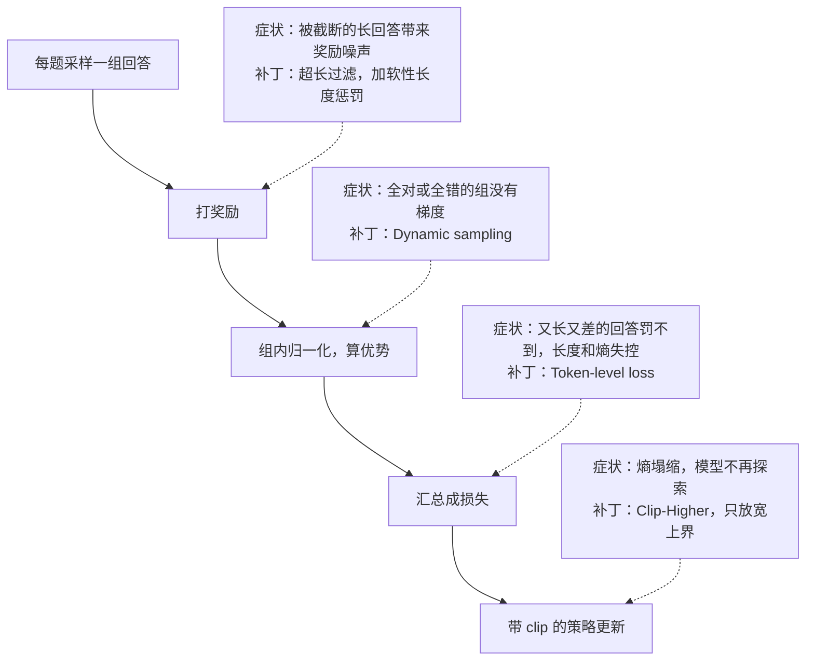

# CS329A 第 6 讲｜训练时扩展与 RL 的规模化（Train Time Scaling / Scaling RL）

> Stanford CS329A: Self-Improving AI Agents（2025 秋）· 对应课表第 6 次课（10 月 10 日，周五）——讲者开场就说这是第六讲，所讲三篇论文与该次课的指定阅读完全一致
> 视频：<https://www.youtube.com/watch?v=yVnmHSAy3ck>（1:12:39，自带人工校对英文 CC，学生提问处多为 [INAUDIBLE]）
> 讲者：Aakanksha Chowdhery（推断：没有自我介绍；她说上周五讲过用执行反馈做 RL 的论文，即第 4 讲的 RLEF，并预告下周五由自己讲 AlphaCode 等）
> 配套阅读：[STaR: Bootstrapping Reasoning With Reasoning](https://arxiv.org/abs/2203.14465)（Zelikman et al., 2022）· [DeepSeekMath](https://arxiv.org/abs/2402.03300)（Shao et al., 2024，提出 GRPO）· [DAPO: An Open-Source LLM Reinforcement Learning System at Scale](https://arxiv.org/abs/2503.14476)（Yu et al., 2025）

**一句话**：前几讲的 test-time scaling 是"多采样、挑一个"，模型本身没变；这一讲把挑出来的好输出训回模型，让自我改进的环真正合上。三篇论文层层递进：STaR 用"答对才保留 + 给答案倒推过程"做最朴素的自举 → DeepSeekMath 用 GRPO 去掉 critic，让在线 RL 在有限显存里跑得起来 → DAPO 补齐长推理链 RL 里没人明说的四个工程细节，在 Qwen-32B 上把 AIME 从 30 分推到 50 分。结论很克制：这些方法抬高的是 maj@K（更稳定），不是 pass@K（更聪明）。

## 时间轴

| 时间 | 内容 |
|---|---|
| [0:05](https://www.youtube.com/watch?v=yVnmHSAy3ck&t=5s) | 开场：第六讲，三篇论文 |
| [1:07](https://www.youtube.com/watch?v=yVnmHSAy3ck&t=67s) | 动机：AIME 上 7B / 32B 的模型为什么能这么强 |
| [3:14](https://www.youtube.com/watch?v=yVnmHSAy3ck&t=194s) | 三个要点；四种范式与 train-time scaling 的闭环 |
| [6:10](https://www.youtube.com/watch?v=yVnmHSAy3ck&t=370s) | o1 的两张 scaling 图；数学可验证，所以环能合上 |
| [7:40](https://www.youtube.com/watch?v=yVnmHSAy3ck&t=460s) | 推理模型的行为模式与 o1 示例；分领域胜率 |
| [11:32](https://www.youtube.com/watch?v=yVnmHSAy3ck&t=692s) | 问答：test-time 和 train-time 谁更划算；训难题会不会伤到简单题 |
| [16:09](https://www.youtube.com/watch?v=yVnmHSAy3ck&t=969s) | 论文一 STaR：动机与现有做法的不足 |
| [17:42](https://www.youtube.com/watch?v=yVnmHSAy3ck&t=1062s) | 核心循环、rationalization、三条假设 |
| [21:17](https://www.youtube.com/watch?v=yVnmHSAy3ck&t=1277s) | 问答：答案从哪来、rationale 要不要过滤、负样本 |
| [25:10](https://www.youtube.com/watch?v=yVnmHSAy3ck&t=1510s) | 算法细节与实验设置（GPT-J、三个数据集） |
| [28:30](https://www.youtube.com/watch?v=yVnmHSAy3ck&t=1710s) | 结果：数据利用率、见顶、人工评 rationale、GSM8K |
| [32:00](https://www.youtube.com/watch?v=yVnmHSAy3ck&t=1920s) | 小结：优点与局限；问答：小模型为什么不直接蒸馏 |
| [36:54](https://www.youtube.com/watch?v=yVnmHSAy3ck&t=2214s) | 后续工作 V-STaR、Quiet-STaR；课堂讨论 STaR 的上限 |
| [40:50](https://www.youtube.com/watch?v=yVnmHSAy3ck&t=2450s) | 论文二 DeepSeekMath：7B 在 MATH 上的跳变 |
| [41:50](https://www.youtube.com/watch?v=yVnmHSAy3ck&t=2510s) | 数据与起点：Common Crawl 数学网页、从 code 模型出发 |
| [43:50](https://www.youtube.com/watch?v=yVnmHSAy3ck&t=2630s) | PPO 的四个模型 vs GRPO 的组内基线 |
| [46:25](https://www.youtube.com/watch?v=yVnmHSAy3ck&t=2785s) | 统一视角：数据来源 × 梯度系数 |
| [47:45](https://www.youtube.com/watch?v=yVnmHSAy3ck&t=2865s) | 问答：奖励要有分布、KL 项、要不要更新全部权重、连续分数 |
| [52:19](https://www.youtube.com/watch?v=yVnmHSAy3ck&t=3139s) | 结论：online 胜 offline；maj@K 涨、pass@K 不涨 |
| [53:10](https://www.youtube.com/watch?v=yVnmHSAy3ck&t=3190s) | 论文三 DAPO：朴素 GRPO 在 Qwen-32B 上的症状 |
| [54:00](https://www.youtube.com/watch?v=yVnmHSAy3ck&t=3240s) | 补丁一 Clip-Higher |
| [55:22](https://www.youtube.com/watch?v=yVnmHSAy3ck&t=3322s) | 补丁二 Dynamic sampling |
| [57:32](https://www.youtube.com/watch?v=yVnmHSAy3ck&t=3452s) | 补丁三 Token-level loss |
| [58:45](https://www.youtube.com/watch?v=yVnmHSAy3ck&t=3525s) | 补丁四 超长截断的处理 |
| [59:45](https://www.youtube.com/watch?v=yVnmHSAy3ck&t=3585s) | 消融 30 → 50；训练时该盯哪些指标 |
| [1:01:15](https://www.youtube.com/watch?v=yVnmHSAy3ck&t=3675s) | SFT 还是 RL；三种方法怎么选；什么会涨、什么不会 |
| [1:04:25](https://www.youtube.com/watch?v=yVnmHSAy3ck&t=3865s) | pass@K 为什么难；奖励的两头风险；可验证信号从哪来 |
| [1:06:38](https://www.youtube.com/watch?v=yVnmHSAy3ck&t=3998s) | 开放问题与研究方向 |
| [1:08:05](https://www.youtube.com/watch?v=yVnmHSAy3ck&t=4085s) | 问答：RL 占多少算力；没见过的知识学不会；题少怎么办 |

## 核心内容

### 1. 动机：小模型靠"把自己的输出训回去"变强

*图 6-1｜test-time scaling 与 train-time scaling 的关系：后者把筛选结果写回权重（自绘示意）· [▶ 看原幻灯片 5:19](https://www.youtube.com/watch?v=yVnmHSAy3ck&t=319s)*

- **引子**：第 1 讲说参数越多能力越强，但在 AIME 上，GPT-3.5（据信 175B）只有约 5%，7B 的 DeepSeekMath 却有 51.7%（加技巧约 60%），Qwen-32B 加 DAPO 是 50%。之所以用 AIME 2024 / 2025（也是作业 1 的基准），是因为 MATH 已经饱和、且被多数模型的训练数据污染。
  > 小注：DeepSeekMath 论文里的 51.7% 和 60.9%（64 个样本做 self-consistency）是 **MATH** 上的数字，不是 AIME——后面讲到该论文时讲者说的也是 MATH。这一页混放了不同基准的数字，只能当"小模型也能很强"的示意。
- **三个要点**：① 让模型从**自己的输出**里学（先聪明地过滤），还能继续变强——也就是第 1 讲的自我改进回路；② 花在"用自身输出训练"上的算力可以顶替参数量；③ RL 不同于监督学习，规模一上去，实现里的小修小补会决定成败。
- **四种范式**：pre-training；fine-tuning（RLHF / RLAIF，得到聊天模型）；test-time scaling（多数投票等推理时技巧）；train-time scaling——把经过 test-time scaling 筛选的输出拿回去继续训练。讲者说，别的都忘了也行，记住这个环就够了。
- **o1 的两张图**：AIME 的 pass@1 对训练算力、对推理算力都近似 log-linear 上升，两条轴可以同时加。它在数学上行得通，是因为数学可验证（第 3 讲）——知道哪些输出是对的，才有东西可以喂回去。

### 2. 推理模型在想什么，哪些领域受益

- 思维链里常见的模式：问题分析、任务分解、自我评估、发现错误后回溯、同时试几条思路。o1 的例子：写 bash 脚本转置矩阵，先弄清输入输出格式，再拆成"解析 → 建矩阵 → 转置 → 按原格式输出"；算溶液 pH 时中途自己叫停、换了公式。
- 分领域胜率（o1 对 GPT-4o，人类偏好）：编程、数据分析、数学计算明显高于 50%，个人写作和改稿几乎不涨——能验证、能闭环的领域受益最大。

### 3. 问答：test-time 和 train-time 各管什么

- 有学生注意到 o1 图里 test-time 那张看起来涨得更多。讲者：两者没有"谁该更好"的直觉，这只是一个实例；还顺口调侃了一句图未必画得对。
  > 小注：两张图的横轴分别是训练算力和推理算力，都是对数刻度，彼此没有可比的单位，本来就不能逐点比斜率。
- 讲者的定位：**test-time compute 便宜**——模型训好后可以反复推理，第 2 讲的 coverage 结论保证多采总能采到对的，只要验证器够好，搜索理论上可以无限加（下周五讲 AlphaCode 等）；但它只在验证足够稳健的基准上好用，好比往墙上扔意面，得事先知道哪根该粘住。**train-time scaling 抬的是 pass@1**，让模型一次就更可能答对；代价是要"扩得对"，闭环里得有足够多的成功样本，也同样离不开验证。
- 训难题会不会让简单题退步：一般不会，除非推理链本身坏掉了，比如不断重复的 overthinking。

### 4. 论文一：STaR（Zelikman et al., 2022）——答对才留，答错就给答案倒推

*图 6-2｜STaR 的自举循环，答错之后的那条支路就是 rationalization（自绘示意）· [▶ 看原幻灯片 17:42](https://www.youtube.com/watch?v=yVnmHSAy3ck&t=1062s) · 出处：[Zelikman et al., 2022](https://arxiv.org/abs/2203.14465)*

- **动机**：CoT 能提升推理，但带推理步骤的数据极少——互联网上几乎没有，人工写太贵，按模板自动生成只适用于很窄的领域；few-shot 提示又打不过在更大（不带推理过程）的数据集上直接微调。
- **主循环**：训练题自带答案、但没有推理过程。few-shot 提示模型写出"rationale（推理过程）+ 答案"，只留答对的拿去微调，换上新模型再来一轮。
- **Rationalization**：只学答对的题，模型永远碰不到它不会的题，那部分没有任何信号。做法是把正确答案当提示交给模型，让它倒着写出推理；训练时把提示删掉，当作模型自己解出来的。训练集由此扩展到更难的题。
- **定性与假设**：讲者说这几乎可以算一种极简的 off-policy RL。它依赖三条假设：① 终答案正确 ≈ 推理质量好（数学上大体成立）；② 看到答案后，模型写得出站得住的推理；③ 初始模型足够强，能从 few-shot 起步——题目远超模型能力就寸步难行，这也是要迭代的原因。
- **实验**：GPT-J（6B）；外层循环若干轮，内层训练步数逐轮增加（起步要慢）。数据集：GSM8K（约 9k 题）、CommonsenseQA（多选常识题）、多位数加法（合成）。
- **结果**
  - CommonsenseQA：带 rationalization 的 STaR 达到 72.5%，只用到约 86% 的训练题；总体只有 70%–87% 的数据最终被用上，其余始终没得到正确解。
  - 迭代几轮后见顶——讲者说它毕竟不是真正的 RL，轮数要调。
  - 请人工评判 rationale：STaR 生成的质量相当合理。
  - GSM8K 上 rationalization 几乎不加分；讲者的解释是题目对模型偏简单时，逼它倒推过程没有额外收益（模型自己用的计算步数和标准解法差不多）。
  > 小注：论文的表——CommonsenseQA：直接微调 60.0%，STaR 68.8%（用 69.7% 的数据），加 rationalization 72.5%（86.7%），接近 30 倍大的 GPT-3 微调的 73.0%。GSM8K：直接微调 5.8% → STaR 10.1% → 加 rationalization 10.7%，只用到 25%–29% 的训练题，其中靠 rationalization 新增的仅 0.5%。讲者此处口头说的"51.7%"应是口误（那是 DeepSeekMath 的数字）。另外，论文每一轮都从**原始预训练模型**重新微调，而不是接着上一轮的权重训，以防过拟合。
- **局限**：rationale 没有好的自动评估，要么人看、要么上 PRM；只按终答案过滤，会混入"过程错、答案对"的样本（第 3 讲的 false positive），也等于只留下模型本来就会的题（第 5 讲 SWiRL 有同样的观察）；few-shot 示例的写法会把风格带进训练数据。
- **问答**
  - 倒推出来的 rationale 要不要再过滤：本文没有，后续工作有；可以用 PRM 逐步检查——被点名为项目选题。模型若学到"错过程 + 对答案"，这个框架里没有机制能纠正。
  - 答错的样本能不能用：从正样本学已经成熟，从负样本学还没做好，本讲不展开。
  - 小模型为什么不直接蒸馏前沿模型：讲者承认实践中蒸馏更划算；但这条线要回答的是模型怎样靠自己的输出变强——提问的学生自己也点到，训练最前沿的模型时没有更强的老师可蒸馏。
  - 后续工作：V-STaR 在环里加了一个一起训练的验证器；Quiet-STaR 让模型"在内部思考"。
    > 小注：Quiet-STaR 的内部思考仍是采样出来的 token（每个位置后并行生成一小段不外显的 thought），MLP 只是混合"有 / 无 thought"两种预测的 mixing head，并非在连续隐空间里推理。V-STaR 则把 STaR 丢掉的错误解也拿来训练验证器。
  - 课堂讨论"STaR 的上限由什么决定"：学生的回答——不会出现训练数据之外的逻辑跳跃；受限于基座的推理能力，给了提示也推不出的题永远进不了训练集；有些答案天然好倒推（225 容易想到 15 × 15），有些不行。讲者：都对；进入 RL 之后也要记着，**基座模型能做什么**是一切的地基。

### 5. 论文二：DeepSeekMath 与 GRPO（Shao et al., 2024）

*图 6-3｜PPO 与 GRPO 对比：采样什么、优势怎么算、显存里放哪些模型（自绘示意）· [▶ 看原幻灯片 44:00](https://www.youtube.com/watch?v=yVnmHSAy3ck&t=2640s) · 出处：[Shao et al., 2024](https://arxiv.org/abs/2402.03300)*

- **看点**：MATH 的 top-1 准确率过去大体随模型变大而缓慢上升，DeepSeekMath-7B 出现时突然跳了一截。讲者认为关键在于他们把闭环里 RL 这一步做对了。
- **第一步，先把基座在数学上喂强**。此前的代表做法是在 PaLM 上继续训练 arXiv 等科学数据（应为 Minerva，字幕漏了论文名）。DeepSeek 发现 arXiv 论文帮助不大；他们以 OpenWebMath 为种子，从 Common Crawl 里挖数学网页，覆盖更广、token 多得多；并且从 DeepSeek-Coder 出发——先学代码再学数学明显更好，推理和用工具都受益，讲者说这是第一次有人证明这一点。这也回应了上一节的讨论：基座在某个领域不够强，就得先补。
  > 小注：论文里这份语料叫 DeepSeekMath Corpus，约 120B token，用 fastText 分类器从 Common Crawl 迭代召回；基座是 DeepSeek-Coder-Base-v1.5 7B；继续预训练后的 Base 7B 在 MATH 上已经超过 Minerva 540B。
- **第二步，SFT 之后上 RL**。RLHF 常用的 PPO 要同时放四个模型：旧策略、正在学的新策略、给出基线的 critic、打分的奖励模型——7B 还行，再大显存就吃紧。GRPO 去掉 critic：同一道题采样一组回答，奖励模型逐个打分，**优势 =（该回答的奖励 − 组内均值）÷ 组内标准差**。道理在于奖励模型本来就是用"同题回答之间的比较"训练出来的，用组内相对值正好对口；省下一个模型，RL 才能往大了做。
  > 小注：按论文的图，PPO 的四个模型是 policy、value（这两个要训练）和 reference、reward（冻结）；GAE 是 PPO 借助 value model 算优势的方法，GRPO 恰恰是用组内归一化把它换掉——讲者口头说 GRPO 用了某种 GAE，应为口误。论文每题采 64 条回答；KL 项直接加在损失里，而不是混进奖励。
- **结果**：MATH 46.8% → 51.7%，讲者称它是第一个在 MATH 上过 50% 的 7B 级开源模型。
- **统一视角**：各种方法的差别只在"数据从哪来"和"梯度系数怎么算"。

  | 方法 | 数据来源 | 奖励 | 梯度系数 |
  |---|---|---|---|
  | STaR 一类 | 离线：生成一次 | 对 1、错 0 | 只强化答对的，答错的直接丢 |
  | Online rejection fine-tuning | 在线：从当前模型采样 | 对 1、错 0 | 同上 |
  | GRPO | 在线，每题一组 | 奖励模型打分 | 组内归一化的优势，有正有负、有大有小 |

  结论：从当前模型在线采样的 RL 环，胜过 STaR 式的离线做法。
- **涨的到底是什么**：多次采样时 maj@K 提高了，pass@K 没有——是大多数样本变对了，而不是原来做不出的题现在做得出了。讲者的总结：模型变得更稳定，不是从根本上更聪明。换成第 2 讲的话：RL 没有抬高 coverage，只是把已有的 coverage 兑现成了多数票。

### 6. 承上启下：奖励必须"有对有错"

*图 6-4｜组内归一化下，全对和全错的组没有学习信号；DAPO 的 dynamic sampling 把它们滤掉再补采（自绘示意）· [▶ 看原幻灯片 48:30](https://www.youtube.com/watch?v=yVnmHSAy3ck&t=2910s) · 出处：[Shao et al., 2024](https://arxiv.org/abs/2402.03300)；[Yu et al., 2025](https://arxiv.org/abs/2503.14476)*

- 起因还是"会不会在简单题上退步"那个问题。讲者换了个角度回答：要让闭环转起来，一批题上的奖励必须有**分布**。简单题永远全对、太难的题永远全错，组内归一化之后优势全是 0，模型什么也学不到——它需要能爬坡的信号。这个缺口留给下一篇来补。
- 一位学生补充：防止模型偏离原有能力，靠的是目标里的 KL 散度项。讲者认可。
  > 小注：GRPO 保留了 KL 项；DAPO 则认为长 CoT 训练中模型本来就该大幅偏离初始分布，直接把 KL 项删了。
- 加一个新能力要不要更新全部权重：不一定，近期有博客表明用 LoRA 这类低秩更新也行（字幕作 lower updates，应为 LoRA；所指应是 Thinking Machines 的 LoRA Without Regret，推断）。
- 0 / 1 之外的连续分数从哪来：训练一个奖励模型；只有 0 / 1 也能用，对一组样本取平均即可。

### 7. 论文三：DAPO（Yu et al., 2025）——长推理链 RL 的四个补丁

*图 6-5｜DAPO 的四个补丁分别打在 GRPO 训练步骤的哪一环（自绘示意）· [▶ 看原幻灯片 59:45](https://www.youtube.com/watch?v=yVnmHSAy3ck&t=3585s) · 出处：[Yu et al., 2025](https://arxiv.org/abs/2503.14476)*

- **问题**：把 GRPO 原样搬到 Qwen-32B 上，AIME 只有 30 分，症状是熵塌缩（模型过度自信、不再探索）、训练不稳、回答长度失控。DeepSeek 自己做到过 47 分，但细节没有写出来；DAPO 的贡献就是把这些技巧明说并开源。
  > 小注：47 分指 DeepSeek-R1 论文里直接在 Qwen2.5-32B 基座上做 RL 的 R1-Zero-Qwen-32B，不是从 R1 蒸馏出的 32B（讲者后面口头说成了 distilled）；DAPO 只用了它一半的训练步数。DAPO 的奖励是纯规则的（对 +1、错 −1），不训练奖励模型；训练集是自建的 DAPO-Math-17K，AIME 2024 只用于评测（avg@32）；每题采 16 条回答，课上举例的 64 是 DeepSeekMath 的设置。
- **四个补丁**
  1. **Clip-Higher（非对称裁剪）**：PPO 的 clip 对上调和下调一视同仁，低概率 token 每一步能涨的幅度很小，探索很快就没了。办法是把上界放宽。效果：准确率更高，熵保持平稳而不是塌到 0——熵是"还剩多少探索"的代理指标。
     > 小注：论文取 ε_low = 0.2、ε_high = 0.28；下界不动，是怕把低概率 token 直接压到 0。
  2. **Dynamic sampling**（图 6-4）：多采一些题，把全对和全错的组滤掉，只留有信号的组，直到填满 batch——不浪费梯度，有效 batch 大小保持稳定。有学生问每题 64 个样本是不是太少：讲者说数字只是举例，取决于基准难度和基座能力。
  3. **Token-level loss**：样本级损失里每条回答权重相同，一条很长的垃圾回答和一条很短的好回答等权。改成按 token 计损失之后，熵和平均长度不再失控上冲。
     > 小注：论文的解释是，样本级平均让长回答里每个 token 分到的权重变小，于是长而优质的推理学得不够，长而重复、胡言乱语的输出又罚得不够。
  4. **超长样本**：难题上推理链越写越长、被截断，截断样本带来大量噪声。DAPO 用超长过滤，再加一个随长度逐渐加重的软惩罚；别的论文则选择在 RL 过程中逐步放宽上下文长度。
- **消融（AIME 2024）**：朴素 GRPO 30 → 超长过滤 36 → Clip-Higher 38 → 软性超长惩罚 41 → token-level loss 42 → dynamic sampling **50**。
- **训练时该盯什么**：loss 本身不够。要同时看回答长度、熵（不能太低也不能太高）、准确率为 1 的样本占比（它决定要多采多少）。长度爆炸就回头管损失，熵出问题就去管熵；若干步后不再进步，可能是奖励信号已经饱和。

### 8. 三种方法怎么选；什么会涨、什么不会

- **SFT 还是 RL**（回应前面学生的提问）：奖励信号强的领域，RL 用更少的样本就能持续爬坡，但要花很多功夫才能调对；手里有大量高质量数据时，SFT 往往更快见效，只是它不太能带来或放大推理能力。

  | 方法 | 适用前提 | 适合的任务 |
  |---|---|---|
  | STaR | 只有约一百条带推理的样例，没有 RL 基础设施 | GSM8K 这类简单推理；有提升，但不出基座的能力圈 |
  | GRPO（DeepSeekMath） | 基座够好，并先用指令数据预热；GPU / 显存有限 | 标准数学推理，已被充分验证 |
  | DAPO | 推理链很长、要 SOTA；算法和基础设施里的每个变量都得管住 | AIME、IMO 级的竞赛题 |

- 三者都会提升：maj@K、答案格式、多步推理的连贯性。三者都还**不会**提升：根本能力、解决新问题、域外泛化。

### 9. 开放问题与最后的问答

- 要让 pass@K 也涨，等于提升模型解决新问题的根本能力；讲者的看法是，这类台阶式的跃升历来来自某种突破，或者某个维度上的 scaling。
- 整个环两头都受制于奖励：策略太强，奖励会被 hack；奖励信号不足，就爬不动坡。数学和代码有现成的可验证奖励（终答案、第 4 讲 RLEF 用的执行反馈、单元测试），可这样的领域有多少？什么样的验证信号才算够好？能不能用一组验证器互补（第 3 讲的 Weaver）？
- 讲者列的三个开放问题：为什么只有 maj@K 涨；回溯、自检这些行为是真的涌现，还是基座里本来就有、只是统计上变得更常见；怎样从失败里学（目前基本是直接滤掉）。可做的方向：更好的训练数据、对奖励噪声稳健的算法、奖励的设计、把 STaR 的 rationalization 和 DAPO 结合。
  > 小注：DAPO 论文的 case study 称，反思和回溯在训练早期几乎不出现、随 RL 推进才出现——算"涌现"一方的证据，但不是对照实验。
- **RL 占总训练算力多少**：讲者的粗略印象是去年约 1%，现在大概 5%；Grok 4 宣称做到了五成左右，却没有换来相称的跃升——瓶颈正是奖励不够强、有噪声。Anthropic 没有公开过这个比例。
- **模型从没见过的知识（比如微积分），RL 能教会吗**：不能。RL 是让模型把已经会的做得更好——在已知的空间里更好地探索和搜索。
- **像 AIME 这样题目很少，信号够吗、会不会泄题**：RL 本身更省数据；该问的不是"数据够不够多"，而是"有没有足够多能爬坡的题"（dynamic sampling 还会再滤掉一批）。验证信号取决于验证器的质量，可以上多个验证器。

## 关键图表速查（点时间戳跳到原幻灯片）

| 图 | 看什么 | 跳转 | 出处 |
|---|---|---|---|
| AIME 对比页 | GPT-3.5 约 5%，7B 的 DeepSeekMath 和 32B 的 DAPO 在 50% 上下；注意各数字并非同一基准（见第 1 节小注） | [1:07](https://www.youtube.com/watch?v=yVnmHSAy3ck&t=67s) | 讲者汇总 |
| o1 的两张 scaling 图 | 左：训练算力，右：推理算力；纵轴都是 AIME pass@1，横轴对数，两边都近似直线上升 | [6:10](https://www.youtube.com/watch?v=yVnmHSAy3ck&t=370s) | [OpenAI, 2024](https://openai.com/index/learning-to-reason-with-llms/) |
| 分领域胜率 | o1 对 GPT-4o：编程、数据分析、数学计算高于 50%，个人写作和改稿基本持平 | [10:45](https://www.youtube.com/watch?v=yVnmHSAy3ck&t=645s) | 同上 |
| STaR 流程图 | 主循环之外那条"给答案当提示 → 倒推 rationale"的支路 | [25:10](https://www.youtube.com/watch?v=yVnmHSAy3ck&t=1510s) | [Zelikman et al.](https://arxiv.org/abs/2203.14465) |
| CommonsenseQA 结果表 | STaR 加 rationalization 72.5%，只用约 86% 的训练题，对比用全量数据的直接微调 | [30:10](https://www.youtube.com/watch?v=yVnmHSAy3ck&t=1810s) | 同上 |
| MATH top-1 随时间的走势 | 前面随模型变大缓慢爬升，DeepSeekMath-7B 处陡升 | [41:10](https://www.youtube.com/watch?v=yVnmHSAy3ck&t=2470s) | [Shao et al.](https://arxiv.org/abs/2402.03300) |
| PPO vs GRPO 结构图 | PPO 多出来的那个 critic；GRPO 用一组样本的均值和标准差代替它 | [44:00](https://www.youtube.com/watch?v=yVnmHSAy3ck&t=2640s) | 同上 |
| 统一视角表 | 三行方法只差两栏：数据是离线还是在线、梯度系数是 0 / 1 还是归一化优势 | [46:25](https://www.youtube.com/watch?v=yVnmHSAy3ck&t=2785s) | 同上 |
| Maj@K vs Pass@K | RL 之后 Maj@K 曲线上移，Pass@K 两条线基本重合 | [52:35](https://www.youtube.com/watch?v=yVnmHSAy3ck&t=3155s) | 同上 |
| Clip-Higher 前后 | 紫线 = 用了 Clip-Higher：左图 AIME 准确率更高，右图熵保持平稳；不用则熵塌到接近 0 | [54:45](https://www.youtube.com/watch?v=yVnmHSAy3ck&t=3285s) | [Yu et al.](https://arxiv.org/abs/2503.14476) |
| Token-level loss 前后 | 不用 token-level loss 的那条线：熵和平均回答长度一起失控上冲 | [58:15](https://www.youtube.com/watch?v=yVnmHSAy3ck&t=3495s) | 同上 |
| DAPO 消融表 | 30 → 36 → 38 → 41 → 42 → 50，最后一步 dynamic sampling 贡献最大；对照线是 DeepSeek 的 47 | [59:45](https://www.youtube.com/watch?v=yVnmHSAy3ck&t=3585s) | 同上 |

## 提到的工作

| 名称 | 在本讲里的作用 |
|---|---|
| STaR（Zelikman et al., 2022） | 论文一：答对才保留 + rationalization 的自举微调 |
| V-STaR（Hosseini et al., 2024） | 在 STaR 的环里加一个一起训练的验证器 |
| Quiet-STaR（Zelikman et al., 2024） | 让模型"在内部思考"的后续工作 |
| DeepSeekMath / GRPO（Shao et al., 2024） | 论文二：数学语料 + 去掉 critic 的在线 RL |
| DeepSeek-Coder | DeepSeekMath 的起点模型；"先代码、后数学" |
| OpenWebMath、Common Crawl | 数学语料的种子与来源 |
| Minerva（Lewkowycz et al., 2022，应为）、PaLM | 此前"在 arXiv 等科学数据上继续训练"的代表 |
| PPO（Schulman et al., 2017）、RLHF / RLAIF、DPO | GRPO 的对照；四个模型的显存负担 |
| Online rejection fine-tuning（论文中记作 Online RFT） | 统一视角里介于 STaR 和 GRPO 之间的形态 |
| DAPO（Yu et al., 2025） | 论文三：四个补丁与开源的训练系统 |
| DeepSeek-R1（R1-Zero-Qwen-32B，应为） | DAPO 的对照：Qwen-32B 上 47 分 |
| OpenAI o1（Learning to Reason with LLMs） | 两张 scaling 图、思维链示例、分领域胜率 |
| GPT-3.5、GPT-4o、GPT-J、Qwen-32B（应为 Qwen2.5-32B）、Gemini Flash Thinking、Grok 4 | 被提到的模型 |
| AIME 2024 / 2025、MATH、GSM8K、CommonsenseQA、多位数加法、IMO | 基准与任务 |
| RLEF（第 4 讲） | 代码领域用执行反馈当可验证奖励的例子 |
| Weaver（第 3 讲） | 用一组验证器弥补单个验证器的盲区 |
| AlphaCode | 预告：下周五讲"搜索可以无限加"的例子 |

## 术语对照

| English | 中文 |
|---|---|
| train-time / test-time scaling | 训练时 / 测试时扩展 |
| rationale | 推理过程（解题思路） |
| rationalization | 事后补推理（给定答案、倒推过程） |
| bootstrapping | 自举 |
| few-shot prompting | 少样本提示 |
| rejection (sampling) fine-tuning, RFT | 拒绝采样微调 |
| online / offline sampling | 在线 / 离线采样 |
| off-policy | 异策略 |
| policy, critic (value model), reward model, reference model | 策略、评论家（价值模型）、奖励模型、参考模型 |
| advantage, baseline | 优势、基线 |
| group-relative baseline | 组内相对基线 |
| gradient coefficient | 梯度系数 |
| KL divergence penalty | KL 散度惩罚 |
| clipping, Clip-Higher (asymmetric clipping) | 裁剪、抬高上界的非对称裁剪 |
| entropy collapse | 熵塌缩 |
| dynamic sampling | 动态采样 |
| effective batch size | 有效 batch 大小 |
| sample-level / token-level loss | 样本级 / token 级损失 |
| overlong filtering, soft overlong punishment | 超长过滤、软性超长惩罚 |
| truncation | 截断 |
| overthinking | 过度思考 |
| reward hacking | 奖励投机 |
| verifiable reward | 可验证奖励 |
| hill climbing | 爬坡（沿信号持续改进） |
| pass@1, pass@K, maj@K | 单次准确率、K 个样本里至少一个对、K 个样本多数票的准确率 |
| win rate | 胜率 |
| distillation | 蒸馏 |
| backtracking, self-correction | 回溯、自我纠错 |

## 字幕勘误

"CS320A" → CS329A；"in all series" → o-series；"Gemini flash thinking" → Gemini Flash Thinking；"batch script" → bash script；"path at 1" → pass@1，"past K / Pass K" → pass@K，"majority at K / majority had K" → maj@K；"archive data / archive papers" → arXiv；讲到改进 PaLM 在 STEM 上表现的那篇论文时，字幕漏掉了论文名，应为 Minerva；"DeepSeek carbon paper" → 应为 DeepSeek-R1 论文；"DeepSeeL-R1" → DeepSeek-R1；"the quantity to be model" → Qwen-32B model；"you need double kind of techniques" → DAPO 这类技巧；"few short examples" → few-shot examples；"common call like mixed token prediction" → Common Crawl、next-token prediction；"lower updates" → 应为 LoRA updates；学生提问里的 "key-node score / clean score" 推断为 continuous score（连续分数）；"[? AlphaCode ?]" 是字幕自己标的不确定，按上下文（无限搜索加验证）应为 AlphaCode。另有几处是讲者口误而非字幕错误（STaR 结果里的 51.7%、GRPO 与 GAE、R1-Zero 与 distilled），见正文小注。

## 带走的问题

1. 训练时算力和测试时算力该怎么分配？有没有一条"再往训练里投就不划算"的 ROI 曲线？学生开场就问了，讲者说留到后面，但全讲没有给出定量的回答。
2. RL 为什么只抬 maj@K、不抬 pass@K？要抬高能力上限，缺的是新知识（回到预训练）、更好的探索（更长的上下文、搜索式采样），还是更难、分布外的训练题？
3. 回溯、自检这些行为是 RL 涌现出来的，还是基座里本来就有、只是被放大了？什么样的对照实验能把两者分开？
4. 怎样从失败里学？STaR 把答错的直接丢掉，GRPO 给负优势，DAPO 却把全错的组整组滤掉——而全错的难题恰恰是模型最该学的。给答案倒推的 rationalization 能不能给这些题造出第一条成功轨迹，又不把"错过程 + 对答案"带进训练？
