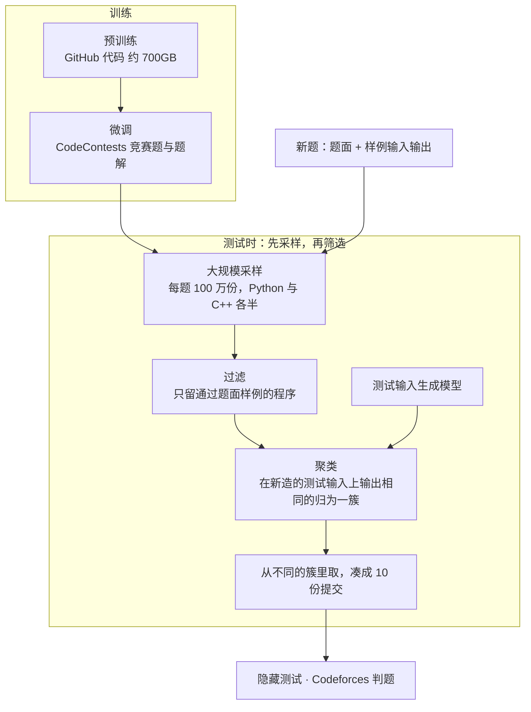
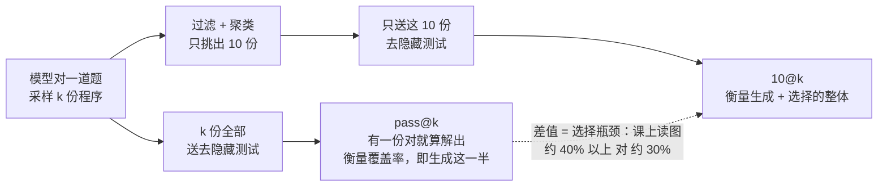
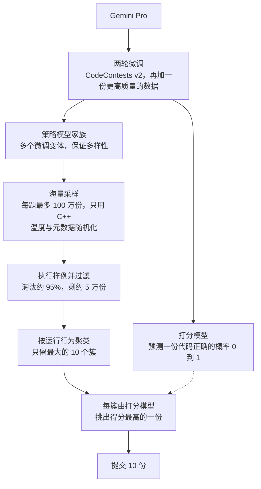
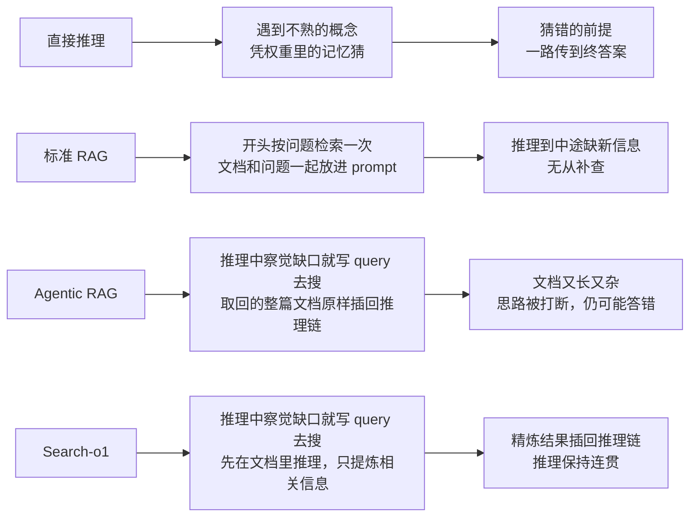
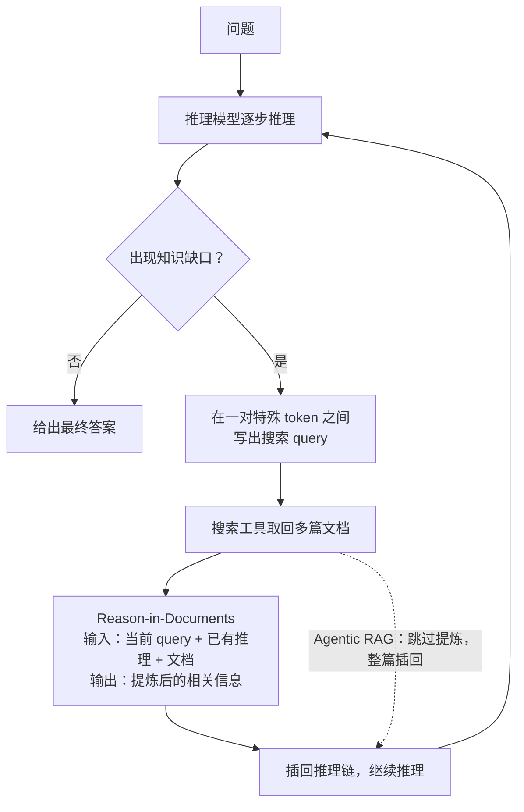

# CS329A 第 7 讲｜自我改进与 Deep Research 智能体（Self-Improvement and Deep Research Agents）

> Stanford CS329A: Self-Improving AI Agents（2025 秋）· YouTube 编号是 Part 7，内容对应课表**第 8 次课**（10 月 17 日，Self improvement with Search & Deep Research Agents）。课表第 7 次课（10 月 13 日，Open-Ended Evolution：ADAS / Darwin Gödel Machine、The AI Scientist、AlphaEvolve）不在本视频里，讲者只在讨论环节用一句"上一讲讲过的 scientist 式工作"带过
> 视频：<https://www.youtube.com/watch?v=Uni9dqyuuDM>（1:12:27，自带英文 CC）
> 讲者：Aakanksha Chowdhery（推断：视频里没有自我介绍；她以第三人称提到 Azalia 讲过 Large Language Monkeys）
> 配套阅读：[Competition-Level Code Generation with AlphaCode](https://arxiv.org/abs/2203.07814)（Li et al., 2022）· [AlphaCode 2 Technical Report](https://storage.googleapis.com/deepmind-media/AlphaCode2/AlphaCode2_Tech_Report.pdf)（Google DeepMind, 2023）· [Search-o1: Agentic Search-Enhanced Large Reasoning Models](https://arxiv.org/abs/2501.05366)（Li et al., 2025）

**一句话**：两种"搜索"，同一个问题——答案多半已经在模型够得着的地方，难的是把它找出来。AlphaCode / AlphaCode 2 在模型自己的输出分布里搜：海量采样，再用过滤、聚类、打分模型把一百万份程序压成 10 份提交；Search-o1 向模型之外搜：推理到知识缺口就发起检索，并且先把文档提炼干净，再放回推理链。

## 时间轴

| 时间 | 内容 |
|---|---|
| [0:06](https://www.youtube.com/watch?v=Uni9dqyuuDM&t=6s) | 开场：两类搜索——代码里的"采样再筛选"与 deep research 式检索；和作业 2、3 的关系 |
| [1:12](https://www.youtube.com/watch?v=Uni9dqyuuDM&t=72s) | AlphaCode：竞赛编程的问题设定，与行级补全、HumanEval 的差别 |
| [3:45](https://www.youtube.com/watch?v=Uni9dqyuuDM&t=225s) | 系统总览：预训练 → 微调 → 大规模采样 → 过滤聚类 → 提交 |
| [5:17](https://www.youtube.com/watch?v=Uni9dqyuuDM&t=317s) | 训练细节：约 700GB GitHub 代码、GOLD、value conditioning |
| [6:53](https://www.youtube.com/watch?v=Uni9dqyuuDM&t=413s) | 每题 100 万份样本；过滤与聚类 |
| [8:26](https://www.youtube.com/watch?v=Uni9dqyuuDM&t=506s) | 为什么只能提交一小部分；Codeforces 与 CodeContests 两套评测；前 54.3% |
| [10:35](https://www.youtube.com/watch?v=Uni9dqyuuDM&t=635s) | 问答：各场比赛成绩为何起伏；为什么要采这么多 |
| [13:41](https://www.youtube.com/watch?v=Uni9dqyuuDM&t=821s) | pass@k 与 10@k；9B / 41B / 41B + clustering 结果表 |
| [17:27](https://www.youtube.com/watch?v=Uni9dqyuuDM&t=1047s) | 扩展曲线：对数线性、斜率、选择瓶颈 |
| [19:02](https://www.youtube.com/watch?v=Uni9dqyuuDM&t=1142s) | 问答：采样到一万亿会怎样；多样性前提；对数线性的来历 |
| [22:40](https://www.youtube.com/watch?v=Uni9dqyuuDM&t=1360s) | AlphaCode 小结与局限 |
| [24:41](https://www.youtube.com/watch?v=Uni9dqyuuDM&t=1481s) | AlphaCode 2：Gemini Pro、模型家族、打分模型、新数据 |
| [28:55](https://www.youtube.com/watch?v=Uni9dqyuuDM&t=1735s) | 采样与评测流水线：只用 C++、淘汰 95%、10 个最大簇、打分重排 |
| [30:05](https://www.youtube.com/watch?v=Uni9dqyuuDM&t=1805s) | 结果：100 份样本追平 100 万份；43% 对 25% |
| [31:32](https://www.youtube.com/watch?v=Uni9dqyuuDM&t=1892s) | 问答：95% 的浪费怎么省；与推理模型的关系；打分模型的数据 |
| [37:46](https://www.youtube.com/watch?v=Uni9dqyuuDM&t=2266s) | 第 85 百分位；AlphaCode 2 的经验与代价 |
| [39:24](https://www.youtube.com/watch?v=Uni9dqyuuDM&t=2364s) | 课堂讨论：按难度调整方法；把推理嵌进模型；树搜索 |
| [46:45](https://www.youtube.com/watch?v=Uni9dqyuuDM&t=2805s) | Search-o1：知识截止、不确定词、为什么一次性 RAG 不够 |
| [49:50](https://www.youtube.com/watch?v=Uni9dqyuuDM&t=2990s) | 两点改动；化学题的三种做法对比 |
| [55:03](https://www.youtube.com/watch?v=Uni9dqyuuDM&t=3303s) | Agentic RAG 与 Reason-in-Documents；问答 |
| [1:00:05](https://www.youtube.com/watch?v=Uni9dqyuuDM&t=3605s) | 结果：文档数扩展、对比人类专家、多跳问答 |
| [1:06:05](https://www.youtube.com/watch?v=Uni9dqyuuDM&t=3965s) | 要点回顾；Search-R1（提及未讲） |
| [1:08:59](https://www.youtube.com/watch?v=Uni9dqyuuDM&t=4139s) | 最后的问答：置信度与校准 |

## 核心内容

### 1. 主线：解在搜索空间里，难的是把它挑出来

- 本讲把"用搜索改进模型"分成两类。一类在模型自己的输出里搜：对一道编程题采样极多份程序，再从中筛选（AlphaCode、AlphaCode 2，套路可用于作业 2 的 HumanEval）。另一类向外部世界搜：推理途中检索资料，补上知识缺口（Search-o1，作业 3 要搭的就是这类 agent）。
- 共同的前提来自第 2 讲：coverage 随采样数上升，说明正确答案大概率就在模型的输出空间里，剩下的是选择问题。

### 2. AlphaCode（DeepMind, 2022）：海量采样，先筛后交

*图 7-1｜AlphaCode 从训练到提交的流水线（自绘示意）· [▶ 看原幻灯片 3:45](https://www.youtube.com/watch?v=Uni9dqyuuDM&t=225s) · 出处：[Li et al., 2022](https://arxiv.org/abs/2203.07814)*

- **任务**：竞赛编程。输入是一大段自然语言题面加几组样例输入输出，要先读懂题、想出算法，再写出完整程序，比行级补全（Copilot 式）和题意已写明的 HumanEval 都难得多。
- **模型**：当时没有现成的强 LLM，团队自己训练 encoder–decoder：先在约 700GB 的 GitHub 代码上预训练，再在 CodeContests（竞赛题与题解，另留出一份测试集）上微调。微调用了三个技巧：一种正则化、value conditioning & prediction，以及 GOLD——按 token 似然加权的损失，让模型把概率压在自己有把握的模式上，追求 precision。
  > 小注：论文里预训练两种损失并用——decoder 做 next-token prediction，encoder 做 masked language modeling；GitHub 语料 715.1GB。课上没点名的正则化技巧叫 tempering；value conditioning 是训练时把"这份解对 / 错"写进 prompt，采样时一律声明"对"。
- **采样**：每题 100 万份，Python 和 C++ 各一半；prompt 里的题目 tag 和难度 rating 随机化，再配较高温度，一切为了多样性。这是第 2 讲重复采样的极端版本。
- **过滤**：只保留能通过题面样例测试的程序。
- **聚类**：另训一个"测试输入生成模型"给新题造一批输入；在这些输入上输出完全一致的程序视为语义等价（写法不同、行为相同），归为一簇。提交时从不同的簇里取，避免把 10 次机会浪费在同一个解法上。
  > 小注：论文：样例过滤约淘汰 99% 的样本；提交顺序是从最大的簇到最小的簇各取一份——错法千奇百怪，对的程序行为一致，正确解更容易聚成大簇。这相当于在"程序行为"上做多数投票（对照第 2、3 讲的 majority voting）。
- **为什么必须先选**：此前课上的闭环都是"模型出多少、就测多少"。这里不行——Codeforces 不可能接收 100 万份提交，每题最多交 10 份，选择本身成了系统的一部分。
- **评测**：一是 Codeforces 实战（模拟参赛 10 场，每场 5,000 人以上），每题最多 10 次提交时平均排名前 54.3%，大致是参赛者的中位水平，按讲者的说法约相当于近半年活跃选手里的前 28%；二是 CodeContests 留出集，用来做可重复的研究迭代。讲者的评价：这是第一次展示 AI 能走出窄任务、端到端地解题。
  > 小注：论文原话是：每题 10 次提交的成绩对应估计 Codeforces rating 1238，位于"近 6 个月参加过比赛的用户"的前 28%。

### 3. pass@k、10@k 与扩展规律

*图 7-2｜pass@k 与 10@k 各自衡量什么（自绘示意）· [▶ 看原幻灯片 14:05](https://www.youtube.com/watch?v=Uni9dqyuuDM&t=845s) · 出处：[Li et al., 2022](https://arxiv.org/abs/2203.07814)*

- **pass@k**：k 份样本全部送隐藏测试，有一份对就算解出——就是第 2 讲的 coverage，只衡量"生成 / 搜索"这一半。
- **10@k**：采样 k 份、只许提交 10 份，把选择环节也算进去。
- **结果表**：9B → 41B → 41B + clustering，逐行变好；10@1k → 10@1M，逐列变好。模型更大、样本更多、加聚类，三个方向都单调。
  > 小注：论文 Table 5：41B + clustering 在验证集上从 10@1k 的 21.0% 升到 10@1M 的 34.2%；测试集只跑到 10@100k，为 29.6%。
- **扩展曲线**：解题率对采样预算呈对数线性，而且**经过选择之后仍然成立**；模型越大斜率越大（41B 对 300M）。但 10@k 最高约 30%，pass@k 在"无限次提交"这个假想设定下超过 40%。差出来的十个点就是选择环节的瓶颈，也就是第 2、3 讲说的 generation–verification gap 在代码上的样子。
- **问答**
  - 各场比赛成绩为什么起伏很大：一是题目离训练分布的远近不同；二是选择环节可能成为瓶颈，候选里会有"差一点就对"的解。
  - 为什么要采到 100 万这么极端：模型小。第 2 讲的结论——模型越弱，达到同样的 pass@k 需要的样本越多。
  - 趋势不变的话，采样到一万亿会不会翻倍：对数线性若能延续，理论上会，成本允许可以当项目做；对一道特别重要的题，把算力全押上去也说得通。但有两点保留：提升模型是比堆样本更容易的一条轴（见 AlphaCode 2），基座不够强迟早撞上能力上限；而且这条曲线默认"采得越多、解法越多样"，如果 10 倍样本换不来新解法，就不会再涨。
  - 为什么是对数线性：可以从理论上推出来，属于 Azalia 讲过的 Large Language Monkeys 一线工作。
    > 小注：推断：讲者说的"紧接着的那篇"应指 Schaeffer et al., 2025《How Do Large Language Monkeys Get Their Power (Laws)?》（Azalia 是作者之一）：单题的失败率随尝试次数指数下降，少数极难的题把总体曲线拉成幂律。
- **小结与局限**：大规模采样 + 过滤 + 聚类能换来高 coverage；团队在训练集里检索过，生成的代码不是照抄，有分布外泛化。局限有四：训练 loss 不是解题率的好代理（一题多解）；动态规划、构造类题目明显偏弱；百万级采样不实用，有时间限制时更应该边生成边排序；难题靠 one-shot 不行，需要多步解法。

### 4. AlphaCode 2（Google DeepMind, 2023）：更强的基座、模型家族、学出来的选择器

*图 7-3｜AlphaCode 2 的流水线，相对 AlphaCode 改了基座、模型家族和打分模型三处（自绘示意）· [▶ 看原幻灯片 27:17](https://www.youtube.com/watch?v=Uni9dqyuuDM&t=1637s) · 出处：[AlphaCode 2 Technical Report, 2023](https://storage.googleapis.com/deepmind-media/AlphaCode2/AlphaCode2_Tech_Report.pdf)*

- **三处改动**
  1. 不再自己预训练，直接微调 Gemini Pro（是微调，不只是 prompt）。
  2. 微调出一个**模型家族**（不同超参，讲者还提到按难度、tag 切分数据），采样预算分摊给各个模型。多样性从"一个模型调高温度"升级为"多个模型各出一份"。
  3. 加一个**打分模型**：同样由 Gemini Pro 微调，给每份代码估一个 0 到 1 的正确概率。过滤和聚类是启发式，打分模型是学出来的选择函数——本质上是 reward model，对应第 3 讲的 ORM。
- **数据**：CodeContests v2（题更多、质量更高），外加一份人工精选的高质量数据集，用于第二轮微调，也用于训练打分模型。
- **流水线**：每题最多 100 万份，只用 C++，温度和 prompt 元数据随机化 → 在样例上执行，去掉答案错或编译不过的，约 95% 被淘汰、剩约 5 万份 → 按运行行为聚类，只留最大的 10 个簇 → 打分模型在每簇里挑一份 → 提交 10 份。
- **结果**：约 100 份样本就追平 AlphaCode 的 100 万份；同样采 100 万份，解题率 43% 对 25%，接近两倍，而且曲线还在涨。换算成排名约在第 85 百分位，介于 Codeforces 的 Expert 和 Candidate Master 之间；AlphaCode 大约只超过 46% 的选手。
  > 小注：技术报告的口径：评测用 12 场较新的 Codeforces 比赛（每场 8,000 人以上，共 77 题）；课上提到的 99.5%，指它表现最好的两场比赛里超过了 99.5% 的参赛者，不是"取前两个解"；更新版 CodeContests 约 1.5 万题、3,000 万份人类代码，报告没写它是否公开（公开的是原版）；模型家族在报告里靠"改超参"得到，没有提切分数据。
- **讲者的总结**：一年内的进步不靠堆样本，靠的是更强的基座、更有保障的多样性、学出来的选择器。代价仍然高，方法只适用于代码，大部分算力花在了最终被过滤掉的样本上。
- **问答**
  - 95% 的采样被浪费，能不能改进：学生提议用作业 1 的 self-refinement。讲者的归纳：AlphaCode 本质是**并行搜索**；加入带反馈的迭代改进可以砍掉样本数，代价是时间，而且要先回答"反馈从哪来"。另一条路是 RL——模型本身变强，测试时要花的算力就少（留到 train-time scaling 再讲）。
  - 这和今天只采几十个样本的 thinking model 是什么关系：把 AlphaCode 2 看成"从零搭一个能推理、能闭环的系统"的蓝图——一族模型生成，另一个模型打分，近似多智能体系统；把整套系统的能力蒸馏进单个模型，得到的就是 large reasoning model。
  - 打分模型为什么另用一份数据：避免污染。它不该见过同一批题，但需要同分布的数据来学"两份解里该偏好哪一份"。分阶段微调时若不混入前一阶段的数据，模型会遗忘。

### 5. 课堂讨论：按难度调整方法，把推理嵌进模型

- **按任务难度**：简单题用很少的样本就能达到 coverage，或者出几份初稿再迭代修正；难题才需要大规模并行采样——并行采样买到的是**不同的解题思路**，不是对已有答案的修补。也有学生提议先判难度，再交给家族里对应难度的模型去采样。
- **把推理嵌进模型**：在训练数据里加"用什么算法、分几段"这类提示；更一般地，把写代码之前的思考过程（chain of thought）放进训练集，或者用 STaR 的办法——把答案当提示，让模型补出推理过程，再拿去训练。难题可以分解成子问题、逐段给提示。
- 学生追问：第一步对了、第二步错了怎么办？讲者的回答指向多步闭环加树搜索——逐步采样、逐步检查、可以回溯，并说这可以是一个项目方向。如果解法模式本身就在分布之外，可能需要 human in the loop，像上一讲的 scientist 式工作那样。

### 6. Search-o1（2025）：让推理模型边想边查

*图 7-4｜四种用外部知识的方式，各自卡在哪（自绘示意）· [▶ 看原幻灯片 50:40](https://www.youtube.com/watch?v=Uni9dqyuuDM&t=3040s) · 出处：[Li et al., 2025](https://arxiv.org/abs/2501.05366)*

- 课上的 deep research agent 是泛称，实际拆解的只有 Search-o1 这一篇，没有点名任何具体产品。
- **动机**：large reasoning model 推理强，但知识有截止日期。知识缺口在长推理链里表现为大量表示不确定的词（GPQA 上的 perhaps、alternatively、wait）；模型一旦靠猜往下走，错误会一路传到终答案。
- **标准 RAG 为什么不够**：只在开头检索一次。查天气这类问题够用，但复杂问题的每一步需要的信息不同，推理到一半才知道缺什么。所以 RAG 相对直接推理有提升，在多步推理上仍然吃亏。
- **Agentic RAG**：模型在推理中察觉不确定时，自己在一对特殊 token 之间写出搜索 query，工具取回文档后插回推理链，一次推理可以检索很多轮。问题是文档又长又有噪声，塞进 10 到 20 篇之后，模型的长上下文推理跟不上，原来的思路反而被打断。
- **Search-o1 = Agentic RAG + Reason-in-Documents**：检索之后多一步"在文档里推理"，见下图。

*图 7-5｜Search-o1 的"推理—检索—提炼"循环；虚线是不带提炼的 Agentic RAG（自绘示意）· [▶ 看原幻灯片 55:03](https://www.youtube.com/watch?v=Uni9dqyuuDM&t=3303s) · 出处：[Li et al., 2025](https://arxiv.org/abs/2501.05366)*

- **Reason-in-Documents**：输入是当前 query、此前的推理和取回的文档，输出只有提炼过的相关信息，再注入推理链。从外面看，它只是把"检索工具"这个函数做成了两步：取文档，再提炼。讲者的类比：人做研究不会把参考文献原样堆在一起，而是边读边做笔记。
- **例子**（一道化学题，问多步反应后产物 3 的碳原子数）：直接推理靠猜结构，答 10，错；Agentic RAG 取回的文档太长，答 14，仍然错；Search-o1 先搜到相关反应，提炼出结构，再干净地接回推理，得到正确答案。有了检索到的信息之后，推理里的不确定词也少了。
  > 小注：论文：基座是 QwQ-32B-Preview，检索用 Bing Web Search API、默认取前 10 篇；query 和结果分别包在 `<|begin_search_query|>…<|end_search_query|>`、`<|begin_search_result|>…<|end_search_result|>` 里；GPQA diamond 上每条推理链里 perhaps 平均出现 30 次以上。例题按反应式推算，正确答案是 11 个碳（肉桂醛 9 个，格氏试剂 +1，氧化不变，硫叶立德 +1）。
- **问答**
  - 模型怎么知道该搜什么：找出问题里的关键实体。做真实应用时，应当事先划定哪些信息不该信任权重、必须走工具调用。
  - 之前的推理存在哪、需要修正怎么办：框架里隐含一个状态 / 记忆缓冲，保存当前 query 和已有推理。
  - 直接在 Agentic RAG 里加一句"先总结再继续"行不行：鼓励在作业 3 里试。这样做默认模型的长上下文推理足够好；瓶颈其实在"上下文里放什么，模型才处理得好"，属于最近 Agentic Context Engineering 一类的问题。
  - 检索本身的 precision / recall 呢：论文的主张是，即便取回的都是大致相关的文档，全部塞进上下文对模型的要求也太高——差别来自提炼这一步。

### 7. Search-o1 的结果

- **文档数扩展**（GPQA，分物理 / 化学 / 生物 / 总体，纵轴 pass@1）：检索文档越多，直接推理和标准 RAG 基本不涨，Search-o1 持续上升——增加的不是上下文长度，而是提炼后的有效信息。讲者把它看作又一条扩展轴：除了迭代式改进，还可以"并行地多取、再压缩"。
- **对比人类专家**（GPQA）：要看对角线，即物理学家做物理题、化学家做化学题。Search-o1 在物理和生物上不输对应专家，化学还差得远。讲者措辞克制：这只说明在这类题上"和专家有竞争力"，不等于超过专家。学生猜测化学差是因为化学式一字之差含义就变，提炼时容易失真；讲者认为有可能，也可能是该领域训练数据偏弱，留给大家自己验证。
  > 小注：论文 Table 2（GPQA extended set）对角线上的人类专家成绩：物理 57.9 / 化学 72.6 / 生物 68.9；Search-o1 对应 68.7 / 40.7 / 69.5。讲者一开始说物理、化学有竞争力，看完对角线后改口为物理、生物好而化学差，后一种说法与论文一致。同一篇论文还报告：Search-o1 只取 1 篇文档，也超过了取 10 篇的标准 RAG。
- **多跳问答**（HotpotQA、2WikiMultihopQA、MuSiQue、Bamboogle）：标准 RAG 和 Agentic RAG 都会饱和，表里加粗的最好成绩大多来自 Search-o1。
- 推理链里的不确定词数量显著下降；模型越大效果越好。
- **Search-R1**（提及未讲）：Search-o1 靠 prompt 把"搜索—提炼—继续推理"的闭环搭起来；Search-R1 用强化学习教会模型自己这样做。放回第 1 讲的三条扩展轴，就是把同一种能力从 test-time 挪到 post-training。

### 8. 最后的问答：模型的置信度可信吗

- 学生问：采样 1,000 个答案，各自的生成概率和对错相关吗？讲者：把输出 token 的 log-prob 合理聚合（取平均或几何平均，而不是简单求和）之后，会发现模型普遍**过度自信**——实际只对一半的时候，它可能有八成把握；表现出来就是被纠正时不肯改口。
- 对的答案模型通常很有把握，但错的答案它同样可能很有把握。已有工作让模型在第二遍里估计自己的置信度，再用 RL / RLHF 做校准，让它少输出没把握的答案；各家实验室怎么做并不透明。
- "模型是否知道自己知道什么"是活跃的研究方向，适合做课程项目；RAG 会不会改变答案的概率，讲者留作实验。

## 关键图表速查（点时间戳跳到原幻灯片）

| 图 | 看什么 | 跳转 | 出处 |
|---|---|---|---|
| AlphaCode 系统总览 | 四个阶段：训练、海量采样、过滤聚类、挑 10 份提交；注意"先选择、再评测"这一步 | [3:45](https://www.youtube.com/watch?v=Uni9dqyuuDM&t=225s) | [Li et al.](https://arxiv.org/abs/2203.07814) |
| Codeforces 十场比赛排名表 | 每场的估计 / 最好 / 最差百分位；场次之间起伏很大，平均前 54.3% | [9:58](https://www.youtube.com/watch?v=Uni9dqyuuDM&t=598s) | 同上 |
| 模型规模 × 采样数结果表 | 三行 9B / 41B / 41B + clustering，列从 10@1k 到 10@1M；每个方向都单调变好 | [15:25](https://www.youtube.com/watch?v=Uni9dqyuuDM&t=925s) | 同上 |
| 10@k 与 pass@k 扩展曲线 | 横轴采样预算（对数），纵轴解题率；41B 斜率最大、300M 最小；10@k 约到 30%，pass@k 超过 40% | [17:50](https://www.youtube.com/watch?v=Uni9dqyuuDM&t=1070s) | 同上 |
| AlphaCode 2 系统框图 | 对着 AlphaCode 的框图找三处改动：Gemini Pro 微调出的模型家族、两份数据、打分模型 | [27:17](https://www.youtube.com/watch?v=Uni9dqyuuDM&t=1637s) | [AlphaCode 2 报告](https://storage.googleapis.com/deepmind-media/AlphaCode2/AlphaCode2_Tech_Report.pdf) |
| AlphaCode 2 对 AlphaCode 的采样效率 | 横轴每题采样预算，纵轴解题率；约 100 份样本处追平 AlphaCode 的 100 万份，到 100 万份时 43% 对 25% | [30:05](https://www.youtube.com/watch?v=Uni9dqyuuDM&t=1805s) | 同上 |
| 与人类选手的排名对比 | 人类选手得分分布曲线上的两个点：AlphaCode 约 46%，AlphaCode 2 约 85% | [37:46](https://www.youtube.com/watch?v=Uni9dqyuuDM&t=2266s) | 同上 |
| 化学题三栏对比 | 左：直接推理靠猜；中：Agentic RAG 整篇文档塞入；右：Search-o1 先提炼再接回 | [50:40](https://www.youtube.com/watch?v=Uni9dqyuuDM&t=3040s) | [Li et al.](https://arxiv.org/abs/2501.05366) |
| Agentic RAG 与 Reason-in-Documents 示意 | 特殊 token 包住的 query、检索结果插回的位置、提炼模块吃哪三样输入 | [55:03](https://www.youtube.com/watch?v=Uni9dqyuuDM&t=3303s) | 同上 |
| 文档数扩展曲线 | 四个小图（物理 / 化学 / 生物 / 总体），纵轴 pass@1；直接推理和 RAG 是平的，Search-o1 随文档数上升 | [1:00:05](https://www.youtube.com/watch?v=Uni9dqyuuDM&t=3605s) | 同上 |
| GPQA 对比人类专家 | 只看对角线；物理、生物不输对应专家，化学差距大 | [1:01:00](https://www.youtube.com/watch?v=Uni9dqyuuDM&t=3660s) | 同上 |
| 多跳问答结果表 | HotpotQA / 2WikiMultihopQA / MuSiQue / Bamboogle 四列，加粗的最好成绩大多落在 Search-o1 一行 | [1:04:30](https://www.youtube.com/watch?v=Uni9dqyuuDM&t=3870s) | 同上 |

## 提到的工作

| 名称 | 在本讲里的作用 |
|---|---|
| [AlphaCode](https://arxiv.org/abs/2203.07814)（Li et al., 2022） | 百万级采样 + 过滤 + 聚类；提出 10@k；首次达到竞赛选手中位水平 |
| [AlphaCode 2 Technical Report](https://storage.googleapis.com/deepmind-media/AlphaCode2/AlphaCode2_Tech_Report.pdf)（Google DeepMind, 2023） | 换 Gemini Pro 基座、模型家族、学出来的打分模型；第 85 百分位 |
| [Search-o1](https://arxiv.org/abs/2501.05366)（Li et al., 2025） | 推理模型 + Agentic RAG + Reason-in-Documents；作业 3 的原型 |
| [Search-R1](https://arxiv.org/abs/2503.09516)（Jin et al., 2025） | 用 RL 教模型搜索；提及未讲 |
| RAG / Agentic RAG | Search-o1 的两级基线 |
| [Agentic Context Engineering](https://arxiv.org/abs/2510.04618)（Zhang et al., 2025） | 回答"只加一句总结 prompt 行不行"时提到：瓶颈在上下文里放什么 |
| [Large Language Monkeys](https://arxiv.org/abs/2407.21787)（Brown et al., 2024） | pass@k 随采样数的扩展规律（第 2 讲） |
| [STaR](https://arxiv.org/abs/2203.14465)（Zelikman et al., 2022） | 把推理嵌进模型的一种办法：给答案、让模型补推理、再训练 |
| [GOLD](https://arxiv.org/abs/2009.07839)（Pang & He, 2020） | AlphaCode 微调时的加权损失 |
| Gemini Pro | AlphaCode 2 的策略模型和打分模型的基座 |
| Copilot | 行级补全的例子，与端到端解题对照 |
| HumanEval / Codeforces / CodeContests（v1、v2） | 作业 2 的评测 / 实战平台 / 训练与留出评测数据 |
| GPQA / HotpotQA / 2WikiMultihopQA / MuSiQue / Bamboogle | Search-o1 的评测集 |
| 上一讲的 scientist 式工作（应指课表第 7 次课的 The AI Scientist 等） | 解法模式在分布外时需要 human in the loop 的例子 |

## 术语对照

| English | 中文 |
|---|---|
| competitive programming | 竞赛编程 |
| large-scale / massive sampling | 大规模采样 |
| sampling budget | 采样预算 |
| filtering | 过滤 |
| clustering | 聚类 |
| semantically equivalent | 语义等价 |
| test input generation model | 测试输入生成模型 |
| example tests / hidden tests | 题面样例测试 / 隐藏测试 |
| pass@k | k 份全交的解题率（覆盖率） |
| 10@k | k 份里只交 10 份的解题率 |
| solve rate | 解题率 |
| log-linear scaling | 对数线性扩展 |
| policy model family | 策略模型家族 |
| scoring model, reranking | 打分模型，重排序 |
| tempering | tempering（训练时调 logits 温度的正则化） |
| value conditioning | 价值条件化 |
| contamination | 数据污染 |
| parallel search vs. iterative refinement | 并行搜索 vs. 迭代改进 |
| tree search, backtracking | 树搜索，回溯 |
| task decomposition | 任务分解 |
| human in the loop | 人在回路 |
| large reasoning model (LRM) | 大推理模型 |
| knowledge cutoff / knowledge gap | 知识截止 / 知识缺口 |
| retrieval-augmented generation (RAG) | 检索增强生成 |
| agentic RAG | 智能体式 RAG |
| Reason-in-Documents | 文档内推理（先提炼、再注入） |
| multi-hop QA | 多跳问答 |
| deep research agent | 深度研究智能体 |
| calibration, overconfidence | 校准，过度自信 |
| hallucination | 幻觉 |

## 字幕勘误

"AlphaGo 2"（21:07、25:43 两处）→ AlphaCode 2；"passer k" → pass@k；"Azalea … large language monkey's paper" → Azalia、Large Language Monkeys；10:35–13:41 问答里的 "context / context IDs" → contest / contest ID（不同场比赛）；"50 case samples" → 50k samples；"code contest"、"code count as V2"、"code counts as V2" → CodeContests、CodeContests v2；"human eval" → HumanEval；"repetitive sampling" → repeated sampling；"STAR approach" → STaR；"clustering the prompt with 10 documents" → cluttering（把 prompt 塞满），不是聚类；学生提问里的 "summation" → summarization；"2Wiki, MusiQue" → 2WikiMultihopQA、MuSiQue；学生提问里的 "authenticate a month's" 推断是 "20K-a-month"（指传闻中 OpenAI 的高价研究型 agent）。

## 带走的问题

1. AlphaCode 的对数线性扩展暗含"采得越多、解法越多样"这个前提。怎样度量并主动提高样本的多样性，而不是靠温度和随机 tag 碰运气？多样性饱和之后，预算该转向顺序式 refinement、树搜索，还是换更强的基座？
2. 过滤靠样例测试，聚类靠程序的运行行为，这两样都是代码独有的。换到没有可执行信号的任务，"过滤—聚类—打分"这条选择流水线拿什么替代？
3. Search-o1 靠模型在"感到不确定"时发起搜索，但最后的问答指出模型普遍过度自信——最需要核查的，恰恰可能是它最笃定的错误前提。"何时搜索"能不能不依赖模型的自我感知？Search-R1 式的 RL 学得到这一点吗？
4. Reason-in-Documents 的提炼本身也会丢信息、引入错误（化学式这类一字之差就变义的内容尤其脆弱）。提炼出的错误怎么被发现和回滚？长上下文推理足够强之后，这个模块会不会变得多余？
