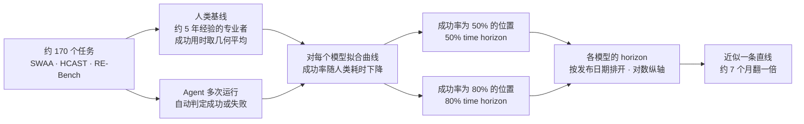
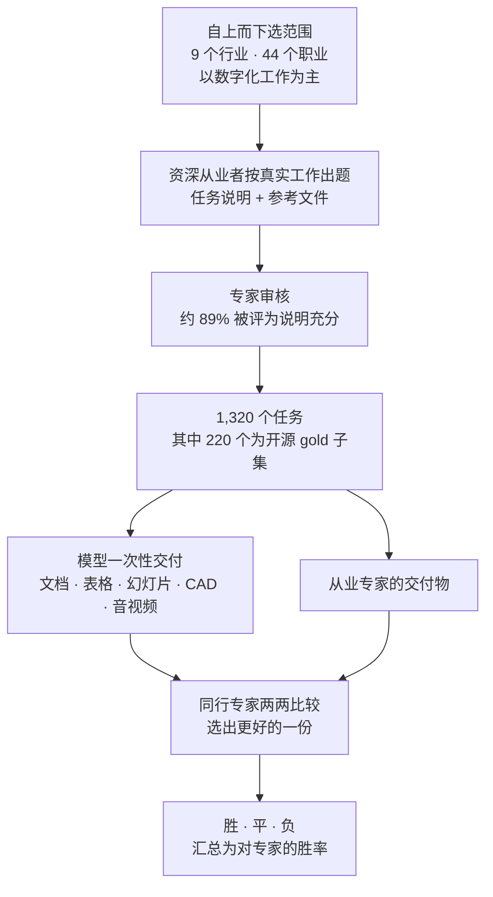
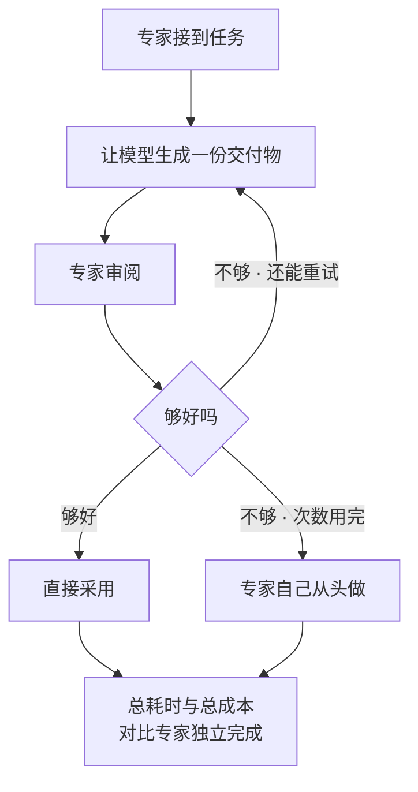
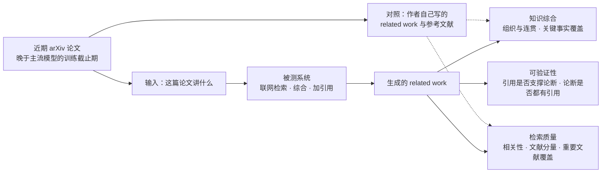
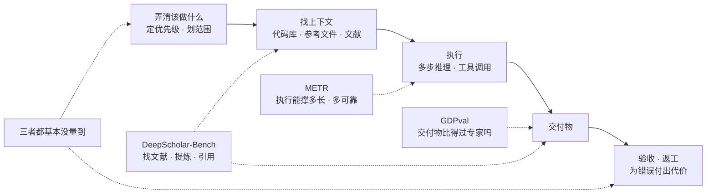

# CS329A 第 8 讲｜智能体评测与长程任务（Agentic Evaluations and Long Horizon Tasks）

> Stanford CS329A: Self-Improving AI Agents（2025 秋）· 对应课表第 17 次课（11 月 17 日）：课上逐篇讲的三篇论文与该次课的阅读材料完全一致
> 视频：<https://www.youtube.com/watch?v=8JAqLnTaZu4>（1:15:18，自带英文 CC；学生提问收音差，字幕里 [INAUDIBLE] 很多）
> 讲者：推断为 Aakanksha Chowdhery（本讲没有自我介绍；她以亲历者的口吻回忆四五年前"模型能写出一段解释就是大事"的阶段，又把"AI 能自己造出下一代模型"称作"我们对 AGI 的定义"，与 PaLM / Reflection AI 的背景吻合；仅凭字幕不能完全确认）
> 配套阅读：[Measuring AI Ability to Complete Long Tasks](https://arxiv.org/abs/2503.14499)（Kwa et al., METR, 2025）· [GDPval: Evaluating AI Model Performance on Real-World Economically Valuable Tasks](https://arxiv.org/abs/2510.04374)（Patwardhan et al., OpenAI, 2025）· [DeepScholar-Bench](https://arxiv.org/abs/2508.20033)（Patel et al., Stanford / UC Berkeley, 2025）

**一句话**：聊天式 benchmark 饱和之后，agent 评测先要回答"量什么"。这一讲用三篇论文给出三把互补的尺子——METR 用人类专业者的耗时给任务定标，量模型在 50% / 80% 成功率下能做多长的任务（约 7 个月翻一倍，但 80% 下只剩 15 分钟量级）；GDPval 让行业专家在模型和专家的交付物之间做两两比较，量胜率（两年近似线性，最高 47.6%）；DeepScholar-Bench 量"检索—综合—引用"的质量（没有系统过 19%）。三者共同的盲区是**上下文**：题目都把该知道的写全了、一次交付，而真实工作难在自己弄清该做什么。

## 时间轴

| 时间 | 内容 |
|---|---|
| [0:05](https://www.youtube.com/watch?v=8JAqLnTaZu4&t=5s) | 开场调查：大家的项目里用了什么 agentic eval |
| [1:38](https://www.youtube.com/watch?v=8JAqLnTaZu4&t=98s) | 本讲三篇论文；为什么要换尺子：传统 benchmark 饱和，能力与经济影响两条线 |
| [4:32](https://www.youtube.com/watch?v=8JAqLnTaZu4&t=272s) | METR：任务时长 × 可靠度，以人类专业者的耗时为锚 |
| [5:42](https://www.youtube.com/watch?v=8JAqLnTaZu4&t=342s) | 三个任务集 SWAA / HCAST / RE-Bench；四步方法 |
| [7:55](https://www.youtube.com/watch?v=8JAqLnTaZu4&t=475s) | 课堂互动：给自己想外包的任务估时 |
| [9:57](https://www.youtube.com/watch?v=8JAqLnTaZu4&t=597s) | 问答：人类基线要几个人；示例任务；几何平均与"熟手低估难度" |
| [12:38](https://www.youtube.com/watch?v=8JAqLnTaZu4&t=758s) | 散点图：成功率 vs 人类耗时 |
| [13:48](https://www.youtube.com/watch?v=8JAqLnTaZu4&t=828s) | 趋势图：50% time horizon 约每 7 个月翻倍 |
| [15:12](https://www.youtube.com/watch?v=8JAqLnTaZu4&t=912s) | 驱动因素；学生补充 context engineering、规划、用户反馈、记忆 |
| [20:18](https://www.youtube.com/watch?v=8JAqLnTaZu4&t=1218s) | 80% 可靠度：59 分钟变成 15 分钟 |
| [22:37](https://www.youtube.com/watch?v=8JAqLnTaZu4&t=1357s) | 失败模式：GPT-4 vs o1；失败分析怎么做 |
| [25:22](https://www.youtube.com/watch?v=8JAqLnTaZu4&t=1522s) | 局限：messy 任务、SWE-bench Verified、内部 PR 与"低上下文的外包者" |
| [27:51](https://www.youtube.com/watch?v=8JAqLnTaZu4&t=1671s) | GDPval：问题设定、覆盖的行业、示例任务 |
| [30:31](https://www.youtube.com/watch?v=8JAqLnTaZu4&t=1831s) | 课堂讨论：主观性、伦理合规、作曲 |
| [33:40](https://www.youtube.com/watch?v=8JAqLnTaZu4&t=2020s) | 数据集构造：9 个行业、44 个职业、1,320 个任务、gold 220 |
| [35:38](https://www.youtube.com/watch?v=8JAqLnTaZu4&t=2138s) | 主结果：12.4% → 47.6%；"线性 vs 指数"之问 |
| [38:24](https://www.youtube.com/watch?v=8JAqLnTaZu4&t=2304s) | 模型差异、失败原因、GPT-5 失败的严重程度 |
| [40:35](https://www.youtube.com/watch?v=8JAqLnTaZu4&t=2435s) | 试 1 次 vs 试 n 次的速度 / 成本账 |
| [41:50](https://www.youtube.com/watch?v=8JAqLnTaZu4&t=2510s) | 分行业 / 时长 / 模态；逐职业密集图 |
| [45:40](https://www.youtube.com/watch?v=8JAqLnTaZu4&t=2740s) | 欠指定 prompt 实验；真实工作重上下文；近期含义 |
| [47:55](https://www.youtube.com/watch?v=8JAqLnTaZu4&t=2875s) | 问答：美元标价可靠吗；模型赢了人意味着什么 |
| [51:34](https://www.youtube.com/watch?v=8JAqLnTaZu4&t=3094s) | DeepScholar-Bench：任务、数据、三个维度七个指标 |
| [55:18](https://www.youtube.com/watch?v=8JAqLnTaZu4&t=3318s) | 结果：没有系统过 19%；失败模式；oracle 检索仍只有约 50% |
| [58:53](https://www.youtube.com/watch?v=8JAqLnTaZu4&t=3533s) | 问答：为什么讲这个 benchmark；"重要文献"怎么定 |
| [1:01:03](https://www.youtube.com/watch?v=8JAqLnTaZu4&t=3663s) | 三篇合看；benchmark 与真实任务差在哪 |
| [1:04:38](https://www.youtube.com/watch?v=8JAqLnTaZu4&t=3878s) | 有把握的 / 把握不大的；总结 |
| [1:08:20](https://www.youtube.com/watch?v=8JAqLnTaZu4&t=4100s) | 最后问答：趋势能否持续、两年后的研究工作、50% 怎么算、CS 还值得学吗、长尾卡在哪 |

## 核心内容

### 1. 为什么要换尺子

- 几年前模型能写出一段像样的解释就值得报道；今天要回答的是它对经济和安全的影响有多大。聊天、问答、"答案就在上下文里"的单轮题饱和太快，既分不开前沿模型，也没法外推。
- 讲者把"量什么"拆成两条主线加一块短板：**能做多长、多复杂的任务**（METR）；**做出来的东西有没有经济价值**（GDPval）；以及两者都绕不开的**查资料、用资料**（DeepScholar-Bench）。前两个指标都站得住，但画出来的趋势一个是指数、一个近似线性——这是全讲的伏笔。

### 2. 论文一：METR 的 time horizon——用"人要做多久"给任务定标

*图 8-1｜METR 从任务到翻倍时间的四步方法（自绘示意）· [▶ 看原幻灯片 6:50](https://www.youtube.com/watch?v=8JAqLnTaZu4&t=410s) · 出处：[Kwa et al., 2025](https://arxiv.org/abs/2503.14499)*

三个任务集合计约 170 个任务：

| 任务集 | 数量 | 人类耗时 | 内容 |
|---|---|---|---|
| SWAA | 66 | 1–30 秒 | 软件工程里的原子动作 |
| HCAST | 97 | 1 分钟–30 小时 | 多样的软件与研究工程任务 |
| RE-Bench | 7 | 约 8 小时 | 完整的 ML 研究工程任务，与课程前面讲过的 AI Scientist 同类 |

- **指标有两个维度**：任务时长 × 可靠度。时长不看模型自己跑了多久，而以"熟练的人类专业者做完要多久"为统一的锚；可靠度取 50% 和 80% 两档。课堂上学生给想外包的任务估时：核对 BibTeX 几分钟，写文献综述几小时，重构代码库几小时到几天、还得有人验收。
- **示例任务的跨度**：认出哪个文件是 shell 脚本（约 3 秒）→ 修仿真输入文件里的 bug（约 10 分钟）→ 给回测工具写定制 CUDA kernel 并达到指定加速（约 8 小时）；中间还有查 Wikipedia、转换 JSON 数据格式。
- **人类基线**：请约 5 年经验的专业者真的去做，只记成功完成的用时，取几何平均当作任务难度。人很贵，每题只有少数几位；讲者给的通行做法是看 inter-rater agreement，分歧大就补样本。讲者还点出一个系统性偏差：熟手对"做成是什么样"有预设，容易低估难度；人觉得难和模型觉得难也未必是一回事。
- **拟合**：每个模型在每个任务上跑多次得到成功率，对人类耗时拟合成一条曲线，曲线上成功率为 50%（或 80%）处的耗时就是该模型的 time horizon；再把各模型按发布日期排开看趋势。
  > 小注：论文的做法是对每个模型做 logistic 回归 p(成功) = σ(β·(log h − log t))：t 是该任务人类成功基线用时的几何平均，学出来的 h 即 50% time horizon，80% horizon 取同一条曲线上 0.8 的位置。每个"模型—任务"对跑 8 次；任务按所在任务族大小的平方根倒数加权；连续得分用任务级阈值二值化；169 个任务中 148 个有真人基线，其余用研究者估时。趋势线是 log(horizon) 对发布日期的线性回归：翻倍时间 212 天（95% 区间 171–249 天），80% horizon 为 213 天。
- **结果**
  - 散点图：SWAA 成功率普遍高；HCAST 从 0.8 到 0 铺满；RE-Bench 有成功但偏低。任务越长，模型越难不跑偏。
  - 趋势：GPT-2（2019）约 2 秒 → GPT-4（2023）约 8 分钟 → Claude 3.7 Sonnet（2025）59 分钟，约每 7 个月翻一倍。
  - 但这只是 50%：好比把活交给实习生，回来的结果一半能用。换成 80%，翻倍速度几乎不变，整条线却低一大截——Claude 3.7 Sonnet 只有约 15 分钟。讲者的解读：真要部署，中等复杂度的任务就会撞上可靠性问题，模型之上的系统层还有很大空间。这和第 2 讲的 coverage 是同一个故事：50% horizon 说的是"做得出来"，到 80%、95% 才算"交得出去"。
- **是什么把 horizon 拉长**：推理、代码生成、工具使用（ReAct 一脉）变强；更少原地打转；出错后能恢复，并始终记得最终目标和当前进度。学生补充了工程侧因素：context engineering（Claude Code 的 compaction）、来自用户日志的反馈（Cursor 的 Tab 补全用 online RL）、先显式规划再按需重新规划、对代码库和环境的记忆。
- **失败模式**（人工归类 GPT-4 和 o1 的失败轨迹）：规划或工具选得不好；心算 / 推理出错；过早放弃——判断不了"做成"是什么样；重复已经失败的动作——失败后它仍是概率最高的动作。最后一类在 GPT-4 上很多，到 o1 明显减少。讲者的方法论建议：提出一个难 benchmark，失败模式分析就该是标配，靠人读轨迹，没有捷径。
  > 小注：论文的归类表（GPT-4 1106 共 31 条失败轨迹 / o1 共 32 条）：规划或工具选择 4 / 6，心算或推理 6 / 7，过早放弃 8 / 16，重复失败动作 12 / 2，其他 1 / 1——"重复失败动作"大减的同时，o1 的"过早放弃"翻了一倍。
- **局限**
  - messy 的任务（没有唯一答案、环境更复杂）成绩更低，但随时间上升的趋势相似。
  - 在 SWE-bench Verified 上重做分析，趋势相似、翻倍时间更短。讲者给的理由：标注者低估了任务耗时，且模型多半见过这些 GitHub 仓库。
    > 小注：论文在 SWE-bench Verified 上得到的翻倍时间约 70 天，解释是那里用的标注者估时对最简单的任务低估得最厉害，弱模型的 horizon 被压低、趋势线被拉陡；"模型见过这些仓库"是讲者补充的。
  - 内部代码库的真实 PR：没有上下文的外包者比仓库维护者慢 5–18 倍，而模型的表现更接近外包者。今天的 agent 应被看成"聪明但低上下文的人"——这一点贯穿后两篇。

### 3. 论文二：GDPval——和行业专家的交付物对打

*图 8-2｜GDPval 的任务来源与评分方式（自绘示意）· [▶ 看原幻灯片 33:40](https://www.youtube.com/watch?v=8JAqLnTaZu4&t=2020s) · 出处：[Patwardhan et al., 2025](https://arxiv.org/abs/2510.04374)*

- **问题换了**：不问"AI 能不能做"，而问"交给模型而不是人，交回来的东西够不够好"。对手是从业十年以上的行业专家。
- **任务怎么来**
  - 自上而下：对 GDP 贡献最大的 9 个行业 → 44 个职业 → 1,320 个任务，其中 220 个作为 gold 子集开源在 Hugging Face。只收以数字化工作为主的职业，用 O\*NET（职业—任务分类体系）判定。
    > 小注：论文的口径是先取对美国 GDP 贡献超过 5% 的 9 个行业，每个行业内按总工资取排在最前面的几个（至多 5 个）"数字化为主"的职业，判据是该职业在 O\*NET 里 60% 以上的任务属于数字化任务。课上的"GDP 前 5%"和"60% 的 O\*NET 任务进了数据集"是口头简化。出题专家平均从业 14 年。
  - 任务按从业者的真实工作来出：平均要专家做约 7 小时，长的要几周；除文本外还有 CAD、视频、音频、表格、幻灯片；gold 子集里平均每个任务约值 400 美元（讲者拿 SWE-Lancer 里更高价的任务作对比）；约 70% 要读随附的参考文件；约 89% 被专家评为说明充分——模型输了不能怪题目没写清楚。
  - 示例：设计流水线用的线缆盘支架 3D 模型（制造工程师）、看病灶图片写会诊报告（注册护士）、按脚本剪片头（视频剪辑）、核对多张采购单的价格出入（审计）、优化市集的摊位布局（文体活动工作者）。
- **怎么判**：学生的第一反应是太主观。讲者：正因为主观，指标才是胜率——专家在模型和专家的交付物之间做两两偏好选择；主观性本身就是真实工作的一部分。课堂上还分开了"能不能做"和"出于伦理、合规要不要让它做"，benchmark 只回答前者；作曲这类好坏更难说清的工作没有收进来。
  > 小注：论文里是盲评，47.6% 是"胜 + 平"的口径。专家之间的一致率 71%，OpenAI 提供的自动评审与专家的一致率 66%。放回第 3 讲的语境：自动评审是一个不完美的验证器，人与人七成的一致率是它的天花板。
- **主结果**：GPT-4o 12.4%（2024）→ 中间几代 25%、30% 多 → Claude Opus 4.1 47.6%，大致线性。学生问这和 METR 的指数是否矛盾。讲者：量的不是一个东西，谈不上谁错；但指数曲线容易让人顺着推"现在一小时，接着几小时、几天"，而 GDPval 把几小时到几周的真实工作按职业拆开，看到的是参差不齐、可靠度有限。
- **模型差异与失败**
  - Claude 强在美观度、文档排版和 PDF / 表格 / 幻灯片；GPT-5 强在指令遵循、计算正确性和纯文本任务。
  - 输的原因以指令遵循类最多，典型症状是嘴上说会看参考数据、实际没看，用幻觉内容盖过去；其次是格式错误。
  - GPT-5 失败案例的严重程度：约一半"可接受但不如人"，约 29% "差或灾难性"，另有约两成复评后认为模型其实更好；评分者之间的分歧会影响这组数字。
    > 小注：按论文，这组比例的分母是 GPT-5 输给专家的交付物，不是全部任务，其中灾难性的约 3%。论文原话是 Claude、Grok、Gemini 主要输在指令遵循，GPT-5 high 主要输在格式；"答应了却没交、无视参考数据"点名的是 Gemini 和 Grok。
- **分组看**：政府、零售、批发接近与专家持平；几小时以内的任务胜率高，越长越低。逐职业图里贴近"持平"红线的有柜台与租赁职员、收发货与库存职员、采购、软件开发者、合规专员、个人理财顾问、客服代表、编辑、新闻分析等。讲者提醒，这里比的是平均水平的从业者，不是顶尖专家。

### 4. GDPval 的两条引申：人在环里的经济账，和"上下文"这条限制

*图 8-3｜"试 n 次、不行再自己做"的人机协作模型（自绘示意，按论文定义）· [▶ 看原幻灯片 40:35](https://www.youtube.com/watch?v=8JAqLnTaZu4&t=2435s) · 出处：[Patwardhan et al., 2025](https://arxiv.org/abs/2510.04374)*

- **经济账**：讲者点题，这是 self-improving agents 课——并行多采几次，或串行地让模型看着上一版自己改，结果通常明显变好（对应第 2 讲的并行 / 串行 test-time compute）。GDPval 比较了"试 1 次"和"试 n 次"：GPT-5 在后一种用法下，相对不用 AI 的专家，速度约 1.4 倍、成本约 1.6 倍；模型做得成的任务上，花费不到专家薪酬的 10%。
  > 小注：论文比较三种算法——naive ratio（只比双方各自的耗时和成本，不管质量）；try once then fix（采样一次 → 专家审 → 不满意就自己做）；try n times then fix（不满意就重新采样，最多 n 次，再不行自己做），审阅时间和胜率都计入。GPT-5：试 1 次 1.12×（速度）/ 1.18×（成本），试 n 次 1.39× / 1.63×。论文里的重试是独立重采样，不是课上口头说的"在上一版基础上改"。
- **最重要的一条限制：上下文**
  - 把 prompt 里的上下文删掉一部分，胜率掉几个点，模型不知道该干什么。
  - 评测量的是"把脑子里的上下文全写给一个聪明人，他能不能做"，没有量"身在这份工作里的人自己弄清该做什么"。定优先级、选问题、分配资源才是职场里的难点，目前是人当架构师、模型来执行——和 METR 的维护者 vs 外包者是同一个现象。
  - 近期含义：AI 辅助已进入专业工作流，配上人的监督是划算的，但要按任务类型挑模型。
- **问答**
  - 模型赢了人，人就不需要了吗？讲者：先去读那条 prompt——那是一位专家把多年积累的上下文全写了进去。
  - 美元标价可靠吗？讲者认为重点不在金额，而在第一次有了一张按职业列任务、可量化的清单，能看出模型擅长的类别（深度调研、代码生成、消化多来源信息）落在哪些职业；上一届课程只能拿 MLE-bench、RE-Bench 这类离 ML 研究者最近的评测来讲。

### 5. 论文三：DeepScholar-Bench——检索、综合、可验证引用

*图 8-4｜DeepScholar-Bench 的任务与三个评测维度（自绘示意）· [▶ 看原幻灯片 53:35](https://www.youtube.com/watch?v=8JAqLnTaZu4&t=3215s) · 出处：[Patel et al., 2025](https://arxiv.org/abs/2508.20033)*

- **动机**：GDPval 里多数任务要读参考文件，"去查、去读、去引用"值得单独量。同类系统已经很多：OpenAI / Gemini / Perplexity 的 Deep Research、Stanford 的 STORM、OpenScholar，还有作业 3 里学生自己搭的 deep research agent。
- **任务与数据**：给一篇论文写 related work——人人要写，查询永远是新的。取近期 arXiv 论文（讲者称 PhD 级难度、22 个领域），只要主流模型训练截止之后发表的，避开数据污染；每月用新论文重跑，所以是"活的" benchmark。
  > 小注：论文 v1（2025 年 8 月，课上用的版本）是 63 篇论文、18 个 arXiv 领域（课上说 22 个），发表于 2025 年 4–6 月，即 Llama-4 发布之后；给系统的输入是论文摘要，对照物是作者自己写的 related work。
- **三个维度、七个指标**
  - 知识综合：组织与连贯性；nugget coverage（关键事实写到了多少）。
  - 检索质量：relevance rate（找来的文献相关吗）；document importance（按引用数看有没有分量）；reference coverage（重要文献找回了多少）。
  - 可验证性：citation precision（引用真的支撑那句话吗）；claim coverage（每个论断都有引用撑着吗）——一个管准，一个管全。
  - 自动指标与人工标注的一致率在 70–80%。
  > 小注：各指标大致都以人写的 related work 为参照：组织性由 LLM 评审与人写版本两两比较；nugget 由 LLM 从人写版本里抽取；document importance 比较双方所引文献的引用数；reference coverage 算人写版本里被标为"重要"（不可省略或替换）的文献找回了多少。
- **结果**：没有系统超过 19%，离饱和很远（讲者：下一届可以直接拿来当期末项目）。
  - 综合：OpenAI Deep Research 写得最好，但几乎所有系统都漏关键事实——英文漂亮不等于事实全。
  - 检索：都找不全重要文献，document importance 全部低于 12.5%。
  - 可验证性：DeepScholar-base 的引用精确度能到约 90%；OpenAI Deep Research 文笔最连贯，可验证性反而低。
  > 小注：v1 的原话应理解为"没有系统能在全部指标上都超过 0.19"，短板在检索——reference coverage 最高 .187、document importance 最高 .124（均为 OpenAI DeepResearch），并没有一个 19% 的总分；citation precision 上 DeepScholar-base 最高 .936，OpenAI DeepResearch 为 .399。2026 年 2 月的 v2 把参考系统改名为 DeepScholar-ref，结论改为"各指标的几何平均不超过 31%"。
- **失败模式**
  - 找得到相关的，找不到奠基性的。专家靠多年积累知道哪些必引；系统只会判断"相关"，不会判断"重要"。
  - 即使把标准文献直接给它（oracle 检索），关键事实覆盖率也只有约 50%——瓶颈不只在检索，也在提炼。
  - 综合质量和可验证性此消彼长，没有系统两头都好。
- **问答**
  - 为什么讲这么窄的一个 benchmark：它代表"必须用好外部知识库"这一类真实任务，补上前两篇的缺口。
  - "重要文献"由谁定：以人写的 related work 的参考文献为准；但评测不止数文献——related work 的本质是提出"本文与前人有何不同"的论断并逐条用引用撑住，论断与引用的对应同样要查。

### 6. 三把尺子合看：benchmark 和真实工作差在哪

*图 8-5｜一件真实工作的链条，以及三个 benchmark 各量到哪一段（自绘示意，按讲者的总结归纳）· [▶ 看原幻灯片 1:02:50](https://www.youtube.com/watch?v=8JAqLnTaZu4&t=3770s)*

| | METR time horizon | GDPval | DeepScholar-Bench |
|---|---|---|---|
| 量什么 | 给定成功率下能完成的任务时长 | 交付物对专家的胜率 | 综合、检索、可验证性 |
| 以谁为锚 | 约 5 年经验专业者的耗时 | 十年以上从业者的交付物 | 人写的 related work |
| 怎么判 | 自动判分 | 专家两两偏好 | 自动指标，经人工校验 |
| 现状 | 7 个月翻倍；50% 下约 1 小时，80% 下约 15 分钟 | 两年近似线性，最高 47.6% | 没有系统过 19% |
| 离真实工作差在哪 | 单 agent、自动判分、犯错不受罚、不限资源 | 说明极其充分、一次交付没有往返、依赖模型已有的隐性知识 | 找不全重要文献、提炼不出关键事实、引用不稳 |

- **把研究综述放进前两把尺子**：这类任务人要做 30 分钟到 8 小时，正落在当前约 50 分钟的能力带里；但在 time-horizon 图上"看起来能做"，不等于质量过关。缺口在多步推理、全面的信息收集，以及在多次工具调用之间拼接上下文时守住可验证性（作业 3 的体会）。
- **比较有把握的**：孤立、说明清楚的任务在稳步变好；软件工程和 ML 研究进步最大（讲者：我们最懂这两个领域，于是先自动化了自己的工作），已能做小时级任务；强模型的输出组织得很好，哪怕内容不全对。
- **把握不大的**：重上下文、prompt 含糊的任务；对抗性环境；95% 级别的可靠度；软件和知识工作之外的泛化；从知识库里找全高质量来源并核实。
- **结论**：METR 的外推是 2028–2031 年出现能做"一个月长"任务的 agent；GDPval 的线性趋势给这种外推降了温——约 48% 的总胜率背后是大量胜率很低的职业；DeepScholar-Bench 显示一旦要自己找上下文，质量和可验证性都跟不上人。时长、经济价值、综合质量三类指标要一起看，而且都得用真人校准。

### 7. 最后的问答

- **这条指数会像摩尔定律一样持续吗**：编码方向（如 SWE-bench Verified）还会涨；但大量工作不是"一个 PR"这种形态，长尾最难——类比 Waymo，前 80% 容易，最后 20% 最磨人；分布式系统是模型很难做对的方向之一。
- **两年后讲者自己的工作**：AI 的时间线一年都难预测。能提出假设、跑实验、闭合整个环的 AI scientist 还没到；眼下更有价值的是 AI co-scientist——知识面广、很强的头脑风暴伙伴。各领域的"最后一公里"都是长尾可靠性。
- **"50% 成功率"怎么算**（学生问：是"全体任务 × 多次尝试"的平均，还是要求每个任务都过 50%）：讲者答每个任务多次运行得到该任务的成功率，再按人类耗时排开；50% 就是掷硬币。精确定义见第 2 节的小注——两种猜法都不对，它是拟合曲线与 50% 的交点。
- **CS 还值得学吗**：职业不会消失；从基本原理出发推理的能力更重要，因为 AI 要靠人给上下文。
- **长尾卡在数据还是能力**：都有。很多创业公司在造环境和任务，难点是造出有代表性的任务、再补上对应的能力缺口。法律、金融调研这种宽类别落地快；很窄的场景数据不够；机器人领域有一批公司把"采数据"当成主要假设。

## 关键图表速查（点时间戳跳到原幻灯片）

| 图 | 看什么 | 跳转 | 出处 |
|---|---|---|---|
| METR 方法总览 | 任务 → 人类与 agent 两路数据 → 拟合 → horizon 对发布日期，四步流程 | [6:50](https://www.youtube.com/watch?v=8JAqLnTaZu4&t=410s) | [Kwa et al.](https://arxiv.org/abs/2503.14499) |
| 成功率 vs 人类耗时散点 | 横轴人类耗时、纵轴成功率 0–1；绿点 SWAA 在高处，HCAST 从 0.8 到 0 铺开，RE-Bench 偏低 | [12:38](https://www.youtube.com/watch?v=8JAqLnTaZu4&t=758s) | 同上 |
| 50% time horizon 趋势 | 纵轴是 50% 成功率下的任务时长；GPT-2 约 2 秒 → GPT-4 几分钟 → Claude 3.7 Sonnet 59 分钟 | [13:48](https://www.youtube.com/watch?v=8JAqLnTaZu4&t=828s) | 同上 |
| 50% 对 80% 两条线 | 灰线 50%、蓝线 80%；斜率几乎一样，蓝线整体低一截（15 分钟 vs 59 分钟） | [20:31](https://www.youtube.com/watch?v=8JAqLnTaZu4&t=1231s) | 同上 |
| 失败模式对比 | GPT-4 与 o1 各类失败的条数；"重复失败动作"一行差别最大 | [22:37](https://www.youtube.com/watch?v=8JAqLnTaZu4&t=1357s) | 同上 |
| GDPval 职业与示例任务 | 九个行业下的职业列表和九个示例任务；边看边想哪些模型可能做得好 | [28:24](https://www.youtube.com/watch?v=8JAqLnTaZu4&t=1704s) | [Patwardhan et al.](https://arxiv.org/abs/2510.04374) |
| GDPval 主结果 | 横轴按模型排（GPT-4o → GPT-5 high → Claude Opus 4.1）；浅蓝 = 胜 + 平，深蓝 = 只算胜；12.4% → 47.6% | [35:38](https://www.youtube.com/watch?v=8JAqLnTaZu4&t=2138s) | 同上 |
| 失败原因分布 | 蓝色柱 = 指令遵循类错误，是最大头；GPT-5 最少 | [38:50](https://www.youtube.com/watch?v=8JAqLnTaZu4&t=2330s) | 同上 |
| 速度 / 成本表 | 试 1 次 vs 试 n 次；GPT-5 在试 n 次下约 1.4×（速度）和 1.6×（成本） | [40:35](https://www.youtube.com/watch?v=8JAqLnTaZu4&t=2435s) | 同上 |
| 逐职业胜率（三页密集图） | 红线 = 与人类专家持平，各色 = 不同模型；找贴近红线的职业 | [42:20](https://www.youtube.com/watch?v=8JAqLnTaZu4&t=2540s) | 同上 |
| DeepScholar-Bench 指标体系 | 三个维度各自下面的指标；citation precision 与 claim coverage 一个管准、一个管全 | [53:35](https://www.youtube.com/watch?v=8JAqLnTaZu4&t=3215s) | [Patel et al.](https://arxiv.org/abs/2508.20033) |
| DeepScholar-Bench 结果 | 没有系统过 19%；OpenAI Deep Research 综合强、可验证性弱，DeepScholar-base 相反 | [55:41](https://www.youtube.com/watch?v=8JAqLnTaZu4&t=3341s) | 同上 |

## 提到的工作

| 名称 | 在本讲里的作用 |
|---|---|
| Measuring AI Ability to Complete Long Tasks（Kwa et al., METR, 2025） | 论文一：50% / 80% time horizon，7 个月翻倍 |
| SWAA / HCAST / RE-Bench | METR 的三个任务集：原子动作 / 多样的软件与研究工程任务 / 8 小时级 ML 研究工程 |
| SWE-bench Verified | METR 的外部复核；也是最后问答里"编码方向还会涨"的例子 |
| GDPval（Patwardhan et al., OpenAI, 2025） | 论文二：44 个职业的真实交付物，对专家的胜率 |
| O\*NET | 美国的职业—任务分类体系，GDPval 用它筛"数字化为主"的职业 |
| SWE-Lancer（字幕作 "cvLancer"，推断） | 带真实报价的自由职业软件任务，讲者用来对比任务价值 |
| DeepScholar-Bench（Patel et al., 2025）与 DeepScholar-base | 论文三：写 related work 的活 benchmark 及其参考系统 |
| OpenAI / Gemini / Perplexity 的 Deep Research、STORM、OpenScholar | 已有的研究综述类系统 |
| ReAct、AI Scientist、记忆专题（课表第 4 / 7 / 14 次课） | 讲驱动因素和 RE-Bench 时回指的前序内容 |
| MLE-bench（字幕作 "ML-Bench"，推断）与 RE-Bench | 上一届课程讲评测时用的例子 |
| Claude Code、Codex、Cursor | 课堂讨论里的 coding agent：compaction、显式规划、Tab 补全的 online RL |
| AI co-scientist | 讲者认为现阶段比全自动 AI scientist 更有价值的形态 |
| GPT-2、GPT-4、o1、Claude 3.7 Sonnet；GPT-4o、GPT-5（high）、Claude Opus 4.1 | 两条趋势线上的模型 |
| Waymo | 长尾类比：前 80% 容易，最后 20% 最难 |

## 术语对照

| English | 中文 |
|---|---|
| agentic evaluation | 智能体评测 |
| long-horizon task | 长程任务 |
| 50% / 80% time horizon | 50% / 80% 成功率下的任务时长（时间跨度） |
| human baseline, baseliner | 人类基线，基线测试者 |
| geometric mean | 几何平均 |
| doubling time | 翻倍时间 |
| reliability | 可靠度 |
| inter-rater agreement | 评分者间一致率 |
| failure mode analysis | 失败模式分析 |
| premature task abandonment | 过早放弃任务 |
| repeating failed actions | 重复已失败的动作 |
| messy task | 杂乱任务（无唯一答案、环境复杂） |
| low-context contractor / repo maintainer | 低上下文的外包者 / 仓库维护者 |
| economically valuable task | 有经济价值的任务 |
| deliverable | 交付物 |
| win rate, pairwise preference | 胜率，两两偏好 |
| reference file | 参考文件 |
| gold subset | 开源的金标子集 |
| under-specified prompt | 欠指定的 prompt |
| tacit knowledge | 隐性知识 |
| one-shot (non-interactive) | 一次交付（没有多轮往返） |
| human oversight | 人类监督 |
| generative research synthesis | 生成式研究综述 |
| live benchmark | 活的（持续更新的）benchmark |
| data contamination | 数据污染 |
| nugget coverage | 关键事实覆盖率 |
| document importance | 文献重要性 |
| reference coverage | 重要文献覆盖率 |
| citation precision / claim coverage | 引用精确度 / 论断覆盖率 |
| verifiability | 可验证性 |
| oracle retrieval | 直接给定标准文献的检索设定 |
| context engineering, compaction | 上下文工程，上下文压缩 |
| long tail | 长尾 |
| saturate | 饱和 |

## 字幕勘误

"genetic evaluations" → agentic evaluations；"GDPVal" → GDPval；"meter" / "the beta paper" → METR / the METR paper；"five weeks shorter" → 推断为 5x shorter（80% horizon 约为 50% horizon 的四到五分之一，15 分钟对 59 分钟；讲者此前从图上估读的"8–10 分钟"以幻灯片的 15 分钟为准）；"Too use" → tool use；"React" → ReAct；"online URLs"（Cursor 的 Tab 补全）→ online RL；"Cuda" → CUDA；"refractor" → refactor；"open goal set" / "hugging phase" → open gold set / Hugging Face；"cvLancer" → 应为 SWE-Lancer；讲 GDPval 模型差异时句首的 "it always" → 应为 Claude（与论文对 Claude Opus 4.1 的描述一致）；"ML-Bench" → 应为 MLE-bench；"Storm" → STORM；"DeepScholar base" → DeepScholar-base；Waymo 那句里听不清的部分按上下文应为"前 80%"。开场学生提到的 "[INAUDIBLE] bench" 无法还原。

## 带走的问题

1. 用"人类耗时"当难度的代理变量，该用谁的时间？熟手会低估，低上下文的人比维护者慢 5–18 倍，而模型更像后者。一个 agent benchmark 是否应该同时报告"高上下文人类"和"低上下文人类"两条基线，并说明模型被给了哪一种上下文？
2. 从 50% 到 80% horizon 缩到约四分之一，到 95% 会缩到多少？高可靠度下翻倍时间还一样吗？"长尾可靠性"究竟是更多环境和数据能解决的，还是需要新的能力（知道何时算做完、何时该停）？
3. METR 的指数和 GDPval 的线性是矛盾，还是同一进步在不同坐标下的样子——胜率有上界，time horizon 是对数轴上的无界量？有没有办法在同一批任务上同时测两者来检验？
4. 三个 benchmark 都把上下文写进了题目。怎么评"弄清该做什么、主动找上下文"的能力：任务说明故意不全、允许 agent 澄清和探索、返工有代价、评分仍可复现——这样的评测该怎么设计？主观交付物上人与人只有七成一致，自动评审的噪声地板又在哪？
