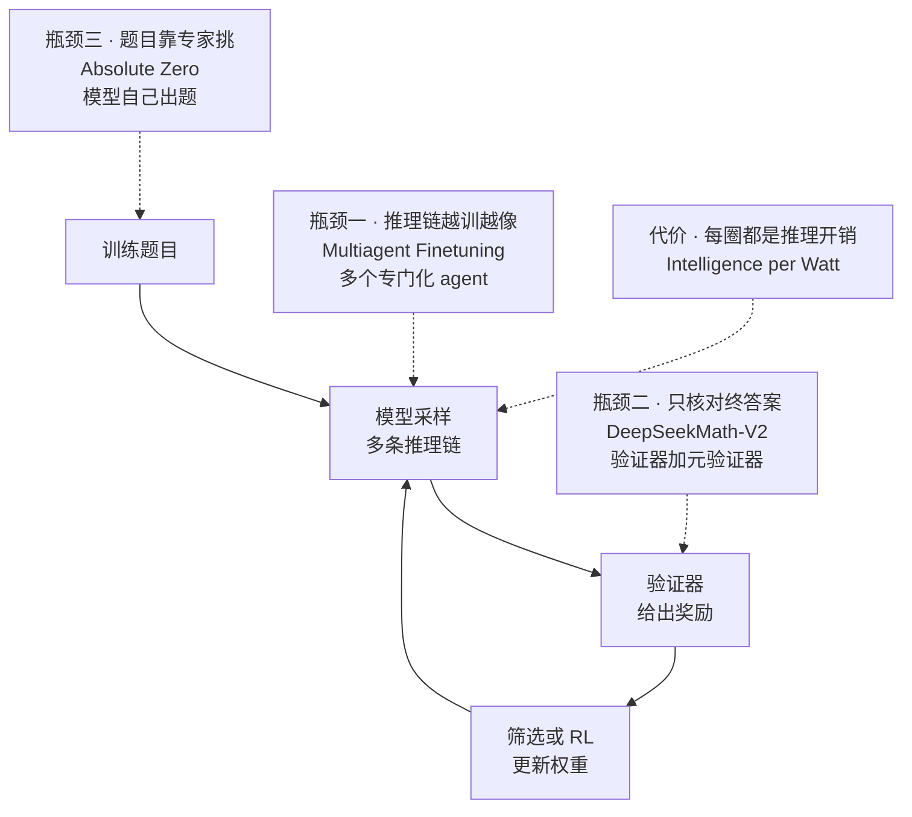
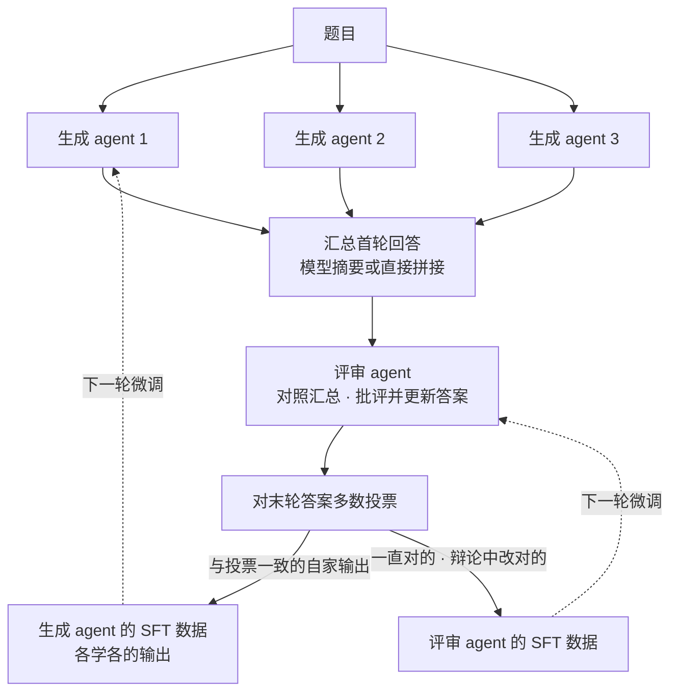
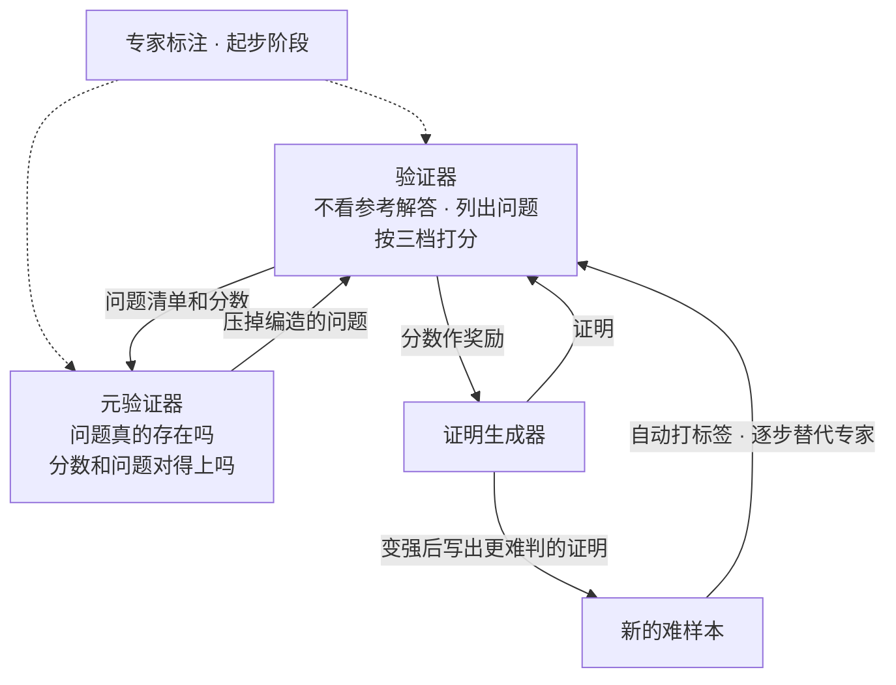
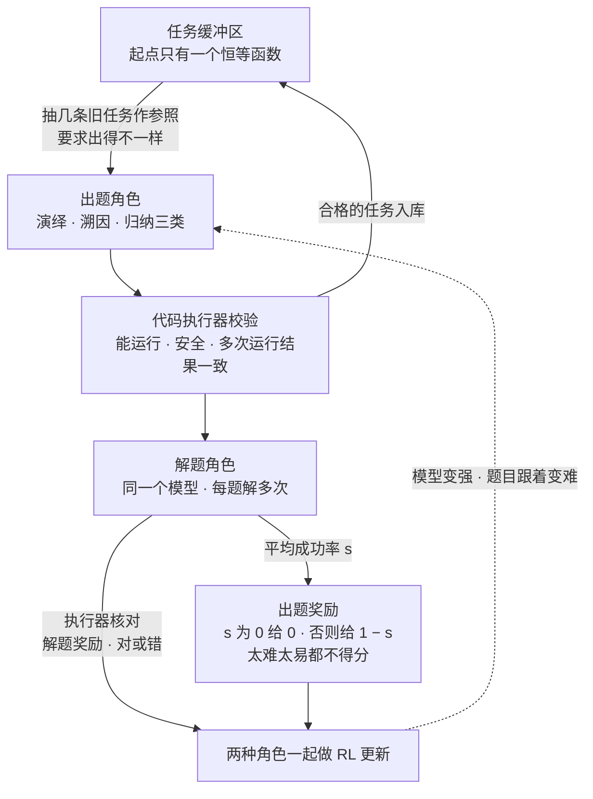
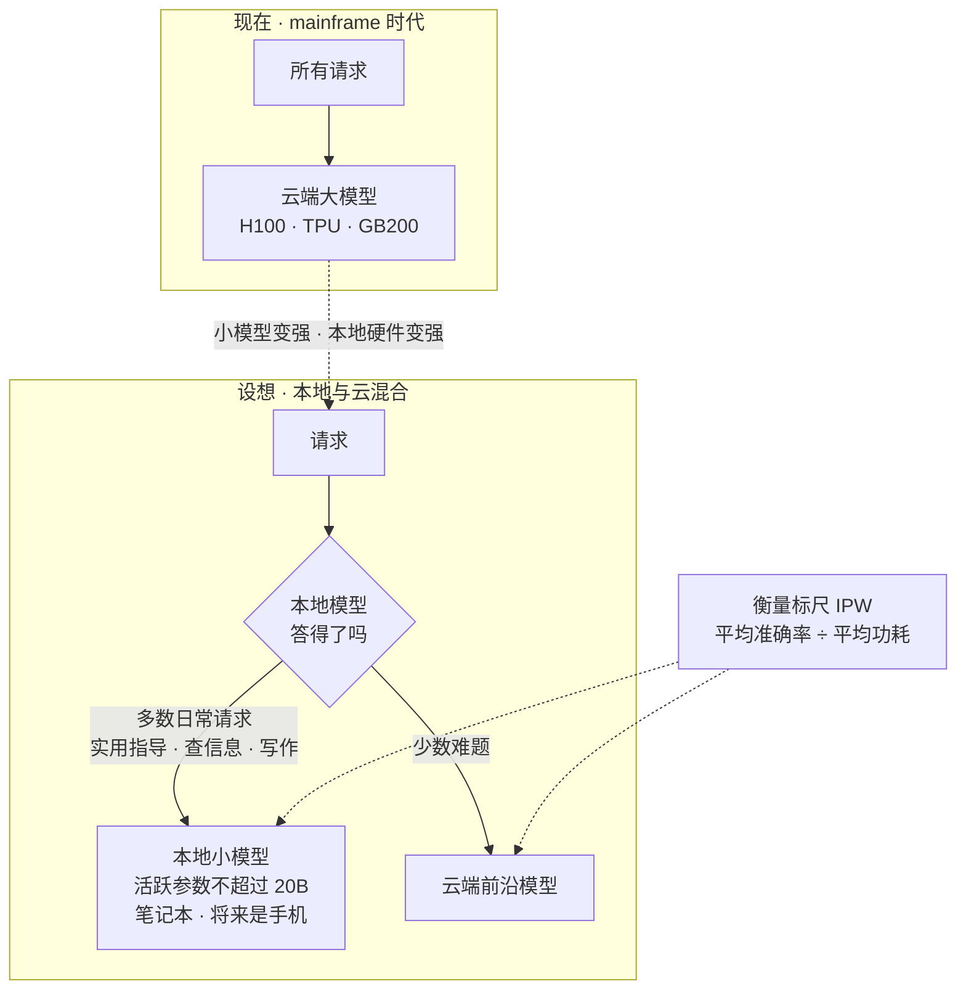

# CS329A 第 9 讲｜未来研究方向（Future Research Areas）

> Stanford CS329A: Self-Improving AI Agents（2025 秋）· 对应课表第 20 次课（12 月 5 日，学期最后一讲；结尾是结课致辞，问答里说的"周一那节课"即 12 月 1 日 Danny Driess 的机器人客座）
> 视频：<https://www.youtube.com/watch?v=AyO6wyu4DEg>（1:07:42，自带英文 CC，专有名词错得不少，见文末勘误）
> 讲者：Aakanksha Chowdhery（学期回顾 + 前三篇论文）、Azalia Mirhoseini（Intelligence per Watt + 开放方向）；两人远程接入，幻灯片由 Aakanksha 代翻（推断）
> 配套阅读：课表这一讲没有列阅读。课上展开的四篇：[Multiagent Finetuning](https://arxiv.org/abs/2501.05707)（Subramaniam et al., 2025）· [DeepSeekMath-V2](https://arxiv.org/abs/2511.22570)（Shao et al., 2025）· [Absolute Zero](https://arxiv.org/abs/2505.03335)（Zhao et al., 2025）· [Intelligence per Watt](https://arxiv.org/abs/2511.07885)（Saad-Falcon et al., 2025）

**一句话**：自我改进回路想一直转下去，卡在三处：推理链越训越同质、只核对终答案的奖励管不住过程、训练题目还得靠专家挑——三篇论文各拆一处（多 agent 保多样性、元验证、模型自己出题）。回路转得越多推理账单越大，所以后半讲问的是：每瓦特能买到多少智能，有多少流量其实可以留在本地。

## 时间轴

| 时间 | 内容 |
|---|---|
| [0:06](https://www.youtube.com/watch?v=AyO6wyu4DEg&t=6s) | 学期回顾：verifier 驱动的回路 → 开放式进化 → 工具与工作流 → 检索与记忆 → 规划与评测 → 客座 |
| [2:44](https://www.youtube.com/watch?v=AyO6wyu4DEg&t=164s) | 重申 agent 的定义；workflow 仍多是手写的，coding agent 是例外 |
| [4:19](https://www.youtube.com/watch?v=AyO6wyu4DEg&t=259s) | 本讲结构：自我改进回路的三个瓶颈 + 智能的效率 |
| [6:54](https://www.youtube.com/watch?v=AyO6wyu4DEg&t=414s) | 论文一 Multiagent Finetuning：单模型自训为什么几轮就停 |
| [9:00](https://www.youtube.com/watch?v=AyO6wyu4DEg&t=540s) | 生成 agent、评审 agent 与多轮辩论；微调数据怎么取 |
| [12:39](https://www.youtube.com/watch?v=AyO6wyu4DEg&t=759s) | 结果：多样性曲线、多轮微调、MATH → GSM8K 零样本 |
| [14:45](https://www.youtube.com/watch?v=AyO6wyu4DEg&t=885s) | 论文二 DeepSeekMath-V2：终答案奖励为什么不够，LLM judge 为什么不行 |
| [17:20](https://www.youtube.com/watch?v=AyO6wyu4DEg&t=1040s) | 验证器 + 元验证器；生成器与验证器互相抬升；标注自动化 |
| [19:57](https://www.youtube.com/watch?v=AyO6wyu4DEg&t=1197s) | 结果：IMO Shortlist 2024 上的 Pass@1 / Best@32 |
| [21:31](https://www.youtube.com/watch?v=AyO6wyu4DEg&t=1291s) | 推广到其他领域的三条配方与局限 |
| [23:02](https://www.youtube.com/watch?v=AyO6wyu4DEg&t=1382s) | 论文三 Absolute Zero：训练题目靠专家挑，这条路越走越窄 |
| [25:09](https://www.youtube.com/watch?v=AyO6wyu4DEg&t=1509s) | 出题—解题回路；演绎 / 溯因 / 归纳三类任务 |
| [26:44](https://www.youtube.com/watch?v=AyO6wyu4DEg&t=1604s) | 出题奖励、任务校验、缓冲区与课程学习 |
| [29:49](https://www.youtube.com/watch?v=AyO6wyu4DEg&t=1789s) | 结果与涌现行为；只在代码上自训，数学也涨；大模型收益更大 |
| [31:52](https://www.youtube.com/watch?v=AyO6wyu4DEg&t=1912s) | Azalia：与 SWiRL 的发现互相印证 |
| [32:54](https://www.youtube.com/watch?v=AyO6wyu4DEg&t=1974s) | 三个瓶颈小结；研究题：只靠可验证领域能把模型推多远 |
| [35:01](https://www.youtube.com/watch?v=AyO6wyu4DEg&t=2101s) | 不可验证的两类：验证太慢、真正主观；学生追问现在怎么做 |
| [40:19](https://www.youtube.com/watch?v=AyO6wyu4DEg&t=2419s) | Intelligence per Watt：mainframe 时代与推理需求爆炸 |
| [43:26](https://www.youtube.com/watch?v=AyO6wyu4DEg&t=2606s) | 两个趋势：77% 的请求不需要前沿模型；本地加速器内存涨 126 倍 |
| [46:37](https://www.youtube.com/watch?v=AyO6wyu4DEg&t=2797s) | IPW 的定义与实验规模 |
| [48:38](https://www.youtube.com/watch?v=AyO6wyu4DEg&t=2918s) | 三个发现：88.7%、M4 Max 对 B200、5.3 = 3.1 × 1.7 |
| [51:53](https://www.youtube.com/watch?v=AyO6wyu4DEg&t=3113s) | 开放方向一：test-time scaling 的原理、蒸馏、continual learning、推理 infra |
| [56:40](https://www.youtube.com/watch?v=AyO6wyu4DEg&t=3400s) | 开放方向二：本地—云混合推理、低能耗架构与 kernel、把能耗当优化目标 |
| [58:53](https://www.youtube.com/watch?v=AyO6wyu4DEg&t=3533s) | 问答：continual learning 靠记忆系统还是改权重；无限上下文与 Cartridges |
| [1:04:05](https://www.youtube.com/watch?v=AyO6wyu4DEg&t=3845s) | 问答：agent 能不能自己造环境 |
| [1:05:42](https://www.youtube.com/watch?v=AyO6wyu4DEg&t=3942s) | 结课致辞 |

## 核心内容

### 1. 学期回顾，和这一讲的两条线

*图 9-1｜自我改进回路上的三个瓶颈，以及本讲各用哪篇论文去拆（自绘示意）· [▶ 看原幻灯片 4:50](https://www.youtube.com/watch?v=AyO6wyu4DEg&t=290s)*

- **学期主线**：verifier 驱动的回路（跑验证器拿奖励，再用 RL 或搜索在数学、代码上爬坡；第 1–3、6 讲）→ 不靠单一奖励的开放式进化（AlphaEvolve；课表第 7 次课，视频未公开）→ 带工具的端到端工作流（第 4、5、7 讲）→ 检索与记忆 → 多步规划与 agent 评测（第 8 讲）→ 几场客座。Azalia 补充：客座讲的符号方法也属于工具使用，还能用来造合成数据。
- **agent 的现状**：定义没变（有目标、与环境交互、拿反馈纠偏）。LLM 单独还撑不起完整目标，多数系统仍是手写的 workflow，编排 LLM、verifier、judge、工具和并行搜索；coding agent 是开始能自己驱动流程的例外。
- **本讲两条线**：前半讲回路自身的三个瓶颈（图 9-1）——现在的 test-time / train-time scaling 基本只在数学、代码这类窄领域见效；后半讲效率，即"每单位什么，换来多少智能"。

### 2. 方向一：推理链的多样性——Multiagent Finetuning

*图 9-2｜多 agent 辩论一轮，以及两类 agent 各自拿什么数据微调，以 3 个生成 agent 为例（自绘示意）· [▶ 看原幻灯片 11:37](https://www.youtube.com/watch?v=AyO6wyu4DEg&t=697s) · 出处：[Subramaniam et al., 2025](https://arxiv.org/abs/2501.05707)*

- **问题**：预训练受限于互联网数据，指令微调受限于人类偏好数据。替代办法是拿模型自己生成的数据迭代微调：采样、滤掉错的（rejection sampling）、只在好样本上 SFT；第 6 讲的 STaR 是带推理链的变体。
- **为什么不够**：数据出自同一个模型，解法彼此相似，调高 temperature 也救不回来，提升通常几轮到几十轮就停。预训练数据则是很多人在很长时间里写出来的，多样性是天然的。
- **做法**：从同一个基座分化出一组生成 agent 和一组评审 agent。生成 agent 各自作答；之后每一轮，评审 agent 对着"所有 agent 回答的汇总"做批评并更新答案；最后对末轮答案多数投票。生成 agent 只学自己那些与投票一致的输出；评审 agent 学两类轨迹的混合——一开始就对的，和辩论中才被改对的，以学会分辨对错。与普通 self-critique 的差别：批评对象是多个 agent 的汇总，生成端先有了多样性，多数投票（第 2 讲）也顺带有了。穷人版是直接用几个不同的模型和 prompt 各生成一份，实践里很常见。
- **结果**：随微调轮次增加，多 agent 微调下各回答之间的 embedding dissimilarity 一直保持在高位，准确率多轮后还在涨；单 agent 微调则停滞甚至塌掉。MATH 上三个开源模型都如此；只在 MATH 上训、拿到 GSM8K 上零样本测也更好。
  > 小注：按论文，那张双图的两个指标（NLL、embedding dissimilarity）量的都是多样性，准确率随轮次的变化是另一张图；课上把 NLL 说成性能的代理，以论文为准。论文默认 3 个 agent、辩论 2 轮，除 Phi-3、Mistral-7B、LLaMA-3-8B 外也微调了 GPT-3.5。
- **落点**：想让回路持续转，喂回去的推理链必须保持多样；怎么得到多样性，整体仍是开放问题。

### 3. 方向二：不靠终答案的验证——DeepSeekMath-V2

*图 9-3｜生成器、验证器、元验证器三个角色如何连成自我验证回路（自绘示意）· [▶ 看原幻灯片 17:50](https://www.youtube.com/watch?v=AyO6wyu4DEg&t=1070s) · 出处：[Shao et al., 2025](https://arxiv.org/abs/2511.22570)*

- **问题**：现在的 RL 只要终答案对上标准答案就给奖励，这足以刷满 AIME 一类榜单；但答案对不等于推理对（第 3 讲的 false positive），定理证明更是没有终答案可对，要的是每一步都严格。
- **为什么不够**：PRM 难造（第 3 讲）；拿 LLM 当 judge 也不行——模型主要在算数值答案的题上训出来，写的证明常不成立，检查时又会把错的判成对的。人类专家却不需要参考解答，就能看出哪一步接不上。
- **做法**：让专家在不看参考解答的条件下给证明挑问题，据此训练验证器：输入证明，输出问题清单和一个三档分数。验证器也会错，典型的是编造并不存在的问题。于是再叠一层元验证器，专门审验证器的分析：问题真的存在吗，分数是从这些问题推出来的吗；专家再给这层评估打标。
- **回路**：验证器的分数用来训练生成器；生成器变强后写出更难判的证明，又成为验证器的新训练材料。起步靠专家，元验证器学成之后，找错这一步的标注可以自动化。
- **结果**：IMO Shortlist 2024 上，迭代数加到 8，Pass@1 的证明得分一路上升，Best@32 接近 42%；评测还包括 IMO 题和 CNML 难度的题。Gemini 的对应工作是 Thang Luong 客座讲的，这一篇是开源版本。
  > 小注：按论文，三档分数是 0 / 0.5 / 1（字幕丢了 0）；RL 用第 6 讲讲过的 GRPO（字幕作 TRPO），基座是 DeepSeek-V3.2-Exp-Base；那张图的横轴是**测试时**的顺序自我修正轮数（1 = 不修正，8 = 最多再改 7 次），不是训练迭代。论文另报告：元验证把验证器分析的质量分从 0.85 提到 0.96；IMO 2025、CMO 2024 达金牌线，Putnam 2024 为 118/120。
- **推广配方**：①让 LLM 验证器在没有参考解答时也能指出问题；②加元验证，压低编造问题的概率；③给生成器加一条激励，靠更审慎的推理把质量做高。局限：仍只适用于验证相对容易的领域。对照第 3 讲：Weaver 不训练新验证器，这里是把验证器训到能给自己造标签。

### 4. 方向三：让模型自己出题——Absolute Zero

*图 9-4｜同一个模型轮流出题、解题，代码执行器既校验任务又核对答案（自绘示意）· [▶ 看原幻灯片 25:09](https://www.youtube.com/watch?v=AyO6wyu4DEg&t=1509s) · 出处：[Zhao et al., 2025](https://arxiv.org/abs/2505.03335)*

- **问题**：SFT 用人工整理的推理轨迹，RLVR 要专家整理"题目—答案"对——数学要数学专家，IMO 级要 IMO 级专家。模型越接近、越超过人，能出题的人和可用的题就越少。讲者评价这个想法很新、还没怎么被用起来。
- **做法**：不要任何外部题目，同一个模型兼任出题者和解题者，落在可以执行的代码领域。三类任务都围绕"程序、输入、输出"三元组：

  | 任务 | 出题者给出 | 解题者要做的（按论文补） |
  |---|---|---|
  | deduction 演绎 | 程序 + 输入，环境执行得到输出 | 给程序和输入，预测输出 |
  | abduction 溯因 | 同上 | 给程序和输出，反推一个可行的输入 |
  | induction 归纳 | 抽一个已有程序，生成一批新输入，外加一段描述函数的自然语言 | 给部分输入输出样例和描述，写出程序并通过隐藏样例 |

- **出题奖励**：每道题让解题者做多次。成功率为 0 给 0 分，否则给"1 − 平均成功率"，于是偏好难度适中的题——有时对、有时错，才有东西可学；模型变强，出题者也得出更难的题。
- **校验与课程**：任务进训练前先过三关——程序能跑通、通过安全检查、多次运行输出完全一致。种子只有一个恒等函数；合格任务连同成败记录入库，出题时抽旧任务作参照并被要求出得不一样，既保多样性，也形成一套随时间演化的课程（curriculum）。
- **结果**：prompt 侧没有任何人工整理的数据，代码基准上仍做到 SOTA，超过用几万条专家样例训练的模型。训练中任务的复杂度指标、程序和答案的多样性都在上升；讲者说有点像博弈，出题者和解题者略带对抗却互相成就。更意外的是：只在自己出的代码题上爬坡，数学基准也明显变好；模型越大收益越大。
  > 小注：课上只讲了出题侧，上表"解题者要做的"一列按论文补。论文口径：3B / 7B / 14B 的 Coder 模型总体分别 +5.7 / +10.2 / +13.2 分，7B Coder 代码 +5.0、数学 +15.2；"SOTA"是和同为 zero 设定（从基座直接做 RL）的模型相比。
- **落点**：选题不该被人类数据卡住，前提是有验证手段和课程机制。思路上接开放式进化那次课（课表第 7 次，视频未公开）：让系统自己生成下一步该学的东西。

### 5. 小结与讨论：飞轮能迁移多远，不可验证的领域怎么办

- **Azalia 的旁证**：AZR 的发现和第 5 讲的 SWiRL（她是作者之一）对得上——在带检索的多跳问答上造合成数据、做逐步 RL，调用 Python 解数学题也变好，反之亦然；大模型更能吃下这种数据飞轮，在 RL 优化一侧尤其明显。模型自产数据带来跨任务迁移，是反复出现的现象。
  > 小注：SWiRL 摘要的口径：只在 HotPotQA 上训练，GSM8K 零样本相对提升 16.9%。
- **小结与追加的研究题**：Aakanksha 把前半讲收成三点——多样性（怎么得到仍开放）、验证（越不依赖人类专家越好）、数据（人能整理的 prompt 有限）。Azalia 追加：只在可验证、能自动造数据的任务上推前沿，能带动多少没有自动验证的领域，从而减少甚至免掉那里的标注？很吃算力。
- **"不可验证"有两类**：一类能验证但太慢——科学发现、芯片设计里一跑几天的仿真、湿实验。RL 微调要成百上千步，test-time scaling 也要验证器几乎即时，等几分钟到一小时还行，等几天或等人打分不行。另一类真正主观，比如创意写作，写不出精确的奖励函数；可以学一个模型去近似，但稍有偏差，agent 就会 reward hacking。
- **学生追问现在怎么做**：Azalia——离线攒大量"输入—仿真结果"数据，训练一个预测仿真结果的 reward model 放进 RL 回路；它的泛化取决于数据量，预测不准会出问题。Aakanksha 以 KernelBench（第 2 讲提过）为例——单个 kernel 对不对、能不能编译有现成信号，可一旦许多 kernel 拼成大程序、要读性能剖析去定位该改哪段，就难得多（有课程项目在做）；常见办法是把问题拆到模型够得着的粒度，分块优化，再配一个放参考解的知识库。

### 6. 方向四：智能的效率——Intelligence per Watt

*图 9-5｜推理流量从"全部上云"到"本地—云混合"的设想，IPW 是两边共用的标尺（自绘示意）· [▶ 看原幻灯片 45:31](https://www.youtube.com/watch?v=AyO6wyu4DEg&t=2731s) · 出处：[Saad-Falcon et al., 2025](https://arxiv.org/abs/2511.07885)*

这是 Azalia 实验室与 Christopher Ré、John Hennessy 等人的合作。

- **背景**：现在是 LLM 的 mainframe 时代，大模型（包括开源的）几乎全在云上跑，推理需求爆炸。讲者给的量级：Google Cloud 的服务量 20 个月涨约 1200 倍，NVIDIA 同比约 10 倍，需要约 250 GW 的数据中心，能源供给成了问题。
  > 小注：讲者口述 Google 每月处理的 token 数是"去年 2 月 160 trillion、今年 10 月 1.3 billion"，后者显然是口误。Google 公开的数字是 2024 年 4 月 9.7 万亿、2025 年 10 月 1.3 quadrillion（即 1.3 千万亿，18 个月约 130 倍）；字幕里的起点无论和 1200 倍还是和公开数字都对不上，引用前请对照幻灯片。
- **两个趋势**：①大规模 ChatGPT 使用数据里，约 77% 的请求是实用指导、查信息、写作，并不需要前沿模型；问题会随模型变强而变难，但绝大多数仍在简单一侧。②2012 年以来本地 GPU 内存涨了约 126 倍，MacBook 可配到 100 GB 级内存，量化后能装下相当大的模型。
- **指标与实验**：IPW = 平均任务准确率 ÷ 完成任务的平均功耗；"本地模型"指活跃参数不超过 20B，任务是单轮聊天与推理请求。覆盖 20 多个本地模型（Qwen、gpt-oss、Gemma 3 等）、企业级与本地两类加速器、约 100 万条请求（真实 ChatGPT 对话加 NaturalReasoning、MMLU-Pro、SuperGPQA），记录准确率、能耗、延迟、计算量，数据开源。
- **三个发现**：①本地模型已能答对 88.7% 的请求，能答对的比例两年涨了 3.1 倍；②本地加速器效率落后：同样的模型，B200 的 IPW 约是 Apple M4 Max 的 1.5 倍——B200 为语言模型负载做了极致优化，本地芯片要兼顾别的负载，设计时也没预期 LLM 会在本地跑；③两年里 IPW 提升 5.3 倍，3.1 倍来自模型、1.7 倍来自硬件。两条曲线一起走，越来越多的流量可以由笔记本、将来是手机承担。
  > 小注：论文的口径是 B200 的 IPW 为 M4 Max 的 1.40 倍（摘要写作本地加速器"至少低 1.4 倍"）；3.1 倍对应可本地回答的比例从 23.2% 升到 71.3%。聊天请求来自 WildChat；77% 出自 Chatterji et al.《How People Use ChatGPT》。论文估算理想路由可省约 80% 能耗。

### 7. 讲者列出的开放方向

| 方向 | 问题是什么 | 现状为什么不够 | 课上点到的工作 |
|---|---|---|---|
| test-time scaling 的基本原理 | 同一个问题反复问，为什么正确答案会冒出来？说明了模型的什么性质？ | 只会用（采样、RL），不理解为什么有效 | — |
| 把成功轨迹蒸馏回模型 | 合成数据飞轮的最佳实践是什么 | 目前就是"收集数据再微调 / 做 RL"（第 5、6 讲的做法），没有公认的最佳实践 | — |
| continual learning | 人边做边长本事；模型是先攒一批 agent 经验，隔一段时间再离线微调 | 异步的"造数据—微调"范式；负面经验怎么学也没有答案 | ICL、Cartridges（见本文第 8 节） |
| 面向 test-time scaling 的推理 infra | 重复采样、反复修改上一版、工具调用，负载形态和单轮聊天完全不同 | 主流 serving 为聊天优化，而这些方法正在变成主流 | Hydragen、Tokasaurus |
| 本地—云混合的推理引擎 | 按请求的需要和复杂度在本地与云之间平滑路由 | 现在几乎所有流量都上云 | IPW 的测量数据 |
| 面向本地加速器的新架构与 kernel | 低能耗推理 | 研究和芯片设计的注意力都在云端加速器上 | — |
| 把能耗当一等指标 | 能源会是今后最稀缺的资源 | 很少有工作把功耗当优化目标，怎么量都还没做好 | IPW 这类指标 |

讲者用幻灯片底部的"预训练—后训练—test-time"示意收束：课程很少碰预训练；合成数据飞轮和 continual learning 落在微调、在线学习与 test-time scaling 的交界处，那里还有很多没解决的问题。

### 8. 最后的问答

- **continual learning 靠记忆系统，还是靠模型本身**：Aakanksha 说，把它对应到长期记忆系统是照着人来类比；在那之前还有更根本的缺口——"学会如何学习"，也就是在多步推理里从成败中学，把技能留进权重或其中一部分。她的例子是机器人什么时候能看视频学会一件事，而不是靠大量示范。Azalia 给了不改权重的思路：假如上下文无限长、且处处能被完美利用，把正负经验全放进去就够了；现实是到了百万级 token，模型对上下文内容的推理能力就下降。被追问工程上哪个容易，Aakanksha 的回答是看应用（下表）；机器人的跨本体泛化属于技能迁移，加多少记忆系统也得不到。

  | 经验写进哪里 | 怎么做 | 适合什么 | 课上指出的限制 |
  |---|---|---|---|
  | 权重 | 微调 / RL，目前是离线、异步的 | 新领域的推理、技能迁移 | 做不到边做边学 |
  | 外部记忆 | 更新一个模型会去查的数据库 | 知识更新，工程上最容易 | 教不会新领域的推理 |
  | 上下文 / KV cache | ICL；Cartridges 不动权重、把知识放进 KV cache | 长上下文、长期记忆 | 到百万级 token 后推理能力下降 |

- **有没有让 agent 自己造环境的论文**（提问者注意到 AZR 里环境扮演了后训练数据的角色）：回答（应为 Aakanksha）没有接"谁来造"这个问法。窄智能时代用游戏仿真当环境，是因为游戏是有限空间、容易用代码表示；今天环境重要，是因为它是真实任务的代理。用 agent 造还是用软件造都不难，难的是它是不是"模型与真实世界交互、拿到反馈"的合理代理。
- **结课**：Aakanksha——领域变得快，现在教的内容到下次开课就成了历史，但基本技术会被后来的工作反复用到；Azalia——这门课的备课本身也是边学边做。

## 关键图表速查（点时间戳跳到原幻灯片）

| 图 | 看什么 | 跳转 | 出处 |
|---|---|---|---|
| 多样性随微调轮次 | 横轴是微调轮次；右图 embedding dissimilarity 越高越多样——多 agent 一直在高位，单 agent 往下掉 | [12:39](https://www.youtube.com/watch?v=AyO6wyu4DEg&t=759s) | [Subramaniam et al.](https://arxiv.org/abs/2501.05707) |
| 多轮微调准确率与零样本泛化 | 多 agent 的线一轮轮往上，单 agent 塌掉或不再涨；紧接着一页是只在 MATH 上训、GSM8K 上测 | [13:11](https://www.youtube.com/watch?v=AyO6wyu4DEg&t=791s) | 同上 |
| DeepSeekMath-V2 三角色结构 | 熟悉的"生成器 + 验证器"之外多出来的元验证器，以及箭头怎样连成回路 | [17:50](https://www.youtube.com/watch?v=AyO6wyu4DEg&t=1070s) | [Shao et al.](https://arxiv.org/abs/2511.22570) |
| IMO Shortlist 2024 得分曲线 | Pass@1 和 Best@32 两条线都随迭代数（到 8）上升；Best@32 接近 42% | [20:30](https://www.youtube.com/watch?v=AyO6wyu4DEg&t=1230s) | 同上 |
| AZR 总览图 | 出题阶段（三类任务 + 出题奖励）和解题阶段（校验 + 准确率奖励）怎样汇成一次联合更新 | [25:09](https://www.youtube.com/watch?v=AyO6wyu4DEg&t=1509s) | [Zhao et al.](https://arxiv.org/abs/2505.03335) |
| 出题奖励公式 | 成功率为 0 给 0，否则 1 − 平均成功率；太难和太易都拿不到分 | [27:14](https://www.youtube.com/watch?v=AyO6wyu4DEg&t=1634s) | 同上 |
| AZR 结果表 | 零人工题目，对比用几万条专家样例训练的模型；数学列也在涨；模型越大涨得越多 | [29:49](https://www.youtube.com/watch?v=AyO6wyu4DEg&t=1789s) | 同上 |
| Google 每月处理 token 数 | 曲线有多陡——讲者称之为史上增长最快的算力需求之一 | [42:55](https://www.youtube.com/watch?v=AyO6wyu4DEg&t=2575s) | — |
| ChatGPT 请求类别随时间变化 | 实用指导、查信息、写作合计约 77%；复杂请求在增加，简单请求仍占绝大多数 | [43:26](https://www.youtube.com/watch?v=AyO6wyu4DEg&t=2606s) | 应出自 [Chatterji et al.](https://www.nber.org/papers/w34255) |
| 本地加速器内存增长 | 2012 年至今约 126 倍 | [45:01](https://www.youtube.com/watch?v=AyO6wyu4DEg&t=2701s) | [Saad-Falcon et al.](https://arxiv.org/abs/2511.07885) |
| IPW 的三个发现 | 88.7% 的请求本地可答；B200 的 IPW 约为 M4 Max 的 1.5 倍；5.3 倍 = 模型 3.1 倍 × 硬件 1.7 倍 | [48:38](https://www.youtube.com/watch?v=AyO6wyu4DEg&t=2918s) | 同上 |
| 预训练 / 后训练 / test-time 示意 | 幻灯片底部：合成数据飞轮和 continual learning 落在微调、在线学习与 test-time scaling 的交界 | [56:07](https://www.youtube.com/watch?v=AyO6wyu4DEg&t=3367s) | — |

## 提到的工作

| 名称 | 在本讲里的作用 |
|---|---|
| [Multiagent Finetuning: Self Improvement with Diverse Reasoning Chains](https://arxiv.org/abs/2501.05707)（Subramaniam et al., 2025） | 方向一：用一组分化的生成 / 评审 agent 保住自训数据的多样性 |
| [DeepSeekMath-V2: Towards Self-Verifiable Mathematical Reasoning](https://arxiv.org/abs/2511.22570)（Shao et al., 2025） | 方向二：无参考解答的证明验证器 + 元验证器 |
| [Absolute Zero: Reinforced Self-play Reasoning with Zero Data](https://arxiv.org/abs/2505.03335)（Zhao et al., 2025） | 方向三：同一模型自己出题、自己解题，代码执行器当环境 |
| [Intelligence per Watt](https://arxiv.org/abs/2511.07885)（Saad-Falcon, Narayan et al., 2025） | 方向四：IPW 指标与本地推理可行性的大规模测量 |
| [SWiRL](https://arxiv.org/abs/2504.04736)（Goldie et al., 2025） | Azalia 的旁证：合成数据 + 逐步 RL 带来跨任务迁移，大模型受益更多 |
| [STaR](https://arxiv.org/abs/2203.14465)（Zelikman et al., 2022） | 带推理链的迭代自训，单模型自我改进的代表 |
| [AlphaEvolve](https://arxiv.org/abs/2506.13131)（Novikov et al., 2025） | 学期回顾里开放式进化的代表 |
| [KernelBench](https://arxiv.org/abs/2502.10517)（Ouyang et al., 2025） | 例子："对不对"可验证，"大程序的性能瓶颈在哪"难验证 |
| [Hydragen](https://arxiv.org/abs/2402.05099)（Juravsky et al., 2024）· [Tokasaurus](https://scalingintelligence.stanford.edu/blogs/tokasaurus/) | Azalia 实验室面向高吞吐采样的推理系统工作 |
| [Cartridges](https://arxiv.org/abs/2506.06266)（Eyuboglu et al., 2025） | 不改权重、把知识放进 KV cache 的长上下文方案 |
| [How People Use ChatGPT](https://www.nber.org/papers/w34255)（Chatterji et al., 2025） | 77% 这个数字的出处（应为；IPW 论文引用） |
| Gemini 的 IMO 金牌工作（Thang Luong 客座） | DeepSeekMath-V2 的闭源对照 |
| MATH / GSM8K / AIME / IMO Shortlist 2024 / CNML 难度题集 | 前三篇论文涉及的评测 |
| NaturalReasoning / MMLU-Pro / SuperGPQA | IPW 的请求来源与评测 |

## 术语对照

| English | 中文 |
|---|---|
| self-improvement loop | 自我改进回路 |
| reasoning chain | 推理链 |
| rejection sampling | 拒绝采样 |
| synthetic data flywheel | 合成数据飞轮 |
| multiagent debate | 多智能体辩论 |
| generation agent / critic agent | 生成 agent / 评审 agent |
| embedding dissimilarity | 嵌入不相似度 |
| theorem proving | 定理证明 |
| self-verification | 自我验证 |
| meta-verification, meta-verifier | 元验证，元验证器 |
| reference solution | 参考解答 |
| hallucinated / fabricated issue | 编造出来的问题 |
| RL with verifiable rewards (RLVR) | 可验证奖励的强化学习 |
| self-play | 自博弈 |
| proposer / solver | 出题者 / 解题者 |
| deduction / abduction / induction | 演绎 / 溯因 / 归纳 |
| curriculum learning | 课程学习 |
| task buffer | 任务缓冲区 |
| non-verifiable domain | 不可验证领域 |
| reward hacking | 奖励投机 |
| performance profile | 性能剖析 |
| intelligence per watt (IPW) | 每瓦智能 |
| local inference / local accelerator | 本地推理 / 本地加速器 |
| active parameters | 活跃参数 |
| quantization | 量化 |
| power draw | 功耗 |
| hybrid serving, routing | 混合推理服务，路由 |
| continual learning | 持续学习 |
| in-context learning (ICL) | 上下文学习 |
| cross-embodiment generalization | 跨本体泛化 |
| skill transfer | 技能迁移 |

## 字幕勘误

"Azalea" → Azalia；"Akanksha" → Aakanksha；"alpha evolve" → AlphaEvolve；"Amy" → AIME；"GSM 8-k" → GSM8K；"TRPO" → 应为 GRPO；"a scale of 0.5 and 1" → 0 / 0.5 / 1 三档；"just past one" → Pass@1；"best at 32" → Best@32；"absolute zero paper" → Absolute Zero（AZR）；"Professor Ray" → Christopher Ré；"1.3 billion" → 应为 1.3 quadrillion；"GP200 and GP300s" → GB200 / GB300；"MLU pro" → MMLU-Pro；"super GPQA" → SuperGPQA；"hardware sub-trees" → hardware substrates（推断）；"hydrogen token SRS" → Hydragen、Tokasaurus；"vet lab" → wet lab；"EICL" → ICL；"KB caches" → KV caches；"kernel bench" → KernelBench；提问里的 "the alarms themselves" → the LLMs themselves。"CNML" 不是错字，是论文里内部题集的难度参照（Chinese National High School Mathematics League）。

## 带走的问题

1. 只在可验证领域（数学、代码）里转飞轮，能把不可验证领域的能力带到多高？AZR 的"代码 → 数学"和 SWiRL 的"问答 → 数学"是同一种迁移吗，边界在哪？
2. 元验证器由谁来验证？在没有专家起步标注、也没有 IMO 评分标准那种共识的领域，这层叠加还成立吗？标注自动化之后，生成器和验证器会不会把彼此的错误越放越大？
3. 同一个基座分化出来的 agent，多样性的上限在哪？和直接用几个不同基座（穷人版）相比哪种更划算？它和 RL 把分布压尖（第 3 讲最后的讨论）之间怎么取舍？
4. 出题奖励只要求"难度适中"。离开代码执行器这种便宜又确定的环境，任务的有效性靠什么校验？"难度刚好、却毫无价值"的题怎么排除？
5. 慢验证领域用学出来的 reward model 代替仿真或实验：误差到多大，RL 就开始钻空子？"便宜的代理 + 偶尔一次真实验证"能不能做成有保证的方案？
6. 经验该写进权重、外部记忆，还是 KV cache？哪类能力非改权重不可，有没有判据？如果以每瓦智能为目标重新设计模型、kernel 和路由，路由器自己的判断成本和判错成本怎么计入？
