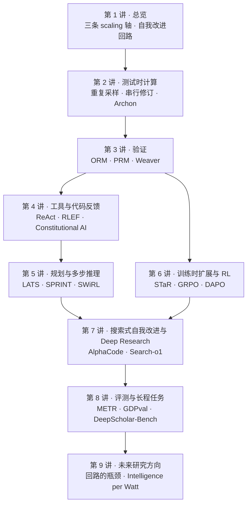

# CS329A 学习笔记

> Stanford CS329A: Self-Improving AI Agents（2025 秋）· 讲者 Aakanksha Chowdhery、Azalia Mirhoseini
> 非官方个人笔记，根据 YouTube 公开课视频的字幕整理 · [播放列表](https://www.youtube.com/watch?v=6YnLB0XbTnI&list=PLangBM27OtEA) · [课程主页与阅读清单](https://cs329a.stanford.edu)

**一句话**：整门课讲的是一个回路——让模型在推理时多花算力（采样、搜索、长思考、用工具），用验证器把好结果挑出来，再把这些结果训回模型；然后把同一套思路从"答题"推广到"完成任务"的 agent，并追问怎么评测它、下一步往哪走。

## 课程地图

*图 0-1｜九讲之间的依赖关系（自绘示意）：第 2、3 讲是"推理时多算 + 挑得出来"这对基本矛盾；往右一支把它用在带工具的多步任务上，往左一支把它训回模型；两支在第 7 讲汇合成能自己做研究、自己改进的 agent*

## 九讲索引

| 讲 | 主题 | 时长 | 视频 |
|---|---|---|---|
| [第 1 讲](#l1) | 课程总览：三条 scaling 轴、推理模型、从 LLM 到 agent | 1:09:42 | [YouTube](https://www.youtube.com/watch?v=6YnLB0XbTnI) |
| [第 2 讲](#l2) | 测试时计算扩展：重复采样的幂律、并行 vs 串行、Archon | 1:03:21 | [YouTube](https://www.youtube.com/watch?v=-Ggc37xLj_Y) |
| [第 3 讲](#l3) | 稳健的验证：ORM、PRM、Math-Shepherd、Weaver | 1:12:59 | [YouTube](https://www.youtube.com/watch?v=p7TdPUcPoik) |
| [第 4 讲](#l4) | 用工具与代码反馈来学习：ReAct、RLEF、Constitutional AI | 1:11:13 | [YouTube](https://www.youtube.com/watch?v=Lxh9RF5S-K0) |
| [第 5 讲](#l5) | 规划与多步推理：LATS 树搜索、SPRINT 并行推理、SWiRL 分步 RL | 1:14:56 | [YouTube](https://www.youtube.com/watch?v=Ml_fp9XkB8Y) |
| [第 6 讲](#l6) | 训练时扩展与 RL 的规模化：STaR、DeepSeekMath 与 GRPO、DAPO | 1:12:39 | [YouTube](https://www.youtube.com/watch?v=yVnmHSAy3ck) |
| [第 7 讲](#l7) | 搜索式自我改进与 Deep Research：AlphaCode、AlphaCode 2、Search-o1 | 1:12:27 | [YouTube](https://www.youtube.com/watch?v=Uni9dqyuuDM) |
| [第 8 讲](#l8) | 智能体评测与长程任务：METR time horizon、GDPval、DeepScholar-Bench | 1:15:18 | [YouTube](https://www.youtube.com/watch?v=8JAqLnTaZu4) |
| [第 9 讲](#l9) | 未来研究方向：回路的三处瓶颈（多样性、验证、出题）与 Intelligence per Watt | 1:07:42 | [YouTube](https://www.youtube.com/watch?v=AyO6wyu4DEg) |

## 怎么用这份笔记

- **每讲的结构是固定的**：一句话 → 时间轴 → 核心内容（带图）→ 关键图表速查 → 提到的工作 → 术语对照 → 字幕勘误 → 带走的问题。赶时间就只看"一句话"、图和"带走的问题"。
- **时间戳都能点**，直接跳到视频里对应的位置。图下面黄色的「▶ 看原幻灯片」会跳到老师讲那一页 PPT 的时刻。
- **图是我重新画的示意图**，用来解释机制，不是课件截图。课上的原图大多出自论文，图注和"关键图表速查"里给了论文链接。
- **想对照原文**：视频自带人工校对的英文 CC；在播放器「设置 → 字幕 → 自动翻译 → 中文（简体）」可以开中文字幕；登录 YouTube 后，描述区的「内容转文字」能看全文并点句跳转。
- **"小注"** 是我补充的课外事实或对口误的更正；**"应为 / 应出自"** 表示这是我根据内容推断的，老师没有明说。
- 字幕对人名、论文名、模型名的识别错误不少，每讲末尾的"字幕勘误"列了会影响理解的那些。

## YouTube 上没有放出来的课次

全课共 20 次，公开视频只有 9 讲。按课程主页的课表，未公开的包括：Melvin Johnson（Google DeepMind）讲后训练从聊天机器人到 agent 的演进；软件工程的 agentic 框架（CodeMonkeys、KernelBench）；Junchen Jiang 讲 agent 的记忆（Cartridges、MemGPT、CacheBlend）；Denny Zhou 讲 LLM 推理；Thang Luong 讲 AlphaProof、AlphaGeometry 与 Gemini 的 IMO 金牌；Misha Laskin（Reflection AI）讲自主 agent 系统；Danny Driess（Physical Intelligence）讲机器人里的多模态 agent；以及三次期中展示。这些课次的阅读清单在课程主页上都有链接。
