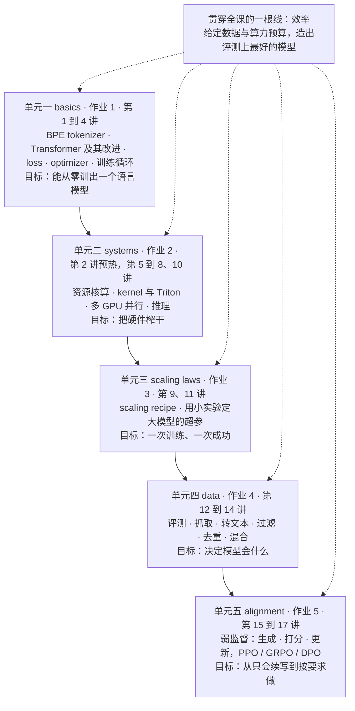
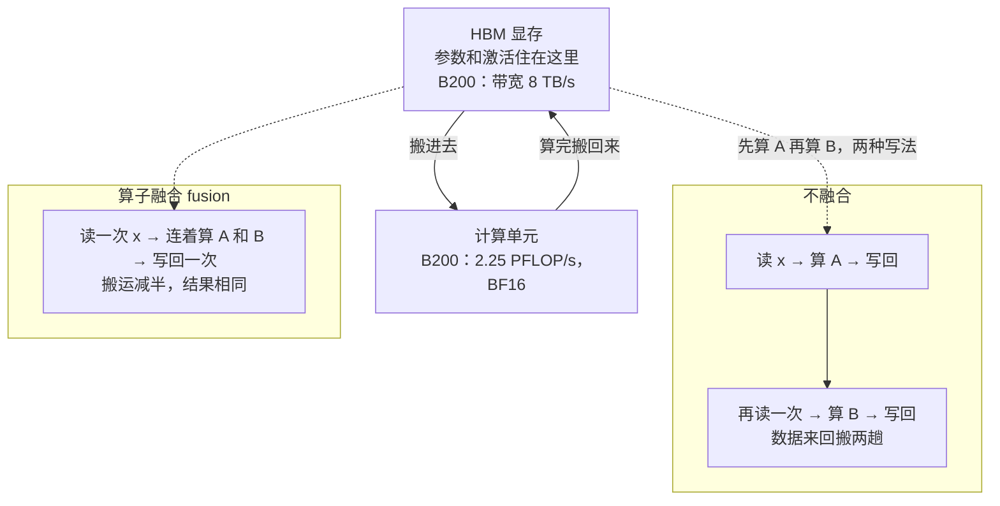
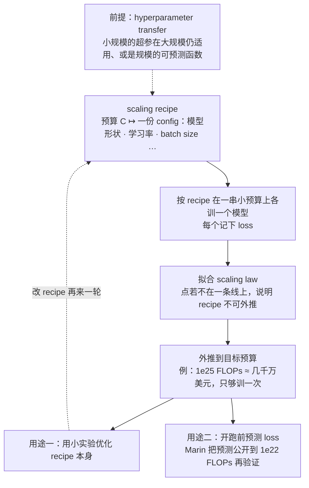
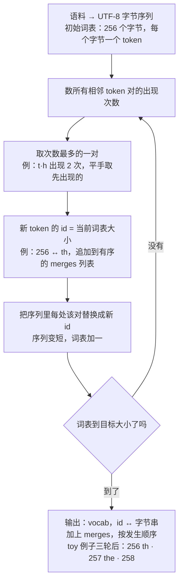
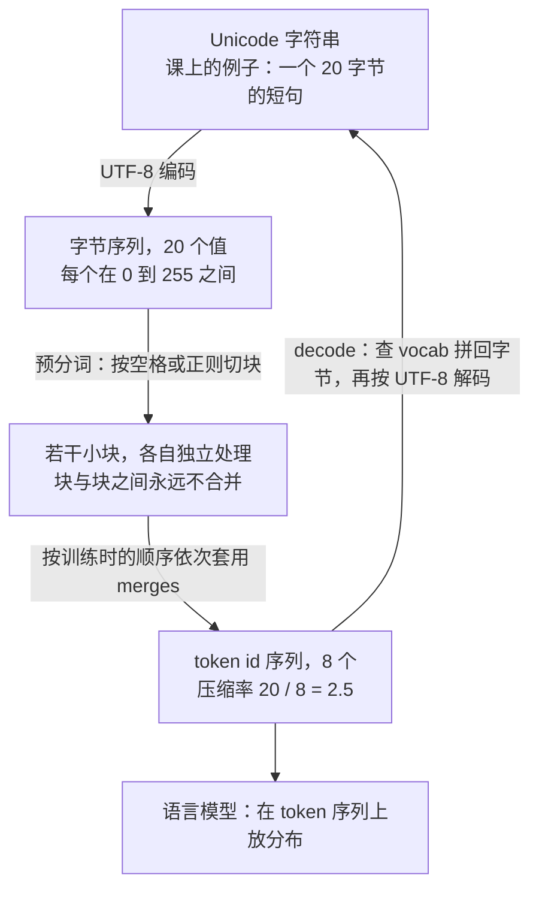

# CS336 第 1 讲｜概览与分词（Overview, Tokenization）

> Stanford CS336: Language Modeling from Scratch（2026 春，第三次开课；Percy Liang 与 Tatsunori Hashimoto 轮流授课）· 第 1 讲
> 视频：<https://www.youtube.com/watch?v=JuoVZkPBiKk>（1:19:22；英文字幕为自动生成，人名、项目名错得不少，见文末勘误）
> 讲者：Percy Liang（全程）· 开场两分钟由 Tatsunori Hashimoto 与三位 CA（Marcel、Herman、Steven）各自介绍
> 课程主页：<https://stanford-cs336.github.io/>（课上给的地址是 cs336.stanford.edu）· 分词部分的源头：[Sennrich et al., 2016](https://arxiv.org/abs/1508.07909)（BPE 进入 NLP）· [Radford et al., 2019](https://cdn.openai.com/better-language-models/language_models_are_unsupervised_multitask_learners.pdf)（GPT-2，第一个用 BPE 的语言模型）

**一句话**：这门课赌的是"只有亲手造过才算真懂"，可前沿模型已经工业化（一次训练一亿到十亿美元、细节不公开），而小规模实验并不代表大规模——MLP 的 FLOPs 占比从 44% 涨到 80%、涌现能力过了临界规模才出现——所以课程只承诺教能跨规模迁移的两样东西：机制（mechanics）和心法（mindset：效率是第一原则，accuracy = efficiency × resources），分 basics、systems、scaling laws、data、alignment 五个单元各配一次作业；第一个单元从分词起步：字符级、字节级、词级各有致命伤，BPE 靠"反复合并最频繁的相邻对"从数据里学出词表，把 20 个字节压成 8 个 token（压缩率 2.5），而任何想取代 tokenizer 的端到端方案都得保住"抽象"和"自适应计算"这两条性质。

## 时间轴

| 时间 | 内容 |
|---|---|
| [0:05](https://www.youtube.com/watch?v=JuoVZkPBiKk&t=5s) | 教学团队自我介绍；第三次开课；from scratch 哲学不变，今年多讲 MoE 与长上下文 |
| [3:09](https://www.youtube.com/watch?v=JuoVZkPBiKk&t=189s) | 为什么开这门课：研究者与底层技术脱节；抽象会漏；理解靠亲手造 |
| [4:42](https://www.youtube.com/watch?v=JuoVZkPBiKk&t=282s) | 工业化：GPT-4 一亿美元、如今十亿量级、细节不公开；小模型不代表前沿（MLP 占比 44% → 80%、涌现） |
| [7:18](https://www.youtube.com/watch?v=JuoVZkPBiKk&t=438s) | 三种知识：mechanics、mindset、intuitions——哪些能跨规模迁移；SwiGLU 论文的"神的恩泽" |
| [8:50](https://www.youtube.com/watch?v=JuoVZkPBiKk&t=530s) | bitter lesson 的正确读法；accuracy = efficiency × resources；ImageNet 算法效率 44 倍 |
| [11:21](https://www.youtube.com/watch?v=JuoVZkPBiKk&t=681s) | 简史：Shannon、n-gram、神经网络谱系、GPT 系与 scaling、复现潮、开放权重生态与 Marin |
| [17:31](https://www.youtube.com/watch?v=JuoVZkPBiKk&t=1051s) | "语言模型是什么"在变：微调 → prompt → 对话 → agent；基础没变；可执行讲义 |
| [20:04](https://www.youtube.com/watch?v=JuoVZkPBiKk&t=1204s) | 课务：5 学分、5 次作业、该不该选、单元测试代替脚手架、AI 使用政策、Modal 算力 |
| [27:17](https://www.youtube.com/watch?v=JuoVZkPBiKk&t=1637s) | 五个单元总览；单元一 basics：分词的效率视角、架构改进清单、训练决策清单；作业 1 |
| [34:31](https://www.youtube.com/watch?v=JuoVZkPBiKk&t=2071s) | 表达力 · 稳定性 · 效率的三角 |
| [36:01](https://www.youtube.com/watch?v=JuoVZkPBiKk&t=2161s) | 单元二 systems：6ND、B200 的 2.25 PFLOP/s 与 8 TB/s、kernel 与算子融合、多卡分片、推理两阶段；作业 2 |
| [45:15](https://www.youtube.com/watch?v=JuoVZkPBiKk&t=2715s) | 单元三 scaling laws：scaling recipe、可预测性、Chinchilla 的 20 倍、Marin 预注册；作业 3 |
| [53:28](https://www.youtube.com/watch?v=JuoVZkPBiKk&t=3208s) | 单元四 data：内部 / 外部评测、数据来源与法律、处理流水线、三个去处；作业 4 |
| [1:00:07](https://www.youtube.com/watch?v=JuoVZkPBiKk&t=3607s) | 单元五 alignment：弱监督、PPO / GRPO / DPO、RL 上规模的系统难题；效率视角串起五个单元 |
| [1:04:47](https://www.youtube.com/watch?v=JuoVZkPBiKk&t=3887s) | 分词入门：往返一致、空格与数字的怪癖、压缩率 20 / 8 = 2.5、词表 100k–200k |
| [1:08:19](https://www.youtube.com/watch?v=JuoVZkPBiKk&t=4099s) | 三个朴素方案：字符级 150k 词表、字节级压缩率 1、词级无界词表 |
| [1:11:51](https://www.youtube.com/watch?v=JuoVZkPBiKk&t=4311s) | BPE：来历、训练算法逐步演示（the cat in the hat）、编码与解码 |
| [1:15:58](https://www.youtube.com/watch?v=JuoVZkPBiKk&t=4558s) | 作业里怎么做快：只看相关 merge、特殊 token、预分词；小结；tokenizer-free 的两个条件；下讲预告 |

## 核心内容

### 1. 为什么还要"从头造"：三种知识，哪些能跨规模迁移

- **课程的来历**：两年前开课时的判断是，研究者正在与底层技术脱节。十年前每个 AI 研究者都自己实现、自己训模型；八年前是下载 BERT 这类预训练模型再微调；今天多数人靠 prompt 就能干活。prompt 没有错，抽象层级上移也是好事，但**抽象会漏**（leaky）：总会撞上模型做不到、又无从下手的情形。做基础研究时只在 prompt 这一层活动，等于把设计空间砍掉一大截，得能撕开整个栈。所以课程立场是：完整理解 = 亲手造出来。
- **一个麻烦：语言模型已经工业化**。GPT-4 三年前据传训练一次花 1 亿美元，现在的前沿模型大概是 10 亿量级（讲者自称是猜测）；各大实验室囤的 GPU 数量惊人；而且细节不公开——2023 年的 GPT-4 报告明说，出于竞争与安全考虑，不披露模型是怎么建的。
- **我们能造的是小模型，但小模型未必能代表前沿模型**。讲者给了两个证据：
    - 算力去哪了随规模而变：2021 年的一张图里，小模型的 FLOPs 只有约 44% 花在 MLP 层，到 175B 参数时涨到约 80%。在小规模上给 attention 做的优化，到大规模未必有同样收益。
    - 涌现（emergence）：早年的 zero-shot / few-shot 曲线在小模型上几乎贴地，过了某个临界规模才突然上升。小规模看不到某些现象。
- **那学什么才能迁移？** 讲者把知识分三类：
    - mechanics（机制）：Transformer 是什么、模型并行怎么工作。课上能教好，而且跨规模成立——并行和 kernel 为什么能提速，是"按构造"就能看出来的。
    - mindset（心法）：怎么榨干硬件、认真对待 scaling，凡事 profile 和 benchmark。课上能教好，也能迁移。
    - intuitions（直觉）：哪些建模和数据决策有效。未必跨规模迁移，得到有算力的地方去练。
- **关于直觉的一个注脚**：很多设计决策没有解释，纯靠实验。Shazeer 引入 SwiGLU 的那篇论文（第 3 讲会讲），结论里坦白地写道不提供任何解释，把这些架构的成功归于"神的恩泽"。

### 2. 效率是组织原则：bitter lesson 的正确读法

- **常见误读**：规模就是一切，算法不重要。**正确读法**：能随规模放大的算法才重要。讲者给的粗略等式：

$$
\text{accuracy} \;=\; \text{efficiency} \times \text{resources},\qquad \text{efficiency}=\frac{\text{output}}{\text{input}}
$$

accuracy 是模型最后有多好，resources 是投入的算力和数据，efficiency 是单位投入换来多少产出；两者相乘，缺一不可。

- **效率在大规模上反而更关键**：小实验跑慢一倍，等一等就好；上亿美元的训练里，5% 的改进都是大事。
- **实证**：OpenAI 2020 年的论文测得 ImageNet 上 2012–2019 年间算法效率提升 44 倍。硬件同期也大幅进步，两者相乘才是我们看到的飞跃。
- **于是全课的提问方式固定下来**：给定数据和算力预算，能造出的最好模型是什么？预训练里主要盯算力预算——假设数据比算力多；如果你数据受限、或者囤了一屋子 B200，那就是另一套算计。讲者在 [1:04:14](https://www.youtube.com/watch?v=JuoVZkPBiKk&t=3854s) 补了一句：明天我们可能就数据受限了，具体权衡会变，"想清楚你的方法效率如何"这个心法不变。

### 3. 语言模型简史，以及"语言模型是什么"在怎么变

- **前神经网络时代**：Shannon 在 50 年代就用语言模型测英语的熵；n-gram 模型长期是机器翻译和语音识别系统里保证输出流畅的一个部件。
- **神经网络谱系**（讲者点名的节点）：90 年代的 LSTM；Bengio 2003 年的第一个神经语言模型（其实是看短上下文的前馈网络）；seq2seq——大胆宣称整句可以压成一个向量；Adam；为机器翻译发明的 attention；同样为机器翻译发明的 Transformer；然后是 MoE、模型并行等 2010 年代的架构、系统与优化器工作。
- **2010 年代末**：ELMo、BERT 在大量文本上预训练、再在问答等下游任务上微调，效果大幅提升；Google 的一篇论文（应为 T5）预示了"prompt 进、回答出"的形态。
- **真正打开闸门的是 OpenAI 拥抱 scaling**：GPT（2018 年前后）→ GPT-2 → 靠 scaling laws 支撑训出比当时大 10 倍以上的 GPT-3，出现 in-context learning 这类涌现行为。Google 随后训了一个巨型模型（应为 PaLM），事后看训练不足；当时还未并入 Google 的 DeepMind 则搞清了 compute-optimal 的 scaling law（Chinchilla）。
- **复现潮**：GPT-3 是很多人的警钟。草根组织 EleutherAI 做了开放数据集和模型（算力少，模型不大）；Meta 的第一个 LLM 一看就是复现——也是 175B（应为 OPT），效果不好，硬件问题不断；还有 Hugging Face 的 BigScience（应为 BLOOM）。这一批都不算强。
- **最近三年生态巨变**：Meta 的 Llama 1 / 2 / 3 领头，Mistral 入局，然后是一整批中国模型——DeepSeek、Qwen，还有 ByteDance、Tencent 的（讲者说记不全）。开放权重模型已经逼近闭源模型，工业界大量使用。
- **更进一步的是"不只开权重"**：AI2、NVIDIA，以及讲者参与的 Marin 项目，连论文、代码、数据一起放出。讲者强调开放生态是这门课的前提：正是那些讲大 MoE、讲 RL 系统的论文，让我们能拼凑出前沿模型的做法——哪怕 Qwen 这类论文也缺关键细节（尤其数据配比），聊胜于无。
- **"语言模型是什么"十年里换了四次**：拿来微调的东西 → 拿来 prompt 的东西 → 能对话的东西（ChatGPT 时代）→ agent。讲者本想现场点开一条巨长的 agent trace（没网）：给一页文字，它就能完成相当复杂的编码任务，十年前没人敢想。
- **但基础没怎么变**：还是 GPU 和 kernel，还是（随机）梯度法，还是 Transformer 和 attention。变的是规格——上下文更长，推理效率更重要。所以这门课只改了两节，加进最新的中国模型架构。

### 4. 课务（几条）

- **讲义是"可执行的"**（[19:32](https://www.youtube.com/watch?v=JuoVZkPBiKk&t=1172s)）：每一讲就是一个 Python 程序渲染出的页面，讲到哪就执行到哪，可以单步看代码；讲义的层级就是函数调用的层级。
- 5 学分，5 次作业，强度出名：某条课评说第一次作业相当于 CS224N 的全部五次作业——讲者觉得夸张，但建议按保守估计安排时间。
- **该不该选**：想弄清东西怎么工作、想练研究和工程肌肉，选；这个季度要出研究成果、想学最热的新技术（本课不讲多模态、不深入 agent）、或者只想在某个应用上拿结果（先 prompt，再微调，最后才考虑预训练），别选。
- **作业哲学**：不给脚手架代码，但给单元测试——避免"交上去要么全对要么全错"的稀疏奖励。大部分能在笔记本上做完并验证正确性；集群（今年由 Modal 提供算力额度，走 API 而不是 SSH）用来跑真正的训练和 kernel benchmark。多数作业有 leaderboard：给定预算把 perplexity 压到最低。
- **AI 使用政策**（[25:13](https://www.youtube.com/watch?v=JuoVZkPBiKk&t=1513s)）：coding agent 已经能整份做完作业，但那样什么也学不到。课程提供一份 agents.md（等价于一段 prompt），要求把 AI 当"有教学意识的辅导"：答疑、讲代码可以，替你写 Transformer 不行。今年第一次试行，欢迎反馈。
- 讲课材料上网，SCPD 录像后发 YouTube；在家跟读的人得自己找动力做作业。

### 5. 课程地图：五个单元、五次作业



*图 1-1｜五个单元、五次作业，以及对应的讲次（自绘示意）· [▶ 看原幻灯片 27:17](https://www.youtube.com/watch?v=JuoVZkPBiKk&t=1637s)*

- 五个单元镜像五次作业，顺序是：先能训出来，再让它快，再让它大，再决定喂什么，最后让它听话。讲者用一个词把它们串起来：效率（第 11 节的表）。下面按单元记要点，每个单元后面的讲次会展开。

### 6. 单元一 basics：把一个语言模型从零训出来

- **目标**：头两周结束时能自己训出一个 LM。三件事：分词、定义架构、实现优化器和训练循环。
- **分词的效率视角**（第 12 节起细讲）：tokenizer 在原始字节和整数序列之间来回转换；BPE 把输入切成高频块。好处一是序列变短；更微妙也更重要的是**自适应计算**——一大段字节可能就该压成一个 token，而稀有、有信息量的部分该留成多个 token。讲者每年都盼着不用再教分词：端到端直接吃字节的方案（最近的 H-Net 看着有希望）还没在前沿规模上验证，前沿模型仍在用 tokenizer，所以还得教。
- **架构**：默认你在 CS224N 见过 Transformer，此后的改进才是重点（第 3 讲由 Tatsu 讲）：激活函数、位置编码、归一化放在哪才不炸、降低 n² 的 attention 开销（n 是序列长度；第 4 讲）、状态空间模型 / 线性 attention（Mamba、Gated DeltaNet）以及它们与 attention 的混合、MLP 换成 MoE（如今做算力高效 Transformer 的主流范式，训练方法也得跟着变）、以及看似无聊的形状问题——几层、几个头、隐层多宽、几个 expert——放到 scaling 语境下影响巨大。
- **训练**：loss（默认预测下一个 token；预测多个 token 被发现有帮助）、优化器（Adam 之外，Muon 越来越多，Kimi K2 等最新开放模型在用）、初始化（决定大模型训练稳不稳）、学习率 schedule、正则化、batch size、MoE 特有的设定。讲者的话：这些不是"多试几组"的超参，按原则设定它们，是"跑炸了"与"达到 SOTA"的分界，讲 scaling laws 时会回到这一点。
- **作业 1**：BPE tokenizer、Transformer、loss、优化器、整套训练栈；资源核算（FLOPs 花在哪）；在 TinyStories 和 OpenWebText 上训练；leaderboard 像 NanoGPT speedrun——给定预算，perplexity 压得越低越好。
- **讲者的总括**：tokenizer、模型、训练看似三块，其实都在平衡同一个三角——**表达力**（表示数据的复杂性）、**稳定性**（参数范数和梯度范数保持在"金发姑娘区"，不爆不消失；训 LM 很大一部分工作就是保稳）、**效率**（在硬件上跑得快；比如把某处投影到低维能提速，但效果还一样吗？做这种取舍就是这门课的日常）。

### 7. 单元二 systems：把硬件榨干



*图 1-2｜内存不在计算单元旁边：数据搬运常是瓶颈，算子融合省的就是这个（自绘示意）· [▶ 看原幻灯片 37:02](https://www.youtube.com/watch?v=JuoVZkPBiKk&t=2222s)*

- **资源核算**（第 2 讲开始）：追踪每一个 FLOP、每一个字节去了哪。会遇到这条公式：

$$
\text{FLOPs}_{\text{train}} \approx 6\,N\,D
$$

N 是参数量，D 是训练 token 数；讲者举的例子是"7B 模型训 1T token 要多少 FLOPs"，第 2 讲推导那个 6 从哪来。

> 小注：代进去是 6 × 7×10^9 × 10^12 ≈ 4.2×10^22 FLOPs；按下面 B200 的 2.25 PFLOP/s、利用率 100% 算，单卡要 1.9×10^7 秒 ≈ 216 天。这一步课上没算；第 2、5 讲会告诉你实际利用率为什么远低于 100%。

- **硬件的卡通图**（图 1-2）：内存不在计算单元旁边。参数或激活得从内存搬到计算单元、算完再搬回去，这一搬常常就是瓶颈。讲者报的 B200 数字：BF16 算力 2.25 PFLOP/s，内存带宽 8 TB/s。第 2 讲会用这两个数估各类算法要跑多久，并讲 roofline 分析——判断一段计算受限于算力还是内存（通常是内存），以及 benchmark 和 profile 的方法。
    - 术语：FLOPs 是浮点运算次数（计算量），FLOP/s 是每秒能做多少次（硬件速度）；HBM（high bandwidth memory）是 GPU 上那块大而相对慢的显存；带宽是每秒能搬多少字节。
  > 小注：roofline 的核心量是 arithmetic intensity（算术强度）= 每搬 1 字节能做多少次浮点运算。按讲者给的两个数，B200 的分界点是 2.25×10^15 ÷ 8×10^12 ≈ 281 FLOP/byte：一段计算每字节做不到这么多运算，就是内存受限。
- **拓扑**：一台 DGX B200 里 8 张 GPU 由 NVLink 相连；上千张 GPU 就是许多台这样的机器，用 InfiniBand 或以太网连起来。
- **kernel**：在 GPU 上跑的函数。你写的每个 PyTorch 算子背后都在启动某个内置 kernel——不管知不知道，你一直在用。对特定计算写自定义 kernel 能更快，原则只有一条：**组织计算以最小化数据搬运**。例子：先算 A 再算 B，朴素做法是读 HBM → 算 A → 写回 → 再读 → 算 B → 写回，数据来回搬两趟；**算子融合**（fusion）读一次、连着算完、写一次。tiling（分块）是同一思想的更精细版本——CME295 第 4 讲的 FlashAttention 就是它；本课第 5–6 讲会真的写 kernel。GPU 本身也越来越复杂，课上至少让你见识它的"怪脾气"。
- **上千张 GPU**（第 7–8 讲）：原则不变，只是跨 GPU 搬数据更贵。语言是经典的**集合通信**（collective operations）：gather、reduce、all-reduce 等。棋局是：参数、激活、梯度、优化器状态要**分片**（shard，切开分到多张卡），然后把对的数据送到对的节点去算、再写回。分片方式有好几种——切数据、切模型、切层、切序列、切 expert——各有取舍。
- **推理**（第 10 讲）：用模型的过程，不只是聊天——RL 的 rollout、test-time compute、合成数据、评测全靠它。两个阶段：**prefill** 把整段 prompt 一次前向、建好 key-value 对（很像训练）；**decode** 一次生成一个 token，很快就变成内存受限——这就是推理难的原因。提速手段：剪枝出更小的模型、量化、蒸馏、speculative decoding（小模型先往前猜一串 token，大模型并行验证，猜对就整串接受）、推理专用 kernel。服务场景还有调度问题：请求随机到达要凑 batch，训练里 batch 是预先定好的。讲者说这部分课时不够，是否让大家从零写推理引擎还在讨论。
    - 术语：prefill 阶段算出的每个 token 的 key、value 存下来供后续步骤复用，就是 KV cache；decode 每生成一个 token 都要把全部参数和 KV cache 从显存读一遍，而算的量很小，所以受限于带宽而不是算力。
- **作业 2**：用 Triton 写 kernel、做并行训练；细节可能因 CA 重做系统部分而变。推荐读物（[44:12](https://www.youtube.com/watch?v=JuoVZkPBiKk&t=2652s)）：Google 的《How to Scale Your Model》——roofline、Transformer 算术；以 TPU 为主，新加了 GPU 一章。

### 8. 单元三 scaling laws：一次训练、一次成功



*图 1-3｜scaling recipe 的工作方式：小实验替大实验说话（自绘示意）· [▶ 看原幻灯片 46:17](https://www.youtube.com/watch?v=JuoVZkPBiKk&t=2777s)*

- **情境**：手里有 1e25 FLOPs（几千万美元），训什么模型？只够训一个，没法像小规模那样调超参，搞砸就是真金白银打水漂。这是训大模型独有的难题，微调或小实验里没有。
- **概念转换**：别想"训一个模型"，想 **scaling recipe**——从算力预算到一套超参（一份 config 文件）的映射。有了 recipe，就在小预算上跑一串实验、拟合 scaling law、外推到目标预算：

$$
\text{recipe}:\; C \mapsto \theta(C),\qquad \hat{L}(C_{\text{target}}) \leftarrow \text{fit}\big(\{(C_i,\,L_i)\}_{C_i \ll C_{\text{target}}}\big)
$$

C 是 FLOPs 预算，θ(C) 是 recipe 在该预算下给出的整套超参，(C_i, L_i) 是各个小预算实验测到的 loss，L̂ 是对目标预算的预测——recipe 定了，小实验就能替大实验说话。

- **两个用途**：用小实验优化面向大规模的 recipe；开跑前预测能到的 loss（讲者的说法：拿着小实验的曲线去融资）。
- **第二个常见误解**：scaling law 不是自然律，不会自动出现，得靠精心构造 recipe 把它"逼出来"。recipe 必须能外推：规模增大时学习率是常数还是下降、batch size 涨多少，都得定。前提是 **hyperparameter transfer**——小规模用的超参在大规模仍适用、或是规模的可预测函数；如果学习率一会儿 1e-5 一会儿 1e-4，到了大规模就只能瞎猜。
- **由此的思维转换**：可预测性至少和最优性同样重要。
- **经典结果**：compute-optimal scaling（Kaplan et al. 与 Chinchilla；CME295 第 4 讲见过，本课第 9、11 讲深入）——对每个预算（课上的图从 6e18 到 3e21 FLOPs）扫模型大小、取最优，拟合"预算 → 参数量"的曲线；点若落在一条线上才有底气外推。经验法则：

$$
D_{\text{opt}} \approx 20\,N
$$

N 是参数量，D 是训练 token 数：70B 参数配约 1.4T token。数据和架构不同，这个数会变；而且它不算推理成本——现在很多模型故意做小、用远超 compute-optimal 的 token 数训，就是为了推理便宜。

- **Marin 项目的玩法：预注册**——先在若干预算上拟合，公开预测到 1e22 FLOPs 的 loss，再真训一个从没训过的规模看是否命中。课上那个正在跑，讲者说周三报结果。
- **作业 3**：课程提供一个"训练 API"——你交 config，它返回 loss（后台是离线训好的一批模型做缓存，看上去像在训练）；你拟合 scaling law、外推，最后给你一个预算，看你的模型落得准不准。模拟"手握 1 亿美元怎么花"的高压场景，只是没有真的赌注。

### 9. 单元四 data 与评测：决定模型会什么

- 训到这里还差一件事：训在什么上。数据质量基本决定模型多好；数据就是"你想让模型会什么"的具体化——多语言、对话、长程 agentic coding，都得先在数据里。
- **先讲评测**（第 12 讲），因为它定义你要的能力。讲者强调两类指标常被混为一谈，其实各司其职：
    - 内部指标，用于研发：要跨规模平滑（还是为了可预测），看相对值就够——perplexity 1.2 的绝对值没有意义。perplexity 至今仍是衡量模型内在质量的好办法，不怕 benchmaxing（冲榜）。评测数据最好是互联网上没有的，避免污染（contamination）。
    - 外部指标，报给客户或审稿人：讲究生态效度（ecological validity，测的东西像不像真实使用）。
    - 语言模型号称通用，评测就得多样；可以平均成一个数，但平均会把很多不同的东西搅在一起。
- **数据不会从天上掉下来**（第 13–14 讲）：网页要抓、书（如今有争议）、arXiv 论文、GitHub 代码……课上放的是 2021 年 The Pile 的组成图。法律问题真实存在：用版权数据训练算不算合理使用，要不要买授权；大量 GitHub 代码没有 license，是当作宽松许可还是保守处理？
- **数据甚至不是文本**：HTML、PDF、代码目录，得先处理。流水线：转换（非文本 → 文本）、过滤（Common Crawl 里随机一篇往往极差）、去重、多源混合，以及近来火热的合成数据（把真实数据改写成更像下游任务、或更像 Wikipedia 的样子）。
- **数据的三个去处**：预训练；mid-training——预训练末尾放的高质量数据，包括长上下文数据（大代码库、整本书）；post-training——对话、带工具调用的 agentic trace（做 agent 的人应该盯紧这一条）。
- **作业 4**：从原始网页抓取开始，过滤、去重、清洗。讲者称之为"脏活"，但从零造模型就得有全部体验。

### 10. 单元五 alignment：从全监督到弱监督

- 到此为止全是全监督（预测下一个或后几个 token），模型应该已经不错。再往上要靠**弱监督**：批评比生成容易——不一定能写出"这个 prompt 的正确回答"，但可以说清"什么样算好"。
- **模板**：从模型采样回答 → 打分（人、verifier、LM judge）→ 更新模型使其偏好更好的回答。实例化为各种 RL 算法（PPO、GRPO），或者偏好数据上更简单的 DPO（CS224R 推导过；本课第 15–17 讲）。
- **难处**：RL 不稳、难调（讲者：在座有人应该有切身体会）。他个人偏好是能全监督就全监督，实在不行再上 RL。
- **今年希望讲到的**：RL 上规模是系统问题——推理服务器负责生成 rollout（尤其是对着要执行代码的环境），训练服务器负责更新；worker 一慢就滑向 off-policy，要在 on-policy 程度和吞吐之间不停折中。讲者称之为"一团美妙的乱麻"。
- **作业 5** 未定；去年是实现 DPO 和 GRPO 并在数学 benchmark 上跑通，今年想往更真实的方向推。

### 11. 效率视角：五个单元各自省的是什么

讲者在 [1:02:39](https://www.youtube.com/watch?v=JuoVZkPBiKk&t=3759s) 把资源列成一张清单——数据、算力核心、内存、通信带宽——问题只有一个：给定这些，按某个评测造出最好的模型。效率可以是数据效率，也可以是算力效率，五个单元的设计决策都能从这个角度看：

| 单元 | 效率对准的是什么 | 展开的讲次 |
|---|---|---|
| systems | 直接就是算力效率：kernel、并行、推理 | 第 5–8、10 讲 |
| tokenization | 算力效率：以今天的架构，直接吃原始字节太长、太贵 | 本讲 |
| architecture | 多数改动是为了少用显存或少算 FLOPs，很多受"推理要快"驱动 | 第 3–4 讲 |
| data filtering | 算力预算固定时，花在冗余坏数据上的梯度更新，就是从好数据那里抢来的 | 第 13–14 讲 |
| scaling laws | 本质是在小得多的模型上做有效的超参调优 | 第 9、11 讲 |

### 12. 分词：问题定义、怪癖与压缩率

- **起点**：原始文本是 Unicode 字符串；语言模型是在 token 序列（整数索引）上放的分布。tokenizer 就是一对过程：encode 把字符串变成 token，decode 变回去，而且必须往返一致：

$$
\text{decode}(\text{encode}(s)) = s
$$

s 是任意输入字符串；实现的 tokenizer 若不满足这条，就是有 bug。

- CME295 第 1 讲已经见过 BPE 的概念；这里往下走一层：算法本身、压缩率怎么算、工程上怎么做快。讲者推荐 Karpathy 的分词视频。
- **现成 tokenizer 的两个怪癖**（讲者说这就是大家想除掉 tokenizer 的原因）：
    - 词和"空格 + 词"是两个毫不相干的 token：hello 和带前导空格的 hello 索引完全不同。很多 token 都是带前导空格的词——能用，但别扭。
    - 数字：有的 tokenizer 每几位一个 token，切法有时可预测有时不；有的每一位一个 token，可预测但 token 数暴涨。取舍。
- **压缩率**的定义：

$$
\text{compression ratio} = \frac{\#\,\text{bytes}}{\#\,\text{tokens}}
$$

分子是字符串的 UTF-8 字节数，分母是 token 数，单位是"字节每 token"；课上用 GPT-5 的 tokenizer 编码一个 20 字节的字符串得到 8 个 token，压缩率 20 / 8 = 2.5。

- 压缩率越大，序列越短——attention 是二次的，序列短就是钱。加大词表能提高压缩率，但词表里每个元素彼此独立，词表越大越稀疏（每个 token 见到的次数越少）。现在的 tokenizer，尤其多语言的，词表在 100k–200k 之间。

### 13. 三个朴素方案，各有致命伤

| 方案 | 词表大小 | 压缩率（字节 / token） | 讲者指出的问题 |
|---|---|---|---|
| 字符级：一个 Unicode 字符一个 token | 约 150k | 一般 | 大量字符极少出现，词表用得不划算 |
| 字节级：UTF-8 的一个字节一个 token | 256 | 恰好 1 | 序列太长 |
| 词级：按空格或正则切块 | 训练集里不同块的数量，实际无界 | 好 | 没见过的词只能给 UNK；搞乱 perplexity |
| BPE：合并高频相邻对 | 自选，今天常见 100k–200k | 课上例子 2.5 | 见第 14–15 节的工程问题 |

- **字符级**：Unicode 字符串本来就是字符序列，每个字符对应一个整数（Python 的 ord），直接当 token。约 150k 个 Unicode 字符，词表就是 150k——不算离谱，但大量字符极少出现，词表用得很不划算，压缩率也一般。
- **字节级**：Unicode 有 UTF-8 编码——a 是 1 个字节，有的字符是好几个字节。序列变长，但每个值都在 0–255 之间，词表只有 256。压缩率恰好是 1：序列太长。
  > 小注：UTF-8 是变长编码：ASCII 1 字节，多数汉字 3 字节，emoji 4 字节；"字符"（code point）与"字节"不是一回事，所以字节级序列比字符级更长。Unicode 16.0 定义了约 15.5 万个字符，和课上说的 150k 对得上。
- **词级**：NLP 的老做法——按空格或正则切块，每块一个 token。好处是每个 token 有稳定语义（词是人发明的）；坏处是词表 = 训练数据里不同块的数量，很大，而且实际上无界：测试时来一个没见过的词只能给 UNK，很丑，还会搞乱 perplexity 的计算。
- 两个很糟、一个半糟。BPE 要同时做到：词表大小可控、压缩率好、任何输入都能编码。

### 14. BPE：从数据里学出词表



*图 1-4｜BPE 训练循环：每轮合并最频繁的相邻对（自绘示意）· [▶ 看原幻灯片 1:13:23](https://www.youtube.com/watch?v=JuoVZkPBiKk&t=4403s) · 出处：[Sennrich et al., 2016](https://arxiv.org/abs/1508.07909)*

- **来历**：BPE 很早就是数据压缩算法（应为 Gage, 1994），远早于语言模型；Sennrich 等人 2016 年把它引入 NLP 做神经机器翻译；第一个用 BPE 的语言模型是 GPT-2。
- **思想**：在原始文本上**训练** tokenizer，构造一份为这批数据量身定做的词表；同时保证任何东西都能被编码——稀有的就拆成更小的单元，而不是 UNK。常见序列一个 token，稀有序列多个 token。
- **算法**（图 1-4）：语料视为一条长序列 → 转成字节，每个字节初始是一个 token（词表 256）→ 反复：数相邻 token 对的频次，取最频繁的一对，合并成一个新 token（id 从 256 起），把序列里所有该对替换掉。序列越来越短，词表越来越大，停在目标词表大小。
- **课上的 toy 例子** "the cat in the hat"：字节序列里 (116, 104) 即 t·h 出现 2 次（有并列，取第一个）→ 新 token 256 代表 th，两处替换；下一轮 (256, 101) 即 th·e 合并成 257；再合并一次得到 258。三轮之后压缩率 1.5。

```python
def train_bpe(text: bytes, num_merges: int):
    ids = list(text)                                  # 每个字节一个 token，id 0–255
    vocab = {i: bytes([i]) for i in range(256)}
    merges = []                                       # 有序：编码时按同样顺序套用
    for _ in range(num_merges):
        counts = Counter(zip(ids, ids[1:]))           # 相邻对计数
        pair = max(counts, key=counts.get)            # 最频繁的一对（平手取先出现的）
        new_id = len(vocab)                           # 256, 257, ...
        vocab[new_id] = vocab[pair[0]] + vocab[pair[1]]
        merges.append((pair, new_id))
        ids = replace_pair(ids, pair, new_id)         # 全序列替换，序列变短
    return vocab, merges
```

训练循环的骨架：每轮一次全序列计数、一次全序列替换，这也正是它慢的原因（作业要优化的就是这两步）。

- merges 列表是有序的，编码时要按同样顺序套用；merge 的次数就是词表大小减去 256。
  > 小注：GPT-2 的词表 50,257 = 256 个字节 + 50,000 次 merge + 1 个特殊 token，正好对上这个算式。

### 15. 编码、解码，与作业里怎么把它做快



*图 1-5｜一个字符串怎么变成 token、又怎么变回来（自绘示意）· [▶ 看原幻灯片 1:15:28](https://www.youtube.com/watch?v=JuoVZkPBiKk&t=4528s)*

- **编码新文本**：概念上就是把训练时记下的 merges 按顺序在新字符串上过一遍；解码把每个 id 查回字节串、拼起来、按 UTF-8 解出字符串。课上 "the quick brown fox" 往返无损。

```python
def encode(s: str, merges, pretokenize) -> list[int]:
    out = []
    for chunk in pretokenize(s):                  # 先切块：块内才做合并
        ids = list(chunk.encode("utf-8"))
        for pair, new_id in merges:               # 严格按训练顺序
            ids = replace_pair(ids, pair, new_id)
        out += ids
    return out

def decode(ids: list[int], vocab) -> str:
    return b"".join(vocab[i] for i in ids).decode("utf-8", errors="replace")
```

朴素的 encode 对每一块都遍历全部 merges，这正是讲者说的慢点；decode 只是查表拼接。

- **课上这份实现是完整的 BPE，但极慢**。作业 1 的任务就是加速，讲者给的方向：
    - encode 目前遍历全部 merges（约等于词表大小减 256），绝大多数用不上；只碰"可能出现在这段文本里"的 merge，得建索引。
    - 特殊 token（如文档分隔符）：概念不深，但现代 tokenizer 必须处理。
    - **预分词**（pre-tokenization）：课上为简化把整个字符串当一段来处理；实际是先把文本切成块，对每块独立分词，快得多。
    - 到某一步你会发现 Python 本身就慢——想用 Rust 或 C 重写，随意。
  > 小注：预分词也是建模假设：块与块之间永远不会合并，所以词表里不会出现跨空格的 token；GPT-2 用一条正则把文本切成"空格 + 字母串"、数字串、标点等块。这就是第 12 节"带前导空格的词是独立 token"的来源。

### 16. 小结：tokenizer-free 的方案要接班，得满足什么

- **总结**：tokenizer 在字符串和 token 之间转换；字符级、字节级、词级各以各的方式次优；BPE 是数据驱动的有效启发式。
- **讲者的预告**：也许明年就不用教了。但无论什么方案取代 tokenizer，都得保留两个性质：
    1. **抽象**：Transformer 得在序列的某种抽象之上工作。看视频或 DNA 序列最明显——单个字节 / 单元信噪比极低，必须先"抬"到一个能建模的层次。
    2. **自适应计算**：块的大小必须可变，不是所有字节都值得同样的算力；做不到这一点就是次优。
- **下一讲**（周三）：资源核算，讲者称之为"婴儿版系统课"；之后回到架构。

## 关键图表速查（点时间戳跳到原幻灯片）

| 图 | 看什么 | 跳转 | 出处 |
|---|---|---|---|
| MLP 的 FLOPs 占比随规模变化 | 横轴模型大小；MLP 份额从约 44% 升到 175B 时的约 80%，attention 份额相应缩小 | [6:00](https://www.youtube.com/watch?v=JuoVZkPBiKk&t=360s) | —（讲者说是 2021 年的图） |
| 涌现曲线 | zero / few-shot 准确率在临界规模之前贴地，之后陡升 | [6:30](https://www.youtube.com/watch?v=JuoVZkPBiKk&t=390s) | [Wei et al., 2022](https://arxiv.org/abs/2206.07682)（应为） |
| SwiGLU 论文的结论段 | 最后一句：不提供解释，归于神的恩泽 | [8:50](https://www.youtube.com/watch?v=JuoVZkPBiKk&t=530s) | [Shazeer, 2020](https://arxiv.org/abs/2002.05202) |
| ImageNet 算法效率 | 2012–2019 达到同一精度所需算力降 44 倍 | [10:21](https://www.youtube.com/watch?v=JuoVZkPBiKk&t=621s) | [Hernandez & Brown, 2020](https://arxiv.org/abs/2005.04305) |
| 开放模型生态 | Llama、Mistral、DeepSeek、Qwen 一栏；再看 AI2 / NVIDIA / Marin"连数据一起开" | [15:27](https://www.youtube.com/watch?v=JuoVZkPBiKk&t=927s) | — |
| 可执行讲义 | 讲义就是 Python 程序：单步执行、函数层级 | [19:32](https://www.youtube.com/watch?v=JuoVZkPBiKk&t=1172s) | — |
| 硬件卡通图 | 内存与计算单元分离；B200 的 2.25 PFLOP/s 与 8 TB/s 两个数 | [37:02](https://www.youtube.com/watch?v=JuoVZkPBiKk&t=2222s) | — |
| 算子融合示意 | 不融合来回搬两趟 vs 融合读一次写一次 | [39:05](https://www.youtube.com/watch?v=JuoVZkPBiKk&t=2345s) | — |
| prefill / decode | 两个阶段；decode 一步一个 token、内存受限 | [42:38](https://www.youtube.com/watch?v=JuoVZkPBiKk&t=2558s) | — |
| Chinchilla 曲线 | 每种预算一条曲线取最低点；最低点连成线才可外推；预算 6e18 到 3e21 | [49:54](https://www.youtube.com/watch?v=JuoVZkPBiKk&t=2994s) | [Hoffmann et al., 2022](https://arxiv.org/abs/2203.15556) |
| Marin 预注册 | 多预算拟合后外推到 1e22 FLOPs 的预测点 | [50:57](https://www.youtube.com/watch?v=JuoVZkPBiKk&t=3057s) | [Marin](https://marin.community) |
| The Pile 数据组成 | 2021 年语言模型数据集的多样性：网页、书、论文、代码 | [57:03](https://www.youtube.com/watch?v=JuoVZkPBiKk&t=3423s) | [Gao et al., 2021](https://arxiv.org/abs/2101.00027) |
| tokenizer 示例 | 20 字节、8 个 token、压缩率 2.5；hello 与带空格的 hello 索引不同 | [1:06:49](https://www.youtube.com/watch?v=JuoVZkPBiKk&t=4009s) | — |
| BPE 逐步演示 | 116·104 计数为 2 → 新 token 256 → 序列替换 → 257、258 | [1:13:23](https://www.youtube.com/watch?v=JuoVZkPBiKk&t=4403s) | — |

## 提到的工作

| 名称 | 在本讲里的作用 |
|---|---|
| [GPT-4 技术报告](https://arxiv.org/abs/2303.08774)（OpenAI, 2023） | "出于竞争与安全考虑不披露细节"的出处；训练成本据传 1 亿美元 |
| 2021 年的 MLP / attention FLOPs 占比图 | 小规模 44%、175B 时 80%：小模型不代表大模型的证据一（讲者未报出处） |
| [Emergent Abilities](https://arxiv.org/abs/2206.07682)（Wei et al., 2022） | 涌现曲线：证据二（应为这篇） |
| [GLU Variants Improve Transformer](https://arxiv.org/abs/2002.05202)（Shazeer, 2020） | SwiGLU 的来源；结论里"归于神的恩泽"，说明直觉靠实验 |
| [The Bitter Lesson](http://www.incompleteideas.net/IncIdeas/BitterLesson.html)（Sutton, 2019） | 常被误读；正解是"能 scale 的算法才重要" |
| [Measuring the Algorithmic Efficiency of Neural Networks](https://arxiv.org/abs/2005.04305)（Hernandez & Brown, 2020） | ImageNet 2012–2019 算法效率 44 倍 |
| Shannon（1950 年代）· n-gram 模型 | 前神经网络时代：测英语的熵；MT 与语音识别的部件 |
| [Bengio et al., 2003](https://www.jmlr.org/papers/v3/bengio03a.html) | 第一个神经语言模型（前馈网络、短上下文） |
| LSTM · [seq2seq](https://arxiv.org/abs/1409.3215) · [Adam](https://arxiv.org/abs/1412.6980) · [attention](https://arxiv.org/abs/1409.0473) · [Transformer](https://arxiv.org/abs/1706.03762) · [MoE](https://arxiv.org/abs/1701.06538) | 神经语言模型谱系上的节点（讲者逐个点名） |
| [ELMo](https://arxiv.org/abs/1802.05365) · [BERT](https://arxiv.org/abs/1810.04805) | "预训练 + 微调"时代 |
| [T5](https://arxiv.org/abs/1910.10683)（推断） | Google 那篇"预示 prompt 进、回答出"的论文 |
| GPT · GPT-2 · [GPT-3](https://arxiv.org/abs/2005.14165) | OpenAI 拥抱 scaling：GPT-3 比当时大 10 倍以上，涌现出 in-context learning |
| [PaLM](https://arxiv.org/abs/2204.02311)（应为）· [Chinchilla](https://arxiv.org/abs/2203.15556) | Google 训练不足的巨型模型；DeepMind 的 compute-optimal scaling law |
| EleutherAI · [OPT](https://arxiv.org/abs/2205.01068)（应为）· [BLOOM](https://arxiv.org/abs/2211.05100)（应为） | GPT-3 之后的早期复现：草根开放数据集与模型；Meta 的 175B；BigScience |
| Llama 1 / 2 / 3 · Mistral · DeepSeek · Qwen · ByteDance · Tencent | 近三年的开放权重生态，逼近闭源模型 |
| [OLMo](https://arxiv.org/abs/2402.00838)（AI2）· NVIDIA · [Marin](https://marin.community) | 连论文、代码、数据一起开放；Marin 是讲者参与的项目，还做 scaling law 预注册 |
| [H-Net](https://arxiv.org/abs/2507.07955)（Hwang, Wang & Gu, 2025） | 端到端吃字节、动态分块的 tokenizer-free 尝试，尚未在前沿规模验证 |
| [Mamba](https://arxiv.org/abs/2312.00752) · [Gated DeltaNet](https://arxiv.org/abs/2412.06464) | 状态空间模型 / 线性 attention；常与 attention 混合使用 |
| 多 token 预测（应为 [Gloeckle et al., 2024](https://arxiv.org/abs/2404.19737)） | 比预测下一个 token 更有帮助的 loss 变体 |
| [Muon](https://kellerjordan.github.io/posts/muon/) · [Kimi K2](https://arxiv.org/abs/2507.20534) | Adam 之外越来越常用的优化器；Kimi K2 等最新开放模型在用 |
| [TinyStories](https://arxiv.org/abs/2305.07759) · OpenWebText · NanoGPT speedrun | 作业 1 的训练集与 leaderboard 的原型 |
| NVIDIA B200 · DGX B200 · NVLink · InfiniBand | 2.25 PFLOP/s、8 TB/s；8 卡一机；千卡互联 |
| [Triton](https://github.com/triton-lang/triton) | 作业 2 写 kernel 的语言 |
| [How to Scale Your Model](https://jax-ml.github.io/scaling-book/)（Google, 2025） | 推荐读物：roofline、Transformer 算术；TPU 为主，新增 GPU 章 |
| [Kaplan et al., 2020](https://arxiv.org/abs/2001.08361) | compute-optimal scaling 的经典之一 |
| [The Pile](https://arxiv.org/abs/2101.00027)（Gao et al., 2021） | 数据来源多样性的示例图 |
| Common Crawl | 随机一篇往往极差：过滤的必要性 |
| [PPO](https://arxiv.org/abs/1707.06347) · [GRPO](https://arxiv.org/abs/2402.03300) · [DPO](https://arxiv.org/abs/2305.18290) | 弱监督模板的三种实例化 |
| [Modal](https://modal.com) | 今年提供算力额度的平台，走 API 不走 SSH |
| CS224N | 假定你在那里见过 Transformer；一条课评说作业 1 相当于它的五次作业 |
| [Karpathy 的分词视频](https://www.youtube.com/watch?v=zduSFxRajkE) | 推荐观看 |
| GPT-5 的 tokenizer | 压缩率示例：20 字节 → 8 个 token |
| BPE（应为 Gage, 1994） | 原本是数据压缩算法 |
| [Sennrich et al., 2016](https://arxiv.org/abs/1508.07909) | BPE 进入 NLP：神经机器翻译 |
| [GPT-2](https://cdn.openai.com/better-language-models/language_models_are_unsupervised_multitask_learners.pdf)（Radford et al., 2019） | 第一个用 BPE 的语言模型 |

## 术语对照

| English | 中文 |
|---|---|
| from scratch | 从零开始：自己实现每一个部件 |
| leaky abstraction | 会漏的抽象：上层接口挡不住底层细节 |
| mechanics / mindset / intuitions | 机制 / 心法 / 直觉：三类知识，前两类跨规模迁移 |
| emergence | 涌现：过了临界规模才出现的能力 |
| the bitter lesson | 苦涩的教训：正解是"能 scale 的算法才重要" |
| efficiency | 效率：产出除以投入 |
| executable lecture | 可执行讲义：讲义本身是一个 Python 程序 |
| scaffolding code | 脚手架代码：作业不提供 |
| sparse reward | 稀疏奖励：这里指作业只有全对或全错的反馈 |
| leaderboard | 排行榜：给定预算比 perplexity |
| tokenizer / token / vocabulary | 分词器 / 词元 / 词表 |
| adaptive computation | 自适应计算：不同片段分到不同数量的 token |
| resource accounting | 资源核算：追踪每个 FLOP 和字节的去向 |
| FLOPs / FLOP/s | 浮点运算次数 / 每秒浮点运算次数 |
| HBM (high bandwidth memory) | 高带宽显存：GPU 上大而相对慢的那块内存 |
| memory bandwidth | 内存带宽：每秒能搬多少字节 |
| roofline analysis | 屋顶线分析：判断计算受限于算力还是内存 |
| arithmetic intensity | 算术强度：每搬 1 字节做多少次浮点运算 |
| compute-bound / memory-bound | 算力受限 / 内存受限 |
| kernel | 核函数：在 GPU 上运行的函数 |
| operator fusion | 算子融合：读一次、连着算、写一次 |
| tiling | 分块 |
| collective operations (gather / reduce / all-reduce) | 集合通信：多卡之间收集 / 归约 / 全归约 |
| sharding | 分片：把参数、激活、梯度、优化器状态切开分到多卡 |
| data / model / pipeline / sequence / expert parallelism | 切数据 / 切模型 / 切层 / 切序列 / 切 expert 的并行 |
| prefill / decode | 预填充（整段 prompt 一次前向）/ 解码（一次一个 token） |
| KV cache | 键值缓存：prefill 算出的 key、value 存下来复用 |
| speculative decoding | 投机解码：小模型先猜，大模型并行验证 |
| pruning / quantization / distillation | 剪枝 / 量化 / 蒸馏 |
| batching | 凑批：把随机到达的请求合并处理 |
| scaling recipe | 规模配方：从算力预算到整套超参的映射 |
| hyperparameter transfer | 超参迁移：小规模的超参在大规模仍适用或可预测 |
| compute-optimal | 算力最优：预算固定时参数量与 token 数的最佳配比 |
| pre-registration | 预注册：先公开预测，再跑实验验证 |
| perplexity | 困惑度：内部评测的主力指标 |
| benchmaxing | 冲榜：专为 benchmark 分数优化 |
| contamination | 污染：评测数据混进了训练数据 |
| ecological validity | 生态效度：评测像不像真实使用 |
| deduplication / data mixture | 去重 / 数据配比 |
| synthetic data | 合成数据 |
| mid-training / post-training | 中期训练 / 后训练 |
| weak supervision | 弱监督：不给正确答案，只给"什么算好"的信号 |
| verifier / LM judge | 验证器 / 模型裁判 |
| rollout / on-policy / off-policy | 采样轨迹 / 同策略 / 异策略 |
| Unicode / code point | 统一码 / 码位：每个字符对应的整数 |
| UTF-8 | Unicode 的变长字节编码：一个字符 1–4 字节 |
| byte | 字节：0–255 的整数 |
| compression ratio | 压缩率：字节数除以 token 数 |
| round trip | 往返一致：编码再解码得回原串 |
| UNK token | 未知词标记 |
| BPE (byte pair encoding) | 字节对编码 |
| merge | 合并：把一对相邻 token 换成一个新 token；也指记录下来的那条规则 |
| pre-tokenization | 预分词：先把文本切成块，块内再做 BPE |
| special tokens | 特殊 token：如文档分隔符 |
| Goldilocks zone | 金发姑娘区：参数与梯度范数不爆不消失的区间 |

## 字幕勘误

"CS 33336" → CS336；"Tatsus" → Tatsu（Tatsunori Hashimoto）；"Luther" → EleutherAI；"Moraine / Marine project" → Marin；"Kimmy K2" → Kimi K2；"H net" → H-Net；"Joshua Bengio" → Yoshua Bengio；"seek-to-seek" → seq2seq；"cgoe" → SCPD；"Deep Seek" → DeepSeek；"MOEs" → MoEs；"NV link" → NVLink；"beta sets" → datasets；"computer optimal" → compute-optimal；"the computer is being spent" → compute；"genetic traces" → agentic traces；"verify or LM judge" → verifier or LM judge；"archive papers" → arXiv papers；"called from the internet" → crawled；"ecologically validity" → ecological validity；"bench maxing" → benchmaxing；"ORD" → ord；"Claude code" → Claude Code；"modal" → Modal；"unk token" → UNK token；"conglomerate with its preceding space" → concatenated with its preceding space；"sent sequence" → sequence。

## 带走的问题

1. 用讲者的三分法给自己的经验分类：你在小规模上验证过的哪条结论属于 intuition（可能不迁移）、哪条属于 mechanics？MLP 的 FLOPs 占比从 44% 到 80%，意味着小规模上对 attention 的优化到大规模会怎样？
2. 按 6ND 算 7B × 1T 的 FLOPs，再除以 B200 的 2.25 PFLOP/s，得到单卡多少天？这假设了 100% 利用率——第 2、5 讲的 roofline 会告诉你，为什么真实利用率取决于每字节能做多少次运算。
3. 压缩率越大越好吗？把词表从 200k 加到 1M，哪些成本上升（embedding 矩阵、输出 softmax、低频 token 训练不足）？"每位数字一个 token"和"每几位一个 token"各自对算术能力意味着什么？
4. 预分词让块与块之间永远不合并——这为什么既是加速手段又是建模假设？对没有空格的中文、对靠缩进表达结构的代码，会带来什么后果？
5. tokenizer-free 的两个必要条件（抽象、自适应计算），H-Net 这类动态分块方案是怎么满足的？如果模型直接看字节，序列长了几倍，attention 的 n² 代价怎么办（联系第 4 讲的 attention 替代方案）？
