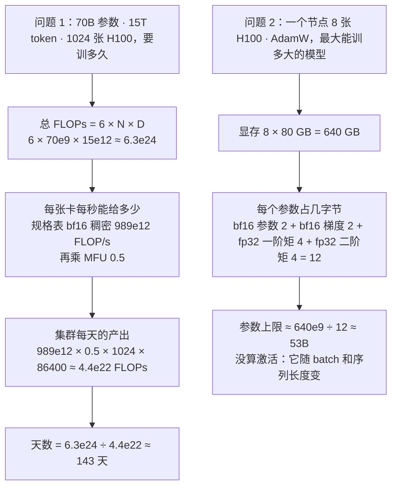
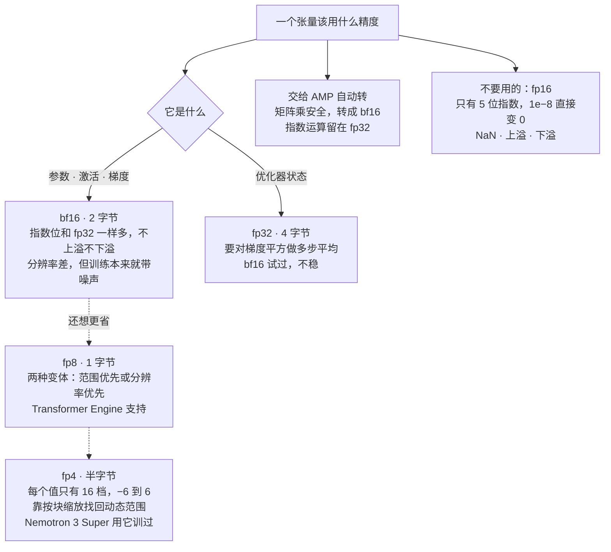
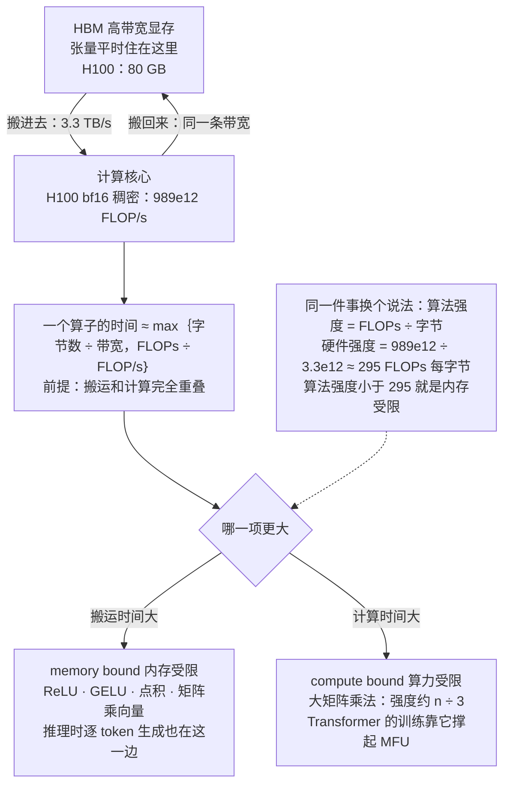
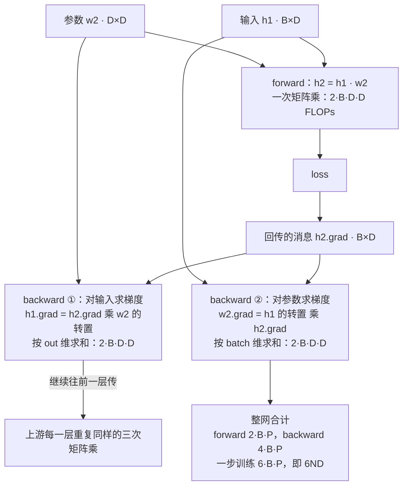
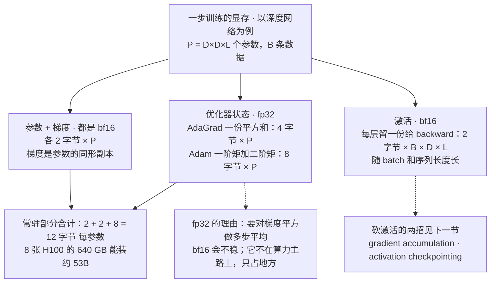
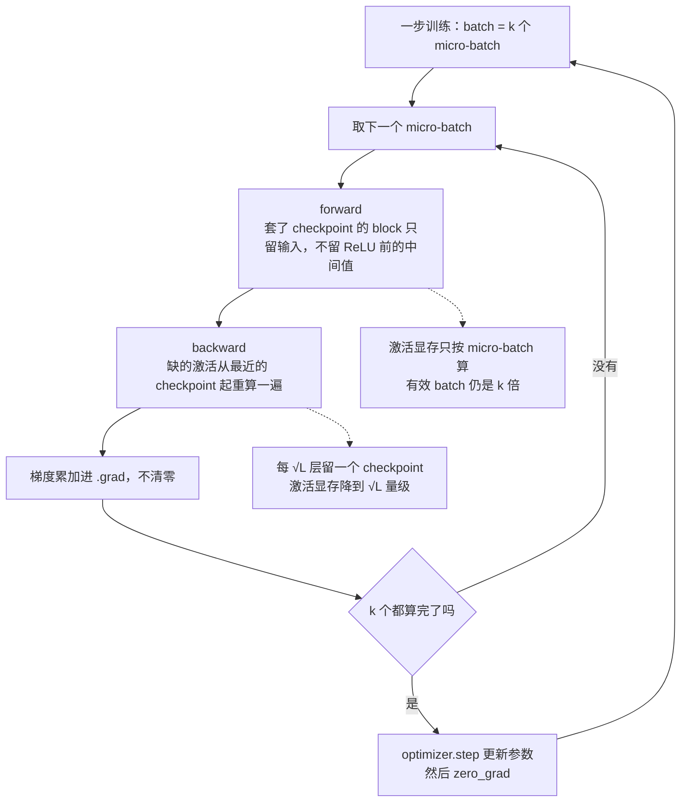

# CS336 第 2 讲｜PyTorch 与资源核算（PyTorch, einops）

> Stanford CS336: Language Modeling from Scratch（2026 春）· 第 2 讲
> 视频：<https://www.youtube.com/watch?v=kuYAsz7zspQ>（1:17:25；英文字幕是人工上传的 CC 轨，不是自动生成，专名基本准确，少数数字和口误见文末勘误）
> 讲者：Percy Liang（全程一人；开场顺带报告了 Marin 项目 1e23 FLOPs 训练的结果，结尾预告下一讲由 Tatsunori Hashimoto 讲架构）
> 课程主页：<https://stanford-cs336.github.io/> · 本讲不围绕某篇论文，主线是 [einops](https://einops.rocks/) 和 NVIDIA H100 规格表上的几个数；幻灯片是在讲者没有 GPU 的笔记本上执行过的 Python 代码，涉及 GPU 的部分只展示不运行

**一句话**：这一讲不讲 ML 技巧，只教一套记账法——一切都是张量，显存 = 元素数 × 每元素字节数（参数、激活、梯度用 bf16，优化器状态留 fp32，Adam 训练时每参数常驻 2 + 2 + 4 + 4 = 12 字节，8 张 H100 的 640 GB 最多装 53B）；计算量按 FLOPs 数，一次矩阵乘法 2·B·D·K，backward 是 forward 的两倍，合起来就是 6ND（70B 模型、15T token、1024 张 H100 要 143 天）；硬件的 FLOP/s 要读规格表脚注（H100 的 1979 TFLOP/s 带稀疏，稠密只有 989），再打一个 MFU 约 0.5 的折扣；算子快不快看算术强度——每搬一个字节做多少 FLOPs——H100 的门槛约 295，只有大矩阵乘法能过线；最后用 einops 把矩阵乘写得不出错，用 gradient accumulation 和 activation checkpointing 省显存换更大的 batch。

## 时间轴

| 时间 | 内容 |
|---|---|
| [0:05](https://www.youtube.com/watch?v=kuYAsz7zspQ&t=5s) | 开场：Marin 的 1e23 FLOPs 训练跑完了，loss 与 scaling law 的预测差不到 0.05 |
| [1:08](https://www.youtube.com/watch?v=kuYAsz7zspQ&t=68s) | 本讲主题：资源核算；两道估算题——70B 模型在 1024 张 H100 上训 15T token 要 143 天；8 张 H100 用 AdamW 最多训 53B |
| [3:47](https://www.youtube.com/watch?v=kuYAsz7zspQ&t=227s) | 三种收获：mechanics（PyTorch 怎么工作，没有魔法）、mindset（每写一行代码想它的性能）、intuitions |
| [4:49](https://www.youtube.com/watch?v=kuYAsz7zspQ&t=289s) | 一切都是张量；float32 的 1 / 8 / 23 位分配；4 × 8 矩阵 128 字节，GPT-3 一个 FFN 矩阵 2.3 GB |
| [8:30](https://www.youtube.com/watch?v=kuYAsz7zspQ&t=510s) | float16 的动态范围不够（1e−8 变 0，训练出 NaN）；bfloat16 把位数挪给指数；混合精度与 AMP |
| [13:16](https://www.youtube.com/watch?v=kuYAsz7zspQ&t=796s) | fp8 有两种变体；nvfp4 只有 −6 到 6 的 16 个值，靠按块缩放；Nemotron 3 Super 用 fp4 训练；问答：1-bit 是推理量化的事 |
| [17:52](https://www.youtube.com/watch?v=kuYAsz7zspQ&t=1072s) | einops：下标换成名字；einsum 就是带记账的广义矩阵乘，批量维用 ... 省略，transpose 消失 |
| [22:37](https://www.youtube.com/watch?v=kuYAsz7zspQ&t=1357s) | reduce 与 rearrange：拆维、乘、再合回去；问答：没有加速，只是语法糖；行优先按写的顺序 |
| [27:20](https://www.youtube.com/watch?v=kuYAsz7zspQ&t=1640s) | FLOPs 与 FLOP/s；H100 的 1979 TFLOP/s 是带稀疏的，稠密要除以 2；8 张卡跑一周约 5e21 FLOPs |
| [30:26](https://www.youtube.com/watch?v=kuYAsz7zspQ&t=1826s) | 矩阵乘法 x·w 的 FLOPs = 2·B·D·K；逐元素运算只有 m·n；问答：次立方算法在实践里不重要 |
| [34:37](https://www.youtube.com/watch?v=kuYAsz7zspQ&t=2077s) | 实测要 cuda.synchronize；MFU = 实际 ÷ 承诺；0.5 就该满意，0.8 只有纯矩阵乘能到，0.1 说明出问题 |
| [40:28](https://www.youtube.com/watch?v=kuYAsz7zspQ&t=2428s) | 硬件卡通图：HBM 与计算核心之间 3.3 TB/s；ReLU 的搬运时间 1e−6 s、计算 1e−9 s；内存受限与算力受限 |
| [45:45](https://www.youtube.com/watch?v=kuYAsz7zspQ&t=2745s) | 算术强度：H100 每字节约 295 FLOPs；ReLU 0.25、GELU 5、点积 0.5、矩阵乘向量 1、矩阵乘法 n/3 |
| [52:36](https://www.youtube.com/watch?v=kuYAsz7zspQ&t=3156s) | Transformer 靠大矩阵乘法过线；推理逐 token 生成是矩阵乘向量，天然内存受限；roofline 图；问答：为什么加速器算力过剩 |
| [57:17](https://www.youtube.com/watch?v=kuYAsz7zspQ&t=3437s) | 运行例子：L 层 D × D 的深度网络；autograd 的 .grad；用 einsum 写出一层的 forward 与两个 backward |
| [1:05:52](https://www.youtube.com/watch?v=kuYAsz7zspQ&t=3952s) | forward 2·B·P、backward 4·B·P，合计 6·B·P——6ND 的来历；上下文太长要加平方项；AdaGrad 的优化器状态 |
| [1:09:28](https://www.youtube.com/watch?v=kuYAsz7zspQ&t=4168s) | 显存核算：参数 2、梯度 2、优化器状态 4（AdaGrad）或 8（Adam）字节每参数；激活 2·B·D·L；优化器状态为什么必须 fp32 |
| [1:12:06](https://www.youtube.com/watch?v=kuYAsz7zspQ&t=4326s) | 省显存的两招：gradient accumulation 与 activation checkpointing（每 √L 层留一个 checkpoint）；总结 |

## 核心内容

### 1. 开场：Marin 的预测兑现了，以及这门课要教你算的两道题



*图 2-1｜两道估算题的算法：左边从 6ND 和规格表算到天数，右边从显存和每参数字节数算到模型上限（自绘示意）· [▶ 看原幻灯片 1:38](https://www.youtube.com/watch?v=kuYAsz7zspQ&t=98s)*

- **Marin 的消息**：上一讲提到 Marin 项目在跑一个 1e23 FLOPs 的训练，现在跑完了，和预报对上了。做法是第 9 讲的那一套：用一批小模型跑出 IsoFLOP 曲线（同一算力预算下换不同的模型大小），找到 compute-optimal 的点，拟合 scaling law，预测大模型的 loss——实际与预测差不到 0.05。沿同一条线外推，还能读出 GPT-5 级别的表现对应什么 loss；讲者提醒：外推准不准，全看 scaling law 本身靠不靠得住。
  > 小注：Marin 是 Percy Liang 主持的开放式基础模型实验室（<https://marin.community/>），训练过程与实验记录全部公开。
- **本讲的位置**：第 1 讲是总览加 tokenization（作业 1 的内容），今天转到系统这一侧。整门课的目标只有一句：资源有限——算力、显存、有时是数据（这门课里数据不是瓶颈）——训出最好的模型，也就是把训练的计算效率做到最高；而要优化效率，先得会*度量*效率，这就要懂一段计算的算力特性和内存特性。
- **两道题**（图 2-1，算术都在图里），课程结束时你应该能在餐巾纸上算出来：
    1. 70B 参数的模型在 1024 张 H100 上训 15T token 要多久？总 FLOPs 按 6 × N × D 算（第 7 节推导），每张卡每秒给多少查规格表，再乘 MFU 0.5（第 5 节），一除——143 天。
    2. 用 AdamW，一个节点的 H100 最多能训多大的模型？每张 80 GB，每个参数占 2 + 2 + 4 + 4 = 12 字节（第 9 节），一除——约 53B。没算激活，激活随 batch size 和序列长度变。
- 讲者反复强调：这些都是粗糙的 back-of-the-envelope 估算，目的不是精确到每一个数，而是抓住量级和形状。
  > 小注：第 2 题讲者没说卡数；按 53B × 12 字节 ≈ 640 GB = 8 × 80 GB 反推，应为一个节点的 8 张 H100。
- **三种收获**（沿用第 1 讲的分法）：mechanics——PyTorch 和张量怎么工作，没有魔法；mindset——每写一行代码就想它的性能特征；intuitions——资源到底花在哪。今天没有 ML 上的花招，那是下一讲 Tatsu 的事。

### 2. 张量与它的字节：从 float32 一路降到 fp4



*图 2-2｜给一个张量选精度的决策：参数、激活、梯度走 bf16，优化器状态留 fp32，fp8 与 fp4 是进阶选项，fp16 是雷区（自绘示意）· [▶ 看原幻灯片 11:43](https://www.youtube.com/watch?v=kuYAsz7zspQ&t=703s)*

- **一切都是张量**：参数、梯度、优化器状态、数据、激活，底层全是张量——打开 DeepSeek V3.2 的模型文件，看到的就是一大堆带形状和精度的张量。显存很好算：元素个数 × 每元素字节数。
- **float32**：32 位里 1 位符号、8 位指数、23 位尾数——指数决定动态范围（能表示多大多小的数），尾数决定分辨率（相邻两个数隔多远）。科学计算里这叫 single precision，是浮点数的默认底线，想更准就上 float64；深度学习反着走——32 位都嫌多。CME295 第 4 讲列过各格式的位数表，这里只补新加的：每种精度*用在哪*，以及 fp8、fp4。
    - 例子：一个 4 × 8 的矩阵，PyTorch 默认建成 float32，占 4 × 8 × 4 = 128 字节。GPT-3 这种老模型，feedforward 层里的一个矩阵就是约 2.3 GB，而且这还不是能想象的最大的张量。
  > 小注：2.3 GB 的来历——GPT-3 175B 的 d_model = 12,288，FFN 内层是 4 倍即 49,152，一个权重矩阵 12,288 × 49,152 ≈ 6.0e8 个元素，float32 下约 2.4e9 字节 ≈ 2.25 GiB。
- **降精度赚两头**：位数减半，显存减半；16 位的运算也更快，粗略说快一倍，但不总是。而且显存变小本身就能让计算变快（第 6 节的算术强度），这一点不那么显然。
- **float16 的坑**：1 位符号、5 位指数、10 位尾数。指数只有 5 位，动态范围很差——建一个 1e−8 的张量，存进去直接变成 0。早年用 fp16 训练的人都碰过：上溢、下溢、NaN。
- **bfloat16**（2018 年出现）：还是 16 位，把尾数的位挪给指数——指数位和 float32 一样是 8 位，动态范围与 float32 相同，代价是分辨率变差（没有免费午餐）。深度学习里这笔交易很值：不上溢不下溢是刚需，而训练本来就又粗又随机，分辨率没那么要紧。
- **训练的结论**：float32 能训，小模型不想操心就用它，只是每个数 4 字节；float16 太冒险；bf16 是甜点，但也不是绝对安全。于是通行做法是**混合精度训练**（mixed precision training）：参数、激活、梯度用 bf16，优化器状态用 fp32（第 9 节说为什么）。PyTorch 的 AMP 库（torch.autocast）把代码包一层，在安全的地方自动转成 bf16——矩阵乘法一般安全，指数运算就留在 fp32。这门课大概到 bf16 为止。
- **再往下**（有胆量的话）：
    - fp8：四年前提出，已经标准化，有两种变体，一种偏动态范围，一种偏分辨率；NVIDIA 的 Transformer Engine 支持。
    - fp4：去年 NVIDIA 推出 nvfp4，每个值只有 4 位——所有取值在 −6 到 6 之间，一行就能写完。光靠这 16 个值当然训不了，所以有个作弊：值按块分组，每块带一个缩放因子，块内 4 位自由变化，块整体可以放大缩小——单个值拿到的动态范围超过 4 位，只是相邻两个值不能一个在天上一个在地下。今年发布的 Nemotron 3 Super 就是用 fp4 训练的。这些不是你建张量时能指定的类型，全在 NVIDIA 的软件栈底下完成。
  > 小注：fp8 的两种变体应为 E4M3（4 位指数、3 位尾数，偏分辨率）与 E5M2（偏范围），出自 [Micikevicius et al., 2022](https://arxiv.org/abs/2209.05433)；nvfp4 的元素格式是 E2M1（正负 0、0.5、1、1.5、2、3、4、6，正好是 −6 到 6），每 16 个元素共用一个 fp8 缩放因子。
- **问答**：能到 1 bit 吗？要分训练和推理——很多低比特工作是先用 bf16 训好，再量化到 1、2 bit 做推理（第 10 讲会讲量化），这比直接训一个 1-bit 语言模型容易得多，后者讲者不知道有谁做出过像样的结果。
- **张量住在哪**：PyTorch 默认建在 CPU 上，要快就得搬到 GPU，别忘了做。

| 格式 | 位数 | 符号 / 指数 / 尾数 | 每元素字节 | 讲者的定位 |
|---|---|---|---|---|
| float32（fp32，single） | 32 | 1 / 8 / 23 | 4 | 小模型可用；优化器状态必须用它 |
| float16（fp16，half） | 16 | 1 / 5 / 10 | 2 | 动态范围不够，训练会炸，别用 |
| bfloat16（bf16） | 16 | 1 / 8 / 7 | 2 | 参数、激活、梯度的甜点；这门课的终点 |
| fp8（两种变体） | 8 | 偏范围或偏分辨率 | 1 | Transformer Engine 支持，课上不展开 |
| nvfp4 | 4 | 16 个取值加按块缩放 | 0.5 | Nemotron 3 Super 用它训过；由 NVIDIA 软件栈接管 |

### 3. einops：用名字而不是下标操作张量

- **动机**：像 `x @ y.transpose(-2, -1)` 这种代码，看到 −2 和 −1 就得停下来想是哪一维，很容易搞错——讲者说他自己也常被 transpose 弄糊涂。einops 给维度起名字，用名字而不是位置来操作，灵感来自 Einstein summation notation。到场的同学约三分之二用过。
- **einsum：带记账的广义矩阵乘法**。规则只有一条：模式串里出现的每个名字都枚举一遍取值，把各输入按名字索引出来的元素相乘，累加到输出里；*没有出现在箭头右边的名字就被求和掉*。
    - 3 × 4 乘 4 × 3：把 x 的两维叫 seq1、hidden，y 的两维叫 hidden、seq2，输出 seq1、seq2，hidden 被求和——就是矩阵乘法。
    - 2 × 3 × 4 的两个张量做批量矩阵乘：老写法要 transpose 最后两维、再依赖 `@` 对前面的维度隐式批处理，得在脑子里推一遍；einsum 里写成 batch、seq1、hidden 和 batch、seq2、hidden 到 batch、seq1、seq2，**transpose 消失了**——命名本身就完成了转置。
    - 批量维可以用 `...` 代替：语言模型里常同时有 batch、sequence、head 好几个顺带的维度，写 `...` 就不必枚举，代码也不依赖进来的张量几维。
- **reduce**：sum、mean、max、min 的统一写法：右边没写的维度就是被归约的，归约方式作为参数传入，取代 `dim=-1` 这种要数位置的写法。
    - 问答：有加速吗？没有，它最后落到同样的原语上，只是语法糖。
- **rearrange**：作业里会用到。常见场景是一个维度其实是两个维度压扁的（比如 hidden 其实是 heads × head_dim），你想只对其中一个做运算：把 3 × 8 矩阵里的 8 拆成 2 × 4（括号里写 (heads hidden1)，指定 heads = 2，另一半自动算出），对拆出的那一维做矩阵乘，再用同样的括号语法合回去。
    - 问答：二维压成一维有行优先、列优先两种，用哪种？由你在括号里写名字的顺序决定。
  > 小注：einops 的括号按行优先展开——括号里写在后面的名字变化最快，(heads d) 表示同一个 head 的 d 个元素连续排放。
- **代价与回报**：上手要花点时间，但值得——有了 einsum 之后思考方式会变，transpose、reduction 不再是零散的原语，而是名字之间的对应关系。第 7 节的梯度推导就靠它绕开"哪个矩阵要转置"。

```python
from einops import einsum, reduce, rearrange
# 批量矩阵乘：右边没写的 hidden 被求和，前面的 ... 原样保留，不用 transpose
scores = einsum(q, k, "... seq1 hidden, ... seq2 hidden -> ... seq1 seq2")
# 归约：右边少了 seq2，就按 mean 把它收掉
row_mean = reduce(scores, "... seq1 seq2 -> ... seq1", "mean")
# 拆维·乘·合回：把压扁的 hidden 拆成 heads 个 d，对每个 head 各乘一个 d×d2 的矩阵
x = rearrange(x, "... (heads d) -> ... heads d", heads=2)
y = einsum(x, w, "... heads d, heads d d2 -> ... heads d2")
y = rearrange(y, "... heads d2 -> ... (heads d2)")
```

einops 三件套各写一次：没有一处 transpose，也没有一处 `dim=-1`；被求和、被归约、被拆合的维度全靠名字对上。

> 小注：往年公开的课程代码里，einops 还搭配 jaxtyping 把命名形状写进函数签名（形如 Float[Tensor, "batch seq hidden"]）；本讲口头没有提到 jaxtyping（推断，据往年课程代码）。

### 4. 算力核算 I：FLOPs、FLOP/s，和一次矩阵乘法的价钱

- **FLOP** = floating-point operation，一次浮点运算，这里只算加法和乘法这类基本运算——GPU 还能做别的，但矩阵乘法里的乘加是主食，吃掉绝大部分时间。
- **两个记号**（讲者的 pet peeve）：FLOPs 是做了多少运算，衡量计算量；FLOP/s 是每秒能做多少，衡量硬件速度——后者常被写成大写 S 的 FLOPS，容易混，讲者一律写 /s。"H100 有 989 teraFLOP/s"是后者，"GPT-3 花了 3e23 FLOPs"是前者。1e22、1e23、1e25 这些数在这门课里默认指训练算力，也就是模型的规模。
  > 小注：GPT-3 175B 的训练算力在原论文里是 3.14e23 FLOPs，字幕里的 "325" 应是这个数的口误；用 6ND 验算：6 × 175e9 × 300e9 ≈ 3.15e23，对得上。
- **规格表要读脚注**：H100 的表上 bf16 写着 1979 teraFLOP/s。你去跑一遍 benchmark 发现远远不到，翻到脚注——with sparsity，这是按稀疏矩阵算的，稠密矩阵要除以 2，也就是 989。所以这门课里凡是看到"除以 2"，就是这个原因。
- **量级感**：一个节点 8 张 H100 跑一周，能做 8 × 604,800 秒 × 989e12 ≈ 5e21 FLOPs。纯餐巾纸算术，但要把"某种硬件一周给多少"和"某种模型需要多少"两头都装进脑子。
- **线性层的 FLOPs**：B 个数据点，每个 D 维，映射到 K 维输出——x 是 B × D，w 是 D × K。矩阵乘法的 FLOPs 是三个维度之积的 2 倍：每个 (b, d, k) 三元组做一次乘法、一次加法（严格说加法是 D − 1 次，忽略）。这是本讲全部 FLOPs 核算的核心，因为 Transformer 里贵的东西本质上都是线性层。

$$
\text{FLOPs}(x\,w)=2\cdot B\cdot D\cdot K,\qquad x\in\mathbb{R}^{B\times D},\;w\in\mathbb{R}^{D\times K}
$$

B 是数据点（token）数，D 是输入维度，K 是输出维度；2 来自每个乘积项配一次乘法和一次累加。逐元素运算（加法、ReLU 之类）只要矩阵大小 m × n 次运算，矩阵够大时没有任何别的运算能贵过矩阵乘法。

- **换一种读法**：B 是 token 数，D × K 正好是这一层的参数个数，所以 forward 的 FLOPs = 2 × token 数 × 参数数。这条读法可以推广到 Transformer，你已经能看到 6ND 的雏形——第 7 节把 backward 补上就齐了。
- **问答**：有次立方的矩阵乘法算法（Strassen 一类），这里只算朴素算法吗？是——实践中矩阵乘法的优化是和系统协同设计（第 6 讲的 kernel），不是渐近意义上更快的算法。加法不是该比乘法便宜？硬件把两者做成一样的代价。

### 5. 算力核算 II：实测、MFU，以及为什么只能拿到一半

- **FLOPs 和硬件无关**，它只是模型需要做的运算数；真正要问的是在这块硬件上跑多久。最直接的办法是计时——GPU 异步执行，调用一发出就返回，所以计时前后都要 `torch.cuda.synchronize()` 设同步点，否则你会惊喜地发现怎么这么快，那只是非阻塞调用返回了。好习惯是多跑几次取平均；后面的讲次会专门讲 benchmarking。
- **实际 FLOP/s** = 做了的 FLOPs ÷ 实测时间；**承诺的 FLOP/s** = 规格表上的数（989e12）。两者几乎总有差距，衡量这个差距的量叫 MFU。

$$
\text{MFU}=\frac{\text{actual FLOP/s}}{\text{promised FLOP/s}}=\frac{\text{FLOPs}/t_{\text{measured}}}{\text{peak FLOP/s}}
$$

分子是按模型逻辑 FLOPs 数和实测墙钟时间算出的实际吞吐，分母是规格表的稠密峰值（H100 bf16 取 989e12）；这个定义忽略了通信和其他开销，只问"承诺的算力你用上了几成"。

- **量级**：永远拿不到超过 1；现代模型能到 0.5 就该对自己满意；纯矩阵乘法也许能到 0.8；只有 0.1 就说明哪里出了问题，该去修。
- **问答**：承诺值是不是已经除过 2 了？是——989 已经是除以 2 之后的数，在此之上通常再只能拿到一半。为什么只有一半？等讲完内存瓶颈（第 6 节）再回答。
- **小结**：矩阵乘法主导计算，这是设计使然；FLOP/s 取决于硬件，也取决于数据类型——现在的 GPU 不再为 float32 优化，用它会非常慢，bf16、fp8 才是快车道；MFU 自己算：数出逻辑 FLOPs，看墙钟时间，一除。
  > 小注：MFU 这个名字出自 PaLM 论文（[Chowdhery et al., 2022](https://arxiv.org/abs/2204.02311)）：只按模型的理论 FLOPs 算，不把 activation checkpointing 的重算算作有效工作。

```python
def measured_mfu(fn, flops, peak_flop_per_s, trials=5):
    torch.cuda.synchronize()                 # GPU 是异步的：先把队列排空
    t0 = time.perf_counter()
    for _ in range(trials):
        fn()                                 # 要计时的算子或一步训练
    torch.cuda.synchronize()                 # 不等它算完，时间会短得离谱
    dt = (time.perf_counter() - t0) / trials
    actual = flops / dt                      # 实际 FLOP/s
    return actual / peak_flop_per_s          # MFU：拿到的 ÷ 承诺的
```

计时的两处同步点和"多跑几次取平均"是讲者点名的三件事；flops 用第 4 节的公式数出来，peak 用规格表的稠密值。

### 6. 算术强度与 roofline：一个算子是内存受限还是算力受限



*图 2-3｜讲者的硬件卡通图：张量住在 HBM，算之前要搬到计算核心，算完搬回来；两条流水重叠时，时间取两者之大（自绘示意）· [▶ 看原幻灯片 40:59](https://www.youtube.com/watch?v=kuYAsz7zspQ&t=2459s)*

- **为什么只有一半**：MFU 的定义假定你只是在做矩阵乘法；硬件不是这样工作的。讲者的卡通版硬件（图 2-3）只有两块：**HBM**（high bandwidth memory，高带宽显存，张量平时住的地方，H100 有 80 GB）和计算核心。要算就得把输入从 HBM 搬到核心，算完再搬回去，于是一个算子的时间取决于两个硬件参数：核心的速度（FLOP/s）和**内存带宽**（每秒能搬多少字节）——H100 规格表：1979e12 ÷ 2 FLOP/s，3.3 TB/s。
- **算 ReLU 要多久**：一个一百万维的 bf16 向量，做 ReLU（逐元素取 max(x, 0)）。
    - 搬运：读 x 进来 2n 字节（bf16 每个 2 字节），写 y 回去 2n 字节，共 4n = 4e6 字节；÷ 3.3e12 ≈ 1e−6 秒。
    - 计算：每个元素和 0 比一次，n = 1e6 次 FLOPs；÷ 989e12 ≈ 1e−9 秒。
    - 假设搬运和计算**重叠**（数据一到就开算，第 5 讲会细说；实际不会完美重叠）：总时间 = 两者取大 = 1e−6 秒。

$$
T\approx\max\!\left(\frac{\text{bytes moved}}{\text{bandwidth}},\;\frac{\text{FLOPs}}{\text{FLOP/s}}\right)
$$

第一项是把输入输出在 HBM 和计算核心之间搬一遍的时间，第二项是纯计算时间；取大是"完美重叠"假设下的总时间。搬运项更大叫 **memory bound**（内存受限，大部分时间在等数据到），计算项更大叫 **compute bound**（算力受限，瓶颈真的是算）。ReLU 显然是前者——算比搬少了三个数量级。

- **强度**（intensity）：同一件事换个说法。硬件的**加速器强度** = FLOP/s ÷ 字节/s，即每搬一个字节硬件能做多少运算——H100 是 989e12 ÷ 3.3e12 ≈ 295，脑子里记"约 300"；算法的**算术强度** = 这个负载做的 FLOPs ÷ 搬的字节。两个分数交叉相乘，就是等价的判据：

$$
I_{\text{acc}}=\frac{\text{FLOP/s}}{\text{bytes/s}}\approx\frac{989\times10^{12}}{3.3\times10^{12}}\approx 295,\qquad I_{\text{alg}}=\frac{\text{FLOPs}}{\text{bytes}},\qquad I_{\text{alg}}<I_{\text{acc}}\iff\text{memory bound}
$$

I_acc 是硬件每字节配多少 FLOPs，I_alg 是算法每字节做多少 FLOPs；前者就是分界线。ReLU 的 I_alg = n ÷ 4n = 0.25——讲者：谁报出 0.25 这个数，你该说这太糟了。

> 小注：295 = 989 ÷ 3.35，讲者代码里用的应是规格表上 H100 SXM 的 3.35 TB/s，口头说成了 3.3；按 3.3 算是 300。

- **一路算上去**（下表）：GELU 比 ReLU 复杂得多（每个元素约 20 次运算），搬的字节一样是 4n，强度约 5——仍远小于 295，还是内存受限：GELU 看着贵，墙钟时间却和 ReLU 一模一样，因为瓶颈不在计算。点积、矩阵乘向量也一样，强度在 0.5 到 1 之间。直到矩阵乘法：搬 n² 量级的东西，算 n³ 量级的东西，强度约 n ÷ 3，随矩阵变大而变大——这就是大家要大 batch、大矩阵的全部原因：低于硬件强度时把东西做小并不会更快，高于它才算把 GPU 喂饱。

| 算子（bf16） | 搬运字节 | FLOPs | 算术强度 | 判定 |
|---|---|---|---|---|
| ReLU，n 维向量 | 2n + 2n | n | 0.25 | 内存受限 |
| GELU，n 维向量 | 2n + 2n | 约 20n | 约 5 | 内存受限 |
| 点积，两个 n 维向量 | 2n + 2n + 2 | 2n − 1 | 约 0.5 | 内存受限 |
| 矩阵乘向量，n × n 乘 n | 2n + 2n² + 2n | n 个点积，约 2n² | 约 1 | 内存受限 |
| 矩阵乘法，n × n 乘 n × n | 2n² + 2n² + 2n² | n² 个点积，约 2n³ | n ÷ 3（讲者的例子约 340） | 算力受限 |

$$
I_{\text{matmul}}=\frac{2n^{3}}{2n^{2}+2n^{2}+2n^{2}}=\frac{n}{3}
$$

分子是 n² 个长度为 n 的点积（各约 2n 次运算），分母是读两个输入矩阵、写一个输出矩阵的字节数（bf16 每元素 2 字节）；强度随 n 线性增长，所以只有足够大的矩阵才能越过硬件强度。

> 小注：n ÷ 3 = 340 对应 n = 1024，应为讲者演示代码里的矩阵边长（推断）。

- **落到 Transformer 上**：作业 1 和下一讲都会看到，Transformer 本质上是一堆大矩阵乘法，中间撒了些别的算子——高算术强度是设计出来的。**但推理不一样**（第 10 讲的预告）：逐 token 生成时每一步是一个向量去乘权重矩阵，即矩阵乘向量，内存受限；训练时整条序列一起进来，才是矩阵乘矩阵。强度还和精度有关，这里默认 bf16。
- **回答 MFU 为什么只有 0.5**：承诺值假设没有内存瓶颈；真实模型里有大量内存受限的环节，吞吐自然上不去。
- **问答**：既然大部分时候内存受限，加速器为什么造得算力过剩、宁可让核心闲着等数据？讲者留到第 5 讲——如果你有答案，去告诉 Jensen。
- **roofline 图**：横轴算术强度，纵轴实际达到的 FLOP/s，每条折线一种加速器（H100、B200……）。低强度的算子（ReLU、点积）落在左边的斜坡上，达不到峰值；强度越高越接近饱和，越过拐点就是算力受限，封顶在峰值。
  > 小注：roofline 模型出自 [Williams, Waterman & Patterson, 2009](https://doi.org/10.1145/1498765.1498785)；斜坡的斜率是内存带宽，平顶是峰值 FLOP/s，拐点横坐标就是 I_acc。

### 7. 反向传播要多少 FLOPs：6ND 从哪来



*图 2-4｜一层线性变换在一步训练里的三次矩阵乘：forward 一次，backward 两次（对输入、对参数），每次都是 2·B·D·D（自绘示意）· [▶ 看原幻灯片 1:02:44](https://www.youtube.com/watch?v=kuYAsz7zspQ&t=3764s)*

- **运行例子**：一个深度网络——输入 B × D，L 层，每层一个 D × D 的矩阵乘再接逐元素 ReLU，输出与输入同形，参数量 D² × L；PyTorch 里就是 L 个 block，每个 block 一个权重矩阵。
- **数 backward 的 FLOPs**：把模型再简化——x（B × D）依次乘 w1、w2（都是 D × D），先忽略 ReLU；用 einsum 写 forward，给中间结果 `retain_grad()` 便于调试，然后 `loss.backward()`。这一步 backward 做了多少浮点运算？盯住第二层：
    - forward 是 h2 = h1 · w2，一次矩阵乘，2 × B × D × D。
    - backward 按链式法则要算**两样东西**：一是往回传的消息——loss 对这一层*输入*的梯度 h1.grad；二是 loss 对这一层*参数*的梯度 w2.grad。
    - h1.grad = h2.grad 乘 w2，按 out 维求和；w2.grad = h1 乘 h2.grad，按 batch 维求和。微积分课上总有一个转置不知该放哪边，用 einsum 就不必想：从标量情形就知道 h1.grad 长得像 h2.grad × w2，剩下的只是看形状对名字。算出来和 autograd 填进 `.grad` 的一模一样。
    - 关键观察：einsum 的 FLOPs 就是所有维度之积的 2 倍，**不管哪个维度在批处理、哪个在求和**——枚举 i、j、k 再聚合，聚合方式不同，运算数相同。所以两个 backward 矩阵乘各是 2 × B × D × D，backward 恰好是 forward 的两倍。

```python
# 一层线性变换在一步训练里的三次矩阵乘，FLOPs 都是 2·B·D_in·D_out，只是求和的名字不同
h2      = einsum(h1, w2,      "batch d_in, d_in d_out -> batch d_out")   # forward
h1_grad = einsum(h2_grad, w2, "batch d_out, d_in d_out -> batch d_in")   # 对输入：按 d_out 求和
w2_grad = einsum(h1, h2_grad, "batch d_in, batch d_out -> d_in d_out")   # 对参数：按 batch 求和
# forward 一次 + backward 两次 = 3 × 2·B·P，也就是 6·B·P
```

三行 einsum 里没有一个转置：哪个维度被求和，由它只出现在箭头左边决定；三次的运算量完全相同。

- **整网合计**：对每个参数都这么算一遍，加起来——

$$
\text{FLOPs}_{\text{fwd}}=2\,B\,P,\qquad \text{FLOPs}_{\text{bwd}}=4\,B\,P,\qquad \text{FLOPs}_{\text{step}}=6\,B\,P\;\;(\text{即 }6ND)
$$

B 是这一步的 token 数，P 是参数个数；forward 每参数每 token 2 次运算，backward 对输入和对参数各算一次梯度所以是 4 次，合计 6——各处引用的 6ND（N 参数、D 总 token 数）就是把 B 换成整个训练的 token 数。

- **推广到 Transformer**：这里只对深度网络推了一遍，但对 Transformer 是很好的近似——只要上下文长度不太长。上下文一长，attention 里就多出一项随上下文长度平方增长的 FLOPs，不在这个账里。作业 1 会让你对 Transformer 仔细数一遍。
  > 小注：Kaplan et al., 2020 的记账是每 token 的 forward FLOPs ≈ 2N + 2 × n_layer × n_ctx × d_attn，后一项就是讲者说的上下文平方项，d_model 远大于 n_ctx 时可忽略。CME295 第 4 讲把 6ND 当作已知公式引用，这里补上了推导。

### 8. 优化器与它的状态：拿 AdaGrad 当例子

- **为什么讲 AdaGrad**：作业 1 要你实现 Adam，讲者不想直接演答案，就用 2011 年的 AdaGrad——它处在 SGD 和 Adam 之间：momentum 看梯度的一阶矩，AdaGrad 看二阶矩（梯度平方的累积），Adam 两者都用。细节不在本讲范围，重点是*用法*。
- **一步优化的骨架**：优化器按 param group 遍历参数（这里就是 w1、w2）；每个参数在 `optimizer.state` 里有一块自己的存储。AdaGrad 存的是梯度平方的累加和 g2：每步先用当前梯度更新 g2 存回去，再按 w ← w − lr · g ÷ √g2 更新参数。这块随参数走的存储就是**优化器状态**（optimizer state），下一节给它记账。
  > 小注：AdaGrad 出自 [Duchi, Hazan & Singer, 2011](https://jmlr.org/papers/v12/duchi11a.html)；Adam（[Kingma & Ba, 2014](https://arxiv.org/abs/1412.6980)）的两个状态就是 CME295 第 4 讲写过的 m_t 和 v_t，每个参数各一份。

### 9. 显存核算：一步训练里字节都去了哪



*图 2-5｜训练一步的显存去向：三项常驻（参数、梯度、优化器状态）按每参数字节数记，激活按 batch × 宽度 × 层数记（自绘示意）· [▶ 看原幻灯片 1:09:28](https://www.youtube.com/watch?v=kuYAsz7zspQ&t=4168s)*

- **四本账**（深度网络，P = D² × L 个参数，batch 为 B，参数、激活、梯度按 bf16）：
    - 参数：2 字节 × P；
    - 激活：每层留一份给 backward 用，2 字节 × B × D × L；
    - 梯度：参数的同形副本，2 字节 × P；
    - 优化器状态：按惯例用 fp32——AdaGrad 一份平方和，4 字节 × P；Adam 一阶矩加二阶矩，8 字节 × P（幻灯片这一行写成了参数显存的倍数，讲者当场说是笔误，应为参数*个数*）。
- **为什么优化器状态要 fp32**：它要对梯度平方取值、再跨很多步做平均，bf16 的分辨率撑不住——人试过，不稳。所以优化器状态往往是显存里最大的一块。
- **显存的两种用途**：一是得放得下（HBM 的容量），二是要搬到计算核心（第 6 节的带宽）。优化器状态不在计算的主路上，它的大小几乎不影响速度，影响的是能不能装下更大的模型。

$$
\text{bytes/param}=\underbrace{2}_{\text{bf16 参数}}+\underbrace{2}_{\text{bf16 梯度}}+\underbrace{4+4}_{\text{fp32 的 }m,\,v}=12,\qquad N_{\max}\approx\frac{8\times 80\,\text{GB}}{12\,\text{B}}\approx 53\text{B}
$$

这就是开场第 2 题的账：Adam（或 AdamW）训练时每个参数常驻 12 字节；一个节点 640 GB 显存除以 12，约 53B 参数——不含激活，激活随 batch 和序列长度变。

> 小注：这套 12 字节的账没有保留 fp32 的权重主副本（master weights）。ZeRO 论文和 CME295 第 4 讲用的是 16 字节（多 4 字节 fp32 权重副本，用来累积很小的更新量），按 16 字节算同一个节点只能装 40B。

- **合起来**：参数量 D × D × L，一步训练的 FLOPs 是 6 × token 数 × 参数量；Transformer 的账要复杂一些，作业 1 里仔细做。训练循环讲者说是通用复习，直接跳过；参数初始化和数据加载这次课上没有讲到，这份笔记不替他补。

### 10. 少存一点：gradient accumulation 与 activation checkpointing



*图 2-6｜带 micro-batch 累积和 activation checkpointing 的一步训练：激活按 micro-batch 计，缺的中间值在 backward 时重算（自绘示意）· [▶ 看原幻灯片 1:12:37](https://www.youtube.com/watch?v=kuYAsz7zspQ&t=4357s) · 出处：[Chen et al., 2016](https://arxiv.org/abs/1604.06174)*

- **Gradient accumulation**（梯度累积）：训练希望 batch 大一些以求稳定——大到 critical batch size 为止（Tatsu 后面会讲），但激活显存和 batch 成正比，太大就 OOM。办法：把 batch 切成若干 micro-batch，各做 forward 和 backward，梯度累加进 `.grad` **不清零**；累够 batch ÷ micro-batch 个之后才 optimizer.step，然后清零。代码改动极小（讲者口误说省算力，省的是显存）。
  > 小注：critical batch size 的经验模型应出自 [McCandlish et al., 2018](https://arxiv.org/abs/1812.06162)，第 9 / 11 讲的 scaling laws 会回到它。
- **Activation checkpointing**（也叫 gradient checkpointing、rematerialization）：训练默认把所有层的激活都留着（推理不算梯度，只需当前层的），显存 B × D × 2 × L。想法：forward 只保留一部分层的激活（checkpoint），backward 缺什么就从最近的 checkpoint 起重算——用计算换显存，系统里到处是这种权衡。
    - PyTorch 里就是给一层套上 `torch.utils.checkpoint`：这段计算照做，但不存中间结果。一个 block 是线性加 ReLU，默认要存 ReLU 前后两份；套上 checkpoint 就不存 ReLU 前那份，显存**省一半**——backward 需要时从上一层的输出重算即可，很便宜。
    - 极端情况：一层都不存，显存最省，但计算变成 L² 量级——每一层都要从头算起。折中：每 √L 层留一个 checkpoint，激活显存和重算开销都是 √L 量级。

$$
M_{\text{act}}=2\cdot B\cdot D\cdot L\ \text{bytes}\;\xrightarrow{\ \text{每 }\sqrt{L}\text{ 层一个 checkpoint }\ }\;M_{\text{act}}\propto\sqrt{L}
$$

左边是深度网络默认要留的激活（bf16、每层一份 B × D）；每隔 √L 层留一个 checkpoint 后，常驻的只有 √L 个 checkpoint 加上正在重算的一段（也是 √L 层）。

> 小注：这就是 [Chen et al., 2016](https://arxiv.org/abs/1604.06174) 的 sublinear memory 方案：O(√n) 显存，代价是整个 backward 总共多做相当于一遍 forward 的计算——讲者说的"重算开销 √L"指每段重算 √L 层，加总仍是一遍 forward（一步约多 1/3 的 FLOPs）。CME295 第 4 讲 FlashAttention 的重算是同一思路用在单个算子上。

```python
for step in range(num_steps):
    for _ in range(k):                          # 有效 batch = k × micro-batch
        x = next(loader)                        # 数据加载：本讲没展开
        loss = model(x) / k                     # forward；block 内可用 torch.utils.checkpoint 包住
        loss.backward()                         # 梯度累加进 .grad，不清零
    optimizer.step()                            # k 个 micro-batch 之后才更新一次
    optimizer.zero_grad(set_to_none=True)       # 这时才清零
```

一步训练的骨架：内层循环是讲者说的 micro-batch 累积，外层一次 step 一次清零；把 loss 除以 k 是为了让累加后的梯度等于整个 batch 的平均梯度。

- **讲者的总结**：一切都是张量；用 einops 思考张量运算；6 × batch × 参数量是一步训练的 FLOPs；算术强度和 roofline 判断内存受限还是算力受限——矩阵乘法算力受限，其余基本都内存受限；gradient accumulation 和 activation checkpointing 省显存，换更大的 batch。下周 Tatsu 讲架构。

### 11. 数字速查：本讲说过的每一个数

| 数 | 是什么 | 讲者的用法 |
|---|---|---|
| 1e23 FLOPs · 0.05 | Marin 那次训练的算力；实际 loss 与预测之差 | scaling law 预测能兑现的证据 |
| 143 天 | 70B × 15T token × 1024 张 H100 × MFU 0.5 | 第 1 题 |
| 12 字节 · 53B | 每参数 2 + 2 + 4 + 4；640 GB ÷ 12 | 第 2 题 |
| 1 / 8 / 23 · 1 / 5 / 10 | fp32 与 fp16 的符号 / 指数 / 尾数位 | 指数决定范围，尾数决定分辨率 |
| 128 字节 · 2.3 GB | 4 × 8 的 fp32 矩阵；GPT-3 一个 FFN 矩阵 | 张量显存 = 元素数 × 字节数 |
| 1e−8 → 0 | fp16 下的下溢 | 为什么不用 fp16 |
| −6 到 6 · 16 个值 | nvfp4 的全部取值 | 4 位有多少 |
| 1979 → 989 TFLOP/s | H100 bf16 带稀疏 / 稠密 | 规格表要除以 2 |
| 3.3 TB/s · 80 GB | H100 的 HBM 带宽与容量 | 算术强度的分母；显存上限 |
| 约 5e21 FLOPs | 8 张 H100 跑一周 | 硬件一周给多少 |
| 3e23 FLOPs | GPT-3 的训练算力（口头约数） | 模型规模的量级 |
| 0.5 · 0.8 · 0.1 | MFU：该满意 / 纯矩阵乘的上限 / 出问题了 | 实际 ÷ 承诺 |
| 295（约 300） | H100 的加速器强度，FLOPs 每字节 | 内存受限的分界线 |
| 0.25 · 5 · 0.5 · 1 · n/3 | ReLU · GELU · 点积 · 矩阵乘向量 · 矩阵乘法的算术强度 | 只有矩阵乘法过线 |
| 1e−6 s · 1e−9 s | 百万维 ReLU 的搬运时间与计算时间 | 差三个数量级 |
| 约 20 | GELU 每元素的 FLOPs（粗估） | 强度 5 的来历 |
| 2 · 4 · 6 | forward / backward / 一步训练的 FLOPs，每参数每 token | 6ND |
| 4 · 8 字节 | AdaGrad / Adam 每参数的 fp32 状态 | 优化器状态是大头 |
| 一半 · √L · L² | checkpoint 一个 block 省的激活；每 √L 层一个 checkpoint 的显存；全不存的重算量 | activation checkpointing 的三个档位 |
| 2011 · 2018 · 四年前 · 去年 | AdaGrad · bfloat16 · fp8 · nvfp4 的年份 | 精度格式的时间线 |

## 关键图表速查（点时间戳跳到原幻灯片）

| 图 | 看什么 | 跳转 | 出处 |
|---|---|---|---|
| Marin 的 IsoFLOP 预测图 | 每条曲线一个算力预算，最低点连成 scaling law；1e23 那个点上预测与实测的 loss 只差 0.05 | [0:05](https://www.youtube.com/watch?v=kuYAsz7zspQ&t=5s) | [Marin](https://marin.community/) |
| 两道估算题 | 第一题的链条：6ND → 规格表 → MFU → 每天产出 → 143 天；第二题：80 GB × 8 ÷ 12 字节 → 53B | [1:38](https://www.youtube.com/watch?v=kuYAsz7zspQ&t=98s) | — |
| 浮点格式的位分配 | fp32 的 1 / 8 / 23；fp16 只有 5 位指数；bf16 把尾数的位挪给指数 | [5:51](https://www.youtube.com/watch?v=kuYAsz7zspQ&t=351s) | — |
| fp4 的取值表 | 一行写完的 16 个值，−6 到 6；配合按块缩放才可用 | [13:47](https://www.youtube.com/watch?v=kuYAsz7zspQ&t=827s) | — |
| einsum 与 rearrange 的例子 | 3 × 4 乘 4 × 3 的命名写法；批量版本里 transpose 消失；[24:10](https://www.youtube.com/watch?v=kuYAsz7zspQ&t=1450s) 的括号语法把 8 拆成 2 × 4 | [19:27](https://www.youtube.com/watch?v=kuYAsz7zspQ&t=1167s) | [einops](https://einops.rocks/) |
| H100 规格表脚注 | bf16 写 1979 TFLOP/s，脚注 with sparsity；稠密除以 2 得 989 | [29:24](https://www.youtube.com/watch?v=kuYAsz7zspQ&t=1764s) | [NVIDIA H100](https://www.nvidia.com/en-us/data-center/h100/) |
| 矩阵乘法的 FLOPs | B × D 乘 D × K：每个三元组一乘一加，2·B·D·K | [31:31](https://www.youtube.com/watch?v=kuYAsz7zspQ&t=1891s) | — |
| 计时代码与 MFU 定义 | 前后两处 cuda.synchronize；MFU = 实际 ÷ 承诺，0.5 就好 | [35:08](https://www.youtube.com/watch?v=kuYAsz7zspQ&t=2108s) | [PaLM](https://arxiv.org/abs/2204.02311)（MFU 一词） |
| 硬件卡通图 | HBM 在下，计算核心在上；两个参数：989 TFLOP/s 与 3.3 TB/s | [40:59](https://www.youtube.com/watch?v=kuYAsz7zspQ&t=2459s) | — |
| 算术强度逐算子表 | ReLU 0.25 → GELU 5 → 点积 0.5 → 矩阵乘向量 1 → 矩阵乘法 n/3；只有最后一个过 295 | [42:36](https://www.youtube.com/watch?v=kuYAsz7zspQ&t=2556s) | — |
| roofline 图 | 横轴强度、纵轴实际 FLOP/s；斜坡是内存受限，平顶是算力受限，每条线一种加速器 | [55:42](https://www.youtube.com/watch?v=kuYAsz7zspQ&t=3342s) | [Williams et al., 2009](https://doi.org/10.1145/1498765.1498785) |
| backward 的两个 einsum | h1.grad 按 out 求和，w2.grad 按 batch 求和；和 autograd 的结果逐项相同 | [1:02:44](https://www.youtube.com/watch?v=kuYAsz7zspQ&t=3764s) | — |
| 显存核算表 | 参数 2、激活 2·B·D·L、梯度 2、优化器 4 或 8；讲者当场指出的笔误 | [1:09:28](https://www.youtube.com/watch?v=kuYAsz7zspQ&t=4168s) | — |
| activation checkpointing 代码 | 给 block 套 torch.utils.checkpoint；不存 ReLU 前的中间值，省一半 | [1:14:45](https://www.youtube.com/watch?v=kuYAsz7zspQ&t=4485s) | [Chen et al., 2016](https://arxiv.org/abs/1604.06174) |

## 提到的工作

| 名称 | 在本讲里的作用 |
|---|---|
| [Marin](https://marin.community/)（Stanford） | 开场消息：1e23 FLOPs 训练跑完，loss 与 scaling law 预测差 0.05 以内 |
| DeepSeek V3.2 | 模型就是一堆带形状和精度的张量的例子 |
| [GPT-3](https://arxiv.org/abs/2005.14165)（Brown et al., 2020） | 一个 FFN 矩阵约 2.3 GB；训练算力约 3e23 FLOPs 的量级例子 |
| bfloat16（Google Brain，2018） | 把 fp16 的尾数位挪给指数，动态范围与 fp32 相同 |
| [PyTorch AMP](https://pytorch.org/docs/stable/amp.html)（torch.autocast） | 混合精度的自动实现：矩阵乘转 bf16，指数运算留 fp32 |
| [FP8 Formats for Deep Learning](https://arxiv.org/abs/2209.05433)（Micikevicius et al., 2022） | 四年前提出、已标准化、两种变体的 fp8，应为这篇 |
| [NVIDIA Transformer Engine](https://github.com/NVIDIA/TransformerEngine) | fp8 训练的软件支持 |
| NVFP4（NVIDIA，2025） | 4 位格式：16 个取值加按块缩放 |
| Nemotron 3 Super（NVIDIA，2026） | 用 fp4 训练出来的模型 |
| [einops](https://einops.rocks/)（Rogozhnikov） | einsum / reduce / rearrange，命名维度；本讲的工具主线 |
| Einstein summation notation | einops 的记号来源 |
| [NVIDIA H100](https://www.nvidia.com/en-us/data-center/h100/) 规格表 | 80 GB、bf16 1979 / 989 TFLOP/s、3.3 TB/s；所有硬件数字的来源 |
| B200 | roofline 图里的另一条线 |
| Strassen 一类次立方矩阵乘法 | 问答：实践里不重要，优化靠系统协同设计 |
| [PaLM](https://arxiv.org/abs/2204.02311)（Chowdhery et al., 2022） | MFU 这个指标的出处（小注） |
| [Roofline model](https://doi.org/10.1145/1498765.1498785)（Williams et al., 2009） | 算术强度对实际 FLOP/s 的图 |
| [Scaling Laws for Neural Language Models](https://arxiv.org/abs/2001.08361)（Kaplan et al., 2020） | 6ND 与上下文平方项的原始记账（小注） |
| [AdaGrad](https://jmlr.org/papers/v12/duchi11a.html)（Duchi et al., 2011） | 优化器状态的演示例子：梯度平方的累加和 |
| [Adam](https://arxiv.org/abs/1412.6980) · [AdamW](https://arxiv.org/abs/1711.05101) | 作业 1 要实现；两个 fp32 矩，每参数 8 字节 |
| [critical batch size](https://arxiv.org/abs/1812.06162)（McCandlish et al., 2018） | gradient accumulation 的动机：batch 大到这里为止（应为此文） |
| [torch.utils.checkpoint](https://pytorch.org/docs/stable/checkpoint.html) | activation checkpointing 的 PyTorch 入口 |
| [Training Deep Nets with Sublinear Memory Cost](https://arxiv.org/abs/1604.06174)（Chen et al., 2016） | 每 √L 层一个 checkpoint 的方案（小注） |

## 术语对照

| English | 中文 |
|---|---|
| resource accounting | 资源核算：把 FLOPs、字节、时间一项项数清楚 |
| back-of-the-envelope / napkin math | 餐巾纸估算：只求量级 |
| tensor | 张量：参数、梯度、激活、优化器状态、数据的统一容器 |
| precision / dtype | 精度 / 数据类型 |
| sign / exponent / mantissa | 符号位 / 指数位 / 尾数位 |
| dynamic range | 动态范围：能表示的最大最小数 |
| resolution | 分辨率：相邻可表示数之间的间隔 |
| single / double precision | 单精度 fp32 / 双精度 fp64 |
| underflow / overflow / NaN | 下溢 / 上溢 / 非数 |
| mixed precision training | 混合精度训练：不同计算用不同精度 |
| AMP (automatic mixed precision) | 自动混合精度：PyTorch 的 torch.autocast |
| block scaling | 按块缩放：一块值共用一个缩放因子（fp4 的做法） |
| quantization | 量化：训好之后再降精度，与低精度训练是两回事 |
| named dimensions | 命名维度：einops 用名字代替下标 |
| einsum / reduce / rearrange | 广义矩阵乘 / 归约 / 重排（拆维、合维） |
| batch dimensions | 批处理维：原样保留、不参与运算的维度，模式里写成 ... |
| FLOP / FLOPs / FLOP/s (FLOPS) | 一次浮点运算 / 运算次数（计算量）/ 每秒运算次数（硬件速度） |
| spec sheet | 规格表 |
| sparsity (2:4 structured) | 结构化稀疏：规格表大数的前提；稠密要除以 2 |
| MFU (model FLOPs utilization) | 模型算力利用率：实际 FLOP/s ÷ 承诺 FLOP/s |
| synchronize / non-blocking | 同步点 / 非阻塞调用：GPU 计时前后必须同步 |
| HBM (high bandwidth memory) | 高带宽显存：张量常驻的地方 |
| memory bandwidth | 内存带宽：每秒能搬多少字节 |
| accelerator | 加速器：GPU / TPU 做计算的那一侧 |
| overlap (communication and computation) | 搬运与计算重叠：时间取两者之大 |
| memory bound / compute bound | 内存受限 / 算力受限 |
| arithmetic intensity | 算术强度：算法每字节做多少 FLOPs |
| accelerator intensity | 加速器强度：硬件每字节配多少 FLOPs（H100 约 295） |
| roofline | 屋顶线模型：强度对实际 FLOP/s 的图 |
| forward / backward pass | 前向 / 反向传播 |
| backward message | 回传消息：loss 对某层输入的梯度 |
| retain_grad | 让非叶子张量保留梯度，便于调试 |
| optimizer state | 优化器状态：随参数走的额外存储 |
| param group | 参数组：优化器遍历参数的单位 |
| first / second moment | 一阶矩 / 二阶矩：梯度的均值 / 梯度平方的均值 |
| gradient accumulation | 梯度累积：多个 micro-batch 的梯度加起来再更新 |
| micro-batch | 微批：一次装得下显存的那一小份 |
| critical batch size | 临界 batch 大小：再大也不更稳的那个点 |
| activation checkpointing / rematerialization | 激活检查点 / 重物化：少存激活，backward 时重算 |
| IsoFLOP curve | 等算力曲线：同一算力预算下不同模型大小的 loss |
| compute-optimal | 算力最优 |
| GELU | 高斯误差线性单元：比 ReLU 复杂的激活函数，每元素约 20 FLOPs |

## 字幕勘误

字幕是人工 CC 轨，错得不多。"scaling loss" → scaling laws；"800, 989 teraflops" → 989 TFLOP/s；GPT-3 的 "325 ... FLOPs" → 应为 3.14e23；"each VM memory" → HBM memory；"eisum" → einsum；"BID" → B × D；"as in buy out" / "batch buy out" → in, out / batch, out；"batch by Alt matrix" → batch × out；"80.8" → 0.8（MFU）；"1 minus 9" → 1e−9；"arithmetic density" → arithmetic intensity；"for each 100" → for H100；"5e 21" → 5e21；"Torch utils at checkpoint" → torch.utils.checkpoint；"first order bit" → first-order moment。讲者自己的口误（字幕没错）："D times number of tokens" 应为 6 ×；"save on compute" 应为省显存；"everything we're doing here is fp16" 应为 bf16；"two weeks" 当场改为一周。

## 带走的问题

1. 把第 1 题换成你自己的配置：8B 参数、15T token、256 张 H100、MFU 0.4，要几天？如果换成 B200，你需要从规格表上读哪两个数、各要注意什么脚注？
2. GELU 比 ReLU 多做 20 倍运算，墙钟时间却一样——一个逐元素算子每个元素要做多少 FLOPs 才会在 H100 上变成算力受限？（提示：每元素搬 4 字节，门槛 295 FLOPs 每字节。）这个数说明了什么？
3. 讲者的 12 字节账和 ZeRO 的 16 字节账差在一份 fp32 权重主副本。如果权重只保留 bf16，学习率乘梯度得到的很小的更新量会发生什么？这和"优化器状态必须 fp32"是同一个问题吗？
4. 推理时逐 token 生成是矩阵乘向量，内存受限。把多个请求 batch 在一起能否把它推回算力受限？KV cache 的读取又会把强度往哪边拉（第 10 讲）？
5. 每 √L 层放一个 checkpoint，请自己算：backward 总共多做了多少次 forward 的计算？Transformer 里 attention 的中间结果随序列长度平方增长，若显存只够 checkpoint 一部分，应该优先不存哪些激活？
