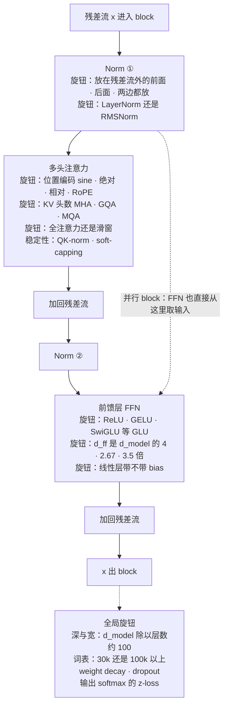
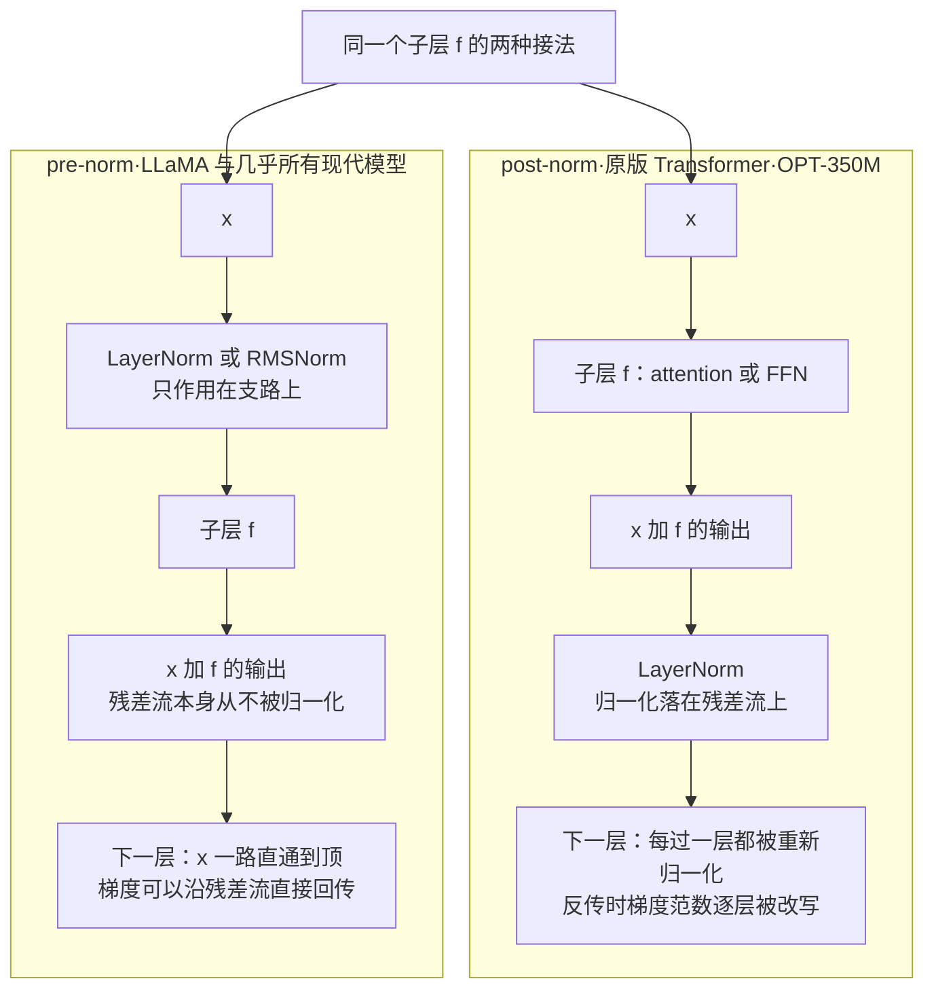
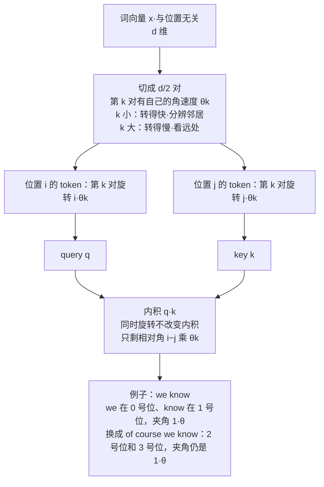
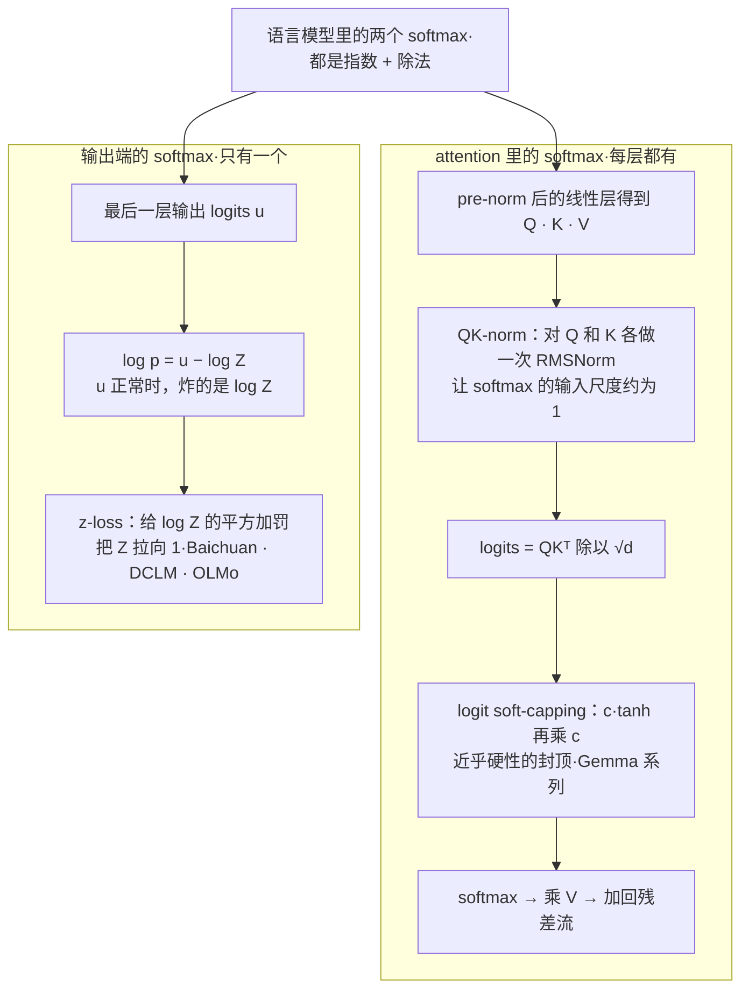
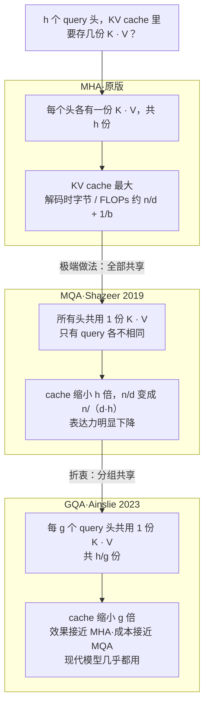
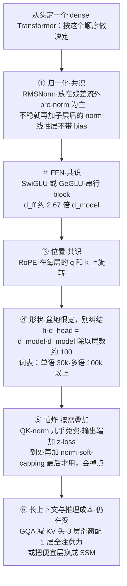

# CS336 第 3 讲｜架构（Architectures）

> Stanford CS336: Language Modeling from Scratch（2026 春）· 第 3 讲
> 视频：<https://www.youtube.com/watch?v=lVynu4bo1rY>（1:29:14；英文字幕为自动生成，模型名、人名错得多，见文末勘误）
> 讲者：Tatsunori Hashimoto（全程；多处以第三人称提到 Percy——"上一讲 Percy 讲过 arithmetic intensity""推理的细节 Percy 之后讲"）
> 课程主页：<https://stanford-cs336.github.io/> · 本讲反复引用的证据：[Shazeer 2020（GLU 变体）](https://arxiv.org/abs/2002.05202) · [Narang et al. 2021（架构改动能否迁移）](https://arxiv.org/abs/2102.11972) · [RoFormer](https://arxiv.org/abs/2104.09864) · [Kaplan et al. 2020](https://arxiv.org/abs/2001.08361) · [Shazeer 2019（MQA）](https://arxiv.org/abs/1911.02150) · [Ainslie et al. 2023（GQA）](https://arxiv.org/abs/2305.13245)

**一句话**：把 2017 年的原版 Transformer 和近三年几十个开源模型摆在一起看，dense 架构上真正被所有人改掉的只有几件小事——归一化挪出残差流并换成 RMSNorm、线性层去掉 bias、FFN 换成带门控的 SwiGLU / GeGLU、位置编码换成 RoPE；超参数（d_ff 约为 d_model 的 2.67 到 4 倍、h 乘 d_head 等于 d_model、d_model 除以层数约 100、词表 30k 或 100k 以上）都落在一个很宽的"盆地"里，怎么选都差不多；真正还在变的是两件事：怎么让训练不炸（z-loss、QK-norm、logit soft-capping，口诀是"哪里不稳就往哪里加一个 norm"）和怎么便宜地处理长上下文（GQA 减 KV 头、滑窗与全注意力 3:1 交替、甚至混入 SSM 层）——而这一切几乎都不是从理论推出来的，是大家一次次训练试出来的。

## 时间轴

| 时间 | 内容 |
|---|---|
| [0:06](https://www.youtube.com/watch?v=lVynu4bo1rY&t=6s) | 开场：架构"不可捉摸"，用 survey 视角学别人的经验；A1 和原版的三处差异 |
| [3:08](https://www.youtube.com/watch?v=lVynu4bo1rY&t=188s) | 样本量：去年 19 个新 dense 模型，今年 Qwen 3、Gemma 4、OLMo 3、Marin 8B；多数新模型是 MoE（下一讲） |
| [5:42](https://www.youtube.com/watch?v=lVynu4bo1rY&t=342s) | 架构是三重折衷：要泛化、要在 GPU 上高效、要不炸；三段历史：百花齐放 → 人人复刻 LLaMA 2 → 稳定性 → 长上下文 |
| [7:42](https://www.youtube.com/watch?v=lVynu4bo1rY&t=462s) | 归一化放哪：原版唯一被公认做错的地方；pre-norm 的两条证据；OPT-350M 例外；Grok / Gemma 2 / OLMo 2 的残差流外 post-norm |
| [13:50](https://www.youtube.com/watch?v=lVynu4bo1rY&t=830s) | LayerNorm → RMSNorm：0.17% 的 FLOPs 却占到 25% 的运行时间；去掉 bias |
| [19:59](https://www.youtube.com/watch?v=lVynu4bo1rY&t=1199s) | 激活函数动物园：ReLU → GELU → GLU 家族；门控的定义；2/3 缩放；Shazeer 与 Narang 的证据 |
| [27:09](https://www.youtube.com/watch?v=lVynu4bo1rY&t=1629s) | 串行 vs 并行 block：GPT-J、PaLM 的想法为何退潮；着色总表看趋势 |
| [30:44](https://www.youtube.com/watch?v=lVynu4bo1rY&t=1844s) | 位置编码四代：sine · 绝对 · 相对偏置 · RoPE；RoPE 的相对性要求与旋转直觉、分对旋转、实现 |
| [38:56](https://www.youtube.com/watch?v=lVynu4bo1rY&t=2336s) | 问答：高维旋转、怎么学这些知识、并行层到底掉多少、p-RoPE、相对偏置为何不算"嵌入" |
| [43:31](https://www.youtube.com/watch?v=lVynu4bo1rY&t=2611s) | 超参数一：d_ff 与 d_model 的比例——4、2.67、Llama 2 的 3.5、T5 的 64；Kaplan 的盆地 |
| [49:37](https://www.youtube.com/watch?v=lVynu4bo1rY&t=2977s) | 超参数二、三：h 乘 d_head 等于 d_model；aspect ratio 约 100，深了难做 pipeline 并行 |
| [55:13](https://www.youtube.com/watch?v=lVynu4bo1rY&t=3313s) | 超参数四：词表——单语 30k 与多语 100k 以上；问答：多模态词表、跨 tokenizer 比 bits per byte |
| [59:22](https://www.youtube.com/watch?v=lVynu4bo1rY&t=3562s) | 正则化的反直觉：单轮训练不过拟合，weight decay 却仍流行——它是优化手段；问答：diffusion LM、训练中改什么 |
| [1:05:02](https://www.youtube.com/watch?v=lVynu4bo1rY&t=3902s) | 稳定性：loss 尖峰的代价；两个 softmax 是危险区；输出端的 z-loss |
| [1:09:38](https://www.youtube.com/watch?v=lVynu4bo1rY&t=4178s) | attention 端：QK-norm（来自多模态模型）；logit soft-capping（Gemma）；NVIDIA 的对比 |
| [1:13:47](https://www.youtube.com/watch?v=lVynu4bo1rY&t=4427s) | 推理成本：训练 / prefill 与逐 token 解码的算术强度；KV cache 为什么让强度塌掉 |
| [1:19:19](https://www.youtube.com/watch?v=lVynu4bo1rY&t=4759s) | MQA 共享 K、V；GQA 的折衷与 T5 时代的证据；问答：还搜不搜超参、MQA 是训练时定的 |
| [1:25:26](https://www.youtube.com/watch?v=lVynu4bo1rY&t=5126s) | 长上下文：GPT-3 就有的滑窗交替；Command A 的 3:1；NoPE；Llama 4 / Gemma 4 / OLMo 3；Qwen 3.5 混入 Gated DeltaNet；结语 |

## 核心内容

### 1. 这一讲怎么讲：survey 视角，以及"架构是一组折衷"

- **方法论**：讲者坦言架构对他也一直"不可捉摸"——理想世界里记住 VC dimension 这类干净理论就够了，现实不是。最好的学法是自己训模型换架构试（这门课的哲学），但谁也没有算力跑遍设计空间；退而求其次是看别人做了什么：把现代模型摆在一起，找出哪些选择在一切有效架构里固定不变、哪些随便变也不影响效果。
- **从 A1 说起**：作业里让实现的和 Vaswani 原版有三处不同——LayerNorm 挪到每个 block 的前面（pre-norm）、位置用 RoPE、激活用 SwiGLU 而不是 ReLU。为什么选这三样？很大程度是从 LLaMA 抄的，"但大家都这么抄"；真要自己训模型，马上会撞上"这么多选项选哪个"的问题。
- **样本量够大**：去年备课时数了一下，新出的 dense 模型有 19 个（Qwen 2、Gemma 3、InternLM2、Nemotron 4……）；今年以为总该少了，结果还是一堆：Qwen 3、上周四刚发的 Gemma 4、OLMo 3，还有 Percy 用 Marin 训的 8B。只是今年多数新模型是 MoE，留到下一讲。模型多反而好——趋势看得清。
- **贯穿全讲的观点**：架构是一组复杂的折衷。一个架构要同时做到三件事——从数据里学到东西（泛化）、在 GPU 上高效训练、训练中途不炸（loss 一路下降然后突然飞掉，就前功尽弃）。三个要求全被"烤"进了架构里，所以架构显得杂乱、不优雅，这是它本来的样子。
- **三段历史**：从 Transformer 到 GPT-3 是百花齐放期，没有金标准；LLaMA 2 一出，人人复刻 LLaMA 2 再加一点小改；去年的主题是让训练更稳的架构改动；今年的主题是支持更长上下文的改动。
- **本讲范围**：只讲 dense 的、全对全的 attention。SSM、线性 attention 等替代方案是第 4 讲的事。

### 2. 一个 block 上有哪些旋钮



*图 3-1｜一个 Transformer block 的解剖：本讲逐个讨论的旋钮标在它们所在的位置（自绘示意）· [▶ 看原幻灯片 4:09](https://www.youtube.com/watch?v=lVynu4bo1rY&t=249s)*

- 图 3-1 是这一讲的地图，三个层次自上而下：block 内部的 building blocks（第 3 到 7 节）、再往下一层的超参数与正则化（第 8、9 节，图中右下角）、最底层的稳定性技巧（第 10 节）——后者放进架构课讲，因为它和架构变体绑在一起；attention 框里的"KV 头数、滑窗"是第 11、12 节。
- 读者在 CME295 第 2 讲见过 RoPE、RMSNorm、GQA 的定义，这里不重复，重点放在"为什么选它"的证据、每个选择省下或付出的是什么，以及谁用了什么——讲者开场的那张总表（[29:43](https://www.youtube.com/watch?v=lVynu4bo1rY&t=1783s) 有着色版）在第 13 节按讲课内容重建。

### 3. 归一化放哪：唯一被公认"原版做错了"的地方



*图 3-2｜post-norm 与 pre-norm 的数据流：区别只在 norm 落不落在残差流上（自绘示意）· [▶ 看原幻灯片 7:42](https://www.youtube.com/watch?v=lVynu4bo1rY&t=462s) · 出处：[Xiong et al., 2020](https://arxiv.org/abs/2002.04745)*

- **大家唯一的共识**：Transformer 原论文几乎什么都做对了，只有一处——LayerNorm 放在哪——被公认做错了。原版把 norm 放在残差路径上（每个子层的输出加回残差流之后再归一化）；替代方案是把 norm 挪到残差流之外、放在每个子层计算之前，称 pre-norm（讲者建议把原版叫"residual norm"，免得术语混淆）。基本上所有现代模型都把 norm 推出了残差流。唯一有趣的例外是 OPT-350M：OPT 本来就是个乱糟糟的模型系列，而只有 350M 这一档用了残差流内的 post-norm，没人知道为什么。
- **证据一：去 warm-up 的初衷**。早期研究这个问题的动机是想去掉学习率 warm-up（现代训练仍然要 warm-up）。结果发现 post-norm 一去 warm-up 就收敛得很差（图里那条紫色虚线），而 pre-norm 即使没有 warm-up 也收敛得很好。
- **证据二：梯度衰减**。这才是它留下来的原因。做架构设计的人常说一句话：keep your residual stream clean。pre-norm 下，x 从最底层一路直通到最顶层，反传时梯度也沿这条直线原路回去；初始化时各层的梯度大小基本一致。post-norm 下每过一个 block 就被归一化一次，梯度范数在反传过程中逐层被改写，效应复杂。实验上，pre-norm 的梯度尖峰更小也更少（Salazar 与 Nguyen 的图）。稳定、能做深，这两点对大模型都太重要，于是人人采用。
  > 小注：去 warm-up 那条曲线应出自 Xiong et al., 2020《On Layer Normalization in the Transformer Architecture》；梯度尖峰的图出自 Salazar & Nguyen, 2019《Transformers without Tears》——讲者只报了作者名。
- **变体**：既然要点是"别碰残差流"，norm 放在子层计算之后（仍在残差流外）逻辑上同样成立——Grok、Gemma 2、OLMo 2 就是这么做的；还有模型两头都放（double norm）。由此得到一条听上去荒唐却屡试不爽的经验：训练不稳，就往各处撒 LayerNorm，"往 attention 里也扔一个"照样管用（第 10 节的 QK-norm）。
- **一个诚实的备注**：pre-norm 之所以是主流，可能有一部分只是因为 LLaMA 2 这么做了。

```python
def block_post_norm(x):            # 原版：norm 落在残差流上
    x = norm(x + attn(x))
    return norm(x + ffn(x))

def block_pre_norm(x):             # 现代：残差流干净，norm 只在支路上
    x = x + attn(norm1(x))
    return x + ffn(norm2(x))

def block_parallel(x):             # GPT-J / PaLM：两条支路同时从同一个 norm 出发
    h = norm(x)
    return x + attn(h) + ffn(h)
```

三种 block 的接法只差一行的位置：post-norm 让残差流本身经过 norm，pre-norm 让 x 直通，并行 block（第 6 节）则把 attention 和 FFN 并排接在同一个归一化后的输入上。

### 4. LayerNorm → RMSNorm、去掉 bias：一笔算术强度的账

$$
\mathrm{LN}(x)=\gamma\odot\frac{x-\mu}{\sqrt{\sigma^{2}+\epsilon}}+\beta,\qquad
\mathrm{RMSNorm}(x)=\gamma\odot\frac{x}{\sqrt{\tfrac{1}{d}\sum_{i=1}^{d}x_i^{2}+\epsilon}}
$$

x 是一个 token 的 d 维激活，μ、σ² 是它各维的均值和方差，γ、β 是可学的缩放和偏移；RMSNorm 去掉了减均值和 β，只剩"按均方根缩小、再按 γ 放大"。

- **表达力**：LayerNorm 严格比 RMSNorm 更有表达力，表示上没有任何理由非用 RMSNorm；但实践中换过去没有损失——建模能力一样。
- **为什么还要换**：这里开始出现系统与架构的协同设计。上一讲 Percy 讲了 **arithmetic intensity**（算术强度：每从内存搬一个字节，能做多少次浮点运算）：GPU 要靠矩阵乘这类"算得多、搬得少"的操作才能跑满，搬一小块内存、算一点点的操作是浪费。LayerNorm 正是后者——只要减均值和加偏移不带来什么，就该删掉。
- **数字**：LayerNorm 只占总 FLOPs 的 **0.17%**，但视工作负载可以占到 **25% 的运行时间**——FLOPs 不是运行时间。矩阵乘（tensor contraction）的大头是乘法，统计归一化的大头是内存搬运，而激活很大。25% 是很小的模型上的极端数字，但道理一样；柱状图里白色是算术强度、黑色是 FLOPs，LayerNorm 最低。
- **实验证据**：Google 的一篇架构对比论文（Narang et al.，讲者说"2020"）在约 200M 参数的模型上把 LayerNorm 换成 RMSNorm：每秒的训练步数更多（表里的第三列），而且效果还更好——后者没人能保证，算意外之喜。一个免费的系统收益，于是所有人都换了。
  > 小注：这篇应为 Narang et al., 2021《Do Transformer Modifications Transfer Across Implementations and Applications?》（EMNLP 2021），用的是 T5 架构而非自回归模型；第 5 节的 GLU 对比也出自它。
- **bias 项**：同一逻辑。原版每个线性层都带 bias，大多数实现全部去掉——同样是算术强度低、内存开销相对高的操作；顺带一提，bias 有时还会引发稳定性问题。去掉它的首要理由是系统上更简单。
- **这一节的认识论**：norm 这块做法高度标准化，理解虽不算深刻理论但够用；让人不满足的是，"去掉 bias 行不行"无法事先推理，只能靠实验积累的集体知识——对典型语言建模负载，线性层和 RMSNorm 都不要 bias，没问题。

### 5. 激活函数：一整个动物园，只有"门控"这一条轴重要

$$
\mathrm{FFN}_{\mathrm{ReLU}}(x)=\max(0,\,xW_1)\,W_2,\qquad
\mathrm{FFN}_{\mathrm{SwiGLU}}(x)=\big(\mathrm{Swish}(xW_1)\odot xV\big)\,W_2,\qquad \mathrm{Swish}(z)=z\,\sigma(z)
$$

W1 把 d_model 升到 d_ff，W2 降回来；GLU 变体多了一个同样大小的门矩阵 V，用 xV 逐元素地调制主支路的输出。三个矩阵而不是两个，所以按 2/3 缩小 d_ff 才能和原 FFN 参数量相同——通行的经验规则，不是铁律，后面的超参数一节还会用到。

- **动物园**：ReLU、GELU、Swish、ELU、GeGLU、SeLU、SwiGLU、LiGLU……讲者曾发誓一辈子不学 SwiGLU 是什么，现在不得不学——要紧的是弄清名字里哪一部分真的影响效果。
- **朴素激活也能训**：只用 ReLU 就能训出像样的语言模型（那一组里 Chinchilla 大概是最好的）；GELU 只是在零附近多了一个小凹陷，改变的是零点附近的梯度，GPT-3 就是 GELU——按今天的标准不算先进，但完全能用。
- **真正的动作在 GLU**：和 norm 一样，几乎所有靠谱的现代模型都用某种 gated linear unit。做法（[22:02](https://www.youtube.com/watch?v=lVynu4bo1rY&t=1322s)）就是把架构设计里那句"门控通常有帮助"套到 FFN 上：再来一个线性投影 xV，逐元素乘到激活的输出上，然后照常降维。命名规则是"激活名 + GLU"：ReGLU、GeGLU、SwiGLU。
- **谁用什么**：Google 系用 GeGLU（Gemma、T5）；LLaMA 后裔和 PaLM 用 SwiGLU。SwiGLU 占多数，但讲者的判断是：在门控单元之间，选哪个并不重要。
- **证据**：Shazeer 提出 GLU 变体的论文里改进幅度小但方向一致，他一贯训多个副本给出误差条，对比按 2/3 调整做到参数量匹配——GLU 变体几乎总是更好。Narang et al. 的系统对比（T5 架构）里，SwiGLU、GeGLU 在 loss 和下游指标上都显著更好。结论：门控这条轴重要，且几乎不增加计算量。
- **不是必需**：GPT-3 没用；Nemotron-4 340B 用了 squared ReLU——讲者称之为"疯狂的选择"，但也训成了。只是今天很少见到不用 GLU 的模型。

```python
class SwiGLU(nn.Module):
    def __init__(self, d_model, d_ff):            # d_ff 取约 8/3 倍 d_model，参数量与 4 倍的 ReLU FFN 相同
        self.w1 = Linear(d_model, d_ff, bias=False)   # 主支路
        self.v  = Linear(d_model, d_ff, bias=False)   # 门
        self.w2 = Linear(d_ff, d_model, bias=False)   # 降回 d_model
    def forward(self, x):
        return self.w2(F.silu(self.w1(x)) * self.v(x))   # silu 即 Swish；三处都不带 bias
```

一个 SwiGLU 前馈层的骨架：比 ReLU FFN 只多一个门矩阵和一次逐元素乘法，bias 全部去掉。

### 6. 串行 vs 并行 block：一个退潮的想法

- **想法**：正常的 block 是串行的——先算 attention，再算 MLP。系统思维的人会说这是个瓶颈：后者要等前者。并行 block 把两条支路接在同一个归一化后的输入上，两者的输出一起加回残差流（见第 3 节的 `block_parallel`）。实现得当可以共享 LayerNorm、融合矩阵乘，换来额外的系统优化空间。
- **出处**：最早是 GPT-J（GPT-3 的开源复刻，影响出人意料），PaLM 的报告写得最清楚；受 Google 影响的 Cohere（由一位 Transformer 作者创办）也跟进了，除此之外用的人不多。
- **为什么退潮**：过去两年基本没人再用：串行形式的系统优化已经够好，并行的收益抵不上它对表达力的小幅损伤——直观上相当于丢掉一半的深度。
- **问答**（[40:27](https://www.youtube.com/watch?v=lVynu4bo1rY&t=2427s)）：两者精度差多少？证据混杂。PaLM 论文很自信：效果不降、系统利用率提升 15%；但后来的 Google 模型都不再用，可当作隐含信号——可能有损失。没人做过干净的受控消融。
- **小结**：架构这一部分讲得这么短，本身就说明原版 Transformer 经受住了时间考验——在 dense attention 的范围内，真正改的只有 norm 的位置、bias、门控，都是小改动。

### 7. 位置编码：RoPE 为什么赢



*图 3-3｜RoPE 的机制：把向量两两一对地按位置旋转，内积就只依赖相对位置（自绘示意）· [▶ 看原幻灯片 34:49](https://www.youtube.com/watch?v=lVynu4bo1rY&t=2089s) · 出处：[Su et al., 2021](https://arxiv.org/abs/2104.09864)*

- **为什么需要**：attention 是一堆内积，把 token 打乱顺序结果不变——位置信息必须另外注入。这是各家实现差异最大、仍在变动的地方。
- **四代做法**：（1）原版的 sine / cosine，直觉像傅里叶变换，总能从中恢复出位置；（2）紧随其后的一批大模型用可学的绝对位置嵌入；（3）Google 系（T5、Chinchilla）用相对位置偏置：不动词向量，按两个位置的距离往 attention 分数矩阵上加偏移；（4）RoPE：2024 年之后的模型几乎都用它，而它"凭空出现"——最初是一位中国作者的博客加论文，被 GPT-J 采用后传开。
- **RoPE 想要的性质**（[33:18](https://www.youtube.com/watch?v=lVynu4bo1rY&t=1998s)）——一个有立场的假设：词的绝对位置不该被关心，"an apple"出现在开头和结尾应该得到同样的结果：

$$
\langle f(x_i,\,i),\;f(x_j,\,j)\rangle \;=\; g\big(x_i,\,x_j,\;i-j\big)
$$

f 把词向量 x 和它的绝对位置 i 编码成一个向量，要求任意两个这样的向量做内积时，结果只通过 i−j 依赖位置。此前的方案都不满足：sine 嵌入的内积里有绝对位置的交叉项；绝对嵌入顾名思义不满足；相对偏置虽然"相对"，但它不是嵌入——没有内积结构可言。

- **几何直觉**：内积对旋转不变。把与位置无关的语义向量按它所在的位置旋转：位置 0 不转，位置 1 转 θ，位置 2 转 2θ……"we know"里 we 和 know 夹角 1θ；换成"of course we know"，两个词到了 2 号位和 3 号位，夹角还是 1θ（图 3-3）。
- **高维怎么转**：二维只有顺时针、逆时针；高维有无穷多种旋转。做法是最简单的那种，而且管用——把 d 维切成 d/2 对，每一对做一次二维旋转，各对角速度 θ_k 不同：转得慢的对捕捉长程关系，转得快的对分辨"是不是邻居"。论文用复数写了一套很绕的动机，讲者认为直觉就是"分对旋转"。

$$
f(x,\,m)_{[2k,\,2k+1]}=
\begin{pmatrix}\cos m\theta_k & -\sin m\theta_k\\ \sin m\theta_k & \cos m\theta_k\end{pmatrix}
\begin{pmatrix}x_{2k}\\ x_{2k+1}\end{pmatrix},\qquad \theta_k=\Theta^{-2k/d}
$$

m 是 token 的绝对位置，第 k 对坐标 (x_2k, x_2k+1) 被旋转 m·θ_k；θ_k 随 k 按几何级数变小，所以前面的对转得快、后面的对转得慢。

> 小注：θ_k 的具体形式课上没写，这里按 RoFormer（Su et al., 2021）补出，论文默认基数 Θ = 10000；作者 Jianlin Su 的博客先于论文。

- **实现**（[38:24](https://www.youtube.com/watch?v=lVynu4bo1rY&t=2304s)）：按位置 id 生成 cos 和 sin，作用到 query 和 key 上（不动 value），写成稀疏矩阵乘或手工按对旋转都行。关键有两点：一是**乘**上正弦余弦而不是**加**——没有交叉项，内积里榨不出绝对位置；二是在每一层 attention 里都做，而不是只在最底层加一次——每次算 attention 都重新强制相对性。
- **Gemma 4 的 p-RoPE**（上周四发布）：只旋转一部分坐标对。问答里讲者解释差别只是"转哪些坐标"：角速度最低的那些对本来就几乎不转，缺空间时可以省掉——这是给隐藏维度很小的小模型准备的优化。
  > 小注：p-RoPE 应出自 Barbero et al., 2024《Round and Round We Go! What makes Rotary Positional Encodings useful?》，做法是截掉最低频的那部分频率（推断）。
- **问答**：超出二维块的高维旋转？讲者没见过，理论上任何闭合的一维流形都行。ALiBi 一类直接往 attention 矩阵上加偏置的方法效果也不错，问题是"审美"上的：不能分解成 f(x_i, i) 与 f(x_j, j) 的内积；接受了"我要相对性"这个前提，就会自然走到 RoPE。怎么学这些知识？看得足够广以找出模式（这一讲在做的事），加上自己在小规模上试出直觉——今天没有哪篇论文会给出一个模型的全部细节。

```python
def rope(x, pos, theta):                     # x: [..., seq, d]；theta: [d/2] 各对的角速度
    x1, x2 = x[..., 0::2], x[..., 1::2]      # 第 k 对 = 第 2k 和 2k+1 维
    ang = pos[:, None] * theta[None, :]      # [seq, d/2]：位置 m 乘 θ_k
    c, s = ang.cos(), ang.sin()
    return interleave(x1 * c - x2 * s, x1 * s + x2 * c)   # 每一对做二维旋转

q, k = rope(q, pos, theta), rope(k, pos, theta)   # 只旋转 q 和 k，v 不动
scores = q @ k.transpose(-1, -2) / d_head ** 0.5  # 内积只依赖相对位置
```

RoPE 的实现就是"生成角度、分对旋转、只作用于 q 和 k"三步；每一层 attention 里都重做一遍。

### 8. 超参数：四条经验值，以及它们的"盆地"

- **什么时候会遇到**：一旦要实例化模型，就得回答 d_ff 多大、几个头、词表多大、要不要 weight decay 或 dropout、做深还是做宽。从零搜这个高维空间很吓人，但人们实际尝试过的范围很小。

| 超参数 | 经验值 | 例外与证据 |
|---|---|---|
| d_ff 与 d_model 之比 | 4（非 GLU）；GLU 取 2/3 后约 2.67，很多模型在 2.5 到 2.67 | Llama 2 因为 GQA 省了 attention 的算力，"随手"再乘 1.33 得约 3.5；T5 用了 64 倍，T5 1.1 又退回约 2.5；Kaplan 的扫描显示 1 到 10 之间是平坦盆地 |
| 头数与头维度 | h 乘 d_head 等于 d_model，即"和单头时总维度相同" | T5、LaMDA 是例外；盆地也很宽，比值在 1 附近都行 |
| aspect ratio：d_model 除以层数 | 约 100（GPT-3、LLaMA 都是） | 深了要做 pipeline 并行，痛苦；宽了做 tensor 并行，简单；Kaplan：最优值不随规模变，约 100 或略低；Tay et al.：起决定作用的是 FLOPs |
| 词表大小 | 单语（英语）模型约 30k；多语 / 生产系统 100k 到 200k 以上 | Google 系词表远大；LLaMA 后裔约 100k；scaling law 表明模型越大能用的词表越大；没人再训大的单语模型了 |

- **d_ff 的比例**：4 倍这个经验值好得出奇。GLU 变体按第 5 节的 2/3 缩放，得到 2.5 到 2.67；Llama 2 团队觉得有了 MQA / GQA（第 11 节）attention 变便宜了，就把比例再乘 1.33 得约 3.5——把预算往 MLP 挪了一点。翻遍论文，GLU 模型不是 2.6 左右就是 3.5，非 GLU 是 4。
- **T5 的传奇**：多数技术报告在架构上很无聊——"做了 LLaMA，改了一处"；Google 有时很大胆，T5 直接用了 64 倍，理由也是系统式的：矩阵越大，硬件越好跑满。Gemma 2 也往高里推了些。Kaplan et al. 2020 顺手扫过这个比例（很小的模型）：从约 1 到约 10 是一片平坦盆地，离最优 loss 差得很少；超过 10 到 100，loss 二次方地飙升。所以 2.6 到 4 都在盆地里；T5 不是坏模型，激进选择"技术上可行"，只是算力效率差——收尾是 T5 1.1 一声不响地退回了约 2.5。
- **头**：讲 224N 时他就觉得奇怪——大家总让 h 乘 d_head 刚好等于 d_model，仿佛必须和单头时总维度一样。这没有必然性，但几乎所有模型（包括最新的）都遵守，也确实好用；T5 和 LaMDA 是例外。同样宽容。
- **深与宽**：放大模型时通常固定 aspect ratio 整体变大，所以这个比值控制了整条 scaling 路线上的深宽取舍。它的差异比别的超参数大得多，但仍有清楚的甜点：约 100。取舍是表达力对硬件：极深的模型只能沿层切（pipeline 并行，第 7、8 讲，"多数人真的不想碰"）；宽模型沿宽度切就行（tensor 并行，简单得多）。表达力想深、系统想宽，落在 100 附近。Kaplan 的另一张扫描图显示最优 aspect ratio 不随模型大小变；Tay et al. 扫过各种深宽组合，结论是主导变量是 FLOPs，形状次要。讲者的总结：有一条宽容的超参数带，选在带内之后主要操心系统利用率，而不是难以推理的表达力。
  > 小注："Tay et al." 在字幕里是 "ETA"，应为 Tay et al., 2021《Scale Efficiently》；那篇论文同时指出模型形状对下游微调有影响，并提出"深而窄"更省算力——讲者引用的是它上面那幅"按 FLOPs 看各种形状"的图。
- **词表**：早期开源模型多是只求英语好的单语模型，词表 3 万左右；LLaMA 之后大家关心多语和生产系统（包括 GPT-4 这类闭源模型），词表升到 10 万到 20 万以上。多语确实需要更大的词表覆盖；右边那一列的模型本身也更大——scaling law 研究表明模型越大、能驾驭的词表越大。第 1 讲的分词与这里相接。
- **问答**（[56:49](https://www.youtube.com/watch?v=lVynu4bo1rY&t=3409s)）：多模态呢？如果图像也切成 token，就需要一个自己的、通常很大的图像词表。不同 tokenizer 之间比 bits per byte 合法吗？合法，只要 tokenizer 是"完备"的（能建模任意字节串，现代子词分词器都能，早年丢词的分词器不行），且归一化用的是同一个数——字节数；困惑度与 bits per byte 互为对偶。

### 9. 正则化的反直觉：weight decay 是优化手段，不是防过拟合

- **ML 101 的推理**：语言建模的数据比算力多（互联网上的数据比 FLOPs 多，也许 Google 也不例外），所以语料只过一遍；单轮 SGD 基本不会记住数据；于是在算力受限的语言建模里过拟合几乎从不发生——有人因此只看训练 loss。那还要 dropout 或 weight decay 吗？
- **现实**：最近的技术报告很少写这么底层的细节，但翻一翻会发现很多模型两者都用；weight decay 在现代高性能模型里尤其普遍（dropout 倒是退潮了）。这很费解。
- **解释**：有论文给出了漂亮的证据——weight decay 在这里根本不是正则化：不同 weight decay 下，训练 loss 对验证 loss 全落在 x 等于 y 的对角线上，本来就没有过拟合可消。但和学习率衰减放在一起看，强 weight decay 的那几条（图中底部的蓝色虚线）起步慢、最终却收敛到明显更好的极小值；常数学习率下没有这个效应。所以 weight decay 是在和优化器、学习率调度交互——是优化干预。
  > 小注：应为 D'Angelo、Andriushchenko 等，2023《Why Do We Need Weight Decay in Modern Deep Learning?》：对接近单轮的 LLM 训练，weight decay 通过平衡随机优化里的偏差—方差，降低训练 loss 并改善训练稳定性。
- **这就是课程要你动手的原因**：这些东西以奇怪的方式相互纠缠，无法从零推理。问答里的补充：dropout 基本没人用了，和优化配合不好；weight decay 把权重往零收缩，可能让你用更高的学习率或衰减得更快。训练途中会改的超参数几乎只有 weight decay（和学习率一起改，是个好用的启发式）；架构类的超参数改了训练就不兼容。
- **问答**：diffusion 语言模型的架构有没有不同？讲者没深究；训大 diffusion 的人少，而且多数是拿 LLaMA 式架构改装的，从零训的最优架构他不知道。

### 10. 稳定性三件套：z-loss、QK-norm、logit soft-capping



*图 3-4｜两个 softmax 就是两个危险区：三种稳定性干预各卡在哪一步（自绘示意）· [▶ 看原幻灯片 1:10:09](https://www.youtube.com/watch?v=lVynu4bo1rY&t=4209s) · 出处：[Rybakov et al., 2024](https://arxiv.org/abs/2410.16682)*

- **为什么稳定性成了主题**：前面的选择在效果上都很宽容，怎么选差别不大；但模型越贵，"训到一半炸掉"越不可接受——花了几百万美元，模型要么质量受损，要么再也训不动。不想要的就是那条到处是尖峰、梯度范数乱跳的蓝色曲线。
- **通常的嫌疑犯**：softmax。它有两样对稳定性都很坏的东西——指数（很快爆掉）和除法（同样危险）。语言模型里有两个 softmax：输出端的概率分布，和 attention 里的归一化，后者尤其危险。

$$
\log p(y)=u_y-\log Z,\qquad Z=\sum_{v}e^{u_v},\qquad
\mathcal{L}_{\text{z-loss}}=-\log p(y)+\alpha\,(\log Z)^{2}
$$

u 是模型输出的 logits（残差流最后的输出），Z 是配分函数；只要模型本身正常，u 就正常，会出问题的是 log Z——Z 是指数和，可能极大，也可能趋近 0，两个方向都会炸。z-loss 把 (log Z)² 作为惩罚项加进 loss，把 Z 拉向 1、log Z 拉向 0。

- **输出端为什么可以这样做**：softmax 是过参数化的——给所有 u 加同一个常数，概率不变而 Z 会变，这个自由度正好拿来约束 Z。这一招来自 Jacob Devlin 2014 年的论文（讲者口误说成 2024 又自己改正），近年被开源模型重新捡起：Baichuan 是讲者记得的第一个，之后 DCLM、OLMo 都用它稳住输出 softmax，出奇地有效。
  > 小注：Devlin et al., 2014《Fast and Robust Neural Network Joint Models for Statistical Machine Translation》，原目的是让网络"自归一化"以省掉推理时算 Z；PaLM 也用了 z-loss，系数 10⁻⁴。
- **attention 端：QK-norm**。设计哲学就是那句"不稳就扔一个 norm 进去"：在 Q 和 K 相乘之前各做一次 RMSNorm，softmax 的输入尺度就总在 1 左右。它来自多模态那边——Idefics、Chameleon 用它证明了有效，之后开源语言模型发现同样适用；现在绝大多数大模型都做，不伤效果，但确实能挡住 attention 的退化。数一数 norm 的位置：pre-norm、子层之后、再加 Q 和 K 上——这就是这几年稳定性技巧的走向。
  > 小注：QK-norm 更早见于 Henry et al., 2020 和 ViT-22B（Dehghani et al., 2023）；Chameleon 论文明确写了沿用 ViT-22B 的做法。
- **logit soft-capping**：更硬的干预，基本是 Google 专属。QK-norm 控制 softmax 的输入、指望输出正常；soft-capping 直接对进入 softmax 的 logits 封顶——tanh 有界，再大的 logit 也不会超过上限。讲者说 Gemma 2、3、4 都对 attention 的 logits 这么做。

$$
\mathrm{logits}\;\leftarrow\;c\cdot\tanh\!\left(\frac{\mathrm{logits}}{c}\right)
$$

c 是封顶值：logit 远小于 c 时几乎不变，接近或超过 c 时被压到 c 以内——一个"软"的硬约束。

- **代价**：NVIDIA 的一组系统对比里，基线之上加 QK-norm 略好——学习率可以再调高一点；只用 soft-capping 反而掉点：干预太强，模型没法在 softmax 里表达超过上限的高置信度。安全，但不免费。
  > 小注：Gemma 2 的封顶值是 attention logits 50、最终输出 logits 30；Gemma 3 的报告称把 attention 的 soft-capping 换成了 QK-norm（应为）。NVIDIA 那篇应为 Rybakov et al., 2024《Methods of improving LLM training stability》，用 830M 模型故意调高学习率制造发散来比较各种干预。

### 11. 推理成本与 MQA / GQA



*图 3-5｜MHA、MQA、GQA 只差一件事：多少个 query 头共用一份 K、V（自绘示意）· [▶ 看原幻灯片 1:20:50](https://www.youtube.com/watch?v=lVynu4bo1rY&t=4850s) · 出处：[Ainslie et al., 2023](https://arxiv.org/abs/2305.13245)*

- **换个视角：部署**。训完的大模型要服务大量用户，成本抽象成两种资源：FLOPs（做的计算）和内存访问（搬的字节）——后者同样决定延迟和利用率，两者都要小。
- **训练 / prefill 的账**（[1:15:48](https://www.youtube.com/watch?v=lVynu4bo1rY&t=4548s)）：

$$
\text{FLOPs}\sim b\,n\,d^{2},\qquad
\text{bytes}\sim b\,n\,d+b\,h\,n^{2}+d^{2},\qquad
\frac{\text{bytes}}{\text{FLOPs}}\sim\frac{1}{k}+\frac{1}{b\,n}
$$

b 是 batch 大小，n 是序列长度，d 是隐藏维度，h 是头数，k = d/h 是每个头的维度；三项字节分别是激活、attention 分数矩阵（softmax 那一项，n² 量级）和权重。比值告诉你：只要头维度 k 够大、b 乘 n 够大，搬运相对计算就很少，GPU 能跑满。

- **逐 token 解码的账**：生成没法并行——生成一个 token、接在后面、再生成下一个，这是自回归的"诅咒"。高效的做法是把过去所有位置的 K 和 V 存在 **KV cache** 里（讲者口误说成"keys and queries"），每步只算新 query 那一行，算过的子矩阵全部复用，FLOPs 大省。但算术强度塌了：每生成一个 token 都要把参数从头读一遍。

$$
\text{decode: }\ \text{bytes}\sim b\,n^{2}d+n\,d^{2}\ \Rightarrow\ \frac{\text{bytes}}{\text{FLOPs}}\sim\frac{n}{d}+\frac{1}{b},\qquad
\text{MQA: }\ \sim\frac{n}{d\,h}+\frac{1}{b}
$$

总 FLOPs 和一次算完时相同（同样的矩阵，只是分步乘），但权重那一项从 d² 变成了 n·d²——每步重读一次；比值里多出的 n/d 项要求"batch 大、序列短，或者 d 巨大"，小模型尤其吃亏，而且用增量计算就绕不开它。MQA 让所有头共用一份 K、V，这一项被头数 h 除掉。

- **MQA**：只让 query 按头不同，K 和 V 全部共享。KV cache 与内存访问骤减，算术强度显著上升；代价是表达力明显下降。
- **GQA**：在系统效率和表达力之间找甜点——保留全部 query 头，只把 K、V 的头数减到一个可调的数目，这个比例就是旋钮。DeepSeek-V2 的 multi-head latent attention 是另一种分解，取舍不同，下一讲略提。
- **证据**（T5 时代的图，[1:21:50](https://www.youtube.com/watch?v=lVynu4bo1rY&t=4910s)）：横轴每样本耗时、纵轴下游效果。MHA 最好但最慢；MQA 快得多但差很多；为赶速度把模型做小，更差；GQA 几乎和 MHA 一样好、成本接近 MQA——KV 头数只要稍减一点，大部分效果就保住了。所以今天几乎所有模型都用 GQA。推理的机制 Percy 在第 10 讲展开。
- **问答**：MQA / GQA 不是推理时才做的技巧，训练时就定好了 KV 头数。还搜不搜超参？两者兼有：每次训练都有几条"什么可以变"的假设，报告里超参数很少动、架构一次改一处；Google 是少数敢大改的，Gemma 4 甚至给每一层配了独立的 embedding 来换取内存与 FLOPs 之间的取舍。
  > 小注：GQA 论文的另一个卖点是可以把已训好的 MHA checkpoint 用约 5% 的原训练算力"改造"成 GQA，而不必从头训。

```python
# h 个 query 头、h_kv 个 K/V 头；每 g = h // h_kv 个 query 头共用一份 K、V
q = wq(x).view(b, n, h,    d_head)
k = wk(x).view(b, n, h_kv, d_head)          # h_kv = h → MHA；h_kv = 1 → MQA
v = wv(x).view(b, n, h_kv, d_head)
k = k.repeat_interleave(h // h_kv, dim=2)   # 算 attention 时把 K、V 复制给每个 query 头
v = v.repeat_interleave(h // h_kv, dim=2)   # 但 KV cache 里只存 h_kv 份
out = attention(q, k, v)
```

MHA、MQA、GQA 在代码上只是 K、V 投影的头数不同：存的时候是 h_kv 份，算的时候再复制。

### 12. 长上下文：全注意力与滑窗交替

- **老想法**：GPT-3 的论文就写着交替使用全注意力（看过去所有位置）和带状的局部注意力（只看固定窗口）；OpenAI 早年就有关于 attention 模式的工作。过去一年它重新流行：全局层和局部层交替，是长上下文效果与推理成本之间的甜点，不必上 SSM 之类的"异域"方案。
- **Command A 的结构**（讲者见到的第一个开源例子）：每 4 层一个全注意力层，中间 3 层是只看局部的滑窗注意力；往上走，局部信息逐层汇聚成全局信息。还有一项创新是把全局层的 RoPE 去掉——没有任何位置编码（NoPE），全局层几乎在看一个"词袋"，位置信息由短程层提供。
- **跟进者**：Llama 4、Gemma 4、OLMo 3 都是滑窗加全注意力的组合（用完整的 RoPE 而不是 NoPE）。Qwen 3.5 结构相同但"便宜层"换了：每 4 层一个全注意力，中间是一种叫 Gated DeltaNet 的状态空间模型——第 4 讲讲它是什么。
- **今年的主题**：混合模型——既不全是全局 attention，也不全是便宜层。长上下文的效果与成本怎么平衡，是架构上仍在活跃变动、变化最多的地方。
- **结语**：把这些模型放在一起，能看到大量共性（前面各节），也能看到差异集中在上下文处理、位置编码、甚至分词上。带着这些直觉去做作业、刷排行榜。

### 13. 总表与决策图：谁用什么



*图 3-6｜按本讲证据排出的决策顺序：三条共识、一条宽容带、两块仍在变动的区域（自绘示意）· [▶ 看原幻灯片 1:03:30](https://www.youtube.com/watch?v=lVynu4bo1rY&t=3810s)*

| 模型 | norm 位置 / 类型 | 激活 | 位置编码 | block | 课上点到的其他特点 |
|---|---|---|---|---|---|
| Transformer 原版 | 残差流内 post-norm / LayerNorm | ReLU | sine / cosine | 串行 | 线性层带 bias；h 乘 d_head 等于 d_model 的规则由此而来 |
| GPT-3 | — | GELU | 绝对（"紧随原版的一批大模型"，推断含 GPT-3） | 串行 | 论文里已交替使用全注意力与带状局部注意力；非 GLU 模型的 d_ff 取 4 倍 |
| GPT-J | — | — | RoPE（首个采用） | 并行（首创） | GPT-3 的开源复刻，影响出人意料 |
| PaLM | — | SwiGLU | — | 并行 | 报告称并行块效果不降、利用率升 15% |
| T5 | — | GeGLU（T5 1.1） | 相对偏置 | 串行 | d_ff 64 倍 d_model；头维度不守规则；T5 1.1 退回约 2.5 倍 |
| Chinchilla | — | ReLU 一组里最好的 | 相对偏置 | 串行 | — |
| OPT-350M | 残差流内 post-norm | — | — | 串行 | 讲者唯一找到的"残差流内 post-norm"现代例外 |
| LLaMA 2 | pre-norm / RMSNorm（A1 从它抄来的那一套） | SwiGLU | RoPE | 串行 | 因 MQA / GQA 省了算力而把 d_ff 提到约 3.5 倍；"人人复刻"的模板 |
| Grok · Gemma 2 · OLMo 2 | 子层之后、残差流之外的 post-norm；总表里标 post 的不少其实前后都放 | Gemma 用 GeGLU | — | 串行 | Gemma 2 到 4 用 logit soft-capping；Gemma 2 的 d_ff 比例也偏高 |
| Falcon | — | 非 GLU（GELU，推断） | — | — | 讲者点名的非 GLU 例外 |
| Nemotron-4 340B | — | squared ReLU | — | — | "疯狂但能训" |
| Cohere Command A | — | — | 局部层 RoPE、全局层 NoPE | 并行（讲者说 Cohere 沿用 Google 风格的并行块） | 每 4 层 1 层全注意力、3 层滑窗 |
| Baichuan · DCLM · OLMo | — | — | — | — | 输出端 z-loss |
| Idefics · Chameleon | — | — | — | — | QK-norm 的来源 |
| Llama 4 · Gemma 4 · OLMo 3 | — | — | 完整 RoPE；Gemma 4 另有 p-RoPE | — | 滑窗与全注意力交替；Gemma 4 每层独立 embedding |
| Qwen 3.5 | — | — | — | 混合 | 每 4 层 1 层全注意力，其余是 Gated DeltaNet |

> 小注：表中"—"表示课上没说。几个课外的词表数字供对照：LLaMA 1 与 T5 约 32k，GPT-4 约 100k，Llama 3 约 128k，Gemma 约 256k——与讲者"单语 30k、多语 100k 到 200k 以上、Google 最大"的分组一致。

## 关键图表速查（点时间戳跳到原幻灯片）

| 图 | 看什么 | 跳转 | 出处 |
|---|---|---|---|
| 模型总表（开场版） | 列：词表、norm、位置编码、pre / post、串行 / 并行、激活；先扫一眼有多少行 | [4:09](https://www.youtube.com/watch?v=lVynu4bo1rY&t=249s) | — |
| pre-norm 与 post-norm 结构图 | 左边 norm 落在残差路径上，右边 norm 在支路上、x 直通 | [7:42](https://www.youtube.com/watch?v=lVynu4bo1rY&t=462s) | [Xiong et al., 2020](https://arxiv.org/abs/2002.04745) |
| 去掉 warm-up 的收敛曲线 | 紫色虚线（post-norm）不收敛，pre-norm 没有 warm-up 也收敛 | [10:15](https://www.youtube.com/watch?v=lVynu4bo1rY&t=615s) | 同上 |
| 梯度尖峰对比 | pre-norm 下尖峰更小、更少 | [12:19](https://www.youtube.com/watch?v=lVynu4bo1rY&t=739s) | [Salazar & Nguyen, 2019](https://arxiv.org/abs/1910.05895) |
| 算术强度柱状图 | 白色是算术强度、黑色是 FLOPs；LayerNorm 一栏最低；旁边的 0.17% 与 25% | [16:23](https://www.youtube.com/watch?v=lVynu4bo1rY&t=983s) | — |
| RMSNorm 对比表 | 第三列 steps per second 更高，效果列也更好 | [17:24](https://www.youtube.com/watch?v=lVynu4bo1rY&t=1044s) | [Narang et al., 2021](https://arxiv.org/abs/2102.11972) |
| GLU 变体对比表 | 参数量匹配下 GLU 行几乎全部更好；误差条来自多次重复 | [25:06](https://www.youtube.com/watch?v=lVynu4bo1rY&t=1506s) | [Shazeer, 2020](https://arxiv.org/abs/2002.05202) |
| 并行 block 的式子 | 串行是嵌套，并行是两项相加；能共享的 norm 和可融合的矩阵乘 | [28:12](https://www.youtube.com/watch?v=lVynu4bo1rY&t=1692s) | [PaLM](https://arxiv.org/abs/2204.02311) |
| 着色总表 | 蓝色是 RMSNorm、并行块；右侧几乎全是 GLU；post-norm 标记的多为前后都放 | [30:14](https://www.youtube.com/watch?v=lVynu4bo1rY&t=1814s) | — |
| RoPE 二维旋转例子 | we know 与 of course we know：绝对角变了，夹角不变 | [34:49](https://www.youtube.com/watch?v=lVynu4bo1rY&t=2089s) | [Su et al., 2021](https://arxiv.org/abs/2104.09864) |
| d_ff 比例与 aspect ratio 的扫描 | 比例 1 到 10 是平坦盆地，往上二次方飙升；aspect ratio 的最优不随规模变、约 100 | [48:06](https://www.youtube.com/watch?v=lVynu4bo1rY&t=2886s) · [53:43](https://www.youtube.com/watch?v=lVynu4bo1rY&t=3223s) | [Kaplan et al., 2020](https://arxiv.org/abs/2001.08361) |
| weight decay 图 | 左：训练 loss 对验证 loss 全在对角线上；右：强 weight decay 加学习率衰减最后最低 | [1:01:58](https://www.youtube.com/watch?v=lVynu4bo1rY&t=3718s) | [D'Angelo et al., 2023](https://arxiv.org/abs/2310.04415) |
| 稳定性干预对比 | QK-norm 略好于基线（学习率能调高），soft-capping 单独用掉点 | [1:13:17](https://www.youtube.com/watch?v=lVynu4bo1rY&t=4397s) | [Rybakov et al., 2024](https://arxiv.org/abs/2410.16682) |
| GQA 效果—耗时图 | MHA 右上、MQA 左下、GQA 左上；小模型那一点更差 | [1:21:50](https://www.youtube.com/watch?v=lVynu4bo1rY&t=4910s) | [Ainslie et al., 2023](https://arxiv.org/abs/2305.13245) |
| Command A 的层结构图 | 每 4 层一个全注意力，其余滑窗；图是倒着画的 | [1:25:56](https://www.youtube.com/watch?v=lVynu4bo1rY&t=5156s) | [Command A](https://arxiv.org/abs/2504.00698) |

## 提到的工作

| 名称 | 在本讲里的作用 |
|---|---|
| [Transformer](https://arxiv.org/abs/1706.03762)（Vaswani et al., 2017） | 基线：sine 位置编码、ReLU、残差流内 post-norm、带 bias；"几乎全对，只错了 norm 的位置" |
| [On Layer Normalization in the Transformer Architecture](https://arxiv.org/abs/2002.04745)（Xiong et al., 2020） | pre-norm 可以不用 warm-up 的那条曲线（应为） |
| [Transformers without Tears](https://arxiv.org/abs/1910.05895)（Salazar & Nguyen, 2019） | pre-norm 下梯度尖峰更小更少 |
| [RMSNorm](https://arxiv.org/abs/1910.07467)（Zhang & Sennrich, 2019） | 去掉减均值和 bias 的归一化 |
| [Do Transformer Modifications Transfer](https://arxiv.org/abs/2102.11972)（Narang et al., 2021） | Google 的系统对比：RMSNorm 更快更好；GLU 显著更好；字幕里的 "Noam et al. 2020" |
| [GLU Variants Improve Transformer](https://arxiv.org/abs/2002.05202)（Shazeer, 2020） | ReGLU / GeGLU / SwiGLU 的提出；2/3 缩放；带误差条的参数匹配对比 |
| [GPT-J](https://github.com/kingoflolz/mesh-transformer-jax)（Wang & Komatsuzaki, 2021） | 并行 block 与 RoPE 的推广者 |
| [PaLM](https://arxiv.org/abs/2204.02311)（Chowdhery et al., 2022） | 并行 block 的正式描述；SwiGLU |
| [OPT](https://arxiv.org/abs/2205.01068)（Zhang et al., 2022） | 350M 那一档是残差流内 post-norm 的唯一例外 |
| [GPT-3](https://arxiv.org/abs/2005.14165)（Brown et al., 2020） | GELU 的代表；已交替使用全注意力与带状局部注意力 |
| [Chinchilla](https://arxiv.org/abs/2203.15556)（Hoffmann et al., 2022） | 朴素激活一组里最好的；相对位置偏置 |
| [Nemotron-4 340B](https://arxiv.org/abs/2406.11704) | squared ReLU 也能训 |
| [RoFormer](https://arxiv.org/abs/2104.09864)（Su et al., 2021） | RoPE 的出处 |
| [ALiBi](https://arxiv.org/abs/2108.12409)（Press et al., 2021） | 问答里提到的"往 attention 矩阵上加偏置"一类方法 |
| [Round and Round We Go](https://arxiv.org/abs/2410.06205)（Barbero et al., 2024） | p-RoPE 应出自这里（推断） |
| [T5](https://arxiv.org/abs/1910.10683)（Raffel et al., 2020） | d_ff 64 倍、头维度不守规则的大胆设定；相对位置偏置；T5 1.1 退回 2.5 倍 |
| [Scaling Laws for Neural Language Models](https://arxiv.org/abs/2001.08361)（Kaplan et al., 2020） | d_ff 比例和 aspect ratio 的扫描：宽盆地、最优约 100 |
| [Scale Efficiently](https://arxiv.org/abs/2109.10686)（Tay et al., 2021） | 深宽扫描：FLOPs 是主导变量（字幕 "ETA"，应为） |
| [LaMDA](https://arxiv.org/abs/2201.08239) | 头维度规则的另一个例外 |
| [Llama 2](https://arxiv.org/abs/2307.09288)（Touvron et al., 2023） | d_ff 乘 1.33 得 3.5；GQA；"人人复刻"的模板 |
| [Why Do We Need Weight Decay in Modern Deep Learning?](https://arxiv.org/abs/2310.04415)（D'Angelo et al., 2023） | weight decay 是优化干预：训练 / 验证 loss 在对角线上，配合学习率衰减才见效（应为） |
| [Devlin et al., 2014](https://aclanthology.org/P14-1129/) | z-loss 的最初来源 |
| [Baichuan 2](https://arxiv.org/abs/2309.10305) · [DCLM](https://arxiv.org/abs/2406.11794) · [OLMo 2](https://arxiv.org/abs/2501.00656) | 用 z-loss 稳住输出 softmax；OLMo 2 也是残差流外 post-norm 的例子 |
| [Idefics / OBELICS](https://arxiv.org/abs/2306.16527) · [Chameleon](https://arxiv.org/abs/2405.09818) | QK-norm 在多模态模型里被证明有效 |
| [Gemma 2](https://arxiv.org/abs/2408.00118) · [Gemma 3](https://arxiv.org/abs/2503.19786) · Gemma 4 | logit soft-capping；前后都放 norm；Gemma 4 的 p-RoPE、每层独立 embedding、滑窗交替 |
| [Methods of improving LLM training stability](https://arxiv.org/abs/2410.16682)（Rybakov et al., 2024） | NVIDIA 的稳定性干预对比 |
| [Fast Transformer Decoding](https://arxiv.org/abs/1911.02150)（Shazeer, 2019） | MQA；算术强度的推导 |
| [GQA](https://arxiv.org/abs/2305.13245)（Ainslie et al., 2023） | 分组共享 K、V；效果—耗时图 |
| [DeepSeek-V2](https://arxiv.org/abs/2405.04434) | multi-head latent attention，另一种分解，下一讲 |
| [Sparse Transformer](https://arxiv.org/abs/1904.10509)（Child et al., 2019） | OpenAI 早年的 attention 模式工作（应为） |
| [Command A](https://arxiv.org/abs/2504.00698)（Cohere, 2025） | 3 层滑窗配 1 层全注意力；全局层 NoPE；并行 block |
| Llama 4 · Gemma 4 · OLMo 3 | 滑窗与全注意力交替的跟进者 |
| Qwen 3.5 · [Gated DeltaNet](https://arxiv.org/abs/2412.06464) | 便宜层换成状态空间模型的混合结构 |
| [Marin](https://marin.community/) | Percy 用它训的 8B 模型出现在总表里 |

## 术语对照

| English | 中文 |
|---|---|
| residual stream | 残差流：贯穿整个网络、每层往上加一个增量的那条 x |
| pre-norm / post-norm | 前置 / 后置归一化；本讲的关键区分是 norm 在不在残差流里 |
| LayerNorm / RMSNorm | 层归一化 / 均方根归一化（不减均值、无 β） |
| bias term | 偏置项 |
| warm-up | 学习率预热 |
| gradient attenuation / gradient spike | 梯度衰减 / 梯度尖峰 |
| arithmetic intensity | 算术强度：每搬一个字节做多少次浮点运算 |
| tensor contraction | 张量收缩：这里指矩阵乘 |
| gated linear unit (GLU) / gating | 门控线性单元 / 门控：用另一条线性支路逐元素调制主支路 |
| ReGLU / GeGLU / SwiGLU | 用 ReLU / GELU / Swish 作激活的 GLU |
| Swish (SiLU) | x 乘 sigmoid(x) |
| squared ReLU | ReLU 的平方 |
| parallel layers / serial layers | 并行块 / 串行块 |
| positional embedding：sinusoidal / absolute / relative | 正弦 / 绝对 / 相对位置编码 |
| RoPE (rotary position embedding) | 旋转位置编码 |
| p-RoPE | 只旋转部分坐标对的 RoPE 变体 |
| NoPE | 不加任何位置编码 |
| feed-forward ratio | d_ff 与 d_model 之比 |
| head dimension | 每个注意力头的维度 d_head |
| aspect ratio | 深宽比：d_model 除以层数 |
| vocabulary size | 词表大小 |
| bits per byte (BPB) | 每字节比特数：按字节归一化的 loss，可跨 tokenizer 比较 |
| basin | 盆地：超参数在一段范围内 loss 几乎平坦 |
| ablation | 消融实验：一次只改一处的对照 |
| weight decay | 权重衰减：把权重往零收缩 |
| dropout | 随机失活 |
| learning rate decay | 学习率衰减 |
| single-pass / single epoch | 语料只过一遍 |
| loss spike | loss 尖峰 |
| partition function Z / log-normalizer | 配分函数 / 对数归一化项 |
| z-loss | 对 (log Z)² 的惩罚，把 Z 拉向 1 |
| QK-norm | 对 query 和 key 各做一次归一化再相乘 |
| logit soft-capping | 用 tanh 把 logits 软性封顶 |
| prefill / decoding | 预填充（处理 prompt，可并行）/ 逐 token 解码 |
| KV cache | 缓存过去所有位置的 key 和 value |
| MHA / MQA / GQA | 多头 / 多 query（共享一份 K、V）/ 分组 query 注意力 |
| multi-head latent attention (MLA) | 多头潜在注意力：DeepSeek-V2 的低秩 KV 分解 |
| sliding window attention | 滑窗注意力：只看固定窗口内的位置 |
| banded attention | 带状注意力：滑窗在矩阵上的形状 |
| hybrid model | 混合模型：全局层与便宜层交替 |
| state space model (SSM) / Gated DeltaNet | 状态空间模型 / 其一种，第 4 讲 |
| pipeline parallel / tensor parallel | 流水线并行（沿层切）/ 张量并行（沿宽度切），第 7、8 讲 |
| mixture of experts (MoE) | 混合专家，下一讲 |

## 字幕勘误

"Salazar and UN" → Salazar and Nguyen；"Get All in 2020"、"Noam et al. in 2020" → Narang et al.（2021）；"Marine" → Marin；"Almost 3"、"Omo 3" → OLMo 3；"Almo" → OLMo；"NeMo Tron" → Nemotron；"E to fix" → Idefics（推断）；"ETA and others" → Tay et al.（推断）；"Eagle and RoPE" → p-RoPE and RoPE（推断）；"Lambda" → LaMDA；"MQ A" → MQA；"rope" → RoPE；"nope" → NoPE；"the Virgin 1 T5" → the version 1 T5；"Falcon, which use a gated linear unit" → Falcon 用的不是 GLU（应为 GELU，推断）；"Jacob Devlin's paper 2024" → 2014（讲者随即自我更正）；"past keys and queries ... KV" → keys and values（讲者口误）；"one over K, this is the number of heads" → K 是每个头的维度（讲者随即更正为 head dims）。

## 带走的问题

1. LayerNorm 只占 0.17% 的 FLOPs 却能占 25% 的运行时间——这个比例在大 batch 训练和端侧小模型逐 token 推理下各会怎么变？第 6 讲的 kernel 融合把这部分搬运省掉之后，RMSNorm 相对 LayerNorm 的优势还剩什么？
2. 2/3 规则保持的是参数量；FFN 的 FLOPs 和激活内存跟着一起守恒吗？Llama 2 把 GQA 省下的 attention 预算挪给 MLP（乘 1.33），这种"预算转移"的逻辑推到 MoE 上会变成什么？
3. RoPE 只旋转 q 和 k、不动 v——如果也旋转 v，输出会带上什么？NoPE 的全局层没有任何位置编码，它靠什么区分顺序（因果 mask 会泄露位置吗）？这和第 12 节"局部层提供位置信息"的说法怎么对上？
4. 如果 weight decay 是优化手段，那 warm-up、学习率衰减、weight decay 三者应当怎样一起调？"训练中途和学习率一起改 weight decay"的启发式，在不衰减学习率的调度下还成立吗？
5. 解码算术强度里的 n/d 项，GQA 除以 g、滑窗把 n 封顶、MLA 压缩每份 K、V 的宽度、KV cache 量化压缩每个数的字节——四者各改的是式子里的哪个量？对一个 1B 参数的端侧模型，哪一项最先卡住？
