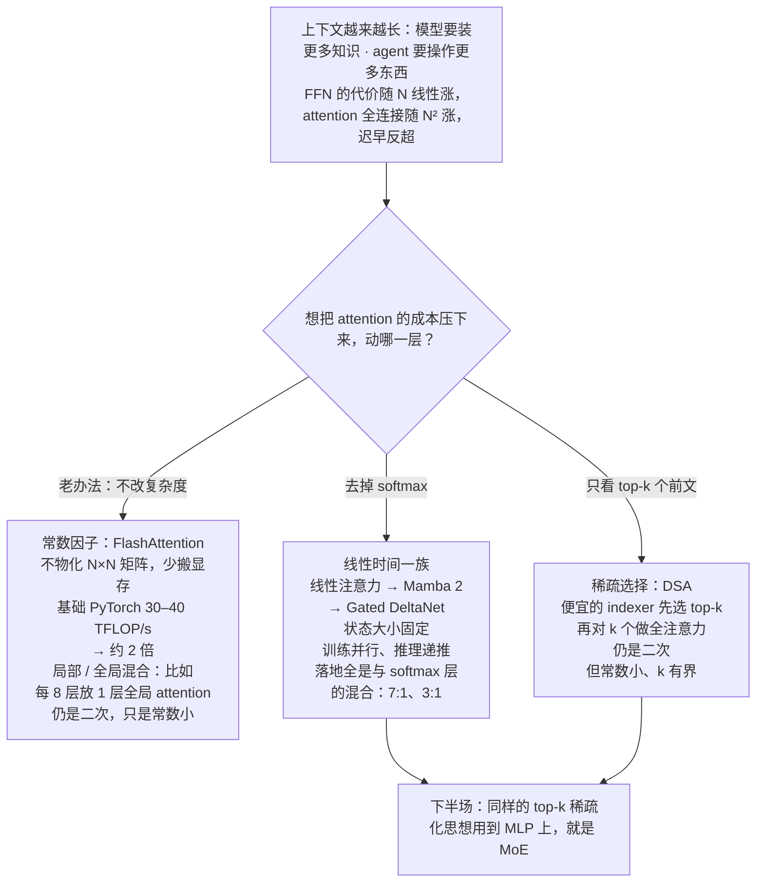
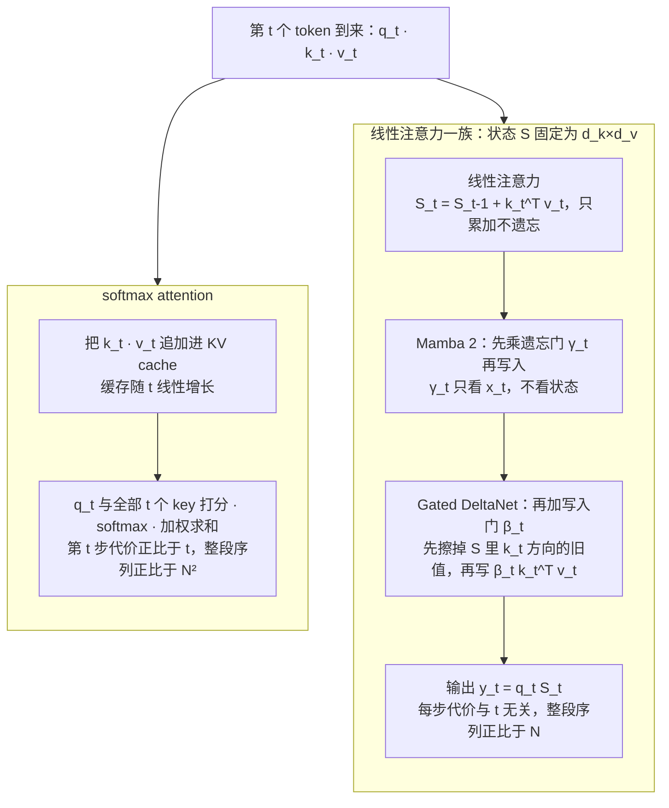
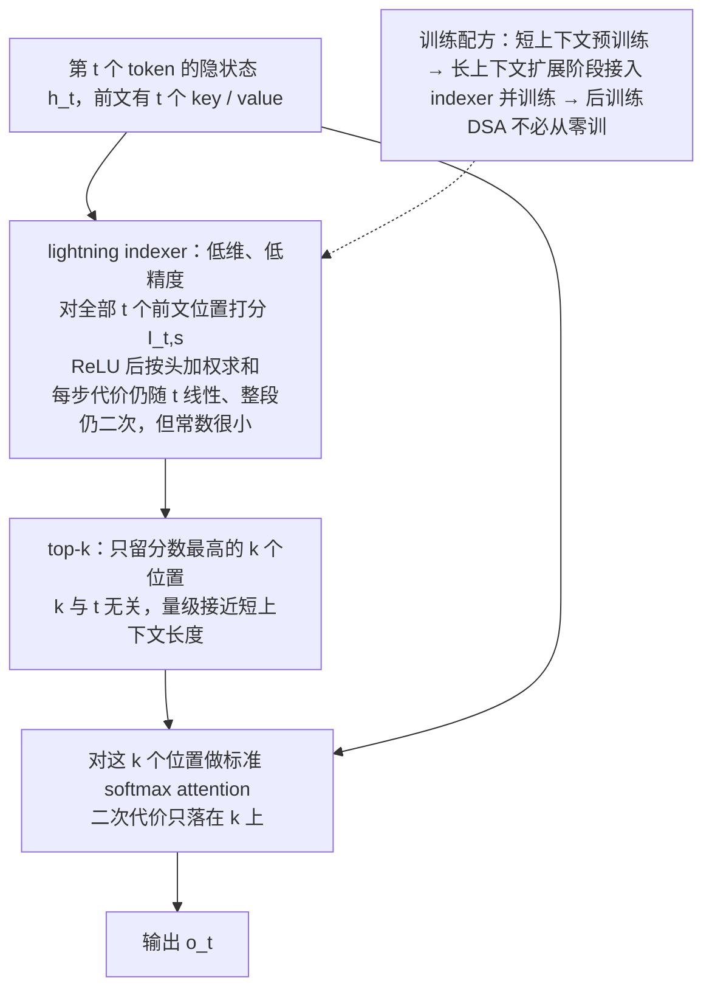
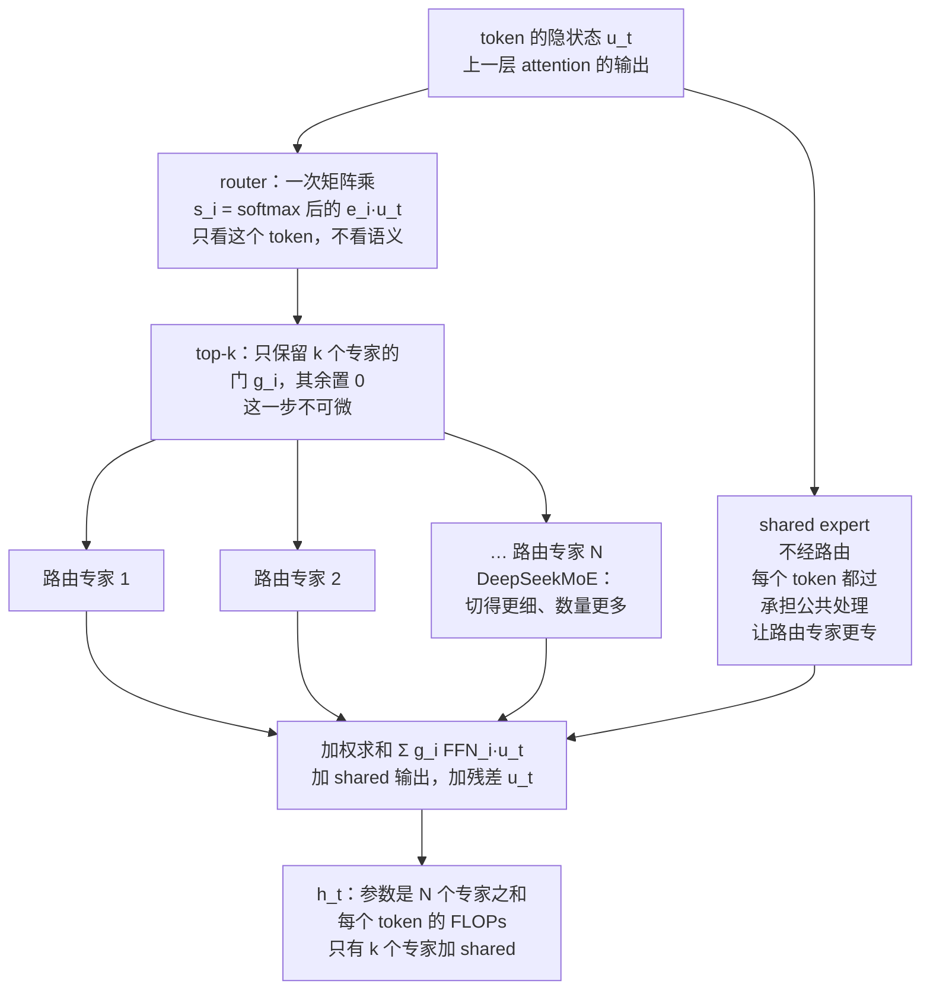
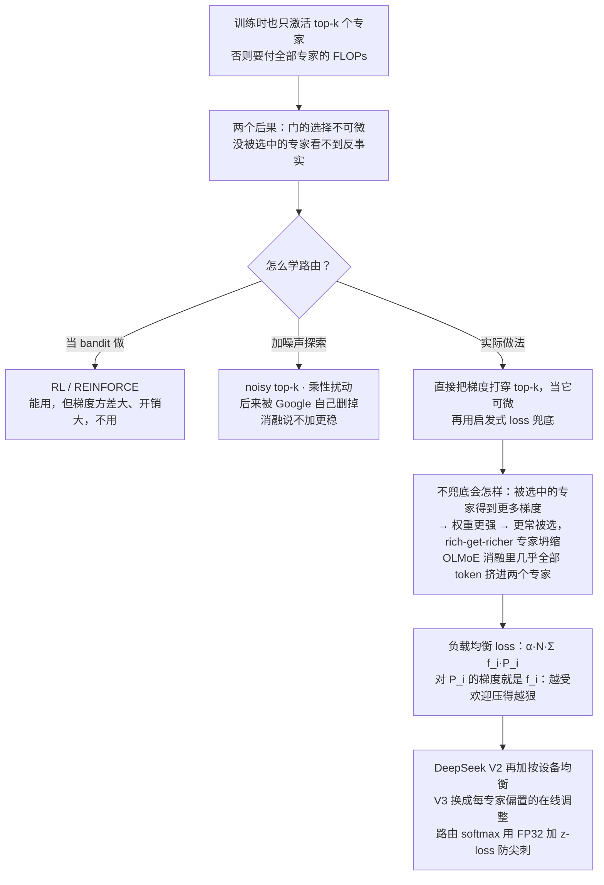
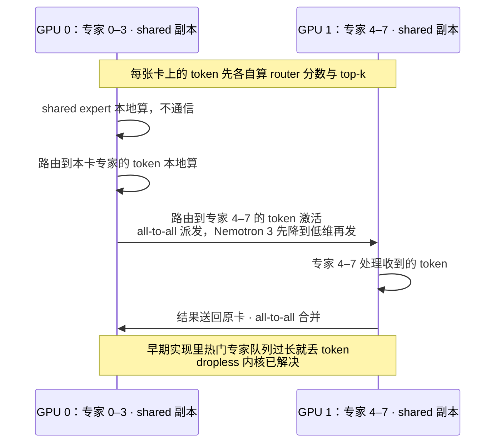

# CS336 第 4 讲｜注意力的替代方案（Attention Alternatives）

> Stanford CS336: Language Modeling from Scratch（2026 春）· 第 4 讲
> 视频：<https://www.youtube.com/watch?v=cKSwj_qZ8Jg>（1:26:20；英文字幕为自动生成，模型名和论文名错得多，见文末勘误）
> 讲者：Tatsunori Hashimoto（全程；开头说"上一讲讲的是基础 Transformer"、结尾说"推理部分 Percy 之后讲"，可以确认）
> 课程主页：<https://stanford-cs336.github.io/> · 本讲围绕的论文：[Mamba 2](https://arxiv.org/abs/2405.21060) · [Gated DeltaNet](https://arxiv.org/abs/2412.06464) · [DeepSeek-V3.2（DSA）](https://arxiv.org/abs/2512.02556) · [Switch Transformer](https://arxiv.org/abs/2101.03961) · [DeepSeekMoE](https://arxiv.org/abs/2401.06066) · [OLMoE](https://arxiv.org/abs/2409.02060) · [DeepSeek-V3](https://arxiv.org/abs/2412.19437)
> 标题只写了 attention，实际前 34 分钟讲 attention 的替代方案，后 52 分钟讲 MoE——讲者把两者看成同一件事：一个改 attention 块，一个改 MLP 块。

**一句话**：上下文一长，attention 的 N² 就压过 FFN 的 N，本讲给出两条压成本的路和一套"稀疏化 MLP"的做法——把 softmax 去掉，attention 就靠矩阵乘法的结合律变成 O(N·d_k·d_v)，还能改写成状态大小固定的 RNN（训练用并行形式、推理用递推形式），再加只依赖输入的门就得到 Mamba 2 和 Gated DeltaNet，但没有人在大规模上证明过纯线性方案，落地的全是 7:1、3:1 的混合；另一条路是 DeepSeek V3.2 的 DSA，用便宜的 indexer 先选 top-k 个 token 再做全注意力，仍是二次但常数小；下半场的 MoE 把一个 FFN 换成"路由器 + 多个专家"，同样的 FLOPs 装进几倍的参数，代价是 top-k 路由不可微、专家会坍缩、系统会堵——靠负载均衡 loss、路由器用 FP32 加 z-loss、dropless 内核这一套启发式才驯服，DeepSeek V1 到 V3 就是这套做法的标准答案。

## 时间轴

| 时间 | 内容 |
|---|---|
| [0:05](https://www.youtube.com/watch?v=cKSwj_qZ8Jg&t=5s) | 开场：本讲两件事——改 attention（对序列长度线性）与改 MLP（MoE） |
| [1:37](https://www.youtube.com/watch?v=cKSwj_qZ8Jg&t=97s) | 上下文长度竞赛；FFN 与 attention 的算力占比随序列长度反转；工具箱：局部/全局混合、FlashAttention 这类常数因子 |
| [5:41](https://www.youtube.com/watch?v=cKSwj_qZ8Jg&t=341s) | 线性注意力：去掉 softmax，用结合律把 N² 换成 N·d_k·d_v |
| [8:14](https://www.youtube.com/watch?v=cKSwj_qZ8Jg&t=494s) | 线性注意力的 RNN 形式：固定大小的状态 S，训练并行、推理递推；MiniMax M1 的 7:1 混合 |
| [11:17](https://www.youtube.com/watch?v=cKSwj_qZ8Jg&t=677s) | Mamba 2：只依赖输入的遗忘门 γ_t；Nemotron 3 用它做轻量层 |
| [14:20](https://www.youtube.com/watch?v=cKSwj_qZ8Jg&t=860s) | 经验法则：门只看输入就保住对偶性；Gated DeltaNet 的写入门 β_t 与"先擦后写"；Qwen3-Next / Qwen 3.5 的 3:1 |
| [18:57](https://www.youtube.com/watch?v=cKSwj_qZ8Jg&t=1137s) | 混合比例的对照研究：RNN 层占比越高、长上下文越差；问答：哪一步有损、输出里的 D·v_t 直通项 |
| [22:59](https://www.youtube.com/watch?v=cKSwj_qZ8Jg&t=1379s) | DeepSeek V3.2 的 DSA：轻量 indexer 选 top-k 再做全注意力；长上下文扩展阶段再接入；GLM 5 的消融 |
| [27:04](https://www.youtube.com/watch?v=cKSwj_qZ8Jg&t=1624s) | 问答：indexer 仍是二次但常数小；短上下文预训练 → 长上下文扩展 → 后训练；FP4 attention；SSM 的代价是表达力 |
| [34:16](https://www.youtube.com/watch?v=cKSwj_qZ8Jg&t=2056s) | MoE 开讲：一个更高效的 MLP；同算力下参数越多越好（Switch、OLMoE、DeepSeek V2、Qwen1.5-MoE） |
| [39:54](https://www.youtube.com/watch?v=cKSwj_qZ8Jg&t=2394s) | expert parallelism 是新的并行轴；谁在做 MoE；问答：通信代价、训练时也稀疏、按 token 路由 |
| [45:27](https://www.youtube.com/watch?v=cKSwj_qZ8Jg&t=2727s) | 为什么 MoE 火得慢；设计三轴；token choice 还是 expert choice；四种路由函数 |
| [53:04](https://www.youtube.com/watch?v=cKSwj_qZ8Jg&t=3184s) | top-k 路由公式；DeepSeekMoE 的细粒度专家与 shared experts；OLMoE 的不同结论 |
| [58:40](https://www.youtube.com/watch?v=cKSwj_qZ8Jg&t=3520s) | 训练 MoE：非可微与反事实两个难题；RL、noisy top-k、Switch 的乘性扰动都不是主流 |
| [1:03:19](https://www.youtube.com/watch?v=cKSwj_qZ8Jg&t=3799s) | 专家坍缩；Switch 的负载均衡 loss 及其梯度含义；DeepSeek 的按设备均衡与 V3 的免辅助 loss；OLMoE 去掉均衡 loss 的消融 |
| [1:11:30](https://www.youtube.com/watch?v=cKSwj_qZ8Jg&t=4290s) | 系统：expert parallelism、块对角稀疏矩阵乘、Nemotron 3 先降维再通信、token dropping 与 dropless |
| [1:16:40](https://www.youtube.com/watch?v=cKSwj_qZ8Jg&t=4600s) | 稳定性：路由 softmax 用 FP32 与 z-loss；MoE 微调容易过拟合；upcycling |
| [1:22:15](https://www.youtube.com/watch?v=cKSwj_qZ8Jg&t=4935s) | DeepSeek V1 → V2 → V3 的演进；MLA 与 MTP；收尾 |

## 核心内容

### 1. 为什么要动 attention：N² 迟早压过 FFN 的 N



*图 4-1｜压 attention 成本的四条路，以及它们和下半场 MoE 的关系（自绘示意）· [▶ 看原幻灯片 2:39](https://www.youtube.com/watch?v=cKSwj_qZ8Jg&t=159s)*

- **需求侧**：讲者先放一张各家模型上下文窗口随时间的图（纵轴对数），头部厂商都在抢着把窗口做大——要往上下文里塞更多知识，agent 要操作更多东西。
- **成本侧**：同一页右边是 FFN 与 attention 的算力之比随序列长度 N 的变化。FFN 是逐 token 的运算，代价随 N 线性；attention 是全体位置两两交互，随 N² 涨。序列短时大模型的成本大头在 FFN，序列一长 attention 就反超，而且越来越离谱。
  > 小注：按第 2 讲的记账方式可以算出反超点。一层里 attention 的二次部分（QK^T 和 PV 两次矩阵乘）约 4·N²·d FLOPs，FFN 约 16·N·d²（两次 d 到 4d 的矩阵乘；SwiGLU 三个矩阵配 8/3·d 的中间维也是这个数），比值是 N/(4d)：d = 4096 时 N 过 16k 二次项就开始占大头，d = 8192 时是 32k——还没算 attention 里 QKV 和输出投影那 8·N·d² 的线性部分。
- **已有的工具箱**（图 4-1）
    - *局部 / 全局混合*：多数层只看邻近窗口，每隔几层放一层全局 attention（讲者的例子是每 8 层一层），成本就大体可控。
    - *系统工程，常数因子*：讲者强调这一点被严重低估。理论出身的人习惯只看大 O，但对上下文成本影响最大的单项工作其实是 FlashAttention——它没改 attention 的数学，只是把计算重排得对内存友好、少搬数据。课上的吞吐图：基础 PyTorch 在较短序列上约 30–40 TFLOP/s，FlashAttention 直接翻倍；有些长度下基础实现根本放不下 N×N 的打分矩阵，FlashAttention 不物化它，还能继续跑，只是慢。第 6 讲和作业 2 会亲手写它（CME295 第 4 讲讲过 tiling 的思路，不重复）。
- **但常数因子救不了 500 万、1000 万 token**。要到那个量级，得有对 N 线性的方案。多年来试过很多、失败过很多，最近两年才出现一批在大规模、在生产里验证过的配方——讲者说这是他第一年在课上讲线性时间 attention，因为它终于被证明真的能用。

### 2. 线性注意力：去掉 softmax，用结合律把 N² 换掉



*图 4-2｜每来一个 token，softmax attention 与线性注意力一族各自做什么、带着多大的状态（自绘示意）· [▶ 看原幻灯片 8:14](https://www.youtube.com/watch?v=cKSwj_qZ8Jg&t=494s) · 出处：[Katharopoulos et al., 2020](https://arxiv.org/abs/2006.16236)（应出自）*

- **只需要一个核心想法**：矩阵乘法的结合律。讲者把 attention 写成 ρ(QK^T)V，ρ 是逐行 softmax；先假装 ρ 不存在——

$$
\mathrm{Attn}(Q,K,V)=\rho\!\left(QK^{\top}\right)V\quad\xrightarrow{\;\rho=\mathrm{id}\;}\quad (QK^{\top})\,V \;=\; Q\,(K^{\top}V)
$$

Q、K、V 各有 N 行（N 是序列长度），列数分别是 d_k、d_k、d_v。左边先算 QK^T，得到 N×N 矩阵，代价 N²·d_k；右边先算 K^T V，得到 d_k×d_v 的小矩阵，代价 N·d_k·d_v，再乘 Q 也是 N·d_k·d_v。

- **换掉的是什么**：二次项从 N² 变成 d_k·d_v。N 是上下文长度，可以是百万级；d 是隐层维度，通常几千到几万，没人把隐层做到一百万。所以对 N 的依赖从二次降到一次。
- **它还是一个 RNN**：把 Q(K^T V) 按位置从左到右展开，就是一个递推——

$$
S_t = S_{t-1} + k_t^{\top} v_t,\qquad y_t = q_t\,S_t,\qquad S_t\in\mathbb{R}^{d_k\times d_v}
$$

k_t、v_t、q_t 是第 t 个 token 的 key、value、query（行向量），S_t 是前 t 个 token 的 k^T v 累加起来的状态，大小固定为 d_k×d_v，与 t 无关；输出只要拿 q_t 乘一下当前状态。

- **两种形式，各取所需**
    - 稠密形式（矩阵式）：一次大矩阵乘，可并行，训练用；
    - 递推形式：状态大小固定，一路往前带，推理用。传统 RNN 推理好、训练难；线性注意力两头都占。
    - 对照 softmax attention：推理时得把全部前文的 K、V 存着——这就是 **KV cache**（为免重算而缓存的历史 key / value，随上下文线性增长，第 10 讲的主角），每生成一个 token 都要对全部前文打分；线性注意力的"KV cache"只是一个 d_k×d_v 的 S（图 4-2）。
- **代价**：讲者一句话点破——可惜它是线性的。去掉 softmax 这一步有损（后面问答再确认），表达力掉了一截。

```python
# 同一个算子的两种算法，结果相同（省略归一化与因果掩码）
def dense_form(Q, K, V):            # 训练：一次大矩阵乘，可并行
    return Q @ (K.T @ V)            # (N,dk)@(dk,dv)：代价 N·dk·dv，N×N 从不出现

def recurrent_form(Q, K, V):        # 推理：状态 S 固定为 dk×dv
    S = zeros(dk, dv); ys = []
    for q, k, v in zip(Q, K, V):    # 逐 token 扫过
        S = S + outer(k, v)         # 只累加，不遗忘
        ys.append(q @ S)
    return stack(ys)
```

这段展示的是对偶性本身：稠密形式里 N×N 矩阵从不出现，递推形式里状态大小与 t 无关。

> 小注：课上省掉了两件事。一是真正的线性注意力（Katharopoulos et al., 2020，"Transformers are RNNs"）不是简单丢掉 softmax，而是把 exp(q·k) 换成特征映射 φ(q)·φ(k)，再除以一个同样可递推的归一化项；二是带因果掩码时稠密形式不能直接写成 Q(K^T V)，训练实际用的是分块算法——块内当 attention 算、块间传状态，Mamba 2 论文的 SSD 算法就是这个。

- **落地例子：MiniMax M1**。一个规模不小、性能不错的中国开源模型，用 7:1 的混合——七层线性注意力配一层完整的 softmax attention，和 OpenAI o3、DeepSeek R1 等比也拿得出手；因为还有 softmax 层，对上下文长度的依赖不是纯线性，但温和得多。讲者的结论：至今没有人在大规模上验证过纯线性的 attention，接下来讲的全是混合。
  > 小注：MiniMax-M1 论文摘要：456B 总参数、每 token 激活 45.9B，原生 100 万 token 上下文（DeepSeek R1 的 8 倍），RL 阶段用 512 张 H800 训了三周，租金 53.47 万美元。

### 3. 加门：Mamba 2 与 Gated DeltaNet，门只许看输入

- **Mamba 2**：想要比线性注意力更"像神经网络"的更新，看它的 RNN 形式就行。线性注意力的毛病是状态永远往前传，LSTM 时代就知道要学会什么时候传、什么时候忘，Mamba 2 就是给状态加一个遗忘门：

$$
S_t=\gamma_t\,S_{t-1}+k_t^{\top}v_t,\qquad y_t=q_t\,S_t + D\,v_t,\qquad \gamma_t=\gamma(x_t)
$$

γ_t 是由当前输入 x_t 算出的门，控制旧状态保留多少；D·v_t 是讲者为求完整才写上的项——当前 token 的 value 像残差一样直通到输出，D 控制直通量，与状态更新无关（问答里有人问了它）。

- **关键约束，也是往下推广的经验法则**：门只由输入决定、不含状态，状态相关的项只有 S，就仍能展开成一次大矩阵乘（训练）或按步递推（推理），对偶性保住；照这个法则可以继续往递推里加东西。Mamba 系列（Albert Gu、Tri Dao 等人的 state space model 一族，已出到 Mamba 3）原本从状态空间理论推出，但实际做的事就是线性注意力加一个门。
  > 小注：Mamba 2 论文（Dao & Gu, 2024）把这种"递推形式与矩阵形式等价"的关系起名 state space duality（SSD），标题就叫 Transformers are SSMs。
- **落地**：Nemotron 3（第 3 讲提过）用 Mamba 2 做轻量层，隔一段放一层 softmax attention，靠交替方式平衡推理成本与表达力；和 Qwen 3 thinking、GPT-OSS 比性能不差，长上下文下吞吐更好——讲者的定位是"小号前沿模型"。
- **Gated DeltaNet**：讲者认为是目前用得最广的 SSM，Qwen 3.5 做了大规模验证。相对 Mamba 2 加了两样：

$$
S_t=\gamma_t\left(I-\beta_t\,k_t^{\top}k_t\right)S_{t-1}+\beta_t\,k_t^{\top}v_t
$$

β_t 是第二个门，由输入算出，β_t = 0 表示"这个 token 什么都不写进状态"（LSTM 的输入门）；括号里的 I − β_t k_t^T k_t 是 DeltaNet 的"delta"部分——写入之前先把状态里沿 k_t 方向的旧内容投影掉，等于"先擦掉这个 key 下存的旧值，再写新值"，而不是简单按 1 − β_t 衰减。讲者提醒 k_t 没有单位化，"投影"只是直觉。

> 小注：把括号展开就看出名字的来历：S_t = γ_t·[S_{t-1} + β_t·k_t^T·(v_t − k_t·S_{t-1})]——k_t·S_{t-1} 是状态对这个 key 当前"记得"的 value，更新量正比于新旧 value 之差（delta rule）。

- 这个投影式更新被独立发明过多次：解某类 meta-learning 的最小二乘问题会得到它，fast weight programming、test-time training 从完全不同的原则出发也落到同一个解。

```python
# 三种递推只差在"写入前对 S 做什么"；γ、β 都只由 x_t 算出，不看 S
def step(S, q, k, v, gamma=1.0, beta=1.0, delta=False):
    if delta:                            # Gated DeltaNet：先擦掉 k 方向上的旧值
        S = S - beta * outer(k, k @ S)   # (I - beta k k^T) S
    S = gamma * S + beta * outer(k, v)   # Mamba 2：gamma<1 表示遗忘；线性注意力：gamma=beta=1
    return S, q @ S
```

一步递推就够看出三者的差别：线性注意力只累加，Mamba 2 先衰减，Gated DeltaNet 先擦后写。

- **落地**：Qwen3-Next 和之后的 Qwen 3.5（讲者称是今天最好的开源模型之一）用 3:1 的 Gated DeltaNet 与 attention 混合。课上的三联图：解码吞吐随上下文变长比 Qwen 3 高得多；和闭源与上一代模型比，混合架构几乎不损性能。
- **混合比例的对照研究**：讲者说这类受控研究很少，能找到的一篇（ByteDance Seed 与 UC Santa Cruz）比较了 Mamba 2、Gated DeltaNet 等架构在不同混合比例下的表现：虚线是全 attention 的水平，横轴向右是 RNN 层越来越多。结果有点乱，要点清楚——最好的几个架构（Gated DeltaNet 及变体）低比例时几乎没有损失，过了某个点长上下文性能明显下滑，纯 RNN 时全都明显变差。单 key 检索各家都专门优化过，看 QA 更诚实：RNN 层占比越高，性能稳定往下掉。
  > 小注：应为 Wang et al., 2025《A Systematic Analysis of Hybrid Linear Attention》（作者含 ByteDance Seed 与 UCSC）：72 个模型、六种线性注意力乘五种混合比例；单独强的线性模型不一定适合做混合，召回在 3:1 以下随全 attention 层数明显提升，推荐 Gated DeltaNet 或 HGRN-2 配 3:1 到 6:1。
- **问答**
    - 并行形式和递推形式不是等价吗，怎么会掉性能？讲者拆成两步：softmax attention 到线性形式（丢掉 ρ）这一步有损；线性形式到递推形式是精确等价。
    - 这些方法虽然多，但绝大多数最后都收敛到了非常像 LSTM 的东西：线性注意力式的递推加几个门。
    - 去掉 softmax 会不会有训练稳定性问题？讲者没见过文献说有；softmax 本身反倒常是不稳定的来源，去掉应该更稳。
- **SSM 到底放弃了什么**（问答）：表达力。softmax attention 的全连接极其强大，也容易训。过去 attention 相对 LSTM 还有硬件效率的优势——能并行训练——现在被对偶性抹平了；剩下的取舍是有限的状态必须装下整段上下文：状态和上下文一样大当然行，但那就回到大代价；想要小状态，就得压缩大上下文的信息，目前没有免费午餐。

### 4. 另一条路：DSA——先选 top-k 个 token，再做全注意力



*图 4-3｜DSA 的前向：便宜的 indexer 选位置，贵的 attention 只做 k 个（自绘示意）· [▶ 看原幻灯片 23:30](https://www.youtube.com/watch?v=cKSwj_qZ8Jg&t=1410s) · 出处：[DeepSeek-AI, 2025](https://arxiv.org/abs/2512.02556)*

- **思路**：DeepSeek V3.2 的 DSA（DeepSeek Sparse Attention）不对全部 token 做 attention，先用一个轻量的 indexer 从长上下文里挑出远小于全长的一个子集，再只对这个子集做完整的 attention。前向的机制很简单：

$$
I_{t,s}=\sum_{j=1}^{H_I} w_{t,j}\;\mathrm{ReLU}\!\left(q^{I}_{t,j}\cdot k^{I}_{s}\right),\qquad \mathcal{S}_t=\mathrm{TopK}_s\,(I_{t,s}),\qquad o_t=\mathrm{Attn}\big(q_t,\{k_s,v_s\}_{s\in\mathcal{S}_t}\big)
$$

I_{t,s} 是位置 t 对前文位置 s 的索引分数：indexer 有自己的一组小 query q^I 和 key k^I（H_I 个头），内积过 ReLU 后按头加权 w 求和；对每个 t 取分数最高的 k 个位置组成集合 S_t，真正的 attention 只在这 k 个位置的 k_s、v_s 上算。

```python
# DSA 前向：先用便宜的 indexer 给每个前文位置打分，只对 top-k 做真正的 attention
def dsa(h, cache, k=2048):
    qI, wI = index_query(h)                          # 低维、低精度的索引用 q 与各头权重
    scores = (wI[:, None] * relu(qI @ cache.kI.T)).sum(0)   # 看全部前文：O(t)，但常数小
    idx = topk(scores, k)                            # 只留 k 个位置，k 与 t 无关
    return attention(h, cache.K[idx], cache.V[idx])  # 二次代价只在 k 上
```

要看的是两级成本：打分这一步仍要扫全部前文，只是每个位置便宜得多；昂贵的 attention 被限制在 k 个位置上。

- **不用从头训**：带着 indexer 从零预训练又烦又复杂；DSA 和 GLM 都表明可以先训普通 Transformer，到长上下文扩展阶段再接入 indexer、训模型适应它——这一步本来就要做，顺手把省成本的东西装上，算力开销不大。讲者说这个不可微的 top-k 看着吓人，居然能事后接上；下半场会看到它没那么可怕。
- **效果**：V3.2 与当时的前沿模型（讲者举的是 Claude 4.5 Sonnet、Gemini 3）打平；prefill（一次性处理输入提示）和 decoding（逐 token 生成）的成本随上下文长度的曲线都远好于没有稀疏 attention 的上一代 DeepSeek。GLM 5（讲者认为是目前最好的开源模型之一）独立采用了 DSA，论文里有干净的消融——带 warm-up 的 DSA、直接 DSA、不用 DSA：完整 DSA 训练相对全 attention 损失很小，连 RNN 类架构最怕的长上下文检索也是。
  > 小注：据 DeepSeek-V3.2-Exp 技术报告（2025 年 9 月）：k = 2048；indexer 用 FP8 算；接入分两步——先冻结主模型、让 indexer 学着模仿全 attention 的分布（dense warm-up），再切到稀疏训练。V3.2 正式版（2025 年 12 月）沿用了 DSA。
- **它不是线性时间**：indexer 仍要算 t 对全部前文的内积，整段序列还是二次。但 indexer 可以做得很便宜——降到低维、权重矩阵做小、用更低精度；第二级虽是二次，却是 k 上的二次，k 有界、不随输入长度涨，取值接近短上下文长度。讲者的总结：别太纠结二次还是线性，常数因子经常才是关键。
- **问答**
    - FP4 attention 可行吗？indexer 的设计部分就是冲着低精度去的：softmax 的上溢下溢让低精度很难受，"低精度选位置、全精度算 attention"是合理分工；全 attention 直接做到 FP4 或更低，讲者不知道有好办法。
    - 未来的 attention 长什么样？讲者不押注单一架构，估计是把所有有效的招都堆进去；更上面还有一层——用后训练让模型自己管理上下文（compaction、retrieval），架构层和这一层的整合会是接下来的工作。做 agent 的人应该对这句话有感觉。

### 5. MoE 是什么、为什么大家都在用



*图 4-4｜一个 MoE 层：router 只看当前 token，top-k 之外的专家不算（自绘示意）· [▶ 看原幻灯片 35:18](https://www.youtube.com/watch?v=cKSwj_qZ8Jg&t=2118s) · 出处：[Dai et al., 2024](https://arxiv.org/abs/2401.06066)*

- **定义**：概念上 MoE 不改变游戏规则——它就是一个更高效的 MLP。把 Transformer 块里的 FFN 换成若干个 FFN（比如 4 个，每个和原来一样大），再有一个机制告诉你每个输入该走哪一个：FFN 的参数变成 4 倍，但每次前向或反向只付一个 FFN 的代价。早期论文的动机就是这么"参数中心"的：相信参数多是好事，又不想为参数付算力。CME295 第 3 讲对 MoE 只是概览，这里往下挖。
- **为什么每个人都在用**：Hugging Face 上超过某个规模的模型如今清一色是 MoE，因为经验上，总算力不变、只增加稀疏参数，模型就是会变好。
    - Switch Transformer（Fedus et al., 2022）：激活参数固定，专家数越多，语言模型的测试 loss 越低；横轴换成训练算力，同样算力下专家越多越好。训练和推理都是白赚。
    - OLMoE（AI2 的开源 MoE 研究）：同样的图，训练 loss、验证 loss、下游指标都是 MoE 领先，讲者的说法是训练快大约 2 倍。
    - DeepSeek V2 和更早的 DeepSeek MoE 刚出来时，激活参数远少于别家的稠密模型，MMLU 不输甚至更好；Qwen1.5-MoE 只激活 2.7B，赢了当时不少 7B 模型。中国团队（Qwen、DeepSeek、MiniCPM）是最早训练并推广 MoE 的一批，西方的大 MoE 是 Llama 4 和 GPT-OSS，之后西方的开源发布基本停了。
- **第三个理由：多一个并行轴**。LLM 太大，单卡既训不了也推不了，要有多种切法（第 7、8 讲）。每个专家天然是一块，可以放到不同设备上，把激活路由过去——这叫 expert parallelism，多了一个可优化的维度。
- **问答**
    - 专家分在不同设备上不会有通信瓶颈吗？会。你用通信换更多的总算力和更少的显存，是否划算取决于拓扑。后面会展示一个减通信的技巧。
    - 训练时也稀疏吗？是，这正是 MoE 难的根源：只有 k 个专家被激活，其余专家发生了什么你看不到，却得学会路由——带 bandit 味道的问题，但业界不用 RL 也不用 bandit，用启发式加深度学习的"魔法"。
    - 路由的粒度？token 级，每个 token 选自己的专家。router 极其朴素，一次矩阵乘，不会判断"这是医学问题"，更像"这个 token 看着像日语，送去 7 号专家"。
    - 并行有上限吗？有，切得越多通信越炸；作业会让你在给定网络拓扑下决定怎么切。
- **为什么火得慢**：Google 2022 年就在猛推，2024 年以后才真正流行；做研究的人至今也多用稠密模型。原因是麻烦：基础设施复杂，专家难以高效并行，参数太多单卡放不下，训练还会炸（后面会看到怎么炸）。也有人把 attention 块做成 MoE，少见且不好驯，大模型都只 MoE 化 FFN。

### 6. 设计轴一、二：路由函数与专家粒度

- **三个设计轴**：路由函数、专家大小（预算固定时，多而小还是少而大）、训练。前提都一样：只激活一部分专家，所以总要选 top-k。
- **谁选谁**：token 选专家（token choice），或专家选 token（expert choice，每个专家挑自己最喜欢的 token），或一个全局路由器统筹分配。几乎所有 MoE 都是 token choice top-k。OLMoE 的对照：token choice 验证 loss 更低、下游更高；expert choice 也能训，只是更难调（讲者记得某个未发布的 Llama 4 用过 expert choice，但不算背书）。
- **路由函数的四种做法**
    - *内积路由*：每个专家一个向量，和输入做内积、取最近的——Switch Transformer、GShard、GLaM、Grok、Mistral、DBRX、DeepSeek 都是，k 各家不同。
    - *哈希路由*：不学，直接把输入哈希到不同 FFN。讲者一直觉得神奇——这居然也有收益，只是不如 top-k；论文里常做 baseline，生产里不用。
    - *RL 学路由*：把路由器当策略，用强化学习学（Bengio 等人 2013 年的工作）。从学习理论看这是最自然的建模，但 RL 的开销和随机性太大，而启发式配方已经把简单 top-k 调通了，没理由复杂化。
    - *线性分配*：先算所有 token 与专家两两的匹配分，再解线性分配问题求全局最优——讲者作为"喜欢讲道理的人"很喜欢它，但太贵，没在大规模上出现过。
- **top-k 路由的公式**——认出这个模式很重要，DSA 里刚见过，H-Net 里也会见到：

$$
s_{t,i}=\mathrm{softmax}_i\!\left(e_i^{\top}u_t\right),\qquad g_{t,i}=\begin{cases}s_{t,i}& i\in\mathrm{TopK}(s_t,k)\\0&\text{otherwise}\end{cases},\qquad h_t=u_t+\sum_{i=1}^{N}g_{t,i}\,\mathrm{FFN}_i(u_t)
$$

u_t 是这个 token 进入 MoE 层的向量，e_i 是第 i 个专家的路由向量，s_{t,i} 是 softmax 后的分数；只有分数前 k 名的专家门 g 非零，输出是残差加上这 k 个专家输出的加权和。门的学习只靠 e_i 与 u_t 的内积，非常轻。

- **DeepSeekMoE 的两个改动**（图 4-4）
    - *shared experts*：有些处理是所有 token 都需要的，与其让每个路由专家各自重复学，不如设几个"常开"专家绕过 router、每个 token 都过，让其余专家更专。
    - *细粒度专家*：把大专家切成更小的块，数量更多。
    - DeepSeek 的消融：0 个 shared 加 16 个大路由专家（GShard 的老设计）对比细粒度专家加 1 个 shared，两项改动都有明显收益，shared expert 在 TriviaQA、Natural Questions 上尤其大。OLMoE 的受控消融则认为 shared expert 帮助不大、细粒度多专家有用——两家在 shared 上意见不一。
- **谱系**：最早的三个 MoE 都来自 Google；Mistral、DBRX、Grok 是西方早期的尝试；DeepSeek V1 提出细粒度加 shared 的设计后，大家都跟了——像稠密模型都抄 Llama 一样，MoE 都抄 DeepSeekMoE 和 DeepSeek V3，Qwen 3.5、GLM 里两样都在。
- **问答**：有 shared expert 时怎么并行？它没有并行收益，每个激活都得过；可以把 shared expert 复制到每张卡上，用显存换通信。

### 7. 设计轴三：训练——不可微的 top-k 怎么学



*图 4-5｜训练 MoE 的两个难题、三条路，以及实际用的那条上的两股相反的力（自绘示意）· [▶ 看原幻灯片 1:03:19](https://www.youtube.com/watch?v=cKSwj_qZ8Jg&t=3799s) · 出处：[Fedus et al., 2022](https://arxiv.org/abs/2101.03961)*

- **难在哪**：训练时不能激活全部专家，否则付全额 FLOPs。可一旦稀疏，门的决策就不可微，没选中的专家发生了什么也看不到。讲者说自己最初觉得这东西不可能训好，结果一堆技巧叠起来居然稳定有效。
- **三条路**：RL 学门策略；随机扰动（探索—利用那一套）；用启发式平衡专家。实际用的是第三条，前两条讲者也过了一遍：
    - *RL*：Clark 等人的论文里 REINFORCE 学路由（图上绿线）能用，但梯度方差大、复杂，被同一篇论文提出的其他方法轻松超过。
      > 小注：应为 Clark et al., 2022《Unified Scaling Laws for Routed Language Models》，字幕里成了"Clark 2020"；论文比较了 REINFORCE 路由、哈希路由和基于 Sinkhorn 的 S-BASE。
    - *noisy top-k*（Shazeer 等人最早的 MoE 论文）：训练时不做硬决策——路由内积上加一个尺度随输入变化的噪声，再取 top-k、做 softmax：两个专家分数接近时随机选一个，反传把有用的专家推高，等于打破平局、多探索；softmax 还让模型学会给 k 个专家排序。
    - *乘性扰动*（Switch Transformer）：均匀的乘性噪声，为了让专家更鲁棒；后来 Google 自己的路由论文删掉了它，消融显示不加任何随机技巧，稳定性和最终质量反而更好。
- **启发式的核心：平衡**。不管探索、直接做梯度下降会怎样？top-k 里最强的专家拿到更多信号，权重更强，更常被选——rich-get-richer，少数专家包揽一切，其余饿死。专家坍缩是启发式训练要解决的核心问题，解法是在建模 loss 之外加一个平衡 loss，Switch Transformer 的版本：

$$
\mathcal{L}_{\mathrm{aux}}=\alpha\,N\sum_{i=1}^{N}f_i\,P_i,\qquad \frac{\partial\mathcal{L}_{\mathrm{aux}}}{\partial P_i}=\alpha\,N\,f_i
$$

N 是专家数，f_i 是一个 batch 里被派给专家 i 的 token 比例（硬计数），P_i 是 router 分给专家 i 的平均概率质量（软版本），α 是系数。讲者说这式子不是从第一性原理来的，看懂它的办法是求导：对 P_i 的梯度恰好是 f_i——一个专家拿到的 token 越多，它的概率被压得越狠，作用是在梯度空间里惩罚热门专家。

> 小注：Switch Transformer 论文默认 α = 0.01。f_i 里的硬计数不可导，梯度只经 P_i 流回 router，这正是"对 P_i 求导"就能看懂它的原因。

```python
# top-k 路由 + Switch 式负载均衡 loss（一层、一个 batch 的 T 个 token）
def moe_layer(u, experts, We, k, alpha):
    p = softmax(u @ We.T)                        # (T, N)：每个 token 对 N 个专家的概率
    g = keep_topk(p, k)                          # 未选中的门置 0：稀疏，只算 k 个专家
    y = u + sum(g[:, i:i+1] * E(u[g[:, i] > 0]) for i, E in enumerate(experts))
    f = (g > 0).float().mean(0)                  # 各专家实际分到的 token 比例（硬计数）
    P = p.mean(0)                                # 各专家拿到的平均概率质量（软）
    aux = alpha * len(experts) * (f * P).sum()   # 越热门的专家，P 上被压得越狠
    return y, aux
```

要点是两条相反的力在同一个前向里：top-k 让好专家越用越好，aux loss 把过热的专家往下压。

- **DeepSeek 的做法**（V1、V2）：梯度直接打穿专家，不管不可微和探索；加与 Switch 相同的每专家平衡 loss；再加一个**按设备平衡**的 loss——一台机器放 4 个专家、另一台放另外 4 个，两台都要满负荷，公式一样，只是把专家换成设备，纯为利用率。V3 改成每个专家一个偏置项、在线调平，去掉了大部分辅助 loss，但防极端失衡仍留了一点——目前没有完全不要辅助 loss 的方案。
  > 小注：V3 的偏置只加在 top-k 选择用的分数上，不进入门的加权；每步看各专家负载，过载减 γ、欠载加 γ（Wang et al., 2024，Auxiliary-Loss-Free Load Balancing）。
- **不平衡会怎样**：OLMoE 的消融——去掉平衡 loss，训练 loss 明显变差；更直观的是专家占用图：没有平衡时几乎所有 token 都进了两个专家（黄色和粉色那两个），有平衡时所有专家都在被均匀使用。没有它，等于扔掉了大部分参数。
- **为什么这么简单就行**：有用的专家被正反馈强化，平衡 loss 把它拉回来，两股力抵消。同一个技巧 DSA 的 top-k 和 H-Net（去 tokenizer 的尝试）里都用了；"top-k 选择加辅助 loss 兜住不可微"会是未来架构设计的常见成分。
- **问答**
    - 专家真的是"专家"吗？不是。router 太简单，不会分出医学专家、法律专家；看得到的是标点、符号、非英语字符集各去某个专家，没有语义。
    - 有了每专家平衡，为什么还要每设备平衡？前者若完全强制、专家又均匀分布在设备上，后者自动成立；但每专家 loss 不能开太大，完全均匀对训练动力学有害；设备均衡对利用率太重要，值得单独多加一点 loss。

### 8. 系统与稳定性：并行、稀疏矩阵乘、掉 token、路由器的 softmax、微调与 upcycling



*图 4-6｜expert parallelism 里谁把什么发给谁：跨卡的只有被路由走的激活（自绘示意）· [▶ 看原幻灯片 1:14:04](https://www.youtube.com/watch?v=cKSwj_qZ8Jg&t=4444s)*

- **并行的第三个轴**：数据并行到了 batch size 上限就没法再切；模型并行只能在模型天然的切点上切，切点用完也到头；expert parallelism 又给了一个轴（详见第 7、8 讲）。
- **块对角稀疏矩阵乘**：一张卡上放多个专家，朴素做法是多次小矩阵乘，但硬件喜欢能复用缓存的大矩阵乘；MoE 的计算模式天然对应块对角乃至更复杂的结构化稀疏，而这些是硬件原生支持的——讲者说这是 MoE 与硬件的协同设计。
- **减通信**（Nemotron 3 的新招）：expert parallelism 要把激活跨卡送到专家所在的设备，通信量大。shared expert 不用通信，可以保持大维度；路由专家的激活先把残差流降到低维再做集合通信（all-to-all：每张卡把各自的一份发给所有其他卡、同时收齐别人发来的），大幅省通信，又不承担整体缩小隐层维度的坏处（图 4-6）。
- **掉 token**（已解决的历史问题）：早期 MoE 基础设施里，热门专家的 token 队列越堆越长，长到一定程度就直接丢弃——返回零、假装没事。于是别的用户的请求撞上你在用的专家，会把你挤出队列，结果随负载随机变化。dropless 架构（MegaBlocks 等常见开源框架）已经没有这个问题。
- **稳定性**：第 3 讲说过指数和除法是危险区，softmax 是稳定性事故的高发地——MoE 又在路由里加了一个 softmax。Google 早期就有一整篇论文研究 MoE 的稳定性（Barrett Zoph 等），常见解法是路由器单独用 FP32，再给路由的 softmax 加 z-loss（第 3 讲讲过）。OLMoE 的消融：不加路由 z-loss，训练 loss 曲线尖刺明显。
  > 小注：Zoph 等人的稳定性论文应为 ST-MoE（2022）；路由器 FP32 加 router z-loss 都出自那里。
- **微调容易过拟合**：参数太多，直接微调专家会严重过拟合——同一张图上稠密模型的 train / val 很接近，稀疏模型差距极大（一个 GLUE 任务）。对策：只微调非 MoE 的 FFN，或只微调 attention（讲者最近常见）；或者"苦涩教训"版——用 140 万条样本，多到能把 MoE 整体重训，泛化差距就小了。
- **Upcycling**：想要 MoE 又不想从零训？把训好的稠密模型整个复制，MLP 复制成若干份专家，router 随机初始化，接着训——输入被随机分到不同专家，专家自然分化。最早的论文显示 upcycling 比继续训同一个稠密模型好；MiniCPM 把 2.4B 升成 13.4B 的 MoE，几乎白赚；Qwen 用 1.8B 升成 Qwen1.5-MoE-A2.7B，是较早的大规模成功案例。但今年讲者一个 upcycling 的模型都没见到：主力模型一开始就训 MoE，没必要先训稠密再转换。

### 9. DeepSeek V1 → V2 → V3，外加 MLA 与 MTP

| 版本 | MoE 设计 | 讲者的点评 |
|---|---|---|
| DeepSeekMoE（V1） | 细粒度专家 + shared experts；标准 top-k 路由；辅助 loss 平衡 | 现代 MoE 的原型，"柏拉图式的理想 MoE" |
| DeepSeek V2 | 同样的设计放大：2 个 shared experts、多得多的细粒度专家；加按设备路由平衡与通信平衡的辅助 loss | 用辅助 loss 去优化系统——训好大模型不只是深度学习，还得尊重你的系统 |
| DeepSeek V3 | 仍是 shared 加细粒度；改用免辅助 loss 的偏置调平；门的打分从 softmax 换成 sigmoid（讲者原话是 sigmoid 加 softmax） | 大体相同；另外带了 MLA 和 MTP 两个推理侧的好东西 |

> 小注：V3 论文的写法：用 sigmoid 算 token 对各专家的亲和度，只在选中的 k 个专家之间归一化成门值。

- **MLA（multi-head latent attention）**：不直接从隐状态 h_t 生成 Q、K、V，先生成一个低维的潜变量 c_t，再从 c_t 生成 K 和 V：

$$
c_t = W_{c}\,h_t\in\mathbb{R}^{d_c},\qquad k_t = W_{k}\,c_t,\quad v_t = W_{v}\,c_t,\qquad d_c\ll n_h d_h
$$

h_t 是 token 的隐状态，c_t 是维度 d_c 的潜变量（latent），K、V 由它线性生成；n_h·d_h 是全部头的 K 或 V 的总维度。KV cache 只需存 c_t 而不是 K、V，缓存按 d_c 与 n_h·d_h 之比缩小——这就是"latent"名字的来历。麻烦是它和 RoPE 冲突（RoPE 要逐维旋转 K，而 K 是缓存后才从 c_t 生成的），解法是留几个不经潜变量的维度专门编码位置，讲者没展开。CME295 第 2 讲讲过 GQA 靠多个 query 头共用 K、V 省缓存，MLA 是另一条路：压缩。

> 小注：DeepSeek-V2 论文摘要：MLA 把 KV cache 缩小 93.3%，最大生成吞吐提高 5.76 倍（相对 DeepSeek 67B）。

- **MTP（multi-token prediction）**：不只预测下一个 token，一次预测多个未来 token。统计上的理由是也许能更好地预测更远的未来；系统上的理由更实在——模型自带了一个投机解码器（speculative decoding：便宜的草稿先猜几个 token，主模型一次验证），能加速生成，Percy 在第 10 讲会展开。讲者说这个想法很酷但没怎么流行开。
  > 小注：DeepSeek-V3 的 MTP 是串行地多预测一个 token（深度 1），论文报告用它做投机解码时第二个 token 的接受率约 85% 到 90%。
- **收尾**：MoE 是利用稀疏性"拥有比你付费更多的参数"的聪明办法；路由问题看着难，但非常简单的做法在大规模上就能用；MoE 会长期存在，值得搞懂。

### 10. 放在一起看：每个方案对 N 的代价、要带着什么、放弃了什么

| 方案 | 对序列长度 N 的代价 | 推理时要带着什么 | 放弃了什么 | 课上的落地例子 |
|---|---|---|---|---|
| softmax attention（含 FlashAttention） | 二次；FlashAttention 只改常数 | 全部 K、V（KV cache 随 N 长） | 无损，但 N 一大付不起 | 所有主流模型 |
| 局部 / 全局混合 | 多数层线性、少数层二次 | 全局层的 KV cache | 多数层看不到远处 | 每 8 层一层全局 |
| 线性注意力 | 线性 | 固定的 d_k×d_v 状态 | softmax（这一步有损）；有限状态压不下长上下文 | MiniMax M1 的 7:1 |
| Mamba 2 / Gated DeltaNet | 线性 | 同上，多几个门 | 同上；表达力仍不及全连接 | Nemotron 3；Qwen3-Next 的 3:1 |
| DSA | 二次，但 indexer 常数极小，attention 只在 k 上 | 全部 K、V 仍要缓存（indexer 要看全部） | 每个 token 只看 k 个前文；top-k 不可微 | DeepSeek V3.2、GLM 5 |
| MoE（改 MLP） | 与 N 无关；每 token 的 FLOPs 不变 | 全部专家的参数都得驻留 | 显存、通信、路由训练的复杂度 | DeepSeek、Qwen、GLM、Llama 4、GPT-OSS |

## 关键图表速查（点时间戳跳到原幻灯片）

| 图 | 看什么 | 跳转 | 出处 |
|---|---|---|---|
| 上下文窗口随时间 + FFN/attention 算力比 | 左图纵轴是对数；右图随 N 增大曲线反转，attention 反超 FFN | [1:37](https://www.youtube.com/watch?v=cKSwj_qZ8Jg&t=97s) | — |
| FlashAttention 吞吐对比 | 蓝色基础 PyTorch 约 30–40 TFLOP/s；FlashAttention 约 2 倍；长序列下基础版直接缺数据（放不下） | [4:10](https://www.youtube.com/watch?v=cKSwj_qZ8Jg&t=250s) | [Dao et al., 2022](https://arxiv.org/abs/2205.14135) |
| MiniMax M1 性能与算力曲线 | 7:1 混合；和 o3、R1 的对比；算力随上下文的曲线远缓于纯 softmax | [9:45](https://www.youtube.com/watch?v=cKSwj_qZ8Jg&t=585s) | [MiniMax-M1](https://arxiv.org/abs/2506.13585) |
| Mamba 2 更新式 + Nemotron 3 吞吐 | 公式里 γ_t 只依赖 x_t；右图长上下文下吞吐优势 | [13:17](https://www.youtube.com/watch?v=cKSwj_qZ8Jg&t=797s) | [Dao & Gu, 2024](https://arxiv.org/abs/2405.21060) |
| Gated DeltaNet 对照 Mamba 2 | 蓝框是 I − β k^T k 的投影项；β 是写入门 | [15:20](https://www.youtube.com/watch?v=cKSwj_qZ8Jg&t=920s) | [Yang et al., 2024](https://arxiv.org/abs/2412.06464) |
| Qwen3-Next 三联图 | 右图解码吞吐随上下文拉开；中图混合架构不损性能 | [18:26](https://www.youtube.com/watch?v=cKSwj_qZ8Jg&t=1106s) | — |
| 混合比例对照研究 | 虚线是全 attention；横轴右移是 RNN 层增多；黄橙蓝三条低比例几乎不掉 | [19:28](https://www.youtube.com/watch?v=cKSwj_qZ8Jg&t=1168s) | [Wang et al., 2025](https://arxiv.org/abs/2507.06457)（应为） |
| DSA 结构图与 V3.2 成本曲线 | indexer → top-k → attention；[25:32](https://www.youtube.com/watch?v=cKSwj_qZ8Jg&t=1532s) 处 prefill、decoding 成本随长度的曲线 | [23:30](https://www.youtube.com/watch?v=cKSwj_qZ8Jg&t=1410s) | [DeepSeek-V3.2](https://arxiv.org/abs/2512.02556) |
| Switch Transformer 两张图 | 左：激活参数固定，专家数增多 loss 下降；右：同训练算力下专家多更好 | [37:21](https://www.youtube.com/watch?v=cKSwj_qZ8Jg&t=2241s) | [Fedus et al., 2022](https://arxiv.org/abs/2101.03961) |
| OLMoE 对稠密的训练曲线 | 同算力 MoE 领先，约 2 倍训练速度 | [38:23](https://www.youtube.com/watch?v=cKSwj_qZ8Jg&t=2303s) | [OLMoE](https://arxiv.org/abs/2409.02060) |
| DeepSeekMoE 消融表 | 0 shared + 16 大专家（GShard）对比细粒度 + 1 shared；TriviaQA、NQ 的蓝黄差距 | [55:35](https://www.youtube.com/watch?v=cKSwj_qZ8Jg&t=3335s) | [DeepSeekMoE](https://arxiv.org/abs/2401.06066) |
| OLMoE 去掉平衡 loss | 上：粉线有平衡、loss 正常；下：无平衡时 token 挤进两个专家 | [1:07:56](https://www.youtube.com/watch?v=cKSwj_qZ8Jg&t=4076s) | [OLMoE](https://arxiv.org/abs/2409.02060) |
| OLMoE 路由 z-loss 消融 | 不加 z-loss 的 loss 曲线全是尖刺 | [1:17:41](https://www.youtube.com/watch?v=cKSwj_qZ8Jg&t=4661s) | [OLMoE](https://arxiv.org/abs/2409.02060) |
| 微调过拟合 | 稠密 train / val 贴近；稀疏差距极大 | [1:18:11](https://www.youtube.com/watch?v=cKSwj_qZ8Jg&t=4691s) | [ST-MoE](https://arxiv.org/abs/2202.08906)（应为） |

## 提到的工作

| 名称 | 在本讲里的作用 |
|---|---|
| [FlashAttention](https://arxiv.org/abs/2205.14135)（Dao et al., 2022） | "常数因子也很重要"的证据：不改数学、只改内存访问，吞吐翻倍 |
| [Transformers are RNNs](https://arxiv.org/abs/2006.16236)（Katharopoulos et al., 2020） | 线性注意力及其 RNN 形式的出处（应出自，讲者没报论文名） |
| [MiniMax-M1](https://arxiv.org/abs/2506.13585)（2025） | 7:1 线性 / softmax 混合的大规模例子 |
| [Mamba 2](https://arxiv.org/abs/2405.21060)（Dao & Gu, 2024）· [Mamba](https://arxiv.org/abs/2312.00752) | 线性注意力加只依赖输入的遗忘门；SSM 一族 |
| Nemotron 3（NVIDIA） | Mamba 2 与 softmax 层交替的混合模型；先降维再通信的 expert parallelism 技巧 |
| [Gated DeltaNet](https://arxiv.org/abs/2412.06464)（Yang et al., 2024） | 再加写入门与"先擦后写"的 delta 更新；讲者眼中最常用的 SSM |
| Qwen3-Next · Qwen 3.5 | 3:1 Gated DeltaNet 混合；解码吞吐随上下文拉开 |
| [A Systematic Analysis of Hybrid Linear Attention](https://arxiv.org/abs/2507.06457)（Wang et al., 2025） | 混合比例的受控研究（应为这篇） |
| [Fast weight programmers](https://arxiv.org/abs/2102.11174) · [Test-time training](https://arxiv.org/abs/2407.04620) | 独立发明出同一种投影式更新的领域（推断为这两篇代表作） |
| [DeepSeek-V3.2](https://arxiv.org/abs/2512.02556)（2025） | DSA：lightning indexer 选 top-k 再全注意力；长上下文扩展阶段接入 |
| GLM 5 | 独立采用 DSA，带 warm-up 消融 |
| [Switch Transformer](https://arxiv.org/abs/2101.03961)（Fedus et al., 2022） | 专家数 vs loss 的两张图；负载均衡 loss 的原型；乘性扰动 |
| [GShard](https://arxiv.org/abs/2006.16668) · [GLaM](https://arxiv.org/abs/2112.06905) | Google 早期 MoE；内积路由；"0 shared 加 16 大专家"是 GShard 的设计 |
| [Outrageously Large Neural Networks](https://arxiv.org/abs/1701.06538)（Shazeer et al., 2017） | 最早的 MoE 论文；noisy top-k 门 |
| [OLMoE](https://arxiv.org/abs/2409.02060)（AI2, 2024） | 西方最干净的受控 MoE 研究：token vs expert choice、shared expert、平衡 loss、z-loss 的消融 |
| [DeepSeekMoE](https://arxiv.org/abs/2401.06066)（Dai et al., 2024） | 细粒度专家 + shared experts；哈希 / switch / 稠密的消融 |
| [DeepSeek-V2](https://arxiv.org/abs/2405.04434) · [DeepSeek-V3](https://arxiv.org/abs/2412.19437) | V2：按设备与通信平衡；V3：免辅助 loss 平衡、sigmoid 门、MLA、MTP |
| [Qwen1.5-MoE](https://qwenlm.github.io/blog/qwen-moe/) | 2.7B 激活赢 7B 稠密；从 1.8B 模型 upcycling 而来 |
| [MiniCPM](https://arxiv.org/abs/2404.06395) | 2.4B 升成 13.4B MoE 的 upcycling 案例；讲者喜欢它的受控消融 |
| Llama 4 · [GPT-OSS](https://arxiv.org/abs/2508.10925) | 西方的大 MoE 开源模型 |
| [Mixtral](https://arxiv.org/abs/2401.04088) · DBRX · Grok | 西方早期 MoE |
| [Hash Layers](https://arxiv.org/abs/2106.04426)（Roller et al., 2021） | 哈希路由（应为这篇） |
| [Bengio et al., 2013](https://arxiv.org/abs/1308.3432) | 用 RL 学路由的早期工作（应为这篇） |
| [BASE Layers](https://arxiv.org/abs/2103.16716)（Lewis et al., 2021） | 线性分配路由（应为这篇） |
| [Expert Choice](https://arxiv.org/abs/2202.09368)（Zhou et al., 2022） | 专家选 token 的路由（应为这篇） |
| [Unified Scaling Laws for Routed LMs](https://arxiv.org/abs/2202.01169)（Clark et al., 2022） | REINFORCE 路由的对照（应为这篇） |
| [ST-MoE](https://arxiv.org/abs/2202.08906)（Zoph et al., 2022） | MoE 稳定性：路由器 FP32、router z-loss；只微调非 MoE 层（应为这篇） |
| [Auxiliary-Loss-Free Load Balancing](https://arxiv.org/abs/2408.15664)（Wang et al., 2024） | V3 的偏置调平（小注引用） |
| [H-Net](https://arxiv.org/abs/2507.07955) | 去 tokenizer 的尝试，同样用 top-k 加辅助 loss |
| [MegaBlocks](https://arxiv.org/abs/2211.15841) | dropless MoE 框架 |
| [Sparse Upcycling](https://arxiv.org/abs/2212.05055)（Komatsuzaki et al., 2022） | upcycling 的最早论文（应为这篇） |

## 术语对照

| English | 中文 |
|---|---|
| sequence length / context length | 序列长度 / 上下文长度（N） |
| quadratic / linear (in N) | 对 N 二次 / 线性 |
| constant factor | 常数因子：不改复杂度、只改系数的优化 |
| associativity | 结合律：(QK^T)V = Q(K^T V) |
| linear attention | 线性注意力：去掉 softmax 后的 attention |
| recurrent form / dense (parallel) form | 递推形式 / 稠密（并行）形式 |
| duality | 对偶性：同一算子既能并行算、也能按步递推 |
| state | 状态：递推里一路带着的 d_k×d_v 矩阵 |
| state space model (SSM) | 状态空间模型：Mamba 一族 |
| gate（forget / input） | 门（遗忘门 γ / 写入门 β） |
| delta rule | 增量规则：按新旧 value 之差更新 |
| hybrid ratio | 混合比例：线性层与 softmax 层之比，如 7:1、3:1 |
| KV cache | 键值缓存：推理时存下的历史 K、V |
| decoding throughput | 解码吞吐：单位时间生成的 token 数 |
| prefill / decoding | 预填充（处理输入提示）/ 解码（逐 token 生成） |
| sparse attention | 稀疏注意力：每个 token 只看一部分前文 |
| indexer | 索引器：给前文位置打分、决定看谁的轻量模块 |
| top-k selection | 取前 k：不可微的硬选择 |
| long-context extension | 长上下文扩展：短上下文预训练后的续训阶段 |
| expressive power | 表达力 |
| mixture of experts (MoE) | 混合专家：多个 FFN 加一个路由器 |
| expert / router | 专家 / 路由器 |
| active (activated) parameters | 激活参数：每个 token 真正用到的参数量 |
| sparse parameters | 稀疏参数：总参数，其中大部分每次不用 |
| token choice / expert choice | token 选专家 / 专家选 token |
| shared expert | 共享专家：不经路由、常开 |
| fine-grained experts | 细粒度专家：切小、切多 |
| hash routing | 哈希路由 |
| linear assignment | 线性分配：全局最优的 token—专家匹配 |
| bandit | 老虎机问题：只观察到被选动作的反馈 |
| REINFORCE | 策略梯度的基本算法 |
| load balancing | 负载均衡 |
| expert collapse / starvation | 专家坍缩 / 饿死 |
| rich-get-richer | 强者愈强的正反馈 |
| auxiliary loss | 辅助 loss：加在建模 loss 之外的启发式项 |
| aux-loss-free balancing | 免辅助 loss 的平衡：用偏置在线调平 |
| expert parallelism | 专家并行：专家分放不同设备 |
| all-to-all | 全交换：每张卡向所有卡各发一份、同时收齐 |
| block-diagonal / structured sparsity | 块对角 / 结构化稀疏 |
| token dropping / dropless | 丢 token / 不丢 token |
| z-loss | 惩罚 softmax 的 log 配分函数偏离 0 |
| upcycling | 升级改造：把稠密模型复制成 MoE 再训 |
| multi-head latent attention (MLA) | 多头潜变量注意力：只缓存低维 c_t |
| multi-token prediction (MTP) | 多 token 预测 |
| speculative decoding | 投机解码：草稿模型先猜、主模型验证 |
| continued pre-training | 继续预训练 |

## 字幕勘误

"row"（反复出现）→ ρ（幻灯片里代表 softmax 归一化的记号，应为）；"Open as 03" → OpenAI o3；"NeMo Tron / Neumitron" → Nemotron；"Qwen Next" → Qwen3-Next；"Elmo" → OLMoE；"AIQ folks" → AI2；"MOE" → MoE；"Fit Fedus" → Fedus；"Plan"（路由器例子里）→ GLaM（应为）；"Clark 2020" → Clark et al., 2022（应为）；"Deep Seek" → DeepSeek；"H-Nets" → H-Net；"lower-dimensional latency" → latent；"Qwen 1.5A 2.7B" → Qwen1.5-MoE-A2.7B；"DSA, not do sparse attention" → DeepSeek Sparse Attention；"lightweight indexer" 与 "lightning indexer" 混用，DeepSeek 的正式名是 lightning indexer；"coms" → comms；"Minimax" → MiniMax；"top K" → top-k。

## 带走的问题

1. 用第 1 节小注的记账算一算：d = 4096、上下文 128k 时，一层 attention 的二次部分是 FFN 的几倍？换成 3:1 的 Gated DeltaNet 混合，每 token 的 FLOPs 和推理时要带的状态各降到多少？对 agent 的长会话，算力和 KV cache 显存哪个先要命？
2. 线性注意力到递推形式是精确等价，softmax 到线性那一步才有损。既然如此，MiniMax M1、Qwen3-Next 为什么都留了 softmax 层，而且比例收敛到 7:1、3:1 而不是 0？对照第 3 节的对照研究，你会怎么设计一个实验来找自己任务的最优比例？
3. DSA 的 indexer 仍是二次，讲者却说别纠结二次。给 t = 1M 的请求估一下：indexer 的内积次数和 k = 2048 上全 attention 的内积次数各是多少？哪一步会先撞上显存带宽而不是算力（第 5、6 讲）？
4. 负载均衡 loss 对 P_i 的梯度是 f_i。如果把 α 开得很大、专家被强制完全均匀，会失去什么？DeepSeek V3 的偏置调平只改选择、不改加权，为什么这一点很重要？
5. 讲者说未来一层是"用后训练让模型自己管理上下文"（compaction、retrieval）。对你在做的 agent，哪些上下文该靠架构（线性层、DSA）便宜地带着，哪些该靠模型主动压缩或检索？两层的失败模式分别是什么？
