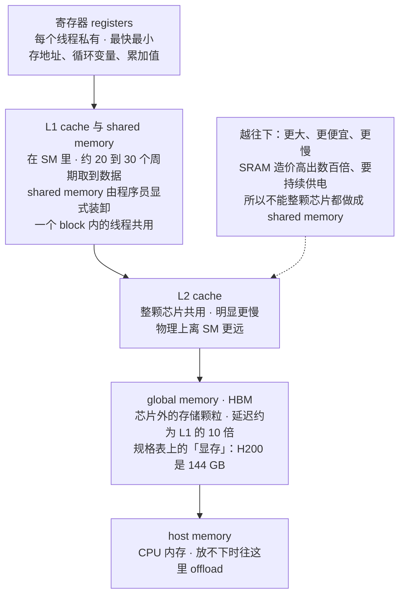
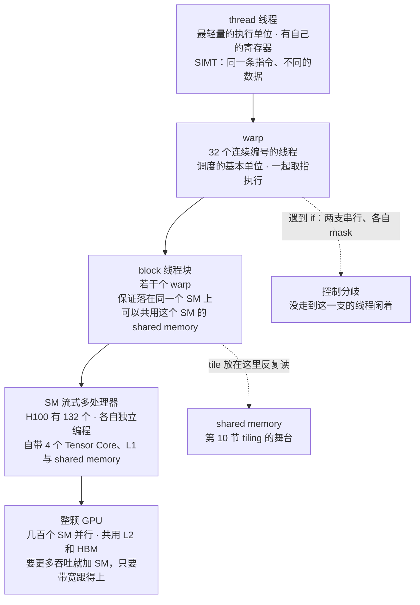
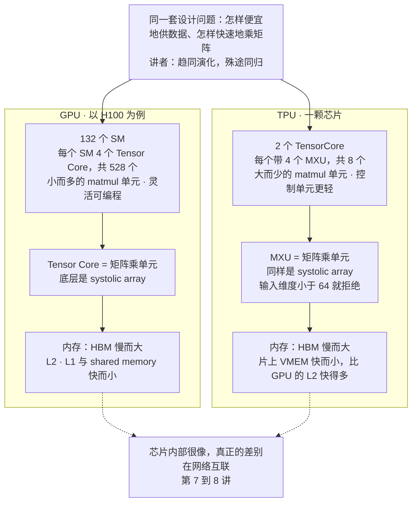
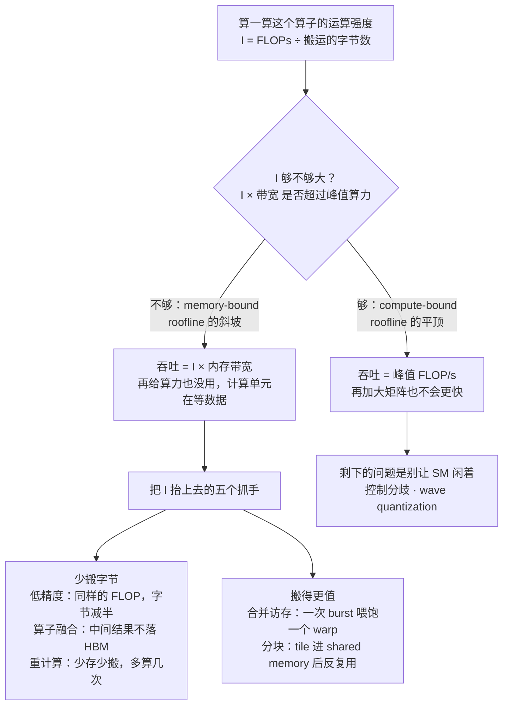
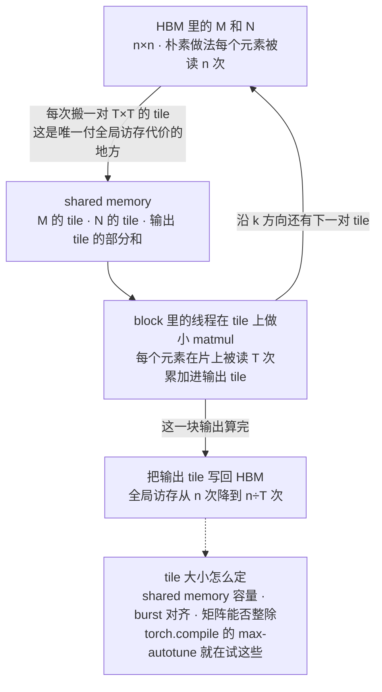
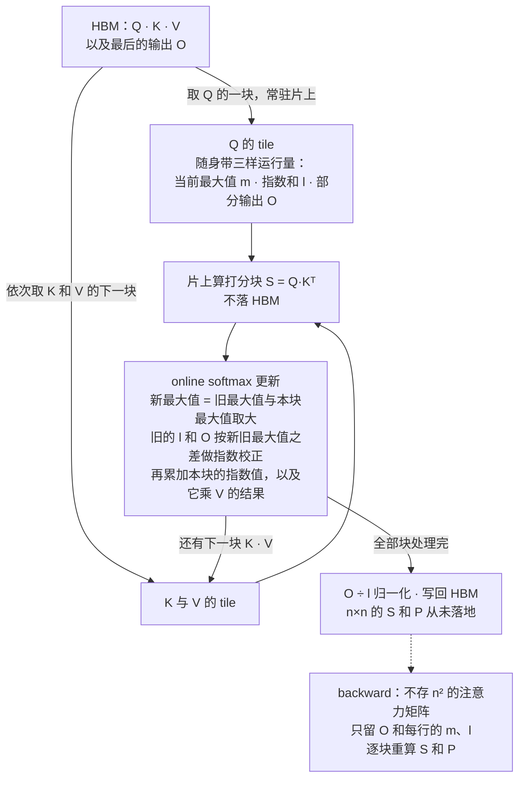

# CS336 第 5 讲｜GPU 与 TPU（GPUs, TPUs）

> Stanford CS336: Language Modeling from Scratch（2026 春）· 第 5 讲，系统部分的第一讲（第 5–8 讲：GPU → kernel → 并行）
> 视频：<https://www.youtube.com/watch?v=izZba4UA7iY>（1:18:39；英文字幕为自动生成，专名和数字错得不少，见文末勘误）
> 讲者：Tatsunori Hashimoto（全程；开场自嘲"不是搞系统的"，讲义大量取材于下面三份资源）
> 课程主页：<https://stanford-cs336.github.io/> · 收尾围绕 [FlashAttention](https://arxiv.org/abs/2205.14135)（Dao et al., 2022）· 讲者推荐的读物：Google 的 [How to Scale Your Model](https://jax-ml.github.io/scaling-book/)（课上叫"TPU 书"，现在也有 GPU 章节，附练习，作业里有类似的题）、Horace He 的 [Making Deep Learning Go Brrrr](https://horace.io/brrr_intro.html)、[GPU MODE](https://github.com/gpu-mode) 社区（原名 CUDA MODE）

**一句话**：GPU 是拿几百个 SM 堆吞吐的机器，而它的算力增速远快于内存带宽和互联带宽，所以今天写快代码的核心不是"多算"而是"少搬"——衡量标准是运算强度（每搬一个字节做多少 FLOP），落到 roofline 的平顶上才算用满硬件；讲者给了六个抓手（避免分支、低精度、算子融合、重计算、合并访存、分块），用它们解释了一张诡异的 matmul 吞吐图（可整除性、burst 对齐、108 个 SM 的 wave quantization），最后证明 FlashAttention 不过是"分块 matmul + online softmax + backward 重算"的组合；TPU 是同一套思路的趋同演化，芯片里只差在"少而大"的 MXU，真正的差别在网络。

## 时间轴

| 时间 | 内容 |
|---|---|
| [0:05](https://www.youtube.com/watch?v=izZba4UA7iY&t=5s) | 开场：系统部分开始；本讲三段（硬件模型 → 六个技巧 → FlashAttention）；"讲完你能解释这张 matmul 吞吐图" |
| [2:07](https://www.youtube.com/watch?v=izZba4UA7iY&t=127s) | 推荐资源：Horace He 的博客、GPU MODE、Google 的 TPU / GPU 书；算力是硬通货 |
| [4:41](https://www.youtube.com/watch?v=izZba4UA7iY&t=281s) | Dennard scaling 在 2000 年代失效 → 横向并行；GPU 的 FLOP/s 逐代超指数增长，V100 引入 Tensor Core |
| [7:15](https://www.youtube.com/watch?v=izZba4UA7iY&t=435s) | CPU 重延迟、GPU 重吞吐；SM 是基本单元；内存层级与延迟表；为什么不全做成 SRAM（Groq） |
| [13:22](https://www.youtube.com/watch?v=izZba4UA7iY&t=802s) | 编程模型：thread / block / warp 与 SIMT；从寄存器到 host memory 的内存模型 |
| [17:00](https://www.youtube.com/watch?v=izZba4UA7iY&t=1020s) | TPU 两页：趋同演化；Tensor Core 与 MXU 都是 systolic array；132 个 SM 对 2 个 TensorCore；命名混乱 |
| [22:39](https://www.youtube.com/watch?v=izZba4UA7iY&t=1359s) | GPU 为什么成功；2001 年用着色器算 matmul；V100 之后 matmul 成了唯一的特权算子 |
| [25:13](https://www.youtube.com/watch?v=izZba4UA7iY&t=1513s) | 算力、内存带宽、互联三条曲线增速不同 → 一切优化都是内存优化；问答：prefill / decode 分离、Step-3 |
| [30:16](https://www.youtube.com/watch?v=izZba4UA7iY&t=1816s) | 第二部分：谜题图与 roofline；六个技巧的共同目标是提高运算强度 |
| [32:47](https://www.youtube.com/watch?v=izZba4UA7iY&t=1967s) | 技巧 1 控制分歧：if 的两支串行执行；ReLU 用乘 mask |
| [34:49](https://www.youtube.com/watch?v=izZba4UA7iY&t=2089s) | 技巧 2 低精度：每 FLOP 的字节减半；Tensor Core 内部先降精度再高精度累加；FP8 的 E4M3 / E5M2 |
| [38:52](https://www.youtube.com/watch?v=izZba4UA7iY&t=2332s) | MXFP8：每 32 个元素一个 E8M0 缩放因子；转置要重新量化 → 存两份；FP8 训练省 20–30%；MXFP4 只有 −6 到 6 |
| [44:31](https://www.youtube.com/watch?v=izZba4UA7iY&t=2671s) | 问答：只量化 matmul 划算；缩放因子不训练；结构化稀疏；先训大再量化 |
| [47:35](https://www.youtube.com/watch?v=izZba4UA7iY&t=2855s) | 技巧 3 算子融合（工厂与传送带，torch.compile / XLA）；技巧 4 重计算（8 次访存变 5 次） |
| [52:42](https://www.youtube.com/watch?v=izZba4UA7iY&t=3162s) | 技巧 5 合并访存：DRAM 按 burst 出货；warp 内线程落在同一 burst；行主序矩阵按列读的代价 |
| [57:51](https://www.youtube.com/watch?v=izZba4UA7iY&t=3471s) | 技巧 6 分块：tile 搬进 shared memory 反复用，全局访存少 T 倍；tile 大小、对齐与 padding；max-autotune；Karpathy 的词表 padding |
| [1:06:28](https://www.youtube.com/watch?v=izZba4UA7iY&t=3988s) | 解谜：颜色是可整除性；1792 → 1793 的断崖 = 98 对 120 个 tile 装进 108 个 SM（wave quantization）；问答：SRAM 为何贵 |
| [1:12:03](https://www.youtube.com/watch?v=izZba4UA7iY&t=4323s) | 第三部分 FlashAttention：分块 matmul + online softmax + backward 重算；总结 |

## 核心内容

### 1. 这一讲的位置：算力是硬通货，串行提速早已到头

- **三段结构**：先讲 GPU 的硬件与编程模型（讲者说系统这块反而最"讲道理"——每一步都能推出来）；然后是六个让 GPU 跑快的技巧；最后把它们拼起来，当场"重新发明" FlashAttention。开头挂出一张谜题图：两个 n×n 方阵相乘的吞吐随 n 变化，本该单调上升，却布满锯齿和断崖——承诺讲完就能解释（第 11 节）。
- **为什么要懂硬件**：第 1 讲 Percy 说过，scaling 的一大半是把资源用满；不懂硬件模型就谈不上高效。哪怕只做架构设计，也得知道模型会怎样在硬件上执行。
- **算力从哪来**：更快的芯片、更高的利用率、更多的芯片、更好的并行——这几年训练比的是谁能调动更多算力，最近一年推理也是。
- **串行提速的终结**：90 年代的答案是提高时钟频率——晶体管变小、频率变高，即 Dennard scaling；这条路在 2000 年代走到头，晶体管数量还在涨，但变小不再等于变快。剩下的路是横向扩展：让更多单元同时执行指令。GPU 与后面两讲的并行是同一范式的两层。
- **GPU 算力的超指数增长**：一张按代际画的 FLOP/s 图——K20、M40 那会儿还很温和，到 P100、V100 陡然起飞。讲者点出两个推手：2017 年 V100 引入 Tensor Core；此后是结构化稀疏和 FP8 等更短的数字格式（第 7 节会看到低精度为什么等于算力）。
- **推荐资源**见文首：讲者自称不是系统的人，讲义大量参考 Horace He、GPU MODE 和 Google 那本"TPU 书"——后者的练习和作业题很像。

### 2. GPU 长什么样：SM，和一座内存金字塔



*图 5-1｜GPU 的内存层级：从每线程私有的寄存器到芯片外的 HBM，再到主机内存（自绘示意）· [▶ 看原幻灯片 10:52](https://www.youtube.com/watch?v=izZba4UA7iY&t=652s)*

- **CPU 与 GPU 的哲学**：CPU 为串行执行设计——复杂的分支和控制流，所以控制单元大、ALU 少，追求低延迟。GPU 追求吞吐：单个任务可能很久才完成、中途被换下换上，但几百个轻量核心同时干活，总量大。
- **SM（streaming multiprocessor）**：GPU 的基本单元，相当于一个"核"——独立的计算单元，内含若干流处理器（可并行跑不同线程）、加速部件和自己能直接访问的内存。GPU 靠堆 SM 扩展：讲者说 A100 有 128 个 SM，各自独立编程、独立执行。
  > 小注：GA100 完整芯片是 128 个 SM，量产的 A100 只启用 108 个——讲者后面解释 wave quantization 时用的就是 108。H100 是 132 个。
- **内存才是主角**：讲者反复强调，现代硬件和 LLM 优化是被内存定义的。层级从上到下（图 5-1）：寄存器最快最小；L1 cache 与 shared memory 在 SM 内部，A100 的微基准约 20–30 个周期取到数据；L2 明显慢；global memory 比 L1 慢约 10 倍。规格表上的"显存"就是 global memory——H200 说自己有 144 GB，说的是它。
  > 小注：H200 规格表写的是 141 GB HBM3e（4.8 TB/s），"144" 是讲者口头的约数。H100 SXM 的数字供对照：HBM3 80 GB、3.35 TB/s；L2 50 MB；每个 SM 的 L1 与 shared memory 合计 256 KB（shared 最多可配 228 KB），寄存器堆 256 KB；BF16 Tensor Core 稠密算力约 989 TFLOP/s，FP8 约 1,979 TFLOP/s。
- **物理位置决定延迟**：global memory 是芯片外的存储颗粒；L2 和 L1 在芯片上，L1 更是在每个 SM 里面——离计算单元近，所以快。
- **那为什么不整颗芯片都做成 shared memory？** 贵几百倍，也更耗电（第 11 节的问答里讲者展开了三个原因）。所以实用的加速器都是层级结构，得学会尊重它。反例是 Groq：巨量 SRAM 的设计，对推理这类负载很合适——讲者说它最近被 NVIDIA 收了。
  > 小注：据 2025 年 12 月的报道，NVIDIA 以约 200 亿美元取得 Groq 的技术授权并接收其核心团队，严格说是"授权加雇佣"而非整体收购。
- **问答：shared memory 和 L1 cache 有什么区别？** 二者物理上都是 SRAM、都在 SM 里，区别在用法：cache 是自动的，存最近访问过的数据，程序员控制不了；shared memory 是可编程的，你显式把东西放进去、拿出来——tiling 全靠它。L2 比 L1 慢主要是物理距离和互联，并非天生：TPU 上对应 L2 的那层就快得多，硅片上的取舍不同。

### 3. 编程模型：thread、warp、block，以及 SIMT



*图 5-2｜GPU 执行模型的四层：线程组成 warp，warp 组成 block，block 落在一个 SM 上（自绘示意）· [▶ 看原幻灯片 13:54](https://www.youtube.com/watch?v=izZba4UA7iY&t=834s)*

- **三个角色**
    - *thread*：轻量的并行执行单位。GPU 的线程遵循 SIMT（single instruction, multiple threads）：所有线程执行相同的指令，只是输入不同——能各干各的活，但指令必须一样。这是"可编程性"和"效率"之间的取舍。
    - *block*：一组线程，保证被调度到同一个 SM 上，因此可以共用该 SM 的 shared memory——这是 tiling 的前提：同一个 block 的线程反复读同一块片上数据。
    - *warp*：32 个连续编号的线程组成的调度单位，一起取指、一起执行，调度器不必逐线程决策。
- **问答**：所有线程执行同一条指令，是 block 内还是 warp 内？——warp 内；调度器决定下一个执行哪个 warp。一个 block 有多少个 warp？——和硬件有关，讲者没记住。
  > 小注：CUDA 里一个 block 最多 1,024 个线程，即 32 个 warp；实际用多少由 kernel 自己指定。
- **设备端代码能碰到的内存**（由近到远）：寄存器（存数组起止地址之类）→ local memory（SM 内）→ shared memory（block 内共享，线程间传数据、复用数据放这里）→ global memory（远处的 DRAM，要付延迟）→ constant memory（很少见人用）→ host memory（CPU 内存，放不下时往这儿 offload）。一句话：一出 shared memory 就慢，整节课的主题就是"把访问归拢，少读 global memory"。
- **GPU 为什么成功**：要吞吐就加 SM，只要内存带宽跟得上；编程"看似简单"——SIMD 风格下连 PTX 这种底层指令都写得下去，你不是在编排每个线程，而是"这是指令、这是输入，全部跑一遍"，像 map；线程极轻，随时可以停下换另一个 warp 上，某些任务卡住时吞吐也不掉。
- **matmul 成为特权算子**：Tensor Core 之前，人们就用图形硬件的大规模并行做科学计算——讲者放了一篇早期论文，用着色器硬凑出快速矩阵乘（应为 Larsen & McAllister, 2001）。V100 起 NVIDIA 直接给了做 matmul 的专用电路，从此 matmul 与其他可并行运算之间出现吞吐鸿沟：比 GPU 上任何别的浮点运算快 10 倍以上。推论：近未来任何随算力扩展的架构都会以 matmul 为核心。
  > 小注：H100 上 FP32 CUDA core 约 67 TFLOP/s，BF16 Tensor Core 稠密约 989 TFLOP/s，相差约 15 倍。

### 4. TPU：趋同演化，芯片里差在"少而大"，芯片外差在网络



*图 5-3｜GPU 与 TPU 并排：部件一一对应，差别在数量与尺寸（自绘示意）· [▶ 看原幻灯片 20:35](https://www.youtube.com/watch?v=izZba4UA7iY&t=1235s) · 出处：[How to Scale Your Model](https://jax-ml.github.io/scaling-book/)*

- **为什么只讲两页**：多数人写代码还是在 GPU 上；但 TPU 越来越流行，而且它是 GPU 的"另一条演化路线"，对照着看能分清什么是本质、什么只是设计选择。结论先行：高层非常像——要造省电的 ML 加速器，最后都走到同一个地方。
- **核心区别**：TPU 更简单、更专门为 ML 负载优化——控制单元更轻，矩阵乘单元大得多。组成部件一样：一块专门乘矩阵的电路、做并行向量运算的部件、某种控制系统；内存也一样是两层：慢的 HBM，加更快的片上本地内存（TPU 里叫 VMEM，字幕识别不清，推断）。差别在各部件的尺寸和灵活性。
- **术语陷阱**：TPU 把它的"SM"叫 TensorCore；GPU 把它的矩阵乘单元叫 Tensor Core。同名异物，靠上下文分辨。
- **数量对比**（讲者的数）：H100 有 132 个 SM，一颗 TPU 只有 2 个 TensorCore；GPU 的矩阵乘单元有 528 个（每个 SM 4 个），TPU 只有 8 个 MXU。GPU 靠"小而多"，灵活、可编程；TPU 靠"大而少"，锁定在大 matmul 上——讲者最近一篇论文做 batch size 扫描，只能扫到 64 为止，因为 TensorCore 拒绝接受小于 64 维的输入。
  > 小注："2 个 TensorCore、8 个 MXU"对应 TPU v4 / v5p 一颗芯片的配置（每个 TensorCore 4 个 MXU）。学生问 systolic array 多大，讲者没答上：TPU 的 MXU 在 v4 / v5 是 128×128，v6e Trillium 起放大到 256×256；GPU 的 Tensor Core 每个只处理很小的矩阵块，所以靠数量取胜。
- **底层同源**：JAX 书里有两张表把 GPU 概念逐一映射到 TPU 概念，映射相当精确——Tensor Core 对 MXU，二者用的还是同一种电路：systolic array（脉动阵列），数据像脉搏一样流过阵列完成乘加。本讲的每个概念都能平移到 TPU。
- **真正的大差别在网络**：讲者今天不展开——芯片本身"活着就是为了乘矩阵"，GPU 与 TPU 最大的差别在怎样把芯片连起来（第 7–8 讲并行）。
  > 小注：课外补一句：TPU 用 ICI 把芯片直连成 2D / 3D torus（一个 v4 pod 4,096 颗）；GPU 是 NVLink / NVSwitch 连成 8 卡节点，再用 InfiniBand 或以太网跨节点。

### 5. 三条曲线增速不同：为什么今天的优化几乎全是内存优化

- **硬件的三个部件各涨各的**：一张按年份画的图——灰线是算力（FLOP/s），涨得很快；绿线是内存带宽（搬数据的速度），涨得慢得多；蓝线是"并行"（设备之间的互联速度），也很慢。
- **含义**：GPU 编程的早年，算力并不比搬运快多少，不用太操心内存；越往右，算力与带宽的剪刀差越大——所以今天的优化几乎都是内存优化，往后把硬件用满会越来越费劲。
  > 小注：这张图应出自 Gholami et al., 2024《AI and Memory Wall》：过去二十年硬件峰值算力每两年约 3.0 倍，DRAM 带宽每两年约 1.6 倍，互联带宽每两年约 1.4 倍。
- **问答：这个剪刀差会改变芯片的设计吗？** 讲者说推理那边已经"更疯狂"：去年开始流行 prefill / decode 分离——prefill 是重 matmul，放一种芯片；decode 受内存带宽限制，放另一种芯片。Step-3（中国的开源模型）更进一步按层拆：attention 走一种加速器，MLP 走另一种。剪刀差越大，任何能省着用"珍贵的快内存"的招都值钱，推理比训练更受内存约束（第 10 讲）。
  > 小注：Step-3 论文里这叫 AFD（Attention-FFN Disaggregation）。
- **第一部分的心智模型**：GPU 是大规模并行的机器；算力涨得比内存快得多，所以一切都要尊重内存层级——能放 shared memory 的别碰 global memory。

### 6. Roofline 与运算强度：六个技巧的共同目标



*图 5-4｜roofline 的两种处境，以及六个技巧各自解决哪一种（自绘示意）· [▶ 看原幻灯片 31:16](https://www.youtube.com/watch?v=izZba4UA7iY&t=1876s) · 出处：[Williams et al., 2009](https://dl.acm.org/doi/10.1145/1498765.1498785)*

- **谜题图的骨架**：横轴是方阵边长，纵轴是每秒处理的元素数。总体向右上——矩阵越大、活越多，硬件越容易被喂饱；但为什么是锯齿状的、有的点在顶上有的在底下，是第二部分要回答的。
- **Roofline**（第 2 讲 Percy 提过）：吞吐先随"每搬一个字节做多少运算"线性上升（斜坡，memory-bound：给再多算力也没用，计算单元在等数据），到某一点后计算单元饱和，曲线变平（compute-bound：再加大工作量也不会更快）。内存更快，斜坡就整体上抬。写高效 GPU 代码的目标只有一个：**站到平顶上**。

$$
I=\frac{\text{FLOPs}}{\text{bytes moved}},\qquad \text{attainable FLOP/s}=\min\!\big(\text{peak FLOP/s},\; I\times\text{memory bandwidth}\big)
$$

I 是运算强度（arithmetic / operational intensity）：每从内存搬一个字节能做多少次浮点运算；右式说吞吐被两条"屋顶"里较低的那条卡住——I 小时受带宽限制（斜坡），I 大到超过"峰值算力 ÷ 带宽"这个拐点后受算力限制（平顶）。

> 小注：拿 H100 的规格代进去，拐点约 989 ÷ 3.35 ≈ 295 FLOP/byte。BF16 的 n×n 方阵乘做 2n³ FLOPs、至少搬 3 个 n² 的矩阵共 6n² 字节，I ≈ n/3，所以理想情况下 n 要到 900 左右才可能 compute-bound——这就是谜题图整体向右上爬的原因；而逐元素运算的 I 只有 1/4 到 1/8，永远在斜坡底部。

- **六个技巧**：第一个（控制分歧）性质不同，是 GPU 独有的执行模型问题；其余五个都是同一件事——尽量减少内存搬运，把 I 抬上去。

### 7. 技巧 1 与 2：别写 if；把数字变短

- **控制分歧（control divergence）**：每个线程执行同一条指令，遇到 if 会怎样？CPU 选一支执行完事；GPU 是两支都走一遍——先执行走一支的线程，另一支的线程被 mask 掉干等，再反过来。一个条件语句等于两支的时间之和，而且总有一部分线程闲着。编程简单了，代价是效率。所以 GPU 代码里 ReLU 之类几乎都写成"乘一个 0/1 mask"而不是 if。

```python
# GPU 上写 ReLU：不用 if，让整个 warp 走同一条乘法指令
y = x * (x > 0)   # mask 与 x 同形，一条指令全部线程同时完成
# 若写成 if x > 0 则 y = x 否则 y = 0：两支各占一轮，不走那支的线程闲着
```

这三行说明的是"用数据代替控制流"：把分支变成算术，SIMT 才不会被串行化。

- **低精度：为什么它等于算力**。讲者把 Bill Dally 的超指数增长图搬出来：曲线里相当一部分来自数字表示——FP32 → BF16 → INT8，位数减半，要搬的字节就减半。
  > 小注：Dally 本人的讲座里把单芯片推理性能十年约 1,000 倍拆成：数字表示约 16 倍、复杂指令约 12.5 倍、制程约 2.5 倍、稀疏约 2 倍（应为此出处；课上只引了"数字表示是大头"这一点）。

$$
\text{FP32 elementwise: }\ \frac{4\text{ B read}+4\text{ B write}}{1\text{ FLOP}}=8\text{ B/FLOP}\ \ (I=\tfrac18),\qquad \text{BF16: }\ 4\text{ B/FLOP}\ \ (I=\tfrac14)
$$

讲者的"傻例子"：对一个向量逐元素做一次运算，FP32 下每个元素读 4 字节、写 4 字节，只换来 1 个 FLOP，即 8 字节/FLOP；精度减半，每 FLOP 的字节数也减半——他随即更正说这个量是运算强度的倒数。

- **Tensor Core 里的低精度并不"纯"**：输入先降精度（downcast）再相乘，部分和的累加用全精度，输出可能再以 FP32 给出。低精度是"黑魔法"，不在于降位数（谁都会），而在于弄清哪个运算能用哪种格式：matmul 的权重和激活可以低精度，softmax 可能得 FP32，指数运算也许 BF16 能扛住。走到今天花了好几年经验性的试错，一边降精度一边保住训练稳定。
- **FP8 之后没有标准格式**：16 位大家基本用 BF16（CME295 第 4 讲的混合精度到此为止）；8 位就分化了——E4M3（4 位指数、3 位尾数）和 E5M2（指数多、尾数少），各有用处，位数太少就没有一刀切的格式。
- **MXFP8**（讲者说"又酷又疯"）：传统 FP8 训练是元素 8 位，外加一个 FP32 的缩放因子——只有 4 位指数，太容易上溢或下溢，得靠缩放把数值拉进可表示的范围。可一个矩阵里各处的量级差很多（序列的一段激活可能比另一段大得多），一个缩放因子照顾不过来。于是改成每个子块一个：MXFP8 的元素用尾数更多的 FP8，每 32 个元素配一个缩放因子，缩放因子本身也是 8 位——E8M0，只有指数位，全是 2 的幂。

$$
x_i \approx s_b\cdot q_i,\quad i\in\text{block } b\ (32\text{ elements}),\qquad s_b=2^{e_b}\ (\text{E8M0}),\quad q_i\in\text{FP8 (E4M3)}
$$

x_i 是原始值，q_i 是它的 8 位量化值，s_b 是第 b 个块共用的缩放因子——只能是 2 的幂，所以缩放本身不引入舍入，只是移动指数。

- **这个设计的坑**：转置。以前转置不必重新量化；现在转置后的矩阵和原矩阵"每 32 个一组"的分块模式对不上，得整个重新量化。实际做法：训练时每个量化矩阵存两份，一份原样、一份转置好的。再加上只量化那些经验上"安全"的层——又是一轮试错。
- **收益**：matmul 大约省 20–30%，矩阵越大省得越多；到不了 2 倍，因为量化、反量化的开销不小。问答：最后一层为什么难量化？它直接决定 loss，量化它容易既不稳又掉点；第一层讲者没有直觉。
- **MXFP4**：整个格式一页就能画完——可表示的值只在 −6 到 6 之间。结构同上：按块共用缩放因子，讲者说每 16 个元素一个、缩放因子是 FP8 的 E4M3。有论文用 FP4 训练过，但还没听说谁在真实的大模型上成功；讲者判断下一代模型大概率会上。
  > 小注：按 OCP 的 MX 规范，MXFP4 也是每 32 个元素一个 E8M0 缩放因子；"每 16 个元素、E4M3 缩放因子"是 NVIDIA Blackwell 上 NVFP4 格式的定义——讲者描述的应为 NVFP4（或者幻灯片本身就是 NVFP4）。FP4 训练的论文，应为 NVIDIA 的 NVFP4 预训练报告或微软的 FP4 训练论文之一（推断，见文末表）。
- **问答**
    - 只量化矩阵吗？什么都能量化（比如 ReLU 之后的激活），但只有 matmul 值得——吞吐提升大，别处的开销通常不划算；算力上乘量化数基本是线性加速，只是被量化、反量化摊薄了。
    - 缩放因子要训练吗？不训练，没有梯度——由实现决定：扫一遍取最大最小值，或用运行统计；推理时倒可以拟合。
    - 结构化稀疏？MoE 就是成功的结构化稀疏；Chris Ré 做了各种结构化矩阵，但计算收益对表达损失的账经验上没算过来。
    - 部署到笔记本的 SOTA？先训一个更大的模型再量化下来；有量化 scaling law 刻画取舍；实践是量化感知训练加事后量化，业界仍在做"量化的科学"。

### 8. 技巧 3 与 4：算子融合与重计算——拿计算换搬运

- **算子融合（operator fusion）**：把 GPU 想成一座工厂：仓库是内存，车间是计算单元，中间一条传送带。车间再大，传送带就那么宽；运算越多，原料和半成品在两头来回跑得越多。更好的做法是一座大车间，原料进一次、成品出一次，带宽只付两回。就这么简单，但你会惊讶它有多常没有发生。
- **例子**：sin²x + cos²x。PyTorch 的计算图是 x → sin、cos → 各自平方 → 相加；不做处理时每个算子各自从 global memory 读、写回，中间结果全部落地。融合后是一个 kernel（在 GPU 上一次启动、由大量线程执行的一个函数）：读一次 x，在 SM 里把整条链算完，写回一次。
- **谁来做**：这种"把一段图压成一个单元"的简单融合，编译器会自动做——torch.compile、JAX 的编译（XLA，和 JAX 结合得更深）都会把这类基本运算融合成一次 CUDA 调用；复杂的融合要手工干预，那是第 6 讲（Triton、kernel）的内容。
- **重计算（recomputation）**：反向传播要用前向存下的激活（Percy 的 CS221 讲过的计算树）。换成系统视角看同一件事：怎样最少地访存？例子：x → sigmoid → sigmoid → sigmoid → out。正常做法：前向读 x 一次，写出 s2、s1、out 三次；反向镜像一遍——一共 8 次访存，而算的只是几个 sigmoid，运算强度极低。
- **反过来**：假设算力便宜到用不完、访存却很贵，那就把中间激活全扔掉。前向读 x、写 out（2 次）；反向读入 d_out 和 x，现场重跑前向拿到激活，写出 dx（3 次）——5 次访存，是原来的 5/8。多算了一点，少搬了一截。CME295 第 4 讲里 FlashAttention "重算却更快"的现象，根源就在这里；第 12 节回到它。

### 9. 技巧 5：合并访存——DRAM 是按 burst 出货的

- **DRAM 的脾气**：global memory 是 DRAM，读它不是一个字节一个字节地给。存储单元排成阵列，选中一段、激活放大器很慢，但选中之后同一段里相邻的数据几乎白送——这一段叫 burst section，比如 128 字节：读第一个位置，同一 burst 里其余位置一并送到。
- **合并（coalesced）访存**：一个 warp 里线程的读请求若落在同一个 burst 里，就叫合并访存，一次 burst 喂饱整个 warp；多个 warp 对应多个 burst。反之每个线程各撞一个 burst，就是把整段都读上来却只用一个数。
- **矩阵的例子**：一个 4×4 的行主序矩阵，内存里的顺序是第一行、第二行……让 4 个线程每个周期各读一列中的一个元素——第一轮就撞了 4 个不同的 burst，等于把整个矩阵读了一遍，只为拿一列；反过来让 4 个线程沿一行读，一次 burst 就全拿到了（讲者的记法：行主序矩阵里，线程沿主轴移动的读法不合并）。所以数据怎样排布直接影响大块读取的速度——matmul 里某些访问模式是"特权"的。
- **问答：为什么整段免费？** 讲者的理解：放大器按列（或按行，看图怎么画）选中单元，加电压选中这一步耗时，选中后同一列内多个元素的读出就便宜了；顺带得到整段，但不会白送别的段。

### 10. 技巧 6：分块——把 tile 搬进 shared memory 后榨干它



*图 5-5｜分块 matmul：tile 进 shared memory 后反复读，只在搬 tile 时付 HBM 的代价（自绘示意）· [▶ 看原幻灯片 58:51](https://www.youtube.com/watch?v=izZba4UA7iY&t=3531s)*

- **思想**：讲者留到最后的、影响最大的一招。把要处理的空间切成 tile，每个 tile 整块装进 shared memory，在片上反复读、把能算的全算完，再换下一块——把对 global memory 的零散访问归拢成整块搬运。
- **matmul 上怎么做**：n×n 乘 n×n，朴素实现里每个输入元素会被读 n 次。矩阵天然可以切成子矩阵：把 M 和 N 各切成 2×2 的 tile，先把两个左上块搬进 shared memory——这是唯一付全局访存代价的地方——在片上做子矩阵乘，部分和累加到同样放在片上的输出 tile；k 方向的几对 tile 依次处理完，再把输出块写回。

$$
\text{global reads per input element: }\ n\ \xrightarrow{\ \text{tile size } T\ }\ \frac{n}{T},\qquad \text{on-chip reads per element: }\ T
$$

n 是矩阵边长，T 是 tile 边长：分块后每个输入元素从 global memory 读 n/T 次、在片上读 T 次；T = n 的极端就是"全局读一次、片上读 n 次"。也就是全局访存少了 T 倍——tile 越大省得越多。

```python
# 一个 block 负责输出 C 的一个 T×T tile；沿 k 方向逐对搬 tile
acc = zeros(T, T)                                  # 部分和，先留在片上
for k0 in range(0, n, T):
    a_tile = load_to_shared(A[i0:i0+T, k0:k0+T])   # 全局访存：每个元素只在这里读一次
    b_tile = load_to_shared(B[k0:k0+T, j0:j0+T])
    sync()                                         # 等 block 里所有线程装完
    acc += a_tile @ b_tile                         # 片上反复读，T 次复用
    sync()
C[i0:i0+T, j0:j0+T] = acc                          # 算完才写回 HBM
```

这段伪代码是"一个 block 算一个输出 tile"的骨架：HBM 只在 load 和最后的写回处出现，中间全在 shared memory 里。

- **问答**：这么做是因为整个矩阵放不进片上吗？——对，Groq 那种全 SRAM 的加速器可以整个塞进去，很快也很贵。数据并行、张量并行也像分块？——是，各种并行都带着 tiling 的影子（第 7 讲）。PyTorch 会自动做吗？——任何 matmul kernel 底下都在 tiling，非常规运算才要自己想"局部复用"；但 PyTorch 也不完美，下面就是它的不完美。
- **tile 的微妙之处**：tile 128×128，矩阵 256×256 正好切成 4 块；边长加 1 变成 257，就多出两条几乎是空的细长 tile。tile 大小于是成了要优化的对象：burst 宽度、shared memory 容量、矩阵尺寸一起决定最优 tile。torch.compile 的 max-autotune 就是干这个的——打开后会跑上十几分钟的基准测试，逐个尝试 tile 尺寸，收益不小。
- **对齐与 padding**：如果 burst 段恰好和 tile 一样宽，读一个 tile 只需几次整段读取；矩阵边长偏移 1，每行的起点都错开，tile 与 burst 段不再对齐，读一个 tile 至少要两个 tile 的量。解法是 padding，把边界补到与 burst 段对齐。Karpathy 在 nanoGPT 上把词表从 50257 补到 50304，快了 25%——补零反而加速，看懂了对齐就不奇怪。
  > 小注：出自 Karpathy 2023 年 2 月的推文；50304 是 50257 往上最近的 64 的倍数（也是 128 的倍数）。字幕把两个数识别成了 5257 和 5304。
- **问答：那我该操心 tile 大小吗？** 不必——除非你自己写 kernel，tile 是底层系统的事；但要操心矩阵尺寸：一般取 2 的幂，最好还能被 32 整除。

### 11. 解谜：那张 matmul 吞吐图的三层结构

- **第一层：斜坡**——运算强度。方阵越大，每搬一个字节做的运算越多，直到把计算单元喂饱（第 6 节）。
- **第二层：颜色**——可整除性。按矩阵边长的可整除性着色：蓝色只能被 1 整除（奇数），橙色被 2 整除，绿色被 8，红色被 16，紫色被 32。奇数和只被 2 整除的吞吐很差；到 16 和 32 就没有区别了。这不是"2 的幂有魔法"，而是 16、32 已经大到能填满一个 burst 窗口，整个 tile 都能合并读取。
- **第三层：周期性断崖**（Percy 管这叫 GPU trivia，讲者说自己很爱）——橙线上每隔一段就掉一截，比如从 1792 到 1793 只加了一维，吞吐骤降。tile 是 256×128：

$$
\#\text{tiles}=\Big\lceil\tfrac{n}{256}\Big\rceil\cdot\Big\lceil\tfrac{n}{128}\Big\rceil:\qquad 1792\to 7\times14=98\le108,\qquad 1793\to 8\times15=120>108\ \Rightarrow\ 2\text{ waves}
$$

n 是边长，108 是 A100 的 SM 数：1792 时 98 个 tile 一波就能全部铺到 108 个 SM 上；1793 时两个方向各多出一个 tile，变成 120 个，第一波 108 个做完还剩 12 个，第二波只有 12 个 SM 干活、其余闲着——tile 数只多了两成，时间却接近翻倍。这叫 **wave quantization**（波次量化）。

- **第二部分的小结**：memory、memory、memory。合并读（coalescing）；把运算合起来少读几次（fusion）；非读不可的搬进 shared memory 反复用（tiling）；再拿别的资源换内存（quantization、recomputation）。
- **问答**
    - 多堆 SRAM 不行吗？三个原因：造价高；必须物理上靠近计算单元，信号传播有极限；SRAM 要持续供电才能保持数据，很耗能——总拥有成本不划算，快内存要用在刀刃上。
    - 被 64 整除会比 32 更好吗？不会，这是"整除 burst 大小"的性质，够了就够了；别的现象可能偏爱更大的因子，但这里不会。
    - 为什么是 108？——那是 SM 的数量，"去问 Jensen"。
    - wafer-scale（整晶圆芯片，如 Cerebras）呢？讲者不熟，只知道编译极难，会有波的干涉之类的物理效应。

### 12. 终点：FlashAttention = 分块 matmul + online softmax + backward 重算



*图 5-6｜FlashAttention 前向：一个 Q tile 常驻片上，K、V 分块流过，softmax 的统计量在线更新（自绘示意）· [▶ 看原幻灯片 1:15:35](https://www.youtube.com/watch?v=izZba4UA7iY&t=4535s) · 出处：[Dao et al., 2022](https://arxiv.org/abs/2205.14135)*

- **它是纯系统的胜利**：从 PyTorch 的朴素 attention 到一个精心融合的 kernel，延迟大幅下降，显存也省——能做更长的 attention。收益几乎全部来自减少 HBM 的搬运。论文自己的概括只有两句：tiling 加 recomputation，使访存次数不再随序列长度平方增长。CME295 第 4 讲看过它的概貌（三趟 HBM 往返、40.3 GB 变 4.4 GB），这里把每一步对应到本讲的技巧上。
- **要处理的运算**：QKᵀ 的 matmul、一个 softmax、再乘 V 的 matmul（讲者口头说"三个 matmul"，应为两个）。matmul 已经会了：论文的图 1 就是分块 matmul，没有任何新东西。
- **拦路虎是 softmax**：它是全局运算——按行归一化，把所有 tile 绑在一起，看上去没法分块。标准做法是整行取指数、减最大值（数值稳定）、除以总和。
- **核心观察：online softmax**。一边扫一边维护两个运行量——目前的最大值和"以它为基准的指数和"；每遇到更大的数就换掉最大值，并把已累计的量按新旧最大值之差做指数校正；扫完统一除以分母。因为是在线的，就能一个 tile 一个 tile 地算，不必看到其余 tile。

$$
m'=\max\big(m,\ \max_j s_j\big),\qquad l'=l\,e^{\,m-m'}+\sum_j e^{\,s_j-m'},\qquad O'=O\,e^{\,m-m'}+\sum_j e^{\,s_j-m'}\,v_j
$$

对某一行：m 是到目前为止的最大打分，l 是以 m 为基准的指数和，O 是尚未归一化的输出累加；来了新一块打分 s_j（配对的值向量 v_j），先更新最大值 m′，再把旧的 l、O 乘上 e^(m − m′) 校正到新基准，加上本块的贡献；最后一块处理完后 O/l 就是精确的 attention 输出，与整行一起算完全一致。

```python
# 一个 Q tile 的 FlashAttention 前向：m、l、O 三个运行量随块更新
m, l, O = -inf, 0, zeros(T, d)
for K_blk, V_blk in tiles(K, V):        # 每次只搬一对 tile 进 SRAM
    S = Q_blk @ K_blk.T                 # T×T 的打分块，不落 HBM
    m_new = max(m, S.max(axis=1))
    alpha = exp(m - m_new)              # 旧统计量的校正因子
    P = exp(S - m_new)
    l = alpha * l + P.sum(axis=1)
    O = alpha * O + P @ V_blk
    m = m_new
write(O / l); write(m, l)               # 只有 O 和每行的 (m, l) 回到 HBM
```

这段伪代码把上面的更新式放进循环：n×n 的 S、P 从未整体存在过，HBM 上只多了每行两个标量。

- **拼起来**（讲者引的可视化应出自 FlashAttention-2）：虚线框是 SRAM 里分块处理的部分，蓝框留在 HBM。QKᵀ 分块相乘，结果留在 SRAM 里直接取指数、更新 softmax 的运行统计量，再到下一块；运行量很少（每行一个最大值、一个分母），放寄存器或 shared memory 都行；指数值算好就顺手乘 V，最后除以分母。两个 matmul 和 softmax 在片上一口气做完——这就是 fusion 加 tiling。
- **backward 的 recomputation**：如果按常规保存激活，attention 要存 n² 大小的注意力矩阵。FlashAttention 不存，反向时逐块重算——正是第 8 节的以算换搬。讲者没展开 backward。
- **总结**：要理解到硬件底层才知道为什么做某些决定——别做"矩阵维度要 32 的倍数"的 cargo cult，要知道 burst 与 tile 为什么导致它；算力增长的方式意味着要围着 matmul 设计；算力与内存的剪刀差意味着数据搬运要精打细算；FlashAttention 这类懂硬件的工作，包括懂硬件的架构设计，是未来性能的关键。

### 13. 六个技巧放在一起看

| 技巧 | 针对什么 | 代价 / 前提 | 谁替你做 |
|---|---|---|---|
| 避免控制分歧 | SIMT 下 if 让一部分线程空转 | 用 mask 乘法代替分支 | 自己写 kernel 时注意；框架算子多已如此 |
| 低精度 | 每 FLOP 搬的字节数 | 哪些层、哪些运算能降是试出来的；量化开销让 FP8 只省 20–30% | Tensor Core 的硬件支持；库负责缩放因子 |
| 算子融合 | 中间结果在 HBM 的往返 | 复杂融合要手写 kernel（第 6 讲） | torch.compile / XLA 做简单的 |
| 重计算 | 存激活带来的读写 | 多算几次前向 | activation checkpointing；FlashAttention 的 backward |
| 合并访存 | 被浪费的 DRAM burst | 数据布局、对齐、padding | kernel 与矩阵尺寸的选择 |
| 分块 | 同一元素被反复从 HBM 读 | tile 尺寸要调；对齐与 wave quantization | 所有 matmul kernel；max-autotune 调 tile |

## 关键图表速查（点时间戳跳到原幻灯片）

| 图 | 看什么 | 跳转 | 出处 |
|---|---|---|---|
| 谜题图：方阵 matmul 吞吐对边长 | 总体向右上爬，但布满锯齿与断崖；讲到解谜时再回来看颜色和 1792 → 1793 | [1:06](https://www.youtube.com/watch?v=izZba4UA7iY&t=66s) | — |
| GPU 的 FLOP/s 逐代增长 | P100 / V100 之后起飞；V100 处标 Tensor Core，之后是结构化稀疏与 FP8 | [6:14](https://www.youtube.com/watch?v=izZba4UA7iY&t=374s) | — |
| A100 内存延迟表 | L1 / shared 约 20–30 周期；L2 更慢；global 约为 L1 的 10 倍 | [10:52](https://www.youtube.com/watch?v=izZba4UA7iY&t=652s) | — |
| GPU → TPU 概念映射表 | 每个 GPU 概念一一对应一个 TPU 概念；Tensor Core 对 MXU | [19:02](https://www.youtube.com/watch?v=izZba4UA7iY&t=1142s) | [How to Scale Your Model](https://jax-ml.github.io/scaling-book/) |
| 三条增速曲线 | 灰线算力最陡，绿线内存带宽、蓝线互联都平缓；剪刀差随时间张开 | [25:13](https://www.youtube.com/watch?v=izZba4UA7iY&t=1513s) | [Gholami et al., 2024](https://arxiv.org/abs/2403.14123)（应为） |
| Roofline | 斜坡 memory-bound，平顶 compute-bound；目标是平顶 | [31:16](https://www.youtube.com/watch?v=izZba4UA7iY&t=1876s) | [Williams et al., 2009](https://dl.acm.org/doi/10.1145/1498765.1498785) |
| MXFP8 分块缩放示意 | 每种颜色的子块配一个 E8M0 缩放因子；想一下转置后为什么对不上 | [38:52](https://www.youtube.com/watch?v=izZba4UA7iY&t=2332s) | [Rouhani et al., 2023](https://arxiv.org/abs/2310.10537) |
| MXFP8 训练数据流 | 每个矩阵量化两份（原矩阵与转置）；只量化选定的层 | [41:57](https://www.youtube.com/watch?v=izZba4UA7iY&t=2517s) | [Mishra et al., 2025](https://arxiv.org/abs/2506.08027)（应为） |
| 重计算的两张计算图 | 上：存 s1、s2，8 次访存；下：只存 out，反向重跑前向，5 次 | [50:40](https://www.youtube.com/watch?v=izZba4UA7iY&t=3040s) | — |
| 行主序矩阵的合并访存 | 4 个线程沿一列读要撞 4 个 burst；沿一行读只要 1 个 | [56:19](https://www.youtube.com/watch?v=izZba4UA7iY&t=3379s) | — |
| 分块 matmul 示意 | M00、N00 两个 tile 进 shared memory，部分和累加到输出 tile | [58:51](https://www.youtube.com/watch?v=izZba4UA7iY&t=3531s) | — |
| 解谜：可整除性着色 | 蓝奇数、橙 2、绿 8、红 16、紫 32；16 与 32 重合 | [1:06:28](https://www.youtube.com/watch?v=izZba4UA7iY&t=3988s) | — |
| 1792 → 1793 的断崖 | 98 个 tile 对 120 个 tile，A100 有 108 个 SM；第二波只有 12 个在干活 | [1:08:00](https://www.youtube.com/watch?v=izZba4UA7iY&t=4080s) | — |
| FlashAttention 的分块可视化 | 虚线框在 SRAM，蓝框在 HBM；运行中的 softmax 统计量随块传递 | [1:15:35](https://www.youtube.com/watch?v=izZba4UA7iY&t=4535s) | [FlashAttention-2](https://arxiv.org/abs/2307.08691)（讲者推测出自这篇） |

## 提到的工作

| 名称 | 在本讲里的作用 |
|---|---|
| [How to Scale Your Model](https://jax-ml.github.io/scaling-book/)（Google / JAX 团队） | 讲者最推荐的读物："TPU 书"，现在也有 GPU 章节；GPU → TPU 概念映射表出自它；作业练习与它相似 |
| [Making Deep Learning Go Brrrr](https://horace.io/brrr_intro.html)（Horace He） | 讲者参考的 GPU 性能博客 |
| [GPU MODE](https://github.com/gpu-mode)（原 CUDA MODE） | 讨论 GPU 与 CUDA kernel 的爱好者社区 |
| Dennard scaling（Dennard et al., 1974） | 串行提速的旧规律，2000 年代失效，引出并行扩展 |
| NVIDIA K20 / M40 / P100 / V100 / A100 / H100 / H200 | 代际算力图上的坐标；V100 引入 Tensor Core；A100 108 个 SM；H100 132 个 SM、528 个 Tensor Core；H200 的显存容量 |
| Groq | 全 SRAM 的加速器设计，推理友好；讲者说被 NVIDIA 收了（见小注） |
| Google TPU（v4 / v5p 一类） | 2 个 TensorCore、8 个 MXU；MXU 与 Tensor Core 同为 systolic array；差别在网络 |
| Fast Matrix Multiplies using Graphics Hardware（应为 Larsen & McAllister, 2001） | Tensor Core 之前用着色器硬凑矩阵乘的早期黑客工作 |
| [AI and Memory Wall](https://arxiv.org/abs/2403.14123)（Gholami et al., 2024） | 算力、内存带宽、互联三条曲线的图应出自这里 |
| [Step-3](https://arxiv.org/abs/2507.19427)（StepFun, 2025） | 问答里的例子：把 attention 和 MLP 拆到不同加速器（AFD） |
| prefill / decode disaggregation | 推理硬件"更疯狂"的例子：两阶段放不同芯片（第 10 讲） |
| [Roofline model](https://dl.acm.org/doi/10.1145/1498765.1498785)（Williams et al., 2009） | 斜坡与平顶：判断 memory-bound 还是 compute-bound |
| Bill Dally 的算力增长图 | 超指数增长中数字表示（FP32 → BF16 → INT8）贡献很大 |
| [FP8 Formats for Deep Learning](https://arxiv.org/abs/2209.05433)（Micikevicius et al., 2022） | E4M3 / E5M2 两种 FP8 格式的来源（讲者未点名） |
| [Microscaling Data Formats](https://arxiv.org/abs/2310.10537)（Rouhani et al., 2023，OCP MX 规范） | MXFP8 / MXFP4：按块共用 E8M0 缩放因子 |
| [Recipes for Pre-training LLMs with MXFP8](https://arxiv.org/abs/2506.08027)（Mishra et al., 2025） | MXFP8 训练要存两份量化矩阵、只量化部分层——课上的数据流图应出自此类 NVIDIA 资料（推断） |
| [Pretraining LLMs with NVFP4](https://arxiv.org/abs/2509.25149)（NVIDIA, 2025）· [FP4 训练](https://arxiv.org/abs/2501.17116)（Wang et al., 2025） | "有论文用 FP4 训练过"的候选（推断）；前者也是"每 16 个元素一个 E4M3 缩放因子"的出处 |
| MoE · Chris Ré 的结构化矩阵（如 [Monarch](https://arxiv.org/abs/2204.00595)） | 问答：结构化稀疏的成功例子与"没算过账"的例子（推断为 Monarch 一类） |
| torch.compile · JAX / XLA | 自动做简单的算子融合；max-autotune 自动搜 tile 尺寸 |
| Stanford [CS221](https://stanford-cs221.github.io/)（Percy） | 反向传播计算树的出处 |
| [nanoGPT](https://github.com/karpathy/nanoGPT)（Karpathy） | 词表 50257 → 50304 提速 25% 的 padding 例子 |
| Cerebras 一类 wafer-scale engine | 问答里提到，编译极难 |
| [FlashAttention](https://arxiv.org/abs/2205.14135)（Dao et al., 2022） | 本讲终点：tiling + recomputation 的精确 attention |
| [FlashAttention-2](https://arxiv.org/abs/2307.08691)（Dao, 2023） | 讲者引用的 SRAM / HBM 分块可视化应出自这篇 |
| [Online normalizer calculation for softmax](https://arxiv.org/abs/1805.02867)（Milakov & Gimelshein, 2018） | online softmax 的原始出处（讲者未点名） |

## 术语对照

| English | 中文 |
|---|---|
| SM (streaming multiprocessor) | 流式多处理器：GPU 的基本计算单元，相当于一个核 |
| Tensor Core / MXU | 矩阵乘单元（GPU 叫 Tensor Core，TPU 叫 MXU）；TPU 的 TensorCore 则相当于一个处理器 |
| systolic array | 脉动阵列：数据流过阵列完成乘加的矩阵乘电路 |
| thread / warp / block | 线程 / 32 个线程的调度单位 / 保证落在同一 SM 上的线程组 |
| SIMT / SIMD | 单指令多线程 / 单指令多数据：所有线程执行同一条指令 |
| control divergence | 控制分歧：warp 内线程走不同分支时两支串行执行 |
| registers / shared memory / L1 / L2 | 寄存器 / 可编程的片上共享内存 / 一级缓存 / 二级缓存 |
| global memory / HBM | 全局内存 / 高带宽显存：芯片外、大而慢 |
| SRAM / DRAM | 静态 / 动态随机存取存储：片上快存与片外主存的两种工艺 |
| host memory | 主机内存：CPU 侧的内存 |
| VMEM | TPU 的片上向量内存（推断） |
| latency / throughput | 延迟 / 吞吐 |
| memory bandwidth | 内存带宽：每秒能搬多少字节 |
| arithmetic (operational) intensity | 运算强度：每访存一个字节对应的 FLOP 数 |
| roofline model | 屋顶线模型：吞吐 = 峰值算力与"强度 × 带宽"中较小者 |
| memory-bound / compute-bound | 受内存限制 / 受算力限制 |
| FLOP / FLOP/s | 浮点运算次数 / 每秒浮点运算次数 |
| Dennard scaling | 登纳德缩放：晶体管变小则频率变高、功耗密度不变的旧规律 |
| kernel | 内核：在 GPU 上一次启动、由大量线程执行的一个函数 |
| PTX | NVIDIA GPU 的中间层汇编 |
| operator fusion | 算子融合：多个运算合成一个 kernel，中间结果不落 global memory |
| recomputation / activation checkpointing | 重计算 / 激活检查点：不存激活，反向时重算 |
| burst section | DRAM 一次读出的连续段（如 128 字节） |
| coalesced memory access | 合并访存：warp 内线程的访问落在同一 burst |
| row-major | 行主序：一行的元素在内存中连续 |
| tiling / tile | 分块 / 块：装进 shared memory 反复使用的子矩阵 |
| padding / alignment | 补齐 / 对齐 |
| wave quantization | 波次量化：tile 数超过 SM 数导致最后一波利用率低 |
| max-autotune | torch.compile 的自动调参模式：穷举 tile 配置做基准 |
| E4M3 / E5M2 / E8M0 / E2M1 | 浮点格式记法：E 后是指数位数、M 后是尾数位数 |
| scaling factor | 缩放因子：把数值拉进低精度可表示的范围 |
| MXFP8 / MXFP4 / NVFP4 | 按块共用缩放因子的 8 位 / 4 位微缩放格式 |
| quantization-aware training / post-training quantization | 量化感知训练 / 训练后量化 |
| structured sparsity | 结构化稀疏 |
| prefill / decode disaggregation | 预填充与解码分离部署 |
| online softmax | 在线 softmax：一遍扫描、维护运行最大值与指数和 |
| wafer-scale engine | 整晶圆芯片 |

## 字幕勘误

"map moles / map mole" → matmuls；"Grok / Rock" → Groq；"S-man" → 应为 VMEM（TPU 片上快存）；"FPA / MXFPA" → FP8 / MXFP8；"step one three" → Step-3；"Chris Ray" → Chris Ré；"5257 to 5304" → 50257 → 50304；"birth size / birth section" → burst size / burst section；"Jax Compile" → JAX 的编译（XLA）；"Torch Compile" → torch.compile；"max auto tune" → max-autotune；"soft max / sub-quadratically" → softmax / sub-quadratic；"partial summons" → partial sums；"tensor core in the tensor core" → TensorCore 里的 MXU；"CUDA mode" → 现名 GPU MODE；"flops" → FLOPs 或 FLOP/s（看上下文）；"Dennard scaling" 无误；"LM optimization" → LLM optimization；"Nvidia as am I" → 语句破碎，意为"别把 GPU 当成 NVIDIA 网页上的一段文字"。

## 带走的问题

1. 用第 6 节的 roofline 给你手头的一个算子记账：估它的 FLOPs 和搬运字节数，算出运算强度，和 H100 约 295 FLOP/byte 的拐点比一比——它在斜坡上还是平顶上？六个技巧里哪一个对它有效、哪些无效？
2. 第 10 节说分块让每个元素的全局访存从 n 次降到 n/T 次。shared memory 只有约 200 KB，BF16 下 T 最大能取多少？如果把 tile 换成非方形（256×128），又是在权衡什么？
3. 1792 → 1793 的断崖来自 108 个 SM 与 120 个 tile。如果 tile 改成 128×128，同样的矩阵会不会出现断崖？断崖会挪到哪些边长？这和 Karpathy 的词表 padding 是同一个现象吗？
4. FlashAttention 的 backward 重算 n² 的注意力矩阵：多做了多少 FLOPs、少搬了多少字节？在什么序列长度以下重算反而不划算？把它和第 8 节"8 次访存变 5 次"的例子放在同一个记账框架里。
5. MXFP8 为了转置存两份矩阵、只量化"安全"的层，最终只省 20–30%。如果下一代硬件把 FP4 的 matmul 再翻一倍，量化、反量化和缩放因子的开销会不会反过来成为瓶颈？这时"低精度 = 算力"的等式还成立吗？
