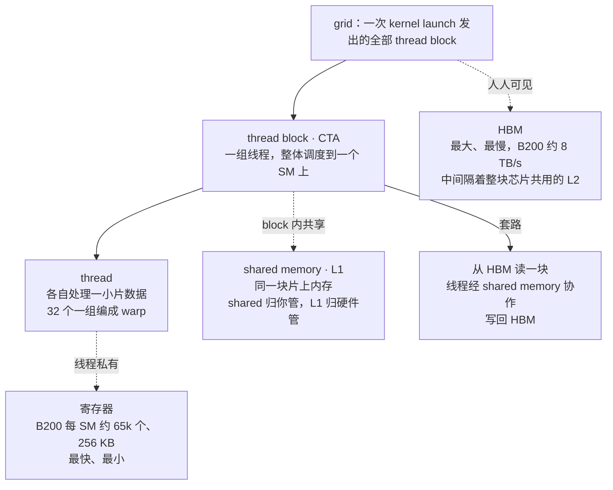
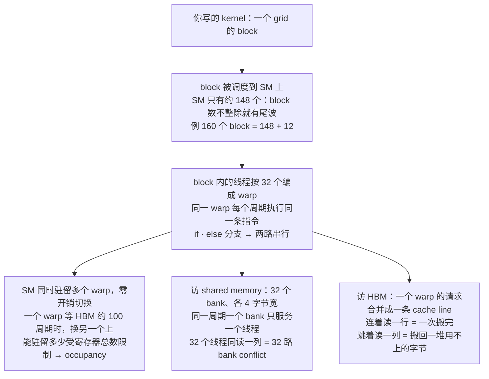
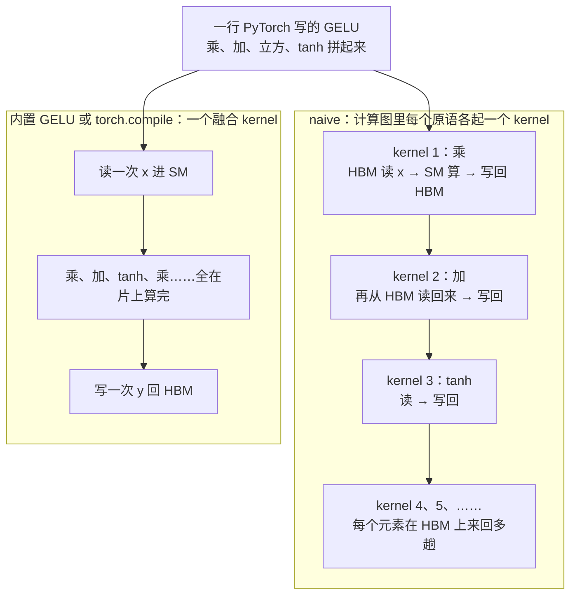
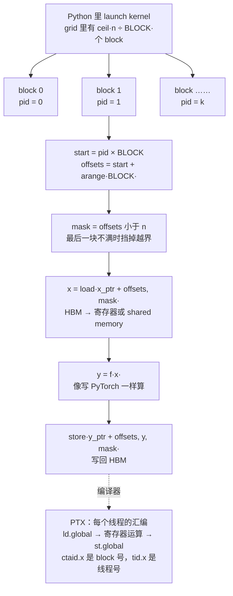
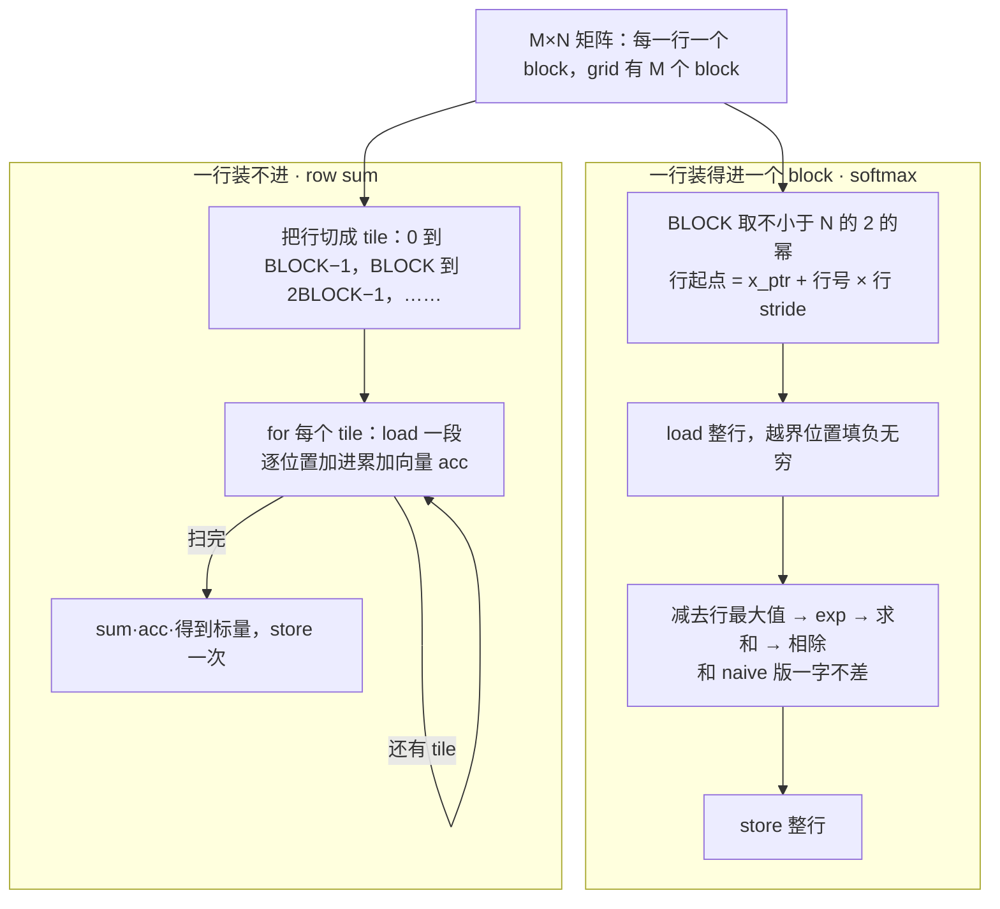
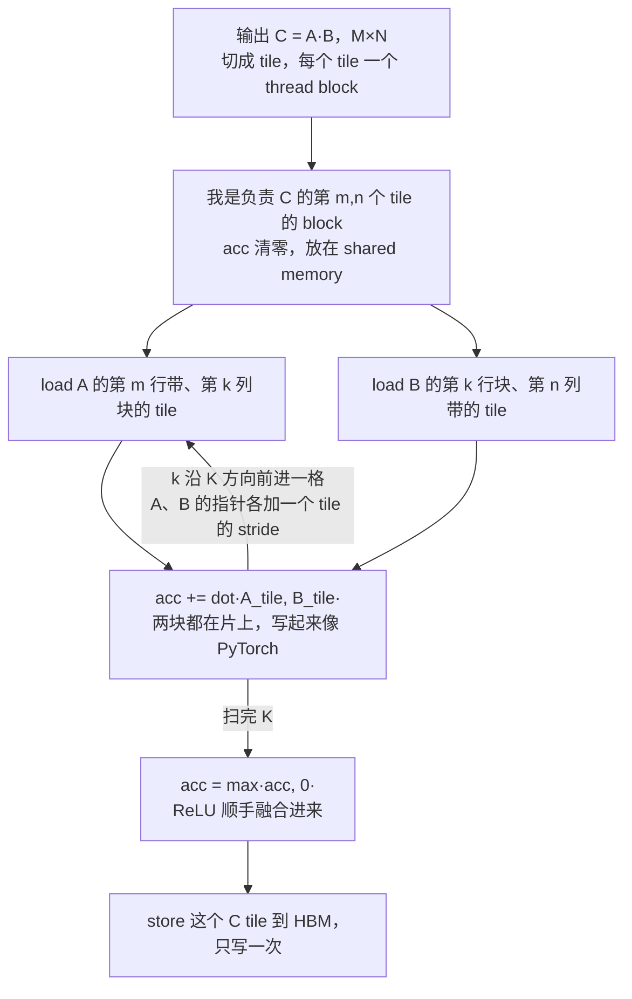

# CS336 第 6 讲｜Kernel、Triton 与 XLA（Kernels, Triton, XLA）

> Stanford CS336: Language Modeling from Scratch（2026 春）· 第 6 讲；接着第 5 讲（Tatsu 讲的 GPU / TPU 概览）往代码里走
> 视频：<https://www.youtube.com/watch?v=xnDHaNUvHBg>（1:26:41；英文字幕为自动生成，专名和缩写错得不少，见文末勘误）
> 讲者：Percy Liang（推断：开场说"Tatsu 周一讲了 GPU 的高层概览，这一讲是它的续篇"，中途又说"去年我做这个演示时"）
> 课程主页：<https://stanford-cs336.github.io/>；本讲围绕的东西：[Triton](https://github.com/triton-lang/triton)（OpenAI 的 kernel 语言）、NVIDIA 的 [PTX](https://docs.nvidia.com/cuda/parallel-thread-execution/) 与 [CUTLASS](https://github.com/NVIDIA/cutlass)、PyTorch 的 profiler 与 `torch.compile`；作业要写的是 [FlashAttention](https://arxiv.org/abs/2205.14135)（Dao et al., 2022）

> 小注：标题里的 XLA（Google 的编译器，JAX / TPU 那条路线）在这段视频里完全没有讲到——全程是 NVIDIA GPU、PyTorch 与 Triton；"eager 执行对编译执行"的对比在本讲只以 `torch.compile` 的形式露面。想看 XLA 只能等课程网页的讲义。

**一句话**：第 5 讲说清了 GPU 长什么样，这一讲讲怎么在它上面写代码、并把性能榨出来：编程模型很干净——thread 组成 thread block，block 组成 grid；HBM 全局共享、shared memory 一个 block 内共享、寄存器每个线程私有——而硬件很脏，warp 锁步、寄存器占用率、bank 冲突、访存合并、尾波效应全在决定快慢；所以动手前先 benchmark 和 profile：profiler 会告诉你一行 `a + b` 背后调的是哪个 CUDA kernel，也会告诉你朴素写的 GELU 慢在每个算子各起一个 kernel、在 HBM 之间来回搬（`torch.compile` 会把整条链融合成一个 Triton kernel）；最后用四个难度递增的 Triton 例子——逐元素的 GELU、一行装进一个 block 的 softmax、一行装不下时分 tile 归约的 row sum、分块 matmul 顺手融合 ReLU——把"一个 block 从 HBM 读一块进 shared memory、算完写回"的套路打通，直通作业里的 FlashAttention。

## 时间轴

| 时间 | 内容 |
|---|---|
| [0:05](https://www.youtube.com/watch?v=xnDHaNUvHBg&t=5s) | 开场：接着 Tatsu 周一的 GPU 概览，这一讲讲代码、Triton kernel 与 benchmark / profile |
| [0:35](https://www.youtube.com/watch?v=xnDHaNUvHBg&t=35s) | GPU 复习：SM、寄存器、L1 / shared memory、L2、HBM；越大越慢，B200 的 HBM 8 TB/s |
| [3:06](https://www.youtube.com/watch?v=xnDHaNUvHBg&t=186s) | 编程模型：thread → thread block（CTA）→ grid；为什么要有 thread block 这一层 |
| [8:45](https://www.youtube.com/watch?v=xnDHaNUvHBg&t=525s) | 硬件例子一：warp——32 个线程锁步、分支被串行化、靠切换 warp 隐藏访存延迟 |
| [11:20](https://www.youtube.com/watch?v=xnDHaNUvHBg&t=680s) | 例子二：warp 占用率与 thread coarsening；算一次 128 线程 × 160 寄存器 → 18% |
| [14:25](https://www.youtube.com/watch?v=xnDHaNUvHBg&t=865s) | 例子三：shared memory 的 32 个 bank 与 bank conflict；swizzling |
| [16:58](https://www.youtube.com/watch?v=xnDHaNUvHBg&t=1018s) | 例子四：memory coalescing——一个 warp 的访存合并成一条 cache line |
| [18:28](https://www.youtube.com/watch?v=xnDHaNUvHBg&t=1108s) | 例子五：block 占用率与尾波（148 个 SM 对 160 个 block）；小结；问答 |
| [21:36](https://www.youtube.com/watch?v=xnDHaNUvHBg&t=1296s) | Benchmarking：先量再改；warm-up、多次取平均、CUDA event 与 synchronize；matmul 的耗时曲线 |
| [26:15](https://www.youtube.com/watch?v=xnDHaNUvHBg&t=1575s) | Profiling：`a + b` 背后的 add kernel、`a @ b` 背后的 CUTLASS kernel，名字里能读出架构和 tile 形状 |
| [30:23](https://www.youtube.com/watch?v=xnDHaNUvHBg&t=1823s) | GELU 三匹马：naive、内置、`torch.compile`；profiler 里看到多 kernel 对一个融合 kernel |
| [36:34](https://www.youtube.com/watch?v=xnDHaNUvHBg&t=2194s) | CUDA 与 Triton 的心智模型：想每个 thread 做什么，还是想每个 block 做什么 |
| [39:39](https://www.youtube.com/watch?v=xnDHaNUvHBg&t=2379s) | 第一个 Triton kernel：分配输出、切 block、launch 语法；pid、offsets、mask、load、store；问答 |
| [50:27](https://www.youtube.com/watch?v=xnDHaNUvHBg&t=3027s) | PTX：编译器生成的线程级汇编；ld.global / st.global、寄存器、thread coarsening 变成 8 个元素；问答 |
| [57:05](https://www.youtube.com/watch?v=xnDHaNUvHBg&t=3425s) | 路线图；softmax：naive 版 5·MN 次读、3·MN 次写；Triton 版一行一个 block |
| [1:05:22](https://www.youtube.com/watch?v=xnDHaNUvHBg&t=3922s) | 一行装不进一个 block：切 tile、每个线程一个累加器、最后归约；row sum kernel |
| [1:11:34](https://www.youtube.com/watch?v=xnDHaNUvHBg&t=4294s) | 终曲 matmul：naive 读 O(MKN)、理想化、tiling；stride；kernel 走读；融合 ReLU |
| [1:21:48](https://www.youtube.com/watch?v=xnDHaNUvHBg&t=4908s) | 总结；问答：Triton 之外的选择（PTX、ThunderKittens、CuTe 等 DSL）；下一讲多 GPU |

## 核心内容

### 1. 复习：存储层级与编程模型是怎么对上的



*图 6-1｜编程模型的三层（grid / block / thread）各对应哪一级存储（自绘示意）· [▶ 看原幻灯片 3:06](https://www.youtube.com/watch?v=xnDHaNUvHBg&t=186s)*

- **硬件复习**（第 5 讲讲过，这里只把要用的数字带上；CME295 第 4 讲的 HBM / SRAM 二分是它的粗略版）：一张 NVIDIA GPU 由一堆 **SM**（streaming multiprocessor，流式多处理器，真正干活的单元）加一块 **HBM**（high bandwidth memory，规格表上的"显存"）组成。从 A100 到 H100 到 B200，每张卡的 SM 数一直在 100 到 200 之间，没怎么变；每个 SM 上的寄存器数也没怎么变——B200 约 65k 个、合 256 KB；SM 上还有 L1 cache 和 shared memory，两者是同一块物理内存，区别是 shared memory 由你显式控制、L1 由硬件自动管，容量同一量级；L2 cache 不按 SM 分，整块芯片共用，比 L1 大；HBM 最大，也是一代代真正在涨的那个数。带宽和容量反着来：寄存器最快，L1 次之，L2 再次，HBM 最慢——虽然 B200 的 8 TB/s 放在别处也不算慢。心智模型一句话：**大的远且慢，快的近且小**。
- **编程模型**只有三层：**thread**（线程）各自对一小片数据执行同一段代码；线程编成 **thread block**（线程块，NVIDIA 叫 CTA）；block 排成 **grid**（网格）。launch 一个 kernel，就是把整个 grid 撒到 GPU 上同时跑。H100 / B200 还有 thread block cluster（几个 block 之间可以共享 distributed shared memory），B200 又加了介于寄存器和 shared memory 之间的 tensor memory 给 tensor core 用——这些对程序员多半不可见，本讲不管。
- **为什么要有 block 这一层**：如果只有一群线程各拿一个元素，逐元素的操作（比如 GELU）完全够用，一个线程一个元素。可 softmax、matmul 这类要在线程之间**通信**的操作不行——严格说也行，让每个线程算输出的一个元素、中间结果全走 HBM，只是 HBM 太慢，这是最坏的策略。正解是用 SM 本地的 shared memory，而 block 就是"共用同一块 shared memory 的那群线程"：一个 block 被整体调度到某个 SM 上，从 HBM 读进一块数据，线程们经 shared memory 协作着算，再写回 HBM。后面的 tiling 玩的全是这一套；Triton 干脆让你原生按 block 来想。
- **存储的归属**：HBM 对所有线程全局可见；shared memory 归一个 block；寄存器归一个线程。

> 小注：CTA 在 NVIDIA 文档里的全称是 cooperative thread array，字幕听成了 concurrent；"约 65k 个寄存器"应为 65,536 个 32 位寄存器，65,536 × 4 B 正好是讲者说的 256 KB。

### 2. 编程模型很干净，硬件很脏：五个例子



*图 6-2｜从 launch 到执行，硬件在哪几处"不听编程模型的话"（自绘示意）· [▶ 看原幻灯片 8:45](https://www.youtube.com/watch?v=xnDHaNUvHBg&t=525s)*

- **两层之间的落差**：编程模型是硬件的抽象，写 kernel 只需要定义有哪些 block、每个 block 里的线程做什么，和写 Python 差不多；只求正确的话到此为止。可我们谈 kernel 就是为了性能，而性能对硬件极其敏感。Percy 给了五个例子，一部分是第 5 讲的复习。
- **例一：warp 与控制分歧**。block 里的线程实际上按 32 个一组编成 **warp**（64 个线程的 block 就是两个 warp），同一个 warp 里的线程在 SM 上**锁步**执行——每个时钟周期必须跑同一条指令。于是 if A else B 这种分支叫 **control divergence**（控制分歧）：warp 只能先让走 A 的线程跑、其余等着，再让走 B 的跑，分支被串行化了，所以 kernel 里要尽量避免分支。
- **例二：延迟隐藏与 occupancy**。一个 SM 上同时驻留着好几个 warp，warp scheduler 在它们之间**零开销**切换（CPU 上做不到），目的是**隐藏延迟**：某个 warp 读 HBM 要等上百个周期，SM 不会干等，立刻换另一个 warp 去做 tensor core 运算。但能驻留多少 warp 受硬件限制：每个线程最多用 255 个寄存器，SM 的寄存器总数固定，每个线程用得越多、能同时跑的线程就越少——这就是 **occupancy**（占用率）下降。occupancy 低不一定坏：线程少但每个线程干的活多，也可能更快；**thread coarsening**（线程加粗）就是有意为之——逐元素操作让一个线程处理 8 个元素而不是 1 个，线程少了，调度更省事。课上算了一笔账：

$$
\text{regs/block}=128\times160=20{,}480,\qquad \left\lfloor\frac{65{,}536}{20{,}480}\right\rfloor=3\ \text{blocks},\qquad \frac{3\times128/32}{64}=\frac{12}{64}\approx18\%
$$

一个 block 有 128 个线程、每个线程用 160 个寄存器，一个 block 就要 20,480 个寄存器（讲者念的是"两万"）；SM 的寄存器只够同时放 3 个这样的 block，即 384 个线程、12 个 warp；而 SM 最多可驻留 64 个 warp，所以 occupancy 只有 12/64，讲者说 18%（精确是 18.75%）——寄存器用得多，把并发压没了。

- **例三：bank conflict**。shared memory 分成 32 个 **bank**，每个 4 字节宽，同一周期每个 bank 只能被一个线程访问（同一地址除外）；多个线程撞上同一个 bank 就得排队串行。最坏情形：矩阵按行存放，32 个线程同时去读同一列——各撞同一个 bank 的不同位置，32 路冲突，全部排队。你会说那就按行读，可 matmul 得一个矩阵按行、另一个按列，还会有转置，读的顺序不总由你定；解法叫 **swizzling**（把数据在 shared memory 里错位摆放），本讲不展开。profiler 能看到 bank conflict 和 occupancy。
- **例四：memory coalescing**（访存合并）。一个 warp 的 32 个线程访问 HBM 时，请求会合并成一次 32 到 128 字节的事务（一条 **cache line**）一次搬回。最好的情况叫 full coalescing：线程 0 读 M[0,0]、线程 1 读 M[0,1]……整条 cache line 正好全用上；反过来沿着列读，每个线程各搬回一整条线却只用其中一个数。它和 bank conflict 感觉相像，但约束完全不同：那个是 shared memory 的，这个是 HBM 的。
- **例五：block 占用率与尾波**。逻辑上 block 想定义多少都行，物理上 SM 只有那么多个（讲者用的数是 148）。launch 160 个 block，先跑 148 个，等它们跑完再跑剩下 12 个——最后这一"波"里绝大多数 SM 闲着。所以 block 数最好能被 SM 数整除，或者说别让最后一波太瘦。
    - 问答：一个 SM 能不能同时容纳两个 block？如果一个 block 已经把 SM 的 tensor core 用满，再塞一个也快不了；根本问题是 block 不能拆开摊到别的 SM，所以办法是**改 block 大小、从而改 block 数**，把尾巴消掉。
- **小结**：grid、block、thread 的模型很优雅，HBM 全局、shared memory 归 block、寄存器归线程也很清楚；但 warp、bank conflict、coalescing、occupancy 这些硬件细节才决定性能，而它们很难凭空知道——profiler 给一部分信息，SM 数、各级容量得自己查，调度器有时还会做你控制不了的事。比编程模型脏得多。

> 小注：字幕里的"20 到 128 字节"应为 32 到 128 字节——CUDA 的全局访存事务是 32、64 或 128 字节。问答里学生问"为什么一个 SM 有 4 个 warp scheduler"，讲者说不清楚：自 Volta 起每个 SM 分成 4 个 processing block（sub-partition），各带一个 warp scheduler 和一条 dispatch 通道，4 就是这么来的（课外事实）。

### 3. Benchmarking：先量、再改、再量

```python
def bench(fn, warmup=3, iters=10):
    for _ in range(warmup):          # 触发懒编译等一次性开销，不计时
        fn()
    times = []
    for _ in range(iters):
        start, end = torch.cuda.Event(enable_timing=True), torch.cuda.Event(enable_timing=True)
        start.record(); fn(); end.record()
        torch.cuda.synchronize()     # GPU 是异步的，等它真正跑完
        times.append(start.elapsed_time(end))   # 毫秒
    return sum(times) / len(times)   # 讲究的话看整个分布或 P95
```

这就是课上"从零开始"写的计时器的形状：warm-up、CUDA event、synchronize、多次取平均，四样缺一不可。

- **哲学**：这一节内容不多，但要立一条纪律：**benchmark、profile，改代码，再 benchmark、profile**。Percy 故意把它放在 Triton 之前讲：先量出瓶颈在哪，再决定要不要写 kernel。
- **benchmarking 量的是端到端时间**：一个数，不告诉你时间花在哪，但它就是你最终关心的量，而且能看趋势——比如随维度怎么涨。现成的工具有，但本课"从零开始"，自己写一遍是为了讲几个坑：
    1. **warm-up**（第 2 讲提过）：有些东西是懒编译的，第一次跑的开销不该算进去——你在乎的是反复运行时的速度，初始条件无所谓；
    2. **多跑几次取平均**，因为有方差；讲究的话看整个分布或 P95；
    3. 用 **CUDA event**：start 事件 record、跑计算、end 事件 record，然后 **synchronize**——GPU 上一切都是异步的，不设这个同步屏障，你量到的是"发出命令"的时间而不是"跑完"的时间。
- **看曲线**：把两个随机方阵相乘的维度一路放大，时间理论上按立方涨，但直到维度接近 2000 之前曲线几乎是平的——GPU 是为大矩阵乘造的，2×2 的矩阵跑起来纯属浪费，那段平台就是固定开销在主导。

> 小注：讲者没说"现成工具"指哪个；PyTorch 自带 torch.utils.benchmark，Triton 自带 triton.testing.do_bench，做的正是 warm-up、同步与重复计时这几件事（推断）。

### 4. Profiling：一行 PyTorch 背后是哪个 kernel

- **profiling 告诉你时间花在哪**。就算不在乎时间，它也是理解"底下到底发生了什么"的最好办法——高层语言写一行、跑一下、出结果，中间全被藏起来了。本讲用 PyTorch 自带的 profiler（先 warm-up，再在 profiler 的 context 里跑一次）；作业里用的 Nsight 信息更细，课上没时间讲。
- **`a + b`**：两个张量相加，profiler 里出现一个名字很长的 kernel（…CUDA functor add…）——原来加法底下是一个专门的 kernel，在这个例子里当然占 100% 的时间。
- **`a @ b`**：换成一个更长的名字，里面能读出信息：**CUTLASS** 是 NVIDIA 的 CUDA 线性代数库；**sm100** 指 Blackwell 架构，说明这个 kernel 是专为它写的；**f32** 是精度；后面的 **64·64·16** 是 tile 的形状（第 9 节会讲 tile）。把矩阵改成 128×128，调用的 kernel 换了一个，tile 形状变成 32·32·16——**输入的维度不同，PyTorch 会挑不同的 kernel**。
- **三条观察**：看得到到底调了哪些 CUDA kernel（一般就是名字长的那些）；同一个算子随张量形状换不同 kernel；kernel 的名字本身就交代了实现（库、架构、精度、tile）。作业里会逼你做这两件事，没得选。

### 5. GELU 的三匹马：naive、内置、torch.compile



*图 6-3｜同一个 GELU：朴素写法每个算子一个 kernel、在 HBM 上来回搬；融合后只读一次写一次（自绘示意）· [▶ 看原幻灯片 32:59](https://www.youtube.com/watch?v=xnDHaNUvHBg&t=1979s)*

$$
\mathrm{GELU}(x)=x\,\Phi(x)\;\approx\;\tfrac12\,x\left[1+\tanh\!\left(\sqrt{2/\pi}\,\big(x+0.044715\,x^{3}\big)\right)\right]
$$

Φ 是标准正态分布的累积分布函数；右边是常用的 tanh 近似，算起来更省——课上实现的就是这个近似式，它由乘、加、立方、tanh 几个逐元素原语拼成。

> 小注：近似式里的常数 0.044715 和 √(2/π) 出自 GELU 原论文（Hendrycks & Gimpel, 2016），幻灯片上有，讲者没有念。

- **三个实现**：（1）naive——把近似公式原样敲进 PyTorch；（2）内置——torch.nn.functional 里的 gelu；（3）编译——对 naive 函数调一下 **`torch.compile`**，得到一个算同样东西的新函数（每个 PyTorch 用户都该知道的一招）。三者在随机输入上答案一致。
- **benchmark**：naive 约 3.75（讲者念的数，单位应为 ms），内置快得多，编译版也快得多、但没有内置快。答案相同，性能天差地别——为什么？
- **上 profiler**（图 6-3）
    - naive 版：一堆 kernel——binary functor、unary、add、tanh……**PyTorch 表达式的计算图里每个原语各自变成一个 kernel**。慢的原因：每 launch 一个 kernel，都要把数据从 HBM 拉到 SM、算、写回 HBM，下一个 kernel 再从 HBM 拉回来……算子之间的中间结果必须经过 HBM。
    - 内置版：只有一个 GELU CUDA kernel——没有魔法，就是有人用 CUDA 手写了一个放进标准库，因为大家都用 GELU。
    - 编译版：也只有一个 kernel，而且是 **Triton kernel**——编译器看了计算图，把整条链**融合**（kernel fusion）成一个 kernel，用 Triton 写出来。
- **结论**：naive = 多个 kernel、多趟 HBM 读写、无融合，慢；内置和编译 = 一个 kernel，每个元素读一次、写一次。
- **问答**：为什么 Triton kernel 比 CUDA 的快？——这个例子里它并不快：编译出的 Triton kernel 是一个 kernel，但比内置的 CUDA kernel 慢。去年测的时候两者更接近；这种数字很依赖硬件，也没人认真调过，看个大意就好。

### 6. Triton：以 thread block 为单位思考



*图 6-4｜一个 Triton kernel 的骨架：grid 里每个 block 醒来、认领自己那段 offsets、读、算、写，再由编译器降到 PTX（自绘示意）· [▶ 看原幻灯片 42:42](https://www.youtube.com/watch?v=xnDHaNUvHBg&t=2562s) · 出处：[Triton](https://github.com/triton-lang/triton)（OpenAI）*

- **CUDA 的心智模型是"每个线程做什么"**：NVIDIA 的 CUDA 是多年来写 kernel 的正统，代码里拿到一个线程 ID，然后针对这个线程执行。好处是贴近硬件上真正发生的事，控制粒度最细；坏处是线程之间要通信时（block 内的线程一起读 HBM、同步、再算），同步和 shared memory 的记账全得你自己做。纯逐元素的操作，CUDA 完全够用，甚至更简单；操作一复杂，Triton 的抽象才显出价值。
- **Triton 的心智模型是"每个 block 做什么"**：OpenAI 开发，如今已相当标准。一个 block 把数据装进 shared memory、操作、写回全局内存——block 是介于"单个元素"和"整个矩阵"之间的中间层次：PyTorch 里你定义几个巨大的矩阵、一声 matmul，思考的是怎么把事情凑成大矩阵乘；Triton 是它和逐元素之间的混合体。对本课和入门足够强，要榨干最新硬件的每个新特性时未必给你全部自由度。
- **第一个 kernel 的准备**（普通 PyTorch 部分）：Triton 里不再是函数式的"返回一个值"，而是显式地读、写，所以要**先分配输出张量**；输入可以任意大、塞不进一个 SM，所以要**切 block**——约 8K 个元素、block 大小取 1024，就是 8 个 block；launch 用方括号语法（kernel 名后面跟着 grid 的形状，再跟普通的参数），对 grid 里每个 block 调用一次 kernel 函数。
- **kernel 内部**（图 6-4）：参数里的 x、y 现在是**指针**——就是整数地址，得习惯；每个 block 醒来第一件事是问"我是谁"：program_id 给出 block 号 pid；start = pid × BLOCK 是它在 x 里的起点；offsets = start + arange(0, BLOCK) 是它负责的那一段下标；元素数不整除 block 大小时，用 **mask** 挡住最后一块的越界部分（非最后一块的 mask 全真）；load 是指针算术——x 的地址加上 offsets，从 HBM 把这一段读进来，之后就当它是个普通向量做计算；store 按同样的 offsets 和 mask 写回。**所有 kernel 都长这样**：输入、输出、醒来、认领下标、读、算、写。

```python
@triton.jit
def gelu_kernel(x_ptr, y_ptr, n, BLOCK: tl.constexpr):
    pid = tl.program_id(0)                       # 我是第几个 block
    offsets = pid * BLOCK + tl.arange(0, BLOCK)  # 我负责的那一段下标
    mask = offsets < n                           # 最后一块可能不满
    x = tl.load(x_ptr + offsets, mask=mask)      # HBM → 片上
    y = gelu_formula(x)                          # 和 naive 版一模一样的逐元素公式
    tl.store(y_ptr + offsets, y, mask=mask)      # 片上 → HBM

y = torch.empty_like(x)                          # 输出要自己分配
grid = (triton.cdiv(x.numel(), 1024),)           # 8K 个元素 → 8 个 block
gelu_kernel[grid](x, y, x.numel(), BLOCK=1024)
```

逐元素 kernel 的全部骨架：醒来、认领、读、算、写；换一个逐元素函数，只改中间那一行。

- **问答**
    - 和 CUDA 有什么区别？逐元素的例子里几乎一样，CUDA 甚至更简单（醒来、认线程、算一个元素）；这里是"向量化"的版本，一个 block 操作一段。等到操作不止逐元素，CUDA 就烦人得多。
    - 怎么用上 tensor core？你控制不了，硬件（和编译器）决定往哪放。
    - 从 HBM 到 shared memory 到寄存器，一步步到底发生了什么？先说破：这段代码某种意义上是"谎言"——GPU 并不真的在跑 Triton，它是写给我们看的计算规格；编译器把它变成 PTX 再去执行（第 7 节）。概念上，x 的指针是 HBM 里的地址，load 取回那一段数据，局部变量 x 实际住在寄存器或 shared memory 里，住哪由 Triton 决定，你不用管。
    - load 会不会卡住？会——一条 load 要阻塞若干周期；但它跑在某个 SM 的某个 warp 上，SM 同时驻留多个 warp，等数据时 warp scheduler 换别的 warp 上，数据到了再切回来（第 2 节的延迟隐藏）。

### 7. PTX：编译器替每个线程写的汇编

- **PTX** 是 NVIDIA GPU 的中间汇编语言，Triton 编译器的输出。看它不是为了写它，是为了对"底下发生了什么"有个体感：
    - 这时看到的是**一个线程**在做什么——block 这一层已经被编译掉了；
    - ld.global 从 HBM 装进寄存器（r 开头是整数寄存器，f 开头是浮点寄存器），接着一串 mov、mul（寄存器乘常数放进另一个寄存器），最后 st.global 写回 HBM——和 Triton 里 load、算、store 的三段一一对应；
    - 代码里同一段反复出现了 8 遍：这就是 **thread coarsening**——编译器发现这个线程太轻，自作主张让它一次处理 8 个元素；
    - 这段代码只编译一次，每个线程跑的是同一份，靠传入的编号区分自己：ctaid.x 是 block 号，tid.x 是 block 内的线程号；
    - PTX 里仍有很多没说的：跑在哪个 SM、warp 怎么排——那些由硬件控制，你看不到。
- **问答**：PTX 是不是只由编译器生成？多数情况是。确实有人手写 PTX——如果你认为自己比编译器强；NVIDIA 的编译器已经相当成熟，一般不需要；换到不那么成熟的加速器上，有时就得伸手进去多扶一把。为什么一个 SM 有四个 warp scheduler？讲者说不清楚原因（见第 2 节小注）。

> 小注：PTX 之下还有一层真正的机器码 SASS，由 ptxas 生成、随架构而变，讲者没提；平时说"看汇编"多半看的是 PTX，因为它跨代稳定、可读。

### 8. 归约：一行装得进一个 block，和装不进的时候



*图 6-5｜两种行归约：一行装进一个 block 时像写 PyTorch；装不进时 block 内要循环扫 tile 再归约（自绘示意）· [▶ 看原幻灯片 1:06:54](https://www.youtube.com/watch?v=xnDHaNUvHBg&t=4014s)*

$$
\mathrm{softmax}(x)_j=\frac{e^{x_j-m}}{\sum_k e^{x_k-m}},\qquad m=\max_k x_k
$$

x 是矩阵的一行，m 是这一行的最大值；减掉 m 是为了数值稳定，结果与不减完全相同；分母是整行共用的归一化常数，所以 softmax 不是逐元素操作，而是"逐行"操作。

- **softmax**：对矩阵每一行做指数并归一化，attention 和输出概率都靠它。naive PyTorch 写法（作业一里有）：按行求 max、减掉、exp、按行求和、相除。数一数读写：**这是五个不同的 kernel**（除非 torch.compile），每个都要从 HBM 读、往 HBM 写——约 5·MN 次读、3·MN 次写，而原则上远用不了这么多。
- **Triton 版**：脚手架和 GELU 一样，核心计算和 naive 版几乎一样。关键决定是**一行一个 block**：softmax 不是逐元素，但是逐行——行与行之间不交互，而 block 之间本来就没有 shared memory，正好。准备：分配输出；BLOCK 取"不小于列数的 2 的幂"（图个吉利）；block 数 = 行数 M；除了输入输出指针，还要传 **stride**（告诉 kernel 往下跳一行要走多远）。kernel 里：醒来知道自己是哪一行；列下标 0 到 BLOCK−1；行起点 = 数据起点 + 行号 × 行 stride；load 整行，**被 mask 挡掉的位置填 −∞**（它在 softmax 里相当于 0）；然后 max、减、exp、sum、除，写回。**只要一行装得进一个 block，写起来就像普通 PyTorch。**
    - 问答：按列做 softmax？指针是任意的，把列偏移乘上行 stride 就行。
- **一行装不进一个 block 时**（例：约 4K 列、BLOCK 只有 1024）：把行切成 4 个 **tile**，block 内**循环**扫过各个 tile，每个线程维护一个累加器，最后再归约。讲者换成 row sum 举例（比 softmax 好想）：block 仍然一行一个；tile 0 是第 0–3 列、tile 1 是第 4–7 列、tile 2 是第 8–11 列……第一趟每个线程拿到自己那个位置的数，第二趟把下一 tile 对应位置的数加进来，扫完所有 tile 后手里是一个"每线程一个数"的累加向量，sum 一下得到标量，写出去。累加器住在寄存器还是 shared memory 由 Triton 定，block 大到一定程度就只能进 shared memory。
- **block 与 tile 的区别**（讲者特意强调）：GELU 里也把数据切成了段，但那些段是 **block**，彼此独立、各自被调度；这里的 **tile** 属于同一个 block，由它顺序处理——从这里开始，代码不再像 PyTorch，因为数据装不进 shared memory 了。

```python
@triton.jit
def rowsum_kernel(x_ptr, out_ptr, N, stride_row, BLOCK: tl.constexpr):
    row = tl.program_id(0)                          # 一行一个 block
    acc = tl.zeros((BLOCK,), dtype=tl.float32)      # 每个位置一个累加器
    for start in range(0, N, BLOCK):                # 逐 tile 扫过这一行
        cols = start + tl.arange(0, BLOCK)
        x = tl.load(x_ptr + row * stride_row + cols, mask=cols < N, other=0.0)
        acc += x
    tl.store(out_ptr + row, tl.sum(acc))            # 最后归约一次，写一个数
```

"一行装不进"的通用形状：block 内一个 for 循环沿 tile 推进，片上累加，最后写一次。

### 9. 终曲：分块 matmul，顺手融合 ReLU



*图 6-6｜分块 matmul：一个 block 算一个输出 tile，沿 K 方向逐块把 A、B 的 tile 装进 shared memory 累乘，末尾融合 ReLU（自绘示意）· [▶ 看原幻灯片 1:16:39](https://www.youtube.com/watch?v=xnDHaNUvHBg&t=4599s)*

- **naive kernel**：C = A·B，A 是 M×K、B 是 K×N、C 是 M×N。最直接的写法是一个线程负责 C 的一个元素：沿 K 循环，从 HBM 读 A 的一行、B 的一列的对应元素，乘、累加，最后写出那一个数。正确，但读写糟糕：对每个 (m, n, k) 都要读一次 HBM，读的次数是 O(MKN) 量级；按第 2 讲的 **arithmetic intensity**（算术强度：做的运算数除以搬的字节数，越高越好）算，运算也是 O(MKN)，比值是**常数**——这就是 memory-bound 的写法。
- **冗余在哪**：算 C 同一行的相邻两个元素，A 的那一行被反复读。要是能只读一次就好了。
- **理想化方案**：把整个 A 和 B 装进 shared memory，然后算 C——读的次数从三次方降到平方，算术强度变成 O(N) 量级，正是第 2 讲说的理想上限。问题：A、B 通常太大，装不进 shared memory。
- **tiling**：经典的折中——"全局看像 naive，局部看像理想化"。把 C 切成 tile，**每个 tile 一个 thread block**，不同 tile 由不同 block 完全独立地算。我这个 block 醒来，沿 K 方向逐块前进：把 A 的对应 tile 和 B 的对应 tile 装进 shared memory，两个小块相乘（这时像理想化方案），累加进 shared memory 里的部分和；扫完整个 K 之后，把这个输出 tile 写回 HBM——只写一次。算术强度升到 O(tile 边长)：到不了 O(N)（那要求全装下），但 tile 够大就不坏。第 5 讲 Tatsu 画过同一张图。

$$
\text{naive: }\frac{O(MNK)\ \text{FLOPs}}{O(MNK)\ \text{reads}}=O(1),\qquad \text{ideal: }\frac{O(MNK)}{O(MK+KN+MN)}=O(N),\qquad \text{tiled: }O(T)
$$

三种写法的算术强度（运算数除以 HBM 读取数）：naive 每次乘加都读一次，是常数；全装进 shared memory 时每个元素只读一次，强度随矩阵边长 N 线性增长；tiling 介于两者之间，T 是 tile 的边长。

- **kernel fusion 的顺手活**：既然已经在写 kernel，想在 matmul 后面接一个逐元素激活（这里是 ReLU，一层 linear 后接 ReLU 是常事），在写回之前顺手做掉就行——否则多一个 kernel 就多一趟 HBM。
- **stride**：张量是多维数组，在内存里却是一维的；stride 告诉你从（行, 列）这样的多维下标怎么算出线性地址。一个 4 列的矩阵，往下一行走 4 个位置、往右一列走 1 个；转置了就反过来。kernel 里的下标运算全靠它。

$$
\mathrm{addr}(i,j)=\mathrm{base}+i\cdot s_{\mathrm{row}}+j\cdot s_{\mathrm{col}}
$$

i、j 是行号和列号，s_row、s_col 是两维的 stride；行优先存放的 4 列矩阵 s_row = 4、s_col = 1，转置后两者互换。

- **kernel 走读**：launch 部分不新鲜；醒来知道自己负责 C 的第 (m, n) 个 tile；一串下标运算（该看 A 的哪些行、B 的哪些列、0 到 K 的循环），得到 A、B 在本 tile 处的指针；分配累加矩阵；然后是和 row sum 同样形状的循环，只不过同时沿 A 的行带和 B 的列带前进：load 小 A、load 小 B、**dot** 一下（片上的东西写起来就像 PyTorch），指针各前进一个 tile；末尾套上 ReLU，写出。下标要盯紧，算法的形状则很清楚。

```python
@triton.jit
def matmul_relu_kernel(a_ptr, b_ptr, c_ptr, K, sa_m, sa_k, sb_k, sb_n, sc_m, sc_n, BM: tl.constexpr, BN: tl.constexpr, BK: tl.constexpr):
    pm, pn = tl.program_id(0), tl.program_id(1)                # 我负责 C 的第 pm, pn 个 tile
    rm, rn, rk = pm * BM + tl.arange(0, BM), pn * BN + tl.arange(0, BN), tl.arange(0, BK)
    a_ptrs = a_ptr + rm[:, None] * sa_m + rk[None, :] * sa_k   # A 行带里的第一个 tile
    b_ptrs = b_ptr + rk[:, None] * sb_k + rn[None, :] * sb_n   # B 列带里的第一个 tile
    acc = tl.zeros((BM, BN), dtype=tl.float32)                 # 部分和，留在片上
    for _ in range(0, K, BK):                                  # 沿 K 逐 tile 推进
        acc += tl.dot(tl.load(a_ptrs), tl.load(b_ptrs))        # 两个小块在片上相乘
        a_ptrs += BK * sa_k; b_ptrs += BK * sb_k
    acc = tl.maximum(acc, 0.0)                                 # 融合 ReLU
    tl.store(c_ptr + rm[:, None] * sc_m + rn[None, :] * sc_n, acc)
```

分块 matmul 的形状（为了短，省掉了边界 mask）：二维 grid、每个 block 一个输出 tile、沿 K 的循环里 load 两块、dot、累加，写回前融合激活。

### 10. 收尾与问答：Triton 之外还有什么

- **总结**：程序员能控制的是编程模型这一层——PyTorch、Triton，乃至 PTX（想怎么特化都行）；但代码最终跑在硬件上，SM、bank、内存、寄存器都是有限的，你带着大矩阵和 Transformer 进来，得塞进这些约束里——所以 benchmark 和 profile 是理解"硬件的脏如何变成性能"的唯一办法。Triton 是按 block 思考的好语言：不必显式同步线程、不必手管 shared memory；把计算拆成 block，每个 block 读、算、写。四个例子难度递增：逐元素 → 一行归约 → 一行装不下的"婴儿版 tiling" → matmul 的正经 tiling。单 GPU 到此为止，下一讲多 GPU（第 7 讲）。
- **问答：Triton 之外的选择、能离最优多近？** 每种语言都有自己的归纳偏置，某些事容易、某些事难；Triton 是训 Transformer 的人做的，Transformer 相关的事在它上面都相对容易。极端情况可以直接写 PTX，但别拿它当第一步。还有一批 DSL——ThunderKittens、CuTe 等——它们不是简单地在栈上更高或更低，只是各有各的取舍。
- **问答：高维张量是整块装进去算，还是逐元素处理再写回？** 抽象地答不了，取决于计算的性质，课后再聊。

> 小注：ThunderKittens 是 Stanford Hazy Research 的 kernel DSL（[Spector et al., 2024](https://arxiv.org/abs/2410.20399)）；字幕里的"cute"应指 NVIDIA CUTLASS 3 里的 CuTe 布局库（推断）。至于标题里的 XLA：它是 Google 的线性代数编译器，JAX 与 TPU 走的都是"先把整段程序 trace 成图、再整体编译"的路线，本讲没有展开；相近的思想在本讲只以 torch.compile 露了面。

## 关键图表速查（点时间戳跳到原幻灯片）

| 图 | 看什么 | 跳转 | 出处 |
|---|---|---|---|
| GPU 结构简图 | SM 数 100–200、每 SM 寄存器 256 KB 几代没变，涨的是 HBM；带宽与容量反着排 | [0:35](https://www.youtube.com/watch?v=xnDHaNUvHBg&t=35s) | NVIDIA 规格 |
| occupancy 算例 | 128 线程 × 160 寄存器 → 3 个 block → 12 个 warp → 12/64 ≈ 18% | [12:53](https://www.youtube.com/watch?v=xnDHaNUvHBg&t=773s) | — |
| bank conflict 图 | 32 个 bank 各 4 字节；32 个线程同读一列 = 32 路冲突 | [14:57](https://www.youtube.com/watch?v=xnDHaNUvHBg&t=897s) | [CUDA C Programming Guide](https://docs.nvidia.com/cuda/cuda-c-programming-guide/) |
| coalescing 图 | 沿行读，整条 cache line 全用上；沿列读，搬回一堆没用的 | [17:28](https://www.youtube.com/watch?v=xnDHaNUvHBg&t=1048s) | 同上 |
| CUDA event 计时代码 | record、算、record、synchronize 的顺序；多次取平均 | [24:39](https://www.youtube.com/watch?v=xnDHaNUvHBg&t=1479s) | — |
| matmul 耗时曲线 | 维度到约 2000 之前几乎水平，之后才按立方涨 | [25:43](https://www.youtube.com/watch?v=xnDHaNUvHBg&t=1543s) | — |
| matmul 的 profiler 输出 | kernel 名里读出 cutlass、sm100、f32、tile 64·64·16；128×128 换成 32·32·16 | [28:17](https://www.youtube.com/watch?v=xnDHaNUvHBg&t=1697s) | [CUTLASS](https://github.com/NVIDIA/cutlass) |
| GELU 三版 benchmark | naive 3.75 对内置与编译版；答案一样、时间不一样 | [31:56](https://www.youtube.com/watch?v=xnDHaNUvHBg&t=1916s) | — |
| naive GELU 的 profiler | 一串 kernel：binary functor、unary、add、tanh；每个原语一个 | [32:59](https://www.youtube.com/watch?v=xnDHaNUvHBg&t=1979s) | — |
| compiled GELU 的 profiler | 只剩一个 kernel，名字表明是 Triton 生成的 | [34:30](https://www.youtube.com/watch?v=xnDHaNUvHBg&t=2070s) | [torch.compile](https://pytorch.org/docs/stable/torch.compiler.html) |
| 第一个 Triton kernel | pid → start → offsets → mask → load → 算 → store | [42:42](https://www.youtube.com/watch?v=xnDHaNUvHBg&t=2562s) | [Triton](https://github.com/triton-lang/triton) |
| PTX 片段 | ld.global 在头、st.global 在尾；同一段重复 8 遍 = thread coarsening | [50:58](https://www.youtube.com/watch?v=xnDHaNUvHBg&t=3058s) | [PTX ISA](https://docs.nvidia.com/cuda/parallel-thread-execution/) |
| tile 累加动画 | 每个线程一个累加器，逐 tile 加，最后 sum | [1:06:54](https://www.youtube.com/watch?v=xnDHaNUvHBg&t=4014s) | — |
| 分块 matmul 图 | 一个 C tile 一个 block；A 的行带与 B 的列带逐块装进 shared memory | [1:16:39](https://www.youtube.com/watch?v=xnDHaNUvHBg&t=4599s) | — |

## 提到的工作

| 名称 | 在本讲里的作用 |
|---|---|
| NVIDIA A100 / H100 / B200 | 三代 GPU：SM 数与寄存器几乎不变、HBM 在涨；B200 有 thread block cluster 与 tensor memory；148 个 SM、8 TB/s 的数字说的是 B200 |
| AMD GPU · Google TPU | 一句带过：本讲只谈 NVIDIA |
| [CUDA](https://docs.nvidia.com/cuda/cuda-c-programming-guide/) | NVIDIA 的 kernel 语言，"每个线程做什么"的心智模型；内置 GELU kernel 用它写 |
| [Triton](https://github.com/triton-lang/triton)（OpenAI） | 本讲主角："每个 block 做什么"；torch.compile 生成的也是它 |
| [PTX](https://docs.nvidia.com/cuda/parallel-thread-execution/) | NVIDIA GPU 的中间汇编，Triton 编译器的输出；有人手写 |
| [CUTLASS](https://github.com/NVIDIA/cutlass) | NVIDIA 的 CUDA 线性代数库；PyTorch matmul 底下调的 kernel 名里就有它 |
| [PyTorch profiler](https://pytorch.org/docs/stable/profiler.html) · Nsight | 看每行代码调了哪个 kernel；作业里用 Nsight 看更细的 |
| [torch.compile](https://pytorch.org/docs/stable/torch.compiler.html) | 对任意 PyTorch 函数做图编译，把逐元素链融合成一个 Triton kernel |
| [GELU](https://arxiv.org/abs/1606.08415)（Hendrycks & Gimpel, 2016） | 三匹马的赛道：naive、内置、编译 |
| softmax · row sum · matmul + ReLU | 四个 Triton 例子的后三个：行归约、分 tile 归约、分块矩阵乘并融合激活 |
| [FlashAttention](https://arxiv.org/abs/2205.14135)（Dao et al., 2022） | 作业目标；本讲的 tiling 与融合是它的全部原料（CME295 第 4 讲讲过大意） |
| swizzling | 避免 bank conflict 的 shared memory 布局技巧，只点名 |
| [ThunderKittens](https://arxiv.org/abs/2410.20399) · CuTe 等 DSL | 问答里 Triton 之外的选择（CuTe 为推断） |

## 术语对照

| English | 中文 |
|---|---|
| kernel | 核函数：在 GPU 上跑的一段程序，一次 launch 一个 grid |
| SM (streaming multiprocessor) | 流式多处理器：GPU 里真正执行的单元，每张卡 100–200 个 |
| HBM (high bandwidth memory) | 高带宽显存：最大、最慢、全局可见 |
| shared memory / L1 cache | 片上共享内存 / 一级缓存：同一块物理内存，前者你管、后者硬件管 |
| L2 cache | 二级缓存：整块芯片共用 |
| register | 寄存器：线程私有，最快 |
| thread / thread block (CTA) / grid | 线程 / 线程块 / 网格：编程模型的三层 |
| thread block cluster · tensor memory | 线程块簇（H100 起）· 张量内存（B200）：新硬件多出来的两层，本讲不用 |
| warp | 线程束：32 个线程一组，锁步执行 |
| lockstep | 锁步：同一周期执行同一条指令 |
| control divergence | 控制分歧：warp 内线程要走不同分支，被串行化 |
| warp scheduler | warp 调度器：在驻留的 warp 间零开销切换 |
| latency hiding | 延迟隐藏：一个 warp 等内存时换别的 warp 算 |
| occupancy | 占用率：实际驻留的 warp（或 block）占上限的比例 |
| thread coarsening | 线程加粗：让一个线程处理多个元素 |
| bank / bank conflict | 存储体 / 存储体冲突：shared memory 的 32 个 4 字节宽分区，同周期撞上就排队 |
| swizzling | 错位布局：重排 shared memory 里的数据以避开 bank conflict |
| memory coalescing | 访存合并：一个 warp 的 HBM 访问合并成一条 cache line |
| cache line | 缓存行：一次搬运的单位，32 到 128 字节 |
| tail effect / wave | 尾波：最后一波 block 填不满所有 SM |
| benchmarking / profiling | 基准计时（端到端多久）/ 性能剖析（时间花在哪、调了什么） |
| warm-up | 预热：先跑几次，排除懒编译等一次性开销 |
| CUDA event · synchronize | CUDA 事件计时 · 同步：GPU 异步，等它跑完再读表 |
| CUTLASS | NVIDIA 的 CUDA 线性代数模板库 |
| kernel fusion | 核融合：把多个算子合成一个 kernel，中间结果不经 HBM |
| torch.compile | PyTorch 的图编译入口：生成融合的 Triton kernel |
| pointer / pointer arithmetic | 指针 / 指针算术：Triton 里张量参数是地址，加偏移得到要读的位置 |
| program_id (pid) | 程序号：Triton 里当前 block 的编号 |
| offsets · mask | 偏移 · 掩码：本 block 负责的下标；挡掉最后一块的越界部分 |
| load / store | 读 / 写：HBM 与片上之间的显式搬运 |
| stride | 步长：多维下标换成线性地址时每一维的乘数 |
| PTX | NVIDIA GPU 的中间汇编语言 |
| ld.global / st.global | PTX 里从全局内存读 / 写 |
| ctaid.x / tid.x | PTX 里的 block 号 / 线程号 |
| reduction | 归约：把一行（或一块）合成一个数，如求和、求最大 |
| tile / tiling | 块 / 分块：一次装进 shared memory 处理的那一小块；分块计算 |
| accumulator | 累加器：逐 tile 累加的部分和 |
| arithmetic intensity | 算术强度：运算次数除以搬运字节数（第 2 讲） |
| memory-bound / compute-bound | 受访存限制 / 受计算限制 |
| DSL (domain-specific language) | 领域专用语言：ThunderKittens、CuTe 这类写 kernel 的小语言 |
| XLA | Google 的线性代数编译器（JAX / TPU 路线）：标题有、本讲未讲 |

## 字幕勘误

"M100s" → A100s；"Blackwall" → Blackwell；"Tatsuo" → Tatsu；"concurrent thread arrays" → cooperative thread arrays（CTA）；"20 to 128 bytes" → 32 to 128 bytes（cache line）；"site" → Nsight（作业用的 profiler）；"teaching you try and" → teaching you Triton；"value example / Triton value kernel" → GELU example / Triton GELU kernel；"A range" → arange；"TF.load" → tl.load；"color F32" → cutlass … f32（kernel 名）；"mammal" → matmul；"cute" → CuTe（推断）。

## 带走的问题

1. 用第 2 节的算法给你自己的 kernel 记一次账：block 256 线程、每线程 96 个寄存器，在 65,536 个寄存器、64 个 warp 上限的 SM 上 occupancy 是多少？把每线程寄存器压到 64 会怎样？occupancy 翻倍一定更快吗——什么情况下 thread coarsening 反而赢？
2. naive softmax 的 5·MN 次读、3·MN 次写是怎么数出来的（哪个算子读什么、写什么）？torch.compile 之后理论上最少要几次？如果一行装不进一个 block，Triton 版 softmax 要扫几遍 tile——求 max、求 sum、写出各一趟——能不能像 FlashAttention 那样合成一趟（online softmax，CME295 第 4 讲）？
3. 分块 matmul 的算术强度是 O(tile 边长)：tile 取多大受什么限制（shared memory 容量、寄存器、bank conflict、SM 数与尾波）？为什么 PyTorch 给 128×128 的矩阵换了一个 32·32·16 的 kernel，而不是沿用 64·64·16？
4. "编译版 GELU 是一个 Triton kernel，却比手写 CUDA 的内置版慢"——可能的原因有哪些（thread coarsening 程度、向量化宽度、tanh 的实现、launch 配置）？你会用 profiler 里的哪些指标去证实或排除？
5. Triton 让你按 block 思考、不碰 warp 和 shared memory；FlashAttention 的作业正好卡在"一行装不进一个 block"的情形。把第 8 节的 row sum 循环推广到 attention：沿 K、V 的 tile 前进时，除了累加向量还要维护什么（running max、归一化常数），写回前要做什么修正？
