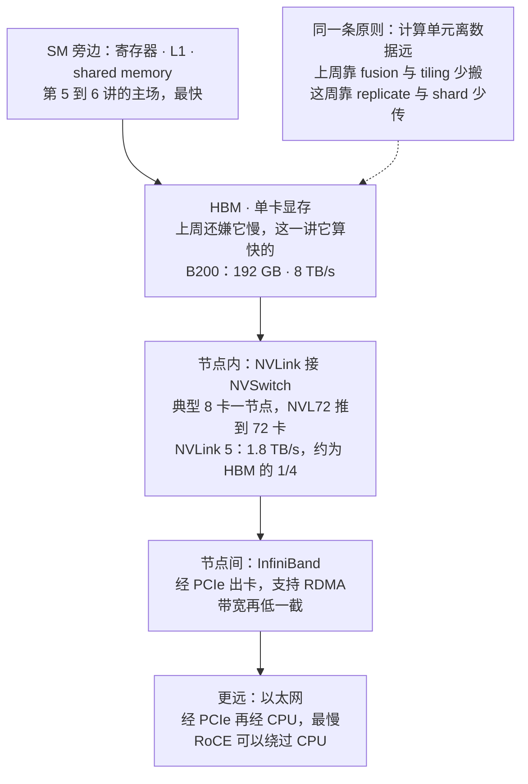
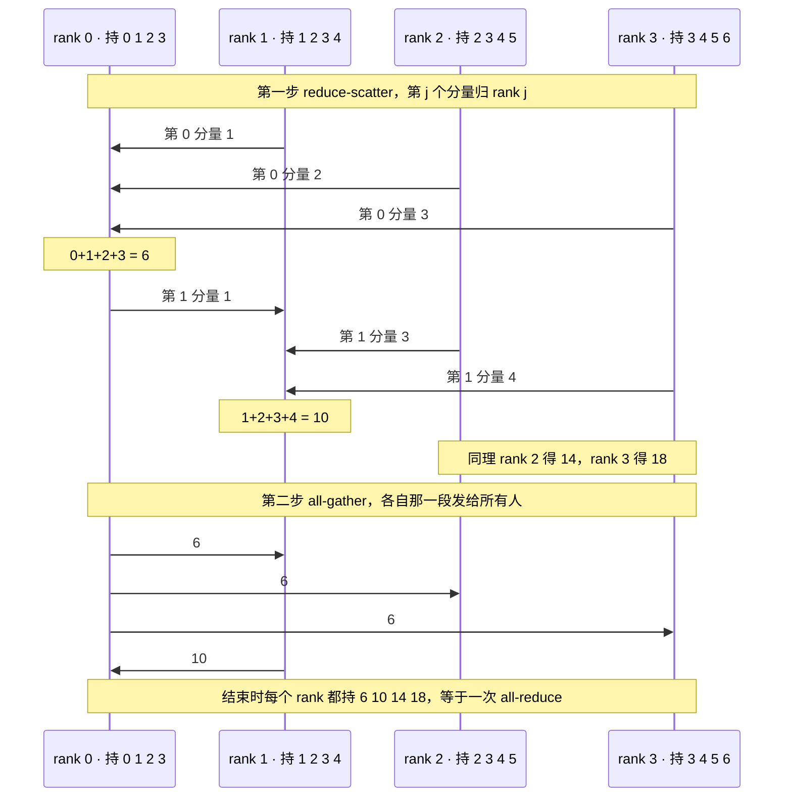
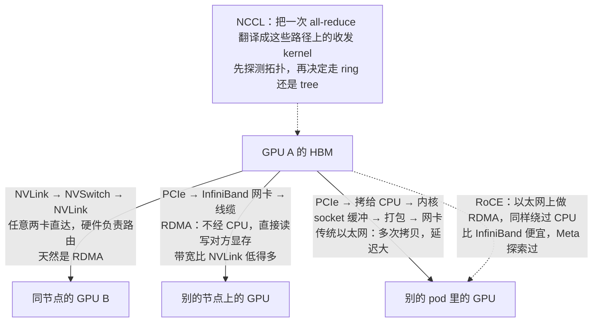
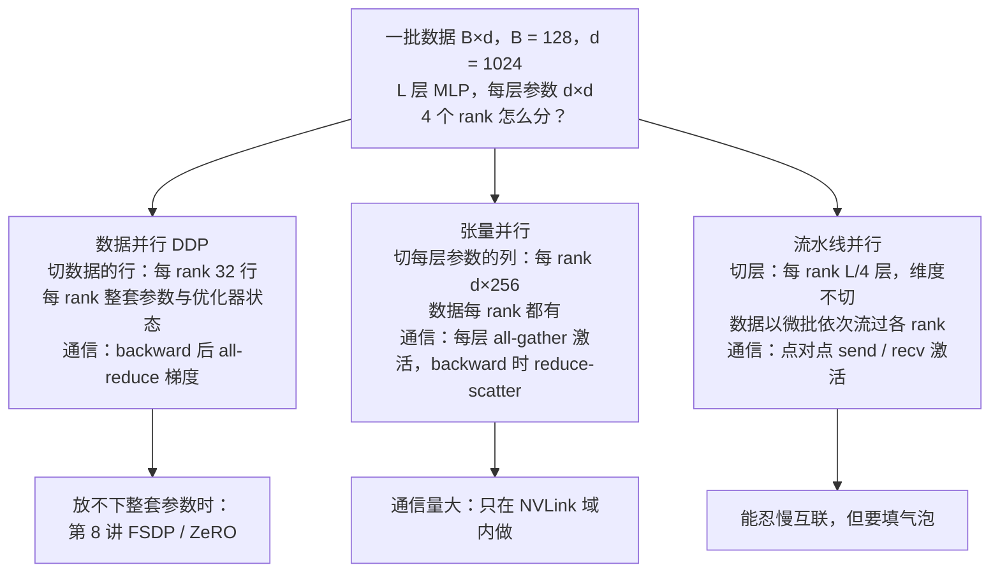
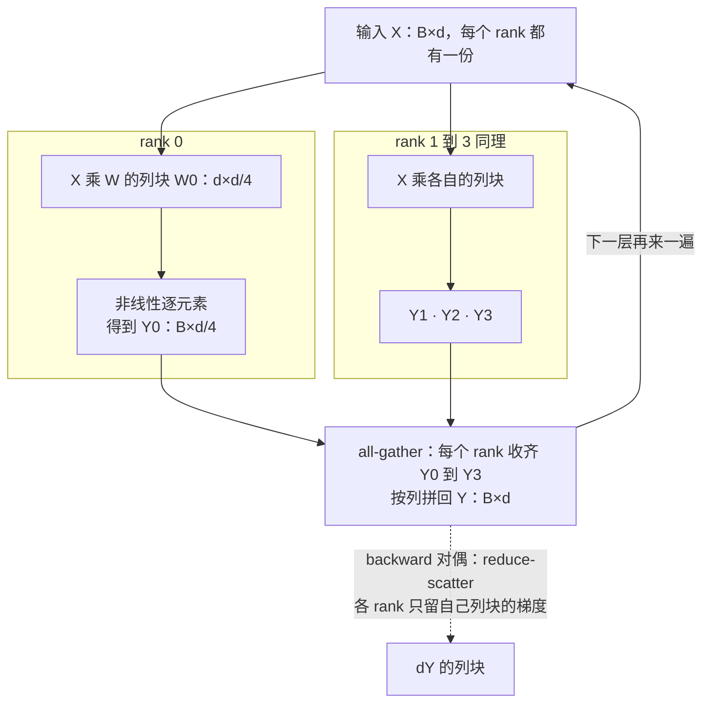
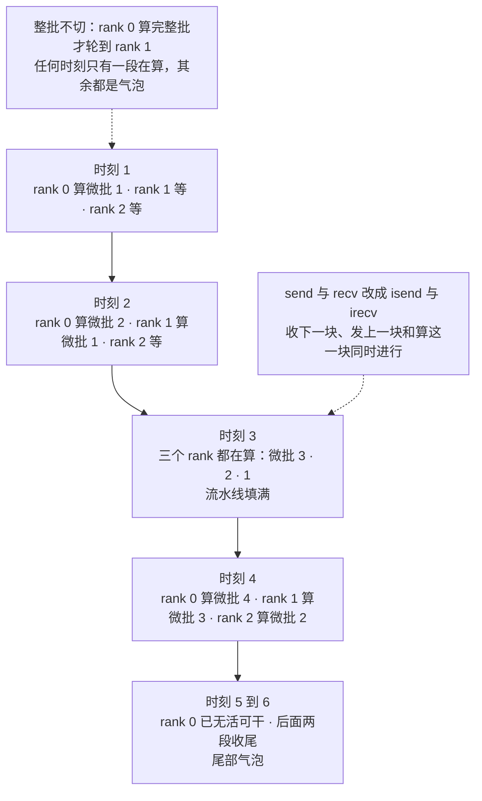

# CS336 第 7 讲｜并行（上）（Parallelism I）

> Stanford CS336: Language Modeling from Scratch（2026 春）· 第 7 讲，2026 年 4 月 20 日；系统部分的第三讲（第 5 讲 GPU / TPU → 第 6 讲 kernel → 第 7–8 讲多卡并行）
> 视频：<https://www.youtube.com/watch?v=SzpOcwdIL0Y>（1:21:02；英文字幕是人工校对的 CC 轨，比自动字幕干净得多，只剩少数缩写和听不清的地方，见文末勘误）
> 讲者：Percy Liang（推断：讲义是可执行的 Python、逐行"走"代码的风格，两次预告"Tatsu 周三讲 FSDP / ZeRO 和流水线的细节"，与课程表一致）
> 课程主页：<https://stanford-cs336.github.io/>；本讲不围绕某一篇论文，围绕的是 PyTorch 的 [torch.distributed](https://pytorch.org/docs/stable/distributed.html) 和 NVIDIA 的 [NCCL](https://github.com/NVIDIA/nccl)；三种并行方法的原始出处讲者没有点名，按推断标在"提到的工作"表里

**一句话**：多卡训练和单卡优化是同一道题——计算单元离数据远，游戏是编排计算、少搬数据——只是"远"从 HBM 变成了别的 GPU（节点内 NVLink 5 的 1.8 TB/s 约是 B200 HBM 8 TB/s 的四分之一，跨节点的 InfiniBand 和以太网再低几级）；所有搬运都用 1980 年代就有的集合通信原语表达，训练真正用到的是 all-gather、reduce-scatter 和二者拼成的 all-reduce（课上测得有效带宽约 400 GB/s，且与卡数、拓扑无关），在 torch.distributed 里各是一行调用；拿一个多层 MLP 做例子，数据并行只是在 backward 之后加一行梯度 all-reduce、代价是每张卡都得放下整套参数，张量并行切矩阵的列、每层都要 all-gather 激活所以只能在 NVLink 域内做，流水线并行切层、靠微批填气泡但能忍慢网络——放不下整套参数怎么办（FSDP / ZeRO）和气泡怎么调度，留给第 8 讲。

## 时间轴

| 时间 | 内容 |
|---|---|
| [0:05](https://www.youtube.com/watch?v=SzpOcwdIL0Y&t=5s) | 开场：从单卡 kernel 到多卡；计算离数据"更远了一层"；广义的存储层级 |
| [3:17](https://www.youtube.com/watch?v=SzpOcwdIL0Y&t=197s) | 为什么要多卡：放不下（B200 192 GB 对 1T 参数）与想更快；讲义是可执行 Python，课堂走单进程模式 |
| [4:57](https://www.youtube.com/watch?v=SzpOcwdIL0Y&t=297s) | 本讲两部分：集合通信、硬件、torch.distributed；三种并行在 MLP 上实现 |
| [5:28](https://www.youtube.com/watch?v=SzpOcwdIL0Y&t=328s) | 集合通信：1980 年代就有的原语；rank 与 world size；八个操作点名 |
| [8:04](https://www.youtube.com/watch?v=SzpOcwdIL0Y&t=484s) | 热身四件：broadcast（初始化用一次）、scatter、gather、reduce |
| [12:12](https://www.youtube.com/watch?v=SzpOcwdIL0Y&t=732s) | 主角三件：all-gather、reduce-scatter、all-reduce = reduce-scatter + all-gather |
| [16:31](https://www.youtube.com/watch?v=SzpOcwdIL0Y&t=991s) | all-to-all：MoE 的动态路由；均衡时就是转置；记忆口诀；问答 |
| [21:53](https://www.youtube.com/watch?v=SzpOcwdIL0Y&t=1313s) | 硬件：PCIe 加以太网的经典拓扑 vs NVLink / NVSwitch / InfiniBand；NVLink 5 1.8 TB/s 对 HBM 8 TB/s |
| [26:03](https://www.youtube.com/watch?v=SzpOcwdIL0Y&t=1563s) | 绕过 CPU：RDMA；NVL72 把 72 卡放进一个 NVLink 域；RoCE 与 Meta |
| [29:43](https://www.youtube.com/watch?v=SzpOcwdIL0Y&t=1783s) | NCCL 干什么；问答：rack 与 tray、RDMA 与 InfiniBand 的关系、第 9 张卡、TPU |
| [35:57](https://www.youtube.com/watch?v=SzpOcwdIL0Y&t=2157s) | torch.distributed：nccl / gloo 后端；spawn、rank、init_process_group、barrier |
| [40:05](https://www.youtube.com/watch?v=SzpOcwdIL0Y&t=2405s) | 演示：all_reduce 就地求和；reduce_scatter_tensor；async 与通信计算重叠；all_gather_into_tensor"举例证明" |
| [46:30](https://www.youtube.com/watch?v=SzpOcwdIL0Y&t=2790s) | 基准：1 亿元素的 all-reduce 1.6 ms；有效带宽的算法与约 400 GB/s；reduce-scatter 没有那个 2；问答 synchronize 与 barrier |
| [55:09](https://www.youtube.com/watch?v=SzpOcwdIL0Y&t=3309s) | 第二部分：多层 MLP 上的三种切法；数据并行 DDP：batch 128 切 4 份、梯度 all-reduce 取平均 |
| [1:02:35](https://www.youtube.com/watch?v=SzpOcwdIL0Y&t=3755s) | 张量并行：切每层的列，每层 all-gather 激活；backward 对偶地 reduce-scatter；autograd 不会替你做 |
| [1:09:25](https://www.youtube.com/watch?v=SzpOcwdIL0Y&t=4165s) | 流水线并行：切层、微批、send / recv；气泡与通信计算重叠 |
| [1:14:42](https://www.youtube.com/watch?v=SzpOcwdIL0Y&t=4482s) | 没讲的：DP 里也能重叠；序列并行、专家并行、组合；选法看硬件：TP 不出 NVLink 域，PP 能忍慢网 |
| [1:17:52](https://www.youtube.com/watch?v=SzpOcwdIL0Y&t=4672s) | 收尾：原语 vs 编译器（TPU / JAX）；总结；重算、存本地、存别的卡；下周三 Tatsu |

## 核心内容

### 1. 从一张卡到一千张卡：问题没变，只是数据"更远了一层"



*图 7-1｜把存储层级往外再延两级：卡内的 HBM、节点内的 NVLink、节点间的 InfiniBand 与以太网（自绘示意）· [▶ 看原幻灯片 2:14](https://www.youtube.com/watch?v=SzpOcwdIL0Y&t=134s)*

- **上周和这周**：第 5–6 讲盯着一张 GPU 的内部——HBM、L2、L1、寄存器和一堆 SM，讲怎么写 kernel 让单卡跑快。这一讲把图往外扩：不是一张卡，而是 4 张、1,000 张连在一起的卡，要把这些算力全用来训练模型。讲者的判断：用一大堆 GPU 很容易，用好它们很难。
- **同一条原则**：放大了看，两种情形是一回事——计算单元（ALU、Tensor Core）离数据远。单卡时"远"是指 HBM；多卡时你要的那块数据可能在另一张 GPU 上，得想办法搬过来。所以做法也同源：上周靠 fusion 和 tiling 减少对 HBM 的访问（读进 shared memory，能算的都算完再写回）；这周靠恰当地 replicate（复制）和 shard（分片）减少卡与卡之间的通信。
- **广义的存储层级**（图 7-1）：单卡内 L1 / shared memory 最快；HBM 上周还被嫌慢，这一讲反而算快的；再往外是节点内多卡，靠 NVLink 和 NVSwitch 连；再往外是多节点，只能靠 InfiniBand 或以太网，看你有什么网络。越往外越慢，和内存层级完全类似。
- **为什么要多卡**：表面答案是"要 scale"，讲者拆成两条：
    1. 放不下：参数、激活、梯度、优化器状态加起来超过单卡 HBM。B200 是 192 GB，训一个 1 万亿参数的模型，单卡无论如何放不下。
    2. 想更快：就算放得下，也可以把东西切开分给更多卡，训练更快。这里有取舍——用少几张卡放得下但算力少，摊开就要付通信带宽的代价，怎么并行是要算一笔账的。
  > 小注：1 万亿参数按 bf16 存权重就是 2 TB，是一张 B200 的十倍以上；按第 2 讲的记账再加上梯度和 Adam 状态，还要翻几倍。
- **讲义的形式**：和前几讲一样是可执行的 Python，但这一讲真跑起来是多进程的；课堂上逐行走的是一个"单进程模式"，所以看到的 rank 永远是 0；多进程的真实输出讲者另附了链接。作业 2 要在真机上用 torch.distributed 把这些写一遍。
- **本讲两部分**：第一部分是分布式计算的积木——集合通信的编程模型、硬件怎么连、在 PyTorch 里怎么调；第二部分在一个多层 MLP 上实现三种并行：数据并行、张量并行、流水线并行。用 MLP 而不用整个 Transformer，是因为 MLP 本来就是 Transformer 里算力的大头，核心计算已经都在里面了。

### 2. 集合通信原语：八个操作，三个主角

- **什么叫 collective**：分布式编程里的一组原语，1980 年代就有，不是为 LLM 发明的，今天用的还是这一套。"集合"的意思是你指定一种跨所有设备的通信模板（"把这些加起来发给每个人"），而不是逐对管理"这张卡发给那张卡"——写起来容易得多，系统也能替你做更多事。
  > 小注：这套原语后来在 MPI（Message Passing Interface，1994 年定稿）里标准化，名字沿用至今；NCCL 的接口就是照着 MPI 的集合操作起的名。
- **术语**：rank 指一个设备（这门课里就是一张 GPU，也可以是 TPU），编号 0 到 W−1；world size W 是设备总数。课上的例子 W = 4。
- 八个操作按用途分三档：

| 操作 | 之前 | 之后 | 训练里出现在哪 |
|---|---|---|---|
| broadcast | rank 0 持有 0 1 2 3 | 每个 rank 都持有 0 1 2 3 | 初始化：加载 checkpoint 后广播给所有 rank，只做一次 |
| scatter | rank 0 持有 0 1 2 3 | rank k 拿到第 k 个分量 | 不直接用，是理解 reduce-scatter 的台阶 |
| gather | rank k 持有第 k 段 | rank 0 把各段拼接起来 | 理解 all-gather 的台阶 |
| reduce | rank k 持有一个数 | rank 0 得到 0+1+2+3 = 6 | 理解 all-reduce 的台阶；gather 可以看成"归约运算是拼接"的 reduce |
| all-gather | rank k 持有第 k 段 | 每个 rank 都拼出完整向量 | 分片的参数在 forward 前收齐（第 8 讲 FSDP） |
| reduce-scatter | rank k 持有向量 k、k+1、k+2、k+3 | 第 j 个分量跨 rank 求和后放到 rank j：6、10、14、18 各在一处 | backward 之后把各 rank 的梯度加起来再分回去 |
| all-reduce | 同上 | 每个 rank 都得到 6 10 14 18 | 数据并行：梯度求和后复制到所有 rank |
| all-to-all | rank i 的第 j 段 | 送到 rank j；均衡时相当于把矩阵转置 | MoE 的动态路由：token 送到持有对应 expert 的 rank |

- **三档的意思**：前四个（broadcast、scatter、gather、reduce）是热身，用来建立感觉，训练的主路径上几乎不出现；all-gather、reduce-scatter、all-reduce 会在分布式训练里反复出现；all-to-all 是 MoE 专用（第 3 节末）。
- **reduce 的定义**：函数式编程里的那个 reduce——对各 rank 上的数据施加一个可结合、可交换的运算（sum、max、min 都行），结果落在指定的 rank 上。
- **记忆口诀**（讲者的）：reduce 就是归约；scatter 分发、gather 集中，互为逆运算；前面加 all 表示目的地是所有设备——all-reduce、all-gather 由此得名。
- **问答**
    - 和 NumPy 的 broadcasting 有关系吗？概念上一样（一个东西复制给多个），但实例完全不同，这里说的是设备间通信。
    - gather / reduce 的目标非得是 rank 0 吗（[20:23](https://www.youtube.com/watch?v=SzpOcwdIL0Y&t=1223s)）？不是，调用时指定哪个 rank 就落到哪；不必提前定死，但执行那一刻必须确定。
    - 这些只是概念还是真有代码？马上就看代码（第 5 节）。

### 3. all-reduce = reduce-scatter + all-gather：为什么要拆开看



*图 7-2｜课上的四 rank 例子：先 reduce-scatter 把第 j 个分量的和放到 rank j，再 all-gather 让人人都有整份；两步连做就是 all-reduce（自绘示意）· [▶ 看原幻灯片 15:25](https://www.youtube.com/watch?v=SzpOcwdIL0Y&t=925s)*

- **reduce-scatter 做什么**：每个 rank 手里都是一个完整长度的向量；对第 j 个分量跨 rank 归约，结果只放到 rank j。课上的例子：四个 rank 分别持有 0 1 2 3、1 2 3 4、2 3 4 5、3 4 5 6，第 0 个分量加起来是 6 放到 rank 0，第 1 个分量 10 放到 rank 1，依此 14、18。训练里的对应：backward 之后各 rank 算出的是不同数据上的梯度，要加起来，再把结果分回去各管一段。
- **all-gather 做什么**：gather 到所有 rank——每个 rank 把自己那段发给所有人，每个人都拼出完整向量。训练里的对应：参数分片在各 rank 上，forward 前要收齐整份参数。
- **all-reduce 就是两步连做**：先 reduce-scatter 得到 6、10、14、18 各在一处，再 all-gather 把它们复制到每个 rank。讲者说 all-reduce 反而最好懂——一堆张量，求和，复制到所有节点；数据并行第一个用的就是它。
- **为什么还要拆**：all-reduce 是一个整块的操作，简单，但它要求每个 rank 都放得下整份结果。往后要做 ZeRO / FSDP 这类"参数放不下"的方案，就得把它拆成两半，在两半之间插手——只 all-gather 当前层需要的参数、只 reduce-scatter 自己负责那一片的梯度。这是第 8 讲的内容，本讲先把两半各自练熟。CME295 第 4 讲把 ZeRO 的三级分片一页带过，这里给出了它赖以成立的通信原语。
- **all-to-all**：最一般的一种——每个 rank 给每个 rank 发一条消息。课上的例子：rank i 的第 j 段要送到 rank j，rank 0 把 0、1、2、3 分别送到 rank 0、1、2、3，rank 1 把 4、5、6、7 分别送到 rank 0、1、2、3……结果是 rank j 收到所有人发来的"第 j 列"。若把各 rank 的数据排成矩阵，均衡情形下 all-to-all 就是转置；它也支持不均衡的划分，可以配置给任何 rank 发任意字节，但通常希望越均衡越好——第 4 讲 MoE 的负载均衡就是为此。MoE 里每个 rank 既持有一部分数据也持有一部分 expert，路由是动态的，得看了数据才知道哪些激活该送到哪个 expert，所以天然是 all-to-all。本讲不再展开。

### 4. 硬件：节点内 NVLink，节点间 InfiniBand，再远就是以太网



*图 7-3｜同一份数据要去三种远近的 GPU，各走什么路；RDMA 的意义是不让 CPU 插手（自绘示意）· [▶ 看原幻灯片 23:25](https://www.youtube.com/watch?v=SzpOcwdIL0Y&t=1405s)*

- **经典的图**：一台服务器里有几颗 CPU，一条 PCIe 总线（过去接鼠标键盘的那种），GPU 挂在上面，还有内存；服务器之间用以太网相连。同节点的 GPU 通过 PCIe 通信，跨节点得走以太网。讲者的比喻：买了张游戏卡，和朋友的卡连起来"训个大模型"，就是这个拓扑。
- **认真训练的样子**：每节点 8 张 GPU（8 是典型值；幻灯片上的 256 个节点是编的），通过 NVIDIA 的 NVLink 接到 NVSwitch 上。校准一下数量级：NVLink 5 的总带宽是 1.8 TB/s；B200 的 HBM 是 8 TB/s，所以卡间比卡内慢约 4 倍——对设备之间的通信来说已经很快了，但仍比 HBM 慢，而 HBM 又比 shared memory / L1 慢得多。从编程的角度，接在同一个 NVSwitch 上的 GPU 可以看成任意两两直连，硬件负责把数据送到交换机、交换机负责路由。
- **再往外**：GPU 数量一多，NVSwitch 就罩不住了（不可能有一个 NVSwitch 管 10 万张卡），节点被组成 pod，用 InfiniBand 相连——此时 GPU 不再直连 GPU，要经 PCIe 出卡、走专门的 InfiniBand 线缆，速度低得多；InfiniBand 也到头时，pod 之间只剩以太网，要经 PCIe 再经 CPU，更慢。节点越多越慢，和内存层级一个道理。
- **RDMA：别让 CPU 插手**。传统以太网上，GPU 要发数据得先拷给 CPU，进操作系统内核的 socket 缓冲区（这里的 kernel 是 OS 内核，不是 GPU kernel），打成网络包，再拷到网卡发出去，延迟很大。RDMA（remote direct memory access）让一张 GPU 直接读写另一张 GPU 的显存，CPU 完全不参与。NVLink / NVSwitch 天然如此，InfiniBand 也支持 RDMA，标准以太网不支持。
- **两个新进展**
    - NVL72：NVIDIA 把 B200 / B300 做成机架级产品，72 张 GPU 全部接进同一个 NVLink 域。凡人的世界是"8 张卡之间飞快，出了这 8 张就慢一大截"；肯花钱，这个边界可以推到 72 张。
    - RoCE（RDMA over Converged Ethernet）：以太网上也做 RDMA、绕过 CPU，算是对 InfiniBand（和 NVIDIA 的多数产品一样很贵）的回应。Meta 有论文探索过，讲者说他们的模型"可能就是在 RoCE 上训的"。
  > 小注：NVIDIA 的资料里 GB200 NVL72 是 18 个 compute tray（每个 2 颗 Grace CPU 加 4 颗 Blackwell GPU，每颗 Grace 带 2 颗 GPU）加 9 个 NVLink switch tray，合计 36 颗 CPU、72 张 GPU；讲者问答里说的"每 tray 8 卡、9 个 tray"应是把 switch tray 的个数和 GPU 总数对上了。Meta 那篇应为 SIGCOMM 2024 的《RDMA over Ethernet for Distributed AI Training at Meta Scale》；Llama 3 论文自己写明 405B 是在 RoCE 集群上训的，小模型用的是 InfiniBand，两种网络都是 400 Gbps 的链路。
  > 小注：对照上一代：H100 的 NVLink 4 每卡 900 GB/s、HBM3 3.35 TB/s（同样约 4 倍）；InfiniBand NDR 每端口 400 Gb/s ≈ 50 GB/s，比 NVLink 低一个数量级以上——这就是"张量并行不出 NVLink 域"（第 11 节）的数字依据。
- **NCCL**（念作 nickel）：NVIDIA Collective Communications Library，最底层。你说"我要 all-reduce"，它去探测硬件拓扑、找出 GPU 之间的路径，然后启动 GPU kernel 去收发数据——别忘了 GPU 上跑的一切都是 kernel，通信也有通信 kernel。课上不再深入，知道它在就行。
- **问答**
    - rack 和 tray 是什么？rack 就是数据中心里的机架；tray 是一层托盘，G 指 Grace CPU，两颗 CPU 各接若干 GPU，整层再接进 NVSwitch（讲者自称不是硬件专家，准确数字见上面的小注）。
    - RDMA 和 InfiniBand 什么关系？RDMA 是"想要的性质"——一张卡能直接读写另一张卡的显存；NVLink / NVSwitch、InfiniBand、RoCE 是实现它的三种硬件路径。
    - NCCL 对多节点优化过吗？细节讲者不清楚，但 NVIDIA 的大客户就是训大模型的公司，整个软件栈都在为这类负载优化，没优化才奇怪。
    - 9 张卡怎么办？看第 9 张落在哪：如果 8 卡一节点，第 9 张在另一个节点又没有 NVLink，那它算力不多、通信还贵，很糟；都在同一个 NVSwitch 域里就没什么问题。
    - 和 TPU 有什么不同？TPU 简单得多，细节课后聊（第 5 讲说过：芯片里像，差别在网络）。

### 5. 用 torch.distributed 把它写出来

- **接口**：PyTorch 的 torch.distributed 给集合通信提供了干净的接口，不必直接碰 NCCL；它支持多种后端——GPU 上用 nccl，CPU 上用 gloo（并行编程早于 GPU，这些操作在 CPU 上一样能做；讲者在笔记本上走代码用的就是 gloo）。库里也有 FSDP 这类高层封装，这门课不用——要从零造。

```python
import torch, torch.distributed as dist
def worker(rank, world_size):
    backend = "nccl" if torch.cuda.is_available() else "gloo"
    dist.init_process_group(backend, rank=rank, world_size=world_size)  # master 地址只用来对表
    x = torch.arange(4, dtype=torch.float32) + rank        # rank k 持有 k, k+1, k+2, k+3
    piece = torch.empty(1)
    dist.reduce_scatter_tensor(piece, x, op=dist.ReduceOp.SUM)   # 输入不动，输出是我负责的那一段
    full = torch.empty(4)
    dist.all_gather_into_tensor(full, piece)               # 各段拼回整份：6 10 14 18
    dist.all_reduce(x, op=dist.ReduceOp.SUM)               # 就地一步到位，结果与 full 相同
    dist.barrier(); dist.destroy_process_group()
torch.multiprocessing.spawn(worker, args=(4,), nprocs=4)   # 同一个函数复制 4 份，各占一个进程
```

一次集合操作在代码里就是一行：先建进程组，再把张量和归约运算交给库，后端负责启动通信 kernel。

- **执行模型**：spawn 把同一个函数复制 W 份，各在一个进程里异步运行；函数拿到自己的 rank（0 到 W−1）和 W。讲者的 spawn 是个包装，课堂的单进程模式走的是"禁用分布式"的分支，正常情况调的是 torch.multiprocessing.spawn。
- **setup 里配的 master 地址和端口**不是数据通道，只用于元数据和协调；真正的数据走 NCCL，否则会慢得离谱。
- **barrier**：同步栅栏，所有进程都到这一行才继续。进程之间完全异步——一个可能先跑完，也可能任意交错——想保证某段代码先于另一段执行就放 barrier；代价是可能白等。讲者为了让打印顺序好看，放了比平时多得多的 barrier。
- **all_reduce**：传入张量和归约运算（sum），async_op = False；后端（gloo 或 nccl）启动 kernel、完成通信，结果就地写回——之后每个 rank 上都是各列之和。打印出来的顺序由硬件心情决定，因为各进程异步。
- **reduce_scatter_tensor**：不是就地，要分别给输入和输出张量；输入不动，输出得到"自己负责的那个分量"的归约结果。
- **async_op = True 是什么意思**（[44:25](https://www.youtube.com/watch?v=SzpOcwdIL0Y&t=2665s) 的提问）：这是一个整块的操作，启动 CUDA kernel 去通信；CUDA 本来就相对进程异步，现在进程之间又异步。设成异步后这行立刻返回，你可以先干别的——典型用法是通信和计算重叠：发起 all-reduce 后去加载下一步的数据，需要确认完成时再 wait 或 barrier。本讲不展开，但它是第 8 讲和作业里的关键。
- **all_gather_into_tensor**：把 reduce-scatter 的输出当输入，再分配一个输出，之后每个 rank 都拿到所有分片——讲者管这叫"举例证明"all-reduce = reduce-scatter + all-gather。最后 destroy_process_group 清理，是好习惯。
- **问答**：rank 就是 GPU 吗？这门课里是。

### 6. 通信有多快：有效带宽怎么算

- **基准怎么做**：all-reduce 一个 1 亿元素的张量。和第 2 讲的基准一样先热身；计时前后各做一次 cuda.synchronize 加 barrier，因为这里有两种异步——CUDA kernel 和多个进程——要确保一切都停下、都做完了才开始计时。每个 rank 各报一个时间，想要一个数就取平均。
- **1.6 ms 是快是慢**：光看时间没意义，要像第 2 讲算 MFU 那样算有效带宽：该发多少字节 ÷ 总时间。

$$
\text{bytes}_{\text{sent}} = 2\,(W-1)\,S,\qquad
\text{BW}_{\text{eff}} = \frac{2\,(W-1)\,S}{W\,t}\ \xrightarrow{\ W\to\infty\ }\ \frac{2S}{t}
$$

S 是张量的字节数（元素大小 × 元素个数），W 是 world size，t 是一次 all-reduce 的墙钟时间。W−1 来自"把 W 份加起来要做 W−1 次加法"，2 来自既要发出去归约又要把结果送回来；分母乘 W 是因为所有 rank 都在等这段时间。代进课上的数：1 亿个元素（讲者没说 dtype，按默认的 float32 推断是 400 MB），W = 4，t = 1.6 ms，得到约 375 GB/s，即讲者说的"约 400 GB/s"。

- **两条性质**：W 一大，(W−1)/W 趋近 1，有效带宽就是 2S/t——与卡数无关，卡越多带宽也不变，这是好事；它也与拓扑无关，NCCL 是走 ring 还是 tree 由它自己决定，公式不用管。
- **reduce-scatter 的账**：同样的输入输出、热身、计时，公式里没有那个 2：

$$
\text{BW}_{\text{eff}}^{\text{reduce-scatter}} = \frac{(W-1)\,S}{W\,t_{\text{rs}}}
$$

t_rs 是一次 reduce-scatter 的时间。测出来带宽同样在 400 GB/s 上下（有随机波动）：all-reduce = reduce-scatter + all-gather，搬的数据是两倍，时间也是两倍，两者相消，带宽相同。

> 小注：这正是 NCCL 官方基准 nccl-tests 的"bus bandwidth"口径——算法带宽 S/t 乘以 2(W−1)/W——用来在不同卡数之间公平比较；ring all-reduce 里每张卡恰好收发 2(W−1)/W × S 字节，所以它也是每条链路的真实负载。讲者没说这台机器是什么卡；若是 H100，NVLink 单向 450 GB/s，测到 400 GB/s 上下是合理的。

- **问答：为什么要 cuda.synchronize？**（[53:30](https://www.youtube.com/watch?v=SzpOcwdIL0Y&t=3210s)）说到底还是在做 CUDA 操作，只是多个进程各带一张卡；CUDA 默认异步，跑到下一行 Python 时上一个操作可能没做完，所以要同步。先 barrier 再 synchronize 行不行？讲者想了想：不行——先过 barrier 时各自的 kernel 可能还没跑完，之后各自同步各自的，等于没同步。

### 7. 第二部分：在一个多层 MLP 上看三种切法



*图 7-4｜同一个 MLP、同一批数据，三种切法各自切什么、传什么（自绘示意）· [▶ 看原幻灯片 55:40](https://www.youtube.com/watch?v=SzpOcwdIL0Y&t=3340s)*

- **为什么用 MLP**：多层 MLP 是 Transformer 里真正的算力瓶颈，三种并行的核心计算在它身上都能看到；大模型只是多了很多簿记，反而看不清算法。
- **设定**：batch size 128、维度 1,024 的数据矩阵；L 层，每层一个 1,024 × 1,024 的参数矩阵，随机初始化，交给优化器；W = 4。
- **三种切法**（图 7-4）：数据并行切数据的行，每张卡整套参数、只看一部分数据，然后同步；张量并行不切数据、切每一层，每张卡拿到每层的一部分，通信量大得多；流水线并行按层切，每张卡拿到几层的全部维度，数据依次流过。讲者提醒这是概念图，别抠细节。CME295 第 4 讲的 DP / tensor / pipeline 三分法就是这张图，那边只说了"切什么"，这里把"传什么、传多少"补上。

### 8. 数据并行 DDP：标准训练加一行

```python
local = data[rank * B // W : (rank + 1) * B // W]       # 每个 rank 只拿自己那 B/W 行
for step in range(num_steps):
    x = local
    for w in params:                                    # 每个 rank 都持有整套参数
        x = torch.relu(x @ w)
    loss = x.square().mean()
    loss.backward()                                     # 到这里各 rank 的梯度还不一样
    for w in params:                                    # 唯一多出来的一步
        dist.all_reduce(w.grad, op=dist.ReduceOp.AVG)   # 梯度取平均，各 rank 从此一致
    optimizer.step(); optimizer.zero_grad()
```

数据并行对训练循环的全部改动就是 backward 之后那个 all-reduce 循环，forward 长什么样它不关心。

- **切数据**：把数据矩阵的行分成 W 份，rank k 拿第 k 份——local batch size = 128 / 4 = 32 行，就是按下标切片再放到对应的卡上。实践中每个 rank 应该自己加载自己的数据，别经过一个瓶颈，这里只是演示。
- **训练循环**：forward 只在本地那 32 行上逐层算，backward 照常。到这里本来就该结束了——但每个 rank 数据不同，梯度也不同。让数据并行成立的关键一步：对每个参数的 .grad 做一次 all-reduce、取平均。之后每个 rank 的梯度完全一致，再各自更新参数。这是标准训练和 DDP 之间唯一的差别，一行代码，讲者说它"相当优雅"。

$$
\bar g=\frac{1}{W}\sum_{k=1}^{W} g_k
=\nabla_\theta\Big(\frac{1}{W}\sum_{k=1}^{W}\mathcal{L}_k(\theta)\Big)
$$

g_k 是 rank k 在自己那 1/W 的数据上算出的梯度，L_k 是它的局部 loss，θ 是所有 rank 都持有的同一份参数；平均梯度等于整个 batch 上 loss 的梯度，所以每个 rank 更新完仍然一致，效果如同它看过全部数据。

- **不变量**（讲者在 [1:02:04](https://www.youtube.com/watch?v=SzpOcwdIL0Y&t=3724s) 的总结）：各 rank 的 loss 不同，梯度起初不同，all-reduce 之后相同，因此参数始终相同。每个 rank 都像拿着全部数据在更新参数，实际只处理了 1/W。
- **问答**
    - batch size 得大于 1 吧？至少要等于 W 才说得通，通常要大得多。
    - 要是 W 的整数倍吗？最好是；不是也能补零之类，但整除对谁都省事。
    - 换成 Transformer 呢？完全一样——DDP 很模块化，只在 backward 之后平均梯度，不关心 forward 长什么样。
- **代价与去向**：all-reduce 简单，但要求每张卡放得下全部参数（以及梯度和优化器状态——DDP 里每个 rank 都在做重复的更新，换来的是不必把优化器状态搬来搬去）。参数放不下时就得更聪明：这是第 8 讲 Tatsu 讲的 FSDP 和 ZeRO——用第 3 节拆开的两半，参数、梯度、优化器状态逐级分片。CME295 第 4 讲的 ZeRO-1 / 2 / 3 那一页，到那里会算清每级省多少字节。
- **能做但没做的优化**：这里是 backward 全部结束后一次性做所有 all-reduce；聪明的做法是某个参数的梯度一算出来就开始发送，让通信和后续的 backward 重叠——作业 2 会探索。

### 9. 张量并行：切矩阵的列，每层 all-gather 一次激活



*图 7-5｜列切张量并行的一层：每个 rank 只存参数的一个列块，算出输出的一段，再 all-gather 拼回完整激活（自绘示意）· [▶ 看原幻灯片 1:04:15](https://www.youtube.com/watch?v=SzpOcwdIL0Y&t=3855s) · 出处：[Shoeybi et al., 2019](https://arxiv.org/abs/1909.08053)（应出自 Megatron-LM）*

- **切法**：不切数据（简化起见每个 rank 都有全部数据 B × d），切每一层的参数。local_num_dim = d / W = 256；每个 rank 上每层的参数是 d × 256——沿列切开，所以叫 column tensor parallel（按行切也行，课上不讲）。

$$
\sigma(XW)=\sigma\big(X\,[\,W_0\;\;W_1\;\;W_2\;\;W_3\,]\big)=\big[\,\sigma(XW_0)\;\;\sigma(XW_1)\;\;\sigma(XW_2)\;\;\sigma(XW_3)\,\big]
$$

X 是 B × d 的输入，W_k 是参数矩阵的第 k 个列块（d × d/4），σ 是逐元素的非线性。矩阵乘法可以按列块拆成几个小乘法各自做，逐元素的 σ 与拼接可交换，所以每个 rank 只用自己的列块就能算出输出的一段，最后拼起来即可。

```python
d_local = d // W                                        # 每个 rank 只存 W 的 d_local 列
x = data                                                # 简化：每个 rank 都有全部数据 B×d
for w_local in params:                                  # w_local 形状 d × d_local
    y_local = torch.relu(x @ w_local)                   # B × d_local，非线性逐元素，可先算
    pieces = [torch.empty_like(y_local) for _ in range(W)]
    dist.all_gather(pieces, y_local)                    # 收齐其余 rank 的列块
    x = torch.cat(pieces, dim=1)                        # 拼回 B × d，交给下一层
# backward 与之对偶：对拼接后的梯度做 reduce-scatter，各 rank 只留自己列块的梯度
```

每一层都要经过"局部 matmul → 局部非线性 → all-gather → 拼接"四步，通信嵌在模型内部。

- **forward**：逐层：X 乘自己那一片参数得到 B × 256 的激活片，非线性可以直接做（逐元素）；但下一层需要完整的 B × d 输入，各 rank 的激活片都得凑齐——这正是 all-gather：每个 rank 分配 W 个 B × 256 的槽，all-gather 后每个人的对应槽里都有了各 rank 的片，按列拼接得到 B × d。每一层都要来一遍。
- **和数据并行的区别**：DDP 优雅在把模型当黑盒；张量并行必须动模型内部，它强烈依赖"一个大矩阵乘可以拆成几个小矩阵乘再合并"这一事实。
- **问答**
    - backward 怎么办？对偶：forward 里 all-gather 激活，backward 里对梯度做 reduce-scatter，各 rank 只留自己列块对应的那份。all-gather 与 reduce-scatter 的这种对偶会反复出现。
    - autograd 会自动做吗？只调 .backward 不会，它不知道有并行；PyTorch 有现成的封装替你做，但这里是 CS336，通信要自己管——设计如此。
- **通信量**：每一层都要传一整份 B × d 的激活，相当大，所以张量并行只在高带宽的地方做——节点内、NVLink 域内；出了 NVLink 域就别做（第 11 节）。
  > 小注：课上的版本每层 all-gather 一次，是为了教学；Megatron-LM（Shoeybi et al., 2019）的做法是把 MLP 的两层配成"第一层按列切、第二层按行切"，中间的激活不必拼回，整个 MLP 块 forward 只需一次 all-reduce（backward 再一次），attention 按 head 切也是同一思路。CME295 第 4 讲说"tensor parallelism 把一个大矩阵切两半"，切法就是这里的列切。

### 10. 流水线并行：切层，用微批填气泡



*图 7-6｜三段流水线跑四个微批：头尾各有一段只有部分 rank 在算的气泡，微批越多气泡占比越小（自绘示意）· [▶ 看原幻灯片 1:12:36](https://www.youtube.com/watch?v=SzpOcwdIL0Y&t=4356s) · 出处：[Huang et al., 2018](https://arxiv.org/abs/1811.06965)（应出自 GPipe）*

- **切法**：每个 rank 拿到一段连续的层（local_num_layers = L / W），每层完整的 d × d、完整的维度；数据从 rank 0 进，算完自己的层送给 rank 1，依次往后——切深网络最自然的方式。
- **微批**：除了切层，还把 batch 切成若干 micro-batch。rank 0 拿到数据后分块；对每个微批：从前一个 rank 接收，在自己的层上做 forward，发给下一个 rank。这里用的是点对点的 send / recv（前面没讲，但一看就懂：recv 从 rank−1 收一个张量，send 把 x 发到 rank+1）。

```python
my_layers = params[rank * L // W : (rank + 1) * L // W]  # 这个 rank 只存 L/W 层
for mb in data.chunk(num_microbatches):                 # 微批：小块流水，少等一点
    if rank > 0:
        dist.recv(mb, src=rank - 1)                     # 点对点：从上一段接激活
    for w in my_layers:
        mb = torch.relu(mb @ w)
    if rank < W - 1:
        dist.send(mb, dst=rank + 1)                     # 送给下一段
# 换成 dist.isend / dist.irecv 并在需要时 .wait()，通信才能和计算重叠
```

流水线的一段就是"收、算自己的几层、发"三步，参数只有自己那几层的。

- **气泡**：rank 0 在算时后面的卡都在等，rank 1 开始算了 rank 0 又闲着——流水线里总有人在等别人的张量，这就是 pipeline bubble，相当浪费。微批的用处是把批切小，算完一小块立刻送走，让后面的卡早点开工、前面的卡少闲一会儿，气泡就少了。

$$
\text{bubble fraction}\approx\frac{W-1}{M+W-1}
$$

W 是流水线段数（rank 数），M 是微批数；M = 1（整批不切）时气泡占 (W−1)/W，M 越大越接近 0。

> 小注：这个比例出自 GPipe（Huang et al., 2018），讲者没有写公式，只说微批能减少气泡；第 8 讲会讲 1F1B 这类调度怎么在不加大 M 的前提下压气泡和显存。

- **通信计算重叠**：这个朴素版本没做，但对流水线并行尤其重要——算这一块的同时就该在收下一块、发上一块。做法是把 send / recv 换成 isend / irecv（前面加个 i），变成异步，代码上要多管一些事。
- Tatsu 周三会细讲微批与调度。

### 11. 选哪种并行：由带宽决定，不由喜好决定

- **张量并行**：通信最多，每层都要发一整份激活，所以只在节点内、NVLink 上做，不会跨出 NVLink 域。
- **流水线并行**：能忍受慢得多的互联——一些去中心化训练的工作就用它，因为 GPU 分布在地球两端；那种场景绝不会用张量并行。
- **常见的组合**：节点内张量并行，然后数据并行或 FSDP，再需要时套一层流水线并行。作业里会让你在给定拓扑下做这种组合。
- **critical batch size**：数据并行看起来能一直加卡，但 batch 加到某个临界值之后再大就不再帮忙，算力就浪费了——这时候不如转去做张量并行。这些考量课程后面会陆续展开。
- **没讲的并行**（[1:15:14](https://www.youtube.com/watch?v=SzpOcwdIL0Y&t=4514s)）：序列并行把整条序列切段，用来并行化 attention 的计算；专家并行把 MoE 的 expert 分到不同卡上，第 3 节的 all-to-all 就用在这里；以及各种组合。讲者认为 MLP 已经给出理解基础所需的大部分，大模型只是簿记更多。
- **原语 vs 编译器**：这门课故意用 PyTorch、而且是最原始的集合通信调用，为的是看清机制上发生了什么。另一条路（尤其在 TPU / JAX 的世界）是只定义模型和分片策略——"这块数据要在这里、这里和这里"——由编译器决定需要哪些通信操作。很诱人，但会把从零造东西的乐趣抽走一大半。
- **收尾的模式**（[1:19:56](https://www.youtube.com/watch?v=SzpOcwdIL0Y&t=4796s)）：并行的切法有按数据、按张量或 expert、按流水线或序列；本讲只做了 DDP，下一讲 FSDP / ZeRO；张量并行要快互联，流水线并行不那么要，但要下功夫消气泡。更高一层看，同一个模式反复出现：一样东西可以重算，可以存在本地内存（第 5 讲重计算的取舍），现在多了第三个选项——存在别的 GPU 上。数据并行每个 rank 都在做重复的工作、都保存整套参数，理由就是不用把优化器状态搬来搬去。硬件会越来越快，但我们永远想要更大的模型，这套层级结构永远都在。

## 关键图表速查（点时间戳跳到原幻灯片）

| 图 | 看什么 | 跳转 | 出处 |
|---|---|---|---|
| 单卡到多卡的总图 | 上周盯的那一个方框（HBM、L2、L1、SM）现在变成 4 个、1,000 个，之间画着连线 | [0:38](https://www.youtube.com/watch?v=SzpOcwdIL0Y&t=38s) | — |
| 广义存储层级 | 三级：卡内 L1 / shared memory 与 HBM → 节点内 NVLink / NVSwitch → 跨节点 InfiniBand / 以太网 | [2:14](https://www.youtube.com/watch?v=SzpOcwdIL0Y&t=134s) | — |
| 四个热身操作 | 每张左边是"之前"各 rank 持有什么、右边是"之后"；reduce 那张把 0 1 2 3 加成 6 | [8:36](https://www.youtube.com/watch?v=SzpOcwdIL0Y&t=516s) | — |
| reduce-scatter 示意 | 第 j 个分量跨 rank 相加后落到 rank j：6、10、14、18 各在一处 | [14:21](https://www.youtube.com/watch?v=SzpOcwdIL0Y&t=861s) | — |
| all-reduce 示意 | 同一个输入，先 reduce-scatter 再 all-gather，四个 rank 都得到 6 10 14 18 | [15:25](https://www.youtube.com/watch?v=SzpOcwdIL0Y&t=925s) | — |
| all-to-all 示意 | 位置决定目的地：rank j 收到所有人的"第 j 列"，看出来就是转置 | [17:36](https://www.youtube.com/watch?v=SzpOcwdIL0Y&t=1056s) | — |
| NVLink / NVSwitch / InfiniBand 拓扑 | 8 卡一节点接 NVSwitch；读 NVLink 5 的 1.8 TB/s，对照 B200 HBM 的 8 TB/s | [23:57](https://www.youtube.com/watch?v=SzpOcwdIL0Y&t=1437s) | — |
| 传统以太网 vs RDMA | 左边数据经 CPU、内核 socket 缓冲、网卡多次拷贝；右边 GPU 直写对方显存 | [26:35](https://www.youtube.com/watch?v=SzpOcwdIL0Y&t=1595s) | — |
| all_reduce 演示的输出 | before 每个 rank 一行不同的向量、打印顺序乱；after 全部相同 | [40:36](https://www.youtube.com/watch?v=SzpOcwdIL0Y&t=2436s) | — |
| 有效带宽的公式 | 分子 2 × (W−1) × S，分母 W × 时间；1 亿元素 1.6 ms 得约 400 GB/s | [49:15](https://www.youtube.com/watch?v=SzpOcwdIL0Y&t=2955s) | — |
| 三种切法的示意图 | 同一块"数据 × 参数"的矩形：DP 横切数据、TP 竖切每层、PP 按层切 | [55:40](https://www.youtube.com/watch?v=SzpOcwdIL0Y&t=3340s) | — |
| DDP 的关键一行 | for 循环里对每个 param.grad 做 all_reduce 取平均，其余和单卡训练一模一样 | [59:21](https://www.youtube.com/watch?v=SzpOcwdIL0Y&t=3561s) | — |
| 列切张量并行 | 参数矩阵沿列切成 W 块每 rank 一块；forward 后 all_gather 进 W 个槽再拼接 | [1:04:15](https://www.youtube.com/watch?v=SzpOcwdIL0Y&t=3855s) | [Megatron-LM](https://arxiv.org/abs/1909.08053)（应出自） |
| 流水线的 recv / forward / send | 微批循环：从 rank−1 收、算自己的层、发给 rank+1 | [1:11:32](https://www.youtube.com/watch?v=SzpOcwdIL0Y&t=4292s) | [GPipe](https://arxiv.org/abs/1811.06965)（应出自） |

## 提到的工作

| 名称 | 在本讲里的作用 |
|---|---|
| 集合通信原语（1980 年代的并行编程） | 全讲的语言：broadcast 到 all-to-all 八个操作；小注：MPI 1994 年把它们标准化 |
| [NVLink / NVSwitch](https://www.nvidia.com/en-us/data-center/nvlink/) | 节点内互联：NVLink 5 总带宽 1.8 TB/s；接在同一交换机上的卡两两直达 |
| [GB200 NVL72](https://www.nvidia.com/en-us/data-center/gb200-nvl72/) | 72 张 GPU 一个 NVLink 域的机架级产品 |
| InfiniBand | 节点间互联，支持 RDMA，贵 |
| RDMA | GPU 直接读写对方显存、绕过 CPU 的性质；NVLink、InfiniBand、RoCE 三种实现 |
| RoCE（RDMA over Converged Ethernet） | 以太网上的 RDMA；Meta 探索过 |
| Meta 的 RoCE 论文 · [Llama 3](https://arxiv.org/abs/2407.21783) | "Meta 有论文"应为 SIGCOMM 2024 那篇；讲者说"可能就是在 RoCE 上训的"模型应为 Llama 3（推断） |
| [NCCL](https://github.com/NVIDIA/nccl) | 把集合操作翻译成拓扑感知的收发 kernel |
| [gloo](https://github.com/pytorch/gloo) | torch.distributed 的 CPU 后端；讲者笔记本上走代码用它 |
| [torch.distributed](https://pytorch.org/docs/stable/distributed.html) · torch.multiprocessing.spawn | 本讲所有代码的接口：init_process_group、all_reduce、reduce_scatter_tensor、all_gather_into_tensor、send / recv、barrier |
| DDP（DistributedDataParallel） | 数据并行的名字；本讲手写了它的核心 |
| FSDP · [ZeRO](https://arxiv.org/abs/1910.02054)（Rajbhandari et al., 2019） | 参数放不下时的数据并行，第 8 讲；靠拆开的 reduce-scatter 与 all-gather |
| [Megatron-LM](https://arxiv.org/abs/1909.08053)（Shoeybi et al., 2019） | 列切 / 行切张量并行的出处（讲者未点名，应出自这里） |
| [GPipe](https://arxiv.org/abs/1811.06965)（Huang et al., 2018） | 微批填气泡的流水线并行的出处（推断） |
| 序列并行 · 专家并行 | 只点了名：切序列以并行 attention；分 expert，用 all-to-all |
| critical batch size（应为 [McCandlish et al., 2018](https://arxiv.org/abs/1812.06162)） | 数据并行加卡的上限，超过就浪费算力 |
| JAX / XLA 的编译器分片 | "定义模型和分片策略，编译器决定通信"的另一条路 |
| 去中心化训练 | 流水线并行能跨慢网的例子，讲者没点具体工作 |
| 作业 2 | 在真机上写 torch.distributed；通信计算重叠；组合并行 |

## 术语对照

| English | 中文 |
|---|---|
| rank / world size | 设备编号 / 设备总数 |
| collective operation | 集合通信操作：指定跨所有设备的通信模板，而非逐对收发 |
| broadcast / scatter / gather / reduce | 广播 / 分发 / 收集 / 归约 |
| all-gather | 全收集：每个设备都拼出完整数据 |
| reduce-scatter | 归约分发：每个分量跨设备归约后各落一处 |
| all-reduce | 全归约：归约后复制到所有设备 = reduce-scatter + all-gather |
| all-to-all | 全交换：每个设备给每个设备发一段；均衡时是转置 |
| point-to-point (send / recv) | 点对点通信：一个设备发给另一个 |
| isend / irecv / async_op | 异步版本：立刻返回，之后 wait |
| overlap of communication and computation | 通信与计算重叠 |
| barrier | 同步栅栏：所有进程到齐才继续 |
| cuda.synchronize | 等 GPU 上排队的 kernel 全部做完 |
| process group / backend (nccl, gloo) | 进程组 / 通信后端 |
| NCCL | NVIDIA 的集合通信库，把集合操作变成通信 kernel |
| PCIe | 主板上的通用总线，GPU 出卡的必经之路 |
| NVLink / NVSwitch / NVLink domain | 卡间直连链路 / 交换机 / 能两两直达的那组卡 |
| InfiniBand | 节点间高速网络，支持 RDMA |
| Ethernet | 以太网 |
| RDMA | 远程直接内存访问：不经 CPU 读写对方显存 |
| RoCE | 以太网上的 RDMA |
| NIC | 网卡 |
| kernel socket buffer | 操作系统内核里的网络缓冲区（此处 kernel 不是 GPU kernel） |
| rack / tray / pod | 机架 / 托盘（一层） / 一组节点 |
| effective bandwidth / bus bandwidth | 有效带宽：该发的字节 ÷ 总时间；nccl-tests 叫 bus bandwidth |
| ring / tree (topology) | 环形 / 树形通信路线，由 NCCL 选 |
| replicate / shard | 复制 / 分片 |
| data parallelism (DDP) | 数据并行：切 batch，每卡整套模型，梯度 all-reduce |
| tensor parallelism (column / row) | 张量并行：切参数矩阵的列 / 行 |
| pipeline parallelism | 流水线并行：切层 |
| micro-batch | 微批：流水线里切小的 batch 块 |
| pipeline bubble | 流水线气泡：有卡闲着等别人的时段 |
| sequence parallelism | 序列并行：切序列，用来并行 attention |
| expert parallelism | 专家并行：MoE 的 expert 分到不同卡，走 all-to-all |
| FSDP / ZeRO | 分片式数据并行：参数、梯度、优化器状态分片（第 8 讲） |
| critical batch size | 临界 batch size：再大就不再省时间 |
| compiler-driven sharding | 编译器决定通信的分片方式（JAX / XLA 路线） |

## 字幕勘误

"B21"（192 GB 的那张卡）→ B200；"SFTP" → FSDP；"0"、"zero"（与 FSDP 并列时）→ ZeRO；"NV72" → NVL72；"[? great ?]"（GB200 的 G）→ Grace；"nickel" 是 NCCL 的读法；"parem.grad" → param.grad；"weight"（等异步操作完成）→ wait；"put an I before these" → isend / irecv；"pointwise operations"（send / recv）→ point-to-point；"MOE" → MoE；"Cuda" → CUDA；"collect operations" → collective operations；"the inverse of scatter is scatter" → gather（口误或字幕）；"[INAUDIBLE] may or may not have been trained" 的主语应为 Llama 3。

## 带走的问题

1. 用第 6 节的公式反推：8 张卡的 NVLink 域内 all-reduce 一份 bf16 的 70B 梯度（140 GB）要多久？换成跨节点、每端口约 50 GB/s 的 InfiniBand 呢？拿它和一步训练的计算时间比一比，就明白为什么 DDP 也要做通信计算重叠。
2. all-reduce 的有效带宽与 W 无关，张量并行的每层 all-gather 却让人不敢跨节点——把两者"每张卡每步收发的字节数"和"每步做几次"各写一遍，差别在字节数还是在次数？
3. DDP 让每个 rank 重复保存参数、梯度和优化器状态，换来不用搬优化器状态；FSDP 反过来。对 1T 参数的模型，各自在 192 GB 的卡上算得过来吗？分片之后多出来的通信是第 3 节的哪两半？
4. 流水线并行用 M 个微批把气泡压到约 (W−1)/(M+W−1)，但每个微批的激活都得留到 backward——显存怎么随 M 变？这和第 5 讲的重计算能怎么组合？
5. 讲者说"哪种并行取决于硬件"：给你 4 个节点、每节点 8 张卡、跨节点 InfiniBand，模型放得下一个节点却放不下一张卡，TP / DP / PP 怎么排？把 NVLink 域当边界画一画，再想想 critical batch size 会不会先卡住 DP。
