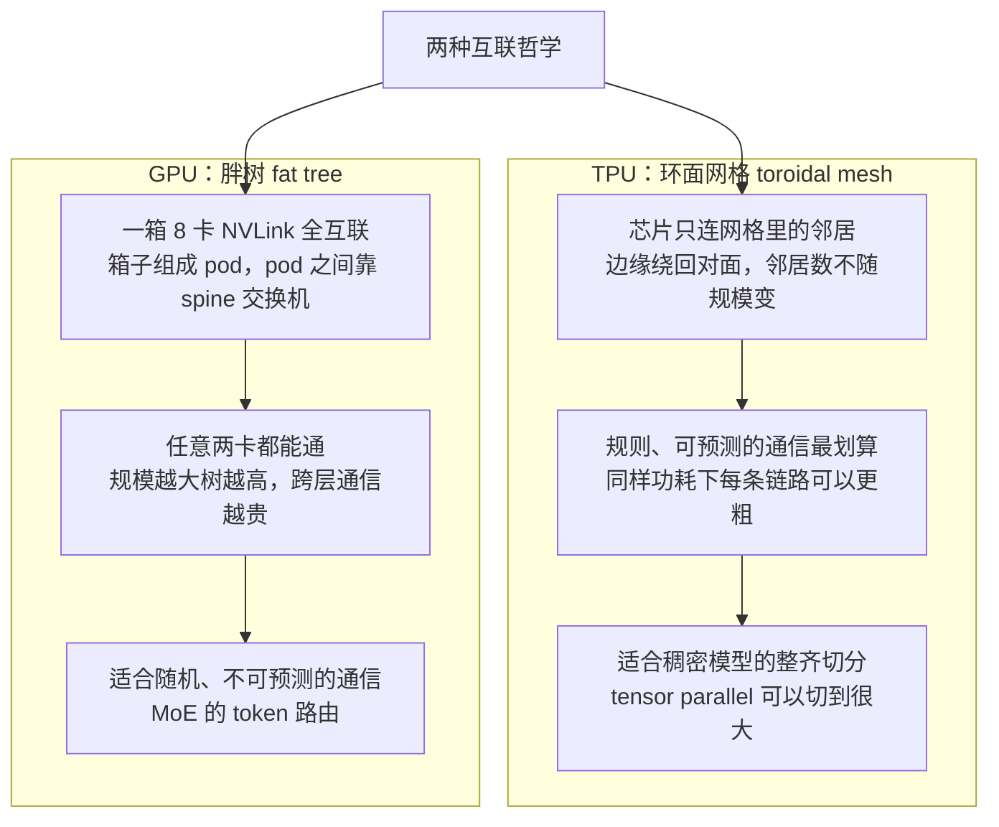
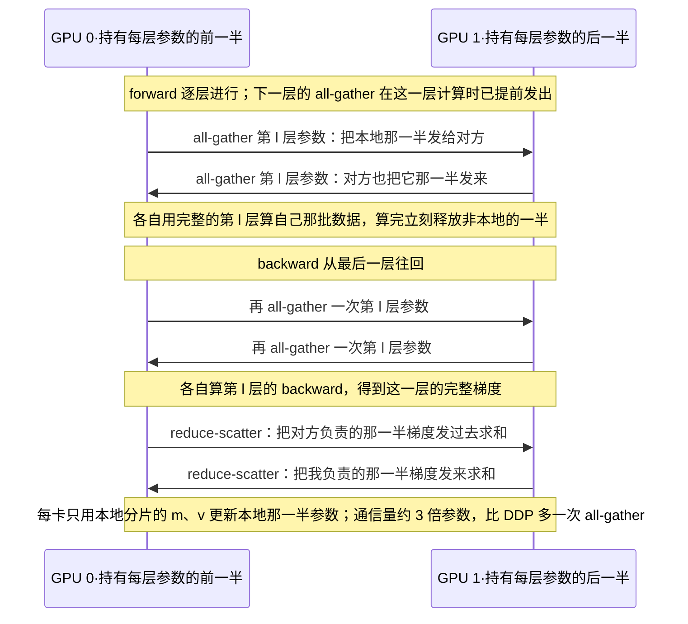
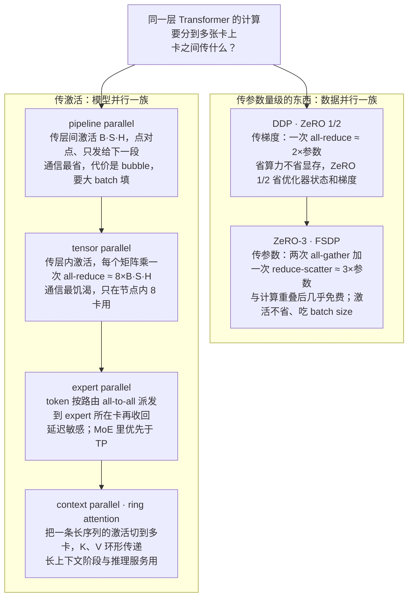
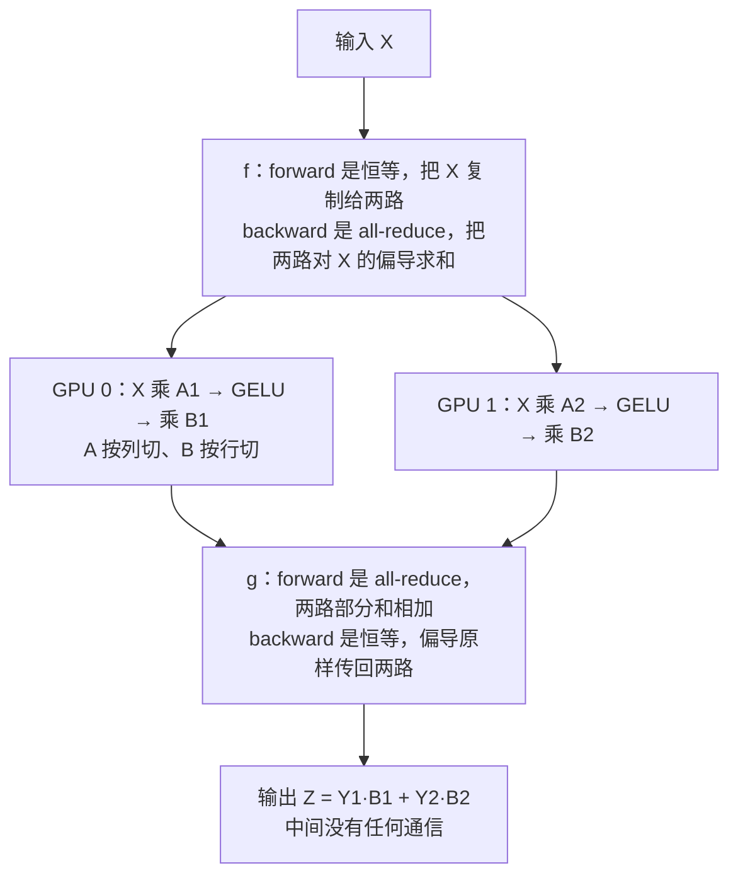
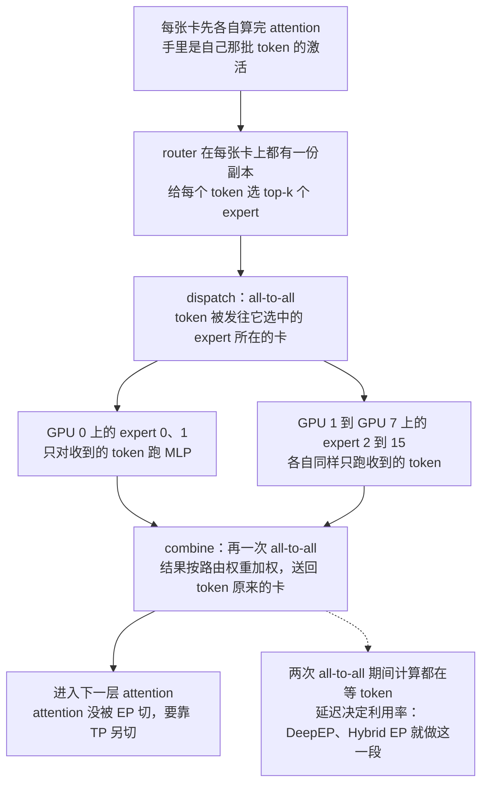
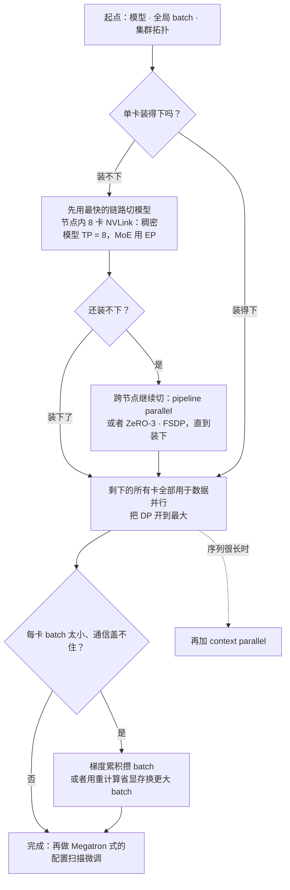

# CS336 第 8 讲｜并行（下）（Parallelism II）

> Stanford CS336: Language Modeling from Scratch（2026 春）· 第 8 讲，系统部分的收尾（第 5–8 讲：GPU → kernel → 并行）；课程表标注 2026 年 4 月 22 日
> 视频：<https://www.youtube.com/watch?v=6-cXp-aOmdg>（1:20:10；英文字幕为自动生成，库名、芯片名和几处术语错得不少，见文末勘误）
> 讲者：Tatsunori Hashimoto（全程；第 7 讲 Percy 用代码把机制跑了一遍，这一讲自称讲"知识、细节和八卦"——每种并行的算力、显存、通信账，以及真实训练怎么配）
> 课程主页：<https://stanford-cs336.github.io/> · 讲义反复引用的三篇：[ZeRO](https://arxiv.org/abs/1910.02054)（Rajbhandari et al., 2019）、Megatron 的[大规模训练实验](https://arxiv.org/abs/2104.04473)（Narayanan et al., 2021）、[Reducing Activation Recomputation](https://arxiv.org/abs/2205.05198)（Korthikanti et al., 2022）；实战部分以 [DeepSeek-V3](https://arxiv.org/abs/2412.19437) 和 [Llama 3](https://arxiv.org/abs/2407.21783) 的技术报告为主

**一句话**：单卡的算力和显存都不够，所以"计算单元"变成了整个数据中心，而数据中心里的链路分快慢（节点内 NVLink 快、节点间慢）——这一讲把每种并行的账算清：数据并行每步通信 2 倍参数量但一点显存不省；ZeRO 把优化器状态、梯度、参数逐级分片，前两级靠 all-reduce = reduce-scatter + all-gather 的恒等式白得，第三级（FSDP）多一次 all-gather 但能藏在计算底下；再往上要靠模型并行传激活：pipeline 通信最省（B·S·H、点对点）但有 bubble、要大 batch 填，tensor parallel 通信最饥渴（约 8 倍 B·S·H 的 all-reduce）只能在 8 卡节点内用，expert parallel 是 MoE 时代对 TP 的替代，sequence parallel 把 TP 除不掉的 10·SBH 激活也切掉——最后的配方出奇简单：先在最快链路上用 TP / EP 切到 8，再用 pipeline 或 ZeRO-3 切到装得下，剩下的卡全给数据并行，batch 不够就梯度累积；Llama 3 405B 的 TP 8 / PP 16 / DP 128、DeepSeek-V3 的 64 路 EP 都是这条规则的实例。

## 时间轴

| 时间 | 内容 |
|---|---|
| [0:05](https://www.youtube.com/watch?v=6-cXp-aOmdg&t=5s) | 开场：Percy 讲了机制，这讲讲细节与实战；4D 并行；作业要给定拓扑和模型选最优并行 |
| [1:05](https://www.youtube.com/watch?v=6-cXp-aOmdg&t=65s) | 为什么并行：算力与显存两个瓶颈；节点内快、节点间慢；只在集合通信层面记账；all-reduce ≡ reduce-scatter + all-gather |
| [4:39](https://www.youtube.com/watch?v=6-cXp-aOmdg&t=279s) | 硬件底座：TPU 环面网格 vs GPU 胖树；Dally 与 Dean 的对谈；当天早上 Google 新 TPU 转向全互联 |
| [8:44](https://www.youtube.com/watch?v=6-cXp-aOmdg&t=524s) | 华为 Ascend 910：单芯片弱、384 芯片一柜、功耗 4 倍；"新的计算单元是整个数据中心" |
| [11:16](https://www.youtube.com/watch?v=6-cXp-aOmdg&t=676s) | 算法总纲：数据并行与模型并行两大类；朴素数据并行的三项指标 |
| [13:17](https://www.youtube.com/watch?v=6-cXp-aOmdg&t=797s) | 显存账：每参数约 16 字节、约 5 份权重；优化器状态是大头；ZeRO 图 120 → 1.9 |
| [16:50](https://www.youtube.com/watch?v=6-cXp-aOmdg&t=1010s) | ZeRO Stage 1：reduce-scatter 梯度、各更新一片、all-gather 参数，通信量与 DDP 相同 |
| [19:24](https://www.youtube.com/watch?v=6-cXp-aOmdg&t=1164s) | Stage 2 边反传边发梯度；Stage 3 / FSDP 按需取参数，两次 all-gather 一次 reduce-scatter，靠重叠掩盖；问答 |
| [28:34](https://www.youtube.com/watch?v=6-cXp-aOmdg&t=1714s) | 为什么不能止步于 FSDP：batch size 是资源（critical batch size）；激活显存一点没省 |
| [30:39](https://www.youtube.com/watch?v=6-cXp-aOmdg&t=1839s) | 模型并行总纲：传的是激活；pipeline parallel 的 bubble、micro-batch；放在最慢的链路上 |
| [36:43](https://www.youtube.com/watch?v=6-cXp-aOmdg&t=2203s) | 更聪明的调度：DeepSeek 的前后向交错；zero-bubble 把反传拆成 B 与 W |
| [39:14](https://www.youtube.com/watch?v=6-cXp-aOmdg&t=2354s) | tensor parallel：切宽度；f / g 的前后向对偶；列切与行切；只在节点内 8 卡；TPU 网格能切更多 |
| [44:48](https://www.youtube.com/watch?v=6-cXp-aOmdg&t=2688s) | 激活显存精算：34·SBH 加注意力项；TP 除不掉的 10·SBH；sequence parallel；配合重计算到 34·SBH/T |
| [53:02](https://www.youtube.com/watch?v=6-cXp-aOmdg&t=3182s) | expert parallel：MoE 优先 EP；DeepEP 与 Hybrid EP；all-to-all 与延迟；与 DP 的耦合；attention 与 MoE 的 TP 解耦；context parallel |
| [1:01:39](https://www.youtube.com/watch?v=6-cXp-aOmdg&t=3699s) | 总表：没有支配策略；算账图：每卡 batch 2,000 时 FSDP 够用，batch 变小要加 TP；3D / 4D 并行 |
| [1:06:14](https://www.youtube.com/watch?v=6-cXp-aOmdg&t=3974s) | 决策流程与 Megatron 五条准则；问答：sequence parallel 只是附件；looped transformer |
| [1:09:28](https://www.youtube.com/watch?v=6-cXp-aOmdg&t=4168s) | Megatron 大规模实验：TP 到 8 停、PP 递增、DP 最后降到 6，利用率平坦；重计算换 batch |
| [1:12:30](https://www.youtube.com/watch?v=6-cXp-aOmdg&t=4350s) | 实战配方：OLMo、DeepSeek V1 / V3、Yi、Llama 3 405B、Gemma 2、Mixtral、Nemotron 3 Super、Qwen3；收尾 |

## 核心内容

### 1. 为什么要并行：两个瓶颈、两种链路、一个恒等式

- **这一讲的位置**：第 7 讲 Percy 用代码演示了集合通信原语和数据 / 张量 / 流水线并行的机制；这一讲不再重推这些原语，而是回答三个问题：每种并行每一步花多少算力、显存、通信；什么时候该用哪种；真正的大规模训练是怎么把它们叠在一起的。作业里要做的就是这件事：给定网络拓扑和模型，找出最优并行配置。CME295 第 4 讲把 DP、ZeRO 和三种模型并行各用一页带过，这里逐项算账。
- **两个瓶颈**。算力：单张芯片远达不到需要的速度（讲者的对照是世界上最快的超算有 exaFLOP/s 量级，单 GPU 差好几个数量级），解决办法是把很多机器连起来。显存：模型装不进一张卡，只能切成小块分到多卡上。
- **两种链路**是贯穿整讲的概念对象：节点内（intra-node）互联很快，可以做通信很重的事；节点间（inter-node）慢，只能用"尊重带宽"的算法。后面每种并行"该放在哪一层链路上"都由此决定。
- **讨论的层次**：不谈发包，只在集合通信（collective）层面记账。四个原语（第 7 讲的定义）：all-reduce——每卡各有一份同形张量，结束时每卡都拿到逐元素求和的结果；reduce-scatter——同样求和，但每卡只拿到结果的一个分片；all-gather——每卡各有一个分片，结束时每卡都拿到拼齐的整体；all-to-all——每卡把自己的数据按目的地切开，分别发给对应的卡。
- **一个恒等式**：all-reduce 的代价等于 reduce-scatter 加 all-gather（第 7 讲 Percy 讲过：环形 all-reduce 本来就是这两步实现的）。它是第 4 节 ZeRO "白得显存"的全部依据。有学生问为什么偏偏强调这一种分解——因为接下来的算法用的正是它；别的分解当然也存在。
- **换一种世界观**：计算单元不再是 GPU，而是整个数据中心。要的是三件事——显存可控、算力可控、资源不闲置。

### 2. 硬件底座：TPU 的环面网格与 GPU 的胖树



*图 8-1｜TPU 与 GPU 的两种互联哲学，以及各自擅长的通信模式（自绘示意）· [▶ 看原幻灯片 4:39](https://www.youtube.com/watch?v=6-cXp-aOmdg&t=279s)*

- 算法本身与硬件无关，但网络拓扑决定了各家的并行配方，所以先看两种互联哲学。第 5 讲说过 TPU 像一个"轻量 GPU"，真正的差别在网络。
- **TPU：toroidal mesh（环面网格）**。每块芯片只和网格里的邻居直连，边缘绕回到对面（真实结构是三维的，讲者说记住二维图就够）。好处是拓扑极简单、可以无限扩展——不管集群多大，每块芯片的邻居数不变。只跟邻居说话的通信最划算：同样功耗下每条链路可以做得更粗。
- **GPU：fat tree（胖树）**。哲学是"任意两卡都能通"：最底层一箱 GPU 之间高速直连，箱子组成 pod，pod 之间靠 spine 交换机。节点数越多树越高，跨层通信越贵、拓扑越复杂。换来的是灵活：通信模式随机、不可预测时也能应付。
- **哪种 workload 适合谁**（讲者转述 Bill Dally 与 Jeff Dean 的对谈）：MoE 的 token 要路由到不同 expert，通信模式不可预测，GPU 合适；稠密模型做整齐、可预测的切分（第 7 节的 tensor parallel），TPU 合适。
- **正在趋同**：讲课当天早上 Google 发布了新一代 TPU，讲者备课时发现推理芯片改成了树状、更接近全互联的拓扑；训练芯片的跨机柜互联（他提到叫 Virgo 的网络层）也长得更像 GPU 那一套。原因不难猜：今天的主流模型都是 MoE，服务 MoE 时 token 在 expert 之间飞来飞去，推理时这些通信就是瓶颈。讲者称之为趋同进化：是 workload 在定义网络。
  > 小注：字幕里的 "TPU AI / 8T" 应为 TPU 8i（推理）与 TPU 8t（训练），2026 年 4 月 22 日 Google Cloud Next 上发布（推断，讲者只说"今天早上"）。
- **另一条路：用功耗换互联**。第 5 讲有人问"SRAM 那么好为什么不全用 SRAM"，答案是 Groq。同理，"全互联那么好为什么不用光纤交换机把所有芯片连起来"，答案是华为 Ascend 910：单芯片比 H200 弱不少（矩阵乘慢），但一个机柜用光交换把 384 块芯片连成一体，靠数量补单芯片的差距；代价是功耗约为同等 NVIDIA 系统的 4 倍。讲者的结论：想在功耗和制造上都高效，设计会落到一处；愿意暴力堆资源，会落到另一处。
  > 小注：应指 CloudMatrix 384（384 块 Ascend 910C）。据 SemiAnalysis 2025 年 4 月的分析，它的总 BF16 算力约为 GB200 NVL72 的 1.7 倍，功耗约 3.9 倍，单芯片算力约为 GB200 的三分之一——和课上"单芯片弱、靠数量、功耗 4 倍"的说法一致。

### 3. 数据并行与显存账：为什么是每参数 16 字节

- **数据并行（DP）**：先忘掉 Adam，只看 SGD。每步取 B 个样本，把 B 切给 M 台机器，每台算自己 B/M 个样本的梯度，再把梯度同步求和后更新。三项指标：算力扩展完美——只要每卡样本够多；通信每步约 2 倍参数量——一次 all-reduce；显存零节省——每卡一份完整模型、完整激活。
- **显存有多糟**：直觉上"显存 = 参数"，实际远不止。经验法则是要存约 5 份权重大小的东西、每参数约 16 字节：参数本身；梯度（更新前的累加器）；可能还有一份高精度的累加副本；Adam 的一阶矩和二阶矩，各一份且往往要高精度。后几样统称优化器状态（optimizer state），是显存的大头。

$$
\text{bytes per parameter} = \underbrace{2}_{\text{bf16 weight}} + \underbrace{2}_{\text{bf16 grad}} + \underbrace{4+4+4}_{\text{fp32 master},\ m,\ v} = 16
$$

权重和梯度各 2 字节（bf16），fp32 主权重、Adam 的 m、v 各 4 字节；这就是"5 份、16 字节"的来历，其中 12 字节是优化器状态，占四分之三。

> 小注：字节的拆分按 ZeRO 论文的混合精度记账（优化器状态 K = 12 字节 / 参数）；课上只说了"约 5 份、16 字节"。

- **ZeRO 的那张图**（[15:19](https://www.youtube.com/watch?v=6-cXp-aOmdg&t=919s)）：绿色的优化器状态最大，橙色的梯度和蓝色的参数一样大。朴素 DP 把这三样在每张卡上原样复制，总显存随卡数线性增长。把优化器状态分片，是一大笔节省；再把梯度分片、把参数也分片，图最右边一列从 120 降到 1.9。问题是代价——直觉上没有免费午餐，越往下通信越贵；讲者说值得惊讶的是，其中大半是免费的。
  > 小注：120 → 1.9 是 ZeRO 论文 Figure 1 的例子：7.5B 参数、64 卡，每卡 120 GB → Stage 1 31.4 GB → Stage 2 16.6 GB → Stage 3 1.9 GB。

### 4. ZeRO 三级：前两级白送，第三级靠重叠



*图 8-2｜ZeRO-3 / FSDP 在两张卡上的一步：每层两次 all-gather、一次 reduce-scatter，用完即放（自绘示意）· [▶ 看原幻灯片 21:25](https://www.youtube.com/watch?v=6-cXp-aOmdg&t=1285s) · 出处：[Rajbhandari et al., 2019](https://arxiv.org/abs/1910.02054)*

- **Stage 1：只分优化器状态**。每张卡仍有完整参数和梯度，但只负责更新参数的一个切片（GPU 0 负责第一片）。一步四个动作：① 各卡在自己的数据上算出完整梯度；② reduce-scatter——我把梯度切片发给各片的负责人并求和，通信量约 1 倍参数；③ 各卡用自己那片的 m、v 更新自己那片参数；④ all-gather 把更新后的切片拼回完整参数，再 1 倍参数。合计仍是 2 倍参数——和 DDP 的一次 all-reduce 一模一样，显存却把 12 字节那块除以了卡数 N。这就是恒等式的用处：显存白得。
- **Stage 2：再分梯度**。麻烦在于现在连完整梯度都不能物化。解法只是一个系统技巧：反向传播是逐层往回扫的，算完一层的梯度就立刻 reduce-scatter 给负责它的卡，然后释放；分批发和一次发总量相同，所以还是不多花通信。
- **Stage 3 / FSDP：连参数也分**。同一招——按需取。正向：走到第 l 层时 all-gather 这一层的参数，算完立刻释放；反向：再 all-gather 一次算 backward，得到的梯度立刻 reduce-scatter 出去，再释放。任何时刻每卡手里只有一层的完整参数、一片梯度和一片优化器状态。通信是两次 all-gather 加一次 reduce-scatter，约 3 倍参数——比 DDP 多一次 all-gather，而且每层都在通信，看着很吓人。
- **为什么几乎免费**。两个想法：其一就是"扫到哪、通信到哪、用完即放"；其二是通信与计算重叠——讲者用 PyTorch FSDP 论文里的时间线图解释：CPU、GPU 计算流、GPU 通信流三条并行；all-gather 完第 0 层就开始算第 0 层的 forward，同时通信流已经在 all-gather 第 1 层。只要计算比通信长、网络够快，通信就全藏在计算底下，只剩几个小 bubble。实践里 FSDP 的 GPU 利用率非常接近单卡——作业要自己写一个 FSDP wrapper：包住任意 module，正向"gather → 算 → 放"，反向再来一遍。

$$
C_{\text{DDP}} = 2\Psi = \underbrace{\Psi}_{\text{reduce-scatter}} + \underbrace{\Psi}_{\text{all-gather}} = C_{\text{ZeRO-1}} = C_{\text{ZeRO-2}},\qquad C_{\text{ZeRO-3}} = 3\Psi
$$

Ψ 是参数个数，C 是每步的通信量（按讲者的单位"多少倍参数"计）。ZeRO-1、-2 与 DDP 完全相同；ZeRO-3 多一次 all-gather。

$$
M_{\text{DDP}} = 16\Psi,\qquad M_{\text{ZeRO-1}} = 4\Psi + \frac{12\Psi}{N},\qquad M_{\text{ZeRO-2}} = 2\Psi + \frac{14\Psi}{N},\qquad M_{\text{ZeRO-3}} = \frac{16\Psi}{N}
$$

N 是数据并行的卡数；每卡显存里，哪一项被分片，哪一项就除以 N。代入 Ψ = 7.5B、N = 64 正好得到上面那张图的 120、31.4、16.6、1.9 GB。

> 小注：这组式子是 ZeRO 论文的记账，课上只展示了结果数字。

```python
# ZeRO Stage 1：每卡持有完整参数和梯度，只持有 1/N 的优化器状态
def zero1_step(model, batch, rank, N):
    grads = backward(model, batch)              # 完整梯度，只来自本卡的数据
    my_grad = reduce_scatter(grads, rank)       # 收到"我负责的那 1/N"的求和梯度
    my_params = adam_update(params[rank], my_grad, m[rank], v[rank])
    params = all_gather(my_params)              # 拼回完整参数，供下一步 forward
```

四行对应四个动作；reduce-scatter 加 all-gather 的通信量恰好等于 DDP 的一次 all-reduce。

```python
# ZeRO Stage 3 / FSDP：参数也分片，逐层"取来—用完—释放"
def fsdp_step(layers, x):
    acts = []
    for l in layers:                            # forward
        w = all_gather(l.shard); acts.append(x); x = l.forward(w, x); free(w)
    g = loss_grad(x)
    for l in reversed(layers):                  # backward
        w = all_gather(l.shard)                 # 第二次 all-gather
        g, grad_w = l.backward(w, acts.pop(), g)
        l.grad_shard = reduce_scatter(grad_w); free(w, grad_w)
    for l in layers:
        l.shard = adam_update(l.shard, l.grad_shard)   # 只更新本地分片
```

每层两次 all-gather、一次 reduce-scatter；实际实现里下一层的 all-gather 会在这一层计算时提前发出，这就是重叠。

- **问答**
    - 这不是流水线：流水线是不同层放在不同卡上；FSDP 里每张卡都跑完整个模型，只是没有哪张卡同时持有全部参数——每步计算前"要参数"、算完"放参数"。
    - 每张卡都持有每一层的一部分？对，参数、梯度、优化器状态三样都是这样分的。
    - 通信次数乘了层数，为什么总量不乘？次数确实乘了，但每次只传一层（一个小 MLP），加起来正好是整个网络一遍。
    - 装得下多大：讲者给的表（应为 8 张 A100 的机器）——基线连 7B 都装不下，Stage 3 能装到约 50B。换 H100 / H200 怎么算？线性换算即可，比如乘 141 除以 80（H200 的 141 GB 对 80 GB）。

### 5. 为什么不能止步于 FSDP：batch size 是资源，激活没省



*图 8-3｜六种并行各自在卡之间传什么、传多少、什么模式；族内箭头只是阅读顺序（自绘示意）· [▶ 看原幻灯片 30:39](https://www.youtube.com/watch?v=6-cXp-aOmdg&t=1839s)*

- 讲者说 FSDP 干净优雅，真想就此下课，但有两个理由必须继续往"更丑更毛"的方法走。
- **数据并行消耗的资源是 batch size**：batch 是 8，就最多只能用 8 张卡。能不能卡越多 batch 越大？不能无限大：存在一个临界 batch size（critical batch size），超过它之后，多加一个样本带来的收益不如拿这个样本多走一步 SGD——小 batch 时加样本等价于多走步，之后收益递减，无限大的 batch 并不等于无限多步。于是陷入两难：batch 小让 GPU 闲着，batch 大让优化吃亏。
  > 小注：critical batch size 这个概念应出自 McCandlish et al., 2018（用梯度噪声尺度预测临界 batch size）。第 9、11 讲的 scaling laws 会再碰到它。
- **激活显存一点没省**：ZeRO 切的是参数、梯度、优化器状态；激活（activations，每层为反传留下的中间结果）以及其他动态显存分毫未动。要继续压显存，得更细粒度地切模型本身。
- **模型并行的概念分界**：FSDP 也切参数，但它只是一层包装，计算仍是单卡的原样计算，飞来飞去的是参数。模型并行则让卡之间传激活：第 0 层在 GPU 0、第 1 层在 GPU 1，要传的就是两层之间的激活。三种：pipeline parallel 切层，tensor parallel 切矩阵，expert parallel 切 expert。图 8-3 把每种方案"传什么、多大、什么模式"放在一起。

### 6. Pipeline parallel：bubble、micro-batch，以及放在最慢的链路上

- **做法**：按层切，正向传激活、反向传偏导。朴素地做，4 张卡各管四分之一的层，任何时刻只有一张卡在干活：卡 0 算完交给卡 1 就闲到最后，反向同样一次只有一张卡活跃——利用率惨不忍睹。空转的部分叫 bubble。
- **填 bubble 靠流水**：把 batch 切成若干 micro-batch，卡 0 算完第一个立刻算第二个，同时第一个已交给卡 1。bubble 占比大约是流水段数除以 micro-batch 数，要让它趋于零，需要很大的 batch——这就是为什么说 batch size 是一种资源：数据并行花它，流水线也花它，花在不同的地方。

$$
\frac{t_{\text{bubble}}}{t_{\text{ideal}}} \approx \frac{p-1}{m}
$$

p 是流水段数（stage 数），m 是每步的 micro-batch 数；讲者口头说的是"段数除以 micro-batch 数"，(p − 1)/m 是 GPipe 和 Megatron 论文里的精确形式，含义相同：bubble 随 m 按 1/m 消失。

- **为什么还要用它**：流水线臭名昭著（folklore：并行代码在实现 pipeline parallel 之前都还能看懂），但它有两个不可替代的优点。一是省显存（层切开了），且可与数据并行叠加；二是通信性质最好——只传激活，大小是 B·S·H（batch × 序列长 × 隐藏维），而且是点对点，只发给下一段，不是 all-to-all。所以实践里流水线放在最慢的链路上：跨 pod、跨数据中心的并行就用它。有学生问"比 FSDP 好在哪"：传的东西小——B·S·H 几乎总小于一整个参数矩阵。
- **代价看 Megatron 的扫描**：batch 大、流水段多时，利用率能接近不做流水线；batch 一小，利用率迅速垮掉。
- **更聪明的调度**。一类是把不同 micro-batch 的前向和后向交错排布（讲者用的是 DeepSeek 报告里的图，应为 V3 的 DualPipe）。更巧的是 zero-bubble pipelining，它不靠排班，而是看反传的结构：反传在每个节点做两件事——把偏导继续往前一段传（B），和算本层权重的梯度（W）。前者在关键路径上，前一段拿不到它就没法开工；后者是计算图上的叶子，什么时候算都行。于是把两者拆开：B 尽早算，W 推迟到流水线有空隙时补——几乎能把 bubble 填满，代价是实现复杂得多。
  > 小注：Zero Bubble（Qi et al., 2024）论文摘要：相同显存上限下吞吐比 1F1B 高至多 23%，放宽显存限制时高 31%。DeepSeek-V3 报告的 DualPipe 也做了同样的 B / W 拆分。

```python
# zero-bubble 的核心：把一层的 backward 拆成两半，B 走关键路径，W 见缝插针
def backward_split(layer, grad_out):
    grad_in = layer.backward_input(grad_out)    # B：偏导继续往前一段传，立刻发出
    send_to_prev_stage(grad_in)
    pending_W.append((layer, grad_out))         # W：权重梯度先记账，不算

def fill_bubble():
    while pipeline_idle() and pending_W:
        layer, g = pending_W.pop(0)
        layer.grad_w += layer.backward_weight(g)   # 有空隙时再算
```

B 和 W 在标准实现里是同一个 backward 调用；拆开之后 W 成了可以自由挪动的填充物。

### 7. Tensor parallel：切宽度、前后向对偶、只在节点内



*图 8-4｜tensor parallel 的 MLP：A 列切、B 行切，f 与 g 在前向和反向中互换角色（自绘示意）· [▶ 看原幻灯片 40:15](https://www.youtube.com/watch?v=6-cXp-aOmdg&t=2415s) · 出处：[Shoeybi et al., 2019](https://arxiv.org/abs/1909.08053)*

- **切宽度**：流水线沿深度切，tensor parallel（TP）沿宽度切。原理和 tiling 一样（第 5、6 讲）：矩阵乘可以拆成小矩阵乘再把部分和加起来——同一个原语反复出现。
- **以 MLP 为例**：X → 乘 A → GELU → 乘 B → Z。TP 把 A 按列切成 A1、A2，B 按行切成 B1、B2，两张卡各算一路，最后把部分和加起来。
- **f / g 的对偶**是写 TP 的关键：前向时 f 是恒等（把 X 复制给两路）、g 是 all-reduce（两路相加）；反向时正好翻转——g 变成恒等（偏导原样传回两路），f 变成 all-reduce（把两路对 X 的偏导求和）。
- **哪里列切、哪里行切**：每个 Transformer block 里，输入侧的矩阵按列切（MLP 的上投影、attention 的 Q / K / V 投影），第二阶段按行切（MLP 的下投影、attention 的输出投影）。LayerNorm、非线性、MoE 的 router 这类小算子全卡复制，不值得切。

$$
Z = \big[\,\mathrm{GELU}(XA_1)\;\;\mathrm{GELU}(XA_2)\,\big]\begin{bmatrix}B_1\\ B_2\end{bmatrix} = \mathrm{GELU}(XA_1)\,B_1 + \mathrm{GELU}(XA_2)\,B_2
$$

A 按列切成 A1、A2 后，GELU 可以逐块独立算（逐元素的非线性不跨列）；B 按行切后两路各得一个部分和，一次 all-reduce 相加即为 Z——中间不需要任何通信，这是把切法选成"先列后行"的原因。

```python
# tensor parallel 的 MLP：本卡只持有 A 的一列块和 B 的一行块
def tp_mlp_forward(x, A_col, B_row):
    x = f(x)                    # 前向恒等；反向对 x 的偏导做 all-reduce
    y = gelu(x @ A_col)         # 本卡这一路，不通信
    z_partial = y @ B_row
    return g(z_partial)         # 前向 all-reduce 求和；反向恒等
```

f 和 g 是两个自定义的 autograd 函数，前向和反向的角色互换；整个 block 里只有它们两处通信。

- **代价与用武之地**：每个矩阵乘都要通信一次激活大小的 all-reduce，前向一次、反向一次，频繁而饥渴，所以只在节点内做：一箱 8 张 GPU 紧耦合，TP 最多开到 8；一旦跨节点，互联慢一个量级，性能立刻掉一截。TPU 没有"8 卡一箱"和"箱外"的分界，整个 pod 是一张网格，能在规则通信模式上维持高带宽，所以 TPU 上的 TP 可以开得大得多——这是 TPU 与 GPU 并行配方的主要差别。
- **TP 与 PP 对比**：都切模型、都省参数和（部分）激活。TP 的优点：没有 bubble、网络够快时能跑满、实现简单；缺点：通信量大得多——PP 是 B·S·H 的点对点，TP 大约是 8 倍 B·S·H 的 all-reduce。结论：有高速互联用 TP，其他场合用 PP。
  > 小注："8 倍"可以这样凑出来（推断）：一层里 attention 和 MLP 各一次 all-reduce，前向、反向各来一遍共 4 次，而环形 all-reduce 每卡收发的数据约为张量大小的 2 倍。

### 8. 激活显存精算：TP 除不掉的 10·SBH，与 sequence parallel

- **显存不只是参数**：PyTorch profiler 的曲线上，参数和优化器状态是平的底，红色的大驼峰是激活——正向逐层堆高，反向开始后梯度也要占位，所以峰值出现在反传刚开始、激活还没释放多少的时候。模型变大、序列适中时，激活远超参数显存（讲者用的是 Korthikanti 等人论文里的表），任何省显存的方案都绕不开它。
- **全存时每层要多少**：34·S·B·H 加 5·A·S²·B/H（S 序列长、B batch、H 隐藏维、A 注意力头数；单位字节）。S·B·H 这个依赖是根本性的——序列里每个位置、batch 里每个样本、隐藏维每一维都得存点东西。第二项是注意力打分矩阵那一块，含 dropout 掩码；用 FlashAttention 式的重计算（第 5 讲）可以整个去掉。
- **只做 TP 省不干净**：TP 切的是 attention 和 MLP 里的矩阵乘，34 份里的 24 份和第二项都能除以 T（TP 的路数）。但 LayerNorm、dropout，以及 attention 和 MLP 的输入（要作为残差留给反传）这 10 份 S·B·H 没被切——就算像 Google 那样开 1,000 路 TP，仍然要付 10·SBH。
- **Sequence parallel（SP）**：名字容易误导（"按序列切"的思想更自然地属于 context parallel）。做法：剩下这 10 份都是 LayerNorm、dropout 这类没什么计算量的轻算子，就把它们沿序列轴切到各卡上，需要时再 all-gather 回来，用完 reduce-scatter 回去——和 FSDP 的"分片存放、按需物化"一个思路。同样有对偶：前向 g 是 all-gather、ḡ 是 reduce-scatter，反向互换。

$$
M_{\text{act}} = sbh\Big(34+\frac{5as}{h}\Big)\ \xrightarrow{\ \text{TP}\ }\ sbh\Big(10+\frac{24}{t}+\frac{5as}{ht}\Big)\ \xrightarrow{\ +\,\text{SP}\ }\ sbh\Big(\frac{34}{t}+\frac{5as}{ht}\Big)\ \xrightarrow{\ +\,\text{selective recompute}\ }\ \frac{34\,sbh}{t}
$$

每层激活的字节数：s 序列长、b batch、h 隐藏维、a 头数、t 是 TP 路数。TP 把矩阵乘部分除以 t，SP 把剩下的 10 份也除以 t，选择性重计算去掉注意力打分那一项——最后的 34·sbh/t 是讲者说的"正常训练里激活显存合理的下界"，手算"模型装不装得下"时用它，再加上参数、梯度和优化器状态。

> 小注：34 的拆分（Korthikanti et al., 2022）：attention 块 11 份加 5as²b，MLP 19 份，两个 LayerNorm 4 份；TP 能除的 24 份是 attention 里的 8 份和 MLP 里的 16 份，课上说成"MLP 是 24 份"是口头简化。论文摘要：激活显存降 5 倍、重计算开销减 90% 以上；530B 模型在 2,240 张 A100 上 MFU 54.2%，对比全量重计算的 42.1%，快 29%。

- **问答：MLP 那 24/T 能不能也重计算掉？** 能，重计算可以做得比这更多，但 MLP 的重计算等于反传时再跑一遍 MLP，太贵；attention 的重计算便宜——分块做，还省掉了 S² 的存储，划算。

### 9. Expert parallel 与 context parallel



*图 8-5｜expert parallel 的一层：两次 all-to-all 把 token 送到 expert 所在的卡再收回，attention 不在 EP 的管辖内（自绘示意）· [▶ 看原幻灯片 57:05](https://www.youtube.com/watch?v=6-cXp-aOmdg&t=3425s)*

- **EP 是 MoE 时代对 TP 的替代**：MoE（第 4 讲）现在是标配，它带来的系统红利就是 expert parallel——把整个 MLP（一个或几个 expert）放到不同的卡上，token 路由到哪个 expert 就发到哪张卡。系统性质和 TP 相似：高带宽原语、也能减少激活。
- **MoE 里为什么优先 EP 而不是 TP**（Megatron 的并行指南）：TP 把矩阵越切越碎，矩阵乘变小，GPU 利用率下降；MoE 层路由的是稀疏的 token 激活，比 TP 里搬运稠密的大矩阵激活轻；token 只送到需要它的地方，省掉不必要的开销——既然要做 MoE，就顺势把 expert 铺到各卡上。
- **但 EP 一点也不简单**：讲者说 FSDP 之后的所有东西（TP、PP、EP）系统上都不平凡。两个例子：DeepSeek 的 DeepEP（V3 时代，讲者最喜欢的东西之一）在 GPU 网络原语层面做路由与派发，把操作合并、让硬件接管；NVIDIA 的 Hybrid EP 是同类工作。难在哪：每个 MLP 都要做一轮 all-to-all 派发，而且计算在等 token 到达——延迟极敏感。轶事：DeepSeek 为了榨干性能，找到了未公开的 PTX（GPU 机器码级）指令来加速通信——前沿就是这个级别的功夫。
  > 小注：DeepSeek-V3 报告里写明用了定制的 PTX 指令做跨节点通信；DeepEP 于 2025 年 2 月开源。
- **和别的并行拼在一起的限制**：其他并行大多像乐高一样随便搭（DP 加 TP 很容易），EP 有额外约束。老库的做法是 EP 的副本集等于 DP 的副本集：DP = 8 就把 expert 铺在这 8 个副本上，EP 是 DP 划分的子集——这就给 EP 的规模封了顶，也牵制着 DP 和 TP 的搭配。
- **attention 与 MoE 的 TP 解耦**：MoE 只改 MLP、不改 attention，所以 EP 只并行了 MLP。attention 想切就得靠 TP，希望 TP 大；可 TP 大加 EP 大会把 MoE 的矩阵切成碎片、利用率崩掉——attention 想要高 TP，MLP 想要低 TP。近几年的解法是让两者各用各的 TP 度：attention 一套，MoE 层另一套，代价是系统更复杂。
- **Context parallel / ring attention**：把一条长序列的激活切到多卡，K、V 沿环传递（原始论文在 TPU 的网格拓扑上做得很好）。用在长上下文扩展阶段和推理服务里。讲者没展开，因为思想与前面重叠。
- **问答**：pipeline 和 FSDP 对 MoE 还适用吗？完全适用；标准建议是 EP 像 TP 一样开到 8 条快链路（现在大家已经不守这条了），DP / FSDP、PP、TP 在所有前沿模型里都在大量使用。

### 10. 拼起来：没有支配策略、算账、决策流程



*图 8-6｜选并行配置的决策流程：先在快链路上切模型，再跨节点切，剩下全给数据并行（自绘示意）· [▶ 看原幻灯片 1:06:14](https://www.youtube.com/watch?v=6-cXp-aOmdg&t=3974s)*

- **总表里红字的意思**：讲者把 DDP、FSDP 和各种模型并行列成一张表，主观标红每种的缺点——想说的只有一句：没有一种策略严格占优，全是折衷。FSDP 很好，但不省激活、消耗全局 batch；TP 省激活、不吃 batch，但要快网络；慢链路又得靠别的方案去用满。所以大规模训练几乎都是多种并行的组合。

| 策略 | 卡之间传什么 | 每步通信量（讲者口径） | 通信模式 | 省哪块显存 | 主要限制 |
|---|---|---|---|---|---|
| DDP | 梯度 | 2 倍参数 | all-reduce | 不省 | 吃 batch size |
| ZeRO-1 / 2 | 梯度分片、参数分片 | 2 倍参数 | reduce-scatter + all-gather | 优化器状态、梯度 | 吃 batch size；激活不省 |
| ZeRO-3 / FSDP | 参数分片、梯度分片 | 3 倍参数 | 2 次 all-gather + 1 次 reduce-scatter | 参数、梯度、优化器状态 | 激活不省；吃 batch size；靠重叠 |
| pipeline | 层间激活 | B·S·H | 点对点 | 参数、激活 | bubble，要大 batch |
| tensor | 层内激活 | 约 8 倍 B·S·H | all-reduce | 参数、激活的 24 / 34 | 只能在节点内 8 卡 |
| sequence（附于 TP） | 轻算子的激活 | 若干 all-gather / reduce-scatter | 集合 | 剩下的 10·SBH | 不单独使用 |
| expert | token | 每层两次 all-to-all | all-to-all | MLP 参数、激活 | 延迟敏感；与 DP 耦合 |
| context / ring | 长序列的 K、V | 环形传递 | 点对点 | 长序列激活 | 长上下文阶段用 |

- **算账**（作业要做）：对每种切法算每层的计算量和通信量，在给定卡数下看两者随规模怎么变；只要计算时间比通信时间长，通信就能藏起来。画成图是"每卡 batch size 对利用率"：顶上的虚线是 roofline 式的效率边界（第 5 讲），线上是算力吃满，线下是在等通信。讲者的读法：每卡 batch 2,000 时只用 FSDP 就完全 compute bound；batch 变小，FSDP 会掉到通信瓶颈，这时加进 TP 能把曲线往小 batch 推一段，再加别的策略继续推——这就是 3D、4D 并行（"我不觉得有 5D"）。

$$
T_{\text{compute}} \ge T_{\text{comm}}\quad\Longrightarrow\quad \frac{6\,B_{\text{tok}}\,\Psi_\ell}{F} \ \ge\ \frac{6\,\Psi_\ell}{W}\quad\iff\quad B_{\text{tok}} \ge \frac{F}{W}
$$

以 FSDP 的一层为例（推断，课上只给了"计算时间大于通信时间就能藏住"这条准则）：Ψ_ℓ 是这一层的参数数，B_tok 是每卡每步的 token 数，F 是每卡算力（FLOP/s），W 是每卡可用带宽（字节/s）；正反向计算约 6·B_tok·Ψ_ℓ FLOPs，三次集合通信按 bf16 约搬 6·Ψ_ℓ 字节，两边的 Ψ_ℓ 消掉——每卡每步的 token 数要不小于"算力除以带宽"。这就是为什么 batch 一小 FSDP 先垮，也是为什么算力增速快于带宽的年代（第 5 讲）这个阈值越来越高。

- **决策流程其实很简单**（图 8-6）：模型装不下，就先在最快的链路上切模型——一台机器 8 张卡，就开 8 路 TP 或 EP；还装不下，用 pipeline parallel 或 ZeRO-3 一路切到装下为止；装下了，剩下所有卡全部拿去做数据并行；每卡 batch 太小，就用梯度累积换利用率。Megatron 的 MoE 并行指南（对稠密模型同样适用）把这条规则倒过来写成五条：① 模型并行最小化、数据并行最大化；② EP 和 TP 留在 NVLink 内，也就是一箱之内；③ 跨节点用 pipeline；④ MoE 优先 EP；⑤ 长序列用 context parallel。
- **问答**：sequence parallel 单独算一维吗？不算，它是 TP 的附件，专为减激活。如果传闻中的 looped transformer（层循环复用）成真，系统会怎样？对 FSDP 不友好——它建立在"取权重、丢权重"的循环上，循环模型没法丢；但参数效率高，模型并行可能就没那么重要了。

### 11. 大规模实验与真实配方：TP 到 8 停，DP 开到最大，EP 开始变大

- **Megatron 的老论文仍是最好的教材**（NVIDIA 与当时在 Stanford 的 Matei Zaharia、Deepak Narayanan；讲者说网络的基本面这几年没变，结论仍然适用）：在很多种配置上跑大规模训练，看并行策略该随规模怎么变。结果正是上面的规则：DP 先开满；TP 随规模增加，到 8 就停；之后靠 PP 一路加；规模最大时 DP 反而降到 6——因为光是装下模型就需要那么多 TP 和 PP，剩下的预算才给 DP。把这些叠起来，卡数大到离谱时利用率仍然平、仍然高——这就是巨型数据中心、乃至跨数据中心训练能成立的原因。
  > 小注：论文摘要（Narayanan et al., 2021）：1T 参数模型在 3,072 张 A100 上达到 502 PFLOP/s，为理论峰值的 52%；提出的交错式流水线调度再提升 10% 以上吞吐。"DP = 6"来自该论文最大的配置：TP 8 × PP 64 × DP 6 = 3,072。
- **三条量化证据**：TP 该在 8 停下，超过就出问题；PP 需要大 batch——图上蓝线与橙线的差距随流水段数增大；重计算是划算的——多算一些换来更少显存，显存换成更大 batch，batch 换来更高利用率。这条"多算反而更快"的逻辑和 FlashAttention 一样（第 5 讲）。
- **真实训练怎么配**（讲者挑的样本）：

| 模型 | 并行配置（课上所述） | 讲者的点评 |
|---|---|---|
| OLMo 7B（AI2，Dolma 数据集） | 纯 FSDP | 小模型（7B 上下）纯 FSDP 就能扩到很多卡，很多 7B 级模型都这么训 |
| DeepSeek V1 | ZeRO-1 数据并行 + tensor + sequence + pipeline | 经典组合 |
| DeepSeek-V3（MoE） | pipeline + 64 路 expert parallel，8 台机器一组作为 EP 域；不用 TP | 用流水线上的同类技巧避免 EP 的低利用率段，相当 exotic |
| Yi | ZeRO-1 + TP + PP | 经典 DP / TP / PP 三件套；换成 MoE 就把 TP 换成 EP，目标相同、EP 更高效 |
| Llama 3 405B（稠密） | 主预训练 TP 8 / CP 1 / PP 16 / DP 128；长上下文阶段调高 CP、调低 DP | 少见的分阶段完整披露；训练期间 GPU 故障 148 次，容错是另一门分布式系统课 |
| Gemma 2（Google） | FSDP + TP + SP，仅此两类 | TPU 阵营"不用流水线，在大网格上做 TP"的实证；能否无限扩展存疑 |
| Mixtral 8x22B（NVIDIA Megatron Bridge 配方） | EP 8 / PP 4 / TP 4（TP 给 attention 层） | 符合"EP 在 8 左右" |
| Nemotron 3 Super | 大量 EP 加 context parallel | 走 DeepSeek-V3 路线，做长上下文扩展 |
| Qwen3 | EP 32 / PP 8 / TP 2（TP 切 attention 矩阵） | DeepSeek 配方：大 EP、小 TP |

> 小注：DeepSeek-V3 报告：16 路 PP、跨 8 个节点的 64 路 EP、ZeRO-1 DP，流水线用 DualPipe。Llama 3 报告：主预训练用 16,384 张 H100（8 × 1 × 16 × 128），长上下文阶段 TP 8 / CP 16 / PP 16 / DP 8；"148"是 54 天快照期内归因于 GPU 故障的中断次数（占 419 次意外中断的 30.1%）。OLMo 论文记载 7B 分别在 LUMI（AMD MI250X）和 MosaicML 的 A100 集群上各训了一遍。

- **三条共性**：所有模型都把数据并行开到最大；TP 几乎总在 8 以下；EP 现在可以很大——很大程度上归功于 DeepSeek-V3 为大规模 EP 建的基础设施。Megatron Bridge 里还有 NVIDIA 对各模型的并行基准：即便同是 TP，子配置的差别也会显著影响性能，系统集成的功夫不小。
- **收尾**：要在多 GPU、多节点、甚至多数据中心的尺度上谈效率，快链路、慢链路、batch size 都是要用满的资源，而组合它们的规则出奇地简单。下一讲：scaling laws。

## 关键图表速查（点时间戳跳到原幻灯片）

| 图 | 看什么 | 跳转 | 出处 |
|---|---|---|---|
| TPU 环面网格 vs GPU 胖树 | 左：芯片只连邻居、边缘绕回；右：一箱 8 卡、pod、spine 三层树 | [4:39](https://www.youtube.com/watch?v=6-cXp-aOmdg&t=279s) | — |
| ZeRO 三级显存图 | 绿色优化器状态最大；最右列 120 → 31.4 → 16.6 → 1.9 | [15:19](https://www.youtube.com/watch?v=6-cXp-aOmdg&t=919s) | [ZeRO](https://arxiv.org/abs/1910.02054) |
| Stage 1 的四步 | reduce-scatter 梯度 → 各更新一片 → all-gather 参数；数一数通信量 | [16:50](https://www.youtube.com/watch?v=6-cXp-aOmdg&t=1010s) | 同上 |
| FSDP 重叠时间线 | 三条流：CPU、GPU 计算、GPU 通信；all-gather 第 1 层与 forward 第 0 层重叠；空档是 bubble | [23:27](https://www.youtube.com/watch?v=6-cXp-aOmdg&t=1407s) | [PyTorch FSDP](https://arxiv.org/abs/2304.11277)（应为） |
| A100 可装模型表 | 基线装不下 7B，Stage 3 约 50B；换 H200 乘 141 除 80 | [27:31](https://www.youtube.com/watch?v=6-cXp-aOmdg&t=1651s) | — |
| 流水线 bubble 图 | 4 张卡、时间从左到右，任一时刻只有一格在算；下图 micro-batch 填空 | [32:09](https://www.youtube.com/watch?v=6-cXp-aOmdg&t=1929s) | 应出自 [GPipe](https://arxiv.org/abs/1811.06965) |
| Megatron batch × pipeline 扫描 | batch 大、段数多时利用率接近不做流水线；batch 小时迅速下滑 | [35:12](https://www.youtube.com/watch?v=6-cXp-aOmdg&t=2112s) | [Narayanan et al., 2021](https://arxiv.org/abs/2104.04473) |
| zero-bubble 调度图 | B（往前传偏导）先排，W（权重梯度）填空隙 | [38:13](https://www.youtube.com/watch?v=6-cXp-aOmdg&t=2293s) | [Qi et al., 2024](https://arxiv.org/abs/2401.10241) |
| TP 的 MLP 切分与 f / g | A 列切、B 行切；f 前向恒等反向 all-reduce，g 相反 | [40:15](https://www.youtube.com/watch?v=6-cXp-aOmdg&t=2415s) | [Megatron-LM](https://arxiv.org/abs/1909.08053) |
| profiler 显存曲线 | 底部平的是参数与优化器状态，红色驼峰是激活，峰值在反传刚开始 | [45:19](https://www.youtube.com/watch?v=6-cXp-aOmdg&t=2719s) | — |
| 激活显存四行表 | 34 加注意力项 → TP 只除 24 与第二项 → 加 SP 全除 T → 加重计算剩 34/T | [51:00](https://www.youtube.com/watch?v=6-cXp-aOmdg&t=3060s) | [Korthikanti et al., 2022](https://arxiv.org/abs/2205.05198) |
| 并行策略总表 | 红字是每种的缺点；找不到一行没有红字 | [1:01:39](https://www.youtube.com/watch?v=6-cXp-aOmdg&t=3699s) | — |
| 算账图 | 横轴每卡 batch，纵轴利用率，虚线是效率边界；FSDP 曲线在小 batch 处掉下去，加 TP 往左推 | [1:04:43](https://www.youtube.com/watch?v=6-cXp-aOmdg&t=3883s) | — |
| Megatron 规模扫描 · Llama 3 配置表 | TP 到 8 停、PP 递增、DP 最后 6；Llama 3 三阶段各自的 TP / CP / PP / DP | [1:09:58](https://www.youtube.com/watch?v=6-cXp-aOmdg&t=4198s) · [1:15:03](https://www.youtube.com/watch?v=6-cXp-aOmdg&t=4503s) | [Narayanan et al., 2021](https://arxiv.org/abs/2104.04473) · [Llama 3](https://arxiv.org/abs/2407.21783) |

## 提到的工作

| 名称 | 在本讲里的作用 |
|---|---|
| [ZeRO](https://arxiv.org/abs/1910.02054)（Rajbhandari et al., 2019） | 三级分片的出处；120 → 1.9 的显存图 |
| [PyTorch FSDP](https://arxiv.org/abs/2304.11277)（Zhao et al., 2023） | ZeRO-3 的 PyTorch 实现；通信与计算重叠的时间线图（应为这篇） |
| [Megatron-LM](https://arxiv.org/abs/1909.08053)（Shoeybi et al., 2019） | tensor parallel 的列切 / 行切与 f / g 对偶 |
| [Efficient Large-Scale Training with Megatron-LM](https://arxiv.org/abs/2104.04473)（Narayanan et al., 2021） | 讲者反复引用的"老论文"：batch × pipeline 扫描、TP 到 8 停、DP 降到 6、利用率平坦 |
| [Reducing Activation Recomputation](https://arxiv.org/abs/2205.05198)（Korthikanti et al., 2022） | 34·sbh 的激活公式、sequence parallel、选择性重计算 |
| [GPipe](https://arxiv.org/abs/1811.06965)（Huang et al., 2019） | 流水线 bubble 与 micro-batch 的经典图（应出自此） |
| [Zero Bubble Pipeline Parallelism](https://arxiv.org/abs/2401.10241)（Qi et al., 2024） | 把反传拆成 B 与 W，填满流水线 |
| [DeepSeek-V3](https://arxiv.org/abs/2412.19437)（2024） | 前后向交错的流水线调度（DualPipe）；64 路 EP；PTX 轶事 |
| [DeepEP](https://github.com/deepseek-ai/DeepEP) | DeepSeek 的 EP 派发库，字幕作 "DPP" |
| Hybrid EP（NVIDIA） | 同类的低层 EP 派发实现，只点了名 |
| [Megatron-Core 的 MoE 并行指南](https://github.com/NVIDIA/Megatron-LM) | "EP 优于 TP"的理由与五条并行准则 |
| [Megatron Bridge](https://github.com/NVIDIA-NeMo/Megatron-Bridge) | NVIDIA 发布的各模型推荐训练配置与基准（Mixtral、Qwen3、Nemotron 等） |
| [Ring Attention](https://arxiv.org/abs/2310.01889)（Liu et al., 2023） | context parallel 的原始论文，在 TPU 网格上验证 |
| [OLMo](https://arxiv.org/abs/2402.00838) · [Dolma](https://arxiv.org/abs/2402.00159)（AI2，2024） | 7B 纯 FSDP 训练的例子 |
| [DeepSeek LLM（V1）](https://arxiv.org/abs/2401.02954) | ZeRO-1 + TP + SP + PP |
| [Yi](https://arxiv.org/abs/2403.04652)（01.AI，2024） | ZeRO-1 + TP + PP |
| [Llama 3](https://arxiv.org/abs/2407.21783)（2024） | 分阶段并行配置全披露；148 次 GPU 故障 |
| [Gemma 2](https://arxiv.org/abs/2408.00118)（2024） | TPU 上 FSDP + TP + SP、不用流水线 |
| Mixtral 8x22B · Nemotron 3 Super · [Qwen3](https://arxiv.org/abs/2505.09388) | Megatron Bridge 配方里的 EP / PP / TP 数字 |
| [An Empirical Model of Large-Batch Training](https://arxiv.org/abs/1812.06162)（McCandlish et al., 2018） | critical batch size 的出处（应为这篇） |
| Groq · Huawei Ascend 910（CloudMatrix 384） | 全 SRAM 与全光互联：两种"暴力换效率"的硬件路线 |
| Google 新一代 TPU（应为 8i / 8t） | 当天发布，拓扑转向全互联；趋同进化的例子 |
| Bill Dally 与 Jeff Dean 的对谈 | GPU 适合 MoE、TPU 适合稠密切分 |

## 术语对照

| English | 中文 |
|---|---|
| intra-node / inter-node | 节点内 / 节点间：一台机器内的卡之间 vs 机器之间，前者快一个量级 |
| collective (communication) | 集合通信：多卡一起参与的一次通信原语，记账的基本单位 |
| all-reduce | 全归约：每卡都拿到所有卡张量的逐元素和 |
| reduce-scatter | 归约分散：求和后每卡只拿结果的一个分片 |
| all-gather | 全收集：把各卡的分片拼成整体，每卡一份 |
| all-to-all | 全交换：每卡把数据按目的地切开分别发送；MoE 派发用 |
| point-to-point | 点对点：只在两张卡之间传 |
| toroidal mesh (torus) | 环面网格：TPU 的互联，只连邻居、边缘绕回 |
| fat tree / spine switch | 胖树 / 脊交换机：GPU 集群的分层全互联 |
| NVLink | NVIDIA 节点内 GPU 直连的高速链路；"一箱 8 卡"的边界 |
| PTX | NVIDIA GPU 的中间汇编，机器码级指令 |
| data parallelism (DP) / DDP | 数据并行 / 分布式数据并行：切 batch，每卡一份模型 |
| sharding | 分片：把一个张量切成若干份分到各卡 |
| optimizer state | 优化器状态：Adam 的一阶矩 m、二阶矩 v，加 fp32 主权重 |
| ZeRO stage 1 / 2 / 3 | 逐级分片优化器状态 / 梯度 / 参数 |
| FSDP (fully sharded data parallel) | 全分片数据并行：PyTorch 对 ZeRO-3 的实现 |
| communication–computation overlap | 通信与计算重叠：预取下一层参数，把通信藏在计算底下 |
| bubble | 空泡：流水线或通信等待中设备空转的时间 |
| critical batch size | 临界 batch size：超过它再加样本不如多走一步 |
| model parallelism | 模型并行：切模型本身，卡间传激活 |
| pipeline parallelism (PP) / stage | 流水线并行 / 段：按层切，每段若干层 |
| micro-batch | 微批：把一步的 batch 再切小，让流水线各段同时有活干 |
| 1F1B | 一前一后交错的流水线调度，zero-bubble 论文的基线 |
| zero-bubble pipelining | 零空泡流水线：把反传拆成 B（传偏导）和 W（算权重梯度） |
| tensor parallelism (TP) | 张量并行：切矩阵 |
| column-wise / row-wise split | 按列切 / 按行切 |
| sequence parallelism (SP) | 序列并行：把 TP 切不到的轻算子激活沿序列轴分片 |
| context parallelism (CP) / ring attention | 上下文并行 / 环形注意力：长序列切到多卡，K、V 环形传递 |
| expert parallelism (EP) | 专家并行：MoE 的 expert 分到不同卡 |
| dispatch / combine | 派发 / 合并：EP 里 token 发往 expert、结果送回的两次 all-to-all |
| router | 路由器：MoE 里给 token 选 expert 的小网络，TP 下全卡复制 |
| activation memory | 激活显存：为反传保留的每层中间结果 |
| (selective) activation recomputation | （选择性）激活重计算：不存、反传时重算，只对便宜的部分做 |
| residual | 残差输入：每个子层的输入要留给反传 |
| gradient accumulation | 梯度累积：多个小 batch 的梯度累加后再更新，攒出大 batch |
| 3D / 4D parallelism | 同时使用 DP、TP、PP，再加 EP 或 CP |
| utilization / MFU | 利用率 / 模型算力利用率：实际 FLOP/s 占峰值的比例 |
| roofline | 屋顶线：第 5 讲的模型，这里横轴换成了 batch size |
| long-context extension | 长上下文扩展：预训练末尾把序列拉长的阶段 |
| fault tolerance / redundancy | 容错 / 冗余：应对训练中的 GPU 故障 |

## 字幕勘误

"DPP" → DeepEP；"deep TPU AI and T / PPU AI / TPU 8T" → 应为 TPU 8i / 8t；"zero stage" → ZeRO stage；"reduced scatter" → reduce-scatter；"paralyzed / paralyzing" → parallelized / parallelizing；"MOE" → MoE；"8X E E100" → 8× A100（提问）；"P200" → H200；"Dolma ... was a 7B model" → OLMo 7B（讲者随即自纠）；"NeMo Tron 3 Super" → Nemotron 3 Super；"8x24 22B" → 8x22B；"Qwen 3" → Qwen3；"scaling loss" → scaling laws；"roof line" → roofline；"Matei and Deepak" → Matei Zaharia 与 Deepak Narayanan；"5 AS / H" → 5·a·s/h（乘在 sbh 上）；"conversion evolution" → convergent evolution；"Virgo network" 未能核实。

## 带走的问题

1. 用第 3–4 节的账给一个 70B 模型在 512 张 80 GB 卡上记账：DDP、ZeRO-1 / 2 / 3 各需每卡多少显存？再按 34·sbh/t 估每层激活（比如 s = 8k、b = 1、h = 8192、80 层、t = 8）——哪一项先把卡撑爆？
2. ZeRO-3 比 DDP 多一次 all-gather 却"几乎免费"，条件是什么（第 10 节的 B_tok ≥ F/W）？带宽不变、下一代 GPU 算力翻倍，这个阈值怎么变？它和"batch size 是资源"是同一件事吗？
3. Pipeline 通信最省却有 bubble，TP 无 bubble 却通信最饥渴——为什么 TP 停在 8、pipeline 跨节点？如果 NVLink 域扩大到 72 卡，或者像 TPU 那样整个 pod 是一张网格，配方会怎么变？Gemma 2 的"不用流水线"能推到 Llama 3 的规模吗？
4. EP 与 TP 在 MoE 里的冲突：attention 想要高 TP，MLP 想要低 TP。DeepSeek-V3 选 EP 64、不用 TP，Qwen3 选 EP 32 / TP 2，Mixtral 选 EP 8 / TP 4——各自的 expert 数、expert 大小与 attention 形状怎么解释这些选择？
5. "重计算换显存、显存换 batch、batch 换利用率"：把它和 FlashAttention（第 5 讲）以及 zero-bubble 的 W 延后放在一起，能否给出统一的表述——什么时候多做 FLOPs 反而更快？critical batch size 给这条路线设了什么上限？
