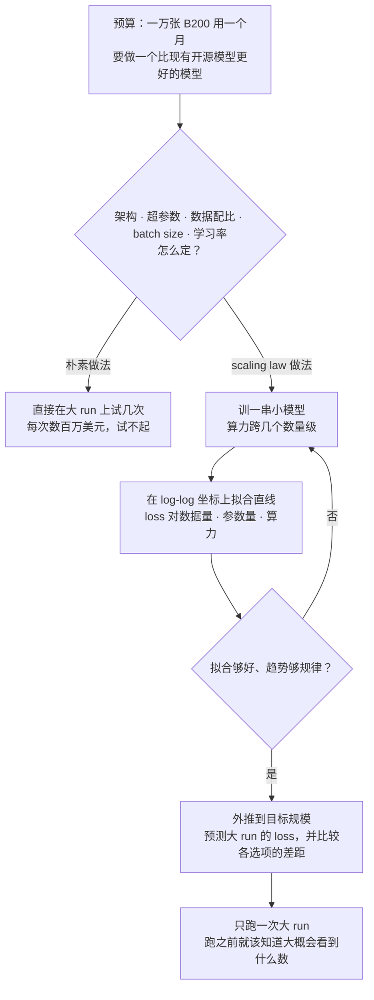
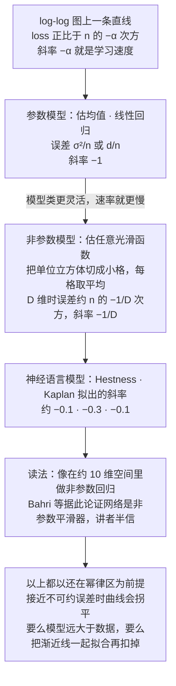
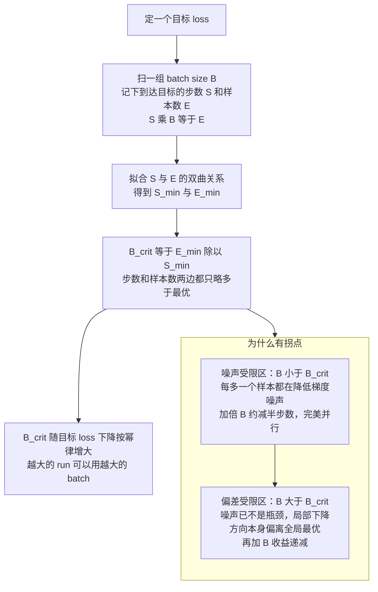
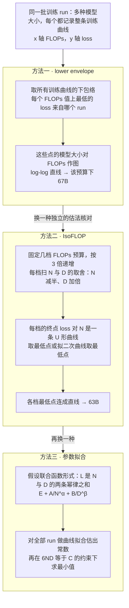
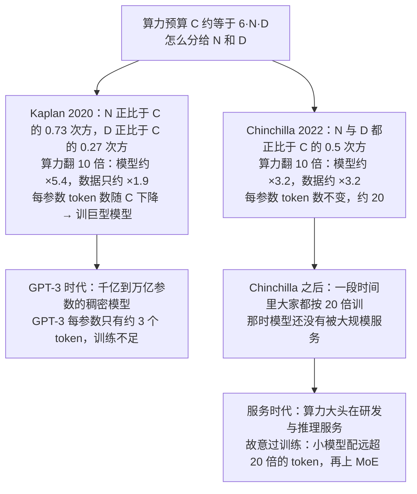
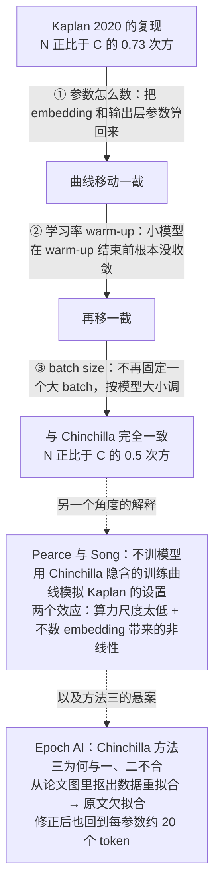

# CS336 第 9 讲｜Scaling laws（上）（Scaling Laws I）

> Stanford CS336: Language Modeling from Scratch（2026 春）· 第 9 讲，课程日程表标注 2026 年 4 月 27 日；scaling laws 的第一讲（第 11 讲是进阶篇），中间隔着 Percy 的第 10 讲推理
> 视频：<https://www.youtube.com/watch?v=Q15rhEWZPQ4>（1:17:57；英文字幕为自动生成，人名和论文名错得多，见文末勘误）
> 讲者：Tatsunori Hashimoto（全程；多处以第三人称提到 Percy——"Percy 第一讲说过 FLOPs 约等于数据乘参数""Percy 爱说 scaling law 是设计出来的""下一讲 Percy 讲推理"）
> 课程主页：<https://stanford-cs336.github.io/> · 本讲围绕的论文：[Kaplan et al., 2020](https://arxiv.org/abs/2001.08361)（OpenAI 的 scaling laws）· [Hoffmann et al., 2022](https://arxiv.org/abs/2203.15556)（Chinchilla）· [Hestness et al., 2017](https://arxiv.org/abs/1712.00409)（神经网络 scaling 的源头）· [Porian et al., 2024](https://arxiv.org/abs/2406.19146)（Kaplan 与 Chinchilla 为何不一致）· [Besiroglu et al., 2024](https://arxiv.org/abs/2404.10102)（Epoch AI 重拟合 Chinchilla）

**一句话**：一次大 run 动辄数百万美元，不可能在上面调参，所以要把所有优化搬到小尺度，再靠一条"简单、稳健的规律"外推上去——这条规律就是 scaling law：把 loss 和数据量、参数量、算力画在 log-log 坐标上，几乎总是一条直线（幂律），只是斜率约 −0.1，比统计课里均值估计的 −1 慢得多，像是在十维空间里做非参数回归；架构、优化器、深宽比、MoE 稀疏度、batch size、学习率都能这样研究，而且一个反复出现的现象是"干预只改截距、不改斜率"，所以小尺度上选出的最优往往就是大尺度上的最优；Chinchilla 用三种方法（lower envelope、IsoFLOP、参数拟合）得到"算力翻倍，参数和 token 各翻 √2 倍"、每参数约 20 个 token，而 Kaplan 之所以得出"该训巨型模型"（N ∝ C^0.73），只是因为不数 embedding 参数、warm-up 太长、batch 固定太大这三个细节——scaling law 是设计出来的，不是转个曲柄就出来的；今天做产品的人则故意"过训练"，因为算力大头花在服务而不是训练上。

## 时间轴

| 时间 | 内容 |
|---|---|
| [0:05](https://www.youtube.com/watch?v=Q15rhEWZPQ4&t=5s) | 开场：暂别系统部分；两讲 scaling laws，本讲讲基础，第 11 讲讲开源模型技术报告、μP、优化器 |
| [1:05](https://www.youtube.com/watch?v=Q15rhEWZPQ4&t=65s) | 场景：一万张 B200 用一个月，怎么保证唯一的一次大 run 成功；scaling law 作为"信仰"与工程工具 |
| [4:07](https://www.youtube.com/watch?v=Q15rhEWZPQ4&t=247s) | 历史：generalization bound 就是理论版的数据 scaling law；1993 年 Cortes 与 Vapnik 在贝尔实验室拟合学习曲线外推 |
| [6:39](https://www.youtube.com/watch?v=Q15rhEWZPQ4&t=399s) | Banko 与 Brill、2012 年机器翻译的 Pow3 / Pow4 函数形式、Hestness 2017——2017 年就能预见今天 |
| [11:19](https://www.youtube.com/watch?v=Q15rhEWZPQ4&t=679s) | 现代 LM 的各种 scaling law：算力 / 数据 / 参数对 loss，下游指标是 sigmoid；data scaling law 的定义：log-log 上一条直线 |
| [15:54](https://www.youtube.com/watch?v=Q15rhEWZPQ4&t=954s) | 三页统计：均值估计 σ²/n 斜率 −1 → 神经网络约 −0.1 → 非参数回归 n 的 −1/D 次方；问答："模型比数据大"指幂律区 |
| [21:29](https://www.youtube.com/watch?v=Q15rhEWZPQ4&t=1289s) | 用数据 scaling law 做决策：data mixing laws、DataDecide、重复数据最多 4 个 epoch、无限算力下的集成 |
| [27:05](https://www.youtube.com/watch?v=Q15rhEWZPQ4&t=1625s) | 干预只改截距不改斜率；数据过滤随规模变松；问答：坐标轴与"小范围看不出幂律还是指数" |
| [30:10](https://www.youtube.com/watch?v=Q15rhEWZPQ4&t=1810s) | 模型工程：LSTM 对 Transformer、Tay 等的架构 scaling 研究（Performer 差、GLU 好）、SGD 对 Adam |
| [35:43](https://www.youtube.com/watch?v=Q15rhEWZPQ4&t=2143s) | 层数与 aspect ratio 这类 scale-invariant 量；参数怎么数；MoE 稀疏度的 scaling |
| [40:47](https://www.youtube.com/watch?v=Q15rhEWZPQ4&t=2447s) | batch size：critical batch size 的两个区间、估计步骤、随 loss 的幂律；[48:26](https://www.youtube.com/watch?v=Q15rhEWZPQ4&t=2906s) learning rate：1/width 与 μP 两种哲学 |
| [51:00](https://www.youtube.com/watch?v=Q15rhEWZPQ4&t=3060s) | 上游困惑度对下游：困惑度最好的不是最好的模型；标准流程；问答：单次 run、直接拟下游、train 与 test loss |
| [56:38](https://www.youtube.com/watch?v=Q15rhEWZPQ4&t=3398s) | Chinchilla 问题：更多数据还是更大模型；Rosenfeld 与 Kaplan 的联合函数形式；Kaplan 的 0.73 / 0.27 |
| [1:02:13](https://www.youtube.com/watch?v=Q15rhEWZPQ4&t=3733s) | Chinchilla 的三种方法：lower envelope 得 67B、IsoFLOP 得 63B、参数拟合 |
| [1:06:48](https://www.youtube.com/watch?v=Q15rhEWZPQ4&t=4008s) | Kaplan 与 Chinchilla 为什么不一致：参数计数、warm-up、batch size 三步；Pearce 与 Song 的模拟 |
| [1:12:22](https://www.youtube.com/watch?v=Q15rhEWZPQ4&t=4342s) | 方法三的悬案：Epoch AI 从图里抠数据重拟合，原文欠拟合，修正后回到 20 倍 |
| [1:14:27](https://www.youtube.com/watch?v=Q15rhEWZPQ4&t=4467s) | 你大概不想要 20 倍：算力大头在服务，产品模型要"过训练"；IsoFLOP 是长青工具；总结 |

## 核心内容

### 1. 为什么要 scaling laws：一次大 run 不能拿来调参



*图 9-1｜scaling law 的工程闭环：所有优化在小尺度做，靠一条稳健的规律外推，大 run 只跑一次（自绘示意）· [▶ 看原幻灯片 2:36](https://www.youtube.com/watch?v=Q15rhEWZPQ4&t=156s)*

- **这一讲的位置**：系统部分（第 5–8 讲）暂告一段落，回到深度学习本身。本讲是基础篇：经典工作、基本思想、和机器学习 101 的联系；第 11 讲是进阶篇——读开源模型的技术报告，讲 μP 一类参数化和初始化，今年还加优化器。因为排课，中间隔着 Percy 的第 10 讲推理。
- **场景**：一位富有的朋友给你 10,000 张 B200 用一个月（第 1 讲算过它的 2.25 PFLOP/s），要你做一个很好的开源模型。基础设施有了（作业 2），预训练数据假设有了（作业 4），剩下全是选择题：架构、超参数、数据配比……而这次 run 可能值数百万美元。照抄文献的最佳实践（第 3 讲）能得到不错的模型，但要超过最前沿，就得自己优化这些选择——抄别人的选择不可能超过别人。
- **scaling law 是什么**：把小尺度模型的表现外推到大尺度的简单预测规则。大实验室做 scaling 的人把它当"生活方式"甚至"信仰"，它有时也相当刁钻。朴素做法是在大 run 上调超参数，太浪费；正确做法是所有优化都在小尺度做，只要小尺度和大尺度之间有一条简单、稳健的规律连着，外推就有信心（图 9-1）。
- **和 CME295 的关系**：CME295 第 4 讲把 Chinchilla 当结论用（每参数约 20 个 token）；这一讲讲它是怎么拟合出来的、为什么 Kaplan 得出了相反的结论、以及为什么你可能并不想要这个 20。

### 2. 历史：scaling law 不是新东西，1993 年就有人在做

- **理论那一头：generalization bound**（泛化界）。机器学习理论一直在问"我的模型会有多好"，答案是泛化界：在一个有限假设类上，测试误差最多比训练误差差某个量，而这个量依赖样本数——它本身就是一条"loss 上界随训练集增长怎么变"的理论曲线。讲者说理论家看 scaling law 会有回家的感觉：它是经验版的 sample complexity（样本复杂度：达到某个误差要多少样本）。
- **最早的 scaling law 论文**：贝尔实验室的 Corinna Cortes、Vladimir Vapnik 等做严肃理论的人，1993 年就问过——在大数据集上训练分类器太贵，能不能在小样本上拟合分类器、对误差率的衰减拟一条曲线、用它估计大样本的表现？讲者说这几乎就是字面意义上的数据 scaling law。
  > 小注：应为 Cortes, Jackel, Solla, Vapnik, Denker 的 Learning Curves: Asymptotic Values and Rate of Convergence（NeurIPS 1993）；讲者只报了人名和年份。
- **NLP 那一头**：Banko 和 Brill 是"与其研究算法不如去收数据"的经典引用——各种方法的表现都随数据量以可预测的方式变好。2012 年一篇机器翻译学习曲线的论文（字幕作 "Collobert et al."，应为 Kolachina et al., 2012）专门研究"BLEU 随数据量该用什么函数形式"，结论是三参数和四参数的幂律（Pow3 / Pow4）——和今天用的一模一样。
- **神经网络 scaling 的源头：Hestness et al., 2017**（字幕作 "Hassabis"）。讲者每次讲 scaling law 都提它，因为它的引用量配不上它的前瞻性：2017 年就对语音识别、机器翻译、语言模型等多种系统拟合了数据量的幂律，远早于 OpenAI；还讨论了 emergence（涌现：accuracy 比 loss 不连续得多，能力像是突然出现）、按算力 scaling、以及"既然靠算力 scaling，系统优化的速度就会变成准确率"。讲者的感慨：2017 年认真读了它，今天的很多现象当时就能预见。
- **问答：这些幂律是纯经验的还是有依据？** 本质上是曲线拟合，没有"只能是幂律"的金科玉律；但理论整天在算误差率如何随各种量衰减，物理学家又爱想极限行为，两者都是候选函数形式的来源。第 3 节会给一个幂律为什么自然的推导。

### 3. 数据 scaling law：log-log 上的直线，以及幂律从哪里来



*图 9-2｜三种估计问题的收敛速度对比：神经网络的斜率 −0.1 介于"参数模型的 −1"和"高维非参数的 −1/D"之间（自绘示意）· [▶ 看原幻灯片 17:24](https://www.youtube.com/watch?v=Q15rhEWZPQ4&t=1044s) · 出处：[Hestness et al., 2017](https://arxiv.org/abs/1712.00409)*

- **现代 LM 的 scaling law 长什么样**（[11:49](https://www.youtube.com/watch?v=Q15rhEWZPQ4&t=709s)）：x 轴是 log 算力、log 数据量或 log 参数量，y 轴是 log 测试 loss，各种"资源"在对数轴上都把 loss 拉成直线。更奇特的也有：下游 benchmark 的准确率对算力呈 sigmoid；预测类工作把日期放在 x 轴，能力的上包络居然是线性的。LM 的表现随规模和资源的变化，比直觉里规则得多。
- **最简单的一种：数据 scaling law**：固定训练流程，模型（默认）远大于数据集，按规律增加数据量，看误差怎么降。超参数调好时它应当单调，从随机猜测一路降到任务的**不可约误差**（irreducible error，或 noise floor：任务本身的熵，再多数据也降不下去），整体是 sigmoid 形。
- **经验观察**（Kaplan et al., 2020 的图；作业 3 里你会自己画一张）：模型远大于数据、增加数据量，log-log 坐标上的点排成一条很清楚的直线。log-log 上的直线叫 scale-free 或幂律（power law）关系，含义有两条：误差按多项式速度衰减；而且离渐近线还很远——接近渐近线时曲线会拐平。

$$
\hat{\mu}=\frac{1}{n}\sum_{i=1}^{n}x_i,\qquad \mathbb{E}\big[(\hat{\mu}-\mu)^2\big]=\frac{\sigma^{2}}{n}\;\;\Rightarrow\;\;\log \text{err}=-\log n+\log\sigma^{2}
$$

x_i 是从方差为 σ² 的高斯分布抽的 n 个样本，μ̂ 是样本均值；均方误差是 σ²/n，取对数后是 log n 的线性函数，斜率 −1——这就是一条 scaling law，"统计课三页幻灯片"的第一页。

- **幂律为什么自然**：任何形如"常数加 n 的 −α 次方"的误差，扣掉常数项画在 log-log 上都是直线。参数估计（估均值、线性回归）的经典速率是 1/n（回归是 d/n），所以斜率应当是 −1。
- **但神经网络的斜率是 −0.1 左右**：讲者给的三个拟合值——Hestness 的两个约 −0.1 和 −0.3，Kaplan 的约 −0.1。仍是多项式衰减，但比估均值慢得多。哪种估计问题会这么慢？非参数问题。

$$
\text{err}(n)\;\approx\;a\,n^{-\alpha}+L_\infty,\qquad \alpha_{\text{parametric}}=1,\quad \alpha_{\text{nonparametric},D}\approx\frac{1}{D},\quad \alpha_{\text{neural LM}}\approx 0.1
$$

n 是样本数，L_∞ 是不可约误差，α 是 log-log 图上直线斜率的绝对值。第二页幻灯片的推导：在单位立方体里估一个任意光滑函数 f（观测带高斯噪声），最笨的估计是把空间切成边长为 n 的 −1/4 次方的小格、每格取平均——二维时有 √n 个格子、每格 √n 个样本，误差约 1/√n；推广到 D 维，误差约 n 的 −1/D 次方，斜率 −1/D。

- **一种读法**：斜率 −0.1 意味着这些网络像是在约 10 维空间里做非参数回归（最近邻那一类估计器），这就是它们从数据里学习的速度。Bahri 等人（字幕作 "Barri"）走得更远，主张 scaling 指数字面上就说明网络是非参数平滑器，还用内在维度的估计佐证；讲者觉得有意思，但证据有点单薄，不完全买账。
  > 小注：Hestness 报告的指数按任务不同：机器翻译约 −0.13、图像分类约 −0.31、词级语言模型约 −0.07；Kaplan 的 α_N ≈ 0.076、α_D ≈ 0.095——都对得上讲者"约 −0.1 到 −0.3"的说法。Bahri et al., 2021 的论文题为 Explaining Neural Scaling Laws（应为）。
- **问答："模型比数据大"是什么意思？** 不是参数数和 token 数一比一。模型相对数据太小时会进入不可约误差区——这个模型类已经把数据拟合到头，再加数据也没用。研究 scaling law 通常只看幂律区，要么就把渐近线明确拟合出来再修正。大多少都行，经验上比数据大 10 倍左右就够。

```python
# 拟合一条数据 scaling law，再外推（自己写的示意）
import numpy as np
n = np.array([1e7, 3e7, 1e8, 3e8, 1e9])          # 训练 token 数
L = np.array([4.10, 3.72, 3.40, 3.12, 2.88])      # 各自的验证 loss（示意数字）
slope, intercept = np.polyfit(np.log(n), np.log(L), 1)   # log L = slope·log n + b
alpha = -slope                                     # 幂律指数，LM 上通常 0.1 左右
L_at = lambda n_new: np.exp(intercept) * n_new ** slope
print(alpha, L_at(1e11))                           # 外推两个数量级
# 若曲线已开始拐平，应改拟合 L = a·n^(-alpha) + L_inf（非线性最小二乘），
# 否则直线会把不可约误差错当成斜率变小
```

这就是"经验版泛化界"的全部机械动作：取对数、拟直线、外推；唯一的判断是你是否还在幂律区。

### 4. 拿数据 scaling law 做工程决定：配比、重复、过滤，以及"只改截距"

- **单独一条数据 scaling law 用处有限**：它只说模型学得多快，能做预报，做不了别的。工程上想问的是：最优的**数据配比**（data mixture，各来源按什么比例混）是什么？数据该不该**重复**（多个 epoch）？只重复高质量的部分？
- **经典模型给的直觉**：把数据 scaling law 看成经验版泛化界，那么数据集的组成影响的是曲线的**截距**（offset），而**斜率**由模型类决定，与分布无关。玩具例子：线性回归、两种数据源，只用一种误差怎么都高，混起来才好——把截距写出来，就能看到数据多样性为什么有帮助。
- **Data mixing laws**（[23:32](https://www.youtube.com/watch?v=Q15rhEWZPQ4&t=1412s)）：新闻和 Wikipedia 各用多少？用很小的模型、很少的数据，把"配比 → 表现"拟合成函数，逐步放大模型看趋势怎么变，像外推数据 scaling law 一样外推到全量训练，再取最优——"小算力上拟合、找最小值、放大"的最简单版本。
    - 现实更吵：真做过数据配比的人会告诉你，实际上是训一批小模型、直接挑最好的配比、放大，根本不用 scaling law。DataDecide 是这类做法的大规模实证，结论正是小尺度直接选就行——和"截距变、斜率不变"自洽：斜率不变，小尺度的最优配比就是大尺度的最优配比。
- **重复数据**（[25:33](https://www.youtube.com/watch?v=Q15rhEWZPQ4&t=1533s)）：算力在涨，数据没涨，所以很多人关心数据重复多次会怎样。Scaling Data-Constrained Language Models 的结果：标准训练配方下最多约 4 个 epoch 完全不吃亏；再往上，实际得到的 scaling 曲线（深色）明显差于"有新鲜数据时"的投影（虚线）；也能写出一个修正过的函数形式来预测重复下的行为。
- **推到极端：无限算力**（[26:03](https://www.youtube.com/watch?v=Q15rhEWZPQ4&t=1563s)）：讲者和 Percy 合带的一位学生最近的工作——允许无限次 epoch、无限算力，固定数据里最多能榨出什么？不能一直重复 pass，也不能一直把模型做大，两者都收益递减，只好转向模型集成（ensembling）之类的手段。图上红线是标准数据 scaling law，正则化、集成等干预都让线整体下移，斜率却惊人地相似。
  > 小注：应为 Kim, Kotha, Liang, Hashimoto 的 Pre-training under infinite compute（2025）；学生名字字幕不清（"Perseus"），推断为 Konwoo Kim。
- **本讲反复出现的一课**：自己拟合过 scaling law 就会发现，斜率极少改变，干预通常只改截距。第 5 节的 SGD 对 Adam、LSTM 对 Transformer 还会再看到。
- **数据过滤随规模而变**（[27:36](https://www.youtube.com/watch?v=Q15rhEWZPQ4&t=1656s)）：你我明天过滤数据一定过滤得很狠，只留最高质量的——反正算力少，训不完整个互联网；算力多的人不想在高质量数据上反复重复，过滤器就越来越松，训到质量越来越低的数据上。"数据质量"这种常被当成静态的东西其实是动态的，最优过滤器不随规模固定（第 13–14 讲再回来）。
- **问答：无限算力那张图为什么两个轴都像线性？** x 轴其实按倍增取点，是对数轴，画得不好；y 轴范围太小，线性和对数看不出差别，拟的仍是幂律。顺带的警告：只有一小段算力范围时根本分不清幂律还是指数——放大到足够近什么都像直线（Taylor 展开）。看到任何函数形式的声明都要保留一点怀疑。

### 5. 模型工程的 scaling law：架构、优化器、深宽比、参数怎么数、MoE 稀疏度

- **换个问法**：现在要设计一个大模型。也许你是激进派，觉得 LSTM 才是未来；或者想用 SGD 而不是 Adam；资源有限时还要在"训久、训大、多收数据"之间取舍。scaling law 给这些取舍一个量化的做法。第 3 讲讲超参数时说的是"看别人怎么做"，这里试着给第一性原理的答案——前提是你信 scaling law。
- **Transformer 真的比 LSTM 好吗**（[31:40](https://www.youtube.com/watch?v=Q15rhEWZPQ4&t=1900s)）：暴力做法是训一个 GPT-3 大小的 LSTM；scaling law 做法是在一系列算力上训 Transformer 和不同层数的 LSTM。Kaplan 的图上 LSTM 截距明显更高，斜率可能也更差——这就足以决定放大 Transformer。今天每篇架构论文（Mamba、Gated DeltaNet，第 4 讲）都有这么一张"vanilla Transformer 对我们的模型"的图：你的曲线要么整体在下面，至少斜率不能更差——斜率更差意味着放大到后来一定输。
- **Tay 等在 T5 系列上的架构 scaling 研究**（[33:10](https://www.youtube.com/watch?v=Q15rhEWZPQ4&t=1990s)）：同一套架构越训越大，比较各种改动。讲者喜欢它，因为它在远小于今天的算力上就抓到了前沿模型真正采用的改动：Performer（一种高效注意力）scaling 很差，今天没人用；gated linear unit 全程红线压绿线，今天人人在用（第 3 讲的 SwiGLU）；Switch Transformer 趋势不错（最大的 run 不知怎么了）；mixture of softmaxes 按趋势看也有效，只是今天不用了。所以很多人把 scaling law 当范式："干预在 scaling law 上看不出来，就不是好干预"。
- **SGD 对 Adam**（Hestness 的图，递归 highway 网络做语言模型）：又是那个神秘现象——截距不同、斜率几乎一样。固定数据和模型时，连"换优化器"这么大的干预都很少改变斜率；讲者每次看到都意外，但确实如此。
- **层数与 aspect ratio**（[35:43](https://www.youtube.com/watch?v=Q15rhEWZPQ4&t=2143s)）：第 3 讲说深宽比随便取个合理值就行；scaling 分析可以看得更准。按层数画曲线：1 层极差，多于 1 层就意外地有竞争力，但每个算力档位上更多层都更好。层数不是 **scale-invariant**（尺度不变）的量——模型变大就该更深；aspect ratio（d_model 除以层数）才可能是：Kaplan 的扫描里各种模型大小的最优值都在每层约 100 的 d_model 附近或略小，深模型略偏向更小的比值，但谷底基本不动。这就是"固定 aspect ratio 整体放大"这条策略的信心来源。
- **参数不是生而平等的**（[37:14](https://www.youtube.com/watch?v=Q15rhEWZPQ4&t=2234s)，本讲要回来两次的大坑）：Kaplan 发现把 embedding 参数算进去，按深度画的曲线很怪，于是只数**非 embedding 参数**——理由是"这些才是做计算的参数"。第 9 节会看到它对结论的影响。要点是 scaling law 不是魔法。Percy 爱说：跨尺度的可预测性是**设计出来的**（engineered）——选对 x 轴、把超参数设对，才可能跨好几个数量级都可预测；scaling law 研究者的日常就是在找那个"正确的方式"。
- **MoE 的 scaling**（[38:46](https://www.youtube.com/watch?v=Q15rhEWZPQ4&t=2326s)）：MoE 已是主流（第 4 讲），总参数和激活参数解耦后，"一个参数值多少"要重新想。Apple 和 MIT 的分析把 loss 画成总参数和激活参数的函数：总参数越多，最优稀疏度越高（颜色越来越深）；固定算力可以只变稀疏度，问这份算力该花在激活参数上还是更高的稀疏度上；固定激活参数、只加不激活的总参数，loss 也在改善——没被激活的参数同样在帮你降 loss。这些量都有可写出的函数形式和可预测的规律。
  > 小注：应为 Abnar et al., 2025 的 Parameters vs FLOPs: Scaling Laws for Optimal Sparsity for Mixture-of-Experts Language Models；讲者只说"Apple 和 MIT 的人"。

### 6. 两个非得重调的量：batch size 与 learning rate



*图 9-3｜critical batch size：两个区间的机制，以及从"目标 loss + 扫 batch size"估出它的步骤（自绘示意）· [▶ 看原幻灯片 42:20](https://www.youtube.com/watch?v=Q15rhEWZPQ4&t=2540s) · 出处：[McCandlish et al., 2018](https://arxiv.org/abs/1812.06162)*

- **为什么单挑这两个**：真训新的大模型，上面的大多数东西你都不会动——没人激进到换 LSTM，多半选个 DeepSeek 风格的 MoE。但 batch size 和 learning rate 每个 run 都得重新定，而且耦合：改一个就得改另一个。batch size 还有系统那一面（第 7–8 讲）：数据并行靠大 batch 才并行得开，所以要问"batch 能开到多大才开始吃亏"，以及这个上限怎么随模型大小变。
- **critical batch size**（临界批大小，[42:20](https://www.youtube.com/watch?v=Q15rhEWZPQ4&t=2540s)）：batch 从小往大加，起初是完美回报——每多一个样本都在降低 SGD 一步的梯度噪声，此时你是**方差受限**（variance-limited，或 noise-limited）的；加到梯度的噪声尺度附近，瓶颈变成**偏差**（bias）：梯度下降只看目标函数的局部结构，局部下降方向和全局最优本来就有分歧，噪声再低也只能朝那个方向走，收益递减。交界处就是 critical batch size——batch 尽可能大、又不付出巨大效率损失的折中点。
- **怎么估**（[44:23](https://www.youtube.com/watch?v=Q15rhEWZPQ4&t=2663s)，理论来自目标函数局部二次近似的一堆计算，这里只记机械步骤，图 9-3）：定一个目标 loss；扫若干 batch size；记下各自到达目标所需的步数 S 和样本数 E（S 乘 B 就是 E）。OpenAI 的人论证 S 和 E 满足下面的双曲关系：想少用样本就得多走步，反之亦然。让两边平衡，解出 B_crit = E_min / S_min，其中 S_min、E_min 是对观测数据拟合出的"最少步数"和"最少样本数"；这个 batch 下步数和样本数都比各自的最优多一点，但两边平衡。论文还给了另一种估法：梯度协方差的迹除以梯度范数的平方（噪声尺度），感兴趣去读原文。

$$
\Big(\frac{S}{S_{\min}}-1\Big)\Big(\frac{E}{E_{\min}}-1\Big)=1,\qquad B_{\text{crit}}=\frac{E_{\min}}{S_{\min}},\qquad B_{\text{noise}}=\frac{\operatorname{tr}(\Sigma)}{\|G\|^{2}}
$$

S 是到达目标 loss 的优化步数，E 是为此处理的样本数，S_min、E_min 是两者各自的下限（拟合参数）；B_crit 是两边平衡时的 batch size；B_noise 是用梯度的协方差矩阵 Σ 和真实梯度 G 算出的噪声尺度，是同一个量的另一种估法。

```python
# 估 critical batch size（McCandlish 等的机械步骤，自己写的示意）
from scipy.optimize import curve_fit
target = 3.0                                   # 想达到的 loss
S, E = [], []                                  # 到达目标所需的步数、样本数
for B in [64, 256, 1024, 4096, 16384]:
    steps = train_until(loss=target, batch_size=B)
    S.append(steps); E.append(steps * B)      # S·B = E
# 拟合 (S/S_min − 1)(E/E_min − 1) = 1，等价于 S = S_min · E / (E − E_min)
f = lambda E, S_min, E_min: S_min * E / (E - E_min)
(S_min, E_min), _ = curve_fit(f, E, S)
B_crit = E_min / S_min                         # 两边都只略多于最优的折中点
```

同一个目标 loss 换几个 batch size 各跑一遍、拟合两个常数、相除——它贵在"每个目标 loss 都要扫一遍"，所以下面要问它怎么随目标 loss 变。

- **为什么它出现在 scaling 这一讲**（[46:56](https://www.youtube.com/watch?v=Q15rhEWZPQ4&t=2816s)）：critical batch size 是个合理的选择，那它怎么随目标 loss 变？目标 loss 可以理解成算力——想要更好的模型，该用多大的 batch？答案：loss 越低，critical batch size 越大，而且又是一条幂律。直觉上说得通：越接近最小值，优化的是越细微的差别，噪声影响越大，方差降低就越值钱。所以大规模 run 可以、也应该用很大的 batch。

$$
B_{\text{crit}}(L)\;\approx\;\frac{B_{*}}{L^{1/\alpha_B}}
$$

L 是目标 loss，B_*、α_B 是拟合常数；loss 每降一点，可用的 batch 按幂律变大。

> 小注：Kaplan et al., 2020 对 WebText2 拟出的常数是 B_* ≈ 2 × 10^8 个 token、α_B ≈ 0.21，讲者没有念数字。

- **learning rate**（[48:26](https://www.youtube.com/watch?v=Q15rhEWZPQ4&t=2906s)，第 11 讲细讲）：最优学习率随规模漂移。标准图景：只做宽度 scaling 的 MLP，模型越宽，最优学习率越小——参数更多、一次改的东西更多，每步就该走得小一点；常见经验法则是按 1/width 缩小。另一派给网络重新参数化：改初始化尺度、改各部分的优化器步长，强行让学习率最优点在各尺度上不动，这就是 **μP**（maximal update parametrization）一类方法——有人大获成功，有人效果一般。
- **两种哲学**：一种是估计最优点怎么随规模移动，然后预测（最优点的移动相当规律）；另一种是重参数化让最优点不动，小尺度选好学习率直接上。两种都有大规模 run 成功用过；讲者的观感是 scaling law 那一派略多。

### 7. 上游困惑度不等于下游，以及 scaling law 的标准流程

- **一张让人清醒的图**（[51:00](https://www.youtube.com/watch?v=Q15rhEWZPQ4&t=3060s)，Tay 等的架构论文）：负困惑度对参数量是一条漂亮的直线。你于是决定发布困惑度最好的那个模型，结果它不是最好的：下游最好的是一个 32 层的变体，困惑度差得多。讲者说这是他见过上游到下游相关性最差的例子之一，但教训是普遍的：**scaling law 是困惑度那一侧的对象**——干净、规律、可预测；困惑度到下游的迁移远没有看上去那么确定。
    - 讲者的轶事：去各处做后训练的往届学生总抱怨，预训练的人把模型一交："困惑度很好，剩下是你的问题了"——而问题常常从预训练就开始了。别做那种人，要连迁移一起想。
    > 小注：模型名的 "NL-32" 这种命名方式出自 Tay 等 2021 年的 Scale Efficiently（应为，讲者说取自"架构论文"）；那篇的主张之一就是下游表现要看形状而不只看参数量。
- **标准流程**（[52:31](https://www.youtube.com/watch?v=Q15rhEWZPQ4&t=3151s)）：大 run 跑之前，你应当大致知道会看到什么——不只是"能不能训起来"，而是几乎能预测最终 loss 的数值、换一个优化器能赚多少。做法就是图 9-1：训一批小模型，在 log-log 上拟直线，拟合够好就有信心差距会持续，然后部署到大 run。讲者称之为"朴素版"，但和实践相当一致——不然呢，凭空开一个大 run？
- **问答三则**（[53:31](https://www.youtube.com/watch?v=Q15rhEWZPQ4&t=3211s)）
    - 每个点跑几次、取平均还是取最小？几乎所有点都是单次 run。困惑度非常干净：训练数据同质、量大，评测集也大，重跑一次差别在小数点后第二位。学习率和 critical batch size 的 scaling law 则噪声"相当可怕"，做方差缩减的人却不多。
    - 为什么不直接对下游指标拟合？可以，也有人做，但下游的问题就是上面那张图：一条规律的直线你有理由相信它延续；一条锯齿线你说不清是直线还是曲线，更谈不上外推。哲学是：先用低方差的量建立 scaling 规律，再另行建立或相信"它会迁移到下游"。
    - 拟 test loss 还是 train loss？讲科学规范时是 test loss（Kaplan 那样）；但除了无限算力、重复数据这类研究，预训练都是单 pass 的 SGD，泛化差距极小，train 和 val 几乎一样——讲者见过连 validation loss 都不算的预训练代码库。

### 8. Chinchilla：算力固定时，钱花在数据上还是模型上



*图 9-4｜Chinchilla 用同一批训练 run 回答"该训多大"的三种办法，前两种对他们的预算给出 67B 和 63B（自绘示意）· [▶ 看原幻灯片 1:03:13](https://www.youtube.com/watch?v=Q15rhEWZPQ4&t=3793s) · 出处：[Hoffmann et al., 2022](https://arxiv.org/abs/2203.15556)*

- **问题**（[56:38](https://www.youtube.com/watch?v=Q15rhEWZPQ4&t=3398s)）：scaling law 最出名的用途，你未必亲手做过，但一定用过它的经验法则。有人递给你一笔算力，要花在训练上；Percy 第 1 讲说过 FLOPs 大致是数据量乘参数量（第 2 讲推出了系数 6）。那么要更多数据还是更大模型？一个极端很清楚：很小的模型灌海量数据，曲线早早变平（图上顶部那条深紫色线），纯属浪费——同样的 token 数不如去训那个大得多的黄色模型。要精确地优化，就得理解数据量和模型大小是**怎么一起**决定表现的。

$$
C \;\approx\; 6\,N\,D
$$

C 是训练总算力（FLOPs），N 是参数量，D 是训练 token 数；系数 6 来自第 2 讲的记账（forward 每参数每 token 2 次运算，backward 4 次）。本讲把它当约束条件：预算 C 给定，N 和 D 只能一个换一个。

- **联合函数形式**（[58:10](https://www.youtube.com/watch?v=Q15rhEWZPQ4&t=3490s)）：Kaplan 和 Rosenfeld 几乎同时提出了大致等价的形式。Rosenfeld 的极简单：两条 scaling law 相加；Kaplan 的复杂一点，思想一样。检验它的办法是取极限：数据无限，数据项归零，剩下纯模型大小的 scaling law；模型无限，就剩纯数据的——别人递给你一条 scaling law，先把每个变量的极限都取一遍。Rosenfeld 等还证明了它**外推得住**：只在低算力、低数据的角落（图上的绿点）拟合，却能相当准确地预测高算力、大模型区域的误差。

$$
\begin{aligned}
L(N,D)&=E+\frac{A}{N^{\alpha}}+\frac{B}{D^{\beta}} &&\text{Rosenfeld · Chinchilla 方法三}\\[2pt]
L(N,D)&=\Big[\Big(\tfrac{N_c}{N}\Big)^{\alpha_N/\alpha_D}+\tfrac{D_c}{D}\Big]^{\alpha_D} &&\text{Kaplan}
\end{aligned}
$$

N 是参数量，D 是 token 数；第一行里 E 是不可约误差，A、B、α、β 是拟合常数——N 或 D 趋于无穷时对应的项消失，退化成单变量的幂律；第二行是 Kaplan 的写法，N_c、D_c、α_N、α_D 也是拟合常数，两种形式在极限行为上一致。

> 小注：Chinchilla 论文对第一行拟出的常数是 E = 1.69、A = 406.4、B = 410.7、α = 0.34、β = 0.28；Kaplan 的 α_N ≈ 0.076、α_D ≈ 0.095、N_c ≈ 8.8 × 10^13（非 embedding 参数）、D_c ≈ 5.4 × 10^13 token。课上没有念这些数字。

- **有了联合形式就能优化**：在 FLOPs 固定的约束下最小化 L(N, D)，一个简单的非线性优化。Kaplan 的解：N 正比于 C 的 0.73 次方，D 正比于 C 的 0.27 次方（讲者念的时候翻了一下，随即更正）。含义是每参数的 token 数随算力**下降**——算力越多，越该训大模型。GPT-3 时代大家训数千亿、甚至万亿参数的稠密模型，部分就是被这条处方推着走的。
- **2022 年 DeepMind 的反转**（[1:01:13](https://www.youtube.com/watch?v=Q15rhEWZPQ4&t=3673s)）：Hoffmann 等说这些预测错得离谱——图上那三颗星（当时的巨型模型）都太大了，正确的趋势是另一条蓝线，该训的是那颗青色的星（Chinchilla），小得多却好得多；结论你们都知道：每参数 20 个 token。讲者要细讲，是因为这场分歧说明 scaling law 不是转曲柄出答案的机器，它敏感、需要小心、要尊重过程。
  > 小注：Chinchilla 论文图 1 里的三颗星是 GPT-3（175B）、Gopher（280B）、Megatron-Turing NLG（530B），青色的星是 70B 参数、1.4T token 的 Chinchilla；课上没有逐个念名字。
- **三种拟合方法**（[1:02:13](https://www.youtube.com/watch?v=Q15rhEWZPQ4&t=3733s)，图 9-4）：讲者欣赏 Chinchilla 用三种独立的办法估同一个量，相当于对建模假设做稳健性检查。写成 N 正比于 C 的 a 次方、D 正比于 C 的 b 次方：方法一 a = 0.50、b = 0.50；方法二 0.49、0.51；方法三 0.46、0.54，略有出入（第 9 节）；Kaplan 是 0.73、0.27。
    - **方法一 · lower envelope**（下包络）：每条彩色线是一个模型的训练曲线（loss 对已用 FLOPs）。取所有曲线的下包络——每个 FLOPs 值上任何 run 达到过的最低 loss——每个包络点对应一个模型大小，"模型大小对 FLOPs"散点是一条直线。Kaplan 也部分用了这办法。对他们的预算，答案是 67B。简单，但"下包络到底在哪"有不少棘手之处。
    - **方法二 · IsoFLOP**：现在最流行，也是讲者的最爱——容易、稳健。选几档 FLOPs 预算（按 3 倍递增，或 1、3、6），每档内只有一个自由度：N 和 D 的取舍——模型减半、数据加倍。一档里各 run 的终点 loss 对 N 是一条 U 形曲线；取最低点，或拟二次曲线取最低点；各档最低点对 FLOPs 连线，就是另一条预测：63B，和方法一非常接近。
    - **方法三 · 参数拟合**：既然有联合函数形式，最自然的做法就是拿一大堆 run 直接对这个 loss 曲面做曲线拟合，估出常数。最暴力，也最讲究——多变量的曲面怎么拟很关键，和方法一一样有自己的坑，不像 IsoFLOP 那么直截了当。

```python
# IsoFLOP 扫描（方法二），自己写的示意
import numpy as np
n_opt = {}
for C in [1e18, 3e18, 1e19, 3e19, 1e20]:                 # 预算按 3 倍递增
    Ns = np.logspace(7, 10, 12)                          # 每档扫一串模型大小
    losses = [train(N=N, D=C / (6 * N)) for N in Ns]     # 固定 C，N 减半则 D 加倍
    a, b, c = np.polyfit(np.log(Ns), losses, 2)          # 对 log N 拟二次曲线
    n_opt[C] = np.exp(-b / (2 * a))                      # 抛物线的最低点
slope, _ = np.polyfit(np.log(list(n_opt)), np.log(list(n_opt.values())), 1)
print(slope)                                             # Chinchilla 约 0.5，Kaplan 约 0.73
D_over_N = lambda C: C / (6 * n_opt_at(C) ** 2)          # a≈0.5 时这个比值不随 C 变
```

每档预算只需要一个一维扫描，读出 U 形曲线的底，再看底部怎么随预算移动——斜率 0.5 意味着 D 与 N 同比例增长，每参数的 token 数是常数。

$$
N_{\text{opt}}\propto C^{a},\qquad D_{\text{opt}}\propto C^{b},\qquad a+b=1;\qquad \text{Chinchilla: } a\approx b\approx 0.5\;\Rightarrow\;\frac{D}{N}\approx 20,\qquad \text{Kaplan: } a\approx 0.73,\ b\approx 0.27
$$

a、b 是最优参数量和最优 token 数随算力增长的指数，由 C ≈ 6ND 知两者之和为 1；a = b = 0.5 时 D/N 是常数（Chinchilla 读出来约 20），a 大于 b 时 D/N 随算力下降（Kaplan：越有钱越该训大模型）。



*图 9-5｜同一笔算力在两种处方下怎么分给参数和数据（倍数按讲者给的指数换算），以及推理时代为什么又偏离了 20 倍（自绘示意）· [▶ 看原幻灯片 1:00:12](https://www.youtube.com/watch?v=Q15rhEWZPQ4&t=3612s) · 出处：[Hoffmann et al., 2022](https://arxiv.org/abs/2203.15556)*

### 9. Kaplan 和 Chinchilla 为什么不一致：三个"小细节"，和方法三的悬案



*图 9-6｜从 Kaplan 走到 Chinchilla 只需要改三个细节；两项后续工作从不同角度解释了同一个分歧（自绘示意）· [▶ 看原幻灯片 1:07:50](https://www.youtube.com/watch?v=Q15rhEWZPQ4&t=4070s) · 出处：[Porian et al., 2024](https://arxiv.org/abs/2406.19146)*

- **谜题**（[1:06:48](https://www.youtube.com/watch?v=Q15rhEWZPQ4&t=4008s)）：Chinchilla 的做法和 Kaplan 没有本质不同——不是 Kaplan 做了什么疯狂的事、Chinchilla 想出了什么高明得多的办法。两边都合理，预测却差这么远；事后看大家倾向于 Chinchilla 更对，你自己做一遍多半也得到接近 Chinchilla 的结果。为什么？这就是 scaling law 的"混乱现实"：它随实现细节、超参数、甚至 x 轴的选择而变。
- **Porian 等的三步复现**（[1:07:50](https://www.youtube.com/watch?v=Q15rhEWZPQ4&t=4070s)，论文 Resolving Discrepancies in Compute-Optimal Scaling of Language Models，末位作者是本校毕业的 Yair Carmon——字幕作 "Y Yi"，应为）：先按 Kaplan 的设置复现出 Kaplan 的结果，然后一次改一件事（图 9-6）：
    1. **参数怎么数**。Kaplan 排除了 embedding 参数（第 5 节），这还说得过去，但他们把最后一层（softmax 前的输出矩阵）也一起排除了——理由是它和 embedding 互为对偶、形状相同（词表大小乘隐藏维度，对隐藏维度乘词表大小）。结果这一算一不算，对 scaling law 的形状有实质影响。
    2. **学习率 warm-up**。更像疏忽而非观点分歧：Kaplan 的很多模型太小，小到 warm-up 结束时都还没收敛，学习率设得很不理想。
    3. **batch size**。Kaplan 给所有模型固定了一个大 batch，对小模型是次优的；按模型大小调 batch 之后，结果和 Chinchilla 完全一致。
    - 每一步看着都是小差别，合起来就是 0.73 对 0.5 的鸿沟。
- **scaling law 某种意义上是下界**（[1:10:21](https://www.youtube.com/watch?v=Q15rhEWZPQ4&t=4221s)）：它说的是"沿用**这套配方**放大会得到这个"。配方本身有毛病——warm-up 离谱、batch 离谱——放大出来的就是一条坏的 scaling law。所以拟合用的小 run 要尽量贴近真正的大 run 该有的样子。
- **Pearce 与 Song 的模拟**（[1:10:51](https://www.youtube.com/watch?v=Q15rhEWZPQ4&t=4251s)，字幕作 "Pearson and Song"）：一个模型都不训。用 Chinchilla 的函数形式生成隐含的训练曲线，模拟"像 Kaplan 那样不数 embedding 参数、算力又小得多"会看到什么，再对比用总参数量的情形。两个效应：Kaplan 处在低得多的算力尺度，对小改动敏感；不数 embedding 参数带来的非线性，在那个尺度上足以搅乱结果。角度和 Porian 等略不同，但都指向"细节决定 scaling law"。
- **方法三的悬案**（[1:12:22](https://www.youtube.com/watch?v=Q15rhEWZPQ4&t=4342s)，讲者觉得好玩）：Chinchilla 推翻了 Kaplan，自己却留了个尾巴——方法三从没和方法一、二对上。0.46 / 0.54 看着和 0.5 / 0.5 差不多，作者也不以为意，但含义不小：方法一、二说参数和 token 同比例放大（固定比值，20 倍由此而来）；方法三的指数不同，意味着算力足够大时 token 会远远多于参数，渐近结论完全是另一回事。Epoch AI 的人拿不到原始数据和代码，就从论文的图里把数据点抠出来，重新拟合方法三的曲面。结果是原文**欠拟合**了自己的数据，重拟合的误差低得多；按重拟合的模型算，几乎正好回到每参数 20 个 token。讲者的评语：作者比他们自己知道的更正确——方法三的不合只是一次拟合失误，三种方法终究是稳健的。
  > 小注：Besiroglu et al., 2024 的 Chinchilla Scaling: A Replication Attempt；摘要还指出原文报告的置信区间窄得不合理——那需要 60 万次以上实验，而他们可能只跑了不到 500 次。重拟合后的 α 与 β 大致相等（约 0.35 与 0.37），与方法一、二的"同比例放大"一致；原文的 β = 0.28 明显偏小，正是 a、b 不对称的来源。

### 10. 你大概不想要 20 倍；IsoFLOP 是长青的工具

- **产品模型不在乎训练算力**（[1:14:27](https://www.youtube.com/watch?v=Q15rhEWZPQ4&t=4467s)）：已是常识，但值得说清。对前沿实验室算力去向的外部调查显示，大头不在训练 run，而在研发和推理服务。既然是服务，你要的是小而能干的模型，不是训练最省却又大又臃肿的模型——所以要"过训练"（overtrained，讲者加引号：对产品来说这才是恰当的训练量）。
- **token 倍数的历史**：GPT-3 肯定训练不足，讲者说约每参数 3 个 token；Chinchilla 把它推到现代的 20；此后一段时间大家都按 20 训——那是模型很酷但还没被大规模服务的年代；服务一旦成真，就进入过训练时代，接着上 MoE，一切取舍都朝着推理成本优化（第 10 讲）。Chinchilla 重要，不是因为 20 比 1 是黄金比例（做研究也许是），而是它教会了我们怎么拟合、怎么看 scaling law。
  > 小注：GPT-3 是 175B 参数、300B token，每参数约 1.7 个 token，讲者的"3"应是口头约数。Llama 3 8B 用 15T token，每参数近 2,000 个，是"过训练"的典型；CME295 第 4 讲的带走问题问过这一点，本讲给了答案：训练算力最优不等于总成本最优。
- **IsoFLOP 长青**（[1:15:59](https://www.youtube.com/watch?v=Q15rhEWZPQ4&t=4559s)）：固定一档 FLOPs，扫其他所有自由度，读数一般都可靠。讲者的学生拿它做过扩散模型，第 5 节的 MoE 稀疏度研究也是 IsoFLOP 式的设计。拿不准"这些取舍怎么定"时，IsoFLOP 永远是好的默认。
- **总结**：投入的资源和得到的表现之间有一条 log-线性的规律，延伸到参数量、算力、MoE 的稀疏度……于是第 3 讲里那些"任意的选择"可以用证据来定，不必真去跑大模型。数据 scaling 最自然，只是指数有点怪；模型 scaling 让工程决策成为可能；scaling 整体上是一个稳健的预测器。下一讲 Percy 讲推理，第 11 讲回来讲更进阶的 scaling 话题。

## 关键图表速查（点时间戳跳到原幻灯片）

| 图 | 看什么 | 跳转 | 出处 |
|---|---|---|---|
| 三种 x 轴的 scaling law 三联图 | 算力、数据、参数各自在对数轴上都把 log loss 拉成直线；下方更奇特的 sigmoid 与"日期做 x 轴" | [11:49](https://www.youtube.com/watch?v=Q15rhEWZPQ4&t=709s) | [Kaplan et al., 2020](https://arxiv.org/abs/2001.08361) |
| 数据 scaling law 的直线与三个指数 | 模型远大于数据时点排成直线；[17:24](https://www.youtube.com/watch?v=Q15rhEWZPQ4&t=1044s) 读三个拟合斜率（Hestness 约 −0.1、−0.3，Kaplan 约 −0.1），和统计课的 −1 对照 | [14:20](https://www.youtube.com/watch?v=Q15rhEWZPQ4&t=860s) | [Kaplan et al., 2020](https://arxiv.org/abs/2001.08361) · [Hestness et al., 2017](https://arxiv.org/abs/1712.00409) |
| 重复数据的 scaling 曲线 | 深色实际曲线在 4 个 epoch 以内贴着虚线（新鲜数据的投影），之后分开 | [25:33](https://www.youtube.com/watch?v=Q15rhEWZPQ4&t=1533s) | [Muennighoff et al., 2023](https://arxiv.org/abs/2305.16264) |
| 无限算力：基线与干预 | 红线是标准数据 scaling law，正则化、集成把线整体下移，斜率几乎不变；x 轴其实是倍增的对数轴 | [26:03](https://www.youtube.com/watch?v=Q15rhEWZPQ4&t=1563s) | [Kim et al., 2025](https://arxiv.org/abs/2509.14786)（应为） |
| LSTM 对 Transformer | 不同层数的 LSTM 截距更高、斜率可能更差；架构论文标配的一张图 | [31:40](https://www.youtube.com/watch?v=Q15rhEWZPQ4&t=1900s) | [Kaplan et al., 2020](https://arxiv.org/abs/2001.08361) |
| T5 系列的架构 scaling | Performer 曲线掉队；GLU 的红线全程压住绿线；Switch 趋势好但最大的点异常 | [33:10](https://www.youtube.com/watch?v=Q15rhEWZPQ4&t=1990s) | [Tay et al., 2022](https://arxiv.org/abs/2207.10551) |
| 层数与 aspect ratio 扫描 | 1 层的曲线远离其他；aspect ratio 的 U 形谷底在各模型大小下都约 100，深模型略左移 | [35:43](https://www.youtube.com/watch?v=Q15rhEWZPQ4&t=2143s) | [Kaplan et al., 2020](https://arxiv.org/abs/2001.08361) |
| MoE 稀疏度曲面 | 总参数越多颜色越深（最优稀疏度越高）；固定激活参数、加不激活的参数，loss 仍下降 | [38:46](https://www.youtube.com/watch?v=Q15rhEWZPQ4&t=2326s) | [Abnar et al., 2025](https://arxiv.org/abs/2501.12370)（应为） |
| critical batch size 两区间 · B_crit 对 loss | 左：完美 scaling 区到收益递减区的拐点；右（[46:56](https://www.youtube.com/watch?v=Q15rhEWZPQ4&t=2816s)）：loss 越低 B_crit 越大，又是幂律 | [42:20](https://www.youtube.com/watch?v=Q15rhEWZPQ4&t=2540s) | [McCandlish et al., 2018](https://arxiv.org/abs/1812.06162) |
| 上游对下游 | 负困惑度对参数量是直线；下游最好的模型在困惑度上并不最好 | [51:00](https://www.youtube.com/watch?v=Q15rhEWZPQ4&t=3060s) | [Tay et al., 2021](https://arxiv.org/abs/2109.10686)（应为） |
| Rosenfeld 的外推 | 只用左下角的绿点拟合，预测右上高算力、大模型区域的误差，几乎全中 | [59:10](https://www.youtube.com/watch?v=Q15rhEWZPQ4&t=3550s) | [Rosenfeld et al., 2019](https://arxiv.org/abs/1909.12673) |
| Chinchilla 图 1 与三种方法的指数表 | 三颗星是当时的巨型模型，青色星是 Chinchilla；表里方法一、二各 0.5，方法三 0.46 / 0.54，Kaplan 0.73 / 0.27 | [1:01:13](https://www.youtube.com/watch?v=Q15rhEWZPQ4&t=3673s) · [1:02:13](https://www.youtube.com/watch?v=Q15rhEWZPQ4&t=3733s) | [Hoffmann et al., 2022](https://arxiv.org/abs/2203.15556) |
| lower envelope 与 IsoFLOP 曲线 | 前者取所有训练曲线的下包络；后者每档预算一条 U 形曲线，谷底连线 | [1:03:13](https://www.youtube.com/watch?v=Q15rhEWZPQ4&t=3793s) · [1:04:14](https://www.youtube.com/watch?v=Q15rhEWZPQ4&t=3854s) | 同上 |
| Kaplan → Chinchilla 三步图 · Epoch AI 的重拟合 | 参数计数、warm-up、batch size 各移一截，最后与 Chinchilla 重合；[1:13:24](https://www.youtube.com/watch?v=Q15rhEWZPQ4&t=4404s) 是从图里抠出的数据点，原文拟合残差大，重拟合后回到 20 倍 | [1:07:50](https://www.youtube.com/watch?v=Q15rhEWZPQ4&t=4070s) | [Porian et al., 2024](https://arxiv.org/abs/2406.19146) · [Besiroglu et al., 2024](https://arxiv.org/abs/2404.10102) |

## 提到的工作

| 名称 | 在本讲里的作用 |
|---|---|
| Cortes, Vapnik 等（贝尔实验室，1993） | 最早的"数据 scaling law"：小样本拟合学习曲线，外推大样本的误差（应为 Learning Curves: Asymptotic Values and Rate of Convergence） |
| [Banko & Brill, 2001](https://aclanthology.org/P01-1005/) | NLP 里"多收数据胜过改算法"的经典引用 |
| Kolachina et al., 2012（应为，字幕作 "Collobert"） | 机器翻译学习曲线的函数形式：三参数、四参数幂律 |
| [Hestness et al., 2017](https://arxiv.org/abs/1712.00409) | 神经网络 scaling 的源头：多领域数据幂律、涌现、算力 scaling；SGD 对 Adam 的对比图也出自这里 |
| [Kaplan et al., 2020](https://arxiv.org/abs/2001.08361) | 本讲反复引用：三联图、数据 scaling、LSTM 对比、aspect ratio、非 embedding 参数、N ∝ C^0.73、B_crit 对 loss |
| [Bahri et al., 2021](https://arxiv.org/abs/2102.06701) | 主张 scaling 指数说明网络在做非参数平滑（讲者半信） |
| [Data Mixing Laws](https://arxiv.org/abs/2403.16952)（Ye et al., 2024） | 用小模型拟合"配比 → 表现"再外推 |
| [DataDecide](https://arxiv.org/abs/2504.11393)（Magnusson et al., 2025） | 大规模实证：小尺度直接选最优配比就够 |
| [Scaling Data-Constrained Language Models](https://arxiv.org/abs/2305.16264)（Muennighoff et al., 2023） | 重复数据最多约 4 个 epoch 不吃亏；重复下的修正函数形式 |
| [Pre-training under infinite compute](https://arxiv.org/abs/2509.14786)（Kim et al., 2025，应为） | 无限算力下重复与加大模型都收益递减，转向集成；干预不改斜率 |
| [Mamba](https://arxiv.org/abs/2312.00752) · [Gated DeltaNet](https://arxiv.org/abs/2412.06464) | 架构论文里"我们的模型对 vanilla Transformer"标配图的例子（第 4 讲） |
| [Scaling Laws vs Model Architectures](https://arxiv.org/abs/2207.10551)（Tay et al., 2022） | T5 系列上的架构 scaling：Performer 差、GLU 好、Switch 好、mixture of softmaxes 有效 |
| [Scale Efficiently](https://arxiv.org/abs/2109.10686)（Tay et al., 2021，应为） | 上游困惑度与下游表现脱节的那张图 |
| [Performer](https://arxiv.org/abs/2009.14794) · [Switch Transformer](https://arxiv.org/abs/2101.03961) · [mixture of softmaxes](https://arxiv.org/abs/1711.03953) | Tay 等比较过的架构改动 |
| [Abnar et al., 2025](https://arxiv.org/abs/2501.12370)（应为，"Apple 和 MIT"） | MoE 的总参数、激活参数、稀疏度的 scaling law |
| [An Empirical Model of Large-Batch Training](https://arxiv.org/abs/1812.06162)（McCandlish et al., 2018） | critical batch size 的定义、估计与噪声尺度 |
| [μP](https://arxiv.org/abs/2203.03466)（Yang et al., 2022） | 重参数化让最优学习率不随宽度漂移；第 11 讲细讲 |
| [Rosenfeld et al., 2019](https://arxiv.org/abs/1909.12673) | 两条幂律相加的联合函数形式；小角落拟合、大区域外推 |
| [GPT-3](https://arxiv.org/abs/2005.14165)（Brown et al., 2020） | 按 Kaplan 处方训出的巨型模型；训练不足的例子 |
| [Chinchilla](https://arxiv.org/abs/2203.15556)（Hoffmann et al., 2022） | 三种方法、a = b ≈ 0.5、每参数约 20 个 token |
| [Resolving Discrepancies in Compute-Optimal Scaling](https://arxiv.org/abs/2406.19146)（Porian et al., 2024） | 参数计数、warm-up、batch size 三步从 Kaplan 走到 Chinchilla |
| [Reconciling Kaplan and Chinchilla Scaling Laws](https://arxiv.org/abs/2406.12907)（Pearce & Song, 2024） | 不训模型，用模拟的训练曲线解释分歧：低算力尺度加非 embedding 参数的非线性 |
| [Chinchilla Scaling: A Replication Attempt](https://arxiv.org/abs/2404.10102)（Besiroglu et al., 2024，Epoch AI） | 从图里抠数据重拟合方法三，发现原文欠拟合 |
| [DeepSeek-V3](https://arxiv.org/abs/2412.19437) | "今天你多半会选一个 DeepSeek 风格的 MoE"的例子 |
| NVIDIA B200 | 场景里的算力：一万张用一个月 |
| Epoch AI 等对前沿实验室算力去向的调查 | 算力大头在研发和服务，不在训练 run（讲者没报具体来源） |

## 术语对照

| English | 中文 |
|---|---|
| scaling law | 规模定律：小尺度表现外推到大尺度的简单预测规则 |
| power law / scale-free | 幂律 / 无尺度：log-log 图上的直线 |
| log-log plot | 双对数坐标图 |
| slope / intercept (offset) | 斜率 / 截距：斜率是学习速度，截距是整体水平 |
| exponent | 指数：斜率的绝对值 |
| irreducible error / noise floor | 不可约误差 / 噪声底：任务本身的熵，数据再多也降不下去 |
| asymptote | 渐近线 |
| generalization bound | 泛化界：测试误差相对训练误差的理论上界 |
| sample complexity | 样本复杂度：达到某个误差需要多少样本 |
| hypothesis class | 假设类：模型能表示的函数集合 |
| parametric / non-parametric | 参数 / 非参数模型：后者的收敛速率随维度变慢 |
| intrinsic dimension | 内在维度：数据实际占据的维度 |
| extrapolate | 外推 |
| emergence | 涌现：能力看似突然出现，因为准确率比 loss 不连续 |
| data mixture | 数据配比 |
| epoch / repetition | 一遍数据 / 重复数据 |
| ensembling | 模型集成 |
| data filtering | 数据过滤：随规模变松 |
| aspect ratio | 深宽比：d_model 除以层数 |
| scale-invariant | 尺度不变：最优值不随模型大小漂移的量 |
| embedding / output (unembedding) layer parameters | 词嵌入 / 输出层参数：形状互为转置，Kaplan 两者都不数 |
| non-embedding parameters | 非 embedding 参数 |
| active parameters / sparsity (MoE) | 激活参数 / 稀疏度：每个 token 真正用到的参数比例 |
| critical batch size | 临界批大小：完美 scaling 区到收益递减区的拐点 |
| noise-limited / variance-limited | 噪声受限 / 方差受限：更大 batch 直接换进展 |
| bias-limited | 偏差受限：局部下降方向本身偏离全局最优 |
| gradient noise scale | 梯度噪声尺度：梯度协方差的迹除以梯度范数平方 |
| learning rate warm-up | 学习率预热 |
| width scaling | 宽度 scaling：只加宽不加深 |
| μP (maximal update parametrization) | 让学习率最优点不随宽度变的参数化 |
| perplexity | 困惑度：loss 的指数 |
| upstream / downstream | 上游（预训练 loss）/ 下游（任务表现） |
| transfer | 迁移：上游改善能否变成下游改善 |
| singleton run | 单次 run：每个数据点只跑一遍 |
| one-pass SGD / generalization gap | 单遍训练 / 泛化差距：单遍时 train 与 val 几乎一样 |
| compute-optimal | 算力最优：预算固定时最划算的 N 与 D |
| joint scaling law / functional form | 联合 scaling law / 函数形式 |
| lower envelope | 下包络：每个 FLOPs 值上所有 run 的最低 loss |
| IsoFLOP | 等算力曲线：固定预算扫 N 与 D 的取舍 |
| curve fitting / underfit | 曲线拟合 / 欠拟合 |
| tokens per parameter | 每参数的 token 数：Chinchilla 约 20 |
| undertrained / overtrained | 训练不足 / 过训练：后者是产品模型的常态 |
| B200 | NVIDIA Blackwell 一代的 GPU |

## 字幕勘误

"Hassabis" → Hestness（et al., 2017）；"Collobert et al 2012" → 应为 Kolachina et al., 2012；"Barri et al." → Bahri et al.；"Perseus" → 学生姓名（推断为 Konwoo Kim）；"E T / ETE" → Yi Tay（Tay et al.）；"new P" → μP；"Y Yi" → Yair（Carmon）；"Pearson and Song" → Pearce and Song；"Hoffman and all" → Hoffmann et al.；"data decide" → DataDecide；"isoflops" → IsoFLOPs；"flops" → FLOPs；"MOE" → MoE；"deep seek for inspired" → DeepSeek 风格（原话不清）；"the trip optimal trade-off" → the optimal trade-off；"scaling loss" → scaling laws；"Kaplan 2021" → Kaplan 2020（讲者口误）；"D over 20 is 20 rule" → 每参数 20 个 token 的经验法则；"Chinchilla-Kaplan" 有时被切成 "chinchilla / cap lin"。

## 带走的问题

1. 用 C ≈ 6ND 和 Chinchilla 的 a = b = 0.5：算力从 10^22 涨到 10^24 FLOPs，N 和 D 各涨多少倍？换成 Kaplan 的 0.73 / 0.27 呢？两种处方下 10^24 FLOPs 的模型分别多大、每参数多少 token？哪一种更接近今天的开源模型？
2. "干预只改截距、不改斜率"如果是普遍规律，意味着什么样的工程流程是合理的（先小后大、直接挑最优）？它在哪些情况下失效——重复数据超过 4 个 epoch、LSTM 对 Transformer？在只有两个数量级算力的小实验里，怎样区分"斜率真的变了"和"Taylor 展开让什么都像直线"？
3. critical batch size 随目标 loss 下降按幂律增大。把它和第 7–8 讲的数据并行连起来：给定目标 loss 和 B_crit，纯数据并行最多能开多少张卡而不浪费？反过来，Kaplan 给所有模型固定一个大 batch，为什么会毁掉小模型的 scaling law、进而把 a 推向 0.73？
4. 方法三的欠拟合让 β 偏小、结论偏向"token 应远多于参数"。如果你只能做 IsoFLOP，需要多少档预算、每档几个点，才有把握区分 a = 0.50 和 a = 0.46？这两个指数在 10^25 FLOPs 上给出的最优 N 差多少倍？
5. 把推理成本算进来之后，"最优"该怎么重新定义？写一个包含训练 FLOPs（6ND）和预期服务 token 数（每个 token 约 2N FLOPs）的总成本函数，看最优 N 往哪边移、移多少；这和第 10 讲的推理账、第 4 讲 MoE 的取舍怎么衔接？
