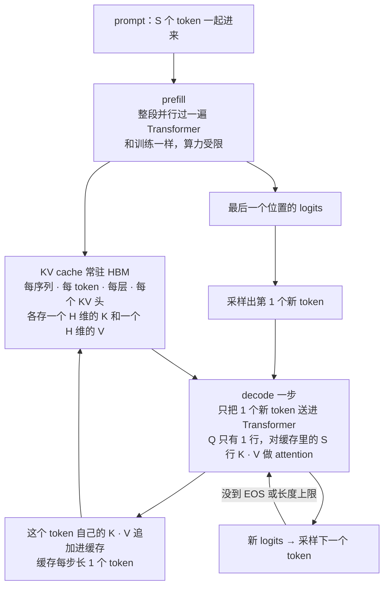
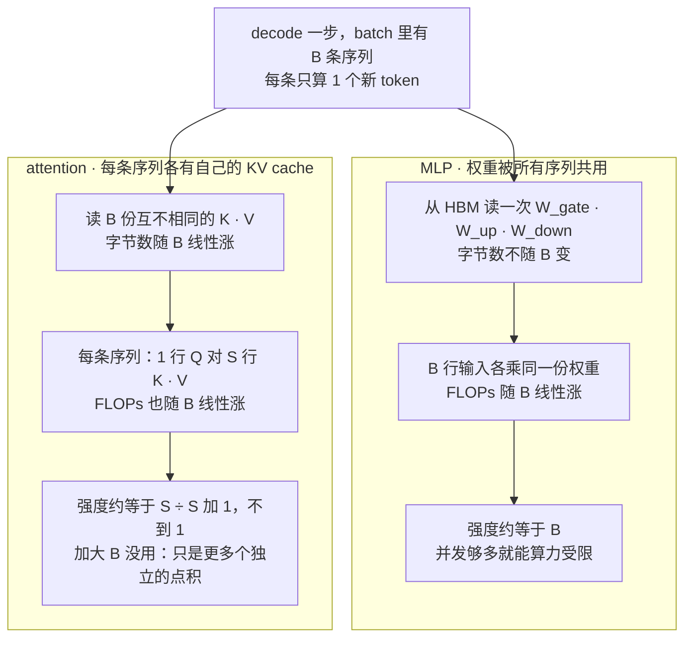
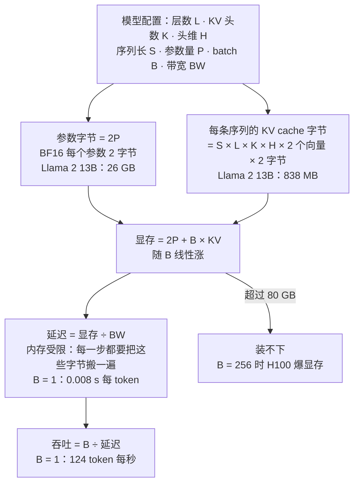
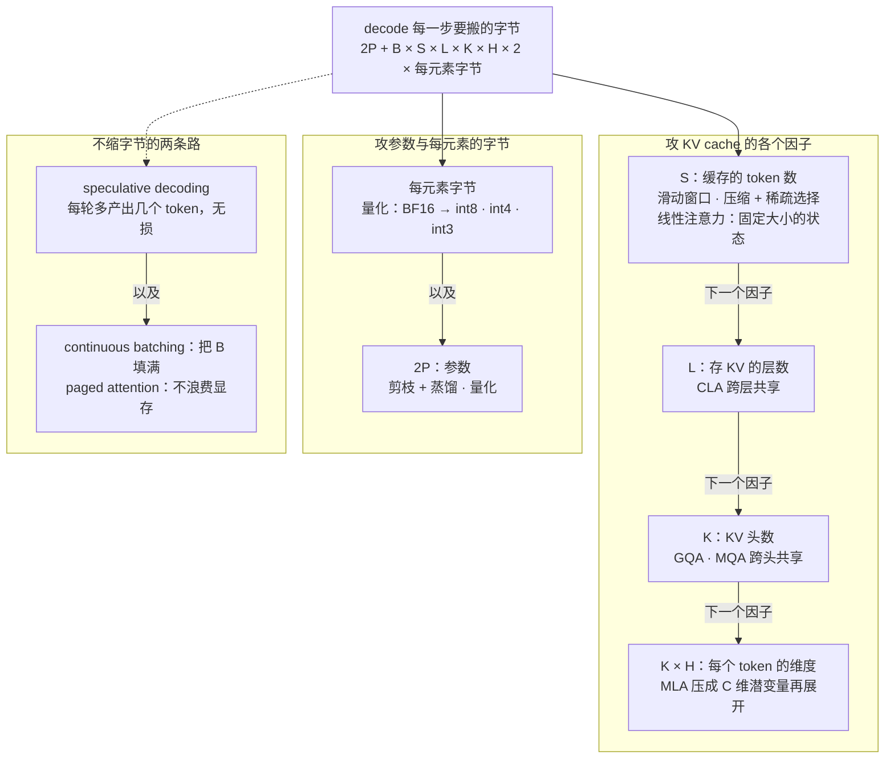
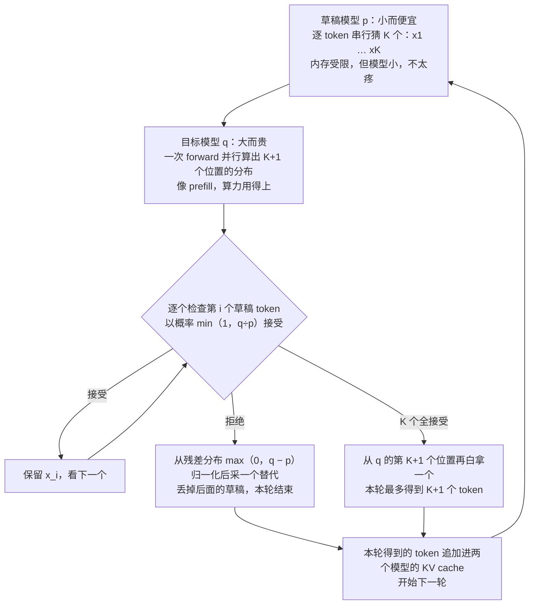
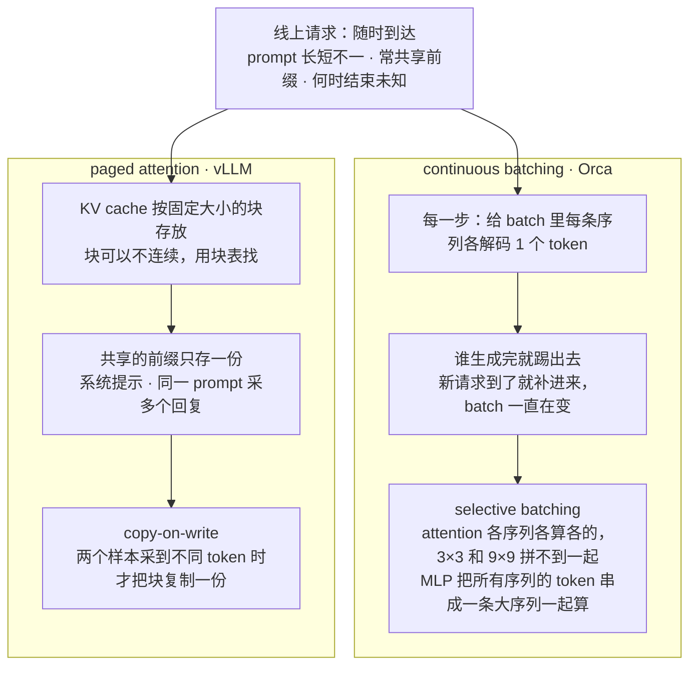

# CS336 第 10 讲｜推理（Inference）

> Stanford CS336: Language Modeling from Scratch（2026 春）· 第 10 讲，2026 年 4 月 29 日
> 视频：<https://www.youtube.com/watch?v=EfM546A79aM>（1:25:30；英文字幕为自动生成，专名与缩写错得不少，见文末勘误）
> 讲者：Percy Liang（全程；开场说"上一讲 Tatsu 讲了 scaling laws"，收尾说"下一讲 Tatsu 回来讲 scaling laws 下"）
> 课程主页：<https://stanford-cs336.github.io/> · 本讲的骨架和不少图取自 Google 的 [How to Scale Your Model](https://jax-ml.github.io/scaling-book/)（讲者称 scaling book，[推理一章](https://jax-ml.github.io/scaling-book/inference/)）· 反复引用的论文：[GQA](https://arxiv.org/abs/2305.13245) · [DeepSeek-V2 的 MLA](https://arxiv.org/abs/2405.04434) · [Speculative Decoding](https://arxiv.org/abs/2211.17192) · [vLLM / PagedAttention](https://arxiv.org/abs/2309.06180)

**一句话**：推理和训练用的是同一个模型，却是完全不同的工作负载——训练把整段序列当成张量的一个维度并行地喂给矩阵乘，推理只能一个 token 一个 token 地往外生成，于是解码阶段每从 HBM 搬一个字节只做约 1 次浮点运算（H100 要 295 才吃满算力），瓶颈是搬参数和 KV cache，不是算力。整讲的账都从这里出发：延迟 = 要搬的字节 ÷ 带宽，吞吐 = batch ÷ 延迟；batch 放大，吞吐升、延迟升、显存爆。所以所有手段——GQA / MLA / 跨层共享 / 滑窗 / 量化 / 剪枝——归根到底是同一句话"把 KV cache 和参数的字节缩小，但别掉精度"，再加上 speculative decoding（无损的换法）和 continuous batching、paged attention（服务器层面的系统手段）。

## 时间轴

| 时间 | 内容 |
|---|---|
| [0:05](https://www.youtube.com/watch?v=EfM546A79aM&t=5s) | 推理为什么值得一讲：聊天、补码、agent、批处理、评测、RL 的 rollout 都是推理 |
| [1:40](https://www.youtube.com/watch?v=EfM546A79aM&t=100s) | 训练是一次性成本，推理天天付：OpenAI 每天约 8.6T token，不到 4 天就超过一个模型的 32T 训练 token |
| [2:43](https://www.youtube.com/watch?v=EfM546A79aM&t=163s) | agent 时代：token 大多不是给人读的，token 数就是花掉的算力，没有天花板 |
| [4:13](https://www.youtube.com/watch?v=EfM546A79aM&t=253s) | 谁在做推理：闭源 API、开源权重服务商；vLLM、SGLang、TensorRT-LLM、llama.cpp |
| [5:14](https://www.youtube.com/watch?v=EfM546A79aM&t=314s) | 三个"快"：TTFT、latency、throughput，各自适用的场景 |
| [7:17](https://www.youtube.com/watch?v=EfM546A79aM&t=437s) | 本讲的一个 bit：训练沿序列并行，推理逐 token 串行，算术强度上不去 |
| [8:50](https://www.youtube.com/watch?v=EfM546A79aM&t=530s) | 记号（借自 scaling book）：B、T、D、H、N、K、F、S；Transformer block 的"电路图" |
| [14:29](https://www.youtube.com/watch?v=EfM546A79aM&t=869s) | 复习算术强度：瘦矩阵乘的强度约等于 B；H100 要 B 大于 295；B = 1 时强度 1 |
| [18:37](https://www.youtube.com/watch?v=EfM546A79aM&t=1117s) | 问答：幻灯片上 K 和 G 写反了，K 应是组数、G 是每组 query 头数 |
| [20:41](https://www.youtube.com/watch?v=EfM546A79aM&t=1241s) | 朴素解码是 O(T³)；因果性让前缀可复用 → KV cache；prefill 与 generation 两阶段 |
| [25:22](https://www.youtube.com/watch?v=EfM546A79aM&t=1522s) | 逐层记账：MLP 的强度 → B·T，attention 的强度 → ST/(S+T) |
| [33:37](https://www.youtube.com/watch?v=EfM546A79aM&t=2017s) | 结论：prefill 算力受限，generation 内存受限；attention 为什么加大 B 也救不了 |
| [35:41](https://www.youtube.com/watch?v=EfM546A79aM&t=2141s) | Llama 2 13B 上 H100：参数 26 GB、KV cache 每序列 838 MB → 延迟、吞吐的公式 |
| [41:22](https://www.youtube.com/watch?v=EfM546A79aM&t=2482s) | batch size 的两难：B = 1 时 0.008 s/token、124 token/s；加大 B 吞吐升延迟升，256 就爆显存；公交车比喻；TTFT = prefill |
| [45:59](https://www.youtube.com/watch?v=EfM546A79aM&t=2759s) | 缩 KV cache 之一：GQA 缩 N/K 倍；Llama 例子改 1:5 后延迟吞吐双改善，B = 256 装得下 |
| [51:35](https://www.youtube.com/watch?v=EfM546A79aM&t=3095s) | 缩 KV cache 之二：MLA（16k 维压到 512，RoPE 要补丁）；CLA 跨层共享；问答：为何不直接缩模型维 |
| [56:41](https://www.youtube.com/watch?v=EfM546A79aM&t=3401s) | 缩 KV cache 之三：滑动窗口与混合层；问答：线性注意力、Mamba、DeltaNet 与滑窗怎么比 |
| [1:02:20](https://www.youtube.com/watch?v=EfM546A79aM&t=3740s) | DeepSeek 的压缩 + 稀疏注意力；小结：跨层、跨头、降维、局部、线性、扩散模型 |
| [1:04:23](https://www.youtube.com/watch?v=EfM546A79aM&t=3863s) | 量化：QAT 与 PTQ；GPTQ 用 Hessian 逐层修正；AWQ 给大激活通道保留高精度 |
| [1:07:25](https://www.youtube.com/watch?v=EfM546A79aM&t=4045s) | 剪枝加蒸馏：NVIDIA 把 15B 剪成 8B；问答：怎么判断哪一部分重要 |
| [1:11:29](https://www.youtube.com/watch?v=EfM546A79aM&t=4289s) | speculative decoding：草稿模型猜几个、目标模型并行校验，接受概率 min(1, q/p)；甜点 3–4 个 |
| [1:16:37](https://www.youtube.com/watch?v=EfM546A79aM&t=4597s) | 动态负载：Orca 的 continuous batching 与 selective batching |
| [1:19:39](https://www.youtube.com/watch?v=EfM546A79aM&t=4779s) | paged attention：两种碎片、按块存 KV、前缀共享、copy-on-write |
| [1:23:47](https://www.youtube.com/watch?v=EfM546A79aM&t=5027s) | 总结：一切归于"缩 KV cache 但别掉精度"；新架构是最大的未开发空间 |

## 核心内容

### 1. 推理为什么值得一整讲：成本、agent 与 RL

- **问题本身很简单**：模型训好了，给一个 prompt，尽量准、尽量快地产出回复。但它只占一讲，重要性却在涨。
- **用途清单**：和助手聊天、代码补全、agent、批量处理数据、评测（需要生成的那一类）、以及训练内部——做 RL 时要用当前模型生成 rollout，打分，再更新权重。第 16 讲 RLVR 的每一步都要先做推理。
- **成本结构**：训练是一次性成本，贵，但付完就完了；推理是反复成本，每天都在付。讲者给的量级：OpenAI 估计每天产出约 **8.6T token**；一个今年发布的模型训练用了 **32T token**——不到 4 天，推理生成的 token 就超过了它的整个训练集（32 ÷ 8.6 ≈ 3.7 天），前沿模型训练用的 token 更多，但推理这边只会更大。
  > 小注：字幕里这个"训练用了 32T token"的模型写作 GPT-4，但 GPT-4 并非 2026 年发布，具体是哪个模型无法从字幕确认，只保留数字。
- **agent 改变了推理的意义**：chatbot 时代，prompt 进、回复出、人来读——快到人读不过来就够了。agent 时代，一个查询进去，模型要思考、推理、调工具、自省，最后才给人一段输出；生成的 token 大多不是给人读的。所以应当把"生成的 token 数"直接理解为"花掉的算力"，而且没有上限——问题够难，就要更多算力、更多 token。
- **谁在做**：闭源 API 厂商必须自己服务模型；一批服务商在跑开源权重；开源社区的包——**vLLM**（最常见的默认选择）、**SGLang**（对 agent 负载特别合适，还没那么流行）、**TensorRT-LLM**（NVIDIA 出品，很快但更窄）、**llama.cpp**（在 CPU 上跑）。
- 讲者的结论：推理快 2 倍、哪怕只快 10%，都是大事。

### 2. 三个"快"的指标，和本讲唯一要记住的一个 bit

- **TTFT**（time to first token）：用户敲下问题到第一个 token 出现的时间。交互式应用最在意——干等的时间越长体验越差；token 一旦开始出现，快慢反而没那么要紧，人读不了那么快。
- **latency**（延迟）：站在单个用户的角度，一个查询的 token 以多快的速度流出来（秒/token 或它的倒数）。同样是交互式应用关心的。
- **throughput**（吞吐）：站在系统的角度，所有查询合计每秒产出多少 token。批处理关心它——"有 1 PB 数据要过一遍模型"，只要总任务早点做完，单个查询先出后出无所谓。
- 大多数优化会同时改善延迟和吞吐，但有一条根本的取舍（batch size，第 7 节）让两者反向。
- **本讲的一个 bit**（讲者说如果只记一件事就记这个）：训练时（包括 SFT）所有 token 一次全看见，序列只是张量的一个维度，attention 和 MLP 都是一个大张量乘过去；推理因为自回归，token 只能一个一个串行生成，**没法沿序列维并行**。这就是推理和训练是完全不同工作负载的根源——后面会看到，它让算术强度很难拉高、算力用不满。
- 讲者的路线：先做数学（算术强度、吞吐、延迟怎么想），再讲降成本的手段（缩 KV cache、量化、剪枝），最后 speculative decoding 和线上服务的实际问题。

### 3. 记号，以及"瘦矩阵乘"的算术强度

- **记号**（沿用 scaling book；同一个字母既表示维度也表示它的长度）：B 批维 = 序列数；T 序列维 = token 数；D 模型维；H 头维；N 头数，D = N·H；K 是 KV 头数（问答之后修正：K 应是**组数**，G 是每组的 query 头数，幻灯片写反了）；F 是 MLP 的中间维，按惯例记 F = 4D。另有 S 与 T 两个序列维：S 是输入（被条件化的）token 数，T 是要产出 logits 的 token 数——训练时 S = T，推理时 T = 1、S 是前文长度。
- **张量乘法的三种维度**：收缩维（两个操作数都有，结果里消失，图上红色）；普通维（只在一边，留在结果里，黑色）；批维（两边都有，结果里也留着，不收缩，蓝色）。attention 里的 B 和头数正是蓝色批维——"记住这个蓝色 B"，第 5 节它就是推理难的根源。
- **Transformer block 的"电路图"**：X → attention → MLP。Q 是 B×T×N×H，K、V 的头数是 K 而不是 N；attention 那一步在 B 和头上批、在 H 上收缩；MLP 就是 gate、up、down 三个矩阵乘。讲者认为这是他见过最清晰的 Transformer 定义——每个张量的形状都写明，依赖关系一目了然。
- **算术强度复习**（第 2 讲讲过，这里换成非方阵）：X 是 B×D，W 是 D×F，推理一律 BF16（每个数 2 字节）。要做的事：从 HBM 读 X（2BD 字节），读 W（2DF），做矩阵乘（2BDF 次 FLOPs），把结果写回（2BF）。读写是"元素个数"量级的平方项，矩阵乘是立方项——这就是矩阵乘能有高强度的原因。

$$
I_{\text{matmul}}=\frac{2BDF}{2BD+2DF+2BF}\;\xrightarrow{\;B\ll D,\,F\;}\;B
$$

I 是算术强度（每搬一个字节做多少 FLOPs），分子是矩阵乘的 FLOPs，分母是读两个输入、写一个输出的字节数；令 D = cB、F = cB 并让 c 趋于无穷（D、F 远大于 B），分母被 2DF 主导，比值就是 B。第 2 讲方阵的 n/3 是它的特例。

- **和硬件比**：加速器强度 = 规格表上的 FLOP/s ÷ HBM 带宽（第 2 讲：H100 是 989e12 ÷ 3.35e12 ≈ **295**）。算法强度高于它 → 算力受限（好）；低于它 → 内存受限（坏）。对这个矩阵乘，H100 上 **B 大于 295** 才算力受限。
- **极端情形 B = 1**：强度是 1。读进一整块 D×F 的权重，却只做 2DF 次运算。推理看到的正是这种"瘦"张量，不是训练里那种满的矩阵。

### 4. KV cache：从 O(T³) 到 prefill + generation



*图 10-1｜有 KV cache 的推理分两个阶段：prefill 一次算完 prompt，decode 每步只算一个新 token（自绘示意）· [▶ 看原幻灯片 23:16](https://www.youtube.com/watch?v=EfM546A79aM&t=1396s)*

- **朴素做法**：prompt 是 "Never going to give you"，整段过一遍 Transformer 得到输出分布，采样一个 token，接到 prompt 后面，再把整段过一遍……任何"输入序列、输出分布"的黑盒都能这么用，能用，但很糟：attention 本身是 O(T²)，每生成一个 token 都重做一遍，生成 T 个 token 就是 **O(T³)**。
- **观察**：这是因果（causal）Transformer——前面 token 的激活、K、V 不会因为后面追加了什么而改变（双向模型就不行，加一个 token 全变）。所以不同前缀之间大量计算是共享的。
- **KV cache**：把已算出的 K、V 存在 HBM 里，相邻两步之间直接复用。形式化地说，每个序列（共 B 个）、每个 token（共 S 个）、每一层、每一个 KV 头，各存一个 H 维的 K 向量和一个 H 维的 V 向量。读者在 CME295 第 3 讲见过这个概念；本讲往下算它的字节数，以及它对算术强度的决定性影响。
- **两个阶段**（图 10-1）：**prefill**——拿到 prompt，一次性把它编码成 KV cache，整段都看得见，所以能像训练一样并行；**generation**（decode）——逐 token 串行地生成回复，但至少不必再为看过的 token 重算 K、V，每步只算新 token 那一份并追加进缓存。

```python
def generate(model, prompt_ids, max_new):
    kv, logits = model.prefill(prompt_ids)     # 一次并行：填满 S 个位置的 K、V，返回末位置的 logits
    out = [sample(logits)]
    for _ in range(max_new - 1):               # decode：每步只送 1 个 token 进模型
        logits, kv = model.step(out[-1], kv)   # Q 只有 1 行；这一步的 K、V 追加进 kv
        out.append(sample(logits))
        if out[-1] == EOS:
            break
    return out
```

prefill 是一次批量调用，decode 是一个每步只处理一个 token、不断往缓存里追加的循环——两段代码的算术强度天差地别，下一节算给你看。

### 5. 逐层记账：MLP 靠加大 batch 能救，attention 谁也救不了



*图 10-2｜同一个 decode 步里，为什么加大 batch 能救 MLP 却救不了 attention（自绘示意）· [▶ 看原幻灯片 31:32](https://www.youtube.com/watch?v=EfM546A79aM&t=1892s)*

- **只数矩阵乘**：其他算子的 FLOPs 少得多，而且可以融合进矩阵乘的 kernel（第 6 讲）。用 S、T 两个序列维抽象地算，最后再代入 prefill（T = S）和 generation（T = 1）。
- **MLP**：读 X，读全部权重，算 up 投影写回 HBM，算 gate 写回，算 down 投影写回。FLOPs 正比于 B·T·D·F；字节数里权重那一项正比于 D·F、不含 B 和 T。和第 3 节一样假设 B·T 远小于 D、F，强度就是 **B·T**——MLP 本质上就是一个大矩阵乘，只是矩阵多几个、维度多几个；batch 维和序列维在 MLP 里完全独立、地位相同。
    - prefill：B·T 够大（大 batch、长序列）就没问题。
    - generation：T = 1，强度退化成 **B**，而 B 在这里是**并发请求数**。批处理场景你能控制它；线上聊天它等于此刻有多少用户在同时用，可高可低、随时间变——第 13 节的 continuous batching 就是为这个准备的。总体不算坏：只要并发够多，序列长度帮不上忙，batch 能。
- **attention**：读 Q、K、V，算打分，softmax（不计），乘 V，写回。FLOPs 正比于 B·S·T·D，字节数正比于 B·D·(S + T)。矩阵乘所以 FLOPs 总比字节高一阶，关键只在那个因子长什么样：

$$
I_{\text{attn}}\;\propto\;\frac{S\,T}{S+T},\qquad \text{prefill}\;(T=S):\ \frac{S}{2},\qquad \text{generation}\;(T=1):\ \frac{S}{S+1}<1
$$

S 是已有的前文 token 数，T 是这一步要产出 logits 的 token 数；prefill 时强度随序列长度线性上升（注意 B 根本不出现），generation 时不到 1——而 H100 要 295 才能吃满算力。

- **为什么 B 帮不上 attention**（图 10-2）：MLP 的权重不依赖 B，加载一次给所有序列用，B 越大摊得越薄；attention 里每条序列有自己的一份 KV cache，读的字节和做的 FLOPs 都随 B 一起涨，相当于 B 个互不相关的小矩阵乘——多做几个并不提高强度。这正是第 3 节那个"蓝色 B"：按一个坐标批起来做，本质上和点积一样，强度糟糕。
- **四格总结**：prefill 的 MLP 强度 B·S，很好；prefill 的 attention S/2，不如前者但可用；generation 的 MLP 强度 B，可用，前提是并发够多；generation 的 attention 约等于 1，是**根本瓶颈**——只要还用 Transformer，这一格就改不了。所以 prefill 算力受限，generation 内存受限。讲者：以后再听人说 "inference is memory bound"，你知道为什么了。

### 6. 把账算到具体的模型上：Llama 2 13B 跑在 H100



*图 10-3｜内存受限时的推理记账：从模型配置到延迟与吞吐只有四步（自绘示意）· [▶ 看原幻灯片 37:12](https://www.youtube.com/watch?v=EfM546A79aM&t=2232s) · 出处：[Llama 2](https://arxiv.org/abs/2307.09288)*

- **内存受限带来的简化**：要估时间，只看要搬多少字节（假设通信与计算重叠，瓶颈就是字节数）。好处是账好算，坏处是加速器大部分时间在空转。
- **例子的配置**：Llama 2 13B，H100。要用的量：序列长度、D、F、query 头数、KV 头数（原版没有 GQA，K = N）、头维、层数、词表大小，以及 H100 的 HBM 带宽。
- **参数**：embedding、MLP、Q/K/V 投影加起来约 13B，和广告数一致；BF16 每参数 2 字节 → 26 GB。
- **KV cache**：token 数 × KV 头数 × 头维 × 层数 × 2（K 和 V 各一份）× 2 字节（BF16）：

$$
C_{\text{kv}}=S\cdot L\cdot K\cdot H\cdot 2\cdot 2\ \text{bytes},\qquad M=2P+B\,C_{\text{kv}}
$$

C_kv 是一条序列的 KV cache 字节数（S 个 token、L 层、K 个 KV 头、每头 H 维，K 与 V 各一份，每个数 2 字节），M 是总显存：参数 2P 字节只有一份，KV cache 每条序列一份。讲者算出来的形式是 M ≈ 838 MB × B + 26 GB。

$$
\text{latency}=\frac{2P+B\,C_{\text{kv}}}{BW}\ \text{s/token},\qquad \text{throughput}=\frac{B}{\text{latency}}=\frac{B\cdot BW}{2P+B\,C_{\text{kv}}}\ \text{token/s}
$$

BW 是 HBM 带宽；内存受限时每一步 decode 都得把参数和全部 KV cache 搬一遍，所以延迟是 B 的线性函数（斜率是 KV cache、截距是参数），吞吐是 B 除以它——B 变大时参数那一项被摊薄，KV 那一项摊不掉，所以吞吐上升但有渐近线，不可能到无穷。

- **数字**：B = 1 → 延迟 **0.008 s/token**，吞吐 **124 token/s**。
  > 小注：反推讲者的配置——Llama 2 13B 是 40 层、40 个头、头维 128，每个 token 的 KV cache = 2 × 40 × 40 × 128 × 2 字节 = 819,200 字节，乘 1024 个 token 正好 838 MB，所以配置里的序列长度应为 1024；带宽是 H100 SXM 的 3.35 TB/s，(26 GB + 0.838 GB) ÷ 3.35 TB/s = 8.0 ms，倒数 125 token/s，与课上数字一致。

```python
def decode_stats(P, L, K, H, S, B, bw=3.35e12, nbytes=2):
    param_bytes = nbytes * P                    # BF16：每参数 2 字节，只有一份
    kv_per_seq  = S * L * K * H * 2 * nbytes    # K 和 V 各一份，每条序列一份
    mem         = param_bytes + B * kv_per_seq  # decode 每一步都要搬完这些
    latency     = mem / bw                      # 秒 / token（内存受限的假设）
    throughput  = B / latency                   # token / 秒
    return mem, latency, throughput
```

代入 Llama 2 13B（P = 13e9，L = 40，K = 40，H = 128，S = 1024）和 B = 1，得到 26.8 GB、8 ms、125 token/s；改 B、改 K，就是接下来两节的全部实验。

- **多卡**：本讲不展开（分片方案见 scaling book 的推理章）。最平凡的一种：起 M 份模型副本，延迟不变，吞吐乘 M。

### 7. batch size 的两难：延迟、吞吐、显存与 TTFT

- **加大 B**：延迟变差——KV cache 更大，每步搬得更多；而且一个 batch 里的请求要等所有人一起走。吞吐变好——参数只加载一次，摊给更多序列。讲者反复说"快"有两个意思，看你要哪一个，调 batch size 的方向完全相反。
- **再加大到 256**（想要高吞吐处理海量文档）：吞吐更好、延迟更差，但 KV cache 的显存超过 H100 的 80 GB，**OOM**。换 B200 能再大一点，但总有上限：永远到不了吞吐的渐近线，而且越往后收益越小。
  > 小注：按第 6 节的公式自己算，B = 64 时显存 26 + 0.838 × 64 ≈ 79.6 GB，刚好塞进 80 GB（讲者后面用的正是 64）；B = 256 要约 240 GB；吞吐的渐近线是 BW ÷ C_kv = 3.35 TB/s ÷ 838 MB ≈ 4,000 token/s。
- **公交车比喻**：小 batch 像打车，随到随走但一次运不了几个；大 batch 像公交，得等车坐满、大家一起走，单人等得久，但整体运力高。
- **结论**：小 batch → 延迟好、吞吐差；大 batch → 吞吐好、延迟差。但延迟和吞吐并不总是对立的：**减少要搬的字节，两者一起改善**（下一节 GQA 的例子）；真正对立的只有 batch 这一个维度。
- **TTFT** 就是 prefill 的时间——prefill 做完才能开始生成。要 TTFT 快就用小 batch；要吞吐就用大 batch。

### 8. 缩 KV cache（一）：GQA、MLA、CLA——跨头共享、降维、跨层共享



*图 10-4｜每种手段各攻显存公式里的哪一项：左边一列沿公式的因子逐个看，都是有损的，要验精度；右边一列不改模型（自绘示意）· [▶ 看原幻灯片 45:59](https://www.youtube.com/watch?v=EfM546A79aM&t=2759s)*

- **动机**：内存是推理的瓶颈，而 KV cache 占显存的大头——batch 够大时甚至超过参数本身。所以第一件事就是缩 KV cache，但要小心别把精度丢太多。手段从改架构到做系统都有，推理是个横切的话题。
  > 小注：用第 6 节的数自己算，Llama 2 13B 在 1024 上下文下 B 超过 31 时 KV cache（0.838 GB × B）就超过参数的 26 GB。
- **GQA**（定义见 CME295 第 2 讲，T5 时代的证据见本课第 3 讲第 11 节）：MHA 是 K = N，每个头各有一份 K、V；MQA 是 K = 1，"没人用，太差"；GQA 在两者之间找平衡。GQA 论文（2023）的图：横轴每样本耗时（和延迟、吞吐都相关），MHA 最慢；K = 1 快得多；把 K 一路加到 8 仍然很快；再往上耗时明显涨。它缩 KV cache **N/K 倍**——内存受限，所以直接变快。
- **回到 Llama 例子**：B = 64、原版 K = N 时有一组吞吐和延迟；改成 1:5 的 GQA（40 个头共用 8 份 K、V），显存大减，**延迟和吞吐一起改善**——两者并非总是对立，减少字节两头都赚，对立的只是 batch 维。既然显存省下来了，把 B 加到 256：之前 OOM，现在装得下；延迟略差，吞吐按比例上升。参数是联动着调的：缩 KV cache 换来更大的 batch，再换别的取舍。
- **精度**：GQA 论文在一堆评测上显示不掉点；但后来 DeepSeek 的论文表明它其实掉。讲者：凡不是纯数学的结论都要打折扣。
- **MLA**（multi-head latent attention，DeepSeek-V2；第 4 讲第 9 节写过公式）：不减 K、V 的个数——每个 token 还是一份——而是**压缩**它们。正常做法是激活乘一个矩阵得 K、再乘一个得 V，各是 N·H 维、和模型维一样大；MLA 先把激活投影到 C 维的潜变量（DeepSeek-V2 从约 16,000 维压到 **512**，很激进），缓存只存这 C 维，用的时候再从潜变量把 K、V 展开出来。

$$
c_t=x_t W_c\in\mathbb{R}^{C},\qquad K_t=c_t W_{uk},\qquad V_t=c_t W_{uv},\qquad C\ll N\cdot H
$$

x_t 是 token 的激活，c_t 是存进缓存的 C 维潜变量，W_uk、W_uv 是展开矩阵；每个 token 的缓存从 2·N·H 个数变成 C 个数。

- **麻烦**：MLA 与 RoPE 不兼容——RoPE 直接作用在 K 上，压缩后展开就套不进去了；DeepSeek 的做法是另加少量维度专门放 RoPE。即便如此缩得仍然很多。延迟和吞吐的改善"就是简单算术"：缓存越小越快，接近线性直到某个点。精度表上，GQA 的数比 MHA 小，而 MLA 比 MHA 还好一点点——当作差不多即可。
  > 小注：DeepSeek-V2 论文里 128 个头 × 头维 128 = 16,384，即课上的"16,000"；潜变量 d_c = 512；解耦出来放 RoPE 的维度是每头 64。摘要给的账：KV cache 缩 93.3%，最大生成吞吐是 DeepSeek 67B 的 5.76 倍（第 4 讲也记过）。
- **问答**：和直接缩模型维比呢？消融没做这一项；讲者猜不分青红皂白地缩 D 只会更差——诀窍是找到模型里"能挤"的地方，而哪里能挤事先不知道，只能实验。
- **CLA**（cross-layer attention）：只在一部分层算 K、V，其他层直接用上一层的缓存。GQA 跨头共享，CLA 跨层共享。论文的图：给定一种方法，可以扫 K 和头维得到一条"精度对 KV cache 大小"的曲线，CLA 把这条 Pareto 前沿往外推。
  > 小注：应为 [Brandon et al., 2024](https://arxiv.org/abs/2405.12981)（MIT）；摘要的账：叠在 MQA 之上再缩 2 倍 KV cache，精度几乎不变。

### 9. 缩 KV cache（二）：滑动窗口、混合层、线性注意力、DeepSeek 的稀疏注意力

- **滑动窗口 / 局部注意力**：老想法，也很自然。生成一个 token 时只看最近的 k 个，而不是整个 n² 的注意力矩阵。于是 KV cache **与序列长度无关**（只剩 B 乘其他因子），长上下文尤其划算。有效上下文比窗口大：层数叠起来，信息一层一层往后传得更远。变体：不必每层都做密集的局部窗，可以隔开；"global + sliding window"——固定网格上的一些全局位置加一个局部窗。
- **代价**：表达力受损，精度掉。"没有免费午餐——至少这顿很贵。"解法是**混合**：一部分层全注意力，一部分层局部（第 3 讲记过 Llama 4、Gemma 4、Command A 的 3:1）。永远在精度和速度之间平衡。
- **问答：线性注意力对滑窗**（第 4 讲整讲讲这个，这里只记 Percy 的回答）：线性注意力不存 KV cache，而是把全部历史压成一个固定大小的状态——最朴素的做法是把 K、V 累加成一个向量，肯定与序列长度无关；Gated DeltaNet、Mamba 是"压缩但少遗忘"的版本。它们也被拿来替代滑窗，效果不错；还可以三者并用——全注意力、滑窗、线性各管一摊：滑窗保局部的高分辨率，线性给过去的粗略摘要。长上下文用线性更好吗？没有免费午餐——做 needle in a haystack 时把整段历史压进一个小状态，信息就是会丢，可能就是找不回来。Mamba / DeltaNet 比滑窗**更强**：递推时可以只看最近的状态，所以能表达滑窗的部分行为，"有更多余地"；滑窗一旦选定就到头了。
- **DeepSeek 还在折腾 attention**：MLA 之后又有压缩 + 稀疏的组合（字幕里的名字：compressed sparse attention、DeepSeek sparse attention、heavily compressed attention；讲者自己也说记不清这些缩写）。机制：先把每 M 个 KV token 压成 1 个；再用一套轻量的 query 和 key 做一次很小的 attention 算出 index score，据此选出要保留的 token 子集——"闪电般快地决定留谁"；然后再进一步压缩。
  > 小注：带轻量索引器的 DeepSeek Sparse Attention（DSA）应出自 DeepSeek-V3.2（2025 年底）；课上那张图把压缩、稀疏选择、重度压缩三段合在一起，应是其后续版本，未能确认出处，不加链接。
- **这一段的小结**：KV cache 就是显存，显存决定延迟和吞吐，所以缩它直接换来速度，关键是别掉精度。手段：降维（跨层、跨头、头维）、局部注意力、线性注意力，还有很多；另一条路是**扩散模型**——非自回归的生成，可以快得多。

### 10. 量化：从系统而不是架构的角度缩字节

- **思路**：把数的精度降下来。字节少了，延迟和吞吐都好，照例要盯精度。选项从 BF16 一路到 int4（第 5 讲讲过训练侧的 FP8 / MXFP8，这里是推理侧；第 2 讲问答里"先用 bf16 训好再量化到低比特做推理"指的就是这一节）。
- **量化感知训练**（QAT）：怕量化把模型搞坏，就在训练时的 forward 里做 quantize → dequantize，把量化误差模拟进去，让权重适应它。缺点：要做大规模训练，贵。
- **训练后量化**（PTQ）：训完再量化，便宜得多，是通常的做法。
    - 朴素版：每个 tensor（或每层）定一个 scale 和 zero point，各自量化。一般效果不好。
    - **GPTQ**：用 Hessian 信息逐层量化，把每一步的量化误差记下来，传给尚未量化的权重去补偿。
    - **AWQ**（activation-aware quantization）：更讲究的一种。观察：有些激活通道的值特别大，和它们相乘的那些权重更要紧——就给这些权重多留精度。图上：FP16 的权重矩阵整体量化到 int3，但挑出对应大激活通道的少数几列保留 FP16。
  > 小注：GPTQ 出自 [Frantar et al., 2022](https://arxiv.org/abs/2210.17323)，摘要：175B 参数的模型约 4 个 GPU 小时就能量化到 3–4 bit；AWQ 出自 [Lin et al., 2023](https://arxiv.org/abs/2306.00978)，摘要：只保护约 1% 的显著权重就能大幅降低量化误差。

### 11. 剪枝加蒸馏：把大模型"拆了再修"

- **做法**（粗暴但有效）：拿一个大模型，撕掉一部分，再修好。NVIDIA 的论文：先估计模型各部分的重要性，删掉不重要的隐藏单元、头、甚至整层；得到的模型此时不好用，再**post-train**——在你关心的数据或任务上继续训（用蒸馏）把它"治好"。结果：**15B 剪成 8B**，精度基本不掉，训练量比从头训小得多。
  > 小注：应为 NVIDIA 的 Minitron，[Muralidharan et al., 2024](https://arxiv.org/abs/2407.14679)，摘要：Nemotron-4 15B 剪成 8B 和 4B，每个模型比从头训少用最多 40 倍的训练 token，全家族训练算力省 1.8 倍，重训只用了不到 3% 的原始数据，MMLU 比从头训高最多 16%。
- **讲者的总结框架**：目标是减参数或减 KV cache，两条路——定义一个更快的架构从头训；或者定义更快的架构、从原模型初始化（架构可以不同，拼成一个 Frankenstein），再用蒸馏修复。
- **问答**
    - 怎么区分重要的层和不重要的层？拿一个校准集过一遍模型，看激活的幅度：接近零的多半是死单元，大的要留。
    - 激活为什么大就重要？万一都很大呢？这是经验事实——某些通道就是比别的大得多；若不成立，这一类方法也就不成立了。模型训出来就是这样，于是可以利用。
    - 一个神经元对所有样本恒为 100 呢？不能直接删，删了全坏；但高均值、低方差的单元可以折成一个 bias。

### 12. Speculative decoding：唯一无损的加速——让小模型猜、大模型判



*图 10-5｜speculative decoding 的一轮：草稿串行猜、目标并行验、按 q/p 逐个接受，分布与直接从目标模型采样完全相同（自绘示意）· [▶ 看原幻灯片 1:14:02](https://www.youtube.com/watch?v=EfM546A79aM&t=4442s) · 出处：[Leviathan et al., 2023](https://arxiv.org/abs/2211.17192)*

- **前面的手段都是有损的**——把 KV cache 狠狠压下去，精度可能受伤。有一种很优雅的办法是无损的：speculative sampling / speculative decoding。
- **利用的不对称**：prefill 能把一整段 token 并行编码，而且顺手给出每个位置的概率——快、算力受限、一切都好；generation 却只能一个一个来。所以**检查比生成快**：给你一段序列，判断它好不好，比一个 token 一个 token 地把它生成出来快得多。
- **想法**：用一个便宜的草稿模型 p 先猜几个 token（比如 4 个），再用真正关心的目标模型 q 一次并行地审这几个 token，决定接受哪些。两边都不太疼：草稿模型小，即使内存受限、串行生成，也不算贵；目标模型大而贵，但让它一次处理一批 token，算力就用上了。课上放了一段动画：大模型逐 token 生成很慢；开了 speculative decoding 后小模型先吐一串，大模型批一下，于是 token 一阵一阵地往外冒。
- **算法**（几篇论文差不多同时提出，课上讲的是其中一篇）：从草稿模型 p 采样 K 个 token；用目标模型 q 并行算出这些位置的 logits；然后逐个决定：

$$
\Pr[\text{accept }x]=\min\!\Big(1,\frac{q(x)}{p(x)}\Big),\qquad \text{reject}\ \Rightarrow\ x'\sim\frac{\max\big(0,\,q(\cdot)-p(\cdot)\big)}{\sum_y \max\big(0,\,q(y)-p(y)\big)}
$$

p 是草稿模型对这个 token 的概率，q 是目标模型的；q 相对 p 越大越倾向接受；一旦拒绝，就从"q 比 p 多出来的那部分"归一化成的残差分布里采一个替代 token 并结束本轮。这就是 rejection sampling 的思路，区别在于 rejection sampling 拒绝时两手空空，这里每一轮都保证拿到一个严格服从目标模型分布的样本。证明课上跳过（和 rejection sampling 同一套论证）。

```python
def spec_step(draft, target, ctx, K):
    xs, P, out = [], [], []
    for _ in range(K):                                 # 小模型串行猜 K 个
        p = draft.dist(ctx + xs); x = sample(p); xs.append(x); P.append(p)
    Q = target.dists(ctx + xs)                         # 大模型一次并行：K+1 个位置的分布
    for i, x in enumerate(xs):
        if random() < min(1, Q[i][x] / P[i][x]):       # 按 q/p 接受
            out.append(x); continue
        out.append(sample(normalize(clip0(Q[i] - P[i]))))   # 拒绝：从残差分布换一个，退出
        return out
    out.append(sample(Q[K]))                           # 全部接受：末位再白拿一个
    return out
```

一轮里目标模型只做一次 forward，却可能产出 1 到 K + 1 个 token；接受与残差采样合起来保证输出分布就是目标模型的。

- **草稿长度**：论文的图显示，草稿 token 太少，没充分利用目标模型的并行；太多，后面的越来越容易被拒。甜点在 **3–4 个**左右。
- **草稿模型从哪来**：比目标模型小得多，且越像目标越好——所以要蒸馏。于是前面所有缩 KV cache 的"花招"在这里全用得上：先想办法把模型缩小，缩完满意就直接上线；不满意就把它当草稿，让主模型来把关。之后有一整支文献在原版上改进，课上不展开。
  > 小注：[Leviathan et al., 2023](https://arxiv.org/abs/2211.17192)（Google）摘要：T5-XXL 上相对标准 T5X 实现加速 2–3 倍，输出完全相同；同期的另一篇是 DeepMind 的 [Chen et al., 2023](https://arxiv.org/abs/2302.01318)。

### 13. 线上服务的动态负载：continuous batching 与 paged attention



*图 10-6｜服务器层面的两件事：batch 里的成员随时进出；KV cache 像操作系统的内存页那样分块、共享、写时复制（自绘示意）· [▶ 看原幻灯片 1:17:37](https://www.youtube.com/watch?v=EfM546A79aM&t=4657s) · 出处：[Kwon et al., 2023](https://arxiv.org/abs/2309.06180)*

- **场景**：在线网站，用户随时来聊。请求到达时间不同、共享的前缀不同、长度不同——一团乱，完全不像训练里整整齐齐、同样长度的块。
- **Orca 与 continuous batching**（很早的系统）：几条请求的前缀长短参差；逐步解码，每一步给所有序列各出一个 token；哪条序列结束了就把它踢出 batch，新到的请求随时补进来——batch 是持续更新的，所以叫 continuous。第 5 节说 generation 的 MLP 强度等于并发数，这就是把并发数一直填满的办法。
- **selective batching**：批处理要求所有切片形状一致，可每条请求长度不同怎么办？attention 部分没办法——它依赖各自的长度，3×3 和 9×9 的计算凑不成一个张量，只能各算各的；但 MLP 这些非 attention 的部分（FLOPs 的大头）与位置无关，可以把所有序列的 token 首尾相接成一条"大序列"一起算。

```python
def serve_step(batch, queue, model, max_batch):
    while queue and len(batch) < max_batch:            # 有空位就补新请求：先 prefill 再入队
        req = queue.pop(0); req.kv = model.prefill(req.prompt); batch.append(req)
    toks = model.step_all(batch)                       # 一步：每条序列各出 1 个 token
    for req, tok in zip(batch, toks):                  # MLP 合并算，attention 各算各的
        req.out.append(tok); req.kv.append(tok)
    batch[:] = [r for r in batch if r.out[-1] != EOS and len(r.out) < r.max_new]   # 完成的踢出
```

每调用一次就是一个解码步：补位、齐步走一格、淘汰——batch 的成员和长度每一步都在变。

- **paged attention**（vLLM 论文的核心想法；vLLM 现在功能多得多）：KV cache 到底放在显存哪里？请求进来总得给它找地方，于是出现**碎片化**——就像当年的硬盘要 defrag。两种碎片：*内部碎片*——不知道什么时候会停，只好按最大长度（比如 1024 个 token）预留一整块缓冲区，大部分用不上也不能给别人；*外部碎片*——请求之间留下的空隙太小，谁也用不了。
- **解法**（做系统的人懂操作系统："这个问题我们解决过一次了"）：把每条序列的 KV cache 切成固定大小、可以不连续的块——课上的例子把 "Four score and seven years ago our fathers brought forth" 按每块 4 个 token 切开，块放在哪里无所谓，只要按块对齐、记住索引就行。
- **顺手得到共享**：两条请求的相同前缀可以指向同一批块。系统提示（system prompt）的 KV cache 只算一次，所有请求复用；同一个 prompt 要采多个回复时，prompt 的块共享，只有各自的回复不同。**copy-on-write**：两个样本先共享同一块，采到同样的 token 就继续共用，采到不同 token 时才把这个块复制一份、各走各的——尽可能多地共享前缀缓存。还有一堆 kernel 上的优化没时间讲；总的思路是用操作系统的那套比喻来管理推理。
  > 小注：[vLLM 论文](https://arxiv.org/abs/2309.06180)（Kwon et al., 2023）摘要：灵感来自操作系统的虚拟内存与分页；KV cache 显存浪费接近零；同等延迟下吞吐是当时主流系统的 2–4 倍；正文估计此前的系统因碎片和过量预留浪费 60–80% 的 KV 显存。Orca 应为 [Yu et al., OSDI 2022](https://www.usenix.org/conference/osdi22/presentation/yu)，论文报告同等延迟下吞吐比 FasterTransformer 高 36.9 倍。

### 14. 收尾：每个手段各攻哪一项

| 手段 | 缩的是显存公式里的哪一项 | 有损？ | 课上的数 / 代价 |
|---|---|---|---|
| GQA / MQA | KV 头数 K，缓存缩 N/K 倍 | 是（GQA 论文说不掉，DeepSeek 说掉） | K = 8 仍快；MQA 没人用；Llama 例子 1:5 后延迟吞吐双改善 |
| MLA | 每个 token 的 KV 维度压成 C 维潜变量 | 是（表上和 MHA 持平） | 16k → 512；RoPE 要另加维度 |
| CLA | 存 KV 的层数 | 是 | 把精度对缓存大小的 Pareto 前沿往外推 |
| 滑动窗口 / 混合层 | 缓存的 token 数 S → 窗口大小 | 是，损表达力 | 要和全注意力层交替 |
| 线性注意力 / SSM | S → 固定大小的状态 | 是，needle in a haystack 会丢 | 比滑窗"有更多余地" |
| 压缩 + 稀疏（DeepSeek） | S：每 M 个压 1 个，再轻量打分选子集 | 是 | 课上只过了一张图 |
| 量化 | 每元素字节 | 是 | BF16 → int4 / int3；QAT 贵，PTQ 便宜 |
| 剪枝 + 蒸馏 | 参数 P | 是，要 post-train 修复 | 15B → 8B，精度基本不掉 |
| speculative decoding | 不缩字节，每轮多出几个 token | 否，精确 | 草稿 3–4 个是甜点 |
| continuous batching | 把 B 一直填满 | 否 | attention 各算各的，MLP 合并 |
| paged attention | 显存浪费（两种碎片）；前缀共享 | 否 | 块大小 4 的例子；copy-on-write |
| 多副本 | 吞吐 × M，延迟不变 | 否 | 分片方案见 scaling book |

- **讲者的总结**：推理极其重要；同一个模型，却是和训练完全不同的任务——内存受限，线上还是动态的。量化、新架构、剪枝蒸馏、speculative sampling，全都由一条原则驱动：**缩 KV cache，别太伤精度**；再加上分页、投机执行这些从系统领域借来的思想，服务器才跑得起来。
- **没来得及展开、但讲者认为潜力最大的**：新架构——状态空间模型、线性注意力、扩散模型。KV cache 和 attention 的构造方式让 Transformer 从根子上就是一个"对推理不友好"的架构；如果能设计一个像 Transformer 当年那样成功、但一开始就为推理而设计的架构，可能打开很大的空间（第 4 讲是这条线的架构侧）。下一讲 Tatsu 回来讲 scaling laws 下。

## 关键图表速查（点时间戳跳到原幻灯片）

| 图 | 看什么 | 跳转 | 出处 |
|---|---|---|---|
| 推理的用途与成本 | 每天 8.6T token 对一个模型 32T 的训练 token：不到 4 天 | [1:40](https://www.youtube.com/watch?v=EfM546A79aM&t=100s) | — |
| 三个指标 | TTFT、latency、throughput 各对应交互式还是批处理 | [5:14](https://www.youtube.com/watch?v=EfM546A79aM&t=314s) | [scaling book](https://jax-ml.github.io/scaling-book/inference/) |
| 张量记法与 Transformer block 电路图 | 红色收缩维、黑色普通维、蓝色批维；attention 里那个蓝色 B（[10:53](https://www.youtube.com/watch?v=EfM546A79aM&t=653s)） | [9:50](https://www.youtube.com/watch?v=EfM546A79aM&t=590s) | 同上 |
| 瘦矩阵乘的强度推导 | 字节 2BD + 2DF + 2BF 对 FLOPs 2BDF；B 远小于 D、F 时约等于 B；H100 要 295 | [14:59](https://www.youtube.com/watch?v=EfM546A79aM&t=899s) | 同上 |
| 朴素解码与 KV cache 动画 | 先看整段重算的版本，再看 prefill 填缓存、每步只送一个 token（[23:16](https://www.youtube.com/watch?v=EfM546A79aM&t=1396s)） | [20:41](https://www.youtube.com/watch?v=EfM546A79aM&t=1241s) | — |
| attention 的强度与四格总结 | 因子 ST/(S+T)：prefill S/2、generation 不到 1；总结表（[33:37](https://www.youtube.com/watch?v=EfM546A79aM&t=2017s)） | [29:59](https://www.youtube.com/watch?v=EfM546A79aM&t=1799s) | — |
| Llama 2 13B 的计算器 | 显存 838 MB × B + 26 GB；B = 1 → 0.008 s、124 token/s；B = 256 爆显存（[41:22](https://www.youtube.com/watch?v=EfM546A79aM&t=2482s)） | [39:16](https://www.youtube.com/watch?v=EfM546A79aM&t=2356s) | [Llama 2](https://arxiv.org/abs/2307.09288) |
| GQA 的每样本耗时图 | MHA 最慢；K = 1 最快；K 到 8 仍好，再大就涨 | [47:31](https://www.youtube.com/watch?v=EfM546A79aM&t=2851s) | [GQA](https://arxiv.org/abs/2305.13245) |
| MLA 示意与精度表 | 潜变量 512 维、RoPE 另加维度；表里 MLA 略高于 MHA、GQA 偏低（[53:39](https://www.youtube.com/watch?v=EfM546A79aM&t=3219s)） | [52:06](https://www.youtube.com/watch?v=EfM546A79aM&t=3126s) | [DeepSeek-V2](https://arxiv.org/abs/2405.04434) |
| CLA 的 Pareto 图 | 同一方法扫 K 与头维得一条曲线；CLA 的曲线在外侧 | [56:10](https://www.youtube.com/watch?v=EfM546A79aM&t=3370s) | [Brandon et al., 2024](https://arxiv.org/abs/2405.12981) |
| 滑窗、隔层与混合层 | 局部窗、隔开的层、global + local；全注意力层与局部层交替 | [57:12](https://www.youtube.com/watch?v=EfM546A79aM&t=3432s) | — |
| AWQ 示意 | 整块 FP16 → int3，大激活通道对应的那几列留 FP16 | [1:06:54](https://www.youtube.com/watch?v=EfM546A79aM&t=4014s) | [AWQ](https://arxiv.org/abs/2306.00978) |
| speculative decoding 动画与算法 | 小模型一串、大模型批一下；接受概率 min(1, q/p)（[1:14:02](https://www.youtube.com/watch?v=EfM546A79aM&t=4442s)）；草稿数 3–4 是甜点（[1:15:36](https://www.youtube.com/watch?v=EfM546A79aM&t=4536s)） | [1:13:01](https://www.youtube.com/watch?v=EfM546A79aM&t=4381s) | [Leviathan et al., 2023](https://arxiv.org/abs/2211.17192) |
| Orca 与 paged attention 示意 | 参差的 batch 逐步解码、完成即出；块大小 4、块表、copy-on-write 分裂（[1:21:12](https://www.youtube.com/watch?v=EfM546A79aM&t=4872s)） | [1:17:37](https://www.youtube.com/watch?v=EfM546A79aM&t=4657s) | [Orca](https://www.usenix.org/conference/osdi22/presentation/yu) · [vLLM](https://arxiv.org/abs/2309.06180) |

## 提到的工作

| 名称 | 在本讲里的作用 |
|---|---|
| [How to Scale Your Model](https://jax-ml.github.io/scaling-book/)（Google，讲者称 scaling book） | 本讲的骨架：记号、Transformer 电路图、推理章的图；多卡推理请读它 |
| [vLLM](https://arxiv.org/abs/2309.06180)（Kwon et al., 2023） | 开源推理引擎的默认选择；paged attention 的出处 |
| [SGLang](https://github.com/sgl-project/sglang) · [TensorRT-LLM](https://github.com/NVIDIA/TensorRT-LLM) · [llama.cpp](https://github.com/ggml-org/llama.cpp) | 分别：适合 agent 负载、NVIDIA 的快而窄、在 CPU 上跑 |
| [Llama 2](https://arxiv.org/abs/2307.09288)（Touvron et al., 2023） | 13B 版本做记账例子：26 GB 参数、每序列 838 MB KV cache |
| NVIDIA H100 · B200 | 80 GB 显存、295 FLOPs/byte 的分界线；B200 能开更大的 batch |
| [GQA](https://arxiv.org/abs/2305.13245)（Ainslie et al., 2023） | 跨头共享 K、V；每样本耗时图；缩 N/K 倍 |
| [MQA](https://arxiv.org/abs/1911.02150)（Shazeer, 2019） | K = 1 的极端，"没人用，太差" |
| [DeepSeek-V2](https://arxiv.org/abs/2405.04434)（2024） | MLA：16k 维压到 512；顺带指出 GQA 其实掉点 |
| [RoPE](https://arxiv.org/abs/2104.09864)（Su et al., 2021） | 与 MLA 不兼容，要另加维度 |
| [Cross-Layer Attention](https://arxiv.org/abs/2405.12981)（Brandon et al., 2024） | 跨层共享 KV；Pareto 前沿外推（应为这篇） |
| 滑动窗口 / 局部注意力、global + local、混合层 | 缩 S 的老办法；有损，要与全注意力交替（第 3 讲有各家的配比） |
| 线性注意力 · [Mamba](https://arxiv.org/abs/2312.00752) · [Gated DeltaNet](https://arxiv.org/abs/2412.06464) | 问答里与滑窗的对比：固定状态、更有余地、但会丢信息（第 4 讲主角） |
| DeepSeek 的压缩 + 稀疏注意力 | 每 M 个压 1 个、轻量打分选子集；名字与出处见第 9 节小注（推断） |
| 扩散语言模型 | 非自回归，另一条快路，只点了名 |
| [GPTQ](https://arxiv.org/abs/2210.17323)（Frantar et al., 2022） | 训练后量化：Hessian 逐层、误差传给未量化的权重 |
| [AWQ](https://arxiv.org/abs/2306.00978)（Lin et al., 2023） | 激活感知：大激活通道的权重留高精度 |
| [Minitron](https://arxiv.org/abs/2407.14679)（Muralidharan et al., 2024，NVIDIA） | 剪枝 + 蒸馏：15B → 8B（应为这篇） |
| [Speculative Decoding](https://arxiv.org/abs/2211.17192)（Leviathan et al., 2023）· [Speculative Sampling](https://arxiv.org/abs/2302.01318)（Chen et al., 2023） | 无损加速；接受概率 min(1, q/p)；同期两篇 |
| [Orca](https://www.usenix.org/conference/osdi22/presentation/yu)（Yu et al., OSDI 2022） | continuous batching 与 selective batching |

## 术语对照

| English | 中文 |
|---|---|
| inference | 推理：模型训好后拿 prompt 产出回复 |
| prefill / decode (generation) | 预填充（并行编码 prompt、填 KV cache）/ 逐 token 解码 |
| autoregressive | 自回归：下一个 token 依赖已生成的全部 token |
| TTFT (time to first token) | 首 token 时间：prefill 的耗时 |
| latency / throughput | 延迟（单个查询每 token 多久）/ 吞吐（系统合计每秒多少 token） |
| arithmetic intensity | 算术强度：每搬一个字节做多少 FLOPs |
| accelerator intensity | 加速器强度：FLOP/s ÷ 内存带宽，H100 约 295 |
| compute-bound / memory-bound | 算力受限 / 内存受限 |
| HBM (high bandwidth memory) | 高带宽显存：参数和 KV cache 住在这里，每步都要搬 |
| contracting / batching dimension | 收缩维（两边都有、结果里消失）/ 批维（两边都有、结果里保留） |
| KV cache | 缓存的历史 key / value：每序列、每 token、每层、每 KV 头各一对 H 维向量 |
| MHA / MQA / GQA | 多头 / 多查询（K = 1）/ 分组查询注意力（K 组共享 K、V） |
| MLA (multi-head latent attention) | 多头潜变量注意力：KV 压成低维潜变量再展开 |
| CLA (cross-layer attention) | 跨层注意力：若干层共用同一份 KV |
| sliding window / local attention | 滑动窗口 / 局部注意力：只看最近 k 个 token |
| hybrid / interleaved layers | 混合层：全注意力层与局部或线性层交替 |
| linear attention / SSM | 线性注意力 / 状态空间模型：历史压成固定大小的状态 |
| needle in a haystack | 大海捞针：长上下文检索测试 |
| Pareto frontier | 帕累托前沿：精度与缓存大小的最优取舍曲线 |
| quantization | 量化：降低数的精度 |
| QAT / PTQ | 量化感知训练 / 训练后量化 |
| scale / zero point | 量化的缩放系数 / 零点 |
| Hessian | 海森矩阵：GPTQ 用它衡量量化误差的影响 |
| activation channel | 激活通道：AWQ 按它挑要保护的权重 |
| pruning / distillation | 剪枝 / 蒸馏 |
| calibration set | 校准集：估计重要性、定量化参数用的小数据集 |
| speculative decoding / sampling | 投机解码 / 投机采样 |
| draft model / target model | 草稿模型 / 目标模型 |
| rejection sampling | 拒绝采样 |
| residual distribution | 残差分布：q 比 p 多出来的部分归一化 |
| continuous batching | 连续批处理：batch 成员随时进出 |
| selective batching | 选择性批处理：attention 各算各的，MLP 合并算 |
| paged attention | 分页注意力：KV cache 按块存放，块表寻址 |
| internal / external fragmentation | 内部碎片（预留没用上）/ 外部碎片（空隙太小） |
| block table | 块表：序列的逻辑块到物理块的映射 |
| copy-on-write | 写时复制：共享的块在分叉时才复制 |
| prefix caching | 前缀缓存：系统提示等公共前缀的 KV 只算一次 |
| OOM (out of memory) | 显存溢出 |
| diffusion language model | 扩散语言模型：非自回归生成 |

## 字幕勘误

"v l m / VLM paper" → vLLM；"s g lang" → SGLang；"tensor r t" → TensorRT-LLM；"llama c p p" → llama.cpp；"t t f t" → TTFT；"chat g p t" → ChatGPT；"HPM / HPN" → HBM；"mammal / mat mals / matmal" → matmul；"up projection dimension in NLP" → MLP；"bottom neck" → bottleneck；"each 100" → H100；"generated nation intensity" → generation intensity；"JQ / JQA" → GQA；"multi-layered attention / multi-latent attention" → multi-head latent attention（MLA）；"rope" → RoPE；"GateNet" → Gated DeltaNet；"N3" → int3；"FE16" → FP16；"logic / logics" → logits；"KV fit cache" → KV cache；"page attention" → paged attention；"student naively" → do it naively；"Tats" → Tatsu；"GPT-4, which came out earlier this year" → 模型名存疑（见第 1 节小注）；"transpose slide"（18:37 的提问）→ 应是 K 与 G 的定义那一页。

## 带走的问题

1. 用第 6 节的公式给 Llama 2 13B 换个配置记账：上下文 4096、B = 16 时 KV cache 多大、延迟多少、还装得进 80 GB 吗？把 K 从 40 改成 8（GQA）再算一遍——哪一项变了、哪一项纹丝不动？吞吐的渐近线各是多少？
2. 第 5 节说 generation 时 attention 的强度约为 1 且不随 B 涨。MLA 把每个 token 的 KV 从 2·N·H 压到 C，改变的是字节还是 FLOPs？强度变了吗？既然强度没怎么变，延迟为什么仍然改善——这和"内存受限时只看字节"是一回事吗？
3. speculative decoding 是无损的，那它的加速从哪来？若草稿模型与目标模型几乎一样（接受率接近 1），每轮目标模型一次 forward 最多换来几个 token？若草稿就是 MQA 版的目标模型，第 8 节的 GQA 掉点还重要吗？
4. continuous batching 把 B 填满，paged attention 让 B 能更大，可第 7 节说 B 大延迟就差。一个线上聊天产品应当怎么在 TTFT、每 token 延迟和吞吐之间定 B？讲者没讲的 prefill / decode 分离到不同卡上跑（disaggregated serving），按本讲的四格表看，解决的是哪一格的问题？
5. 讲者说 Transformer "从根子上对推理不友好"，第 4 讲的 Gated DeltaNet 状态固定。用本讲的账说明一个线性注意力层在 decode 时读的字节随 B 怎么变，它更像 MLP 还是更像 attention？既然如此，混合模型为什么还要保留少量全注意力层（第 9 节问答的 needle in a haystack）？
